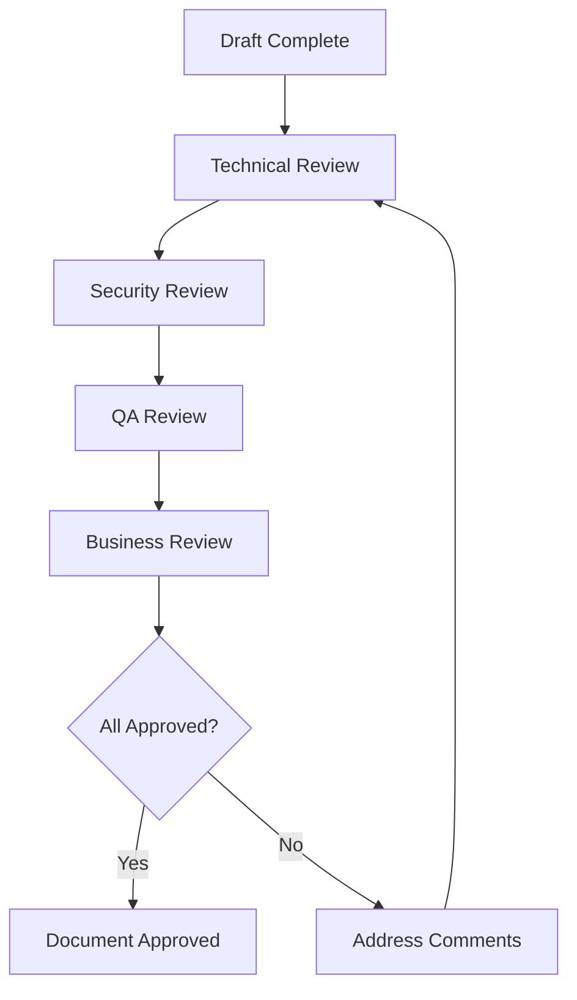
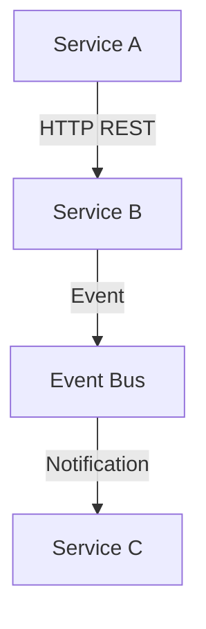
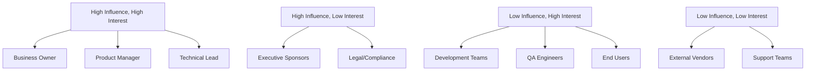

# Part00 - Document Information - Thông Tin Tài Liệu

## Cấu trúc Part00

```
Part00_Document_Information/
├── 00.1_Title_Page.md
├── 00.2_Version_History.md  
├── 00.3_Approval_Sign_Off.md
├── 00.4_Document_Metadata.md
└── 00.5_Glossary_Of_Terms.md
```

---

## **Part00 - 00.1_Title_Page - Trang Tiêu Đề**

**References**: Link to BRD.md Section 24, Product-Sampling-Vision-and-Strategy Document.md Section 1

**Mục đích:** Cung cấp trang tiêu đề và metadata high-level cho tài liệu SRS, xác định rõ phiên bản và thông tin liên hệ.

**Ý nghĩa:** Giúp xác định rõ version, authors, và traceability cho toàn bộ SRS, hỗ trợ audit và collaboration giữa các teams trong quá trình phát triển microservices.

**Cách làm:** Tổng hợp từ BRD và Vision Document, sử dụng markdown với tables cho document control và contact information.

**Nội dung cần có:**

# Software Requirements Specification (SRS)
## PSP - Product Sampling Platform

### Version 2.0 - Microservices Architecture

---

**Document Title**: Software Requirements Specification - PSP Platform  
**Project Name**: PSP - Product Sampling Platform  
**Project Code**: PSP-2025  

**Document Version**: 2.0  
**Document Date**: October 20, 2025  
**Document Status**: Draft - In Review  

**Target System**: Microservices Platform cho Product Sampling và Data Collection  
**Architecture**: Event-driven Microservices trên Kubernetes  

### Business Context

PSP là một giải pháp tối ưu hóa việc phân phối sản phẩm mẫu giá thấp (~1 USD hoặc ít hơn) để thu thập dữ liệu khách hàng chất lượng cao, giảm chi phí logistics, chống gian lận và tăng ROI cho các thương hiệu FMCG.

### Technical Overview

- **Architecture**: 7 independent microservices với event-driven communication
- **Tech Stack**: Node.js 18+, TypeScript 5+, PostgreSQL 15+, MongoDB 7+, Redis 7+
- **Infrastructure**: Kubernetes, Docker, Service Mesh (Istio), API Gateway (Kong)
- **Deployment**: AWS/GCP cloud với CI/CD per service
- **Features**: 14 tính năng phân loại Core/Operational/Advanced/Intelligent

### Team Information

**Document Owner**: Product Management Team  
**Technical Lead**: Architecture Team  
**Primary Stakeholders**: Development Teams (3), QA Team, DevOps Team

**Tài liệu tham khảo:**
* Đầu vào từ: BRD.md Section 24, Product-Sampling-Vision-and-Strategy Document.md
* Thể hiện yêu cầu: All features trong System_Feature_Tree.md
* Kết nối với: Part01_Introduction, Part02_Overall_Description

**Mục đích của node này:** Xác định metadata cơ bản và context cho SRS document.

---

## **Part00 - 00.2_Version_History - Lịch Sử Phiên Bản**

**References**: Link to BRD.md change control, System_Feature_Tree.md version updates

**Mục đích:** Theo dõi lịch sử thay đổi của tài liệu SRS, đảm bảo traceability và version control.

**Ý nghĩa:** Quan trọng cho audit compliance, change management, và synchronization giữa multiple development teams làm việc song song.

**Cách làm:** Duy trì change log với semantic versioning, tích hợp với Git commits và change request process.

**Nội dung cần có:**

### Version History Table

| Version | Date | Author | Change Description | Impact |
|---------|------|--------|-------------------|--------|
| **2.0** | 2025-10-20 | Technical Writer | Complete rewrite cho microservices architecture. Added 7 services: Campaign Management, Identity, Redemption, Analytics, Notification, Fraud, Intelligence | Major - Architecture change |
| **1.5** | 2025-10-15 | Product Manager | Added Intelligence Service requirements (A/B Testing, Recommendation Engine, Advanced Reporting) | Minor - Feature addition |
| **1.4** | 2025-10-10 | Technical Lead | Updated database design cho polyglot persistence (PostgreSQL + MongoDB + Redis) | Minor - Database update |
| **1.3** | 2025-10-05 | DevOps Lead | Added Kubernetes deployment và service mesh (Istio) requirements | Minor - Infrastructure |
| **1.2** | 2025-09-30 | Security Lead | Added Fraud Service requirements và GDPR/PDPA compliance | Minor - Security enhancement |
| **1.1** | 2025-09-25 | Business Owner | Updated business requirements, added User Portal và advanced analytics | Minor - Business update |
| **1.0** | 2025-09-15 | Product Team | Initial version based on BRD v1.0, monolithic architecture | Major - Initial release |

### Change Approval Matrix

| Version | Business Owner | Product Manager | Technical Lead | QA Lead | DevOps Lead | Security Lead |
|---------|---------------|-----------------|----------------|---------|-------------|---------------|
| **2.0** | ✅ Approved | ✅ Approved | ✅ Approved | 🔄 Reviewing | ✅ Approved | 🔄 Reviewing |
| **1.5** | ✅ Approved | ✅ Approved | ✅ Approved | ✅ Approved | ✅ Approved | ✅ Approved |

### Version Control Information

**Repository**: `git@psp.internal:platform/srs-documentation.git`  
**Branch Strategy**: `main` (stable), `develop` (active development)  
**Review Process**: Pull Request với minimum 2 approvers  
**Release Cycle**: Monthly major versions, bi-weekly minor updates  

**Tài liệu tham khảo:**
* Đầu vào từ: BRD.md change control section, Git commit history
* Thể hiện yêu cầu: Change management process
* Kết nối với: Part00.3_Approval_Sign_Off

**Mục đích của node này:** Duy trì version control và change history cho SRS.

---

## **Part00 - 00.3_Approval_Sign_Off - Phê Duyệt Tài Liệu**

**References**: Link to BRD.md Section 20, Access_Control_Tree_Grok.md stakeholder roles

**Mục đích:** Đảm bảo formal approval của SRS từ tất cả key stakeholders trước khi implementation.

**Ý nghĩa:** Critical cho risk management, legal compliance, và ensuring alignment giữa business và technical requirements.

**Cách làm:** Structured approval workflow với clear roles và responsibilities, digital signatures tracking.

**Nội dung cần có:**

### Current Document Approval Status

**Document Version**: 2.0  
**Approval Date**: [To be determined]  
**Overall Status**: 🔄 **IN REVIEW**

### Stakeholder Sign-Off Matrix

| Role | Name | Department | Signature | Date | Status | Comments |
|------|------|------------|-----------|------|--------|----------|
| **Business Owner** | [TBD] | Business Strategy | _________ | _____ | 🔄 Pending | Final business approval |
| **Product Manager** | [TBD] | Product Management | _________ | _____ | ✅ Approved | Requirements validated |
| **Technical Lead** | [TBD] | Engineering | _________ | _____ | ✅ Approved | Architecture reviewed |
| **QA Lead** | [TBD] | Quality Assurance | _________ | _____ | 🔄 Reviewing | Testability assessment |
| **DevOps Lead** | [TBD] | Infrastructure | _________ | _____ | ✅ Approved | Deployment strategy OK |
| **Security Lead** | [TBD] | Information Security | _________ | _____ | 🔄 Reviewing | Security requirements review |
| **Data Protection Officer** | [TBD] | Legal/Compliance | _________ | _____ | 🔄 Pending | GDPR/PDPA compliance |

### Approval Workflow



### Sign-Off Requirements

1. **Technical Approval**: Architecture feasibility, technology choices, integration complexity
2. **Security Approval**: Security requirements, compliance standards, risk assessment  
3. **Business Approval**: Budget alignment, timeline acceptance, business value validation
4. **QA Approval**: Testability, acceptance criteria clarity, quality gates definition

### Escalation Process

- **Level 1**: Department leads discussion cho minor issues
- **Level 2**: Cross-department steering committee cho major concerns  
- **Level 3**: Executive leadership cho business-critical decisions

**Tài liệu tham khảo:**
* Đầu vào từ: BRD.md approval requirements, stakeholder analysis
* Thể hiện yêu cầu: Governance và approval process
* Kết nối với: Part00.2_Version_History, Part16_Acceptance_Criteria

**Mục đích của node này:** Formalize approval process và ensure stakeholder alignment.

---

## **Part00 - 00.4_Document_Metadata - Metadata Tài Liệu**

**References**: Link to STANDARD_PROMT.md formatting rules, SRS_STRUCTURE.md organization

**Mục đích:** Cung cấp technical metadata về document structure, formatting standards, và maintenance procedures.

**Ý nghĩa:** Đảm bảo consistency, maintainability, và collaboration efficiency cho large technical documentation.

**Cách làm:** Define document structure, naming conventions, update procedures, và quality standards.

**Nội dung cần có:**

### Document Structure

**Total Parts**: 16 (Part00 → Part15)  
**Total Nodes**: ~320 nodes across all parts  
**File Format**: Markdown (.md) với Mermaid diagrams  
**Organization**: Hierarchical structure (PartXX → XX.Y → XX.Y.Z)

### Naming Conventions

**File Naming Pattern**:
```
PSP_SRS_V2/
├── PartXX_Section_Name/
│   ├── XX.Y_Node_Name.md
│   └── XX.Y.Z_Sub_Node_Name.md
```

**Title Format Example**:
```markdown
## **Part07 - 07.3.1_Campaigns_Table - Bảng Campaigns**
```

**ID Format**: Hierarchical IDs (FR-001, NFR-001, US-001.1)

### Content Standards

**Language Usage**:
- **Technical terms**: English (Campaign, Barcode, Authentication, Microservices)
- **Descriptions**: Tiếng Việt for clarity
- **Code examples**: English (JSON schemas, SQL queries)
- **Diagrams**: Mermaid syntax for flowcharts/ERD

**Required Elements per Node**:
1. **References** - Cross-references to other documents/sections
2. **Mục đích** - Purpose of the node
3. **Ý nghĩa** - Business/technical significance  
4. **Cách làm** - High-level approach
5. **Nội dung cần có** - Main content with IDs và examples
6. **Tài liệu tham khảo** - Input sources và connections

### Maintenance Procedures

**Update Frequency**: 
- **Major versions**: Monthly (architecture changes)
- **Minor versions**: Bi-weekly (feature updates)
- **Patch versions**: As needed (bug fixes, clarifications)

**Quality Checks**:
- Cross-reference validation
- ID consistency verification  
- Mermaid diagram rendering
- Markdown formatting compliance

### Document Statistics

**Current Statistics** (Version 2.0):
- **Services Documented**: 7 microservices
- **Features Covered**: 14 functional features
- **User Stories**: 50+ user stories with acceptance criteria
- **API Endpoints**: 100+ endpoints across services
- **Database Tables**: 25+ tables với ERD diagrams

**Tài liệu tham khảo:**
* Đầu vào từ: STANDARD_PROMT.md formatting rules, SRS_STRUCTURE.md
* Thể hiện yêu cầu: Documentation standards và maintenance
* Kết nối với: All Parts - metadata applies globally

**Mục đích của node này:** Define technical standards cho SRS documentation.

---

## **Part00 - 00.5_Glossary_Of_Terms - Từ Điển Thuật Ngữ**

**References**: Link to BRD.md glossary, System_Feature_Tree.md terminology

**Mục đích:** Cung cấp định nghĩa chính xác và consistent cho tất cả technical và business terms sử dụng trong SRS.

**Ý nghĩa:** Critical cho clear communication giữa multiple stakeholders và teams, đặc biệt quan trọng trong microservices environment với complex terminology.

**Cách làm:** Tổng hợp terminology từ BRD, feature tree, và industry standards. Organize theo alphabetical order với cross-references.

**Nội dung cần có:**

### Core Business Terms

| Term | Definition | Context |
|------|------------|---------|
| **Campaign** | Chương trình sampling được tạo bởi Brand Admin để phân phối product samples | Core business entity |
| **Barcode** | Mã unique (QR/Code128/DataMatrix) được issued cho users để claim samples | Primary identification method |
| **Redemption** | Hành động sử dụng barcode tại POS để claim product sample | Core business transaction |
| **Brand Admin** | User role quản lý campaigns, users, và settings của brand riêng | RBAC role definition |
| **Sampling** | Quá trình phân phối product samples để thu thập customer data | Business model foundation |
| **OTP** | One-Time Password cho email/phone verification | Security mechanism |

### Technical Architecture Terms

| Term | Definition | Context |
|------|------------|---------|
| **Microservices** | Kiến trúc software với nhiều services độc lập, loosely coupled | Architecture pattern |
| **Service Mesh** | Infrastructure layer (Istio) quản lý service-to-service communication | Infrastructure component |
| **Event Bus** | Message broker (RabbitMQ/Kafka) cho asynchronous event-driven communication | Integration pattern |
| **Polyglot Persistence** | Sử dụng nhiều loại database khác nhau cho different services | Data strategy |
| **CQRS** | Command Query Responsibility Segregation - pattern tách read/write operations | Database pattern |
| **API Gateway** | Kong gateway quản lý external API access và routing | Infrastructure component |

### Service-Specific Terms

| Term | Definition | Context |
|------|------------|---------|
| **Campaign Management Service** | Service quản lý campaign lifecycle, barcode pools, và ads formats | Core service |
| **Identity Service** | Service xử lý authentication, authorization, và user management | Core service |
| **Redemption Service** | Service xử lý barcode redemption tại POS locations | Operational service |
| **Analytics Service** | Service thu thập và phân tích campaign performance data | Operational service |
| **Fraud Service** | Service phát hiện và prevent fraudulent activities | Advanced service |
| **Intelligence Service** | Service cung cấp A/B testing và recommendation capabilities | Intelligent service |

### Advanced Features Terms

| Term | Definition | Context |
|------|------------|---------|
| **Fraud Score** | ML-generated score (0-100) indicating fraud likelihood của user activity | AI/ML feature |
| **A/B Test** | Experiment comparing campaign variants để optimize performance | Intelligence feature |
| **Recommendation Engine** | ML-generated campaign suggestions cho users dựa trên preferences | Intelligence feature |
| **Ads Format** | Templates cho campaign assets (landing pages, banners, emails) | Content management |
| **User Portal** | PWA interface cho Customer Account để manage barcodes và settings | User interface |

### Compliance & Security Terms

| Term | Definition | Context |
|------|------------|---------|
| **RBAC** | Role-Based Access Control với 6 defined roles | Security model |
| **GDPR** | General Data Protection Regulation - EU privacy compliance | Legal requirement |
| **PDPA** | Personal Data Protection Act - Vietnam privacy compliance | Legal requirement |
| **JWT** | JSON Web Token cho secure authentication | Security mechanism |
| **mTLS** | Mutual TLS cho secure service-to-service communication | Security protocol |

### Infrastructure Terms

| Term | Definition | Context |
|------|------------|---------|
| **Kubernetes** | Container orchestration platform cho service deployment | Infrastructure platform |
| **Docker** | Containerization technology cho service packaging | Deployment technology |
| **Istio** | Service mesh implementation cho traffic management | Infrastructure component |
| **Prometheus** | Monitoring và alerting system cho infrastructure | Observability tool |
| **Grafana** | Dashboard và visualization platform cho metrics | Observability tool |
| **Jaeger** | Distributed tracing system cho microservices | Observability tool |

### Abbreviations & Acronyms

| Acronym | Full Form | Usage Context |
|---------|-----------|---------------|
| **PSP** | Product Sampling Platform | Project name |
| **SRS** | Software Requirements Specification | Document type |
| **BRD** | Business Requirements Document | Related document |
| **API** | Application Programming Interface | Technical interface |
| **POS** | Point of Sale | Business location |
| **CRM** | Customer Relationship Management | External system |
| **PWA** | Progressive Web App | Technology type |
| **ERD** | Entity Relationship Diagram | Documentation type |

**Tài liệu tham khảo:**
* Đầu vào từ: BRD.md glossary, System_Feature_Tree.md, industry standards
* Thể hiện yêu cầu: Terminology consistency across all requirements
* Kết nối với: All Parts - terms used throughout SRS

**Mục đích của node này:** Ensure consistent terminology understanding across all stakeholders.

---

**Assumptions/Constraints:**
- Assumes all stakeholders có access đến referenced documents (BRD, System Feature Tree)
- Must comply với company documentation standards
- Language mixing (English technical terms + Vietnamese explanations) must be consistent
- Document must be maintainable by multiple team members

**Dependencies/Risks:**
- Dependencies: Depends on BRD completion, System Feature Tree finalization
- Risks: Risk of terminology inconsistency → Mitigation: Regular review cycles
- Risk: Document becomes outdated → Mitigation: Automated cross-reference checking

**Acceptance Criteria/Testable Items:**
- All technical terms must have clear definitions
- Cross-references must be valid và up-to-date  
- Document structure must follow STANDARD_PROMT.md conventions
- Version history must be complete và accurate

**Approval Sign-Off**:
| Role | Name | Signature | Date |
|------|------|-----------|------|
| PM | [TBD] | - | - |
| Tech Lead | [TBD] | - | - |
| Documentation Lead | [TBD] | - | - |

# Part01 - Introduction - Giới Thiệu

## Cấu trúc Part01

```
Part01_Introduction/
├── 01.1_Purpose_Of_Document.md
├── 01.2_Project_Scope.md
├── 01.3_Intended_Audience.md
├── 01.4_Product_Overview.md
├── 01.5_Stakeholders.md
├── 01.6_Definitions_And_Acronyms.md
├── 01.7_References.md
└── 01.8_Document_Conventions.md
```

---

## **Part01 - 01.1_Purpose_Of_Document - Mục Đích Tài Liệu**

**References**: Link to BRD.md Section 19.3, Product-Sampling-Vision-and-Strategy Document.md Section 1

**Mục đích:** Xác định rõ mục đích và phạm vi của tài liệu SRS, giải thích tại sao document này cần thiết cho việc phát triển PSP Platform.

**Ý nghĩa:** Đảm bảo tất cả stakeholders hiểu rõ vai trò và tầm quan trọng của SRS trong việc define requirements cho microservices architecture, làm foundation cho development và testing.

**Cách làm:** Tổng hợp business context từ BRD và Vision Document, focus vào technical requirements và development needs.

**Nội dung cần có:**

### Mục Đích Chính

Tài liệu Software Requirements Specification (SRS) này được tạo để:

1. **Define Technical Requirements**: Cung cấp đặc tả kỹ thuật chi tiết cho PSP - Product Sampling Platform, bao gồm 7 microservices độc lập và các tính năng liên quan.

2. **Guide Development Process**: Làm blueprint cho development teams để implement platform theo microservices architecture với event-driven communication.

3. **Ensure Quality Standards**: Đặt ra acceptance criteria và quality gates cho từng service để đảm bảo system reliability, scalability và maintainability.

4. **Facilitate Collaboration**: Tạo common understanding giữa business stakeholders, development teams, QA, DevOps, và các bộ phận liên quan.

5. **Support Project Management**: Cung cấp foundation cho estimation, planning, và tracking progress của 14 functional features across multiple services.

### Business Context

PSP Platform là giải pháp tối ưu hóa việc phân phối sản phẩm mẫu giá thấp (~1 USD hoặc ít hơn) để:
- Thu thập dữ liệu khách hàng chất lượng cao
- Giảm chi phí logistics 
- Chống gian lận
- Tăng ROI cho các thương hiệu FMCG

### Technical Context

Document này focus vào:
- **Microservices Architecture**: 7 independent services với polyglot persistence
- **Event-Driven Communication**: Asynchronous messaging qua RabbitMQ/Kafka
- **Cloud-Native Deployment**: Kubernetes trên AWS/GCP với service mesh (Istio)
- **API-First Design**: RESTful APIs với OpenAPI specifications
- **Data Strategy**: PostgreSQL cho transactional data, MongoDB cho analytics, Redis cho caching

### Scope Của Document

**Bao gồm**:
- Functional requirements cho 14 features
- Non-functional requirements (performance, security, scalability)
- System architecture và design patterns
- Database design và API specifications
- UI/UX requirements và user experience flows
- Security, compliance (GDPR/PDPA), và testing strategies

**Không bao gồm**:
- Implementation code details
- Deployment scripts và infrastructure setup commands
- Business processes bên ngoài platform
- Third-party integration implementations (chỉ specifications)

**Tài liệu tham khảo:**
* Đầu vào từ: BRD.md Section 19.3, Product-Sampling-Vision-and-Strategy Document.md
* Thể hiện yêu cầu: All functional requirements trong System_Feature_Tree.md
* Kết nối với: Part01.2_Project_Scope, Part01.4_Product_Overview

**Mục đích của node này:** Establish clear stakeholder management và communication framework.

---

## **Part01 - 01.6_Definitions_And_Acronyms - Định Nghĩa Và Từ Viết Tắt**

**References**: Link to BRD.md Section 21, System_Feature_Tree.md glossary

**Mục đích:** Cung cấp definitions cho key terms và acronyms sử dụng trong SRS để đảm bảo consistent understanding across all stakeholders.

**Ý nghĩa:** Prevent miscommunication và confusion, đặc biệt quan trọng trong microservices environment với complex terminology.

**Cách làm:** Tổng hợp terminology từ BRD, System Feature Tree, và industry standards. Organize theo alphabetical order để dễ reference.

**Nội dung cần có:**

### Key Business Terms

| Term | Definition | Usage Context |
|------|------------|---------------|
| **Campaign** | Chương trình sampling được tạo bởi Brand Admin để phân phối product samples với specific target audience và duration | Core business entity, central to all operations |
| **Barcode** | Mã unique (QR/Code128/DataMatrix) được issued cho users để claim product samples tại retail locations | Primary identification method cho sample redemption |
| **Redemption** | Hành động sử dụng barcode tại POS để claim actual product sample | Core business transaction that generates revenue |
| **Sampling** | Quá trình phân phối small product samples để encourage full product purchase | Business model foundation |
| **Brand Admin** | User với administrative privileges để manage campaigns, users, và settings cho specific brand | Primary platform user role |
| **Customer Account** | Registered user với login credentials có thể claim multiple campaigns và track history | Authenticated end user |
| **POS Staff** | Staff tại retail locations responsible for processing barcode redemptions | Operational user role |

### Technical Architecture Terms

| Term | Definition | Usage Context |
|------|------------|---------------|
| **Microservices** | Architectural pattern với multiple independent services, each với own database và deployment | Core architecture principle |
| **Service Mesh** | Infrastructure layer (Istio) quản lý service-to-service communication với traffic management và security | Infrastructure component |
| **Event Bus** | Message broker (RabbitMQ/Kafka) enabling asynchronous, event-driven communication between services | Integration pattern |
| **API Gateway** | Kong gateway làm single entry point cho external API access với routing, authentication, rate limiting | Infrastructure component |
| **Polyglot Persistence** | Strategy sử dụng different database technologies cho different services based on data characteristics | Data architecture pattern |
| **CQRS** | Command Query Responsibility Segregation - pattern separating read và write operations | Database access pattern |

### Service-Specific Terms

| Term | Definition | Usage Context |
|------|------------|---------------|
| **Campaign Management Service** | Microservice responsible for campaign lifecycle, barcode pools, và ads formats management | Core service |
| **Identity Service** | Microservice handling authentication, authorization, user management, và RBAC | Core service |
| **Redemption Service** | Microservice processing barcode redemptions với online/offline support | Operational service |
| **Analytics Service** | Microservice collecting, processing, và presenting campaign performance data | Operational service |
| **Notification Service** | Microservice handling OTP verification, SMS, email, push notifications | Supporting service |
| **Fraud Service** | Microservice implementing ML-based fraud detection với rules engine | Advanced service |
| **Intelligence Service** | Microservice providing A/B testing, recommendations, advanced reporting capabilities | Intelligence service |

### Advanced Feature Terms

| Term | Definition | Usage Context |
|------|------------|---------------|
| **Fraud Score** | ML-generated numerical score (0-100) indicating likelihood of fraudulent user activity | AI/ML feature |
| **A/B Test** | Controlled experiment comparing two campaign variants để optimize performance metrics | Intelligence feature |
| **Recommendation Engine** | ML system generating personalized campaign suggestions based on user preferences và behavior | Intelligence feature |
| **Ads Format** | Predefined templates cho campaign assets including landing pages, banners, emails | Content management |
| **User Portal** | Progressive Web App interface cho Customer Account users để manage barcodes và settings | User interface |
| **OTP** | One-Time Password sent via SMS/email cho user verification và data quality assurance | Security mechanism |

### Technical Acronyms

| Acronym | Full Form | Definition | Usage Context |
|---------|-----------|------------|---------------|
| **PSP** | Product Sampling Platform | Official project name và system identifier | Project naming |
| **SRS** | Software Requirements Specification | This document type defining technical requirements | Documentation |
| **BRD** | Business Requirements Document | Related document defining business requirements | Documentation |
| **API** | Application Programming Interface | Technical interface enabling service communication | Technical integration |
| **REST** | Representational State Transfer | Architectural style cho web services design | API design |
| **JWT** | JSON Web Token | Token format cho secure authentication between services | Security mechanism |
| **RBAC** | Role-Based Access Control | Security model với 6 defined user roles | Security framework |
| **POS** | Point of Sale | Retail location where barcode redemption occurs | Business location |
| **CRM** | Customer Relationship Management | External systems receiving customer data exports | External integration |

### Infrastructure Acronyms

| Acronym | Full Form | Definition | Usage Context |
|---------|-----------|------------|---------------|
| **K8s** | Kubernetes | Container orchestration platform cho service deployment | Infrastructure platform |
| **mTLS** | Mutual Transport Layer Security | Protocol cho secure service-to-service communication | Security protocol |
| **CI/CD** | Continuous Integration/Continuous Deployment | Automated pipeline cho code integration và deployment | Development process |
| **PWA** | Progressive Web App | Web application technology cho User Portal implementation | Frontend technology |
| **ERD** | Entity Relationship Diagram | Database design visualization tool | Documentation type |
| **APM** | Application Performance Monitoring | Tools cho monitoring application performance | Operational tool |

### Compliance & Legal Terms

| Term | Definition | Usage Context |
|------|------------|---------------|
| **GDPR** | General Data Protection Regulation - EU privacy law affecting data collection và processing | Legal compliance requirement |
| **PDPA** | Personal Data Protection Act - Vietnam privacy law governing personal data handling | Legal compliance requirement |
| **PII** | Personally Identifiable Information - data that can identify specific individuals | Data protection context |
| **Data Subject** | Individual whose personal data is being processed by the system | GDPR terminology |
| **Consent** | Explicit permission from users cho data collection và processing activities | Legal requirement |
| **Data Controller** | Entity determining purposes và means of personal data processing | Legal responsibility |

### Measurement & Metrics Terms

| Term | Definition | Usage Context |
|------|------------|---------------|
| **Conversion Rate** | Percentage of users completing desired action (registration → redemption) | Analytics metric |
| **Fraud Rate** | Percentage of detected fraudulent activities out of total user registrations | Security metric |
| **API Latency** | Time taken cho API responses, measured in milliseconds | Performance metric |
| **Uptime** | Percentage of time system is operational và accessible | Reliability metric |
| **Throughput** | Number of transactions processed per unit time | Performance metric |
| **MAU** | Monthly Active Users - users who engage với platform within a month | Business metric |

### Development Terms

| Term | Definition | Usage Context |
|------|------------|---------------|
| **User Story** | Short description of feature from user's perspective với acceptance criteria | Development requirement |
| **Epic** | Large body of work broken down into smaller user stories | Project planning |
| **Sprint** | Fixed time period (usually 2 weeks) cho development iteration | Agile methodology |
| **Backlog** | Prioritized list of features và requirements awaiting implementation | Project management |
| **Definition of Done** | Shared understanding of work completion criteria | Quality standard |
| **Technical Debt** | Future cost of additional rework caused by choosing quick solution instead of better approach | Code quality concept |

**Tài liệu tham khảo:**
* Đầu vào từ: BRD.md Section 21, System_Feature_Tree.md glossary, industry standards
* Thể hiện yêu cầu: Terminology consistency requirements
* Kết nối với: Part00.5_Glossary_Of_Terms, All technical sections

**Mục đích của node này:** Ensure consistent terminology understanding across stakeholders.

---

## **Part01 - 01.7_References - Tài Liệu Tham Khảo**

**References**: Link to all related documents và external standards

**Mục đích:** Provide comprehensive list của all documents, standards, và resources referenced trong SRS để ensure traceability và enable deeper research.

**Ý nghĩa:** Critical cho audit compliance, knowledge management, và ensuring all stakeholders have access to complete information sources.

**Cách làm:** Categorize references theo type và importance, provide version information và access details.

**Nội dung cần có:**

### Internal Project Documents

#### Primary Requirements Documents
| Document | Version | Date | Location | Description |
|----------|---------|------|----------|-------------|
| **BRD.md** | 2.0 | 2025-10-20 | Project Repository | Business Requirements Document - comprehensive business needs và scope |
| **System_Feature_Tree.md** | 2.0 | 2025-10-20 | Project Repository | Complete feature breakdown với 14 functional features across 7 services |
| **Access_Control_Tree_Grok.md** | 2.2 | 2025-10-16 | Project Repository | RBAC definitions với 6 user roles và permissions matrix |
| **Product-Sampling-Vision-and-Strategy Document.md** | 1.0 | 2025-10-20 | Project Repository | Long-term vision và strategic roadmap |
| **STANDARD_PROMT.md** | Latest | 2025-10-20 | Project Repository | Documentation standards và formatting rules |

#### Supporting Documents
| Document | Version | Status | Description |
|----------|---------|--------|-------------|
| **Problem.md** | Referenced | Missing | Problem statement và solution overview (mentioned in BRD) |
| **SRS_STRUCTURE.md** | 2.0 | Available | Complete SRS structure với 16 parts và ~320 nodes |
| **02-SRS-V2.md** | Referenced | In Development | This document - comprehensive technical requirements |

#### Technical Specifications (To Be Created)
- API Specifications (OpenAPI 3.0) per service
- Database Schema Documentation với ERD diagrams
- UI/UX Wireframes và component specifications
- Security Architecture Documentation
- Deployment Guide với Kubernetes manifests

### External Standards & Frameworks

#### Architecture Standards
| Standard | Version | Authority | Relevance |
|----------|---------|-----------|-----------|
| **Microservices Patterns** | 2nd Edition | Martin Fowler | Architecture design principles |
| **Domain-Driven Design** | Original | Eric Evans | Service boundary definition |
| **The Twelve-Factor App** | Latest | Heroku | Cloud-native application methodology |
| **OpenAPI Specification** | 3.0.3 | OpenAPI Initiative | API documentation standard |
| **JSON Schema** | Draft 7 | JSON Schema Org | Data validation specifications |

#### Technology Documentation
| Technology | Version | Documentation URL | Usage Context |
|------------|---------|-------------------|---------------|
| **Kubernetes** | 1.28+ | https://kubernetes.io/docs | Container orchestration platform |
| **Istio** | 1.19+ | https://istio.io/latest/docs | Service mesh implementation |
| **Node.js** | 18+ LTS | https://nodejs.org/docs | Backend runtime environment |
| **TypeScript** | 5+ | https://www.typescriptlang.org/docs | Programming language |
| **PostgreSQL** | 15+ | https://www.postgresql.org/docs | Primary database system |
| **MongoDB** | 7+ | https://docs.mongodb.com | Analytics database |
| **Redis** | 7+ | https://redis.io/docs | Caching và queue system |
| **RabbitMQ** | 3.12+ | https://www.rabbitmq.com/docs | Message broker |

#### Security & Compliance Standards
| Standard | Version | Authority | Applicability |
|----------|---------|-----------|---------------|
| **GDPR** | Current | European Union | Data protection compliance |
| **PDPA (Vietnam)** | 2023 | Vietnam Government | Local data protection law |
| **OWASP Top 10** | 2021 | OWASP Foundation | Web application security |
| **JWT RFC** | RFC 7519 | IETF | Token-based authentication |
| **OAuth 2.0** | RFC 6749 | IETF | Authorization framework |
| **TLS 1.3** | RFC 8446 | IETF | Transport security |

#### Development Standards
| Standard | Authority | Application |
|----------|-----------|-------------|
| **Semantic Versioning** | SemVer.org | Version numbering cho services |
| **Conventional Commits** | ConventionalCommits.org | Git commit message format |
| **REST API Design** | REST-API-Design-Guide | API endpoint conventions |
| **TypeScript Style Guide** | Google/Airbnb | Code formatting standards |

### Third-Party Service Documentation

#### Communication Services
| Service | Documentation | Integration Type |
|---------|---------------|------------------|
| **Twilio SMS API** | https://www.twilio.com/docs/sms | SMS notification delivery |
| **SendGrid Email API** | https://docs.sendgrid.com | Email notification delivery |
| **Firebase Cloud Messaging** | https://firebase.google.com/docs/cloud-messaging | Push notification delivery |

#### CRM Integration
| Service | Documentation | Integration Scope |
|---------|---------------|-------------------|
| **HubSpot API** | https://developers.hubspot.com | Customer data synchronization |
| **Salesforce API** | https://developer.salesforce.com | Customer data synchronization |

#### Cloud Infrastructure
| Service | Documentation | Usage Context |
|---------|---------------|---------------|
| **AWS EKS** | https://docs.aws.amazon.com/eks | Kubernetes managed service |
| **AWS RDS** | https://docs.aws.amazon.com/rds | Managed PostgreSQL hosting |
| **AWS DocumentDB** | https://docs.aws.amazon.com/documentdb | MongoDB-compatible service |
| **AWS ElastiCache** | https://docs.aws.amazon.com/elasticache | Redis managed service |

### Industry Resources

#### Research & Best Practices
| Resource | Author/Organization | Relevance |
|----------|-------------------|-----------|
| **Microservices.io** | Chris Richardson | Microservices patterns và best practices |
| **Building Microservices** | Sam Newman (O'Reilly) | Service design principles |
| **Site Reliability Engineering** | Google SRE Team | Operations và reliability practices |
| **The Phoenix Project** | Gene Kim | DevOps practices và culture |

#### Market Research
| Report | Organization | Date | Key Insights |
|--------|--------------|------|--------------|
| **FMCG Digital Transformation** | McKinsey & Company | 2024 | Industry digitization trends |
| **Sampling Marketing Effectiveness** | Nielsen | 2024 | Sampling campaign ROI analysis |
| **Southeast Asia E-commerce** | Google/Temasek | 2024 | Regional market dynamics |

### Legal & Regulatory References

#### Privacy Regulations
| Regulation | Jurisdiction | Key Requirements |
|------------|--------------|------------------|
| **GDPR Articles 6, 7, 17** | European Union | Lawful basis, consent, right to erasure |
| **PDPA Section 4, 5** | Vietnam | Personal data processing principles |
| **CCPA** | California, USA | Consumer privacy rights (future consideration) |

#### Industry Standards
| Standard | Scope | Compliance Requirement |
|----------|-------|------------------------|
| **ISO 27001** | Information Security Management | Security framework reference |
| **PCI DSS** | Payment Card Industry | Data security (if payment features added) |
| **SOC 2 Type II** | Service Organization Controls | Audit framework reference |

### Version Control & Change Management

#### Document Versioning
- All internal documents follow semantic versioning (Major.Minor.Patch)
- Changes tracked through Git commits với conventional commit messages
- Regular review cycles: monthly minor updates, quarterly major reviews

#### External Reference Updates
- Technology documentation reviewed quarterly cho version updates
- Compliance standards monitored for regulatory changes
- Industry best practices updated based on community feedback

#### Access Management
| Document Type | Access Level | Update Authority |
|---------------|--------------|------------------|
| **Internal Project Docs** | Team Members | Product Manager, Technical Lead |
| **External Standards** | Public | Reference Only |
| **Third-party APIs** | Account-based | Integration Team |
| **Compliance Docs** | Legal Team | Compliance Officer |

**Tài liệu tham khảo:**
* Đầu vào từ: All referenced documents và standards listed above
* Thể hiện yêu cầu: Documentation completeness và traceability
* Kết nối với: All SRS sections, external compliance requirements

**Mục đích của node này:** Provide comprehensive reference framework cho SRS documentation.

---

## **Part01 - 01.8_Document_Conventions - Quy Ước Tài Liệu**

**References**: Link to STANDARD_PROMT.md formatting rules

**Mục đích:** Define formatting conventions, notation standards, và documentation practices sử dụng throughout SRS để ensure consistency và readability.

**Ý nghĩa:** Critical cho document maintainability, collaboration efficiency, và ensuring all team members can contribute to và understand documentation.

**Cách làm:** Establish clear rules based on STANDARD_PROMT.md, incorporating industry best practices cho technical documentation.

**Nội dung cần có:**

### Document Structure Conventions

#### File Naming Standards
```
PSP_SRS_V2/
├── PartXX_Section_Name/
│   ├── XX.Y_Node_Name.md
│   └── XX.Y.Z_Sub_Node_Name.md
```

**Naming Rules**:
- **Part Numbers**: 00-16 theo SRS_STRUCTURE.md hierarchy
- **Node IDs**: Hierarchical format (07.3.1, 07.3.1.1)
- **English Names**: PascalCase với underscores (e.g., `Campaigns_Table`)
- **File Extensions**: `.md` cho all documentation files

#### Section Title Format
```markdown
## **PartXX - XX.Y_Node_Name - Tiêu đề Tiếng Việt**
```

**Examples**:
- `## **Part07 - 07.3.1_Campaigns_Table - Bảng Campaigns**`
- `## **Part04 - 04.2.1_FR-001_Campaign_Management - Quản Lý Chiến Dịch**`

### Content Organization Standards

#### Required Section Structure
Mỗi node PHẢI có 6 thành phần theo thứ tự:

1. **References**: Cross-references to other documents/sections
2. **Mục đích**: Purpose của node trong SRS context
3. **Ý nghĩa**: Business/technical significance và stakeholder value
4. **Cách làm**: High-level approach (NOT implementation details)
5. **Nội dung cần có**: Main content với structured information
6. **Tài liệu tham khảo**: Input sources, requirements mapping, connections

#### Footer Section (Required)
```markdown
**Assumptions/Constraints:** [List assumptions và constraints]
**Dependencies/Risks:** [Dependencies và risk mitigation]
**Acceptance Criteria/Testable Items:** [Verification criteria]

**Approval Sign-Off**:
| Role | Name | Signature | Date |
|------|------|-----------|------|
| PM | [TBD] | - | - |
| Tech Lead | [TBD] | - | - |
```

### Language Usage Guidelines

#### Mixed Language Policy
- **Technical Terms**: English (Campaign, Barcode, Authentication, Microservices)
- **Descriptions**: Tiếng Việt cho clarity và team communication
- **Code Examples**: English (JSON schemas, SQL queries, API endpoints)
- **Comments**: Tiếng Việt trong code examples khi cần explain business logic

#### Examples of Proper Usage
```markdown
✅ Correct:
- **Campaign Management Service** quản lý lifecycle của campaigns
- **Authentication API** sử dụng JWT tokens cho secure access
- **Database schema** lưu trữ thông tin user preferences

❌ Incorrect:
- **Service quản lý chiến dịch** manages campaign lifecycle
- **API xác thực** uses JWT tokens for secure access
```

### Formatting Standards

#### Markdown Conventions

**Headers**:
```markdown
# Main Title (Part level)
## Section Title (Node level)
### Subsection Title
#### Detail Level
```

**Emphasis**:
```markdown
**Bold**: Important terms, service names, technical concepts
*Italic*: Emphasis, foreign terms
`Code`: Technical terms, file names, API endpoints
```

**Lists**:
```markdown
- Use hyphens cho unordered lists
1. Use numbers cho ordered lists
- **Bold labels**: Followed by description
```

**Tables**:
```markdown
| Column 1 | Column 2 | Column 3 |
|----------|----------|----------|
| Data 1   | Data 2   | Data 3   |
```

#### Code Block Standards
```json
{
  "example": "Use appropriate language identifiers",
  "format": "JSON cho data examples",
  "indentation": "2 spaces"
}
```

```sql
-- SQL examples với comments in Vietnamese
SELECT campaign_id, campaign_name
FROM campaigns
WHERE status = 'active'; -- Chỉ campaigns đang hoạt động
```

```typescript
// TypeScript interface definitions
interface Campaign {
  id: string;          // UUID cho campaign identification
  name: string;        // Tên campaign hiển thị
  status: CampaignStatus; // Enum cho campaign status
}
```

### Diagram Conventions

#### Mermaid Diagram Standards


**Diagram Types Used**:
- `graph TD`: Flow charts (top-down)
- `graph LR`: Flow charts (left-right)
- `sequenceDiagram`: Service interaction flows
- `erDiagram`: Database relationship diagrams
- `gantt`: Project timeline charts

**Naming Conventions**:
- Node names in English với descriptive labels
- Relationships labeled in English
- Colors: Blue cho services, Green cho databases, Red cho external systems

### ID và Reference Standards

#### Traceability IDs
```markdown
**Functional Requirements**: FR-001, FR-002, etc.
**Non-Functional Requirements**: NFR-001, NFR-002, etc.
**User Stories**: US-001.1, US-002.3, etc.
**Use Cases**: UC-001, UC-002, etc.
**Database Tables**: TBL-001, TBL-002, etc.
**API Endpoints**: API-001, API-002, etc.
```

#### Cross-Reference Format
```markdown
**References**: Link to BRD.md Section 2.1, System_Feature_Tree.md Section 1.2
**Kết nối với**: Part04.2.1_Campaign_Management, Part07.3.1_Campaigns_Table
```

### Quality Standards

#### Content Quality Requirements
- **Clarity**: Each sentence should be unambiguous
- **Completeness**: All required information present
- **Consistency**: Terminology usage consistent throughout
- **Traceability**: Clear connections to business requirements
- **Testability**: Requirements must be verifiable

#### Review Process
1. **Self-Review**: Author checks formatting và content completeness
2. **Peer Review**: Technical review by team member
3. **Stakeholder Review**: Business validation by Product Manager
4. **Final Approval**: Sign-off by designated authorities

#### Version Control
- Use Git cho version tracking
- Conventional commit messages: `feat:`, `fix:`, `docs:`, `refactor:`
- Branch naming: `feature/part-xx-section-name`
- Pull requests required cho all changes

### Special Notations

#### Status Indicators
- ✅ **Completed**: Implementation finished
- 🔄 **In Progress**: Currently being worked on
- ⚠️ **Pending**: Waiting for dependencies
- ❌ **Blocked**: Cannot proceed due to issues
- 🆕 **New**: Recently added features/requirements

#### Priority Levels
- 🔥 **Critical**: Must-have for MVP
- ⭐ **High**: Important for initial release
- 📊 **Medium**: Valuable but can be delayed
- 📋 **Low**: Nice-to-have features

#### Change Indicators
- 🆕 **New**: Recently added content
- 📄 **Updated**: Modified from previous version
- 🔄 **Changed**: Significant revision
- ⚠️ **Deprecated**: Will be removed in future versions

### Documentation Maintenance

#### Update Frequency
- **Daily**: During active development phases
- **Weekly**: Regular review cycles
- **Monthly**: Comprehensive review và cleanup
- **Quarterly**: Major version updates

#### Responsibility Matrix
| Document Type | Primary Owner | Review Authority |
|---------------|---------------|------------------|
| **Functional Requirements** | Product Manager | Business Owner |
| **Technical Architecture** | Technical Lead | Architecture Team |
| **API Specifications** | Development Teams | Technical Lead |
| **Database Design** | Data Architect | Technical Lead |

**Tài liệu tham khảo:**
* Đầu vào từ: STANDARD_PROMT.md formatting rules, industry documentation standards
* Thể hiện yêu cầu: Documentation quality và consistency standards
* Kết nối với: All SRS sections - conventions apply globally

**Mục đích của node này:** Ensure consistent, high-quality documentation throughout SRS.

---

**Assumptions/Constraints:**
- Assumes all team members have access to Markdown editors và Git
- Must comply with company documentation standards
- Language mixing (English + Vietnamese) must be consistent across all sections
- All diagrams must render properly in standard Markdown viewers

**Dependencies/Risks:**
- Dependencies: STANDARD_PROMT.md completion, team training on conventions
- Risks: Risk of inconsistent application → Mitigation: Regular review cycles
- Risk: Tool compatibility issues → Mitigation: Standardized toolchain

**Acceptance Criteria/Testable Items:**
- All sections must follow the 6-component structure
- Cross-references must be valid và up-to-date
- Mermaid diagrams must render correctly
- Language usage must be consistent throughout document
- All traceability IDs must be unique và properly formatted

**Approval Sign-Off**:
| Role | Name | Signature | Date |
|------|------|-----------|------|
| PM | [TBD] | - | - |
| Tech Lead | [TBD] | - | - |
| Documentation Lead | [TBD] | - | - | Establish clear purpose và context cho SRS document.

---

## **Part01 - 01.2_Project_Scope - Phạm Vi Dự Án**

**References**: Link to BRD.md Section 3, System_Feature_Tree.md overview

**Mục đích:** Định nghĩa rõ ràng phạm vi của PSP Platform project, bao gồm những gì sẽ được develop và những gì nằm ngoài scope.

**Ý nghĩa:** Critical cho project success, giúp tránh scope creep và đảm bảo expectations alignment giữa business và technical teams.

**Cách làm:** Dựa trên BRD để define business scope, kết hợp với technical architecture để xác định system boundaries.

**Nội dung cần có:**

### Project Overview

**Project Name**: PSP - Product Sampling Platform  
**Project Type**: Greenfield microservices platform development  
**Target Market**: FMCG brands muốn optimize low-value sampling campaigns  
**Expected Timeline**: 6-9 tháng development (parallel service development)

### In-Scope Features

#### 1. Core Features (6 features)
- **FR-001**: Campaign Management - Lifecycle management cho sampling campaigns
- **FR-002**: Barcode Management - Generation, import, và lifecycle tracking
- **FR-003**: User Authentication - JWT-based auth với RBAC (6 roles)
- **FR-004**: User Management - User profiles, preferences, và role assignment
- **FR-005**: OTP Verification - Email/SMS verification cho data quality
- **FR-006**: Ads Format Management - Templates và assets cho campaigns

#### 2. Operational Features (4 features)
- **FR-007**: Barcode Redemption - Online/offline redemption tại POS
- **FR-008**: Real-time Analytics - Dashboard metrics và performance tracking
- **FR-009**: CRM Integration - HubSpot/Salesforce data synchronization
- **FR-010**: Notification System - SMS, email, và push notifications

#### 3. Advanced Features (1 feature)
- **FR-011**: Fraud Detection - ML-based fraud scoring và rules engine

#### 4. Intelligence Features (3 features)
- **FR-012**: A/B Testing - Campaign experimentation và statistical analysis
- **FR-013**: Recommendation Engine - Personalized campaign suggestions
- **FR-014**: Advanced Reporting - Custom report builder với scheduled exports

### System Components In-Scope

#### 7 Microservices
1. **Campaign Management Service** - PostgreSQL database
2. **Identity Service** - PostgreSQL database với JWT token management
3. **Redemption Service** - PostgreSQL database cho transaction data
4. **Analytics Service** - MongoDB cho time-series data
5. **Notification Service** - Redis cho queue management
6. **Fraud Service** - PostgreSQL + ML model integration
7. **Intelligence Service** - MongoDB cho experiments và recommendations

#### Infrastructure Components
- **API Gateway** - Kong cho external API access
- **Service Mesh** - Istio cho inter-service communication
- **Event Bus** - RabbitMQ cho asynchronous messaging
- **Monitoring Stack** - Prometheus, Grafana, Jaeger
- **CI/CD Pipeline** - Per-service build và deployment

#### User Interfaces
- **Admin Dashboard** - React-based responsive web application
- **Landing Pages** - Mobile-first campaign pages với A/B testing
- **User Portal** - PWA cho Customer Account management
- **POS Interface** - Simple barcode redemption tool

### Out-of-Scope Items

#### Excluded Features
- ❌ E-commerce functionality (chỉ sampling, không bán hàng)
- ❌ Payment processing (no monetary transactions)
- ❌ Inventory management của actual products
- ❌ Social media posting automation (chỉ templates)
- ❌ Advanced AI/ML beyond fraud detection và recommendations
- ❌ Multi-language support (English và Vietnamese only)

#### External Dependencies
- 🔗 **Third-party Services**: Twilio (SMS), SendGrid (Email), Firebase (Push)
- 🔗 **CRM Systems**: HubSpot/Salesforce APIs (integration only)
- 🔗 **POS Systems**: Existing retailer POS (API integration only)
- 🔗 **Cloud Infrastructure**: AWS/GCP services (configuration only)

#### Business Processes Out-of-Scope
- Product manufacturing và distribution logistics
- Retailer relationship management
- Legal compliance implementation (chỉ technical compliance features)
- Customer service operations
- Financial accounting và billing

### Technical Boundaries

#### Development Scope
- **Backend Services**: Complete microservices implementation
- **Frontend Applications**: Admin dashboard, landing pages, user portal
- **API Specifications**: OpenAPI 3.0 documentation
- **Database Design**: Schema design và migration scripts
- **Testing Framework**: Unit, integration, và E2E test suites

#### Operations Scope
- **Monitoring Setup**: Application và infrastructure monitoring
- **CI/CD Configuration**: Automated build, test, deployment pipelines
- **Security Implementation**: Authentication, authorization, data protection
- **Documentation**: Technical documentation và user guides

#### Integration Scope
- **API Integrations**: REST APIs cho external services
- **Webhook Support**: Incoming webhooks từ CRM và notification services
- **Data Export**: CSV, Excel, JSON formats
- **Single Sign-On**: JWT token-based authentication

**Tài liệu tham khảo:**
* Đầu vào từ: BRD.md Section 3, System_Feature_Tree.md feature categories
* Thể hiện yêu cầu: All 14 functional requirements
* Kết nối với: Part04_Functional_Requirements, Part02.6_Out_Of_Scope

**Mục đích của node này:** Define clear project boundaries và prevent scope creep.

---

## **Part01 - 01.3_Intended_Audience - Đối Tượng Đọc**

**References**: Link to BRD.md Section 4, Access_Control_Tree_Grok.md stakeholder roles

**Mục đích:** Xác định các đối tượng sẽ sử dụng SRS document này và cách họ sẽ interact với nó.

**Ý nghĩa:** Đảm bảo document được structure phù hợp với needs của different stakeholders, từ technical implementation đến business approval.

**Cách làm:** Phân loại audience theo roles và responsibilities, define specific sections relevant cho từng group.

**Nội dung cần có:**

### Primary Audience

#### 1. Development Teams (Technical Implementation)
**Role**: Implementation của microservices và frontend components  
**Usage**: Daily reference trong development process  
**Key Sections**:
- Part04: Functional Requirements (detailed user stories)
- Part06: System Architecture (microservices design patterns)
- Part07: Database Design (schema specifications)
- Part08: API Design (endpoint specifications)
- Part13: System Testing (test case requirements)

**Specific Needs**:
- Clear acceptance criteria cho từng feature
- Technical specifications đủ chi tiết để implement
- Service boundaries và inter-service communication patterns
- Database schema và relationship definitions
- API contract specifications

#### 2. Technical Leads & Architects (Design Decisions)
**Role**: Architecture decisions và technical guidance  
**Usage**: Strategic planning và design reviews  
**Key Sections**:
- Part02: System Overview (architecture principles)
- Part06: System Architecture (comprehensive design)
- Part06B: Design Patterns (implementation patterns)
- Part05: Non-Functional Requirements (quality attributes)
- Part14: Deployment Architecture (infrastructure design)

**Specific Needs**:
- Microservices boundaries và communication patterns
- Scalability và performance requirements
- Security architecture và compliance considerations
- Deployment strategies và operational concerns

#### 3. QA Engineers (Testing Strategy)
**Role**: Test planning, execution, và quality assurance  
**Usage**: Test case development và validation criteria  
**Key Sections**:
- Part04: Functional Requirements (test scenarios)
- Part09: Use Cases (end-to-end test flows)
- Part12: Performance Testing (load test specifications)
- Part13: System Testing (test strategy và frameworks)
- Part16: Acceptance Criteria (quality gates)

**Specific Needs**:
- Testable acceptance criteria cho all features
- Integration testing scenarios across services
- Performance benchmarks và load testing requirements
- Security testing requirements

### Secondary Audience

#### 4. Product Managers (Business Alignment)
**Role**: Feature definition và business requirements validation  
**Usage**: Requirements review và change management  
**Key Sections**:
- Part01: Introduction (business context)
- Part02: System Overview (business objectives)
- Part03: User Personas (target users)
- Part04: Functional Requirements (feature specifications)
- Part10: UI/UX Design (user experience)

**Specific Needs**:
- Traceability từ business requirements đến technical implementation
- User experience flows và interface specifications
- Feature prioritization và release planning information

#### 5. DevOps Engineers (Infrastructure & Operations)
**Role**: Infrastructure setup, deployment, và monitoring  
**Usage**: Infrastructure planning và operational procedures  
**Key Sections**:
- Part06: System Architecture (infrastructure components)
- Part14: Deployment Architecture (CI/CD và infrastructure)
- Part15: Operations & Monitoring (operational procedures)
- Part05: Non-Functional Requirements (performance targets)

**Specific Needs**:
- Infrastructure requirements cho microservices deployment
- Monitoring và alerting specifications
- Backup, recovery, và disaster recovery procedures
- Scalability requirements và capacity planning

#### 6. Security & Compliance Teams (Risk Management)
**Role**: Security review và compliance validation  
**Usage**: Security assessment và audit preparation  
**Key Sections**:
- Part11: Security & Compliance (security requirements)
- Part05: Non-Functional Requirements (security attributes)
- Part07: Database Design (data protection)
- Part08: API Design (API security)

**Specific Needs**:
- Data protection và privacy requirements (GDPR/PDPA)
- Authentication và authorization specifications
- API security và rate limiting requirements
- Audit trail và compliance reporting features

### Tertiary Audience

#### 7. Business Stakeholders (Approval & Oversight)
**Role**: Project approval và high-level oversight  
**Usage**: Review for business alignment và investment decisions  
**Key Sections**:
- Part01: Introduction (project overview)
- Part02: System Overview (business value)
- Part00: Document Information (approval workflows)

**Specific Needs**:
- Business value proposition và ROI implications
- High-level timeline và resource requirements
- Risk assessment và mitigation strategies

#### 8. External Vendors & Partners (Integration)
**Role**: Third-party integration development  
**Usage**: API integration specifications  
**Key Sections**:
- Part08: API Design (external API specifications)
- Part09: Use Cases (integration scenarios)
- Part11: Security & Compliance (integration security)

**Specific Needs**:
- API contract specifications
- Authentication và authorization for external access
- Data exchange formats và protocols

### Document Usage Guidelines

#### Reading Recommendations by Role

**For Developers**:
1. Start với Part04 (Functional Requirements) cho feature understanding
2. Review Part06 (System Architecture) cho technical context
3. Deep dive vào specific service requirements in Part07-08
4. Reference Part13 (Testing) cho quality requirements

**For Architects**:
1. Begin với Part02 (System Overview) cho business context
2. Focus on Part06 (System Architecture) cho design decisions
3. Review Part06B (Design Patterns) cho implementation guidance
4. Consider Part05 (Non-Functional Requirements) cho quality attributes

**For QA Engineers**:
1. Review Part04 (Functional Requirements) cho test scenarios
2. Study Part09 (Use Cases) cho end-to-end flows
3. Plan testing strategy using Part12-13 (Testing sections)
4. Validate against acceptance criteria in Part16

**Tài liệu tham khảo:**
* Đầu vào từ: BRD.md Section 4 stakeholders, Access_Control_Tree_Grok.md roles
* Thể hiện yêu cầu: Document usability requirements
* Kết nối với: Part01.5_Stakeholders, Part00.3_Approval_Sign_Off

**Mục đích của node này:** Optimize document accessibility cho different user types.

---

## **Part01 - 01.4_Product_Overview - Tổng Quan Sản Phẩm**

**References**: Link to Product-Sampling-Vision-and-Strategy Document.md Section 2, BRD.md Section 2

**Mục đích:** Cung cấp high-level overview về PSP Platform, giải thích business model, target users, và key value propositions.

**Ý nghĩa:** Đảm bảo tất cả technical stakeholders hiểu rõ business context và objectives trước khi dive vào technical specifications.

**Cách làm:** Tổng hợp từ Vision Document và BRD, focus vào technical implications của business requirements.

**Nội dung cần có:**

### Product Vision

> "Transform product sampling from a cost center into a data-driven growth engine for FMCG brands"

PSP Platform enables brands to:
- Optimize distribution của low-value product samples (~1 USD hoặc ít hơn)
- Collect high-quality customer data through verified interactions
- Reduce logistics costs through smart targeting và fraud prevention
- Maximize ROI through data-driven insights và campaign optimization

### Business Model

#### Problem Statement
FMCG brands face 3 major challenges với traditional sampling:
1. **High Distribution Costs**: Chi phí phát cao hơn giá trị product samples
2. **Data Quality Issues**: Khách hàng spam, đăng ký ảo làm sai lệch data
3. **Lack of Insights**: Thiếu tools để measure và optimize campaign effectiveness

#### Solution Approach
**Hybrid Distribution Model**: Kết hợp digital engagement với physical redemption
- **Digital-First**: Online registration với OTP verification
- **Physical Redemption**: Barcode-based claims tại retail locations
- **Data Collection**: Verified customer information với behavioral tracking
- **Analytics-Driven**: Real-time insights để optimize campaigns

### Target Users & Personas

#### 1. Brand Administrators (Primary Users)
**Role**: Manage sampling campaigns cho FMCG brands  
**Needs**: 
- Create và manage multiple campaigns simultaneously
- Import barcode pools và track utilization
- Access detailed analytics để measure campaign performance
- Integrate customer data với existing CRM systems

**Daily Workflow**:
1. Create campaign với target demographics
2. Upload/generate barcode pools
3. Configure landing pages và ads formats
4. Monitor real-time performance metrics
5. Export data cho CRM integration

#### 2. End Customers (Volume Users)
**Role**: Claim product samples through campaigns  
**Needs**:
- Quick và easy registration process
- Mobile-friendly experience (90%+ mobile traffic)
- Clear redemption instructions
- Track sample claims và redemption status

**User Journey**:
1. Scan QR code từ campaign ads
2. Fill registration form với personal info
3. Verify email/phone qua OTP
4. Receive unique barcode
5. Redeem sample tại participating stores

#### 3. POS Staff (Operational Users)
**Role**: Process barcode redemptions tại retail locations  
**Needs**:
- Simple barcode scanning interface
- Offline capability cho network issues
- Clear redemption confirmation
- Daily reconciliation reports

#### 4. Platform Administrators (System Users)
**Role**: Manage platform operations và user accounts  
**Needs**:
- Full system administration capabilities
- Brand onboarding và management
- System monitoring và troubleshooting
- User support và fraud investigation

### Key Features Overview

#### Core Capabilities
- **Campaign Management**: End-to-end campaign lifecycle management
- **Barcode Operations**: Generation, import, tracking, và redemption
- **User Authentication**: Secure authentication với role-based access
- **Data Verification**: OTP-based verification cho data quality
- **Real-time Analytics**: Dashboard metrics và performance insights

#### Advanced Features
- **Fraud Detection**: ML-based scoring để prevent abuse
- **A/B Testing**: Campaign optimization through experimentation
- **Recommendation Engine**: Personalized campaign suggestions
- **Custom Reporting**: Flexible report builder với scheduled exports

#### Integration Capabilities
- **CRM Integration**: HubSpot, Salesforce data synchronization
- **Notification Systems**: SMS, email, push notification delivery
- **POS Integration**: API connections với retail systems
- **Third-party APIs**: Twilio, SendGrid, Firebase integration

### Value Propositions

#### For FMCG Brands
- **Cost Reduction**: 30-50% reduction trong distribution costs
- **Data Quality**: 95%+ verified customer information
- **Campaign ROI**: Measurable performance metrics và optimization
- **Scalability**: Support cho thousands của concurrent campaigns
- **Compliance**: GDPR/PDPA compliant data collection

#### For Retailers
- **Customer Traffic**: Increased foot traffic through sampling campaigns
- **Data Insights**: Customer behavior analytics
- **Simple Operations**: Easy-to-use redemption tools
- **Partner Benefits**: Revenue sharing opportunities

#### For End Customers
- **Product Discovery**: Access đến new products và brands
- **Convenience**: Mobile-first experience với quick registration
- **Transparency**: Clear redemption process và status tracking
- **Privacy Control**: Granular consent management

### Technology Differentiators

#### Microservices Architecture
- **Scalability**: Independent scaling của different services
- **Reliability**: Service isolation prevents system-wide failures
- **Flexibility**: Technology diversity across services
- **Maintainability**: Independent development và deployment

#### Event-Driven Design
- **Real-time Processing**: Immediate response đến user actions
- **Decoupling**: Loose coupling giữa services
- **Resilience**: Asynchronous processing handles load spikes
- **Auditability**: Complete event trail cho compliance

#### Data-Driven Intelligence
- **Machine Learning**: Fraud detection và recommendation algorithms
- **Analytics**: Real-time dashboards và custom reporting
- **A/B Testing**: Statistical experimentation framework
- **Predictive Insights**: Campaign performance forecasting

### Market Positioning

#### Competitive Advantages
1. **Low-Value Focus**: Specialized cho samples <$1 USD
2. **Hybrid Model**: Digital + physical integration
3. **Data Quality**: OTP verification và fraud prevention
4. **Microservices**: Modern, scalable architecture
5. **Intelligence**: Built-in AI/ML capabilities

#### Target Market Size
- **Primary**: Mid-to-large FMCG brands (100-500 brands)
- **Secondary**: Regional brands seeking digital transformation
- **Geographic**: Vietnam initially, expand to SEA region
- **Campaign Volume**: 10K-100K samples per campaign

**Tài liệu tham khảo:**
* Đầu vào từ: Product-Sampling-Vision-and-Strategy Document.md, BRD.md Section 2
* Thể hiện yêu cầu: Business value requirements
* Kết nối với: Part02.2_System_Objectives, Part03_User_Personas_And_Use_Cases

**Mục đích của node này:** Provide business context cho technical requirements.

---

## **Part01 - 01.5_Stakeholders - Các Bên Liên Quan**

**References**: Link to BRD.md Section 4, Access_Control_Tree_Grok.md Section 1

**Mục đích:** Xác định tất cả stakeholders liên quan đến PSP Platform project và define roles, responsibilities, interests của họ.

**Ý nghĩa:** Critical cho project success, đảm bảo proper communication channels và approval workflows. Helps manage expectations và resolve conflicts.

**Cách làm:** Categorize stakeholders theo level of influence và interest, define communication protocols và decision-making authority.

**Nội dung cần có:**

### Stakeholder Categorization Matrix



### Primary Stakeholders (Decision Makers)

#### 1. Business Owner
**Organization**: PSP Platform Business Unit  
**Role**: Ultimate business authority và budget approval  
**Responsibilities**:
- Final approval cho major scope changes
- Budget allocation và resource decisions
- Business strategy alignment
- ROI targets và success metrics definition

**Interests**:
- Business value delivery și profit maximization
- Market competitive advantage
- Customer satisfaction và retention
- Compliance với business objectives

**Decision Authority**: 
- ✅ Budget approval (final authority)
- ✅ Scope changes (major features)
- ✅ Timeline adjustments (business impact)
- ✅ Resource allocation (team assignments)

**Communication Frequency**: Weekly status, monthly detailed reviews

#### 2. Product Manager
**Organization**: Product Management Team  
**Role**: Product vision và feature prioritization  
**Responsibilities**:
- Feature requirements definition
- User story creation và acceptance criteria
- Product roadmap planning
- Cross-functional coordination

**Interests**:
- Feature delivery quality và timeliness
- User experience optimization
- Market requirements satisfaction
- Product-market fit achievement

**Decision Authority**:
- ✅ Feature prioritization (within approved scope)
- ✅ User experience decisions
- ✅ Requirements clarification
- ⚠️ Technical implementation approach (consultation only)

**Communication Frequency**: Daily standups, weekly planning

#### 3. Technical Lead
**Organization**: Engineering Team  
**Role**: Technical architecture và implementation oversight  
**Responsibilities**:
- System architecture design
- Technology stack selection
- Technical risk assessment
- Development team guidance

**Interests**:
- Technical excellence và code quality
- System scalability și maintainability
- Development team productivity
- Technical debt management

**Decision Authority**:
- ✅ Technology choices (within budget constraints)
- ✅ Architecture decisions
- ✅ Code quality standards
- ✅ Technical implementation approach

**Communication Frequency**: Daily technical discussions, weekly architecture reviews

### Secondary Stakeholders (Implementers)

#### 4. Development Teams (3 teams)
**Organization**: Engineering Department  
**Team Structure**:
- **Team Alpha**: Campaign Management + Identity Services
- **Team Beta**: Redemption + Analytics Services  
- **Team Gamma**: Notification + Fraud + Intelligence Services

**Responsibilities**:
- Service implementation với coding standards
- Unit testing và integration testing
- Code reviews și technical documentation
- Performance optimization

**Interests**:
- Clear requirements và specifications
- Reasonable timelines și workload distribution
- Technical growth opportunities
- Quality development environment

**Communication Channels**: Daily standups, sprint planning, retrospectives

#### 5. QA Team
**Organization**: Quality Assurance Department  
**Role**: Quality assurance và testing strategy  
**Responsibilities**:
- Test strategy development
- Test case creation và execution
- Automation framework development
- Quality metrics tracking

**Interests**:
- Testable requirements với clear acceptance criteria
- Adequate testing environments
- Test automation capabilities
- Quality goal achievement

#### 6. DevOps Team
**Organization**: Infrastructure Team  
**Role**: Infrastructure và deployment management  
**Responsibilities**:
- CI/CD pipeline setup
- Infrastructure provisioning (Kubernetes, AWS/GCP)
- Monitoring và alerting configuration
- Security và compliance implementation

**Interests**:
- Reliable deployment processes
- Infrastructure scalability
- Operational excellence
- Cost optimization

### External Stakeholders

#### 7. End Users (Brand Administrators)
**Organization**: FMCG Brands (external customers)  
**Role**: Platform users và feedback providers  
**Responsibilities**:
- Requirements validation từ user perspective
- User acceptance testing participation
- Feedback provision cho usability improvements

**Interests**:
- Intuitive user interface
- Reliable system performance
- Comprehensive feature set
- Cost-effective solution

**Engagement Method**: User interviews, beta testing, feedback sessions

#### 8. End Users (Customers)
**Organization**: General public (campaign participants)  
**Role**: Platform end users  
**Interests**:
- Simple registration process
- Mobile-friendly experience
- Privacy protection
- Quick sample redemption

**Engagement Method**: User testing, analytics data, support feedback

#### 9. Integration Partners
**Organizations**: 
- **CRM Vendors**: HubSpot, Salesforce
- **Communication Providers**: Twilio (SMS), SendGrid (Email)
- **Cloud Providers**: AWS/GCP
- **POS System Vendors**: Retail technology providers

**Role**: Technical integration support  
**Responsibilities**:
- API documentation provision
- Integration testing support
- Technical issue resolution
- Service level agreement compliance

**Interests**:
- Smooth integration process
- API usage optimization
- Partnership success

### Governance & Approval Structure

#### Decision-Making Hierarchy

**Level 1: Operational Decisions**
- Technical implementation choices
- Daily development decisions
- Minor requirement clarifications
- **Authority**: Technical Lead, Development Teams

**Level 2: Tactical Decisions**
- Feature prioritization changes
- Sprint scope adjustments
- Resource reallocation (within team)
- **Authority**: Product Manager, Technical Lead

**Level 3: Strategic Decisions**
- Major scope changes
- Budget adjustments
- Timeline modifications
- Technology platform changes
- **Authority**: Business Owner (with stakeholder consultation)

#### Communication Protocols

**Daily Communication**:
- Development team standups
- Technical discussions (Technical Lead + Developers)
- Support issue escalation

**Weekly Communication**:
- Stakeholder status updates
- Product planning sessions (Product Manager + Business Owner)
- Technical architecture reviews

**Monthly Communication**:
- Executive briefings (Business Owner + Executive Sponsors)
- Vendor relationship reviews
- User feedback compilation

#### Conflict Resolution Process

1. **Level 1**: Direct discussion giữa involved parties
2. **Level 2**: Escalation đến Product Manager hoặc Technical Lead
3. **Level 3**: Business Owner mediation
4. **Level 4**: Executive sponsor involvement (if needed)

**Escalation Triggers**:
- Scope disagreements affecting timeline
- Technical decisions impacting budget
- Resource conflicts between teams
- External dependency delays

**Tài liệu tham khảo:**
* Đầu vào từ: BRD.md Section 4, Access_Control_Tree_Grok.md stakeholder roles
* Thể hiện yêu cầu: Governance và communication requirements
* Kết nối với: Part00.3_Approval_Sign_Off, Part02.4_Assumptions_And_Dependencies

**Mục đích của node này:**
