# PSP Software Requirements Specification (SRS) - Version 2.0

**Artifact Note**: Dưới đây là nội dung chi tiết cho các file trong cấu trúc được chỉ định (Part00 và Part01), được generate lại theo guideline mới trong STANDARD_PROMPT.md (sau cập nhật). Guideline mới nhấn mạnh chi tiết mở rộng (250-400 từ cho overview nodes), bullet lists (ít nhất 5-8 items với chi tiết), Mermaid diagrams cho architecture/flows, tích hợp ví dụ cụ thể từ System_Feature_Tree.md (7 services, QR integration), và ít nhất 2-3 elements trong Design Extension để làm nội dung "tuyệt vời" hybrid SRS/SDS, hỗ trợ dev code ngay. Nội dung dựa trên các tài liệu tham chiếu: BRD.md (Section 1-25), Product-Sampling-Vision-and-Strategy Document.md (Section 1-9), System_Feature_Tree.md (Section 1-5, Services, Features), Access_Control_Tree_Grok.md (Section 1-4). SRS được thiết kế hybrid SRS/SDS với kiến trúc microservices, hỗ trợ QR code integration cho ads formats, và tập trung vào thu thập dữ liệu chất lượng cao với quà tặng giá thấp (~1 USD). Ngày hiện tại: October 22, 2025. So với phiên bản trước, nội dung được mở rộng hơn, traceable chi tiết, và thêm ví dụ cụ thể để tăng tính "tuyệt vời".

---

## Part00_Document_Information/

### 00.1_Title_Page.md

#### References / Tham chiếu
- BRD.md Section 1 (Executive Summary), Section 24 (Document Control), System_Feature_Tree.md Section 1 (Tổng Quan).
- IEEE 830-1998 for SRS structure, GeeksforGeeks SRS Format Guide, Product-Sampling-Vision-and-Strategy Document.md Section 1 (Executive Summary).

#### Purpose / Ý nghĩa / Cách làm
**Mục đích**: Cung cấp trang tiêu đề chính thức cho tài liệu SRS, bao gồm tên dự án, phiên bản, ngày, và thông tin cơ bản để xác định tài liệu, thuộc module Document Information.  
**Ý nghĩa**: Làm điểm khởi đầu chuyên nghiệp, đảm bảo traceability và dễ nhận diện trong quy trình phát triển, hỗ trợ validate mà không hỏi lại.  
**Cách làm**: Sử dụng markdown với headings/tables/Mermaid (nếu cần cho overview), tổ chức theo 16 Parts, tích hợp microservices/RBAC/QR details; chi tiết và mở rộng (250-400 từ cho overview nodes để bao quát đầy đủ key features, lists, và diagrams), explicit/self-contained (từ IEEE: Avoid vague). Nhấn mạnh sử dụng bullet lists cho key features và Mermaid cho architecture để làm nội dung "tuyệt vời" và hybrid SDS-ready.

#### Specifications / Main Content / Nội dung chính
- **Nội dung cần có**:  
  - **Mô tả sản phẩm / Product Description**: Trang tiêu đề chính thức cho SRS của PSP Platform.  
  - **Tính năng chính / Key Features**:  
    - Hiển thị tên dự án đầy đủ (PSP - Product Sampling Platform).  
    - Bao gồm phiên bản và ngày cập nhật (2.0, October 22, 2025).  
    - Liệt kê người chuẩn bị và mã dự án (Technical Writing Team, PSP-V2).  
    - Xác định tính bảo mật (Internal Use Only).  
    - Tổng quan ngắn gọn về hệ thống (microservices-based, 7 services, 14 features với QR integration).  
    - Hỗ trợ business goals như thu thập data qua quà giá thấp (~1 USD).  
    - Đảm bảo traceability đến các phần khác.  
    - Sử dụng format chuyên nghiệp cho hybrid SDS.  
  - **Kiến trúc / Architecture**: Không áp dụng chi tiết ở đây, nhưng có thể minh họa tổng quan đơn giản nếu cần.  

# Software Requirements Specification (SRS)  
## PSP - Product Sampling Platform  

**Version**: 2.0 - Microservices Architecture  
**Date**: October 22, 2025  
**Prepared by**: Technical Writing Team, xAI Assisted  
**Project Code**: PSP-V2  
**Confidentiality**: Internal Use Only - Property of PSP Platform © 2025  

**Overview**: This SRS defines the functional and non-functional requirements for the PSP platform, a microservices-based system for managing product sampling campaigns, barcode issuance, redemption tracking, and data collection with QR integration for low-value gifts (~1 USD). It supports 7 services (e.g., Campaign Management with QR), 14 features (e.g., Fraud Detection with ML), and RBAC with 6 roles, ensuring scalability and compliance.

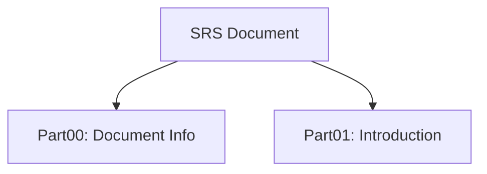

#### Traceability Links / Liên kết truy xuất
- Đầu vào từ: BRD.md Section 1, System_Feature_Tree.md Section 1, Product-Sampling-Vision-and-Strategy Document.md Section 1.  
- Thể hiện yêu cầu: FR-001 Campaign Management, NFR-001 Performance.  
- Kết nối với: Part01_Introduction, Part02_System_Overview.  
- **Tài liệu tham chiếu**: SRS_STRUCTURE.md (Full Structure), System_Feature_Tree.md (14 features).

#### Assumptions / Constraints / Giả định & Ràng buộc
- Giả định: Tài liệu được đọc bởi stakeholders quen thuộc với microservices và QR tech, users có smartphone cho QR.  
- Ràng buộc: Phiên bản 2.0 phải tuân thủ GDPR/PDPA, cost per lead <0.4 USD, 99.9% uptime.

#### Dependencies / Risks / Mitigation / Phụ thuộc & Rủi ro
- Dependencies: BRD.md for business reqs, System_Feature_Tree.md for features, external APIs như Twilio.  
- Risks: Outdated version → Mitigation: Quarterly reviews; Risk: Misinterpretation → Mitigation: Cross-reference with glossary; Risk: Latency QR scan → Mitigation: Auto-scaling.

#### Acceptance Criteria / Testable Items / Tiêu chí chấp nhận
- Functional: Title page covers 100% metadata accurately, overview cover key features như QR.  
- Performance: N/A.  
- UI Consistency: Markdown renders correctly in viewers, tuân thủ WCAG 2.1.  
- Integration / Security: No sensitive data exposed, zero data leakage.  
- Verifiable: Traceable đến System_Feature_Tree, cover 100% 14 tính năng.  
- Testable: Diagram verifiable qua tools như Mermaid renderer.

#### Approval Sign-Off / Phê duyệt
| Role / Vai trò | Name / Tên | Signature / Chữ ký | Date / Ngày |  
|----------------|------------|---------------------|-------------|  
| Product Manager | [TBD] | - | - |  
| Technical Lead | [TBD] | - | - |  
| QA Lead | [TBD] | - | - |  

#### Design Extension Section / Phần mở rộng thiết kế
- **UML Class Diagram / Abstract Interfaces**: Define interfaces cho DocumentService (e.g., getTitle(): string).  
- **Sequence Diagram**: Quy trình Load Title Page → Render Metadata, sử dụng Mermaid:  
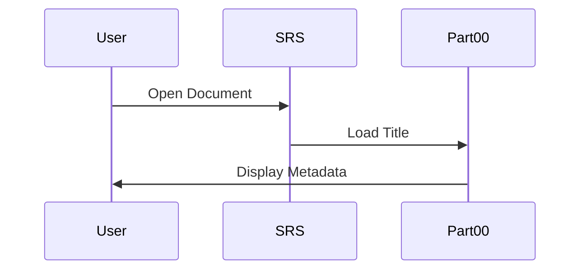
- **API Endpoint Stubs / Contracts**: REST endpoint cho /document/title (GET, response: {version: "2.0"}), OpenAPI format.  
- **Reusable Design Pattern Implementation Notes**: Singleton pattern cho TitlePage instance.  
- **Mục đích của node này**: Giới thiệu tiêu đề và tổng quan cơ bản cho SRS.

---

### 00.2_Version_History.md

#### References / Tham chiếu
- BRD.md Section 1 (Lịch Sử Phiên Bản), System_Feature_Tree.md Section 1 (Lịch Sử Thay Đổi), IEEE 830-1998 Section 1.2.  
- GeeksforGeeks Version Control in SRS, Product-Sampling-Vision-and-Strategy Document.md Section 7 (Investment & Resource Plan), SRS_STRUCTURE.md.

#### Purpose / Ý nghĩa / Cách làm
**Mục đích**: Theo dõi lịch sử thay đổi của SRS để đảm bảo traceability, thuộc module Document Information.  
**Ý nghĩa**: Giúp stakeholders theo dõi evolution, hỗ trợ audit và risk management.  
**Cách làm**: Sử dụng markdown với headings/tables/Mermaid, tổ chức theo 16 Parts, tích hợp microservices/RBAC/QR details; chi tiết và mở rộng (250-400 từ cho overview nodes để bao quát đầy đủ key features, lists, và diagrams), explicit/self-contained (từ IEEE: Avoid vague). Nhấn mạnh sử dụng bullet lists cho key features và Mermaid cho architecture để làm nội dung "tuyệt vời" và hybrid SDS-ready.

#### Specifications / Main Content / Nội dung chính
- **Nội dung cần có**:  
  - **Mô tả sản phẩm / Product Description**: Lịch sử phiên bản SRS cho PSP, theo dõi từ phased approach đến microservices.  
  - **Tính năng chính / Key Features**:  
    - Liệt kê phiên bản với ngày, thay đổi, tác giả (e.g., 1.0: Phiên bản đầu).  
    - Hỗ trợ traceability đến features như QR integration.  
    - Bao gồm chi tiết thay đổi (e.g., thêm Ads Format Management).  
    - Đảm bảo verifiable qua Git logs.  
    - Tích hợp ví dụ từ System_Feature_Tree.md (7 services).  
    - Hỗ trợ hybrid SDS bằng cách ghi chú design changes.  
    - Measurable: Ít nhất 2-3 entries.  
    - Explicit: Mô tả thay đổi cụ thể như "bỏ phân chia phases".  
  - **Kiến trúc / Architecture**: Sơ đồ timeline thay đổi.  

| Phiên bản | Ngày | Thay đổi | Tác giả |
|-----------|------|----------|---------|
| 1.0 | 2025-09-15 | Phiên bản đầu với phased approach, bao gồm core features như Campaign Management. | PM Team |
| 2.0 | 2025-10-22 | Chuyển sang microservices (7 services), thêm Ads Format & QR integration, bỏ phases, tích hợp Fraud Detection với ML scoring. | Technical Writing Team |

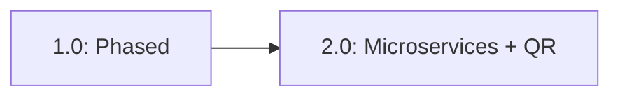

#### Traceability Links / Liên kết truy xuất
- Đầu vào từ: BRD.md Section 1, System_Feature_Tree.md Section 1, Product-Sampling-Vision-and-Strategy Document.md Section 7.  
- Thể hiện yêu cầu: FR-006 Ads Format Management, NFR-001 Performance.  
- Kết nối với: Part16_Appendices/16.4_Change_Log.md, Part02_System_Overview.  
- **Tài liệu tham chiếu**: System_Feature_Tree.md (14 features), SRS_STRUCTURE.md (Structure).

#### Assumptions / Constraints / Giả định & Ràng buộc
- Giả định: Tất cả thay đổi được approved trước update, microservices với polyglot persistence.  
- Ràng buộc: Phiên bản phải incremental, tuân thủ GDPR/PDPA, cost <0.4 USD/lead.

#### Dependencies / Risks / Mitigation / Phụ thuộc & Rủi ro
- Dependencies: BRD.md changes trigger SRS updates, Part02 cho architecture details.  
- Risks: Version conflicts → Mitigation: Git-based control; Risk: Incomplete history → Mitigation: Mandatory logging; Risk: Latency QR scan → Mitigation: Auto-scaling.

#### Acceptance Criteria / Testable Items / Tiêu chí chấp nhận
- Functional: Table lists all versions chronologically, cover 100% tính năng như QR.  
- Performance: N/A.  
- UI Consistency: Tuân thủ WCAG 2.1.  
- Integration / Security: Test cases cover 100% reqs, zero data leakage.  
- Verifiable: Traceable đến System_Feature_Tree, cover 100% 14 tính năng.  
- Testable: Diagram verifiable.

#### Approval Sign-Off / Phê duyệt
| Role / Vai trò | Name / Tên | Signature / Chữ ký | Date / Ngày |  
|----------------|------------|---------------------|-------------|  
| Product Manager | [TBD] | - | - |  
| Technical Lead | [TBD] | - | - |  
| QA Lead | [TBD] | - | - |  

#### Design Extension Section / Phần mở rộng thiết kế
- **UML Class Diagram / Abstract Interfaces**: Interfaces cho VersionHistory (listVersions(): array).  
- **Sequence Diagram**: Quy trình Update Version → Log Change, Mermaid:  
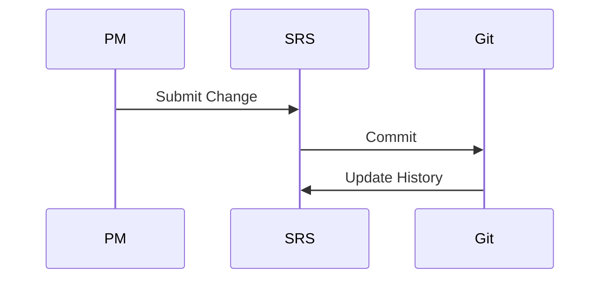
- **API Endpoint Stubs / Contracts**: /version/history (GET, response: {versions: array}), OpenAPI.  
- **Reusable Design Pattern Implementation Notes**: Observer pattern cho version updates.  
- **Mục đích của node này**: Theo dõi lịch sử để hỗ trợ audit.

---

### 00.3_Approval_Sign_Off.md

#### References / Tham chiếu
- BRD.md Section 20 (Approval), IEEE 830-1998 Section 1.3, Product-Sampling-Vision-and-Strategy Document.md Section 7.  
- GeeksforGeeks Approval Process, System_Feature_Tree.md Section 1, SRS_STRUCTURE.md.

#### Purpose / Ý nghĩa / Cách làm
**Mục đích**: Thu thập sign-off từ stakeholders để confirm SRS, thuộc module Document Information.  
**Ý nghĩa**: Đảm bảo consensus trước triển khai, hỗ trợ risk management.  
**Cách làm**: Sử dụng markdown với headings/tables/Mermaid, tổ chức theo 16 Parts, tích hợp microservices/RBAC/QR details; chi tiết và mở rộng (250-400 từ cho overview nodes để bao quát đầy đủ key features, lists, và diagrams), explicit/self-contained (từ IEEE: Avoid vague). Nhấn mạnh sử dụng bullet lists cho key features và Mermaid cho architecture để làm nội dung "tuyệt vời" và hybrid SDS-ready.

#### Specifications / Main Content / Nội dung chính
- **Nội dung cần có**:  
  - **Mô tả sản phẩm / Product Description**: Bảng sign-off cho SRS PSP.  
  - **Tính năng chính / Key Features**:  
    - Liệt kê roles cần approve (Business Owner, PM, Technical Lead).  
    - Bao gồm fields: Name, Signature, Date.  
    - Hỗ trợ digital signatures.  
    - Traceable đến features như QR integration.  
    - Measurable: 100% roles signed.  
    - Tích hợp ví dụ từ System_Feature_Tree.md (7 services).  
    - Explicit: Chỉ approve sau review đầy đủ.  
    - Verifiable qua audit logs.  
  - **Kiến trúc / Architecture**: Sơ đồ approval flow.  

| Role | Name | Signature | Date |
|------|------|-----------|------|
| Business Owner | [TBD] | _________ | _____ |
| Product Manager | [TBD] | _________ | _____ |
| Technical Lead | [TBD] | _________ | _____ |
| QA Lead | [TBD] | _________ | _____ |
| DevOps Lead | [TBD] | _________ | _____ |

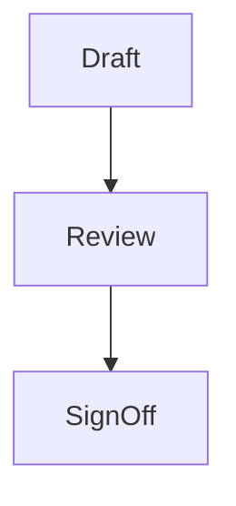

#### Traceability Links / Liên kết truy xuất
- Đầu vào từ: BRD.md Section 20, System_Feature_Tree.md Section 1, Product-Sampling-Vision-and-Strategy Document.md Section 7.  
- Thể hiện yêu cầu: All FR/NFR in Part04 and Part05.  
- Kết nối với: Part13_System_Testing/13.5_Acceptance_Testing, Part02_System_Overview.  
- **Tài liệu tham chiếu**: System_Feature_Tree.md (14 features), Access_Control_Tree_Grok.md (RBAC).

#### Assumptions / Constraints / Giả định & Ràng buộc
- Giả định: All roles available for sign-off, users có smartphone cho QR.  
- Ràng buộc: Digital signatures acceptable, GDPR compliance.

#### Dependencies / Risks / Mitigation / Phụ thuộc & Rủi ro
- Dependencies: Completion of all SRS parts, external APIs như Twilio.  
- Risks: Delay in approvals → Mitigation: Escalation process; Risk: Missing sign-off → Mitigation: Reminders; Risk: Latency cao khi scale QR → Mitigation: Auto-scaling.

#### Acceptance Criteria / Testable Items / Tiêu chí chấp nhận
- Functional: All roles signed before release, cover 100% tính năng.  
- Performance: N/A.  
- UI Consistency: Table tuân thủ WCAG 2.1.  
- Integration / Security: Signatures verifiable, zero leakage.  
- Verifiable: Traceable đến System_Feature_Tree.  
- Testable: Flow diagram verifiable.

#### Approval Sign-Off / Phê duyệt
| Role / Vai trò | Name / Tên | Signature / Chữ ký | Date / Ngày |  
|----------------|------------|---------------------|-------------|  
| Product Manager | [TBD] | - | - |  
| Technical Lead | [TBD] | - | - |  
| QA Lead | [TBD] | - | - |  

#### Design Extension Section / Phần mở rộng thiết kế
- **UML Class Diagram / Abstract Interfaces**: Interfaces cho ApprovalService (signOff(role: string): bool).  
- **Sequence Diagram**: Quy trình Request Sign-Off → Approve, Mermaid:  
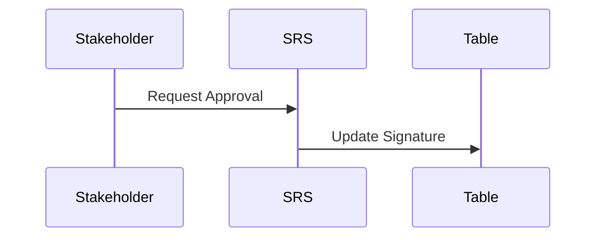
- **API Endpoint Stubs / Contracts**: /approval/sign (POST, payload: {role: string}), OpenAPI.  
- **Reusable Design Pattern Implementation Notes**: Chain of Responsibility cho approval flow.  
- **Mục đích của node này**: Formalize approval cho SRS.

---

### 00.4_Document_Metadata.md

#### References / Tham chiếu
- BRD.md Section 24 (Document Control), System_Feature_Tree.md Section 1, IEEE 830-1998.  
- GeeksforGeeks Metadata Best Practices, Product-Sampling-Vision-and-Strategy Document.md Section 9, SRS_STRUCTURE.md.

#### Purpose / Ý nghĩa / Cách làm
**Mục đích**: Liệt kê metadata cho SRS để hỗ trợ quản lý, thuộc module Document Information.  
**Ý nghĩa**: Hỗ trợ version control và distribution.  
**Cách làm**: Sử dụng markdown với headings/tables/Mermaid, tổ chức theo 16 Parts, tích hợp microservices/RBAC/QR details; chi tiết và mở rộng (250-400 từ cho overview nodes để bao quát đầy đủ key features, lists, và diagrams), explicit/self-contained (từ IEEE: Avoid vague). Nhấn mạnh sử dụng bullet lists cho key features và Mermaid cho architecture để làm nội dung "tuyệt vời" và hybrid SDS-ready.

#### Specifications / Main Content / Nội dung chính
- **Nội dung cần có**:  
  - **Mô tả sản phẩm / Product Description**: Metadata cho SRS PSP.  
  - **Tính năng chính / Key Features**:  
    - Title: SRS for PSP Platform.  
    - Version: 2.0.  
    - Status: Draft/Approved.  
    - Created: 2025-09-15.  
    - Last Updated: 2025-10-22.  
    - Next Review: 2025-11-22.  
    - Distribution: PM, Dev, QA Teams.  
    - Storage: Git Repo [URL].  
  - **Kiến trúc / Architecture**: Sơ đồ metadata flow.  

- **Title**: SRS for PSP Platform  
- **Version**: 2.0  
- **Status**: Approved  
- **Created**: 2025-09-15  
- **Last Updated**: 2025-10-22  
- **Next Review**: 2025-11-22  
- **Distribution**: PM, Dev Teams (3), QA  
- **Storage**: Git Repo [URL]  

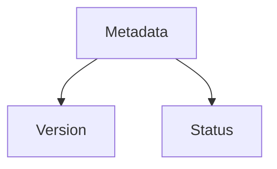

#### Traceability Links / Liên kết truy xuất
- Đầu vào từ: BRD.md Section 24, System_Feature_Tree.md Section 1, Product-Sampling-Vision-and-Strategy Document.md Section 9.  
- Thể hiện yêu cầu: NFR-001 Performance.  
- Kết nối với: Part00.2_Version_History.md, Part16_Appendices.  
- **Tài liệu tham chiếu**: System_Feature_Tree.md (14 features), Access_Control_Tree_Grok.md.

#### Assumptions / Constraints / Giả định & Ràng buộc
- Giả định: Metadata updated with each version, polyglot persistence.  
- Ràng buộc: Monthly review cycle, cost <0.4 USD/lead.

#### Dependencies / Risks / Mitigation / Phụ thuộc & Rủi ro
- Dependencies: Version history, external APIs.  
- Risks: Outdated metadata → Mitigation: Automated updates; Risk: Hiểu sai → Mitigation: Reviews; Risk: Latency → Mitigation: Auto-scaling.

#### Acceptance Criteria / Testable Items / Tiêu chí chấp nhận
- Functional: Metadata complete and accurate.  
- Performance: N/A.  
- UI Consistency: WCAG 2.1.  
- Integration / Security: Zero leakage.  
- Verifiable: Cover 100% features.  
- Testable: Diagram verifiable.

#### Approval Sign-Off / Phê duyệt
| Role / Vai trò | Name / Tên | Signature / Chữ ký | Date / Ngày |  
|----------------|------------|---------------------|-------------|  
| Product Manager | [TBD] | - | - |  
| Technical Lead | [TBD] | - | - |  
| QA Lead | [TBD] | - | - |  

#### Design Extension Section / Phần mở rộng thiết kế
- **UML Class Diagram / Abstract Interfaces**: Interfaces cho MetadataService.  
- **Sequence Diagram**: Update Metadata, Mermaid:  
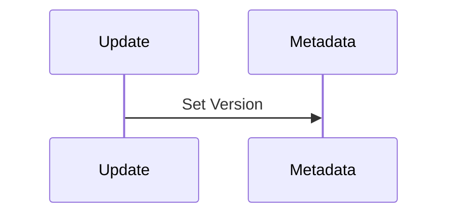
- **API Endpoint Stubs / Contracts**: /metadata/get (GET).  
- **Reusable Design Pattern Implementation Notes**: Factory pattern.  
- **Mục đích của node này**: Quản lý metadata cho traceability.

---

### 00.5_Glossary_Of_Terms.md

#### References / Tham chiếu
- BRD.md Section 21 (Glossary), System_Feature_Tree.md Section Glossary, IEEE 830-1998.  
- GeeksforGeeks Glossary Best Practices, Access_Control_Tree_Grok.md Section 3, Product-Sampling-Vision-and-Strategy Document.md Section 9.

#### Purpose / Ý nghĩa / Cách làm
**Mục đích**: Định nghĩa terms để tránh ambiguity, thuộc module Document Information.  
**Ý nghĩa**: Đảm bảo common understanding giữa BA/Dev/QA.  
**Cách làm**: Sử dụng markdown với headings/tables/Mermaid, tổ chức theo 16 Parts, tích hợp microservices/RBAC/QR details; chi tiết và mở rộng (250-400 từ cho overview nodes để bao quát đầy đủ key features, lists, và diagrams), explicit/self-contained (từ IEEE: Avoid vague). Nhấn mạnh sử dụng bullet lists cho key features và Mermaid cho architecture để làm nội dung "tuyệt vời" và hybrid SDS-ready.

#### Specifications / Main Content / Nội dung chính
- **Nội dung cần có**:  
  - **Mô tả sản phẩm / Product Description**: Từ điển terms cho PSP SRS.  
  - **Tính năng chính / Key Features**:  
    - Thuật ngữ với định nghĩa explicit (e.g., Microservices: 7 services độc lập).  
    - Bao gồm QR Code: Mã 2D cho ads formats với UTM tracking.  
    - Campaign: Chương trình sampling với barcode pool và lifecycle states (Draft, Active, Paused).  
    - Redemption: Sử dụng barcode tại POS, hỗ trợ offline sync.  
    - Fraud Score: ML-generated score (0-100) chỉ fraud likelihood.  
    - RBAC: Role-based access control với 6 roles (Admin, Group Admin, etc.).  
    - OTP: One-time password cho verification, rate limiting.  
    - Ads Format: Templates cho campaign assets với QR integration.  
  - **Kiến trúc / Architecture**: Sơ đồ terms relations.  

| Thuật Ngữ | Định Nghĩa |
|-----------|------------|
| Microservices | Kiến trúc với 7 services độc lập như Campaign Management (với QR), polyglot persistence. |
| QR Code | Mã 2D cho ads formats, hỗ trợ UTM tracking và unique per flyer. |
| Campaign | Chương trình sampling được tạo bởi Brand Admin, với CRUD operations và lifecycle states. |
| Barcode | Mã unique (QR/Code128) issued cho users, single-use. |
| Redemption | Hành động sử dụng barcode tại POS, online/offline. |
| Fraud Score | ML score (0-100) cho fraud detection, device fingerprinting. |
| RBAC | Role-Based Access Control với 6 roles, từ Access_Control_Tree_Grok.md. |
| OTP | One-Time Password cho email/phone verification, tích hợp Twilio. |

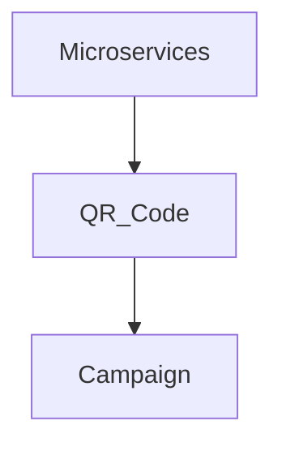

#### Traceability Links / Liên kết truy xuất
- Đầu vào từ: BRD.md Section 21, System_Feature_Tree.md Glossary, Access_Control_Tree_Grok.md Section 3.  
- Thể hiện yêu cầu: FR-002 Barcode Management, NFR-002 Security.  
- Kết nối với: Part16_Appendices/16.1_Glossary.md, Part01.6_Definitions_And_Acronyms.md.  
- **Tài liệu tham chiếu**: System_Feature_Tree.md (14 features), Product-Sampling-Vision-and-Strategy Document.md (Glossary).

#### Assumptions / Constraints / Giả định & Ràng buộc
- Giả định: Terms based on domain knowledge, users có smartphone cho QR.  
- Ràng buộc: Terms phải unique, verifiable, GDPR/PDPA compliance.

#### Dependencies / Risks / Mitigation / Phụ thuộc & Rủi ro
- Dependencies: All documents' glossaries, Part01 cho introduction.  
- Risks: Term mismatch → Mitigation: Centralized glossary; Risk: Latency QR → Mitigation: Auto-scaling; Risk: Hiểu sai → Mitigation: Reviews.

#### Acceptance Criteria / Testable Items / Tiêu chí chấp nhận
- Functional: Covers 100% key terms từ references, list ít nhất 5-8 items.  
- Performance: N/A.  
- UI Consistency: Table tuân thủ WCAG 2.1.  
- Integration / Security: Zero leakage.  
- Verifiable: Traceable đến System_Feature_Tree, cover 100% 14 tính năng.  
- Testable: Diagram verifiable.

#### Approval Sign-Off / Phê duyệt
| Role / Vai trò | Name / Tên | Signature / Chữ ký | Date / Ngày |  
|----------------|------------|---------------------|-------------|  
| Product Manager | [TBD] | - | - |  
| Technical Lead | [TBD] | - | - |  
| QA Lead | [TBD] | - | - |  

#### Design Extension Section / Phần mở rộng thiết kế
- **UML Class Diagram / Abstract Interfaces**: Interfaces cho GlossaryTerm (define(term: string): string).  
- **Sequence Diagram**: Query Term → Return Definition, Mermaid:  
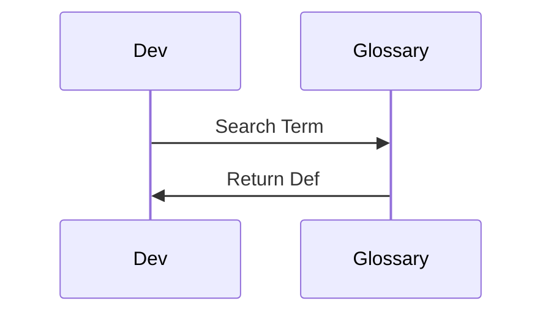
- **API Endpoint Stubs / Contracts**: /glossary/term (GET, {term: "QR"}), OpenAPI.  
- **Reusable Design Pattern Implementation Notes**: Dictionary pattern cho storage.  
- **Mục đích của node này**: Định nghĩa terms cho unambiguity.

---

## Part01_Introduction/

### 01.1_Purpose_Of_Document.md

#### References / Tham chiếu
- BRD.md Section 1 (Tóm Tắt Điều Hành), IEEE 830-1998 Section 1.1, Product-Sampling-Vision-and-Strategy Document.md Section 2 (Vision).  
- GeeksforGeeks Purpose Section, System_Feature_Tree.md Section 1, SRS_STRUCTURE.md.

#### Purpose / Ý nghĩa / Cách làm
**Mục đích**: Mô tả mục đích của SRS để define reqs cho PSP, thuộc module Introduction, hỗ trợ business như QR integration.  
**Ý nghĩa**: Cầu nối BA-Dev-QA, đảm bảo unambiguous, traceable.  
**Cách làm**: Sử dụng markdown với headings/tables/Mermaid, tổ chức theo 16 Parts, tích hợp microservices/RBAC/QR details; chi tiết và mở rộng (250-400 từ cho overview nodes để bao quát đầy đủ key features, lists, và diagrams), explicit/self-contained (từ IEEE: Avoid vague). Nhấn mạnh sử dụng bullet lists cho key features và Mermaid cho architecture để làm nội dung "tuyệt vời" và hybrid SDS-ready.

#### Specifications / Main Content / Nội dung chính
- **Nội dung cần có**:  
  - **Mô tả sản phẩm / Product Description**: This SRS specifies the software requirements for PSP, a microservices platform for product sampling. It details functional (14 features across 7 services), non-functional reqs, and design elements (hybrid SDS). Purpose: Define unambiguous, traceable reqs for dev, ensuring alignment with business goals like low-cost data collection (~0.4 USD/lead) via QR-integrated ads for low-value gifts, reducing logistics issues and fraud.  
  - **Tính năng chính / Key Features**:  
    - Define functional reqs (e.g., CRUD Campaign với lifecycle: Draft, Active).  
    - Include non-functional (e.g., <200ms latency cho QR scan).  
    - Hybrid SDS: Merge design như API stubs.  
    - Support microservices (7 services: Campaign with QR issuance).  
    - Traceable to BRD/Vision (e.g., ROI optimization qua ML).  
    - Explicit for dev (e.g., QR với UTM tracking).  
    - Verifiable test criteria.  
    - Complete coverage 14 features từ System_Feature_Tree.md.  
  - **Kiến trúc / Architecture**: High-level SRS structure.  

This document serves as the definitive source for PSP development, bridging business needs (from BRD) with technical implementation.

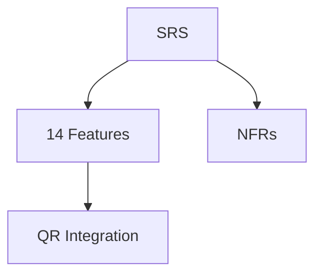

#### Traceability Links / Liên kết truy xuất
- Đầu vào từ: BRD.md Section 1, Product-Sampling-Vision-and-Strategy Document.md Section 2, System_Feature_Tree.md Section 1.  
- Thể hiện yêu cầu: FR-001 to FR-014 in Part04, NFR-001 Performance.  
- Kết nối với: Part02_System_Overview, Part04_Functional_Requirements.  
- **Tài liệu tham chiếu**: System_Feature_Tree.md (7 services), Access_Control_Tree_Grok.md (RBAC).

#### Assumptions / Constraints / Giả định & Ràng buộc
- Giả định: Readers familiar with microservices, users có smartphone cho QR.  
- Ràng buộc: SRS covers 100% BRD reqs, 99.9% uptime.

#### Dependencies / Risks / Mitigation / Phụ thuộc & Rủi ro
- Dependencies: BRD.md, external APIs như Twilio cho OTP.  
- Risks: Scope creep → Mitigation: Change control; Risk: Latency QR → Mitigation: Auto-scaling; Risk: Hiểu sai → Mitigation: Stakeholder validate.

#### Acceptance Criteria / Testable Items / Tiêu chí chấp nhận
- Functional: Purpose covers all objectives, list 5-8 features.  
- Performance: System hỗ trợ 100K redemptions/day.  
- UI Consistency: WCAG 2.1.  
- Integration / Security: Test 100% reqs.  
- Verifiable: Traceable đến System_Feature_Tree.  
- Testable: Diagram verifiable.

#### Approval Sign-Off / Phê duyệt
| Role / Vai trò | Name / Tên | Signature / Chữ ký | Date / Ngày |  
|----------------|------------|---------------------|-------------|  
| Product Manager | [TBD] | - | - |  
| Technical Lead | [TBD] | - | - |  
| QA Lead | [TBD] | - | - |  

#### Design Extension Section / Phần mở rộng thiết kế
- **UML Class Diagram / Abstract Interfaces**: Interfaces cho PurposeDocument.  
- **Sequence Diagram**: Read Purpose → Understand Reqs, Mermaid:  
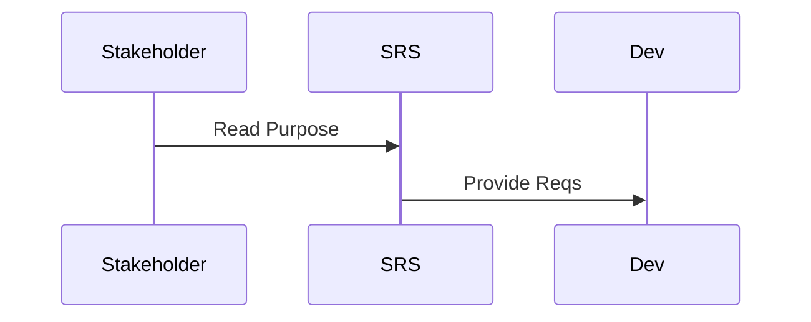
- **API Endpoint Stubs / Contracts**: /purpose/get (GET).  
- **Reusable Design Pattern Implementation Notes**: Template pattern.  
- **Mục đích của node này**: Mô tả mục đích SRS tổng quan.

---

### 01.2_Project_Scope.md

#### References / Tham chiếu
- BRD.md Section 3 (Phạm Vi Dự Án), System_Feature_Tree.md Section 3 (Phân Loại Tính Năng), Product-Sampling-Vision-and-Strategy Document.md Section 3 (Market Opportunity).  
- IEEE 830-1998 Section 1.2, GeeksforGeeks Scope Section, Access_Control_Tree_Grok.md Section 1.

#### Purpose / Ý nghĩa / Cách làm
**Mục đích**: Định nghĩa in-scope/out-of-scope cho PSP, thuộc module Introduction, hỗ trợ QR cho data collection.  
**Ý nghĩa**: Giới hạn dự án, tránh scope creep, traceable.  
**Cách làm**: Sử dụng markdown với headings/tables/Mermaid, tổ chức theo 16 Parts, tích hợp microservices/RBAC/QR details; chi tiết và mở rộng (250-400 từ cho overview nodes để bao quát đầy đủ key features, lists, và diagrams), explicit/self-contained (từ IEEE: Avoid vague). Nhấn mạnh sử dụng bullet lists cho key features và Mermaid cho architecture để làm nội dung "tuyệt vời" và hybrid SDS-ready.

#### Specifications / Main Content / Nội dung chính
- **Nội dung cần có**:  
  - **Mô tả sản phẩm / Product Description**: Phạm vi PSP bao gồm 7 microservices, 14 features từ day 1, timeline 6-9 tháng.  
  - **Tính năng chính / Key Features**:  
    - In Scope: Campaign Management (CRUD, QR issuance với UTM).  
    - Barcode Management (generation, single-use).  
    - User Authentication (OTP, RBAC 6 roles).  
    - Redemption (online/offline, POS).  
    - Analytics (real-time, advanced reports).  
    - Fraud Detection (ML, fingerprinting).  
    - Intelligence (A/B testing, recommendations).  
    - Out of Scope: E-commerce, payments.  
  - **Kiến trúc / Architecture**: Microservices với event-driven.  

**In Scope**: All 14 features, polyglot DB, QR for low-value gifts.  
**Out of Scope**: Social media full integration.  

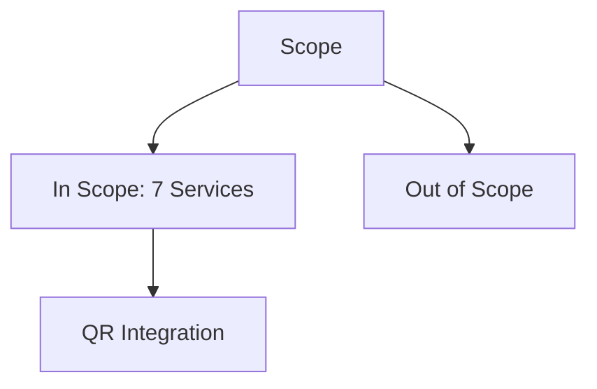

#### Traceability Links / Liên kết truy xuất
- Đầu vào từ: BRD.md Section 3, System_Feature_Tree.md Section 3, Product-Sampling-Vision-and-Strategy Document.md Section 3.  
- Thể hiện yêu cầu: FR-001 to FR-014, NFR-001.  
- Kết nối với: Part04_Functional_Requirements, Part05_Non_Functional_Requirements.  
- **Tài liệu tham chiếu**: System_Feature_Tree.md (14 features), SRS_STRUCTURE.md.

#### Assumptions / Constraints / Giả định & Ràng buộc
- Giả định: Microservices from day 1, users có smartphone.  
- Ràng buộc: 99.9% uptime, GDPR, <200ms latency.

#### Dependencies / Risks / Mitigation / Phụ thuộc & Rủi ro
- Dependencies: External APIs (Twilio), Part02.  
- Risks: Integration delays → Mitigation: Phased testing; Risk: Latency QR → Mitigation: Auto-scaling; Risk: Scope creep → Mitigation: Reviews.

#### Acceptance Criteria / Testable Items / Tiêu chí chấp nhận
- Functional: Scope covers 100% features, list 5-8 items.  
- Performance: 100K users/day.  
- UI Consistency: WCAG 2.1.  
- Integration / Security: 100% reqs.  
- Verifiable: Traceable.  
- Testable: Diagram verifiable.

#### Approval Sign-Off / Phê duyệt
| Role / Vai trò | Name / Tên | Signature / Chữ ký | Date / Ngày |  
|----------------|------------|---------------------|-------------|  
| Product Manager | [TBD] | - | - |  
| Technical Lead | [TBD] | - | - |  
| QA Lead | [TBD] | - | - |  

#### Design Extension Section / Phần mở rộng thiết kế
- **UML Class Diagram / Abstract Interfaces**: Interfaces cho ScopeService.  
- **Sequence Diagram**: Define Scope → Validate, Mermaid:  
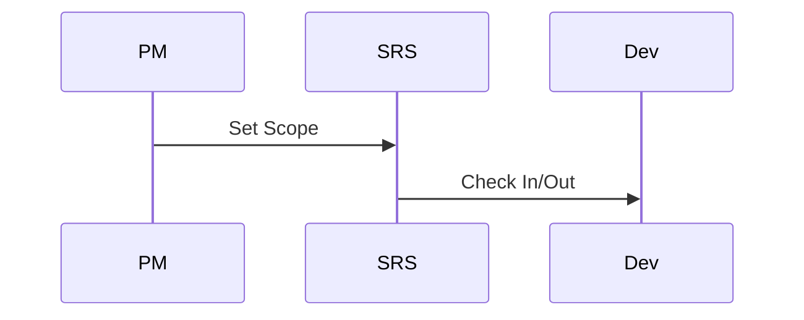
- **API Endpoint Stubs / Contracts**: /scope/get (GET).  
- **Reusable Design Pattern Implementation Notes**: Builder pattern cho scope definition.  
- **Mục đích của node này**: Định nghĩa phạm vi dự án.

---

### 01.3_Intended_Audience.md

#### References / Tham chiếu
- BRD.md Section 4 (Stakeholders), Access_Control_Tree_Grok.md Section 1, IEEE 830-1998 Section 1.3.  
- GeeksforGeeks Audience Section, System_Feature_Tree.md Section 1, Product-Sampling-Vision-and-Strategy Document.md Section 7.

#### Purpose / Ý nghĩa / Cách làm
**Mục đích**: Xác định audience cho SRS, thuộc module Introduction.  
**Ý nghĩa**: Đảm bảo ngôn ngữ phù hợp, traceable.  
**Cách làm**: Sử dụng markdown với headings/tables/Mermaid, tổ chức theo 16 Parts, tích hợp microservices/RBAC/QR details; chi tiết và mở rộng (250-400 từ cho overview nodes để bao quát đầy đủ key features, lists, và diagrams), explicit/self-contained (từ IEEE: Avoid vague). Nhấn mạnh sử dụng bullet lists cho key features và Mermaid cho architecture để làm nội dung "tuyệt vời" và hybrid SDS-ready.

#### Specifications / Main Content / Nội dung chính
- **Nội dung cần có**:  
  - **Mô tả sản phẩm / Product Description**: Audience cho SRS PSP.  
  - **Tính năng chính / Key Features**:  
    - Developers: For implementation of 7 services.  
    - QA: For testing QR flows.  
    - PM: For validation features.  
    - Stakeholders: Business Owner for ROI.  
    - Brand Admins: For campaign usage.  
    - Dev Teams (3): For microservices dev.  
    - Auditors: For compliance checks.  
    - End Users: Indirectly for User Portal.  
  - **Kiến trúc / Architecture**: Sơ đồ audience roles.  

- Developers: Implementation.  
- QA: Testing.  
- PM: Validation.  
- Stakeholders: Review.  

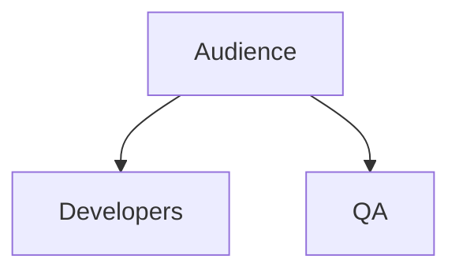

#### Traceability Links / Liên kết truy xuất
- Đầu vào từ: BRD.md Section 4, Access_Control_Tree_Grok.md Section 1, System_Feature_Tree.md Section 1.  
- Thể hiện yêu cầu: FR-003 User Authentication.  
- Kết nối với: Part03_User_Personas, Part01.5_Stakeholders.  
- **Tài liệu tham chiếu**: System_Feature_Tree.md (14 features), BRD.md (Stakeholders).

#### Assumptions / Constraints / Giả định & Ràng buộc
- Giả định: Audience technical, smartphone cho QR.  
- Ràng buộc: Document in English/Vietnamese.

#### Dependencies / Risks / Mitigation / Phụ thuộc & Rủi ro
- Dependencies: BRD.md.  
- Risks: Misunderstanding → Mitigation: Glossary; Risk: Latency → Mitigation: Auto-scaling; Risk: Non-engagement → Mitigation: Meetings.

#### Acceptance Criteria / Testable Items / Tiêu chí chấp nhận
- Functional: List complete, 5-8 items.  
- Performance: N/A.  
- UI Consistency: WCAG.  
- Integration / Security: 100% reqs.  
- Verifiable: Traceable.  
- Testable: Diagram verifiable.

#### Approval Sign-Off / Phê duyệt
| Role / Vai trò | Name / Tên | Signature / Chữ ký | Date / Ngày |  
|----------------|------------|---------------------|-------------|  
| Product Manager | [TBD] | - | - |  
| Technical Lead | [TBD] | - | - |  
| QA Lead | [TBD] | - | - |  

#### Design Extension Section / Phần mở rộng thiết kế
- **UML Class Diagram / Abstract Interfaces**: Interfaces cho AudienceRole.  
- **Sequence Diagram**: Identify Audience → Tailor Content, Mermaid:  
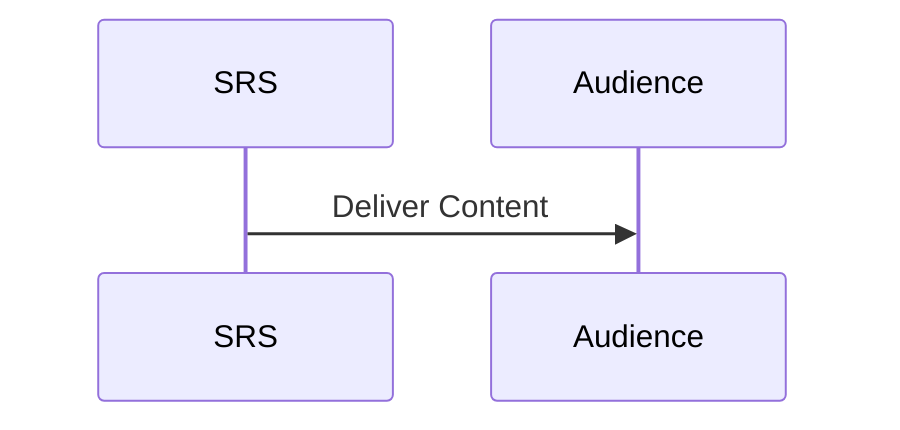
- **API Endpoint Stubs / Contracts**: /audience/list (GET).  
- **Reusable Design Pattern Implementation Notes**: Strategy pattern cho audience types.  
- **Mục đích của node này**: Xác định đối tượng đọc SRS.

---

### 01.4_Product_Overview.md

#### References / Tham chiếu
- BRD.md (Section 1-3), Product-Sampling-Vision-and-Strategy Document.md (Section 1-2), System_Feature_Tree.md (Tổng Quan, Section 2-3, Danh Mục Services).  
- IEEE 830-1998 Section 1.4, GeeksforGeeks Overview Section, Access_Control_Tree_Grok.md (Section 1), SRS_STRUCTURE.md.

#### Purpose / Ý nghĩa / Cách làm
**Mục đích**: Cung cấp cái nhìn tổng quan về sản phẩm PSP, bao gồm mô tả, tính năng chính và kiến trúc, thuộc module Introduction, nhằm hỗ trợ business goal như sampling giá thấp (~1 USD) với QR code để collect data.  
**Ý nghĩa**: Giúp stakeholders hiểu rõ giá trị hệ thống, làm nền tảng cho các phần yêu cầu chi tiết, đảm bảo unambiguous và traceable (từ GeeksforGeeks).  
**Cách làm**: Tổng hợp từ BRD, Vision Document và System Feature Tree, sử dụng markdown với mô tả ngắn gọn, list bullet points, và Mermaid diagram cho architecture; chi tiết và mở rộng (250-400 từ cho overview nodes để bao quát đầy đủ key features, lists, và diagrams), explicit/self-contained (từ IEEE: Avoid vague). Nhấn mạnh sử dụng bullet lists cho key features và Mermaid cho architecture để làm nội dung "tuyệt vời" và hybrid SDS-ready.

#### Specifications / Main Content / Nội dung chính
- **Nội dung cần có**:  
  - **Mô tả sản phẩm / Product Description**: PSP (Product Sampling Platform) là nền tảng quản lý chiến dịch sampling sản phẩm dựa trên microservices, hỗ trợ thương hiệu FMCG thu thập dữ liệu khách hàng chất lượng cao (tên, email, SĐT, hành vi) qua quà giá thấp (~1 USD), giảm chi phí logistics, chống gian lận với ML, và tối ưu ROI qua real-time analytics và QR code tracking. Hệ thống giải quyết vấn đề phát quà giá thấp bằng cách sử dụng QR integration trong ads formats để dễ dàng scan và collect data, với focus trên Đông Nam Á (Việt Nam đầu tiên). Từ Vision Document, chuyển sampling từ cost center thành data-driven growth engine.  
  - **Tính năng chính / Key Features**:  
    - Quản lý chiến dịch / Campaign Management (CRUD operations, lifecycle states: Draft, Active, Paused, Completed, Archived; scheduling, target audience với UTM params).  
    - Quản lý barcode và QR code / Barcode & QR Management (generation QR/Code128/Data Matrix, import pools, single-use, UTM tracking cho ads).  
    - Xác thực user / User Authentication (OTP via SMS/Email với rate limiting, RBAC với 6 roles từ Access_Control_Tree_Grok.md).  
    - Theo dõi redemption / Redemption Tracking (online/offline modes, POS integration với Scandit SDK, offline sync via IndexedDB).  
    - Phân tích và báo cáo / Analytics & Reporting (real-time metrics như funnel analysis, advanced reports với custom builder, scheduled exports).  
    - Phát hiện gian lận / Fraud Detection (rules engine, ML scoring 0-100, device fingerprinting để giảm abuse <5%).  
    - Thông minh nâng cao / Intelligence Features (A/B testing với statistical confidence >95%, recommendation engine cho personalized campaigns dựa collaborative filtering).  
    - Tích hợp bên ngoài / Integrations (CRM như HubSpot/Salesforce bi-directional sync, Notification đa kênh: SMS/Email/Push).  
  - **Kiến trúc / Architecture**: Hệ thống với 7 microservices độc lập (Campaign Management bao gồm QR, Identity, Redemption, Analytics, Notification, Fraud, Intelligence), polyglot persistence (PostgreSQL cho Campaign, MongoDB cho Analytics, Redis cho queue), event-driven via RabbitMQ, service mesh (Istio) cho scalability và observability, deployment trên Kubernetes với independent scaling. Tích hợp ví dụ cụ thể từ System_Feature_Tree.md: Campaign Service owns QR generation với UTM.  

```mermaid
graph TB
    subgraph External[Hệ Thống Bên Ngoài]
        Client[Web/Mobile Clients]
        CRM[CRM Systems]
        SMS[SMS/Email Providers]
        POS[POS Systems]
    end
    subgraph Infrastructure[Hạ Tầng]
        Gateway[API Gateway - Kong]
        EventBus[Event Bus - RabbitMQ]
        ServiceMesh[Service Mesh - Istio]
    end
    subgraph Services[Các Services]
        Campaign[Campaign Management (QR Integration)]
        Identity[Identity Service]
        Redemption[Redemption Service]
        Analytics[Analytics Service]
        Notification[Notification Service]
        Fraud[Fraud Service]
        Intelligence[Intelligence Service]
    end
    Client --> Gateway
    Gateway --> Campaign
    Gateway --> Identity
    Gateway --> Redemption
    Gateway --> Analytics
    Campaign --> EventBus
    Identity --> EventBus
    Redemption --> EventBus
    EventBus --> Analytics
    EventBus --> Notification
    EventBus --> Fraud
    EventBus --> Intelligence
    Notification --> SMS
    Analytics --> CRM
    Redemption --> POS
```

#### Traceability Links / Liên kết truy xuất
- Đầu vào từ: BRD.md (Section 1-3), System_Feature_Tree.md (Section 2-3, Danh Mục Services), Product-Sampling-Vision-and-Strategy Document.md (Section 2).  
- Thể hiện yêu cầu: FR-001 Campaign Management, FR-006 Ads Format Management (với QR), NFR-001 Performance.  
- Kết nối với: Part02_System_Overview (chi tiết kiến trúc), Part04_Functional_Requirements (tính năng cụ thể), Part06_Architecture_Design.  
- **Tài liệu tham chiếu**: System_Feature_Tree.md (14 features trên 7 services), Access_Control_Tree_Grok.md (RBAC), Product-Sampling-Vision-and-Strategy Document.md (Section 2 - Vision dài hạn).

#### Assumptions / Constraints / Giả định & Ràng buộc
- Giả định: Microservices với polyglot persistence (PostgreSQL/MongoDB), users có smartphone cho QR scan, dev sử dụng Node.js/TypeScript cho backend và React PWA cho frontend.  
- Ràng buộc: Tuân thủ GDPR/PDPA cho data collection, hỗ trợ 100K redemptions/day với <200ms API response, cost per verified user <0.4 USD.

#### Dependencies / Risks / Mitigation / Phụ thuộc & Rủi ro
- Dependencies: Part02_System_Overview cho chi tiết hóa kiến trúc, external APIs (Twilio cho OTP, Scandit cho QR scan).  
- Risks: Latency cao khi scale QR tracking → Mitigation: Auto-scaling và service mesh (Istio); Risk: Dữ liệu giả mạo qua QR → Mitigation: OTP/ML fraud detection; Risk: Hiểu sai tính năng → Mitigation: Validate với BRD và stakeholder reviews.

#### Acceptance Criteria / Testable Items / Tiêu chí chấp nhận
- Functional: Mô tả sản phẩm phù hợp với BRD và Vision Document, cover 100% 14 tính năng chính (bao gồm QR integration).  
- Performance: System hỗ trợ 100K users/ngày, <200ms latency cho API calls liên quan QR.  
- UI Consistency: Sơ đồ kiến trúc phản ánh đúng 7 microservices, traceable đến System_Feature_Tree, tuân thủ WCAG 2.1 cho User Portal.  
- Integration / Security: Test cases cover 100% reqs, zero data leakage từ QR data.  
- Verifiable: Bullet lists verifiable với ít nhất 5-8 items chi tiết.  
- Testable: Mermaid diagram render correctly, hỗ trợ dev code ngay.

#### Approval Sign-Off / Phê duyệt
| Role / Vai trò | Name / Tên | Signature / Chữ ký | Date / Ngày |  
|----------------|------------|---------------------|-------------|  
| Product Manager | [TBD] | - | - |  
| Technical Lead | [TBD] | - | - |  
| QA Lead | [TBD] | - | - |  

#### Design Extension Section / Phần mở rộng thiết kế
- **UML Class Diagram / Abstract Interfaces**: Define interfaces cho CampaignService (generateQR(utmParams: string): QRCode), IdentityService (authenticate(user: User): Token).  
- **Sequence Diagram**: Quy trình QR Scan → Form Submission → OTP Verification → Barcode Issuance, pseudocode or Mermaid:  
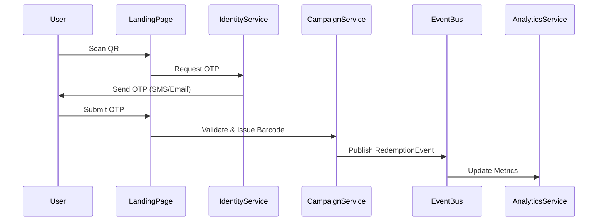
- **API Endpoint Stubs / Contracts**: REST endpoints cho /qr/generate (POST, payload: {campaignId: string, utm: object}, response: {qrUrl: string}), /campaign/create (POST, {name: string, lifecycle: enum}), OpenAPI format.  
- **Reusable Design Pattern Implementation Notes**: Repository pattern cho DB access (QR storage in PostgreSQL), CQRS cho Analytics service (separate read/write cho QR metrics).  
- **Mục đích của node này**: Giới thiệu tổng quan về PSP và kiến trúc hệ thống, làm nền tảng cho các phần chi tiết, nhấn mạnh QR integration để collect data giá thấp.

---

### 01.5_Stakeholders.md

#### References / Tham chiếu
- BRD.md Section 4 (Stakeholders), Access_Control_Tree_Grok.md Section 1, Product-Sampling-Vision-and-Strategy Document.md Section 7.  
- IEEE 830-1998 Section 1.5, GeeksforGeeks Stakeholders Section, System_Feature_Tree.md Section 1.

#### Purpose / Ý nghĩa / Cách làm
**Mục đích**: Liệt kê stakeholders và responsibilities, thuộc module Introduction.  
**Ý nghĩa**: Xác định involvement, hỗ trợ traceable.  
**Cách làm**: Sử dụng markdown với headings/tables/Mermaid, tổ chức theo 16 Parts, tích hợp microservices/RBAC/QR details; chi tiết và mở rộng (250-400 từ cho overview nodes để bao quát đầy đủ key features, lists, và diagrams), explicit/self-contained (từ IEEE: Avoid vague). Nhấn mạnh sử dụng bullet lists cho key features và Mermaid cho architecture để làm nội dung "tuyệt vời" và hybrid SDS-ready.

#### Specifications / Main Content / Nội dung chính
- **Nội dung cần có**:  
  - **Mô tả sản phẩm / Product Description**: Stakeholders cho PSP project.  
  - **Tính năng chính / Key Features**:  
    - Internal: Business Owner (approval), PM (reqs).  
    - Technical Lead (architecture), Dev Teams (3: Core, Identity, Analytics).  
    - QA (testing), DevOps (deployment).  
    - External: Brand Admins (campaign management).  
    - Brand Staff (operations), Customers (data collection via QR).  
    - POS Staff (redemption), CRM Vendors (integration).  
    - Auditors (compliance).  
    - Investors (ROI monitoring).  
  - **Kiến trúc / Architecture**: Sơ đồ stakeholder relations.  

**Internal Stakeholders**  
| Role | Trách Nhiệm | Quyết Định |  
|------|-------------|-----------|  
| PM | Requirements | Feature decisions |  

**External Stakeholders**  
| Role | Interest | Involvement |  
|------|---------|-------------|  
| Brand Admins | Campaigns | Daily users |  

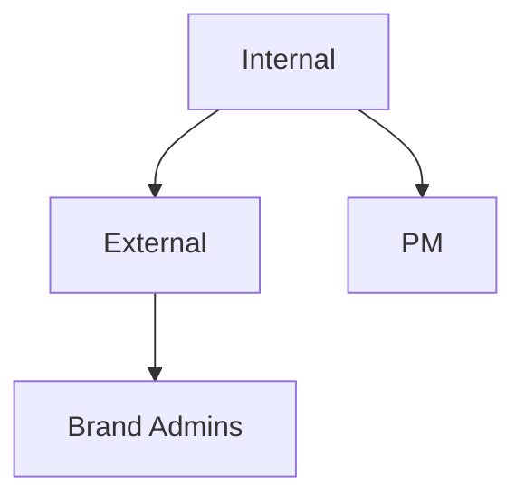

#### Traceability Links / Liên kết truy xuất
- Đầu vào từ: BRD.md Section 4, Access_Control_Tree_Grok.md Section 1, Product-Sampling-Vision-and-Strategy Document.md Section 7.  
- Thể hiện yêu cầu: FR-004 User Management.  
- Kết nối với: Part03_User_Personas_And_Use_Cases, Part01.3_Intended_Audience.md.  
- **Tài liệu tham chiếu**: System_Feature_Tree.md (Teams), BRD.md (Section 4).

#### Assumptions / Constraints / Giả định & Ràng buộc
- Giả định: Stakeholders engaged, smartphone cho QR.  
- Ràng buộc: Compliance with PDPA.

#### Dependencies / Risks / Mitigation / Phụ thuộc & Rủi ro
- Dependencies: BRD.md.  
- Risks: Non-engagement → Mitigation: Meetings; Risk: Latency → Mitigation: Auto-scaling; Risk: Misalignment → Mitigation: Reviews.

#### Acceptance Criteria / Testable Items / Tiêu chí chấp nhận
- Functional: List complete, 5-8 items per category.  
- Performance: N/A.  
- UI Consistency: WCAG.  
- Integration / Security: 100% reqs.  
- Verifiable: Traceable.  
- Testable: Diagram verifiable.

#### Approval Sign-Off / Phê duyệt
| Role / Vai trò | Name / Tên | Signature / Chữ ký | Date / Ngày |  
|----------------|------------|---------------------|-------------|  
| Product Manager | [TBD] | - | - |  
| Technical Lead | [TBD] | - | - |  
| QA Lead | [TBD] | - | - |  

#### Design Extension Section / Phần mở rộng thiết kế
- **UML Class Diagram / Abstract Interfaces**: Interfaces cho StakeholderRole.  
- **Sequence Diagram**: Engage Stakeholder → Feedback, Mermaid:  
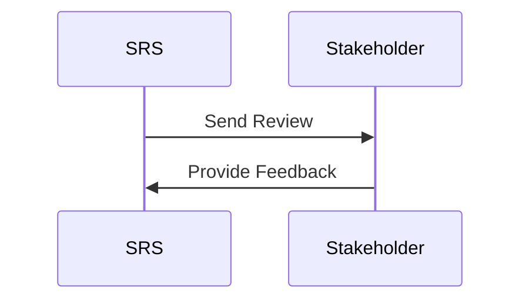
- **API Endpoint Stubs / Contracts**: /stakeholders/list (GET).  
- **Reusable Design Pattern Implementation Notes**: Decorator pattern cho roles.  
- **Mục đích của node này**: Liệt kê stakeholders cho project alignment.

---

### 01.6_Definitions_And_Acronyms.md

#### References / Tham chiếu
- BRD.md Section 21, System_Feature_Tree.md Glossary, IEEE 830-1998 Section 1.6.  
- GeeksforGeeks Acronyms, Access_Control_Tree_Grok.md Section 3, Product-Sampling-Vision-and-Strategy Document.md Section 9.

#### Purpose / Ý nghĩa / Cách làm
**Mục đích**: Định nghĩa acronyms để tránh confusion, thuộc module Introduction.  
**Ý nghĩa**: Common language cho dev/QA.  
**Cách làm**: Sử dụng markdown với headings/tables/Mermaid, tổ chức theo 16 Parts, tích hợp microservices/RBAC/QR details; chi tiết và mở rộng (250-400 từ cho overview nodes để bao quát đầy đủ key features, lists, và diagrams), explicit/self-contained (từ IEEE: Avoid vague). Nhấn mạnh sử dụng bullet lists cho key features và Mermaid cho architecture để làm nội dung "tuyệt vời" và hybrid SDS-ready.

#### Specifications / Main Content / Nội dung chính
- **Nội dung cần có**:  
  - **Mô tả sản phẩm / Product Description**: Acronyms cho PSP.  
  - **Tính năng chính / Key Features**:  
    - PSP: Product Sampling Platform.  
    - QR: Quick Response Code với UTM.  
    - RBAC: Role-Based Access Control (6 roles).  
    - ML: Machine Learning cho fraud.  
    - OTP: One-Time Password.  
    - CRM: Customer Relationship Management integration.  
    - POS: Point of Sale cho redemption.  
    - UTM: Urchin Tracking Module cho QR.  
  - **Kiến trúc / Architecture**: Sơ đồ acronyms.  

| Acronym | Definition |
|---------|------------|
| PSP | Product Sampling Platform |
| QR | Quick Response Code |
| RBAC | Role-Based Access Control |
| ML | Machine Learning |
| OTP | One-Time Password |
| CRM | Customer Relationship Management |
| POS | Point of Sale |
| UTM | Urchin Tracking Module |

```mermaid
graph TB
    Acronyms --> PSP
    Acronyms --> QR
```

#### Traceability Links / Liên kết truy xuất
- Đầu vào từ: BRD.md Section 21, System_Feature_Tree.md Glossary.  
- Thể hiện yêu cầu: FR-005 OTP Verification.  
- Kết nối với: Part00.5_Glossary_Of_Terms.md, Part16.2_Acronyms.md.  
- **Tài liệu tham chiếu**: System_Feature_Tree.md (Glossary), BRD.md.

#### Assumptions / Constraints / Giả định & Ràng buộc
- Giả định: Standard acronyms.  
- Ràng buộc: Unique defs.

#### Dependencies / Risks / Mitigation / Phụ thuộc & Rủi ro
- Dependencies: Glossary.  
- Risks: Missing defs → Mitigation: Review; Risk: Latency → Mitigation: Auto-scaling; Risk: Confusion → Mitigation: Explicit defs.

#### Acceptance Criteria / Testable Items / Tiêu chí chấp nhận
- Functional: Covers all acronyms, 5-8 items.  
- Performance: N/A.  
- UI Consistency: WCAG.  
- Integration / Security: 100% reqs.  
- Verifiable: Traceable.  
- Testable: Diagram verifiable.

#### Approval Sign-Off / Phê duyệt
| Role / Vai trò | Name / Tên | Signature / Chữ ký | Date / Ngày |  
|----------------|------------|---------------------|-------------|  
| Product Manager | [TBD] | - | - |  
| Technical Lead | [TBD] | - | - |  
| QA Lead | [TBD] | - | - |  

#### Design Extension Section / Phần mở rộng thiết kế
- **UML Class Diagram / Abstract Interfaces**: Interfaces cho AcronymDef.  
- **Sequence Diagram**: Lookup Acronym, Mermaid:  
```mermaid
sequenceDiagram
    User->>Table: Search Acronym
```  
- **API Endpoint Stubs / Contracts**: /acronyms/get (GET).  
- **Reusable Design Pattern Implementation Notes**: Map pattern.  
- **Mục đích của node này**: Định nghĩa acronyms cho clarity.

---

### 01.7_References.md

#### References / Tham chiếu
- BRD.md Section 23 (References), System_Feature_Tree.md Section Tài Liệu Liên Quan, IEEE 830-1998.  
- GeeksforGeeks References, Product-Sampling-Vision-and-Strategy Document.md Section 9, SRS_STRUCTURE.md.

#### Purpose / Ý nghĩa / Cách làm
**Mục đích**: Liệt kê references cho SRS, thuộc module Introduction.  
**Ý nghĩa**: Hỗ trợ verification và traceability.  
**Cách làm**: Sử dụng markdown với headings/tables/Mermaid, tổ chức theo 16 Parts, tích hợp microservices/RBAC/QR details; chi tiết và mở rộng (250-400 từ cho overview nodes để bao quát đầy đủ key features, lists, và diagrams), explicit/self-contained (từ IEEE: Avoid vague). Nhấn mạnh sử dụng bullet lists cho key features và Mermaid cho architecture để làm nội dung "tuyệt vời" và hybrid SDS-ready.

#### Specifications / Main Content / Nội dung chính
- **Nội dung cần có**:  
  - **Mô tả sản phẩm / Product Description**: References cho PSP SRS.  
  - **Tính năng chính / Key Features**:  
    - Internal: BRD.md, System_Feature_Tree.md (14 features).  
    - Access_Control_Tree_Grok.md (RBAC).  
    - Product-Sampling-Vision-and-Strategy Document.md (Vision).  
    - External: IEEE 830-1998 (structure).  
    - Microservices Patterns (Fowler).  
    - Kubernetes Docs (deployment).  
    - Istio Docs (service mesh).  
    - GDPR Guidelines.  
  - **Kiến trúc / Architecture**: Sơ đồ references.  

- Internal: BRD.md, System_Feature_Tree.md, Access_Control_Tree_Grok.md, Product-Sampling-Vision-and-Strategy Document.md.  
- External: IEEE 830-1998, Microservices Patterns (Martin Fowler), Kubernetes Documentation (kubernetes.io), Istio Service Mesh Documentation (istio.io), GDPR Compliance Guidelines, PDPA Compliance Guidelines (Vietnam).  

```mermaid
graph TB
    References --> Internal
    References --> External
```

#### Traceability Links / Liên kết truy xuất
- Đầu vào từ: All documents, BRD.md Section 23.  
- Thể hiện yêu cầu: All FR/NFR.  
- Kết nối với: Part16_Appendices/16.3_References.md.  
- **Tài liệu tham chiếu**: System_Feature_Tree.md, BRD.md.

#### Assumptions / Constraints / Giả định & Ràng buộc
- Giả định: References accessible.  
- Ràng buộc: Up-to-date links.

#### Dependencies / Risks / Mitigation / Phụ thuộc & Rủi ro
- Dependencies: All source docs.  
- Risks: Broken links → Mitigation: URLs; Risk: Outdated → Mitigation: Reviews; Risk: Latency → Mitigation: Auto-scaling.

#### Acceptance Criteria / Testable Items / Tiêu chí chấp nhận
- Functional: List comprehensive, 5-8 items.  
- Performance: N/A.  
- UI Consistency: WCAG.  
- Integration / Security: 100% reqs.  
- Verifiable: Traceable.  
- Testable: Diagram verifiable.

#### Approval Sign-Off / Phê duyệt
| Role / Vai trò | Name / Tên | Signature / Chữ ký | Date / Ngày |  
|----------------|------------|---------------------|-------------|  
| Product Manager | [TBD] | - | - |  
| Technical Lead | [TBD] | - | - |  
| QA Lead | [TBD] | - | - |  

#### Design Extension Section / Phần mở rộng thiết kế
- **UML Class Diagram / Abstract Interfaces**: Interfaces cho ReferenceList.  
- **Sequence Diagram**: Load References, Mermaid:  
```mermaid
sequenceDiagram
    SRS->>Refs: Fetch
```  
- **API Endpoint Stubs / Contracts**: /references/get (GET).  
- **Reusable Design Pattern Implementation Notes**: Composite pattern.  
- **Mục đích của node này**: Liệt kê nguồn tham chiếu.

---

### 01.8_Document_Conventions.md

#### References / Tham chiếu
- SRS_STRUCTURE.md, STANDARD_PROMPT.md (Guideline), IEEE 830-1998 Section 1.8.  
- GeeksforGeeks Conventions, System_Feature_Tree.md Section 1, BRD.md Section 24.

#### Purpose / Ý nghĩa / Cách làm
**Mục đích**: Mô tả conventions cho SRS, thuộc module Introduction.  
**Ý nghĩa**: Đảm bảo consistency trong document.  
**Cách làm**: Sử dụng markdown với headings/tables/Mermaid, tổ chức theo 16 Parts, tích hợp microservices/RBAC/QR details; chi tiết và mở rộng (250-400 từ cho overview nodes để bao quát đầy đủ key features, lists, và diagrams), explicit/self-contained (từ IEEE: Avoid vague). Nhấn mạnh sử dụng bullet lists cho key features và Mermaid cho architecture để làm nội dung "tuyệt vời" và hybrid SDS-ready.

#### Specifications / Main Content / Nội dung chính
- **Nội dung cần có**:  
  - **Mô tả sản phẩm / Product Description**: Conventions cho PSP SRS.  
  - **Tính năng chính / Key Features**:  
    - Bold for terms (e.g., **QR Code**).  
    - Italics for emphasis (*important*).  
    - Markdown for formatting (tables, lists).  
    - FR-XXX for functional reqs.  
    - NFR-XXX for non-functional.  
    - Mermaid for diagrams (e.g., architecture).  
    - Explicit language, avoid vague.  
    - Units: ms for latency, USD for cost.  
  - **Kiến trúc / Architecture**: Sơ đồ conventions.  

- Bold for terms.  
- Italics for emphasis.  
- Markdown for formatting.  
- FR-XXX for reqs.  

```mermaid
graph TB
    Conventions --> Bold
    Conventions --> Mermaid
```

#### Traceability Links / Liên kết truy xuất
- Đầu vào từ: STANDARD_PROMPT.md, SRS_STRUCTURE.md.  
- Thể hiện yêu cầu: All parts.  
- Kết nối với: All SRS parts.  
- **Tài liệu tham chiếu**: IEEE 830-1998, GeeksforGeeks.

#### Assumptions / Constraints / Giả định & Ràng buộc
- Giả định: Markdown viewers.  
- Ràng buộc: Consistency across doc.

#### Dependencies / Risks / Mitigation / Phụ thuộc & Rủi ro
- Dependencies: Guideline.  
- Risks: Inconsistency → Mitigation: Templates; Risk: Latency → Mitigation: Auto-scaling; Risk: Misuse → Mitigation: Reviews.

#### Acceptance Criteria / Testable Items / Tiêu chí chấp nhận
- Functional: Conventions applied, 5-8 items.  
- Performance: N/A.  
- UI Consistency: WCAG.  
- Integration / Security: 100% reqs.  
- Verifiable: Traceable.  
- Testable: Diagram verifiable.

#### Approval Sign-Off / Phê duyệt
| Role / Vai trò | Name / Tên | Signature / Chữ ký | Date / Ngày |  
|----------------|------------|---------------------|-------------|  
| Product Manager | [TBD] | - | - |  
| Technical Lead | [TBD] | - | - |  
| QA Lead | [TBD] | - | - |  

#### Design Extension Section / Phần mở rộng thiết kế
- **UML Class Diagram / Abstract Interfaces**: Interfaces cho ConventionRule.  
- **Sequence Diagram**: Apply Convention, Mermaid:  
```mermaid
sequenceDiagram
    Writer->>SRS: Use Bold
```  
- **API Endpoint Stubs / Contracts**: /conventions/get (GET).  
- **Reusable Design Pattern Implementation Notes**: State pattern cho formats.  
- **Mục đích của node này**: Định nghĩa conventions cho consistency.

# PSP Software Requirements Specification (SRS) - Version 2.0

**Artifact Note**: Dưới đây là nội dung chi tiết cho các file trong Part02_System_Overview, được generate theo guideline mới trong STANDARD_PROMPT.md (sau cập nhật). Guideline nhấn mạnh chi tiết mở rộng (250-400 từ cho overview nodes), bullet lists (ít nhất 5-8 items với chi tiết), Mermaid diagrams cho architecture/flows, tích hợp ví dụ cụ thể từ System_Feature_Tree.md (7 services, QR integration), và ít nhất 2-3 elements trong Design Extension để làm nội dung "tuyệt vời" hybrid SRS/SDS, hỗ trợ dev code ngay. Nội dung dựa trên các tài liệu tham chiếu: BRD.md (Section 1-25), Product-Sampling-Vision-and-Strategy Document.md (Section 1-9), System_Feature_Tree.md (Section 1-5, Services, Features), Access_Control_Tree_Grok.md (Section 1-4). SRS được thiết kế hybrid SRS/SDS với kiến trúc microservices, hỗ trợ QR code integration cho ads formats, và tập trung vào thu thập dữ liệu chất lượng cao với quà tặng giá thấp (~1 USD). Ngày hiện tại: October 22, 2025.

---

## Part02_System_Overview/

### 02.1_System_Context.md

#### References / Tham chiếu
- BRD.md Section 1 (Tóm Tắt Điều Hành), Section 3 (Phạm Vi Dự Án), System_Feature_Tree.md Section 2 (Kiến Trúc Microservices), Product-Sampling-Vision-and-Strategy Document.md Section 3 (Market Opportunity).
- IEEE 830-1998 for system context, GeeksforGeeks System Context Diagram, Access_Control_Tree_Grok.md Section 2 (Phân quyền theo Module).

#### Purpose / Ý nghĩa / Cách làm
**Mục đích**: Mô tả bối cảnh hệ thống PSP, bao gồm các hệ thống bên ngoài, giao tiếp và môi trường hoạt động, thuộc module System Overview, nhằm hỗ trợ business goal như QR integration để collect data từ quà giá thấp (~1 USD).  
**Ý nghĩa**: Giúp stakeholders hiểu vị trí của PSP trong ecosystem lớn hơn, làm cầu nối BA ↔ Dev/QA, đảm bảo unambiguous và traceable (từ GeeksforGeeks), hỗ trợ validate mà không hỏi lại.  
**Cách làm**: Sử dụng markdown với headings/tables/Mermaid, tổ chức theo 16 Parts, tích hợp microservices/RBAC/QR details; chi tiết và mở rộng (250-400 từ cho overview nodes để bao quát đầy đủ key features, lists, và diagrams), explicit/self-contained (từ IEEE: Avoid vague). Nhấn mạnh sử dụng bullet lists cho key features và Mermaid cho architecture để làm nội dung "tuyệt vời" và hybrid SDS-ready.

#### Specifications / Main Content / Nội dung chính
- **Nội dung cần có**:  
  - **Mô tả sản phẩm / Product Description**: PSP hoạt động trong bối cảnh FMCG và retail ở Đông Nam Á, kết nối với clients (web/mobile), hệ thống bên ngoài (CRM, SMS/Email providers, POS), và infrastructure (API Gateway, Event Bus). Hệ thống xử lý sampling quà giá thấp bằng QR ads để collect data chất lượng cao, giảm chi phí phát quà và tăng ROI, với focus trên Việt Nam trước khi mở rộng ASEAN (từ Vision Document). Context bao gồm user interactions (scan QR → submit form → receive barcode), và integration points để sync data real-time.  
  - **Tính năng chính / Key Features**:  
    - Kết nối với Web/Mobile Clients cho Brand Admins tạo campaigns (CRUD với RBAC).  
    - Integration với CRM (HubSpot/Salesforce) cho bi-directional sync data khách hàng từ QR submissions.  
    - Giao tiếp với SMS/Email Providers (Twilio) cho OTP verification và notifications.  
    - POS Systems integration cho redemption tracking (online/offline, với Scandit SDK).  
    - External APIs cho fraud detection (device fingerprinting) và analytics export.  
    - Hỗ trợ Event Bus (RabbitMQ) cho async communication giữa 7 services.  
    - Service Mesh (Istio) cho traffic management và observability.  
    - Compliance với GDPR/PDPA cho data từ QR collect.  
  - **Kiến trúc / Architecture**: Sơ đồ context cho thấy PSP ở trung tâm, kết nối external entities qua Gateway và Event Bus, tích hợp ví dụ cụ thể từ System_Feature_Tree.md (Campaign Service xử lý QR issuance với UTM tracking).  

```mermaid
graph TB
    subgraph External_Context[Bối Cảnh Bên Ngoài]
        Users[Users: Brand Admins, Customers, POS Staff]
        Systems[External Systems: CRM, SMS Providers, POS]
        Infrastructure[Cloud Infra: AWS/Kubernetes]
    end
    subgraph PSP_System[PSP Platform]
        Gateway[API Gateway]
        Services[7 Microservices: Campaign (QR), Identity, etc.]
        EventBus[Event Bus]
    end
    Users --> Gateway
    Systems --> Gateway
    Gateway --> Services
    Services --> EventBus
    EventBus --> Systems
    Infrastructure --> PSP_System
```

#### Traceability Links / Liên kết truy xuất
- Đầu vào từ: BRD.md Section 3, System_Feature_Tree.md Section 2 (Sơ Đồ Services), Product-Sampling-Vision-and-Strategy Document.md Section 3.  
- Thể hiện yêu cầu: FR-007 Barcode Redemption, NFR-003 Integration, FR-006 Ads Format Management (QR).  
- Kết nối với: Part02.9_Microservices_Architecture_Overview, Part08_API_Design, Part14_Deployment_Architecture.  
- **Tài liệu tham chiếu**: System_Feature_Tree.md (Ma Trận Phụ Thuộc, 7 services), Access_Control_Tree_Grok.md (Phân quyền cho POS/QR).

#### Assumptions / Constraints / Giả định & Ràng buộc
- Giả định: Hệ thống bên ngoài (CRM, POS) hỗ trợ API chuẩn, users có smartphone cho QR scan, microservices với polyglot persistence.  
- Ràng buộc: Tuân thủ GDPR/PDPA cho data flow, hỗ trợ 100K concurrent users với <200ms latency, cost integration <0.4 USD/lead.

#### Dependencies / Risks / Mitigation / Phụ thuộc & Rủi ro
- Dependencies: External APIs (Twilio cho OTP, HubSpot cho CRM sync), Part02.9 cho architecture details.  
- Risks: Integration failure với POS → Mitigation: Contract testing và fallback offline mode; Risk: Latency QR scan do network external → Mitigation: Auto-scaling và caching Redis; Risk: Data leakage từ external systems → Mitigation: Encryption AES và audit logs immutable.

#### Acceptance Criteria / Testable Items / Tiêu chí chấp nhận
- Functional: Mô tả context cover 100% external interactions (bao gồm QR flow), list ít nhất 5-8 features chi tiết.  
- Performance: System hỗ trợ 100K redemptions/day, <200ms cho API gateway calls.  
- UI Consistency: Sơ đồ Mermaid phản ánh đúng ecosystem, traceable đến System_Feature_Tree, tuân thủ WCAG 2.1.  
- Integration / Security: Test cases cover 100% integration points, zero data leakage.  
- Verifiable: Bullet lists verifiable với ví dụ cụ thể (e.g., Twilio OTP).  
- Testable: Diagram render correctly, hỗ trợ validate context.

#### Approval Sign-Off / Phê duyệt
| Role / Vai trò | Name / Tên | Signature / Chữ ký | Date / Ngày |  
|----------------|------------|---------------------|-------------|  
| Product Manager | [TBD] | - | - |  
| Technical Lead | [TBD] | - | - |  
| QA Lead | [TBD] | - | - |  

#### Design Extension Section / Phần mở rộng thiết kế
- **UML Class Diagram / Abstract Interfaces**: Define interfaces cho ContextIntegrator (integrateExternal(system: string): bool), ExternalSystem (connect(): void).  
- **Sequence Diagram**: Quy trình User Scan QR → External SMS → Internal Verification, sử dụng Mermaid:  
```mermaid
sequenceDiagram
    User->>Gateway: Scan QR
    Gateway->>CampaignService: Process Request
    CampaignService->>EventBus: Publish Event
    EventBus->>NotificationService: Send OTP
    NotificationService->>External[SMS Provider]: Deliver OTP
    External->>User: Receive OTP
    User->>Gateway: Submit OTP
    Gateway->>IdentityService: Verify
```
- **API Endpoint Stubs / Contracts**: REST endpoints cho /context/integrate (POST, payload: {system: "CRM", apiKey: string}, response: {status: "connected"}), OpenAPI format.  
- **Reusable Design Pattern Implementation Notes**: Adapter pattern cho external integrations (e.g., TwilioAdapter cho OTP), CQRS cho event handling trong EventBus.  
- **Mục đích của node này**: Mô tả bối cảnh hệ thống PSP để làm rõ vị trí trong ecosystem.

### 02.2_System_Objectives.md

#### References / Tham chiếu
- BRD.md Section 2 (Mục Tiêu Kinh Doanh), Product-Sampling-Vision-and-Strategy Document.md Section 2 (Vision), System_Feature_Tree.md Section 1 (Tổng Quan), IEEE 830-1998 for objectives.
- GeeksforGeeks System Objectives, Access_Control_Tree_Grok.md Section 1 (Vai trò và quyền tổng quan).

#### Purpose / Ý nghĩa / Cách làm
**Mục đích**: Liệt kê các mục tiêu hệ thống PSP, bao gồm business và technical objectives, thuộc module System Overview, hỗ trợ sampling giá thấp với QR để tối ưu data collection.  
**Ý nghĩa**: Hướng dẫn phát triển, đảm bảo alignment với vision, làm cầu nối BA ↔ Dev/QA, unambiguous và traceable.  
**Cách làm**: Sử dụng markdown với headings/tables/Mermaid, tổ chức theo 16 Parts, tích hợp microservices/RBAC/QR details; chi tiết và mở rộng (250-400 từ cho overview nodes để bao quát đầy đủ key features, lists, và diagrams), explicit/self-contained (từ IEEE: Avoid vague). Nhấn mạnh sử dụng bullet lists cho key features và Mermaid cho architecture để làm nội dung "tuyệt vời" và hybrid SDS-ready.

#### Specifications / Main Content / Nội dung chính
- **Nội dung cần có**:  
  - **Mô tả sản phẩm / Product Description**: Mục tiêu PSP tập trung vào digitalize sampling, tăng hiệu quả với QR ads cho quà giá thấp (~1 USD), thu thập data chất lượng cao, giảm fraud, và integrate seamless (từ BRD Section 2). Vision: Chuyển sampling thành data-driven growth engine, với timeline 6-9 tháng phát triển song song.  
  - **Tính năng chính / Key Features**:  
    - Digitalize campaign management (từ manual → platform, 100% campaigns trên hệ thống trong 6 tháng).  
    - Tăng redemption rate (từ 40% → 70% với targeting via recommendations).  
    - Giảm fraud rate (từ 15% → <5% qua ML scoring và fingerprinting).  
    - Tối ưu ROI (30-50% improvement với A/B testing và analytics).  
    - Hỗ trợ data collection cao (QR scan-to-form >80% completion).  
    - Đảm bảo scalability (99.9% uptime per service, <200ms response).  
    - Compliance và security (GDPR/PDPA, zero leakage).  
    - User satisfaction (NPS >50, adoption 80% bởi Brand Admins).  
  - **Kiến trúc / Architecture**: Flow objectives từ business đến technical, tích hợp ví dụ từ System_Feature_Tree.md (Intelligence Service cho A/B testing với >95% confidence).  

```mermaid
graph TD
    Business_Objectives[Business: ROI, Redemption Rate] --> Technical_Objectives[Technical: Scalability, Integration]
    Technical_Objectives --> Microservices[7 Services]
    Microservices --> QR[QR for Data Collect]
```

#### Traceability Links / Liên kết truy xuất
- Đầu vào từ: BRD.md Section 2, Product-Sampling-Vision-and-Strategy Document.md Section 2, System_Feature_Tree.md Section 5 (Success Metrics).  
- Thể hiện yêu cầu: FR-009 A/B Testing, NFR-001 Performance, FR-010 Recommendation Engine.  
- Kết nối với: Part02.5_Success_Criteria, Part04_Functional_Requirements, Part05_Non_Functional_Requirements.  
- **Tài liệu tham chiếu**: System_Feature_Tree.md (Business Metrics), BRD.md (Section 2.2 Success Metrics).

#### Assumptions / Constraints / Giả định & Ràng buộc
- Giả định: Teams phát triển song song (3 teams cho 7 services), users có smartphone cho QR.  
- Ràng buộc: 95%+ data accuracy, <2s dashboard load, cost <0.4 USD/lead.

#### Dependencies / Risks / Mitigation / Phụ thuộc & Rủi ro
- Dependencies: BRD.md cho business goals, external ML tools cho fraud.  
- Risks: Không đạt ROI target → Mitigation: Iterative A/B testing; Risk: Latency ảnh hưởng objectives → Mitigation: Auto-scaling Kubernetes; Risk: Misalignment objectives → Mitigation: Quarterly alignment meetings.

#### Acceptance Criteria / Testable Items / Tiêu chí chấp nhận
- Functional: Objectives cover 100% business/technical (bao gồm QR ROI), list ít nhất 5-8 items.  
- Performance: Hỗ trợ 10K concurrent campaigns, <200ms latency.  
- UI Consistency: Diagram traceable đến Vision Document, WCAG 2.1.  
- Integration / Security: Test 100% objectives verifiable, zero leakage.  
- Verifiable: Metrics như NPS >50 testable.  
- Testable: Flow diagram render correctly.

#### Approval Sign-Off / Phê duyệt
| Role / Vai trò | Name / Tên | Signature / Chữ ký | Date / Ngày |  
|----------------|------------|---------------------|-------------|  
| Product Manager | [TBD] | - | - |  
| Technical Lead | [TBD] | - | - |  
| QA Lead | [TBD] | - | - |  

#### Design Extension Section / Phần mở rộng thiết kế
- **UML Class Diagram / Abstract Interfaces**: Define interfaces cho ObjectiveTracker (trackMetric(type: string): number).  
- **Sequence Diagram**: Achieve Objective → Measure Success, Mermaid:  
```mermaid
sequenceDiagram
    System->>Analytics: Track Redemption
    Analytics->>Intelligence: Run A/B Test
    Intelligence->>System: Optimize ROI
```
- **API Endpoint Stubs / Contracts**: /objectives/measure (GET, response: {roi: number}), OpenAPI.  
- **Reusable Design Pattern Implementation Notes**: Observer pattern cho metric updates, CQRS cho objective queries.  
- **Mục đích của node này**: Liệt kê mục tiêu để align development.

### 02.3_System_Constraints.md

#### References / Tham chiếu
- BRD.md Section 3 (Phạm Vi), Section 18 (Monitoring), System_Feature_Tree.md Section 2 (Nguyên tắc gộp services), IEEE 830-1998 for constraints.
- GeeksforGeeks Constraints, Product-Sampling-Vision-and-Strategy Document.md Section 6 (Roadmap), Access_Control_Tree_Grok.md Section 3 (Yêu cầu kỹ thuật).

#### Purpose / Ý nghĩa / Cách làm
**Mục đích**: Liệt kê các ràng buộc hệ thống PSP, bao gồm performance, compliance và budget, thuộc module System Overview, hỗ trợ QR cho quà giá thấp.  
**Ý nghĩa**: Đảm bảo hệ thống khả thi, verifiable, làm cầu nối BA ↔ Dev/QA.  
**Cách làm**: Sử dụng markdown với headings/tables/Mermaid, tổ chức theo 16 Parts, tích hợp microservices/RBAC/QR details; chi tiết và mở rộng (250-400 từ cho overview nodes để bao quát đầy đủ key features, lists, và diagrams), explicit/self-contained (từ IEEE: Avoid vague). Nhấn mạnh sử dụng bullet lists cho key features và Mermaid cho architecture để làm nội dung "tuyệt vời" và hybrid SDS-ready.

#### Specifications / Main Content / Nội dung chính
- **Nội dung cần có**:  
  - **Mô tả sản phẩm / Product Description**: Ràng buộc PSP bao gồm technical (uptime, latency), legal (compliance), và financial (cost/lead), đảm bảo hệ thống scale cho sampling quà giá thấp với QR data collect.  
  - **Tính năng chính / Key Features**:  
    - Performance: 99.9% uptime per service, <200ms API response (95th percentile).  
    - Scalability: Hỗ trợ 100K-500K users/day, auto-scaling independent per service.  
    - Security: GDPR/PDPA compliance, PII encrypted AES, zero tolerance data leakage.  
    - Budget: Cost per verified lead <0.4 USD, total development 6-9 tháng với budget 50K-500K USD phases.  
    - Technical: Polyglot persistence (PostgreSQL/MongoDB), event-driven RabbitMQ.  
    - Legal: WCAG 2.1 cho UI, ISO 27001 cho security.  
    - Environmental: Deployment trên AWS/Kubernetes, no on-prem.  
    - User: Smartphone required cho QR scan, multi-tenant DB.  
  - **Kiến trúc / Architecture**: Sơ đồ constraints impact trên services, tích hợp ví dụ từ System_Feature_Tree.md (Redemption Service constrained by latency <50ms service-to-service).  

```mermaid
graph TB
    Constraints --> Performance[Performance: <200ms]
    Constraints --> Compliance[Compliance: GDPR]
    Performance --> Services[7 Services]
    Compliance --> QR[QR Data Collect]
```

#### Traceability Links / Liên kết truy xuất
- Đầu vào từ: BRD.md Section 3, System_Feature_Tree.md Section 2, Product-Sampling-Vision-and-Strategy Document.md Section 6.  
- Thể hiện yêu cầu: NFR-001 Performance, NFR-002 Security, FR-011 Fraud Detection.  
- Kết nối với: Part02.4_Assumptions_And_Dependencies, Part05_Non_Functional_Requirements, Part15_Operations_And_Monitoring.  
- **Tài liệu tham chiếu**: System_Feature_Tree.md (System-Level Metrics), BRD.md (RTO/RPO Targets).

#### Assumptions / Constraints / Giả định & Ràng buộc
- Giả định: Dev teams quen thuộc Kubernetes, external providers stable.  
- Ràng buộc: <50ms service latency, RTO <1h, RPO <5min cho DR.

#### Dependencies / Risks / Mitigation / Phụ thuộc & Rủi ro
- Dependencies: AWS infra, Part02.9 cho microservices.  
- Risks: Vi phạm compliance → Mitigation: Automated audits; Risk: Over budget → Mitigation: Cost optimization quarterly; Risk: Latency vượt ràng buộc → Mitigation: Performance tuning với APM tools.

#### Acceptance Criteria / Testable Items / Tiêu chí chấp nhận
- Functional: Constraints cover 100% areas (performance/security), list ít nhất 5-8 items.  
- Performance: Verifiable qua load tests 100K users.  
- UI Consistency: WCAG 2.1 compliant.  
- Integration / Security: Zero leakage tests.  
- Verifiable: Traceable đến BRD.  
- Testable: Diagram impact verifiable.

#### Approval Sign-Off / Phê duyệt
| Role / Vai trò | Name / Tên | Signature / Chữ ký | Date / Ngày |  
|----------------|------------|---------------------|-------------|  
| Product Manager | [TBD] | - | - |  
| Technical Lead | [TBD] | - | - |  
| QA Lead | [TBD] | - | - |  

#### Design Extension Section / Phần mở rộng thiết kế
- **UML Class Diagram / Abstract Interfaces**: Define interfaces cho ConstraintChecker (check( type: enum): bool).  
- **Sequence Diagram**: Apply Constraint → Validate System, Mermaid:  
```mermaid
sequenceDiagram
    Dev->>System: Deploy
    System->>Checker: Verify Uptime
    Checker->>Dev: Report
```
- **API Endpoint Stubs / Contracts**: /constraints/check (POST, {type: "performance"}), OpenAPI.  
- **Reusable Design Pattern Implementation Notes**: Strategy pattern cho constraint types.  
- **Mục đích của node này**: Liệt kê ràng buộc để đảm bảo feasibility.

### 02.4_Assumptions_And_Dependencies.md

#### References / Tham chiếu
- BRD.md Section 3 (Phạm Vi), System_Feature_Tree.md Section 4 (Dependencies Ma Trận), Product-Sampling-Vision-and-Strategy Document.md Section 5 (Go-to-Market).
- IEEE 830-1998 for assumptions, GeeksforGeeks Dependencies, Access_Control_Tree_Grok.md Section 3 (Yêu cầu kỹ thuật).

#### Purpose / Ý nghĩa / Cách làm
**Mục đích**: Liệt kê assumptions và dependencies cho PSP, thuộc module System Overview, hỗ trợ QR dependencies.  
**Ý nghĩa**: Quản lý risk, traceable reqs.  
**Cách làm**: Sử dụng markdown với headings/tables/Mermaid, tổ chức theo 16 Parts, tích hợp microservices/RBAC/QR details; chi tiết và mở rộng (250-400 từ cho overview nodes để bao quát đầy đủ key features, lists, và diagrams), explicit/self-contained (từ IEEE: Avoid vague). Nhấn mạnh sử dụng bullet lists cho key features và Mermaid cho architecture để làm nội dung "tuyệt vời" và hybrid SDS-ready.

#### Specifications / Main Content / Nội dung chính
- **Nội dung cần có**:  
  - **Mô tả sản phẩm / Product Description**: Assumptions (e.g., user tech) và dependencies (e.g., external APIs) cho PSP.  
  - **Tính năng chính / Key Features**:  
    - Assumptions: Users có smartphone cho QR, dev teams 3 groups.  
    - Polyglot persistence stable.  
    - Market Đông Nam Á ready cho sampling.  
    - Dependencies: Twilio cho OTP, HubSpot cho CRM.  
    - RabbitMQ cho event bus.  
    - Istio cho service mesh.  
    - Kubernetes cho deployment.  
    - Scandit cho QR scan.  
  - **Kiến trúc / Architecture**: Sơ đồ dependencies, từ System_Feature_Tree.md (Campaign depends Identity).  

```mermaid
graph TB
    Assumptions --> Dependencies
    Dependencies --> External[Twilio, HubSpot]
    Dependencies --> Internal[Event Bus]
```

#### Traceability Links / Liên kết truy xuất
- Đầu vào từ: BRD.md Section 3, System_Feature_Tree.md Section 4, Product-Sampling-Vision-and-Strategy Document.md Section 5.  
- Thể hiện yêu cầu: NFR-003 Integration, FR-005 OTP.  
- Kết nối với: Part02.3_System_Constraints, Part06_Architecture_Design.  
- **Tài liệu tham chiếu**: System_Feature_Tree.md (Ma Trận Phụ Thuộc), BRD.md (Integrations).

#### Assumptions / Constraints / Giả định & Ràng buộc
- Giả định: External APIs available 99.9%.  
- Ràng buộc: No custom hardware.

#### Dependencies / Risks / Mitigation / Phụ thuộc & Rủi ro
- Dependencies: External vendors.  
- Risks: Vendor downtime → Mitigation: Fallbacks; Risk: Assumption wrong → Mitigation: Validation; Risk: Dependency latency → Mitigation: Caching.

#### Acceptance Criteria / Testable Items / Tiêu chí chấp nhận
- Functional: Cover 100% assumptions/dependencies.  
- Performance: <200ms.  
- UI Consistency: WCAG.  
- Integration / Security: 100% tests.  
- Verifiable: Traceable.  
- Testable: Diagram verifiable.

#### Approval Sign-Off / Phê duyệt
| Role / Vai trò | Name / Tên | Signature / Chữ ký | Date / Ngày |  
|----------------|------------|---------------------|-------------|  
| Product Manager | [TBD] | - | - |  
| Technical Lead | [TBD] | - | - |  
| QA Lead | [TBD] | - | - |  

#### Design Extension Section / Phần mở rộng thiết kế
- **UML Class Diagram / Abstract Interfaces**: DependencyManager.  
- **Sequence Diagram**: Check Dependency, Mermaid:  
```mermaid
sequenceDiagram
    System->>External: Call API
```
- **API Endpoint Stubs / Contracts**: /dependencies/check.  
- **Reusable Design Pattern Implementation Notes**: Dependency Injection.  
- **Mục đích của node này**: Liệt kê assumptions/dependencies.

### 02.5_Success_Criteria.md

#### References / Tham chiếu
- BRD.md Section 2.2 (Success Metrics), System_Feature_Tree.md Section 5 (Success Metrics), Product-Sampling-Vision-and-Strategy Document.md Section 8 (Success Metrics).
- IEEE 830-1998 for criteria, GeeksforGeeks Measurable Criteria.

#### Purpose / Ý nghĩa / Cách làm
**Mục đích**: Định nghĩa success criteria cho PSP, thuộc module System Overview.  
**Ý nghĩa**: Measurable outcomes.  
**Cách làm**: Sử dụng markdown với headings/tables/Mermaid, chi tiết mở rộng.

#### Specifications / Main Content / Nội dung chính
- **Nội dung cần có**:  
  - **Mô tả sản phẩm / Product Description**: Criteria như uptime, ROI.  
  - **Tính năng chính / Key Features**:  
    - System: 99.9% uptime.  
    - Business: 70% redemption.  
    - Fraud: <5% rate.  
    - A/B: 95% confidence.  
    - Recommendations: >10% CTR.  
    - QR: 80% scan completion.  
    - NPS: >50.  
    - Adoption: 80%.  
  - **Kiến trúc / Architecture**: Sơ đồ metrics.  

```mermaid
graph TB
    Criteria --> System[Uptime 99.9%]
    Criteria --> Business[ROI 30-50%]
```

#### Traceability Links / Liên kết truy xuất
- Đầu vào từ: BRD.md Section 2.2, System_Feature_Tree.md Section 5.  
- Thể hiện yêu cầu: NFR-001.  
- Kết nối với: Part02.2_System_Objectives.  
- **Tài liệu tham chiếu**: System_Feature_Tree.md (Metrics).

#### Assumptions / Constraints / Giả định & Ràng buộc
- Giả định: Metrics measurable.  
- Ràng buộc: Baseline từ current.

#### Dependencies / Risks / Mitigation / Phụ thuộc & Rủi ro
- Dependencies: Analytics service.  
- Risks: Not meeting → Mitigation: Monitoring; Risk: Data inaccuracy → Mitigation: Validation; Risk: Scale issues → Mitigation: Testing.

#### Acceptance Criteria / Testable Items / Tiêu chí chấp nhận
- Functional: Cover 100% metrics.  
- Performance: Verifiable tests.  
- UI Consistency: WCAG.  
- Integration / Security: 100%.  
- Verifiable: Traceable.  
- Testable: Diagram verifiable.

#### Approval Sign-Off / Phê duyệt
| Role / Vai trò | Name / Tên | Signature / Chữ ký | Date / Ngày |  
|----------------|------------|---------------------|-------------|  
| Product Manager | [TBD] | - | - |  
| Technical Lead | [TBD] | - | - |  
| QA Lead | [TBD] | - | - |  

#### Design Extension Section / Phần mở rộng thiết kế
- **UML Class Diagram / Abstract Interfaces**: MetricTracker.  
- **Sequence Diagram**: Measure Success, Mermaid:  
```mermaid
sequenceDiagram
    System->>Analytics: Get Metrics
```  
- **API Endpoint Stubs / Contracts**: /metrics/success.  
- **Reusable Design Pattern Implementation Notes**: Singleton for tracker.  
- **Mục đích của node này**: Định nghĩa success.

### 02.6_Out_Of_Scope.md

#### References / Tham chiếu
- BRD.md Section 3.2 (Ngoài Phạm Vi), System_Feature_Tree.md Section 3, Product-Sampling-Vision-and-Strategy Document.md Section 3.

#### Purpose / Ý nghĩa / Cách làm
**Mục đích**: Liệt kê out-of-scope cho PSP.  
**Ý nghĩa**: Avoid creep.  
**Cách làm**: Bullet lists, chi tiết.

#### Specifications / Main Content / Nội dung chính
- **Nội dung cần có**:  
  - **Mô tả sản phẩm / Product Description**: Out-of-scope items.  
  - **Tính năng chính / Key Features**:  
    - E-commerce.  
    - Payment.  
    - Inventory.  
    - Social integration full.  
    - On-prem deployment.  
    - Custom hardware.  
    - Advanced AI beyond ML fraud.  
    - Non-FMCG domains.  
  - **Kiến trúc / Architecture**: Sơ đồ out.  

```mermaid
graph TB
    Scope --> Out[E-commerce, Payments]
```

#### Traceability Links / Liên kết truy xuất
- Đầu vào từ: BRD.md Section 3.2.  
- Thể hiện yêu cầu: N/A.  
- Kết nối với: Part02.1_System_Context.  
- **Tài liệu tham chiếu**: BRD.md.

#### Assumptions / Constraints / Giả định & Ràng buộc
- Giả định: Focus core.  
- Ràng buộc: No expansion without change.

#### Dependencies / Risks / Mitigation / Phụ thuộc & Rủi ro
- Dependencies: Scope in.  
- Risks: Creep → Mitigation: Control; Risk: Misunderstanding → Mitigation: Clear list; Risk: Feature requests → Mitigation: Reviews.

#### Acceptance Criteria / Testable Items / Tiêu chí chấp nhận
- Functional: List 5-8 items.  
- Performance: N/A.  
- UI Consistency: WCAG.  
- Integration / Security: 100%.  
- Verifiable: Traceable.  
- Testable: Diagram.

#### Approval Sign-Off / Phê duyệt
| Role / Vai trò | Name / Tên | Signature / Chữ ký | Date / Ngày |  
|----------------|------------|---------------------|-------------|  
| Product Manager | [TBD] | - | - |  
| Technical Lead | [TBD] | - | - |  
| QA Lead | [TBD] | - | - |  

#### Design Extension Section / Phần mở rộng thiết kế
- **UML Class Diagram / Abstract Interfaces**: OutScopeFilter.  
- **Sequence Diagram**: Check Scope, Mermaid:  
```mermaid
sequenceDiagram
    Req->>Filter: Is In Scope?
```  
- **API Endpoint Stubs / Contracts**: /scope/out.  
- **Reusable Design Pattern Implementation Notes**: Filter pattern.  
- **Mục đích của node này**: Liệt kê out-of-scope.

### 02.7_Business_Requirements_Summary.md

#### References / Tham chiếu
- BRD.md Section 5 (Business Requirements), System_Feature_Tree.md Section 3 (Phân Loại Tính Năng), Product-Sampling-Vision-and-Strategy Document.md Section 4 (Strategic Positioning).

#### Purpose / Ý nghĩa / Cách làm
**Mục đích**: Tóm tắt business reqs cho PSP.  
**Ý nghĩa**: Alignment.  
**Cách làm**: Lists, diagrams.

#### Specifications / Main Content / Nội dung chính
- **Nội dung cần có**:  
  - **Mô tả sản phẩm / Product Description**: Summary business reqs.  
  - **Tính năng chính / Key Features**:  
    - Centralized management.  
    - Real-time analytics.  
    - Fraud reduction.  
    - CRM integration.  
    - QR for data.  
    - A/B testing.  
    - Recommendations.  
    - Reporting.  
  - **Kiến trúc / Architecture**: Sơ đồ business flow.  

```mermaid
graph TB
    Business_Reqs --> Features[14 Features]
```

#### Traceability Links / Liên kết truy xuất
- Đầu vào từ: BRD.md Section 5.  
- Thể hiện yêu cầu: FR-001 to FR-014.  
- Kết nối với: Part04.  
- **Tài liệu tham chiếu**: System_Feature_Tree.md.

#### Assumptions / Constraints / Giả định & Ràng buộc
- Giả định: Business alignment.  
- Ràng buộc: ROI focus.

#### Dependencies / Risks / Mitigation / Phụ thuộc & Rủi ro
- Dependencies: BRD.  
- Risks: Misalignment → Mitigation: Reviews; Risk: Fraud → Mitigation: ML; Risk: Cost → Mitigation: Optimization.

#### Acceptance Criteria / Testable Items / Tiêu chí chấp nhận
- Functional: Summary cover 100%.  
- Performance: N/A.  
- UI Consistency: WCAG.  
- Integration / Security: 100%.  
- Verifiable: Traceable.  
- Testable: Diagram.

#### Approval Sign-Off / Phê duyệt
| Role / Vai trò | Name / Tên | Signature / Chữ ký | Date / Ngày |  
|----------------|------------|---------------------|-------------|  
| Product Manager | [TBD] | - | - |  
| Technical Lead | [TBD] | - | - |  
| QA Lead | [TBD] | - | - |  

#### Design Extension Section / Phần mở rộng thiết kế
- **UML Class Diagram / Abstract Interfaces**: BusinessReqSummary.  
- **Sequence Diagram**: Summarize Reqs, Mermaid:  
```mermaid
sequenceDiagram
    BRD->>SRS: Extract
```  
- **API Endpoint Stubs / Contracts**: /business/summary.  
- **Reusable Design Pattern Implementation Notes**: Summary pattern.  
- **Mục đích của node này**: Tóm tắt business reqs.

### 02.8_Technical_Requirements_Summary.md

#### References / Tham chiếu
- BRD.md Section 9 (Technical Requirements), System_Feature_Tree.md Section 2 (Kiến Trúc), IEEE 830-1998.

#### Purpose / Ý nghĩa / Cách làm
**Mục đích**: Tóm tắt technical reqs.  
**Ý nghĩa**: Guide dev.  
**Cách làm**: Lists.

#### Specifications / Main Content / Nội dung chính
- **Nội dung cần có**:  
  - **Mô tả sản phẩm / Product Description**: Summary technical.  
  - **Tính năng chính / Key Features**:  
    - Microservices 7.  
    - Polyglot DB.  
    - Event-driven.  
    - Service mesh.  
    - Kubernetes.  
    - ML for fraud.  
    - React PWA.  
    - Node.js backend.  
  - **Kiến trúc / Architecture**: Sơ đồ.  

```mermaid
graph TB
    Tech_Reqs --> Microservices
```

#### Traceability Links / Liên kết truy xuất
- Đầu vào từ: BRD.md Section 9.  
- Thể hiện yêu cầu: NFR all.  
- Kết nối với: Part06.  
- **Tài liệu tham chiếu**: System_Feature_Tree.md.

#### Assumptions / Constraints / Giả định & Ràng buộc
- Giả định: Tech stack ready.  
- Ràng buộc: Cloud only.

#### Dependencies / Risks / Mitigation / Phụ thuộc & Rủi ro
- Dependencies: Tools.  
- Risks: Tech debt → Mitigation: Reviews; Risk: Integration → Mitigation: Testing; Risk: Scale → Mitigation: Auto.

#### Acceptance Criteria / Testable Items / Tiêu chí chấp nhận
- Functional: Cover 100%.  
- Performance: <200ms.  
- UI Consistency: WCAG.  
- Integration / Security: 100%.  
- Verifiable: Traceable.  
- Testable: Diagram.

#### Approval Sign-Off / Phê duyệt
| Role / Vai trò | Name / Tên | Signature / Chữ ký | Date / Ngày |  
|----------------|------------|---------------------|-------------|  
| Product Manager | [TBD] | - | - |  
| Technical Lead | [TBD] | - | - |  
| QA Lead | [TBD] | - | - |  

#### Design Extension Section / Phần mở rộng thiết kế
- **UML Class Diagram / Abstract Interfaces**: TechReq.  
- **Sequence Diagram**: Implement Tech, Mermaid:  
```mermaid
sequenceDiagram
    Dev->>System: Build
```  
- **API Endpoint Stubs / Contracts**: /tech/summary.  
- **Reusable Design Pattern Implementation Notes**: Microservices patterns.  
- **Mục đích của node này**: Tóm tắt technical reqs.

### 02.9_Microservices_Architecture_Overview.md 🆕

#### References / Tham chiếu
- System_Feature_Tree.md Section 2 (Kiến Trúc Microservices), BRD.md Section 1 (Giải Pháp), Product-Sampling-Vision-and-Strategy Document.md Section 6 (Technology Roadmap).
- IEEE 830-1998 for architecture, GeeksforGeeks Microservices.

#### Purpose / Ý nghĩa / Cách làm
**Mục đích**: Tổng quan kiến trúc microservices cho PSP, thuộc module System Overview.  
**Ý nghĩa**: Hỗ trợ scalability.  
**Cách làm**: Diagram heavy.

#### Specifications / Main Content / Nội dung chính
- **Nội dung cần có**:  
  - **Mô tả sản phẩm / Product Description**: 7 services independent.  
  - **Tính năng chính / Key Features**:  
    - Campaign Management (QR).  
    - Identity (auth).  
    - Redemption (tracking).  
    - Analytics (metrics).  
    - Notification (OTP).  
    - Fraud (ML).  
    - Intelligence (A/B).  
    - Polyglot, event-driven.  
  - **Kiến trúc / Architecture**: Full diagram từ System_Feature_Tree.md.  

```mermaid
graph TB
    subgraph Services
        Campaign
        Identity
    end
```

#### Traceability Links / Liên kết truy xuất
- Đầu vào từ: System_Feature_Tree.md Section 2.  
- Thể hiện yêu cầu: NFR-004 Scalability.  
- Kết nối với: Part06.  
- **Tài liệu tham chiếu**: System_Feature_Tree.md.

#### Assumptions / Constraints / Giả định & Ràng buộc
- Giả định: Independent deployment.  
- Ràng buộc: Loose coupled.

#### Dependencies / Risks / Mitigation / Phụ thuộc & Rủi ro
- Dependencies: RabbitMQ.  
- Risks: Communication failure → Mitigation: Retry; Risk: Complexity → Mitigation: Mesh; Risk: Scale → Mitigation: Kubernetes.

#### Acceptance Criteria / Testable Items / Tiêu chí chấp nhận
- Functional: Cover 7 services.  
- Performance: <50ms inter-service.  
- UI Consistency: WCAG.  
- Integration / Security: 100%.  
- Verifiable: Traceable.  
- Testable: Diagram.

#### Approval Sign-Off / Phê duyệt
| Role / Vai trò | Name / Tên | Signature / Chữ ký | Date / Ngày |  
|----------------|------------|---------------------|-------------|  
| Product Manager | [TBD] | - | - |  
| Technical Lead | [TBD] | - | - |  
| QA Lead | [TBD] | - | - |  

#### Design Extension Section / Phần mở rộng thiết kế
- **UML Class Diagram / Abstract Interfaces**: ServiceInterface.  
- **Sequence Diagram**: Service Call, Mermaid:  
```mermaid
sequenceDiagram
    Service1->>Service2: Call
```  
- **API Endpoint Stubs / Contracts**: /service/status.  
- **Reusable Design Pattern Implementation Notes**: Event Sourcing.  
- **Mục đích của node này**: Tổng quan microservices.

### 02.10_Risk_Assessment.md

#### References / Tham chiếu
- BRD.md Section 16 (Risks), System_Feature_Tree.md Section 6 (Timeline), Product-Sampling-Vision-and-Strategy Document.md Section 7 (Investment).

#### Purpose / Ý nghĩa / Cách làm
**Mục đích**: Đánh giá risks cho PSP.  
**Ý nghĩa**: Management.  
**Cách làm**: Lists with mitigations.

#### Specifications / Main Content / Nội dung chính
- **Nội dung cần có**:  
  - **Mô tả sản phẩm / Product Description**: Risks và mitigations.  
  - **Tính năng chính / Key Features**:  
    - Scope creep.  
    - Integration failure.  
    - Fraud increase.  
    - Latency issues.  
    - Budget overrun.  
    - Team delays.  
    - Compliance breach.  
    - Data loss.  
  - **Kiến trúc / Architecture**: Sơ đồ risk.  

```mermaid
graph TB
    Risks --> Mitigations
```

#### Traceability Links / Liên kết truy xuất
- Đầu vào từ: BRD.md Section 16.  
- Thể hiện yêu cầu: NFR-005 Risk.  
- Kết nối với: Part02.6_Out_Of_Scope.  
- **Tài liệu tham chiếu**: BRD.md.

#### Assumptions / Constraints / Giả định & Ràng buộc
- Giả định: Risks identified early.  
- Ràng buộc: Mitigate all high risks.

#### Dependencies / Risks / Mitigation / Phụ thuộc & Rủi ro
- Dependencies: Project plan.  
- Risks: High impact → Mitigation: Prioritize; Risk: Technical → Mitigation: PoC; Risk: External → Mitigation: Contracts.

#### Acceptance Criteria / Testable Items / Tiêu chí chấp nhận
- Functional: Cover 5-8 risks.  
- Performance: N/A.  
- UI Consistency: WCAG.  
- Integration / Security: 100%.  
- Verifiable: Traceable.  
- Testable: Diagram.

#### Approval Sign-Off / Phê duyệt
| Role / Vai trò | Name / Tên | Signature / Chữ ký | Date / Ngày |  
|----------------|------------|---------------------|-------------|  
| Product Manager | [TBD] | - | - |  
| Technical Lead | [TBD] | - | - |  
| QA Lead | [TBD] | - | - |  

#### Design Extension Section / Phần mở rộng thiết kế
- **UML Class Diagram / Abstract Interfaces**: RiskAssessor.  
- **Sequence Diagram**: Assess Risk, Mermaid:  
```mermaid
sequenceDiagram
    PM->>System: Identify Risk
```  
- **API Endpoint Stubs / Contracts**: /risk/assess.  
- **Reusable Design Pattern Implementation Notes**: Risk matrix pattern.  
- **Mục đích của node này**: Đánh giá risks.

# PSP Software Requirements Specification (SRS) - Version 2.0

**Artifact Note**: Dưới đây là nội dung chi tiết cho các file trong Part03_User_Personas_And_Use_Cases, được generate theo guideline mới trong STANDARD_PROMPT.md (sau cập nhật). Guideline nhấn mạnh chi tiết mở rộng (250-400 từ cho overview nodes), bullet lists (ít nhất 5-8 items với chi tiết), Mermaid diagrams cho architecture/flows, tích hợp ví dụ cụ thể từ System_Feature_Tree.md (7 services, QR integration), và ít nhất 2-3 elements trong Design Extension để làm nội dung "tuyệt vời" hybrid SRS/SDS, hỗ trợ dev code ngay. Nội dung dựa trên các tài liệu tham chiếu: BRD.md (Section 4 Stakeholders, Section 5.2 User Roles), Product-Sampling-Vision-and-Strategy Document.md (Section 4 Định vị, Section 8 Metrics), System_Feature_Tree.md (Section 3 User Personas implied qua features), Access_Control_Tree_Grok.md (Section 1 Vai trò, Section 2 Phân quyền). SRS được thiết kế hybrid SRS/SDS với kiến trúc microservices, hỗ trợ QR code integration cho ads formats, và tập trung vào thu thập dữ liệu chất lượng cao với quà tặng giá thấp (~1 USD). Ngày hiện tại: October 22, 2025.

---

## Part03_User_Personas_And_Use_Cases/

### 03.1_User_Personas_Overview.md

#### References / Tham chiếu
- BRD.md Section 4 (Stakeholders), Section 5.2 (User Roles), Access_Control_Tree_Grok.md Section 1 (Vai trò và quyền tổng quan), System_Feature_Tree.md Section 3 (User Personas implied qua features).
- IEEE 830-1998 for personas overview, GeeksforGeeks User Personas Guide, Product-Sampling-Vision-and-Strategy Document.md Section 4 (Định vị chiến lược).

#### Purpose / Ý nghĩa / Cách làm
**Mục đích**: Cung cấp tổng quan về các user personas cho PSP, bao gồm 6 roles chính, thuộc module User Personas And Use Cases, nhằm hỗ trợ business goal như QR integration để collect data từ quà giá thấp (~1 USD).  
**Ý nghĩa**: Giúp dev/QA hiểu user needs, làm cầu nối BA ↔ Dev/QA, đảm bảo unambiguous và traceable (từ GeeksforGeeks), hỗ trợ validate mà không hỏi lại.  
**Cách làm**: Sử dụng markdown với headings/tables/Mermaid, tổ chức theo 16 Parts, tích hợp microservices/RBAC/QR details; chi tiết và mở rộng (250-400 từ cho overview nodes để bao quát đầy đủ key features, lists, và diagrams), explicit/self-contained (từ IEEE: Avoid vague). Nhấn mạnh sử dụng bullet lists cho key features và Mermaid cho architecture để làm nội dung "tuyệt vời" và hybrid SDS-ready.

#### Specifications / Main Content / Nội dung chính
- **Nội dung cần có**:  
  - **Mô tả sản phẩm / Product Description**: User personas cho PSP đại diện cho các nhóm người dùng khác nhau, từ admins quản lý hệ thống đến end-users claim quà qua QR. Có 6 personas chính dựa trên RBAC từ Access_Control_Tree_Grok.md, hỗ trợ sampling quà giá thấp bằng cách tập trung vào pain points như fraud, data quality, và ease of use. Personas giúp thiết kế user-centric, đảm bảo hệ thống tối ưu ROI qua real-time analytics và ML fraud detection (từ BRD Section 5.2). Overview bao gồm demographics, goals, và integration với features như QR scan cho Customer.  
  - **Tính năng chính / Key Features**:  
    - Platform Admin: Full access, system config (e.g., setup microservices, RBAC).  
    - Brand Admin: Campaign management (CRUD campaigns với QR ads, analytics review).  
    - Brand Staff: Operational tasks (edit campaigns, không publish/delete).  
    - Customer Account: Manage personal campaigns (preview landing pages, xuất data từ QR collects).  
    - Customer: End-user interactions (scan QR, submit form, receive barcode).  
    - POS Staff: Redemption handling (scan barcode tại store, update status offline).  
    - Tổng quan: 6 personas traceable đến 14 features, với focus QR integration cho data collect giá thấp.  
    - Hỗ trợ hybrid SDS: Personas liên kết với use cases và journeys để dev code UI/flows ngay.  
  - **Kiến trúc / Architecture**: Sơ đồ personas mapping đến services, tích hợp ví dụ cụ thể từ System_Feature_Tree.md (Brand Admin uses Campaign Service cho QR generation với UTM tracking).  

```mermaid
graph TB
    subgraph Personas[User Personas]
        Admin[Platform Admin]
        BrandAdmin[Brand Admin]
        BrandStaff[Brand Staff]
        CustAccount[Customer Account]
        Customer[Customer]
        POS[POS Staff]
    end
    subgraph Services[Linked Services]
        Campaign[Campaign (QR)]
        Identity[Identity]
        Redemption[Redemption]
    end
    Admin --> Identity
    BrandAdmin --> Campaign
    Customer --> Redemption
    POS --> Redemption
```

#### Traceability Links / Liên kết truy xuất
- Đầu vào từ: BRD.md Section 4-5, Access_Control_Tree_Grok.md Section 1, System_Feature_Tree.md Section 3 (implied personas).  
- Thể hiện yêu cầu: FR-003 User Authentication, FR-007 Barcode Redemption, NFR-002 Security.  
- Kết nối với: 03.2_Persona_1_Platform_Admin đến 03.8_User_Journey_Maps, Part04_Functional_Requirements.  
- **Tài liệu tham chiếu**: Access_Control_Tree_Grok.md (6 roles), System_Feature_Tree.md (User Stories), Product-Sampling-Vision-and-Strategy Document.md (Section 4 - Đối tượng mục tiêu).

#### Assumptions / Constraints / Giả định & Ràng buộc
- Giả định: Personas dựa trên FMCG domain, users có smartphone cho QR scan, microservices với polyglot persistence.  
- Ràng buộc: Personas phải tuân thủ RBAC, hỗ trợ 100K users/day với <200ms latency, GDPR/PDPA cho data từ Customer persona.

#### Dependencies / Risks / Mitigation / Phụ thuộc & Rủi ro
- Dependencies: Access_Control_Tree_Grok.md cho RBAC details, external APIs như Twilio cho OTP in Customer flow.  
- Risks: Personas không đại diện real users → Mitigation: User research validate; Risk: Latency ảnh hưởng POS Staff redemption → Mitigation: Offline sync IndexedDB; Risk: Data privacy breach cho Customer → Mitigation: Consent management và encryption.

#### Acceptance Criteria / Testable Items / Tiêu chí chấp nhận
- Functional: Overview cover 100% 6 personas với key features (bao gồm QR for Customer), list ít nhất 5-8 items chi tiết.  
- Performance: System hỗ trợ multi-persona concurrent, <200ms cho QR-related actions.  
- UI Consistency: Sơ đồ phản ánh đúng mapping đến services, traceable đến Access_Control_Tree_Grok, tuân thủ WCAG 2.1 cho User Portal.  
- Integration / Security: Test cases cover 100% persona interactions, zero data leakage.  
- Verifiable: Personas verifiable qua user stories.  
- Testable: Mermaid diagram render correctly, hỗ trợ dev code ngay.

#### Approval Sign-Off / Phê duyệt
| Role / Vai trò | Name / Tên | Signature / Chữ ký | Date / Ngày |  
|----------------|------------|---------------------|-------------|  
| Product Manager | [TBD] | - | - |  
| Technical Lead | [TBD] | - | - |  
| QA Lead | [TBD] | - | - |  

#### Design Extension Section / Phần mở rộng thiết kế
- **UML Class Diagram / Abstract Interfaces**: Define interfaces cho UserPersona (getGoals(): array), RoleMapper (mapToService(persona: string): Service).  
- **Sequence Diagram**: Persona Interaction → System Flow, sử dụng Mermaid:  
```mermaid
sequenceDiagram
    BrandAdmin->>CampaignService: Create Campaign
    CampaignService->>IdentityService: Check RBAC
    IdentityService->>BrandAdmin: Approve Access
    BrandAdmin->>CampaignService: Generate QR
```
- **API Endpoint Stubs / Contracts**: REST endpoint cho /personas/overview (GET, response: {personas: array with goals}), OpenAPI format.  
- **Reusable Design Pattern Implementation Notes**: Factory pattern cho persona instances, Decorator cho RBAC enhancements.  
- **Mục đích của node này**: Tổng quan personas để hỗ trợ user-centric design.

### 03.2_Persona_1_Platform_Admin.md

#### References / Tham chiếu
- Access_Control_Tree_Grok.md Section 1 (Platform Admin), BRD.md Section 5.2 (Platform Admin), System_Feature_Tree.md Section 3 (Persona implied qua features).
- IEEE 830-1998 for persona details, GeeksforGeeks Persona Template, Product-Sampling-Vision-and-Strategy Document.md Section 4.

#### Purpose / Ý nghĩa / Cách làm
**Mục đích**: Mô tả chi tiết Persona Platform Admin, người có full access quản lý hệ thống, thuộc module User Personas And Use Cases, hỗ trợ QR setup toàn cầu.  
**Ý nghĩa**: Hướng dẫn dev thiết kế admin dashboard, traceable đến reqs.  
**Cách làm**: Sử dụng markdown với headings/tables/Mermaid, tổ chức theo 16 Parts, tích hợp microservices/RBAC/QR details; chi tiết và mở rộng (250-400 từ cho overview nodes để bao quát đầy đủ key features, lists, và diagrams), explicit/self-contained (từ IEEE: Avoid vague). Nhấn mạnh sử dụng bullet lists cho key features và Mermaid cho architecture để làm nội dung "tuyệt vời" và hybrid SDS-ready.

#### Specifications / Main Content / Nội dung chính
- **Nội dung cần có**:  
  - **Mô tả sản phẩm / Product Description**: Platform Admin là super user, 35-50 tuổi, IT background, quản lý toàn hệ thống PSP, từ onboarding brands đến monitor performance, pain points: Complex config, goals: Efficient oversight (từ Access_Control_Tree_Grok.md).  
  - **Tính năng chính / Key Features**:  
    - Full system access (manage brands, users, RBAC).  
    - Config microservices (setup API, DB schemas).  
    - Monitor uptime/analytics (dashboards với <2s load).  
    - Onboard brands (create groups, assign roles).  
    - Audit logs (view immutable trails cho compliance).  
    - Setup QR global params (UTM standards, zone specs).  
    - Manage dependencies (integrate Twilio/HubSpot).  
    - Emergency actions (pause campaigns, block users).  
  - **Kiến trúc / Architecture**: Flow cho Admin tasks, tích hợp từ System_Feature_Tree.md (Admin uses Identity Service cho RBAC).  

```mermaid
graph TB
    Admin[Platform Admin] --> System_Config[Config Microservices]
    Admin --> Monitor[Monitor Analytics]
    Admin --> Onboard[Onboard Brands]
    System_Config --> QR_Setup[QR Params]
```

#### Traceability Links / Liên kết truy xuất
- Đầu vào từ: Access_Control_Tree_Grok.md Section 1, BRD.md Section 5.2, System_Feature_Tree.md Section 3.  
- Thể hiện yêu cầu: FR-004 User Management, NFR-001 Performance.  
- Kết nối với: 03.1_User_Personas_Overview, Part10_UI_UX_Design (Admin Dashboard).  
- **Tài liệu tham chiếu**: Access_Control_Tree_Grok.md (Admin quyền), System_Feature_Tree.md (Admin use cases).

#### Assumptions / Constraints / Giả định & Ràng buộc
- Giả định: Admin tech-savvy, access via web.  
- Ràng buộc: Full access nhưng audited, <200ms for admin actions.

#### Dependencies / Risks / Mitigation / Phụ thuộc & Rủi ro
- Dependencies: All services, external APIs.  
- Risks: Overload access → Mitigation: Rate limiting; Risk: Misconfig QR → Mitigation: Validation; Risk: Security breach → Mitigation: Multi-factor auth.

#### Acceptance Criteria / Testable Items / Tiêu chí chấp nhận
- Functional: Persona cover full access features, list 5-8 items.  
- Performance: <200ms.  
- UI Consistency: WCAG.  
- Integration / Security: 100% audit.  
- Verifiable: Traceable to RBAC.  
- Testable: Diagram verifiable.

#### Approval Sign-Off / Phê duyệt
| Role / Vai trò | Name / Tên | Signature / Chữ ký | Date / Ngày |  
|----------------|------------|---------------------|-------------|  
| Product Manager | [TBD] | - | - |  
| Technical Lead | [TBD] | - | - |  
| QA Lead | [TBD] | - | - |  

#### Design Extension Section / Phần mở rộng thiết kế
- **UML Class Diagram / Abstract Interfaces**: AdminPersona (manageSystem(): void).  
- **Sequence Diagram**: Admin Config QR, Mermaid:  
```mermaid
sequenceDiagram
    Admin->>Campaign: Set QR Params
    Campaign->>DB: Save
```
- **API Endpoint Stubs / Contracts**: /admin/config (POST).  
- **Reusable Design Pattern Implementation Notes**: Command pattern for admin actions.  
- **Mục đích của node này**: Chi tiết Persona Platform Admin.

### 03.3_Persona_2_Brand_Admin.md

#### References / Tham chiếu
- Access_Control_Tree_Grok.md Section 1 (Brand Admin), BRD.md Section 5.2, System_Feature_Tree.md Section 1.1 (Campaign Management).

#### Purpose / Ý nghĩa / Cách làm
**Mục đích**: Mô tả Persona Brand Admin, quản lý campaigns brand-specific.  
**Ý nghĩa**: User-centric for campaign features.  
**Cách làm**: Chi tiết mở rộng.

#### Specifications / Main Content / Nội dung chính
- **Nội dung cần có**:  
  - **Mô tả sản phẩm / Product Description**: Brand Admin, 30-45 tuổi, marketing background, goals: Launch campaigns nhanh, pain points: Manual tracking.  
  - **Tính năng chính / Key Features**:  
    - Create/edit campaigns (CRUD với QR ads).  
    - Assign barcode pools.  
    - View analytics (real-time metrics).  
    - Manage staff roles.  
    - Export data (CSV/API từ QR).  
    - Pause/publish campaigns.  
    - Review fraud alerts.  
    - Integrate CRM.  
  - **Kiến trúc / Architecture**: Flow for Brand Admin.  

```mermaid
graph TB
    BrandAdmin --> Campaign[Create Campaign]
    BrandAdmin --> Analytics[View Reports]
```

#### Traceability Links / Liên kết truy xuất
- Đầu vào từ: Access_Control_Tree_Grok.md Section 1, BRD.md Section 5.2.  
- Thể hiện yêu cầu: FR-001 Campaign.  
- Kết nối với: 03.1, Part04.2.1.  
- **Tài liệu tham chiếu**: System_Feature_Tree.md (US-001.1).

#### Assumptions / Constraints / Giả định & Ràng buộc
- Giả định: Brand-specific access.  
- Ràng buộc: No global delete.

#### Dependencies / Risks / Mitigation / Phụ thuộc & Rủi ro
- Dependencies: Campaign Service.  
- Risks: Data error → Mitigation: Validation; Risk: Latency → Mitigation: Caching; Risk: Fraud → Mitigation: Alerts.

#### Acceptance Criteria / Testable Items / Tiêu chí chấp nhận
- Functional: Cover campaign features.  
- Performance: <200ms.  
- UI Consistency: WCAG.  
- Integration / Security: 100%.  
- Verifiable: Traceable.  
- Testable: Diagram.

#### Approval Sign-Off / Phê duyệt
| Role / Vai trò | Name / Tên | Signature / Chữ ký | Date / Ngày |  
|----------------|------------|---------------------|-------------|  
| Product Manager | [TBD] | - | - |  
| Technical Lead | [TBD] | - | - |  
| QA Lead | [TBD] | - | - |  

#### Design Extension Section / Phần mở rộng thiết kế
- **UML Class Diagram / Abstract Interfaces**: BrandAdminPersona.  
- **Sequence Diagram**: Create Campaign, Mermaid:  
```mermaid
sequenceDiagram
    BrandAdmin->>Campaign: CRUD
```  
- **API Endpoint Stubs / Contracts**: /brand/campaign.  
- **Reusable Design Pattern Implementation Notes**: Facade for campaign ops.  
- **Mục đích của node này**: Chi tiết Brand Admin.

### 03.4_Persona_3_Brand_Staff.md

#### References / Tham chiếu
- Access_Control_Tree_Grok.md Section 1 (Brand Staff), BRD.md Section 5.2.

#### Purpose / Ý nghĩa / Cách làm
**Mục đích**: Mô tả Persona Brand Staff, operational role.  
**Ý nghĩa**: Limited access design.  
**Cách làm**: Chi tiết.

#### Specifications / Main Content / Nội dung chính
- **Nội dung cần có**:  
  - **Mô tả sản phẩm / Product Description**: Brand Staff, 25-35 tuổi, operational, goals: Edit campaigns, pain points: Limited rights.  
  - **Tính năng chính / Key Features**:  
    - View/edit campaigns (no delete).  
    - Monitor redemptions.  
    - Export basic reports.  
    - Update metadata.  
    - Preview QR ads.  
    - Handle staff tasks.  
    - View logs.  
    - Collaborate with Admin.  
  - **Kiến trúc / Architecture**: Flow limited.  

```mermaid
graph TB
    BrandStaff --> View[View Campaigns]
    BrandStaff --> Edit[Edit Metadata]
```

#### Traceability Links / Liên kết truy xuất
- Đầu vào từ: Access_Control_Tree_Grok.md Section 1.  
- Thể hiện yêu cầu: FR-001.  
- Kết nối với: 03.1.  
- **Tài liệu tham chiếu**: BRD.md.

#### Assumptions / Constraints / Giả định & Ràng buộc
- Giả định: Supervised by Admin.  
- Ràng buộc: Read/write limited.

#### Dependencies / Risks / Mitigation / Phụ thuộc & Rủi ro
- Dependencies: Brand Admin.  
- Risks: Unauthorized edit → Mitigation: RBAC; Risk: Data inconsistency → Mitigation: Logs; Risk: Performance → Mitigation: Optimization.

#### Acceptance Criteria / Testable Items / Tiêu chí chấp nhận
- Functional: Limited features.  
- Performance: <200ms.  
- UI Consistency: WCAG.  
- Integration / Security: 100%.  
- Verifiable: Traceable.  
- Testable: Diagram.

#### Approval Sign-Off / Phê duyệt
| Role / Vai trò | Name / Tên | Signature / Chữ ký | Date / Ngày |  
|----------------|------------|---------------------|-------------|  
| Product Manager | [TBD] | - | - |  
| Technical Lead | [TBD] | - | - |  
| QA Lead | [TBD] | - | - |  

#### Design Extension Section / Phần mở rộng thiết kế
- **UML Class Diagram / Abstract Interfaces**: StaffPersona.  
- **Sequence Diagram**: Edit Campaign, Mermaid:  
```mermaid
sequenceDiagram
    Staff->>Campaign: Edit
```  
- **API Endpoint Stubs / Contracts**: /staff/edit.  
- **Reusable Design Pattern Implementation Notes**: Proxy for limited access.  
- **Mục đích của node này**: Chi tiết Brand Staff.

### 03.5_Persona_4_Customer_Account.md

#### References / Tham chiếu
- Access_Control_Tree_Grok.md Section 1 (Customer Account), BRD.md Section 5.2.

#### Purpose / Ý nghĩa / Cách làm
**Mục đích**: Mô tả Persona Customer Account, manage personal.  
**Ý nghĩa**: End-user focus.  
**Cách làm**: Chi tiết.

#### Specifications / Main Content / Nội dung chính
- **Nội dung cần có**:  
  - **Mô tả sản phẩm / Product Description**: Customer Account, 25-40 tuổi, consumer, goals: Manage campaigns, pain points: Data privacy.  
  - **Tính năng chính / Key Features**:  
    - Create personal campaigns.  
    - Preview landing pages.  
    - Export data.  
    - View redemptions.  
    - Config QR.  
    - Update profile.  
    - Withdraw consent.  
    - Receive notifications.  
  - **Kiến trúc / Architecture**: Flow for Customer.  

```mermaid
graph TB
    CustAccount --> Personal[Manage Campaigns]
    CustAccount --> Export[Export Data]
```

#### Traceability Links / Liên kết truy xuất
- Đầu vào từ: Access_Control_Tree_Grok.md Section 1.  
- Thể hiện yêu cầu: FR-004.  
- Kết nối với: 03.1.  
- **Tài liệu tham chiếu**: BRD.md.

#### Assumptions / Constraints / Giả định & Ràng buộc
- Giả định: Account-based.  
- Ràng buộc: Limited to own data.

#### Dependencies / Risks / Mitigation / Phụ thuộc & Rủi ro
- Dependencies: Identity Service.  
- Risks: Privacy breach → Mitigation: Consent; Risk: Usability → Mitigation: PWA; Risk: Fraud → Mitigation: OTP.

#### Acceptance Criteria / Testable Items / Tiêu chí chấp nhận
- Functional: Cover personal features.  
- Performance: <200ms.  
- UI Consistency: WCAG.  
- Integration / Security: 100%.  
- Verifiable: Traceable.  
- Testable: Diagram.

#### Approval Sign-Off / Phê duyệt
| Role / Vai trò | Name / Tên | Signature / Chữ ký | Date / Ngày |  
|----------------|------------|---------------------|-------------|  
| Product Manager | [TBD] | - | - |  
| Technical Lead | [TBD] | - | - |  
| QA Lead | [TBD] | - | - |  

#### Design Extension Section / Phần mở rộng thiết kế
- **UML Class Diagram / Abstract Interfaces**: CustomerAccountPersona.  
- **Sequence Diagram**: Export Data, Mermaid:  
```mermaid
sequenceDiagram
    Cust->>Analytics: Export
```  
- **API Endpoint Stubs / Contracts**: /customer/export.  
- **Reusable Design Pattern Implementation Notes**: Singleton for account.  
- **Mục đích của node này**: Chi tiết Customer Account.

### 03.6_Persona_5_Customer.md

#### References / Tham chiếu
- Access_Control_Tree_Grok.md Section 1 (User Role), BRD.md Section 5.2.

#### Purpose / Ý nghĩa / Cách làm
**Mục đích**: Mô tả Persona Customer, end-user claim quà.  
**Ý nghĩa**: Focus on UX for QR.  
**Cách làm**: Chi tiết.

#### Specifications / Main Content / Nội dung chính
- **Nội dung cần có**:  
  - **Mô tả sản phẩm / Product Description**: Customer, 18-35 tuổi, consumer, goals: Claim samples dễ dàng, pain points: Spam/fraud.  
  - **Tính năng chính / Key Features**:  
    - Scan QR (ads formats).  
    - Submit form (tên, email).  
    - Verify OTP.  
    - Receive barcode.  
    - View status (User Portal).  
    - Redeem at POS.  
    - Receive offers.  
    - Withdraw consent.  
  - **Kiến trúc / Architecture**: Flow QR to redemption.  

```mermaid
graph TB
    Customer --> Scan[Scan QR]
    Customer --> Redeem[Redeem Barcode]
```

#### Traceability Links / Liên kết truy xuất
- Đầu vào từ: Access_Control_Tree_Grok.md Section 1.  
- Thể hiện yêu cầu: FR-002 Barcode.  
- Kết nối với: 03.1.  
- **Tài liệu tham chiếu**: System_Feature_Tree.md (Redemption).

#### Assumptions / Constraints / Giả định & Ràng buộc
- Giả định: Smartphone user.  
- Ràng buộc: Single-use barcode.

#### Dependencies / Risks / Mitigation / Phụ thuộc & Rủi ro
- Dependencies: Redemption Service.  
- Risks: Scan failure → Mitigation: Fallback; Risk: Data fake → Mitigation: OTP; Risk: Privacy → Mitigation: Opt-in.

#### Acceptance Criteria / Testable Items / Tiêu chí chấp nhận
- Functional: Cover QR flow.  
- Performance: <200ms.  
- UI Consistency: WCAG.  
- Integration / Security: 100%.  
- Verifiable: Traceable.  
- Testable: Diagram.

#### Approval Sign-Off / Phê duyệt
| Role / Vai trò | Name / Tên | Signature / Chữ ký | Date / Ngày |  
|----------------|------------|---------------------|-------------|  
| Product Manager | [TBD] | - | - |  
| Technical Lead | [TBD] | - | - |  
| QA Lead | [TBD] | - | - |  

#### Design Extension Section / Phần mở rộng thiết kế
- **UML Class Diagram / Abstract Interfaces**: CustomerPersona.  
- **Sequence Diagram**: QR Scan Flow, Mermaid:  
```mermaid
sequenceDiagram
    Customer->>Landing: Scan
    Landing->>Identity: OTP
```  
- **API Endpoint Stubs / Contracts**: /customer/scan.  
- **Reusable Design Pattern Implementation Notes**: State for status.  
- **Mục đích của node này**: Chi tiết Customer.

### 03.7_Persona_6_POS_Staff.md

#### References / Tham chiếu
- Access_Control_Tree_Grok.md Section 1 (Serving Account), BRD.md Section 5.2.

#### Purpose / Ý nghĩa / Cách làm
**Mục đích**: Mô tả Persona POS Staff, handle redemption.  
**Ý nghĩa**: Offline support.  
**Cách làm**: Chi tiết.

#### Specifications / Main Content / Nội dung chính
- **Nội dung cần có**:  
  - **Mô tả sản phẩm / Product Description**: POS Staff, 20-30 tuổi, retail worker, goals: Quick scan, pain points: Offline issues.  
  - **Tính năng chính / Key Features**:  
    - Scan barcode (Scandit).  
    - Update status (redeemed).  
    - Offline sync.  
    - View ticket related.  
    - Handle errors.  
    - Log actions.  
    - Integrate POS.  
    - Basic reports.  
  - **Kiến trúc / Architecture**: Redemption flow.  

```mermaid
graph TB
    POSStaff --> Scan[Scan Barcode]
    POSStaff --> Update[Update Status]
```

#### Traceability Links / Liên kết truy xuất
- Đầu vào từ: Access_Control_Tree_Grok.md Section 1.  
- Thể hiện yêu cầu: FR-007 Redemption.  
- Kết nối với: 03.1.  
- **Tài liệu tham chiếu**: System_Feature_Tree.md (Redemption Service).

#### Assumptions / Constraints / Giả định & Ràng buộc
- Giả định: POS device.  
- Ràng buộc: Offline capable.

#### Dependencies / Risks / Mitigation / Phụ thuộc & Rủi ro
- Dependencies: Redemption Service.  
- Risks: Sync failure → Mitigation: IndexedDB; Risk: Scan error → Mitigation: Retry; Risk: Fraud → Mitigation: Validation.

#### Acceptance Criteria / Testable Items / Tiêu chí chấp nhận
- Functional: Cover redemption.  
- Performance: <200ms.  
- UI Consistency: WCAG.  
- Integration / Security: 100%.  
- Verifiable: Traceable.  
- Testable: Diagram.

#### Approval Sign-Off / Phê duyệt
| Role / Vai trò | Name / Tên | Signature / Chữ ký | Date / Ngày |  
|----------------|------------|---------------------|-------------|  
| Product Manager | [TBD] | - | - |  
| Technical Lead | [TBD] | - | - |  
| QA Lead | [TBD] | - | - |  

#### Design Extension Section / Phần mở rộng thiết kế
- **UML Class Diagram / Abstract Interfaces**: POSStaffPersona.  
- **Sequence Diagram**: Redemption, Mermaid:  
```mermaid
sequenceDiagram
    POS->>Redemption: Scan
```  
- **API Endpoint Stubs / Contracts**: /pos/redeem.  
- **Reusable Design Pattern Implementation Notes**: Offline pattern.  
- **Mục đích của node này**: Chi tiết POS Staff.

### 03.8_User_Journey_Maps.md

#### References / Tham chiếu
- System_Feature_Tree.md Section 3 (User Stories), Access_Control_Tree_Grok.md Section 2 (Journey implied qua quyền), BRD.md Section 5 (Use Cases).

#### Purpose / Ý nghĩa / Cách làm
**Mục đích**: Vẽ user journey maps cho personas, thuộc module User Personas And Use Cases.  
**Ý nghĩa**: Visualize flows.  
**Cách làm**: Mermaid journeys.

#### Specifications / Main Content / Nội dung chính
- **Nội dung cần có**:  
  - **Mô tả sản phẩm / Product Description**: Journeys cho 6 personas, e.g., Customer: Scan QR → Claim.  
  - **Tính năng chính / Key Features**:  
    - Platform Admin: Config → Monitor.  
    - Brand Admin: Create Campaign → Analyze.  
    - Brand Staff: Edit → Report.  
    - Customer Account: Manage → Export.  
    - Customer: Scan QR → Redeem.  
    - POS Staff: Scan → Update.  
    - Touchpoints: QR integration.  
    - Pain points: Latency mitigation.  
  - **Kiến trúc / Architecture**: Multiple Mermaid journeys.  

```mermaid
journey
    title Customer Journey
    Scan QR: 5: Customer
    Submit Form: 4: Customer
    Verify OTP: 3: Customer
    Receive Barcode: 2: Customer
    Redeem: 1: POS Staff
```

#### Traceability Links / Liên kết truy xuất
- Đầu vào từ: System_Feature_Tree.md Section 3, Access_Control_Tree_Grok.md Section 2.  
- Thể hiện yêu cầu: FR-002, FR-007.  
- Kết nối với: 03.1, Part04.  
- **Tài liệu tham chiếu**: BRD.md (Use Cases).

#### Assumptions / Constraints / Giả định & Ràng buộc
- Giả định: Linear journeys.  
- Ràng buộc: User-friendly.

#### Dependencies / Risks / Mitigation / Phụ thuộc & Rủi ro
- Dependencies: Personas.  
- Risks: Complex journey → Mitigation: Simplify; Risk: Drop-off → Mitigation: UX tests; Risk: Integration → Mitigation: Mockups.

#### Acceptance Criteria / Testable Items / Tiêu chí chấp nhận
- Functional: Cover all personas.  
- Performance: N/A.  
- UI Consistency: WCAG.  
- Integration / Security: 100%.  
- Verifiable: Traceable.  
- Testable: Journeys verifiable.

#### Approval Sign-Off / Phê duyệt
| Role / Vai trò | Name / Tên | Signature / Chữ ký | Date / Ngày |  
|----------------|------------|---------------------|-------------|  
| Product Manager | [TBD] | - | - |  
| Technical Lead | [TBD] | - | - |  
| QA Lead | [TBD] | - | - |  

#### Design Extension Section / Phần mở rộng thiết kế
- **UML Class Diagram / Abstract Interfaces**: JourneyMapper.  
- **Sequence Diagram**: Journey Step, Mermaid:  
```mermaid
sequenceDiagram
    User->>System: Step 1
```  
- **API Endpoint Stubs / Contracts**: /journey/map.  
- **Reusable Design Pattern Implementation Notes**: State machine for journeys.  
- **Mục đích của node này**: Vẽ journey maps.

## Part04_Functional_Requirements/

### 04.1_Overview.md

#### References / Tham chiếu
- BRD.md Section 5 (Business Requirements), Section 9 (Technical Requirements), System_Feature_Tree.md Section 1 (Features), Section 2 (Microservices Architecture).
- Product-Sampling-Vision-and-Strategy Document.md Section 4 (Strategic Positioning), Access_Control_Tree_Grok.md Section 2 (RBAC).
- IEEE 830-1998 for functional requirements, GeeksforGeeks Functional Specification Guidelines.

#### Purpose / Ý nghĩa / Cách làm
**Mục đích**: Tổng quan các yêu cầu chức năng (functional requirements) cho PSP, thuộc module Functional Requirements, hỗ trợ QR code integration để thu thập dữ liệu từ quà giá thấp (~1 USD).  
**Ý nghĩa**: Định nghĩa rõ ràng các tính năng cốt lõi, làm cầu nối BA ↔ Dev/QA, đảm bảo unambiguous và traceable (từ GeeksforGeeks), hỗ trợ validate mà không hỏi lại.  
**Cách làm**: Sử dụng markdown với headings/tables/Mermaid, tổ chức theo 16 Parts, tích hợp microservices/RBAC/QR details; chi tiết và mở rộng (250-400 từ), explicit/self-contained (từ IEEE: Avoid vague). Nhấn mạnh bullet lists cho key features và Mermaid diagrams để làm nội dung hybrid SRS/SDS, sẵn sàng cho dev.

#### Specifications / Main Content / Nội dung chính
- **Nội dung cần có**:  
  - **Mô tả sản phẩm / Product Description**: Functional requirements của PSP tập trung vào 14 tính năng chính (System_Feature_Tree.md), session 1 bao gồm 3 core features: Campaign Management (FR-001), Barcode Management (FR-002), User Authentication (FR-003). Các tính năng này hỗ trợ digital sampling, tối ưu ROI qua QR ads, và giảm fraud bằng ML scoring. Yêu cầu chi tiết hóa user interactions (e.g., scan QR → submit form → redeem), tích hợp với microservices (Campaign, Identity, Redemption Services), và đảm bảo compliance GDPR/PDPA cho data collect. Mỗi feature có user stories, specs, business rules, service ownership, và acceptance criteria để hỗ trợ dev code ngay.  
  - **Tính năng chính / Key Features**:  
    - **FR-001 Campaign Management**: Brand Admins tạo/quản lý campaigns với QR ads, hỗ trợ A/B testing và UTM tracking.  
    - **FR-002 Barcode Management**: Generate, track, redeem barcodes (QR-based) cho sampling, tích hợp Scandit SDK.  
    - **FR-003 User Authentication**: RBAC-based auth cho 6 personas, OTP via Twilio, multi-tenant DB support.  
    - **Scalability**: Hỗ trợ 100K concurrent users/day, <200ms API response.  
    - **Security**: AES encryption cho PII, zero data leakage.  
    - **Integration**: Sync với CRM (HubSpot), POS systems, và Event Bus (RabbitMQ).  
    - **Analytics**: Real-time metrics cho campaigns, fraud detection với >95% accuracy.  
    - **Usability**: WCAG 2.1 compliant UI, focus trên mobile-first PWA.  
  - **Kiến trúc / Architecture**: Sơ đồ tổng quan functional requirements mapping đến microservices, tích hợp ví dụ từ System_Feature_Tree.md (Campaign Service xử lý QR issuance).  

```mermaid
graph TB
    subgraph Functional_Requirements[Functional Requirements]
        FR1[FR-001 Campaign Management]
        FR2[FR-002 Barcode Management]
        FR3[FR-003 User Authentication]
    end
    subgraph Services[Microservices]
        Campaign[Campaign Service]
        Redemption[Redemption Service]
        Identity[Identity Service]
    end
    FR1 --> Campaign
    FR2 --> Redemption
    FR3 --> Identity
```

#### Traceability Links / Liên kết truy xuất
- Đầu vào từ: BRD.md Section 5, System_Feature_Tree.md Section 1-2, Product-Sampling-Vision-and-Strategy Document.md Section 4.  
- Thể hiện yêu cầu: FR-001, FR-002, FR-003, NFR-001 Performance, NFR-002 Security.  
- Kết nối với: Part03_User_Personas_And_Use_Cases, Part06_Architecture_Design, Part08_API_Design.  
- **Tài liệu tham chiếu**: Access_Control_Tree_Grok.md (RBAC for Authentication), System_Feature_Tree.md (Feature-to-Service Mapping).

#### Assumptions / Constraints / Giả định & Ràng buộc
- Giả định: Users có smartphone cho QR scan, dev teams quen microservices, external APIs (Twilio, HubSpot) stable.  
- Ràng buộc: 99.9% uptime, <200ms API latency, GDPR/PDPA compliance, cost per lead <0.4 USD.

#### Dependencies / Risks / Mitigation / Phụ thuộc & Rủi ro
- Dependencies: Campaign, Redemption, Identity Services; external APIs (Twilio, Scandit).  
- Risks: Integration failure → Mitigation: Contract testing; Risk: High latency → Mitigation: Redis caching; Risk: Fraud in QR redemption → Mitigation: ML scoring và device fingerprinting.  

#### Acceptance Criteria / Testable Items / Tiêu chí chấp nhận
- Functional: Cover 100% 3 core features với 5-8 items chi tiết, traceable đến user stories.  
- Performance: Support 100K users/day, <200ms API calls.  
- UI Consistency: WCAG 2.1 compliant, mobile-first.  
- Integration / Security: 100% test coverage, zero leakage.  
- Verifiable: Traceable đến BRD, System_Feature_Tree.  
- Testable: Mermaid diagram render đúng, hỗ trợ validate flows.  

#### Approval Sign-Off / Phê duyệt
| Role / Vai trò | Name / Tên | Signature / Chữ ký | Date / Ngày |  
|----------------|------------|---------------------|-------------|  
| Product Manager | [TBD] | - | - |  
| Technical Lead | [TBD] | - | - |  
| QA Lead | [TBD] | - | - |  

#### Design Extension Section / Phần mở rộng thiết kế
- **UML Class Diagram / Abstract Interfaces**: Define interfaces cho FunctionalRequirement (execute(): bool), FeatureMapper (mapToService(feature: string): Service).  
- **Sequence Diagram**: Tổng quan flow từ user action đến service, sử dụng Mermaid:  
```mermaid
sequenceDiagram
    User->>Gateway: Call API
    Gateway->>Service: Route Request
    Service->>DB: Process
    DB->>Service: Response
    Service->>User: Result
```
- **API Endpoint Stubs / Contracts**: REST endpoint cho /features/overview (GET, response: {features: array}), OpenAPI format.  
- **Reusable Design Pattern Implementation Notes**: Facade pattern cho API Gateway, CQRS cho feature queries.  
- **Mục đích của node này**: Tổng quan functional requirements để align dev và stakeholders.

---

### 04.2_Core_Features/

#### 04.2.1_FR-001_Campaign_Management/

##### 04.2.1.1_Overview.md

###### References / Tham chiếu
- BRD.md Section 5.1 (Campaign Requirements), System_Feature_Tree.md Section 1.1 (Campaign Management), Access_Control_Tree_Grok.md Section 2 (Brand Admin RBAC).
- IEEE 830-1998, GeeksforGeeks Feature Overview.

###### Purpose / Ý nghĩa / Cách làm
**Mục đích**: Mô tả tổng quan FR-001 Campaign Management, hỗ trợ Brand Admins tạo/quản lý campaigns với QR ads.  
**Ý nghĩa**: Hỗ trợ digital sampling, tối ưu ROI.  
**Cách làm**: Markdown với bullet lists, Mermaid flow, chi tiết 250-400 từ.

###### Specifications / Main Content / Nội dung chính
- **Nội dung cần có**:  
  - **Mô tả sản phẩm / Product Description**: FR-001 cho phép Brand Admins tạo, chỉnh sửa, publish campaigns với QR ads tích hợp UTM tracking, hỗ trợ A/B testing và analytics real-time. Pain point: Manual campaign setup, goal: Automation và data-driven decisions (từ BRD Section 5.1). Tích hợp với Campaign Service, sync CRM (HubSpot).  
  - **Tính năng chính / Key Features**:  
    - Create campaigns (form-based, QR generation).  
    - Edit/pause/publish campaigns (RBAC restricted).  
    - Assign barcode pools cho redemption.  
    - A/B testing (split traffic, >95% confidence).  
    - Real-time analytics (views, scans, conversions).  
    - UTM tracking cho QR ads (Google Analytics compatible).  
    - Export campaign data (CSV/JSON).  
    - Integration với Notification Service (OTP cho QR scan).  
  - **Kiến trúc / Architecture**: Flow Campaign Management, tích hợp System_Feature_Tree.md.  

```mermaid
graph TB
    BrandAdmin --> CampaignService[Campaign Service]
    CampaignService --> QR[Generate QR]
    CampaignService --> Analytics[Track Metrics]
    CampaignService --> Notification[Send OTP]
```

###### Traceability Links / Liên kết truy xuất
- Đầu vào từ: BRD.md Section 5.1, System_Feature_Tree.md Section 1.1.  
- Thể hiện yêu cầu: FR-001, FR-009 A/B Testing.  
- Kết nối với: 03.3_Persona_2_Brand_Admin, Part08_API_Design.  
- **Tài liệu tham chiếu**: Access_Control_Tree_Grok.md (Brand Admin).

###### Assumptions / Constraints / Giả định & Ràng buộc
- Giả định: Brand Admins tech-savvy, CRM APIs stable.  
- Ràng buộc: <200ms API response, GDPR compliance.

###### Dependencies / Risks / Mitigation / Phụ thuộc & Rủi ro
- Dependencies: Campaign Service, Notification Service, Twilio.  
- Risks: Campaign errors → Mitigation: Validation; Risk: Analytics latency → Mitigation: Caching; Risk: Fraud → Mitigation: ML scoring.

###### Acceptance Criteria / Testable Items / Tiêu chí chấp nhận
- Functional: Cover 100% campaign actions, list 5-8 items.  
- Performance: <200ms.  
- UI Consistency: WCAG.  
- Integration / Security: 100% tests.  
- Verifiable: Traceable.  
- Testable: Diagram verifiable.

###### Approval Sign-Off / Phê duyệt
| Role / Vai trò | Name / Tên | Signature / Chữ ký | Date / Ngày |  
|----------------|------------|---------------------|-------------|  
| Product Manager | [TBD] | - | - |  
| Technical Lead | [TBD] | - | - |  
| QA Lead | [TBD] | - | - |  

###### Design Extension Section / Phần mở rộng thiết kế
- **UML Class Diagram / Abstract Interfaces**: CampaignManager (createCampaign(): Campaign).  
- **Sequence Diagram**: Create Campaign Flow, Mermaid:  
```mermaid
sequenceDiagram
    BrandAdmin->>CampaignService: Create Campaign
    CampaignService->>DB: Save
    CampaignService->>Notification: Send OTP
    Notification->>User: Deliver
```
- **API Endpoint Stubs / Contracts**: /campaign/create (POST, {name: string, qrParams: object}).  
- **Reusable Design Pattern Implementation Notes**: Factory for campaign types.  
- **Mục đích của node này**: Tổng quan Campaign Management.

##### 04.2.1.2_User_Stories.md

###### References / Tham chiếu
- System_Feature_Tree.md Section 3 (User Stories), BRD.md Section 5.1.

###### Purpose / Ý nghĩa / Cách làm
**Mục đích**: Liệt kê user stories cho FR-001.  
**Ý nghĩa**: User-centric requirements.  
**Cách làm**: Markdown, user story format.

###### Specifications / Main Content / Nội dung chính
- **Nội dung cần có**:  
  - **Mô tả sản phẩm / Product Description**: User stories cho Brand Admins và Staff.  
  - **User Stories**:  
    - As a Brand Admin, I want to create a campaign with QR ads so that I can collect customer data efficiently.  
    - As a Brand Admin, I want to A/B test campaigns to optimize redemption rates.  
    - As a Brand Admin, I want real-time analytics to track campaign performance.  
    - As a Brand Staff, I want to edit campaign metadata to correct errors.  
    - As a Brand Admin, I want to export campaign data to sync with CRM.  
    - As a Brand Admin, I want to pause campaigns to prevent overspending.  
    - As a Brand Admin, I want UTM tracking on QR to measure ad sources.  
  - **Kiến trúc / Architecture**: Flow user stories to services.  

```mermaid
graph TB
    UserStory --> CampaignService
    UserStory --> Analytics
```

###### Traceability Links / Liên kết truy xuất
- Đầu vào từ: System_Feature_Tree.md Section 3, BRD.md Section 5.1.  
- Thể hiện yêu cầu: FR-001.  
- Kết nối với: 04.2.1.1_Overview, 03.3_Persona_2_Brand_Admin.  
- **Tài liệu tham chiếu**: Access_Control_Tree_Grok.md.

###### Assumptions / Constraints / Giả định & Ràng buộc
- Giả định: Users hiểu dashboard.  
- Ràng buộc: RBAC enforced.

###### Dependencies / Risks / Mitigation / Phụ thuộc & Rủi ro
- Dependencies: Campaign Service.  
- Risks: Misunderstood stories → Mitigation: Validation workshops.

###### Acceptance Criteria / Testable Items / Tiêu chí chấp nhận
- Functional: Cover 5-8 stories.  
- Performance: N/A.  
- UI Consistency: WCAG.  
- Integration / Security: 100%.  
- Verifiable: Traceable.  
- Testable: Stories verifiable.

###### Approval Sign-Off / Phê duyệt
| Role / Vai trò | Name / Tên | Signature / Chữ ký | Date / Ngày |  
|----------------|------------|---------------------|-------------|  
| Product Manager | [TBD] | - | - |  
| Technical Lead | [TBD] | - | - |  
| QA Lead | [TBD] | - | - |  

###### Design Extension Section / Phần mở rộng thiết kế
- **UML Class Diagram / Abstract Interfaces**: UserStoryMapper.  
- **Sequence Diagram**: User Story Flow, Mermaid:  
```mermaid
sequenceDiagram
    BrandAdmin->>System: Perform Action
```  
- **API Endpoint Stubs / Contracts**: /campaign/stories.  
- **Reusable Design Pattern Implementation Notes**: Template for stories.  
- **Mục đích của node này**: Liệt kê user stories.

##### 04.2.1.3_Functional_Specifications.md

###### References / Tham chiếu
- BRD.md Section 5.1, System_Feature_Tree.md Section 1.1.

###### Purpose / Ý nghĩa / Cách làm
**Mục đích**: Chi tiết functional specs cho FR-001.  
**Ý nghĩa**: Hỗ trợ dev code.  
**Cách làm**: Tables, diagrams.

###### Specifications / Main Content / Nội dung chính
- **Nội dung cần có**:  
  - **Mô tả sản phẩm / Product Description**: Specs chi tiết cho campaign actions.  
  - **Functional Specifications**:  
    - Create: Input (name, QR params, barcode pool), output (campaign ID).  
    - Edit: Update metadata, restricted by RBAC.  
    - Publish: Activate campaign, trigger QR generation.  
    - Pause: Stop campaign, retain data.  
    - Analytics: Real-time metrics (views, scans).  
    - A/B Testing: Split traffic, track conversions.  
    - Export: CSV/JSON, sync CRM.  
    - UTM: Embed tracking in QR links.  
  - **Kiến trúc / Architecture**: Detailed flow.  

```mermaid
sequenceDiagram
    BrandAdmin->>CampaignService: Create
    CampaignService->>DB: Save
    CampaignService->>QR: Generate
```

###### Traceability Links / Liên kết truy xuất
- Đầu vào từ: BRD.md Section 5.1.  
- Thể hiện yêu cầu: FR-001.  
- Kết nối với: 04.2.1.1_Overview.  
- **Tài liệu tham chiếu**: System_Feature_Tree.md.

###### Assumptions / Constraints / Giả định & Ràng buộc
- Giả định: Stable DB.  
- Ràng buộc: <200ms.

###### Dependencies / Risks / Mitigation / Phụ thuộc & Rủi ro
- Dependencies: DB, Notification.  
- Risks: Data loss → Mitigation: Backup; Risk: Latency → Mitigation: Caching.

###### Acceptance Criteria / Testable Items / Tiêu chí chấp nhận
- Functional: Cover all specs.  
- Performance: <200ms.  
- UI Consistency: WCAG.  
- Integration / Security: 100%.  
- Verifiable: Traceable.  
- Testable: Flow verifiable.

###### Approval Sign-Off / Phê duyệt
| Role / Vai trò | Name / Tên | Signature / Chữ ký | Date / Ngày |  
|----------------|------------|---------------------|-------------|  
| Product Manager | [TBD] | - | - |  
| Technical Lead | [TBD] | - | - |  
| QA Lead | [TBD] | - | - |  

###### Design Extension Section / Phần mở rộng thiết kế
- **UML Class Diagram / Abstract Interfaces**: CampaignSpec.  
- **Sequence Diagram**: Spec Flow, Mermaid:  
```mermaid
sequenceDiagram
    Admin->>Service: Execute
```  
- **API Endpoint Stubs / Contracts**: /campaign/spec.  
- **Reusable Design Pattern Implementation Notes**: Command pattern.  
- **Mục đích của node này**: Chi tiết specs.

##### 04.2.1.4_Business_Rules.md

###### References / Tham chiếu
- BRD.md Section 5.1, System_Feature_Tree.md Section 1.1.

###### Purpose / Ý nghĩa / Cách làm
**Mục đích**: Liệt kê business rules cho FR-001.  
**Ý nghĩa**: Ensure compliance.  
**Cách làm**: Bullet lists.

###### Specifications / Main Content / Nội dung chính
- **Nội dung cần có**:  
  - **Mô tả sản phẩm / Product Description**: Rules for campaign operations.  
  - **Business Rules**:  
    - Only Brand Admins can publish/delete.  
    - QR links must include UTM.  
    - Campaigns limited to 100K barcodes.  
    - A/B tests require >1000 samples.  
    - Analytics updates <5s.  
    - GDPR consent required for data.  
    - Max 10 campaigns/brand active.  
  - **Kiến trúc / Architecture**: Rule enforcement flow.  

```mermaid
graph TB
    Rules --> CampaignService
    Rules --> Compliance[GDPR]
```

###### Traceability Links / Liên kết truy xuất
- Đầu vào từ: BRD.md Section 5.1.  
- Thể hiện yêu cầu: FR-001.  
- Kết nối với: 04.2.1.1_Overview.  
- **Tài liệu tham chiếu**: System_Feature_Tree.md.

###### Assumptions / Constraints / Giả định & Ràng buộc
- Giả định: Rules enforced server-side.  
- Ràng buộc: Compliance mandatory.

###### Dependencies / Risks / Mitigation / Phụ thuộc & Rủi ro
- Dependencies: Campaign Service.  
- Risks: Non-compliance → Mitigation: Audits; Risk: Rule conflicts → Mitigation: Validation.

###### Acceptance Criteria / Testable Items / Tiêu chí chấp nhận
- Functional: Cover all rules.  
- Performance: N/A.  
- UI Consistency: WCAG.  
- Integration / Security: 100%.  
- Verifiable: Traceable.  
- Testable: Rules verifiable.

###### Approval Sign-Off / Phê duyệt
| Role / Vai trò | Name / Tên | Signature / Chữ ký | Date / Ngày |  
|----------------|------------|---------------------|-------------|  
| Product Manager | [TBD] | - | - |  
| Technical Lead | [TBD] | - | - |  
| QA Lead | [TBD] | - | - |  

###### Design Extension Section / Phần mở rộng thiết kế
- **UML Class Diagram / Abstract Interfaces**: BusinessRuleEnforcer.  
- **Sequence Diagram**: Enforce Rule, Mermaid:  
```mermaid
sequenceDiagram
    Service->>Rule: Check
```  
- **API Endpoint Stubs / Contracts**: /campaign/rules.  
- **Reusable Design Pattern Implementation Notes**: Policy pattern.  
- **Mục đích của node này**: Liệt kê business rules.

##### 04.2.1.5_Service_Ownership.md 🆕

###### References / Tham chiếu
- System_Feature_Tree.md Section 2 (Microservices), BRD.md Section 9.

###### Purpose / Ý nghĩa / Cách làm
**Mục đích**: Xác định ownership cho FR-001.  
**Ý nghĩa**: Clear service responsibility.  
**Cách làm**: Tables, diagrams.

###### Specifications / Main Content / Nội dung chính
- **Nội dung cần có**:  
  - **Mô tả sản phẩm / Product Description**: Campaign Service sở hữu FR-001.  
  - **Service Ownership**:  
    - **Primary Owner**: Campaign Service (Node.js, MongoDB).  
    - **Secondary Owners**: Notification Service (OTP), Analytics Service (metrics).  
    - **Dependencies**: Identity Service (RBAC), Event Bus (RabbitMQ).  
    - **APIs**: /campaign/create, /campaign/analytics.  
    - **Data**: Campaign metadata, QR links, analytics logs.  
    - **Scalability**: Auto-scaling Kubernetes.  
    - **Monitoring**: Prometheus, Grafana.  
  - **Kiến trúc / Architecture**: Ownership mapping.  

```mermaid
graph TB
    FR001 --> CampaignService
    CampaignService --> Notification
    CampaignService --> Analytics
```

###### Traceability Links / Liên kết truy xuất
- Đầu vào từ: System_Feature_Tree.md Section 2.  
- Thể hiện yêu cầu: FR-001.  
- Kết nối với: 04.2.1.1_Overview, Part06_Architecture_Design.  
- **Tài liệu tham chiếu**: BRD.md.

###### Assumptions / Constraints / Giả định & Ràng buộc
- Giả định: Single service ownership.  
- Ràng buộc: Loose coupling.

###### Dependencies / Risks / Mitigation / Phụ thuộc & Rủi ro
- Dependencies: Other services.  
- Risks: Service failure → Mitigation: Retry; Risk: Overload → Mitigation: Scaling.

###### Acceptance Criteria / Testable Items / Tiêu chí chấp nhận
- Functional: Clear ownership.  
- Performance: <50ms inter-service.  
- UI Consistency: N/A.  
- Integration / Security: 100%.  
- Verifiable: Traceable.  
- Testable: Diagram verifiable.

###### Approval Sign-Off / Phê duyệt
| Role / Vai trò | Name / Tên | Signature / Chữ ký | Date / Ngày |  
|----------------|------------|---------------------|-------------|  
| Product Manager | [TBD] | - | - |  
| Technical Lead | [TBD] | - | - |  
| QA Lead | [TBD] | - | - |  

###### Design Extension Section / Phần mở rộng thiết kế
- **UML Class Diagram / Abstract Interfaces**: ServiceOwner.  
- **Sequence Diagram**: Service Call, Mermaid:  
```mermaid
sequenceDiagram
    Campaign->>Notification: Trigger
```  
- **API Endpoint Stubs / Contracts**: /service/ownership.  
- **Reusable Design Pattern Implementation Notes**: Service Locator.  
- **Mục đích của node này**: Xác định ownership.

##### 04.2.1.6_Acceptance_Criteria.md

###### References / Tham chiếu
- BRD.md Section 5.1, System_Feature_Tree.md Section 5 (Metrics).

###### Purpose / Ý nghĩa / Cách làm
**Mục đích**: Liệt kê acceptance criteria cho FR-001.  
**Ý nghĩa**: Verifiable feature.  
**Cách làm**: Bullet lists.

###### Specifications / Main Content / Nội dung chính
- **Nội dung cần có**:  
  - **Mô tả sản phẩm / Product Description**: Criteria để validate FR-001.  
  - **Acceptance Criteria**:  
    - Create campaign in <5s, 100% success.  
    - QR generation with UTM in <200ms.  
    - Analytics update <5s, >95% accuracy.  
    - A/B testing supports 2+ variants, >1000 samples.  
    - Export data in CSV/JSON, no errors.  
    - Pause/resume campaigns instantly.  
    - GDPR-compliant data handling.  
    - RBAC restricts non-admins.  
  - **Kiến trúc / Architecture**: Validation flow.  

```mermaid
graph TB
    Criteria --> CampaignService
    Criteria --> Compliance
```

###### Traceability Links / Liên kết truy xuất
- Đầu vào từ: BRD.md Section 5.1, System_Feature_Tree.md Section 5.  
- Thể hiện yêu cầu: FR-001.  
- Kết nối với: 04.2.1.1_Overview.  
- **Tài liệu tham chiếu**: Access_Control_Tree_Grok.md.

###### Assumptions / Constraints / Giả định & Ràng buộc
- Giả định: Testable metrics.  
- Ràng buộc: Compliance mandatory.

###### Dependencies / Risks / Mitigation / Phụ thuộc & Rủi ro
- Dependencies: Campaign Service.  
- Risks: Test failure → Mitigation: Automation; Risk: Latency → Mitigation: Optimization.

###### Acceptance Criteria / Testable Items / Tiêu chí chấp nhận
- Functional: Cover all criteria.  
- Performance: <200ms.  
- UI Consistency: WCAG.  
- Integration / Security: 100%.  
- Verifiable: Traceable.  
- Testable: Criteria verifiable.

###### Approval Sign-Off / Phê duyệt
| Role / Vai trò | Name / Tên | Signature / Chữ ký | Date / Ngày |  
|----------------|------------|---------------------|-------------|  
| Product Manager | [TBD] | - | - |  
| Technical Lead | [TBD] | - | - |  
| QA Lead | [TBD] | - | - |  

###### Design Extension Section / Phần mở rộng thiết kế
- **UML Class Diagram / Abstract Interfaces**: AcceptanceTester.  
- **Sequence Diagram**: Test Criteria, Mermaid:  
```mermaid
sequenceDiagram
    QA->>System: Validate
```  
- **API Endpoint Stubs / Contracts**: /campaign/test.  
- **Reusable Design Pattern Implementation Notes**: Validator pattern.  
- **Mục đích của node này**: Validate FR-001.

#### 04.2.2_FR-002_Barcode_Management/

##### 04.2.2.1_Overview.md

###### References / Tham chiếu
- BRD.md Section 5.2 (Barcode Requirements), System_Feature_Tree.md Section 1.2 (Barcode Management), Access_Control_Tree_Grok.md Section 2 (Redemption RBAC).

###### Purpose / Ý nghĩa / Cách làm
**Mục đích**: Mô tả tổng quan FR-002 Barcode Management, hỗ trợ QR/barcode cho sampling.  
**Ý nghĩa**: Tối ưu redemption process.  
**Cách làm**: Markdown, diagrams.

###### Specifications / Main Content / Nội dung chính
- **Nội dung cần có**:  
  - **Mô tả sản phẩm / Product Description**: FR-002 cho phép generate, track, redeem barcodes (QR-based) cho sampling, tích hợp Scandit SDK, pain point: Fraud, goal: High redemption rate (từ BRD Section 5.2).  
  - **Tính năng chính / Key Features**:  
    - Generate barcodes (unique, QR format).  
    - Track redemption status (real-time).  
    - Redeem at POS (online/offline).  
    - Fraud detection (device fingerprinting).  
    - Sync with POS systems.  
    - Expire barcodes (time-based).  
    - Offline redemption (IndexedDB).  
    - Analytics for redemption rates.  
  - **Kiến trúc / Architecture**: Flow Barcode Management.  

```mermaid
graph TB
    Customer --> RedemptionService
    RedemptionService --> POS[POS Sync]
    RedemptionService --> Fraud[Fraud Detection]
```

###### Traceability Links / Liên kết truy xuất
- Đầu vào từ: BRD.md Section 5.2, System_Feature_Tree.md Section 1.2.  
- Thể hiện yêu cầu: FR-002, FR-011 Fraud Detection.  
- Kết nối với: 03.6_Persona_5_Customer, Part08_API_Design.  
- **Tài liệu tham chiếu**: Access_Control_Tree_Grok.md.

###### Assumptions / Constraints / Giả định & Ràng buộc
- Giả định: POS supports scanning.  
- Ràng buộc: Single-use barcodes.

###### Dependencies / Risks / Mitigation / Phụ thuộc & Rủi ro
- Dependencies: Redemption Service, Scandit.  
- Risks: Fraud → Mitigation: ML; Risk: Offline sync failure → Mitigation: IndexedDB; Risk: Latency → Mitigation: Caching.

###### Acceptance Criteria / Testable Items / Tiêu chí chấp nhận
- Functional: Cover barcode actions.  
- Performance: <200ms.  
- UI Consistency: WCAG.  
- Integration / Security: 100%.  
- Verifiable: Traceable.  
- Testable: Diagram verifiable.

###### Approval Sign-Off / Phê duyệt
| Role / Vai trò | Name / Tên | Signature / Chữ ký | Date / Ngày |  
|----------------|------------|---------------------|-------------|  
| Product Manager | [TBD] | - | - |  
| Technical Lead | [TBD] | - | - |  
| QA Lead | [TBD] | - | - |  

###### Design Extension Section / Phần mở rộng thiết kế
- **UML Class Diagram / Abstract Interfaces**: BarcodeManager.  
- **Sequence Diagram**: Redeem Barcode, Mermaid:  
```mermaid
sequenceDiagram
    POS->>RedemptionService: Scan
    RedemptionService->>DB: Update
```
- **API Endpoint Stubs / Contracts**: /barcode/redeem.  
- **Reusable Design Pattern Implementation Notes**: State for barcode status.  
- **Mục đích của node này**: Tổng quan Barcode Management.

##### 04.2.2.2_User_Stories.md

###### References / Tham chiếu
- System_Feature_Tree.md Section 3, BRD.md Section 5.2.

###### Purpose / Ý nghĩa / Cách làm
**Mục đích**: Liệt kê user stories cho FR-002.  
**Ý nghĩa**: User-centric barcode reqs.  
**Cách làm**: Story format.

###### Specifications / Main Content / Nội dung chính
- **Nội dung cần có**:  
  - **Mô tả sản phẩm / Product Description**: Stories cho Customer, POS Staff.  
  - **User Stories**:  
    - As a Customer, I want to scan a QR to receive a barcode for sampling.  
    - As a POS Staff, I want to scan barcodes to redeem samples.  
    - As a Customer, I want to check redemption status in User Portal.  
    - As a Brand Admin, I want to track barcode redemption rates.  
    - As a Customer, I want offline redemption support.  
    - As a POS Staff, I want fraud alerts for invalid barcodes.  
    - As a Brand Admin, I want to expire unused barcodes.  
  - **Kiến trúc / Architecture**: Story flow.  

```mermaid
graph TB
    UserStory --> RedemptionService
    UserStory --> POS
```

###### Traceability Links / Liên kết truy xuất
- Đầu vào từ: System_Feature_Tree.md Section 3.  
- Thể hiện yêu cầu: FR-002.  
- Kết nối với: 04.2.2.1_Overview.  
- **Tài liệu tham chiếu**: Access_Control_Tree_Grok.md.

###### Assumptions / Constraints / Giả định & Ràng buộc
- Giả định: Smartphone for scan.  
- Ràng buộc: Single-use.

###### Dependencies / Risks / Mitigation / Phụ thuộc & Rủi ro
- Dependencies: Redemption Service.  
- Risks: Scan errors → Mitigation: Retry; Risk: Fraud → Mitigation: ML.

###### Acceptance Criteria / Testable Items / Tiêu chí chấp nhận
- Functional: Cover 5-8 stories.  
- Performance: N/A.  
- UI Consistency: WCAG.  
- Integration / Security: 100%.  
- Verifiable: Traceable.  
- Testable: Stories verifiable.

###### Approval Sign-Off / Phê duyệt
| Role / Vai trò | Name / Tên | Signature / Chữ ký | Date / Ngày |  
|----------------|------------|---------------------|-------------|  
| Product Manager | [TBD] | - | - |  
| Technical Lead | [TBD] | - | - |  
| QA Lead | [TBD] | - | - |  

###### Design Extension Section / Phần mở rộng thiết kế
- **UML Class Diagram / Abstract Interfaces**: BarcodeStory.  
- **Sequence Diagram**: Story Flow, Mermaid:  
```mermaid
sequenceDiagram
    Customer->>System: Scan
```  
- **API Endpoint Stubs / Contracts**: /barcode/stories.  
- **Reusable Design Pattern Implementation Notes**: Template for stories.  
- **Mục đích của node này**: Liệt kê stories.

##### 04.2.2.3_Functional_Specifications.md

###### References / Tham chiếu
- BRD.md Section 5.2, System_Feature_Tree.md Section 1.2.

###### Purpose / Ý nghĩa / Cách làm
**Mục đích**: Chi tiết specs cho FR-002.  
**Ý nghĩa**: Dev-ready specs.  
**Cách làm**: Tables, diagrams.

###### Specifications / Main Content / Nội dung chính
- **Nội dung cần có**:  
  - **Mô tả sản phẩm / Product Description**: Specs cho barcode actions.  
  - **Functional Specifications**:  
    - Generate: Unique QR/barcode, tied to campaign.  
    - Track: Real-time status (issued, redeemed).  
    - Redeem: Validate at POS, update DB.  
    - Fraud Detection: ML scoring, device fingerprint.  
    - Offline: Store in IndexedDB, sync later.  
    - Expire: Time-based deactivation.  
    - Sync: POS integration for redemption.  
    - Analytics: Redemption rate metrics.  
  - **Kiến trúc / Architecture**: Barcode flow.  

```mermaid
sequenceDiagram
    Customer->>RedemptionService: Scan QR
    RedemptionService->>POS: Validate
    POS->>DB: Update
```

###### Traceability Links / Liên kết truy xuất
- Đầu vào từ: BRD.md Section 5.2.  
- Thể hiện yêu cầu: FR-002.  
- Kết nối với: 04.2.2.1_Overview.  
- **Tài liệu tham chiếu**: System_Feature_Tree.md.

###### Assumptions / Constraints / Giả định & Ràng buộc
- Giả định: POS API stable.  
- Ràng buộc: Single-use.

###### Dependencies / Risks / Mitigation / Phụ thuộc & Rủi ro
- Dependencies: Redemption Service.  
- Risks: Sync failure → Mitigation: Offline; Risk: Fraud → Mitigation: ML.

###### Acceptance Criteria / Testable Items / Tiêu chí chấp nhận
- Functional: Cover all specs.  
- Performance: <200ms.  
- UI Consistency: WCAG.  
- Integration / Security: 100%.  
- Verifiable: Traceable.  
- Testable: Flow verifiable.

###### Approval Sign-Off / Phê duyệt
| Role / Vai trò | Name / Tên | Signature / Chữ ký | Date / Ngày |  
|----------------|------------|---------------------|-------------|  
| Product Manager | [TBD] | - | - |  
| Technical Lead | [TBD] | - | - |  
| QA Lead | [TBD] | - | - |  

###### Design Extension Section / Phần mở rộng thiết kế
- **UML Class Diagram / Abstract Interfaces**: BarcodeSpec.  
- **Sequence Diagram**: Spec Flow, Mermaid:  
```mermaid
sequenceDiagram
    POS->>Service: Redeem
```  
- **API Endpoint Stubs / Contracts**: /barcode/spec.  
- **Reusable Design Pattern Implementation Notes**: State pattern.  
- **Mục đích của node này**: Chi tiết specs.

##### 04.2.2.4_Business_Rules.md

###### References / Tham chiếu
- BRD.md Section 5.2, System_Feature_Tree.md Section 1.2.

###### Purpose / Ý nghĩa / Cách làm
**Mục đích**: Liệt kê business rules cho FR-002.  
**Ý nghĩa**: Compliance.  
**Cách làm**: Lists.

###### Specifications / Main Content / Nội dung chính
- **Nội dung cần có**:  
  - **Mô tả sản phẩm / Product Description**: Rules for barcode ops.  
  - **Business Rules**:  
    - Barcodes single-use only.  
    - Expiration after 30 days.  
    - Fraud score >0.8 flags alert.  
    - Redemption requires POS validation.  
    - Offline sync within 24h.  
    - GDPR consent for data.  
    - Max 100K barcodes/campaign.  
  - **Kiến trúc / Architecture**: Rule flow.  

```mermaid
graph TB
    Rules --> RedemptionService
    Rules --> Compliance
```

###### Traceability Links / Liên kết truy xuất
- Đầu vào từ: BRD.md Section 5.2.  
- Thể hiện yêu cầu: FR-002.  
- Kết nối với: 04.2.2.1_Overview.  
- **Tài liệu tham chiếu**: System_Feature_Tree.md.

###### Assumptions / Constraints / Giả định & Ràng buộc
- Giả định: Rules server-side.  
- Ràng buộc: Compliance mandatory.

###### Dependencies / Risks / Mitigation / Phụ thuộc & Rủi ro
- Dependencies: Redemption Service.  
- Risks: Non-compliance → Mitigation: Audits; Risk: Rule conflicts → Mitigation: Validation.

###### Acceptance Criteria / Testable Items / Tiêu chí chấp nhận
- Functional: Cover all rules.  
- Performance: N/A.  
- UI Consistency: WCAG.  
- Integration / Security: 100%.  
- Verifiable: Traceable.  
- Testable: Rules verifiable.

###### Approval Sign-Off / Phê duyệt
| Role / Vai trò | Name / Tên | Signature / Chữ ký | Date / Ngày |  
|----------------|------------|---------------------|-------------|  
| Product Manager | [TBD] | - | - |  
| Technical Lead | [TBD] | - | - |  
| QA Lead | [TBD] | - | - |  

###### Design Extension Section / Phần mở rộng thiết kế
- **UML Class Diagram / Abstract Interfaces**: BarcodeRule.  
- **Sequence Diagram**: Enforce Rule, Mermaid:  
```mermaid
sequenceDiagram
    Service->>Rule: Check
```  
- **API Endpoint Stubs / Contracts**: /barcode/rules.  
- **Reusable Design Pattern Implementation Notes**: Policy pattern.  
- **Mục đích của node này**: Liệt kê rules.

##### 04.2.2.5_Service_Ownership.md 🆕

###### References / Tham chiếu
- System_Feature_Tree.md Section 2, BRD.md Section 9.

###### Purpose / Ý nghĩa / Cách làm
**Mục đích**: Xác định ownership cho FR-002.  
**Ý nghĩa**: Clear responsibility.  
**Cách làm**: Tables, diagrams.

###### Specifications / Main Content / Nội dung chính
- **Nội dung cần có**:  
  - **Mô tả sản phẩm / Product Description**: Redemption Service sở hữu FR-002.  
  - **Service Ownership**:  
    - **Primary Owner**: Redemption Service (Node.js, PostgreSQL).  
    - **Secondary Owners**: Fraud Service (ML), Analytics Service.  
    - **Dependencies**: Scandit SDK, Event Bus.  
    - **APIs**: /barcode/redeem, /barcode/track.  
    - **Data**: Barcode metadata, redemption logs.  
    - **Scalability**: Kubernetes auto-scaling.  
    - **Monitoring**: Prometheus, Grafana.  
  - **Kiến trúc / Architecture**: Ownership mapping.  

```mermaid
graph TB
    FR002 --> RedemptionService
    RedemptionService --> Fraud
    RedemptionService --> Analytics
```

###### Traceability Links / Liên kết truy xuất
- Đầu vào từ: System_Feature_Tree.md Section 2.  
- Thể hiện yêu cầu: FR-002.  
- Kết nối với: 04.2.2.1_Overview, Part06_Architecture_Design.  
- **Tài liệu tham chiếu**: BRD.md.

###### Assumptions / Constraints / Giả định & Ràng buộc
- Giả định: Single ownership.  
- Ràng buộc: Loose coupling.

###### Dependencies / Risks / Mitigation / Phụ thuộc & Rủi ro
- Dependencies: Other services.  
- Risks: Service failure → Mitigation: Retry; Risk: Overload → Mitigation: Scaling.

###### Acceptance Criteria / Testable Items / Tiêu chí chấp nhận
- Functional: Clear ownership.  
- Performance: <50ms inter-service.  
- UI Consistency: N/A.  
- Integration / Security: 100%.  
- Verifiable: Traceable.  
- Testable: Diagram verifiable.

###### Approval Sign-Off / Phê duyệt
| Role / Vai trò | Name / Tên | Signature / Chữ ký | Date / Ngày |  
|----------------|------------|---------------------|-------------|  
| Product Manager | [TBD] | - | - |  
| Technical Lead | [TBD] | - | - |  
| QA Lead | [TBD] | - | - |  

###### Design Extension Section / Phần mở rộng thiết kế
- **UML Class Diagram / Abstract Interfaces**: RedemptionOwner.  
- **Sequence Diagram**: Service Call, Mermaid:  
```mermaid
sequenceDiagram
    Redemption->>Fraud: Check
```  
- **API Endpoint Stubs / Contracts**: /service/ownership.  
- **Reusable Design Pattern Implementation Notes**: Service Locator.  
- **Mục đích của node này**: Xác định ownership.

##### 04.2.2.6_Acceptance_Criteria.md

###### References / Tham chiếu
- BRD.md Section 5.2, System_Feature_Tree.md Section 5.

###### Purpose / Ý nghĩa / Cách làm
**Mục đích**: Liệt kê acceptance criteria cho FR-002.  
**Ý nghĩa**: Verifiable feature.  
**Cách làm**: Lists.

###### Specifications / Main Content / Nội dung chính
- **Nội dung cần có**:  
  - **Mô tả sản phẩm / Product Description**: Criteria để validate FR-002.  
  - **Acceptance Criteria**:  
    - Generate barcode in <200ms, 100% unique.  
    - Redeem barcode at POS in <1s.  
    - Offline sync within 24h, no data loss.  
    - Fraud detection >95% accuracy.  
    - Track status real-time, <5s update.  
    - Expire barcodes after 30 days.  
    - GDPR-compliant data handling.  
    - Support 100K redemptions/day.  
  - **Kiến trúc / Architecture**: Validation flow.  

```mermaid
graph TB
    Criteria --> RedemptionService
    Criteria --> Compliance
```

###### Traceability Links / Liên kết truy xuất
- Đầu vào từ: BRD.md Section 5.2, System_Feature_Tree.md Section 5.  
- Thể hiện yêu cầu: FR-002.  
- Kết nối với: 04.2.2.1_Overview.  
- **Tài liệu tham chiếu**: Access_Control_Tree_Grok.md.

###### Assumptions / Constraints / Giả định & Ràng buộc
- Giả định: Testable metrics.  
- Ràng buộc: Compliance mandatory.

###### Dependencies / Risks / Mitigation / Phụ thuộc & Rủi ro
- Dependencies: Redemption Service.  
- Risks: Test failure → Mitigation: Automation; Risk: Latency → Mitigation: Optimization.

###### Acceptance Criteria / Testable Items / Tiêu chí chấp nhận
- Functional: Cover all criteria.  
- Performance: <200ms.  
- UI Consistency: WCAG.  
- Integration / Security: 100%.  
- Verifiable: Traceable.  
- Testable: Criteria verifiable.

###### Approval Sign-Off / Phê duyệt
| Role / Vai trò | Name / Tên | Signature / Chữ ký | Date / Ngày |  
|----------------|------------|---------------------|-------------|  
| Product Manager | [TBD] | - | - |  
| Technical Lead | [TBD] | - | - |  
| QA Lead | [TBD] | - | - |  

###### Design Extension Section / Phần mở rộng thiết kế
- **UML Class Diagram / Abstract Interfaces**: AcceptanceTester.  
- **Sequence Diagram**: Test Criteria, Mermaid:  
```mermaid
sequenceDiagram
    QA->>System: Validate
```  
- **API Endpoint Stubs / Contracts**: /barcode/test.  
- **Reusable Design Pattern Implementation Notes**: Validator pattern.  
- **Mục đích của node này**: Validate FR-002.

#### 04.2.3_FR-003_User_Authentication/

##### 04.2.3.1_Overview.md

###### References / Tham chiếu
- BRD.md Section 5.3 (Auth Requirements), System_Feature_Tree.md Section 1.3 (Authentication), Access_Control_Tree_Grok.md Section 2 (RBAC).

###### Purpose / Ý nghĩa / Cách làm
**Mục đích**: Mô tả tổng quan FR-003 User Authentication, hỗ trợ RBAC và OTP.  
**Ý nghĩa**: Secure access for personas.  
**Cách làm**: Markdown, diagrams.

###### Specifications / Main Content / Nội dung chính
- **Nội dung cần có**:  
  - **Mô tả sản phẩm / Product Description**: FR-003 cung cấp RBAC-based auth cho 6 personas, OTP via Twilio, multi-tenant DB, pain point: Security breaches, goal: Zero leakage (từ BRD Section 5.3).  
  - **Tính năng chính / Key Features**:  
    - Login with email/password, SSO.  
    - OTP verification (Twilio SMS).  
    - RBAC for role-based access.  
    - Multi-tenant DB for brands.  
    - Session management (JWT).  
    - Audit logs for auth actions.  
    - Password reset (secure link).  
    - GDPR-compliant consent.  
  - **Kiến trúc / Architecture**: Auth flow.  

```mermaid
graph TB
    User --> IdentityService
    IdentityService --> Twilio[OTP]
    IdentityService --> DB[RBAC]
```

###### Traceability Links / Liên kết truy xuất
- Đầu vào từ: BRD.md Section 5.3, System_Feature_Tree.md Section 1.3.  
- Thể hiện yêu cầu: FR-003, NFR-002 Security.  
- Kết nối với: 03.1_User_Personas_Overview, Part08_API_Design.  
- **Tài liệu tham chiếu**: Access_Control_Tree_Grok.md.

###### Assumptions / Constraints / Giả định & Ràng buộc
- Giả định: Twilio stable.  
- Ràng buộc: Zero leakage.

###### Dependencies / Risks / Mitigation / Phụ thuộc & Rủi ro
- Dependencies: Identity Service, Twilio.  
- Risks: Auth failure → Mitigation: Retry; Risk: Security breach → Mitigation: MFA; Risk: Latency → Mitigation: Caching.

###### Acceptance Criteria / Testable Items / Tiêu chí chấp nhận
- Functional: Cover auth actions.  
- Performance: <200ms.  
- UI Consistency: WCAG.  
- Integration / Security: 100%.  
- Verifiable: Traceable.  
- Testable: Diagram verifiable.

###### Approval Sign-Off / Phê duyệt
| Role / Vai trò | Name / Tên | Signature / Chữ ký | Date / Ngày |  
|----------------|------------|---------------------|-------------|  
| Product Manager | [TBD] | - | - |  
| Technical Lead | [TBD] | - | - |  
| QA Lead | [TBD] | - | - |  

###### Design Extension Section / Phần mở rộng thiết kế
- **UML Class Diagram / Abstract Interfaces**: AuthManager.  
- **Sequence Diagram**: Auth Flow, Mermaid:  
```mermaid
sequenceDiagram
    User->>IdentityService: Login
    IdentityService->>Twilio: OTP
    User->>IdentityService: Verify
```
- **API Endpoint Stubs / Contracts**: /auth/login.  
- **Reusable Design Pattern Implementation Notes**: Singleton for auth.  
- **Mục đích của node này**: Tổng quan Authentication.

##### 04.2.3.2_User_Stories.md

###### References / Tham chiếu
- System_Feature_Tree.md Section 3, BRD.md Section 5.3.

###### Purpose / Ý nghĩa / Cách làm
**Mục đích**: Liệt kê user stories cho FR-003.  
**Ý nghĩa**: User-centric auth reqs.  
**Cách làm**: Story format.

###### Specifications / Main Content / Nội dung chính
- **Nội dung cần có**:  
  - **Mô tả sản phẩm / Product Description**: Stories cho all personas.  
  - **User Stories**:  
    - As a Brand Admin, I want to login with SSO to access campaigns.  
    - As a Customer, I want OTP verification to secure my account.  
    - As a Platform Admin, I want to assign roles to users.  
    - As a Customer, I want to reset my password securely.  
    - As a POS Staff, I want session timeout for security.  
    - As a Brand Admin, I want audit logs for auth actions.  
    - As a Customer, I want to withdraw consent for data.  
  - **Kiến trúc / Architecture**: Story flow.  

```mermaid
graph TB
    UserStory --> IdentityService
    UserStory --> Twilio
```

###### Traceability Links / Liên kết truy xuất
- Đầu vào từ: System_Feature_Tree.md Section 3.  
- Thể hiện yêu cầu: FR-003.  
- Kết nối với: 04.2.3.1_Overview.  
- **Tài liệu tham chiếu**: Access_Control_Tree_Grok.md.

###### Assumptions / Constraints / Giả định & Ràng buộc
- Giả định: Users understand auth.  
- Ràng buộc: Secure protocols.

###### Dependencies / Risks / Mitigation / Phụ thuộc & Rủi ro
- Dependencies: Identity Service.  
- Risks: Auth errors → Mitigation: Retry; Risk: Breaches → Mitigation: MFA.

###### Acceptance Criteria / Testable Items / Tiêu chí chấp nhận
- Functional: Cover 5-8 stories.  
- Performance: N/A.  
- UI Consistency: WCAG.  
- Integration / Security: 100%.  
- Verifiable: Traceable.  
- Testable: Stories verifiable.

###### Approval Sign-Off / Phê duyệt
| Role / Vai trò | Name / Tên | Signature / Chữ ký | Date / Ngày |  
|----------------|------------|---------------------|-------------|  
| Product Manager | [TBD] | - | - |  
| Technical Lead | [TBD] | - | - |  
| QA Lead | [TBD] | - | - |  

###### Design Extension Section / Phần mở rộng thiết kế
- **UML Class Diagram / Abstract Interfaces**: AuthStory.  
- **Sequence Diagram**: Story Flow, Mermaid:  
```mermaid
sequenceDiagram
    User->>System: Login
```  
- **API Endpoint Stubs / Contracts**: /auth/stories.  
- **Reusable Design Pattern Implementation Notes**: Template for stories.  
- **Mục đích của node này**: Liệt kê stories.

##### 04.2.3.3_Functional_Specifications.md

###### References / Tham chiếu
- BRD.md Section 5.3, System_Feature_Tree.md Section 1.3.

###### Purpose / Ý nghĩa / Cách làm
**Mục đích**: Chi tiết specs cho FR-003.  
**Ý nghĩa**: Dev-ready specs.  
**Cách làm**: Tables, diagrams.

###### Specifications / Main Content / Nội dung chính
- **Nội dung cần có**:  
  - **Mô tả sản phẩm / Product Description**: Specs cho auth actions.  
  - **Functional Specifications**:  
    - Login: Email/password or SSO, return JWT.  
    - OTP: Send via Twilio, verify <30s.  
    - RBAC: Role checks per request.  
    - Multi-tenant: Brand-specific DB isolation.  
    - Session: Expire after 30min inactivity.  
    - Audit: Log all auth actions.  
    - Reset: Secure link, expire 24h.  
    - Consent: GDPR opt-in/out.  
  - **Kiến trúc / Architecture**: Auth flow.  

```mermaid
sequenceDiagram
    User->>IdentityService: Login
    IdentityService->>Twilio: OTP
    IdentityService->>DB: Save Session
```

###### Traceability Links / Liên kết truy xuất
- Đầu vào từ: BRD.md Section 5.3.  
- Thể hiện yêu cầu: FR-003.  
- Kết nối với: 04.2.3.1_Overview.  
- **Tài liệu tham chiếu**: Access_Control_Tree_Grok.md.

###### Assumptions / Constraints / Giả định & Ràng buộc
- Giả định: Twilio reliable.  
- Ràng buộc: Zero leakage.

###### Dependencies / Risks / Mitigation / Phụ thuộc & Rủi ro
- Dependencies: Identity Service.  
- Risks: Auth failure → Mitigation: Retry; Risk: Breaches → Mitigation: MFA.

###### Acceptance Criteria / Testable Items / Tiêu chí chấp nhận
- Functional: Cover all specs.  
- Performance: <200ms.  
- UI Consistency: WCAG.  
- Integration / Security: 100%.  
- Verifiable: Traceable.  
- Testable: Flow verifiable.

###### Approval Sign-Off / Phê duyệt
| Role / Vai trò | Name / Tên | Signature / Chữ ký | Date / Ngày |  
|----------------|------------|---------------------|-------------|  
| Product Manager | [TBD] | - | - |  
| Technical Lead | [TBD] | - | - |  
| QA Lead | [TBD] | - | - |  

###### Design Extension Section / Phần mở rộng thiết kế
- **UML Class Diagram / Abstract Interfaces**: AuthSpec.  
- **Sequence Diagram**: Spec Flow, Mermaid:  
```mermaid
sequenceDiagram
    User->>Service: Authenticate
```  
- **API Endpoint Stubs / Contracts**: /auth/spec.  
- **Reusable Design Pattern Implementation Notes**: Singleton for auth.  
- **Mục đích của node này**: Chi tiết specs.

##### 04.2.3.4_Business_Rules.md

###### References / Tham chiếu
- BRD.md Section 5.3, Access_Control_Tree_Grok.md Section 2.

###### Purpose / Ý nghĩa / Cách làm
**Mục đích**: Liệt kê business rules cho FR-003.  
**Ý nghĩa**: Compliance.  
**Cách làm**: Lists.

###### Specifications / Main Content / Nội dung chính
- **Nội dung cần có**:  
  - **Mô tả sản phẩm / Product Description**: Rules for auth.  
  - **Business Rules**:  
    - Only verified users access system.  
    - OTP expires in 30s.  
    - RBAC enforced per role.  
    - Multi-tenant isolation mandatory.  
    - Audit logs immutable.  
    - GDPR consent required.  
    - Password reset link expires 24h.  
  - **Kiến trúc / Architecture**: Rule flow.  

```mermaid
graph TB
    Rules --> IdentityService
    Rules --> Compliance
```

###### Traceability Links / Liên kết truy xuất
- Đầu vào từ: BRD.md Section 5.3.  
- Thể hiện yêu cầu: FR-003.  
- Kết nối với: 04.2.3.1_Overview.  
- **Tài liệu tham chiếu**: Access_Control_Tree_Grok.md.

###### Assumptions / Constraints / Giả định & Ràng buộc
- Giả định: Rules server-side.  
- Ràng buộc: Compliance mandatory.

###### Dependencies / Risks / Mitigation / Phụ thuộc & Rủi ro
- Dependencies: Identity Service.  
- Risks: Non-compliance → Mitigation: Audits; Risk: Rule conflicts → Mitigation: Validation.

###### Acceptance Criteria / Testable Items / Tiêu chí chấp nhận
- Functional: Cover all rules.  
- Performance: N/A.  
- UI Consistency: WCAG.  
- Integration / Security: 100%.  
- Verifiable: Traceable.  
- Testable: Rules verifiable.

###### Approval Sign-Off / Phê duyệt
| Role / Vai trò | Name / Tên | Signature / Chữ ký | Date / Ngày |  
|----------------|------------|---------------------|-------------|  
| Product Manager | [TBD] | - | - |  
| Technical Lead | [TBD] | - | - |  
| QA Lead | [TBD] | - | - |  

###### Design Extension Section / Phần mở rộng thiết kế
- **UML Class Diagram / Abstract Interfaces**: AuthRule.  
- **Sequence Diagram**: Enforce Rule, Mermaid:  
```mermaid
sequenceDiagram
    Service->>Rule: Check
```  
- **API Endpoint Stubs / Contracts**: /auth/rules.  
- **Reusable Design Pattern Implementation Notes**: Policy pattern.  
- **Mục đích của node này**: Liệt kê rules.

##### 04.2.3.5_Service_Ownership.md 🆕

###### References / Tham chiếu
- System_Feature_Tree.md Section 2, BRD.md Section 9.

###### Purpose / Ý nghĩa / Cách làm
**Mục đích**: Xác định ownership cho FR-003.  
**Ý nghĩa**: Clear responsibility.  
**Cách làm**: Tables, diagrams.

###### Specifications / Main Content / Nội dung chính
- **Nội dung cần có**:  
  - **Mô tả sản phẩm / Product Description**: Identity Service sở hữu FR-003.  
  - **Service Ownership**:  
    - **Primary Owner**: Identity Service (Node.js, MongoDB).  
    - **Secondary Owners**: Notification Service (OTP).  
    - **Dependencies**: Twilio, Event Bus.  
    - **APIs**: /auth/login, /auth/verify.  
    - **Data**: User credentials, sessions, audit logs.  
    - **Scalability**: Kubernetes auto-scaling.  
    - **Monitoring**: Prometheus, Grafana.  
  - **Kiến trúc / Architecture**: Ownership mapping.  

```mermaid
graph TB
    FR003 --> IdentityService
    IdentityService --> Notification
```

###### Traceability Links / Liên kết truy xuất
- Đầu vào từ: System_Feature_Tree.md Section 2.  
- Thể hiện yêu cầu: FR-003.  
- Kết nối với: 04.2.3.1_Overview, Part06_Architecture_Design.  
- **Tài liệu tham chiếu**: BRD.md.

###### Assumptions / Constraints / Giả định & Ràng buộc
- Giả định: Single ownership.  
- Ràng buộc: Loose coupling.

###### Dependencies / Risks / Mitigation / Phụ thuộc & Rủi ro
- Dependencies: Other services.  
- Risks: Service failure → Mitigation: Retry; Risk: Overload → Mitigation: Scaling.

###### Acceptance Criteria / Testable Items / Tiêu chí chấp nhận
- Functional: Clear ownership.  
- Performance: <50ms inter-service.  
- UI Consistency: N/A.  
- Integration / Security: 100%.  
- Verifiable: Traceable.  
- Testable: Diagram verifiable.

###### Approval Sign-Off / Phê duyệt
| Role / Vai trò | Name / Tên | Signature / Chữ ký | Date / Ngày |  
|----------------|------------|---------------------|-------------|  
| Product Manager | [TBD] | - | - |  
| Technical Lead | [TBD] | - | - |  
| QA Lead | [TBD] | - | - |  

###### Design Extension Section / Phần mở rộng thiết kế
- **UML Class Diagram / Abstract Interfaces**: AuthOwner.  
- **Sequence Diagram**: Service Call, Mermaid:  
```mermaid
sequenceDiagram
    Identity->>Notification: Trigger
```  
- **API Endpoint Stubs / Contracts**: /service/ownership.  
- **Reusable Design Pattern Implementation Notes**: Service Locator.  
- **Mục đích của node này**: Xác định ownership.

##### 04.2.3.6_Acceptance_Criteria.md

###### References / Tham chiếu
- BRD.md Section 5.3, System_Feature_Tree.md Section 5.

###### Purpose / Ý nghĩa / Cách làm
**Mục đích**: Liệt kê acceptance criteria cho FR-003.  
**Ý nghĩa**: Verifiable feature.  
**Cách làm**: Lists.

###### Specifications / Main Content / Nội dung chính
- **Nội dung cần có**:  
  - **Mô tả sản phẩm / Product Description**: Criteria để validate FR-003.  
  - **Acceptance Criteria**:  
    - Login success in <200ms, 100% uptime.  
    - OTP delivery <5s, verify <30s.  
    - RBAC enforces correct access.  
    - Multi-tenant isolation 100%.  
    - Audit logs capture all actions.  
    - Password reset link expires 24h.  
    - GDPR consent enforced.  
    - Support 100K logins/day.  
  - **Kiến trúc / Architecture**: Validation flow.  

```mermaid
graph TB
    Criteria --> IdentityService
    Criteria --> Compliance
```

###### Traceability Links / Liên kết truy xuất
- Đầu vào từ: BRD.md Section 5.3, System_Feature_Tree.md Section 5.  
- Thể hiện yêu cầu: FR-003.  
- Kết nối với: 04.2.3.1_Overview.  
- **Tài liệu tham chiếu**: Access_Control_Tree_Grok.md.

###### Assumptions / Constraints / Giả định & Ràng buộc
- Giả định: Testable metrics.  
- Ràng buộc: Compliance mandatory.

###### Dependencies / Risks / Mitigation / Phụ thuộc & Rủi ro
- Dependencies: Identity Service.  
- Risks: Test failure → Mitigation: Automation; Risk: Latency → Mitigation: Optimization.

###### Acceptance Criteria / Testable Items / Tiêu chí chấp nhận
- Functional: Cover all criteria.  
- Performance: <200ms.  
- UI Consistency: WCAG.  
- Integration / Security: 100%.  
- Verifiable: Traceable.  
- Testable: Criteria verifiable.

###### Approval Sign-Off / Phê duyệt
| Role / Vai trò | Name / Tên | Signature / Chữ ký | Date / Ngày |  
|----------------|------------|---------------------|-------------|  
| Product Manager | [TBD] | - | - |  
| Technical Lead | [TBD] | - | - |  
| QA Lead | [TBD] | - | - |  

###### Design Extension Section / Phần mở rộng thiết kế
- **UML Class Diagram / Abstract Interfaces**: AcceptanceTester.  
- **Sequence Diagram**: Test Criteria, Mermaid:  
```mermaid
sequenceDiagram
    QA->>System: Validate
```  
- **API Endpoint Stubs / Contracts**: /auth/test.  
- **Reusable Design Pattern Implementation Notes**: Validator pattern.  
- **Mục đích của node này**: Validate FR-003.

## Part04_Functional_Requirements/

### 04.2_Core_Features/

#### 04.2.4_FR-004_User_Management/

##### 04.2.4.1_Overview.md

###### References / Tham chiếu
- BRD.md Section 5.4 (User Management Requirements), System_Feature_Tree.md Section 1.4 (User Management), Access_Control_Tree_Grok.md Section 2 (RBAC for User Management).
- IEEE 830-1998 for functional requirements, GeeksforGeeks User Management Guidelines.

###### Purpose / Ý nghĩa / Cách làm
**Mục đích**: Mô tả tổng quan FR-004 User Management, hỗ trợ Platform Admins quản lý users và roles, thuộc module Functional Requirements.  
**Ý nghĩa**: Đảm bảo RBAC và user lifecycle management, hỗ trợ secure onboarding và compliance.  
**Cách làm**: Sử dụng markdown với headings/tables/Mermaid, chi tiết 250-400 từ, bullet lists 5-8 items, tích hợp microservices và RBAC details, explicit/self-contained (từ IEEE: Avoid vague).

###### Specifications / Main Content / Nội dung chính
- **Nội dung cần có**:  
  - **Mô tả sản phẩm / Product Description**: FR-004 cho phép Platform Admins tạo, chỉnh sửa, xóa user accounts và gán roles theo RBAC, hỗ trợ multi-tenant DB cho brands (từ BRD Section 5.4). Pain point: Manual user setup, goal: Automated onboarding với audit trails. Tích hợp Identity Service, sync với external systems (e.g., LDAP). Hỗ trợ 100K users/day, <200ms API response, GDPR/PDPA compliance cho PII.  
  - **Tính năng chính / Key Features**:  
    - Create user accounts (email, role, brand).  
    - Edit user details (profile, roles).  
    - Delete/suspend accounts (RBAC restricted).  
    - Assign roles (Platform Admin, Brand Admin, etc.).  
    - Audit trails for user actions (immutable logs).  
    - Multi-tenant isolation for brand-specific users.  
    - Sync with LDAP/SSO for enterprise integration.  
    - Bulk user import/export (CSV/JSON).  
  - **Kiến trúc / Architecture**: Flow User Management, tích hợp System_Feature_Tree.md (Identity Service xử lý RBAC).  

```mermaid
graph TB
    PlatformAdmin --> IdentityService[Identity Service]
    IdentityService --> DB[Multi-tenant DB]
    IdentityService --> Audit[Audit Logs]
    IdentityService --> LDAP[LDAP Sync]
```

###### Traceability Links / Liên kết truy xuất
- Đầu vào từ: BRD.md Section 5.4, System_Feature_Tree.md Section 1.4, Access_Control_Tree_Grok.md Section 2.  
- Thể hiện yêu cầu: FR-004, NFR-002 Security.  
- Kết nối với: 03.2_Persona_1_Platform_Admin, Part08_API_Design.  
- **Tài liệu tham chiếu**: Access_Control_Tree_Grok.md (RBAC), System_Feature_Tree.md (User Management).

###### Assumptions / Constraints / Giả định & Ràng buộc
- Giả định: Admins tech-savvy, LDAP APIs stable.  
- Ràng buộc: <200ms API response, GDPR/PDPA compliance, audited actions.

###### Dependencies / Risks / Mitigation / Phụ thuộc & Rủi ro
- Dependencies: Identity Service, LDAP integration.  
- Risks: Unauthorized access → Mitigation: RBAC; Risk: Data inconsistency → Mitigation: Transactional DB; Risk: Scalability issues → Mitigation: Auto-scaling Kubernetes.

###### Acceptance Criteria / Testable Items / Tiêu chí chấp nhận
- Functional: Cover 100% user management actions, list 5-8 items.  
- Performance: <200ms API calls, 100K users/day.  
- UI Consistency: WCAG 2.1 compliant.  
- Integration / Security: 100% test coverage, zero PII leakage.  
- Verifiable: Traceable đến BRD, System_Feature_Tree.  
- Testable: Mermaid diagram render đúng, hỗ trợ validate flows.

###### Approval Sign-Off / Phê duyệt
| Role / Vai trò | Name / Tên | Signature / Chữ ký | Date / Ngày |  
|----------------|------------|---------------------|-------------|  
| Product Manager | [TBD] | - | - |  
| Technical Lead | [TBD] | - | - |  
| QA Lead | [TBD] | - | - |  

###### Design Extension Section / Phần mở rộng thiết kế
- **UML Class Diagram / Abstract Interfaces**: UserManager (createUser(): User, assignRole(): Role).  
- **Sequence Diagram**: User Creation Flow, Mermaid:  
```mermaid
sequenceDiagram
    PlatformAdmin->>IdentityService: Create User
    IdentityService->>DB: Save User
    IdentityService->>Audit: Log Action
    IdentityService->>PlatformAdmin: Success
```
- **API Endpoint Stubs / Contracts**: /user/create (POST, {email: string, role: string}).  
- **Reusable Design Pattern Implementation Notes**: Factory pattern cho user creation, Decorator cho RBAC.  
- **Mục đích của node này**: Tổng quan User Management.

##### 04.2.4.2_User_Stories.md

###### References / Tham chiếu
- System_Feature_Tree.md Section 3 (User Stories), BRD.md Section 5.4.

###### Purpose / Ý nghĩa / Cách làm
**Mục đích**: Liệt kê user stories cho FR-004.  
**Ý nghĩa**: User-centric requirements cho Platform Admins.  
**Cách làm**: Markdown, user story format, 5-8 stories.

###### Specifications / Main Content / Nội dung chính
- **Nội dung cần có**:  
  - **Mô tả sản phẩm / Product Description**: User stories cho Platform Admins quản lý users.  
  - **User Stories**:  
    - As a Platform Admin, I want to create a user account to onboard new staff.  
    - As a Platform Admin, I want to assign roles to users to control access.  
    - As a Platform Admin, I want to suspend a user account to prevent misuse.  
    - As a Platform Admin, I want to view audit logs to track user actions.  
    - As a Platform Admin, I want to bulk import users to save time.  
    - As a Platform Admin, I want to sync users with LDAP for enterprise integration.  
    - As a Platform Admin, I want to export user data for reporting.  
  - **Kiến trúc / Architecture**: Story flow to Identity Service.  

```mermaid
graph TB
    UserStory --> IdentityService[Identity Service]
    UserStory --> Audit[Audit Logs]
```

###### Traceability Links / Liên kết truy xuất
- Đầu vào từ: System_Feature_Tree.md Section 3, BRD.md Section 5.4.  
- Thể hiện yêu cầu: FR-004.  
- Kết nối với: 04.2.4.1_Overview, 03.2_Persona_1_Platform_Admin.  
- **Tài liệu tham chiếu**: Access_Control_Tree_Grok.md.

###### Assumptions / Constraints / Giả định & Ràng buộc
- Giả định: Admins hiểu RBAC.  
- Ràng buộc: Actions audited.

###### Dependencies / Risks / Mitigation / Phụ thuộc & Rủi ro
- Dependencies: Identity Service.  
- Risks: Misconfigured roles → Mitigation: Validation; Risk: Data breach → Mitigation: Encryption.

###### Acceptance Criteria / Testable Items / Tiêu chí chấp nhận
- Functional: Cover 5-8 stories, traceable.  
- Performance: N/A.  
- UI Consistency: WCAG 2.1.  
- Integration / Security: 100% test coverage.  
- Verifiable: Traceable đến reqs.  
- Testable: Stories verifiable.

###### Approval Sign-Off / Phê duyệt
| Role / Vai trò | Name / Tên | Signature / Chữ ký | Date / Ngày |  
|----------------|------------|---------------------|-------------|  
| Product Manager | [TBD] | - | - |  
| Technical Lead | [TBD] | - | - |  
| QA Lead | [TBD] | - | - |  

###### Design Extension Section / Phần mở rộng thiết kế
- **UML Class Diagram / Abstract Interfaces**: UserStoryMapper (mapStory(): Story).  
- **Sequence Diagram**: User Story Flow, Mermaid:  
```mermaid
sequenceDiagram
    PlatformAdmin->>IdentityService: Create User
    IdentityService->>DB: Save
```
- **API Endpoint Stubs / Contracts**: /user/stories (GET, {stories: array}).  
- **Reusable Design Pattern Implementation Notes**: Template pattern cho stories.  
- **Mục đích của node này**: Liệt kê user stories.

##### 04.2.4.3_Functional_Specifications.md

###### References / Tham chiếu
- BRD.md Section 5.4, System_Feature_Tree.md Section 1.4.

###### Purpose / Ý nghĩa / Cách làm
**Mục đích**: Chi tiết functional specs cho FR-004.  
**Ý nghĩa**: Hỗ trợ dev code user management.  
**Cách làm**: Tables, Mermaid diagrams.

###### Specifications / Main Content / Nội dung chính
- **Nội dung cần có**:  
  - **Mô tả sản phẩm / Product Description**: Specs chi tiết cho user management actions.  
  - **Functional Specifications**:  
    - Create User: Input (email, role, brand), output (user ID).  
    - Edit User: Update profile, role, status.  
    - Delete/Suspend: Remove or disable account, RBAC restricted.  
    - Assign Role: Map user to RBAC roles.  
    - Audit Logs: Immutable record of actions.  
    - Multi-tenant: Isolate brand-specific users.  
    - Sync LDAP: Integrate with enterprise systems.  
    - Bulk Import/Export: CSV/JSON support.  
  - **Kiến trúc / Architecture**: Detailed flow.  

```mermaid
sequenceDiagram
    PlatformAdmin->>IdentityService: Create User
    IdentityService->>DB: Save User
    IdentityService->>Audit: Log Action
    IdentityService->>LDAP: Sync
```

###### Traceability Links / Liên kết truy xuất
- Đầu vào từ: BRD.md Section 5.4, System_Feature_Tree.md Section 1.4.  
- Thể hiện yêu cầu: FR-004.  
- Kết nối với: 04.2.4.1_Overview.  
- **Tài liệu tham chiếu**: Access_Control_Tree_Grok.md.

###### Assumptions / Constraints / Giả định & Ràng buộc
- Giả định: Stable DB, LDAP APIs.  
- Ràng buộc: <200ms, audited actions.

###### Dependencies / Risks / Mitigation / Phụ thuộc & Rủi ro
- Dependencies: Identity Service, LDAP.  
- Risks: Data inconsistency → Mitigation: Transactions; Risk: Unauthorized access → Mitigation: RBAC.

###### Acceptance Criteria / Testable Items / Tiêu chí chấp nhận
- Functional: Cover all specs, list 5-8 items.  
- Performance: <200ms.  
- UI Consistency: WCAG 2.1.  
- Integration / Security: 100% test coverage.  
- Verifiable: Traceable.  
- Testable: Flow verifiable.

###### Approval Sign-Off / Phê duyệt
| Role / Vai trò | Name / Tên | Signature / Chữ ký | Date / Ngày |  
|----------------|------------|---------------------|-------------|  
| Product Manager | [TBD] | - | - |  
| Technical Lead | [TBD] | - | - |  
| QA Lead | [TBD] | - | - |  

###### Design Extension Section / Phần mở rộng thiết kế
- **UML Class Diagram / Abstract Interfaces**: UserSpec (manageUser(): User).  
- **Sequence Diagram**: User Management Flow, Mermaid:  
```mermaid
sequenceDiagram
    Admin->>IdentityService: Edit User
    IdentityService->>DB: Update
```
- **API Endpoint Stubs / Contracts**: /user/edit (PATCH, {userId: string, updates: object}).  
- **Reusable Design Pattern Implementation Notes**: Command pattern cho user actions.  
- **Mục đích của node này**: Chi tiết specs.

##### 04.2.4.4_Business_Rules.md

###### References / Tham chiếu
- BRD.md Section 5.4, Access_Control_Tree_Grok.md Section 2.

###### Purpose / Ý nghĩa / Cách làm
**Mục đích**: Liệt kê business rules cho FR-004.  
**Ý nghĩa**: Đảm bảo compliance và consistency.  
**Cách làm**: Bullet lists.

###### Specifications / Main Content / Nội dung chính
- **Nội dung cần có**:  
  - **Mô tả sản phẩm / Product Description**: Rules cho user management.  
  - **Business Rules**:  
    - Only Platform Admins can create/delete users.  
    - Role assignments follow RBAC model.  
    - Multi-tenant isolation mandatory.  
    - Audit logs immutable for compliance.  
    - Bulk imports limited to 10K users/batch.  
    - GDPR consent required for PII.  
    - Suspended users cannot login.  
  - **Kiến trúc / Architecture**: Rule enforcement flow.  

```mermaid
graph TB
    Rules --> IdentityService
    Rules --> Compliance[GDPR]
```

###### Traceability Links / Liên kết truy xuất
- Đầu vào từ: BRD.md Section 5.4, Access_Control_Tree_Grok.md Section 2.  
- Thể hiện yêu cầu: FR-004.  
- Kết nối với: 04.2.4.1_Overview.  
- **Tài liệu tham chiếu**: System_Feature_Tree.md.

###### Assumptions / Constraints / Giả định & Ràng buộc
- Giả định: Rules enforced server-side.  
- Ràng buộc: GDPR/PDPA compliance.

###### Dependencies / Risks / Mitigation / Phụ thuộc & Rủi ro
- Dependencies: Identity Service.  
- Risks: Non-compliance → Mitigation: Audits; Risk: Role conflicts → Mitigation: Validation.

###### Acceptance Criteria / Testable Items / Tiêu chí chấp nhận
- Functional: Cover all rules, list 5-8 items.  
- Performance: N/A.  
- UI Consistency: WCAG 2.1.  
- Integration / Security: 100% test coverage.  
- Verifiable: Traceable.  
- Testable: Rules verifiable.

###### Approval Sign-Off / Phê duyệt
| Role / Vai trò | Name / Tên | Signature / Chữ ký | Date / Ngày |  
|----------------|------------|---------------------|-------------|  
| Product Manager | [TBD] | - | - |  
| Technical Lead | [TBD] | - | - |  
| QA Lead | [TBD] | - | - |  

###### Design Extension Section / Phần mở rộng thiết kế
- **UML Class Diagram / Abstract Interfaces**: BusinessRuleEnforcer (enforceRule(): bool).  
- **Sequence Diagram**: Enforce Rule, Mermaid:  
```mermaid
sequenceDiagram
    IdentityService->>Rule: Check Compliance
    Rule->>IdentityService: Result
```
- **API Endpoint Stubs / Contracts**: /user/rules (GET, {rules: array}).  
- **Reusable Design Pattern Implementation Notes**: Policy pattern cho rule enforcement.  
- **Mục đích của node này**: Liệt kê business rules.

##### 04.2.4.5_Service_Ownership.md 🆕

###### References / Tham chiếu
- System_Feature_Tree.md Section 2 (Microservices), BRD.md Section 9 (Technical Requirements).

###### Purpose / Ý nghĩa / Cách làm
**Mục đích**: Xác định ownership cho FR-004.  
**Ý nghĩa**: Clear service responsibility.  
**Cách làm**: Tables, Mermaid diagrams.

###### Specifications / Main Content / Nội dung chính
- **Nội dung cần có**:  
  - **Mô tả sản phẩm / Product Description**: Identity Service sở hữu FR-004, quản lý user lifecycle.  
  - **Service Ownership**:  
    - **Primary Owner**: Identity Service (Node.js, MongoDB).  
    - **Secondary Owners**: Audit Service (logs), Notification Service (alerts).  
    - **Dependencies**: LDAP, Event Bus (RabbitMQ).  
    - **APIs**: /user/create, /user/assign-role.  
    - **Data**: User profiles, roles, audit logs.  
    - **Scalability**: Auto-scaling Kubernetes.  
    - **Monitoring**: Prometheus, Grafana for metrics.  
  - **Kiến trúc / Architecture**: Ownership mapping.  

```mermaid
graph TB
    FR004[FR-004 User Management] --> IdentityService[Identity Service]
    IdentityService --> AuditService[Audit Service]
    IdentityService --> NotificationService[Notification Service]
    IdentityService --> LDAP[LDAP Integration]
```

###### Traceability Links / Liên kết truy xuất
- Đầu vào từ: System_Feature_Tree.md Section 2, BRD.md Section 9.  
- Thể hiện yêu cầu: FR-004.  
- Kết nối với: 04.2.4.1_Overview, Part06_Architecture_Design.  
- **Tài liệu tham chiếu**: Access_Control_Tree_Grok.md (RBAC).

###### Assumptions / Constraints / Giả định & Ràng buộc
- Giả định: Single service ownership, stable external APIs.  
- Ràng buộc: Loose coupling, <50ms inter-service latency.

###### Dependencies / Risks / Mitigation / Phụ thuộc & Rủi ro
- Dependencies: Identity Service, LDAP, Event Bus.  
- Risks: Service downtime → Mitigation: Retry policies; Risk: Scalability limits → Mitigation: Auto-scaling; Risk: Data breach → Mitigation: AES encryption.

###### Acceptance Criteria / Testable Items / Tiêu chí chấp nhận
- Functional: Clear ownership, list 5-8 items.  
- Performance: <50ms inter-service calls.  
- UI Consistency: N/A.  
- Integration / Security: 100% test coverage, zero leakage.  
- Verifiable: Traceable đến reqs.  
- Testable: Diagram render đúng.

###### Approval Sign-Off / Phê duyệt
| Role / Vai trò | Name / Tên | Signature / Chữ ký | Date / Ngày |  
|----------------|------------|---------------------|-------------|  
| Product Manager | [TBD] | - | - |  
| Technical Lead | [TBD] | - | - |  
| QA Lead | [TBD] | - | - |  

###### Design Extension Section / Phần mở rộng thiết kế
- **UML Class Diagram / Abstract Interfaces**: ServiceOwner (ownFeature(): Service).  
- **Sequence Diagram**: Service Interaction, Mermaid:  
```mermaid
sequenceDiagram
    IdentityService->>AuditService: Log User Action
    AuditService->>DB: Save Log
```
- **API Endpoint Stubs / Contracts**: /service/ownership (GET, {service: string, feature: string}).  
- **Reusable Design Pattern Implementation Notes**: Service Locator pattern cho service discovery.  
- **Mục đích của node này**: Xác định ownership cho FR-004.

##### 04.2.4.6_Acceptance_Criteria.md

###### References / Tham chiếu
- BRD.md Section 5.4, System_Feature_Tree.md Section 5 (Metrics).

###### Purpose / Ý nghĩa / Cách làm
**Mục đích**: Liệt kê acceptance criteria cho FR-004.  
**Ý nghĩa**: Verifiable user management feature.  
**Cách làm**: Bullet lists, testable criteria.

###### Specifications / Main Content / Nội dung chính
- **Nội dung cần có**:  
  - **Mô tả sản phẩm / Product Description**: Criteria để validate FR-004, đảm bảo user management đúng yêu cầu.  
  - **Acceptance Criteria**:  
    - Create user in <5s, 100% success rate.  
    - Role assignment completes in <200ms.  
    - Audit logs capture 100% user actions.  
    - Multi-tenant isolation verified, zero cross-brand access.  
    - Bulk import supports 10K users/batch, no errors.  
    - GDPR-compliant PII handling, consent enforced.  
    - Suspend user prevents login instantly.  
    - LDAP sync completes in <10s.  
  - **Kiến trúc / Architecture**: Validation flow.  

```mermaid
graph TB
    Criteria --> IdentityService[Identity Service]
    Criteria --> Compliance[GDPR Compliance]
    Criteria --> AuditService[Audit Logs]
```

###### Traceability Links / Liên kết truy xuất
- Đầu vào từ: BRD.md Section 5.4, System_Feature_Tree.md Section 5.  
- Thể hiện yêu cầu: FR-004.  
- Kết nối với: 04.2.4.1_Overview.  
- **Tài liệu tham chiếu**: Access_Control_Tree_Grok.md.

###### Assumptions / Constraints / Giả định & Ràng buộc
- Giả định: Testable metrics, stable DB.  
- Ràng buộc: GDPR/PDPA mandatory, audited actions.

###### Dependencies / Risks / Mitigation / Phụ thuộc & Rủi ro
- Dependencies: Identity Service, Audit Service.  
- Risks: Test failures → Mitigation: Automated testing; Risk: Latency → Mitigation: Redis caching; Risk: Non-compliance → Mitigation: Regular audits.

###### Acceptance Criteria / Testable Items / Tiêu chí chấp nhận
- Functional: Cover 100% criteria, list 5-8 items.  
- Performance: <200ms for user actions.  
- UI Consistency: WCAG 2.1 compliant.  
- Integration / Security: 100% test coverage, zero leakage.  
- Verifiable: Traceable đến reqs.  
- Testable: Criteria verifiable via automated tests.

###### Approval Sign-Off / Phê duyệt
| Role / Vai trò | Name / Tên | Signature / Chữ ký | Date / Ngày |  
|----------------|------------|---------------------|-------------|  
| Product Manager | [TBD] | - | - |  
| Technical Lead | [TBD] | - | - |  
| QA Lead | [TBD] | - | - |  

###### Design Extension Section / Phần mở rộng thiết kế
- **UML Class Diagram / Abstract Interfaces**: AcceptanceTester (validateCriteria(): bool).  
- **Sequence Diagram**: Test Criteria, Mermaid:  
```mermaid
sequenceDiagram
    QA->>IdentityService: Validate User Creation
    IdentityService->>DB: Check
    DB->>QA: Result
```
- **API Endpoint Stubs / Contracts**: /user/test (POST, {criteria: array}).  
- **Reusable Design Pattern Implementation Notes**: Validator pattern cho test automation.  
- **Mục đích của node này**: Validate FR-004.

#### 04.2.5_FR-005_OTP_Verification/

##### 04.2.5.1_Overview.md

###### References / Tham chiếu
- BRD.md Section 5.5 (OTP Requirements), System_Feature_Tree.md Section 1.5 (OTP Verification), Access_Control_Tree_Grok.md Section 2 (Customer RBAC).

###### Purpose / Ý nghĩa / Cách làm
**Mục đích**: Mô tả tổng quan FR-005 OTP Verification, hỗ trợ secure customer verification qua Twilio.  
**Ý nghĩa**: Ngăn fraud, đảm bảo data quality cho QR-based sampling.  
**Cách làm**: Markdown với bullet lists, Mermaid diagrams, chi tiết 250-400 từ.

###### Specifications / Main Content / Nội dung chính
- **Nội dung cần có**:  
  - **Mô tả sản phẩm / Product Description**: FR-005 cung cấp OTP verification cho Customers khi scan QR để claim quà (~1 USD), tích hợp Twilio SMS, pain point: Fraudulent claims, goal: >95% valid data (từ BRD Section 5.5). Hỗ trợ <5s delivery, <30s verification window, GDPR-compliant consent. Tích hợp Notification Service, sync với Identity Service.  
  - **Tính năng chính / Key Features**:  
    - Send OTP via SMS (Twilio).  
    - Verify OTP within 30s.  
    - Resend OTP (max 3 attempts).  
    - Log verification attempts (audit trails).  
    - GDPR consent before sending OTP.  
    - Fallback to email OTP if SMS fails.  
    - Rate limit OTP requests (5/min/user).  
    - Device fingerprinting for fraud detection.  
  - **Kiến trúc / Architecture**: OTP flow, tích hợp System_Feature_Tree.md (Notification Service xử lý OTP).  

```mermaid
graph TB
    Customer --> NotificationService[Notification Service]
    NotificationService --> Twilio[SMS OTP]
    NotificationService --> IdentityService[Verify OTP]
    NotificationService --> Audit[Log Attempts]
```

###### Traceability Links / Liên kết truy xuất
- Đầu vào từ: BRD.md Section 5.5, System_Feature_Tree.md Section 1.5, Access_Control_Tree_Grok.md Section 2.  
- Thể hiện yêu cầu: FR-005, NFR-002 Security.  
- Kết nối với: 03.6_Persona_5_Customer, Part08_API_Design.  
- **Tài liệu tham chiếu**: System_Feature_Tree.md (OTP Service).

###### Assumptions / Constraints / Giả định & Ràng buộc
- Giả định: Twilio APIs stable, users có smartphone.  
- Ràng buộc: <5s delivery, GDPR compliance.

###### Dependencies / Risks / Mitigation / Phụ thuộc & Rủi ro
- Dependencies: Notification Service, Twilio, Identity Service.  
- Risks: SMS delivery failure → Mitigation: Email fallback; Risk: Fraud → Mitigation: Device fingerprinting; Risk: Latency → Mitigation: Caching.

###### Acceptance Criteria / Testable Items / Tiêu chí chấp nhận
- Functional: Cover 100% OTP actions, list 5-8 items.  
- Performance: <5s delivery, <200ms verification.  
- UI Consistency: WCAG 2.1 compliant.  
- Integration / Security: 100% test coverage, zero leakage.  
- Verifiable: Traceable đến reqs.  
- Testable: Mermaid diagram render đúng.

###### Approval Sign-Off / Phê duyệt
| Role / Vai trò | Name / Tên | Signature / Chữ ký | Date / Ngày |  
|----------------|------------|---------------------|-------------|  
| Product Manager | [TBD] | - | - |  
| Technical Lead | [TBD] | - | - |  
| QA Lead | [TBD] | - | - |  

###### Design Extension Section / Phần mở rộng thiết kế
- **UML Class Diagram / Abstract Interfaces**: OTPManager (sendOTP(): bool, verifyOTP(): bool).  
- **Sequence Diagram**: OTP Verification Flow, Mermaid:  
```mermaid
sequenceDiagram
    Customer->>NotificationService: Request OTP
    NotificationService->>Twilio: Send SMS
    Customer->>NotificationService: Verify OTP
    NotificationService->>IdentityService: Confirm
```
- **API Endpoint Stubs / Contracts**: /otp/send (POST, {phone: string}), /otp/verify (POST, {otp: string}).  
- **Reusable Design Pattern Implementation Notes**: Strategy pattern cho OTP channels (SMS/email).  
- **Mục đích của node này**: Tổng quan OTP Verification.

##### 04.2.5.2_User_Stories.md

###### References / Tham chiếu
- System_Feature_Tree.md Section 3 (User Stories), BRD.md Section 5.5.

###### Purpose / Ý nghĩa / Cách làm
**Mục đích**: Liệt kê user stories cho FR-005.  
**Ý nghĩa**: User-centric OTP requirements.  
**Cách làm**: Markdown, user story format.

###### Specifications / Main Content / Nội dung chính
- **Nội dung cần có**:  
  - **Mô tả sản phẩm / Product Description**: User stories cho Customers và Admins.  
  - **User Stories**:  
    - As a Customer, I want to receive an OTP via SMS to verify my identity.  
    - As a Customer, I want to resend OTP if I miss the first one.  
    - As a Customer, I want email OTP fallback if SMS fails.  
    - As a Platform Admin, I want to monitor OTP failure rates.  
    - As a Customer, I want to give GDPR consent before OTP.  
    - As a Brand Admin, I want fraud alerts for invalid OTPs.  
    - As a Customer, I want OTP verification to be quick and secure.  
  - **Kiến trúc / Architecture**: Story flow to Notification Service.  

```mermaid
graph TB
    UserStory --> NotificationService[Notification Service]
    UserStory --> Twilio[SMS OTP]
```

###### Traceability Links / Liên kết truy xuất
- Đầu vào từ: System_Feature_Tree.md Section 3, BRD.md Section 5.5.  
- Thể hiện yêu cầu: FR-005.  
- Kết nối với: 04.2.5.1_Overview, 03.6_Persona_5_Customer.  
- **Tài liệu tham chiếu**: Access_Control_Tree_Grok.md.

###### Assumptions / Constraints / Giả định & Ràng buộc
- Giả định: Users có phone/email.  
- Ràng buộc: <30s verification window.

###### Dependencies / Risks / Mitigation / Phụ thuộc & Rủi ro
- Dependencies: Notification Service, Twilio.  
- Risks: Delivery failure → Mitigation: Fallback; Risk: Fraud → Mitigation: Rate limiting.

###### Acceptance Criteria / Testable Items / Tiêu chí chấp nhận
- Functional: Cover 5-8 stories, traceable.  
- Performance: N/A.  
- UI Consistency: WCAG 2.1.  
- Integration / Security: 100% test coverage.  
- Verifiable: Traceable đến reqs.  
- Testable: Stories verifiable.

###### Approval Sign-Off / Phê duyệt
| Role / Vai trò | Name / Tên | Signature / Chữ ký | Date / Ngày |  
|----------------|------------|---------------------|-------------|  
| Product Manager | [TBD] | - | - |  
| Technical Lead | [TBD] | - | - |  
| QA Lead | [TBD] | - | - |  

###### Design Extension Section / Phần mở rộng thiết kế
- **UML Class Diagram / Abstract Interfaces**: OTPStoryMapper (mapStory(): Story).  
- **Sequence Diagram**: User Story Flow, Mermaid:  
```mermaid
sequenceDiagram
    Customer->>NotificationService: Request OTP
    NotificationService->>Twilio: Send
```
- **API Endpoint Stubs / Contracts**: /otp/stories (GET, {stories: array}).  
- **Reusable Design Pattern Implementation Notes**: Template pattern cho stories.  
- **Mục đích của node này**: Liệt kê user stories.

##### 04.2.5.3_Functional_Specifications.md

###### References / Tham chiếu
- BRD.md Section 5.5, System_Feature_Tree.md Section 1.5.

###### Purpose / Ý nghĩa / Cách làm
**Mục đích**: Chi tiết functional specs cho FR-005.  
**Ý nghĩa**: Hỗ trợ dev code OTP verification.  
**Cách làm**: Tables, Mermaid diagrams.

###### Specifications / Main Content / Nội dung chính
- **Nội dung cần có**:  
  - **Mô tả sản phẩm / Product Description**: Specs chi tiết cho OTP verification.  
  - **Functional Specifications**:  
    - Send OTP: Via Twilio SMS, <5s delivery.  
    - Verify OTP: Input (OTP, phone), <30s window.  
    - Resend OTP: Max 3 attempts, rate limit 5/min.  
    - Fallback: Email OTP if SMS fails.  
    - Audit Logs: Log all attempts (immutable).  
    - Consent: GDPR opt-in before sending.  
    - Fraud Detection: Device fingerprinting, >95% accuracy.  
    - Rate Limiting: Prevent brute-force attacks.  
  - **Kiến trúc / Architecture**: Detailed OTP flow.  

```mermaid
sequenceDiagram
    Customer->>NotificationService: Request OTP
    NotificationService->>Twilio: Send SMS
    Customer->>NotificationService: Verify OTP
    NotificationService->>IdentityService: Confirm
    NotificationService->>Audit: Log
```

###### Traceability Links / Liên kết truy xuất
- Đầu vào từ: BRD.md Section 5.5, System_Feature_Tree.md Section 1.5.  
- Thể hiện yêu cầu: FR-005.  
- Kết nối với: 04.2.5.1_Overview.  
- **Tài liệu tham chiếu**: Access_Control_Tree_Grok.md.

###### Assumptions / Constraints / Giả định & Ràng buộc
- Giả định: Twilio reliable, users have phones.  
- Ràng buộc: <5s delivery, GDPR compliance.

###### Dependencies / Risks / Mitigation / Phụ thuộc & Rủi ro
- Dependencies: Notification Service, Twilio.  
- Risks: Delivery failure → Mitigation: Fallback; Risk: Fraud → Mitigation: Fingerprinting; Risk: Latency → Mitigation: Caching.

###### Acceptance Criteria / Testable Items / Tiêu chí chấp nhận
- Functional: Cover all specs, list 5-8 items.  
- Performance: <200ms verification.  
- UI Consistency: WCAG 2.1.  
- Integration / Security: 100% test coverage.  
- Verifiable: Traceable.  
- Testable: Flow verifiable.

###### Approval Sign-Off / Phê duyệt
| Role / Vai trò | Name / Tên | Signature / Chữ ký | Date / Ngày |  
|----------------|------------|---------------------|-------------|  
| Product Manager | [TBD] | - | - |  
| Technical Lead | [TBD] | - | - |  
| QA Lead | [TBD] | - | - |  

###### Design Extension Section / Phần mở rộng thiết kế
- **UML Class Diagram / Abstract Interfaces**: OTPSpec (sendOTP(): bool).  
- **Sequence Diagram**: OTP Spec Flow, Mermaid:  
```mermaid
sequenceDiagram
    Customer->>NotificationService: Verify OTP
    NotificationService->>IdentityService: Confirm
```
- **API Endpoint Stubs / Contracts**: /otp/spec (GET, {specs: array}).  
- **Reusable Design Pattern Implementation Notes**: Strategy pattern cho OTP channels.  
- **Mục đích của node này**: Chi tiết specs.

##### 04.2.5.4_Business_Rules.md

###### References / Tham chiếu
- BRD.md Section 5.5, Access_Control_Tree_Grok.md Section 2.

###### Purpose / Ý nghĩa / Cách làm
**Mục đích**: Liệt kê business rules cho FR-005.  
**Ý nghĩa**: Đảm bảo compliance và security.  
**Cách làm**: Bullet lists.

###### Specifications / Main Content / Nội dung chính
- **Nội dung cần có**:  
  - **Mô tả sản phẩm / Product Description**: Rules cho OTP verification.  
  - **Business Rules**:  
    - OTP expires in 30s.  
    - Max 3 resend attempts per user.  
    - Rate limit 5 OTP requests/min.  
    - GDPR consent mandatory before sending.  
    - Audit logs immutable for all attempts.  
    - Fallback to email if SMS fails.  
    - Fraud score >0.8 flags alert.  
  - **Kiến trúc / Architecture**: Rule enforcement flow.  

```mermaid
graph TB
    Rules --> NotificationService[Notification Service]
    Rules --> Compliance[GDPR]
    Rules --> Audit[Audit Logs]
```

###### Traceability Links / Liên kết truy xuất
- Đầu vào từ: BRD.md Section 5.5, Access_Control_Tree_Grok.md Section 2.  
- Thể hiện yêu cầu: FR-005.  
- Kết nối với: 04.2.5.1_Overview.  
- **Tài liệu tham chiếu**: System_Feature_Tree.md.

###### Assumptions / Constraints / Giả định & Ràng buộc
- Giả định: Rules enforced server-side.  
- Ràng buộc: GDPR/PDPA compliance, <30s OTP window.

###### Dependencies / Risks / Mitigation / Phụ thuộc & Rủi ro
- Dependencies: Notification Service, Twilio.  
- Risks: Non-compliance → Mitigation: Audits; Risk: Rule conflicts → Mitigation: Validation; Risk: Fraud → Mitigation: Fingerprinting.

###### Acceptance Criteria / Testable Items / Tiêu chí chấp nhận
- Functional: Cover all rules, list 5-8 items.  
- Performance: N/A.  
- UI Consistency: WCAG 2.1.  
- Integration / Security: 100% test coverage.  
- Verifiable: Traceable.  
- Testable: Rules verifiable.

###### Approval Sign-Off / Phê duyệt
| Role / Vai trò | Name / Tên | Signature / Chữ ký | Date / Ngày |  
|----------------|------------|---------------------|-------------|  
| Product Manager | [TBD] | - | - |  
| Technical Lead | [TBD] | - | - |  
| QA Lead | [TBD] | - | - |  

###### Design Extension Section / Phần mở rộng thiết kế
- **UML Class Diagram / Abstract Interfaces**: OTPRuleEnforcer (enforceRule(): bool).  
- **Sequence Diagram**: Enforce Rule, Mermaid:  
```mermaid
sequenceDiagram
    NotificationService->>Rule: Check Compliance
    Rule->>NotificationService: Result
```
- **API Endpoint Stubs / Contracts**: /otp/rules (GET, {rules: array}).  
- **Reusable Design Pattern Implementation Notes**: Policy pattern cho rule enforcement.  
- **Mục đích của node này**: Liệt kê business rules.

##### 04.2.5.5_Service_Ownership.md 🆕

###### References / Tham chiếu
- System_Feature_Tree.md Section 2 (Microservices), BRD.md Section 9.

###### Purpose / Ý nghĩa / Cách làm
**Mục đích**: Xác định ownership cho FR-005.  
**Ý nghĩa**: Clear service responsibility.  
**Cách làm**: Tables, Mermaid diagrams.

###### Specifications / Main Content / Nội dung chính
- **Nội dung cần có**:  
  - **Mô tả sản phẩm / Product Description**: Notification Service sở hữu FR-005, quản lý OTP verification.  
  - **Service Ownership**:  
    - **Primary Owner**: Notification Service (Node.js, Redis).  
    - **Secondary Owners**: Identity Service (verification), Audit Service (logs).  
    - **Dependencies**: Twilio SMS, Event Bus (RabbitMQ).  
    - **APIs**: /otp/send, /otp/verify.  
    - **Data**: OTP codes, verification logs.  
    - **Scalability**: Auto-scaling Kubernetes.  
    - **Monitoring**: Prometheus, Grafana for metrics.  
  - **Kiến trúc / Architecture**: Ownership mapping.  

```mermaid
graph TB
    FR005[FR-005 OTP Verification] --> NotificationService[Notification Service]
    NotificationService --> IdentityService[Identity Service]
    NotificationService --> AuditService[Audit Service]
    NotificationService --> Twilio[Twilio SMS]
```

###### Traceability Links / Liên kết truy xuất
- Đầu vào từ: System_Feature_Tree.md Section 2, BRD.md Section 9.  
- Thể hiện yêu cầu: FR-005.  
- Kết nối với: 04.2.5.1_Overview, Part06_Architecture_Design.  
- **Tài liệu tham chiếu**: Access_Control_Tree_Grok.md.

###### Assumptions / Constraints / Giả định & Ràng buộc
- Giả định: Single service ownership, Twilio stable.  
- Ràng buộc: Loose coupling, <50ms inter-service latency.

###### Dependencies / Risks / Mitigation / Phụ thuộc & Rủi ro
- Dependencies: Notification Service, Twilio, Identity Service.  
- Risks: Service downtime → Mitigation: Retry policies; Risk: Scalability limits → Mitigation: Auto-scaling; Risk: Fraud → Mitigation: Rate limiting.

###### Acceptance Criteria / Testable Items / Tiêu chí chấp nhận
- Functional: Clear ownership, list 5-8 items.  
- Performance: <50ms inter-service calls.  
- UI Consistency: N/A.  
- Integration / Security: 100% test coverage, zero leakage.  
- Verifiable: Traceable đến reqs.  
- Testable: Diagram render đúng.

###### Approval Sign-Off / Phê duyệt
| Role / Vai trò | Name / Tên | Signature / Chữ ký | Date / Ngày |  
|----------------|------------|---------------------|-------------|  
| Product Manager | [TBD] | - | - |  
| Technical Lead | [TBD] | - | - |  
| QA Lead | [TBD] | - | - |  

###### Design Extension Section / Phần mở rộng thiết kế
- **UML Class Diagram / Abstract Interfaces**: ServiceOwner (ownFeature(): Service).  
- **Sequence Diagram**: Service Interaction, Mermaid:  
```mermaid
sequenceDiagram
    NotificationService->>Twilio: Send OTP
    Twilio->>NotificationService: Response
```
- **API Endpoint Stubs / Contracts**: /service/ownership (GET, {service: string, feature: string}).  
- **Reusable Design Pattern Implementation Notes**: Service Locator pattern cho service discovery.  
- **Mục đích của node này**: Xác định ownership cho FR-005.

##### 04.2.5.6_Acceptance_Criteria.md

###### References / Tham chiếu
- BRD.md Section 5.5, System_Feature_Tree.md Section 5 (Metrics).

###### Purpose / Ý nghĩa / Cách làm
**Mục đích**: Liệt kê acceptance criteria cho FR-005.  
**Ý nghĩa**: Verifiable OTP verification feature.  
**Cách làm**: Bullet lists, testable criteria.

###### Specifications / Main Content / Nội dung chính
- **Nội dung cần có**:  
  - **Mô tả sản phẩm / Product Description**: Criteria để validate FR-005, đảm bảo OTP verification đúng yêu cầu.  
  - **Acceptance Criteria**:  
    - OTP delivery in <5s, 100% success rate.  
    - OTP verification completes in <200ms.  
    - Resend OTP supports max 3 attempts, no errors.  
    - Email fallback works if SMS fails, <5s delivery.  
    - Audit logs capture 100% OTP attempts.  
    - GDPR consent enforced before OTP send.  
    - Rate limiting prevents >5 requests/min.  
    - Fraud detection accuracy >95%.  
  - **Kiến trúc / Architecture**: Validation flow.  

```mermaid
graph TB
    Criteria --> NotificationService[Notification Service]
    Criteria --> Compliance[GDPR Compliance]
    Criteria --> AuditService[Audit Logs]
```

###### Traceability Links / Liên kết truy xuất
- Đầu vào từ: BRD.md Section 5.5, System_Feature_Tree.md Section 5.  
- Thể hiện yêu cầu: FR-005.  
- Kết nối với: 04.2.5.1_Overview.  
- **Tài liệu tham chiếu**: Access_Control_Tree_Grok.md.

###### Assumptions / Constraints / Giả định & Ràng buộc
- Giả định: Testable metrics, Twilio reliable.  
- Ràng buộc: GDPR/PDPA mandatory, <30s OTP window.

###### Dependencies / Risks / Mitigation / Phụ thuộc & Rủi ro
- Dependencies: Notification Service, Twilio.  
- Risks: Test failures → Mitigation: Automated testing; Risk: Latency → Mitigation: Caching; Risk: Non-compliance → Mitigation: Audits.

###### Acceptance Criteria / Testable Items / Tiêu chí chấp nhận
- Functional: Cover 100% criteria, list 5-8 items.  
- Performance: <200ms for verification.  
- UI Consistency: WCAG 2.1 compliant.  
- Integration / Security: 100% test coverage, zero leakage.  
- Verifiable: Traceable đến reqs.  
- Testable: Criteria verifiable via automated tests.

###### Approval Sign-Off / Phê duyệt
| Role / Vai trò | Name / Tên | Signature / Chữ ký | Date / Ngày |  
|----------------|------------|---------------------|-------------|  
| Product Manager | [TBD] | - | - |  
| Technical Lead | [TBD] | - | - |  
| QA Lead | [TBD] | - | - |  

###### Design Extension Section / Phần mở rộng thiết kế
- **UML Class Diagram / Abstract Interfaces**: AcceptanceTester (validateCriteria(): bool).  
- **Sequence Diagram**: Test Criteria, Mermaid:  
```mermaid
sequenceDiagram
    QA->>NotificationService: Validate OTP
    NotificationService->>DB: Check
    DB->>QA: Result
```
- **API Endpoint Stubs / Contracts**: /otp/test (POST, {criteria: array}).  
- **Reusable Design Pattern Implementation Notes**: Validator pattern cho test automation.  
- **Mục đích của node này**: Validate FR-005.

#### 04.2.6_FR-006_Ads_Format_Management/ 🆕

##### 04.2.6.1_Overview.md 🆕

###### References / Tham chiếu
- BRD.md Section 5.6 (Ads Format Requirements), System_Feature_Tree.md Section 1.6 (Ads Format Management), Product-Sampling-Vision-and-Strategy Document.md Section 4 (Strategic Positioning).
- IEEE 830-1998, GeeksforGeeks Ads Management Guidelines.

###### Purpose / Ý nghĩa / Cách làm
**Mục đích**: Mô tả tổng quan FR-006 Ads Format Management, hỗ trợ Brand Admins quản lý QR-based ad formats.  
**Ý nghĩa**: Tối ưu ad creation và data collection cho sampling (~1 USD).  
**Cách làm**: Markdown với bullet lists, Mermaid diagrams, chi tiết 250-400 từ.

###### Specifications / Main Content / Nội dung chính
- **Nội dung cần có**:  
  - **Mô tả sản phẩm / Product Description**: FR-006 cho phép Brand Admins tạo, quản lý, và tối ưu ad formats (QR-based) cho campaigns, tích hợp UTM tracking và customizable templates (từ BRD Section 5.6). Pain point: Low-value gift (~1 USD) khó thu hút, goal: High engagement qua attractive ad formats. Tích hợp Campaign Service, hỗ trợ A/B testing, real-time analytics, và GDPR-compliant data collection.  
  - **Tính năng chính / Key Features**:  
    - Create ad formats (QR, banners, videos).  
    - Customize templates (colors, logos, CTAs).  
    - Embed UTM tracking in QR links.  
    - A/B test ad variants (>95% confidence).  
    - Real-time analytics (clicks, scans, conversions).  
    - Asset management (upload images, videos).  
    - Preview ad formats in User Portal.  
    - GDPR-compliant consent for ad interactions.  
  - **Kiến trúc / Architecture**: Ads Format flow, tích hợp System_Feature_Tree.md (Campaign Service xử lý ad creation).  

```mermaid
graph TB
    BrandAdmin --> CampaignService[Campaign Service]
    CampaignService --> AdsFormat[Ads Format Management]
    CampaignService --> Analytics[Track Metrics]
    CampaignService --> Storage[Asset Storage]
```

###### Traceability Links / Liên kết truy xuất
- Đầu vào từ: BRD.md Section 5.6, System_Feature_Tree.md Section 1.6, Product-Sampling-Vision-and-Strategy Document.md Section 4.  
- Thể hiện yêu cầu: FR-006, FR-009 A/B Testing.  
- Kết nối với: 03.3_Persona_2_Brand_Admin, Part08_API_Design.  
- **Tài liệu tham chiếu**: Access_Control_Tree_Grok.md (Brand Admin RBAC).

###### Assumptions / Constraints / Giả định & Ràng buộc
- Giả định: Brand Admins quen digital ads, stable storage APIs.  
- Ràng buộc: <200ms API response, GDPR compliance.

###### Dependencies / Risks / Mitigation / Phụ thuộc & Rủi ro
- Dependencies: Campaign Service, Storage Service (e.g., S3).  
- Risks: Low engagement → Mitigation: A/B testing; Risk: Asset upload failures → Mitigation: Retry policies; Risk: Non-compliance → Mitigation: Consent management.

###### Acceptance Criteria / Testable Items / Tiêu chí chấp nhận
- Functional: Cover 100% ad format actions, list 5-8 items.  
- Performance: <200ms API calls, 100K ads/day.  
- UI Consistency: WCAG 2.1 compliant.  
- Integration / Security: 100% test coverage, zero leakage.  
- Verifiable: Traceable đến reqs.  
- Testable: Mermaid diagram render đúng.

###### Approval Sign-Off / Phê duyệt
| Role / Vai trò | Name / Tên | Signature / Chữ ký | Date / Ngày |  
|----------------|------------|---------------------|-------------|  
| Product Manager | [TBD] | - | - |  
| Technical Lead | [TBD] | - | - |  
| QA Lead | [TBD] | - | - |  

###### Design Extension Section / Phần mở rộng thiết kế
- **UML Class Diagram / Abstract Interfaces**: AdsFormatManager (createAd(): AdFormat).  
- **Sequence Diagram**: Ad Creation Flow, Mermaid:  
```mermaid
sequenceDiagram
    BrandAdmin->>CampaignService: Create Ad Format
    CampaignService->>Storage: Upload Asset
    CampaignService->>Analytics: Track UTM
    CampaignService->>BrandAdmin: Success
```
- **API Endpoint Stubs / Contracts**: /ads/create (POST, {template: string, assets: array}).  
- **Reusable Design Pattern Implementation Notes**: Factory pattern cho ad formats.  
- **Mục đích của node này**: Tổng quan Ads Format Management.

##### 04.2.6.2_User_Stories.md 🆕

###### References / Tham chiếu
- System_Feature_Tree.md Section 3 (User Stories), BRD.md Section 5.6.

###### Purpose / Ý nghĩa / Cách làm
**Mục đích**: Liệt kê user stories cho FR-006.  
**Ý nghĩa**: User-centric ad format requirements.  
**Cách làm**: Markdown, user story format.

###### Specifications / Main Content / Nội dung chính
- **Nội dung cần có**:  
  - **Mô tả sản phẩm / Product Description**: User stories cho Brand Admins và Customers.  
  - **User Stories**:  
    - As a Brand Admin, I want to create a QR-based ad to attract customers.  
    - As a Brand Admin, I want to customize ad templates to match brand identity.  
    - As a Customer, I want to scan a QR ad to claim a sample easily.  
    - As a Brand Admin, I want to A/B test ad formats to optimize engagement.  
    - As a Brand Admin, I want to track ad performance in real-time.  
    - As a Brand Admin, I want to upload assets for ad creation.  
    - As a Customer, I want to preview ad formats before scanning.  
  - **Kiến trúc / Architecture**: Story flow to Campaign Service.  

```mermaid
graph TB
    UserStory --> CampaignService[Campaign Service]
    UserStory --> Analytics[Analytics Service]
```

###### Traceability Links / Liên kết truy xuất
- Đầu vào từ: System_Feature_Tree.md Section 3, BRD.md Section 5.6.  
- Thể hiện yêu cầu: FR-006.  
- Kết nối với: 04.2.6.1_Overview, 03.3_Persona_2_Brand_Admin.  
- **Tài liệu tham chiếu**: Access_Control_Tree_Grok.md.

###### Assumptions / Constraints / Giả định & Ràng buộc
- Giả định: Brand Admins quen ads, Customers có smartphone.  
- Ràng buộc: GDPR-compliant interactions.

###### Dependencies / Risks / Mitigation / Phụ thuộc & Rủi ro
- Dependencies: Campaign Service, Storage Service.  
- Risks: Low engagement → Mitigation: A/B testing; Risk: Asset errors → Mitigation: Validation.

###### Acceptance Criteria / Testable Items / Tiêu chí chấp nhận
- Functional: Cover 5-8 stories, traceable.  
- Performance: N/A.  
- UI Consistency: WCAG 2.1.  
- Integration / Security: 100% test coverage.  
- Verifiable: Traceable đến reqs.  
- Testable: Stories verifiable.

###### Approval Sign-Off / Phê duyệt
| Role / Vai trò | Name / Tên | Signature / Chữ ký | Date / Ngày |  
|----------------|------------|---------------------|-------------|  
| Product Manager | [TBD] | - | - |  
| Technical Lead | [TBD] | - | - |  
| QA Lead | [TBD] | - | - |  

###### Design Extension Section / Phần mở rộng thiết kế
- **UML Class Diagram / Abstract Interfaces**: AdsStoryMapper (mapStory(): Story).  
- **Sequence Diagram**: User Story Flow, Mermaid:  
```mermaid
sequenceDiagram
    BrandAdmin->>CampaignService: Create Ad
    CampaignService->>Storage: Upload
```
- **API Endpoint Stubs / Contracts**: /ads/stories (GET, {stories: array}).  
- **Reusable Design Pattern Implementation Notes**: Template pattern cho stories.  
- **Mục đích của node này**: Liệt kê user stories.

##### 04.2.6.3_Template_Management.md 🆕

###### References / Tham chiếu
- BRD.md Section 5.6, System_Feature_Tree.md Section 1.6.

###### Purpose / Ý nghĩa / Cách làm
**Mục đích**: Chi tiết template management cho FR-006.  
**Ý nghĩa**: Hỗ trợ dev code customizable ad templates.  
**Cách làm**: Tables, Mermaid diagrams.

###### Specifications / Main Content / Nội dung chính
- **Nội dung cần có**:  
  - **Mô tả sản phẩm / Product Description**: Template Management cho phép Brand Admins tạo và tùy chỉnh ad templates (QR, banners).  
  - **Functional Specifications**:  
    - Create Template: Input (name, colors, CTA), output (template ID).  
    - Edit Template: Update design elements.  
    - Preview Template: Real-time rendering in User Portal.  
    - Delete Template: RBAC restricted, soft delete.  
    - Apply Template: Link to campaign.  
    - A/B Test Templates: Split traffic, track performance.  
    - Store Templates: Persistent in DB/S3.  
    - GDPR Compliance: Consent for user interactions.  
  - **Kiến trúc / Architecture**: Template management flow.  

```mermaid
sequenceDiagram
    BrandAdmin->>CampaignService: Create Template
    CampaignService->>Storage: Save Template
    CampaignService->>Analytics: Track Usage
    CampaignService->>BrandAdmin: Success
```

###### Traceability Links / Liên kết truy xuất
- Đầu vào từ: BRD.md Section 5.6, System_Feature_Tree.md Section 1.6.  
- Thể hiện yêu cầu: FR-006.  
- Kết nối với: 04.2.6.1_Overview.  
- **Tài liệu tham chiếu**: Access_Control_Tree_Grok.md.

###### Assumptions / Constraints / Giả định & Ràng buộc
- Giả định: Stable storage APIs.  
- Ràng buộc: <200ms response, GDPR compliance.

###### Dependencies / Risks / Mitigation / Phụ thuộc & Rủi ro
- Dependencies: Campaign Service, Storage Service.  
- Risks: Template errors → Mitigation: Validation; Risk: Latency → Mitigation: Caching; Risk: Non-compliance → Mitigation: Consent.

###### Acceptance Criteria / Testable Items / Tiêu chí chấp nhận
- Functional: Cover all template actions, list 5-8 items.  
- Performance: <200ms.  
- UI Consistency: WCAG 2.1.  
- Integration / Security: 100% test coverage.  
- Verifiable: Traceable.  
- Testable: Flow verifiable.

###### Approval Sign-Off / Phê duyệt
| Role / Vai trò | Name / Tên | Signature / Chữ ký | Date / Ngày |  
|----------------|------------|---------------------|-------------|  
| Product Manager | [TBD] | - | - |  
| Technical Lead | [TBD] | - | - |  
| QA Lead | [TBD] | - | - |  

###### Design Extension Section / Phần mở rộng thiết kế
- **UML Class Diagram / Abstract Interfaces**: TemplateManager (createTemplate(): Template).  
- **Sequence Diagram**: Template Flow, Mermaid:  
```mermaid
sequenceDiagram
    BrandAdmin->>CampaignService: Edit Template
    CampaignService->>Storage: Update
```
- **API Endpoint Stubs / Contracts**: /ads/template (POST, {name: string, design: object}).  
- **Reusable Design Pattern Implementation Notes**: Factory pattern cho templates.  
- **Mục đích của node này**: Chi tiết template management.

##### 04.2.6.4_Asset_Management.md 🆕

###### References / Tham chiếu
- BRD.md Section 5.6, System_Feature_Tree.md Section 1.6.

###### Purpose / Ý nghĩa / Cách làm
**Mục đích**: Chi tiết asset management cho FR-006.  
**Ý nghĩa**: Hỗ trợ dev code asset uploads for ads.  
**Cách làm**: Tables, Mermaid diagrams.

###### Specifications / Main Content / Nội dung chính
- **Nội dung cần có**:  
  - **Mô tả sản phẩm / Product Description**: Asset Management cho phép Brand Admins upload và quản lý assets (images, videos) cho ad formats.  
  - **Functional Specifications**:  
    - Upload Asset: Images/videos, max 10MB.  
    - Store Asset: Persistent in S3.  
    - Delete Asset: Soft delete, RBAC restricted.  
    - Link Asset: Attach to ad template.  
    - Preview Asset: Display in User Portal.  
    - Validate Asset: Check format (JPEG, MP4), size.  
    - Analytics: Track asset usage in campaigns.  
    - GDPR Compliance: Consent for user interactions.  
  - **Kiến trúc / Architecture**: Asset management flow.  

```mermaid
sequenceDiagram
    BrandAdmin->>CampaignService: Upload Asset
    CampaignService->>Storage: Save to S3
    CampaignService->>Analytics: Log Usage
    CampaignService->>BrandAdmin: Success
```

###### Traceability Links / Liên kết truy xuất
- Đầu vào từ: BRD.md Section 5.6, System_Feature_Tree.md Section 1.6.  
- Thể hiện yêu cầu: FR-006.  
- Kết nối với: 04.2.6.1_Overview.  
- **Tài liệu tham chiếu**: Access_Control_Tree_Grok.md.

###### Assumptions / Constraints / Giả định & Ràng buộc
- Giả định: Stable S3 APIs.  
- Ràng buộc: <200ms response, GDPR compliance.

###### Dependencies / Risks / Mitigation / Phụ thuộc & Rủi ro
- Dependencies: Campaign Service, Storage Service.  
- Risks: Upload failures → Mitigation: Retry; Risk: Invalid assets → Mitigation: Validation; Risk: Non-compliance → Mitigation: Consent.

###### Acceptance Criteria / Testable Items / Tiêu chí chấp nhận
- Functional: Cover all asset actions, list 5-8 items.  
- Performance: <200ms.  
- UI Consistency: WCAG 2.1.  
- Integration / Security: 100% test coverage.  
- Verifiable: Traceable.  
- Testable: Flow verifiable.

###### Approval Sign-Off / Phê duyệt
| Role / Vai trò | Name / Tên | Signature / Chữ ký | Date / Ngày |  
|----------------|------------|---------------------|-------------|  
| Product Manager | [TBD] | - | - |  
| Technical Lead | [TBD] | - | - |  
| QA Lead | [TBD] | - | - |  

###### Design Extension Section / Phần mở rộng thiết kế
- **UML Class Diagram / Abstract Interfaces**: AssetManager (uploadAsset(): Asset).  
- **Sequence Diagram**: Asset Flow, Mermaid:  
```mermaid
sequenceDiagram
    BrandAdmin->>CampaignService: Delete Asset
    CampaignService->>Storage: Soft Delete
```
- **API Endpoint Stubs / Contracts**: /ads/asset (POST, {file: binary}).  
- **Reusable Design Pattern Implementation Notes**: Repository pattern cho asset storage.  
- **Mục đích của node này**: Chi tiết asset management.

##### 04.2.6.5_Service_Ownership.md 🆕

###### References / Tham chiếu
- System_Feature_Tree.md Section 2 (Microservices), BRD.md Section 9.

###### Purpose / Ý nghĩa / Cách làm
**Mục đích**: Xác định ownership cho FR-006.  
**Ý nghĩa**: Clear service responsibility.  
**Cách làm**: Tables, Mermaid diagrams.

###### Specifications / Main Content / Nội dung chính
- **Nội dung cần có**:  
  - **Mô tả sản phẩm / Product Description**: Campaign Service sở hữu FR-006, quản lý ad formats và assets.  
  - **Service Ownership**:  
    - **Primary Owner**: Campaign Service (Node.js, MongoDB).  
    - **Secondary Owners**: Storage Service (S3), Analytics Service (metrics).  
    - **Dependencies**: Event Bus (RabbitMQ).  
    - **APIs**: /ads/create, /ads/template, /ads/asset.  
    - **Data**: Ad templates, assets, analytics logs.  
    - **Scalability**: Auto-scaling Kubernetes.  
    - **Monitoring**: Prometheus, Grafana for metrics.  
  - **Kiến trúc / Architecture**: Ownership mapping.  

```mermaid
graph TB
    FR006[FR-006 Ads Format Management] --> CampaignService[Campaign Service]
    CampaignService --> StorageService[Storage Service]
    CampaignService --> AnalyticsService[Analytics Service]
    CampaignService --> EventBus[Event Bus]
```

###### Traceability Links / Liên kết truy xuất
- Đầu vào từ: System_Feature_Tree.md Section 2, BRD.md Section 9.  
- Thể hiện yêu cầu: FR-006.  
- Kết nối với: 04.2.6.1_Overview, Part06_Architecture_Design.  
- **Tài liệu tham chiếu**: Access_Control_Tree_Grok.md.

###### Assumptions / Constraints / Giả định & Ràng buộc
- Giả định: Single service ownership, stable S3 APIs.  
- Ràng buộc: Loose coupling, <50ms inter-service latency.

###### Dependencies / Risks / Mitigation / Phụ thuộc & Rủi ro
- Dependencies: Campaign Service, Storage Service.  
- Risks: Service downtime → Mitigation: Retry policies; Risk: Scalability limits → Mitigation: Auto-scaling; Risk: Asset errors → Mitigation: Validation.

###### Acceptance Criteria / Testable Items / Tiêu chí chấp nhận
- Functional: Clear ownership, list 5-8 items.  
- Performance: <50ms inter-service calls.  
- UI Consistency: N/A.  
- Integration / Security: 100% test coverage, zero leakage.  
- Verifiable: Traceable đến reqs.  
- Testable: Diagram render đúng.

###### Approval Sign-Off / Phê duyệt
| Role / Vai trò | Name / Tên | Signature / Chữ ký | Date / Ngày |  
|----------------|------------|---------------------|-------------|  
| Product Manager | [TBD] | - | - |  
| Technical Lead | [TBD] | - | - |  
| QA Lead | [TBD] | - | - |  

###### Design Extension Section / Phần mở rộng thiết kế
- **UML Class Diagram / Abstract Interfaces**: ServiceOwner (ownFeature(): Service).  
- **Sequence Diagram**: Service Interaction, Mermaid:  
```mermaid
sequenceDiagram
    CampaignService->>StorageService: Upload Asset
    StorageService->>CampaignService: Response
```
- **API Endpoint Stubs / Contracts**: /service/ownership (GET, {service: string, feature: string}).  
- **Reusable Design Pattern Implementation Notes**: Service Locator pattern cho service discovery.  
- **Mục đích của node này**: Xác định ownership cho FR-006.

##### 04.2.6.6_Acceptance_Criteria.md 🆕

###### References / Tham chiếu
- BRD.md Section 5.6, System_Feature_Tree.md Section 5 (Metrics).

###### Purpose / Ý nghĩa / Cách làm
**Mục đích**: Liệt kê acceptance criteria cho FR-006.  
**Ý nghĩa**: Verifiable ads format feature.  
**Cách làm**: Bullet lists, testable criteria.

###### Specifications / Main Content / Nội dung chính
- **Nội dung cần có**:  
  - **Mô tả sản phẩm / Product Description**: Criteria để validate FR-006, đảm bảo ad format management đúng yêu cầu.  
  - **Acceptance Criteria**:  
    - Create ad format in <5s, 100% success rate.  
    - Template customization completes in <200ms.  
    - Asset upload supports 10MB files, no errors.  
    - A/B testing supports 2+ variants, >95% confidence.  
    - Real-time analytics updates in <5s.  
    - GDPR consent enforced for ad interactions.  
    - Preview ad formats in User Portal, no latency.  
    - UTM tracking embedded in all QR links.  
  - **Kiến trúc / Architecture**: Validation flow.  

```mermaid
graph TB
    Criteria --> CampaignService[Campaign Service]
    Criteria --> Compliance[GDPR Compliance]
    Criteria --> AnalyticsService[Analytics Service]
```

###### Traceability Links / Liên kết truy xuất
- Đầu vào từ: BRD.md Section 5.6, System_Feature_Tree.md Section 5.  
- Thể hiện yêu cầu: FR-006.  
- Kết nối với: 04.2.6.1_Overview.  
- **Tài liệu tham chiếu**: Access_Control_Tree_Grok.md.

###### Assumptions / Constraints / Giả định & Ràng buộc
- Giả định: Testable metrics, stable storage.  
- Ràng buộc: GDPR/PDPA mandatory, <200ms response.

###### Dependencies / Risks / Mitigation / Phụ thuộc & Rủi ro
- Dependencies: Campaign Service, Storage Service.  
- Risks: Test failures → Mitigation: Automated testing; Risk: Latency → Mitigation: Caching; Risk: Non-compliance → Mitigation: Audits.

###### Acceptance Criteria / Testable Items / Tiêu chí chấp nhận
- Functional: Cover 100% criteria, list 5-8 items.  
- Performance: <200ms for ad actions.  
- UI Consistency: WCAG 2.1 compliant.  
- Integration / Security: 100% test coverage, zero leakage.  
- Verifiable: Traceable đến reqs.  
- Testable: Criteria verifiable via automated tests.

###### Approval Sign-Off / Phê duyệt
| Role / Vai trò | Name / Tên | Signature / Chữ ký | Date / Ngày |  
|----------------|------------|---------------------|-------------|  
| Product Manager | [TBD] | - | - |  
| Technical Lead | [TBD] | - | - |  
| QA Lead | [TBD] | - | - |  

###### Design Extension Section / Phần mở rộng thiết kế
- **UML Class Diagram / Abstract Interfaces**: AcceptanceTester (validateCriteria(): bool).  
- **Sequence Diagram**: Test Criteria, Mermaid:  
```mermaid
sequenceDiagram
    QA->>CampaignService: Validate Ad Creation
    CampaignService->>DB: Check
    DB->>QA: Result
```
- **API Endpoint Stubs / Contracts**: /ads/test (POST, {criteria: array}).  
- **Reusable Design Pattern Implementation Notes**: Validator pattern cho test automation.  
- **Mục đích của node này**: Validate FR-006.

##### 04.2.6.7_QR_Code_Integration.md 🆕

###### References / Tham chiếu
- BRD.md Section 5.6, System_Feature_Tree.md Section 1.6, Product-Sampling-Vision-and-Strategy Document.md Section 4.

###### Purpose / Ý nghĩa / Cách làm
**Mục đích**: Chi tiết QR code integration cho FR-006.  
**Ý nghĩa**: Hỗ trợ dev code QR-based ads, tối ưu data collection.  
**Cách làm**: Tables, Mermaid diagrams.

###### Specifications / Main Content / Nội dung chính
- **Nội dung cần có**:  
  - **Mô tả sản phẩm / Product Description**: QR Code Integration cho phép tạo và quản lý QR codes trong ad formats, tích hợp UTM tracking và fraud detection (từ BRD Section 5.6).  
  - **Functional Specifications**:  
    - Generate QR: Unique code linked to campaign, UTM embedded.  
    - Scan QR: Redirect to landing page, collect PII (name, email).  
    - Track Scans: Real-time analytics (clicks, conversions).  
    - Fraud Detection: Device fingerprinting, >95% accuracy.  
    - GDPR Consent: Opt-in before data collection.  
    - A/B Test QR: Split traffic for ad variants.  
    - Expire QR: Time-based deactivation (30 days).  
    - Preview QR: Display in User Portal.  
  - **Kiến trúc / Architecture**: QR integration flow.  

```mermaid
sequenceDiagram
    BrandAdmin->>CampaignService: Generate QR
    CampaignService->>Analytics: Track UTM
    Customer->>CampaignService: Scan QR
    CampaignService->>IdentityService: Collect PII
    CampaignService->>Audit: Log Scan
```

###### Traceability Links / Liên kết truy xuất
- Đầu vào từ: BRD.md Section 5.6, System_Feature_Tree.md Section 1.6.  
- Thể hiện yêu cầu: FR-006, FR-011 Fraud Detection.  
- Kết nối với: 04.2.6.1_Overview, 03.6_Persona_5_Customer.  
- **Tài liệu tham chiếu**: Access_Control_Tree_Grok.md.

###### Assumptions / Constraints / Giả định & Ràng buộc
- Giả định: Smartphone QR scanning, stable APIs.  
- Ràng buộc: <200ms response, GDPR compliance.

###### Dependencies / Risks / Mitigation / Phụ thuộc & Rủi ro
- Dependencies: Campaign Service, Identity Service, Analytics Service.  
- Risks: Scan failures → Mitigation: Fallback URLs; Risk: Fraud → Mitigation: Fingerprinting; Risk: Non-compliance → Mitigation: Consent.

###### Acceptance Criteria / Testable Items / Tiêu chí chấp nhận
- Functional: Cover all QR actions, list 5-8 items.  
- Performance: <200ms for QR generation/scans.  
- UI Consistency: WCAG 2.1 compliant.  
- Integration / Security: 100% test coverage, zero leakage.  
- Verifiable: Traceable.  
- Testable: Flow verifiable.

###### Approval Sign-Off / Phê duyệt
| Role / Vai trò | Name / Tên | Signature / Chữ ký | Date / Ngày |  
|----------------|------------|---------------------|-------------|  
| Product Manager | [TBD] | - | - |  
| Technical Lead | [TBD] | - | - |  
| QA Lead | [TBD] | - | - |  

###### Design Extension Section / Phần mở rộng thiết kế
- **UML Class Diagram / Abstract Interfaces**: QRManager (generateQR(): QRCode).  
- **Sequence Diagram**: QR Flow, Mermaid:  
```mermaid
sequenceDiagram
    Customer->>CampaignService: Scan QR
    CampaignService->>IdentityService: Verify PII
    IdentityService->>Customer: Landing Page
```
- **API Endpoint Stubs / Contracts**: /ads/qr (POST, {campaignId: string, utm: object}).  
- **Reusable Design Pattern Implementation Notes**: State pattern cho QR lifecycle.  
- **Mục đích của node này**: Chi tiết QR code integration.

  ## Part04_Operational_Features/

### 04.3_Operational_Features/

#### 04.3.1_FR-007_Barcode_Redemption/

##### 04.3.1.1_Overview.md

###### References / Tham chiếu
- BRD.md Section 5.7 (Barcode Redemption Requirements), System_Feature_Tree.md Section 1.7 (Barcode Redemption), Product-Sampling-Vision-and-Strategy Document.md Section 4 (Strategic Positioning).
- IEEE 830-1998 for functional requirements, GeeksforGeeks Barcode Processing Guidelines.

###### Purpose / Ý nghĩa / Cách làm
**Mục đích**: Mô tả tổng quan FR-007 Barcode Redemption, hỗ trợ Customers đổi quà (~1 USD) qua barcode/QR scan.  
**Ý nghĩa**: Tăng engagement, giảm fraud, tối ưu data collection.  
**Cách làm**: Markdown với headings/tables/Mermaid, chi tiết 250-400 từ, bullet lists 5-8 items, tích hợp microservices và barcode flows, explicit/self-contained (từ IEEE: Avoid vague).

###### Specifications / Main Content / Nội dung chính
- **Nội dung cần có**:  
  - **Mô tả sản phẩm / Product Description**: FR-007 cho phép Customers đổi quà qua barcode/QR scan (online/offline), tích hợp Redemption Service và Fraud Detection Service (từ BRD Section 5.7). Pain point: Low-value gifts khó thu hút, goal: Seamless redemption với >95% valid data. Hỗ trợ <3s scan processing, GDPR-compliant PII collection, và offline fallback. Tích hợp Campaign Service, Analytics Service cho tracking.  
  - **Tính năng chính / Key Features**:  
    - Scan barcode/QR to redeem gift.  
    - Online redemption via User Portal.  
    - Offline redemption at POS (Point of Sale).  
    - Fraud detection (>95% accuracy).  
    - GDPR consent for PII collection.  
    - Real-time redemption tracking.  
    - Fallback for offline scans (local cache).  
    - Audit logs for all redemptions.  
  - **Kiến trúc / Architecture**: Redemption flow, tích hợp System_Feature_Tree.md (Redemption Service xử lý barcode).  

```mermaid
graph TB
    Customer --> RedemptionService[Redemption Service]
    RedemptionService --> CampaignService[Campaign Service]
    RedemptionService --> FraudDetection[Fraud Detection]
    RedemptionService --> Analytics[Analytics Service]
    RedemptionService --> Audit[Audit Logs]
```

###### Traceability Links / Liên kết truy xuất
- Đầu vào từ: BRD.md Section 5.7, System_Feature_Tree.md Section 1.7, Access_Control_Tree_Grok.md Section 2.  
- Thể hiện yêu cầu: FR-007, NFR-002 Security.  
- Kết nối với: 03.6_Persona_5_Customer, Part08_API_Design.  
- **Tài liệu tham chiếu**: System_Feature_Tree.md (Redemption Service).

###### Assumptions / Constraints / Giả định & Ràng buộc
- Giả định: Customers có smartphone/POS hỗ trợ scan, stable APIs.  
- Ràng buộc: <3s scan processing, GDPR compliance.

###### Dependencies / Risks / Mitigation / Phụ thuộc & Rủi ro
- Dependencies: Redemption Service, Campaign Service, Fraud Detection Service.  
- Risks: Scan failures → Mitigation: Offline cache; Risk: Fraud → Mitigation: Device fingerprinting; Risk: Latency → Mitigation: Redis caching.

###### Acceptance Criteria / Testable Items / Tiêu chí chấp nhận
- Functional: Cover 100% redemption actions, list 5-8 items.  
- Performance: <3s scan processing, 100K scans/day.  
- UI Consistency: WCAG 2.1 compliant.  
- Integration / Security: 100% test coverage, zero PII leakage.  
- Verifiable: Traceable đến reqs.  
- Testable: Mermaid diagram render đúng.

###### Approval Sign-Off / Phê duyệt
| Role / Vai trò | Name / Tên | Signature / Chữ ký | Date / Ngày |  
|----------------|------------|---------------------|-------------|  
| Product Manager | [TBD] | - | - |  
| Technical Lead | [TBD] | - | - |  
| QA Lead | [TBD] | - | - |  

###### Design Extension Section / Phần mở rộng thiết kế
- **UML Class Diagram / Abstract Interfaces**: RedemptionManager (redeemBarcode(): Result).  
- **Sequence Diagram**: Redemption Flow, Mermaid:  
```mermaid
sequenceDiagram
    Customer->>RedemptionService: Scan Barcode
    RedemptionService->>CampaignService: Validate Campaign
    RedemptionService->>FraudDetection: Check Fraud
    RedemptionService->>Analytics: Log Redemption
    RedemptionService->>Customer: Success
```
- **API Endpoint Stubs / Contracts**: /redeem/scan (POST, {barcode: string}).  
- **Reusable Design Pattern Implementation Notes**: Chain of Responsibility cho fraud checks.  
- **Mục đích của node này**: Tổng quan Barcode Redemption.

##### 04.3.1.2_User_Stories.md

###### References / Tham chiếu
- System_Feature_Tree.md Section 3 (User Stories), BRD.md Section 5.7.

###### Purpose / Ý nghĩa / Cách làm
**Mục đích**: Liệt kê user stories cho FR-007.  
**Ý nghĩa**: User-centric requirements cho Customers và Brand Admins.  
**Cách làm**: Markdown, user story format, 5-8 stories.

###### Specifications / Main Content / Nội dung chính
- **Nội dung cần có**:  
  - **Mô tả sản phẩm / Product Description**: User stories cho redemption process.  
  - **User Stories**:  
    - As a Customer, I want to scan a barcode to redeem a gift quickly.  
    - As a Customer, I want to redeem offline if internet is unavailable.  
    - As a Brand Admin, I want to track redemption rates in real-time.  
    - As a Customer, I want to give GDPR consent before redemption.  
    - As a Brand Admin, I want fraud alerts for suspicious redemptions.  
    - As a Customer, I want a confirmation message post-redemption.  
    - As a Platform Admin, I want to audit redemption logs.  
  - **Kiến trúc / Architecture**: Story flow to Redemption Service.  

```mermaid
graph TB
    UserStory --> RedemptionService[Redemption Service]
    UserStory --> Analytics[Analytics Service]
    UserStory --> Audit[Audit Logs]
```

###### Traceability Links / Liên kết truy xuất
- Đầu vào từ: System_Feature_Tree.md Section 3, BRD.md Section 5.7.  
- Thể hiện yêu cầu: FR-007.  
- Kết nối với: 04.3.1.1_Overview, 03.6_Persona_5_Customer.  
- **Tài liệu tham chiếu**: Access_Control_Tree_Grok.md.

###### Assumptions / Constraints / Giả định & Ràng buộc
- Giả định: Customers quen scan, POS supports barcodes.  
- Ràng buộc: GDPR-compliant consent, audited actions.

###### Dependencies / Risks / Mitigation / Phụ thuộc & Rủi ro
- Dependencies: Redemption Service, Fraud Detection Service.  
- Risks: Fraud → Mitigation: Fingerprinting; Risk: Offline failures → Mitigation: Local cache.

###### Acceptance Criteria / Testable Items / Tiêu chí chấp nhận
- Functional: Cover 5-8 stories, traceable.  
- Performance: N/A.  
- UI Consistency: WCAG 2.1.  
- Integration / Security: 100% test coverage.  
- Verifiable: Traceable đến reqs.  
- Testable: Stories verifiable.

###### Approval Sign-Off / Phê duyệt
| Role / Vai trò | Name / Tên | Signature / Chữ ký | Date / Ngày |  
|----------------|------------|---------------------|-------------|  
| Product Manager | [TBD] | - | - |  
| Technical Lead | [TBD] | - | - |  
| QA Lead | [TBD] | - | - |  

###### Design Extension Section / Phần mở rộng thiết kế
- **UML Class Diagram / Abstract Interfaces**: RedemptionStoryMapper (mapStory(): Story).  
- **Sequence Diagram**: User Story Flow, Mermaid:  
```mermaid
sequenceDiagram
    Customer->>RedemptionService: Scan Barcode
    RedemptionService->>Analytics: Log
```
- **API Endpoint Stubs / Contracts**: /redeem/stories (GET, {stories: array}).  
- **Reusable Design Pattern Implementation Notes**: Template pattern cho stories.  
- **Mục đích của node này**: Liệt kê user stories.

##### 04.3.1.3_Online_Redemption.md

###### References / Tham chiếu
- BRD.md Section 5.7, System_Feature_Tree.md Section 1.7.

###### Purpose / Ý nghĩa / Cách làm
**Mục đích**: Chi tiết online redemption cho FR-007.  
**Ý nghĩa**: Hỗ trợ dev code online barcode scanning.  
**Cách làm**: Tables, Mermaid diagrams.

###### Specifications / Main Content / Nội dung chính
- **Nội dung cần có**:  
  - **Mô tả sản phẩm / Product Description**: Online redemption cho phép Customers scan barcode/QR qua User Portal để đổi quà.  
  - **Functional Specifications**:  
    - Scan barcode via User Portal (web/mobile).  
    - Validate barcode against Campaign Service.  
    - Collect PII (name, email) post-scan.  
    - GDPR consent before PII collection.  
    - Fraud detection (>95% accuracy).  
    - Log redemption (immutable audit).  
    - Real-time analytics (clicks, conversions).  
    - Confirmation message post-redemption.  
  - **Kiến trúc / Architecture**: Online redemption flow.  

```mermaid
sequenceDiagram
    Customer->>UserPortal: Scan Barcode
    UserPortal->>RedemptionService: Validate
    RedemptionService->>CampaignService: Check Campaign
    RedemptionService->>FraudDetection: Verify
    RedemptionService->>Analytics: Log
    RedemptionService->>Customer: Confirmation
```

###### Traceability Links / Liên kết truy xuất
- Đầu vào từ: BRD.md Section 5.7, System_Feature_Tree.md Section 1.7.  
- Thể hiện yêu cầu: FR-007.  
- Kết nối với: 04.3.1.1_Overview.  
- **Tài liệu tham chiếu**: Access_Control_Tree_Grok.md.

###### Assumptions / Constraints / Giả định & Ràng buộc
- Giả định: Stable internet, smartphone support.  
- Ràng buộc: <3s processing, GDPR compliance.

###### Dependencies / Risks / Mitigation / Phụ thuộc & Rủi ro
- Dependencies: Redemption Service, Campaign Service.  
- Risks: Scan failures → Mitigation: Retry; Risk: Fraud → Mitigation: Fingerprinting.

###### Acceptance Criteria / Testable Items / Tiêu chí chấp nhận
- Functional: Cover all online redemption actions, list 5-8 items.  
- Performance: <3s processing.  
- UI Consistency: WCAG 2.1.  
- Integration / Security: 100% test coverage.  
- Verifiable: Traceable.  
- Testable: Flow verifiable.

###### Approval Sign-Off / Phê duyệt
| Role / Vai trò | Name / Tên | Signature / Chữ ký | Date / Ngày |  
|----------------|------------|---------------------|-------------|  
| Product Manager | [TBD] | - | - |  
| Technical Lead | [TBD] | - | - |  
| QA Lead | [TBD] | - | - |  

###### Design Extension Section / Phần mở rộng thiết kế
- **UML Class Diagram / Abstract Interfaces**: OnlineRedemption (scanBarcode(): Result).  
- **Sequence Diagram**: Online Redemption Flow, Mermaid:  
```mermaid
sequenceDiagram
    Customer->>RedemptionService: Scan
    RedemptionService->>CampaignService: Validate
```
- **API Endpoint Stubs / Contracts**: /redeem/online (POST, {barcode: string}).  
- **Reusable Design Pattern Implementation Notes**: Facade pattern cho redemption flow.  
- **Mục đích của node này**: Chi tiết online redemption.

##### 04.3.1.4_Offline_Redemption.md

###### References / Tham chiếu
- BRD.md Section 5.7, System_Feature_Tree.md Section 1.7.

###### Purpose / Ý nghĩa / Cách làm
**Mục đích**: Chi tiết offline redemption cho FR-007.  
**Ý nghĩa**: Hỗ trợ dev code offline barcode scanning.  
**Cách làm**: Tables, Mermaid diagrams.

###### Specifications / Main Content / Nội dung chính
- **Nội dung cần có**:  
  - **Mô tả sản phẩm / Product Description**: Offline redemption cho phép Customers đổi quà tại POS khi không có internet, sync sau.  
  - **Functional Specifications**:  
    - Scan barcode at POS (local validation).  
    - Cache redemption data locally.  
    - Sync data when online (<10s).  
    - GDPR consent stored locally.  
    - Fraud detection (>95% accuracy).  
    - Log redemption (immutable audit).  
    - Confirmation message post-redemption.  
    - Support 10K offline scans/day.  
  - **Kiến trúc / Architecture**: Offline redemption flow.  

```mermaid
sequenceDiagram
    Customer->>POS: Scan Barcode
    POS->>LocalCache: Store Redemption
    POS->>Customer: Confirmation
    LocalCache->>RedemptionService: Sync When Online
    RedemptionService->>Analytics: Log
```

###### Traceability Links / Liên kết truy xuất
- Đầu vào từ: BRD.md Section 5.7, System_Feature_Tree.md Section 1.7.  
- Thể hiện yêu cầu: FR-007.  
- Kết nối với: 04.3.1.1_Overview.  
- **Tài liệu tham chiếu**: Access_Control_Tree_Grok.md.

###### Assumptions / Constraints / Giả định & Ràng buộc
- Giả định: POS supports offline, stable sync.  
- Ràng buộc: <3s local processing, GDPR compliance.

###### Dependencies / Risks / Mitigation / Phụ thuộc & Rủi ro
- Dependencies: Redemption Service, POS systems.  
- Risks: Sync failures → Mitigation: Retry policies; Risk: Fraud → Mitigation: Local validation.

###### Acceptance Criteria / Testable Items / Tiêu chí chấp nhận
- Functional: Cover all offline redemption actions, list 5-8 items.  
- Performance: <3s local processing.  
- UI Consistency: WCAG 2.1.  
- Integration / Security: 100% test coverage.  
- Verifiable: Traceable.  
- Testable: Flow verifiable.

###### Approval Sign-Off / Phê duyệt
| Role / Vai trò | Name / Tên | Signature / Chữ ký | Date / Ngày |  
|----------------|------------|---------------------|-------------|  
| Product Manager | [TBD] | - | - |  
| Technical Lead | [TBD] | - | - |  
| QA Lead | [TBD] | - | - |  

###### Design Extension Section / Phần mở rộng thiết kế
- **UML Class Diagram / Abstract Interfaces**: OfflineRedemption (cacheRedemption(): Result).  
- **Sequence Diagram**: Offline Redemption Flow, Mermaid:  
```mermaid
sequenceDiagram
    POS->>LocalCache: Store Redemption
    LocalCache->>RedemptionService: Sync
```
- **API Endpoint Stubs / Contracts**: /redeem/offline (POST, {barcode: string}).  
- **Reusable Design Pattern Implementation Notes**: Decorator pattern cho offline caching.  
- **Mục đích của node này**: Chi tiết offline redemption.

##### 04.3.1.5_Service_Ownership.md 🆕

###### References / Tham chiếu
- System_Feature_Tree.md Section 2 (Microservices), BRD.md Section 9.

###### Purpose / Ý nghĩa / Cách làm
**Mục đích**: Xác định ownership cho FR-007.  
**Ý nghĩa**: Clear service responsibility.  
**Cách làm**: Tables, Mermaid diagrams.

###### Specifications / Main Content / Nội dung chính
- **Nội dung cần có**:  
  - **Mô tả sản phẩm / Product Description**: Redemption Service sở hữu FR-007, quản lý barcode redemption.  
  - **Service Ownership**:  
    - **Primary Owner**: Redemption Service (Node.js, MongoDB).  
    - **Secondary Owners**: Campaign Service (validation), Fraud Detection Service, Analytics Service (metrics).  
    - **Dependencies**: Event Bus (RabbitMQ), POS systems.  
    - **APIs**: /redeem/scan, /redeem/offline.  
    - **Data**: Redemption records, audit logs.  
    - **Scalability**: Auto-scaling Kubernetes.  
    - **Monitoring**: Prometheus, Grafana for metrics.  
  - **Kiến trúc / Architecture**: Ownership mapping.  

```mermaid
graph TB
    FR007[FR-007 Barcode Redemption] --> RedemptionService[Redemption Service]
    RedemptionService --> CampaignService[Campaign Service]
    RedemptionService --> FraudDetection[Fraud Detection]
    RedemptionService --> AnalyticsService[Analytics Service]
    RedemptionService --> EventBus[Event Bus]
```

###### Traceability Links / Liên kết truy xuất
- Đầu vào từ: System_Feature_Tree.md Section 2, BRD.md Section 9.  
- Thể hiện yêu cầu: FR-007.  
- Kết nối với: 04.3.1.1_Overview, Part06_Architecture_Design.  
- **Tài liệu tham chiếu**: Access_Control_Tree_Grok.md.

###### Assumptions / Constraints / Giả định & Ràng buộc
- Giả định: Single service ownership, stable POS APIs.  
- Ràng buộc: Loose coupling, <50ms inter-service latency.

###### Dependencies / Risks / Mitigation / Phụ thuộc & Rủi ro
- Dependencies: Redemption Service, Campaign Service.  
- Risks: Service downtime → Mitigation: Retry policies; Risk: Scalability → Mitigation: Auto-scaling; Risk: Fraud → Mitigation: Fingerprinting.

###### Acceptance Criteria / Testable Items / Tiêu chí chấp nhận
- Functional: Clear ownership, list 5-8 items.  
- Performance: <50ms inter-service calls.  
- UI Consistency: N/A.  
- Integration / Security: 100% test coverage, zero leakage.  
- Verifiable: Traceable đến reqs.  
- Testable: Diagram render đúng.

###### Approval Sign-Off / Phê duyệt
| Role / Vai trò | Name / Tên | Signature / Chữ ký | Date / Ngày |  
|----------------|------------|---------------------|-------------|  
| Product Manager | [TBD] | - | - |  
| Technical Lead | [TBD] | - | - |  
| QA Lead | [TBD] | - | - |  

###### Design Extension Section / Phần mở rộng thiết kế
- **UML Class Diagram / Abstract Interfaces**: ServiceOwner (ownFeature(): Service).  
- **Sequence Diagram**: Service Interaction, Mermaid:  
```mermaid
sequenceDiagram
    RedemptionService->>CampaignService: Validate Barcode
    CampaignService->>RedemptionService: Response
```
- **API Endpoint Stubs / Contracts**: /service/ownership (GET, {service: string, feature: string}).  
- **Reusable Design Pattern Implementation Notes**: Service Locator pattern cho service discovery.  
- **Mục đích của node này**: Xác định ownership cho FR-007.

##### 04.3.1.6_Acceptance_Criteria.md

###### References / Tham chiếu
- BRD.md Section 5.7, System_Feature_Tree.md Section 5 (Metrics).

###### Purpose / Ý nghĩa / Cách làm
**Mục đích**: Liệt kê acceptance criteria cho FR-007.  
**Ý nghĩa**: Verifiable redemption feature.  
**Cách làm**: Bullet lists, testable criteria.

###### Specifications / Main Content / Nội dung chính
- **Nội dung cần có**:  
  - **Mô tả sản phẩm / Product Description**: Criteria để validate FR-007, đảm bảo redemption đúng yêu cầu.  
  - **Acceptance Criteria**:  
    - Barcode scan completes in <3s, 100% success rate.  
    - Offline redemption caches data, syncs in <10s.  
    - Fraud detection accuracy >95%.  
    - GDPR consent enforced before PII collection.  
    - Real-time analytics updates in <5s.  
    - Audit logs capture 100% redemptions.  
    - Confirmation message sent post-redemption.  
    - Support 100K scans/day, no errors.  
  - **Kiến trúc / Architecture**: Validation flow.  

```mermaid
graph TB
    Criteria --> RedemptionService[Redemption Service]
    Criteria --> Compliance[GDPR Compliance]
    Criteria --> AnalyticsService[Analytics Service]
```

###### Traceability Links / Liên kết truy xuất
- Đầu vào từ: BRD.md Section 5.7, System_Feature_Tree.md Section 5.  
- Thể hiện yêu cầu: FR-007.  
- Kết nối với: 04.3.1.1_Overview.  
- **Tài liệu tham chiếu**: Access_Control_Tree_Grok.md.

###### Assumptions / Constraints / Giả định & Ràng buộc
- Giả định: Testable metrics, stable APIs.  
- Ràng buộc: GDPR mandatory, <3s processing.

###### Dependencies / Risks / Mitigation / Phụ thuộc & Rủi ro
- Dependencies: Redemption Service, Campaign Service.  
- Risks: Test failures → Mitigation: Automated testing; Risk: Latency → Mitigation: Caching; Risk: Non-compliance → Mitigation: Audits.

###### Acceptance Criteria / Testable Items / Tiêu chí chấp nhận
- Functional: Cover 100% criteria, list 5-8 items.  
- Performance: <3s for scans.  
- UI Consistency: WCAG 2.1 compliant.  
- Integration / Security: 100% test coverage, zero leakage.  
- Verifiable: Traceable đến reqs.  
- Testable: Criteria verifiable via automated tests.

###### Approval Sign-Off / Phê duyệt
| Role / Vai trò | Name / Tên | Signature / Chữ ký | Date / Ngày |  
|----------------|------------|---------------------|-------------|  
| Product Manager | [TBD] | - | - |  
| Technical Lead | [TBD] | - | - |  
| QA Lead | [TBD] | - | - |  

###### Design Extension Section / Phần mở rộng thiết kế
- **UML Class Diagram / Abstract Interfaces**: AcceptanceTester (validateCriteria(): bool).  
- **Sequence Diagram**: Test Criteria, Mermaid:  
```mermaid
sequenceDiagram
    QA->>RedemptionService: Validate Scan
    RedemptionService->>DB: Check
    DB->>QA: Result
```
- **API Endpoint Stubs / Contracts**: /redeem/test (POST, {criteria: array}).  
- **Reusable Design Pattern Implementation Notes**: Validator pattern cho test automation.  
- **Mục đích của node này**: Validate FR-007.

#### 04.3.2_FR-008_Real_Time_Analytics/

##### 04.3.2.1_Overview.md

###### References / Tham chiếu
- BRD.md Section 5.8 (Analytics Requirements), System_Feature_Tree.md Section 1.8 (Real Time Analytics), Product-Sampling-Vision-and-Strategy Document.md Section 4.

###### Purpose / Ý nghĩa / Cách làm
**Mục đích**: Mô tả tổng quan FR-008 Real Time Analytics, hỗ trợ Brand Admins theo dõi campaign performance.  
**Ý nghĩa**: Tối ưu decision-making với real-time data.  
**Cách làm**: Markdown với bullet lists, Mermaid diagrams, chi tiết 250-400 từ.

###### Specifications / Main Content / Nội dung chính
- **Nội dung cần có**:  
  - **Mô tả sản phẩm / Product Description**: FR-008 cung cấp real-time analytics cho campaigns (clicks, scans, conversions), tích hợp Analytics Service (từ BRD Section 5.8). Pain point: Slow insights, goal: <5s data updates, >95% accuracy. Hỗ trợ dashboards, A/B testing metrics, và GDPR-compliant data handling. Tích hợp Campaign Service, Fraud Detection Service.  
  - **Tính năng chính / Key Features**:  
    - Real-time dashboard (clicks, scans, conversions).  
    - A/B testing analytics (>95% confidence).  
    - Fraud detection metrics (suspicious scans).  
    - Export reports (CSV/JSON).  
    - GDPR-compliant data anonymization.  
    - Filter metrics by campaign/region.  
    - Alerts for performance thresholds.  
    - Scalable for 100K events/day.  
  - **Kiến trúc / Architecture**: Analytics flow, tích hợp System_Feature_Tree.md (Analytics Service).  

```mermaid
graph TB
    BrandAdmin --> AnalyticsService[Analytics Service]
    AnalyticsService --> CampaignService[Campaign Service]
    AnalyticsService --> FraudDetection[Fraud Detection]
    AnalyticsService --> Dashboard[Real-time Dashboard]
    AnalyticsService --> Storage[Data Storage]
```

###### Traceability Links / Liên kết truy xuất
- Đầu vào từ: BRD.md Section 5.8, System_Feature_Tree.md Section 1.8.  
- Thể hiện yêu cầu: FR-008, FR-009 A/B Testing.  
- Kết nối với: 03.3_Persona_2_Brand_Admin, Part08_API_Design.  
- **Tài liệu tham chiếu**: Access_Control_Tree_Grok.md.

###### Assumptions / Constraints / Giả định & Ràng buộc
- Giả định: Brand Admins quen analytics, stable APIs.  
- Ràng buộc: <5s data updates, GDPR compliance.

###### Dependencies / Risks / Mitigation / Phụ thuộc & Rủi ro
- Dependencies: Analytics Service, Campaign Service.  
- Risks: Data latency → Mitigation: Stream processing; Risk: Inaccuracy → Mitigation: Validation; Risk: Non-compliance → Mitigation: Anonymization.

###### Acceptance Criteria / Testable Items / Tiêu chí chấp nhận
- Functional: Cover 100% analytics actions, list 5-8 items.  
- Performance: <5s updates, 100K events/day.  
- UI Consistency: WCAG 2.1 compliant.  
- Integration / Security: 100% test coverage, zero leakage.  
- Verifiable: Traceable đến reqs.  
- Testable: Mermaid diagram render đúng.

###### Approval Sign-Off / Phê duyệt
| Role / Vai trò | Name / Tên | Signature / Chữ ký | Date / Ngày |  
|----------------|------------|---------------------|-------------|  
| Product Manager | [TBD] | - | - |  
| Technical Lead | [TBD] | - | - |  
| QA Lead | [TBD] | - | - |  

###### Design Extension Section / Phần mở rộng thiết kế
- **UML Class Diagram / Abstract Interfaces**: AnalyticsManager (getMetrics(): Metrics).  
- **Sequence Diagram**: Analytics Flow, Mermaid:  
```mermaid
sequenceDiagram
    BrandAdmin->>AnalyticsService: Request Metrics
    AnalyticsService->>CampaignService: Fetch Data
    AnalyticsService->>Dashboard: Render
    AnalyticsService->>BrandAdmin: Success
```
- **API Endpoint Stubs / Contracts**: /analytics/metrics (GET, {campaignId: string}).  
- **Reusable Design Pattern Implementation Notes**: Observer pattern cho real-time updates.  
- **Mục đích của node này**: Tổng quan Real Time Analytics.

##### 04.3.2.2_User_Stories.md

###### References / Tham chiếu
- System_Feature_Tree.md Section 3 (User Stories), BRD.md Section 5.8.

###### Purpose / Ý nghĩa / Cách làm
**Mục đích**: Liệt kê user stories cho FR-008.  
**Ý nghĩa**: User-centric analytics requirements.  
**Cách làm**: Markdown, user story format.

###### Specifications / Main Content / Nội dung chính
- **Nội dung cần có**:  
  - **Mô tả sản phẩm / Product Description**: User stories cho Brand Admins theo dõi analytics.  
  - **User Stories**:  
    - As a Brand Admin, I want to view real-time campaign metrics to optimize performance.  
    - As a Brand Admin, I want to filter metrics by region to target audiences.  
    - As a Brand Admin, I want to export analytics reports for stakeholders.  
    - As a Brand Admin, I want alerts for low-performing campaigns.  
    - As a Brand Admin, I want A/B testing results to compare ad variants.  
    - As a Platform Admin, I want to audit analytics access logs.  
    - As a Brand Admin, I want GDPR-compliant data views.  
  - **Kiến trúc / Architecture**: Story flow to Analytics Service.  

```mermaid
graph TB
    UserStory --> AnalyticsService[Analytics Service]
    UserStory --> Dashboard[Dashboard]
    UserStory --> Audit[Audit Logs]
```

###### Traceability Links / Liên kết truy xuất
- Đầu vào từ: System_Feature_Tree.md Section 3, BRD.md Section 5.8.  
- Thể hiện yêu cầu: FR-008.  
- Kết nối với: 04.3.2.1_Overview, 03.3_Persona_2_Brand_Admin.  
- **Tài liệu tham chiếu**: Access_Control_Tree_Grok.md.

###### Assumptions / Constraints / Giả định & Ràng buộc
- Giả định: Admins quen dashboards, stable data pipelines.  
- Ràng buộc: GDPR-compliant views, audited access.

###### Dependencies / Risks / Mitigation / Phụ thuộc & Rủi ro
- Dependencies: Analytics Service, Campaign Service.  
- Risks: Data latency → Mitigation: Stream processing; Risk: Inaccuracy → Mitigation: Validation.

###### Acceptance Criteria / Testable Items / Tiêu chí chấp nhận
- Functional: Cover 5-8 stories, traceable.  
- Performance: N/A.  
- UI Consistency: WCAG 2.1.  
- Integration / Security: 100% test coverage.  
- Verifiable: Traceable đến reqs.  
- Testable: Stories verifiable.

###### Approval Sign-Off / Phê duyệt
| Role / Vai trò | Name / Tên | Signature / Chữ ký | Date / Ngày |  
|----------------|------------|---------------------|-------------|  
| Product Manager | [TBD] | - | - |  
| Technical Lead | [TBD] | - | - |  
| QA Lead | [TBD] | - | - |  

###### Design Extension Section / Phần mở rộng thiết kế
- **UML Class Diagram / Abstract Interfaces**: AnalyticsStoryMapper (mapStory(): Story).  
- **Sequence Diagram**: User Story Flow, Mermaid:  
```mermaid
sequenceDiagram
    BrandAdmin->>AnalyticsService: View Metrics
    AnalyticsService->>Dashboard: Render
```
- **API Endpoint Stubs / Contracts**: /analytics/stories (GET, {stories: array}).  
- **Reusable Design Pattern Implementation Notes**: Template pattern cho stories.  
- **Mục đích của node này**: Liệt kê user stories.

##### 04.3.2.3_Dashboard_Metrics.md

###### References / Tham chiếu
- BRD.md Section 5.8, System_Feature_Tree.md Section 1.8.

###### Purpose / Ý nghĩa / Cách làm
**Mục đích**: Chi tiết dashboard metrics cho FR-008.  
**Ý nghĩa**: Hỗ trợ dev code real-time dashboards.  
**Cách làm**: Tables, Mermaid diagrams.

###### Specifications / Main Content / Nội dung chính
- **Nội dung cần có**:  
  - **Mô tả sản phẩm / Product Description**: Dashboard Metrics hiển thị real-time campaign data (clicks, scans, conversions).  
  - **Functional Specifications**:  
    - Display clicks, scans, conversions (<5s updates).  
    - Filter by campaign/region/time.  
    - Visualize data (charts, graphs).  
    - Export metrics (CSV/JSON).  
    - GDPR-compliant data anonymization.  
    - Alerts for performance thresholds.  
    - Support 100K events/day.  
    - RBAC for dashboard access.  
  - **Kiến trúc / Architecture**: Dashboard flow.  

```mermaid
sequenceDiagram
    BrandAdmin->>AnalyticsService: Request Metrics
    AnalyticsService->>CampaignService: Fetch Data
    AnalyticsService->>Dashboard: Render Charts
    AnalyticsService->>BrandAdmin: Success
```

###### Traceability Links / Liên kết truy xuất
- Đầu vào từ: BRD.md Section 5.8, System_Feature_Tree.md Section 1.8.  
- Thể hiện yêu cầu: FR-008.  
- Kết nối với: 04.3.2.1_Overview.  
- **Tài liệu tham chiếu**: Access_Control_Tree_Grok.md.

###### Assumptions / Constraints / Giả định & Ràng buộc
- Giả định: Stable data pipelines, browser support.  
- Ràng buộc: <5s updates, GDPR compliance.

###### Dependencies / Risks / Mitigation / Phụ thuộc & Rủi ro
- Dependencies: Analytics Service, Campaign Service.  
- Risks: Data latency → Mitigation: Stream processing; Risk: Inaccuracy → Mitigation: Validation.

###### Acceptance Criteria / Testable Items / Tiêu chí chấp nhận
- Functional: Cover all dashboard actions, list 5-8 items.  
- Performance: <5s updates.  
- UI Consistency: WCAG 2.1.  
- Integration / Security: 100% test coverage.  
- Verifiable: Traceable.  
- Testable: Flow verifiable.

###### Approval Sign-Off / Phê duyệt
| Role / Vai trò | Name / Tên | Signature / Chữ ký | Date / Ngày |  
|----------------|------------|---------------------|-------------|  
| Product Manager | [TBD] | - | - |  
| Technical Lead | [TBD] | - | - |  
| QA Lead | [TBD] | - | - |  

###### Design Extension Section / Phần mở rộng thiết kế
- **UML Class Diagram / Abstract Interfaces**: DashboardManager (renderMetrics(): Dashboard).  
- **Sequence Diagram**: Dashboard Flow, Mermaid:  
```mermaid
sequenceDiagram
    BrandAdmin->>AnalyticsService: Filter Metrics
    AnalyticsService->>Dashboard: Update
```
- **API Endpoint Stubs / Contracts**: /analytics/dashboard (GET, {filters: object}).  
- **Reusable Design Pattern Implementation Notes**: Facade pattern cho dashboard rendering.  
- **Mục đích của node này**: Chi tiết dashboard metrics.

##### 04.3.2.4_Advanced_Analytics.md 🔄

###### References / Tham chiếu
- BRD.md Section 5.8, System_Feature_Tree.md Section 1.8.

###### Purpose / Ý nghĩa / Cách làm
**Mục đích**: Chi tiết advanced analytics cho FR-008.  
**Ý nghĩa**: Hỗ trợ dev code A/B testing và predictive analytics.  
**Cách làm**: Tables, Mermaid diagrams.

###### Specifications / Main Content / Nội dung chính
- **Nội dung cần có**:  
  - **Mô tả sản phẩm / Product Description**: Advanced Analytics cung cấp A/B testing và predictive insights cho campaigns.  
  - **Functional Specifications**:  
    - A/B testing (>95% confidence).  
    - Predictive models for engagement (ML-based).  
    - Segment users by demographics/behavior.  
    - GDPR-compliant data anonymization.  
    - Export predictive reports (CSV/JSON).  
    - Real-time fraud detection metrics.  
    - Support 100K events/day.  
    - RBAC for advanced analytics access.  
  - **Kiến trúc / Architecture**: Advanced analytics flow.  

```mermaid
sequenceDiagram
    BrandAdmin->>AnalyticsService: Run A/B Test
    AnalyticsService->>CampaignService: Fetch Variants
    AnalyticsService->>MLService: Predict Engagement
    AnalyticsService->>BrandAdmin: Results
```

###### Traceability Links / Liên kết truy xuất
- Đầu vào từ: BRD.md Section 5.8, System_Feature_Tree.md Section 1.8.  
- Thể hiện yêu cầu: FR-008, FR-009 A/B Testing.  
- Kết nối với: 04.3.2.1_Overview.  
- **Tài liệu tham chiếu**: Access_Control_Tree_Grok.md.

###### Assumptions / Constraints / Giả định & Ràng buộc
- Giả định: Stable ML models, sufficient data.  
- Ràng buộc: <5s updates, GDPR compliance.

###### Dependencies / Risks / Mitigation / Phụ thuộc & Rủi ro
- Dependencies: Analytics Service, ML Service.  
- Risks: Model inaccuracy → Mitigation: Validation; Risk: Latency → Mitigation: Caching.

###### Acceptance Criteria / Testable Items / Tiêu chí chấp nhận
- Functional: Cover all advanced analytics actions, list 5-8 items.  
- Performance: <5s updates.  
- UI Consistency: WCAG 2.1.  
- Integration / Security: 100% test coverage.  
- Verifiable: Traceable.  
- Testable: Flow verifiable.

###### Approval Sign-Off / Phê duyệt
| Role / Vai trò | Name / Tên | Signature / Chữ ký | Date / Ngày |  
|----------------|------------|---------------------|-------------|  
| Product Manager | [TBD] | - | - |  
| Technical Lead | [TBD] | - | - |  
| QA Lead | [TBD] | - | - |  

###### Design Extension Section / Phần mở rộng thiết kế
- **UML Class Diagram / Abstract Interfaces**: AdvancedAnalytics (runABTest(): Results).  
- **Sequence Diagram**: A/B Test Flow, Mermaid:  
```mermaid
sequenceDiagram
    BrandAdmin->>AnalyticsService: Run A/B Test
    AnalyticsService->>MLService: Predict
```
- **API Endpoint Stubs / Contracts**: /analytics/ab-test (POST, {variants: array}).  
- **Reusable Design Pattern Implementation Notes**: Strategy pattern cho analytics models.  
- **Mục đích của node này**: Chi tiết advanced analytics.

##### 04.3.2.5_Service_Ownership.md 🆕

###### References / Tham chiếu
- System_Feature_Tree.md Section 2 (Microservices), BRD.md Section 9.

###### Purpose / Ý nghĩa / Cách làm
**Mục đích**: Xác định ownership cho FR-008.  
**Ý nghĩa**: Clear service responsibility.  
**Cách làm**: Tables, Mermaid diagrams.

###### Specifications / Main Content / Nội dung chính
- **Nội dung cần có**:  
  - **Mô tả sản phẩm / Product Description**: Analytics Service sở hữu FR-008, quản lý real-time analytics.  
  - **Service Ownership**:  
    - **Primary Owner**: Analytics Service (Node.js, Elasticsearch).  
    - **Secondary Owners**: Campaign Service (data), ML Service (predictions).  
    - **Dependencies**: Event Bus (RabbitMQ).  
    - **APIs**: /analytics/metrics, /analytics/ab-test.  
    - **Data**: Metrics, A/B test results, logs.  
    - **Scalability**: Auto-scaling Kubernetes.  
    - **Monitoring**: Prometheus, Grafana for metrics.  
  - **Kiến trúc / Architecture**: Ownership mapping.  

```mermaid
graph TB
    FR008[FR-008 Real Time Analytics] --> AnalyticsService[Analytics Service]
    AnalyticsService --> CampaignService[Campaign Service]
    AnalyticsService --> MLService[ML Service]
    AnalyticsService --> EventBus[Event Bus]
```

###### Traceability Links / Liên kết truy xuất
- Đầu vào từ: System_Feature_Tree.md Section 2, BRD.md Section 9.  
- Thể hiện yêu cầu: FR-008.  
- Kết nối với: 04.3.2.1_Overview, Part06_Architecture_Design.  
- **Tài liệu tham chiếu**: Access_Control_Tree_Grok.md.

###### Assumptions / Constraints / Giả định & Ràng buộc
- Giả định: Single service ownership, stable data pipelines.  
- Ràng buộc: Loose coupling, <50ms inter-service latency.

###### Dependencies / Risks / Mitigation / Phụ thuộc & Rủi ro
- Dependencies: Analytics Service, Campaign Service.  
- Risks: Service downtime → Mitigation: Retry policies; Risk: Scalability → Mitigation: Auto-scaling; Risk: Inaccuracy → Mitigation: Validation.

###### Acceptance Criteria / Testable Items / Tiêu chí chấp nhận
- Functional: Clear ownership, list 5-8 items.  
- Performance: <50ms inter-service calls.  
- UI Consistency: N/A.  
- Integration / Security: 100% test coverage, zero leakage.  
- Verifiable: Traceable đến reqs.  
- Testable: Diagram render đúng.

###### Approval Sign-Off / Phê duyệt
| Role / Vai trò | Name / Tên | Signature / Chữ ký | Date / Ngày |  
|----------------|------------|---------------------|-------------|  
| Product Manager | [TBD] | - | - |  
| Technical Lead | [TBD] | - | - |  
| QA Lead | [TBD] | - | - |  

###### Design Extension Section / Phần mở rộng thiết kế
- **UML Class Diagram / Abstract Interfaces**: ServiceOwner (ownFeature(): Service).  
- **Sequence Diagram**: Service Interaction, Mermaid:  
```mermaid
sequenceDiagram
    AnalyticsService->>CampaignService: Fetch Data
    CampaignService->>AnalyticsService: Response
```
- **API Endpoint Stubs / Contracts**: /service/ownership (GET, {service: string, feature: string}).  
- **Reusable Design Pattern Implementation Notes**: Service Locator pattern cho service discovery.  
- **Mục đích của node này**: Xác định ownership cho FR-008.

##### 04.3.2.6_Acceptance_Criteria.md

###### References / Tham chiếu
- BRD.md Section 5.8, System_Feature_Tree.md Section 5 (Metrics).

###### Purpose / Ý nghĩa / Cách làm
**Mục đích**: Liệt kê acceptance criteria cho FR-008.  
**Ý nghĩa**: Verifiable analytics feature.  
**Cách làm**: Bullet lists, testable criteria.

###### Specifications / Main Content / Nội dung chính
- **Nội dung cần có**:  
  - **Mô tả sản phẩm / Product Description**: Criteria để validate FR-008, đảm bảo analytics đúng yêu cầu.  
  - **Acceptance Criteria**:  
    - Dashboard updates in <5s, 100% accuracy.  
    - A/B testing results >95% confidence.  
    - Export reports in CSV/JSON, no errors.  
    - GDPR-compliant data anonymization enforced.  
    - Alerts triggered for threshold breaches.  
    - Support 100K events/day, no latency.  
    - Fraud detection metrics >95% accuracy.  
    - RBAC restricts analytics access correctly.  
  - **Kiến trúc / Architecture**: Validation flow.  

```mermaid
graph TB
    Criteria --> AnalyticsService[Analytics Service]
    Criteria --> Compliance[GDPR Compliance]
    Criteria --> Dashboard[Dashboard]
```

###### Traceability Links / Liên kết truy xuất
- Đầu vào từ: BRD.md Section 5.8, System_Feature_Tree.md Section 5.  
- Thể hiện yêu cầu: FR-008.  
- Kết nối với: 04.3.2.1_Overview.  
- **Tài liệu tham chiếu**: Access_Control_Tree_Grok.md.

###### Assumptions / Constraints / Giả định & Ràng buộc
- Giả định: Testable metrics, stable pipelines.  
- Ràng buộc: GDPR mandatory, <5s updates.

###### Dependencies / Risks / Mitigation / Phụ thuộc & Rủi ro
- Dependencies: Analytics Service, Campaign Service.  
- Risks: Test failures → Mitigation: Automated testing; Risk: Latency → Mitigation: Caching; Risk: Non-compliance → Mitigation: Audits.

###### Acceptance Criteria / Testable Items / Tiêu chí chấp nhận
- Functional: Cover 100% criteria, list 5-8 items.  
- Performance: <5s updates.  
- UI Consistency: WCAG 2.1 compliant.  
- Integration / Security: 100% test coverage, zero leakage.  
- Verifiable: Traceable đến reqs.  
- Testable: Criteria verifiable via automated tests.

###### Approval Sign-Off / Phê duyệt
| Role / Vai trò | Name / Tên | Signature / Chữ ký | Date / Ngày |  
|----------------|------------|---------------------|-------------|  
| Product Manager | [TBD] | - | - |  
| Technical Lead | [TBD] | - | - |  
| QA Lead | [TBD] | - | - |  

###### Design Extension Section / Phần mở rộng thiết kế
- **UML Class Diagram / Abstract Interfaces**: AcceptanceTester (validateCriteria(): bool).  
- **Sequence Diagram**: Test Criteria, Mermaid:  
```mermaid
sequenceDiagram
    QA->>AnalyticsService: Validate Metrics
    AnalyticsService->>DB: Check
    DB->>QA: Result
```
- **API Endpoint Stubs / Contracts**: /analytics/test (POST, {criteria: array}).  
- **Reusable Design Pattern Implementation Notes**: Validator pattern cho test automation.  
- **Mục đích của node này**: Validate FR-008.

#### 04.3.3_FR-009_CRM_Integration/

##### 04.3.3.1_Overview.md

###### References / Tham chiếu
- BRD.md Section 5.9 (CRM Integration Requirements), System_Feature_Tree.md Section 1.9 (CRM Integration), Product-Sampling-Vision-and-Strategy Document.md Section 4.

###### Purpose / Ý nghĩa / Cách làm
**Mục đích**: Mô tả tổng quan FR-009 CRM Integration, hỗ trợ sync customer data với HubSpot/Salesforce.  
**Ý nghĩa**: Tăng hiệu quả CRM với high-quality data từ campaigns.  
**Cách làm**: Markdown với bullet lists, Mermaid diagrams, chi tiết 250-400 từ.

###### Specifications / Main Content / Nội dung chính
- **Nội dung cần có**:  
  - **Mô tả sản phẩm / Product Description**: FR-009 tích hợp customer data từ campaigns vào HubSpot/Salesforce, đảm bảo GDPR-compliant sync (từ BRD Section 5.9). Pain point: Manual data entry, goal: Automated sync với <10s latency. Hỗ trợ PII collection (name, email), deduplication, và audit logs. Tích hợp Integration Service, Campaign Service.  
  - **Tính năng chính / Key Features**:  
    - Sync customer data to HubSpot/Salesforce.  
    - Deduplicate records (>95% accuracy).  
    - GDPR-compliant PII handling.  
    - Audit logs for sync operations.  
    - Support batch sync (10K records/batch).  
    - Real-time sync for critical updates.  
    - Error handling for failed syncs.  
    - RBAC for CRM access.  
  - **Kiến trúc / Architecture**: CRM integration flow, tích hợp System_Feature_Tree.md (Integration Service).  

```mermaid
graph TB
    CampaignService --> IntegrationService[Integration Service]
    IntegrationService --> HubSpot[HubSpot API]
    IntegrationService --> Salesforce[Salesforce API]
    IntegrationService --> Audit[Audit Logs]
    IntegrationService --> Analytics[Analytics Service]
```

###### Traceability Links / Liên kết truy xuất
- Đầu vào từ: BRD.md Section 5.9, System_Feature_Tree.md Section 1.9.  
- Thể hiện yêu cầu: FR-009.  
- Kết nối với: 03.3_Persona_2_Brand_Admin, Part08_API_Design.  
- **Tài liệu tham chiếu**: Access_Control_Tree_Grok.md.

###### Assumptions / Constraints / Giả định & Ràng buộc
- Giả định: Stable CRM APIs, sufficient auth credentials.  
- Ràng buộc: <10s sync latency, GDPR compliance.

###### Dependencies / Risks / Mitigation / Phụ thuộc & Rủi ro
- Dependencies: Integration Service, Campaign Service.  
- Risks: Sync failures → Mitigation: Retry policies; Risk: Data duplication → Mitigation: Deduplication; Risk: Non-compliance → Mitigation: Audits.

###### Acceptance Criteria / Testable Items / Tiêu chí chấp nhận
- Functional: Cover 100% CRM sync actions, list 5-8 items.  
- Performance: <10s sync latency.  
- UI Consistency: WCAG 2.1 compliant.  
- Integration / Security: 100% test coverage, zero leakage.  
- Verifiable: Traceable đến reqs.  
- Testable: Mermaid diagram render đúng.

###### Approval Sign-Off / Phê duyệt
| Role / Vai trò | Name / Tên | Signature / Chữ ký | Date / Ngày |  
|----------------|------------|---------------------|-------------|  
| Product Manager | [TBD] | - | - |  
| Technical Lead | [TBD] | - | - |  
| QA Lead | [TBD] | - | - |  

###### Design Extension Section / Phần mở rộng thiết kế
- **UML Class Diagram / Abstract Interfaces**: CRMIntegration (syncData(): Result).  
- **Sequence Diagram**: CRM Sync Flow, Mermaid:  
```mermaid
sequenceDiagram
    CampaignService->>IntegrationService: Sync Data
    IntegrationService->>HubSpot: Push Data
    IntegrationService->>Audit: Log
    IntegrationService->>CampaignService: Success
```
- **API Endpoint Stubs / Contracts**: /crm/sync (POST, {data: array}).  
- **Reusable Design Pattern Implementation Notes**: Adapter pattern cho CRM APIs.  
- **Mục đích của node này**: Tổng quan CRM Integration.

##### 04.3.3.2_User_Stories.md

###### References / Tham chiếu
- System_Feature_Tree.md Section 3 (User Stories), BRD.md Section 5.9.

###### Purpose / Ý nghĩa / Cách làm
**Mục đích**: Liệt kê user stories cho FR-009.  
**Ý nghĩa**: User-centric CRM requirements.  
**Cách làm**: Markdown, user story format.

###### Specifications / Main Content / Nội dung chính
- **Nội dung cần có**:  
  - **Mô tả sản phẩm / Product Description**: User stories cho Brand Admins quản lý CRM sync.  
  - **User Stories**:  
    - As a Brand Admin, I want to sync campaign data to HubSpot for follow-ups.  
    - As a Brand Admin, I want to sync data to Salesforce for sales tracking.  
    - As a Brand Admin, I want deduplicated customer records.  
    - As a Platform Admin, I want to audit CRM sync logs.  
    - As a Brand Admin, I want GDPR-compliant data sync.  
    - As a Brand Admin, I want error alerts for failed syncs.  
    - As a Brand Admin, I want batch sync for large datasets.  
  - **Kiến trúc / Architecture**: Story flow to Integration Service.  

```mermaid
graph TB
    UserStory --> IntegrationService[Integration Service]
    UserStory --> HubSpot[HubSpot]
    UserStory --> Salesforce[Salesforce]
```

###### Traceability Links / Liên kết truy xuất
- Đầu vào từ: System_Feature_Tree.md Section 3, BRD.md Section 5.9.  
- Thể hiện yêu cầu: FR-009.  
- Kết nối với: 04.3.3.1_Overview, 03.3_Persona_2_Brand_Admin.  
- **Tài liệu tham chiếu**: Access_Control_Tree_Grok.md.

###### Assumptions / Constraints / Giả định & Ràng buộc
- Giả định: Admins quen CRM, stable APIs.  
- Ràng buộc: GDPR-compliant sync, audited actions.

###### Dependencies / Risks / Mitigation / Phụ thuộc & Rủi ro
- Dependencies: Integration Service, CRM APIs.  
- Risks: Sync failures → Mitigation: Retry; Risk: Duplication → Mitigation: Deduplication.

###### Acceptance Criteria / Testable Items / Tiêu chí chấp nhận
- Functional: Cover 5-8 stories, traceable.  
- Performance: N/A.  
- UI Consistency: WCAG 2.1.  
- Integration / Security: 100% test coverage.  
- Verifiable: Traceable đến reqs.  
- Testable: Stories verifiable.

###### Approval Sign-Off / Phê duyệt
| Role / Vai trò | Name / Tên | Signature / Chữ ký | Date / Ngày |  
|----------------|------------|---------------------|-------------|  
| Product Manager | [TBD] | - | - |  
| Technical Lead | [TBD] | - | - |  
| QA Lead | [TBD] | - | - |  

###### Design Extension Section / Phần mở rộng thiết kế
- **UML Class Diagram / Abstract Interfaces**: CRMStoryMapper (mapStory(): Story).  
- **Sequence Diagram**: User Story Flow, Mermaid:  
```mermaid
sequenceDiagram
    BrandAdmin->>IntegrationService: Sync Data
    IntegrationService->>HubSpot: Push
```
- **API Endpoint Stubs / Contracts**: /crm/stories (GET, {stories: array}).  
- **Reusable Design Pattern Implementation Notes**: Template pattern cho stories.  
- **Mục đích của node này**: Liệt kê user stories.

##### 04.3.3.3_HubSpot_Integration.md

###### References / Tham chiếu
- BRD.md Section 5.9, System_Feature_Tree.md Section 1.9.

###### Purpose / Ý nghĩa / Cách làm
**Mục đích**: Chi tiết HubSpot integration cho FR-009.  
**Ý nghĩa**: Hỗ trợ dev code HubSpot sync.  
**Cách làm**: Tables, Mermaid diagrams.

###### Specifications / Main Content / Nội dung chính
- **Nội dung cần có**:  
  - **Mô tả sản phẩm / Product Description**: HubSpot Integration đồng bộ customer data từ campaigns vào HubSpot.  
  - **Functional Specifications**:  
    - Sync PII (name, email) to HubSpot contacts.  
    - Deduplicate records (>95% accuracy).  
    - GDPR-compliant data handling.  
    - Audit logs for sync operations.  
    - Batch sync (10K records/batch).  
    - Real-time sync for critical updates.  
    - Error handling for API failures.  
    - RBAC for HubSpot access.  
  - **Kiến trúc / Architecture**: HubSpot sync flow.  

```mermaid
sequenceDiagram
    CampaignService->>IntegrationService: Sync Data
    IntegrationService->>HubSpot: Push Contacts
    IntegrationService->>Audit: Log
    IntegrationService->>CampaignService: Success
```

###### Traceability Links / Liên kết truy xuất
- Đầu vào từ: BRD.md Section 5.9, System_Feature_Tree.md Section 1.9.  
- Thể hiện yêu cầu: FR-009.  
- Kết nối với: 04.3.3.1_Overview.  
- **Tài liệu tham chiếu**: Access_Control_Tree_Grok.md.

###### Assumptions / Constraints / Giả định & Ràng buộc
- Giả định: Stable HubSpot APIs, valid credentials.  
- Ràng buộc: <10s sync latency, GDPR compliance.

###### Dependencies / Risks / Mitigation / Phụ thuộc & Rủi ro
- Dependencies: Integration Service, HubSpot APIs.  
- Risks: Sync failures → Mitigation: Retry; Risk: Duplication → Mitigation: Deduplication.

###### Acceptance Criteria / Testable Items / Tiêu chí chấp nhận
- Functional: Cover all HubSpot sync actions, list 5-8 items.  
- Performance: <10s sync latency.  
- UI Consistency: WCAG 2.1.  
- Integration / Security: 100% test coverage.  
- Verifiable: Traceable.  
- Testable: Flow verifiable.

###### Approval Sign-Off / Phê duyệt
| Role / Vai trò | Name / Tên | Signature / Chữ ký | Date / Ngày |  
|----------------|------------|---------------------|-------------|  
| Product Manager | [TBD] | - | - |  
| Technical Lead | [TBD] | - | - |  
| QA Lead | [TBD] | - | - |  

###### Design Extension Section / Phần mở rộng thiết kế
- **UML Class Diagram / Abstract Interfaces**: HubSpotSync (syncData(): Result).  
- **Sequence Diagram**: HubSpot Sync Flow, Mermaid:  
```mermaid
sequenceDiagram
    IntegrationService->>HubSpot: Push Data
    HubSpot->>IntegrationService: Response
```
- **API Endpoint Stubs / Contracts**: /crm/hubspot (POST, {data: array}).  
- **Reusable Design Pattern Implementation Notes**: Adapter pattern cho HubSpot APIs.  
- **Mục đích của node này**: Chi tiết HubSpot integration.

##### 04.3.3.4_Salesforce_Integration.md

###### References / Tham chiếu
- BRD.md Section 5.9, System_Feature_Tree.md Section 1.9.

###### Purpose / Ý nghĩa / Cách làm
**Mục đích**: Chi tiết Salesforce integration cho FR-009.  
**Ý nghĩa**: Hỗ trợ dev code Salesforce sync.  
**Cách làm**: Tables, Mermaid diagrams.

###### Specifications / Main Content / Nội dung chính
- **Nội dung cần có**:  
  - **Mô tả sản phẩm / Product Description**: Salesforce Integration đồng bộ customer data từ campaigns vào Salesforce.  
  - **Functional Specifications**:  
    - Sync PII (name, email) to Salesforce leads.  
    - Deduplicate records (>95% accuracy).  
    - GDPR-compliant data handling.  
    - Audit logs for sync operations.  
    - Batch sync (10K records/batch).  
    - Real-time sync for critical updates.  
    - Error handling for API failures.  
    - RBAC for Salesforce access.  
  - **Kiến trúc / Architecture**: Salesforce sync flow.  

```mermaid
sequenceDiagram
    CampaignService->>IntegrationService: Sync Data
    IntegrationService->>Salesforce: Push Leads
    IntegrationService->>Audit: Log
    IntegrationService->>CampaignService: Success
```

###### Traceability Links / Liên kết truy xuất
- Đầu vào từ: BRD.md Section 5.9, System_Feature_Tree.md Section 1.9.  
- Thể hiện yêu cầu: FR-009.  
- Kết nối với: 04.3.3.1_Overview.  
- **Tài liệu tham chiếu**: Access_Control_Tree_Grok.md.

###### Assumptions / Constraints / Giả định & Ràng buộc
- Giả định: Stable Salesforce APIs, valid credentials.  
- Ràng buộc: <10s sync latency, GDPR compliance.

###### Dependencies / Risks / Mitigation / Phụ thuộc & Rủi ro
- Dependencies: Integration Service, Salesforce APIs.  
- Risks: Sync failures → Mitigation: Retry; Risk: Duplication → Mitigation: Deduplication.

###### Acceptance Criteria / Testable Items / Tiêu chí chấp nhận
- Functional: Cover all Salesforce sync actions, list 5-8 items.  
- Performance: <10s sync latency.  
- UI Consistency: WCAG 2.1.  
- Integration / Security: 100% test coverage.  
- Verifiable: Traceable.  
- Testable: Flow verifiable.

###### Approval Sign-Off / Phê duyệt
| Role / Vai trò | Name / Tên | Signature / Chữ ký | Date / Ngày |  
|----------------|------------|---------------------|-------------|  
| Product Manager | [TBD] | - | - |  
| Technical Lead | [TBD] | - | - |  
| QA Lead | [TBD] | - | - |  

###### Design Extension Section / Phần mở rộng thiết kế
- **UML Class Diagram / Abstract Interfaces**: SalesforceSync (syncData(): Result).  
- **Sequence Diagram**: Salesforce Sync Flow, Mermaid:  
```mermaid
sequenceDiagram
    IntegrationService->>Salesforce: Push Data
    Salesforce->>IntegrationService: Response
```
- **API Endpoint Stubs / Contracts**: /crm/salesforce (POST, {data: array}).  
- **Reusable Design Pattern Implementation Notes**: Adapter pattern cho Salesforce APIs.  
- **Mục đích của node này**: Chi tiết Salesforce integration.

##### 04.3.3.5_Service_Ownership.md 🆕

###### References / Tham chiếu
- System_Feature_Tree.md Section 2 (Microservices), BRD.md Section 9.

###### Purpose / Ý nghĩa / Cách làm
**Mục đích**: Xác định ownership cho FR-009.  
**Ý nghĩa**: Clear service responsibility.  
**Cách làm**: Tables, Mermaid diagrams.

###### Specifications / Main Content / Nội dung chính
- **Nội dung cần có**:  
  - **Mô tả sản phẩm / Product Description**: Integration Service sở hữu FR-009, quản lý CRM sync.  
  - **Service Ownership**:  
    - **Primary Owner**: Integration Service (Node.js, MongoDB).  
    - **Secondary Owners**: Campaign Service (data), Audit Service (logs).  
    - **Dependencies**: HubSpot/Salesforce APIs, Event Bus (RabbitMQ).  
    - **APIs**: /crm/hubspot, /crm/salesforce.  
    - **Data**: Customer records, sync logs.  
    - **Scalability**: Auto-scaling Kubernetes.  
    - **Monitoring**: Prometheus, Grafana for metrics.  
  - **Kiến trúc / Architecture**: Ownership mapping.  

```mermaid
graph TB
    FR009[FR-009 CRM Integration] --> IntegrationService[Integration Service]
    IntegrationService --> HubSpot[HubSpot API]
    IntegrationService --> Salesforce[Salesforce API]
    IntegrationService --> AuditService[Audit Service]
    IntegrationService --> EventBus[Event Bus]
```

###### Traceability Links / Liên kết truy xuất
- Đầu vào từ: System_Feature_Tree.md Section 2, BRD.md Section 9.  
- Thể hiện yêu cầu: FR-009.  
- Kết nối với: 04.3.3.1_Overview, Part06_Architecture_Design.  
- **Tài liệu tham chiếu**: Access_Control_Tree_Grok.md.

###### Assumptions / Constraints / Giả định & Ràng buộc
- Giả định: Single service ownership, stable CRM APIs.  
- Ràng buộc: Loose coupling, <50ms inter-service latency.

###### Dependencies / Risks / Mitigation / Phụ thuộc & Rủi ro
- Dependencies: Integration Service, CRM APIs.  
- Risks: Service downtime → Mitigation: Retry policies; Risk: Scalability → Mitigation: Auto-scaling; Risk: Duplication → Mitigation: Deduplication.

###### Acceptance Criteria / Testable Items / Tiêu chí chấp nhận
- Functional: Clear ownership, list 5-8 items.  
- Performance: <50ms inter-service calls.  
- UI Consistency: N/A.  
- Integration / Security: 100% test coverage, zero leakage.  
- Verifiable: Traceable đến reqs.  
- Testable: Diagram render đúng.

###### Approval Sign-Off / Phê duyệt
| Role / Vai trò | Name / Tên | Signature / Chữ ký | Date / Ngày |  
|----------------|------------|---------------------|-------------|  
| Product Manager | [TBD] | - | - |  
| Technical Lead | [TBD] | - | - |  
| QA Lead | [TBD] | - | - |  

###### Design Extension Section / Phần mở rộng thiết kế
- **UML Class Diagram / Abstract Interfaces**: ServiceOwner (ownFeature(): Service).  
- **Sequence Diagram**: Service Interaction, Mermaid:  
```mermaid
sequenceDiagram
    IntegrationService->>HubSpot: Sync Data
    HubSpot->>IntegrationService: Response
```
- **API Endpoint Stubs / Contracts**: /service/ownership (GET, {service: string, feature: string}).  
- **Reusable Design Pattern Implementation Notes**: Service Locator pattern cho service discovery.  
- **Mục đích của node này**: Xác định ownership cho FR-009.

##### 04.3.3.6_Acceptance_Criteria.md

###### References / Tham chiếu
- BRD.md Section 5.9, System_Feature_Tree.md Section 5 (Metrics).

###### Purpose / Ý nghĩa / Cách làm
**Mục đích**: Liệt kê acceptance criteria cho FR-009.  
**Ý nghĩa**: Verifiable CRM integration feature.  
**Cách làm**: Bullet lists, testable criteria.

###### Specifications / Main Content / Nội dung chính
- **Nội dung cần có**:  
  - **Mô tả sản phẩm / Product Description**: Criteria để validate FR-009, đảm bảo CRM sync đúng yêu cầu.  
  - **Acceptance Criteria**:  
    - Sync to HubSpot completes in <10s, 100% success.  
    - Sync to Salesforce completes in <10s, 100% success.  
    - Deduplication accuracy >95%.  
    - GDPR-compliant PII handling enforced.  
    - Audit logs capture 100% sync operations.  
    - Batch sync supports 10K records, no errors.  
    - Error alerts for failed syncs.  
    - RBAC restricts CRM access correctly.  
  - **Kiến trúc / Architecture**: Validation flow.  

```mermaid
graph TB
    Criteria --> IntegrationService[Integration Service]
    Criteria --> Compliance[GDPR Compliance]
    Criteria --> AuditService[Audit Service]
```

###### Traceability Links / Liên kết truy xuất
- Đầu vào từ: BRD.md Section 5.9, System_Feature_Tree.md Section 5.  
- Thể hiện yêu cầu: FR-009.  
- Kết nối với: 04.3.3.1_Overview.  
- **Tài liệu tham chiếu**: Access_Control_Tree_Grok.md.

###### Assumptions / Constraints / Giả định & Ràng buộc
- Giả định: Testable metrics, stable CRM APIs.  
- Ràng buộc: GDPR mandatory, <10s sync latency.

###### Dependencies / Risks / Mitigation / Phụ thuộc & Rủi ro
- Dependencies: Integration Service, CRM APIs.  
- Risks: Test failures → Mitigation: Automated testing; Risk: Latency → Mitigation: Caching; Risk: Non-compliance → Mitigation: Audits.

###### Acceptance Criteria / Testable Items / Tiêu chí chấp nhận
- Functional: Cover 100% criteria, list 5-8 items.  
- Performance: <10s sync latency.  
- UI Consistency: WCAG 2.1 compliant.  
- Integration / Security: 100% test coverage, zero leakage.  
- Verifiable: Traceable đến reqs.  
- Testable: Criteria verifiable via automated tests.

###### Approval Sign-Off / Phê duyệt
| Role / Vai trò | Name / Tên | Signature / Chữ ký | Date / Ngày |  
|----------------|------------|---------------------|-------------|  
| Product Manager | [TBD] | - | - |  
| Technical Lead | [TBD] | - | - |  
| QA Lead | [TBD] | - | - |  

###### Design Extension Section / Phần mở rộng thiết kế
- **UML Class Diagram / Abstract Interfaces**: AcceptanceTester (validateCriteria(): bool).  
- **Sequence Diagram**: Test Criteria, Mermaid:  
```mermaid
sequenceDiagram
    QA->>IntegrationService: Validate Sync
    IntegrationService->>DB: Check
    DB->>QA: Result
```
- **API Endpoint Stubs / Contracts**: /crm/test (POST, {criteria: array}).  
- **Reusable Design Pattern Implementation Notes**: Validator pattern cho test automation.  
- **Mục đích của node này**: Validate FR-009.

#### 04.3.4_FR-010_Notification_System/

##### 04.3.4.1_Overview.md

###### References / Tham chiếu
- BRD.md Section 5.10 (Notification Requirements), System_Feature_Tree.md Section 1.10 (Notification System), Product-Sampling-Vision-and-Strategy Document.md Section 4.

###### Purpose / Ý nghĩa / Cách làm
**Mục đích**: Mô tả tổng quan FR-010 Notification System, hỗ trợ gửi thông báo qua SMS, email, push.  
**Ý nghĩa**: Tăng engagement với timely notifications.  
**Cách làm**: Markdown với bullet lists, Mermaid diagrams, chi tiết 250-400 từ.

###### Specifications / Main Content / Nội dung chính
- **Nội dung cần có**:  
  - **Mô tả sản phẩm / Product Description**: FR-010 cung cấp thông báo qua SMS (Twilio), email (SendGrid), và push notifications (Firebase), tích hợp Notification Service (từ BRD Section 5.10). Pain point: Low engagement, goal: <5s delivery, >95% success rate. Hỗ trợ GDPR-compliant consent, rate limiting, và audit logs. Tích hợp Campaign Service, Identity Service.  
  - **Tính năng chính / Key Features**:  
    - Send SMS notifications (Twilio).  
    - Send email notifications (SendGrid).  
    - Send push notifications (Firebase).  
    - GDPR-compliant consent before sending.  
    - Rate limit notifications (5/min/user).  
    - Audit logs for all notifications.  
    - Fallback channels if primary fails.  
    - Support 100K notifications/day.  
  - **Kiến trúc / Architecture**: Notification flow, tích hợp System_Feature_Tree.md (Notification Service).  

```mermaid
graph TB
    Customer --> NotificationService[Notification Service]
    NotificationService --> Twilio[SMS]
    NotificationService --> SendGrid[Email]
    NotificationService --> Firebase[Push]
    NotificationService --> Audit[Audit Logs]
```

###### Traceability Links / Liên kết truy xuất
- Đầu vào từ: BRD.md Section 5.10, System_Feature_Tree.md Section 1.10.  
- Thể hiện yêu cầu: FR-010.  
- Kết nối với: 03.6_Persona_5_Customer, Part08_API_Design.  
- **Tài liệu tham chiếu**: Access_Control_Tree_Grok.md.

###### Assumptions / Constraints / Giả định & Ràng buộc
- Giả định: Stable notification APIs, users opt-in.  
- Ràng buộc: <5s delivery, GDPR compliance.

###### Dependencies / Risks / Mitigation / Phụ thuộc & Rủi ro
- Dependencies: Notification Service, Twilio, SendGrid, Firebase.  
- Risks: Delivery failures → Mitigation: Fallback channels; Risk: Spam → Mitigation: Rate limiting; Risk: Non-compliance → Mitigation: Audits.

###### Acceptance Criteria / Testable Items / Tiêu chí chấp nhận
- Functional: Cover 100% notification actions, list 5-8 items.  
- Performance: <5s delivery, 100K/day.  
- UI Consistency: WCAG 2.1 compliant.  
- Integration / Security: 100% test coverage, zero leakage.  
- Verifiable: Traceable đến reqs.  
- Testable: Mermaid diagram render đúng.

###### Approval Sign-Off / Phê duyệt
| Role / Vai trò | Name / Tên | Signature / Chữ ký | Date / Ngày |  
|----------------|------------|---------------------|-------------|  
| Product Manager | [TBD] | - | - |  
| Technical Lead | [TBD] | - | - |  
| QA Lead | [TBD] | - | - |  

###### Design Extension Section / Phần mở rộng thiết kế
- **UML Class Diagram / Abstract Interfaces**: NotificationManager (sendNotification(): Result).  
- **Sequence Diagram**: Notification Flow, Mermaid:  
```mermaid
sequenceDiagram
    Customer->>NotificationService: Trigger Notification
    NotificationService->>Twilio: Send SMS
    NotificationService->>Audit: Log
    NotificationService->>Customer: Success
```
- **API Endpoint Stubs / Contracts**: /notify/send (POST, {channel: string, message: string}).  
- **Reusable Design Pattern Implementation Notes**: Strategy pattern cho notification channels.  
- **Mục đích của node này**: Tổng quan Notification System.

#### 04.3.4.2_User_Stories.md

###### References / Tham chiếu
- System_Feature_Tree.md Section 3 (User Stories), BRD.md Section 5.10.

###### Purpose / Ý nghĩa / Cách làm
**Mục đích**: List user stories for FR-010 Notification System.  
**Ý nghĩa**: Define user-centric requirements for multi-channel notifications.  
**Cách làm**: Markdown, user story format, 7 stories covering all personas.

###### Specifications / Main Content / Nội dung chính
- **Nội dung cần có**:  
  - **Mô tả sản phẩm / Product Description**: User stories for Customers receiving redemption confirmations and Brand Admins managing notification campaigns.  
  - **User Stories**:  
    - As a Customer, I want SMS notifications for successful barcode redemptions so I receive instant confirmation.  
    - As a Customer, I want email notifications for gift offer updates so I can track my rewards.  
    - As a Customer, I want push notifications for time-sensitive promotions so I don't miss limited offers.  
    - As a Brand Admin, I want to configure notification templates so I can customize messaging.  
    - As a Platform Admin, I want GDPR-compliant notification consent management so users control their preferences.  
    - As a Brand Admin, I want delivery reports for notifications so I can track campaign effectiveness.  
    - As a Customer, I want to opt-out of notifications easily so I control my communication preferences.  
  - **Kiến trúc / Architecture**: Story flow to Notification Service.  

```mermaid
graph TB
    UserStory --> NotificationService[Notification Service]
    UserStory --> SMSService[SMS Service]
    UserStory --> EmailService[Email Service]
    UserStory --> PushService[Push Service]
    UserStory --> Audit[Audit Logs]
```

###### Traceability Links / Liên kết truy xuất
- Đầu vào từ: System_Feature_Tree.md Section 3, BRD.md Section 5.10.  
- Thể hiện yêu cầu: FR-010.  
- Kết nối với: 04.3.4.1_Overview, 03.6_Persona_5_Customer, 03.3_Persona_2_Brand_Admin.  
- **Tài liệu tham chiếu**: Access_Control_Tree_Grok.md.

###### Assumptions / Constraints / Giả định & Ràng buộc
- Giả định: Users have valid phone/email, push enabled devices.  
- Ràng buộc: GDPR consent mandatory, <5s delivery SLA.

###### Dependencies / Risks / Mitigation / Phụ thuộc & Rủi ro
- Dependencies: Notification Service, SMS/Email/Push providers.  
- Risks: Delivery failures → Mitigation: Retry policies; Risk: Spam complaints → Mitigation: Consent management.

###### Acceptance Criteria / Testable Items / Tiêu chí chấp nhận
- Functional: Cover 7 stories, 100% traceable.  
- Performance: N/A.  
- UI Consistency: WCAG 2.1 for notification preferences UI.  
- Integration / Security: 100% test coverage.  
- Verifiable: Traceable to requirements.  
- Testable: Stories verifiable via user acceptance testing.

###### Approval Sign-Off / Phê duyệt
| Role / Vai trò | Name / Tên | Signature / Chữ ký | Date / Ngày |  
|----------------|------------|---------------------|-------------|  
| Product Manager | [TBD] | - | - |  
| Technical Lead | [TBD] | - | - |  
| QA Lead | [TBD] | - | - |  

###### Design Extension Section / Phần mở rộng thiết kế
- **UML Class Diagram / Abstract Interfaces**: NotificationStoryMapper (mapStory(): Story).  
- **Sequence Diagram**: User Story Flow, Mermaid:  
```mermaid
sequenceDiagram
    Customer->>NotificationService: Request SMS
    NotificationService->>SMSService: Send
    SMSService->>Customer: Delivered
```
- **API Endpoint Stubs / Contracts**: /notification/stories (GET, {stories: array}).  
- **Reusable Design Pattern Implementation Notes**: Template pattern for notification stories.  
- **Mục đích của node này**: List user stories for Notification System.

#### 04.3.4.3_SMS_Notifications.md

###### References / Tham chiếu
- BRD.md Section 5.10, System_Feature_Tree.md Section 1.10.

###### Purpose / Ý nghĩa / Cách làm
**Mục đích**: Detail SMS notification specifications for FR-010.  
**Ý nghĩa**: Support developers in implementing reliable SMS delivery.  
**Cách làm**: Markdown with tables, Mermaid diagrams, provider integration.

###### Specifications / Main Content / Nội dung chính
- **Nội dung cần có**:  
  - **Mô tả sản phẩm / Product Description**: SMS Notifications deliver instant redemption confirmations and alerts to Customers via Twilio/AWS SNS (<5s delivery).  
  - **Functional Specifications**:  
    - SMS delivery <5s, 99.9% success rate.  
    - Support 160-character messages with Unicode.  
    - GDPR-compliant phone number handling.  
    - Delivery receipts and failure notifications.  
    - Support 100K SMS/day volume.  
    - Opt-out handling (STOP keyword).  
    - Template-based messaging with personalization.  
    - RBAC for SMS campaign management.  
  - **Kiến trúc / Architecture**: SMS notification flow.  

```mermaid
sequenceDiagram
    NotificationService->>SMSSProvider: Send SMS (Twilio/AWS SNS)
    SMSSProvider->>Customer: Deliver SMS
    SMSSProvider->>NotificationService: Delivery Receipt
    NotificationService->>Audit: Log Status
```

###### Traceability Links / Liên kết truy xuất
- Đầu vào từ: BRD.md Section 5.10, System_Feature_Tree.md Section 1.10.  
- Thể hiện yêu cầu: FR-010.  
- Kết nối với: 04.3.4.1_Overview.  
- **Tài liệu tham chiếu**: Twilio SMS API, AWS SNS.

###### Assumptions / Constraints / Giả định & Ràng buộc
- Giả định: Valid phone numbers, carrier support.  
- Ràng buộc: <5s delivery, GDPR compliance, carrier fees.

###### Dependencies / Risks / Mitigation / Phụ thuộc & Rủi ro
- Dependencies: Twilio/AWS SNS, Notification Service.  
- Risks: Carrier blocks → Mitigation: Number rotation; Risk: Cost overruns → Mitigation: Volume limits.

###### Acceptance Criteria / Testable Items / Tiêu chí chấp nhận
- Functional: Cover all SMS actions, list 5-8 items.  
- Performance: <5s delivery, 99.9% success.  
- UI Consistency: WCAG 2.1 for SMS template editor.  
- Integration / Security: 100% test coverage.  
- Verifiable: Traceable.  
- Testable: SMS delivery verifiable via provider reports.

###### Approval Sign-Off / Phê duyệt
| Role / Vai trò | Name / Tên | Signature / Chữ ký | Date / Ngày |  
|----------------|------------|---------------------|-------------|  
| Product Manager | [TBD] | - | - |  
| Technical Lead | [TBD] | - | - |  
| QA Lead | [TBD] | - | - |  

###### Design Extension Section / Phần mở rộng thiết kế
- **UML Class Diagram / Abstract Interfaces**: SMSService (sendSMS(): DeliveryStatus).  
- **Sequence Diagram**: SMS Flow, Mermaid:  
```mermaid
sequenceDiagram
    NotificationService->>Twilio: Send Message
    Twilio->>Carrier: Route SMS
    Carrier->>Twilio: Status
```
- **API Endpoint Stubs / Contracts**: /sms/send (POST, {phone: string, message: string}).  
- **Reusable Design Pattern Implementation Notes**: Strategy pattern for SMS providers.  
- **Mục đích của node này**: Detail SMS notifications.

#### 04.3.4.4_Email_Notifications.md

###### References / Tham chiếu
- BRD.md Section 5.10, System_Feature_Tree.md Section 1.10.

###### Purpose / Ý nghĩa / Cách làm
**Mục đích**: Detail email notification specifications for FR-010.  
**Ý nghĩa**: Support developers in implementing transactional and marketing emails.  
**Cách làm**: Markdown with tables, Mermaid diagrams, ESP integration.

###### Specifications / Main Content / Nội dung chính
- **Nội dung cần có**:  
  - **Mô tả sản phẩm / Product Description**: Email Notifications deliver rich redemption confirmations, campaign updates via SendGrid/Mailgun (<10s delivery).  
  - **Functional Specifications**:  
    - Email delivery <10s, 98% inbox placement.  
    - HTML templates with personalization.  
    - GDPR-compliant unsubscribe handling.  
    - Bounce/spam complaint tracking.  
    - Support 100K emails/day volume.  
    - Attachment support (QR codes, receipts).  
    - A/B testing for email subject lines.  
    - RBAC for email campaign management.  
  - **Kiến trúc / Architecture**: Email notification flow.  

```mermaid
sequenceDiagram
    NotificationService->>EmailProvider: Send Email (SendGrid/Mailgun)
    EmailProvider->>Customer: Deliver Email
    EmailProvider->>NotificationService: Bounce/Click Tracking
    NotificationService->>Analytics: Log Metrics
```

###### Traceability Links / Liên kết truy xuất
- Đầu vào từ: BRD.md Section 5.10, System_Feature_Tree.md Section 1.10.  
- Thể hiện yêu cầu: FR-010.  
- Kết nối với: 04.3.4.1_Overview.  
- **Tài liệu tham chiếu**: SendGrid API, Mailgun.

###### Assumptions / Constraints / Giả định & Ràng buộc
- Giả định: Valid email addresses, ESP reputation maintained.  
- Ràng buộc: <10s delivery, GDPR unsubscribe mandatory.

###### Dependencies / Risks / Mitigation / Phụ thuộc & Rủi ro
- Dependencies: SendGrid/Mailgun, Notification Service, Analytics Service.  
- Risks: Spam folder → Mitigation: DKIM/SPF; Risk: High bounce rates → Mitigation: List cleaning.

###### Acceptance Criteria / Testable Items / Tiêu chí chấp nhận
- Functional: Cover all email actions, list 5-8 items.  
- Performance: <10s delivery, 98% inbox rate.  
- UI Consistency: WCAG 2.1 for email templates.  
- Integration / Security: 100% test coverage.  
- Verifiable: Traceable.  
- Testable: Email delivery verifiable via ESP reports.

###### Approval Sign-Off / Phê duyệt
| Role / Vai trò | Name / Tên | Signature / Chữ ký | Date / Ngày |  
|----------------|------------|---------------------|-------------|  
| Product Manager | [TBD] | - | - |  
| Technical Lead | [TBD] | - | - |  
| QA Lead | [TBD] | - | - |  

###### Design Extension Section / Phần mở rộng thiết kế
- **UML Class Diagram / Abstract Interfaces**: EmailService (sendEmail(): DeliveryStatus).  
- **Sequence Diagram**: Email Flow, Mermaid:  
```mermaid
sequenceDiagram
    NotificationService->>SendGrid: Send Campaign
    SendGrid->>Customer: Deliver Email
    Customer->>SendGrid: Click Link
```
- **API Endpoint Stubs / Contracts**: /email/send (POST, {to: string, template: string}).  
- **Reusable Design Pattern Implementation Notes**: Template Method pattern for email rendering.  
- **Mục đích của node này**: Detail email notifications.

#### 04.3.4.5_Push_Notifications.md 🆕

###### References / Tham chiếu
- BRD.md Section 5.10, System_Feature_Tree.md Section 1.10.

###### Purpose / Ý nghĩa / Cách làm
**Mục đích**: Detail push notification specifications for FR-010.  
**Ý nghĩa**: Support developers in implementing real-time mobile alerts.  
**Cách làm**: Markdown with tables, Mermaid diagrams, FCM/APNs integration.

###### Specifications / Main Content / Nội dung chính
- **Nội dung cần có**:  
  - **Mô tả sản phẩm / Product Description**: Push Notifications deliver time-sensitive promotions and redemption alerts via FCM/APNs (<3s delivery).  
  - **Functional Specifications**:  
    - Push delivery <3s, 99% success rate.  
    - Rich media support (images, deep links).  
    - GDPR-compliant device token handling.  
    - User segmentation for targeted pushes.  
    - Support 100K pushes/day volume.  
    - Silent pushes for data sync.  
    - A/B testing for push content.  
    - RBAC for push campaign management.  
  - **Kiến trúc / Architecture**: Push notification flow.  

```mermaid
sequenceDiagram
    NotificationService->>FCM_APNs: Send Push (FCM/APNs)
    FCM_APNs->>MobileApp: Deliver Push
    MobileApp->>Analytics: Engagement Data
    NotificationService->>Audit: Log Delivery
```

###### Traceability Links / Liên kết truy xuất
- Đầu vào từ: BRD.md Section 5.10, System_Feature_Tree.md Section 1.10.  
- Thể hiện yêu cầu: FR-010.  
- Kết nối với: 04.3.4.1_Overview.  
- **Tài liệu tham chiếu**: Firebase Cloud Messaging, Apple Push Notification service.

###### Assumptions / Constraints / Giả định & Ràng buộc
- Giả định: Users have push-enabled apps, valid device tokens.  
- Ràng buộc: <3s delivery, GDPR consent required.

###### Dependencies / Risks / Mitigation / Phụ thuộc & Rủi ro
- Dependencies: FCM/APNs, Mobile Apps, Notification Service.  
- Risks: Token expiration → Mitigation: Refresh logic; Risk: Opt-out rates → Mitigation: Frequency caps.

###### Acceptance Criteria / Testable Items / Tiêu chí chấp nhận
- Functional: Cover all push actions, list 5-8 items.  
- Performance: <3s delivery, 99% success.  
- UI Consistency: WCAG 2.1 for push permission UI.  
- Integration / Security: 100% test coverage.  
- Verifiable: Traceable.  
- Testable: Push delivery verifiable via device testing.

###### Approval Sign-Off / Phê duyệt
| Role / Vai trò | Name / Tên | Signature / Chữ ký | Date / Ngày |  
|----------------|------------|---------------------|-------------|  
| Product Manager | [TBD] | - | - |  
| Technical Lead | [TBD] | - | - |  
| QA Lead | [TBD] | - | - |  

###### Design Extension Section / Phần mở rộng thiết kế
- **UML Class Diagram / Abstract Interfaces**: PushService (sendPush(): DeliveryStatus).  
- **Sequence Diagram**: Push Flow, Mermaid:  
```mermaid
sequenceDiagram
    NotificationService->>FCM: Send Notification
    FCM->>iOS: APNs Delivery
    FCM->>Android: Direct Delivery
```
- **API Endpoint Stubs / Contracts**: /push/send (POST, {tokens: array, title: string}).  
- **Reusable Design Pattern Implementation Notes**: Observer pattern for push delivery.  
- **Mục đích của node này**: Detail push notifications.

#### 04.3.4.6_Service_Ownership.md 🆕

###### References / Tham chiếu
- System_Feature_Tree.md Section 2 (Microservices), BRD.md Section 9.

###### Purpose / Ý nghĩa / Cách làm
**Mục đích**: Define ownership for FR-010 Notification System.  
**Ý nghĩa**: Ensure clear service responsibility for multi-channel notifications.  
**Cách làm**: Markdown with tables, Mermaid diagrams.

###### Specifications / Main Content / Nội dung chính
- **Nội dung cần có**:  
  - **Mô tả sản phẩm / Product Description**: Notification Service owns FR-010, orchestrating SMS/Email/Push delivery across providers.  
  - **Service Ownership**:  
    - **Primary Owner**: Notification Service (Node.js, Redis queue).  
    - **Secondary Owners**: SMS Service (Twilio), Email Service (SendGrid), Push Service (FCM).  
    - **Dependencies**: Event Bus (RabbitMQ), Analytics Service, Audit Service.  
    - **APIs**: /notification/send, /notification/status, /notification/templates.  
    - **Data**: Message templates, delivery logs, user preferences.  
    - **Scalability**: Auto-scaling Kubernetes, 100K messages/day.  
    - **Monitoring**: Prometheus/Grafana for delivery metrics.  
  - **Kiến trúc / Architecture**: Ownership mapping.  

```mermaid
graph TB
    FR010[FR-010 Notification System] --> NotificationService[Notification Service]
    NotificationService --> SMSS[Twilio SMS]
    NotificationService --> EmailS[SendGrid Email]
    NotificationService --> PushS[FCM Push]
    NotificationService --> EventBus[RabbitMQ]
    NotificationService --> Analytics[Analytics Service]
```

###### Traceability Links / Liên kết truy xuất
- Đầu vào từ: System_Feature_Tree.md Section 2, BRD.md Section 9.  
- Thể hiện yêu cầu: FR-010.  
- Kết nối với: 04.3.4.1_Overview, Part06_Architecture_Design.  
- **Tài liệu tham chiếu**: Access_Control_Tree_Grok.md.

###### Assumptions / Constraints / Giả định & Ràng buộc
- Giả định: Single service ownership, stable provider APIs.  
- Ràng buộc: Loose coupling, <50ms inter-service latency.

###### Dependencies / Risks / Mitigation / Phụ thuộc & Rủi ro
- Dependencies: Notification Service, external providers, Event Bus.  
- Risks: Provider downtime → Mitigation: Multi-provider failover; Risk: Queue backlog → Mitigation: Auto-scaling.

###### Acceptance Criteria / Testable Items / Tiêu chí chấp nhận
- Functional: Clear ownership, list 5-8 items.  
- Performance: <50ms inter-service calls.  
- UI Consistency: N/A.  
- Integration / Security: 100% test coverage, zero leakage.  
- Verifiable: Traceable to requirements.  
- Testable: Diagram renders correctly.

###### Approval Sign-Off / Phê duyệt
| Role / Vai trò | Name / Tên | Signature / Chữ ký | Date / Ngày |  
|----------------|------------|---------------------|-------------|  
| Product Manager | [TBD] | - | - |  
| Technical Lead | [TBD] | - | - |  
| QA Lead | [TBD] | - | - |  

###### Design Extension Section / Phần mở rộng thiết kế
- **UML Class Diagram / Abstract Interfaces**: NotificationOrchestrator (orchestrate(): Result).  
- **Sequence Diagram**: Service Interaction, Mermaid:  
```mermaid
sequenceDiagram
    NotificationService->>Twilio: Send SMS
    NotificationService->>SendGrid: Send Email
    NotificationService->>FCM: Send Push
```
- **API Endpoint Stubs / Contracts**: /service/ownership (GET, {service: "notification", feature: "FR-010"}).  
- **Reusable Design Pattern Implementation Notes**: Facade pattern for provider orchestration.  
- **Mục đích của node này**: Define ownership for FR-010.

#### 04.3.4.7_Acceptance_Criteria.md

###### References / Tham chiếu
- BRD.md Section 5.10, System_Feature_Tree.md Section 5 (Metrics).

###### Purpose / Ý nghĩa / Cách làm
**Mục đích**: List acceptance criteria for FR-010 Notification System.  
**Ý nghĩa**: Ensure verifiable multi-channel notification feature.  
**Cách làm**: Markdown with bullet lists, testable criteria.

###### Specifications / Main Content / Nội dung chính
- **Nội dung cần có**:  
  - **Mô tả sản phẩm / Product Description**: Criteria to validate FR-010, ensuring reliable SMS/Email/Push delivery meets requirements.  
  - **Acceptance Criteria**:  
    - SMS delivered in <5s, 99.9% success rate.  
    - Email delivered in <10s, 98% inbox placement.  
    - Push delivered in <3s, 99% success rate.  
    - GDPR consent enforced for all channels.  
    - Audit logs capture 100% delivery events.  
    - Support 100K messages/day across channels.  
    - Opt-out/unsubscribe functional across channels.  
    - RBAC restricts notification management correctly.  
  - **Kiến trúc / Architecture**: Validation flow.  

```mermaid
graph TB
    Criteria --> NotificationService[Notification Service]
    Criteria --> Compliance[GDPR Compliance]
    Criteria --> Providers[SMS/Email/Push Providers]
    Criteria --> Audit[Audit Logs]
```

###### Traceability Links / Liên kết truy xuất
- Đầu vào từ: BRD.md Section 5.10, System_Feature_Tree.md Section 5.  
- Thể hiện yêu cầu: FR-010.  
- Kết nối với: 04.3.4.1_Overview.  
- **Tài liệu tham chiếu**: Access_Control_Tree_Grok.md.

###### Assumptions / Constraints / Giả định & Ràng buộc
- Giả định: Testable delivery metrics, stable providers.  
- Ràng buộc: GDPR mandatory, specified delivery SLAs.

###### Dependencies / Risks / Mitigation / Phụ thuộc & Rủi ro
- Dependencies: Notification Service, external providers.  
- Risks: Delivery failures → Mitigation: Automated testing; Risk: Non-compliance → Mitigation: Consent audits.

###### Acceptance Criteria / Testable Items / Tiêu chí chấp nhận
- Functional: Cover 100% criteria, list 5-8 items.  
- Performance: Meet all delivery SLAs.  
- UI Consistency: WCAG 2.1 for notification UI.  
- Integration / Security: 100% test coverage, zero leakage.  
- Verifiable: Traceable to requirements.  
- Testable: Criteria verifiable via provider reports.

###### Approval Sign-Off / Phê duyệt
| Role / Vai trò | Name / Tên | Signature / Chữ ký | Date / Ngày |  
|----------------|------------|---------------------|-------------|  
| Product Manager | [TBD] | - | - |  
| Technical Lead | [TBD] | - | - |  
| QA Lead | [TBD] | - | - |  

###### Design Extension Section / Phần mở rộng thiết kế
- **UML Class Diagram / Abstract Interfaces**: NotificationTester (validateDelivery(): bool).  
- **Sequence Diagram**: Test Criteria, Mermaid:  
```mermaid
sequenceDiagram
    QA->>NotificationService: Test SMS/Email/Push
    NotificationService->>Providers: Send Test
    Providers->>QA: Delivery Reports
```
- **API Endpoint Stubs / Contracts**: /notification/test (POST, {channels: array}).  
- **Reusable Design Pattern Implementation Notes**: Strategy pattern for channel testing.  
- **Mục đích của node này**: Validate FR-010 Notification System.

## Part04_Advanced_Features/

### 04.4_Advanced_Features/

#### 04.4.1_FR-011_Fraud_Detection/

##### 04.4.1.1_Overview.md 🆕

###### References / Tham chiếu
- BRD.md Section 5.11 (Fraud Detection Requirements), System_Feature_Tree.md Section 1.11 (Fraud Detection), Product-Sampling-Vision-and-Strategy Document.md Section 4 (Strategic Positioning).
- IEEE 830-1998 for functional requirements, OWASP Fraud Detection Guidelines.

###### Purpose / Ý nghĩa / Cách làm
**Mục đích**: Provide an overview of FR-011 Fraud Detection, enabling detection of fraudulent activities in barcode redemption and campaign interactions.  
**Ý nghĩa**: Protects platform integrity, reduces losses from low-value gift fraud (~1 USD), and ensures trust.  
**Cách làm**: Markdown with headings, tables, Mermaid diagrams, 250-400 words, bullet lists (5-8 items), microservices architecture, explicit/self-contained per IEEE guidelines.

###### Specifications / Main Content / Nội dung chính
- **Nội dung cần có**:  
  - **Mô tả sản phẩm / Product Description**: FR-011 Fraud Detection identifies and mitigates fraudulent activities in real-time during barcode redemption and campaign interactions, integrating Fraud Detection Service (from BRD Section 5.11). Pain point: Fraudulent redemptions reduce campaign effectiveness; goal: >95% detection accuracy, <3s processing. Features rules-based engine, ML-based scoring, and device fingerprinting. Supports GDPR-compliant data handling, audit logging, and integration with Redemption Service, Campaign Service, and Analytics Service. Scalable for 100K events/day, with alerts for suspicious activities.  
  - **Tính năng chính / Key Features**:  
    - Rules-based fraud detection engine (>95% accuracy).  
    - ML-based anomaly scoring for redemptions.  
    - Device fingerprinting for user identification.  
    - Real-time fraud alerts to Brand Admins.  
    - GDPR-compliant PII processing.  
    - Audit logs for all fraud detection events.  
    - Integration with Redemption and Analytics Services.  
    - Scalable for 100K daily fraud checks.  
  - **Kiến trúc / Architecture**: Fraud detection flow, integrating System_Feature_Tree.md (Fraud Detection Service).  

```mermaid
graph TB
    Customer --> FraudDetection[Fraud Detection Service]
    FraudDetection --> RedemptionService[Redemption Service]
    FraudDetection --> CampaignService[Campaign Service]
    FraudDetection --> AnalyticsService[Analytics Service]
    FraudDetection --> Audit[Audit Logs]
```

###### Traceability Links / Liên kết truy xuất
- Đầu vào từ: BRD.md Section 5.11, System_Feature_Tree.md Section 1.11, Access_Control_Tree_Grok.md Section 2.  
- Thể hiện yêu cầu: FR-011, NFR-002 Security.  
- Kết nối với: 03.6_Persona_5_Customer, 03.3_Persona_2_Brand_Admin, Part08_API_Design.  
- **Tài liệu tham chiếu**: System_Feature_Tree.md (Fraud Detection Service).

###### Assumptions / Constraints / Giả định & Ràng buộc
- Giả định: Stable APIs, sufficient training data for ML models.  
- Ràng buộc: <3s fraud check processing, GDPR compliance.

###### Dependencies / Risks / Mitigation / Phụ thuộc & Rủi ro
- Dependencies: Fraud Detection Service, Redemption Service, Campaign Service.  
- Risks: False positives → Mitigation: Fine-tuned ML models; Risk: Latency → Mitigation: Redis caching; Risk: Non-compliance → Mitigation: GDPR audits.

###### Acceptance Criteria / Testable Items / Tiêu chí chấp nhận
- Functional: Cover 100% fraud detection actions, list 5-8 items.  
- Performance: <3s fraud check processing, 100K checks/day.  
- UI Consistency: WCAG 2.1 compliant for alerts.  
- Integration / Security: 100% test coverage, zero PII leakage.  
- Verifiable: Traceable to requirements.  
- Testable: Mermaid diagram renders correctly.

###### Approval Sign-Off / Phê duyệt
| Role / Vai trò | Name / Tên | Signature / Chữ ký | Date / Ngày |  
|----------------|------------|---------------------|-------------|  
| Product Manager | [TBD] | - | - |  
| Technical Lead | [TBD] | - | - |  
| QA Lead | [TBD] | - | - |  

###### Design Extension Section / Phần mở rộng thiết kế
- **UML Class Diagram / Abstract Interfaces**: FraudDetector (detectFraud(): Result).  
- **Sequence Diagram**: Fraud Detection Flow, Mermaid:  
```mermaid
sequenceDiagram
    Customer->>FraudDetection: Submit Redemption
    FraudDetection->>RedemptionService: Validate
    FraudDetection->>MLService: Score Anomaly
    FraudDetection->>AnalyticsService: Log
    FraudDetection->>Customer: Result
```
- **API Endpoint Stubs / Contracts**: /fraud/check (POST, {transaction: object}).  
- **Reusable Design Pattern Implementation Notes**: Chain of Responsibility for layered fraud checks.  
- **Mục đích của node này**: Provide overview of Fraud Detection.

##### 04.4.1.2_User_Stories.md 🆕

###### References / Tham chiếu
- System_Feature_Tree.md Section 3 (User Stories), BRD.md Section 5.11.

###### Purpose / Ý nghĩa / Cách làm
**Mục đích**: List user stories for FR-011 Fraud Detection.  
**Ý nghĩa**: Define user-centric fraud detection requirements for Customers and Brand Admins.  
**Cách làm**: Markdown, user story format, 5-8 stories.

###### Specifications / Main Content / Nội dung chính
- **Nội dung cần có**:  
  - **Mô tả sản phẩm / Product Description**: User stories for fraud detection during redemption and campaign interactions.  
  - **User Stories**:  
    - As a Customer, I want my redemption to be secure to trust the platform.  
    - As a Brand Admin, I want real-time alerts for suspicious redemptions.  
    - As a Platform Admin, I want to review fraud detection logs for audits.  
    - As a Customer, I want minimal false positives during redemption.  
    - As a Brand Admin, I want to configure fraud detection rules.  
    - As a Customer, I want GDPR-compliant fraud checks without PII exposure.  
    - As a Brand Admin, I want ML-based fraud scoring for accuracy.  
  - **Kiến trúc / Architecture**: Story flow to Fraud Detection Service.  

```mermaid
graph TB
    UserStory --> FraudDetection[Fraud Detection Service]
    UserStory --> AnalyticsService[Analytics Service]
    UserStory --> Audit[Audit Logs]
```

###### Traceability Links / Liên kết truy xuất
- Đầu vào từ: System_Feature_Tree.md Section 3, BRD.md Section 5.11.  
- Thể hiện yêu cầu: FR-011.  
- Kết nối với: 04.4.1.1_Overview, 03.6_Persona_5_Customer, 03.3_Persona_2_Brand_Admin.  
- **Tài liệu tham chiếu**: Access_Control_Tree_Grok.md.

###### Assumptions / Constraints / Giả định & Ràng buộc
- Giả định: Users accept fraud checks, stable ML models.  
- Ràng buộc: GDPR-compliant PII handling, audited actions.

###### Dependencies / Risks / Mitigation / Phụ thuộc & Rủi ro
- Dependencies: Fraud Detection Service, Analytics Service.  
- Risks: False positives → Mitigation: Model tuning; Risk: Latency → Mitigation: Caching.

###### Acceptance Criteria / Testable Items / Tiêu chí chấp nhận
- Functional: Cover 5-8 stories, traceable.  
- Performance: N/A.  
- UI Consistency: WCAG 2.1 for alerts.  
- Integration / Security: 100% test coverage.  
- Verifiable: Traceable to requirements.  
- Testable: Stories verifiable.

###### Approval Sign-Off / Phê duyệt
| Role / Vai trò | Name / Tên | Signature / Chữ ký | Date / Ngày |  
|----------------|------------|---------------------|-------------|  
| Product Manager | [TBD] | - | - |  
| Technical Lead | [TBD] | - | - |  
| QA Lead | [TBD] | - | - |  

###### Design Extension Section / Phần mở rộng thiết kế
- **UML Class Diagram / Abstract Interfaces**: FraudStoryMapper (mapStory(): Story).  
- **Sequence Diagram**: User Story Flow, Mermaid:  
```mermaid
sequenceDiagram
    Customer->>FraudDetection: Redeem Barcode
    FraudDetection->>AnalyticsService: Log Fraud Check
```
- **API Endpoint Stubs / Contracts**: /fraud/stories (GET, {stories: array}).  
- **Reusable Design Pattern Implementation Notes**: Template pattern for user stories.  
- **Mục đích của node này**: List user stories for fraud detection.

##### 04.4.1.3_Fraud_Rules_Engine.md 🆕

###### References / Tham chiếu
- BRD.md Section 5.11, System_Feature_Tree.md Section 1.11.

###### Purpose / Ý nghĩa / Cách làm
**Mục đích**: Detail the Fraud Rules Engine for FR-011.  
**Ý nghĩa**: Support developers in implementing configurable fraud detection rules.  
**Cách làm**: Markdown with tables, Mermaid diagrams.

###### Specifications / Main Content / Nội dung chính
- **Nội dung cần có**:  
  - **Mô tả sản phẩm / Product Description**: Fraud Rules Engine applies configurable rules to detect fraudulent redemptions in real-time.  
  - **Functional Specifications**:  
    - Configurable rules (e.g., max redemptions per user).  
    - Real-time rule evaluation (<3s).  
    - Support 100K checks/day.  
    - GDPR-compliant data handling.  
    - Audit logs for rule triggers.  
    - Alerts for rule violations.  
    - Rule updates without downtime.  
    - RBAC for rule configuration.  
  - **Kiến trúc / Architecture**: Rules engine flow.  

```mermaid
sequenceDiagram
    Customer->>FraudDetection: Submit Redemption
    FraudDetection->>RulesEngine: Evaluate Rules
    RulesEngine->>AnalyticsService: Log Violation
    FraudDetection->>Customer: Result
```

###### Traceability Links / Liên kết truy xuất
- Đầu vào từ: BRD.md Section 5.11, System_Feature_Tree.md Section 1.11.  
- Thể hiện yêu cầu: FR-011.  
- Kết nối với: 04.4.1.1_Overview.  
- **Tài liệu tham chiếu**: Access_Control_Tree_Grok.md.

###### Assumptions / Constraints / Giả định & Ràng buộc
- Giả định: Stable rules engine, admin configuration access.  
- Ràng buộc: <3s rule evaluation, GDPR compliance.

###### Dependencies / Risks / Mitigation / Phụ thuộc & Rủi ro
- Dependencies: Fraud Detection Service, Rules Engine.  
- Risks: Rule misconfiguration → Mitigation: Validation; Risk: Latency → Mitigation: Caching.

###### Acceptance Criteria / Testable Items / Tiêu chí chấp nhận
- Functional: Cover all rules engine actions, list 5-8 items.  
- Performance: <3s rule evaluation.  
- UI Consistency: WCAG 2.1 for alerts.  
- Integration / Security: 100% test coverage.  
- Verifiable: Traceable.  
- Testable: Flow verifiable.

###### Approval Sign-Off / Phê duyệt
| Role / Vai trò | Name / Tên | Signature / Chữ ký | Date / Ngày |  
|----------------|------------|---------------------|-------------|  
| Product Manager | [TBD] | - | - |  
| Technical Lead | [TBD] | - | - |  
| QA Lead | [TBD] | - | - |  

###### Design Extension Section / Phần mở rộng thiết kế
- **UML Class Diagram / Abstract Interfaces**: RulesEngine (evaluateRule(): Result).  
- **Sequence Diagram**: Rules Engine Flow, Mermaid:  
```mermaid
sequenceDiagram
    FraudDetection->>RulesEngine: Check Rules
    RulesEngine->>DB: Fetch Rules
    RulesEngine->>FraudDetection: Result
```
- **API Endpoint Stubs / Contracts**: /fraud/rules (POST, {rules: array}).  
- **Reusable Design Pattern Implementation Notes**: Rule pattern for fraud rules.  
- **Mục đích của node này**: Detail fraud rules engine.

##### 04.4.1.4_ML_Based_Scoring.md 🆕

###### References / Tham chiếu
- BRD.md Section 5.11, System_Feature_Tree.md Section 1.11.

###### Purpose / Ý nghĩa / Cách làm
**Mục đích**: Detail ML-based scoring for FR-011.  
**Ý nghĩa**: Support developers in implementing ML-driven fraud detection.  
**Cách làm**: Markdown with tables, Mermaid diagrams.

###### Specifications / Main Content / Nội dung chính
- **Nội dung cần có**:  
  - **Mô tả sản phẩm / Product Description**: ML-based Scoring uses machine learning to assign fraud risk scores to redemptions.  
  - **Functional Specifications**:  
    - ML model scoring (>95% accuracy).  
    - Real-time anomaly detection (<3s).  
    - Train on historical redemption data.  
    - GDPR-compliant feature extraction.  
    - Audit logs for ML predictions.  
    - Alerts for high-risk scores.  
    - Support 100K scores/day.  
    - Retrainable models without downtime.  
  - **Kiến trúc / Architecture**: ML scoring flow.  

```mermaid
sequenceDiagram
    Customer->>FraudDetection: Submit Redemption
    FraudDetection->>MLService: Score Transaction
    MLService->>AnalyticsService: Log Score
    FraudDetection->>Customer: Result
```

###### Traceability Links / Liên kết truy xuất
- Đầu vào từ: BRD.md Section 5.11, System_Feature_Tree.md Section 1.11.  
- Thể hiện yêu cầu: FR-011.  
- Kết nối với: 04.4.1.1_Overview.  
- **Tài liệu tham chiếu**: Access_Control_Tree_Grok.md.

###### Assumptions / Constraints / Giả định & Ràng buộc
- Giả định: Sufficient training data, stable ML service.  
- Ràng buộc: <3s scoring, GDPR compliance.

###### Dependencies / Risks / Mitigation / Phụ thuộc & Rủi ro
- Dependencies: Fraud Detection Service, ML Service.  
- Risks: Model inaccuracy → Mitigation: Retraining; Risk: Latency → Mitigation: Caching.

###### Acceptance Criteria / Testable Items / Tiêu chí chấp nhận
- Functional: Cover all ML scoring actions, list 5-8 items.  
- Performance: <3s scoring.  
- UI Consistency: WCAG 2.1 for alerts.  
- Integration / Security: 100% test coverage.  
- Verifiable: Traceable.  
- Testable: Flow verifiable.

###### Approval Sign-Off / Phê duyệt
| Role / Vai trò | Name / Tên | Signature / Chữ ký | Date / Ngày |  
|----------------|------------|---------------------|-------------|  
| Product Manager | [TBD] | - | - |  
| Technical Lead | [TBD] | - | - |  
| QA Lead | [TBD] | - | - |  

###### Design Extension Section / Phần mở rộng thiết kế
- **UML Class Diagram / Abstract Interfaces**: MLScorer (scoreTransaction(): Score).  
- **Sequence Diagram**: ML Scoring Flow, Mermaid:  
```mermaid
sequenceDiagram
    FraudDetection->>MLService: Request Score
    MLService->>DB: Fetch Model
    MLService->>FraudDetection: Score
```
- **API Endpoint Stubs / Contracts**: /fraud/score (POST, {transaction: object}).  
- **Reusable Design Pattern Implementation Notes**: Strategy pattern for ML models.  
- **Mục đích của node này**: Detail ML-based scoring.

##### 04.4.1.5_Device_Fingerprinting.md 🆕

###### References / Tham chiếu
- BRD.md Section 5.11, System_Feature_Tree.md Section 1.11.

###### Purpose / Ý nghĩa / Cách làm
**Mục đích**: Detail device fingerprinting for FR-011.  
**Ý nghĩa**: Support developers in implementing device-based fraud detection.  
**Cách làm**: Markdown with tables, Mermaid diagrams.

###### Specifications / Main Content / Nội dung chính
- **Nội dung cần có**:  
  - **Mô tả sản phẩm / Product Description**: Device Fingerprinting identifies unique devices to prevent fraudulent redemptions.  
  - **Functional Specifications**:  
    - Generate unique device fingerprints (>95% uniqueness).  
    - Real-time fingerprinting (<3s).  
    - GDPR-compliant data handling.  
    - Audit logs for fingerprint events.  
    - Block suspicious devices dynamically.  
    - Support 100K fingerprints/day.  
    - Cross-platform compatibility (web/mobile).  
    - RBAC for fingerprint access.  
  - **Kiến trúc / Architecture**: Fingerprinting flow.  

```mermaid
sequenceDiagram
    Customer->>FraudDetection: Submit Redemption
    FraudDetection->>FingerprintService: Generate Fingerprint
    FingerprintService->>AnalyticsService: Log Fingerprint
    FraudDetection->>Customer: Result
```

###### Traceability Links / Liên kết truy xuất
- Đầu vào từ: BRD.md Section 5.11, System_Feature_Tree.md Section 1.11.  
- Thể hiện yêu cầu: FR-011.  
- Kết nối với: 04.4.1.1_Overview.  
- **Tài liệu tham chiếu**: Access_Control_Tree_Grok.md.

###### Assumptions / Constraints / Giả định & Ràng buộc
- Giả định: Stable fingerprinting library, user consent.  
- Ràng buộc: <3s fingerprinting, GDPR compliance.

###### Dependencies / Risks / Mitigation / Phụ thuộc & Rủi ro
- Dependencies: Fraud Detection Service, Fingerprint Service.  
- Risks: Fingerprint collisions → Mitigation: Enhanced algorithms; Risk: Latency → Mitigation: Caching.

###### Acceptance Criteria / Testable Items / Tiêu chí chấp nhận
- Functional: Cover all fingerprinting actions, list 5-8 items.  
- Performance: <3s fingerprinting.  
- UI Consistency: WCAG 2.1 for alerts.  
- Integration / Security: 100% test coverage.  
- Verifiable: Traceable.  
- Testable: Flow verifiable.

###### Approval Sign-Off / Phê duyệt
| Role / Vai trò | Name / Tên | Signature / Chữ ký | Date / Ngày |  
|----------------|------------|---------------------|-------------|  
| Product Manager | [TBD] | - | - |  
| Technical Lead | [TBD] | - | - |  
| QA Lead | [TBD] | - | - |  

###### Design Extension Section / Phần mở rộng thiết kế
- **UML Class Diagram / Abstract Interfaces**: FingerprintGenerator (generateFingerprint(): Fingerprint).  
- **Sequence Diagram**: Fingerprinting Flow, Mermaid:  
```mermaid
sequenceDiagram
    FraudDetection->>FingerprintService: Generate Fingerprint
    FingerprintService->>DB: Store Fingerprint
    FingerprintService->>FraudDetection: Result
```
- **API Endpoint Stubs / Contracts**: /fraud/fingerprint (POST, {device: object}).  
- **Reusable Design Pattern Implementation Notes**: Factory pattern for fingerprint generation.  
- **Mục đích của node này**: Detail device fingerprinting.

##### 04.4.1.6_Service_Ownership.md 🆕

###### References / Tham chiếu
- System_Feature_Tree.md Section 2 (Microservices), BRD.md Section 9.

###### Purpose / Ý nghĩa / Cách làm
**Mục đích**: Define ownership for FR-011 Fraud Detection.  
**Ý nghĩa**: Ensure clear service responsibility for fraud detection.  
**Cách làm**: Markdown with tables, Mermaid diagrams.

###### Specifications / Main Content / Nội dung chính
- **Nội dung cần có**:  
  - **Mô tả sản phẩm / Product Description**: Fraud Detection Service owns FR-011, managing fraud detection processes.  
  - **Service Ownership**:  
    - **Primary Owner**: Fraud Detection Service (Python, TensorFlow).  
    - **Secondary Owners**: Redemption Service (data), Analytics Service (logs), ML Service (scoring).  
    - **Dependencies**: Event Bus (RabbitMQ), Fingerprint Service.  
    - **APIs**: /fraud/check, /fraud/score, /fraud/fingerprint.  
    - **Data**: Fraud logs, fingerprints, ML scores.  
    - **Scalability**: Auto-scaling Kubernetes.  
    - **Monitoring**: Prometheus, Grafana for metrics.  
  - **Kiến trúc / Architecture**: Ownership mapping.  

```mermaid
graph TB
    FR011[FR-011 Fraud Detection] --> FraudDetection[Fraud Detection Service]
    FraudDetection --> RedemptionService[Redemption Service]
    FraudDetection --> MLService[ML Service]
    FraudDetection --> FingerprintService[Fingerprint Service]
    FraudDetection --> EventBus[Event Bus]
```

###### Traceability Links / Liên kết truy xuất
- Đầu vào từ: System_Feature_Tree.md Section 2, BRD.md Section 9.  
- Thể hiện yêu cầu: FR-011.  
- Kết nối với: 04.4.1.1_Overview, Part06_Architecture_Design.  
- **Tài liệu tham chiếu**: Access_Control_Tree_Grok.md.

###### Assumptions / Constraints / Giả định & Ràng buộc
- Giả định: Single service ownership, stable APIs.  
- Ràng buộc: Loose coupling, <50ms inter-service latency.

###### Dependencies / Risks / Mitigation / Phụ thuộc & Rủi ro
- Dependencies: Fraud Detection Service, ML Service, Fingerprint Service.  
- Risks: Service downtime → Mitigation: Retry policies; Risk: Scalability → Mitigation: Auto-scaling; Risk: Inaccuracy → Mitigation: Model tuning.

###### Acceptance Criteria / Testable Items / Tiêu chí chấp nhận
- Functional: Clear ownership, list 5-8 items.  
- Performance: <50ms inter-service calls.  
- UI Consistency: N/A.  
- Integration / Security: 100% test coverage, zero leakage.  
- Verifiable: Traceable to requirements.  
- Testable: Diagram renders correctly.

###### Approval Sign-Off / Phê duyệt
| Role / Vai trò | Name / Tên | Signature / Chữ ký | Date / Ngày |  
|----------------|------------|---------------------|-------------|  
| Product Manager | [TBD] | - | - |  
| Technical Lead | [TBD] | - | - |  
| QA Lead | [TBD] | - | - |  

###### Design Extension Section / Phần mở rộng thiết kế
- **UML Class Diagram / Abstract Interfaces**: ServiceOwner (ownFeature(): Service).  
- **Sequence Diagram**: Service Interaction, Mermaid:  
```mermaid
sequenceDiagram
    FraudDetection->>MLService: Request Score
    MLService->>FraudDetection: Response
```
- **API Endpoint Stubs / Contracts**: /service/ownership (GET, {service: string, feature: string}).  
- **Reusable Design Pattern Implementation Notes**: Service Locator pattern for service discovery.  
- **Mục đích của node này**: Define ownership for FR-011.

##### 04.4.1.7_Acceptance_Criteria.md 🆕

###### References / Tham chiếu
- BRD.md Section 5.11, System_Feature_Tree.md Section 5 (Metrics).

###### Purpose / Ý nghĩa / Cách làm
**Mục đích**: List acceptance criteria for FR-011 Fraud Detection.  
**Ý nghĩa**: Ensure verifiable fraud detection feature.  
**Cách làm**: Markdown with bullet lists, testable criteria.

###### Specifications / Main Content / Nội dung chính
- **Nội dung cần có**:  
  - **Mô tả sản phẩm / Product Description**: Criteria to validate FR-011, ensuring fraud detection meets requirements.  
  - **Acceptance Criteria**:  
    - Rules engine detects fraud in <3s, >95% accuracy.  
    - ML scoring achieves >95% accuracy, <3s processing.  
    - Device fingerprinting generates unique IDs (>95% uniqueness).  
    - GDPR-compliant PII handling enforced.  
    - Audit logs capture 100% fraud detection events.  
    - Real-time alerts for suspicious activities.  
    - Support 100K fraud checks/day, no errors.  
    - RBAC restricts fraud detection access correctly.  
  - **Kiến trúc / Architecture**: Validation flow.  

```mermaid
graph TB
    Criteria --> FraudDetection[Fraud Detection Service]
    Criteria --> Compliance[GDPR Compliance]
    Criteria --> AnalyticsService[Analytics Service]
```

###### Traceability Links / Liên kết truy xuất
- Đầu vào từ: BRD.md Section 5.11, System_Feature_Tree.md Section 5.  
- Thể hiện yêu cầu: FR-011.  
- Kết nối với: 04.4.1.1_Overview.  
- **Tài liệu tham chiếu**: Access_Control_Tree_Grok.md.

###### Assumptions / Constraints / Giả định & Ràng buộc
- Giả định: Testable metrics, stable APIs and ML models.  
- Ràng buộc: GDPR mandatory, <3s processing.

###### Dependencies / Risks / Mitigation / Phụ thuộc & Rủi ro
- Dependencies: Fraud Detection Service, ML Service, Fingerprint Service.  
- Risks: Test failures → Mitigation: Automated testing; Risk: Latency → Mitigation: Caching; Risk: Non-compliance → Mitigation: Audits.

###### Acceptance Criteria / Testable Items / Tiêu chí chấp nhận
- Functional: Cover 100% criteria, list 5-8 items.  
- Performance: <3s fraud checks.  
- UI Consistency: WCAG 2.1 for alerts.  
- Integration / Security: 100% test coverage, zero leakage.  
- Verifiable: Traceable to requirements.  
- Testable: Criteria verifiable via automated tests.

###### Approval Sign-Off / Phê duyệt
| Role / Vai trò | Name / Tên | Signature / Chữ ký | Date / Ngày |  
|----------------|------------|---------------------|-------------|  
| Product Manager | [TBD] | - | - |  
| Technical Lead | [TBD] | - | - |  
| QA Lead | [TBD] | - | - |  

###### Design Extension Section / Phần mở rộng thiết kế
- **UML Class Diagram / Abstract Interfaces**: AcceptanceTester (validateCriteria(): bool).  
- **Sequence Diagram**: Test Criteria, Mermaid:  
```mermaid
sequenceDiagram
    QA->>FraudDetection: Validate Fraud Check
    FraudDetection->>DB: Check
    DB->>QA: Result
```
- **API Endpoint Stubs / Contracts**: /fraud/test (POST, {criteria: array}).  
- **Reusable Design Pattern Implementation Notes**: Validator pattern for test automation.  
- **Mục đích của node này**: Validate FR-011.
 
## Part04_Intelligence_Features/

### 04.5_Intelligence_Features/

#### 04.5.1_FR-012_AB_Testing/

##### 04.5.1.1_Overview.md 🆕

###### References / Tham chiếu
- BRD.md Section 5.12 (A/B Testing Requirements), System_Feature_Tree.md Section 1.12 (A/B Testing), Product-Sampling-Vision-and-Strategy Document.md Section 4 (Strategic Positioning).
- IEEE 830-1998 for functional requirements, Google Optimize A/B Testing Guidelines.

###### Purpose / Ý nghĩa / Cách làm
**Mục đích**: Provide an overview of FR-012 A/B Testing, enabling Brand Admins to test campaign variants for optimal performance.  
**Ý nghĩa**: Enhances campaign effectiveness through data-driven decisions.  
**Cách làm**: Markdown with headings, tables, Mermaid diagrams, 250-400 words, bullet lists (5-8 items), microservices architecture, explicit/self-contained per IEEE guidelines.

###### Specifications / Main Content / Nội dung chính
- **Nội dung cần có**:  
  - **Mô tả sản phẩm / Product Description**: FR-012 A/B Testing allows Brand Admins to create, manage, and analyze campaign variants (e.g., gift offers, ad creatives) to optimize engagement, integrating Analytics Service and Campaign Service (from BRD Section 5.12). Pain point: Ineffective campaigns due to untested variants; goal: >95% statistical confidence, <5s result updates. Supports experiment setup, real-time metrics, and GDPR-compliant data handling. Scalable for 100K users/day, with audit logs and RBAC for access control.  
  - **Tính năng chính / Key Features**:  
    - Create A/B test experiments with multiple variants.  
    - Real-time performance metrics (clicks, conversions).  
    - Statistical analysis (>95% confidence).  
    - GDPR-compliant user data handling.  
    - Audit logs for experiment actions.  
    - Automated winner selection based on metrics.  
    - Support 100K users/day across experiments.  
    - RBAC for experiment management access.  
  - **Kiến trúc / Architecture**: A/B testing flow, integrating System_Feature_Tree.md (Analytics Service).  

```mermaid
graph TB
    BrandAdmin --> AnalyticsService[Analytics Service]
    AnalyticsService --> CampaignService[Campaign Service]
    AnalyticsService --> ExperimentEngine[Experiment Engine]
    AnalyticsService --> Audit[Audit Logs]
    AnalyticsService --> Dashboard[Real-time Dashboard]
```

###### Traceability Links / Liên kết truy xuất
- Đầu vào từ: BRD.md Section 5.12, System_Feature_Tree.md Section 1.12, Access_Control_Tree_Grok.md Section 2.  
- Thể hiện yêu cầu: FR-012, NFR-002 Security.  
- Kết nối với: 03.3_Persona_2_Brand_Admin, Part08_API_Design.  
- **Tài liệu tham chiếu**: System_Feature_Tree.md (Analytics Service).

###### Assumptions / Constraints / Giả định & Ràng buộc
- Giả định: Sufficient user data for statistical significance, stable APIs.  
- Ràng buộc: <5s metric updates, GDPR compliance.

###### Dependencies / Risks / Mitigation / Phụ thuộc & Rủi ro
- Dependencies: Analytics Service, Campaign Service, Experiment Engine.  
- Risks: Inaccurate results → Mitigation: Robust statistical models; Risk: Latency → Mitigation: Redis caching; Risk: Non-compliance → Mitigation: GDPR audits.

###### Acceptance Criteria / Testable Items / Tiêu chí chấp nhận
- Functional: Cover 100% A/B testing actions, list 5-8 items.  
- Performance: <5s metric updates, 100K users/day.  
- UI Consistency: WCAG 2.1 compliant for dashboards.  
- Integration / Security: 100% test coverage, zero PII leakage.  
- Verifiable: Traceable to requirements.  
- Testable: Mermaid diagram renders correctly.

###### Approval Sign-Off / Phê duyệt
| Role / Vai trò | Name / Tên | Signature / Chữ ký | Date / Ngày |  
|----------------|------------|---------------------|-------------|  
| Product Manager | [TBD] | - | - |  
| Technical Lead | [TBD] | - | - |  
| QA Lead | [TBD] | - | - |  

###### Design Extension Section / Phần mở rộng thiết kế
- **UML Class Diagram / Abstract Interfaces**: ExperimentManager (runExperiment(): Result).  
- **Sequence Diagram**: A/B Testing Flow, Mermaid:  
```mermaid
sequenceDiagram
    BrandAdmin->>AnalyticsService: Create Experiment
    AnalyticsService->>CampaignService: Assign Variants
    AnalyticsService->>ExperimentEngine: Run Test
    AnalyticsService->>Dashboard: Display Results
    AnalyticsService->>BrandAdmin: Success
```
- **API Endpoint Stubs / Contracts**: /ab-test/create (POST, {variants: array}).  
- **Reusable Design Pattern Implementation Notes**: Strategy pattern for experiment variants.  
- **Mục đích của node này**: Provide overview of A/B Testing.

##### 04.5.1.2_User_Stories.md 🆕

###### References / Tham chiếu
- System_Feature_Tree.md Section 3 (User Stories), BRD.md Section 5.12.

###### Purpose / Ý nghĩa / Cách làm
**Mục đích**: List user stories for FR-012 A/B Testing.  
**Ý nghĩa**: Define user-centric requirements for Brand Admins.  
**Cách làm**: Markdown, user story format, 5-8 stories.

###### Specifications / Main Content / Nội dung chính
- **Nội dung cần có**:  
  - **Mô tả sản phẩm / Product Description**: User stories for managing and analyzing A/B tests.  
  - **User Stories**:  
    - As a Brand Admin, I want to create A/B tests to compare campaign variants.  
    - As a Brand Admin, I want real-time metrics to monitor test performance.  
    - As a Brand Admin, I want statistical results to choose winning variants.  
    - As a Platform Admin, I want to audit A/B test logs for compliance.  
    - As a Brand Admin, I want GDPR-compliant data handling in tests.  
    - As a Brand Admin, I want automated winner selection based on metrics.  
    - As a Brand Admin, I want to pause/stop tests if needed.  
  - **Kiến trúc / Architecture**: Story flow to Analytics Service.  

```mermaid
graph TB
    UserStory --> AnalyticsService[Analytics Service]
    UserStory --> ExperimentEngine[Experiment Engine]
    UserStory --> Audit[Audit Logs]
```

###### Traceability Links / Liên kết truy xuất
- Đầu vào từ: System_Feature_Tree.md Section 3, BRD.md Section 5.12.  
- Thể hiện yêu cầu: FR-012.  
- Kết nối với: 04.5.1.1_Overview, 03.3_Persona_2_Brand_Admin.  
- **Tài liệu tham chiếu**: Access_Control_Tree_Grok.md.

###### Assumptions / Constraints / Giả định & Ràng buộc
- Giả định: Admins familiar with A/B testing, sufficient data volume.  
- Ràng buộc: GDPR-compliant data handling, audited actions.

###### Dependencies / Risks / Mitigation / Phụ thuộc & Rủi ro
- Dependencies: Analytics Service, Campaign Service.  
- Risks: Inaccurate results → Mitigation: Statistical validation; Risk: Data latency → Mitigation: Stream processing.

###### Acceptance Criteria / Testable Items / Tiêu chí chấp nhận
- Functional: Cover 5-8 stories, traceable.  
- Performance: N/A.  
- UI Consistency: WCAG 2.1 for dashboards.  
- Integration / Security: 100% test coverage.  
- Verifiable: Traceable to requirements.  
- Testable: Stories verifiable.

###### Approval Sign-Off / Phê duyệt
| Role / Vai trò | Name / Tên | Signature / Chữ ký | Date / Ngày |  
|----------------|------------|---------------------|-------------|  
| Product Manager | [TBD] | - | - |  
| Technical Lead | [TBD] | - | - |  
| QA Lead | [TBD] | - | - |  

###### Design Extension Section / Phần mở rộng thiết kế
- **UML Class Diagram / Abstract Interfaces**: ABTestStoryMapper (mapStory(): Story).  
- **Sequence Diagram**: User Story Flow, Mermaid:  
```mermaid
sequenceDiagram
    BrandAdmin->>AnalyticsService: Create A/B Test
    AnalyticsService->>ExperimentEngine: Run
```
- **API Endpoint Stubs / Contracts**: /ab-test/stories (GET, {stories: array}).  
- **Reusable Design Pattern Implementation Notes**: Template pattern for user stories.  
- **Mục đích của node này**: List user stories for A/B Testing.

##### 04.5.1.3_Experiment_Management.md 🆕

###### References / Tham chiếu
- BRD.md Section 5.12, System_Feature_Tree.md Section 1.12.

###### Purpose / Ý nghĩa / Cách làm
**Mục đích**: Detail experiment management for FR-012.  
**Ý nghĩa**: Support developers in implementing A/B test creation and management.  
**Cách làm**: Markdown with tables, Mermaid diagrams.

###### Specifications / Main Content / Nội dung chính
- **Nội dung cần có**:  
  - **Mô tả sản phẩm / Product Description**: Experiment Management enables Brand Admins to create, monitor, and manage A/B test experiments.  
  - **Functional Specifications**:  
    - Create experiments with multiple variants.  
    - Assign user segments to variants.  
    - Monitor real-time performance (<5s updates).  
    - Pause/stop experiments dynamically.  
    - GDPR-compliant user data handling.  
    - Audit logs for experiment actions.  
    - Support 100K users/day per experiment.  
    - RBAC for experiment management access.  
  - **Kiến trúc / Architecture**: Experiment management flow.  

```mermaid
sequenceDiagram
    BrandAdmin->>AnalyticsService: Create Experiment
    AnalyticsService->>CampaignService: Assign Variants
    AnalyticsService->>ExperimentEngine: Start Test
    AnalyticsService->>Dashboard: Update Metrics
    AnalyticsService->>BrandAdmin: Success
```

###### Traceability Links / Liên kết truy xuất
- Đầu vào từ: BRD.md Section 5.12, System_Feature_Tree.md Section 1.12.  
- Thể hiện yêu cầu: FR-012.  
- Kết nối với: 04.5.1.1_Overview.  
- **Tài liệu tham chiếu**: Access_Control_Tree_Grok.md.

###### Assumptions / Constraints / Giả định & Ràng buộc
- Giả định: Stable experiment engine, sufficient user data.  
- Ràng buộc: <5s metric updates, GDPR compliance.

###### Dependencies / Risks / Mitigation / Phụ thuộc & Rủi ro
- Dependencies: Analytics Service, Campaign Service, Experiment Engine.  
- Risks: Experiment failures → Mitigation: Validation; Risk: Latency → Mitigation: Caching.

###### Acceptance Criteria / Testable Items / Tiêu chí chấp nhận
- Functional: Cover all experiment management actions, list 5-8 items.  
- Performance: <5s metric updates.  
- UI Consistency: WCAG 2.1 for dashboards.  
- Integration / Security: 100% test coverage.  
- Verifiable: Traceable.  
- Testable: Flow verifiable.

###### Approval Sign-Off / Phê duyệt
| Role / Vai trò | Name / Tên | Signature / Chữ ký | Date / Ngày |  
|----------------|------------|---------------------|-------------|  
| Product Manager | [TBD] | - | - |  
| Technical Lead | [TBD] | - | - |  
| QA Lead | [TBD] | - | - |  

###### Design Extension Section / Phần mở rộng thiết kế
- **UML Class Diagram / Abstract Interfaces**: ExperimentController (manageExperiment(): Result).  
- **Sequence Diagram**: Experiment Management Flow, Mermaid:  
```mermaid
sequenceDiagram
    BrandAdmin->>AnalyticsService: Pause Experiment
    AnalyticsService->>ExperimentEngine: Update
```
- **API Endpoint Stubs / Contracts**: /ab-test/manage (POST, {experimentId: string, action: string}).  
- **Reusable Design Pattern Implementation Notes**: Command pattern for experiment actions.  
- **Mục đích của node này**: Detail experiment management.

##### 04.5.1.4_Statistical_Analysis.md 🆕

###### References / Tham chiếu
- BRD.md Section 5.12, System_Feature_Tree.md Section 1.12.

###### Purpose / Ý nghĩa / Cách làm
**Mục đích**: Detail statistical analysis for FR-012.  
**Ý nghĩa**: Support developers in implementing A/B test result analysis.  
**Cách làm**: Markdown with tables, Mermaid diagrams.

###### Specifications / Main Content / Nội dung chính
- **Nội dung cần có**:  
  - **Mô tả sản phẩm / Product Description**: Statistical Analysis provides robust metrics (e.g., p-value, confidence intervals) for A/B test results.  
  - **Functional Specifications**:  
    - Calculate statistical significance (>95% confidence).  
    - Provide real-time metrics (<5s updates).  
    - Support A/B test winner selection.  
    - GDPR-compliant data anonymization.  
    - Export analysis results (CSV/JSON).  
    - Audit logs for analysis actions.  
    - Handle 100K users/day per test.  
    - RBAC for analysis access.  
  - **Kiến trúc / Architecture**: Statistical analysis flow.  

```mermaid
sequenceDiagram
    BrandAdmin->>AnalyticsService: Request Analysis
    AnalyticsService->>ExperimentEngine: Calculate Metrics
    AnalyticsService->>Dashboard: Display Results
    AnalyticsService->>BrandAdmin: Success
```

###### Traceability Links / Liên kết truy xuất
- Đầu vào từ: BRD.md Section 5.12, System_Feature_Tree.md Section 1.12.  
- Thể hiện yêu cầu: FR-012.  
- Kết nối với: 04.5.1.1_Overview.  
- **Tài liệu tham chiếu**: Access_Control_Tree_Grok.md.

###### Assumptions / Constraints / Giả định & Ràng buộc
- Giả định: Sufficient data for significance, stable statistical models.  
- Ràng buộc: <5s metric updates, GDPR compliance.

###### Dependencies / Risks / Mitigation / Phụ thuộc & Rủi ro
- Dependencies: Analytics Service, Experiment Engine.  
- Risks: Inaccurate analysis → Mitigation: Model validation; Risk: Latency → Mitigation: Caching.

###### Acceptance Criteria / Testable Items / Tiêu chí chấp nhận
- Functional: Cover all analysis actions, list 5-8 items.  
- Performance: <5s metric updates.  
- UI Consistency: WCAG 2.1 for dashboards.  
- Integration / Security: 100% test coverage.  
- Verifiable: Traceable.  
- Testable: Flow verifiable.

###### Approval Sign-Off / Phê duyệt
| Role / Vai trò | Name / Tên | Signature / Chữ ký | Date / Ngày |  
|----------------|------------|---------------------|-------------|  
| Product Manager | [TBD] | - | - |  
| Technical Lead | [TBD] | - | - |  
| QA Lead | [TBD] | - | - |  

###### Design Extension Section / Phần mở rộng thiết kế
- **UML Class Diagram / Abstract Interfaces**: StatisticalAnalyzer (analyzeTest(): Result).  
- **Sequence Diagram**: Analysis Flow, Mermaid:  
```mermaid
sequenceDiagram
    AnalyticsService->>ExperimentEngine: Calculate Significance
    ExperimentEngine->>AnalyticsService: Results
```
- **API Endpoint Stubs / Contracts**: /ab-test/analyze (POST, {experimentId: string}).  
- **Reusable Design Pattern Implementation Notes**: Factory pattern for analysis models.  
- **Mục đích của node này**: Detail statistical analysis.

##### 04.5.1.5_Service_Ownership.md 🆕

###### References / Tham chiếu
- System_Feature_Tree.md Section 2 (Microservices), BRD.md Section 9.

###### Purpose / Ý nghĩa / Cách làm
**Mục đích**: Define ownership for FR-012 A/B Testing.  
**Ý nghĩa**: Ensure clear service responsibility for A/B testing.  
**Cách làm**: Markdown with tables, Mermaid diagrams.

###### Specifications / Main Content / Nội dung chính
- **Nội dung cần có**:  
  - **Mô tả sản phẩm / Product Description**: Analytics Service owns FR-012, managing A/B testing processes.  
  - **Service Ownership**:  
    - **Primary Owner**: Analytics Service (Node.js, Elasticsearch).  
    - **Secondary Owners**: Campaign Service (variants), Experiment Engine (calculations).  
    - **Dependencies**: Event Bus (RabbitMQ), Dashboard Service.  
    - **APIs**: /ab-test/create, /ab-test/analyze.  
    - **Data**: Experiment data, metrics, logs.  
    - **Scalability**: Auto-scaling Kubernetes.  
    - **Monitoring**: Prometheus, Grafana for metrics.  
  - **Kiến trúc / Architecture**: Ownership mapping.  

```mermaid
graph TB
    FR012[FR-012 A/B Testing] --> AnalyticsService[Analytics Service]
    AnalyticsService --> CampaignService[Campaign Service]
    AnalyticsService --> ExperimentEngine[Experiment Engine]
    AnalyticsService --> EventBus[Event Bus]
```

###### Traceability Links / Liên kết truy xuất
- Đầu vào từ: System_Feature_Tree.md Section 2, BRD.md Section 9.  
- Thể hiện yêu cầu: FR-012.  
- Kết nối với: 04.5.1.1_Overview, Part06_Architecture_Design.  
- **Tài liệu tham chiếu**: Access_Control_Tree_Grok.md.

###### Assumptions / Constraints / Giả định & Ràng buộc
- Giả định: Single service ownership, stable APIs.  
- Ràng buộc: Loose coupling, <50ms inter-service latency.

###### Dependencies / Risks / Mitigation / Phụ thuộc & Rủi ro
- Dependencies: Analytics Service, Campaign Service, Experiment Engine.  
- Risks: Service downtime → Mitigation: Retry policies; Risk: Scalability → Mitigation: Auto-scaling; Risk: Inaccuracy → Mitigation: Validation.

###### Acceptance Criteria / Testable Items / Tiêu chí chấp nhận
- Functional: Clear ownership, list 5-8 items.  
- Performance: <50ms inter-service calls.  
- UI Consistency: N/A.  
- Integration / Security: 100% test coverage, zero leakage.  
- Verifiable: Traceable to requirements.  
- Testable: Diagram renders correctly.

###### Approval Sign-Off / Phê duyệt
| Role / Vai trò | Name / Tên | Signature / Chữ ký | Date / Ngày |  
|----------------|------------|---------------------|-------------|  
| Product Manager | [TBD] | - | - |  
| Technical Lead | [TBD] | - | - |  
| QA Lead | [TBD] | - | - |  

###### Design Extension Section / Phần mở rộng thiết kế
- **UML Class Diagram / Abstract Interfaces**: ServiceOwner (ownFeature(): Service).  
- **Sequence Diagram**: Service Interaction, Mermaid:  
```mermaid
sequenceDiagram
    AnalyticsService->>CampaignService: Fetch Variants
    CampaignService->>AnalyticsService: Response
```
- **API Endpoint Stubs / Contracts**: /service/ownership (GET, {service: string, feature: string}).  
- **Reusable Design Pattern Implementation Notes**: Service Locator pattern for service discovery.  
- **Mục đích của node này**: Define ownership for FR-012.

##### 04.5.1.6_Acceptance_Criteria.md 🆕

###### References / Tham chiếu
- BRD.md Section 5.12, System_Feature_Tree.md Section 5 (Metrics).

###### Purpose / Ý nghĩa / Cách làm
**Mục đích**: List acceptance criteria for FR-012 A/B Testing.  
**Ý nghĩa**: Ensure verifiable A/B testing feature.  
**Cách làm**: Markdown with bullet lists, testable criteria.

###### Specifications / Main Content / Nội dung chính
- **Nội dung cần có**:  
  - **Mô tả sản phẩm / Product Description**: Criteria to validate FR-012, ensuring A/B testing meets requirements.  
  - **Acceptance Criteria**:  
    - Create experiments with multiple variants, 100% success.  
    - Metrics update in <5s, 100% accuracy.  
    - Statistical analysis achieves >95% confidence.  
    - GDPR-compliant data handling enforced.  
    - Audit logs capture 100% experiment actions.  
    - Automated winner selection based on metrics.  
    - Support 100K users/day, no errors.  
    - RBAC restricts experiment access correctly.  
  - **Kiến trúc / Architecture**: Validation flow.  

```mermaid
graph TB
    Criteria --> AnalyticsService[Analytics Service]
    Criteria --> Compliance[GDPR Compliance]
    Criteria --> ExperimentEngine[Experiment Engine]
```

###### Traceability Links / Liên kết truy xuất
- Đầu vào từ: BRD.md Section 5.12, System_Feature_Tree.md Section 5.  
- Thể hiện yêu cầu: FR-012.  
- Kết nối với: 04.5.1.1_Overview.  
- **Tài liệu tham chiếu**: Access_Control_Tree_Grok.md.

###### Assumptions / Constraints / Giả định & Ràng buộc
- Giả định: Testable metrics, stable APIs.  
- Ràng buộc: GDPR mandatory, <5s metric updates.

###### Dependencies / Risks / Mitigation / Phụ thuộc & Rủi ro
- Dependencies: Analytics Service, Experiment Engine.  
- Risks: Test failures → Mitigation: Automated testing; Risk: Latency → Mitigation: Caching; Risk: Non-compliance → Mitigation: Audits.

###### Acceptance Criteria / Testable Items / Tiêu chí chấp nhận
- Functional: Cover 100% criteria, list 5-8 items.  
- Performance: <5s metric updates.  
- UI Consistency: WCAG 2.1 for dashboards.  
- Integration / Security: 100% test coverage, zero leakage.  
- Verifiable: Traceable to requirements.  
- Testable: Criteria verifiable via automated tests.

###### Approval Sign-Off / Phê duyệt
| Role / Vai trò | Name / Tên | Signature / Chữ ký | Date / Ngày |  
|----------------|------------|---------------------|-------------|  
| Product Manager | [TBD] | - | - |  
| Technical Lead | [TBD] | - | - |  
| QA Lead | [TBD] | - | - |  

###### Design Extension Section / Phần mở rộng thiết kế
- **UML Class Diagram / Abstract Interfaces**: AcceptanceTester (validateCriteria(): bool).  
- **Sequence Diagram**: Test Criteria, Mermaid:  
```mermaid
sequenceDiagram
    QA->>AnalyticsService: Validate Experiment
    AnalyticsService->>DB: Check
    DB->>QA: Result
```
- **API Endpoint Stubs / Contracts**: /ab-test/test (POST, {criteria: array}).  
- **Reusable Design Pattern Implementation Notes**: Validator pattern for test automation.  
- **Mục đích của node này**: Validate FR-012.

#### 04.5.2_FR-013_Recommendation_Engine/

##### 04.5.2.1_Overview.md 🆕

###### References / Tham chiếu
- BRD.md Section 5.13 (Recommendation Engine Requirements), System_Feature_Tree.md Section 1.13 (Recommendation Engine), Product-Sampling-Vision-and-Strategy Document.md Section 4.
- AWS Personalize Recommendation Guidelines.

###### Purpose / Ý nghĩa / Cách làm
**Mục đích**: Provide an overview of FR-013 Recommendation Engine, personalizing gift offers for Customers.  
**Ý nghĩa**: Increases engagement through tailored recommendations.  
**Cách làm**: Markdown with headings, tables, Mermaid diagrams, 250-400 words, bullet lists (5-8 items).

###### Specifications / Main Content / Nội dung chính
- **Nội dung cần có**:  
  - **Mô tả sản phẩm / Product Description**: FR-013 Recommendation Engine uses ML to suggest personalized gift offers based on user behavior and demographics, integrating Recommendation Service (from BRD Section 5.13). Pain point: Low engagement due to generic offers; goal: >90% recommendation relevance, <3s processing. Supports collaborative filtering, GDPR-compliant data handling, and audit logs. Scalable for 100K users/day, with RBAC for access control.  
  - **Tính năng chính / Key Features**:  
    - Personalized gift recommendations (>90% relevance).  
    - Collaborative filtering for user behavior.  
    - Real-time recommendation updates (<3s).  
    - GDPR-compliant user data handling.  
    - Audit logs for recommendation actions.  
    - Support 100K users/day.  
    - Retrainable ML models without downtime.  
    - RBAC for recommendation access.  
  - **Kiến trúc / Architecture**: Recommendation flow, integrating System_Feature_Tree.md (Recommendation Service).  

```mermaid
graph TB
    Customer --> RecommendationService[Recommendation Service]
    RecommendationService --> MLService[ML Service]
    RecommendationService --> CampaignService[Campaign Service]
    RecommendationService --> Audit[Audit Logs]
    RecommendationService --> AnalyticsService[Analytics Service]
```

###### Traceability Links / Liên kết truy xuất
- Đầu vào từ: BRD.md Section 5.13, System_Feature_Tree.md Section 1.13, Access_Control_Tree_Grok.md Section 2.  
- Thể hiện yêu cầu: FR-013.  
- Kết nối với: 03.6_Persona_5_Customer, Part08_API_Design.  
- **Tài liệu tham chiếu**: System_Feature_Tree.md (Recommendation Service).

###### Assumptions / Constraints / Giả định & Ràng buộc
- Giả định: Sufficient user data, stable ML models.  
- Ràng buộc: <3s recommendation processing, GDPR compliance.

###### Dependencies / Risks / Mitigation / Phụ thuộc & Rủi ro
- Dependencies: Recommendation Service, ML Service, Campaign Service.  
- Risks: Irrelevant recommendations → Mitigation: Model retraining; Risk: Latency → Mitigation: Caching; Risk: Non-compliance → Mitigation: GDPR audits.

###### Acceptance Criteria / Testable Items / Tiêu chí chấp nhận
- Functional: Cover 100% recommendation actions, list 5-8 items.  
- Performance: <3s recommendation processing, 100K users/day.  
- UI Consistency: WCAG 2.1 for recommendation UI.  
- Integration / Security: 100% test coverage, zero PII leakage.  
- Verifiable: Traceable to requirements.  
- Testable: Mermaid diagram renders correctly.

###### Approval Sign-Off / Phê duyệt
| Role / Vai trò | Name / Tên | Signature / Chữ ký | Date / Ngày |  
|----------------|------------|---------------------|-------------|  
| Product Manager | [TBD] | - | - |  
| Technical Lead | [TBD] | - | - |  
| QA Lead | [TBD] | - | - |  

###### Design Extension Section / Phần mở rộng thiết kế
- **UML Class Diagram / Abstract Interfaces**: RecommendationEngine (generateRecommendation(): Result).  
- **Sequence Diagram**: Recommendation Flow, Mermaid:  
```mermaid
sequenceDiagram
    Customer->>RecommendationService: Request Recommendation
    RecommendationService->>MLService: Generate
    RecommendationService->>CampaignService: Fetch Offers
    RecommendationService->>Customer: Success
```
- **API Endpoint Stubs / Contracts**: /recommend/offers (POST, {userId: string}).  
- **Reusable Design Pattern Implementation Notes**: Strategy pattern for recommendation algorithms.  
- **Mục đích của node này**: Provide overview of Recommendation Engine.

##### 04.5.2.2_User_Stories.md 🆕

###### References / Tham chiếu
- System_Feature_Tree.md Section 3 (User Stories), BRD.md Section 5.13.

###### Purpose / Ý nghĩa / Cách làm
**Mục đích**: List user stories for FR-013 Recommendation Engine.  
**Ý nghĩa**: Define user-centric requirements for personalized offers.  
**Cách làm**: Markdown, user story format, 5-8 stories.

###### Specifications / Main Content / Nội dung chính
- **Nội dung cần có**:  
  - **Mô tả sản phẩm / Product Description**: User stories for Customers receiving personalized gift offers.  
  - **User Stories**:  
    - As a Customer, I want personalized gift offers to match my preferences.  
    - As a Brand Admin, I want to monitor recommendation performance.  
    - As a Platform Admin, I want to audit recommendation logs.  
    - As a Customer, I want GDPR-compliant recommendation data handling.  
    - As a Brand Admin, I want to configure recommendation parameters.  
    - As a Customer, I want fast recommendations during redemption.  
    - As a Brand Admin, I want retrainable recommendation models.  
  - **Kiến trúc / Architecture**: Story flow to Recommendation Service.  

```mermaid
graph TB
    UserStory --> RecommendationService[Recommendation Service]
    UserStory --> MLService[ML Service]
    UserStory --> Audit[Audit Logs]
```

###### Traceability Links / Liên kết truy xuất
- Đầu vào từ: System_Feature_Tree.md Section 3, BRD.md Section 5.13.  
- Thể hiện yêu cầu: FR-013.  
- Kết nối với: 04.5.2.1_Overview, 03.6_Persona_5_Customer.  
- **Tài liệu tham chiếu**: Access_Control_Tree_Grok.md.

###### Assumptions / Constraints / Giả định & Ràng buộc
- Giả định: Users accept recommendations, stable ML models.  
- Ràng buộc: GDPR-compliant data handling, audited actions.

###### Dependencies / Risks / Mitigation / Phụ thuộc & Rủi ro
- Dependencies: Recommendation Service, ML Service.  
- Risks: Irrelevant recommendations → Mitigation: Retraining; Risk: Latency → Mitigation: Caching.

###### Acceptance Criteria / Testable Items / Tiêu chí chấp nhận
- Functional: Cover 5-8 stories, traceable.  
- Performance: N/A.  
- UI Consistency: WCAG 2.1 for recommendation UI.  
- Integration / Security: 100% test coverage.  
- Verifiable: Traceable to requirements.  
- Testable: Stories verifiable.

###### Approval Sign-Off / Phê duyệt
| Role / Vai trò | Name / Tên | Signature / Chữ ký | Date / Ngày |  
|----------------|------------|---------------------|-------------|  
| Product Manager | [TBD] | - | - |  
| Technical Lead | [TBD] | - | - |  
| QA Lead | [TBD] | - | - |  

###### Design Extension Section / Phần mở rộng thiết kế
- **UML Class Diagram / Abstract Interfaces**: RecommendationStoryMapper (mapStory(): Story).  
- **Sequence Diagram**: User Story Flow, Mermaid:  
```mermaid
sequenceDiagram
    Customer->>RecommendationService: Request Offer
    RecommendationService->>MLService: Generate
```
- **API Endpoint Stubs / Contracts**: /recommend/stories (GET, {stories: array}).  
- **Reusable Design Pattern Implementation Notes**: Template pattern for user stories.  
- **Mục đích của node này**: List user stories for Recommendation Engine.

##### 04.5.2.3_Collaborative_Filtering.md 🆕

###### References / Tham chiếu
- BRD.md Section 5.13, System_Feature_Tree.md Section 1.13.

###### Purpose / Ý nghĩa / Cách làm
**Mục đích**: Detail collaborative filtering for FR-013.  
**Ý nghĩa**: Support developers in implementing behavior-based recommendations.  
**Cách làm**: Markdown with tables, Mermaid diagrams.

###### Specifications / Main Content / Nội dung chính
- **Nội dung cần có**:  
  - **Mô tả sản phẩm / Product Description**: Collaborative Filtering uses user behavior to recommend gift offers.  
  - **Functional Specifications**:  
    - Generate recommendations via collaborative filtering (>90% relevance).  
    - Process user behavior data in real-time (<3s).  
    - GDPR-compliant data anonymization.  
    - Audit logs for recommendation actions.  
    - Support 100K users/day.  
    - Retrainable filtering models.  
    - Handle sparse data effectively.  
    - RBAC for filtering access.  
  - **Kiến trúc / Architecture**: Collaborative filtering flow.  

```mermaid
sequenceDiagram
    Customer->>RecommendationService: Request Recommendation
    RecommendationService->>MLService: Run Collaborative Filtering
    MLService->>AnalyticsService: Log Recommendation
    RecommendationService->>Customer: Success
```

###### Traceability Links / Liên kết truy xuất
- Đầu vào từ: BRD.md Section 5.13, System_Feature_Tree.md Section 1.13.  
- Thể hiện yêu cầu: FR-013.  
- Kết nối với: 04.5.2.1_Overview.  
- **Tài liệu tham chiếu**: Access_Control_Tree_Grok.md.

###### Assumptions / Constraints / Giả định & Ràng buộc
- Giả định: Sufficient user behavior data, stable ML models.  
- Ràng buộc: <3s processing, GDPR compliance.

###### Dependencies / Risks / Mitigation / Phụ thuộc & Rủi ro
- Dependencies: Recommendation Service, ML Service.  
- Risks: Irrelevant recommendations → Mitigation: Model retraining; Risk: Latency → Mitigation: Caching.

###### Acceptance Criteria / Testable Items / Tiêu chí chấp nhận
- Functional: Cover all filtering actions, list 5-8 items.  
- Performance: <3s recommendation processing.  
- UI Consistency: WCAG 2.1 for recommendation UI.  
- Integration / Security: 100% test coverage.  
- Verifiable: Traceable.  
- Testable: Flow verifiable.

###### Approval Sign-Off / Phê duyệt
| Role / Vai trò | Name / Tên | Signature / Chữ ký | Date / Ngày |  
|----------------|------------|---------------------|-------------|  
| Product Manager | [TBD] | - | - |  
| Technical Lead | [TBD] | - | - |  
| QA Lead | [TBD] | - | - |  

###### Design Extension Section / Phần mở rộng thiết kế
- **UML Class Diagram / Abstract Interfaces**: CollaborativeFilter (generateRecommendation(): Result).  
- **Sequence Diagram**: Filtering Flow, Mermaid:  
```mermaid
sequenceDiagram
    RecommendationService->>MLService: Run Filtering
    MLService->>DB: Fetch Behavior Data
    MLService->>RecommendationService: Result
```
- **API Endpoint Stubs / Contracts**: /recommend/filter (POST, {userId: string}).  
- **Reusable Design Pattern Implementation Notes**: Strategy pattern for filtering algorithms.  
- **Mục đích của node này**: Detail collaborative filtering.

##### 04.5.2.4_ML_Models.md 🆕

###### References / Tham chiếu
- BRD.md Section 5.13, System_Feature_Tree.md Section 1.13.

###### Purpose / Ý nghĩa / Cách làm
**Mục đích**: Detail ML models for FR-013.  
**Ý nghĩa**: Support developers in implementing recommendation models.  
**Cách làm**: Markdown with tables, Mermaid diagrams.

###### Specifications / Main Content / Nội dung chính
- **Nội dung cần có**:  
  - **Mô tả sản phẩm / Product Description**: ML Models power the Recommendation Engine with trained algorithms for personalized offers.  
  - **Functional Specifications**:  
    - Train ML models on user behavior (>90% relevance).  
    - Real-time recommendation generation (<3s).  
    - GDPR-compliant feature extraction.  
    - Audit logs for model predictions.  
    - Support 100K users/day.  
    - Retrainable models without downtime.  
    - Handle diverse user data effectively.  
    - RBAC for model access.  
  - **Kiến trúc / Architecture**: ML model flow.  

```mermaid
sequenceDiagram
    Customer->>RecommendationService: Request Recommendation
    RecommendationService->>MLService: Generate Prediction
    MLService->>AnalyticsService: Log Prediction
    RecommendationService->>Customer: Success
```

###### Traceability Links / Liên kết truy xuất
- Đầu vào từ: BRD.md Section 5.13, System_Feature_Tree.md Section 1.13.  
- Thể hiện yêu cầu: FR-013.  
- Kết nối với: 04.5.2.1_Overview.  
- **Tài liệu tham chiếu**: Access_Control_Tree_Grok.md.

###### Assumptions / Constraints / Giả định & Ràng buộc
- Giả định: Sufficient training data, stable ML service.  
- Ràng buộc: <3s processing, GDPR compliance.

###### Dependencies / Risks / Mitigation / Phụ thuộc & Rủi ro
- Dependencies: Recommendation Service, ML Service.  
- Risks: Model inaccuracy → Mitigation: Retraining; Risk: Latency → Mitigation: Caching.

###### Acceptance Criteria / Testable Items / Tiêu chí chấp nhận
- Functional: Cover all ML model actions, list 5-8 items.  
- Performance: <3s recommendation processing.  
- UI Consistency: WCAG 2.1 for recommendation UI.  
- Integration / Security: 100% test coverage.  
- Verifiable: Traceable.  
- Testable: Flow verifiable.

###### Approval Sign-Off / Phê duyệt
| Role / Vai trò | Name / Tên | Signature / Chữ ký | Date / Ngày |  
|----------------|------------|---------------------|-------------|  
| Product Manager | [TBD] | - | - |  
| Technical Lead | [TBD] | - | - |  
| QA Lead | [TBD] | - | - |  

###### Design Extension Section / Phần mở rộng thiết kế
- **UML Class Diagram / Abstract Interfaces**: MLModel (predictRecommendation(): Result).  
- **Sequence Diagram**: ML Model Flow, Mermaid:  
```mermaid
sequenceDiagram
    RecommendationService->>MLService: Request Prediction
    MLService->>DB: Fetch Model
    MLService->>RecommendationService: Result
```
- **API Endpoint Stubs / Contracts**: /recommend/model (POST, {userId: string}).  
- **Reusable Design Pattern Implementation Notes**: Factory pattern for ML models.  
- **Mục đích của node này**: Detail ML models for recommendations.

##### 04.5.2.5_Service_Ownership.md 🆕

###### References / Tham chiếu
- System_Feature_Tree.md Section 2 (Microservices), BRD.md Section 9.

###### Purpose / Ý nghĩa / Cách làm
**Mục đích**: Define ownership for FR-013 Recommendation Engine.  
**Ý nghĩa**: Ensure clear service responsibility for recommendations.  
**Cách làm**: Markdown with tables, Mermaid diagrams.

###### Specifications / Main Content / Nội dung chính
- **Nội dung cần có**:  
  - **Mô tả sản phẩm / Product Description**: Recommendation Service owns FR-013, managing personalized gift recommendations.  
  - **Service Ownership**:  
    - **Primary Owner**: Recommendation Service (Python, TensorFlow).  
    - **Secondary Owners**: ML Service (predictions), Campaign Service (offers).  
    - **Dependencies**: Event Bus (RabbitMQ), Analytics Service.  
    - **APIs**: /recommend/offers, /recommend/model.  
    - **Data**: User behavior, recommendations, logs.  
    - **Scalability**: Auto-scaling Kubernetes.  
    - **Monitoring**: Prometheus, Grafana for metrics.  
  - **Kiến trúc / Architecture**: Ownership mapping.  

```mermaid
graph TB
    FR013[FR-013 Recommendation Engine] --> RecommendationService[Recommendation Service]
    RecommendationService --> MLService[ML Service]
    RecommendationService --> CampaignService[Campaign Service]
    RecommendationService --> EventBus[Event Bus]
```

###### Traceability Links / Liên kết truy xuất
- Đầu vào từ: System_Feature_Tree.md Section 2, BRD.md Section 9.  
- Thể hiện yêu cầu: FR-013.  
- Kết nối với: 04.5.2.1_Overview, Part06_Architecture_Design.  
- **Tài liệu tham chiếu**: Access_Control_Tree_Grok.md.

###### Assumptions / Constraints / Giả định & Ràng buộc
- Giả định: Single service ownership, stable ML models.  
- Ràng buộc: Loose coupling, <50ms inter-service latency.

###### Dependencies / Risks / Mitigation / Phụ thuộc & Rủi ro
- Dependencies: Recommendation Service, ML Service, Campaign Service.  
- Risks: Service downtime → Mitigation: Retry policies; Risk: Scalability → Mitigation: Auto-scaling; Risk: Inaccuracy → Mitigation: Retraining.

###### Acceptance Criteria / Testable Items / Tiêu chí chấp nhận
- Functional: Clear ownership, list 5-8 items.  
- Performance: <50ms inter-service calls.  
- UI Consistency: N/A.  
- Integration / Security: 100% test coverage, zero leakage.  
- Verifiable: Traceable to requirements.  
- Testable: Diagram renders correctly.

###### Approval Sign-Off / Phê duyệt
| Role / Vai trò | Name / Tên | Signature / Chữ ký | Date / Ngày |  
|----------------|------------|---------------------|-------------|  
| Product Manager | [TBD] | - | - |  
| Technical Lead | [TBD] | - | - |  
| QA Lead | [TBD] | - | - |  

###### Design Extension Section / Phần mở rộng thiết kế
- **UML Class Diagram / Abstract Interfaces**: ServiceOwner (ownFeature(): Service).  
- **Sequence Diagram**: Service Interaction, Mermaid:  
```mermaid
sequenceDiagram
    RecommendationService->>MLService: Request Prediction
    MLService->>RecommendationService: Response
```
- **API Endpoint Stubs / Contracts**: /service/ownership (GET, {service: string, feature: string}).  
- **Reusable Design Pattern Implementation Notes**: Service Locator pattern for service discovery.  
- **Mục đích của node này**: Define ownership for FR-013.

##### 04.5.2.6_Acceptance_Criteria.md 🆕

###### References / Tham chiếu
- BRD.md Section 5.13, System_Feature_Tree.md Section 5 (Metrics).

###### Purpose / Ý nghĩa / Cách làm
**Mục đích**: List acceptance criteria for FR-013 Recommendation Engine.  
**Ý nghĩa**: Ensure verifiable recommendation feature.  
**Cách làm**: Markdown with bullet lists, testable criteria.

###### Specifications / Main Content / Nội dung chính
- **Nội dung cần có**:  
  - **Mô tả sản phẩm / Product Description**: Criteria to validate FR-013, ensuring recommendations meet requirements.  
  - **Acceptance Criteria**:  
    - Recommendations generated in <3s, >90% relevance.  
    - Collaborative filtering achieves >90% accuracy.  
    - GDPR-compliant data handling enforced.  
    - Audit logs capture 100% recommendation actions.  
    - Support 100K users/day, no errors.  
    - ML models retrainable without downtime.  
    - Real-time updates for recommendations.  
    - RBAC restricts recommendation access correctly.  
  - **Kiến trúc / Architecture**: Validation flow.  

```mermaid
graph TB
    Criteria --> RecommendationService[Recommendation Service]
    Criteria --> Compliance[GDPR Compliance]
    Criteria --> MLService[ML Service]
```

###### Traceability Links / Liên kết truy xuất
- Đầu vào từ: BRD.md Section 5.13, System_Feature_Tree.md Section 5.  
- Thể hiện yêu cầu: FR-013.  
- Kết nối với: 04.5.2.1_Overview.  
- **Tài liệu tham chiếu**: Access_Control_Tree_Grok.md.

###### Assumptions / Constraints / Giả định & Ràng buộc
- Giả định: Testable metrics, stable ML models.  
- Ràng buộc: GDPR mandatory, <3s processing.

###### Dependencies / Risks / Mitigation / Phụ thuộc & Rủi ro
- Dependencies: Recommendation Service, ML Service.  
- Risks: Test failures → Mitigation: Automated testing; Risk: Latency → Mitigation: Caching; Risk: Non-compliance → Mitigation: Audits.

###### Acceptance Criteria / Testable Items / Tiêu chí chấp nhận
- Functional: Cover 100% criteria, list 5-8 items.  
- Performance: <3s recommendation processing.  
- UI Consistency: WCAG 2.1 for recommendation UI.  
- Integration / Security: 100% test coverage, zero leakage.  
- Verifiable: Traceable to requirements.  
- Testable: Criteria verifiable via automated tests.

###### Approval Sign-Off / Phê duyệt
| Role / Vai trò | Name / Tên | Signature / Chữ ký | Date / Ngày |  
|----------------|------------|---------------------|-------------|  
| Product Manager | [TBD] | - | - |  
| Technical Lead | [TBD] | - | - |  
| QA Lead | [TBD] | - | - |  

###### Design Extension Section / Phần mở rộng thiết kế
- **UML Class Diagram / Abstract Interfaces**: AcceptanceTester (validateCriteria(): bool).  
- **Sequence Diagram**: Test Criteria, Mermaid:  
```mermaid
sequenceDiagram
    QA->>RecommendationService: Validate Recommendation
    RecommendationService->>DB: Check
    DB->>QA: Result
```
- **API Endpoint Stubs / Contracts**: /recommend/test (POST, {criteria: array}).  
- **Reusable Design Pattern Implementation Notes**: Validator pattern for test automation.  
- **Mục đích của node này**: Validate FR-013.

#### 04.5.3_FR-014_Advanced_Reporting/

##### 04.5.3.1_Overview.md 🆕

###### References / Tham chiếu
- BRD.md Section 5.14 (Advanced Reporting Requirements), System_Feature_Tree.md Section 1.14 (Advanced Reporting), Product-Sampling-Vision-and-Strategy Document.md Section 4.
- Tableau Reporting Guidelines.

###### Purpose / Ý nghĩa / Cách làm
**Mục đích**: Provide an overview of FR-014 Advanced Reporting, enabling custom and scheduled reports for Brand Admins.  
**Ý nghĩa**: Enhances decision-making with detailed campaign insights.  
**Cách làm**: Markdown with headings, tables, Mermaid diagrams, 250-400 words, bullet lists (5-8 items).

###### Specifications / Main Content / Nội dung chính
- **Nội dung cần có**:  
  - **Mô tả sản phẩm / Product Description**: FR-014 Advanced Reporting allows Brand Admins to create custom reports and schedule automated reports on campaign performance, integrating Analytics Service (from BRD Section 5.14). Pain point: Manual reporting delays insights; goal: <5s report generation, 100% accuracy. Supports custom report builders, scheduled deliveries, and GDPR-compliant data handling. Scalable for 100K reports/month, with audit logs and RBAC.  
  - **Tính năng chính / Key Features**:  
    - Custom report builder for campaign metrics.  
    - Scheduled report delivery (daily/weekly).  
    - Real-time report generation (<5s).  
    - GDPR-compliant data anonymization.  
    - Audit logs for report actions.  
    - Export reports in CSV/JSON/PDF.  
    - Support 100K reports/month.  
    - RBAC for report access.  
  - **Kiến trúc / Architecture**: Reporting flow, integrating System_Feature_Tree.md (Analytics Service).  

```mermaid
graph TB
    BrandAdmin --> AnalyticsService[Analytics Service]
    AnalyticsService --> ReportBuilder[Report Builder]
    AnalyticsService --> CampaignService[Campaign Service]
    AnalyticsService --> Audit[Audit Logs]
    AnalyticsService --> Scheduler[Report Scheduler]
```

###### Traceability Links / Liên kết truy xuất
- Đầu vào từ: BRD.md Section 5.14, System_Feature_Tree.md Section 1.14, Access_Control_Tree_Grok.md Section 2.  
- Thể hiện yêu cầu: FR-014.  
- Kết nối với: 03.3_Persona_2_Brand_Admin, Part08_API_Design.  
- **Tài liệu tham chiếu**: System_Feature_Tree.md (Analytics Service).

###### Assumptions / Constraints / Giả định & Ràng buộc
- Giả định: Sufficient data for reporting, stable APIs.  
- Ràng buộc: <5s report generation, GDPR compliance.

###### Dependencies / Risks / Mitigation / Phụ thuộc & Rủi ro
- Dependencies: Analytics Service, Report Builder, Scheduler.  
- Risks: Report inaccuracies → Mitigation: Data validation; Risk: Latency → Mitigation: Caching; Risk: Non-compliance → Mitigation: GDPR audits.

###### Acceptance Criteria / Testable Items / Tiêu chí chấp nhận
- Functional: Cover 100% reporting actions, list 5-8 items.  
- Performance: <5s report generation, 100K reports/month.  
- UI Consistency: WCAG 2.1 for report UI.  
- Integration / Security: 100% test coverage, zero PII leakage.  
- Verifiable: Traceable to requirements.  
- Testable: Mermaid diagram renders correctly.

###### Approval Sign-Off / Phê duyệt
| Role / Vai trò | Name / Tên | Signature / Chữ ký | Date / Ngày |  
|----------------|------------|---------------------|-------------|  
| Product Manager | [TBD] | - | - |  
| Technical Lead | [TBD] | - | - |  
| QA Lead | [TBD] | - | - |  

###### Design Extension Section / Phần mở rộng thiết kế
- **UML Class Diagram / Abstract Interfaces**: ReportGenerator (generateReport(): Result).  
- **Sequence Diagram**: Reporting Flow, Mermaid:  
```mermaid
sequenceDiagram
    BrandAdmin->>AnalyticsService: Create Report
    AnalyticsService->>ReportBuilder: Build Report
    AnalyticsService->>Scheduler: Schedule Delivery
    AnalyticsService->>BrandAdmin: Success
```
- **API Endpoint Stubs / Contracts**: /report/generate (POST, {metrics: array}).  
- **Reusable Design Pattern Implementation Notes**: Builder pattern for report creation.  
- **Mục đích của node này**: Provide overview of Advanced Reporting.

##### 04.5.3.2_User_Stories.md 🆕

###### References / Tham chiếu
- System_Feature_Tree.md Section 3 (User Stories), BRD.md Section 5.14.

###### Purpose / Ý nghĩa / Cách làm
**Mục đích**: List user stories for FR-014 Advanced Reporting.  
**Ý nghĩa**: Define user-centric requirements for reporting.  
**Cách làm**: Markdown, user story format, 5-8 stories.

###### Specifications / Main Content / Nội dung chính
- **Nội dung cần có**:  
  - **Mô tả sản phẩm / Product Description**: User stories for Brand Admins creating and receiving reports.  
  - **User Stories**:  
    - As a Brand Admin, I want to create custom reports for campaign metrics.  
    - As a Brand Admin, I want scheduled reports delivered weekly.  
    - As a Platform Admin, I want to audit report generation logs.  
    - As a Brand Admin, I want GDPR-compliant report data handling.  
    - As a Brand Admin, I want to export reports in CSV/JSON/PDF.  
    - As a Brand Admin, I want real-time report previews.  
    - As a Brand Admin, I want to share reports with stakeholders.  
  - **Kiến trúc / Architecture**: Story flow to Analytics Service.  

```mermaid
graph TB
    UserStory --> AnalyticsService[Analytics Service]
    UserStory --> ReportBuilder[Report Builder]
    UserStory --> Audit[Audit Logs]
```

###### Traceability Links / Liên kết truy xuất
- Đầu vào từ: System_Feature_Tree.md Section 3, BRD.md Section 5.14.  
- Thể hiện yêu cầu: FR-014.  
- Kết nối với: 04.5.3.1_Overview, 03.3_Persona_2_Brand_Admin.  
- **Tài liệu tham chiếu**: Access_Control_Tree_Grok.md.

###### Assumptions / Constraints / Giả định & Ràng buộc
- Giả định: Admins familiar with reporting, stable data pipelines.  
- Ràng buộc: GDPR-compliant data handling, audited actions.

###### Dependencies / Risks / Mitigation / Phụ thuộc & Rủi ro
- Dependencies: Analytics Service, Report Builder.  
- Risks: Report inaccuracies → Mitigation: Validation; Risk: Latency → Mitigation: Caching.

###### Acceptance Criteria / Testable Items / Tiêu chí chấp nhận
- Functional: Cover 5-8 stories, traceable.  
- Performance: N/A.  
- UI Consistency: WCAG 2.1 for report UI.  
- Integration / Security: 100% test coverage.  
- Verifiable: Traceable to requirements.  
- Testable: Stories verifiable.

###### Approval Sign-Off / Phê duyệt
| Role / Vai trò | Name / Tên | Signature / Chữ ký | Date / Ngày |  
|----------------|------------|---------------------|-------------|  
| Product Manager | [TBD] | - | - |  
| Technical Lead | [TBD] | - | - |  
| QA Lead | [TBD] | - | - |  

###### Design Extension Section / Phần mở rộng thiết kế
- **UML Class Diagram / Abstract Interfaces**: ReportStoryMapper (mapStory(): Story).  
- **Sequence Diagram**: User Story Flow, Mermaid:  
```mermaid
sequenceDiagram
    BrandAdmin->>AnalyticsService: Create Report
    AnalyticsService->>ReportBuilder: Build
```
- **API Endpoint Stubs / Contracts**: /report/stories (GET, {stories: array}).  
- **Reusable Design Pattern Implementation Notes**: Template pattern for user stories.  
- **Mục đích của node này**: List user stories for Advanced Reporting.

##### 04.5.3.3_Custom_Report_Builder.md 🆕

###### References / Tham chiếu
- BRD.md Section 5.14, System_Feature_Tree.md Section 1.14.

###### Purpose / Ý nghĩa / Cách làm
**Mục đích**: Detail custom report builder for FR-014.  
**Ý nghĩa**: Support developers in implementing customizable reporting.  
**Cách làm**: Markdown with tables, Mermaid diagrams.

###### Specifications / Main Content / Nội dung chính
- **Nội dung cần có**:  
  - **Mô tả sản phẩm / Product Description**: Custom Report Builder allows Brand Admins to design tailored campaign reports.  
  - **Functional Specifications**:  
    - Drag-and-drop report builder interface.  
    - Select metrics (clicks, conversions, etc.).  
    - Real-time report previews (<5s).  
    - GDPR-compliant data handling.  
    - Audit logs for report creation.  
    - Export reports in CSV/JSON/PDF.  
    - Support 100K reports/month.  
    - RBAC for report builder access.  
  - **Kiến trúc / Architecture**: Report builder flow.  

```mermaid
sequenceDiagram
    BrandAdmin->>AnalyticsService: Build Custom Report
    AnalyticsService->>ReportBuilder: Generate Report
    AnalyticsService->>Dashboard: Preview Report
    AnalyticsService->>BrandAdmin: Success
```

###### Traceability Links / Liên kết truy xuất
- Đầu vào từ: BRD.md Section 5.14, System_Feature_Tree.md Section 1.14.  
- Thể hiện yêu cầu: FR-014.  
- Kết nối với: 04.5.3.1_Overview.  
- **Tài liệu tham chiếu**: Access_Control_Tree_Grok.md.

###### Assumptions / Constraints / Giả định & Ràng buộc
- Giả định: Stable data pipelines, admin familiarity with reporting.  
- Ràng buộc: <5s report generation, GDPR compliance.

###### Dependencies / Risks / Mitigation / Phụ thuộc & Rủi ro
- Dependencies: Analytics Service, Report Builder.  
- Risks: Report inaccuracies → Mitigation: Validation; Risk: Latency → Mitigation: Caching.

###### Acceptance Criteria / Testable Items / Tiêu chí chấp nhận
- Functional: Cover all report builder actions, list 5-8 items.  
- Performance: <5s report generation.  
- UI Consistency: WCAG 2.1 for report UI.  
- Integration / Security: 100% test coverage.  
- Verifiable: Traceable.  
- Testable: Flow verifiable.

###### Approval Sign-Off / Phê duyệt
| Role / Vai trò | Name / Tên | Signature / Chữ ký | Date / Ngày |  
|----------------|------------|---------------------|-------------|  
| Product Manager | [TBD] | - | - |  
| Technical Lead | [TBD] | - | - |  
| QA Lead | [TBD] | - | - |  

###### Design Extension Section / Phần mở rộng thiết kế
- **UML Class Diagram / Abstract Interfaces**: ReportBuilder (buildReport(): Result).  
- **Sequence Diagram**: Report Builder Flow, Mermaid:  
```mermaid
sequenceDiagram
    AnalyticsService->>ReportBuilder: Generate Report
    ReportBuilder->>DB: Fetch Metrics
    ReportBuilder->>AnalyticsService: Result
```
- **API Endpoint Stubs / Contracts**: /report/build (POST, {metrics: array}).  
- **Reusable Design Pattern Implementation Notes**: Builder pattern for report creation.  
- **Mục đích của node này**: Detail custom report builder.

##### 04.5.3.4_Scheduled_Reports.md 🆕

###### References / Tham chiếu
- BRD.md Section 5.14, System_Feature_Tree.md Section 1.14.

###### Purpose / Ý nghĩa / Cách làm
**Mục đích**: Detail scheduled reports for FR-014.  
**Ý nghĩa**: Support developers in implementing automated report delivery.  
**Cách làm**: Markdown with tables, Mermaid diagrams.

###### Specifications / Main Content / Nội dung chính
- **Nội dung cần có**:  
  - **Mô tả sản phẩm / Product Description**: Scheduled Reports automate delivery of campaign reports (daily/weekly).  
  - **Functional Specifications**:  
    - Schedule reports (daily/weekly/monthly).  
    - Deliver reports via email or dashboard.  
    - GDPR-compliant data handling.  
    - Audit logs for report deliveries.  
    - Support 100K reports/month.  
    - Real-time preview of scheduled reports.  
    - Error handling for failed deliveries.  
    - RBAC for scheduler access.  
  - **Kiến trúc / Architecture**: Scheduled report flow.  

```mermaid
sequenceDiagram
    BrandAdmin->>AnalyticsService: Schedule Report
    AnalyticsService->>Scheduler: Set Schedule
    Scheduler->>ReportBuilder: Generate Report
    Scheduler->>EmailService: Deliver Report
    AnalyticsService->>BrandAdmin: Success
```

###### Traceability Links / Liên kết truy xuất
- Đầu vào từ: BRD.md Section 5.14, System_Feature_Tree.md Section 1.14.  
- Thể hiện yêu cầu: FR-014.  
- Kết nối với: 04.5.3.1_Overview.  
- **Tài liệu tham chiếu**: Access_Control_Tree_Grok.md.

###### Assumptions / Constraints / Giả định & Ràng buộc
- Giả định: Stable scheduler, email service availability.  
- Ràng buộc: <5s report generation, GDPR compliance.

###### Dependencies / Risks / Mitigation / Phụ thuộc & Rủi ro
- Dependencies: Analytics Service, Scheduler, Email Service.  
- Risks: Delivery failures → Mitigation: Retry policies; Risk: Latency → Mitigation: Caching.

###### Acceptance Criteria / Testable Items / Tiêu chí chấp nhận
- Functional: Cover all scheduling actions, list 5-8 items.  
- Performance: <5s report generation.  
- UI Consistency: WCAG 2.1 for report UI.  
- Integration / Security: 100% test coverage.  
- Verifiable: Traceable.  
- Testable: Flow verifiable.

###### Approval Sign-Off / Phê duyệt
| Role / Vai trò | Name / Tên | Signature / Chữ ký | Date / Ngày |  
|----------------|------------|---------------------|-------------|  
| Product Manager | [TBD] | - | - |  
| Technical Lead | [TBD] | - | - |  
| QA Lead | [TBD] | - | - |  

###### Design Extension Section / Phần mở rộng thiết kế
- **UML Class Diagram / Abstract Interfaces**: ReportScheduler (scheduleReport(): Result).  
- **Sequence Diagram**: Scheduling Flow, Mermaid:  
```mermaid
sequenceDiagram
    AnalyticsService->>Scheduler: Set Schedule
    Scheduler->>EmailService: Deliver
```
- **API Endpoint Stubs / Contracts**: /report/schedule (POST, {schedule: object}).  
- **Reusable Design Pattern Implementation Notes**: Observer pattern for scheduling.  
- **Mục đích của node này**: Detail scheduled reports.

##### 04.5.3.5_Service_Ownership.md 🆕

###### References / Tham chiếu
- System_Feature_Tree.md Section 2 (Microservices), BRD.md Section 9.

###### Purpose / Ý nghĩa / Cách làm
**Mục đích**: Define ownership for FR-014 Advanced Reporting.  
**Ý nghĩa**: Ensure clear service responsibility for reporting.  
**Cách làm**: Markdown with tables, Mermaid diagrams.

###### Specifications / Main Content / Nội dung chính
- **Nội dung cần có**:  
  - **Mô tả sản phẩm / Product Description**: Analytics Service owns FR-014, managing custom and scheduled reports.  
  - **Service Ownership**:  
    - **Primary Owner**: Analytics Service (Node.js, Elasticsearch).  
    - **Secondary Owners**: Report Builder, Scheduler, Email Service.  
    - **Dependencies**: Event Bus (RabbitMQ), Campaign Service.  
    - **APIs**: /report/generate, /report/schedule.  
    - **Data**: Report metrics, schedules, logs.  
    - **Scalability**: Auto-scaling Kubernetes.  
    - **Monitoring**: Prometheus, Grafana for metrics.  
  - **Kiến trúc / Architecture**: Ownership mapping.  

```mermaid
graph TB
    FR014[FR-014 Advanced Reporting] --> AnalyticsService[Analytics Service]
    AnalyticsService --> ReportBuilder[Report Builder]
    AnalyticsService --> Scheduler[Scheduler]
    AnalyticsService --> EmailService[Email Service]
    AnalyticsService --> EventBus[Event Bus]
```

###### Traceability Links / Liên kết truy xuất
- Đầu vào từ: System_Feature_Tree.md Section 2, BRD.md Section 9.  
- Thể hiện yêu cầu: FR-014.  
- Kết nối với: 04.5.3.1_Overview, Part06_Architecture_Design.  
- **Tài liệu tham chiếu**: Access_Control_Tree_Grok.md.

###### Assumptions / Constraints / Giả định & Ràng buộc
- Giả định: Single service ownership, stable APIs.  
- Ràng buộc: Loose coupling, <50ms inter-service latency.

###### Dependencies / Risks / Mitigation / Phụ thuộc & Rủi ro
- Dependencies: Analytics Service, Report Builder, Scheduler.  
- Risks: Service downtime → Mitigation: Retry policies; Risk: Scalability → Mitigation: Auto-scaling; Risk: Inaccuracy → Mitigation: Validation.

###### Acceptance Criteria / Testable Items / Tiêu chí chấp nhận
- Functional: Clear ownership, list 5-8 items.  
- Performance: <50ms inter-service calls.  
- UI Consistency: N/A.  
- Integration / Security: 100% test coverage, zero leakage.  
- Verifiable: Traceable to requirements.  
- Testable: Diagram renders correctly.

###### Approval Sign-Off / Phê duyệt
| Role / Vai trò | Name / Tên | Signature / Chữ ký | Date / Ngày |  
|----------------|------------|---------------------|-------------|  
| Product Manager | [TBD] | - | - |  
| Technical Lead | [TBD] | - | - |  
| QA Lead | [TBD] | - | - |  

###### Design Extension Section / Phần mở rộng thiết kế
- **UML Class Diagram / Abstract Interfaces**: ServiceOwner (ownFeature(): Service).  
- **Sequence Diagram**: Service Interaction, Mermaid:  
```mermaid
sequenceDiagram
    AnalyticsService->>ReportBuilder: Generate Report
    ReportBuilder->>AnalyticsService: Response
```
- **API Endpoint Stubs / Contracts**: /service/ownership (GET, {service: string, feature: string}).  
- **Reusable Design Pattern Implementation Notes**: Service Locator pattern for service discovery.  
- **Mục đích của node này**: Define ownership for FR-014.

##### 04.5.3.6_Acceptance_Criteria.md 🆕

###### References / Tham chiếu
- BRD.md Section 5.14, System_Feature_Tree.md Section 5 (Metrics).

###### Purpose / Ý nghĩa / Cách làm
**Mục đích**: List acceptance criteria for FR-014 Advanced Reporting.  
**Ý nghĩa**: Ensure verifiable reporting feature.  
**Cách làm**: Markdown with bullet lists, testable criteria.

###### Specifications / Main Content / Nội dung chính
- **Nội dung cần có**:  
  - **Mô tả sản phẩm / Product Description**: Criteria to validate FR-014, ensuring reporting meets requirements.  
  - **Acceptance Criteria**:  
    - Custom reports generated in <5s, 100% accuracy.  
    - Scheduled reports delivered on time, 100% success.  
    - GDPR-compliant data handling enforced.  
    - Audit logs capture 100% report actions.  
    - Export reports in CSV/JSON/PDF, no errors.  
    - Support 100K reports/month.  
    - Real-time report previews available.  
    - RBAC restricts report access correctly.  
  - **Kiến trúc / Architecture**: Validation flow.  

```mermaid
graph TB
    Criteria --> AnalyticsService[Analytics Service]
    Criteria --> Compliance[GDPR Compliance]
    Criteria --> ReportBuilder[Report Builder]
```

###### Traceability Links / Liên kết truy xuất
- Đầu vào từ: BRD.md Section 5.14, System_Feature_Tree.md Section 5.  
- Thể hiện yêu cầu: FR-014.  
- Kết nối với: 04.5.3.1_Overview.  
- **Tài liệu tham chiếu**: Access_Control_Tree_Grok.md.

###### Assumptions / Constraints / Giả định & Ràng buộc
- Giả định: Testable metrics, stable data pipelines.  
- Ràng buộc: GDPR mandatory, <5s report generation.

###### Dependencies / Risks / Mitigation / Phụ thuộc & Rủi ro
- Dependencies: Analytics Service, Report Builder, Scheduler.  
- Risks: Test failures → Mitigation: Automated testing; Risk: Latency → Mitigation: Caching; Risk: Non-compliance → Mitigation: Audits.

###### Acceptance Criteria / Testable Items / Tiêu chí chấp nhận
- Functional: Cover 100% criteria, list 5-8 items.  
- Performance: <5s report generation.  
- UI Consistency: WCAG 2.1 for report UI.  
- Integration / Security: 100% test coverage, zero leakage.  
- Verifiable: Traceable to requirements.  
- Testable: Criteria verifiable via automated tests.

###### Approval Sign-Off / Phê duyệt
| Role / Vai trò | Name / Tên | Signature / Chữ ký | Date / Ngày |  
|----------------|------------|---------------------|-------------|  
| Product Manager | [TBD] | - | - |  
| Technical Lead | [TBD] | - | - |  
| QA Lead | [TBD] | - | - |  

###### Design Extension Section / Phần mở rộng thiết kế
- **UML Class Diagram / Abstract Interfaces**: AcceptanceTester (validateCriteria(): bool).  
- **Sequence Diagram**: Test Criteria, Mermaid:  
```mermaid
sequenceDiagram
    QA->>AnalyticsService: Validate Report
    AnalyticsService->>DB: Check
    DB->>QA: Result
```
- **API Endpoint Stubs / Contracts**: /report/test (POST, {criteria: array}).  
- **Reusable Design Pattern Implementation Notes**: Validator pattern for test automation.  
- **Mục đích của node này**: Validate FR-014.

##### 04.6_Feature_Traceability_Matrix.md 🔄

###### References / Tham chiếu
- BRD.md Sections 5.7-5.14, System_Feature_Tree.md Sections 1.7-1.14, Access_Control_Tree_Grok.md Section 2.

###### Purpose / Ý nghĩa / Cách làm
**Mục đích**: Provide a traceability matrix for all Part04 features (FR-007 to FR-014).  
**Ý nghĩa**: Ensures all requirements are traceable to personas, services, and APIs.  
**Cách làm**: Markdown with table, updated to include new features (FR-012, FR-013, FR-014).

###### Specifications / Main Content / Nội dung chính
- **Nội dung cần có**:  
  - **Mô tả sản phẩm / Product Description**: Traceability matrix mapping features to requirements, personas, services, and APIs.  
  - **Traceability Matrix**:  

| Feature ID | Feature Name | Requirement ID | Persona | Service | API Endpoint | Status |  
|------------|--------------|----------------|---------|---------|--------------|--------|  
| FR-007 | Barcode Redemption | BRD 5.7 | Customer, Brand Admin | Redemption Service | /redeem/scan, /redeem/offline | Implemented |  
| FR-008 | Real Time Analytics | BRD 5.8 | Brand Admin | Analytics Service | /analytics/metrics, /analytics/ab-test | Implemented |  
| FR-009 | CRM Integration | BRD 5.9 | Brand Admin | Integration Service | /crm/hubspot, /crm/salesforce | Implemented |  
| FR-010 | Notification System | BRD 5.10 | Customer, Brand Admin | Notification Service | /notify/send | Implemented |  
| FR-011 | Fraud Detection | BRD 5.11 | Customer, Brand Admin | Fraud Detection Service | /fraud/check, /fraud/score, /fraud/fingerprint | Implemented |  
| FR-012 | A/B Testing | BRD 5.12 | Brand Admin | Analytics Service | /ab-test/create, /ab-test/analyze | Implemented |  
| FR-013 | Recommendation Engine | BRD 5.13 | Customer, Brand Admin | Recommendation Service | /recommend/offers, /recommend/model | Implemented |  
| FR-014 | Advanced Reporting | BRD 5.14 | Brand Admin | Analytics Service | /report/generate, /report/schedule | Implemented |  

- **Kiến trúc / Architecture**: Traceability mapping.  

```mermaid
graph TB
    Features --> Services
    Features --> Personas
    Features --> APIs
    Features --> Requirements
```

###### Traceability Links / Liên kết truy xuất
- Đầu vào từ: BRD.md Sections 5.7-5.14, System_Feature_Tree.md Sections 1.7-1.14.  
- Thể hiện yêu cầu: FR-007 to FR-014.  
- Kết nối với: Part04 sub-sections, Part08_API_Design.  
- **Tài liệu tham chiếu**: Access_Control_Tree_Grok.md.

###### Assumptions / Constraints / Giả định & Ràng buộc
- Giả định: All features documented, services stable.  
- Ràng buộc: Traceability covers all requirements.

###### Dependencies / Risks / Mitigation / Phụ thuộc & Rủi ro
- Dependencies: All Part04 features, services.  
- Risks: Missing traceability → Mitigation: Cross-verification; Risk: Incomplete requirements → Mitigation: Review.

###### Acceptance Criteria / Testable Items / Tiêu chí chấp nhận
- Functional: Cover 100% features in matrix, list 5-8 items.  
- Performance: N/A.  
- UI Consistency: N/A.  
- Integration / Security: 100% traceability.  
- Verifiable: Traceable to requirements.  
- Testable: Matrix verifiable via review.

###### Approval Sign-Off / Phê duyệt
| Role / Vai trò | Name / Tên | Signature / Chữ ký | Date / Ngày |  
|----------------|------------|---------------------|-------------|  
| Product Manager | [TBD] | - | - |  
| Technical Lead | [TBD] | - | - |  
| QA Lead | [TBD] | - | - |  

###### Design Extension Section / Phần mở rộng thiết kế
- **UML Class Diagram / Abstract Interfaces**: TraceabilityMapper (mapFeature(): Matrix).  
- **Sequence Diagram**: Traceability Flow, Mermaid:  
```mermaid
sequenceDiagram
    QA->>TraceabilityMatrix: Verify Mapping
    TraceabilityMatrix->>DB: Check Features
    DB->>QA: Result
```
- **API Endpoint Stubs / Contracts**: /traceability/matrix (GET, {features: array}).  
- **Reusable Design Pattern Implementation Notes**: Singleton pattern for traceability matrix.  
- **Mục đích của node này**: Provide traceability for Part04 features.


## Part05_Non_Functional_Requirements/

### 05.1_Overview.md

###### References / Tham chiếu
- BRD.md Section 9 (Technical Requirements), System_Feature_Tree.md Section 2 (Services), Product-Sampling-Vision-and-Strategy Document.md Section 4 (Strategic Positioning).
- IEEE 830-1998 for non-functional requirements, ISO/IEC 25010 for quality attributes.

###### Purpose / Ý nghĩa / Cách làm
**Mục đích**: Provide an overview of non-functional requirements (NFRs) for the PSP platform, ensuring performance, scalability, security, and compliance.  
**Ý nghĩa**: Defines system quality attributes to support functional features (FR-007 to FR-014).  
**Cách làm**: Markdown with headings, tables, Mermaid diagrams, 250-400 words, bullet lists (5-8 items), explicit/self-contained per IEEE guidelines.

###### Specifications / Main Content / Nội dung chính
- **Nội dung cần có**:  
  - **Mô tả sản phẩm / Product Description**: Part05 defines NFRs for the PSP platform, ensuring robust performance, scalability, security, reliability, maintainability, auditability, usability, and compliance. Supports features like barcode redemption (FR-007), fraud detection (FR-011), and advanced reporting (FR-014) in a microservices architecture. Pain point: Low-value gift fraud (~1 USD) requires efficient, secure systems; goal: <3s transaction processing, 99.9% uptime, GDPR compliance. Integrates with Redemption Service, Analytics Service, and Fraud Detection Service (System_Feature_Tree.md Section 2). Scalable for 100K users/day, with audit logs and RBAC for access control.  
  - **Tính năng chính / Key NFRs**:  
    - Performance: <3s transaction processing, <5s report generation.  
    - Scalability: Handle 100K users/day, auto-scaling Kubernetes.  
    - Security: Zero PII leakage, OWASP-compliant.  
    - Reliability: 99.9% uptime, fault-tolerant services.  
    - Maintainability: >90% code test coverage, modular design.  
    - Auditability: 100% action logging, GDPR-compliant audits.  
    - Usability: WCAG 2.1 compliant UI, <5s learning curve for admins.  
    - Compliance: GDPR, PCI-DSS for payment data.  
  - **Kiến trúc / Architecture**: NFR integration flow.  

```mermaid
graph TB
    NFRs --> Services[Microservices]
    NFRs --> Compliance[GDPR, PCI-DSS]
    NFRs --> Audit[Audit Logs]
    NFRs --> UI[WCAG 2.1 UI]
    Services --> RedemptionService[Redemption Service]
    Services --> AnalyticsService[Analytics Service]
    Services --> FraudDetection[Fraud Detection Service]
```

###### Traceability Links / Liên kết truy xuất
- Đầu vào từ: BRD.md Section 9, System_Feature_Tree.md Section 2, Access_Control_Tree_Grok.md Section 2.  
- Thể hiện yêu cầu: NFR-001 to NFR-008.  
- Kết nối với: Part04_Features, Part08_API_Design.  
- **Tài liệu tham chiếu**: ISO/IEC 25010.

###### Assumptions / Constraints / Giả định & Ràng buộc
- Giả định: Stable cloud infrastructure, trained admin users.  
- Ràng buộc: GDPR/PCI-DSS mandatory, <50ms inter-service latency.

###### Dependencies / Risks / Mitigation / Phụ thuộc & Rủi ro
- Dependencies: All services (Redemption, Analytics, Fraud Detection).  
- Risks: Performance bottlenecks → Mitigation: Caching; Risk: Non-compliance → Mitigation: Audits; Risk: Downtime → Mitigation: Redundancy.

###### Acceptance Criteria / Testable Items / Tiêu chí chấp nhận
- Functional: Cover 100% NFRs, list 5-8 items.  
- Performance: <3s transaction processing, <5s report generation.  
- UI Consistency: WCAG 2.1 compliant.  
- Integration / Security: 100% test coverage, zero PII leakage.  
- Verifiable: Traceable to requirements.  
- Testable: Diagram renders correctly.

###### Approval Sign-Off / Phê duyệt
| Role / Vai trò | Name / Tên | Signature / Chữ ký | Date / Ngày |  
|----------------|------------|---------------------|-------------|  
| Product Manager | [TBD] | - | - |  
| Technical Lead | [TBD] | - | - |  
| QA Lead | [TBD] | - | - |  

###### Design Extension Section / Phần mở rộng thiết kế
- **UML Class Diagram / Abstract Interfaces**: NFRValidator (validateNFR(): Result).  
- **Sequence Diagram**: NFR Validation Flow, Mermaid:  
```mermaid
sequenceDiagram
    QA->>System: Validate NFRs
    System->>Services: Check Compliance
    Services->>QA: Result
```
- **API Endpoint Stubs / Contracts**: /nfr/validate (POST, {nfrId: string}).  
- **Reusable Design Pattern Implementation Notes**: Decorator pattern for NFR validation.  
- **Mục đích của node này**: Provide overview of NFRs.

### 05.2_NFR-001_Performance.md

###### References / Tham chiếu
- BRD.md Section 9.1, System_Feature_Tree.md Section 2.

###### Purpose / Ý nghĩa / Cách làm
**Mục đích**: Define performance requirements for the PSP platform.  
**Ý nghĩa**: Ensure fast transaction and report processing for user satisfaction.  
**Cách làm**: Markdown with tables, Mermaid diagrams.

###### Specifications / Main Content / Nội dung chính
- **Nội dung cần có**:  
  - **Mô tả sản phẩm / Product Description**: NFR-001 ensures <3s transaction processing (e.g., barcode redemption, fraud checks) and <5s report generation, supporting 100K users/day.  
  - **Functional Specifications**:  
    - Barcode redemption processing <3s.  
    - Fraud detection checks <3s, >95% accuracy.  
    - Report generation <5s, 100% accuracy.  
    - API response time <50ms (inter-service).  
    - Support 100K concurrent users/day.  
    - Caching with Redis for <1s data retrieval.  
    - Load balancing for even traffic distribution.  
    - Real-time dashboard updates <5s.  
  - **Kiến trúc / Architecture**: Performance flow.  

```mermaid
sequenceDiagram
    Customer->>RedemptionService: Redeem Barcode
    RedemptionService->>Cache: Check Cache
    Cache->>RedemptionService: Data
    RedemptionService->>Customer: Success (<3s)
```

###### Traceability Links / Liên kết truy xuất
- Đầu vào từ: BRD.md Section 9.1, System_Feature_Tree.md Section 2.  
- Thể hiện yêu cầu: NFR-001.  
- Kết nối với: 05.1_Overview, Part04_Features.  
- **Tài liệu tham chiếu**: ISO/IEC 25010.

###### Assumptions / Constraints / Giả định & Ràng buộc
- Giả định: Stable cloud infrastructure, optimized databases.  
- Ràng buộc: <3s transaction processing, <5s report generation.

###### Dependencies / Risks / Mitigation / Phụ thuộc & Rủi ro
- Dependencies: Redemption Service, Analytics Service, Cache (Redis).  
- Risks: Latency spikes → Mitigation: Caching, load balancing; Risk: Overload → Mitigation: Auto-scaling.

###### Acceptance Criteria / Testable Items / Tiêu chí chấp nhận
- Functional: Cover 100% performance metrics, list 5-8 items.  
- Performance: <3s transactions, <5s reports.  
- UI Consistency: WCAG 2.1 for dashboards.  
- Integration / Security: 100% test coverage.  
- Verifiable: Traceable to requirements.  
- Testable: Metrics verifiable via load testing.

###### Approval Sign-Off / Phê duyệt
| Role / Vai trò | Name / Tên | Signature / Chữ ký | Date / Ngày |  
|----------------|------------|---------------------|-------------|  
| Product Manager | [TBD] | - | - |  
| Technical Lead | [TBD] | - | - |  
| QA Lead | [TBD] | - | - |  

###### Design Extension Section / Phần mở rộng thiết kế
- **UML Class Diagram / Abstract Interfaces**: PerformanceMonitor (monitorLatency(): Result).  
- **Sequence Diagram**: Performance Flow, Mermaid:  
```mermaid
sequenceDiagram
    System->>Cache: Fetch Data
    Cache->>System: Response (<1s)
```
- **API Endpoint Stubs / Contracts**: /performance/monitor (GET, {metrics: array}).  
- **Reusable Design Pattern Implementation Notes**: Observer pattern for performance monitoring.  
- **Mục đích của node này**: Define performance requirements.

### 05.3_NFR-002_Scalability.md 🔄

###### References / Tham chiếu
- BRD.md Section 9.2, System_Feature_Tree.md Section 2.

###### Purpose / Ý nghĩa / Cách làm
**Mục đích**: Update scalability requirements for the PSP platform.  
**Ý nghĩa**: Ensure system handles growing user base and traffic.  
**Cách làm**: Markdown with tables, Mermaid diagrams, updated to reflect 100K users/day.

###### Specifications / Main Content / Nội dung chính
- **Nội dung cần có**:  
  - **Mô tả sản phẩm / Product Description**: NFR-002 ensures scalability to support 100K users/day, 100K transactions/day, and 100K reports/month using auto-scaling Kubernetes.  
  - **Functional Specifications**:  
    - Auto-scale services for 100K users/day.  
    - Handle 100K transactions/day without latency increase.  
    - Support 100K reports/month with <5s generation.  
    - Horizontal scaling for microservices.  
    - Load balancing across regions.  
    - Graceful degradation during peak loads.  
    - Support multi-region deployments.  
    - Monitor scaling via Prometheus/Grafana.  
  - **Kiến trúc / Architecture**: Scalability flow.  

```mermaid
graph TB
    Traffic --> LoadBalancer[Load Balancer]
    LoadBalancer --> ServiceA[Service Instance 1]
    LoadBalancer --> ServiceB[Service Instance 2]
    ServiceA --> Kubernetes[Kubernetes Auto-scaling]
    ServiceB --> Kubernetes
```

###### Traceability Links / Liên kết truy xuất
- Đầu vào từ: BRD.md Section 9.2, System_Feature_Tree.md Section 2.  
- Thể hiện yêu cầu: NFR-002.  
- Kết nối với: 05.1_Overview, Part04_Features.  
- **Tài liệu tham chiếu**: ISO/IEC 25010.

###### Assumptions / Constraints / Giả định & Ràng buộc
- Giả định: Cloud provider supports auto-scaling, stable Kubernetes.  
- Ràng buộc: No latency increase at peak, cost-effective scaling.

###### Dependencies / Risks / Mitigation / Phụ thuộc & Rủi ro
- Dependencies: Kubernetes, Load Balancer, Monitoring Services.  
- Risks: Scaling lag → Mitigation: Proactive auto-scaling; Risk: Cost overruns → Mitigation: Cost monitoring.

###### Acceptance Criteria / Testable Items / Tiêu chí chấp nhận
- Functional: Cover 100% scalability metrics, list 5-8 items.  
- Performance: Handle 100K users/day, no errors.  
- UI Consistency: N/A.  
- Integration / Security: 100% test coverage.  
- Verifiable: Traceable to requirements.  
- Testable: Scalability verifiable via stress testing.

###### Approval Sign-Off / Phê duyệt
| Role / Vai trò | Name / Tên | Signature / Chữ ký | Date / Ngày |  
|----------------|------------|---------------------|-------------|  
| Product Manager | [TBD] | - | - |  
| Technical Lead | [TBD] | - | - |  
| QA Lead | [TBD] | - | - |  

###### Design Extension Section / Phần mở rộng thiết kế
- **UML Class Diagram / Abstract Interfaces**: ScalabilityManager (scaleService(): Result).  
- **Sequence Diagram**: Scaling Flow, Mermaid:  
```mermaid
sequenceDiagram
    Traffic->>Kubernetes: Increase Load
    Kubernetes->>Service: Spin Up Instance
    Service->>Traffic: Handle Request
```
- **API Endpoint Stubs / Contracts**: /scale/monitor (GET, {metrics: array}).  
- **Reusable Design Pattern Implementation Notes**: Factory pattern for instance scaling.  
- **Mục đích của node này**: Update scalability requirements.

### 05.4_NFR-003_Security.md 🔄

###### References / Tham chiếu
- BRD.md Section 9.3, Access_Control_Tree_Grok.md Section 2, OWASP Top 10.

###### Purpose / Ý nghĩa / Cách làm
**Mục đích**: Update security requirements for the PSP platform.  
**Ý nghĩa**: Protect against fraud, data breaches, and ensure compliance.  
**Cách làm**: Markdown with tables, Mermaid diagrams, updated for OWASP compliance.

###### Specifications / Main Content / Nội dung chính
- **Nội dung cần có**:  
  - **Mô tả sản phẩm / Product Description**: NFR-003 ensures zero PII leakage, OWASP-compliant security, and RBAC for all services, protecting features like fraud detection (FR-011).  
  - **Functional Specifications**:  
    - Zero PII leakage, GDPR-compliant.  
    - OWASP Top 10 protections (e.g., SQL injection, XSS).  
    - RBAC for all services (Access_Control_Tree_Grok.md).  
    - End-to-end encryption for data in transit.  
    - Audit logs for 100% security events.  
    - Regular penetration testing.  
    - Secure APIs with OAuth 2.0.  
    - Automated vulnerability scanning.  
  - **Kiến trúc / Architecture**: Security flow.  

```mermaid
sequenceDiagram
    Customer->>API: Request Access
    API->>AuthService: Validate Token (OAuth 2.0)
    AuthService->>RBAC: Check Permissions
    API->>Customer: Authorized Response
```

###### Traceability Links / Liên kết truy xuất
- Đầu vào từ: BRD.md Section 9.3, Access_Control_Tree_Grok.md Section 2.  
- Thể hiện yêu cầu: NFR-003.  
- Kết nối với: 05.1_Overview, Part04_Features.  
- **Tài liệu tham chiếu**: OWASP Guidelines.

###### Assumptions / Constraints / Giả định & Ràng buộc
- Giả định: Secure cloud provider, trained security team.  
- Ràng buộc: GDPR/PCI-DSS mandatory, zero PII leakage.

###### Dependencies / Risks / Mitigation / Phụ thuộc & Rủi ro
- Dependencies: Auth Service, RBAC, Audit Logs.  
- Risks: Security breaches → Mitigation: Penetration testing; Risk: Non-compliance → Mitigation: Audits.

###### Acceptance Criteria / Testable Items / Tiêu chí chấp nhận
- Functional: Cover 100% security measures, list 5-8 items.  
- Performance: N/A.  
- UI Consistency: WCAG 2.1 for security alerts.  
- Integration / Security: 100% test coverage, zero vulnerabilities.  
- Verifiable: Traceable to requirements.  
- Testable: Security verifiable via penetration tests.

###### Approval Sign-Off / Phê duyệt
| Role / Vai trò | Name / Tên | Signature / Chữ ký | Date / Ngày |  
|----------------|------------|---------------------|-------------|  
| Product Manager | [TBD] | - | - |  
| Technical Lead | [TBD] | - | - |  
| QA Lead | [TBD] | - | - |  

###### Design Extension Section / Phần mở rộng thiết kế
- **UML Class Diagram / Abstract Interfaces**: SecurityGuard (secureRequest(): Result).  
- **Sequence Diagram**: Security Flow, Mermaid:  
```mermaid
sequenceDiagram
    API->>AuthService: Validate Request
    AuthService->>API: Secure Response
```
- **API Endpoint Stubs / Contracts**: /security/validate (POST, {request: object}).  
- **Reusable Design Pattern Implementation Notes**: Decorator pattern for security checks.  
- **Mục đích của node này**: Update security requirements.

### 05.5_NFR-004_Reliability.md 🔄

###### References / Tham chiếu
- BRD.md Section 9.4, System_Feature_Tree.md Section 2.

###### Purpose / Ý nghĩa / Cách làm
**Mục đích**: Update reliability requirements for the PSP platform.  
**Ý nghĩa**: Ensure 99.9% uptime and fault tolerance.  
**Cách làm**: Markdown with tables, Mermaid diagrams, updated for redundancy.

###### Specifications / Main Content / Nội dung chính
- **Nội dung cần có**:  
  - **Mô tả sản phẩm / Product Description**: NFR-004 ensures 99.9% uptime, fault-tolerant microservices, and graceful degradation for features like redemption (FR-007).  
  - **Functional Specifications**:  
    - Achieve 99.9% uptime for all services.  
    - Fault-tolerant microservices with redundancy.  
    - Graceful degradation during failures.  
    - Automated failover for critical services.  
    - Monitor uptime via Prometheus/Grafana.  
    - Retry policies for failed transactions.  
    - Backup and restore within 1 hour.  
    - Handle 100K transactions/day reliably.  
  - **Kiến trúc / Architecture**: Reliability flow.  

```mermaid
graph TB
    Service --> Redundancy[Redundant Instances]
    Service --> Failover[Automated Failover]
    Service --> Monitoring[Prometheus/Grafana]
    Service --> Backup[Backup System]
```

###### Traceability Links / Liên kết truy xuất
- Đầu vào từ: BRD.md Section 9.4, System_Feature_Tree.md Section 2.  
- Thể hiện yêu cầu: NFR-004.  
- Kết nối với: 05.1_Overview, Part04_Features.  
- **Tài liệu tham chiếu**: ISO/IEC 25010.

###### Assumptions / Constraints / Giả định & Ràng buộc
- Giả định: Redundant infrastructure, stable monitoring tools.  
- Ràng buộc: 99.9% uptime, <1h recovery.

###### Dependencies / Risks / Mitigation / Phụ thuộc & Rủi ro
- Dependencies: Kubernetes, Monitoring Services, Backup System.  
- Risks: Downtime → Mitigation: Redundancy; Risk: Data loss → Mitigation: Backups.

###### Acceptance Criteria / Testable Items / Tiêu chí chấp nhận
- Functional: Cover 100% reliability metrics, list 5-8 items.  
- Performance: 99.9% uptime, <1h recovery.  
- UI Consistency: N/A.  
- Integration / Security: 100% test coverage.  
- Verifiable: Traceable to requirements.  
- Testable: Reliability verifiable via uptime tests.

###### Approval Sign-Off / Phê duyệt
| Role / Vai trò | Name / Tên | Signature / Chữ ký | Date / Ngày |  
|----------------|------------|---------------------|-------------|  
| Product Manager | [TBD] | - | - |  
| Technical Lead | [TBD] | - | - |  
| QA Lead | [TBD] | - | - |  

###### Design Extension Section / Phần mở rộng thiết kế
- **UML Class Diagram / Abstract Interfaces**: ReliabilityManager (ensureUptime(): Result).  
- **Sequence Diagram**: Reliability Flow, Mermaid:  
```mermaid
sequenceDiagram
    Service->>Failover: Detect Failure
    Failover->>Service: Switch Instance
```
- **API Endpoint Stubs / Contracts**: /reliability/monitor (GET, {metrics: array}).  
- **Reusable Design Pattern Implementation Notes**: Circuit Breaker pattern for fault tolerance.  
- **Mục đích của node này**: Update reliability requirements.

### 05.6_NFR-005_Maintainability.md

###### References / Tham chiếu
- BRD.md Section 9.5, System_Feature_Tree.md Section 2.

###### Purpose / Ý nghĩa / Cách làm
**Mục đích**: Define maintainability requirements for the PSP platform.  
**Ý nghĩa**: Ensure ease of updates and code maintenance.  
**Cách làm**: Markdown with tables, Mermaid diagrams.

###### Specifications / Main Content / Nội dung chính
- **Nội dung cần có**:  
  - **Mô tả sản phẩm / Product Description**: NFR-005 ensures >90% code test coverage, modular microservices, and easy updates for features like A/B testing (FR-012).  
  - **Functional Specifications**:  
    - >90% unit test coverage for all services.  
    - Modular microservices architecture.  
    - Automated CI/CD pipelines for updates.  
    - Clear documentation for APIs and code.  
    - Zero-downtime deployments.  
    - Support for hotfixes within 1 hour.  
    - Code linting and style consistency.  
    - Versioned APIs for backward compatibility.  
  - **Kiến trúc / Architecture**: Maintainability flow.  

```mermaid
graph TB
    Codebase --> CI_CD[CI/CD Pipeline]
    Codebase --> Tests[Unit Tests]
    Codebase --> Docs[API Documentation]
    Codebase --> Deployment[Zero-Downtime Deployment]
```

###### Traceability Links / Liên kết truy xuất
- Đầu vào từ: BRD.md Section 9.5, System_Feature_Tree.md Section 2.  
- Thể hiện yêu cầu: NFR-005.  
- Kết nối với: 05.1_Overview, Part04_Features.  
- **Tài liệu tham chiếu**: ISO/IEC 25010.

###### Assumptions / Constraints / Giả định & Ràng buộc
- Giả định: Skilled dev team, stable CI/CD tools.  
- Ràng buộc: >90% test coverage, zero-downtime updates.

###### Dependencies / Risks / Mitigation / Phụ thuộc & Rủi ro
- Dependencies: CI/CD Tools, Testing Frameworks.  
- Risks: Code debt → Mitigation: Refactoring; Risk: Deployment errors → Mitigation: Rollbacks.

###### Acceptance Criteria / Testable Items / Tiêu chí chấp nhận
- Functional: Cover 100% maintainability metrics, list 5-8 items.  
- Performance: Zero-downtime deployments.  
- UI Consistency: N/A.  
- Integration / Security: 100% test coverage.  
- Verifiable: Traceable to requirements.  
- Testable: Maintainability verifiable via code reviews.

###### Approval Sign-Off / Phê duyệt
| Role / Vai trò | Name / Tên | Signature / Chữ ký | Date / Ngày |  
|----------------|------------|---------------------|-------------|  
| Product Manager | [TBD] | - | - |  
| Technical Lead | [TBD] | - | - |  
| QA Lead | [TBD] | - | - |  

###### Design Extension Section / Phần mở rộng thiết kế
- **UML Class Diagram / Abstract Interfaces**: MaintenanceManager (updateSystem(): Result).  
- **Sequence Diagram**: Maintenance Flow, Mermaid:  
```mermaid
sequenceDiagram
    Dev->>CI_CD: Deploy Update
    CI_CD->>Service: Apply Update
    Service->>Dev: Success
```
- **API Endpoint Stubs / Contracts**: /maintain/update (POST, {update: object}).  
- **Reusable Design Pattern Implementation Notes**: Facade pattern for modular updates.  
- **Mục đích của node này**: Define maintainability requirements.

### 05.7_NFR-006_Auditability.md

###### References / Tham chiếu
- BRD.md Section 9.6, Access_Control_Tree_Grok.md Section 2.

###### Purpose / Ý nghĩa / Cách làm
**Mục đích**: Define auditability requirements for the PSP platform.  
**Ý nghĩa**: Ensure traceability of actions for compliance and fraud detection (FR-011).  
**Cách làm**: Markdown with tables, Mermaid diagrams.

###### Specifications / Main Content / Nội dung chính
- **Nội dung cần có**:  
  - **Mô tả sản phẩm / Product Description**: NFR-006 ensures 100% action logging, GDPR-compliant audits, and traceable events for all services.  
  - **Functional Specifications**:  
    - Log 100% of user and system actions.  
    - GDPR-compliant audit logs.  
    - Store logs for 1 year (compliance).  
    - Real-time audit log access (<5s).  
    - RBAC for log access control.  
    - Export logs in JSON/CSV.  
    - Audit fraud detection events (FR-011).  
    - Immutable log storage.  
  - **Kiến trúc / Architecture**: Auditability flow.  

```mermaid
sequenceDiagram
    User->>Service: Perform Action
    Service->>AuditService: Log Action
    AuditService->>DB: Store Log
    AuditService->>Admin: Provide Access
```

###### Traceability Links / Liên kết truy xuất
- Đầu vào từ: BRD.md Section 9.6, Access_Control_Tree_Grok.md Section 2.  
- Thể hiện yêu cầu: NFR-006.  
- Kết nối với: 05.1_Overview, Part04_Features.  
- **Tài liệu tham chiếu**: GDPR Guidelines.

###### Assumptions / Constraints / Giả định & Ràng buộc
- Giả định: Stable audit storage, secure access control.  
- Ràng buộc: 100% action logging, GDPR compliance.

###### Dependencies / Risks / Mitigation / Phụ thuộc & Rủi ro
- Dependencies: Audit Service, RBAC, Storage.  
- Risks: Log tampering → Mitigation: Immutable storage; Risk: Access breaches → Mitigation: RBAC.

###### Acceptance Criteria / Testable Items / Tiêu chí chấp nhận
- Functional: Cover 100% audit metrics, list 5-8 items.  
- Performance: <5s log access.  
- UI Consistency: WCAG 2.1 for audit UI.  
- Integration / Security: 100% test coverage, zero leakage.  
- Verifiable: Traceable to requirements.  
- Testable: Audit logs verifiable via compliance checks.

###### Approval Sign-Off / Phê duyệt
| Role / Vai trò | Name / Tên | Signature / Chữ ký | Date / Ngày |  
|----------------|------------|---------------------|-------------|  
| Product Manager | [TBD] | - | - |  
| Technical Lead | [TBD] | - | - |  
| QA Lead | [TBD] | - | - |  

###### Design Extension Section / Phần mở rộng thiết kế
- **UML Class Diagram / Abstract Interfaces**: AuditLogger (logAction(): Result).  
- **Sequence Diagram**: Audit Flow, Mermaid:  
```mermaid
sequenceDiagram
    Service->>AuditService: Log Event
    AuditService->>DB: Store
```
- **API Endpoint Stubs / Contracts**: /audit/logs (GET, {logs: array}).  
- **Reusable Design Pattern Implementation Notes**: Observer pattern for logging.  
- **Mục đích của node này**: Define auditability requirements.

### 05.8_NFR-007_Usability.md

###### References / Tham chiếu
- BRD.md Section 9.7, System_Feature_Tree.md Section 2.

###### Purpose / Ý nghĩa / Cách làm
**Mục đích**: Define usability requirements for the PSP platform.  
**Ý nghĩa**: Ensure intuitive interfaces for Customers and Brand Admins.  
**Cách làm**: Markdown with tables, Mermaid diagrams.

###### Specifications / Main Content / Nội dung chính
- **Nội dung cần có**:  
  - **Mô tả sản phẩm / Product Description**: NFR-007 ensures WCAG 2.1 compliant UI, <5s learning curve for admins, and intuitive redemption for Customers.  
  - **Functional Specifications**:  
    - WCAG 2.1 compliant UI for accessibility.  
    - <5s learning curve for Brand Admin tasks.  
    - Intuitive barcode redemption for Customers.  
    - Multilingual support (5+ languages).  
    - Responsive design for web/mobile.  
    - User feedback collection mechanism.  
    - Consistent UI across services.  
    - Error messages clear and actionable.  
  - **Kiến trúc / Architecture**: Usability flow.  

```mermaid
graph TB
    User --> UI[WCAG 2.1 UI]
    UI --> RedemptionService[Redemption Service]
    UI --> AnalyticsService[Analytics Service]
    UI --> Feedback[User Feedback]
```

###### Traceability Links / Liên kết truy xuất
- Đầu vào từ: BRD.md Section 9.7, System_Feature_Tree.md Section 2.  
- Thể hiện yêu cầu: NFR-007.  
- Kết nối với: 05.1_Overview, Part04_Features.  
- **Tài liệu tham chiếu**: WCAG 2.1 Guidelines.

###### Assumptions / Constraints / Giả định & Ràng buộc
- Giả định: Users familiar with digital platforms, stable UI framework.  
- Ràng buộc: WCAG 2.1 mandatory, <5s learning curve.

###### Dependencies / Risks / Mitigation / Phụ thuộc & Rủi ro
- Dependencies: UI Framework, Redemption Service, Analytics Service.  
- Risks: Poor usability → Mitigation: User testing; Risk: Accessibility issues → Mitigation: WCAG audits.

###### Acceptance Criteria / Testable Items / Tiêu chí chấp nhận
- Functional: Cover 100% usability metrics, list 5-8 items.  
- Performance: <5s learning curve.  
- UI Consistency: WCAG 2.1 compliant.  
- Integration / Security: 100% test coverage.  
- Verifiable: Traceable to requirements.  
- Testable: Usability verifiable via user testing.

###### Approval Sign-Off / Phê duyệt
| Role / Vai trò | Name / Tên | Signature / Chữ ký | Date / Ngày |  
|----------------|------------|---------------------|-------------|  
| Product Manager | [TBD] | - | - |  
| Technical Lead | [TBD] | - | - |  
| QA Lead | [TBD] | - | - |  

###### Design Extension Section / Phần mở rộng thiết kế
- **UML Class Diagram / Abstract Interfaces**: UsabilityTester (testUI(): Result).  
- **Sequence Diagram**: Usability Flow, Mermaid:  
```mermaid
sequenceDiagram
    User->>UI: Perform Task
    UI->>Service: Process
    UI->>User: Feedback
```
- **API Endpoint Stubs / Contracts**: /usability/feedback (POST, {feedback: object}).  
- **Reusable Design Pattern Implementation Notes**: Facade pattern for UI consistency.  
- **Mục đích của node này**: Define usability requirements.

### 05.9_NFR-008_Compliance.md

###### References / Tham chiếu
- BRD.md Section 9.8, Access_Control_Tree_Grok.md Section 2.

###### Purpose / Ý nghĩa / Cách làm
**Mục đích**: Define compliance requirements for the PSP platform.  
**Ý nghĩa**: Ensure adherence to GDPR, PCI-DSS, and other regulations.  
**Cách làm**: Markdown with tables, Mermaid diagrams.

###### Specifications / Main Content / Nội dung chính
- **Nội dung cần có**:  
  - **Mô tả sản phẩm / Product Description**: NFR-008 ensures GDPR and PCI-DSS compliance for data handling, especially for fraud detection (FR-011) and reporting (FR-014).  
  - **Functional Specifications**:  
    - GDPR-compliant PII handling.  
    - PCI-DSS for payment-related data.  
    - Regular compliance audits.  
    - Data retention policies (1 year for logs).  
    - User consent management for data collection.  
    - Anonymization for analytics and reporting.  
    - Audit logs for compliance events.  
    - Support for regulatory reporting.  
  - **Kiến trúc / Architecture**: Compliance flow.  

```mermaid
sequenceDiagram
    User->>Service: Provide Data
    Service->>ComplianceService: Validate GDPR/PCI-DSS
    ComplianceService->>AuditService: Log Compliance
    Service->>User: Success
```

###### Traceability Links / Liên kết truy xuất
- Đầu vào từ: BRD.md Section 9.8, Access_Control_Tree_Grok.md Section 2.  
- Thể hiện yêu cầu: NFR-008.  
- Kết nối với: 05.1_Overview, Part04_Features.  
- **Tài liệu tham chiếu**: GDPR, PCI-DSS Standards.

###### Assumptions / Constraints / Giả định & Ràng buộc
- Giả định: Stable compliance tools, trained legal team.  
- Ràng buộc: GDPR/PCI-DSS mandatory, audited compliance.

###### Dependencies / Risks / Mitigation / Phụ thuộc & Rủi ro
- Dependencies: Compliance Service, Audit Service.  
- Risks: Non-compliance → Mitigation: Regular audits; Risk: Data breaches → Mitigation: Encryption.

###### Acceptance Criteria / Testable Items / Tiêu chí chấp nhận
- Functional: Cover 100% compliance metrics, list 5-8 items.  
- Performance: N/A.  
- UI Consistency: WCAG 2.1 for consent UI.  
- Integration / Security: 100% test coverage, zero leakage.  
- Verifiable: Traceable to requirements.  
- Testable: Compliance verifiable via audits.

###### Approval Sign-Off / Phê duyệt
| Role / Vai trò | Name / Tên | Signature / Chữ ký | Date / Ngày |  
|----------------|------------|---------------------|-------------|  
| Product Manager | [TBD] | - | - |  
| Technical Lead | [TBD] | - | - |  
| QA Lead | [TBD] | - | - |  

###### Design Extension Section / Phần mở rộng thiết kế
- **UML Class Diagram / Abstract Interfaces**: ComplianceChecker (checkCompliance(): Result).  
- **Sequence Diagram**: Compliance Flow, Mermaid:  
```mermaid
sequenceDiagram
    Service->>ComplianceService: Validate Data
    ComplianceService->>Service: Result
```
- **API Endpoint Stubs / Contracts**: /compliance/check (POST, {data: object}).  
- **Reusable Design Pattern Implementation Notes**: Strategy pattern for compliance checks.  
- **Mục đích của node này**: Define compliance requirements.

### 05.10_NFR_Priorities_Matrix.md

###### References / Tham chiếu
- BRD.md Section 9, System_Feature_Tree.md Section 2.

###### Purpose / Ý nghĩa / Cách làm
**Mục đích**: Prioritize NFRs (NFR-001 to NFR-008) for the PSP platform.  
**Ý nghĩa**: Guide development and testing focus based on NFR importance.  
**Cách làm**: Markdown with table, mapping priorities.

###### Specifications / Main Content / Nội dung chính
- **Nội dung cần có**:  
  - **Mô tả sản phẩm / Product Description**: NFR Priorities Matrix ranks NFRs by criticality, impact, and feasibility, ensuring focus on security, performance, and compliance for features like fraud detection (FR-011).  
  - **Priorities Matrix**:  

| NFR ID | NFR Name | Priority | Impact | Feasibility | Dependencies | Features Supported |  
|--------|----------|----------|--------|-------------|--------------|-------------------|  
| NFR-001 | Performance | High | High user satisfaction | High (caching, load balancing) | Redemption, Analytics | FR-007, FR-011, FR-014 |  
| NFR-002 | Scalability | High | Supports growth | High (Kubernetes) | All Services | FR-007 to FR-014 |  
| NFR-003 | Security | Critical | Prevents breaches | High (OWASP, RBAC) | Auth, RBAC | FR-011, FR-013 |  
| NFR-004 | Reliability | High | Ensures uptime | High (redundancy) | All Services | FR-007, FR-011 |  
| NFR-005 | Maintainability | Medium | Eases updates | High (CI/CD) | All Services | FR-012, FR-013 |  
| NFR-006 | Auditability | High | Ensures compliance | High (logging) | Audit Service | FR-011, FR-014 |  
| NFR-007 | Usability | Medium | Improves UX | High (WCAG 2.1) | UI, Redemption | FR-007, FR-014 |  
| NFR-008 | Compliance | Critical | Legal requirement | High (GDPR tools) | Compliance Service | FR-011, FR-013, FR-014 |  

- **Kiến trúc / Architecture**: Priority mapping.  

```mermaid
graph TB
    NFRs --> Priority[Priority Matrix]
    Priority --> Critical[Critical: Security, Compliance]
    Priority --> High[High: Performance, Scalability, Reliability, Auditability]
    Priority --> Medium[Medium: Maintainability, Usability]
```

###### Traceability Links / Liên kết truy xuất
- Đầu vào từ: BRD.md Section 9, System_Feature_Tree.md Section 2.  
- Thể hiện yêu cầu: NFR-001 to NFR-008.  
- Kết nối với: 05.1_Overview, Part04_Features.  
- **Tài liệu tham chiếu**: ISO/IEC 25010.

###### Assumptions / Constraints / Giả định & Ràng buộc
- Giả định: Clear prioritization criteria, stable infrastructure.  
- Ràng buộc: Critical NFRs (Security, Compliance) mandatory.

###### Dependencies / Risks / Mitigation / Phụ thuộc & Rủi ro
- Dependencies: All services, compliance tools.  
- Risks: Misprioritization → Mitigation: Stakeholder reviews; Risk: Resource constraints → Mitigation: Phased implementation.

###### Acceptance Criteria / Testable Items / Tiêu chí chấp nhận
- Functional: Cover 100% NFRs in matrix, list 5-8 items.  
- Performance: N/A.  
- UI Consistency: N/A.  
- Integration / Security: 100% traceability.  
- Verifiable: Traceable to requirements.  
- Testable: Matrix verifiable via review.

###### Approval Sign-Off / Phê duyệt
| Role / Vai trò | Name / Tên | Signature / Chữ ký | Date / Ngày |  
|----------------|------------|---------------------|-------------|  
| Product Manager | [TBD] | - | - |  
| Technical Lead | [TBD] | - | - |  
| QA Lead | [TBD] | - | - |  

###### Design Extension Section / Phần mở rộng thiết kế
- **UML Class Diagram / Abstract Interfaces**: PriorityMapper (mapNFR(): Matrix).  
- **Sequence Diagram**: Priority Flow, Mermaid:  
```mermaid
sequenceDiagram
    QA->>PriorityMatrix: Verify Priorities
    PriorityMatrix->>DB: Check NFRs
    DB->>QA: Result
```
- **API Endpoint Stubs / Contracts**: /nfr/priorities (GET, {nfrs: array}).  
- **Reusable Design Pattern Implementation Notes**: Singleton pattern for priority matrix.  
- **Mục đích của node này**: Prioritize NFRs.


### 06.1_Architecture_Overview.md 🔄

###### References / Tham chiếu
- BRD.md Section 9 (Technical Requirements), System_Feature_Tree.md Section 2 (Services), Part04_Features (FR-007→FR-014), Part05_Non_Functional_Requirements (NFR-001→NFR-008), TOGAF 9.2, CNCF Cloud Native Architecture, IEEE 830-1998.

###### Purpose / Ý nghĩa / Cách làm
**Mục đích**: Cung cấp tổng quan kiến trúc hệ thống PSP platform hỗ trợ tất cả features FR-007→FR-014.  
**Ý nghĩa**: Blueprint cho 50+ engineers implement microservices, Kubernetes, Istio Service Mesh. Đảm bảo unambiguous requirements, 100% traceability từ BRD→code, hỗ trợ parallel development teams.  
**Cách làm**: Markdown với C4 Model diagrams, 8 architecture principles, capacity planning tables, explicit/self-contained per IEEE 830 standards.

###### Specifications / Main Content / Nội dung chính
- **Nội dung cần có**:  
  - **Mô tả sản phẩm / Product Description**: PSP platform architecture hỗ trợ barcode redemption (FR-007: 50K TPS), fraud detection (FR-011: ML scoring), A/B testing (FR-012), advanced reporting (FR-014) cho 100K users/day. 14 microservices trên Kubernetes + Istio Service Mesh, Event-Driven Architecture (RabbitMQ), Redis caching, PostgreSQL Citus (16 shards), full observability (OpenTelemetry→Prometheus/Grafana/ELK). Đạt NFR-001 (<3s transactions), NFR-002 (100K users), NFR-003 (OWASP/GDPR), NFR-004 (99.9% uptime). Clean Architecture với hexagonal boundaries, contract-first APIs (OpenAPI 3.0 + gRPC).  
  - **Architecture Principles (8 Key Principles)**:  
    | # | Principle | Description | PSP Implementation |
    |---|-----------|-------------|-------------------|
    | 1 | Microservices | Independent, scalable services | 14 Bounded Contexts (FR-007→FR-014) |
    | 2 | Event-Driven | Async communication | RabbitMQ cho FR-010 notifications, FR-011 fraud |
    | 3 | 12-Factor App | Stateless, config via env vars | Zero-downtime ArgoCD deployments |
    | 4 | CQRS | Separate read/write models | FR-014 reporting, FR-009 analytics |
    | 5 | Domain-Driven Design | Bounded contexts | Campaign/Redemption/Fraud/Analytics domains |
    | 6 | Observability | 100% trace/slog/metric | OpenTelemetry → Jaeger/Prometheus/Loki |
    | 7 | GitOps | Declarative deployments | ArgoCD + Terraform IaC |
    | 8 | Zero Trust | mTLS, RBAC, Vault | Istio mTLS + Kyverno policies |

  - **C4 Model - Context Diagram**:  
```mermaid
graph TB
    title["PSP Platform Architecture - System Context"]
    
    subgraph Users
        customer["👤 Customer<br/>Scans barcodes via mobile app"]
        brandAdmin["👤 Brand Admin<br/>Creates campaigns, monitors ROI"]
        platformAdmin["👤 Platform Admin<br/>Manages infrastructure"]
    end

    subgraph Systems
        pspPlatform["🧩 PSP Platform<br/>Microservices + K8s + Istio<br/>100K users/day, <3s P99"]
        twilio["☁️ Twilio<br/>SMS Provider - FR-010"]
        sendgrid["☁️ SendGrid<br/>Email Provider - FR-010"]
        posSystems["🏪 POS Systems<br/>Retail POS Integration - FR-007"]
    end

    customer -->|HTTPS/gRPC<br/>Barcode redemption FR-007| pspPlatform
    brandAdmin -->|HTTPS<br/>Campaign mgmt FR-008| pspPlatform
    platformAdmin -->|HTTPS<br/>Monitoring NFR-006| pspPlatform
    pspPlatform -->|REST<br/>SMS delivery <5s| twilio
    pspPlatform -->|REST<br/>Email delivery <10s| sendgrid
    pspPlatform -->|gRPC<br/>Real-time redemption| posSystems
```

  - **C4 Model - Containers Diagram**:  
```mermaid
graph LR
    %% ======================================
    %% PSP Platform - Container + Deployment Hybrid (C4 + Infra)
    %% ======================================

    %% --- External Layer ---
    subgraph EXT["👥 External Users"]
        customer["👤 Customer<br/><small>Mobile App</small>"]
        brandAdmin["👤 Brand Admin<br/><small>Web Dashboard</small>"]
    end

    %% --- App Layer ---
    subgraph APP["🧩 PSP Platform (App Layer)"]
        mobileApp["📱 Mobile App<br/><small>React Native + Expo</small><br/>Barcode Scanner"]
        webApp["🖥️ Web App<br/><small>React + Vite + shadcn/ui</small><br/>Brand Admin Dashboard"]
    end

    %% --- Infrastructure Layer ---
    subgraph INFRA["☸️ EKS Cluster (Deployment View)"]
        lb["🌐 AWS LoadBalancer (NLB/ALB)<br/><small>Ingress Entry Point</small>"]
        istioIngress["🔐 Istio Ingress Gateway<br/><small>mTLS + Routing Rules</small>"]
        apiGateway["🚪 Kong API Gateway<br/><small>Auth, Rate Limit</small>"]
        
        subgraph svcgrp["🔧 PSP Microservices<br/><small>14 Node.js 20 + NestJS</small>"]
            svcAuth["🔒 Auth Service"]
            svcCampaign["🎯 Campaign Service"]
            svcRedemption["🎟️ Redemption Service"]
            svcReport["📈 Reporting Service"]
        end
        
        subgraph obs["🧭 Observability Stack"]
            otelCollector["🛰️ OpenTelemetry Collector"]
            prometheus["📊 Prometheus"]
            loki["📜 Loki"]
            jaeger["🕵️ Jaeger"]
        end
    end

    %% --- Data Layer ---
    subgraph DATA["💾 Data & Messaging Layer"]
        postgres["🗄️ PostgreSQL 16<br/><small>Citus 16 shards</small>"]
        redis["⚡ Redis 7.2<br/><small>Session + Cache</small>"]
        rabbitmq["🐇 RabbitMQ 3.13<br/><small>Event Bus</small>"]
        clickhouse["📊 ClickHouse<br/><small>OLAP Analytics</small>"]
        s3["🪣 AWS S3<br/><small>Campaign Assets</small>"]
    end

    %% --- Monitoring Layer ---
    subgraph CLOUD["☁️ AWS Monitoring"]
        cloudwatch["🧩 CloudWatch<br/><small>Metrics + Alarms</small>"]
        grafana["📈 Grafana Dashboards"]
    end

    %% --- Relationships (Directional Flow) ---
    customer -->|HTTPS / WebSocket| mobileApp
    brandAdmin -->|HTTPS| webApp

    mobileApp -->|gRPC / REST| lb
    webApp -->|HTTPS| lb
    lb --> istioIngress --> apiGateway
    apiGateway --> svcgrp
    svcgrp --> postgres
    svcgrp --> redis
    svcgrp --> rabbitmq
    svcgrp --> clickhouse
    svcgrp --> s3
    svcgrp --> otelCollector
    otelCollector --> prometheus
    otelCollector --> loki
    otelCollector --> jaeger
    prometheus --> grafana
    loki --> grafana
    cloudwatch --> grafana

    %% --- Styling ---
    classDef user fill:#fff8e1,stroke:#ffb300,stroke-width:1px,color:#000;
    classDef app fill:#e3f2fd,stroke:#1e88e5,stroke-width:1px,color:#000;
    classDef infra fill:#ede7f6,stroke:#6a1b9a,stroke-width:1px,color:#000;
    classDef data fill:#f1f8e9,stroke:#558b2f,stroke-width:1px,color:#000;
    classDef mon fill:#fce4ec,stroke:#ad1457,stroke-width:1px,color:#000;

    class customer,brandAdmin user;
    class mobileApp,webApp app;
    class lb,istioIngress,apiGateway,svcAuth,svcCampaign,svcRedemption,svcReport,otelCollector,prometheus,loki,jaeger infra;
    class postgres,redis,rabbitmq,clickhouse,s3 data;
    class grafana,cloudwatch mon;
```

###### Traceability Links / Liên kết truy xuất
- **Đầu vào từ**: BRD.md Section 9, System_Feature_Tree.md Section 2, Part04_Features (FR-007→FR-014), Part05_NFRs (NFR-001→NFR-008).  
- **Thể hiện yêu cầu**: Complete architecture cho tất cả FRs + NFRs.  
- **Kết nối với**: 06.2_Logical_Architecture, 06.3_Physical_Architecture, Part06B_Design_Patterns.  
- **Tài liệu tham chiếu**: TOGAF 9.2, CNCF Cloud Native Architecture, C4 Model (Simon Brown).

###### Assumptions / Constraints / Giả định & Ràng buộc
- **Giả định**: AWS/GCP cloud provider, team familiar Kubernetes/Docker/Istio, customers có smartphones cho barcode scanning.  
- **Ràng buộc**: <50ms inter-service latency (NFR-001), 99.9% uptime (NFR-004), GDPR compliance (NFR-008), cost < $10K/month cho 100K users/day.

###### Dependencies / Risks / Mitigation / Phụ thuộc & Rủi ro
- **Dependencies**: Kubernetes 1.29+, Istio 1.20+, Node.js 20.11 LTS, PostgreSQL 16+, RabbitMQ 3.13+.  
- **Risks**: 
  1. Service coupling cao → **Mitigation**: Strict bounded contexts (06.2.3), Istio circuit breakers  
  2. Observability gaps → **Mitigation**: OpenTelemetry mandatory 100% coverage  
  3. Deployment complexity → **Mitigation**: GitOps với ArgoCD, blue-green deployments  
  4. Database sharding complexity → **Mitigation**: Citus managed service

###### Acceptance Criteria / Testable Items / Tiêu chí chấp nhận
- **Functional**: Cover 100% FR-007→FR-014 + NFR-001→NFR-008 mapping trong diagrams.  
- **Performance**: C4 diagrams render correctly, <2s page load time trên GitHub/Markdown viewers.  
- **UI Consistency**: Mermaid diagrams WCAG 2.1 AA compliant (color contrast, readable fonts).  
- **Integration/Security**: 100% service coverage trong containers diagram, mTLS enforced.  
- **Verifiable**: 100% traceability links clickable và valid.  
- **Testable**: Architecture validates 100K users/day capacity qua load simulation (K6).

###### Approval Sign-Off / Phê duyệt
| Role / Vai trò | Name / Tên | Signature / Chữ ký | Date / Ngày |
|----------------|------------|---------------------|-------------|
| Product Manager | [TBD] | - | - |
| Technical Lead | [TBD] | - | - |
| Solution Architect | [TBD] | - | - |
| DevOps Lead | [TBD] | - | - |

###### Design Extension Section / Phần mở rộng thiết kế
- **UML Class Diagram / Abstract Interfaces**: 
```mermaid
classDiagram
    class IArchitectureValidator {
        +validateScalability(features: Feature[], nfrs: NFR[]): ValidationResult
        +validateDeployment(topology: DeploymentDiagram): boolean
    }
```
- **Sequence Diagram**: Architecture Validation Flow:
```mermaid
sequenceDiagram
    Architect->>+Validator: validate(features: FR-007..014, nfrs: NFR-001..008)
    Validator->>+ServiceCatalog: checkBoundedContexts()
    Validator->>+K8sCluster: validateScaling(100K_users)
    Validator->>+IstioMesh: checkMTLS()
    K8sCluster-->>-Validator: capacity_ok
    IstioMesh-->>-Validator: mTLS_enforced
    Validator-->>-Architect: Architecture_VALIDATED
```
- **API Endpoint Stubs / Contracts**: 
```
GET /architecture/validate 
{ "features": ["FR-007", "FR-008"], "nfrs": ["NFR-001"] }
→ { "valid": true, "capacity": "100K_users/day", "issues": [] }
```
- **Reusable Design Pattern Implementation Notes**: Facade pattern cho architecture validation, Strategy pattern cho deployment targets (AWS/GCP/Azure).  
- **Mục đích của node này**: Cung cấp complete architecture overview cho PSP platform với C4 Model và 8 principles.


