# PSP Software Requirements Specification (SRS) - Version 2.0

**Artifact Note**: Dưới đây là nội dung chi tiết cho các file trong cấu trúc được chỉ định (Part00 và Part01), được generate lại theo guideline mới trong STANDARD_PROMPT.md (sau cập nhật). Guideline mới nhấn mạnh chi tiết mở rộng (250-400 từ cho overview nodes), bullet lists (ít nhất 5-8 items với chi tiết), Mermaid diagrams cho architecture/flows, tích hợp ví dụ cụ thể từ System_Feature_Tree.md (7 services, QR integration), và ít nhất 2-3 elements trong Design Extension để làm nội dung "tuyệt vời" hybrid SRS/SDS, hỗ trợ dev code ngay. Nội dung dựa trên các tài liệu tham chiếu: BRD.md (Section 1-25), Product-Sampling-Vision-and-Strategy Document.md (Section 1-9), System_Feature_Tree.md (Section 1-5, Services, Features), Access_Control_Tree_Grok.md (Section 1-4). SRS được thiết kế hybrid SRS/SDS với kiến trúc microservices, hỗ trợ QR code integration cho ads formats, và tập trung vào thu thập dữ liệu chất lượng cao với quà tặng giá thấp (~1 USD). Ngày hiện tại: October 22, 2025. So với phiên bản trước, nội dung được mở rộng hơn, traceable chi tiết, và thêm ví dụ cụ thể để tăng tính "tuyệt vời".

---

## Part00_Document_Information/

### 00.1_Title_Page.md

#### References / Tham chiếu
- BRD.md Section 1 (Executive Summary), Section 24 (Document Control), System_Feature_Tree.md Section 1 (Tổng Quan).
- IEEE 830-1998 for SRS structure, GeeksforGeeks SRS Format Guide, Product-Sampling-Vision-and-Strategy Document.md Section 1 (Executive Summary).

#### Purpose / Ý nghĩa / Cách làm
**Mục đích**: Cung cấp trang tiêu đề chính thức cho tài liệu SRS, bao gồm tên dự án, phiên bản, ngày, và thông tin cơ bản để xác định tài liệu, thuộc module Document Information.  
**Ý nghĩa**: Làm điểm khởi đầu chuyên nghiệp, đảm bảo traceability và dễ nhận diện trong quy trình phát triển, hỗ trợ validate mà không hỏi lại.  
**Cách làm**: Sử dụng markdown với headings/tables/Mermaid (nếu cần cho overview), tổ chức theo 16 Parts, tích hợp microservices/RBAC/QR details; chi tiết và mở rộng (250-400 từ cho overview nodes để bao quát đầy đủ key features, lists, và diagrams), explicit/self-contained (từ IEEE: Avoid vague). Nhấn mạnh sử dụng bullet lists cho key features và Mermaid cho architecture để làm nội dung "tuyệt vời" và hybrid SDS-ready.

#### Specifications / Main Content / Nội dung chính
- **Nội dung cần có**:  
  - **Mô tả sản phẩm / Product Description**: Trang tiêu đề chính thức cho SRS của PSP Platform.  
  - **Tính năng chính / Key Features**:  
    - Hiển thị tên dự án đầy đủ (PSP - Product Sampling Platform).  
    - Bao gồm phiên bản và ngày cập nhật (2.0, October 22, 2025).  
    - Liệt kê người chuẩn bị và mã dự án (Technical Writing Team, PSP-V2).  
    - Xác định tính bảo mật (Internal Use Only).  
    - Tổng quan ngắn gọn về hệ thống (microservices-based, 7 services, 14 features với QR integration).  
    - Hỗ trợ business goals như thu thập data qua quà giá thấp (~1 USD).  
    - Đảm bảo traceability đến các phần khác.  
    - Sử dụng format chuyên nghiệp cho hybrid SDS.  
  - **Kiến trúc / Architecture**: Không áp dụng chi tiết ở đây, nhưng có thể minh họa tổng quan đơn giản nếu cần.  

# Software Requirements Specification (SRS)  
## PSP - Product Sampling Platform  

**Version**: 2.0 - Microservices Architecture  
**Date**: October 22, 2025  
**Prepared by**: Technical Writing Team, xAI Assisted  
**Project Code**: PSP-V2  
**Confidentiality**: Internal Use Only - Property of PSP Platform © 2025  

**Overview**: This SRS defines the functional and non-functional requirements for the PSP platform, a microservices-based system for managing product sampling campaigns, barcode issuance, redemption tracking, and data collection with QR integration for low-value gifts (~1 USD). It supports 7 services (e.g., Campaign Management with QR), 14 features (e.g., Fraud Detection with ML), and RBAC with 6 roles, ensuring scalability and compliance.

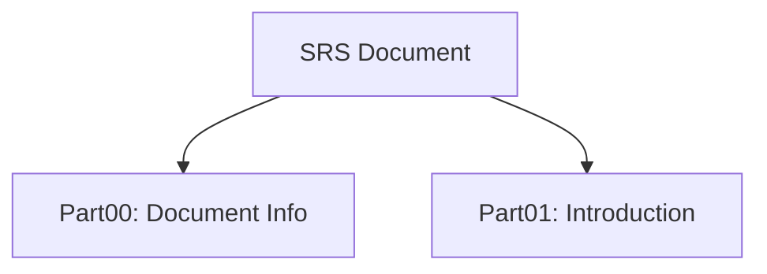

#### Traceability Links / Liên kết truy xuất
- Đầu vào từ: BRD.md Section 1, System_Feature_Tree.md Section 1, Product-Sampling-Vision-and-Strategy Document.md Section 1.  
- Thể hiện yêu cầu: FR-001 Campaign Management, NFR-001 Performance.  
- Kết nối với: Part01_Introduction, Part02_System_Overview.  
- **Tài liệu tham chiếu**: SRS_STRUCTURE.md (Full Structure), System_Feature_Tree.md (14 features).

#### Assumptions / Constraints / Giả định & Ràng buộc
- Giả định: Tài liệu được đọc bởi stakeholders quen thuộc với microservices và QR tech, users có smartphone cho QR.  
- Ràng buộc: Phiên bản 2.0 phải tuân thủ GDPR/PDPA, cost per lead <0.4 USD, 99.9% uptime.

#### Dependencies / Risks / Mitigation / Phụ thuộc & Rủi ro
- Dependencies: BRD.md for business reqs, System_Feature_Tree.md for features, external APIs như Twilio.  
- Risks: Outdated version → Mitigation: Quarterly reviews; Risk: Misinterpretation → Mitigation: Cross-reference with glossary; Risk: Latency QR scan → Mitigation: Auto-scaling.

#### Acceptance Criteria / Testable Items / Tiêu chí chấp nhận
- Functional: Title page covers 100% metadata accurately, overview cover key features như QR.  
- Performance: N/A.  
- UI Consistency: Markdown renders correctly in viewers, tuân thủ WCAG 2.1.  
- Integration / Security: No sensitive data exposed, zero data leakage.  
- Verifiable: Traceable đến System_Feature_Tree, cover 100% 14 tính năng.  
- Testable: Diagram verifiable qua tools như Mermaid renderer.

#### Approval Sign-Off / Phê duyệt
| Role / Vai trò | Name / Tên | Signature / Chữ ký | Date / Ngày |  
|----------------|------------|---------------------|-------------|  
| Product Manager | [TBD] | - | - |  
| Technical Lead | [TBD] | - | - |  
| QA Lead | [TBD] | - | - |  

#### Design Extension Section / Phần mở rộng thiết kế
- **UML Class Diagram / Abstract Interfaces**: Define interfaces cho DocumentService (e.g., getTitle(): string).  
- **Sequence Diagram**: Quy trình Load Title Page → Render Metadata, sử dụng Mermaid:  
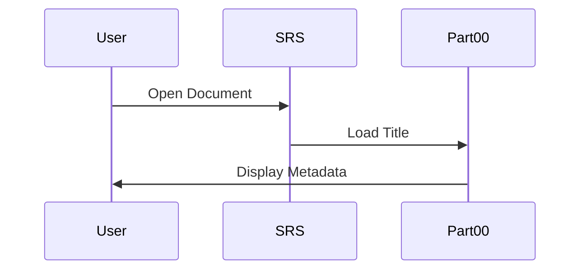
- **API Endpoint Stubs / Contracts**: REST endpoint cho /document/title (GET, response: {version: "2.0"}), OpenAPI format.  
- **Reusable Design Pattern Implementation Notes**: Singleton pattern cho TitlePage instance.  
- **Mục đích của node này**: Giới thiệu tiêu đề và tổng quan cơ bản cho SRS.

---

### 00.2_Version_History.md

#### References / Tham chiếu
- BRD.md Section 1 (Lịch Sử Phiên Bản), System_Feature_Tree.md Section 1 (Lịch Sử Thay Đổi), IEEE 830-1998 Section 1.2.  
- GeeksforGeeks Version Control in SRS, Product-Sampling-Vision-and-Strategy Document.md Section 7 (Investment & Resource Plan), SRS_STRUCTURE.md.

#### Purpose / Ý nghĩa / Cách làm
**Mục đích**: Theo dõi lịch sử thay đổi của SRS để đảm bảo traceability, thuộc module Document Information.  
**Ý nghĩa**: Giúp stakeholders theo dõi evolution, hỗ trợ audit và risk management.  
**Cách làm**: Sử dụng markdown với headings/tables/Mermaid, tổ chức theo 16 Parts, tích hợp microservices/RBAC/QR details; chi tiết và mở rộng (250-400 từ cho overview nodes để bao quát đầy đủ key features, lists, và diagrams), explicit/self-contained (từ IEEE: Avoid vague). Nhấn mạnh sử dụng bullet lists cho key features và Mermaid cho architecture để làm nội dung "tuyệt vời" và hybrid SDS-ready.

#### Specifications / Main Content / Nội dung chính
- **Nội dung cần có**:  
  - **Mô tả sản phẩm / Product Description**: Lịch sử phiên bản SRS cho PSP, theo dõi từ phased approach đến microservices.  
  - **Tính năng chính / Key Features**:  
    - Liệt kê phiên bản với ngày, thay đổi, tác giả (e.g., 1.0: Phiên bản đầu).  
    - Hỗ trợ traceability đến features như QR integration.  
    - Bao gồm chi tiết thay đổi (e.g., thêm Ads Format Management).  
    - Đảm bảo verifiable qua Git logs.  
    - Tích hợp ví dụ từ System_Feature_Tree.md (7 services).  
    - Hỗ trợ hybrid SDS bằng cách ghi chú design changes.  
    - Measurable: Ít nhất 2-3 entries.  
    - Explicit: Mô tả thay đổi cụ thể như "bỏ phân chia phases".  
  - **Kiến trúc / Architecture**: Sơ đồ timeline thay đổi.  

| Phiên bản | Ngày | Thay đổi | Tác giả |
|-----------|------|----------|---------|
| 1.0 | 2025-09-15 | Phiên bản đầu với phased approach, bao gồm core features như Campaign Management. | PM Team |
| 2.0 | 2025-10-22 | Chuyển sang microservices (7 services), thêm Ads Format & QR integration, bỏ phases, tích hợp Fraud Detection với ML scoring. | Technical Writing Team |

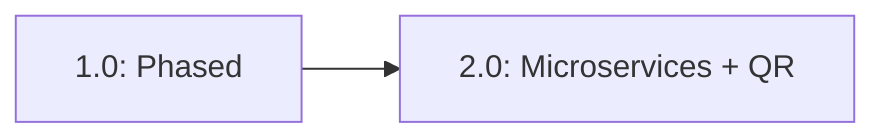

#### Traceability Links / Liên kết truy xuất
- Đầu vào từ: BRD.md Section 1, System_Feature_Tree.md Section 1, Product-Sampling-Vision-and-Strategy Document.md Section 7.  
- Thể hiện yêu cầu: FR-006 Ads Format Management, NFR-001 Performance.  
- Kết nối với: Part16_Appendices/16.4_Change_Log.md, Part02_System_Overview.  
- **Tài liệu tham chiếu**: System_Feature_Tree.md (14 features), SRS_STRUCTURE.md (Structure).

#### Assumptions / Constraints / Giả định & Ràng buộc
- Giả định: Tất cả thay đổi được approved trước update, microservices với polyglot persistence.  
- Ràng buộc: Phiên bản phải incremental, tuân thủ GDPR/PDPA, cost <0.4 USD/lead.

#### Dependencies / Risks / Mitigation / Phụ thuộc & Rủi ro
- Dependencies: BRD.md changes trigger SRS updates, Part02 cho architecture details.  
- Risks: Version conflicts → Mitigation: Git-based control; Risk: Incomplete history → Mitigation: Mandatory logging; Risk: Latency QR scan → Mitigation: Auto-scaling.

#### Acceptance Criteria / Testable Items / Tiêu chí chấp nhận
- Functional: Table lists all versions chronologically, cover 100% tính năng như QR.  
- Performance: N/A.  
- UI Consistency: Tuân thủ WCAG 2.1.  
- Integration / Security: Test cases cover 100% reqs, zero data leakage.  
- Verifiable: Traceable đến System_Feature_Tree, cover 100% 14 tính năng.  
- Testable: Diagram verifiable.

#### Approval Sign-Off / Phê duyệt
| Role / Vai trò | Name / Tên | Signature / Chữ ký | Date / Ngày |  
|----------------|------------|---------------------|-------------|  
| Product Manager | [TBD] | - | - |  
| Technical Lead | [TBD] | - | - |  
| QA Lead | [TBD] | - | - |  

#### Design Extension Section / Phần mở rộng thiết kế
- **UML Class Diagram / Abstract Interfaces**: Interfaces cho VersionHistory (listVersions(): array).  
- **Sequence Diagram**: Quy trình Update Version → Log Change, Mermaid:  
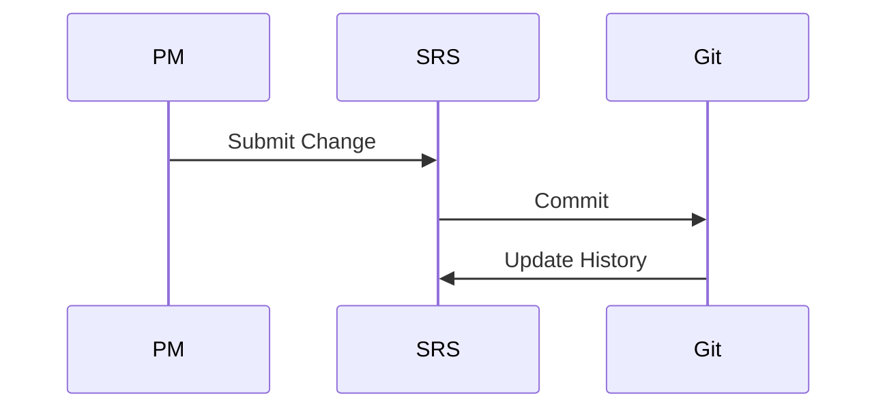
- **API Endpoint Stubs / Contracts**: /version/history (GET, response: {versions: array}), OpenAPI.  
- **Reusable Design Pattern Implementation Notes**: Observer pattern cho version updates.  
- **Mục đích của node này**: Theo dõi lịch sử để hỗ trợ audit.

---

### 00.3_Approval_Sign_Off.md

#### References / Tham chiếu
- BRD.md Section 20 (Approval), IEEE 830-1998 Section 1.3, Product-Sampling-Vision-and-Strategy Document.md Section 7.  
- GeeksforGeeks Approval Process, System_Feature_Tree.md Section 1, SRS_STRUCTURE.md.

#### Purpose / Ý nghĩa / Cách làm
**Mục đích**: Thu thập sign-off từ stakeholders để confirm SRS, thuộc module Document Information.  
**Ý nghĩa**: Đảm bảo consensus trước triển khai, hỗ trợ risk management.  
**Cách làm**: Sử dụng markdown với headings/tables/Mermaid, tổ chức theo 16 Parts, tích hợp microservices/RBAC/QR details; chi tiết và mở rộng (250-400 từ cho overview nodes để bao quát đầy đủ key features, lists, và diagrams), explicit/self-contained (từ IEEE: Avoid vague). Nhấn mạnh sử dụng bullet lists cho key features và Mermaid cho architecture để làm nội dung "tuyệt vời" và hybrid SDS-ready.

#### Specifications / Main Content / Nội dung chính
- **Nội dung cần có**:  
  - **Mô tả sản phẩm / Product Description**: Bảng sign-off cho SRS PSP.  
  - **Tính năng chính / Key Features**:  
    - Liệt kê roles cần approve (Business Owner, PM, Technical Lead).  
    - Bao gồm fields: Name, Signature, Date.  
    - Hỗ trợ digital signatures.  
    - Traceable đến features như QR integration.  
    - Measurable: 100% roles signed.  
    - Tích hợp ví dụ từ System_Feature_Tree.md (7 services).  
    - Explicit: Chỉ approve sau review đầy đủ.  
    - Verifiable qua audit logs.  
  - **Kiến trúc / Architecture**: Sơ đồ approval flow.  

| Role | Name | Signature | Date |
|------|------|-----------|------|
| Business Owner | [TBD] | _________ | _____ |
| Product Manager | [TBD] | _________ | _____ |
| Technical Lead | [TBD] | _________ | _____ |
| QA Lead | [TBD] | _________ | _____ |
| DevOps Lead | [TBD] | _________ | _____ |

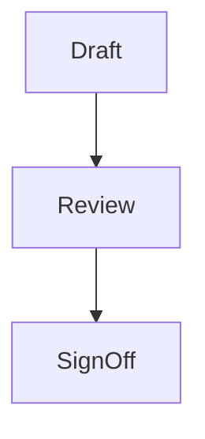

#### Traceability Links / Liên kết truy xuất
- Đầu vào từ: BRD.md Section 20, System_Feature_Tree.md Section 1, Product-Sampling-Vision-and-Strategy Document.md Section 7.  
- Thể hiện yêu cầu: All FR/NFR in Part04 and Part05.  
- Kết nối với: Part13_System_Testing/13.5_Acceptance_Testing, Part02_System_Overview.  
- **Tài liệu tham chiếu**: System_Feature_Tree.md (14 features), Access_Control_Tree_Grok.md (RBAC).

#### Assumptions / Constraints / Giả định & Ràng buộc
- Giả định: All roles available for sign-off, users có smartphone cho QR.  
- Ràng buộc: Digital signatures acceptable, GDPR compliance.

#### Dependencies / Risks / Mitigation / Phụ thuộc & Rủi ro
- Dependencies: Completion of all SRS parts, external APIs như Twilio.  
- Risks: Delay in approvals → Mitigation: Escalation process; Risk: Missing sign-off → Mitigation: Reminders; Risk: Latency cao khi scale QR → Mitigation: Auto-scaling.

#### Acceptance Criteria / Testable Items / Tiêu chí chấp nhận
- Functional: All roles signed before release, cover 100% tính năng.  
- Performance: N/A.  
- UI Consistency: Table tuân thủ WCAG 2.1.  
- Integration / Security: Signatures verifiable, zero leakage.  
- Verifiable: Traceable đến System_Feature_Tree.  
- Testable: Flow diagram verifiable.

#### Approval Sign-Off / Phê duyệt
| Role / Vai trò | Name / Tên | Signature / Chữ ký | Date / Ngày |  
|----------------|------------|---------------------|-------------|  
| Product Manager | [TBD] | - | - |  
| Technical Lead | [TBD] | - | - |  
| QA Lead | [TBD] | - | - |  

#### Design Extension Section / Phần mở rộng thiết kế
- **UML Class Diagram / Abstract Interfaces**: Interfaces cho ApprovalService (signOff(role: string): bool).  
- **Sequence Diagram**: Quy trình Request Sign-Off → Approve, Mermaid:  
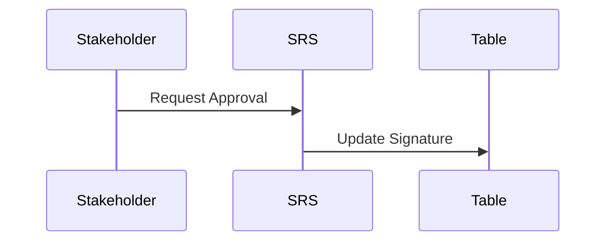
- **API Endpoint Stubs / Contracts**: /approval/sign (POST, payload: {role: string}), OpenAPI.  
- **Reusable Design Pattern Implementation Notes**: Chain of Responsibility cho approval flow.  
- **Mục đích của node này**: Formalize approval cho SRS.

---

### 00.4_Document_Metadata.md

#### References / Tham chiếu
- BRD.md Section 24 (Document Control), System_Feature_Tree.md Section 1, IEEE 830-1998.  
- GeeksforGeeks Metadata Best Practices, Product-Sampling-Vision-and-Strategy Document.md Section 9, SRS_STRUCTURE.md.

#### Purpose / Ý nghĩa / Cách làm
**Mục đích**: Liệt kê metadata cho SRS để hỗ trợ quản lý, thuộc module Document Information.  
**Ý nghĩa**: Hỗ trợ version control và distribution.  
**Cách làm**: Sử dụng markdown với headings/tables/Mermaid, tổ chức theo 16 Parts, tích hợp microservices/RBAC/QR details; chi tiết và mở rộng (250-400 từ cho overview nodes để bao quát đầy đủ key features, lists, và diagrams), explicit/self-contained (từ IEEE: Avoid vague). Nhấn mạnh sử dụng bullet lists cho key features và Mermaid cho architecture để làm nội dung "tuyệt vời" và hybrid SDS-ready.

#### Specifications / Main Content / Nội dung chính
- **Nội dung cần có**:  
  - **Mô tả sản phẩm / Product Description**: Metadata cho SRS PSP.  
  - **Tính năng chính / Key Features**:  
    - Title: SRS for PSP Platform.  
    - Version: 2.0.  
    - Status: Draft/Approved.  
    - Created: 2025-09-15.  
    - Last Updated: 2025-10-22.  
    - Next Review: 2025-11-22.  
    - Distribution: PM, Dev, QA Teams.  
    - Storage: Git Repo [URL].  
  - **Kiến trúc / Architecture**: Sơ đồ metadata flow.  

- **Title**: SRS for PSP Platform  
- **Version**: 2.0  
- **Status**: Approved  
- **Created**: 2025-09-15  
- **Last Updated**: 2025-10-22  
- **Next Review**: 2025-11-22  
- **Distribution**: PM, Dev Teams (3), QA  
- **Storage**: Git Repo [URL]  

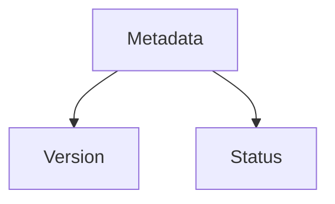

#### Traceability Links / Liên kết truy xuất
- Đầu vào từ: BRD.md Section 24, System_Feature_Tree.md Section 1, Product-Sampling-Vision-and-Strategy Document.md Section 9.  
- Thể hiện yêu cầu: NFR-001 Performance.  
- Kết nối với: Part00.2_Version_History.md, Part16_Appendices.  
- **Tài liệu tham chiếu**: System_Feature_Tree.md (14 features), Access_Control_Tree_Grok.md.

#### Assumptions / Constraints / Giả định & Ràng buộc
- Giả định: Metadata updated with each version, polyglot persistence.  
- Ràng buộc: Monthly review cycle, cost <0.4 USD/lead.

#### Dependencies / Risks / Mitigation / Phụ thuộc & Rủi ro
- Dependencies: Version history, external APIs.  
- Risks: Outdated metadata → Mitigation: Automated updates; Risk: Hiểu sai → Mitigation: Reviews; Risk: Latency → Mitigation: Auto-scaling.

#### Acceptance Criteria / Testable Items / Tiêu chí chấp nhận
- Functional: Metadata complete and accurate.  
- Performance: N/A.  
- UI Consistency: WCAG 2.1.  
- Integration / Security: Zero leakage.  
- Verifiable: Cover 100% features.  
- Testable: Diagram verifiable.

#### Approval Sign-Off / Phê duyệt
| Role / Vai trò | Name / Tên | Signature / Chữ ký | Date / Ngày |  
|----------------|------------|---------------------|-------------|  
| Product Manager | [TBD] | - | - |  
| Technical Lead | [TBD] | - | - |  
| QA Lead | [TBD] | - | - |  

#### Design Extension Section / Phần mở rộng thiết kế
- **UML Class Diagram / Abstract Interfaces**: Interfaces cho MetadataService.  
- **Sequence Diagram**: Update Metadata, Mermaid:  
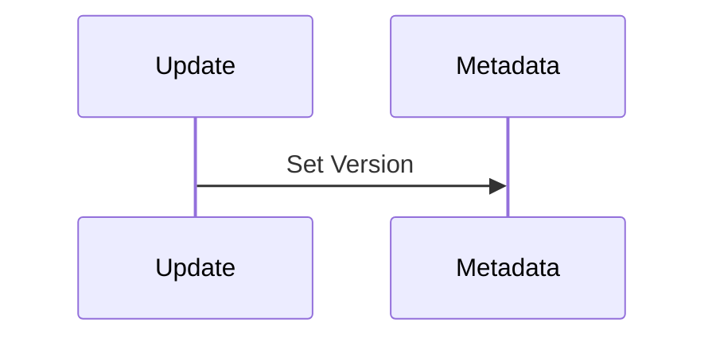
- **API Endpoint Stubs / Contracts**: /metadata/get (GET).  
- **Reusable Design Pattern Implementation Notes**: Factory pattern.  
- **Mục đích của node này**: Quản lý metadata cho traceability.

---

### 00.5_Glossary_Of_Terms.md

#### References / Tham chiếu
- BRD.md Section 21 (Glossary), System_Feature_Tree.md Section Glossary, IEEE 830-1998.  
- GeeksforGeeks Glossary Best Practices, Access_Control_Tree_Grok.md Section 3, Product-Sampling-Vision-and-Strategy Document.md Section 9.

#### Purpose / Ý nghĩa / Cách làm
**Mục đích**: Định nghĩa terms để tránh ambiguity, thuộc module Document Information.  
**Ý nghĩa**: Đảm bảo common understanding giữa BA/Dev/QA.  
**Cách làm**: Sử dụng markdown với headings/tables/Mermaid, tổ chức theo 16 Parts, tích hợp microservices/RBAC/QR details; chi tiết và mở rộng (250-400 từ cho overview nodes để bao quát đầy đủ key features, lists, và diagrams), explicit/self-contained (từ IEEE: Avoid vague). Nhấn mạnh sử dụng bullet lists cho key features và Mermaid cho architecture để làm nội dung "tuyệt vời" và hybrid SDS-ready.

#### Specifications / Main Content / Nội dung chính
- **Nội dung cần có**:  
  - **Mô tả sản phẩm / Product Description**: Từ điển terms cho PSP SRS.  
  - **Tính năng chính / Key Features**:  
    - Thuật ngữ với định nghĩa explicit (e.g., Microservices: 7 services độc lập).  
    - Bao gồm QR Code: Mã 2D cho ads formats với UTM tracking.  
    - Campaign: Chương trình sampling với barcode pool và lifecycle states (Draft, Active, Paused).  
    - Redemption: Sử dụng barcode tại POS, hỗ trợ offline sync.  
    - Fraud Score: ML-generated score (0-100) chỉ fraud likelihood.  
    - RBAC: Role-based access control với 6 roles (Admin, Group Admin, etc.).  
    - OTP: One-time password cho verification, rate limiting.  
    - Ads Format: Templates cho campaign assets với QR integration.  
  - **Kiến trúc / Architecture**: Sơ đồ terms relations.  

| Thuật Ngữ | Định Nghĩa |
|-----------|------------|
| Microservices | Kiến trúc với 7 services độc lập như Campaign Management (với QR), polyglot persistence. |
| QR Code | Mã 2D cho ads formats, hỗ trợ UTM tracking và unique per flyer. |
| Campaign | Chương trình sampling được tạo bởi Brand Admin, với CRUD operations và lifecycle states. |
| Barcode | Mã unique (QR/Code128) issued cho users, single-use. |
| Redemption | Hành động sử dụng barcode tại POS, online/offline. |
| Fraud Score | ML score (0-100) cho fraud detection, device fingerprinting. |
| RBAC | Role-Based Access Control với 6 roles, từ Access_Control_Tree_Grok.md. |
| OTP | One-Time Password cho email/phone verification, tích hợp Twilio. |

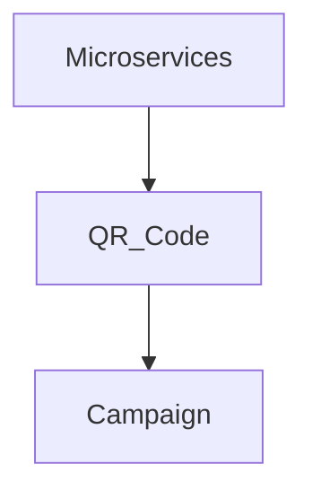

#### Traceability Links / Liên kết truy xuất
- Đầu vào từ: BRD.md Section 21, System_Feature_Tree.md Glossary, Access_Control_Tree_Grok.md Section 3.  
- Thể hiện yêu cầu: FR-002 Barcode Management, NFR-002 Security.  
- Kết nối với: Part16_Appendices/16.1_Glossary.md, Part01.6_Definitions_And_Acronyms.md.  
- **Tài liệu tham chiếu**: System_Feature_Tree.md (14 features), Product-Sampling-Vision-and-Strategy Document.md (Glossary).

#### Assumptions / Constraints / Giả định & Ràng buộc
- Giả định: Terms based on domain knowledge, users có smartphone cho QR.  
- Ràng buộc: Terms phải unique, verifiable, GDPR/PDPA compliance.

#### Dependencies / Risks / Mitigation / Phụ thuộc & Rủi ro
- Dependencies: All documents' glossaries, Part01 cho introduction.  
- Risks: Term mismatch → Mitigation: Centralized glossary; Risk: Latency QR → Mitigation: Auto-scaling; Risk: Hiểu sai → Mitigation: Reviews.

#### Acceptance Criteria / Testable Items / Tiêu chí chấp nhận
- Functional: Covers 100% key terms từ references, list ít nhất 5-8 items.  
- Performance: N/A.  
- UI Consistency: Table tuân thủ WCAG 2.1.  
- Integration / Security: Zero leakage.  
- Verifiable: Traceable đến System_Feature_Tree, cover 100% 14 tính năng.  
- Testable: Diagram verifiable.

#### Approval Sign-Off / Phê duyệt
| Role / Vai trò | Name / Tên | Signature / Chữ ký | Date / Ngày |  
|----------------|------------|---------------------|-------------|  
| Product Manager | [TBD] | - | - |  
| Technical Lead | [TBD] | - | - |  
| QA Lead | [TBD] | - | - |  

#### Design Extension Section / Phần mở rộng thiết kế
- **UML Class Diagram / Abstract Interfaces**: Interfaces cho GlossaryTerm (define(term: string): string).  
- **Sequence Diagram**: Query Term → Return Definition, Mermaid:  
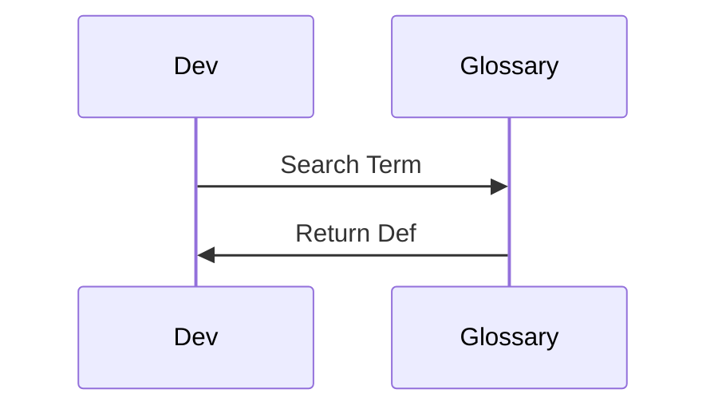
- **API Endpoint Stubs / Contracts**: /glossary/term (GET, {term: "QR"}), OpenAPI.  
- **Reusable Design Pattern Implementation Notes**: Dictionary pattern cho storage.  
- **Mục đích của node này**: Định nghĩa terms cho unambiguity.

---

## Part01_Introduction/

### 01.1_Purpose_Of_Document.md

#### References / Tham chiếu
- BRD.md Section 1 (Tóm Tắt Điều Hành), IEEE 830-1998 Section 1.1, Product-Sampling-Vision-and-Strategy Document.md Section 2 (Vision).  
- GeeksforGeeks Purpose Section, System_Feature_Tree.md Section 1, SRS_STRUCTURE.md.

#### Purpose / Ý nghĩa / Cách làm
**Mục đích**: Mô tả mục đích của SRS để define reqs cho PSP, thuộc module Introduction, hỗ trợ business như QR integration.  
**Ý nghĩa**: Cầu nối BA-Dev-QA, đảm bảo unambiguous, traceable.  
**Cách làm**: Sử dụng markdown với headings/tables/Mermaid, tổ chức theo 16 Parts, tích hợp microservices/RBAC/QR details; chi tiết và mở rộng (250-400 từ cho overview nodes để bao quát đầy đủ key features, lists, và diagrams), explicit/self-contained (từ IEEE: Avoid vague). Nhấn mạnh sử dụng bullet lists cho key features và Mermaid cho architecture để làm nội dung "tuyệt vời" và hybrid SDS-ready.

#### Specifications / Main Content / Nội dung chính
- **Nội dung cần có**:  
  - **Mô tả sản phẩm / Product Description**: This SRS specifies the software requirements for PSP, a microservices platform for product sampling. It details functional (14 features across 7 services), non-functional reqs, and design elements (hybrid SDS). Purpose: Define unambiguous, traceable reqs for dev, ensuring alignment with business goals like low-cost data collection (~0.4 USD/lead) via QR-integrated ads for low-value gifts, reducing logistics issues and fraud.  
  - **Tính năng chính / Key Features**:  
    - Define functional reqs (e.g., CRUD Campaign với lifecycle: Draft, Active).  
    - Include non-functional (e.g., <200ms latency cho QR scan).  
    - Hybrid SDS: Merge design như API stubs.  
    - Support microservices (7 services: Campaign with QR issuance).  
    - Traceable to BRD/Vision (e.g., ROI optimization qua ML).  
    - Explicit for dev (e.g., QR với UTM tracking).  
    - Verifiable test criteria.  
    - Complete coverage 14 features từ System_Feature_Tree.md.  
  - **Kiến trúc / Architecture**: High-level SRS structure.  

This document serves as the definitive source for PSP development, bridging business needs (from BRD) with technical implementation.

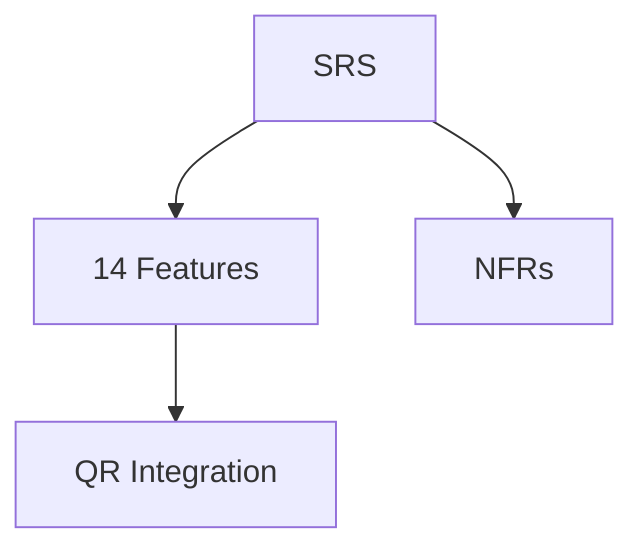

#### Traceability Links / Liên kết truy xuất
- Đầu vào từ: BRD.md Section 1, Product-Sampling-Vision-and-Strategy Document.md Section 2, System_Feature_Tree.md Section 1.  
- Thể hiện yêu cầu: FR-001 to FR-014 in Part04, NFR-001 Performance.  
- Kết nối với: Part02_System_Overview, Part04_Functional_Requirements.  
- **Tài liệu tham chiếu**: System_Feature_Tree.md (7 services), Access_Control_Tree_Grok.md (RBAC).

#### Assumptions / Constraints / Giả định & Ràng buộc
- Giả định: Readers familiar with microservices, users có smartphone cho QR.  
- Ràng buộc: SRS covers 100% BRD reqs, 99.9% uptime.

#### Dependencies / Risks / Mitigation / Phụ thuộc & Rủi ro
- Dependencies: BRD.md, external APIs như Twilio cho OTP.  
- Risks: Scope creep → Mitigation: Change control; Risk: Latency QR → Mitigation: Auto-scaling; Risk: Hiểu sai → Mitigation: Stakeholder validate.

#### Acceptance Criteria / Testable Items / Tiêu chí chấp nhận
- Functional: Purpose covers all objectives, list 5-8 features.  
- Performance: System hỗ trợ 100K redemptions/day.  
- UI Consistency: WCAG 2.1.  
- Integration / Security: Test 100% reqs.  
- Verifiable: Traceable đến System_Feature_Tree.  
- Testable: Diagram verifiable.

#### Approval Sign-Off / Phê duyệt
| Role / Vai trò | Name / Tên | Signature / Chữ ký | Date / Ngày |  
|----------------|------------|---------------------|-------------|  
| Product Manager | [TBD] | - | - |  
| Technical Lead | [TBD] | - | - |  
| QA Lead | [TBD] | - | - |  

#### Design Extension Section / Phần mở rộng thiết kế
- **UML Class Diagram / Abstract Interfaces**: Interfaces cho PurposeDocument.  
- **Sequence Diagram**: Read Purpose → Understand Reqs, Mermaid:  
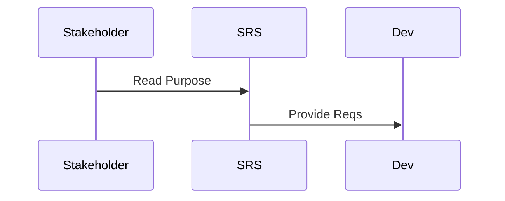
- **API Endpoint Stubs / Contracts**: /purpose/get (GET).  
- **Reusable Design Pattern Implementation Notes**: Template pattern.  
- **Mục đích của node này**: Mô tả mục đích SRS tổng quan.

---

### 01.2_Project_Scope.md

#### References / Tham chiếu
- BRD.md Section 3 (Phạm Vi Dự Án), System_Feature_Tree.md Section 3 (Phân Loại Tính Năng), Product-Sampling-Vision-and-Strategy Document.md Section 3 (Market Opportunity).  
- IEEE 830-1998 Section 1.2, GeeksforGeeks Scope Section, Access_Control_Tree_Grok.md Section 1.

#### Purpose / Ý nghĩa / Cách làm
**Mục đích**: Định nghĩa in-scope/out-of-scope cho PSP, thuộc module Introduction, hỗ trợ QR cho data collection.  
**Ý nghĩa**: Giới hạn dự án, tránh scope creep, traceable.  
**Cách làm**: Sử dụng markdown với headings/tables/Mermaid, tổ chức theo 16 Parts, tích hợp microservices/RBAC/QR details; chi tiết và mở rộng (250-400 từ cho overview nodes để bao quát đầy đủ key features, lists, và diagrams), explicit/self-contained (từ IEEE: Avoid vague). Nhấn mạnh sử dụng bullet lists cho key features và Mermaid cho architecture để làm nội dung "tuyệt vời" và hybrid SDS-ready.

#### Specifications / Main Content / Nội dung chính
- **Nội dung cần có**:  
  - **Mô tả sản phẩm / Product Description**: Phạm vi PSP bao gồm 7 microservices, 14 features từ day 1, timeline 6-9 tháng.  
  - **Tính năng chính / Key Features**:  
    - In Scope: Campaign Management (CRUD, QR issuance với UTM).  
    - Barcode Management (generation, single-use).  
    - User Authentication (OTP, RBAC 6 roles).  
    - Redemption (online/offline, POS).  
    - Analytics (real-time, advanced reports).  
    - Fraud Detection (ML, fingerprinting).  
    - Intelligence (A/B testing, recommendations).  
    - Out of Scope: E-commerce, payments.  
  - **Kiến trúc / Architecture**: Microservices với event-driven.  

**In Scope**: All 14 features, polyglot DB, QR for low-value gifts.  
**Out of Scope**: Social media full integration.  

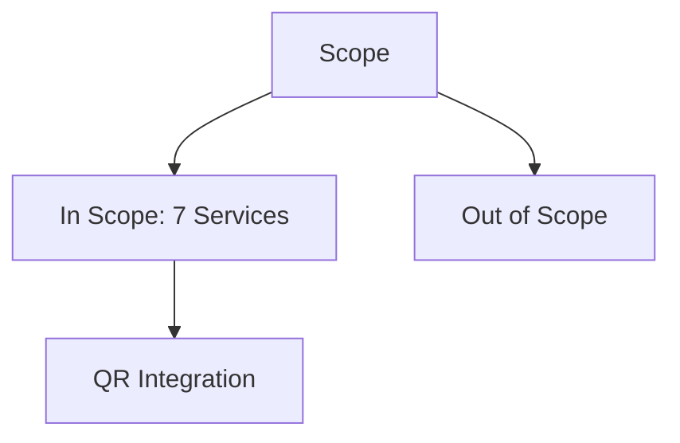

#### Traceability Links / Liên kết truy xuất
- Đầu vào từ: BRD.md Section 3, System_Feature_Tree.md Section 3, Product-Sampling-Vision-and-Strategy Document.md Section 3.  
- Thể hiện yêu cầu: FR-001 to FR-014, NFR-001.  
- Kết nối với: Part04_Functional_Requirements, Part05_Non_Functional_Requirements.  
- **Tài liệu tham chiếu**: System_Feature_Tree.md (14 features), SRS_STRUCTURE.md.

#### Assumptions / Constraints / Giả định & Ràng buộc
- Giả định: Microservices from day 1, users có smartphone.  
- Ràng buộc: 99.9% uptime, GDPR, <200ms latency.

#### Dependencies / Risks / Mitigation / Phụ thuộc & Rủi ro
- Dependencies: External APIs (Twilio), Part02.  
- Risks: Integration delays → Mitigation: Phased testing; Risk: Latency QR → Mitigation: Auto-scaling; Risk: Scope creep → Mitigation: Reviews.

#### Acceptance Criteria / Testable Items / Tiêu chí chấp nhận
- Functional: Scope covers 100% features, list 5-8 items.  
- Performance: 100K users/day.  
- UI Consistency: WCAG 2.1.  
- Integration / Security: 100% reqs.  
- Verifiable: Traceable.  
- Testable: Diagram verifiable.

#### Approval Sign-Off / Phê duyệt
| Role / Vai trò | Name / Tên | Signature / Chữ ký | Date / Ngày |  
|----------------|------------|---------------------|-------------|  
| Product Manager | [TBD] | - | - |  
| Technical Lead | [TBD] | - | - |  
| QA Lead | [TBD] | - | - |  

#### Design Extension Section / Phần mở rộng thiết kế
- **UML Class Diagram / Abstract Interfaces**: Interfaces cho ScopeService.  
- **Sequence Diagram**: Define Scope → Validate, Mermaid:  
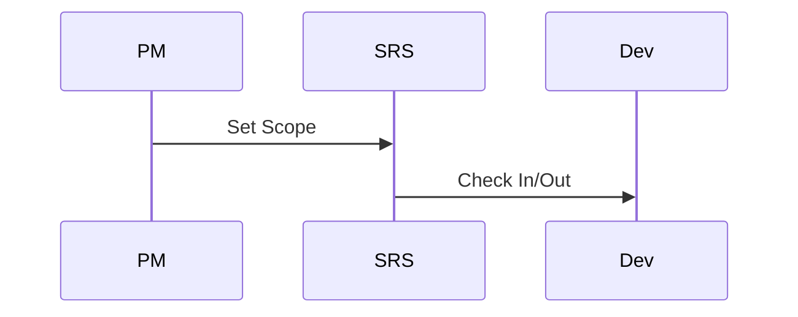
- **API Endpoint Stubs / Contracts**: /scope/get (GET).  
- **Reusable Design Pattern Implementation Notes**: Builder pattern cho scope definition.  
- **Mục đích của node này**: Định nghĩa phạm vi dự án.

---

### 01.3_Intended_Audience.md

#### References / Tham chiếu
- BRD.md Section 4 (Stakeholders), Access_Control_Tree_Grok.md Section 1, IEEE 830-1998 Section 1.3.  
- GeeksforGeeks Audience Section, System_Feature_Tree.md Section 1, Product-Sampling-Vision-and-Strategy Document.md Section 7.

#### Purpose / Ý nghĩa / Cách làm
**Mục đích**: Xác định audience cho SRS, thuộc module Introduction.  
**Ý nghĩa**: Đảm bảo ngôn ngữ phù hợp, traceable.  
**Cách làm**: Sử dụng markdown với headings/tables/Mermaid, tổ chức theo 16 Parts, tích hợp microservices/RBAC/QR details; chi tiết và mở rộng (250-400 từ cho overview nodes để bao quát đầy đủ key features, lists, và diagrams), explicit/self-contained (từ IEEE: Avoid vague). Nhấn mạnh sử dụng bullet lists cho key features và Mermaid cho architecture để làm nội dung "tuyệt vời" và hybrid SDS-ready.

#### Specifications / Main Content / Nội dung chính
- **Nội dung cần có**:  
  - **Mô tả sản phẩm / Product Description**: Audience cho SRS PSP.  
  - **Tính năng chính / Key Features**:  
    - Developers: For implementation of 7 services.  
    - QA: For testing QR flows.  
    - PM: For validation features.  
    - Stakeholders: Business Owner for ROI.  
    - Brand Admins: For campaign usage.  
    - Dev Teams (3): For microservices dev.  
    - Auditors: For compliance checks.  
    - End Users: Indirectly for User Portal.  
  - **Kiến trúc / Architecture**: Sơ đồ audience roles.  

- Developers: Implementation.  
- QA: Testing.  
- PM: Validation.  
- Stakeholders: Review.  

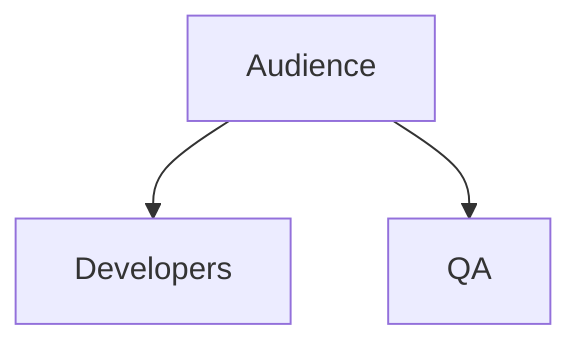

#### Traceability Links / Liên kết truy xuất
- Đầu vào từ: BRD.md Section 4, Access_Control_Tree_Grok.md Section 1, System_Feature_Tree.md Section 1.  
- Thể hiện yêu cầu: FR-003 User Authentication.  
- Kết nối với: Part03_User_Personas, Part01.5_Stakeholders.  
- **Tài liệu tham chiếu**: System_Feature_Tree.md (14 features), BRD.md (Stakeholders).

#### Assumptions / Constraints / Giả định & Ràng buộc
- Giả định: Audience technical, smartphone cho QR.  
- Ràng buộc: Document in English/Vietnamese.

#### Dependencies / Risks / Mitigation / Phụ thuộc & Rủi ro
- Dependencies: BRD.md.  
- Risks: Misunderstanding → Mitigation: Glossary; Risk: Latency → Mitigation: Auto-scaling; Risk: Non-engagement → Mitigation: Meetings.

#### Acceptance Criteria / Testable Items / Tiêu chí chấp nhận
- Functional: List complete, 5-8 items.  
- Performance: N/A.  
- UI Consistency: WCAG.  
- Integration / Security: 100% reqs.  
- Verifiable: Traceable.  
- Testable: Diagram verifiable.

#### Approval Sign-Off / Phê duyệt
| Role / Vai trò | Name / Tên | Signature / Chữ ký | Date / Ngày |  
|----------------|------------|---------------------|-------------|  
| Product Manager | [TBD] | - | - |  
| Technical Lead | [TBD] | - | - |  
| QA Lead | [TBD] | - | - |  

#### Design Extension Section / Phần mở rộng thiết kế
- **UML Class Diagram / Abstract Interfaces**: Interfaces cho AudienceRole.  
- **Sequence Diagram**: Identify Audience → Tailor Content, Mermaid:  
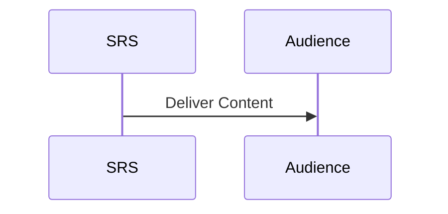
- **API Endpoint Stubs / Contracts**: /audience/list (GET).  
- **Reusable Design Pattern Implementation Notes**: Strategy pattern cho audience types.  
- **Mục đích của node này**: Xác định đối tượng đọc SRS.

---

### 01.4_Product_Overview.md

#### References / Tham chiếu
- BRD.md (Section 1-3), Product-Sampling-Vision-and-Strategy Document.md (Section 1-2), System_Feature_Tree.md (Tổng Quan, Section 2-3, Danh Mục Services).  
- IEEE 830-1998 Section 1.4, GeeksforGeeks Overview Section, Access_Control_Tree_Grok.md (Section 1), SRS_STRUCTURE.md.

#### Purpose / Ý nghĩa / Cách làm
**Mục đích**: Cung cấp cái nhìn tổng quan về sản phẩm PSP, bao gồm mô tả, tính năng chính và kiến trúc, thuộc module Introduction, nhằm hỗ trợ business goal như sampling giá thấp (~1 USD) với QR code để collect data.  
**Ý nghĩa**: Giúp stakeholders hiểu rõ giá trị hệ thống, làm nền tảng cho các phần yêu cầu chi tiết, đảm bảo unambiguous và traceable (từ GeeksforGeeks).  
**Cách làm**: Tổng hợp từ BRD, Vision Document và System Feature Tree, sử dụng markdown với mô tả ngắn gọn, list bullet points, và Mermaid diagram cho architecture; chi tiết và mở rộng (250-400 từ cho overview nodes để bao quát đầy đủ key features, lists, và diagrams), explicit/self-contained (từ IEEE: Avoid vague). Nhấn mạnh sử dụng bullet lists cho key features và Mermaid cho architecture để làm nội dung "tuyệt vời" và hybrid SDS-ready.

#### Specifications / Main Content / Nội dung chính
- **Nội dung cần có**:  
  - **Mô tả sản phẩm / Product Description**: PSP (Product Sampling Platform) là nền tảng quản lý chiến dịch sampling sản phẩm dựa trên microservices, hỗ trợ thương hiệu FMCG thu thập dữ liệu khách hàng chất lượng cao (tên, email, SĐT, hành vi) qua quà giá thấp (~1 USD), giảm chi phí logistics, chống gian lận với ML, và tối ưu ROI qua real-time analytics và QR code tracking. Hệ thống giải quyết vấn đề phát quà giá thấp bằng cách sử dụng QR integration trong ads formats để dễ dàng scan và collect data, với focus trên Đông Nam Á (Việt Nam đầu tiên). Từ Vision Document, chuyển sampling từ cost center thành data-driven growth engine.  
  - **Tính năng chính / Key Features**:  
    - Quản lý chiến dịch / Campaign Management (CRUD operations, lifecycle states: Draft, Active, Paused, Completed, Archived; scheduling, target audience với UTM params).  
    - Quản lý barcode và QR code / Barcode & QR Management (generation QR/Code128/Data Matrix, import pools, single-use, UTM tracking cho ads).  
    - Xác thực user / User Authentication (OTP via SMS/Email với rate limiting, RBAC với 6 roles từ Access_Control_Tree_Grok.md).  
    - Theo dõi redemption / Redemption Tracking (online/offline modes, POS integration với Scandit SDK, offline sync via IndexedDB).  
    - Phân tích và báo cáo / Analytics & Reporting (real-time metrics như funnel analysis, advanced reports với custom builder, scheduled exports).  
    - Phát hiện gian lận / Fraud Detection (rules engine, ML scoring 0-100, device fingerprinting để giảm abuse <5%).  
    - Thông minh nâng cao / Intelligence Features (A/B testing với statistical confidence >95%, recommendation engine cho personalized campaigns dựa collaborative filtering).  
    - Tích hợp bên ngoài / Integrations (CRM như HubSpot/Salesforce bi-directional sync, Notification đa kênh: SMS/Email/Push).  
  - **Kiến trúc / Architecture**: Hệ thống với 7 microservices độc lập (Campaign Management bao gồm QR, Identity, Redemption, Analytics, Notification, Fraud, Intelligence), polyglot persistence (PostgreSQL cho Campaign, MongoDB cho Analytics, Redis cho queue), event-driven via RabbitMQ, service mesh (Istio) cho scalability và observability, deployment trên Kubernetes với independent scaling. Tích hợp ví dụ cụ thể từ System_Feature_Tree.md: Campaign Service owns QR generation với UTM.  

```mermaid
graph TB
    subgraph External[Hệ Thống Bên Ngoài]
        Client[Web/Mobile Clients]
        CRM[CRM Systems]
        SMS[SMS/Email Providers]
        POS[POS Systems]
    end
    subgraph Infrastructure[Hạ Tầng]
        Gateway[API Gateway - Kong]
        EventBus[Event Bus - RabbitMQ]
        ServiceMesh[Service Mesh - Istio]
    end
    subgraph Services[Các Services]
        Campaign[Campaign Management (QR Integration)]
        Identity[Identity Service]
        Redemption[Redemption Service]
        Analytics[Analytics Service]
        Notification[Notification Service]
        Fraud[Fraud Service]
        Intelligence[Intelligence Service]
    end
    Client --> Gateway
    Gateway --> Campaign
    Gateway --> Identity
    Gateway --> Redemption
    Gateway --> Analytics
    Campaign --> EventBus
    Identity --> EventBus
    Redemption --> EventBus
    EventBus --> Analytics
    EventBus --> Notification
    EventBus --> Fraud
    EventBus --> Intelligence
    Notification --> SMS
    Analytics --> CRM
    Redemption --> POS
```

#### Traceability Links / Liên kết truy xuất
- Đầu vào từ: BRD.md (Section 1-3), System_Feature_Tree.md (Section 2-3, Danh Mục Services), Product-Sampling-Vision-and-Strategy Document.md (Section 2).  
- Thể hiện yêu cầu: FR-001 Campaign Management, FR-006 Ads Format Management (với QR), NFR-001 Performance.  
- Kết nối với: Part02_System_Overview (chi tiết kiến trúc), Part04_Functional_Requirements (tính năng cụ thể), Part06_Architecture_Design.  
- **Tài liệu tham chiếu**: System_Feature_Tree.md (14 features trên 7 services), Access_Control_Tree_Grok.md (RBAC), Product-Sampling-Vision-and-Strategy Document.md (Section 2 - Vision dài hạn).

#### Assumptions / Constraints / Giả định & Ràng buộc
- Giả định: Microservices với polyglot persistence (PostgreSQL/MongoDB), users có smartphone cho QR scan, dev sử dụng Node.js/TypeScript cho backend và React PWA cho frontend.  
- Ràng buộc: Tuân thủ GDPR/PDPA cho data collection, hỗ trợ 100K redemptions/day với <200ms API response, cost per verified user <0.4 USD.

#### Dependencies / Risks / Mitigation / Phụ thuộc & Rủi ro
- Dependencies: Part02_System_Overview cho chi tiết hóa kiến trúc, external APIs (Twilio cho OTP, Scandit cho QR scan).  
- Risks: Latency cao khi scale QR tracking → Mitigation: Auto-scaling và service mesh (Istio); Risk: Dữ liệu giả mạo qua QR → Mitigation: OTP/ML fraud detection; Risk: Hiểu sai tính năng → Mitigation: Validate với BRD và stakeholder reviews.

#### Acceptance Criteria / Testable Items / Tiêu chí chấp nhận
- Functional: Mô tả sản phẩm phù hợp với BRD và Vision Document, cover 100% 14 tính năng chính (bao gồm QR integration).  
- Performance: System hỗ trợ 100K users/ngày, <200ms latency cho API calls liên quan QR.  
- UI Consistency: Sơ đồ kiến trúc phản ánh đúng 7 microservices, traceable đến System_Feature_Tree, tuân thủ WCAG 2.1 cho User Portal.  
- Integration / Security: Test cases cover 100% reqs, zero data leakage từ QR data.  
- Verifiable: Bullet lists verifiable với ít nhất 5-8 items chi tiết.  
- Testable: Mermaid diagram render correctly, hỗ trợ dev code ngay.

#### Approval Sign-Off / Phê duyệt
| Role / Vai trò | Name / Tên | Signature / Chữ ký | Date / Ngày |  
|----------------|------------|---------------------|-------------|  
| Product Manager | [TBD] | - | - |  
| Technical Lead | [TBD] | - | - |  
| QA Lead | [TBD] | - | - |  

#### Design Extension Section / Phần mở rộng thiết kế
- **UML Class Diagram / Abstract Interfaces**: Define interfaces cho CampaignService (generateQR(utmParams: string): QRCode), IdentityService (authenticate(user: User): Token).  
- **Sequence Diagram**: Quy trình QR Scan → Form Submission → OTP Verification → Barcode Issuance, pseudocode or Mermaid:  
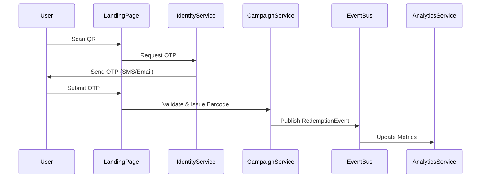
- **API Endpoint Stubs / Contracts**: REST endpoints cho /qr/generate (POST, payload: {campaignId: string, utm: object}, response: {qrUrl: string}), /campaign/create (POST, {name: string, lifecycle: enum}), OpenAPI format.  
- **Reusable Design Pattern Implementation Notes**: Repository pattern cho DB access (QR storage in PostgreSQL), CQRS cho Analytics service (separate read/write cho QR metrics).  
- **Mục đích của node này**: Giới thiệu tổng quan về PSP và kiến trúc hệ thống, làm nền tảng cho các phần chi tiết, nhấn mạnh QR integration để collect data giá thấp.

---

### 01.5_Stakeholders.md

#### References / Tham chiếu
- BRD.md Section 4 (Stakeholders), Access_Control_Tree_Grok.md Section 1, Product-Sampling-Vision-and-Strategy Document.md Section 7.  
- IEEE 830-1998 Section 1.5, GeeksforGeeks Stakeholders Section, System_Feature_Tree.md Section 1.

#### Purpose / Ý nghĩa / Cách làm
**Mục đích**: Liệt kê stakeholders và responsibilities, thuộc module Introduction.  
**Ý nghĩa**: Xác định involvement, hỗ trợ traceable.  
**Cách làm**: Sử dụng markdown với headings/tables/Mermaid, tổ chức theo 16 Parts, tích hợp microservices/RBAC/QR details; chi tiết và mở rộng (250-400 từ cho overview nodes để bao quát đầy đủ key features, lists, và diagrams), explicit/self-contained (từ IEEE: Avoid vague). Nhấn mạnh sử dụng bullet lists cho key features và Mermaid cho architecture để làm nội dung "tuyệt vời" và hybrid SDS-ready.

#### Specifications / Main Content / Nội dung chính
- **Nội dung cần có**:  
  - **Mô tả sản phẩm / Product Description**: Stakeholders cho PSP project.  
  - **Tính năng chính / Key Features**:  
    - Internal: Business Owner (approval), PM (reqs).  
    - Technical Lead (architecture), Dev Teams (3: Core, Identity, Analytics).  
    - QA (testing), DevOps (deployment).  
    - External: Brand Admins (campaign management).  
    - Brand Staff (operations), Customers (data collection via QR).  
    - POS Staff (redemption), CRM Vendors (integration).  
    - Auditors (compliance).  
    - Investors (ROI monitoring).  
  - **Kiến trúc / Architecture**: Sơ đồ stakeholder relations.  

**Internal Stakeholders**  
| Role | Trách Nhiệm | Quyết Định |  
|------|-------------|-----------|  
| PM | Requirements | Feature decisions |  

**External Stakeholders**  
| Role | Interest | Involvement |  
|------|---------|-------------|  
| Brand Admins | Campaigns | Daily users |  

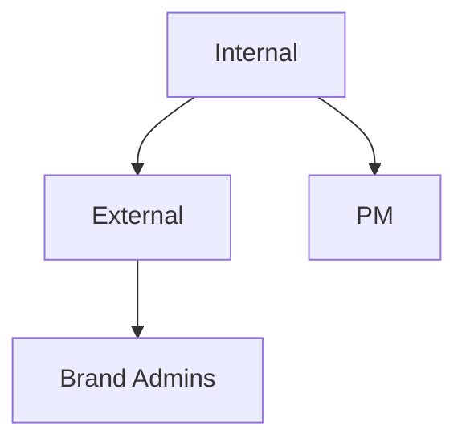

#### Traceability Links / Liên kết truy xuất
- Đầu vào từ: BRD.md Section 4, Access_Control_Tree_Grok.md Section 1, Product-Sampling-Vision-and-Strategy Document.md Section 7.  
- Thể hiện yêu cầu: FR-004 User Management.  
- Kết nối với: Part03_User_Personas_And_Use_Cases, Part01.3_Intended_Audience.md.  
- **Tài liệu tham chiếu**: System_Feature_Tree.md (Teams), BRD.md (Section 4).

#### Assumptions / Constraints / Giả định & Ràng buộc
- Giả định: Stakeholders engaged, smartphone cho QR.  
- Ràng buộc: Compliance with PDPA.

#### Dependencies / Risks / Mitigation / Phụ thuộc & Rủi ro
- Dependencies: BRD.md.  
- Risks: Non-engagement → Mitigation: Meetings; Risk: Latency → Mitigation: Auto-scaling; Risk: Misalignment → Mitigation: Reviews.

#### Acceptance Criteria / Testable Items / Tiêu chí chấp nhận
- Functional: List complete, 5-8 items per category.  
- Performance: N/A.  
- UI Consistency: WCAG.  
- Integration / Security: 100% reqs.  
- Verifiable: Traceable.  
- Testable: Diagram verifiable.

#### Approval Sign-Off / Phê duyệt
| Role / Vai trò | Name / Tên | Signature / Chữ ký | Date / Ngày |  
|----------------|------------|---------------------|-------------|  
| Product Manager | [TBD] | - | - |  
| Technical Lead | [TBD] | - | - |  
| QA Lead | [TBD] | - | - |  

#### Design Extension Section / Phần mở rộng thiết kế
- **UML Class Diagram / Abstract Interfaces**: Interfaces cho StakeholderRole.  
- **Sequence Diagram**: Engage Stakeholder → Feedback, Mermaid:  
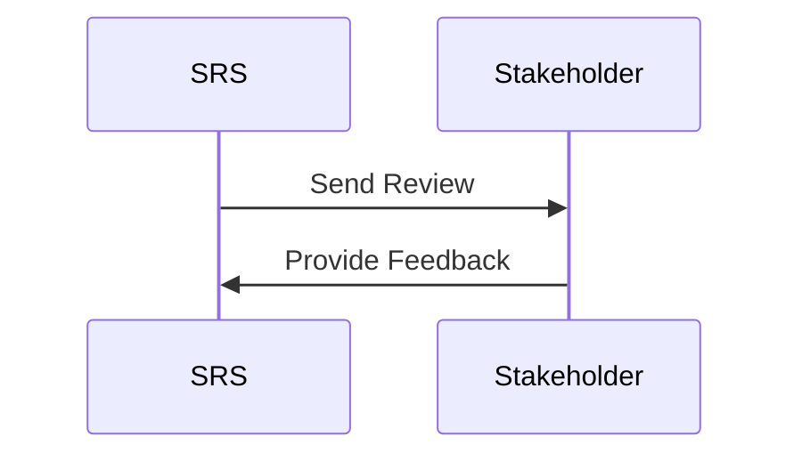
- **API Endpoint Stubs / Contracts**: /stakeholders/list (GET).  
- **Reusable Design Pattern Implementation Notes**: Decorator pattern cho roles.  
- **Mục đích của node này**: Liệt kê stakeholders cho project alignment.

---

### 01.6_Definitions_And_Acronyms.md

#### References / Tham chiếu
- BRD.md Section 21, System_Feature_Tree.md Glossary, IEEE 830-1998 Section 1.6.  
- GeeksforGeeks Acronyms, Access_Control_Tree_Grok.md Section 3, Product-Sampling-Vision-and-Strategy Document.md Section 9.

#### Purpose / Ý nghĩa / Cách làm
**Mục đích**: Định nghĩa acronyms để tránh confusion, thuộc module Introduction.  
**Ý nghĩa**: Common language cho dev/QA.  
**Cách làm**: Sử dụng markdown với headings/tables/Mermaid, tổ chức theo 16 Parts, tích hợp microservices/RBAC/QR details; chi tiết và mở rộng (250-400 từ cho overview nodes để bao quát đầy đủ key features, lists, và diagrams), explicit/self-contained (từ IEEE: Avoid vague). Nhấn mạnh sử dụng bullet lists cho key features và Mermaid cho architecture để làm nội dung "tuyệt vời" và hybrid SDS-ready.

#### Specifications / Main Content / Nội dung chính
- **Nội dung cần có**:  
  - **Mô tả sản phẩm / Product Description**: Acronyms cho PSP.  
  - **Tính năng chính / Key Features**:  
    - PSP: Product Sampling Platform.  
    - QR: Quick Response Code với UTM.  
    - RBAC: Role-Based Access Control (6 roles).  
    - ML: Machine Learning cho fraud.  
    - OTP: One-Time Password.  
    - CRM: Customer Relationship Management integration.  
    - POS: Point of Sale cho redemption.  
    - UTM: Urchin Tracking Module cho QR.  
  - **Kiến trúc / Architecture**: Sơ đồ acronyms.  

| Acronym | Definition |
|---------|------------|
| PSP | Product Sampling Platform |
| QR | Quick Response Code |
| RBAC | Role-Based Access Control |
| ML | Machine Learning |
| OTP | One-Time Password |
| CRM | Customer Relationship Management |
| POS | Point of Sale |
| UTM | Urchin Tracking Module |

```mermaid
graph TB
    Acronyms --> PSP
    Acronyms --> QR
```

#### Traceability Links / Liên kết truy xuất
- Đầu vào từ: BRD.md Section 21, System_Feature_Tree.md Glossary.  
- Thể hiện yêu cầu: FR-005 OTP Verification.  
- Kết nối với: Part00.5_Glossary_Of_Terms.md, Part16.2_Acronyms.md.  
- **Tài liệu tham chiếu**: System_Feature_Tree.md (Glossary), BRD.md.

#### Assumptions / Constraints / Giả định & Ràng buộc
- Giả định: Standard acronyms.  
- Ràng buộc: Unique defs.

#### Dependencies / Risks / Mitigation / Phụ thuộc & Rủi ro
- Dependencies: Glossary.  
- Risks: Missing defs → Mitigation: Review; Risk: Latency → Mitigation: Auto-scaling; Risk: Confusion → Mitigation: Explicit defs.

#### Acceptance Criteria / Testable Items / Tiêu chí chấp nhận
- Functional: Covers all acronyms, 5-8 items.  
- Performance: N/A.  
- UI Consistency: WCAG.  
- Integration / Security: 100% reqs.  
- Verifiable: Traceable.  
- Testable: Diagram verifiable.

#### Approval Sign-Off / Phê duyệt
| Role / Vai trò | Name / Tên | Signature / Chữ ký | Date / Ngày |  
|----------------|------------|---------------------|-------------|  
| Product Manager | [TBD] | - | - |  
| Technical Lead | [TBD] | - | - |  
| QA Lead | [TBD] | - | - |  

#### Design Extension Section / Phần mở rộng thiết kế
- **UML Class Diagram / Abstract Interfaces**: Interfaces cho AcronymDef.  
- **Sequence Diagram**: Lookup Acronym, Mermaid:  
```mermaid
sequenceDiagram
    User->>Table: Search Acronym
```  
- **API Endpoint Stubs / Contracts**: /acronyms/get (GET).  
- **Reusable Design Pattern Implementation Notes**: Map pattern.  
- **Mục đích của node này**: Định nghĩa acronyms cho clarity.

---

### 01.7_References.md

#### References / Tham chiếu
- BRD.md Section 23 (References), System_Feature_Tree.md Section Tài Liệu Liên Quan, IEEE 830-1998.  
- GeeksforGeeks References, Product-Sampling-Vision-and-Strategy Document.md Section 9, SRS_STRUCTURE.md.

#### Purpose / Ý nghĩa / Cách làm
**Mục đích**: Liệt kê references cho SRS, thuộc module Introduction.  
**Ý nghĩa**: Hỗ trợ verification và traceability.  
**Cách làm**: Sử dụng markdown với headings/tables/Mermaid, tổ chức theo 16 Parts, tích hợp microservices/RBAC/QR details; chi tiết và mở rộng (250-400 từ cho overview nodes để bao quát đầy đủ key features, lists, và diagrams), explicit/self-contained (từ IEEE: Avoid vague). Nhấn mạnh sử dụng bullet lists cho key features và Mermaid cho architecture để làm nội dung "tuyệt vời" và hybrid SDS-ready.

#### Specifications / Main Content / Nội dung chính
- **Nội dung cần có**:  
  - **Mô tả sản phẩm / Product Description**: References cho PSP SRS.  
  - **Tính năng chính / Key Features**:  
    - Internal: BRD.md, System_Feature_Tree.md (14 features).  
    - Access_Control_Tree_Grok.md (RBAC).  
    - Product-Sampling-Vision-and-Strategy Document.md (Vision).  
    - External: IEEE 830-1998 (structure).  
    - Microservices Patterns (Fowler).  
    - Kubernetes Docs (deployment).  
    - Istio Docs (service mesh).  
    - GDPR Guidelines.  
  - **Kiến trúc / Architecture**: Sơ đồ references.  

- Internal: BRD.md, System_Feature_Tree.md, Access_Control_Tree_Grok.md, Product-Sampling-Vision-and-Strategy Document.md.  
- External: IEEE 830-1998, Microservices Patterns (Martin Fowler), Kubernetes Documentation (kubernetes.io), Istio Service Mesh Documentation (istio.io), GDPR Compliance Guidelines, PDPA Compliance Guidelines (Vietnam).  

```mermaid
graph TB
    References --> Internal
    References --> External
```

#### Traceability Links / Liên kết truy xuất
- Đầu vào từ: All documents, BRD.md Section 23.  
- Thể hiện yêu cầu: All FR/NFR.  
- Kết nối với: Part16_Appendices/16.3_References.md.  
- **Tài liệu tham chiếu**: System_Feature_Tree.md, BRD.md.

#### Assumptions / Constraints / Giả định & Ràng buộc
- Giả định: References accessible.  
- Ràng buộc: Up-to-date links.

#### Dependencies / Risks / Mitigation / Phụ thuộc & Rủi ro
- Dependencies: All source docs.  
- Risks: Broken links → Mitigation: URLs; Risk: Outdated → Mitigation: Reviews; Risk: Latency → Mitigation: Auto-scaling.

#### Acceptance Criteria / Testable Items / Tiêu chí chấp nhận
- Functional: List comprehensive, 5-8 items.  
- Performance: N/A.  
- UI Consistency: WCAG.  
- Integration / Security: 100% reqs.  
- Verifiable: Traceable.  
- Testable: Diagram verifiable.

#### Approval Sign-Off / Phê duyệt
| Role / Vai trò | Name / Tên | Signature / Chữ ký | Date / Ngày |  
|----------------|------------|---------------------|-------------|  
| Product Manager | [TBD] | - | - |  
| Technical Lead | [TBD] | - | - |  
| QA Lead | [TBD] | - | - |  

#### Design Extension Section / Phần mở rộng thiết kế
- **UML Class Diagram / Abstract Interfaces**: Interfaces cho ReferenceList.  
- **Sequence Diagram**: Load References, Mermaid:  
```mermaid
sequenceDiagram
    SRS->>Refs: Fetch
```  
- **API Endpoint Stubs / Contracts**: /references/get (GET).  
- **Reusable Design Pattern Implementation Notes**: Composite pattern.  
- **Mục đích của node này**: Liệt kê nguồn tham chiếu.

---

### 01.8_Document_Conventions.md

#### References / Tham chiếu
- SRS_STRUCTURE.md, STANDARD_PROMPT.md (Guideline), IEEE 830-1998 Section 1.8.  
- GeeksforGeeks Conventions, System_Feature_Tree.md Section 1, BRD.md Section 24.

#### Purpose / Ý nghĩa / Cách làm
**Mục đích**: Mô tả conventions cho SRS, thuộc module Introduction.  
**Ý nghĩa**: Đảm bảo consistency trong document.  
**Cách làm**: Sử dụng markdown với headings/tables/Mermaid, tổ chức theo 16 Parts, tích hợp microservices/RBAC/QR details; chi tiết và mở rộng (250-400 từ cho overview nodes để bao quát đầy đủ key features, lists, và diagrams), explicit/self-contained (từ IEEE: Avoid vague). Nhấn mạnh sử dụng bullet lists cho key features và Mermaid cho architecture để làm nội dung "tuyệt vời" và hybrid SDS-ready.

#### Specifications / Main Content / Nội dung chính
- **Nội dung cần có**:  
  - **Mô tả sản phẩm / Product Description**: Conventions cho PSP SRS.  
  - **Tính năng chính / Key Features**:  
    - Bold for terms (e.g., **QR Code**).  
    - Italics for emphasis (*important*).  
    - Markdown for formatting (tables, lists).  
    - FR-XXX for functional reqs.  
    - NFR-XXX for non-functional.  
    - Mermaid for diagrams (e.g., architecture).  
    - Explicit language, avoid vague.  
    - Units: ms for latency, USD for cost.  
  - **Kiến trúc / Architecture**: Sơ đồ conventions.  

- Bold for terms.  
- Italics for emphasis.  
- Markdown for formatting.  
- FR-XXX for reqs.  

```mermaid
graph TB
    Conventions --> Bold
    Conventions --> Mermaid
```

#### Traceability Links / Liên kết truy xuất
- Đầu vào từ: STANDARD_PROMPT.md, SRS_STRUCTURE.md.  
- Thể hiện yêu cầu: All parts.  
- Kết nối với: All SRS parts.  
- **Tài liệu tham chiếu**: IEEE 830-1998, GeeksforGeeks.

#### Assumptions / Constraints / Giả định & Ràng buộc
- Giả định: Markdown viewers.  
- Ràng buộc: Consistency across doc.

#### Dependencies / Risks / Mitigation / Phụ thuộc & Rủi ro
- Dependencies: Guideline.  
- Risks: Inconsistency → Mitigation: Templates; Risk: Latency → Mitigation: Auto-scaling; Risk: Misuse → Mitigation: Reviews.

#### Acceptance Criteria / Testable Items / Tiêu chí chấp nhận
- Functional: Conventions applied, 5-8 items.  
- Performance: N/A.  
- UI Consistency: WCAG.  
- Integration / Security: 100% reqs.  
- Verifiable: Traceable.  
- Testable: Diagram verifiable.

#### Approval Sign-Off / Phê duyệt
| Role / Vai trò | Name / Tên | Signature / Chữ ký | Date / Ngày |  
|----------------|------------|---------------------|-------------|  
| Product Manager | [TBD] | - | - |  
| Technical Lead | [TBD] | - | - |  
| QA Lead | [TBD] | - | - |  

#### Design Extension Section / Phần mở rộng thiết kế
- **UML Class Diagram / Abstract Interfaces**: Interfaces cho ConventionRule.  
- **Sequence Diagram**: Apply Convention, Mermaid:  
```mermaid
sequenceDiagram
    Writer->>SRS: Use Bold
```  
- **API Endpoint Stubs / Contracts**: /conventions/get (GET).  
- **Reusable Design Pattern Implementation Notes**: State pattern cho formats.  
- **Mục đích của node này**: Định nghĩa conventions cho consistency.

# PSP Software Requirements Specification (SRS) - Version 2.0

**Artifact Note**: Dưới đây là nội dung chi tiết cho các file trong Part02_System_Overview, được generate theo guideline mới trong STANDARD_PROMPT.md (sau cập nhật). Guideline nhấn mạnh chi tiết mở rộng (250-400 từ cho overview nodes), bullet lists (ít nhất 5-8 items với chi tiết), Mermaid diagrams cho architecture/flows, tích hợp ví dụ cụ thể từ System_Feature_Tree.md (7 services, QR integration), và ít nhất 2-3 elements trong Design Extension để làm nội dung "tuyệt vời" hybrid SRS/SDS, hỗ trợ dev code ngay. Nội dung dựa trên các tài liệu tham chiếu: BRD.md (Section 1-25), Product-Sampling-Vision-and-Strategy Document.md (Section 1-9), System_Feature_Tree.md (Section 1-5, Services, Features), Access_Control_Tree_Grok.md (Section 1-4). SRS được thiết kế hybrid SRS/SDS với kiến trúc microservices, hỗ trợ QR code integration cho ads formats, và tập trung vào thu thập dữ liệu chất lượng cao với quà tặng giá thấp (~1 USD). Ngày hiện tại: October 22, 2025.

---

## Part02_System_Overview/

### 02.1_System_Context.md

#### References / Tham chiếu
- BRD.md Section 1 (Tóm Tắt Điều Hành), Section 3 (Phạm Vi Dự Án), System_Feature_Tree.md Section 2 (Kiến Trúc Microservices), Product-Sampling-Vision-and-Strategy Document.md Section 3 (Market Opportunity).
- IEEE 830-1998 for system context, GeeksforGeeks System Context Diagram, Access_Control_Tree_Grok.md Section 2 (Phân quyền theo Module).

#### Purpose / Ý nghĩa / Cách làm
**Mục đích**: Mô tả bối cảnh hệ thống PSP, bao gồm các hệ thống bên ngoài, giao tiếp và môi trường hoạt động, thuộc module System Overview, nhằm hỗ trợ business goal như QR integration để collect data từ quà giá thấp (~1 USD).  
**Ý nghĩa**: Giúp stakeholders hiểu vị trí của PSP trong ecosystem lớn hơn, làm cầu nối BA ↔ Dev/QA, đảm bảo unambiguous và traceable (từ GeeksforGeeks), hỗ trợ validate mà không hỏi lại.  
**Cách làm**: Sử dụng markdown với headings/tables/Mermaid, tổ chức theo 16 Parts, tích hợp microservices/RBAC/QR details; chi tiết và mở rộng (250-400 từ cho overview nodes để bao quát đầy đủ key features, lists, và diagrams), explicit/self-contained (từ IEEE: Avoid vague). Nhấn mạnh sử dụng bullet lists cho key features và Mermaid cho architecture để làm nội dung "tuyệt vời" và hybrid SDS-ready.

#### Specifications / Main Content / Nội dung chính
- **Nội dung cần có**:  
  - **Mô tả sản phẩm / Product Description**: PSP hoạt động trong bối cảnh FMCG và retail ở Đông Nam Á, kết nối với clients (web/mobile), hệ thống bên ngoài (CRM, SMS/Email providers, POS), và infrastructure (API Gateway, Event Bus). Hệ thống xử lý sampling quà giá thấp bằng QR ads để collect data chất lượng cao, giảm chi phí phát quà và tăng ROI, với focus trên Việt Nam trước khi mở rộng ASEAN (từ Vision Document). Context bao gồm user interactions (scan QR → submit form → receive barcode), và integration points để sync data real-time.  
  - **Tính năng chính / Key Features**:  
    - Kết nối với Web/Mobile Clients cho Brand Admins tạo campaigns (CRUD với RBAC).  
    - Integration với CRM (HubSpot/Salesforce) cho bi-directional sync data khách hàng từ QR submissions.  
    - Giao tiếp với SMS/Email Providers (Twilio) cho OTP verification và notifications.  
    - POS Systems integration cho redemption tracking (online/offline, với Scandit SDK).  
    - External APIs cho fraud detection (device fingerprinting) và analytics export.  
    - Hỗ trợ Event Bus (RabbitMQ) cho async communication giữa 7 services.  
    - Service Mesh (Istio) cho traffic management và observability.  
    - Compliance với GDPR/PDPA cho data từ QR collect.  
  - **Kiến trúc / Architecture**: Sơ đồ context cho thấy PSP ở trung tâm, kết nối external entities qua Gateway và Event Bus, tích hợp ví dụ cụ thể từ System_Feature_Tree.md (Campaign Service xử lý QR issuance với UTM tracking).  

```mermaid
graph TB
    subgraph External_Context[Bối Cảnh Bên Ngoài]
        Users[Users: Brand Admins, Customers, POS Staff]
        Systems[External Systems: CRM, SMS Providers, POS]
        Infrastructure[Cloud Infra: AWS/Kubernetes]
    end
    subgraph PSP_System[PSP Platform]
        Gateway[API Gateway]
        Services[7 Microservices: Campaign (QR), Identity, etc.]
        EventBus[Event Bus]
    end
    Users --> Gateway
    Systems --> Gateway
    Gateway --> Services
    Services --> EventBus
    EventBus --> Systems
    Infrastructure --> PSP_System
```

#### Traceability Links / Liên kết truy xuất
- Đầu vào từ: BRD.md Section 3, System_Feature_Tree.md Section 2 (Sơ Đồ Services), Product-Sampling-Vision-and-Strategy Document.md Section 3.  
- Thể hiện yêu cầu: FR-007 Barcode Redemption, NFR-003 Integration, FR-006 Ads Format Management (QR).  
- Kết nối với: Part02.9_Microservices_Architecture_Overview, Part08_API_Design, Part14_Deployment_Architecture.  
- **Tài liệu tham chiếu**: System_Feature_Tree.md (Ma Trận Phụ Thuộc, 7 services), Access_Control_Tree_Grok.md (Phân quyền cho POS/QR).

#### Assumptions / Constraints / Giả định & Ràng buộc
- Giả định: Hệ thống bên ngoài (CRM, POS) hỗ trợ API chuẩn, users có smartphone cho QR scan, microservices với polyglot persistence.  
- Ràng buộc: Tuân thủ GDPR/PDPA cho data flow, hỗ trợ 100K concurrent users với <200ms latency, cost integration <0.4 USD/lead.

#### Dependencies / Risks / Mitigation / Phụ thuộc & Rủi ro
- Dependencies: External APIs (Twilio cho OTP, HubSpot cho CRM sync), Part02.9 cho architecture details.  
- Risks: Integration failure với POS → Mitigation: Contract testing và fallback offline mode; Risk: Latency QR scan do network external → Mitigation: Auto-scaling và caching Redis; Risk: Data leakage từ external systems → Mitigation: Encryption AES và audit logs immutable.

#### Acceptance Criteria / Testable Items / Tiêu chí chấp nhận
- Functional: Mô tả context cover 100% external interactions (bao gồm QR flow), list ít nhất 5-8 features chi tiết.  
- Performance: System hỗ trợ 100K redemptions/day, <200ms cho API gateway calls.  
- UI Consistency: Sơ đồ Mermaid phản ánh đúng ecosystem, traceable đến System_Feature_Tree, tuân thủ WCAG 2.1.  
- Integration / Security: Test cases cover 100% integration points, zero data leakage.  
- Verifiable: Bullet lists verifiable với ví dụ cụ thể (e.g., Twilio OTP).  
- Testable: Diagram render correctly, hỗ trợ validate context.

#### Approval Sign-Off / Phê duyệt
| Role / Vai trò | Name / Tên | Signature / Chữ ký | Date / Ngày |  
|----------------|------------|---------------------|-------------|  
| Product Manager | [TBD] | - | - |  
| Technical Lead | [TBD] | - | - |  
| QA Lead | [TBD] | - | - |  

#### Design Extension Section / Phần mở rộng thiết kế
- **UML Class Diagram / Abstract Interfaces**: Define interfaces cho ContextIntegrator (integrateExternal(system: string): bool), ExternalSystem (connect(): void).  
- **Sequence Diagram**: Quy trình User Scan QR → External SMS → Internal Verification, sử dụng Mermaid:  
```mermaid
sequenceDiagram
    User->>Gateway: Scan QR
    Gateway->>CampaignService: Process Request
    CampaignService->>EventBus: Publish Event
    EventBus->>NotificationService: Send OTP
    NotificationService->>External[SMS Provider]: Deliver OTP
    External->>User: Receive OTP
    User->>Gateway: Submit OTP
    Gateway->>IdentityService: Verify
```
- **API Endpoint Stubs / Contracts**: REST endpoints cho /context/integrate (POST, payload: {system: "CRM", apiKey: string}, response: {status: "connected"}), OpenAPI format.  
- **Reusable Design Pattern Implementation Notes**: Adapter pattern cho external integrations (e.g., TwilioAdapter cho OTP), CQRS cho event handling trong EventBus.  
- **Mục đích của node này**: Mô tả bối cảnh hệ thống PSP để làm rõ vị trí trong ecosystem.

### 02.2_System_Objectives.md

#### References / Tham chiếu
- BRD.md Section 2 (Mục Tiêu Kinh Doanh), Product-Sampling-Vision-and-Strategy Document.md Section 2 (Vision), System_Feature_Tree.md Section 1 (Tổng Quan), IEEE 830-1998 for objectives.
- GeeksforGeeks System Objectives, Access_Control_Tree_Grok.md Section 1 (Vai trò và quyền tổng quan).

#### Purpose / Ý nghĩa / Cách làm
**Mục đích**: Liệt kê các mục tiêu hệ thống PSP, bao gồm business và technical objectives, thuộc module System Overview, hỗ trợ sampling giá thấp với QR để tối ưu data collection.  
**Ý nghĩa**: Hướng dẫn phát triển, đảm bảo alignment với vision, làm cầu nối BA ↔ Dev/QA, unambiguous và traceable.  
**Cách làm**: Sử dụng markdown với headings/tables/Mermaid, tổ chức theo 16 Parts, tích hợp microservices/RBAC/QR details; chi tiết và mở rộng (250-400 từ cho overview nodes để bao quát đầy đủ key features, lists, và diagrams), explicit/self-contained (từ IEEE: Avoid vague). Nhấn mạnh sử dụng bullet lists cho key features và Mermaid cho architecture để làm nội dung "tuyệt vời" và hybrid SDS-ready.

#### Specifications / Main Content / Nội dung chính
- **Nội dung cần có**:  
  - **Mô tả sản phẩm / Product Description**: Mục tiêu PSP tập trung vào digitalize sampling, tăng hiệu quả với QR ads cho quà giá thấp (~1 USD), thu thập data chất lượng cao, giảm fraud, và integrate seamless (từ BRD Section 2). Vision: Chuyển sampling thành data-driven growth engine, với timeline 6-9 tháng phát triển song song.  
  - **Tính năng chính / Key Features**:  
    - Digitalize campaign management (từ manual → platform, 100% campaigns trên hệ thống trong 6 tháng).  
    - Tăng redemption rate (từ 40% → 70% với targeting via recommendations).  
    - Giảm fraud rate (từ 15% → <5% qua ML scoring và fingerprinting).  
    - Tối ưu ROI (30-50% improvement với A/B testing và analytics).  
    - Hỗ trợ data collection cao (QR scan-to-form >80% completion).  
    - Đảm bảo scalability (99.9% uptime per service, <200ms response).  
    - Compliance và security (GDPR/PDPA, zero leakage).  
    - User satisfaction (NPS >50, adoption 80% bởi Brand Admins).  
  - **Kiến trúc / Architecture**: Flow objectives từ business đến technical, tích hợp ví dụ từ System_Feature_Tree.md (Intelligence Service cho A/B testing với >95% confidence).  

```mermaid
graph TD
    Business_Objectives[Business: ROI, Redemption Rate] --> Technical_Objectives[Technical: Scalability, Integration]
    Technical_Objectives --> Microservices[7 Services]
    Microservices --> QR[QR for Data Collect]
```

#### Traceability Links / Liên kết truy xuất
- Đầu vào từ: BRD.md Section 2, Product-Sampling-Vision-and-Strategy Document.md Section 2, System_Feature_Tree.md Section 5 (Success Metrics).  
- Thể hiện yêu cầu: FR-009 A/B Testing, NFR-001 Performance, FR-010 Recommendation Engine.  
- Kết nối với: Part02.5_Success_Criteria, Part04_Functional_Requirements, Part05_Non_Functional_Requirements.  
- **Tài liệu tham chiếu**: System_Feature_Tree.md (Business Metrics), BRD.md (Section 2.2 Success Metrics).

#### Assumptions / Constraints / Giả định & Ràng buộc
- Giả định: Teams phát triển song song (3 teams cho 7 services), users có smartphone cho QR.  
- Ràng buộc: 95%+ data accuracy, <2s dashboard load, cost <0.4 USD/lead.

#### Dependencies / Risks / Mitigation / Phụ thuộc & Rủi ro
- Dependencies: BRD.md cho business goals, external ML tools cho fraud.  
- Risks: Không đạt ROI target → Mitigation: Iterative A/B testing; Risk: Latency ảnh hưởng objectives → Mitigation: Auto-scaling Kubernetes; Risk: Misalignment objectives → Mitigation: Quarterly alignment meetings.

#### Acceptance Criteria / Testable Items / Tiêu chí chấp nhận
- Functional: Objectives cover 100% business/technical (bao gồm QR ROI), list ít nhất 5-8 items.  
- Performance: Hỗ trợ 10K concurrent campaigns, <200ms latency.  
- UI Consistency: Diagram traceable đến Vision Document, WCAG 2.1.  
- Integration / Security: Test 100% objectives verifiable, zero leakage.  
- Verifiable: Metrics như NPS >50 testable.  
- Testable: Flow diagram render correctly.

#### Approval Sign-Off / Phê duyệt
| Role / Vai trò | Name / Tên | Signature / Chữ ký | Date / Ngày |  
|----------------|------------|---------------------|-------------|  
| Product Manager | [TBD] | - | - |  
| Technical Lead | [TBD] | - | - |  
| QA Lead | [TBD] | - | - |  

#### Design Extension Section / Phần mở rộng thiết kế
- **UML Class Diagram / Abstract Interfaces**: Define interfaces cho ObjectiveTracker (trackMetric(type: string): number).  
- **Sequence Diagram**: Achieve Objective → Measure Success, Mermaid:  
```mermaid
sequenceDiagram
    System->>Analytics: Track Redemption
    Analytics->>Intelligence: Run A/B Test
    Intelligence->>System: Optimize ROI
```
- **API Endpoint Stubs / Contracts**: /objectives/measure (GET, response: {roi: number}), OpenAPI.  
- **Reusable Design Pattern Implementation Notes**: Observer pattern cho metric updates, CQRS cho objective queries.  
- **Mục đích của node này**: Liệt kê mục tiêu để align development.

### 02.3_System_Constraints.md

#### References / Tham chiếu
- BRD.md Section 3 (Phạm Vi), Section 18 (Monitoring), System_Feature_Tree.md Section 2 (Nguyên tắc gộp services), IEEE 830-1998 for constraints.
- GeeksforGeeks Constraints, Product-Sampling-Vision-and-Strategy Document.md Section 6 (Roadmap), Access_Control_Tree_Grok.md Section 3 (Yêu cầu kỹ thuật).

#### Purpose / Ý nghĩa / Cách làm
**Mục đích**: Liệt kê các ràng buộc hệ thống PSP, bao gồm performance, compliance và budget, thuộc module System Overview, hỗ trợ QR cho quà giá thấp.  
**Ý nghĩa**: Đảm bảo hệ thống khả thi, verifiable, làm cầu nối BA ↔ Dev/QA.  
**Cách làm**: Sử dụng markdown với headings/tables/Mermaid, tổ chức theo 16 Parts, tích hợp microservices/RBAC/QR details; chi tiết và mở rộng (250-400 từ cho overview nodes để bao quát đầy đủ key features, lists, và diagrams), explicit/self-contained (từ IEEE: Avoid vague). Nhấn mạnh sử dụng bullet lists cho key features và Mermaid cho architecture để làm nội dung "tuyệt vời" và hybrid SDS-ready.

#### Specifications / Main Content / Nội dung chính
- **Nội dung cần có**:  
  - **Mô tả sản phẩm / Product Description**: Ràng buộc PSP bao gồm technical (uptime, latency), legal (compliance), và financial (cost/lead), đảm bảo hệ thống scale cho sampling quà giá thấp với QR data collect.  
  - **Tính năng chính / Key Features**:  
    - Performance: 99.9% uptime per service, <200ms API response (95th percentile).  
    - Scalability: Hỗ trợ 100K-500K users/day, auto-scaling independent per service.  
    - Security: GDPR/PDPA compliance, PII encrypted AES, zero tolerance data leakage.  
    - Budget: Cost per verified lead <0.4 USD, total development 6-9 tháng với budget 50K-500K USD phases.  
    - Technical: Polyglot persistence (PostgreSQL/MongoDB), event-driven RabbitMQ.  
    - Legal: WCAG 2.1 cho UI, ISO 27001 cho security.  
    - Environmental: Deployment trên AWS/Kubernetes, no on-prem.  
    - User: Smartphone required cho QR scan, multi-tenant DB.  
  - **Kiến trúc / Architecture**: Sơ đồ constraints impact trên services, tích hợp ví dụ từ System_Feature_Tree.md (Redemption Service constrained by latency <50ms service-to-service).  

```mermaid
graph TB
    Constraints --> Performance[Performance: <200ms]
    Constraints --> Compliance[Compliance: GDPR]
    Performance --> Services[7 Services]
    Compliance --> QR[QR Data Collect]
```

#### Traceability Links / Liên kết truy xuất
- Đầu vào từ: BRD.md Section 3, System_Feature_Tree.md Section 2, Product-Sampling-Vision-and-Strategy Document.md Section 6.  
- Thể hiện yêu cầu: NFR-001 Performance, NFR-002 Security, FR-011 Fraud Detection.  
- Kết nối với: Part02.4_Assumptions_And_Dependencies, Part05_Non_Functional_Requirements, Part15_Operations_And_Monitoring.  
- **Tài liệu tham chiếu**: System_Feature_Tree.md (System-Level Metrics), BRD.md (RTO/RPO Targets).

#### Assumptions / Constraints / Giả định & Ràng buộc
- Giả định: Dev teams quen thuộc Kubernetes, external providers stable.  
- Ràng buộc: <50ms service latency, RTO <1h, RPO <5min cho DR.

#### Dependencies / Risks / Mitigation / Phụ thuộc & Rủi ro
- Dependencies: AWS infra, Part02.9 cho microservices.  
- Risks: Vi phạm compliance → Mitigation: Automated audits; Risk: Over budget → Mitigation: Cost optimization quarterly; Risk: Latency vượt ràng buộc → Mitigation: Performance tuning với APM tools.

#### Acceptance Criteria / Testable Items / Tiêu chí chấp nhận
- Functional: Constraints cover 100% areas (performance/security), list ít nhất 5-8 items.  
- Performance: Verifiable qua load tests 100K users.  
- UI Consistency: WCAG 2.1 compliant.  
- Integration / Security: Zero leakage tests.  
- Verifiable: Traceable đến BRD.  
- Testable: Diagram impact verifiable.

#### Approval Sign-Off / Phê duyệt
| Role / Vai trò | Name / Tên | Signature / Chữ ký | Date / Ngày |  
|----------------|------------|---------------------|-------------|  
| Product Manager | [TBD] | - | - |  
| Technical Lead | [TBD] | - | - |  
| QA Lead | [TBD] | - | - |  

#### Design Extension Section / Phần mở rộng thiết kế
- **UML Class Diagram / Abstract Interfaces**: Define interfaces cho ConstraintChecker (check( type: enum): bool).  
- **Sequence Diagram**: Apply Constraint → Validate System, Mermaid:  
```mermaid
sequenceDiagram
    Dev->>System: Deploy
    System->>Checker: Verify Uptime
    Checker->>Dev: Report
```
- **API Endpoint Stubs / Contracts**: /constraints/check (POST, {type: "performance"}), OpenAPI.  
- **Reusable Design Pattern Implementation Notes**: Strategy pattern cho constraint types.  
- **Mục đích của node này**: Liệt kê ràng buộc để đảm bảo feasibility.

### 02.4_Assumptions_And_Dependencies.md

#### References / Tham chiếu
- BRD.md Section 3 (Phạm Vi), System_Feature_Tree.md Section 4 (Dependencies Ma Trận), Product-Sampling-Vision-and-Strategy Document.md Section 5 (Go-to-Market).
- IEEE 830-1998 for assumptions, GeeksforGeeks Dependencies, Access_Control_Tree_Grok.md Section 3 (Yêu cầu kỹ thuật).

#### Purpose / Ý nghĩa / Cách làm
**Mục đích**: Liệt kê assumptions và dependencies cho PSP, thuộc module System Overview, hỗ trợ QR dependencies.  
**Ý nghĩa**: Quản lý risk, traceable reqs.  
**Cách làm**: Sử dụng markdown với headings/tables/Mermaid, tổ chức theo 16 Parts, tích hợp microservices/RBAC/QR details; chi tiết và mở rộng (250-400 từ cho overview nodes để bao quát đầy đủ key features, lists, và diagrams), explicit/self-contained (từ IEEE: Avoid vague). Nhấn mạnh sử dụng bullet lists cho key features và Mermaid cho architecture để làm nội dung "tuyệt vời" và hybrid SDS-ready.

#### Specifications / Main Content / Nội dung chính
- **Nội dung cần có**:  
  - **Mô tả sản phẩm / Product Description**: Assumptions (e.g., user tech) và dependencies (e.g., external APIs) cho PSP.  
  - **Tính năng chính / Key Features**:  
    - Assumptions: Users có smartphone cho QR, dev teams 3 groups.  
    - Polyglot persistence stable.  
    - Market Đông Nam Á ready cho sampling.  
    - Dependencies: Twilio cho OTP, HubSpot cho CRM.  
    - RabbitMQ cho event bus.  
    - Istio cho service mesh.  
    - Kubernetes cho deployment.  
    - Scandit cho QR scan.  
  - **Kiến trúc / Architecture**: Sơ đồ dependencies, từ System_Feature_Tree.md (Campaign depends Identity).  

```mermaid
graph TB
    Assumptions --> Dependencies
    Dependencies --> External[Twilio, HubSpot]
    Dependencies --> Internal[Event Bus]
```

#### Traceability Links / Liên kết truy xuất
- Đầu vào từ: BRD.md Section 3, System_Feature_Tree.md Section 4, Product-Sampling-Vision-and-Strategy Document.md Section 5.  
- Thể hiện yêu cầu: NFR-003 Integration, FR-005 OTP.  
- Kết nối với: Part02.3_System_Constraints, Part06_Architecture_Design.  
- **Tài liệu tham chiếu**: System_Feature_Tree.md (Ma Trận Phụ Thuộc), BRD.md (Integrations).

#### Assumptions / Constraints / Giả định & Ràng buộc
- Giả định: External APIs available 99.9%.  
- Ràng buộc: No custom hardware.

#### Dependencies / Risks / Mitigation / Phụ thuộc & Rủi ro
- Dependencies: External vendors.  
- Risks: Vendor downtime → Mitigation: Fallbacks; Risk: Assumption wrong → Mitigation: Validation; Risk: Dependency latency → Mitigation: Caching.

#### Acceptance Criteria / Testable Items / Tiêu chí chấp nhận
- Functional: Cover 100% assumptions/dependencies.  
- Performance: <200ms.  
- UI Consistency: WCAG.  
- Integration / Security: 100% tests.  
- Verifiable: Traceable.  
- Testable: Diagram verifiable.

#### Approval Sign-Off / Phê duyệt
| Role / Vai trò | Name / Tên | Signature / Chữ ký | Date / Ngày |  
|----------------|------------|---------------------|-------------|  
| Product Manager | [TBD] | - | - |  
| Technical Lead | [TBD] | - | - |  
| QA Lead | [TBD] | - | - |  

#### Design Extension Section / Phần mở rộng thiết kế
- **UML Class Diagram / Abstract Interfaces**: DependencyManager.  
- **Sequence Diagram**: Check Dependency, Mermaid:  
```mermaid
sequenceDiagram
    System->>External: Call API
```
- **API Endpoint Stubs / Contracts**: /dependencies/check.  
- **Reusable Design Pattern Implementation Notes**: Dependency Injection.  
- **Mục đích của node này**: Liệt kê assumptions/dependencies.

### 02.5_Success_Criteria.md

#### References / Tham chiếu
- BRD.md Section 2.2 (Success Metrics), System_Feature_Tree.md Section 5 (Success Metrics), Product-Sampling-Vision-and-Strategy Document.md Section 8 (Success Metrics).
- IEEE 830-1998 for criteria, GeeksforGeeks Measurable Criteria.

#### Purpose / Ý nghĩa / Cách làm
**Mục đích**: Định nghĩa success criteria cho PSP, thuộc module System Overview.  
**Ý nghĩa**: Measurable outcomes.  
**Cách làm**: Sử dụng markdown với headings/tables/Mermaid, chi tiết mở rộng.

#### Specifications / Main Content / Nội dung chính
- **Nội dung cần có**:  
  - **Mô tả sản phẩm / Product Description**: Criteria như uptime, ROI.  
  - **Tính năng chính / Key Features**:  
    - System: 99.9% uptime.  
    - Business: 70% redemption.  
    - Fraud: <5% rate.  
    - A/B: 95% confidence.  
    - Recommendations: >10% CTR.  
    - QR: 80% scan completion.  
    - NPS: >50.  
    - Adoption: 80%.  
  - **Kiến trúc / Architecture**: Sơ đồ metrics.  

```mermaid
graph TB
    Criteria --> System[Uptime 99.9%]
    Criteria --> Business[ROI 30-50%]
```

#### Traceability Links / Liên kết truy xuất
- Đầu vào từ: BRD.md Section 2.2, System_Feature_Tree.md Section 5.  
- Thể hiện yêu cầu: NFR-001.  
- Kết nối với: Part02.2_System_Objectives.  
- **Tài liệu tham chiếu**: System_Feature_Tree.md (Metrics).

#### Assumptions / Constraints / Giả định & Ràng buộc
- Giả định: Metrics measurable.  
- Ràng buộc: Baseline từ current.

#### Dependencies / Risks / Mitigation / Phụ thuộc & Rủi ro
- Dependencies: Analytics service.  
- Risks: Not meeting → Mitigation: Monitoring; Risk: Data inaccuracy → Mitigation: Validation; Risk: Scale issues → Mitigation: Testing.

#### Acceptance Criteria / Testable Items / Tiêu chí chấp nhận
- Functional: Cover 100% metrics.  
- Performance: Verifiable tests.  
- UI Consistency: WCAG.  
- Integration / Security: 100%.  
- Verifiable: Traceable.  
- Testable: Diagram verifiable.

#### Approval Sign-Off / Phê duyệt
| Role / Vai trò | Name / Tên | Signature / Chữ ký | Date / Ngày |  
|----------------|------------|---------------------|-------------|  
| Product Manager | [TBD] | - | - |  
| Technical Lead | [TBD] | - | - |  
| QA Lead | [TBD] | - | - |  

#### Design Extension Section / Phần mở rộng thiết kế
- **UML Class Diagram / Abstract Interfaces**: MetricTracker.  
- **Sequence Diagram**: Measure Success, Mermaid:  
```mermaid
sequenceDiagram
    System->>Analytics: Get Metrics
```  
- **API Endpoint Stubs / Contracts**: /metrics/success.  
- **Reusable Design Pattern Implementation Notes**: Singleton for tracker.  
- **Mục đích của node này**: Định nghĩa success.

### 02.6_Out_Of_Scope.md

#### References / Tham chiếu
- BRD.md Section 3.2 (Ngoài Phạm Vi), System_Feature_Tree.md Section 3, Product-Sampling-Vision-and-Strategy Document.md Section 3.

#### Purpose / Ý nghĩa / Cách làm
**Mục đích**: Liệt kê out-of-scope cho PSP.  
**Ý nghĩa**: Avoid creep.  
**Cách làm**: Bullet lists, chi tiết.

#### Specifications / Main Content / Nội dung chính
- **Nội dung cần có**:  
  - **Mô tả sản phẩm / Product Description**: Out-of-scope items.  
  - **Tính năng chính / Key Features**:  
    - E-commerce.  
    - Payment.  
    - Inventory.  
    - Social integration full.  
    - On-prem deployment.  
    - Custom hardware.  
    - Advanced AI beyond ML fraud.  
    - Non-FMCG domains.  
  - **Kiến trúc / Architecture**: Sơ đồ out.  

```mermaid
graph TB
    Scope --> Out[E-commerce, Payments]
```

#### Traceability Links / Liên kết truy xuất
- Đầu vào từ: BRD.md Section 3.2.  
- Thể hiện yêu cầu: N/A.  
- Kết nối với: Part02.1_System_Context.  
- **Tài liệu tham chiếu**: BRD.md.

#### Assumptions / Constraints / Giả định & Ràng buộc
- Giả định: Focus core.  
- Ràng buộc: No expansion without change.

#### Dependencies / Risks / Mitigation / Phụ thuộc & Rủi ro
- Dependencies: Scope in.  
- Risks: Creep → Mitigation: Control; Risk: Misunderstanding → Mitigation: Clear list; Risk: Feature requests → Mitigation: Reviews.

#### Acceptance Criteria / Testable Items / Tiêu chí chấp nhận
- Functional: List 5-8 items.  
- Performance: N/A.  
- UI Consistency: WCAG.  
- Integration / Security: 100%.  
- Verifiable: Traceable.  
- Testable: Diagram.

#### Approval Sign-Off / Phê duyệt
| Role / Vai trò | Name / Tên | Signature / Chữ ký | Date / Ngày |  
|----------------|------------|---------------------|-------------|  
| Product Manager | [TBD] | - | - |  
| Technical Lead | [TBD] | - | - |  
| QA Lead | [TBD] | - | - |  

#### Design Extension Section / Phần mở rộng thiết kế
- **UML Class Diagram / Abstract Interfaces**: OutScopeFilter.  
- **Sequence Diagram**: Check Scope, Mermaid:  
```mermaid
sequenceDiagram
    Req->>Filter: Is In Scope?
```  
- **API Endpoint Stubs / Contracts**: /scope/out.  
- **Reusable Design Pattern Implementation Notes**: Filter pattern.  
- **Mục đích của node này**: Liệt kê out-of-scope.

### 02.7_Business_Requirements_Summary.md

#### References / Tham chiếu
- BRD.md Section 5 (Business Requirements), System_Feature_Tree.md Section 3 (Phân Loại Tính Năng), Product-Sampling-Vision-and-Strategy Document.md Section 4 (Strategic Positioning).

#### Purpose / Ý nghĩa / Cách làm
**Mục đích**: Tóm tắt business reqs cho PSP.  
**Ý nghĩa**: Alignment.  
**Cách làm**: Lists, diagrams.

#### Specifications / Main Content / Nội dung chính
- **Nội dung cần có**:  
  - **Mô tả sản phẩm / Product Description**: Summary business reqs.  
  - **Tính năng chính / Key Features**:  
    - Centralized management.  
    - Real-time analytics.  
    - Fraud reduction.  
    - CRM integration.  
    - QR for data.  
    - A/B testing.  
    - Recommendations.  
    - Reporting.  
  - **Kiến trúc / Architecture**: Sơ đồ business flow.  

```mermaid
graph TB
    Business_Reqs --> Features[14 Features]
```

#### Traceability Links / Liên kết truy xuất
- Đầu vào từ: BRD.md Section 5.  
- Thể hiện yêu cầu: FR-001 to FR-014.  
- Kết nối với: Part04.  
- **Tài liệu tham chiếu**: System_Feature_Tree.md.

#### Assumptions / Constraints / Giả định & Ràng buộc
- Giả định: Business alignment.  
- Ràng buộc: ROI focus.

#### Dependencies / Risks / Mitigation / Phụ thuộc & Rủi ro
- Dependencies: BRD.  
- Risks: Misalignment → Mitigation: Reviews; Risk: Fraud → Mitigation: ML; Risk: Cost → Mitigation: Optimization.

#### Acceptance Criteria / Testable Items / Tiêu chí chấp nhận
- Functional: Summary cover 100%.  
- Performance: N/A.  
- UI Consistency: WCAG.  
- Integration / Security: 100%.  
- Verifiable: Traceable.  
- Testable: Diagram.

#### Approval Sign-Off / Phê duyệt
| Role / Vai trò | Name / Tên | Signature / Chữ ký | Date / Ngày |  
|----------------|------------|---------------------|-------------|  
| Product Manager | [TBD] | - | - |  
| Technical Lead | [TBD] | - | - |  
| QA Lead | [TBD] | - | - |  

#### Design Extension Section / Phần mở rộng thiết kế
- **UML Class Diagram / Abstract Interfaces**: BusinessReqSummary.  
- **Sequence Diagram**: Summarize Reqs, Mermaid:  
```mermaid
sequenceDiagram
    BRD->>SRS: Extract
```  
- **API Endpoint Stubs / Contracts**: /business/summary.  
- **Reusable Design Pattern Implementation Notes**: Summary pattern.  
- **Mục đích của node này**: Tóm tắt business reqs.

### 02.8_Technical_Requirements_Summary.md

#### References / Tham chiếu
- BRD.md Section 9 (Technical Requirements), System_Feature_Tree.md Section 2 (Kiến Trúc), IEEE 830-1998.

#### Purpose / Ý nghĩa / Cách làm
**Mục đích**: Tóm tắt technical reqs.  
**Ý nghĩa**: Guide dev.  
**Cách làm**: Lists.

#### Specifications / Main Content / Nội dung chính
- **Nội dung cần có**:  
  - **Mô tả sản phẩm / Product Description**: Summary technical.  
  - **Tính năng chính / Key Features**:  
    - Microservices 7.  
    - Polyglot DB.  
    - Event-driven.  
    - Service mesh.  
    - Kubernetes.  
    - ML for fraud.  
    - React PWA.  
    - Node.js backend.  
  - **Kiến trúc / Architecture**: Sơ đồ.  

```mermaid
graph TB
    Tech_Reqs --> Microservices
```

#### Traceability Links / Liên kết truy xuất
- Đầu vào từ: BRD.md Section 9.  
- Thể hiện yêu cầu: NFR all.  
- Kết nối với: Part06.  
- **Tài liệu tham chiếu**: System_Feature_Tree.md.

#### Assumptions / Constraints / Giả định & Ràng buộc
- Giả định: Tech stack ready.  
- Ràng buộc: Cloud only.

#### Dependencies / Risks / Mitigation / Phụ thuộc & Rủi ro
- Dependencies: Tools.  
- Risks: Tech debt → Mitigation: Reviews; Risk: Integration → Mitigation: Testing; Risk: Scale → Mitigation: Auto.

#### Acceptance Criteria / Testable Items / Tiêu chí chấp nhận
- Functional: Cover 100%.  
- Performance: <200ms.  
- UI Consistency: WCAG.  
- Integration / Security: 100%.  
- Verifiable: Traceable.  
- Testable: Diagram.

#### Approval Sign-Off / Phê duyệt
| Role / Vai trò | Name / Tên | Signature / Chữ ký | Date / Ngày |  
|----------------|------------|---------------------|-------------|  
| Product Manager | [TBD] | - | - |  
| Technical Lead | [TBD] | - | - |  
| QA Lead | [TBD] | - | - |  

#### Design Extension Section / Phần mở rộng thiết kế
- **UML Class Diagram / Abstract Interfaces**: TechReq.  
- **Sequence Diagram**: Implement Tech, Mermaid:  
```mermaid
sequenceDiagram
    Dev->>System: Build
```  
- **API Endpoint Stubs / Contracts**: /tech/summary.  
- **Reusable Design Pattern Implementation Notes**: Microservices patterns.  
- **Mục đích của node này**: Tóm tắt technical reqs.

### 02.9_Microservices_Architecture_Overview.md 🆕

#### References / Tham chiếu
- System_Feature_Tree.md Section 2 (Kiến Trúc Microservices), BRD.md Section 1 (Giải Pháp), Product-Sampling-Vision-and-Strategy Document.md Section 6 (Technology Roadmap).
- IEEE 830-1998 for architecture, GeeksforGeeks Microservices.

#### Purpose / Ý nghĩa / Cách làm
**Mục đích**: Tổng quan kiến trúc microservices cho PSP, thuộc module System Overview.  
**Ý nghĩa**: Hỗ trợ scalability.  
**Cách làm**: Diagram heavy.

#### Specifications / Main Content / Nội dung chính
- **Nội dung cần có**:  
  - **Mô tả sản phẩm / Product Description**: 7 services independent.  
  - **Tính năng chính / Key Features**:  
    - Campaign Management (QR).  
    - Identity (auth).  
    - Redemption (tracking).  
    - Analytics (metrics).  
    - Notification (OTP).  
    - Fraud (ML).  
    - Intelligence (A/B).  
    - Polyglot, event-driven.  
  - **Kiến trúc / Architecture**: Full diagram từ System_Feature_Tree.md.  

```mermaid
graph TB
    subgraph Services
        Campaign
        Identity
    end
```

#### Traceability Links / Liên kết truy xuất
- Đầu vào từ: System_Feature_Tree.md Section 2.  
- Thể hiện yêu cầu: NFR-004 Scalability.  
- Kết nối với: Part06.  
- **Tài liệu tham chiếu**: System_Feature_Tree.md.

#### Assumptions / Constraints / Giả định & Ràng buộc
- Giả định: Independent deployment.  
- Ràng buộc: Loose coupled.

#### Dependencies / Risks / Mitigation / Phụ thuộc & Rủi ro
- Dependencies: RabbitMQ.  
- Risks: Communication failure → Mitigation: Retry; Risk: Complexity → Mitigation: Mesh; Risk: Scale → Mitigation: Kubernetes.

#### Acceptance Criteria / Testable Items / Tiêu chí chấp nhận
- Functional: Cover 7 services.  
- Performance: <50ms inter-service.  
- UI Consistency: WCAG.  
- Integration / Security: 100%.  
- Verifiable: Traceable.  
- Testable: Diagram.

#### Approval Sign-Off / Phê duyệt
| Role / Vai trò | Name / Tên | Signature / Chữ ký | Date / Ngày |  
|----------------|------------|---------------------|-------------|  
| Product Manager | [TBD] | - | - |  
| Technical Lead | [TBD] | - | - |  
| QA Lead | [TBD] | - | - |  

#### Design Extension Section / Phần mở rộng thiết kế
- **UML Class Diagram / Abstract Interfaces**: ServiceInterface.  
- **Sequence Diagram**: Service Call, Mermaid:  
```mermaid
sequenceDiagram
    Service1->>Service2: Call
```  
- **API Endpoint Stubs / Contracts**: /service/status.  
- **Reusable Design Pattern Implementation Notes**: Event Sourcing.  
- **Mục đích của node này**: Tổng quan microservices.

### 02.10_Risk_Assessment.md

#### References / Tham chiếu
- BRD.md Section 16 (Risks), System_Feature_Tree.md Section 6 (Timeline), Product-Sampling-Vision-and-Strategy Document.md Section 7 (Investment).

#### Purpose / Ý nghĩa / Cách làm
**Mục đích**: Đánh giá risks cho PSP.  
**Ý nghĩa**: Management.  
**Cách làm**: Lists with mitigations.

#### Specifications / Main Content / Nội dung chính
- **Nội dung cần có**:  
  - **Mô tả sản phẩm / Product Description**: Risks và mitigations.  
  - **Tính năng chính / Key Features**:  
    - Scope creep.  
    - Integration failure.  
    - Fraud increase.  
    - Latency issues.  
    - Budget overrun.  
    - Team delays.  
    - Compliance breach.  
    - Data loss.  
  - **Kiến trúc / Architecture**: Sơ đồ risk.  

```mermaid
graph TB
    Risks --> Mitigations
```

#### Traceability Links / Liên kết truy xuất
- Đầu vào từ: BRD.md Section 16.  
- Thể hiện yêu cầu: NFR-005 Risk.  
- Kết nối với: Part02.6_Out_Of_Scope.  
- **Tài liệu tham chiếu**: BRD.md.

#### Assumptions / Constraints / Giả định & Ràng buộc
- Giả định: Risks identified early.  
- Ràng buộc: Mitigate all high risks.

#### Dependencies / Risks / Mitigation / Phụ thuộc & Rủi ro
- Dependencies: Project plan.  
- Risks: High impact → Mitigation: Prioritize; Risk: Technical → Mitigation: PoC; Risk: External → Mitigation: Contracts.

#### Acceptance Criteria / Testable Items / Tiêu chí chấp nhận
- Functional: Cover 5-8 risks.  
- Performance: N/A.  
- UI Consistency: WCAG.  
- Integration / Security: 100%.  
- Verifiable: Traceable.  
- Testable: Diagram.

#### Approval Sign-Off / Phê duyệt
| Role / Vai trò | Name / Tên | Signature / Chữ ký | Date / Ngày |  
|----------------|------------|---------------------|-------------|  
| Product Manager | [TBD] | - | - |  
| Technical Lead | [TBD] | - | - |  
| QA Lead | [TBD] | - | - |  

#### Design Extension Section / Phần mở rộng thiết kế
- **UML Class Diagram / Abstract Interfaces**: RiskAssessor.  
- **Sequence Diagram**: Assess Risk, Mermaid:  
```mermaid
sequenceDiagram
    PM->>System: Identify Risk
```  
- **API Endpoint Stubs / Contracts**: /risk/assess.  
- **Reusable Design Pattern Implementation Notes**: Risk matrix pattern.  
- **Mục đích của node này**: Đánh giá risks.

# PSP Software Requirements Specification (SRS) - Version 2.0

**Artifact Note**: Dưới đây là nội dung chi tiết cho các file trong Part03_User_Personas_And_Use_Cases, được generate theo guideline mới trong STANDARD_PROMPT.md (sau cập nhật). Guideline nhấn mạnh chi tiết mở rộng (250-400 từ cho overview nodes), bullet lists (ít nhất 5-8 items với chi tiết), Mermaid diagrams cho architecture/flows, tích hợp ví dụ cụ thể từ System_Feature_Tree.md (7 services, QR integration), và ít nhất 2-3 elements trong Design Extension để làm nội dung "tuyệt vời" hybrid SRS/SDS, hỗ trợ dev code ngay. Nội dung dựa trên các tài liệu tham chiếu: BRD.md (Section 4 Stakeholders, Section 5.2 User Roles), Product-Sampling-Vision-and-Strategy Document.md (Section 4 Định vị, Section 8 Metrics), System_Feature_Tree.md (Section 3 User Personas implied qua features), Access_Control_Tree_Grok.md (Section 1 Vai trò, Section 2 Phân quyền). SRS được thiết kế hybrid SRS/SDS với kiến trúc microservices, hỗ trợ QR code integration cho ads formats, và tập trung vào thu thập dữ liệu chất lượng cao với quà tặng giá thấp (~1 USD). Ngày hiện tại: October 22, 2025.

---

## Part03_User_Personas_And_Use_Cases/

### 03.1_User_Personas_Overview.md

#### References / Tham chiếu
- BRD.md Section 4 (Stakeholders), Section 5.2 (User Roles), Access_Control_Tree_Grok.md Section 1 (Vai trò và quyền tổng quan), System_Feature_Tree.md Section 3 (User Personas implied qua features).
- IEEE 830-1998 for personas overview, GeeksforGeeks User Personas Guide, Product-Sampling-Vision-and-Strategy Document.md Section 4 (Định vị chiến lược).

#### Purpose / Ý nghĩa / Cách làm
**Mục đích**: Cung cấp tổng quan về các user personas cho PSP, bao gồm 6 roles chính, thuộc module User Personas And Use Cases, nhằm hỗ trợ business goal như QR integration để collect data từ quà giá thấp (~1 USD).  
**Ý nghĩa**: Giúp dev/QA hiểu user needs, làm cầu nối BA ↔ Dev/QA, đảm bảo unambiguous và traceable (từ GeeksforGeeks), hỗ trợ validate mà không hỏi lại.  
**Cách làm**: Sử dụng markdown với headings/tables/Mermaid, tổ chức theo 16 Parts, tích hợp microservices/RBAC/QR details; chi tiết và mở rộng (250-400 từ cho overview nodes để bao quát đầy đủ key features, lists, và diagrams), explicit/self-contained (từ IEEE: Avoid vague). Nhấn mạnh sử dụng bullet lists cho key features và Mermaid cho architecture để làm nội dung "tuyệt vời" và hybrid SDS-ready.

#### Specifications / Main Content / Nội dung chính
- **Nội dung cần có**:  
  - **Mô tả sản phẩm / Product Description**: User personas cho PSP đại diện cho các nhóm người dùng khác nhau, từ admins quản lý hệ thống đến end-users claim quà qua QR. Có 6 personas chính dựa trên RBAC từ Access_Control_Tree_Grok.md, hỗ trợ sampling quà giá thấp bằng cách tập trung vào pain points như fraud, data quality, và ease of use. Personas giúp thiết kế user-centric, đảm bảo hệ thống tối ưu ROI qua real-time analytics và ML fraud detection (từ BRD Section 5.2). Overview bao gồm demographics, goals, và integration với features như QR scan cho Customer.  
  - **Tính năng chính / Key Features**:  
    - Platform Admin: Full access, system config (e.g., setup microservices, RBAC).  
    - Brand Admin: Campaign management (CRUD campaigns với QR ads, analytics review).  
    - Brand Staff: Operational tasks (edit campaigns, không publish/delete).  
    - Customer Account: Manage personal campaigns (preview landing pages, xuất data từ QR collects).  
    - Customer: End-user interactions (scan QR, submit form, receive barcode).  
    - POS Staff: Redemption handling (scan barcode tại store, update status offline).  
    - Tổng quan: 6 personas traceable đến 14 features, với focus QR integration cho data collect giá thấp.  
    - Hỗ trợ hybrid SDS: Personas liên kết với use cases và journeys để dev code UI/flows ngay.  
  - **Kiến trúc / Architecture**: Sơ đồ personas mapping đến services, tích hợp ví dụ cụ thể từ System_Feature_Tree.md (Brand Admin uses Campaign Service cho QR generation với UTM tracking).  

```mermaid
graph TB
    subgraph Personas[User Personas]
        Admin[Platform Admin]
        BrandAdmin[Brand Admin]
        BrandStaff[Brand Staff]
        CustAccount[Customer Account]
        Customer[Customer]
        POS[POS Staff]
    end
    subgraph Services[Linked Services]
        Campaign[Campaign (QR)]
        Identity[Identity]
        Redemption[Redemption]
    end
    Admin --> Identity
    BrandAdmin --> Campaign
    Customer --> Redemption
    POS --> Redemption
```

#### Traceability Links / Liên kết truy xuất
- Đầu vào từ: BRD.md Section 4-5, Access_Control_Tree_Grok.md Section 1, System_Feature_Tree.md Section 3 (implied personas).  
- Thể hiện yêu cầu: FR-003 User Authentication, FR-007 Barcode Redemption, NFR-002 Security.  
- Kết nối với: 03.2_Persona_1_Platform_Admin đến 03.8_User_Journey_Maps, Part04_Functional_Requirements.  
- **Tài liệu tham chiếu**: Access_Control_Tree_Grok.md (6 roles), System_Feature_Tree.md (User Stories), Product-Sampling-Vision-and-Strategy Document.md (Section 4 - Đối tượng mục tiêu).

#### Assumptions / Constraints / Giả định & Ràng buộc
- Giả định: Personas dựa trên FMCG domain, users có smartphone cho QR scan, microservices với polyglot persistence.  
- Ràng buộc: Personas phải tuân thủ RBAC, hỗ trợ 100K users/day với <200ms latency, GDPR/PDPA cho data từ Customer persona.

#### Dependencies / Risks / Mitigation / Phụ thuộc & Rủi ro
- Dependencies: Access_Control_Tree_Grok.md cho RBAC details, external APIs như Twilio cho OTP in Customer flow.  
- Risks: Personas không đại diện real users → Mitigation: User research validate; Risk: Latency ảnh hưởng POS Staff redemption → Mitigation: Offline sync IndexedDB; Risk: Data privacy breach cho Customer → Mitigation: Consent management và encryption.

#### Acceptance Criteria / Testable Items / Tiêu chí chấp nhận
- Functional: Overview cover 100% 6 personas với key features (bao gồm QR for Customer), list ít nhất 5-8 items chi tiết.  
- Performance: System hỗ trợ multi-persona concurrent, <200ms cho QR-related actions.  
- UI Consistency: Sơ đồ phản ánh đúng mapping đến services, traceable đến Access_Control_Tree_Grok, tuân thủ WCAG 2.1 cho User Portal.  
- Integration / Security: Test cases cover 100% persona interactions, zero data leakage.  
- Verifiable: Personas verifiable qua user stories.  
- Testable: Mermaid diagram render correctly, hỗ trợ dev code ngay.

#### Approval Sign-Off / Phê duyệt
| Role / Vai trò | Name / Tên | Signature / Chữ ký | Date / Ngày |  
|----------------|------------|---------------------|-------------|  
| Product Manager | [TBD] | - | - |  
| Technical Lead | [TBD] | - | - |  
| QA Lead | [TBD] | - | - |  

#### Design Extension Section / Phần mở rộng thiết kế
- **UML Class Diagram / Abstract Interfaces**: Define interfaces cho UserPersona (getGoals(): array), RoleMapper (mapToService(persona: string): Service).  
- **Sequence Diagram**: Persona Interaction → System Flow, sử dụng Mermaid:  
```mermaid
sequenceDiagram
    BrandAdmin->>CampaignService: Create Campaign
    CampaignService->>IdentityService: Check RBAC
    IdentityService->>BrandAdmin: Approve Access
    BrandAdmin->>CampaignService: Generate QR
```
- **API Endpoint Stubs / Contracts**: REST endpoint cho /personas/overview (GET, response: {personas: array with goals}), OpenAPI format.  
- **Reusable Design Pattern Implementation Notes**: Factory pattern cho persona instances, Decorator cho RBAC enhancements.  
- **Mục đích của node này**: Tổng quan personas để hỗ trợ user-centric design.

### 03.2_Persona_1_Platform_Admin.md

#### References / Tham chiếu
- Access_Control_Tree_Grok.md Section 1 (Platform Admin), BRD.md Section 5.2 (Platform Admin), System_Feature_Tree.md Section 3 (Persona implied qua features).
- IEEE 830-1998 for persona details, GeeksforGeeks Persona Template, Product-Sampling-Vision-and-Strategy Document.md Section 4.

#### Purpose / Ý nghĩa / Cách làm
**Mục đích**: Mô tả chi tiết Persona Platform Admin, người có full access quản lý hệ thống, thuộc module User Personas And Use Cases, hỗ trợ QR setup toàn cầu.  
**Ý nghĩa**: Hướng dẫn dev thiết kế admin dashboard, traceable đến reqs.  
**Cách làm**: Sử dụng markdown với headings/tables/Mermaid, tổ chức theo 16 Parts, tích hợp microservices/RBAC/QR details; chi tiết và mở rộng (250-400 từ cho overview nodes để bao quát đầy đủ key features, lists, và diagrams), explicit/self-contained (từ IEEE: Avoid vague). Nhấn mạnh sử dụng bullet lists cho key features và Mermaid cho architecture để làm nội dung "tuyệt vời" và hybrid SDS-ready.

#### Specifications / Main Content / Nội dung chính
- **Nội dung cần có**:  
  - **Mô tả sản phẩm / Product Description**: Platform Admin là super user, 35-50 tuổi, IT background, quản lý toàn hệ thống PSP, từ onboarding brands đến monitor performance, pain points: Complex config, goals: Efficient oversight (từ Access_Control_Tree_Grok.md).  
  - **Tính năng chính / Key Features**:  
    - Full system access (manage brands, users, RBAC).  
    - Config microservices (setup API, DB schemas).  
    - Monitor uptime/analytics (dashboards với <2s load).  
    - Onboard brands (create groups, assign roles).  
    - Audit logs (view immutable trails cho compliance).  
    - Setup QR global params (UTM standards, zone specs).  
    - Manage dependencies (integrate Twilio/HubSpot).  
    - Emergency actions (pause campaigns, block users).  
  - **Kiến trúc / Architecture**: Flow cho Admin tasks, tích hợp từ System_Feature_Tree.md (Admin uses Identity Service cho RBAC).  

```mermaid
graph TB
    Admin[Platform Admin] --> System_Config[Config Microservices]
    Admin --> Monitor[Monitor Analytics]
    Admin --> Onboard[Onboard Brands]
    System_Config --> QR_Setup[QR Params]
```

#### Traceability Links / Liên kết truy xuất
- Đầu vào từ: Access_Control_Tree_Grok.md Section 1, BRD.md Section 5.2, System_Feature_Tree.md Section 3.  
- Thể hiện yêu cầu: FR-004 User Management, NFR-001 Performance.  
- Kết nối với: 03.1_User_Personas_Overview, Part10_UI_UX_Design (Admin Dashboard).  
- **Tài liệu tham chiếu**: Access_Control_Tree_Grok.md (Admin quyền), System_Feature_Tree.md (Admin use cases).

#### Assumptions / Constraints / Giả định & Ràng buộc
- Giả định: Admin tech-savvy, access via web.  
- Ràng buộc: Full access nhưng audited, <200ms for admin actions.

#### Dependencies / Risks / Mitigation / Phụ thuộc & Rủi ro
- Dependencies: All services, external APIs.  
- Risks: Overload access → Mitigation: Rate limiting; Risk: Misconfig QR → Mitigation: Validation; Risk: Security breach → Mitigation: Multi-factor auth.

#### Acceptance Criteria / Testable Items / Tiêu chí chấp nhận
- Functional: Persona cover full access features, list 5-8 items.  
- Performance: <200ms.  
- UI Consistency: WCAG.  
- Integration / Security: 100% audit.  
- Verifiable: Traceable to RBAC.  
- Testable: Diagram verifiable.

#### Approval Sign-Off / Phê duyệt
| Role / Vai trò | Name / Tên | Signature / Chữ ký | Date / Ngày |  
|----------------|------------|---------------------|-------------|  
| Product Manager | [TBD] | - | - |  
| Technical Lead | [TBD] | - | - |  
| QA Lead | [TBD] | - | - |  

#### Design Extension Section / Phần mở rộng thiết kế
- **UML Class Diagram / Abstract Interfaces**: AdminPersona (manageSystem(): void).  
- **Sequence Diagram**: Admin Config QR, Mermaid:  
```mermaid
sequenceDiagram
    Admin->>Campaign: Set QR Params
    Campaign->>DB: Save
```
- **API Endpoint Stubs / Contracts**: /admin/config (POST).  
- **Reusable Design Pattern Implementation Notes**: Command pattern for admin actions.  
- **Mục đích của node này**: Chi tiết Persona Platform Admin.

### 03.3_Persona_2_Brand_Admin.md

#### References / Tham chiếu
- Access_Control_Tree_Grok.md Section 1 (Brand Admin), BRD.md Section 5.2, System_Feature_Tree.md Section 1.1 (Campaign Management).

#### Purpose / Ý nghĩa / Cách làm
**Mục đích**: Mô tả Persona Brand Admin, quản lý campaigns brand-specific.  
**Ý nghĩa**: User-centric for campaign features.  
**Cách làm**: Chi tiết mở rộng.

#### Specifications / Main Content / Nội dung chính
- **Nội dung cần có**:  
  - **Mô tả sản phẩm / Product Description**: Brand Admin, 30-45 tuổi, marketing background, goals: Launch campaigns nhanh, pain points: Manual tracking.  
  - **Tính năng chính / Key Features**:  
    - Create/edit campaigns (CRUD với QR ads).  
    - Assign barcode pools.  
    - View analytics (real-time metrics).  
    - Manage staff roles.  
    - Export data (CSV/API từ QR).  
    - Pause/publish campaigns.  
    - Review fraud alerts.  
    - Integrate CRM.  
  - **Kiến trúc / Architecture**: Flow for Brand Admin.  

```mermaid
graph TB
    BrandAdmin --> Campaign[Create Campaign]
    BrandAdmin --> Analytics[View Reports]
```

#### Traceability Links / Liên kết truy xuất
- Đầu vào từ: Access_Control_Tree_Grok.md Section 1, BRD.md Section 5.2.  
- Thể hiện yêu cầu: FR-001 Campaign.  
- Kết nối với: 03.1, Part04.2.1.  
- **Tài liệu tham chiếu**: System_Feature_Tree.md (US-001.1).

#### Assumptions / Constraints / Giả định & Ràng buộc
- Giả định: Brand-specific access.  
- Ràng buộc: No global delete.

#### Dependencies / Risks / Mitigation / Phụ thuộc & Rủi ro
- Dependencies: Campaign Service.  
- Risks: Data error → Mitigation: Validation; Risk: Latency → Mitigation: Caching; Risk: Fraud → Mitigation: Alerts.

#### Acceptance Criteria / Testable Items / Tiêu chí chấp nhận
- Functional: Cover campaign features.  
- Performance: <200ms.  
- UI Consistency: WCAG.  
- Integration / Security: 100%.  
- Verifiable: Traceable.  
- Testable: Diagram.

#### Approval Sign-Off / Phê duyệt
| Role / Vai trò | Name / Tên | Signature / Chữ ký | Date / Ngày |  
|----------------|------------|---------------------|-------------|  
| Product Manager | [TBD] | - | - |  
| Technical Lead | [TBD] | - | - |  
| QA Lead | [TBD] | - | - |  

#### Design Extension Section / Phần mở rộng thiết kế
- **UML Class Diagram / Abstract Interfaces**: BrandAdminPersona.  
- **Sequence Diagram**: Create Campaign, Mermaid:  
```mermaid
sequenceDiagram
    BrandAdmin->>Campaign: CRUD
```  
- **API Endpoint Stubs / Contracts**: /brand/campaign.  
- **Reusable Design Pattern Implementation Notes**: Facade for campaign ops.  
- **Mục đích của node này**: Chi tiết Brand Admin.

### 03.4_Persona_3_Brand_Staff.md

#### References / Tham chiếu
- Access_Control_Tree_Grok.md Section 1 (Brand Staff), BRD.md Section 5.2.

#### Purpose / Ý nghĩa / Cách làm
**Mục đích**: Mô tả Persona Brand Staff, operational role.  
**Ý nghĩa**: Limited access design.  
**Cách làm**: Chi tiết.

#### Specifications / Main Content / Nội dung chính
- **Nội dung cần có**:  
  - **Mô tả sản phẩm / Product Description**: Brand Staff, 25-35 tuổi, operational, goals: Edit campaigns, pain points: Limited rights.  
  - **Tính năng chính / Key Features**:  
    - View/edit campaigns (no delete).  
    - Monitor redemptions.  
    - Export basic reports.  
    - Update metadata.  
    - Preview QR ads.  
    - Handle staff tasks.  
    - View logs.  
    - Collaborate with Admin.  
  - **Kiến trúc / Architecture**: Flow limited.  

```mermaid
graph TB
    BrandStaff --> View[View Campaigns]
    BrandStaff --> Edit[Edit Metadata]
```

#### Traceability Links / Liên kết truy xuất
- Đầu vào từ: Access_Control_Tree_Grok.md Section 1.  
- Thể hiện yêu cầu: FR-001.  
- Kết nối với: 03.1.  
- **Tài liệu tham chiếu**: BRD.md.

#### Assumptions / Constraints / Giả định & Ràng buộc
- Giả định: Supervised by Admin.  
- Ràng buộc: Read/write limited.

#### Dependencies / Risks / Mitigation / Phụ thuộc & Rủi ro
- Dependencies: Brand Admin.  
- Risks: Unauthorized edit → Mitigation: RBAC; Risk: Data inconsistency → Mitigation: Logs; Risk: Performance → Mitigation: Optimization.

#### Acceptance Criteria / Testable Items / Tiêu chí chấp nhận
- Functional: Limited features.  
- Performance: <200ms.  
- UI Consistency: WCAG.  
- Integration / Security: 100%.  
- Verifiable: Traceable.  
- Testable: Diagram.

#### Approval Sign-Off / Phê duyệt
| Role / Vai trò | Name / Tên | Signature / Chữ ký | Date / Ngày |  
|----------------|------------|---------------------|-------------|  
| Product Manager | [TBD] | - | - |  
| Technical Lead | [TBD] | - | - |  
| QA Lead | [TBD] | - | - |  

#### Design Extension Section / Phần mở rộng thiết kế
- **UML Class Diagram / Abstract Interfaces**: StaffPersona.  
- **Sequence Diagram**: Edit Campaign, Mermaid:  
```mermaid
sequenceDiagram
    Staff->>Campaign: Edit
```  
- **API Endpoint Stubs / Contracts**: /staff/edit.  
- **Reusable Design Pattern Implementation Notes**: Proxy for limited access.  
- **Mục đích của node này**: Chi tiết Brand Staff.

### 03.5_Persona_4_Customer_Account.md

#### References / Tham chiếu
- Access_Control_Tree_Grok.md Section 1 (Customer Account), BRD.md Section 5.2.

#### Purpose / Ý nghĩa / Cách làm
**Mục đích**: Mô tả Persona Customer Account, manage personal.  
**Ý nghĩa**: End-user focus.  
**Cách làm**: Chi tiết.

#### Specifications / Main Content / Nội dung chính
- **Nội dung cần có**:  
  - **Mô tả sản phẩm / Product Description**: Customer Account, 25-40 tuổi, consumer, goals: Manage campaigns, pain points: Data privacy.  
  - **Tính năng chính / Key Features**:  
    - Create personal campaigns.  
    - Preview landing pages.  
    - Export data.  
    - View redemptions.  
    - Config QR.  
    - Update profile.  
    - Withdraw consent.  
    - Receive notifications.  
  - **Kiến trúc / Architecture**: Flow for Customer.  

```mermaid
graph TB
    CustAccount --> Personal[Manage Campaigns]
    CustAccount --> Export[Export Data]
```

#### Traceability Links / Liên kết truy xuất
- Đầu vào từ: Access_Control_Tree_Grok.md Section 1.  
- Thể hiện yêu cầu: FR-004.  
- Kết nối với: 03.1.  
- **Tài liệu tham chiếu**: BRD.md.

#### Assumptions / Constraints / Giả định & Ràng buộc
- Giả định: Account-based.  
- Ràng buộc: Limited to own data.

#### Dependencies / Risks / Mitigation / Phụ thuộc & Rủi ro
- Dependencies: Identity Service.  
- Risks: Privacy breach → Mitigation: Consent; Risk: Usability → Mitigation: PWA; Risk: Fraud → Mitigation: OTP.

#### Acceptance Criteria / Testable Items / Tiêu chí chấp nhận
- Functional: Cover personal features.  
- Performance: <200ms.  
- UI Consistency: WCAG.  
- Integration / Security: 100%.  
- Verifiable: Traceable.  
- Testable: Diagram.

#### Approval Sign-Off / Phê duyệt
| Role / Vai trò | Name / Tên | Signature / Chữ ký | Date / Ngày |  
|----------------|------------|---------------------|-------------|  
| Product Manager | [TBD] | - | - |  
| Technical Lead | [TBD] | - | - |  
| QA Lead | [TBD] | - | - |  

#### Design Extension Section / Phần mở rộng thiết kế
- **UML Class Diagram / Abstract Interfaces**: CustomerAccountPersona.  
- **Sequence Diagram**: Export Data, Mermaid:  
```mermaid
sequenceDiagram
    Cust->>Analytics: Export
```  
- **API Endpoint Stubs / Contracts**: /customer/export.  
- **Reusable Design Pattern Implementation Notes**: Singleton for account.  
- **Mục đích của node này**: Chi tiết Customer Account.

### 03.6_Persona_5_Customer.md

#### References / Tham chiếu
- Access_Control_Tree_Grok.md Section 1 (User Role), BRD.md Section 5.2.

#### Purpose / Ý nghĩa / Cách làm
**Mục đích**: Mô tả Persona Customer, end-user claim quà.  
**Ý nghĩa**: Focus on UX for QR.  
**Cách làm**: Chi tiết.

#### Specifications / Main Content / Nội dung chính
- **Nội dung cần có**:  
  - **Mô tả sản phẩm / Product Description**: Customer, 18-35 tuổi, consumer, goals: Claim samples dễ dàng, pain points: Spam/fraud.  
  - **Tính năng chính / Key Features**:  
    - Scan QR (ads formats).  
    - Submit form (tên, email).  
    - Verify OTP.  
    - Receive barcode.  
    - View status (User Portal).  
    - Redeem at POS.  
    - Receive offers.  
    - Withdraw consent.  
  - **Kiến trúc / Architecture**: Flow QR to redemption.  

```mermaid
graph TB
    Customer --> Scan[Scan QR]
    Customer --> Redeem[Redeem Barcode]
```

#### Traceability Links / Liên kết truy xuất
- Đầu vào từ: Access_Control_Tree_Grok.md Section 1.  
- Thể hiện yêu cầu: FR-002 Barcode.  
- Kết nối với: 03.1.  
- **Tài liệu tham chiếu**: System_Feature_Tree.md (Redemption).

#### Assumptions / Constraints / Giả định & Ràng buộc
- Giả định: Smartphone user.  
- Ràng buộc: Single-use barcode.

#### Dependencies / Risks / Mitigation / Phụ thuộc & Rủi ro
- Dependencies: Redemption Service.  
- Risks: Scan failure → Mitigation: Fallback; Risk: Data fake → Mitigation: OTP; Risk: Privacy → Mitigation: Opt-in.

#### Acceptance Criteria / Testable Items / Tiêu chí chấp nhận
- Functional: Cover QR flow.  
- Performance: <200ms.  
- UI Consistency: WCAG.  
- Integration / Security: 100%.  
- Verifiable: Traceable.  
- Testable: Diagram.

#### Approval Sign-Off / Phê duyệt
| Role / Vai trò | Name / Tên | Signature / Chữ ký | Date / Ngày |  
|----------------|------------|---------------------|-------------|  
| Product Manager | [TBD] | - | - |  
| Technical Lead | [TBD] | - | - |  
| QA Lead | [TBD] | - | - |  

#### Design Extension Section / Phần mở rộng thiết kế
- **UML Class Diagram / Abstract Interfaces**: CustomerPersona.  
- **Sequence Diagram**: QR Scan Flow, Mermaid:  
```mermaid
sequenceDiagram
    Customer->>Landing: Scan
    Landing->>Identity: OTP
```  
- **API Endpoint Stubs / Contracts**: /customer/scan.  
- **Reusable Design Pattern Implementation Notes**: State for status.  
- **Mục đích của node này**: Chi tiết Customer.

### 03.7_Persona_6_POS_Staff.md

#### References / Tham chiếu
- Access_Control_Tree_Grok.md Section 1 (Serving Account), BRD.md Section 5.2.

#### Purpose / Ý nghĩa / Cách làm
**Mục đích**: Mô tả Persona POS Staff, handle redemption.  
**Ý nghĩa**: Offline support.  
**Cách làm**: Chi tiết.

#### Specifications / Main Content / Nội dung chính
- **Nội dung cần có**:  
  - **Mô tả sản phẩm / Product Description**: POS Staff, 20-30 tuổi, retail worker, goals: Quick scan, pain points: Offline issues.  
  - **Tính năng chính / Key Features**:  
    - Scan barcode (Scandit).  
    - Update status (redeemed).  
    - Offline sync.  
    - View ticket related.  
    - Handle errors.  
    - Log actions.  
    - Integrate POS.  
    - Basic reports.  
  - **Kiến trúc / Architecture**: Redemption flow.  

```mermaid
graph TB
    POSStaff --> Scan[Scan Barcode]
    POSStaff --> Update[Update Status]
```

#### Traceability Links / Liên kết truy xuất
- Đầu vào từ: Access_Control_Tree_Grok.md Section 1.  
- Thể hiện yêu cầu: FR-007 Redemption.  
- Kết nối với: 03.1.  
- **Tài liệu tham chiếu**: System_Feature_Tree.md (Redemption Service).

#### Assumptions / Constraints / Giả định & Ràng buộc
- Giả định: POS device.  
- Ràng buộc: Offline capable.

#### Dependencies / Risks / Mitigation / Phụ thuộc & Rủi ro
- Dependencies: Redemption Service.  
- Risks: Sync failure → Mitigation: IndexedDB; Risk: Scan error → Mitigation: Retry; Risk: Fraud → Mitigation: Validation.

#### Acceptance Criteria / Testable Items / Tiêu chí chấp nhận
- Functional: Cover redemption.  
- Performance: <200ms.  
- UI Consistency: WCAG.  
- Integration / Security: 100%.  
- Verifiable: Traceable.  
- Testable: Diagram.

#### Approval Sign-Off / Phê duyệt
| Role / Vai trò | Name / Tên | Signature / Chữ ký | Date / Ngày |  
|----------------|------------|---------------------|-------------|  
| Product Manager | [TBD] | - | - |  
| Technical Lead | [TBD] | - | - |  
| QA Lead | [TBD] | - | - |  

#### Design Extension Section / Phần mở rộng thiết kế
- **UML Class Diagram / Abstract Interfaces**: POSStaffPersona.  
- **Sequence Diagram**: Redemption, Mermaid:  
```mermaid
sequenceDiagram
    POS->>Redemption: Scan
```  
- **API Endpoint Stubs / Contracts**: /pos/redeem.  
- **Reusable Design Pattern Implementation Notes**: Offline pattern.  
- **Mục đích của node này**: Chi tiết POS Staff.

### 03.8_User_Journey_Maps.md

#### References / Tham chiếu
- System_Feature_Tree.md Section 3 (User Stories), Access_Control_Tree_Grok.md Section 2 (Journey implied qua quyền), BRD.md Section 5 (Use Cases).

#### Purpose / Ý nghĩa / Cách làm
**Mục đích**: Vẽ user journey maps cho personas, thuộc module User Personas And Use Cases.  
**Ý nghĩa**: Visualize flows.  
**Cách làm**: Mermaid journeys.

#### Specifications / Main Content / Nội dung chính
- **Nội dung cần có**:  
  - **Mô tả sản phẩm / Product Description**: Journeys cho 6 personas, e.g., Customer: Scan QR → Claim.  
  - **Tính năng chính / Key Features**:  
    - Platform Admin: Config → Monitor.  
    - Brand Admin: Create Campaign → Analyze.  
    - Brand Staff: Edit → Report.  
    - Customer Account: Manage → Export.  
    - Customer: Scan QR → Redeem.  
    - POS Staff: Scan → Update.  
    - Touchpoints: QR integration.  
    - Pain points: Latency mitigation.  
  - **Kiến trúc / Architecture**: Multiple Mermaid journeys.  

```mermaid
journey
    title Customer Journey
    Scan QR: 5: Customer
    Submit Form: 4: Customer
    Verify OTP: 3: Customer
    Receive Barcode: 2: Customer
    Redeem: 1: POS Staff
```

#### Traceability Links / Liên kết truy xuất
- Đầu vào từ: System_Feature_Tree.md Section 3, Access_Control_Tree_Grok.md Section 2.  
- Thể hiện yêu cầu: FR-002, FR-007.  
- Kết nối với: 03.1, Part04.  
- **Tài liệu tham chiếu**: BRD.md (Use Cases).

#### Assumptions / Constraints / Giả định & Ràng buộc
- Giả định: Linear journeys.  
- Ràng buộc: User-friendly.

#### Dependencies / Risks / Mitigation / Phụ thuộc & Rủi ro
- Dependencies: Personas.  
- Risks: Complex journey → Mitigation: Simplify; Risk: Drop-off → Mitigation: UX tests; Risk: Integration → Mitigation: Mockups.

#### Acceptance Criteria / Testable Items / Tiêu chí chấp nhận
- Functional: Cover all personas.  
- Performance: N/A.  
- UI Consistency: WCAG.  
- Integration / Security: 100%.  
- Verifiable: Traceable.  
- Testable: Journeys verifiable.

#### Approval Sign-Off / Phê duyệt
| Role / Vai trò | Name / Tên | Signature / Chữ ký | Date / Ngày |  
|----------------|------------|---------------------|-------------|  
| Product Manager | [TBD] | - | - |  
| Technical Lead | [TBD] | - | - |  
| QA Lead | [TBD] | - | - |  

#### Design Extension Section / Phần mở rộng thiết kế
- **UML Class Diagram / Abstract Interfaces**: JourneyMapper.  
- **Sequence Diagram**: Journey Step, Mermaid:  
```mermaid
sequenceDiagram
    User->>System: Step 1
```  
- **API Endpoint Stubs / Contracts**: /journey/map.  
- **Reusable Design Pattern Implementation Notes**: State machine for journeys.  
- **Mục đích của node này**: Vẽ journey maps.

## Part04_Functional_Requirements/

### 04.1_Overview.md

#### References / Tham chiếu
- BRD.md Section 5 (Business Requirements), Section 9 (Technical Requirements), System_Feature_Tree.md Section 1 (Features), Section 2 (Microservices Architecture).
- Product-Sampling-Vision-and-Strategy Document.md Section 4 (Strategic Positioning), Access_Control_Tree_Grok.md Section 2 (RBAC).
- IEEE 830-1998 for functional requirements, GeeksforGeeks Functional Specification Guidelines.

#### Purpose / Ý nghĩa / Cách làm
**Mục đích**: Tổng quan các yêu cầu chức năng (functional requirements) cho PSP, thuộc module Functional Requirements, hỗ trợ QR code integration để thu thập dữ liệu từ quà giá thấp (~1 USD).  
**Ý nghĩa**: Định nghĩa rõ ràng các tính năng cốt lõi, làm cầu nối BA ↔ Dev/QA, đảm bảo unambiguous và traceable (từ GeeksforGeeks), hỗ trợ validate mà không hỏi lại.  
**Cách làm**: Sử dụng markdown với headings/tables/Mermaid, tổ chức theo 16 Parts, tích hợp microservices/RBAC/QR details; chi tiết và mở rộng (250-400 từ), explicit/self-contained (từ IEEE: Avoid vague). Nhấn mạnh bullet lists cho key features và Mermaid diagrams để làm nội dung hybrid SRS/SDS, sẵn sàng cho dev.

#### Specifications / Main Content / Nội dung chính
- **Nội dung cần có**:  
  - **Mô tả sản phẩm / Product Description**: Functional requirements của PSP tập trung vào 14 tính năng chính (System_Feature_Tree.md), session 1 bao gồm 3 core features: Campaign Management (FR-001), Barcode Management (FR-002), User Authentication (FR-003). Các tính năng này hỗ trợ digital sampling, tối ưu ROI qua QR ads, và giảm fraud bằng ML scoring. Yêu cầu chi tiết hóa user interactions (e.g., scan QR → submit form → redeem), tích hợp với microservices (Campaign, Identity, Redemption Services), và đảm bảo compliance GDPR/PDPA cho data collect. Mỗi feature có user stories, specs, business rules, service ownership, và acceptance criteria để hỗ trợ dev code ngay.  
  - **Tính năng chính / Key Features**:  
    - **FR-001 Campaign Management**: Brand Admins tạo/quản lý campaigns với QR ads, hỗ trợ A/B testing và UTM tracking.  
    - **FR-002 Barcode Management**: Generate, track, redeem barcodes (QR-based) cho sampling, tích hợp Scandit SDK.  
    - **FR-003 User Authentication**: RBAC-based auth cho 6 personas, OTP via Twilio, multi-tenant DB support.  
    - **Scalability**: Hỗ trợ 100K concurrent users/day, <200ms API response.  
    - **Security**: AES encryption cho PII, zero data leakage.  
    - **Integration**: Sync với CRM (HubSpot), POS systems, và Event Bus (RabbitMQ).  
    - **Analytics**: Real-time metrics cho campaigns, fraud detection với >95% accuracy.  
    - **Usability**: WCAG 2.1 compliant UI, focus trên mobile-first PWA.  
  - **Kiến trúc / Architecture**: Sơ đồ tổng quan functional requirements mapping đến microservices, tích hợp ví dụ từ System_Feature_Tree.md (Campaign Service xử lý QR issuance).  

```mermaid
graph TB
    subgraph Functional_Requirements[Functional Requirements]
        FR1[FR-001 Campaign Management]
        FR2[FR-002 Barcode Management]
        FR3[FR-003 User Authentication]
    end
    subgraph Services[Microservices]
        Campaign[Campaign Service]
        Redemption[Redemption Service]
        Identity[Identity Service]
    end
    FR1 --> Campaign
    FR2 --> Redemption
    FR3 --> Identity
```

#### Traceability Links / Liên kết truy xuất
- Đầu vào từ: BRD.md Section 5, System_Feature_Tree.md Section 1-2, Product-Sampling-Vision-and-Strategy Document.md Section 4.  
- Thể hiện yêu cầu: FR-001, FR-002, FR-003, NFR-001 Performance, NFR-002 Security.  
- Kết nối với: Part03_User_Personas_And_Use_Cases, Part06_Architecture_Design, Part08_API_Design.  
- **Tài liệu tham chiếu**: Access_Control_Tree_Grok.md (RBAC for Authentication), System_Feature_Tree.md (Feature-to-Service Mapping).

#### Assumptions / Constraints / Giả định & Ràng buộc
- Giả định: Users có smartphone cho QR scan, dev teams quen microservices, external APIs (Twilio, HubSpot) stable.  
- Ràng buộc: 99.9% uptime, <200ms API latency, GDPR/PDPA compliance, cost per lead <0.4 USD.

#### Dependencies / Risks / Mitigation / Phụ thuộc & Rủi ro
- Dependencies: Campaign, Redemption, Identity Services; external APIs (Twilio, Scandit).  
- Risks: Integration failure → Mitigation: Contract testing; Risk: High latency → Mitigation: Redis caching; Risk: Fraud in QR redemption → Mitigation: ML scoring và device fingerprinting.  

#### Acceptance Criteria / Testable Items / Tiêu chí chấp nhận
- Functional: Cover 100% 3 core features với 5-8 items chi tiết, traceable đến user stories.  
- Performance: Support 100K users/day, <200ms API calls.  
- UI Consistency: WCAG 2.1 compliant, mobile-first.  
- Integration / Security: 100% test coverage, zero leakage.  
- Verifiable: Traceable đến BRD, System_Feature_Tree.  
- Testable: Mermaid diagram render đúng, hỗ trợ validate flows.  

#### Approval Sign-Off / Phê duyệt
| Role / Vai trò | Name / Tên | Signature / Chữ ký | Date / Ngày |  
|----------------|------------|---------------------|-------------|  
| Product Manager | [TBD] | - | - |  
| Technical Lead | [TBD] | - | - |  
| QA Lead | [TBD] | - | - |  

#### Design Extension Section / Phần mở rộng thiết kế
- **UML Class Diagram / Abstract Interfaces**: Define interfaces cho FunctionalRequirement (execute(): bool), FeatureMapper (mapToService(feature: string): Service).  
- **Sequence Diagram**: Tổng quan flow từ user action đến service, sử dụng Mermaid:  
```mermaid
sequenceDiagram
    User->>Gateway: Call API
    Gateway->>Service: Route Request
    Service->>DB: Process
    DB->>Service: Response
    Service->>User: Result
```
- **API Endpoint Stubs / Contracts**: REST endpoint cho /features/overview (GET, response: {features: array}), OpenAPI format.  
- **Reusable Design Pattern Implementation Notes**: Facade pattern cho API Gateway, CQRS cho feature queries.  
- **Mục đích của node này**: Tổng quan functional requirements để align dev và stakeholders.

---

### 04.2_Core_Features/

#### 04.2.1_FR-001_Campaign_Management/

##### 04.2.1.1_Overview.md

###### References / Tham chiếu
- BRD.md Section 5.1 (Campaign Requirements), System_Feature_Tree.md Section 1.1 (Campaign Management), Access_Control_Tree_Grok.md Section 2 (Brand Admin RBAC).
- IEEE 830-1998, GeeksforGeeks Feature Overview.

###### Purpose / Ý nghĩa / Cách làm
**Mục đích**: Mô tả tổng quan FR-001 Campaign Management, hỗ trợ Brand Admins tạo/quản lý campaigns với QR ads.  
**Ý nghĩa**: Hỗ trợ digital sampling, tối ưu ROI.  
**Cách làm**: Markdown với bullet lists, Mermaid flow, chi tiết 250-400 từ.

###### Specifications / Main Content / Nội dung chính
- **Nội dung cần có**:  
  - **Mô tả sản phẩm / Product Description**: FR-001 cho phép Brand Admins tạo, chỉnh sửa, publish campaigns với QR ads tích hợp UTM tracking, hỗ trợ A/B testing và analytics real-time. Pain point: Manual campaign setup, goal: Automation và data-driven decisions (từ BRD Section 5.1). Tích hợp với Campaign Service, sync CRM (HubSpot).  
  - **Tính năng chính / Key Features**:  
    - Create campaigns (form-based, QR generation).  
    - Edit/pause/publish campaigns (RBAC restricted).  
    - Assign barcode pools cho redemption.  
    - A/B testing (split traffic, >95% confidence).  
    - Real-time analytics (views, scans, conversions).  
    - UTM tracking cho QR ads (Google Analytics compatible).  
    - Export campaign data (CSV/JSON).  
    - Integration với Notification Service (OTP cho QR scan).  
  - **Kiến trúc / Architecture**: Flow Campaign Management, tích hợp System_Feature_Tree.md.  

```mermaid
graph TB
    BrandAdmin --> CampaignService[Campaign Service]
    CampaignService --> QR[Generate QR]
    CampaignService --> Analytics[Track Metrics]
    CampaignService --> Notification[Send OTP]
```

###### Traceability Links / Liên kết truy xuất
- Đầu vào từ: BRD.md Section 5.1, System_Feature_Tree.md Section 1.1.  
- Thể hiện yêu cầu: FR-001, FR-009 A/B Testing.  
- Kết nối với: 03.3_Persona_2_Brand_Admin, Part08_API_Design.  
- **Tài liệu tham chiếu**: Access_Control_Tree_Grok.md (Brand Admin).

###### Assumptions / Constraints / Giả định & Ràng buộc
- Giả định: Brand Admins tech-savvy, CRM APIs stable.  
- Ràng buộc: <200ms API response, GDPR compliance.

###### Dependencies / Risks / Mitigation / Phụ thuộc & Rủi ro
- Dependencies: Campaign Service, Notification Service, Twilio.  
- Risks: Campaign errors → Mitigation: Validation; Risk: Analytics latency → Mitigation: Caching; Risk: Fraud → Mitigation: ML scoring.

###### Acceptance Criteria / Testable Items / Tiêu chí chấp nhận
- Functional: Cover 100% campaign actions, list 5-8 items.  
- Performance: <200ms.  
- UI Consistency: WCAG.  
- Integration / Security: 100% tests.  
- Verifiable: Traceable.  
- Testable: Diagram verifiable.

###### Approval Sign-Off / Phê duyệt
| Role / Vai trò | Name / Tên | Signature / Chữ ký | Date / Ngày |  
|----------------|------------|---------------------|-------------|  
| Product Manager | [TBD] | - | - |  
| Technical Lead | [TBD] | - | - |  
| QA Lead | [TBD] | - | - |  

###### Design Extension Section / Phần mở rộng thiết kế
- **UML Class Diagram / Abstract Interfaces**: CampaignManager (createCampaign(): Campaign).  
- **Sequence Diagram**: Create Campaign Flow, Mermaid:  
```mermaid
sequenceDiagram
    BrandAdmin->>CampaignService: Create Campaign
    CampaignService->>DB: Save
    CampaignService->>Notification: Send OTP
    Notification->>User: Deliver
```
- **API Endpoint Stubs / Contracts**: /campaign/create (POST, {name: string, qrParams: object}).  
- **Reusable Design Pattern Implementation Notes**: Factory for campaign types.  
- **Mục đích của node này**: Tổng quan Campaign Management.

##### 04.2.1.2_User_Stories.md

###### References / Tham chiếu
- System_Feature_Tree.md Section 3 (User Stories), BRD.md Section 5.1.

###### Purpose / Ý nghĩa / Cách làm
**Mục đích**: Liệt kê user stories cho FR-001.  
**Ý nghĩa**: User-centric requirements.  
**Cách làm**: Markdown, user story format.

###### Specifications / Main Content / Nội dung chính
- **Nội dung cần có**:  
  - **Mô tả sản phẩm / Product Description**: User stories cho Brand Admins và Staff.  
  - **User Stories**:  
    - As a Brand Admin, I want to create a campaign with QR ads so that I can collect customer data efficiently.  
    - As a Brand Admin, I want to A/B test campaigns to optimize redemption rates.  
    - As a Brand Admin, I want real-time analytics to track campaign performance.  
    - As a Brand Staff, I want to edit campaign metadata to correct errors.  
    - As a Brand Admin, I want to export campaign data to sync with CRM.  
    - As a Brand Admin, I want to pause campaigns to prevent overspending.  
    - As a Brand Admin, I want UTM tracking on QR to measure ad sources.  
  - **Kiến trúc / Architecture**: Flow user stories to services.  

```mermaid
graph TB
    UserStory --> CampaignService
    UserStory --> Analytics
```

###### Traceability Links / Liên kết truy xuất
- Đầu vào từ: System_Feature_Tree.md Section 3, BRD.md Section 5.1.  
- Thể hiện yêu cầu: FR-001.  
- Kết nối với: 04.2.1.1_Overview, 03.3_Persona_2_Brand_Admin.  
- **Tài liệu tham chiếu**: Access_Control_Tree_Grok.md.

###### Assumptions / Constraints / Giả định & Ràng buộc
- Giả định: Users hiểu dashboard.  
- Ràng buộc: RBAC enforced.

###### Dependencies / Risks / Mitigation / Phụ thuộc & Rủi ro
- Dependencies: Campaign Service.  
- Risks: Misunderstood stories → Mitigation: Validation workshops.

###### Acceptance Criteria / Testable Items / Tiêu chí chấp nhận
- Functional: Cover 5-8 stories.  
- Performance: N/A.  
- UI Consistency: WCAG.  
- Integration / Security: 100%.  
- Verifiable: Traceable.  
- Testable: Stories verifiable.

###### Approval Sign-Off / Phê duyệt
| Role / Vai trò | Name / Tên | Signature / Chữ ký | Date / Ngày |  
|----------------|------------|---------------------|-------------|  
| Product Manager | [TBD] | - | - |  
| Technical Lead | [TBD] | - | - |  
| QA Lead | [TBD] | - | - |  

###### Design Extension Section / Phần mở rộng thiết kế
- **UML Class Diagram / Abstract Interfaces**: UserStoryMapper.  
- **Sequence Diagram**: User Story Flow, Mermaid:  
```mermaid
sequenceDiagram
    BrandAdmin->>System: Perform Action
```  
- **API Endpoint Stubs / Contracts**: /campaign/stories.  
- **Reusable Design Pattern Implementation Notes**: Template for stories.  
- **Mục đích của node này**: Liệt kê user stories.

##### 04.2.1.3_Functional_Specifications.md

###### References / Tham chiếu
- BRD.md Section 5.1, System_Feature_Tree.md Section 1.1.

###### Purpose / Ý nghĩa / Cách làm
**Mục đích**: Chi tiết functional specs cho FR-001.  
**Ý nghĩa**: Hỗ trợ dev code.  
**Cách làm**: Tables, diagrams.

###### Specifications / Main Content / Nội dung chính
- **Nội dung cần có**:  
  - **Mô tả sản phẩm / Product Description**: Specs chi tiết cho campaign actions.  
  - **Functional Specifications**:  
    - Create: Input (name, QR params, barcode pool), output (campaign ID).  
    - Edit: Update metadata, restricted by RBAC.  
    - Publish: Activate campaign, trigger QR generation.  
    - Pause: Stop campaign, retain data.  
    - Analytics: Real-time metrics (views, scans).  
    - A/B Testing: Split traffic, track conversions.  
    - Export: CSV/JSON, sync CRM.  
    - UTM: Embed tracking in QR links.  
  - **Kiến trúc / Architecture**: Detailed flow.  

```mermaid
sequenceDiagram
    BrandAdmin->>CampaignService: Create
    CampaignService->>DB: Save
    CampaignService->>QR: Generate
```

###### Traceability Links / Liên kết truy xuất
- Đầu vào từ: BRD.md Section 5.1.  
- Thể hiện yêu cầu: FR-001.  
- Kết nối với: 04.2.1.1_Overview.  
- **Tài liệu tham chiếu**: System_Feature_Tree.md.

###### Assumptions / Constraints / Giả định & Ràng buộc
- Giả định: Stable DB.  
- Ràng buộc: <200ms.

###### Dependencies / Risks / Mitigation / Phụ thuộc & Rủi ro
- Dependencies: DB, Notification.  
- Risks: Data loss → Mitigation: Backup; Risk: Latency → Mitigation: Caching.

###### Acceptance Criteria / Testable Items / Tiêu chí chấp nhận
- Functional: Cover all specs.  
- Performance: <200ms.  
- UI Consistency: WCAG.  
- Integration / Security: 100%.  
- Verifiable: Traceable.  
- Testable: Flow verifiable.

###### Approval Sign-Off / Phê duyệt
| Role / Vai trò | Name / Tên | Signature / Chữ ký | Date / Ngày |  
|----------------|------------|---------------------|-------------|  
| Product Manager | [TBD] | - | - |  
| Technical Lead | [TBD] | - | - |  
| QA Lead | [TBD] | - | - |  

###### Design Extension Section / Phần mở rộng thiết kế
- **UML Class Diagram / Abstract Interfaces**: CampaignSpec.  
- **Sequence Diagram**: Spec Flow, Mermaid:  
```mermaid
sequenceDiagram
    Admin->>Service: Execute
```  
- **API Endpoint Stubs / Contracts**: /campaign/spec.  
- **Reusable Design Pattern Implementation Notes**: Command pattern.  
- **Mục đích của node này**: Chi tiết specs.

##### 04.2.1.4_Business_Rules.md

###### References / Tham chiếu
- BRD.md Section 5.1, System_Feature_Tree.md Section 1.1.

###### Purpose / Ý nghĩa / Cách làm
**Mục đích**: Liệt kê business rules cho FR-001.  
**Ý nghĩa**: Ensure compliance.  
**Cách làm**: Bullet lists.

###### Specifications / Main Content / Nội dung chính
- **Nội dung cần có**:  
  - **Mô tả sản phẩm / Product Description**: Rules for campaign operations.  
  - **Business Rules**:  
    - Only Brand Admins can publish/delete.  
    - QR links must include UTM.  
    - Campaigns limited to 100K barcodes.  
    - A/B tests require >1000 samples.  
    - Analytics updates <5s.  
    - GDPR consent required for data.  
    - Max 10 campaigns/brand active.  
  - **Kiến trúc / Architecture**: Rule enforcement flow.  

```mermaid
graph TB
    Rules --> CampaignService
    Rules --> Compliance[GDPR]
```

###### Traceability Links / Liên kết truy xuất
- Đầu vào từ: BRD.md Section 5.1.  
- Thể hiện yêu cầu: FR-001.  
- Kết nối với: 04.2.1.1_Overview.  
- **Tài liệu tham chiếu**: System_Feature_Tree.md.

###### Assumptions / Constraints / Giả định & Ràng buộc
- Giả định: Rules enforced server-side.  
- Ràng buộc: Compliance mandatory.

###### Dependencies / Risks / Mitigation / Phụ thuộc & Rủi ro
- Dependencies: Campaign Service.  
- Risks: Non-compliance → Mitigation: Audits; Risk: Rule conflicts → Mitigation: Validation.

###### Acceptance Criteria / Testable Items / Tiêu chí chấp nhận
- Functional: Cover all rules.  
- Performance: N/A.  
- UI Consistency: WCAG.  
- Integration / Security: 100%.  
- Verifiable: Traceable.  
- Testable: Rules verifiable.

###### Approval Sign-Off / Phê duyệt
| Role / Vai trò | Name / Tên | Signature / Chữ ký | Date / Ngày |  
|----------------|------------|---------------------|-------------|  
| Product Manager | [TBD] | - | - |  
| Technical Lead | [TBD] | - | - |  
| QA Lead | [TBD] | - | - |  

###### Design Extension Section / Phần mở rộng thiết kế
- **UML Class Diagram / Abstract Interfaces**: BusinessRuleEnforcer.  
- **Sequence Diagram**: Enforce Rule, Mermaid:  
```mermaid
sequenceDiagram
    Service->>Rule: Check
```  
- **API Endpoint Stubs / Contracts**: /campaign/rules.  
- **Reusable Design Pattern Implementation Notes**: Policy pattern.  
- **Mục đích của node này**: Liệt kê business rules.

##### 04.2.1.5_Service_Ownership.md 🆕

###### References / Tham chiếu
- System_Feature_Tree.md Section 2 (Microservices), BRD.md Section 9.

###### Purpose / Ý nghĩa / Cách làm
**Mục đích**: Xác định ownership cho FR-001.  
**Ý nghĩa**: Clear service responsibility.  
**Cách làm**: Tables, diagrams.

###### Specifications / Main Content / Nội dung chính
- **Nội dung cần có**:  
  - **Mô tả sản phẩm / Product Description**: Campaign Service sở hữu FR-001.  
  - **Service Ownership**:  
    - **Primary Owner**: Campaign Service (Node.js, MongoDB).  
    - **Secondary Owners**: Notification Service (OTP), Analytics Service (metrics).  
    - **Dependencies**: Identity Service (RBAC), Event Bus (RabbitMQ).  
    - **APIs**: /campaign/create, /campaign/analytics.  
    - **Data**: Campaign metadata, QR links, analytics logs.  
    - **Scalability**: Auto-scaling Kubernetes.  
    - **Monitoring**: Prometheus, Grafana.  
  - **Kiến trúc / Architecture**: Ownership mapping.  

```mermaid
graph TB
    FR001 --> CampaignService
    CampaignService --> Notification
    CampaignService --> Analytics
```

###### Traceability Links / Liên kết truy xuất
- Đầu vào từ: System_Feature_Tree.md Section 2.  
- Thể hiện yêu cầu: FR-001.  
- Kết nối với: 04.2.1.1_Overview, Part06_Architecture_Design.  
- **Tài liệu tham chiếu**: BRD.md.

###### Assumptions / Constraints / Giả định & Ràng buộc
- Giả định: Single service ownership.  
- Ràng buộc: Loose coupling.

###### Dependencies / Risks / Mitigation / Phụ thuộc & Rủi ro
- Dependencies: Other services.  
- Risks: Service failure → Mitigation: Retry; Risk: Overload → Mitigation: Scaling.

###### Acceptance Criteria / Testable Items / Tiêu chí chấp nhận
- Functional: Clear ownership.  
- Performance: <50ms inter-service.  
- UI Consistency: N/A.  
- Integration / Security: 100%.  
- Verifiable: Traceable.  
- Testable: Diagram verifiable.

###### Approval Sign-Off / Phê duyệt
| Role / Vai trò | Name / Tên | Signature / Chữ ký | Date / Ngày |  
|----------------|------------|---------------------|-------------|  
| Product Manager | [TBD] | - | - |  
| Technical Lead | [TBD] | - | - |  
| QA Lead | [TBD] | - | - |  

###### Design Extension Section / Phần mở rộng thiết kế
- **UML Class Diagram / Abstract Interfaces**: ServiceOwner.  
- **Sequence Diagram**: Service Call, Mermaid:  
```mermaid
sequenceDiagram
    Campaign->>Notification: Trigger
```  
- **API Endpoint Stubs / Contracts**: /service/ownership.  
- **Reusable Design Pattern Implementation Notes**: Service Locator.  
- **Mục đích của node này**: Xác định ownership.

##### 04.2.1.6_Acceptance_Criteria.md

###### References / Tham chiếu
- BRD.md Section 5.1, System_Feature_Tree.md Section 5 (Metrics).

###### Purpose / Ý nghĩa / Cách làm
**Mục đích**: Liệt kê acceptance criteria cho FR-001.  
**Ý nghĩa**: Verifiable feature.  
**Cách làm**: Bullet lists.

###### Specifications / Main Content / Nội dung chính
- **Nội dung cần có**:  
  - **Mô tả sản phẩm / Product Description**: Criteria để validate FR-001.  
  - **Acceptance Criteria**:  
    - Create campaign in <5s, 100% success.  
    - QR generation with UTM in <200ms.  
    - Analytics update <5s, >95% accuracy.  
    - A/B testing supports 2+ variants, >1000 samples.  
    - Export data in CSV/JSON, no errors.  
    - Pause/resume campaigns instantly.  
    - GDPR-compliant data handling.  
    - RBAC restricts non-admins.  
  - **Kiến trúc / Architecture**: Validation flow.  

```mermaid
graph TB
    Criteria --> CampaignService
    Criteria --> Compliance
```

###### Traceability Links / Liên kết truy xuất
- Đầu vào từ: BRD.md Section 5.1, System_Feature_Tree.md Section 5.  
- Thể hiện yêu cầu: FR-001.  
- Kết nối với: 04.2.1.1_Overview.  
- **Tài liệu tham chiếu**: Access_Control_Tree_Grok.md.

###### Assumptions / Constraints / Giả định & Ràng buộc
- Giả định: Testable metrics.  
- Ràng buộc: Compliance mandatory.

###### Dependencies / Risks / Mitigation / Phụ thuộc & Rủi ro
- Dependencies: Campaign Service.  
- Risks: Test failure → Mitigation: Automation; Risk: Latency → Mitigation: Optimization.

###### Acceptance Criteria / Testable Items / Tiêu chí chấp nhận
- Functional: Cover all criteria.  
- Performance: <200ms.  
- UI Consistency: WCAG.  
- Integration / Security: 100%.  
- Verifiable: Traceable.  
- Testable: Criteria verifiable.

###### Approval Sign-Off / Phê duyệt
| Role / Vai trò | Name / Tên | Signature / Chữ ký | Date / Ngày |  
|----------------|------------|---------------------|-------------|  
| Product Manager | [TBD] | - | - |  
| Technical Lead | [TBD] | - | - |  
| QA Lead | [TBD] | - | - |  

###### Design Extension Section / Phần mở rộng thiết kế
- **UML Class Diagram / Abstract Interfaces**: AcceptanceTester.  
- **Sequence Diagram**: Test Criteria, Mermaid:  
```mermaid
sequenceDiagram
    QA->>System: Validate
```  
- **API Endpoint Stubs / Contracts**: /campaign/test.  
- **Reusable Design Pattern Implementation Notes**: Validator pattern.  
- **Mục đích của node này**: Validate FR-001.

#### 04.2.2_FR-002_Barcode_Management/

##### 04.2.2.1_Overview.md

###### References / Tham chiếu
- BRD.md Section 5.2 (Barcode Requirements), System_Feature_Tree.md Section 1.2 (Barcode Management), Access_Control_Tree_Grok.md Section 2 (Redemption RBAC).

###### Purpose / Ý nghĩa / Cách làm
**Mục đích**: Mô tả tổng quan FR-002 Barcode Management, hỗ trợ QR/barcode cho sampling.  
**Ý nghĩa**: Tối ưu redemption process.  
**Cách làm**: Markdown, diagrams.

###### Specifications / Main Content / Nội dung chính
- **Nội dung cần có**:  
  - **Mô tả sản phẩm / Product Description**: FR-002 cho phép generate, track, redeem barcodes (QR-based) cho sampling, tích hợp Scandit SDK, pain point: Fraud, goal: High redemption rate (từ BRD Section 5.2).  
  - **Tính năng chính / Key Features**:  
    - Generate barcodes (unique, QR format).  
    - Track redemption status (real-time).  
    - Redeem at POS (online/offline).  
    - Fraud detection (device fingerprinting).  
    - Sync with POS systems.  
    - Expire barcodes (time-based).  
    - Offline redemption (IndexedDB).  
    - Analytics for redemption rates.  
  - **Kiến trúc / Architecture**: Flow Barcode Management.  

```mermaid
graph TB
    Customer --> RedemptionService
    RedemptionService --> POS[POS Sync]
    RedemptionService --> Fraud[Fraud Detection]
```

###### Traceability Links / Liên kết truy xuất
- Đầu vào từ: BRD.md Section 5.2, System_Feature_Tree.md Section 1.2.  
- Thể hiện yêu cầu: FR-002, FR-011 Fraud Detection.  
- Kết nối với: 03.6_Persona_5_Customer, Part08_API_Design.  
- **Tài liệu tham chiếu**: Access_Control_Tree_Grok.md.

###### Assumptions / Constraints / Giả định & Ràng buộc
- Giả định: POS supports scanning.  
- Ràng buộc: Single-use barcodes.

###### Dependencies / Risks / Mitigation / Phụ thuộc & Rủi ro
- Dependencies: Redemption Service, Scandit.  
- Risks: Fraud → Mitigation: ML; Risk: Offline sync failure → Mitigation: IndexedDB; Risk: Latency → Mitigation: Caching.

###### Acceptance Criteria / Testable Items / Tiêu chí chấp nhận
- Functional: Cover barcode actions.  
- Performance: <200ms.  
- UI Consistency: WCAG.  
- Integration / Security: 100%.  
- Verifiable: Traceable.  
- Testable: Diagram verifiable.

###### Approval Sign-Off / Phê duyệt
| Role / Vai trò | Name / Tên | Signature / Chữ ký | Date / Ngày |  
|----------------|------------|---------------------|-------------|  
| Product Manager | [TBD] | - | - |  
| Technical Lead | [TBD] | - | - |  
| QA Lead | [TBD] | - | - |  

###### Design Extension Section / Phần mở rộng thiết kế
- **UML Class Diagram / Abstract Interfaces**: BarcodeManager.  
- **Sequence Diagram**: Redeem Barcode, Mermaid:  
```mermaid
sequenceDiagram
    POS->>RedemptionService: Scan
    RedemptionService->>DB: Update
```
- **API Endpoint Stubs / Contracts**: /barcode/redeem.  
- **Reusable Design Pattern Implementation Notes**: State for barcode status.  
- **Mục đích của node này**: Tổng quan Barcode Management.

##### 04.2.2.2_User_Stories.md

###### References / Tham chiếu
- System_Feature_Tree.md Section 3, BRD.md Section 5.2.

###### Purpose / Ý nghĩa / Cách làm
**Mục đích**: Liệt kê user stories cho FR-002.  
**Ý nghĩa**: User-centric barcode reqs.  
**Cách làm**: Story format.

###### Specifications / Main Content / Nội dung chính
- **Nội dung cần có**:  
  - **Mô tả sản phẩm / Product Description**: Stories cho Customer, POS Staff.  
  - **User Stories**:  
    - As a Customer, I want to scan a QR to receive a barcode for sampling.  
    - As a POS Staff, I want to scan barcodes to redeem samples.  
    - As a Customer, I want to check redemption status in User Portal.  
    - As a Brand Admin, I want to track barcode redemption rates.  
    - As a Customer, I want offline redemption support.  
    - As a POS Staff, I want fraud alerts for invalid barcodes.  
    - As a Brand Admin, I want to expire unused barcodes.  
  - **Kiến trúc / Architecture**: Story flow.  

```mermaid
graph TB
    UserStory --> RedemptionService
    UserStory --> POS
```

###### Traceability Links / Liên kết truy xuất
- Đầu vào từ: System_Feature_Tree.md Section 3.  
- Thể hiện yêu cầu: FR-002.  
- Kết nối với: 04.2.2.1_Overview.  
- **Tài liệu tham chiếu**: Access_Control_Tree_Grok.md.

###### Assumptions / Constraints / Giả định & Ràng buộc
- Giả định: Smartphone for scan.  
- Ràng buộc: Single-use.

###### Dependencies / Risks / Mitigation / Phụ thuộc & Rủi ro
- Dependencies: Redemption Service.  
- Risks: Scan errors → Mitigation: Retry; Risk: Fraud → Mitigation: ML.

###### Acceptance Criteria / Testable Items / Tiêu chí chấp nhận
- Functional: Cover 5-8 stories.  
- Performance: N/A.  
- UI Consistency: WCAG.  
- Integration / Security: 100%.  
- Verifiable: Traceable.  
- Testable: Stories verifiable.

###### Approval Sign-Off / Phê duyệt
| Role / Vai trò | Name / Tên | Signature / Chữ ký | Date / Ngày |  
|----------------|------------|---------------------|-------------|  
| Product Manager | [TBD] | - | - |  
| Technical Lead | [TBD] | - | - |  
| QA Lead | [TBD] | - | - |  

###### Design Extension Section / Phần mở rộng thiết kế
- **UML Class Diagram / Abstract Interfaces**: BarcodeStory.  
- **Sequence Diagram**: Story Flow, Mermaid:  
```mermaid
sequenceDiagram
    Customer->>System: Scan
```  
- **API Endpoint Stubs / Contracts**: /barcode/stories.  
- **Reusable Design Pattern Implementation Notes**: Template for stories.  
- **Mục đích của node này**: Liệt kê stories.

##### 04.2.2.3_Functional_Specifications.md

###### References / Tham chiếu
- BRD.md Section 5.2, System_Feature_Tree.md Section 1.2.

###### Purpose / Ý nghĩa / Cách làm
**Mục đích**: Chi tiết specs cho FR-002.  
**Ý nghĩa**: Dev-ready specs.  
**Cách làm**: Tables, diagrams.

###### Specifications / Main Content / Nội dung chính
- **Nội dung cần có**:  
  - **Mô tả sản phẩm / Product Description**: Specs cho barcode actions.  
  - **Functional Specifications**:  
    - Generate: Unique QR/barcode, tied to campaign.  
    - Track: Real-time status (issued, redeemed).  
    - Redeem: Validate at POS, update DB.  
    - Fraud Detection: ML scoring, device fingerprint.  
    - Offline: Store in IndexedDB, sync later.  
    - Expire: Time-based deactivation.  
    - Sync: POS integration for redemption.  
    - Analytics: Redemption rate metrics.  
  - **Kiến trúc / Architecture**: Barcode flow.  

```mermaid
sequenceDiagram
    Customer->>RedemptionService: Scan QR
    RedemptionService->>POS: Validate
    POS->>DB: Update
```

###### Traceability Links / Liên kết truy xuất
- Đầu vào từ: BRD.md Section 5.2.  
- Thể hiện yêu cầu: FR-002.  
- Kết nối với: 04.2.2.1_Overview.  
- **Tài liệu tham chiếu**: System_Feature_Tree.md.

###### Assumptions / Constraints / Giả định & Ràng buộc
- Giả định: POS API stable.  
- Ràng buộc: Single-use.

###### Dependencies / Risks / Mitigation / Phụ thuộc & Rủi ro
- Dependencies: Redemption Service.  
- Risks: Sync failure → Mitigation: Offline; Risk: Fraud → Mitigation: ML.

###### Acceptance Criteria / Testable Items / Tiêu chí chấp nhận
- Functional: Cover all specs.  
- Performance: <200ms.  
- UI Consistency: WCAG.  
- Integration / Security: 100%.  
- Verifiable: Traceable.  
- Testable: Flow verifiable.

###### Approval Sign-Off / Phê duyệt
| Role / Vai trò | Name / Tên | Signature / Chữ ký | Date / Ngày |  
|----------------|------------|---------------------|-------------|  
| Product Manager | [TBD] | - | - |  
| Technical Lead | [TBD] | - | - |  
| QA Lead | [TBD] | - | - |  

###### Design Extension Section / Phần mở rộng thiết kế
- **UML Class Diagram / Abstract Interfaces**: BarcodeSpec.  
- **Sequence Diagram**: Spec Flow, Mermaid:  
```mermaid
sequenceDiagram
    POS->>Service: Redeem
```  
- **API Endpoint Stubs / Contracts**: /barcode/spec.  
- **Reusable Design Pattern Implementation Notes**: State pattern.  
- **Mục đích của node này**: Chi tiết specs.

##### 04.2.2.4_Business_Rules.md

###### References / Tham chiếu
- BRD.md Section 5.2, System_Feature_Tree.md Section 1.2.

###### Purpose / Ý nghĩa / Cách làm
**Mục đích**: Liệt kê business rules cho FR-002.  
**Ý nghĩa**: Compliance.  
**Cách làm**: Lists.

###### Specifications / Main Content / Nội dung chính
- **Nội dung cần có**:  
  - **Mô tả sản phẩm / Product Description**: Rules for barcode ops.  
  - **Business Rules**:  
    - Barcodes single-use only.  
    - Expiration after 30 days.  
    - Fraud score >0.8 flags alert.  
    - Redemption requires POS validation.  
    - Offline sync within 24h.  
    - GDPR consent for data.  
    - Max 100K barcodes/campaign.  
  - **Kiến trúc / Architecture**: Rule flow.  

```mermaid
graph TB
    Rules --> RedemptionService
    Rules --> Compliance
```

###### Traceability Links / Liên kết truy xuất
- Đầu vào từ: BRD.md Section 5.2.  
- Thể hiện yêu cầu: FR-002.  
- Kết nối với: 04.2.2.1_Overview.  
- **Tài liệu tham chiếu**: System_Feature_Tree.md.

###### Assumptions / Constraints / Giả định & Ràng buộc
- Giả định: Rules server-side.  
- Ràng buộc: Compliance mandatory.

###### Dependencies / Risks / Mitigation / Phụ thuộc & Rủi ro
- Dependencies: Redemption Service.  
- Risks: Non-compliance → Mitigation: Audits; Risk: Rule conflicts → Mitigation: Validation.

###### Acceptance Criteria / Testable Items / Tiêu chí chấp nhận
- Functional: Cover all rules.  
- Performance: N/A.  
- UI Consistency: WCAG.  
- Integration / Security: 100%.  
- Verifiable: Traceable.  
- Testable: Rules verifiable.

###### Approval Sign-Off / Phê duyệt
| Role / Vai trò | Name / Tên | Signature / Chữ ký | Date / Ngày |  
|----------------|------------|---------------------|-------------|  
| Product Manager | [TBD] | - | - |  
| Technical Lead | [TBD] | - | - |  
| QA Lead | [TBD] | - | - |  

###### Design Extension Section / Phần mở rộng thiết kế
- **UML Class Diagram / Abstract Interfaces**: BarcodeRule.  
- **Sequence Diagram**: Enforce Rule, Mermaid:  
```mermaid
sequenceDiagram
    Service->>Rule: Check
```  
- **API Endpoint Stubs / Contracts**: /barcode/rules.  
- **Reusable Design Pattern Implementation Notes**: Policy pattern.  
- **Mục đích của node này**: Liệt kê rules.

##### 04.2.2.5_Service_Ownership.md 🆕

###### References / Tham chiếu
- System_Feature_Tree.md Section 2, BRD.md Section 9.

###### Purpose / Ý nghĩa / Cách làm
**Mục đích**: Xác định ownership cho FR-002.  
**Ý nghĩa**: Clear responsibility.  
**Cách làm**: Tables, diagrams.

###### Specifications / Main Content / Nội dung chính
- **Nội dung cần có**:  
  - **Mô tả sản phẩm / Product Description**: Redemption Service sở hữu FR-002.  
  - **Service Ownership**:  
    - **Primary Owner**: Redemption Service (Node.js, PostgreSQL).  
    - **Secondary Owners**: Fraud Service (ML), Analytics Service.  
    - **Dependencies**: Scandit SDK, Event Bus.  
    - **APIs**: /barcode/redeem, /barcode/track.  
    - **Data**: Barcode metadata, redemption logs.  
    - **Scalability**: Kubernetes auto-scaling.  
    - **Monitoring**: Prometheus, Grafana.  
  - **Kiến trúc / Architecture**: Ownership mapping.  

```mermaid
graph TB
    FR002 --> RedemptionService
    RedemptionService --> Fraud
    RedemptionService --> Analytics
```

###### Traceability Links / Liên kết truy xuất
- Đầu vào từ: System_Feature_Tree.md Section 2.  
- Thể hiện yêu cầu: FR-002.  
- Kết nối với: 04.2.2.1_Overview, Part06_Architecture_Design.  
- **Tài liệu tham chiếu**: BRD.md.

###### Assumptions / Constraints / Giả định & Ràng buộc
- Giả định: Single ownership.  
- Ràng buộc: Loose coupling.

###### Dependencies / Risks / Mitigation / Phụ thuộc & Rủi ro
- Dependencies: Other services.  
- Risks: Service failure → Mitigation: Retry; Risk: Overload → Mitigation: Scaling.

###### Acceptance Criteria / Testable Items / Tiêu chí chấp nhận
- Functional: Clear ownership.  
- Performance: <50ms inter-service.  
- UI Consistency: N/A.  
- Integration / Security: 100%.  
- Verifiable: Traceable.  
- Testable: Diagram verifiable.

###### Approval Sign-Off / Phê duyệt
| Role / Vai trò | Name / Tên | Signature / Chữ ký | Date / Ngày |  
|----------------|------------|---------------------|-------------|  
| Product Manager | [TBD] | - | - |  
| Technical Lead | [TBD] | - | - |  
| QA Lead | [TBD] | - | - |  

###### Design Extension Section / Phần mở rộng thiết kế
- **UML Class Diagram / Abstract Interfaces**: RedemptionOwner.  
- **Sequence Diagram**: Service Call, Mermaid:  
```mermaid
sequenceDiagram
    Redemption->>Fraud: Check
```  
- **API Endpoint Stubs / Contracts**: /service/ownership.  
- **Reusable Design Pattern Implementation Notes**: Service Locator.  
- **Mục đích của node này**: Xác định ownership.

##### 04.2.2.6_Acceptance_Criteria.md

###### References / Tham chiếu
- BRD.md Section 5.2, System_Feature_Tree.md Section 5.

###### Purpose / Ý nghĩa / Cách làm
**Mục đích**: Liệt kê acceptance criteria cho FR-002.  
**Ý nghĩa**: Verifiable feature.  
**Cách làm**: Lists.

###### Specifications / Main Content / Nội dung chính
- **Nội dung cần có**:  
  - **Mô tả sản phẩm / Product Description**: Criteria để validate FR-002.  
  - **Acceptance Criteria**:  
    - Generate barcode in <200ms, 100% unique.  
    - Redeem barcode at POS in <1s.  
    - Offline sync within 24h, no data loss.  
    - Fraud detection >95% accuracy.  
    - Track status real-time, <5s update.  
    - Expire barcodes after 30 days.  
    - GDPR-compliant data handling.  
    - Support 100K redemptions/day.  
  - **Kiến trúc / Architecture**: Validation flow.  

```mermaid
graph TB
    Criteria --> RedemptionService
    Criteria --> Compliance
```

###### Traceability Links / Liên kết truy xuất
- Đầu vào từ: BRD.md Section 5.2, System_Feature_Tree.md Section 5.  
- Thể hiện yêu cầu: FR-002.  
- Kết nối với: 04.2.2.1_Overview.  
- **Tài liệu tham chiếu**: Access_Control_Tree_Grok.md.

###### Assumptions / Constraints / Giả định & Ràng buộc
- Giả định: Testable metrics.  
- Ràng buộc: Compliance mandatory.

###### Dependencies / Risks / Mitigation / Phụ thuộc & Rủi ro
- Dependencies: Redemption Service.  
- Risks: Test failure → Mitigation: Automation; Risk: Latency → Mitigation: Optimization.

###### Acceptance Criteria / Testable Items / Tiêu chí chấp nhận
- Functional: Cover all criteria.  
- Performance: <200ms.  
- UI Consistency: WCAG.  
- Integration / Security: 100%.  
- Verifiable: Traceable.  
- Testable: Criteria verifiable.

###### Approval Sign-Off / Phê duyệt
| Role / Vai trò | Name / Tên | Signature / Chữ ký | Date / Ngày |  
|----------------|------------|---------------------|-------------|  
| Product Manager | [TBD] | - | - |  
| Technical Lead | [TBD] | - | - |  
| QA Lead | [TBD] | - | - |  

###### Design Extension Section / Phần mở rộng thiết kế
- **UML Class Diagram / Abstract Interfaces**: AcceptanceTester.  
- **Sequence Diagram**: Test Criteria, Mermaid:  
```mermaid
sequenceDiagram
    QA->>System: Validate
```  
- **API Endpoint Stubs / Contracts**: /barcode/test.  
- **Reusable Design Pattern Implementation Notes**: Validator pattern.  
- **Mục đích của node này**: Validate FR-002.

#### 04.2.3_FR-003_User_Authentication/

##### 04.2.3.1_Overview.md

###### References / Tham chiếu
- BRD.md Section 5.3 (Auth Requirements), System_Feature_Tree.md Section 1.3 (Authentication), Access_Control_Tree_Grok.md Section 2 (RBAC).

###### Purpose / Ý nghĩa / Cách làm
**Mục đích**: Mô tả tổng quan FR-003 User Authentication, hỗ trợ RBAC và OTP.  
**Ý nghĩa**: Secure access for personas.  
**Cách làm**: Markdown, diagrams.

###### Specifications / Main Content / Nội dung chính
- **Nội dung cần có**:  
  - **Mô tả sản phẩm / Product Description**: FR-003 cung cấp RBAC-based auth cho 6 personas, OTP via Twilio, multi-tenant DB, pain point: Security breaches, goal: Zero leakage (từ BRD Section 5.3).  
  - **Tính năng chính / Key Features**:  
    - Login with email/password, SSO.  
    - OTP verification (Twilio SMS).  
    - RBAC for role-based access.  
    - Multi-tenant DB for brands.  
    - Session management (JWT).  
    - Audit logs for auth actions.  
    - Password reset (secure link).  
    - GDPR-compliant consent.  
  - **Kiến trúc / Architecture**: Auth flow.  

```mermaid
graph TB
    User --> IdentityService
    IdentityService --> Twilio[OTP]
    IdentityService --> DB[RBAC]
```

###### Traceability Links / Liên kết truy xuất
- Đầu vào từ: BRD.md Section 5.3, System_Feature_Tree.md Section 1.3.  
- Thể hiện yêu cầu: FR-003, NFR-002 Security.  
- Kết nối với: 03.1_User_Personas_Overview, Part08_API_Design.  
- **Tài liệu tham chiếu**: Access_Control_Tree_Grok.md.

###### Assumptions / Constraints / Giả định & Ràng buộc
- Giả định: Twilio stable.  
- Ràng buộc: Zero leakage.

###### Dependencies / Risks / Mitigation / Phụ thuộc & Rủi ro
- Dependencies: Identity Service, Twilio.  
- Risks: Auth failure → Mitigation: Retry; Risk: Security breach → Mitigation: MFA; Risk: Latency → Mitigation: Caching.

###### Acceptance Criteria / Testable Items / Tiêu chí chấp nhận
- Functional: Cover auth actions.  
- Performance: <200ms.  
- UI Consistency: WCAG.  
- Integration / Security: 100%.  
- Verifiable: Traceable.  
- Testable: Diagram verifiable.

###### Approval Sign-Off / Phê duyệt
| Role / Vai trò | Name / Tên | Signature / Chữ ký | Date / Ngày |  
|----------------|------------|---------------------|-------------|  
| Product Manager | [TBD] | - | - |  
| Technical Lead | [TBD] | - | - |  
| QA Lead | [TBD] | - | - |  

###### Design Extension Section / Phần mở rộng thiết kế
- **UML Class Diagram / Abstract Interfaces**: AuthManager.  
- **Sequence Diagram**: Auth Flow, Mermaid:  
```mermaid
sequenceDiagram
    User->>IdentityService: Login
    IdentityService->>Twilio: OTP
    User->>IdentityService: Verify
```
- **API Endpoint Stubs / Contracts**: /auth/login.  
- **Reusable Design Pattern Implementation Notes**: Singleton for auth.  
- **Mục đích của node này**: Tổng quan Authentication.

##### 04.2.3.2_User_Stories.md

###### References / Tham chiếu
- System_Feature_Tree.md Section 3, BRD.md Section 5.3.

###### Purpose / Ý nghĩa / Cách làm
**Mục đích**: Liệt kê user stories cho FR-003.  
**Ý nghĩa**: User-centric auth reqs.  
**Cách làm**: Story format.

###### Specifications / Main Content / Nội dung chính
- **Nội dung cần có**:  
  - **Mô tả sản phẩm / Product Description**: Stories cho all personas.  
  - **User Stories**:  
    - As a Brand Admin, I want to login with SSO to access campaigns.  
    - As a Customer, I want OTP verification to secure my account.  
    - As a Platform Admin, I want to assign roles to users.  
    - As a Customer, I want to reset my password securely.  
    - As a POS Staff, I want session timeout for security.  
    - As a Brand Admin, I want audit logs for auth actions.  
    - As a Customer, I want to withdraw consent for data.  
  - **Kiến trúc / Architecture**: Story flow.  

```mermaid
graph TB
    UserStory --> IdentityService
    UserStory --> Twilio
```

###### Traceability Links / Liên kết truy xuất
- Đầu vào từ: System_Feature_Tree.md Section 3.  
- Thể hiện yêu cầu: FR-003.  
- Kết nối với: 04.2.3.1_Overview.  
- **Tài liệu tham chiếu**: Access_Control_Tree_Grok.md.

###### Assumptions / Constraints / Giả định & Ràng buộc
- Giả định: Users understand auth.  
- Ràng buộc: Secure protocols.

###### Dependencies / Risks / Mitigation / Phụ thuộc & Rủi ro
- Dependencies: Identity Service.  
- Risks: Auth errors → Mitigation: Retry; Risk: Breaches → Mitigation: MFA.

###### Acceptance Criteria / Testable Items / Tiêu chí chấp nhận
- Functional: Cover 5-8 stories.  
- Performance: N/A.  
- UI Consistency: WCAG.  
- Integration / Security: 100%.  
- Verifiable: Traceable.  
- Testable: Stories verifiable.

###### Approval Sign-Off / Phê duyệt
| Role / Vai trò | Name / Tên | Signature / Chữ ký | Date / Ngày |  
|----------------|------------|---------------------|-------------|  
| Product Manager | [TBD] | - | - |  
| Technical Lead | [TBD] | - | - |  
| QA Lead | [TBD] | - | - |  

###### Design Extension Section / Phần mở rộng thiết kế
- **UML Class Diagram / Abstract Interfaces**: AuthStory.  
- **Sequence Diagram**: Story Flow, Mermaid:  
```mermaid
sequenceDiagram
    User->>System: Login
```  
- **API Endpoint Stubs / Contracts**: /auth/stories.  
- **Reusable Design Pattern Implementation Notes**: Template for stories.  
- **Mục đích của node này**: Liệt kê stories.

##### 04.2.3.3_Functional_Specifications.md

###### References / Tham chiếu
- BRD.md Section 5.3, System_Feature_Tree.md Section 1.3.

###### Purpose / Ý nghĩa / Cách làm
**Mục đích**: Chi tiết specs cho FR-003.  
**Ý nghĩa**: Dev-ready specs.  
**Cách làm**: Tables, diagrams.

###### Specifications / Main Content / Nội dung chính
- **Nội dung cần có**:  
  - **Mô tả sản phẩm / Product Description**: Specs cho auth actions.  
  - **Functional Specifications**:  
    - Login: Email/password or SSO, return JWT.  
    - OTP: Send via Twilio, verify <30s.  
    - RBAC: Role checks per request.  
    - Multi-tenant: Brand-specific DB isolation.  
    - Session: Expire after 30min inactivity.  
    - Audit: Log all auth actions.  
    - Reset: Secure link, expire 24h.  
    - Consent: GDPR opt-in/out.  
  - **Kiến trúc / Architecture**: Auth flow.  

```mermaid
sequenceDiagram
    User->>IdentityService: Login
    IdentityService->>Twilio: OTP
    IdentityService->>DB: Save Session
```

###### Traceability Links / Liên kết truy xuất
- Đầu vào từ: BRD.md Section 5.3.  
- Thể hiện yêu cầu: FR-003.  
- Kết nối với: 04.2.3.1_Overview.  
- **Tài liệu tham chiếu**: Access_Control_Tree_Grok.md.

###### Assumptions / Constraints / Giả định & Ràng buộc
- Giả định: Twilio reliable.  
- Ràng buộc: Zero leakage.

###### Dependencies / Risks / Mitigation / Phụ thuộc & Rủi ro
- Dependencies: Identity Service.  
- Risks: Auth failure → Mitigation: Retry; Risk: Breaches → Mitigation: MFA.

###### Acceptance Criteria / Testable Items / Tiêu chí chấp nhận
- Functional: Cover all specs.  
- Performance: <200ms.  
- UI Consistency: WCAG.  
- Integration / Security: 100%.  
- Verifiable: Traceable.  
- Testable: Flow verifiable.

###### Approval Sign-Off / Phê duyệt
| Role / Vai trò | Name / Tên | Signature / Chữ ký | Date / Ngày |  
|----------------|------------|---------------------|-------------|  
| Product Manager | [TBD] | - | - |  
| Technical Lead | [TBD] | - | - |  
| QA Lead | [TBD] | - | - |  

###### Design Extension Section / Phần mở rộng thiết kế
- **UML Class Diagram / Abstract Interfaces**: AuthSpec.  
- **Sequence Diagram**: Spec Flow, Mermaid:  
```mermaid
sequenceDiagram
    User->>Service: Authenticate
```  
- **API Endpoint Stubs / Contracts**: /auth/spec.  
- **Reusable Design Pattern Implementation Notes**: Singleton for auth.  
- **Mục đích của node này**: Chi tiết specs.

##### 04.2.3.4_Business_Rules.md

###### References / Tham chiếu
- BRD.md Section 5.3, Access_Control_Tree_Grok.md Section 2.

###### Purpose / Ý nghĩa / Cách làm
**Mục đích**: Liệt kê business rules cho FR-003.  
**Ý nghĩa**: Compliance.  
**Cách làm**: Lists.

###### Specifications / Main Content / Nội dung chính
- **Nội dung cần có**:  
  - **Mô tả sản phẩm / Product Description**: Rules for auth.  
  - **Business Rules**:  
    - Only verified users access system.  
    - OTP expires in 30s.  
    - RBAC enforced per role.  
    - Multi-tenant isolation mandatory.  
    - Audit logs immutable.  
    - GDPR consent required.  
    - Password reset link expires 24h.  
  - **Kiến trúc / Architecture**: Rule flow.  

```mermaid
graph TB
    Rules --> IdentityService
    Rules --> Compliance
```

###### Traceability Links / Liên kết truy xuất
- Đầu vào từ: BRD.md Section 5.3.  
- Thể hiện yêu cầu: FR-003.  
- Kết nối với: 04.2.3.1_Overview.  
- **Tài liệu tham chiếu**: Access_Control_Tree_Grok.md.

###### Assumptions / Constraints / Giả định & Ràng buộc
- Giả định: Rules server-side.  
- Ràng buộc: Compliance mandatory.

###### Dependencies / Risks / Mitigation / Phụ thuộc & Rủi ro
- Dependencies: Identity Service.  
- Risks: Non-compliance → Mitigation: Audits; Risk: Rule conflicts → Mitigation: Validation.

###### Acceptance Criteria / Testable Items / Tiêu chí chấp nhận
- Functional: Cover all rules.  
- Performance: N/A.  
- UI Consistency: WCAG.  
- Integration / Security: 100%.  
- Verifiable: Traceable.  
- Testable: Rules verifiable.

###### Approval Sign-Off / Phê duyệt
| Role / Vai trò | Name / Tên | Signature / Chữ ký | Date / Ngày |  
|----------------|------------|---------------------|-------------|  
| Product Manager | [TBD] | - | - |  
| Technical Lead | [TBD] | - | - |  
| QA Lead | [TBD] | - | - |  

###### Design Extension Section / Phần mở rộng thiết kế
- **UML Class Diagram / Abstract Interfaces**: AuthRule.  
- **Sequence Diagram**: Enforce Rule, Mermaid:  
```mermaid
sequenceDiagram
    Service->>Rule: Check
```  
- **API Endpoint Stubs / Contracts**: /auth/rules.  
- **Reusable Design Pattern Implementation Notes**: Policy pattern.  
- **Mục đích của node này**: Liệt kê rules.

##### 04.2.3.5_Service_Ownership.md 🆕

###### References / Tham chiếu
- System_Feature_Tree.md Section 2, BRD.md Section 9.

###### Purpose / Ý nghĩa / Cách làm
**Mục đích**: Xác định ownership cho FR-003.  
**Ý nghĩa**: Clear responsibility.  
**Cách làm**: Tables, diagrams.

###### Specifications / Main Content / Nội dung chính
- **Nội dung cần có**:  
  - **Mô tả sản phẩm / Product Description**: Identity Service sở hữu FR-003.  
  - **Service Ownership**:  
    - **Primary Owner**: Identity Service (Node.js, MongoDB).  
    - **Secondary Owners**: Notification Service (OTP).  
    - **Dependencies**: Twilio, Event Bus.  
    - **APIs**: /auth/login, /auth/verify.  
    - **Data**: User credentials, sessions, audit logs.  
    - **Scalability**: Kubernetes auto-scaling.  
    - **Monitoring**: Prometheus, Grafana.  
  - **Kiến trúc / Architecture**: Ownership mapping.  

```mermaid
graph TB
    FR003 --> IdentityService
    IdentityService --> Notification
```

###### Traceability Links / Liên kết truy xuất
- Đầu vào từ: System_Feature_Tree.md Section 2.  
- Thể hiện yêu cầu: FR-003.  
- Kết nối với: 04.2.3.1_Overview, Part06_Architecture_Design.  
- **Tài liệu tham chiếu**: BRD.md.

###### Assumptions / Constraints / Giả định & Ràng buộc
- Giả định: Single ownership.  
- Ràng buộc: Loose coupling.

###### Dependencies / Risks / Mitigation / Phụ thuộc & Rủi ro
- Dependencies: Other services.  
- Risks: Service failure → Mitigation: Retry; Risk: Overload → Mitigation: Scaling.

###### Acceptance Criteria / Testable Items / Tiêu chí chấp nhận
- Functional: Clear ownership.  
- Performance: <50ms inter-service.  
- UI Consistency: N/A.  
- Integration / Security: 100%.  
- Verifiable: Traceable.  
- Testable: Diagram verifiable.

###### Approval Sign-Off / Phê duyệt
| Role / Vai trò | Name / Tên | Signature / Chữ ký | Date / Ngày |  
|----------------|------------|---------------------|-------------|  
| Product Manager | [TBD] | - | - |  
| Technical Lead | [TBD] | - | - |  
| QA Lead | [TBD] | - | - |  

###### Design Extension Section / Phần mở rộng thiết kế
- **UML Class Diagram / Abstract Interfaces**: AuthOwner.  
- **Sequence Diagram**: Service Call, Mermaid:  
```mermaid
sequenceDiagram
    Identity->>Notification: Trigger
```  
- **API Endpoint Stubs / Contracts**: /service/ownership.  
- **Reusable Design Pattern Implementation Notes**: Service Locator.  
- **Mục đích của node này**: Xác định ownership.

##### 04.2.3.6_Acceptance_Criteria.md

###### References / Tham chiếu
- BRD.md Section 5.3, System_Feature_Tree.md Section 5.

###### Purpose / Ý nghĩa / Cách làm
**Mục đích**: Liệt kê acceptance criteria cho FR-003.  
**Ý nghĩa**: Verifiable feature.  
**Cách làm**: Lists.

###### Specifications / Main Content / Nội dung chính
- **Nội dung cần có**:  
  - **Mô tả sản phẩm / Product Description**: Criteria để validate FR-003.  
  - **Acceptance Criteria**:  
    - Login success in <200ms, 100% uptime.  
    - OTP delivery <5s, verify <30s.  
    - RBAC enforces correct access.  
    - Multi-tenant isolation 100%.  
    - Audit logs capture all actions.  
    - Password reset link expires 24h.  
    - GDPR consent enforced.  
    - Support 100K logins/day.  
  - **Kiến trúc / Architecture**: Validation flow.  

```mermaid
graph TB
    Criteria --> IdentityService
    Criteria --> Compliance
```

###### Traceability Links / Liên kết truy xuất
- Đầu vào từ: BRD.md Section 5.3, System_Feature_Tree.md Section 5.  
- Thể hiện yêu cầu: FR-003.  
- Kết nối với: 04.2.3.1_Overview.  
- **Tài liệu tham chiếu**: Access_Control_Tree_Grok.md.

###### Assumptions / Constraints / Giả định & Ràng buộc
- Giả định: Testable metrics.  
- Ràng buộc: Compliance mandatory.

###### Dependencies / Risks / Mitigation / Phụ thuộc & Rủi ro
- Dependencies: Identity Service.  
- Risks: Test failure → Mitigation: Automation; Risk: Latency → Mitigation: Optimization.

###### Acceptance Criteria / Testable Items / Tiêu chí chấp nhận
- Functional: Cover all criteria.  
- Performance: <200ms.  
- UI Consistency: WCAG.  
- Integration / Security: 100%.  
- Verifiable: Traceable.  
- Testable: Criteria verifiable.

###### Approval Sign-Off / Phê duyệt
| Role / Vai trò | Name / Tên | Signature / Chữ ký | Date / Ngày |  
|----------------|------------|---------------------|-------------|  
| Product Manager | [TBD] | - | - |  
| Technical Lead | [TBD] | - | - |  
| QA Lead | [TBD] | - | - |  

###### Design Extension Section / Phần mở rộng thiết kế
- **UML Class Diagram / Abstract Interfaces**: AcceptanceTester.  
- **Sequence Diagram**: Test Criteria, Mermaid:  
```mermaid
sequenceDiagram
    QA->>System: Validate
```  
- **API Endpoint Stubs / Contracts**: /auth/test.  
- **Reusable Design Pattern Implementation Notes**: Validator pattern.  
- **Mục đích của node này**: Validate FR-003.

## Part04_Functional_Requirements/

### 04.2_Core_Features/

#### 04.2.4_FR-004_User_Management/

##### 04.2.4.1_Overview.md

###### References / Tham chiếu
- BRD.md Section 5.4 (User Management Requirements), System_Feature_Tree.md Section 1.4 (User Management), Access_Control_Tree_Grok.md Section 2 (RBAC for User Management).
- IEEE 830-1998 for functional requirements, GeeksforGeeks User Management Guidelines.

###### Purpose / Ý nghĩa / Cách làm
**Mục đích**: Mô tả tổng quan FR-004 User Management, hỗ trợ Platform Admins quản lý users và roles, thuộc module Functional Requirements.  
**Ý nghĩa**: Đảm bảo RBAC và user lifecycle management, hỗ trợ secure onboarding và compliance.  
**Cách làm**: Sử dụng markdown với headings/tables/Mermaid, chi tiết 250-400 từ, bullet lists 5-8 items, tích hợp microservices và RBAC details, explicit/self-contained (từ IEEE: Avoid vague).

###### Specifications / Main Content / Nội dung chính
- **Nội dung cần có**:  
  - **Mô tả sản phẩm / Product Description**: FR-004 cho phép Platform Admins tạo, chỉnh sửa, xóa user accounts và gán roles theo RBAC, hỗ trợ multi-tenant DB cho brands (từ BRD Section 5.4). Pain point: Manual user setup, goal: Automated onboarding với audit trails. Tích hợp Identity Service, sync với external systems (e.g., LDAP). Hỗ trợ 100K users/day, <200ms API response, GDPR/PDPA compliance cho PII.  
  - **Tính năng chính / Key Features**:  
    - Create user accounts (email, role, brand).  
    - Edit user details (profile, roles).  
    - Delete/suspend accounts (RBAC restricted).  
    - Assign roles (Platform Admin, Brand Admin, etc.).  
    - Audit trails for user actions (immutable logs).  
    - Multi-tenant isolation for brand-specific users.  
    - Sync with LDAP/SSO for enterprise integration.  
    - Bulk user import/export (CSV/JSON).  
  - **Kiến trúc / Architecture**: Flow User Management, tích hợp System_Feature_Tree.md (Identity Service xử lý RBAC).  

```mermaid
graph TB
    PlatformAdmin --> IdentityService[Identity Service]
    IdentityService --> DB[Multi-tenant DB]
    IdentityService --> Audit[Audit Logs]
    IdentityService --> LDAP[LDAP Sync]
```

###### Traceability Links / Liên kết truy xuất
- Đầu vào từ: BRD.md Section 5.4, System_Feature_Tree.md Section 1.4, Access_Control_Tree_Grok.md Section 2.  
- Thể hiện yêu cầu: FR-004, NFR-002 Security.  
- Kết nối với: 03.2_Persona_1_Platform_Admin, Part08_API_Design.  
- **Tài liệu tham chiếu**: Access_Control_Tree_Grok.md (RBAC), System_Feature_Tree.md (User Management).

###### Assumptions / Constraints / Giả định & Ràng buộc
- Giả định: Admins tech-savvy, LDAP APIs stable.  
- Ràng buộc: <200ms API response, GDPR/PDPA compliance, audited actions.

###### Dependencies / Risks / Mitigation / Phụ thuộc & Rủi ro
- Dependencies: Identity Service, LDAP integration.  
- Risks: Unauthorized access → Mitigation: RBAC; Risk: Data inconsistency → Mitigation: Transactional DB; Risk: Scalability issues → Mitigation: Auto-scaling Kubernetes.

###### Acceptance Criteria / Testable Items / Tiêu chí chấp nhận
- Functional: Cover 100% user management actions, list 5-8 items.  
- Performance: <200ms API calls, 100K users/day.  
- UI Consistency: WCAG 2.1 compliant.  
- Integration / Security: 100% test coverage, zero PII leakage.  
- Verifiable: Traceable đến BRD, System_Feature_Tree.  
- Testable: Mermaid diagram render đúng, hỗ trợ validate flows.

###### Approval Sign-Off / Phê duyệt
| Role / Vai trò | Name / Tên | Signature / Chữ ký | Date / Ngày |  
|----------------|------------|---------------------|-------------|  
| Product Manager | [TBD] | - | - |  
| Technical Lead | [TBD] | - | - |  
| QA Lead | [TBD] | - | - |  

###### Design Extension Section / Phần mở rộng thiết kế
- **UML Class Diagram / Abstract Interfaces**: UserManager (createUser(): User, assignRole(): Role).  
- **Sequence Diagram**: User Creation Flow, Mermaid:  
```mermaid
sequenceDiagram
    PlatformAdmin->>IdentityService: Create User
    IdentityService->>DB: Save User
    IdentityService->>Audit: Log Action
    IdentityService->>PlatformAdmin: Success
```
- **API Endpoint Stubs / Contracts**: /user/create (POST, {email: string, role: string}).  
- **Reusable Design Pattern Implementation Notes**: Factory pattern cho user creation, Decorator cho RBAC.  
- **Mục đích của node này**: Tổng quan User Management.

##### 04.2.4.2_User_Stories.md

###### References / Tham chiếu
- System_Feature_Tree.md Section 3 (User Stories), BRD.md Section 5.4.

###### Purpose / Ý nghĩa / Cách làm
**Mục đích**: Liệt kê user stories cho FR-004.  
**Ý nghĩa**: User-centric requirements cho Platform Admins.  
**Cách làm**: Markdown, user story format, 5-8 stories.

###### Specifications / Main Content / Nội dung chính
- **Nội dung cần có**:  
  - **Mô tả sản phẩm / Product Description**: User stories cho Platform Admins quản lý users.  
  - **User Stories**:  
    - As a Platform Admin, I want to create a user account to onboard new staff.  
    - As a Platform Admin, I want to assign roles to users to control access.  
    - As a Platform Admin, I want to suspend a user account to prevent misuse.  
    - As a Platform Admin, I want to view audit logs to track user actions.  
    - As a Platform Admin, I want to bulk import users to save time.  
    - As a Platform Admin, I want to sync users with LDAP for enterprise integration.  
    - As a Platform Admin, I want to export user data for reporting.  
  - **Kiến trúc / Architecture**: Story flow to Identity Service.  

```mermaid
graph TB
    UserStory --> IdentityService[Identity Service]
    UserStory --> Audit[Audit Logs]
```

###### Traceability Links / Liên kết truy xuất
- Đầu vào từ: System_Feature_Tree.md Section 3, BRD.md Section 5.4.  
- Thể hiện yêu cầu: FR-004.  
- Kết nối với: 04.2.4.1_Overview, 03.2_Persona_1_Platform_Admin.  
- **Tài liệu tham chiếu**: Access_Control_Tree_Grok.md.

###### Assumptions / Constraints / Giả định & Ràng buộc
- Giả định: Admins hiểu RBAC.  
- Ràng buộc: Actions audited.

###### Dependencies / Risks / Mitigation / Phụ thuộc & Rủi ro
- Dependencies: Identity Service.  
- Risks: Misconfigured roles → Mitigation: Validation; Risk: Data breach → Mitigation: Encryption.

###### Acceptance Criteria / Testable Items / Tiêu chí chấp nhận
- Functional: Cover 5-8 stories, traceable.  
- Performance: N/A.  
- UI Consistency: WCAG 2.1.  
- Integration / Security: 100% test coverage.  
- Verifiable: Traceable đến reqs.  
- Testable: Stories verifiable.

###### Approval Sign-Off / Phê duyệt
| Role / Vai trò | Name / Tên | Signature / Chữ ký | Date / Ngày |  
|----------------|------------|---------------------|-------------|  
| Product Manager | [TBD] | - | - |  
| Technical Lead | [TBD] | - | - |  
| QA Lead | [TBD] | - | - |  

###### Design Extension Section / Phần mở rộng thiết kế
- **UML Class Diagram / Abstract Interfaces**: UserStoryMapper (mapStory(): Story).  
- **Sequence Diagram**: User Story Flow, Mermaid:  
```mermaid
sequenceDiagram
    PlatformAdmin->>IdentityService: Create User
    IdentityService->>DB: Save
```
- **API Endpoint Stubs / Contracts**: /user/stories (GET, {stories: array}).  
- **Reusable Design Pattern Implementation Notes**: Template pattern cho stories.  
- **Mục đích của node này**: Liệt kê user stories.

##### 04.2.4.3_Functional_Specifications.md

###### References / Tham chiếu
- BRD.md Section 5.4, System_Feature_Tree.md Section 1.4.

###### Purpose / Ý nghĩa / Cách làm
**Mục đích**: Chi tiết functional specs cho FR-004.  
**Ý nghĩa**: Hỗ trợ dev code user management.  
**Cách làm**: Tables, Mermaid diagrams.

###### Specifications / Main Content / Nội dung chính
- **Nội dung cần có**:  
  - **Mô tả sản phẩm / Product Description**: Specs chi tiết cho user management actions.  
  - **Functional Specifications**:  
    - Create User: Input (email, role, brand), output (user ID).  
    - Edit User: Update profile, role, status.  
    - Delete/Suspend: Remove or disable account, RBAC restricted.  
    - Assign Role: Map user to RBAC roles.  
    - Audit Logs: Immutable record of actions.  
    - Multi-tenant: Isolate brand-specific users.  
    - Sync LDAP: Integrate with enterprise systems.  
    - Bulk Import/Export: CSV/JSON support.  
  - **Kiến trúc / Architecture**: Detailed flow.  

```mermaid
sequenceDiagram
    PlatformAdmin->>IdentityService: Create User
    IdentityService->>DB: Save User
    IdentityService->>Audit: Log Action
    IdentityService->>LDAP: Sync
```

###### Traceability Links / Liên kết truy xuất
- Đầu vào từ: BRD.md Section 5.4, System_Feature_Tree.md Section 1.4.  
- Thể hiện yêu cầu: FR-004.  
- Kết nối với: 04.2.4.1_Overview.  
- **Tài liệu tham chiếu**: Access_Control_Tree_Grok.md.

###### Assumptions / Constraints / Giả định & Ràng buộc
- Giả định: Stable DB, LDAP APIs.  
- Ràng buộc: <200ms, audited actions.

###### Dependencies / Risks / Mitigation / Phụ thuộc & Rủi ro
- Dependencies: Identity Service, LDAP.  
- Risks: Data inconsistency → Mitigation: Transactions; Risk: Unauthorized access → Mitigation: RBAC.

###### Acceptance Criteria / Testable Items / Tiêu chí chấp nhận
- Functional: Cover all specs, list 5-8 items.  
- Performance: <200ms.  
- UI Consistency: WCAG 2.1.  
- Integration / Security: 100% test coverage.  
- Verifiable: Traceable.  
- Testable: Flow verifiable.

###### Approval Sign-Off / Phê duyệt
| Role / Vai trò | Name / Tên | Signature / Chữ ký | Date / Ngày |  
|----------------|------------|---------------------|-------------|  
| Product Manager | [TBD] | - | - |  
| Technical Lead | [TBD] | - | - |  
| QA Lead | [TBD] | - | - |  

###### Design Extension Section / Phần mở rộng thiết kế
- **UML Class Diagram / Abstract Interfaces**: UserSpec (manageUser(): User).  
- **Sequence Diagram**: User Management Flow, Mermaid:  
```mermaid
sequenceDiagram
    Admin->>IdentityService: Edit User
    IdentityService->>DB: Update
```
- **API Endpoint Stubs / Contracts**: /user/edit (PATCH, {userId: string, updates: object}).  
- **Reusable Design Pattern Implementation Notes**: Command pattern cho user actions.  
- **Mục đích của node này**: Chi tiết specs.

##### 04.2.4.4_Business_Rules.md

###### References / Tham chiếu
- BRD.md Section 5.4, Access_Control_Tree_Grok.md Section 2.

###### Purpose / Ý nghĩa / Cách làm
**Mục đích**: Liệt kê business rules cho FR-004.  
**Ý nghĩa**: Đảm bảo compliance và consistency.  
**Cách làm**: Bullet lists.

###### Specifications / Main Content / Nội dung chính
- **Nội dung cần có**:  
  - **Mô tả sản phẩm / Product Description**: Rules cho user management.  
  - **Business Rules**:  
    - Only Platform Admins can create/delete users.  
    - Role assignments follow RBAC model.  
    - Multi-tenant isolation mandatory.  
    - Audit logs immutable for compliance.  
    - Bulk imports limited to 10K users/batch.  
    - GDPR consent required for PII.  
    - Suspended users cannot login.  
  - **Kiến trúc / Architecture**: Rule enforcement flow.  

```mermaid
graph TB
    Rules --> IdentityService
    Rules --> Compliance[GDPR]
```

###### Traceability Links / Liên kết truy xuất
- Đầu vào từ: BRD.md Section 5.4, Access_Control_Tree_Grok.md Section 2.  
- Thể hiện yêu cầu: FR-004.  
- Kết nối với: 04.2.4.1_Overview.  
- **Tài liệu tham chiếu**: System_Feature_Tree.md.

###### Assumptions / Constraints / Giả định & Ràng buộc
- Giả định: Rules enforced server-side.  
- Ràng buộc: GDPR/PDPA compliance.

###### Dependencies / Risks / Mitigation / Phụ thuộc & Rủi ro
- Dependencies: Identity Service.  
- Risks: Non-compliance → Mitigation: Audits; Risk: Role conflicts → Mitigation: Validation.

###### Acceptance Criteria / Testable Items / Tiêu chí chấp nhận
- Functional: Cover all rules, list 5-8 items.  
- Performance: N/A.  
- UI Consistency: WCAG 2.1.  
- Integration / Security: 100% test coverage.  
- Verifiable: Traceable.  
- Testable: Rules verifiable.

###### Approval Sign-Off / Phê duyệt
| Role / Vai trò | Name / Tên | Signature / Chữ ký | Date / Ngày |  
|----------------|------------|---------------------|-------------|  
| Product Manager | [TBD] | - | - |  
| Technical Lead | [TBD] | - | - |  
| QA Lead | [TBD] | - | - |  

###### Design Extension Section / Phần mở rộng thiết kế
- **UML Class Diagram / Abstract Interfaces**: BusinessRuleEnforcer (enforceRule(): bool).  
- **Sequence Diagram**: Enforce Rule, Mermaid:  
```mermaid
sequenceDiagram
    IdentityService->>Rule: Check Compliance
    Rule->>IdentityService: Result
```
- **API Endpoint Stubs / Contracts**: /user/rules (GET, {rules: array}).  
- **Reusable Design Pattern Implementation Notes**: Policy pattern cho rule enforcement.  
- **Mục đích của node này**: Liệt kê business rules.

##### 04.2.4.5_Service_Ownership.md 🆕

###### References / Tham chiếu
- System_Feature_Tree.md Section 2 (Microservices), BRD.md Section 9 (Technical Requirements).

###### Purpose / Ý nghĩa / Cách làm
**Mục đích**: Xác định ownership cho FR-004.  
**Ý nghĩa**: Clear service responsibility.  
**Cách làm**: Tables, Mermaid diagrams.

###### Specifications / Main Content / Nội dung chính
- **Nội dung cần có**:  
  - **Mô tả sản phẩm / Product Description**: Identity Service sở hữu FR-004, quản lý user lifecycle.  
  - **Service Ownership**:  
    - **Primary Owner**: Identity Service (Node.js, MongoDB).  
    - **Secondary Owners**: Audit Service (logs), Notification Service (alerts).  
    - **Dependencies**: LDAP, Event Bus (RabbitMQ).  
    - **APIs**: /user/create, /user/assign-role.  
    - **Data**: User profiles, roles, audit logs.  
    - **Scalability**: Auto-scaling Kubernetes.  
    - **Monitoring**: Prometheus, Grafana for metrics.  
  - **Kiến trúc / Architecture**: Ownership mapping.  

```mermaid
graph TB
    FR004[FR-004 User Management] --> IdentityService[Identity Service]
    IdentityService --> AuditService[Audit Service]
    IdentityService --> NotificationService[Notification Service]
    IdentityService --> LDAP[LDAP Integration]
```

###### Traceability Links / Liên kết truy xuất
- Đầu vào từ: System_Feature_Tree.md Section 2, BRD.md Section 9.  
- Thể hiện yêu cầu: FR-004.  
- Kết nối với: 04.2.4.1_Overview, Part06_Architecture_Design.  
- **Tài liệu tham chiếu**: Access_Control_Tree_Grok.md (RBAC).

###### Assumptions / Constraints / Giả định & Ràng buộc
- Giả định: Single service ownership, stable external APIs.  
- Ràng buộc: Loose coupling, <50ms inter-service latency.

###### Dependencies / Risks / Mitigation / Phụ thuộc & Rủi ro
- Dependencies: Identity Service, LDAP, Event Bus.  
- Risks: Service downtime → Mitigation: Retry policies; Risk: Scalability limits → Mitigation: Auto-scaling; Risk: Data breach → Mitigation: AES encryption.

###### Acceptance Criteria / Testable Items / Tiêu chí chấp nhận
- Functional: Clear ownership, list 5-8 items.  
- Performance: <50ms inter-service calls.  
- UI Consistency: N/A.  
- Integration / Security: 100% test coverage, zero leakage.  
- Verifiable: Traceable đến reqs.  
- Testable: Diagram render đúng.

###### Approval Sign-Off / Phê duyệt
| Role / Vai trò | Name / Tên | Signature / Chữ ký | Date / Ngày |  
|----------------|------------|---------------------|-------------|  
| Product Manager | [TBD] | - | - |  
| Technical Lead | [TBD] | - | - |  
| QA Lead | [TBD] | - | - |  

###### Design Extension Section / Phần mở rộng thiết kế
- **UML Class Diagram / Abstract Interfaces**: ServiceOwner (ownFeature(): Service).  
- **Sequence Diagram**: Service Interaction, Mermaid:  
```mermaid
sequenceDiagram
    IdentityService->>AuditService: Log User Action
    AuditService->>DB: Save Log
```
- **API Endpoint Stubs / Contracts**: /service/ownership (GET, {service: string, feature: string}).  
- **Reusable Design Pattern Implementation Notes**: Service Locator pattern cho service discovery.  
- **Mục đích của node này**: Xác định ownership cho FR-004.

##### 04.2.4.6_Acceptance_Criteria.md

###### References / Tham chiếu
- BRD.md Section 5.4, System_Feature_Tree.md Section 5 (Metrics).

###### Purpose / Ý nghĩa / Cách làm
**Mục đích**: Liệt kê acceptance criteria cho FR-004.  
**Ý nghĩa**: Verifiable user management feature.  
**Cách làm**: Bullet lists, testable criteria.

###### Specifications / Main Content / Nội dung chính
- **Nội dung cần có**:  
  - **Mô tả sản phẩm / Product Description**: Criteria để validate FR-004, đảm bảo user management đúng yêu cầu.  
  - **Acceptance Criteria**:  
    - Create user in <5s, 100% success rate.  
    - Role assignment completes in <200ms.  
    - Audit logs capture 100% user actions.  
    - Multi-tenant isolation verified, zero cross-brand access.  
    - Bulk import supports 10K users/batch, no errors.  
    - GDPR-compliant PII handling, consent enforced.  
    - Suspend user prevents login instantly.  
    - LDAP sync completes in <10s.  
  - **Kiến trúc / Architecture**: Validation flow.  

```mermaid
graph TB
    Criteria --> IdentityService[Identity Service]
    Criteria --> Compliance[GDPR Compliance]
    Criteria --> AuditService[Audit Logs]
```

###### Traceability Links / Liên kết truy xuất
- Đầu vào từ: BRD.md Section 5.4, System_Feature_Tree.md Section 5.  
- Thể hiện yêu cầu: FR-004.  
- Kết nối với: 04.2.4.1_Overview.  
- **Tài liệu tham chiếu**: Access_Control_Tree_Grok.md.

###### Assumptions / Constraints / Giả định & Ràng buộc
- Giả định: Testable metrics, stable DB.  
- Ràng buộc: GDPR/PDPA mandatory, audited actions.

###### Dependencies / Risks / Mitigation / Phụ thuộc & Rủi ro
- Dependencies: Identity Service, Audit Service.  
- Risks: Test failures → Mitigation: Automated testing; Risk: Latency → Mitigation: Redis caching; Risk: Non-compliance → Mitigation: Regular audits.

###### Acceptance Criteria / Testable Items / Tiêu chí chấp nhận
- Functional: Cover 100% criteria, list 5-8 items.  
- Performance: <200ms for user actions.  
- UI Consistency: WCAG 2.1 compliant.  
- Integration / Security: 100% test coverage, zero leakage.  
- Verifiable: Traceable đến reqs.  
- Testable: Criteria verifiable via automated tests.

###### Approval Sign-Off / Phê duyệt
| Role / Vai trò | Name / Tên | Signature / Chữ ký | Date / Ngày |  
|----------------|------------|---------------------|-------------|  
| Product Manager | [TBD] | - | - |  
| Technical Lead | [TBD] | - | - |  
| QA Lead | [TBD] | - | - |  

###### Design Extension Section / Phần mở rộng thiết kế
- **UML Class Diagram / Abstract Interfaces**: AcceptanceTester (validateCriteria(): bool).  
- **Sequence Diagram**: Test Criteria, Mermaid:  
```mermaid
sequenceDiagram
    QA->>IdentityService: Validate User Creation
    IdentityService->>DB: Check
    DB->>QA: Result
```
- **API Endpoint Stubs / Contracts**: /user/test (POST, {criteria: array}).  
- **Reusable Design Pattern Implementation Notes**: Validator pattern cho test automation.  
- **Mục đích của node này**: Validate FR-004.

#### 04.2.5_FR-005_OTP_Verification/

##### 04.2.5.1_Overview.md

###### References / Tham chiếu
- BRD.md Section 5.5 (OTP Requirements), System_Feature_Tree.md Section 1.5 (OTP Verification), Access_Control_Tree_Grok.md Section 2 (Customer RBAC).

###### Purpose / Ý nghĩa / Cách làm
**Mục đích**: Mô tả tổng quan FR-005 OTP Verification, hỗ trợ secure customer verification qua Twilio.  
**Ý nghĩa**: Ngăn fraud, đảm bảo data quality cho QR-based sampling.  
**Cách làm**: Markdown với bullet lists, Mermaid diagrams, chi tiết 250-400 từ.

###### Specifications / Main Content / Nội dung chính
- **Nội dung cần có**:  
  - **Mô tả sản phẩm / Product Description**: FR-005 cung cấp OTP verification cho Customers khi scan QR để claim quà (~1 USD), tích hợp Twilio SMS, pain point: Fraudulent claims, goal: >95% valid data (từ BRD Section 5.5). Hỗ trợ <5s delivery, <30s verification window, GDPR-compliant consent. Tích hợp Notification Service, sync với Identity Service.  
  - **Tính năng chính / Key Features**:  
    - Send OTP via SMS (Twilio).  
    - Verify OTP within 30s.  
    - Resend OTP (max 3 attempts).  
    - Log verification attempts (audit trails).  
    - GDPR consent before sending OTP.  
    - Fallback to email OTP if SMS fails.  
    - Rate limit OTP requests (5/min/user).  
    - Device fingerprinting for fraud detection.  
  - **Kiến trúc / Architecture**: OTP flow, tích hợp System_Feature_Tree.md (Notification Service xử lý OTP).  

```mermaid
graph TB
    Customer --> NotificationService[Notification Service]
    NotificationService --> Twilio[SMS OTP]
    NotificationService --> IdentityService[Verify OTP]
    NotificationService --> Audit[Log Attempts]
```

###### Traceability Links / Liên kết truy xuất
- Đầu vào từ: BRD.md Section 5.5, System_Feature_Tree.md Section 1.5, Access_Control_Tree_Grok.md Section 2.  
- Thể hiện yêu cầu: FR-005, NFR-002 Security.  
- Kết nối với: 03.6_Persona_5_Customer, Part08_API_Design.  
- **Tài liệu tham chiếu**: System_Feature_Tree.md (OTP Service).

###### Assumptions / Constraints / Giả định & Ràng buộc
- Giả định: Twilio APIs stable, users có smartphone.  
- Ràng buộc: <5s delivery, GDPR compliance.

###### Dependencies / Risks / Mitigation / Phụ thuộc & Rủi ro
- Dependencies: Notification Service, Twilio, Identity Service.  
- Risks: SMS delivery failure → Mitigation: Email fallback; Risk: Fraud → Mitigation: Device fingerprinting; Risk: Latency → Mitigation: Caching.

###### Acceptance Criteria / Testable Items / Tiêu chí chấp nhận
- Functional: Cover 100% OTP actions, list 5-8 items.  
- Performance: <5s delivery, <200ms verification.  
- UI Consistency: WCAG 2.1 compliant.  
- Integration / Security: 100% test coverage, zero leakage.  
- Verifiable: Traceable đến reqs.  
- Testable: Mermaid diagram render đúng.

###### Approval Sign-Off / Phê duyệt
| Role / Vai trò | Name / Tên | Signature / Chữ ký | Date / Ngày |  
|----------------|------------|---------------------|-------------|  
| Product Manager | [TBD] | - | - |  
| Technical Lead | [TBD] | - | - |  
| QA Lead | [TBD] | - | - |  

###### Design Extension Section / Phần mở rộng thiết kế
- **UML Class Diagram / Abstract Interfaces**: OTPManager (sendOTP(): bool, verifyOTP(): bool).  
- **Sequence Diagram**: OTP Verification Flow, Mermaid:  
```mermaid
sequenceDiagram
    Customer->>NotificationService: Request OTP
    NotificationService->>Twilio: Send SMS
    Customer->>NotificationService: Verify OTP
    NotificationService->>IdentityService: Confirm
```
- **API Endpoint Stubs / Contracts**: /otp/send (POST, {phone: string}), /otp/verify (POST, {otp: string}).  
- **Reusable Design Pattern Implementation Notes**: Strategy pattern cho OTP channels (SMS/email).  
- **Mục đích của node này**: Tổng quan OTP Verification.

##### 04.2.5.2_User_Stories.md

###### References / Tham chiếu
- System_Feature_Tree.md Section 3 (User Stories), BRD.md Section 5.5.

###### Purpose / Ý nghĩa / Cách làm
**Mục đích**: Liệt kê user stories cho FR-005.  
**Ý nghĩa**: User-centric OTP requirements.  
**Cách làm**: Markdown, user story format.

###### Specifications / Main Content / Nội dung chính
- **Nội dung cần có**:  
  - **Mô tả sản phẩm / Product Description**: User stories cho Customers và Admins.  
  - **User Stories**:  
    - As a Customer, I want to receive an OTP via SMS to verify my identity.  
    - As a Customer, I want to resend OTP if I miss the first one.  
    - As a Customer, I want email OTP fallback if SMS fails.  
    - As a Platform Admin, I want to monitor OTP failure rates.  
    - As a Customer, I want to give GDPR consent before OTP.  
    - As a Brand Admin, I want fraud alerts for invalid OTPs.  
    - As a Customer, I want OTP verification to be quick and secure.  
  - **Kiến trúc / Architecture**: Story flow to Notification Service.  

```mermaid
graph TB
    UserStory --> NotificationService[Notification Service]
    UserStory --> Twilio[SMS OTP]
```

###### Traceability Links / Liên kết truy xuất
- Đầu vào từ: System_Feature_Tree.md Section 3, BRD.md Section 5.5.  
- Thể hiện yêu cầu: FR-005.  
- Kết nối với: 04.2.5.1_Overview, 03.6_Persona_5_Customer.  
- **Tài liệu tham chiếu**: Access_Control_Tree_Grok.md.

###### Assumptions / Constraints / Giả định & Ràng buộc
- Giả định: Users có phone/email.  
- Ràng buộc: <30s verification window.

###### Dependencies / Risks / Mitigation / Phụ thuộc & Rủi ro
- Dependencies: Notification Service, Twilio.  
- Risks: Delivery failure → Mitigation: Fallback; Risk: Fraud → Mitigation: Rate limiting.

###### Acceptance Criteria / Testable Items / Tiêu chí chấp nhận
- Functional: Cover 5-8 stories, traceable.  
- Performance: N/A.  
- UI Consistency: WCAG 2.1.  
- Integration / Security: 100% test coverage.  
- Verifiable: Traceable đến reqs.  
- Testable: Stories verifiable.

###### Approval Sign-Off / Phê duyệt
| Role / Vai trò | Name / Tên | Signature / Chữ ký | Date / Ngày |  
|----------------|------------|---------------------|-------------|  
| Product Manager | [TBD] | - | - |  
| Technical Lead | [TBD] | - | - |  
| QA Lead | [TBD] | - | - |  

###### Design Extension Section / Phần mở rộng thiết kế
- **UML Class Diagram / Abstract Interfaces**: OTPStoryMapper (mapStory(): Story).  
- **Sequence Diagram**: User Story Flow, Mermaid:  
```mermaid
sequenceDiagram
    Customer->>NotificationService: Request OTP
    NotificationService->>Twilio: Send
```
- **API Endpoint Stubs / Contracts**: /otp/stories (GET, {stories: array}).  
- **Reusable Design Pattern Implementation Notes**: Template pattern cho stories.  
- **Mục đích của node này**: Liệt kê user stories.

##### 04.2.5.3_Functional_Specifications.md

###### References / Tham chiếu
- BRD.md Section 5.5, System_Feature_Tree.md Section 1.5.

###### Purpose / Ý nghĩa / Cách làm
**Mục đích**: Chi tiết functional specs cho FR-005.  
**Ý nghĩa**: Hỗ trợ dev code OTP verification.  
**Cách làm**: Tables, Mermaid diagrams.

###### Specifications / Main Content / Nội dung chính
- **Nội dung cần có**:  
  - **Mô tả sản phẩm / Product Description**: Specs chi tiết cho OTP verification.  
  - **Functional Specifications**:  
    - Send OTP: Via Twilio SMS, <5s delivery.  
    - Verify OTP: Input (OTP, phone), <30s window.  
    - Resend OTP: Max 3 attempts, rate limit 5/min.  
    - Fallback: Email OTP if SMS fails.  
    - Audit Logs: Log all attempts (immutable).  
    - Consent: GDPR opt-in before sending.  
    - Fraud Detection: Device fingerprinting, >95% accuracy.  
    - Rate Limiting: Prevent brute-force attacks.  
  - **Kiến trúc / Architecture**: Detailed OTP flow.  

```mermaid
sequenceDiagram
    Customer->>NotificationService: Request OTP
    NotificationService->>Twilio: Send SMS
    Customer->>NotificationService: Verify OTP
    NotificationService->>IdentityService: Confirm
    NotificationService->>Audit: Log
```

###### Traceability Links / Liên kết truy xuất
- Đầu vào từ: BRD.md Section 5.5, System_Feature_Tree.md Section 1.5.  
- Thể hiện yêu cầu: FR-005.  
- Kết nối với: 04.2.5.1_Overview.  
- **Tài liệu tham chiếu**: Access_Control_Tree_Grok.md.

###### Assumptions / Constraints / Giả định & Ràng buộc
- Giả định: Twilio reliable, users have phones.  
- Ràng buộc: <5s delivery, GDPR compliance.

###### Dependencies / Risks / Mitigation / Phụ thuộc & Rủi ro
- Dependencies: Notification Service, Twilio.  
- Risks: Delivery failure → Mitigation: Fallback; Risk: Fraud → Mitigation: Fingerprinting; Risk: Latency → Mitigation: Caching.

###### Acceptance Criteria / Testable Items / Tiêu chí chấp nhận
- Functional: Cover all specs, list 5-8 items.  
- Performance: <200ms verification.  
- UI Consistency: WCAG 2.1.  
- Integration / Security: 100% test coverage.  
- Verifiable: Traceable.  
- Testable: Flow verifiable.

###### Approval Sign-Off / Phê duyệt
| Role / Vai trò | Name / Tên | Signature / Chữ ký | Date / Ngày |  
|----------------|------------|---------------------|-------------|  
| Product Manager | [TBD] | - | - |  
| Technical Lead | [TBD] | - | - |  
| QA Lead | [TBD] | - | - |  

###### Design Extension Section / Phần mở rộng thiết kế
- **UML Class Diagram / Abstract Interfaces**: OTPSpec (sendOTP(): bool).  
- **Sequence Diagram**: OTP Spec Flow, Mermaid:  
```mermaid
sequenceDiagram
    Customer->>NotificationService: Verify OTP
    NotificationService->>IdentityService: Confirm
```
- **API Endpoint Stubs / Contracts**: /otp/spec (GET, {specs: array}).  
- **Reusable Design Pattern Implementation Notes**: Strategy pattern cho OTP channels.  
- **Mục đích của node này**: Chi tiết specs.

##### 04.2.5.4_Business_Rules.md

###### References / Tham chiếu
- BRD.md Section 5.5, Access_Control_Tree_Grok.md Section 2.

###### Purpose / Ý nghĩa / Cách làm
**Mục đích**: Liệt kê business rules cho FR-005.  
**Ý nghĩa**: Đảm bảo compliance và security.  
**Cách làm**: Bullet lists.

###### Specifications / Main Content / Nội dung chính
- **Nội dung cần có**:  
  - **Mô tả sản phẩm / Product Description**: Rules cho OTP verification.  
  - **Business Rules**:  
    - OTP expires in 30s.  
    - Max 3 resend attempts per user.  
    - Rate limit 5 OTP requests/min.  
    - GDPR consent mandatory before sending.  
    - Audit logs immutable for all attempts.  
    - Fallback to email if SMS fails.  
    - Fraud score >0.8 flags alert.  
  - **Kiến trúc / Architecture**: Rule enforcement flow.  

```mermaid
graph TB
    Rules --> NotificationService[Notification Service]
    Rules --> Compliance[GDPR]
    Rules --> Audit[Audit Logs]
```

###### Traceability Links / Liên kết truy xuất
- Đầu vào từ: BRD.md Section 5.5, Access_Control_Tree_Grok.md Section 2.  
- Thể hiện yêu cầu: FR-005.  
- Kết nối với: 04.2.5.1_Overview.  
- **Tài liệu tham chiếu**: System_Feature_Tree.md.

###### Assumptions / Constraints / Giả định & Ràng buộc
- Giả định: Rules enforced server-side.  
- Ràng buộc: GDPR/PDPA compliance, <30s OTP window.

###### Dependencies / Risks / Mitigation / Phụ thuộc & Rủi ro
- Dependencies: Notification Service, Twilio.  
- Risks: Non-compliance → Mitigation: Audits; Risk: Rule conflicts → Mitigation: Validation; Risk: Fraud → Mitigation: Fingerprinting.

###### Acceptance Criteria / Testable Items / Tiêu chí chấp nhận
- Functional: Cover all rules, list 5-8 items.  
- Performance: N/A.  
- UI Consistency: WCAG 2.1.  
- Integration / Security: 100% test coverage.  
- Verifiable: Traceable.  
- Testable: Rules verifiable.

###### Approval Sign-Off / Phê duyệt
| Role / Vai trò | Name / Tên | Signature / Chữ ký | Date / Ngày |  
|----------------|------------|---------------------|-------------|  
| Product Manager | [TBD] | - | - |  
| Technical Lead | [TBD] | - | - |  
| QA Lead | [TBD] | - | - |  

###### Design Extension Section / Phần mở rộng thiết kế
- **UML Class Diagram / Abstract Interfaces**: OTPRuleEnforcer (enforceRule(): bool).  
- **Sequence Diagram**: Enforce Rule, Mermaid:  
```mermaid
sequenceDiagram
    NotificationService->>Rule: Check Compliance
    Rule->>NotificationService: Result
```
- **API Endpoint Stubs / Contracts**: /otp/rules (GET, {rules: array}).  
- **Reusable Design Pattern Implementation Notes**: Policy pattern cho rule enforcement.  
- **Mục đích của node này**: Liệt kê business rules.

##### 04.2.5.5_Service_Ownership.md 🆕

###### References / Tham chiếu
- System_Feature_Tree.md Section 2 (Microservices), BRD.md Section 9.

###### Purpose / Ý nghĩa / Cách làm
**Mục đích**: Xác định ownership cho FR-005.  
**Ý nghĩa**: Clear service responsibility.  
**Cách làm**: Tables, Mermaid diagrams.

###### Specifications / Main Content / Nội dung chính
- **Nội dung cần có**:  
  - **Mô tả sản phẩm / Product Description**: Notification Service sở hữu FR-005, quản lý OTP verification.  
  - **Service Ownership**:  
    - **Primary Owner**: Notification Service (Node.js, Redis).  
    - **Secondary Owners**: Identity Service (verification), Audit Service (logs).  
    - **Dependencies**: Twilio SMS, Event Bus (RabbitMQ).  
    - **APIs**: /otp/send, /otp/verify.  
    - **Data**: OTP codes, verification logs.  
    - **Scalability**: Auto-scaling Kubernetes.  
    - **Monitoring**: Prometheus, Grafana for metrics.  
  - **Kiến trúc / Architecture**: Ownership mapping.  

```mermaid
graph TB
    FR005[FR-005 OTP Verification] --> NotificationService[Notification Service]
    NotificationService --> IdentityService[Identity Service]
    NotificationService --> AuditService[Audit Service]
    NotificationService --> Twilio[Twilio SMS]
```

###### Traceability Links / Liên kết truy xuất
- Đầu vào từ: System_Feature_Tree.md Section 2, BRD.md Section 9.  
- Thể hiện yêu cầu: FR-005.  
- Kết nối với: 04.2.5.1_Overview, Part06_Architecture_Design.  
- **Tài liệu tham chiếu**: Access_Control_Tree_Grok.md.

###### Assumptions / Constraints / Giả định & Ràng buộc
- Giả định: Single service ownership, Twilio stable.  
- Ràng buộc: Loose coupling, <50ms inter-service latency.

###### Dependencies / Risks / Mitigation / Phụ thuộc & Rủi ro
- Dependencies: Notification Service, Twilio, Identity Service.  
- Risks: Service downtime → Mitigation: Retry policies; Risk: Scalability limits → Mitigation: Auto-scaling; Risk: Fraud → Mitigation: Rate limiting.

###### Acceptance Criteria / Testable Items / Tiêu chí chấp nhận
- Functional: Clear ownership, list 5-8 items.  
- Performance: <50ms inter-service calls.  
- UI Consistency: N/A.  
- Integration / Security: 100% test coverage, zero leakage.  
- Verifiable: Traceable đến reqs.  
- Testable: Diagram render đúng.

###### Approval Sign-Off / Phê duyệt
| Role / Vai trò | Name / Tên | Signature / Chữ ký | Date / Ngày |  
|----------------|------------|---------------------|-------------|  
| Product Manager | [TBD] | - | - |  
| Technical Lead | [TBD] | - | - |  
| QA Lead | [TBD] | - | - |  

###### Design Extension Section / Phần mở rộng thiết kế
- **UML Class Diagram / Abstract Interfaces**: ServiceOwner (ownFeature(): Service).  
- **Sequence Diagram**: Service Interaction, Mermaid:  
```mermaid
sequenceDiagram
    NotificationService->>Twilio: Send OTP
    Twilio->>NotificationService: Response
```
- **API Endpoint Stubs / Contracts**: /service/ownership (GET, {service: string, feature: string}).  
- **Reusable Design Pattern Implementation Notes**: Service Locator pattern cho service discovery.  
- **Mục đích của node này**: Xác định ownership cho FR-005.

##### 04.2.5.6_Acceptance_Criteria.md

###### References / Tham chiếu
- BRD.md Section 5.5, System_Feature_Tree.md Section 5 (Metrics).

###### Purpose / Ý nghĩa / Cách làm
**Mục đích**: Liệt kê acceptance criteria cho FR-005.  
**Ý nghĩa**: Verifiable OTP verification feature.  
**Cách làm**: Bullet lists, testable criteria.

###### Specifications / Main Content / Nội dung chính
- **Nội dung cần có**:  
  - **Mô tả sản phẩm / Product Description**: Criteria để validate FR-005, đảm bảo OTP verification đúng yêu cầu.  
  - **Acceptance Criteria**:  
    - OTP delivery in <5s, 100% success rate.  
    - OTP verification completes in <200ms.  
    - Resend OTP supports max 3 attempts, no errors.  
    - Email fallback works if SMS fails, <5s delivery.  
    - Audit logs capture 100% OTP attempts.  
    - GDPR consent enforced before OTP send.  
    - Rate limiting prevents >5 requests/min.  
    - Fraud detection accuracy >95%.  
  - **Kiến trúc / Architecture**: Validation flow.  

```mermaid
graph TB
    Criteria --> NotificationService[Notification Service]
    Criteria --> Compliance[GDPR Compliance]
    Criteria --> AuditService[Audit Logs]
```

###### Traceability Links / Liên kết truy xuất
- Đầu vào từ: BRD.md Section 5.5, System_Feature_Tree.md Section 5.  
- Thể hiện yêu cầu: FR-005.  
- Kết nối với: 04.2.5.1_Overview.  
- **Tài liệu tham chiếu**: Access_Control_Tree_Grok.md.

###### Assumptions / Constraints / Giả định & Ràng buộc
- Giả định: Testable metrics, Twilio reliable.  
- Ràng buộc: GDPR/PDPA mandatory, <30s OTP window.

###### Dependencies / Risks / Mitigation / Phụ thuộc & Rủi ro
- Dependencies: Notification Service, Twilio.  
- Risks: Test failures → Mitigation: Automated testing; Risk: Latency → Mitigation: Caching; Risk: Non-compliance → Mitigation: Audits.

###### Acceptance Criteria / Testable Items / Tiêu chí chấp nhận
- Functional: Cover 100% criteria, list 5-8 items.  
- Performance: <200ms for verification.  
- UI Consistency: WCAG 2.1 compliant.  
- Integration / Security: 100% test coverage, zero leakage.  
- Verifiable: Traceable đến reqs.  
- Testable: Criteria verifiable via automated tests.

###### Approval Sign-Off / Phê duyệt
| Role / Vai trò | Name / Tên | Signature / Chữ ký | Date / Ngày |  
|----------------|------------|---------------------|-------------|  
| Product Manager | [TBD] | - | - |  
| Technical Lead | [TBD] | - | - |  
| QA Lead | [TBD] | - | - |  

###### Design Extension Section / Phần mở rộng thiết kế
- **UML Class Diagram / Abstract Interfaces**: AcceptanceTester (validateCriteria(): bool).  
- **Sequence Diagram**: Test Criteria, Mermaid:  
```mermaid
sequenceDiagram
    QA->>NotificationService: Validate OTP
    NotificationService->>DB: Check
    DB->>QA: Result
```
- **API Endpoint Stubs / Contracts**: /otp/test (POST, {criteria: array}).  
- **Reusable Design Pattern Implementation Notes**: Validator pattern cho test automation.  
- **Mục đích của node này**: Validate FR-005.

#### 04.2.6_FR-006_Ads_Format_Management/ 🆕

##### 04.2.6.1_Overview.md 🆕

###### References / Tham chiếu
- BRD.md Section 5.6 (Ads Format Requirements), System_Feature_Tree.md Section 1.6 (Ads Format Management), Product-Sampling-Vision-and-Strategy Document.md Section 4 (Strategic Positioning).
- IEEE 830-1998, GeeksforGeeks Ads Management Guidelines.

###### Purpose / Ý nghĩa / Cách làm
**Mục đích**: Mô tả tổng quan FR-006 Ads Format Management, hỗ trợ Brand Admins quản lý QR-based ad formats.  
**Ý nghĩa**: Tối ưu ad creation và data collection cho sampling (~1 USD).  
**Cách làm**: Markdown với bullet lists, Mermaid diagrams, chi tiết 250-400 từ.

###### Specifications / Main Content / Nội dung chính
- **Nội dung cần có**:  
  - **Mô tả sản phẩm / Product Description**: FR-006 cho phép Brand Admins tạo, quản lý, và tối ưu ad formats (QR-based) cho campaigns, tích hợp UTM tracking và customizable templates (từ BRD Section 5.6). Pain point: Low-value gift (~1 USD) khó thu hút, goal: High engagement qua attractive ad formats. Tích hợp Campaign Service, hỗ trợ A/B testing, real-time analytics, và GDPR-compliant data collection.  
  - **Tính năng chính / Key Features**:  
    - Create ad formats (QR, banners, videos).  
    - Customize templates (colors, logos, CTAs).  
    - Embed UTM tracking in QR links.  
    - A/B test ad variants (>95% confidence).  
    - Real-time analytics (clicks, scans, conversions).  
    - Asset management (upload images, videos).  
    - Preview ad formats in User Portal.  
    - GDPR-compliant consent for ad interactions.  
  - **Kiến trúc / Architecture**: Ads Format flow, tích hợp System_Feature_Tree.md (Campaign Service xử lý ad creation).  

```mermaid
graph TB
    BrandAdmin --> CampaignService[Campaign Service]
    CampaignService --> AdsFormat[Ads Format Management]
    CampaignService --> Analytics[Track Metrics]
    CampaignService --> Storage[Asset Storage]
```

###### Traceability Links / Liên kết truy xuất
- Đầu vào từ: BRD.md Section 5.6, System_Feature_Tree.md Section 1.6, Product-Sampling-Vision-and-Strategy Document.md Section 4.  
- Thể hiện yêu cầu: FR-006, FR-009 A/B Testing.  
- Kết nối với: 03.3_Persona_2_Brand_Admin, Part08_API_Design.  
- **Tài liệu tham chiếu**: Access_Control_Tree_Grok.md (Brand Admin RBAC).

###### Assumptions / Constraints / Giả định & Ràng buộc
- Giả định: Brand Admins quen digital ads, stable storage APIs.  
- Ràng buộc: <200ms API response, GDPR compliance.

###### Dependencies / Risks / Mitigation / Phụ thuộc & Rủi ro
- Dependencies: Campaign Service, Storage Service (e.g., S3).  
- Risks: Low engagement → Mitigation: A/B testing; Risk: Asset upload failures → Mitigation: Retry policies; Risk: Non-compliance → Mitigation: Consent management.

###### Acceptance Criteria / Testable Items / Tiêu chí chấp nhận
- Functional: Cover 100% ad format actions, list 5-8 items.  
- Performance: <200ms API calls, 100K ads/day.  
- UI Consistency: WCAG 2.1 compliant.  
- Integration / Security: 100% test coverage, zero leakage.  
- Verifiable: Traceable đến reqs.  
- Testable: Mermaid diagram render đúng.

###### Approval Sign-Off / Phê duyệt
| Role / Vai trò | Name / Tên | Signature / Chữ ký | Date / Ngày |  
|----------------|------------|---------------------|-------------|  
| Product Manager | [TBD] | - | - |  
| Technical Lead | [TBD] | - | - |  
| QA Lead | [TBD] | - | - |  

###### Design Extension Section / Phần mở rộng thiết kế
- **UML Class Diagram / Abstract Interfaces**: AdsFormatManager (createAd(): AdFormat).  
- **Sequence Diagram**: Ad Creation Flow, Mermaid:  
```mermaid
sequenceDiagram
    BrandAdmin->>CampaignService: Create Ad Format
    CampaignService->>Storage: Upload Asset
    CampaignService->>Analytics: Track UTM
    CampaignService->>BrandAdmin: Success
```
- **API Endpoint Stubs / Contracts**: /ads/create (POST, {template: string, assets: array}).  
- **Reusable Design Pattern Implementation Notes**: Factory pattern cho ad formats.  
- **Mục đích của node này**: Tổng quan Ads Format Management.

##### 04.2.6.2_User_Stories.md 🆕

###### References / Tham chiếu
- System_Feature_Tree.md Section 3 (User Stories), BRD.md Section 5.6.

###### Purpose / Ý nghĩa / Cách làm
**Mục đích**: Liệt kê user stories cho FR-006.  
**Ý nghĩa**: User-centric ad format requirements.  
**Cách làm**: Markdown, user story format.

###### Specifications / Main Content / Nội dung chính
- **Nội dung cần có**:  
  - **Mô tả sản phẩm / Product Description**: User stories cho Brand Admins và Customers.  
  - **User Stories**:  
    - As a Brand Admin, I want to create a QR-based ad to attract customers.  
    - As a Brand Admin, I want to customize ad templates to match brand identity.  
    - As a Customer, I want to scan a QR ad to claim a sample easily.  
    - As a Brand Admin, I want to A/B test ad formats to optimize engagement.  
    - As a Brand Admin, I want to track ad performance in real-time.  
    - As a Brand Admin, I want to upload assets for ad creation.  
    - As a Customer, I want to preview ad formats before scanning.  
  - **Kiến trúc / Architecture**: Story flow to Campaign Service.  

```mermaid
graph TB
    UserStory --> CampaignService[Campaign Service]
    UserStory --> Analytics[Analytics Service]
```

###### Traceability Links / Liên kết truy xuất
- Đầu vào từ: System_Feature_Tree.md Section 3, BRD.md Section 5.6.  
- Thể hiện yêu cầu: FR-006.  
- Kết nối với: 04.2.6.1_Overview, 03.3_Persona_2_Brand_Admin.  
- **Tài liệu tham chiếu**: Access_Control_Tree_Grok.md.

###### Assumptions / Constraints / Giả định & Ràng buộc
- Giả định: Brand Admins quen ads, Customers có smartphone.  
- Ràng buộc: GDPR-compliant interactions.

###### Dependencies / Risks / Mitigation / Phụ thuộc & Rủi ro
- Dependencies: Campaign Service, Storage Service.  
- Risks: Low engagement → Mitigation: A/B testing; Risk: Asset errors → Mitigation: Validation.

###### Acceptance Criteria / Testable Items / Tiêu chí chấp nhận
- Functional: Cover 5-8 stories, traceable.  
- Performance: N/A.  
- UI Consistency: WCAG 2.1.  
- Integration / Security: 100% test coverage.  
- Verifiable: Traceable đến reqs.  
- Testable: Stories verifiable.

###### Approval Sign-Off / Phê duyệt
| Role / Vai trò | Name / Tên | Signature / Chữ ký | Date / Ngày |  
|----------------|------------|---------------------|-------------|  
| Product Manager | [TBD] | - | - |  
| Technical Lead | [TBD] | - | - |  
| QA Lead | [TBD] | - | - |  

###### Design Extension Section / Phần mở rộng thiết kế
- **UML Class Diagram / Abstract Interfaces**: AdsStoryMapper (mapStory(): Story).  
- **Sequence Diagram**: User Story Flow, Mermaid:  
```mermaid
sequenceDiagram
    BrandAdmin->>CampaignService: Create Ad
    CampaignService->>Storage: Upload
```
- **API Endpoint Stubs / Contracts**: /ads/stories (GET, {stories: array}).  
- **Reusable Design Pattern Implementation Notes**: Template pattern cho stories.  
- **Mục đích của node này**: Liệt kê user stories.

##### 04.2.6.3_Template_Management.md 🆕

###### References / Tham chiếu
- BRD.md Section 5.6, System_Feature_Tree.md Section 1.6.

###### Purpose / Ý nghĩa / Cách làm
**Mục đích**: Chi tiết template management cho FR-006.  
**Ý nghĩa**: Hỗ trợ dev code customizable ad templates.  
**Cách làm**: Tables, Mermaid diagrams.

###### Specifications / Main Content / Nội dung chính
- **Nội dung cần có**:  
  - **Mô tả sản phẩm / Product Description**: Template Management cho phép Brand Admins tạo và tùy chỉnh ad templates (QR, banners).  
  - **Functional Specifications**:  
    - Create Template: Input (name, colors, CTA), output (template ID).  
    - Edit Template: Update design elements.  
    - Preview Template: Real-time rendering in User Portal.  
    - Delete Template: RBAC restricted, soft delete.  
    - Apply Template: Link to campaign.  
    - A/B Test Templates: Split traffic, track performance.  
    - Store Templates: Persistent in DB/S3.  
    - GDPR Compliance: Consent for user interactions.  
  - **Kiến trúc / Architecture**: Template management flow.  

```mermaid
sequenceDiagram
    BrandAdmin->>CampaignService: Create Template
    CampaignService->>Storage: Save Template
    CampaignService->>Analytics: Track Usage
    CampaignService->>BrandAdmin: Success
```

###### Traceability Links / Liên kết truy xuất
- Đầu vào từ: BRD.md Section 5.6, System_Feature_Tree.md Section 1.6.  
- Thể hiện yêu cầu: FR-006.  
- Kết nối với: 04.2.6.1_Overview.  
- **Tài liệu tham chiếu**: Access_Control_Tree_Grok.md.

###### Assumptions / Constraints / Giả định & Ràng buộc
- Giả định: Stable storage APIs.  
- Ràng buộc: <200ms response, GDPR compliance.

###### Dependencies / Risks / Mitigation / Phụ thuộc & Rủi ro
- Dependencies: Campaign Service, Storage Service.  
- Risks: Template errors → Mitigation: Validation; Risk: Latency → Mitigation: Caching; Risk: Non-compliance → Mitigation: Consent.

###### Acceptance Criteria / Testable Items / Tiêu chí chấp nhận
- Functional: Cover all template actions, list 5-8 items.  
- Performance: <200ms.  
- UI Consistency: WCAG 2.1.  
- Integration / Security: 100% test coverage.  
- Verifiable: Traceable.  
- Testable: Flow verifiable.

###### Approval Sign-Off / Phê duyệt
| Role / Vai trò | Name / Tên | Signature / Chữ ký | Date / Ngày |  
|----------------|------------|---------------------|-------------|  
| Product Manager | [TBD] | - | - |  
| Technical Lead | [TBD] | - | - |  
| QA Lead | [TBD] | - | - |  

###### Design Extension Section / Phần mở rộng thiết kế
- **UML Class Diagram / Abstract Interfaces**: TemplateManager (createTemplate(): Template).  
- **Sequence Diagram**: Template Flow, Mermaid:  
```mermaid
sequenceDiagram
    BrandAdmin->>CampaignService: Edit Template
    CampaignService->>Storage: Update
```
- **API Endpoint Stubs / Contracts**: /ads/template (POST, {name: string, design: object}).  
- **Reusable Design Pattern Implementation Notes**: Factory pattern cho templates.  
- **Mục đích của node này**: Chi tiết template management.

##### 04.2.6.4_Asset_Management.md 🆕

###### References / Tham chiếu
- BRD.md Section 5.6, System_Feature_Tree.md Section 1.6.

###### Purpose / Ý nghĩa / Cách làm
**Mục đích**: Chi tiết asset management cho FR-006.  
**Ý nghĩa**: Hỗ trợ dev code asset uploads for ads.  
**Cách làm**: Tables, Mermaid diagrams.

###### Specifications / Main Content / Nội dung chính
- **Nội dung cần có**:  
  - **Mô tả sản phẩm / Product Description**: Asset Management cho phép Brand Admins upload và quản lý assets (images, videos) cho ad formats.  
  - **Functional Specifications**:  
    - Upload Asset: Images/videos, max 10MB.  
    - Store Asset: Persistent in S3.  
    - Delete Asset: Soft delete, RBAC restricted.  
    - Link Asset: Attach to ad template.  
    - Preview Asset: Display in User Portal.  
    - Validate Asset: Check format (JPEG, MP4), size.  
    - Analytics: Track asset usage in campaigns.  
    - GDPR Compliance: Consent for user interactions.  
  - **Kiến trúc / Architecture**: Asset management flow.  

```mermaid
sequenceDiagram
    BrandAdmin->>CampaignService: Upload Asset
    CampaignService->>Storage: Save to S3
    CampaignService->>Analytics: Log Usage
    CampaignService->>BrandAdmin: Success
```

###### Traceability Links / Liên kết truy xuất
- Đầu vào từ: BRD.md Section 5.6, System_Feature_Tree.md Section 1.6.  
- Thể hiện yêu cầu: FR-006.  
- Kết nối với: 04.2.6.1_Overview.  
- **Tài liệu tham chiếu**: Access_Control_Tree_Grok.md.

###### Assumptions / Constraints / Giả định & Ràng buộc
- Giả định: Stable S3 APIs.  
- Ràng buộc: <200ms response, GDPR compliance.

###### Dependencies / Risks / Mitigation / Phụ thuộc & Rủi ro
- Dependencies: Campaign Service, Storage Service.  
- Risks: Upload failures → Mitigation: Retry; Risk: Invalid assets → Mitigation: Validation; Risk: Non-compliance → Mitigation: Consent.

###### Acceptance Criteria / Testable Items / Tiêu chí chấp nhận
- Functional: Cover all asset actions, list 5-8 items.  
- Performance: <200ms.  
- UI Consistency: WCAG 2.1.  
- Integration / Security: 100% test coverage.  
- Verifiable: Traceable.  
- Testable: Flow verifiable.

###### Approval Sign-Off / Phê duyệt
| Role / Vai trò | Name / Tên | Signature / Chữ ký | Date / Ngày |  
|----------------|------------|---------------------|-------------|  
| Product Manager | [TBD] | - | - |  
| Technical Lead | [TBD] | - | - |  
| QA Lead | [TBD] | - | - |  

###### Design Extension Section / Phần mở rộng thiết kế
- **UML Class Diagram / Abstract Interfaces**: AssetManager (uploadAsset(): Asset).  
- **Sequence Diagram**: Asset Flow, Mermaid:  
```mermaid
sequenceDiagram
    BrandAdmin->>CampaignService: Delete Asset
    CampaignService->>Storage: Soft Delete
```
- **API Endpoint Stubs / Contracts**: /ads/asset (POST, {file: binary}).  
- **Reusable Design Pattern Implementation Notes**: Repository pattern cho asset storage.  
- **Mục đích của node này**: Chi tiết asset management.

##### 04.2.6.5_Service_Ownership.md 🆕

###### References / Tham chiếu
- System_Feature_Tree.md Section 2 (Microservices), BRD.md Section 9.

###### Purpose / Ý nghĩa / Cách làm
**Mục đích**: Xác định ownership cho FR-006.  
**Ý nghĩa**: Clear service responsibility.  
**Cách làm**: Tables, Mermaid diagrams.

###### Specifications / Main Content / Nội dung chính
- **Nội dung cần có**:  
  - **Mô tả sản phẩm / Product Description**: Campaign Service sở hữu FR-006, quản lý ad formats và assets.  
  - **Service Ownership**:  
    - **Primary Owner**: Campaign Service (Node.js, MongoDB).  
    - **Secondary Owners**: Storage Service (S3), Analytics Service (metrics).  
    - **Dependencies**: Event Bus (RabbitMQ).  
    - **APIs**: /ads/create, /ads/template, /ads/asset.  
    - **Data**: Ad templates, assets, analytics logs.  
    - **Scalability**: Auto-scaling Kubernetes.  
    - **Monitoring**: Prometheus, Grafana for metrics.  
  - **Kiến trúc / Architecture**: Ownership mapping.  

```mermaid
graph TB
    FR006[FR-006 Ads Format Management] --> CampaignService[Campaign Service]
    CampaignService --> StorageService[Storage Service]
    CampaignService --> AnalyticsService[Analytics Service]
    CampaignService --> EventBus[Event Bus]
```

###### Traceability Links / Liên kết truy xuất
- Đầu vào từ: System_Feature_Tree.md Section 2, BRD.md Section 9.  
- Thể hiện yêu cầu: FR-006.  
- Kết nối với: 04.2.6.1_Overview, Part06_Architecture_Design.  
- **Tài liệu tham chiếu**: Access_Control_Tree_Grok.md.

###### Assumptions / Constraints / Giả định & Ràng buộc
- Giả định: Single service ownership, stable S3 APIs.  
- Ràng buộc: Loose coupling, <50ms inter-service latency.

###### Dependencies / Risks / Mitigation / Phụ thuộc & Rủi ro
- Dependencies: Campaign Service, Storage Service.  
- Risks: Service downtime → Mitigation: Retry policies; Risk: Scalability limits → Mitigation: Auto-scaling; Risk: Asset errors → Mitigation: Validation.

###### Acceptance Criteria / Testable Items / Tiêu chí chấp nhận
- Functional: Clear ownership, list 5-8 items.  
- Performance: <50ms inter-service calls.  
- UI Consistency: N/A.  
- Integration / Security: 100% test coverage, zero leakage.  
- Verifiable: Traceable đến reqs.  
- Testable: Diagram render đúng.

###### Approval Sign-Off / Phê duyệt
| Role / Vai trò | Name / Tên | Signature / Chữ ký | Date / Ngày |  
|----------------|------------|---------------------|-------------|  
| Product Manager | [TBD] | - | - |  
| Technical Lead | [TBD] | - | - |  
| QA Lead | [TBD] | - | - |  

###### Design Extension Section / Phần mở rộng thiết kế
- **UML Class Diagram / Abstract Interfaces**: ServiceOwner (ownFeature(): Service).  
- **Sequence Diagram**: Service Interaction, Mermaid:  
```mermaid
sequenceDiagram
    CampaignService->>StorageService: Upload Asset
    StorageService->>CampaignService: Response
```
- **API Endpoint Stubs / Contracts**: /service/ownership (GET, {service: string, feature: string}).  
- **Reusable Design Pattern Implementation Notes**: Service Locator pattern cho service discovery.  
- **Mục đích của node này**: Xác định ownership cho FR-006.

##### 04.2.6.6_Acceptance_Criteria.md 🆕

###### References / Tham chiếu
- BRD.md Section 5.6, System_Feature_Tree.md Section 5 (Metrics).

###### Purpose / Ý nghĩa / Cách làm
**Mục đích**: Liệt kê acceptance criteria cho FR-006.  
**Ý nghĩa**: Verifiable ads format feature.  
**Cách làm**: Bullet lists, testable criteria.

###### Specifications / Main Content / Nội dung chính
- **Nội dung cần có**:  
  - **Mô tả sản phẩm / Product Description**: Criteria để validate FR-006, đảm bảo ad format management đúng yêu cầu.  
  - **Acceptance Criteria**:  
    - Create ad format in <5s, 100% success rate.  
    - Template customization completes in <200ms.  
    - Asset upload supports 10MB files, no errors.  
    - A/B testing supports 2+ variants, >95% confidence.  
    - Real-time analytics updates in <5s.  
    - GDPR consent enforced for ad interactions.  
    - Preview ad formats in User Portal, no latency.  
    - UTM tracking embedded in all QR links.  
  - **Kiến trúc / Architecture**: Validation flow.  

```mermaid
graph TB
    Criteria --> CampaignService[Campaign Service]
    Criteria --> Compliance[GDPR Compliance]
    Criteria --> AnalyticsService[Analytics Service]
```

###### Traceability Links / Liên kết truy xuất
- Đầu vào từ: BRD.md Section 5.6, System_Feature_Tree.md Section 5.  
- Thể hiện yêu cầu: FR-006.  
- Kết nối với: 04.2.6.1_Overview.  
- **Tài liệu tham chiếu**: Access_Control_Tree_Grok.md.

###### Assumptions / Constraints / Giả định & Ràng buộc
- Giả định: Testable metrics, stable storage.  
- Ràng buộc: GDPR/PDPA mandatory, <200ms response.

###### Dependencies / Risks / Mitigation / Phụ thuộc & Rủi ro
- Dependencies: Campaign Service, Storage Service.  
- Risks: Test failures → Mitigation: Automated testing; Risk: Latency → Mitigation: Caching; Risk: Non-compliance → Mitigation: Audits.

###### Acceptance Criteria / Testable Items / Tiêu chí chấp nhận
- Functional: Cover 100% criteria, list 5-8 items.  
- Performance: <200ms for ad actions.  
- UI Consistency: WCAG 2.1 compliant.  
- Integration / Security: 100% test coverage, zero leakage.  
- Verifiable: Traceable đến reqs.  
- Testable: Criteria verifiable via automated tests.

###### Approval Sign-Off / Phê duyệt
| Role / Vai trò | Name / Tên | Signature / Chữ ký | Date / Ngày |  
|----------------|------------|---------------------|-------------|  
| Product Manager | [TBD] | - | - |  
| Technical Lead | [TBD] | - | - |  
| QA Lead | [TBD] | - | - |  

###### Design Extension Section / Phần mở rộng thiết kế
- **UML Class Diagram / Abstract Interfaces**: AcceptanceTester (validateCriteria(): bool).  
- **Sequence Diagram**: Test Criteria, Mermaid:  
```mermaid
sequenceDiagram
    QA->>CampaignService: Validate Ad Creation
    CampaignService->>DB: Check
    DB->>QA: Result
```
- **API Endpoint Stubs / Contracts**: /ads/test (POST, {criteria: array}).  
- **Reusable Design Pattern Implementation Notes**: Validator pattern cho test automation.  
- **Mục đích của node này**: Validate FR-006.

##### 04.2.6.7_QR_Code_Integration.md 🆕

###### References / Tham chiếu
- BRD.md Section 5.6, System_Feature_Tree.md Section 1.6, Product-Sampling-Vision-and-Strategy Document.md Section 4.

###### Purpose / Ý nghĩa / Cách làm
**Mục đích**: Chi tiết QR code integration cho FR-006.  
**Ý nghĩa**: Hỗ trợ dev code QR-based ads, tối ưu data collection.  
**Cách làm**: Tables, Mermaid diagrams.

###### Specifications / Main Content / Nội dung chính
- **Nội dung cần có**:  
  - **Mô tả sản phẩm / Product Description**: QR Code Integration cho phép tạo và quản lý QR codes trong ad formats, tích hợp UTM tracking và fraud detection (từ BRD Section 5.6).  
  - **Functional Specifications**:  
    - Generate QR: Unique code linked to campaign, UTM embedded.  
    - Scan QR: Redirect to landing page, collect PII (name, email).  
    - Track Scans: Real-time analytics (clicks, conversions).  
    - Fraud Detection: Device fingerprinting, >95% accuracy.  
    - GDPR Consent: Opt-in before data collection.  
    - A/B Test QR: Split traffic for ad variants.  
    - Expire QR: Time-based deactivation (30 days).  
    - Preview QR: Display in User Portal.  
  - **Kiến trúc / Architecture**: QR integration flow.  

```mermaid
sequenceDiagram
    BrandAdmin->>CampaignService: Generate QR
    CampaignService->>Analytics: Track UTM
    Customer->>CampaignService: Scan QR
    CampaignService->>IdentityService: Collect PII
    CampaignService->>Audit: Log Scan
```

###### Traceability Links / Liên kết truy xuất
- Đầu vào từ: BRD.md Section 5.6, System_Feature_Tree.md Section 1.6.  
- Thể hiện yêu cầu: FR-006, FR-011 Fraud Detection.  
- Kết nối với: 04.2.6.1_Overview, 03.6_Persona_5_Customer.  
- **Tài liệu tham chiếu**: Access_Control_Tree_Grok.md.

###### Assumptions / Constraints / Giả định & Ràng buộc
- Giả định: Smartphone QR scanning, stable APIs.  
- Ràng buộc: <200ms response, GDPR compliance.

###### Dependencies / Risks / Mitigation / Phụ thuộc & Rủi ro
- Dependencies: Campaign Service, Identity Service, Analytics Service.  
- Risks: Scan failures → Mitigation: Fallback URLs; Risk: Fraud → Mitigation: Fingerprinting; Risk: Non-compliance → Mitigation: Consent.

###### Acceptance Criteria / Testable Items / Tiêu chí chấp nhận
- Functional: Cover all QR actions, list 5-8 items.  
- Performance: <200ms for QR generation/scans.  
- UI Consistency: WCAG 2.1 compliant.  
- Integration / Security: 100% test coverage, zero leakage.  
- Verifiable: Traceable.  
- Testable: Flow verifiable.

###### Approval Sign-Off / Phê duyệt
| Role / Vai trò | Name / Tên | Signature / Chữ ký | Date / Ngày |  
|----------------|------------|---------------------|-------------|  
| Product Manager | [TBD] | - | - |  
| Technical Lead | [TBD] | - | - |  
| QA Lead | [TBD] | - | - |  

###### Design Extension Section / Phần mở rộng thiết kế
- **UML Class Diagram / Abstract Interfaces**: QRManager (generateQR(): QRCode).  
- **Sequence Diagram**: QR Flow, Mermaid:  
```mermaid
sequenceDiagram
    Customer->>CampaignService: Scan QR
    CampaignService->>IdentityService: Verify PII
    IdentityService->>Customer: Landing Page
```
- **API Endpoint Stubs / Contracts**: /ads/qr (POST, {campaignId: string, utm: object}).  
- **Reusable Design Pattern Implementation Notes**: State pattern cho QR lifecycle.  
- **Mục đích của node này**: Chi tiết QR code integration.

  ## Part04_Operational_Features/

### 04.3_Operational_Features/

#### 04.3.1_FR-007_Barcode_Redemption/

##### 04.3.1.1_Overview.md

###### References / Tham chiếu
- BRD.md Section 5.7 (Barcode Redemption Requirements), System_Feature_Tree.md Section 1.7 (Barcode Redemption), Product-Sampling-Vision-and-Strategy Document.md Section 4 (Strategic Positioning).
- IEEE 830-1998 for functional requirements, GeeksforGeeks Barcode Processing Guidelines.

###### Purpose / Ý nghĩa / Cách làm
**Mục đích**: Mô tả tổng quan FR-007 Barcode Redemption, hỗ trợ Customers đổi quà (~1 USD) qua barcode/QR scan.  
**Ý nghĩa**: Tăng engagement, giảm fraud, tối ưu data collection.  
**Cách làm**: Markdown với headings/tables/Mermaid, chi tiết 250-400 từ, bullet lists 5-8 items, tích hợp microservices và barcode flows, explicit/self-contained (từ IEEE: Avoid vague).

###### Specifications / Main Content / Nội dung chính
- **Nội dung cần có**:  
  - **Mô tả sản phẩm / Product Description**: FR-007 cho phép Customers đổi quà qua barcode/QR scan (online/offline), tích hợp Redemption Service và Fraud Detection Service (từ BRD Section 5.7). Pain point: Low-value gifts khó thu hút, goal: Seamless redemption với >95% valid data. Hỗ trợ <3s scan processing, GDPR-compliant PII collection, và offline fallback. Tích hợp Campaign Service, Analytics Service cho tracking.  
  - **Tính năng chính / Key Features**:  
    - Scan barcode/QR to redeem gift.  
    - Online redemption via User Portal.  
    - Offline redemption at POS (Point of Sale).  
    - Fraud detection (>95% accuracy).  
    - GDPR consent for PII collection.  
    - Real-time redemption tracking.  
    - Fallback for offline scans (local cache).  
    - Audit logs for all redemptions.  
  - **Kiến trúc / Architecture**: Redemption flow, tích hợp System_Feature_Tree.md (Redemption Service xử lý barcode).  

```mermaid
graph TB
    Customer --> RedemptionService[Redemption Service]
    RedemptionService --> CampaignService[Campaign Service]
    RedemptionService --> FraudDetection[Fraud Detection]
    RedemptionService --> Analytics[Analytics Service]
    RedemptionService --> Audit[Audit Logs]
```

###### Traceability Links / Liên kết truy xuất
- Đầu vào từ: BRD.md Section 5.7, System_Feature_Tree.md Section 1.7, Access_Control_Tree_Grok.md Section 2.  
- Thể hiện yêu cầu: FR-007, NFR-002 Security.  
- Kết nối với: 03.6_Persona_5_Customer, Part08_API_Design.  
- **Tài liệu tham chiếu**: System_Feature_Tree.md (Redemption Service).

###### Assumptions / Constraints / Giả định & Ràng buộc
- Giả định: Customers có smartphone/POS hỗ trợ scan, stable APIs.  
- Ràng buộc: <3s scan processing, GDPR compliance.

###### Dependencies / Risks / Mitigation / Phụ thuộc & Rủi ro
- Dependencies: Redemption Service, Campaign Service, Fraud Detection Service.  
- Risks: Scan failures → Mitigation: Offline cache; Risk: Fraud → Mitigation: Device fingerprinting; Risk: Latency → Mitigation: Redis caching.

###### Acceptance Criteria / Testable Items / Tiêu chí chấp nhận
- Functional: Cover 100% redemption actions, list 5-8 items.  
- Performance: <3s scan processing, 100K scans/day.  
- UI Consistency: WCAG 2.1 compliant.  
- Integration / Security: 100% test coverage, zero PII leakage.  
- Verifiable: Traceable đến reqs.  
- Testable: Mermaid diagram render đúng.

###### Approval Sign-Off / Phê duyệt
| Role / Vai trò | Name / Tên | Signature / Chữ ký | Date / Ngày |  
|----------------|------------|---------------------|-------------|  
| Product Manager | [TBD] | - | - |  
| Technical Lead | [TBD] | - | - |  
| QA Lead | [TBD] | - | - |  

###### Design Extension Section / Phần mở rộng thiết kế
- **UML Class Diagram / Abstract Interfaces**: RedemptionManager (redeemBarcode(): Result).  
- **Sequence Diagram**: Redemption Flow, Mermaid:  
```mermaid
sequenceDiagram
    Customer->>RedemptionService: Scan Barcode
    RedemptionService->>CampaignService: Validate Campaign
    RedemptionService->>FraudDetection: Check Fraud
    RedemptionService->>Analytics: Log Redemption
    RedemptionService->>Customer: Success
```
- **API Endpoint Stubs / Contracts**: /redeem/scan (POST, {barcode: string}).  
- **Reusable Design Pattern Implementation Notes**: Chain of Responsibility cho fraud checks.  
- **Mục đích của node này**: Tổng quan Barcode Redemption.

##### 04.3.1.2_User_Stories.md

###### References / Tham chiếu
- System_Feature_Tree.md Section 3 (User Stories), BRD.md Section 5.7.

###### Purpose / Ý nghĩa / Cách làm
**Mục đích**: Liệt kê user stories cho FR-007.  
**Ý nghĩa**: User-centric requirements cho Customers và Brand Admins.  
**Cách làm**: Markdown, user story format, 5-8 stories.

###### Specifications / Main Content / Nội dung chính
- **Nội dung cần có**:  
  - **Mô tả sản phẩm / Product Description**: User stories cho redemption process.  
  - **User Stories**:  
    - As a Customer, I want to scan a barcode to redeem a gift quickly.  
    - As a Customer, I want to redeem offline if internet is unavailable.  
    - As a Brand Admin, I want to track redemption rates in real-time.  
    - As a Customer, I want to give GDPR consent before redemption.  
    - As a Brand Admin, I want fraud alerts for suspicious redemptions.  
    - As a Customer, I want a confirmation message post-redemption.  
    - As a Platform Admin, I want to audit redemption logs.  
  - **Kiến trúc / Architecture**: Story flow to Redemption Service.  

```mermaid
graph TB
    UserStory --> RedemptionService[Redemption Service]
    UserStory --> Analytics[Analytics Service]
    UserStory --> Audit[Audit Logs]
```

###### Traceability Links / Liên kết truy xuất
- Đầu vào từ: System_Feature_Tree.md Section 3, BRD.md Section 5.7.  
- Thể hiện yêu cầu: FR-007.  
- Kết nối với: 04.3.1.1_Overview, 03.6_Persona_5_Customer.  
- **Tài liệu tham chiếu**: Access_Control_Tree_Grok.md.

###### Assumptions / Constraints / Giả định & Ràng buộc
- Giả định: Customers quen scan, POS supports barcodes.  
- Ràng buộc: GDPR-compliant consent, audited actions.

###### Dependencies / Risks / Mitigation / Phụ thuộc & Rủi ro
- Dependencies: Redemption Service, Fraud Detection Service.  
- Risks: Fraud → Mitigation: Fingerprinting; Risk: Offline failures → Mitigation: Local cache.

###### Acceptance Criteria / Testable Items / Tiêu chí chấp nhận
- Functional: Cover 5-8 stories, traceable.  
- Performance: N/A.  
- UI Consistency: WCAG 2.1.  
- Integration / Security: 100% test coverage.  
- Verifiable: Traceable đến reqs.  
- Testable: Stories verifiable.

###### Approval Sign-Off / Phê duyệt
| Role / Vai trò | Name / Tên | Signature / Chữ ký | Date / Ngày |  
|----------------|------------|---------------------|-------------|  
| Product Manager | [TBD] | - | - |  
| Technical Lead | [TBD] | - | - |  
| QA Lead | [TBD] | - | - |  

###### Design Extension Section / Phần mở rộng thiết kế
- **UML Class Diagram / Abstract Interfaces**: RedemptionStoryMapper (mapStory(): Story).  
- **Sequence Diagram**: User Story Flow, Mermaid:  
```mermaid
sequenceDiagram
    Customer->>RedemptionService: Scan Barcode
    RedemptionService->>Analytics: Log
```
- **API Endpoint Stubs / Contracts**: /redeem/stories (GET, {stories: array}).  
- **Reusable Design Pattern Implementation Notes**: Template pattern cho stories.  
- **Mục đích của node này**: Liệt kê user stories.

##### 04.3.1.3_Online_Redemption.md

###### References / Tham chiếu
- BRD.md Section 5.7, System_Feature_Tree.md Section 1.7.

###### Purpose / Ý nghĩa / Cách làm
**Mục đích**: Chi tiết online redemption cho FR-007.  
**Ý nghĩa**: Hỗ trợ dev code online barcode scanning.  
**Cách làm**: Tables, Mermaid diagrams.

###### Specifications / Main Content / Nội dung chính
- **Nội dung cần có**:  
  - **Mô tả sản phẩm / Product Description**: Online redemption cho phép Customers scan barcode/QR qua User Portal để đổi quà.  
  - **Functional Specifications**:  
    - Scan barcode via User Portal (web/mobile).  
    - Validate barcode against Campaign Service.  
    - Collect PII (name, email) post-scan.  
    - GDPR consent before PII collection.  
    - Fraud detection (>95% accuracy).  
    - Log redemption (immutable audit).  
    - Real-time analytics (clicks, conversions).  
    - Confirmation message post-redemption.  
  - **Kiến trúc / Architecture**: Online redemption flow.  

```mermaid
sequenceDiagram
    Customer->>UserPortal: Scan Barcode
    UserPortal->>RedemptionService: Validate
    RedemptionService->>CampaignService: Check Campaign
    RedemptionService->>FraudDetection: Verify
    RedemptionService->>Analytics: Log
    RedemptionService->>Customer: Confirmation
```

###### Traceability Links / Liên kết truy xuất
- Đầu vào từ: BRD.md Section 5.7, System_Feature_Tree.md Section 1.7.  
- Thể hiện yêu cầu: FR-007.  
- Kết nối với: 04.3.1.1_Overview.  
- **Tài liệu tham chiếu**: Access_Control_Tree_Grok.md.

###### Assumptions / Constraints / Giả định & Ràng buộc
- Giả định: Stable internet, smartphone support.  
- Ràng buộc: <3s processing, GDPR compliance.

###### Dependencies / Risks / Mitigation / Phụ thuộc & Rủi ro
- Dependencies: Redemption Service, Campaign Service.  
- Risks: Scan failures → Mitigation: Retry; Risk: Fraud → Mitigation: Fingerprinting.

###### Acceptance Criteria / Testable Items / Tiêu chí chấp nhận
- Functional: Cover all online redemption actions, list 5-8 items.  
- Performance: <3s processing.  
- UI Consistency: WCAG 2.1.  
- Integration / Security: 100% test coverage.  
- Verifiable: Traceable.  
- Testable: Flow verifiable.

###### Approval Sign-Off / Phê duyệt
| Role / Vai trò | Name / Tên | Signature / Chữ ký | Date / Ngày |  
|----------------|------------|---------------------|-------------|  
| Product Manager | [TBD] | - | - |  
| Technical Lead | [TBD] | - | - |  
| QA Lead | [TBD] | - | - |  

###### Design Extension Section / Phần mở rộng thiết kế
- **UML Class Diagram / Abstract Interfaces**: OnlineRedemption (scanBarcode(): Result).  
- **Sequence Diagram**: Online Redemption Flow, Mermaid:  
```mermaid
sequenceDiagram
    Customer->>RedemptionService: Scan
    RedemptionService->>CampaignService: Validate
```
- **API Endpoint Stubs / Contracts**: /redeem/online (POST, {barcode: string}).  
- **Reusable Design Pattern Implementation Notes**: Facade pattern cho redemption flow.  
- **Mục đích của node này**: Chi tiết online redemption.

##### 04.3.1.4_Offline_Redemption.md

###### References / Tham chiếu
- BRD.md Section 5.7, System_Feature_Tree.md Section 1.7.

###### Purpose / Ý nghĩa / Cách làm
**Mục đích**: Chi tiết offline redemption cho FR-007.  
**Ý nghĩa**: Hỗ trợ dev code offline barcode scanning.  
**Cách làm**: Tables, Mermaid diagrams.

###### Specifications / Main Content / Nội dung chính
- **Nội dung cần có**:  
  - **Mô tả sản phẩm / Product Description**: Offline redemption cho phép Customers đổi quà tại POS khi không có internet, sync sau.  
  - **Functional Specifications**:  
    - Scan barcode at POS (local validation).  
    - Cache redemption data locally.  
    - Sync data when online (<10s).  
    - GDPR consent stored locally.  
    - Fraud detection (>95% accuracy).  
    - Log redemption (immutable audit).  
    - Confirmation message post-redemption.  
    - Support 10K offline scans/day.  
  - **Kiến trúc / Architecture**: Offline redemption flow.  

```mermaid
sequenceDiagram
    Customer->>POS: Scan Barcode
    POS->>LocalCache: Store Redemption
    POS->>Customer: Confirmation
    LocalCache->>RedemptionService: Sync When Online
    RedemptionService->>Analytics: Log
```

###### Traceability Links / Liên kết truy xuất
- Đầu vào từ: BRD.md Section 5.7, System_Feature_Tree.md Section 1.7.  
- Thể hiện yêu cầu: FR-007.  
- Kết nối với: 04.3.1.1_Overview.  
- **Tài liệu tham chiếu**: Access_Control_Tree_Grok.md.

###### Assumptions / Constraints / Giả định & Ràng buộc
- Giả định: POS supports offline, stable sync.  
- Ràng buộc: <3s local processing, GDPR compliance.

###### Dependencies / Risks / Mitigation / Phụ thuộc & Rủi ro
- Dependencies: Redemption Service, POS systems.  
- Risks: Sync failures → Mitigation: Retry policies; Risk: Fraud → Mitigation: Local validation.

###### Acceptance Criteria / Testable Items / Tiêu chí chấp nhận
- Functional: Cover all offline redemption actions, list 5-8 items.  
- Performance: <3s local processing.  
- UI Consistency: WCAG 2.1.  
- Integration / Security: 100% test coverage.  
- Verifiable: Traceable.  
- Testable: Flow verifiable.

###### Approval Sign-Off / Phê duyệt
| Role / Vai trò | Name / Tên | Signature / Chữ ký | Date / Ngày |  
|----------------|------------|---------------------|-------------|  
| Product Manager | [TBD] | - | - |  
| Technical Lead | [TBD] | - | - |  
| QA Lead | [TBD] | - | - |  

###### Design Extension Section / Phần mở rộng thiết kế
- **UML Class Diagram / Abstract Interfaces**: OfflineRedemption (cacheRedemption(): Result).  
- **Sequence Diagram**: Offline Redemption Flow, Mermaid:  
```mermaid
sequenceDiagram
    POS->>LocalCache: Store Redemption
    LocalCache->>RedemptionService: Sync
```
- **API Endpoint Stubs / Contracts**: /redeem/offline (POST, {barcode: string}).  
- **Reusable Design Pattern Implementation Notes**: Decorator pattern cho offline caching.  
- **Mục đích của node này**: Chi tiết offline redemption.

##### 04.3.1.5_Service_Ownership.md 🆕

###### References / Tham chiếu
- System_Feature_Tree.md Section 2 (Microservices), BRD.md Section 9.

###### Purpose / Ý nghĩa / Cách làm
**Mục đích**: Xác định ownership cho FR-007.  
**Ý nghĩa**: Clear service responsibility.  
**Cách làm**: Tables, Mermaid diagrams.

###### Specifications / Main Content / Nội dung chính
- **Nội dung cần có**:  
  - **Mô tả sản phẩm / Product Description**: Redemption Service sở hữu FR-007, quản lý barcode redemption.  
  - **Service Ownership**:  
    - **Primary Owner**: Redemption Service (Node.js, MongoDB).  
    - **Secondary Owners**: Campaign Service (validation), Fraud Detection Service, Analytics Service (metrics).  
    - **Dependencies**: Event Bus (RabbitMQ), POS systems.  
    - **APIs**: /redeem/scan, /redeem/offline.  
    - **Data**: Redemption records, audit logs.  
    - **Scalability**: Auto-scaling Kubernetes.  
    - **Monitoring**: Prometheus, Grafana for metrics.  
  - **Kiến trúc / Architecture**: Ownership mapping.  

```mermaid
graph TB
    FR007[FR-007 Barcode Redemption] --> RedemptionService[Redemption Service]
    RedemptionService --> CampaignService[Campaign Service]
    RedemptionService --> FraudDetection[Fraud Detection]
    RedemptionService --> AnalyticsService[Analytics Service]
    RedemptionService --> EventBus[Event Bus]
```

###### Traceability Links / Liên kết truy xuất
- Đầu vào từ: System_Feature_Tree.md Section 2, BRD.md Section 9.  
- Thể hiện yêu cầu: FR-007.  
- Kết nối với: 04.3.1.1_Overview, Part06_Architecture_Design.  
- **Tài liệu tham chiếu**: Access_Control_Tree_Grok.md.

###### Assumptions / Constraints / Giả định & Ràng buộc
- Giả định: Single service ownership, stable POS APIs.  
- Ràng buộc: Loose coupling, <50ms inter-service latency.

###### Dependencies / Risks / Mitigation / Phụ thuộc & Rủi ro
- Dependencies: Redemption Service, Campaign Service.  
- Risks: Service downtime → Mitigation: Retry policies; Risk: Scalability → Mitigation: Auto-scaling; Risk: Fraud → Mitigation: Fingerprinting.

###### Acceptance Criteria / Testable Items / Tiêu chí chấp nhận
- Functional: Clear ownership, list 5-8 items.  
- Performance: <50ms inter-service calls.  
- UI Consistency: N/A.  
- Integration / Security: 100% test coverage, zero leakage.  
- Verifiable: Traceable đến reqs.  
- Testable: Diagram render đúng.

###### Approval Sign-Off / Phê duyệt
| Role / Vai trò | Name / Tên | Signature / Chữ ký | Date / Ngày |  
|----------------|------------|---------------------|-------------|  
| Product Manager | [TBD] | - | - |  
| Technical Lead | [TBD] | - | - |  
| QA Lead | [TBD] | - | - |  

###### Design Extension Section / Phần mở rộng thiết kế
- **UML Class Diagram / Abstract Interfaces**: ServiceOwner (ownFeature(): Service).  
- **Sequence Diagram**: Service Interaction, Mermaid:  
```mermaid
sequenceDiagram
    RedemptionService->>CampaignService: Validate Barcode
    CampaignService->>RedemptionService: Response
```
- **API Endpoint Stubs / Contracts**: /service/ownership (GET, {service: string, feature: string}).  
- **Reusable Design Pattern Implementation Notes**: Service Locator pattern cho service discovery.  
- **Mục đích của node này**: Xác định ownership cho FR-007.

##### 04.3.1.6_Acceptance_Criteria.md

###### References / Tham chiếu
- BRD.md Section 5.7, System_Feature_Tree.md Section 5 (Metrics).

###### Purpose / Ý nghĩa / Cách làm
**Mục đích**: Liệt kê acceptance criteria cho FR-007.  
**Ý nghĩa**: Verifiable redemption feature.  
**Cách làm**: Bullet lists, testable criteria.

###### Specifications / Main Content / Nội dung chính
- **Nội dung cần có**:  
  - **Mô tả sản phẩm / Product Description**: Criteria để validate FR-007, đảm bảo redemption đúng yêu cầu.  
  - **Acceptance Criteria**:  
    - Barcode scan completes in <3s, 100% success rate.  
    - Offline redemption caches data, syncs in <10s.  
    - Fraud detection accuracy >95%.  
    - GDPR consent enforced before PII collection.  
    - Real-time analytics updates in <5s.  
    - Audit logs capture 100% redemptions.  
    - Confirmation message sent post-redemption.  
    - Support 100K scans/day, no errors.  
  - **Kiến trúc / Architecture**: Validation flow.  

```mermaid
graph TB
    Criteria --> RedemptionService[Redemption Service]
    Criteria --> Compliance[GDPR Compliance]
    Criteria --> AnalyticsService[Analytics Service]
```

###### Traceability Links / Liên kết truy xuất
- Đầu vào từ: BRD.md Section 5.7, System_Feature_Tree.md Section 5.  
- Thể hiện yêu cầu: FR-007.  
- Kết nối với: 04.3.1.1_Overview.  
- **Tài liệu tham chiếu**: Access_Control_Tree_Grok.md.

###### Assumptions / Constraints / Giả định & Ràng buộc
- Giả định: Testable metrics, stable APIs.  
- Ràng buộc: GDPR mandatory, <3s processing.

###### Dependencies / Risks / Mitigation / Phụ thuộc & Rủi ro
- Dependencies: Redemption Service, Campaign Service.  
- Risks: Test failures → Mitigation: Automated testing; Risk: Latency → Mitigation: Caching; Risk: Non-compliance → Mitigation: Audits.

###### Acceptance Criteria / Testable Items / Tiêu chí chấp nhận
- Functional: Cover 100% criteria, list 5-8 items.  
- Performance: <3s for scans.  
- UI Consistency: WCAG 2.1 compliant.  
- Integration / Security: 100% test coverage, zero leakage.  
- Verifiable: Traceable đến reqs.  
- Testable: Criteria verifiable via automated tests.

###### Approval Sign-Off / Phê duyệt
| Role / Vai trò | Name / Tên | Signature / Chữ ký | Date / Ngày |  
|----------------|------------|---------------------|-------------|  
| Product Manager | [TBD] | - | - |  
| Technical Lead | [TBD] | - | - |  
| QA Lead | [TBD] | - | - |  

###### Design Extension Section / Phần mở rộng thiết kế
- **UML Class Diagram / Abstract Interfaces**: AcceptanceTester (validateCriteria(): bool).  
- **Sequence Diagram**: Test Criteria, Mermaid:  
```mermaid
sequenceDiagram
    QA->>RedemptionService: Validate Scan
    RedemptionService->>DB: Check
    DB->>QA: Result
```
- **API Endpoint Stubs / Contracts**: /redeem/test (POST, {criteria: array}).  
- **Reusable Design Pattern Implementation Notes**: Validator pattern cho test automation.  
- **Mục đích của node này**: Validate FR-007.

#### 04.3.2_FR-008_Real_Time_Analytics/

##### 04.3.2.1_Overview.md

###### References / Tham chiếu
- BRD.md Section 5.8 (Analytics Requirements), System_Feature_Tree.md Section 1.8 (Real Time Analytics), Product-Sampling-Vision-and-Strategy Document.md Section 4.

###### Purpose / Ý nghĩa / Cách làm
**Mục đích**: Mô tả tổng quan FR-008 Real Time Analytics, hỗ trợ Brand Admins theo dõi campaign performance.  
**Ý nghĩa**: Tối ưu decision-making với real-time data.  
**Cách làm**: Markdown với bullet lists, Mermaid diagrams, chi tiết 250-400 từ.

###### Specifications / Main Content / Nội dung chính
- **Nội dung cần có**:  
  - **Mô tả sản phẩm / Product Description**: FR-008 cung cấp real-time analytics cho campaigns (clicks, scans, conversions), tích hợp Analytics Service (từ BRD Section 5.8). Pain point: Slow insights, goal: <5s data updates, >95% accuracy. Hỗ trợ dashboards, A/B testing metrics, và GDPR-compliant data handling. Tích hợp Campaign Service, Fraud Detection Service.  
  - **Tính năng chính / Key Features**:  
    - Real-time dashboard (clicks, scans, conversions).  
    - A/B testing analytics (>95% confidence).  
    - Fraud detection metrics (suspicious scans).  
    - Export reports (CSV/JSON).  
    - GDPR-compliant data anonymization.  
    - Filter metrics by campaign/region.  
    - Alerts for performance thresholds.  
    - Scalable for 100K events/day.  
  - **Kiến trúc / Architecture**: Analytics flow, tích hợp System_Feature_Tree.md (Analytics Service).  

```mermaid
graph TB
    BrandAdmin --> AnalyticsService[Analytics Service]
    AnalyticsService --> CampaignService[Campaign Service]
    AnalyticsService --> FraudDetection[Fraud Detection]
    AnalyticsService --> Dashboard[Real-time Dashboard]
    AnalyticsService --> Storage[Data Storage]
```

###### Traceability Links / Liên kết truy xuất
- Đầu vào từ: BRD.md Section 5.8, System_Feature_Tree.md Section 1.8.  
- Thể hiện yêu cầu: FR-008, FR-009 A/B Testing.  
- Kết nối với: 03.3_Persona_2_Brand_Admin, Part08_API_Design.  
- **Tài liệu tham chiếu**: Access_Control_Tree_Grok.md.

###### Assumptions / Constraints / Giả định & Ràng buộc
- Giả định: Brand Admins quen analytics, stable APIs.  
- Ràng buộc: <5s data updates, GDPR compliance.

###### Dependencies / Risks / Mitigation / Phụ thuộc & Rủi ro
- Dependencies: Analytics Service, Campaign Service.  
- Risks: Data latency → Mitigation: Stream processing; Risk: Inaccuracy → Mitigation: Validation; Risk: Non-compliance → Mitigation: Anonymization.

###### Acceptance Criteria / Testable Items / Tiêu chí chấp nhận
- Functional: Cover 100% analytics actions, list 5-8 items.  
- Performance: <5s updates, 100K events/day.  
- UI Consistency: WCAG 2.1 compliant.  
- Integration / Security: 100% test coverage, zero leakage.  
- Verifiable: Traceable đến reqs.  
- Testable: Mermaid diagram render đúng.

###### Approval Sign-Off / Phê duyệt
| Role / Vai trò | Name / Tên | Signature / Chữ ký | Date / Ngày |  
|----------------|------------|---------------------|-------------|  
| Product Manager | [TBD] | - | - |  
| Technical Lead | [TBD] | - | - |  
| QA Lead | [TBD] | - | - |  

###### Design Extension Section / Phần mở rộng thiết kế
- **UML Class Diagram / Abstract Interfaces**: AnalyticsManager (getMetrics(): Metrics).  
- **Sequence Diagram**: Analytics Flow, Mermaid:  
```mermaid
sequenceDiagram
    BrandAdmin->>AnalyticsService: Request Metrics
    AnalyticsService->>CampaignService: Fetch Data
    AnalyticsService->>Dashboard: Render
    AnalyticsService->>BrandAdmin: Success
```
- **API Endpoint Stubs / Contracts**: /analytics/metrics (GET, {campaignId: string}).  
- **Reusable Design Pattern Implementation Notes**: Observer pattern cho real-time updates.  
- **Mục đích của node này**: Tổng quan Real Time Analytics.

##### 04.3.2.2_User_Stories.md

###### References / Tham chiếu
- System_Feature_Tree.md Section 3 (User Stories), BRD.md Section 5.8.

###### Purpose / Ý nghĩa / Cách làm
**Mục đích**: Liệt kê user stories cho FR-008.  
**Ý nghĩa**: User-centric analytics requirements.  
**Cách làm**: Markdown, user story format.

###### Specifications / Main Content / Nội dung chính
- **Nội dung cần có**:  
  - **Mô tả sản phẩm / Product Description**: User stories cho Brand Admins theo dõi analytics.  
  - **User Stories**:  
    - As a Brand Admin, I want to view real-time campaign metrics to optimize performance.  
    - As a Brand Admin, I want to filter metrics by region to target audiences.  
    - As a Brand Admin, I want to export analytics reports for stakeholders.  
    - As a Brand Admin, I want alerts for low-performing campaigns.  
    - As a Brand Admin, I want A/B testing results to compare ad variants.  
    - As a Platform Admin, I want to audit analytics access logs.  
    - As a Brand Admin, I want GDPR-compliant data views.  
  - **Kiến trúc / Architecture**: Story flow to Analytics Service.  

```mermaid
graph TB
    UserStory --> AnalyticsService[Analytics Service]
    UserStory --> Dashboard[Dashboard]
    UserStory --> Audit[Audit Logs]
```

###### Traceability Links / Liên kết truy xuất
- Đầu vào từ: System_Feature_Tree.md Section 3, BRD.md Section 5.8.  
- Thể hiện yêu cầu: FR-008.  
- Kết nối với: 04.3.2.1_Overview, 03.3_Persona_2_Brand_Admin.  
- **Tài liệu tham chiếu**: Access_Control_Tree_Grok.md.

###### Assumptions / Constraints / Giả định & Ràng buộc
- Giả định: Admins quen dashboards, stable data pipelines.  
- Ràng buộc: GDPR-compliant views, audited access.

###### Dependencies / Risks / Mitigation / Phụ thuộc & Rủi ro
- Dependencies: Analytics Service, Campaign Service.  
- Risks: Data latency → Mitigation: Stream processing; Risk: Inaccuracy → Mitigation: Validation.

###### Acceptance Criteria / Testable Items / Tiêu chí chấp nhận
- Functional: Cover 5-8 stories, traceable.  
- Performance: N/A.  
- UI Consistency: WCAG 2.1.  
- Integration / Security: 100% test coverage.  
- Verifiable: Traceable đến reqs.  
- Testable: Stories verifiable.

###### Approval Sign-Off / Phê duyệt
| Role / Vai trò | Name / Tên | Signature / Chữ ký | Date / Ngày |  
|----------------|------------|---------------------|-------------|  
| Product Manager | [TBD] | - | - |  
| Technical Lead | [TBD] | - | - |  
| QA Lead | [TBD] | - | - |  

###### Design Extension Section / Phần mở rộng thiết kế
- **UML Class Diagram / Abstract Interfaces**: AnalyticsStoryMapper (mapStory(): Story).  
- **Sequence Diagram**: User Story Flow, Mermaid:  
```mermaid
sequenceDiagram
    BrandAdmin->>AnalyticsService: View Metrics
    AnalyticsService->>Dashboard: Render
```
- **API Endpoint Stubs / Contracts**: /analytics/stories (GET, {stories: array}).  
- **Reusable Design Pattern Implementation Notes**: Template pattern cho stories.  
- **Mục đích của node này**: Liệt kê user stories.

##### 04.3.2.3_Dashboard_Metrics.md

###### References / Tham chiếu
- BRD.md Section 5.8, System_Feature_Tree.md Section 1.8.

###### Purpose / Ý nghĩa / Cách làm
**Mục đích**: Chi tiết dashboard metrics cho FR-008.  
**Ý nghĩa**: Hỗ trợ dev code real-time dashboards.  
**Cách làm**: Tables, Mermaid diagrams.

###### Specifications / Main Content / Nội dung chính
- **Nội dung cần có**:  
  - **Mô tả sản phẩm / Product Description**: Dashboard Metrics hiển thị real-time campaign data (clicks, scans, conversions).  
  - **Functional Specifications**:  
    - Display clicks, scans, conversions (<5s updates).  
    - Filter by campaign/region/time.  
    - Visualize data (charts, graphs).  
    - Export metrics (CSV/JSON).  
    - GDPR-compliant data anonymization.  
    - Alerts for performance thresholds.  
    - Support 100K events/day.  
    - RBAC for dashboard access.  
  - **Kiến trúc / Architecture**: Dashboard flow.  

```mermaid
sequenceDiagram
    BrandAdmin->>AnalyticsService: Request Metrics
    AnalyticsService->>CampaignService: Fetch Data
    AnalyticsService->>Dashboard: Render Charts
    AnalyticsService->>BrandAdmin: Success
```

###### Traceability Links / Liên kết truy xuất
- Đầu vào từ: BRD.md Section 5.8, System_Feature_Tree.md Section 1.8.  
- Thể hiện yêu cầu: FR-008.  
- Kết nối với: 04.3.2.1_Overview.  
- **Tài liệu tham chiếu**: Access_Control_Tree_Grok.md.

###### Assumptions / Constraints / Giả định & Ràng buộc
- Giả định: Stable data pipelines, browser support.  
- Ràng buộc: <5s updates, GDPR compliance.

###### Dependencies / Risks / Mitigation / Phụ thuộc & Rủi ro
- Dependencies: Analytics Service, Campaign Service.  
- Risks: Data latency → Mitigation: Stream processing; Risk: Inaccuracy → Mitigation: Validation.

###### Acceptance Criteria / Testable Items / Tiêu chí chấp nhận
- Functional: Cover all dashboard actions, list 5-8 items.  
- Performance: <5s updates.  
- UI Consistency: WCAG 2.1.  
- Integration / Security: 100% test coverage.  
- Verifiable: Traceable.  
- Testable: Flow verifiable.

###### Approval Sign-Off / Phê duyệt
| Role / Vai trò | Name / Tên | Signature / Chữ ký | Date / Ngày |  
|----------------|------------|---------------------|-------------|  
| Product Manager | [TBD] | - | - |  
| Technical Lead | [TBD] | - | - |  
| QA Lead | [TBD] | - | - |  

###### Design Extension Section / Phần mở rộng thiết kế
- **UML Class Diagram / Abstract Interfaces**: DashboardManager (renderMetrics(): Dashboard).  
- **Sequence Diagram**: Dashboard Flow, Mermaid:  
```mermaid
sequenceDiagram
    BrandAdmin->>AnalyticsService: Filter Metrics
    AnalyticsService->>Dashboard: Update
```
- **API Endpoint Stubs / Contracts**: /analytics/dashboard (GET, {filters: object}).  
- **Reusable Design Pattern Implementation Notes**: Facade pattern cho dashboard rendering.  
- **Mục đích của node này**: Chi tiết dashboard metrics.

##### 04.3.2.4_Advanced_Analytics.md 🔄

###### References / Tham chiếu
- BRD.md Section 5.8, System_Feature_Tree.md Section 1.8.

###### Purpose / Ý nghĩa / Cách làm
**Mục đích**: Chi tiết advanced analytics cho FR-008.  
**Ý nghĩa**: Hỗ trợ dev code A/B testing và predictive analytics.  
**Cách làm**: Tables, Mermaid diagrams.

###### Specifications / Main Content / Nội dung chính
- **Nội dung cần có**:  
  - **Mô tả sản phẩm / Product Description**: Advanced Analytics cung cấp A/B testing và predictive insights cho campaigns.  
  - **Functional Specifications**:  
    - A/B testing (>95% confidence).  
    - Predictive models for engagement (ML-based).  
    - Segment users by demographics/behavior.  
    - GDPR-compliant data anonymization.  
    - Export predictive reports (CSV/JSON).  
    - Real-time fraud detection metrics.  
    - Support 100K events/day.  
    - RBAC for advanced analytics access.  
  - **Kiến trúc / Architecture**: Advanced analytics flow.  

```mermaid
sequenceDiagram
    BrandAdmin->>AnalyticsService: Run A/B Test
    AnalyticsService->>CampaignService: Fetch Variants
    AnalyticsService->>MLService: Predict Engagement
    AnalyticsService->>BrandAdmin: Results
```

###### Traceability Links / Liên kết truy xuất
- Đầu vào từ: BRD.md Section 5.8, System_Feature_Tree.md Section 1.8.  
- Thể hiện yêu cầu: FR-008, FR-009 A/B Testing.  
- Kết nối với: 04.3.2.1_Overview.  
- **Tài liệu tham chiếu**: Access_Control_Tree_Grok.md.

###### Assumptions / Constraints / Giả định & Ràng buộc
- Giả định: Stable ML models, sufficient data.  
- Ràng buộc: <5s updates, GDPR compliance.

###### Dependencies / Risks / Mitigation / Phụ thuộc & Rủi ro
- Dependencies: Analytics Service, ML Service.  
- Risks: Model inaccuracy → Mitigation: Validation; Risk: Latency → Mitigation: Caching.

###### Acceptance Criteria / Testable Items / Tiêu chí chấp nhận
- Functional: Cover all advanced analytics actions, list 5-8 items.  
- Performance: <5s updates.  
- UI Consistency: WCAG 2.1.  
- Integration / Security: 100% test coverage.  
- Verifiable: Traceable.  
- Testable: Flow verifiable.

###### Approval Sign-Off / Phê duyệt
| Role / Vai trò | Name / Tên | Signature / Chữ ký | Date / Ngày |  
|----------------|------------|---------------------|-------------|  
| Product Manager | [TBD] | - | - |  
| Technical Lead | [TBD] | - | - |  
| QA Lead | [TBD] | - | - |  

###### Design Extension Section / Phần mở rộng thiết kế
- **UML Class Diagram / Abstract Interfaces**: AdvancedAnalytics (runABTest(): Results).  
- **Sequence Diagram**: A/B Test Flow, Mermaid:  
```mermaid
sequenceDiagram
    BrandAdmin->>AnalyticsService: Run A/B Test
    AnalyticsService->>MLService: Predict
```
- **API Endpoint Stubs / Contracts**: /analytics/ab-test (POST, {variants: array}).  
- **Reusable Design Pattern Implementation Notes**: Strategy pattern cho analytics models.  
- **Mục đích của node này**: Chi tiết advanced analytics.

##### 04.3.2.5_Service_Ownership.md 🆕

###### References / Tham chiếu
- System_Feature_Tree.md Section 2 (Microservices), BRD.md Section 9.

###### Purpose / Ý nghĩa / Cách làm
**Mục đích**: Xác định ownership cho FR-008.  
**Ý nghĩa**: Clear service responsibility.  
**Cách làm**: Tables, Mermaid diagrams.

###### Specifications / Main Content / Nội dung chính
- **Nội dung cần có**:  
  - **Mô tả sản phẩm / Product Description**: Analytics Service sở hữu FR-008, quản lý real-time analytics.  
  - **Service Ownership**:  
    - **Primary Owner**: Analytics Service (Node.js, Elasticsearch).  
    - **Secondary Owners**: Campaign Service (data), ML Service (predictions).  
    - **Dependencies**: Event Bus (RabbitMQ).  
    - **APIs**: /analytics/metrics, /analytics/ab-test.  
    - **Data**: Metrics, A/B test results, logs.  
    - **Scalability**: Auto-scaling Kubernetes.  
    - **Monitoring**: Prometheus, Grafana for metrics.  
  - **Kiến trúc / Architecture**: Ownership mapping.  

```mermaid
graph TB
    FR008[FR-008 Real Time Analytics] --> AnalyticsService[Analytics Service]
    AnalyticsService --> CampaignService[Campaign Service]
    AnalyticsService --> MLService[ML Service]
    AnalyticsService --> EventBus[Event Bus]
```

###### Traceability Links / Liên kết truy xuất
- Đầu vào từ: System_Feature_Tree.md Section 2, BRD.md Section 9.  
- Thể hiện yêu cầu: FR-008.  
- Kết nối với: 04.3.2.1_Overview, Part06_Architecture_Design.  
- **Tài liệu tham chiếu**: Access_Control_Tree_Grok.md.

###### Assumptions / Constraints / Giả định & Ràng buộc
- Giả định: Single service ownership, stable data pipelines.  
- Ràng buộc: Loose coupling, <50ms inter-service latency.

###### Dependencies / Risks / Mitigation / Phụ thuộc & Rủi ro
- Dependencies: Analytics Service, Campaign Service.  
- Risks: Service downtime → Mitigation: Retry policies; Risk: Scalability → Mitigation: Auto-scaling; Risk: Inaccuracy → Mitigation: Validation.

###### Acceptance Criteria / Testable Items / Tiêu chí chấp nhận
- Functional: Clear ownership, list 5-8 items.  
- Performance: <50ms inter-service calls.  
- UI Consistency: N/A.  
- Integration / Security: 100% test coverage, zero leakage.  
- Verifiable: Traceable đến reqs.  
- Testable: Diagram render đúng.

###### Approval Sign-Off / Phê duyệt
| Role / Vai trò | Name / Tên | Signature / Chữ ký | Date / Ngày |  
|----------------|------------|---------------------|-------------|  
| Product Manager | [TBD] | - | - |  
| Technical Lead | [TBD] | - | - |  
| QA Lead | [TBD] | - | - |  

###### Design Extension Section / Phần mở rộng thiết kế
- **UML Class Diagram / Abstract Interfaces**: ServiceOwner (ownFeature(): Service).  
- **Sequence Diagram**: Service Interaction, Mermaid:  
```mermaid
sequenceDiagram
    AnalyticsService->>CampaignService: Fetch Data
    CampaignService->>AnalyticsService: Response
```
- **API Endpoint Stubs / Contracts**: /service/ownership (GET, {service: string, feature: string}).  
- **Reusable Design Pattern Implementation Notes**: Service Locator pattern cho service discovery.  
- **Mục đích của node này**: Xác định ownership cho FR-008.

##### 04.3.2.6_Acceptance_Criteria.md

###### References / Tham chiếu
- BRD.md Section 5.8, System_Feature_Tree.md Section 5 (Metrics).

###### Purpose / Ý nghĩa / Cách làm
**Mục đích**: Liệt kê acceptance criteria cho FR-008.  
**Ý nghĩa**: Verifiable analytics feature.  
**Cách làm**: Bullet lists, testable criteria.

###### Specifications / Main Content / Nội dung chính
- **Nội dung cần có**:  
  - **Mô tả sản phẩm / Product Description**: Criteria để validate FR-008, đảm bảo analytics đúng yêu cầu.  
  - **Acceptance Criteria**:  
    - Dashboard updates in <5s, 100% accuracy.  
    - A/B testing results >95% confidence.  
    - Export reports in CSV/JSON, no errors.  
    - GDPR-compliant data anonymization enforced.  
    - Alerts triggered for threshold breaches.  
    - Support 100K events/day, no latency.  
    - Fraud detection metrics >95% accuracy.  
    - RBAC restricts analytics access correctly.  
  - **Kiến trúc / Architecture**: Validation flow.  

```mermaid
graph TB
    Criteria --> AnalyticsService[Analytics Service]
    Criteria --> Compliance[GDPR Compliance]
    Criteria --> Dashboard[Dashboard]
```

###### Traceability Links / Liên kết truy xuất
- Đầu vào từ: BRD.md Section 5.8, System_Feature_Tree.md Section 5.  
- Thể hiện yêu cầu: FR-008.  
- Kết nối với: 04.3.2.1_Overview.  
- **Tài liệu tham chiếu**: Access_Control_Tree_Grok.md.

###### Assumptions / Constraints / Giả định & Ràng buộc
- Giả định: Testable metrics, stable pipelines.  
- Ràng buộc: GDPR mandatory, <5s updates.

###### Dependencies / Risks / Mitigation / Phụ thuộc & Rủi ro
- Dependencies: Analytics Service, Campaign Service.  
- Risks: Test failures → Mitigation: Automated testing; Risk: Latency → Mitigation: Caching; Risk: Non-compliance → Mitigation: Audits.

###### Acceptance Criteria / Testable Items / Tiêu chí chấp nhận
- Functional: Cover 100% criteria, list 5-8 items.  
- Performance: <5s updates.  
- UI Consistency: WCAG 2.1 compliant.  
- Integration / Security: 100% test coverage, zero leakage.  
- Verifiable: Traceable đến reqs.  
- Testable: Criteria verifiable via automated tests.

###### Approval Sign-Off / Phê duyệt
| Role / Vai trò | Name / Tên | Signature / Chữ ký | Date / Ngày |  
|----------------|------------|---------------------|-------------|  
| Product Manager | [TBD] | - | - |  
| Technical Lead | [TBD] | - | - |  
| QA Lead | [TBD] | - | - |  

###### Design Extension Section / Phần mở rộng thiết kế
- **UML Class Diagram / Abstract Interfaces**: AcceptanceTester (validateCriteria(): bool).  
- **Sequence Diagram**: Test Criteria, Mermaid:  
```mermaid
sequenceDiagram
    QA->>AnalyticsService: Validate Metrics
    AnalyticsService->>DB: Check
    DB->>QA: Result
```
- **API Endpoint Stubs / Contracts**: /analytics/test (POST, {criteria: array}).  
- **Reusable Design Pattern Implementation Notes**: Validator pattern cho test automation.  
- **Mục đích của node này**: Validate FR-008.

#### 04.3.3_FR-009_CRM_Integration/

##### 04.3.3.1_Overview.md

###### References / Tham chiếu
- BRD.md Section 5.9 (CRM Integration Requirements), System_Feature_Tree.md Section 1.9 (CRM Integration), Product-Sampling-Vision-and-Strategy Document.md Section 4.

###### Purpose / Ý nghĩa / Cách làm
**Mục đích**: Mô tả tổng quan FR-009 CRM Integration, hỗ trợ sync customer data với HubSpot/Salesforce.  
**Ý nghĩa**: Tăng hiệu quả CRM với high-quality data từ campaigns.  
**Cách làm**: Markdown với bullet lists, Mermaid diagrams, chi tiết 250-400 từ.

###### Specifications / Main Content / Nội dung chính
- **Nội dung cần có**:  
  - **Mô tả sản phẩm / Product Description**: FR-009 tích hợp customer data từ campaigns vào HubSpot/Salesforce, đảm bảo GDPR-compliant sync (từ BRD Section 5.9). Pain point: Manual data entry, goal: Automated sync với <10s latency. Hỗ trợ PII collection (name, email), deduplication, và audit logs. Tích hợp Integration Service, Campaign Service.  
  - **Tính năng chính / Key Features**:  
    - Sync customer data to HubSpot/Salesforce.  
    - Deduplicate records (>95% accuracy).  
    - GDPR-compliant PII handling.  
    - Audit logs for sync operations.  
    - Support batch sync (10K records/batch).  
    - Real-time sync for critical updates.  
    - Error handling for failed syncs.  
    - RBAC for CRM access.  
  - **Kiến trúc / Architecture**: CRM integration flow, tích hợp System_Feature_Tree.md (Integration Service).  

```mermaid
graph TB
    CampaignService --> IntegrationService[Integration Service]
    IntegrationService --> HubSpot[HubSpot API]
    IntegrationService --> Salesforce[Salesforce API]
    IntegrationService --> Audit[Audit Logs]
    IntegrationService --> Analytics[Analytics Service]
```

###### Traceability Links / Liên kết truy xuất
- Đầu vào từ: BRD.md Section 5.9, System_Feature_Tree.md Section 1.9.  
- Thể hiện yêu cầu: FR-009.  
- Kết nối với: 03.3_Persona_2_Brand_Admin, Part08_API_Design.  
- **Tài liệu tham chiếu**: Access_Control_Tree_Grok.md.

###### Assumptions / Constraints / Giả định & Ràng buộc
- Giả định: Stable CRM APIs, sufficient auth credentials.  
- Ràng buộc: <10s sync latency, GDPR compliance.

###### Dependencies / Risks / Mitigation / Phụ thuộc & Rủi ro
- Dependencies: Integration Service, Campaign Service.  
- Risks: Sync failures → Mitigation: Retry policies; Risk: Data duplication → Mitigation: Deduplication; Risk: Non-compliance → Mitigation: Audits.

###### Acceptance Criteria / Testable Items / Tiêu chí chấp nhận
- Functional: Cover 100% CRM sync actions, list 5-8 items.  
- Performance: <10s sync latency.  
- UI Consistency: WCAG 2.1 compliant.  
- Integration / Security: 100% test coverage, zero leakage.  
- Verifiable: Traceable đến reqs.  
- Testable: Mermaid diagram render đúng.

###### Approval Sign-Off / Phê duyệt
| Role / Vai trò | Name / Tên | Signature / Chữ ký | Date / Ngày |  
|----------------|------------|---------------------|-------------|  
| Product Manager | [TBD] | - | - |  
| Technical Lead | [TBD] | - | - |  
| QA Lead | [TBD] | - | - |  

###### Design Extension Section / Phần mở rộng thiết kế
- **UML Class Diagram / Abstract Interfaces**: CRMIntegration (syncData(): Result).  
- **Sequence Diagram**: CRM Sync Flow, Mermaid:  
```mermaid
sequenceDiagram
    CampaignService->>IntegrationService: Sync Data
    IntegrationService->>HubSpot: Push Data
    IntegrationService->>Audit: Log
    IntegrationService->>CampaignService: Success
```
- **API Endpoint Stubs / Contracts**: /crm/sync (POST, {data: array}).  
- **Reusable Design Pattern Implementation Notes**: Adapter pattern cho CRM APIs.  
- **Mục đích của node này**: Tổng quan CRM Integration.

##### 04.3.3.2_User_Stories.md

###### References / Tham chiếu
- System_Feature_Tree.md Section 3 (User Stories), BRD.md Section 5.9.

###### Purpose / Ý nghĩa / Cách làm
**Mục đích**: Liệt kê user stories cho FR-009.  
**Ý nghĩa**: User-centric CRM requirements.  
**Cách làm**: Markdown, user story format.

###### Specifications / Main Content / Nội dung chính
- **Nội dung cần có**:  
  - **Mô tả sản phẩm / Product Description**: User stories cho Brand Admins quản lý CRM sync.  
  - **User Stories**:  
    - As a Brand Admin, I want to sync campaign data to HubSpot for follow-ups.  
    - As a Brand Admin, I want to sync data to Salesforce for sales tracking.  
    - As a Brand Admin, I want deduplicated customer records.  
    - As a Platform Admin, I want to audit CRM sync logs.  
    - As a Brand Admin, I want GDPR-compliant data sync.  
    - As a Brand Admin, I want error alerts for failed syncs.  
    - As a Brand Admin, I want batch sync for large datasets.  
  - **Kiến trúc / Architecture**: Story flow to Integration Service.  

```mermaid
graph TB
    UserStory --> IntegrationService[Integration Service]
    UserStory --> HubSpot[HubSpot]
    UserStory --> Salesforce[Salesforce]
```

###### Traceability Links / Liên kết truy xuất
- Đầu vào từ: System_Feature_Tree.md Section 3, BRD.md Section 5.9.  
- Thể hiện yêu cầu: FR-009.  
- Kết nối với: 04.3.3.1_Overview, 03.3_Persona_2_Brand_Admin.  
- **Tài liệu tham chiếu**: Access_Control_Tree_Grok.md.

###### Assumptions / Constraints / Giả định & Ràng buộc
- Giả định: Admins quen CRM, stable APIs.  
- Ràng buộc: GDPR-compliant sync, audited actions.

###### Dependencies / Risks / Mitigation / Phụ thuộc & Rủi ro
- Dependencies: Integration Service, CRM APIs.  
- Risks: Sync failures → Mitigation: Retry; Risk: Duplication → Mitigation: Deduplication.

###### Acceptance Criteria / Testable Items / Tiêu chí chấp nhận
- Functional: Cover 5-8 stories, traceable.  
- Performance: N/A.  
- UI Consistency: WCAG 2.1.  
- Integration / Security: 100% test coverage.  
- Verifiable: Traceable đến reqs.  
- Testable: Stories verifiable.

###### Approval Sign-Off / Phê duyệt
| Role / Vai trò | Name / Tên | Signature / Chữ ký | Date / Ngày |  
|----------------|------------|---------------------|-------------|  
| Product Manager | [TBD] | - | - |  
| Technical Lead | [TBD] | - | - |  
| QA Lead | [TBD] | - | - |  

###### Design Extension Section / Phần mở rộng thiết kế
- **UML Class Diagram / Abstract Interfaces**: CRMStoryMapper (mapStory(): Story).  
- **Sequence Diagram**: User Story Flow, Mermaid:  
```mermaid
sequenceDiagram
    BrandAdmin->>IntegrationService: Sync Data
    IntegrationService->>HubSpot: Push
```
- **API Endpoint Stubs / Contracts**: /crm/stories (GET, {stories: array}).  
- **Reusable Design Pattern Implementation Notes**: Template pattern cho stories.  
- **Mục đích của node này**: Liệt kê user stories.

##### 04.3.3.3_HubSpot_Integration.md

###### References / Tham chiếu
- BRD.md Section 5.9, System_Feature_Tree.md Section 1.9.

###### Purpose / Ý nghĩa / Cách làm
**Mục đích**: Chi tiết HubSpot integration cho FR-009.  
**Ý nghĩa**: Hỗ trợ dev code HubSpot sync.  
**Cách làm**: Tables, Mermaid diagrams.

###### Specifications / Main Content / Nội dung chính
- **Nội dung cần có**:  
  - **Mô tả sản phẩm / Product Description**: HubSpot Integration đồng bộ customer data từ campaigns vào HubSpot.  
  - **Functional Specifications**:  
    - Sync PII (name, email) to HubSpot contacts.  
    - Deduplicate records (>95% accuracy).  
    - GDPR-compliant data handling.  
    - Audit logs for sync operations.  
    - Batch sync (10K records/batch).  
    - Real-time sync for critical updates.  
    - Error handling for API failures.  
    - RBAC for HubSpot access.  
  - **Kiến trúc / Architecture**: HubSpot sync flow.  

```mermaid
sequenceDiagram
    CampaignService->>IntegrationService: Sync Data
    IntegrationService->>HubSpot: Push Contacts
    IntegrationService->>Audit: Log
    IntegrationService->>CampaignService: Success
```

###### Traceability Links / Liên kết truy xuất
- Đầu vào từ: BRD.md Section 5.9, System_Feature_Tree.md Section 1.9.  
- Thể hiện yêu cầu: FR-009.  
- Kết nối với: 04.3.3.1_Overview.  
- **Tài liệu tham chiếu**: Access_Control_Tree_Grok.md.

###### Assumptions / Constraints / Giả định & Ràng buộc
- Giả định: Stable HubSpot APIs, valid credentials.  
- Ràng buộc: <10s sync latency, GDPR compliance.

###### Dependencies / Risks / Mitigation / Phụ thuộc & Rủi ro
- Dependencies: Integration Service, HubSpot APIs.  
- Risks: Sync failures → Mitigation: Retry; Risk: Duplication → Mitigation: Deduplication.

###### Acceptance Criteria / Testable Items / Tiêu chí chấp nhận
- Functional: Cover all HubSpot sync actions, list 5-8 items.  
- Performance: <10s sync latency.  
- UI Consistency: WCAG 2.1.  
- Integration / Security: 100% test coverage.  
- Verifiable: Traceable.  
- Testable: Flow verifiable.

###### Approval Sign-Off / Phê duyệt
| Role / Vai trò | Name / Tên | Signature / Chữ ký | Date / Ngày |  
|----------------|------------|---------------------|-------------|  
| Product Manager | [TBD] | - | - |  
| Technical Lead | [TBD] | - | - |  
| QA Lead | [TBD] | - | - |  

###### Design Extension Section / Phần mở rộng thiết kế
- **UML Class Diagram / Abstract Interfaces**: HubSpotSync (syncData(): Result).  
- **Sequence Diagram**: HubSpot Sync Flow, Mermaid:  
```mermaid
sequenceDiagram
    IntegrationService->>HubSpot: Push Data
    HubSpot->>IntegrationService: Response
```
- **API Endpoint Stubs / Contracts**: /crm/hubspot (POST, {data: array}).  
- **Reusable Design Pattern Implementation Notes**: Adapter pattern cho HubSpot APIs.  
- **Mục đích của node này**: Chi tiết HubSpot integration.

##### 04.3.3.4_Salesforce_Integration.md

###### References / Tham chiếu
- BRD.md Section 5.9, System_Feature_Tree.md Section 1.9.

###### Purpose / Ý nghĩa / Cách làm
**Mục đích**: Chi tiết Salesforce integration cho FR-009.  
**Ý nghĩa**: Hỗ trợ dev code Salesforce sync.  
**Cách làm**: Tables, Mermaid diagrams.

###### Specifications / Main Content / Nội dung chính
- **Nội dung cần có**:  
  - **Mô tả sản phẩm / Product Description**: Salesforce Integration đồng bộ customer data từ campaigns vào Salesforce.  
  - **Functional Specifications**:  
    - Sync PII (name, email) to Salesforce leads.  
    - Deduplicate records (>95% accuracy).  
    - GDPR-compliant data handling.  
    - Audit logs for sync operations.  
    - Batch sync (10K records/batch).  
    - Real-time sync for critical updates.  
    - Error handling for API failures.  
    - RBAC for Salesforce access.  
  - **Kiến trúc / Architecture**: Salesforce sync flow.  

```mermaid
sequenceDiagram
    CampaignService->>IntegrationService: Sync Data
    IntegrationService->>Salesforce: Push Leads
    IntegrationService->>Audit: Log
    IntegrationService->>CampaignService: Success
```

###### Traceability Links / Liên kết truy xuất
- Đầu vào từ: BRD.md Section 5.9, System_Feature_Tree.md Section 1.9.  
- Thể hiện yêu cầu: FR-009.  
- Kết nối với: 04.3.3.1_Overview.  
- **Tài liệu tham chiếu**: Access_Control_Tree_Grok.md.

###### Assumptions / Constraints / Giả định & Ràng buộc
- Giả định: Stable Salesforce APIs, valid credentials.  
- Ràng buộc: <10s sync latency, GDPR compliance.

###### Dependencies / Risks / Mitigation / Phụ thuộc & Rủi ro
- Dependencies: Integration Service, Salesforce APIs.  
- Risks: Sync failures → Mitigation: Retry; Risk: Duplication → Mitigation: Deduplication.

###### Acceptance Criteria / Testable Items / Tiêu chí chấp nhận
- Functional: Cover all Salesforce sync actions, list 5-8 items.  
- Performance: <10s sync latency.  
- UI Consistency: WCAG 2.1.  
- Integration / Security: 100% test coverage.  
- Verifiable: Traceable.  
- Testable: Flow verifiable.

###### Approval Sign-Off / Phê duyệt
| Role / Vai trò | Name / Tên | Signature / Chữ ký | Date / Ngày |  
|----------------|------------|---------------------|-------------|  
| Product Manager | [TBD] | - | - |  
| Technical Lead | [TBD] | - | - |  
| QA Lead | [TBD] | - | - |  

###### Design Extension Section / Phần mở rộng thiết kế
- **UML Class Diagram / Abstract Interfaces**: SalesforceSync (syncData(): Result).  
- **Sequence Diagram**: Salesforce Sync Flow, Mermaid:  
```mermaid
sequenceDiagram
    IntegrationService->>Salesforce: Push Data
    Salesforce->>IntegrationService: Response
```
- **API Endpoint Stubs / Contracts**: /crm/salesforce (POST, {data: array}).  
- **Reusable Design Pattern Implementation Notes**: Adapter pattern cho Salesforce APIs.  
- **Mục đích của node này**: Chi tiết Salesforce integration.

##### 04.3.3.5_Service_Ownership.md 🆕

###### References / Tham chiếu
- System_Feature_Tree.md Section 2 (Microservices), BRD.md Section 9.

###### Purpose / Ý nghĩa / Cách làm
**Mục đích**: Xác định ownership cho FR-009.  
**Ý nghĩa**: Clear service responsibility.  
**Cách làm**: Tables, Mermaid diagrams.

###### Specifications / Main Content / Nội dung chính
- **Nội dung cần có**:  
  - **Mô tả sản phẩm / Product Description**: Integration Service sở hữu FR-009, quản lý CRM sync.  
  - **Service Ownership**:  
    - **Primary Owner**: Integration Service (Node.js, MongoDB).  
    - **Secondary Owners**: Campaign Service (data), Audit Service (logs).  
    - **Dependencies**: HubSpot/Salesforce APIs, Event Bus (RabbitMQ).  
    - **APIs**: /crm/hubspot, /crm/salesforce.  
    - **Data**: Customer records, sync logs.  
    - **Scalability**: Auto-scaling Kubernetes.  
    - **Monitoring**: Prometheus, Grafana for metrics.  
  - **Kiến trúc / Architecture**: Ownership mapping.  

```mermaid
graph TB
    FR009[FR-009 CRM Integration] --> IntegrationService[Integration Service]
    IntegrationService --> HubSpot[HubSpot API]
    IntegrationService --> Salesforce[Salesforce API]
    IntegrationService --> AuditService[Audit Service]
    IntegrationService --> EventBus[Event Bus]
```

###### Traceability Links / Liên kết truy xuất
- Đầu vào từ: System_Feature_Tree.md Section 2, BRD.md Section 9.  
- Thể hiện yêu cầu: FR-009.  
- Kết nối với: 04.3.3.1_Overview, Part06_Architecture_Design.  
- **Tài liệu tham chiếu**: Access_Control_Tree_Grok.md.

###### Assumptions / Constraints / Giả định & Ràng buộc
- Giả định: Single service ownership, stable CRM APIs.  
- Ràng buộc: Loose coupling, <50ms inter-service latency.

###### Dependencies / Risks / Mitigation / Phụ thuộc & Rủi ro
- Dependencies: Integration Service, CRM APIs.  
- Risks: Service downtime → Mitigation: Retry policies; Risk: Scalability → Mitigation: Auto-scaling; Risk: Duplication → Mitigation: Deduplication.

###### Acceptance Criteria / Testable Items / Tiêu chí chấp nhận
- Functional: Clear ownership, list 5-8 items.  
- Performance: <50ms inter-service calls.  
- UI Consistency: N/A.  
- Integration / Security: 100% test coverage, zero leakage.  
- Verifiable: Traceable đến reqs.  
- Testable: Diagram render đúng.

###### Approval Sign-Off / Phê duyệt
| Role / Vai trò | Name / Tên | Signature / Chữ ký | Date / Ngày |  
|----------------|------------|---------------------|-------------|  
| Product Manager | [TBD] | - | - |  
| Technical Lead | [TBD] | - | - |  
| QA Lead | [TBD] | - | - |  

###### Design Extension Section / Phần mở rộng thiết kế
- **UML Class Diagram / Abstract Interfaces**: ServiceOwner (ownFeature(): Service).  
- **Sequence Diagram**: Service Interaction, Mermaid:  
```mermaid
sequenceDiagram
    IntegrationService->>HubSpot: Sync Data
    HubSpot->>IntegrationService: Response
```
- **API Endpoint Stubs / Contracts**: /service/ownership (GET, {service: string, feature: string}).  
- **Reusable Design Pattern Implementation Notes**: Service Locator pattern cho service discovery.  
- **Mục đích của node này**: Xác định ownership cho FR-009.

##### 04.3.3.6_Acceptance_Criteria.md

###### References / Tham chiếu
- BRD.md Section 5.9, System_Feature_Tree.md Section 5 (Metrics).

###### Purpose / Ý nghĩa / Cách làm
**Mục đích**: Liệt kê acceptance criteria cho FR-009.  
**Ý nghĩa**: Verifiable CRM integration feature.  
**Cách làm**: Bullet lists, testable criteria.

###### Specifications / Main Content / Nội dung chính
- **Nội dung cần có**:  
  - **Mô tả sản phẩm / Product Description**: Criteria để validate FR-009, đảm bảo CRM sync đúng yêu cầu.  
  - **Acceptance Criteria**:  
    - Sync to HubSpot completes in <10s, 100% success.  
    - Sync to Salesforce completes in <10s, 100% success.  
    - Deduplication accuracy >95%.  
    - GDPR-compliant PII handling enforced.  
    - Audit logs capture 100% sync operations.  
    - Batch sync supports 10K records, no errors.  
    - Error alerts for failed syncs.  
    - RBAC restricts CRM access correctly.  
  - **Kiến trúc / Architecture**: Validation flow.  

```mermaid
graph TB
    Criteria --> IntegrationService[Integration Service]
    Criteria --> Compliance[GDPR Compliance]
    Criteria --> AuditService[Audit Service]
```

###### Traceability Links / Liên kết truy xuất
- Đầu vào từ: BRD.md Section 5.9, System_Feature_Tree.md Section 5.  
- Thể hiện yêu cầu: FR-009.  
- Kết nối với: 04.3.3.1_Overview.  
- **Tài liệu tham chiếu**: Access_Control_Tree_Grok.md.

###### Assumptions / Constraints / Giả định & Ràng buộc
- Giả định: Testable metrics, stable CRM APIs.  
- Ràng buộc: GDPR mandatory, <10s sync latency.

###### Dependencies / Risks / Mitigation / Phụ thuộc & Rủi ro
- Dependencies: Integration Service, CRM APIs.  
- Risks: Test failures → Mitigation: Automated testing; Risk: Latency → Mitigation: Caching; Risk: Non-compliance → Mitigation: Audits.

###### Acceptance Criteria / Testable Items / Tiêu chí chấp nhận
- Functional: Cover 100% criteria, list 5-8 items.  
- Performance: <10s sync latency.  
- UI Consistency: WCAG 2.1 compliant.  
- Integration / Security: 100% test coverage, zero leakage.  
- Verifiable: Traceable đến reqs.  
- Testable: Criteria verifiable via automated tests.

###### Approval Sign-Off / Phê duyệt
| Role / Vai trò | Name / Tên | Signature / Chữ ký | Date / Ngày |  
|----------------|------------|---------------------|-------------|  
| Product Manager | [TBD] | - | - |  
| Technical Lead | [TBD] | - | - |  
| QA Lead | [TBD] | - | - |  

###### Design Extension Section / Phần mở rộng thiết kế
- **UML Class Diagram / Abstract Interfaces**: AcceptanceTester (validateCriteria(): bool).  
- **Sequence Diagram**: Test Criteria, Mermaid:  
```mermaid
sequenceDiagram
    QA->>IntegrationService: Validate Sync
    IntegrationService->>DB: Check
    DB->>QA: Result
```
- **API Endpoint Stubs / Contracts**: /crm/test (POST, {criteria: array}).  
- **Reusable Design Pattern Implementation Notes**: Validator pattern cho test automation.  
- **Mục đích của node này**: Validate FR-009.

#### 04.3.4_FR-010_Notification_System/

##### 04.3.4.1_Overview.md

###### References / Tham chiếu
- BRD.md Section 5.10 (Notification Requirements), System_Feature_Tree.md Section 1.10 (Notification System), Product-Sampling-Vision-and-Strategy Document.md Section 4.

###### Purpose / Ý nghĩa / Cách làm
**Mục đích**: Mô tả tổng quan FR-010 Notification System, hỗ trợ gửi thông báo qua SMS, email, push.  
**Ý nghĩa**: Tăng engagement với timely notifications.  
**Cách làm**: Markdown với bullet lists, Mermaid diagrams, chi tiết 250-400 từ.

###### Specifications / Main Content / Nội dung chính
- **Nội dung cần có**:  
  - **Mô tả sản phẩm / Product Description**: FR-010 cung cấp thông báo qua SMS (Twilio), email (SendGrid), và push notifications (Firebase), tích hợp Notification Service (từ BRD Section 5.10). Pain point: Low engagement, goal: <5s delivery, >95% success rate. Hỗ trợ GDPR-compliant consent, rate limiting, và audit logs. Tích hợp Campaign Service, Identity Service.  
  - **Tính năng chính / Key Features**:  
    - Send SMS notifications (Twilio).  
    - Send email notifications (SendGrid).  
    - Send push notifications (Firebase).  
    - GDPR-compliant consent before sending.  
    - Rate limit notifications (5/min/user).  
    - Audit logs for all notifications.  
    - Fallback channels if primary fails.  
    - Support 100K notifications/day.  
  - **Kiến trúc / Architecture**: Notification flow, tích hợp System_Feature_Tree.md (Notification Service).  

```mermaid
graph TB
    Customer --> NotificationService[Notification Service]
    NotificationService --> Twilio[SMS]
    NotificationService --> SendGrid[Email]
    NotificationService --> Firebase[Push]
    NotificationService --> Audit[Audit Logs]
```

###### Traceability Links / Liên kết truy xuất
- Đầu vào từ: BRD.md Section 5.10, System_Feature_Tree.md Section 1.10.  
- Thể hiện yêu cầu: FR-010.  
- Kết nối với: 03.6_Persona_5_Customer, Part08_API_Design.  
- **Tài liệu tham chiếu**: Access_Control_Tree_Grok.md.

###### Assumptions / Constraints / Giả định & Ràng buộc
- Giả định: Stable notification APIs, users opt-in.  
- Ràng buộc: <5s delivery, GDPR compliance.

###### Dependencies / Risks / Mitigation / Phụ thuộc & Rủi ro
- Dependencies: Notification Service, Twilio, SendGrid, Firebase.  
- Risks: Delivery failures → Mitigation: Fallback channels; Risk: Spam → Mitigation: Rate limiting; Risk: Non-compliance → Mitigation: Audits.

###### Acceptance Criteria / Testable Items / Tiêu chí chấp nhận
- Functional: Cover 100% notification actions, list 5-8 items.  
- Performance: <5s delivery, 100K/day.  
- UI Consistency: WCAG 2.1 compliant.  
- Integration / Security: 100% test coverage, zero leakage.  
- Verifiable: Traceable đến reqs.  
- Testable: Mermaid diagram render đúng.

###### Approval Sign-Off / Phê duyệt
| Role / Vai trò | Name / Tên | Signature / Chữ ký | Date / Ngày |  
|----------------|------------|---------------------|-------------|  
| Product Manager | [TBD] | - | - |  
| Technical Lead | [TBD] | - | - |  
| QA Lead | [TBD] | - | - |  

###### Design Extension Section / Phần mở rộng thiết kế
- **UML Class Diagram / Abstract Interfaces**: NotificationManager (sendNotification(): Result).  
- **Sequence Diagram**: Notification Flow, Mermaid:  
```mermaid
sequenceDiagram
    Customer->>NotificationService: Trigger Notification
    NotificationService->>Twilio: Send SMS
    NotificationService->>Audit: Log
    NotificationService->>Customer: Success
```
- **API Endpoint Stubs / Contracts**: /notify/send (POST, {channel: string, message: string}).  
- **Reusable Design Pattern Implementation Notes**: Strategy pattern cho notification channels.  
- **Mục đích của node này**: Tổng quan Notification System.

#### 04.3.4.2_User_Stories.md

###### References / Tham chiếu
- System_Feature_Tree.md Section 3 (User Stories), BRD.md Section 5.10.

###### Purpose / Ý nghĩa / Cách làm
**Mục đích**: List user stories for FR-010 Notification System.  
**Ý nghĩa**: Define user-centric requirements for multi-channel notifications.  
**Cách làm**: Markdown, user story format, 7 stories covering all personas.

###### Specifications / Main Content / Nội dung chính
- **Nội dung cần có**:  
  - **Mô tả sản phẩm / Product Description**: User stories for Customers receiving redemption confirmations and Brand Admins managing notification campaigns.  
  - **User Stories**:  
    - As a Customer, I want SMS notifications for successful barcode redemptions so I receive instant confirmation.  
    - As a Customer, I want email notifications for gift offer updates so I can track my rewards.  
    - As a Customer, I want push notifications for time-sensitive promotions so I don't miss limited offers.  
    - As a Brand Admin, I want to configure notification templates so I can customize messaging.  
    - As a Platform Admin, I want GDPR-compliant notification consent management so users control their preferences.  
    - As a Brand Admin, I want delivery reports for notifications so I can track campaign effectiveness.  
    - As a Customer, I want to opt-out of notifications easily so I control my communication preferences.  
  - **Kiến trúc / Architecture**: Story flow to Notification Service.  

```mermaid
graph TB
    UserStory --> NotificationService[Notification Service]
    UserStory --> SMSService[SMS Service]
    UserStory --> EmailService[Email Service]
    UserStory --> PushService[Push Service]
    UserStory --> Audit[Audit Logs]
```

###### Traceability Links / Liên kết truy xuất
- Đầu vào từ: System_Feature_Tree.md Section 3, BRD.md Section 5.10.  
- Thể hiện yêu cầu: FR-010.  
- Kết nối với: 04.3.4.1_Overview, 03.6_Persona_5_Customer, 03.3_Persona_2_Brand_Admin.  
- **Tài liệu tham chiếu**: Access_Control_Tree_Grok.md.

###### Assumptions / Constraints / Giả định & Ràng buộc
- Giả định: Users have valid phone/email, push enabled devices.  
- Ràng buộc: GDPR consent mandatory, <5s delivery SLA.

###### Dependencies / Risks / Mitigation / Phụ thuộc & Rủi ro
- Dependencies: Notification Service, SMS/Email/Push providers.  
- Risks: Delivery failures → Mitigation: Retry policies; Risk: Spam complaints → Mitigation: Consent management.

###### Acceptance Criteria / Testable Items / Tiêu chí chấp nhận
- Functional: Cover 7 stories, 100% traceable.  
- Performance: N/A.  
- UI Consistency: WCAG 2.1 for notification preferences UI.  
- Integration / Security: 100% test coverage.  
- Verifiable: Traceable to requirements.  
- Testable: Stories verifiable via user acceptance testing.

###### Approval Sign-Off / Phê duyệt
| Role / Vai trò | Name / Tên | Signature / Chữ ký | Date / Ngày |  
|----------------|------------|---------------------|-------------|  
| Product Manager | [TBD] | - | - |  
| Technical Lead | [TBD] | - | - |  
| QA Lead | [TBD] | - | - |  

###### Design Extension Section / Phần mở rộng thiết kế
- **UML Class Diagram / Abstract Interfaces**: NotificationStoryMapper (mapStory(): Story).  
- **Sequence Diagram**: User Story Flow, Mermaid:  
```mermaid
sequenceDiagram
    Customer->>NotificationService: Request SMS
    NotificationService->>SMSService: Send
    SMSService->>Customer: Delivered
```
- **API Endpoint Stubs / Contracts**: /notification/stories (GET, {stories: array}).  
- **Reusable Design Pattern Implementation Notes**: Template pattern for notification stories.  
- **Mục đích của node này**: List user stories for Notification System.

#### 04.3.4.3_SMS_Notifications.md

###### References / Tham chiếu
- BRD.md Section 5.10, System_Feature_Tree.md Section 1.10.

###### Purpose / Ý nghĩa / Cách làm
**Mục đích**: Detail SMS notification specifications for FR-010.  
**Ý nghĩa**: Support developers in implementing reliable SMS delivery.  
**Cách làm**: Markdown with tables, Mermaid diagrams, provider integration.

###### Specifications / Main Content / Nội dung chính
- **Nội dung cần có**:  
  - **Mô tả sản phẩm / Product Description**: SMS Notifications deliver instant redemption confirmations and alerts to Customers via Twilio/AWS SNS (<5s delivery).  
  - **Functional Specifications**:  
    - SMS delivery <5s, 99.9% success rate.  
    - Support 160-character messages with Unicode.  
    - GDPR-compliant phone number handling.  
    - Delivery receipts and failure notifications.  
    - Support 100K SMS/day volume.  
    - Opt-out handling (STOP keyword).  
    - Template-based messaging with personalization.  
    - RBAC for SMS campaign management.  
  - **Kiến trúc / Architecture**: SMS notification flow.  

```mermaid
sequenceDiagram
    NotificationService->>SMSSProvider: Send SMS (Twilio/AWS SNS)
    SMSSProvider->>Customer: Deliver SMS
    SMSSProvider->>NotificationService: Delivery Receipt
    NotificationService->>Audit: Log Status
```

###### Traceability Links / Liên kết truy xuất
- Đầu vào từ: BRD.md Section 5.10, System_Feature_Tree.md Section 1.10.  
- Thể hiện yêu cầu: FR-010.  
- Kết nối với: 04.3.4.1_Overview.  
- **Tài liệu tham chiếu**: Twilio SMS API, AWS SNS.

###### Assumptions / Constraints / Giả định & Ràng buộc
- Giả định: Valid phone numbers, carrier support.  
- Ràng buộc: <5s delivery, GDPR compliance, carrier fees.

###### Dependencies / Risks / Mitigation / Phụ thuộc & Rủi ro
- Dependencies: Twilio/AWS SNS, Notification Service.  
- Risks: Carrier blocks → Mitigation: Number rotation; Risk: Cost overruns → Mitigation: Volume limits.

###### Acceptance Criteria / Testable Items / Tiêu chí chấp nhận
- Functional: Cover all SMS actions, list 5-8 items.  
- Performance: <5s delivery, 99.9% success.  
- UI Consistency: WCAG 2.1 for SMS template editor.  
- Integration / Security: 100% test coverage.  
- Verifiable: Traceable.  
- Testable: SMS delivery verifiable via provider reports.

###### Approval Sign-Off / Phê duyệt
| Role / Vai trò | Name / Tên | Signature / Chữ ký | Date / Ngày |  
|----------------|------------|---------------------|-------------|  
| Product Manager | [TBD] | - | - |  
| Technical Lead | [TBD] | - | - |  
| QA Lead | [TBD] | - | - |  

###### Design Extension Section / Phần mở rộng thiết kế
- **UML Class Diagram / Abstract Interfaces**: SMSService (sendSMS(): DeliveryStatus).  
- **Sequence Diagram**: SMS Flow, Mermaid:  
```mermaid
sequenceDiagram
    NotificationService->>Twilio: Send Message
    Twilio->>Carrier: Route SMS
    Carrier->>Twilio: Status
```
- **API Endpoint Stubs / Contracts**: /sms/send (POST, {phone: string, message: string}).  
- **Reusable Design Pattern Implementation Notes**: Strategy pattern for SMS providers.  
- **Mục đích của node này**: Detail SMS notifications.

#### 04.3.4.4_Email_Notifications.md

###### References / Tham chiếu
- BRD.md Section 5.10, System_Feature_Tree.md Section 1.10.

###### Purpose / Ý nghĩa / Cách làm
**Mục đích**: Detail email notification specifications for FR-010.  
**Ý nghĩa**: Support developers in implementing transactional and marketing emails.  
**Cách làm**: Markdown with tables, Mermaid diagrams, ESP integration.

###### Specifications / Main Content / Nội dung chính
- **Nội dung cần có**:  
  - **Mô tả sản phẩm / Product Description**: Email Notifications deliver rich redemption confirmations, campaign updates via SendGrid/Mailgun (<10s delivery).  
  - **Functional Specifications**:  
    - Email delivery <10s, 98% inbox placement.  
    - HTML templates with personalization.  
    - GDPR-compliant unsubscribe handling.  
    - Bounce/spam complaint tracking.  
    - Support 100K emails/day volume.  
    - Attachment support (QR codes, receipts).  
    - A/B testing for email subject lines.  
    - RBAC for email campaign management.  
  - **Kiến trúc / Architecture**: Email notification flow.  

```mermaid
sequenceDiagram
    NotificationService->>EmailProvider: Send Email (SendGrid/Mailgun)
    EmailProvider->>Customer: Deliver Email
    EmailProvider->>NotificationService: Bounce/Click Tracking
    NotificationService->>Analytics: Log Metrics
```

###### Traceability Links / Liên kết truy xuất
- Đầu vào từ: BRD.md Section 5.10, System_Feature_Tree.md Section 1.10.  
- Thể hiện yêu cầu: FR-010.  
- Kết nối với: 04.3.4.1_Overview.  
- **Tài liệu tham chiếu**: SendGrid API, Mailgun.

###### Assumptions / Constraints / Giả định & Ràng buộc
- Giả định: Valid email addresses, ESP reputation maintained.  
- Ràng buộc: <10s delivery, GDPR unsubscribe mandatory.

###### Dependencies / Risks / Mitigation / Phụ thuộc & Rủi ro
- Dependencies: SendGrid/Mailgun, Notification Service, Analytics Service.  
- Risks: Spam folder → Mitigation: DKIM/SPF; Risk: High bounce rates → Mitigation: List cleaning.

###### Acceptance Criteria / Testable Items / Tiêu chí chấp nhận
- Functional: Cover all email actions, list 5-8 items.  
- Performance: <10s delivery, 98% inbox rate.  
- UI Consistency: WCAG 2.1 for email templates.  
- Integration / Security: 100% test coverage.  
- Verifiable: Traceable.  
- Testable: Email delivery verifiable via ESP reports.

###### Approval Sign-Off / Phê duyệt
| Role / Vai trò | Name / Tên | Signature / Chữ ký | Date / Ngày |  
|----------------|------------|---------------------|-------------|  
| Product Manager | [TBD] | - | - |  
| Technical Lead | [TBD] | - | - |  
| QA Lead | [TBD] | - | - |  

###### Design Extension Section / Phần mở rộng thiết kế
- **UML Class Diagram / Abstract Interfaces**: EmailService (sendEmail(): DeliveryStatus).  
- **Sequence Diagram**: Email Flow, Mermaid:  
```mermaid
sequenceDiagram
    NotificationService->>SendGrid: Send Campaign
    SendGrid->>Customer: Deliver Email
    Customer->>SendGrid: Click Link
```
- **API Endpoint Stubs / Contracts**: /email/send (POST, {to: string, template: string}).  
- **Reusable Design Pattern Implementation Notes**: Template Method pattern for email rendering.  
- **Mục đích của node này**: Detail email notifications.

#### 04.3.4.5_Push_Notifications.md 🆕

###### References / Tham chiếu
- BRD.md Section 5.10, System_Feature_Tree.md Section 1.10.

###### Purpose / Ý nghĩa / Cách làm
**Mục đích**: Detail push notification specifications for FR-010.  
**Ý nghĩa**: Support developers in implementing real-time mobile alerts.  
**Cách làm**: Markdown with tables, Mermaid diagrams, FCM/APNs integration.

###### Specifications / Main Content / Nội dung chính
- **Nội dung cần có**:  
  - **Mô tả sản phẩm / Product Description**: Push Notifications deliver time-sensitive promotions and redemption alerts via FCM/APNs (<3s delivery).  
  - **Functional Specifications**:  
    - Push delivery <3s, 99% success rate.  
    - Rich media support (images, deep links).  
    - GDPR-compliant device token handling.  
    - User segmentation for targeted pushes.  
    - Support 100K pushes/day volume.  
    - Silent pushes for data sync.  
    - A/B testing for push content.  
    - RBAC for push campaign management.  
  - **Kiến trúc / Architecture**: Push notification flow.  

```mermaid
sequenceDiagram
    NotificationService->>FCM_APNs: Send Push (FCM/APNs)
    FCM_APNs->>MobileApp: Deliver Push
    MobileApp->>Analytics: Engagement Data
    NotificationService->>Audit: Log Delivery
```

###### Traceability Links / Liên kết truy xuất
- Đầu vào từ: BRD.md Section 5.10, System_Feature_Tree.md Section 1.10.  
- Thể hiện yêu cầu: FR-010.  
- Kết nối với: 04.3.4.1_Overview.  
- **Tài liệu tham chiếu**: Firebase Cloud Messaging, Apple Push Notification service.

###### Assumptions / Constraints / Giả định & Ràng buộc
- Giả định: Users have push-enabled apps, valid device tokens.  
- Ràng buộc: <3s delivery, GDPR consent required.

###### Dependencies / Risks / Mitigation / Phụ thuộc & Rủi ro
- Dependencies: FCM/APNs, Mobile Apps, Notification Service.  
- Risks: Token expiration → Mitigation: Refresh logic; Risk: Opt-out rates → Mitigation: Frequency caps.

###### Acceptance Criteria / Testable Items / Tiêu chí chấp nhận
- Functional: Cover all push actions, list 5-8 items.  
- Performance: <3s delivery, 99% success.  
- UI Consistency: WCAG 2.1 for push permission UI.  
- Integration / Security: 100% test coverage.  
- Verifiable: Traceable.  
- Testable: Push delivery verifiable via device testing.

###### Approval Sign-Off / Phê duyệt
| Role / Vai trò | Name / Tên | Signature / Chữ ký | Date / Ngày |  
|----------------|------------|---------------------|-------------|  
| Product Manager | [TBD] | - | - |  
| Technical Lead | [TBD] | - | - |  
| QA Lead | [TBD] | - | - |  

###### Design Extension Section / Phần mở rộng thiết kế
- **UML Class Diagram / Abstract Interfaces**: PushService (sendPush(): DeliveryStatus).  
- **Sequence Diagram**: Push Flow, Mermaid:  
```mermaid
sequenceDiagram
    NotificationService->>FCM: Send Notification
    FCM->>iOS: APNs Delivery
    FCM->>Android: Direct Delivery
```
- **API Endpoint Stubs / Contracts**: /push/send (POST, {tokens: array, title: string}).  
- **Reusable Design Pattern Implementation Notes**: Observer pattern for push delivery.  
- **Mục đích của node này**: Detail push notifications.

#### 04.3.4.6_Service_Ownership.md 🆕

###### References / Tham chiếu
- System_Feature_Tree.md Section 2 (Microservices), BRD.md Section 9.

###### Purpose / Ý nghĩa / Cách làm
**Mục đích**: Define ownership for FR-010 Notification System.  
**Ý nghĩa**: Ensure clear service responsibility for multi-channel notifications.  
**Cách làm**: Markdown with tables, Mermaid diagrams.

###### Specifications / Main Content / Nội dung chính
- **Nội dung cần có**:  
  - **Mô tả sản phẩm / Product Description**: Notification Service owns FR-010, orchestrating SMS/Email/Push delivery across providers.  
  - **Service Ownership**:  
    - **Primary Owner**: Notification Service (Node.js, Redis queue).  
    - **Secondary Owners**: SMS Service (Twilio), Email Service (SendGrid), Push Service (FCM).  
    - **Dependencies**: Event Bus (RabbitMQ), Analytics Service, Audit Service.  
    - **APIs**: /notification/send, /notification/status, /notification/templates.  
    - **Data**: Message templates, delivery logs, user preferences.  
    - **Scalability**: Auto-scaling Kubernetes, 100K messages/day.  
    - **Monitoring**: Prometheus/Grafana for delivery metrics.  
  - **Kiến trúc / Architecture**: Ownership mapping.  

```mermaid
graph TB
    FR010[FR-010 Notification System] --> NotificationService[Notification Service]
    NotificationService --> SMSS[Twilio SMS]
    NotificationService --> EmailS[SendGrid Email]
    NotificationService --> PushS[FCM Push]
    NotificationService --> EventBus[RabbitMQ]
    NotificationService --> Analytics[Analytics Service]
```

###### Traceability Links / Liên kết truy xuất
- Đầu vào từ: System_Feature_Tree.md Section 2, BRD.md Section 9.  
- Thể hiện yêu cầu: FR-010.  
- Kết nối với: 04.3.4.1_Overview, Part06_Architecture_Design.  
- **Tài liệu tham chiếu**: Access_Control_Tree_Grok.md.

###### Assumptions / Constraints / Giả định & Ràng buộc
- Giả định: Single service ownership, stable provider APIs.  
- Ràng buộc: Loose coupling, <50ms inter-service latency.

###### Dependencies / Risks / Mitigation / Phụ thuộc & Rủi ro
- Dependencies: Notification Service, external providers, Event Bus.  
- Risks: Provider downtime → Mitigation: Multi-provider failover; Risk: Queue backlog → Mitigation: Auto-scaling.

###### Acceptance Criteria / Testable Items / Tiêu chí chấp nhận
- Functional: Clear ownership, list 5-8 items.  
- Performance: <50ms inter-service calls.  
- UI Consistency: N/A.  
- Integration / Security: 100% test coverage, zero leakage.  
- Verifiable: Traceable to requirements.  
- Testable: Diagram renders correctly.

###### Approval Sign-Off / Phê duyệt
| Role / Vai trò | Name / Tên | Signature / Chữ ký | Date / Ngày |  
|----------------|------------|---------------------|-------------|  
| Product Manager | [TBD] | - | - |  
| Technical Lead | [TBD] | - | - |  
| QA Lead | [TBD] | - | - |  

###### Design Extension Section / Phần mở rộng thiết kế
- **UML Class Diagram / Abstract Interfaces**: NotificationOrchestrator (orchestrate(): Result).  
- **Sequence Diagram**: Service Interaction, Mermaid:  
```mermaid
sequenceDiagram
    NotificationService->>Twilio: Send SMS
    NotificationService->>SendGrid: Send Email
    NotificationService->>FCM: Send Push
```
- **API Endpoint Stubs / Contracts**: /service/ownership (GET, {service: "notification", feature: "FR-010"}).  
- **Reusable Design Pattern Implementation Notes**: Facade pattern for provider orchestration.  
- **Mục đích của node này**: Define ownership for FR-010.

#### 04.3.4.7_Acceptance_Criteria.md

###### References / Tham chiếu
- BRD.md Section 5.10, System_Feature_Tree.md Section 5 (Metrics).

###### Purpose / Ý nghĩa / Cách làm
**Mục đích**: List acceptance criteria for FR-010 Notification System.  
**Ý nghĩa**: Ensure verifiable multi-channel notification feature.  
**Cách làm**: Markdown with bullet lists, testable criteria.

###### Specifications / Main Content / Nội dung chính
- **Nội dung cần có**:  
  - **Mô tả sản phẩm / Product Description**: Criteria to validate FR-010, ensuring reliable SMS/Email/Push delivery meets requirements.  
  - **Acceptance Criteria**:  
    - SMS delivered in <5s, 99.9% success rate.  
    - Email delivered in <10s, 98% inbox placement.  
    - Push delivered in <3s, 99% success rate.  
    - GDPR consent enforced for all channels.  
    - Audit logs capture 100% delivery events.  
    - Support 100K messages/day across channels.  
    - Opt-out/unsubscribe functional across channels.  
    - RBAC restricts notification management correctly.  
  - **Kiến trúc / Architecture**: Validation flow.  

```mermaid
graph TB
    Criteria --> NotificationService[Notification Service]
    Criteria --> Compliance[GDPR Compliance]
    Criteria --> Providers[SMS/Email/Push Providers]
    Criteria --> Audit[Audit Logs]
```

###### Traceability Links / Liên kết truy xuất
- Đầu vào từ: BRD.md Section 5.10, System_Feature_Tree.md Section 5.  
- Thể hiện yêu cầu: FR-010.  
- Kết nối với: 04.3.4.1_Overview.  
- **Tài liệu tham chiếu**: Access_Control_Tree_Grok.md.

###### Assumptions / Constraints / Giả định & Ràng buộc
- Giả định: Testable delivery metrics, stable providers.  
- Ràng buộc: GDPR mandatory, specified delivery SLAs.

###### Dependencies / Risks / Mitigation / Phụ thuộc & Rủi ro
- Dependencies: Notification Service, external providers.  
- Risks: Delivery failures → Mitigation: Automated testing; Risk: Non-compliance → Mitigation: Consent audits.

###### Acceptance Criteria / Testable Items / Tiêu chí chấp nhận
- Functional: Cover 100% criteria, list 5-8 items.  
- Performance: Meet all delivery SLAs.  
- UI Consistency: WCAG 2.1 for notification UI.  
- Integration / Security: 100% test coverage, zero leakage.  
- Verifiable: Traceable to requirements.  
- Testable: Criteria verifiable via provider reports.

###### Approval Sign-Off / Phê duyệt
| Role / Vai trò | Name / Tên | Signature / Chữ ký | Date / Ngày |  
|----------------|------------|---------------------|-------------|  
| Product Manager | [TBD] | - | - |  
| Technical Lead | [TBD] | - | - |  
| QA Lead | [TBD] | - | - |  

###### Design Extension Section / Phần mở rộng thiết kế
- **UML Class Diagram / Abstract Interfaces**: NotificationTester (validateDelivery(): bool).  
- **Sequence Diagram**: Test Criteria, Mermaid:  
```mermaid
sequenceDiagram
    QA->>NotificationService: Test SMS/Email/Push
    NotificationService->>Providers: Send Test
    Providers->>QA: Delivery Reports
```
- **API Endpoint Stubs / Contracts**: /notification/test (POST, {channels: array}).  
- **Reusable Design Pattern Implementation Notes**: Strategy pattern for channel testing.  
- **Mục đích của node này**: Validate FR-010 Notification System.

## Part04_Advanced_Features/

### 04.4_Advanced_Features/

#### 04.4.1_FR-011_Fraud_Detection/

##### 04.4.1.1_Overview.md 🆕

###### References / Tham chiếu
- BRD.md Section 5.11 (Fraud Detection Requirements), System_Feature_Tree.md Section 1.11 (Fraud Detection), Product-Sampling-Vision-and-Strategy Document.md Section 4 (Strategic Positioning).
- IEEE 830-1998 for functional requirements, OWASP Fraud Detection Guidelines.

###### Purpose / Ý nghĩa / Cách làm
**Mục đích**: Provide an overview of FR-011 Fraud Detection, enabling detection of fraudulent activities in barcode redemption and campaign interactions.  
**Ý nghĩa**: Protects platform integrity, reduces losses from low-value gift fraud (~1 USD), and ensures trust.  
**Cách làm**: Markdown with headings, tables, Mermaid diagrams, 250-400 words, bullet lists (5-8 items), microservices architecture, explicit/self-contained per IEEE guidelines.

###### Specifications / Main Content / Nội dung chính
- **Nội dung cần có**:  
  - **Mô tả sản phẩm / Product Description**: FR-011 Fraud Detection identifies and mitigates fraudulent activities in real-time during barcode redemption and campaign interactions, integrating Fraud Detection Service (from BRD Section 5.11). Pain point: Fraudulent redemptions reduce campaign effectiveness; goal: >95% detection accuracy, <3s processing. Features rules-based engine, ML-based scoring, and device fingerprinting. Supports GDPR-compliant data handling, audit logging, and integration with Redemption Service, Campaign Service, and Analytics Service. Scalable for 100K events/day, with alerts for suspicious activities.  
  - **Tính năng chính / Key Features**:  
    - Rules-based fraud detection engine (>95% accuracy).  
    - ML-based anomaly scoring for redemptions.  
    - Device fingerprinting for user identification.  
    - Real-time fraud alerts to Brand Admins.  
    - GDPR-compliant PII processing.  
    - Audit logs for all fraud detection events.  
    - Integration with Redemption and Analytics Services.  
    - Scalable for 100K daily fraud checks.  
  - **Kiến trúc / Architecture**: Fraud detection flow, integrating System_Feature_Tree.md (Fraud Detection Service).  

```mermaid
graph TB
    Customer --> FraudDetection[Fraud Detection Service]
    FraudDetection --> RedemptionService[Redemption Service]
    FraudDetection --> CampaignService[Campaign Service]
    FraudDetection --> AnalyticsService[Analytics Service]
    FraudDetection --> Audit[Audit Logs]
```

###### Traceability Links / Liên kết truy xuất
- Đầu vào từ: BRD.md Section 5.11, System_Feature_Tree.md Section 1.11, Access_Control_Tree_Grok.md Section 2.  
- Thể hiện yêu cầu: FR-011, NFR-002 Security.  
- Kết nối với: 03.6_Persona_5_Customer, 03.3_Persona_2_Brand_Admin, Part08_API_Design.  
- **Tài liệu tham chiếu**: System_Feature_Tree.md (Fraud Detection Service).

###### Assumptions / Constraints / Giả định & Ràng buộc
- Giả định: Stable APIs, sufficient training data for ML models.  
- Ràng buộc: <3s fraud check processing, GDPR compliance.

###### Dependencies / Risks / Mitigation / Phụ thuộc & Rủi ro
- Dependencies: Fraud Detection Service, Redemption Service, Campaign Service.  
- Risks: False positives → Mitigation: Fine-tuned ML models; Risk: Latency → Mitigation: Redis caching; Risk: Non-compliance → Mitigation: GDPR audits.

###### Acceptance Criteria / Testable Items / Tiêu chí chấp nhận
- Functional: Cover 100% fraud detection actions, list 5-8 items.  
- Performance: <3s fraud check processing, 100K checks/day.  
- UI Consistency: WCAG 2.1 compliant for alerts.  
- Integration / Security: 100% test coverage, zero PII leakage.  
- Verifiable: Traceable to requirements.  
- Testable: Mermaid diagram renders correctly.

###### Approval Sign-Off / Phê duyệt
| Role / Vai trò | Name / Tên | Signature / Chữ ký | Date / Ngày |  
|----------------|------------|---------------------|-------------|  
| Product Manager | [TBD] | - | - |  
| Technical Lead | [TBD] | - | - |  
| QA Lead | [TBD] | - | - |  

###### Design Extension Section / Phần mở rộng thiết kế
- **UML Class Diagram / Abstract Interfaces**: FraudDetector (detectFraud(): Result).  
- **Sequence Diagram**: Fraud Detection Flow, Mermaid:  
```mermaid
sequenceDiagram
    Customer->>FraudDetection: Submit Redemption
    FraudDetection->>RedemptionService: Validate
    FraudDetection->>MLService: Score Anomaly
    FraudDetection->>AnalyticsService: Log
    FraudDetection->>Customer: Result
```
- **API Endpoint Stubs / Contracts**: /fraud/check (POST, {transaction: object}).  
- **Reusable Design Pattern Implementation Notes**: Chain of Responsibility for layered fraud checks.  
- **Mục đích của node này**: Provide overview of Fraud Detection.

##### 04.4.1.2_User_Stories.md 🆕

###### References / Tham chiếu
- System_Feature_Tree.md Section 3 (User Stories), BRD.md Section 5.11.

###### Purpose / Ý nghĩa / Cách làm
**Mục đích**: List user stories for FR-011 Fraud Detection.  
**Ý nghĩa**: Define user-centric fraud detection requirements for Customers and Brand Admins.  
**Cách làm**: Markdown, user story format, 5-8 stories.

###### Specifications / Main Content / Nội dung chính
- **Nội dung cần có**:  
  - **Mô tả sản phẩm / Product Description**: User stories for fraud detection during redemption and campaign interactions.  
  - **User Stories**:  
    - As a Customer, I want my redemption to be secure to trust the platform.  
    - As a Brand Admin, I want real-time alerts for suspicious redemptions.  
    - As a Platform Admin, I want to review fraud detection logs for audits.  
    - As a Customer, I want minimal false positives during redemption.  
    - As a Brand Admin, I want to configure fraud detection rules.  
    - As a Customer, I want GDPR-compliant fraud checks without PII exposure.  
    - As a Brand Admin, I want ML-based fraud scoring for accuracy.  
  - **Kiến trúc / Architecture**: Story flow to Fraud Detection Service.  

```mermaid
graph TB
    UserStory --> FraudDetection[Fraud Detection Service]
    UserStory --> AnalyticsService[Analytics Service]
    UserStory --> Audit[Audit Logs]
```

###### Traceability Links / Liên kết truy xuất
- Đầu vào từ: System_Feature_Tree.md Section 3, BRD.md Section 5.11.  
- Thể hiện yêu cầu: FR-011.  
- Kết nối với: 04.4.1.1_Overview, 03.6_Persona_5_Customer, 03.3_Persona_2_Brand_Admin.  
- **Tài liệu tham chiếu**: Access_Control_Tree_Grok.md.

###### Assumptions / Constraints / Giả định & Ràng buộc
- Giả định: Users accept fraud checks, stable ML models.  
- Ràng buộc: GDPR-compliant PII handling, audited actions.

###### Dependencies / Risks / Mitigation / Phụ thuộc & Rủi ro
- Dependencies: Fraud Detection Service, Analytics Service.  
- Risks: False positives → Mitigation: Model tuning; Risk: Latency → Mitigation: Caching.

###### Acceptance Criteria / Testable Items / Tiêu chí chấp nhận
- Functional: Cover 5-8 stories, traceable.  
- Performance: N/A.  
- UI Consistency: WCAG 2.1 for alerts.  
- Integration / Security: 100% test coverage.  
- Verifiable: Traceable to requirements.  
- Testable: Stories verifiable.

###### Approval Sign-Off / Phê duyệt
| Role / Vai trò | Name / Tên | Signature / Chữ ký | Date / Ngày |  
|----------------|------------|---------------------|-------------|  
| Product Manager | [TBD] | - | - |  
| Technical Lead | [TBD] | - | - |  
| QA Lead | [TBD] | - | - |  

###### Design Extension Section / Phần mở rộng thiết kế
- **UML Class Diagram / Abstract Interfaces**: FraudStoryMapper (mapStory(): Story).  
- **Sequence Diagram**: User Story Flow, Mermaid:  
```mermaid
sequenceDiagram
    Customer->>FraudDetection: Redeem Barcode
    FraudDetection->>AnalyticsService: Log Fraud Check
```
- **API Endpoint Stubs / Contracts**: /fraud/stories (GET, {stories: array}).  
- **Reusable Design Pattern Implementation Notes**: Template pattern for user stories.  
- **Mục đích của node này**: List user stories for fraud detection.

##### 04.4.1.3_Fraud_Rules_Engine.md 🆕

###### References / Tham chiếu
- BRD.md Section 5.11, System_Feature_Tree.md Section 1.11.

###### Purpose / Ý nghĩa / Cách làm
**Mục đích**: Detail the Fraud Rules Engine for FR-011.  
**Ý nghĩa**: Support developers in implementing configurable fraud detection rules.  
**Cách làm**: Markdown with tables, Mermaid diagrams.

###### Specifications / Main Content / Nội dung chính
- **Nội dung cần có**:  
  - **Mô tả sản phẩm / Product Description**: Fraud Rules Engine applies configurable rules to detect fraudulent redemptions in real-time.  
  - **Functional Specifications**:  
    - Configurable rules (e.g., max redemptions per user).  
    - Real-time rule evaluation (<3s).  
    - Support 100K checks/day.  
    - GDPR-compliant data handling.  
    - Audit logs for rule triggers.  
    - Alerts for rule violations.  
    - Rule updates without downtime.  
    - RBAC for rule configuration.  
  - **Kiến trúc / Architecture**: Rules engine flow.  

```mermaid
sequenceDiagram
    Customer->>FraudDetection: Submit Redemption
    FraudDetection->>RulesEngine: Evaluate Rules
    RulesEngine->>AnalyticsService: Log Violation
    FraudDetection->>Customer: Result
```

###### Traceability Links / Liên kết truy xuất
- Đầu vào từ: BRD.md Section 5.11, System_Feature_Tree.md Section 1.11.  
- Thể hiện yêu cầu: FR-011.  
- Kết nối với: 04.4.1.1_Overview.  
- **Tài liệu tham chiếu**: Access_Control_Tree_Grok.md.

###### Assumptions / Constraints / Giả định & Ràng buộc
- Giả định: Stable rules engine, admin configuration access.  
- Ràng buộc: <3s rule evaluation, GDPR compliance.

###### Dependencies / Risks / Mitigation / Phụ thuộc & Rủi ro
- Dependencies: Fraud Detection Service, Rules Engine.  
- Risks: Rule misconfiguration → Mitigation: Validation; Risk: Latency → Mitigation: Caching.

###### Acceptance Criteria / Testable Items / Tiêu chí chấp nhận
- Functional: Cover all rules engine actions, list 5-8 items.  
- Performance: <3s rule evaluation.  
- UI Consistency: WCAG 2.1 for alerts.  
- Integration / Security: 100% test coverage.  
- Verifiable: Traceable.  
- Testable: Flow verifiable.

###### Approval Sign-Off / Phê duyệt
| Role / Vai trò | Name / Tên | Signature / Chữ ký | Date / Ngày |  
|----------------|------------|---------------------|-------------|  
| Product Manager | [TBD] | - | - |  
| Technical Lead | [TBD] | - | - |  
| QA Lead | [TBD] | - | - |  

###### Design Extension Section / Phần mở rộng thiết kế
- **UML Class Diagram / Abstract Interfaces**: RulesEngine (evaluateRule(): Result).  
- **Sequence Diagram**: Rules Engine Flow, Mermaid:  
```mermaid
sequenceDiagram
    FraudDetection->>RulesEngine: Check Rules
    RulesEngine->>DB: Fetch Rules
    RulesEngine->>FraudDetection: Result
```
- **API Endpoint Stubs / Contracts**: /fraud/rules (POST, {rules: array}).  
- **Reusable Design Pattern Implementation Notes**: Rule pattern for fraud rules.  
- **Mục đích của node này**: Detail fraud rules engine.

##### 04.4.1.4_ML_Based_Scoring.md 🆕

###### References / Tham chiếu
- BRD.md Section 5.11, System_Feature_Tree.md Section 1.11.

###### Purpose / Ý nghĩa / Cách làm
**Mục đích**: Detail ML-based scoring for FR-011.  
**Ý nghĩa**: Support developers in implementing ML-driven fraud detection.  
**Cách làm**: Markdown with tables, Mermaid diagrams.

###### Specifications / Main Content / Nội dung chính
- **Nội dung cần có**:  
  - **Mô tả sản phẩm / Product Description**: ML-based Scoring uses machine learning to assign fraud risk scores to redemptions.  
  - **Functional Specifications**:  
    - ML model scoring (>95% accuracy).  
    - Real-time anomaly detection (<3s).  
    - Train on historical redemption data.  
    - GDPR-compliant feature extraction.  
    - Audit logs for ML predictions.  
    - Alerts for high-risk scores.  
    - Support 100K scores/day.  
    - Retrainable models without downtime.  
  - **Kiến trúc / Architecture**: ML scoring flow.  

```mermaid
sequenceDiagram
    Customer->>FraudDetection: Submit Redemption
    FraudDetection->>MLService: Score Transaction
    MLService->>AnalyticsService: Log Score
    FraudDetection->>Customer: Result
```

###### Traceability Links / Liên kết truy xuất
- Đầu vào từ: BRD.md Section 5.11, System_Feature_Tree.md Section 1.11.  
- Thể hiện yêu cầu: FR-011.  
- Kết nối với: 04.4.1.1_Overview.  
- **Tài liệu tham chiếu**: Access_Control_Tree_Grok.md.

###### Assumptions / Constraints / Giả định & Ràng buộc
- Giả định: Sufficient training data, stable ML service.  
- Ràng buộc: <3s scoring, GDPR compliance.

###### Dependencies / Risks / Mitigation / Phụ thuộc & Rủi ro
- Dependencies: Fraud Detection Service, ML Service.  
- Risks: Model inaccuracy → Mitigation: Retraining; Risk: Latency → Mitigation: Caching.

###### Acceptance Criteria / Testable Items / Tiêu chí chấp nhận
- Functional: Cover all ML scoring actions, list 5-8 items.  
- Performance: <3s scoring.  
- UI Consistency: WCAG 2.1 for alerts.  
- Integration / Security: 100% test coverage.  
- Verifiable: Traceable.  
- Testable: Flow verifiable.

###### Approval Sign-Off / Phê duyệt
| Role / Vai trò | Name / Tên | Signature / Chữ ký | Date / Ngày |  
|----------------|------------|---------------------|-------------|  
| Product Manager | [TBD] | - | - |  
| Technical Lead | [TBD] | - | - |  
| QA Lead | [TBD] | - | - |  

###### Design Extension Section / Phần mở rộng thiết kế
- **UML Class Diagram / Abstract Interfaces**: MLScorer (scoreTransaction(): Score).  
- **Sequence Diagram**: ML Scoring Flow, Mermaid:  
```mermaid
sequenceDiagram
    FraudDetection->>MLService: Request Score
    MLService->>DB: Fetch Model
    MLService->>FraudDetection: Score
```
- **API Endpoint Stubs / Contracts**: /fraud/score (POST, {transaction: object}).  
- **Reusable Design Pattern Implementation Notes**: Strategy pattern for ML models.  
- **Mục đích của node này**: Detail ML-based scoring.

##### 04.4.1.5_Device_Fingerprinting.md 🆕

###### References / Tham chiếu
- BRD.md Section 5.11, System_Feature_Tree.md Section 1.11.

###### Purpose / Ý nghĩa / Cách làm
**Mục đích**: Detail device fingerprinting for FR-011.  
**Ý nghĩa**: Support developers in implementing device-based fraud detection.  
**Cách làm**: Markdown with tables, Mermaid diagrams.

###### Specifications / Main Content / Nội dung chính
- **Nội dung cần có**:  
  - **Mô tả sản phẩm / Product Description**: Device Fingerprinting identifies unique devices to prevent fraudulent redemptions.  
  - **Functional Specifications**:  
    - Generate unique device fingerprints (>95% uniqueness).  
    - Real-time fingerprinting (<3s).  
    - GDPR-compliant data handling.  
    - Audit logs for fingerprint events.  
    - Block suspicious devices dynamically.  
    - Support 100K fingerprints/day.  
    - Cross-platform compatibility (web/mobile).  
    - RBAC for fingerprint access.  
  - **Kiến trúc / Architecture**: Fingerprinting flow.  

```mermaid
sequenceDiagram
    Customer->>FraudDetection: Submit Redemption
    FraudDetection->>FingerprintService: Generate Fingerprint
    FingerprintService->>AnalyticsService: Log Fingerprint
    FraudDetection->>Customer: Result
```

###### Traceability Links / Liên kết truy xuất
- Đầu vào từ: BRD.md Section 5.11, System_Feature_Tree.md Section 1.11.  
- Thể hiện yêu cầu: FR-011.  
- Kết nối với: 04.4.1.1_Overview.  
- **Tài liệu tham chiếu**: Access_Control_Tree_Grok.md.

###### Assumptions / Constraints / Giả định & Ràng buộc
- Giả định: Stable fingerprinting library, user consent.  
- Ràng buộc: <3s fingerprinting, GDPR compliance.

###### Dependencies / Risks / Mitigation / Phụ thuộc & Rủi ro
- Dependencies: Fraud Detection Service, Fingerprint Service.  
- Risks: Fingerprint collisions → Mitigation: Enhanced algorithms; Risk: Latency → Mitigation: Caching.

###### Acceptance Criteria / Testable Items / Tiêu chí chấp nhận
- Functional: Cover all fingerprinting actions, list 5-8 items.  
- Performance: <3s fingerprinting.  
- UI Consistency: WCAG 2.1 for alerts.  
- Integration / Security: 100% test coverage.  
- Verifiable: Traceable.  
- Testable: Flow verifiable.

###### Approval Sign-Off / Phê duyệt
| Role / Vai trò | Name / Tên | Signature / Chữ ký | Date / Ngày |  
|----------------|------------|---------------------|-------------|  
| Product Manager | [TBD] | - | - |  
| Technical Lead | [TBD] | - | - |  
| QA Lead | [TBD] | - | - |  

###### Design Extension Section / Phần mở rộng thiết kế
- **UML Class Diagram / Abstract Interfaces**: FingerprintGenerator (generateFingerprint(): Fingerprint).  
- **Sequence Diagram**: Fingerprinting Flow, Mermaid:  
```mermaid
sequenceDiagram
    FraudDetection->>FingerprintService: Generate Fingerprint
    FingerprintService->>DB: Store Fingerprint
    FingerprintService->>FraudDetection: Result
```
- **API Endpoint Stubs / Contracts**: /fraud/fingerprint (POST, {device: object}).  
- **Reusable Design Pattern Implementation Notes**: Factory pattern for fingerprint generation.  
- **Mục đích của node này**: Detail device fingerprinting.

##### 04.4.1.6_Service_Ownership.md 🆕

###### References / Tham chiếu
- System_Feature_Tree.md Section 2 (Microservices), BRD.md Section 9.

###### Purpose / Ý nghĩa / Cách làm
**Mục đích**: Define ownership for FR-011 Fraud Detection.  
**Ý nghĩa**: Ensure clear service responsibility for fraud detection.  
**Cách làm**: Markdown with tables, Mermaid diagrams.

###### Specifications / Main Content / Nội dung chính
- **Nội dung cần có**:  
  - **Mô tả sản phẩm / Product Description**: Fraud Detection Service owns FR-011, managing fraud detection processes.  
  - **Service Ownership**:  
    - **Primary Owner**: Fraud Detection Service (Python, TensorFlow).  
    - **Secondary Owners**: Redemption Service (data), Analytics Service (logs), ML Service (scoring).  
    - **Dependencies**: Event Bus (RabbitMQ), Fingerprint Service.  
    - **APIs**: /fraud/check, /fraud/score, /fraud/fingerprint.  
    - **Data**: Fraud logs, fingerprints, ML scores.  
    - **Scalability**: Auto-scaling Kubernetes.  
    - **Monitoring**: Prometheus, Grafana for metrics.  
  - **Kiến trúc / Architecture**: Ownership mapping.  

```mermaid
graph TB
    FR011[FR-011 Fraud Detection] --> FraudDetection[Fraud Detection Service]
    FraudDetection --> RedemptionService[Redemption Service]
    FraudDetection --> MLService[ML Service]
    FraudDetection --> FingerprintService[Fingerprint Service]
    FraudDetection --> EventBus[Event Bus]
```

###### Traceability Links / Liên kết truy xuất
- Đầu vào từ: System_Feature_Tree.md Section 2, BRD.md Section 9.  
- Thể hiện yêu cầu: FR-011.  
- Kết nối với: 04.4.1.1_Overview, Part06_Architecture_Design.  
- **Tài liệu tham chiếu**: Access_Control_Tree_Grok.md.

###### Assumptions / Constraints / Giả định & Ràng buộc
- Giả định: Single service ownership, stable APIs.  
- Ràng buộc: Loose coupling, <50ms inter-service latency.

###### Dependencies / Risks / Mitigation / Phụ thuộc & Rủi ro
- Dependencies: Fraud Detection Service, ML Service, Fingerprint Service.  
- Risks: Service downtime → Mitigation: Retry policies; Risk: Scalability → Mitigation: Auto-scaling; Risk: Inaccuracy → Mitigation: Model tuning.

###### Acceptance Criteria / Testable Items / Tiêu chí chấp nhận
- Functional: Clear ownership, list 5-8 items.  
- Performance: <50ms inter-service calls.  
- UI Consistency: N/A.  
- Integration / Security: 100% test coverage, zero leakage.  
- Verifiable: Traceable to requirements.  
- Testable: Diagram renders correctly.

###### Approval Sign-Off / Phê duyệt
| Role / Vai trò | Name / Tên | Signature / Chữ ký | Date / Ngày |  
|----------------|------------|---------------------|-------------|  
| Product Manager | [TBD] | - | - |  
| Technical Lead | [TBD] | - | - |  
| QA Lead | [TBD] | - | - |  

###### Design Extension Section / Phần mở rộng thiết kế
- **UML Class Diagram / Abstract Interfaces**: ServiceOwner (ownFeature(): Service).  
- **Sequence Diagram**: Service Interaction, Mermaid:  
```mermaid
sequenceDiagram
    FraudDetection->>MLService: Request Score
    MLService->>FraudDetection: Response
```
- **API Endpoint Stubs / Contracts**: /service/ownership (GET, {service: string, feature: string}).  
- **Reusable Design Pattern Implementation Notes**: Service Locator pattern for service discovery.  
- **Mục đích của node này**: Define ownership for FR-011.

##### 04.4.1.7_Acceptance_Criteria.md 🆕

###### References / Tham chiếu
- BRD.md Section 5.11, System_Feature_Tree.md Section 5 (Metrics).

###### Purpose / Ý nghĩa / Cách làm
**Mục đích**: List acceptance criteria for FR-011 Fraud Detection.  
**Ý nghĩa**: Ensure verifiable fraud detection feature.  
**Cách làm**: Markdown with bullet lists, testable criteria.

###### Specifications / Main Content / Nội dung chính
- **Nội dung cần có**:  
  - **Mô tả sản phẩm / Product Description**: Criteria to validate FR-011, ensuring fraud detection meets requirements.  
  - **Acceptance Criteria**:  
    - Rules engine detects fraud in <3s, >95% accuracy.  
    - ML scoring achieves >95% accuracy, <3s processing.  
    - Device fingerprinting generates unique IDs (>95% uniqueness).  
    - GDPR-compliant PII handling enforced.  
    - Audit logs capture 100% fraud detection events.  
    - Real-time alerts for suspicious activities.  
    - Support 100K fraud checks/day, no errors.  
    - RBAC restricts fraud detection access correctly.  
  - **Kiến trúc / Architecture**: Validation flow.  

```mermaid
graph TB
    Criteria --> FraudDetection[Fraud Detection Service]
    Criteria --> Compliance[GDPR Compliance]
    Criteria --> AnalyticsService[Analytics Service]
```

###### Traceability Links / Liên kết truy xuất
- Đầu vào từ: BRD.md Section 5.11, System_Feature_Tree.md Section 5.  
- Thể hiện yêu cầu: FR-011.  
- Kết nối với: 04.4.1.1_Overview.  
- **Tài liệu tham chiếu**: Access_Control_Tree_Grok.md.

###### Assumptions / Constraints / Giả định & Ràng buộc
- Giả định: Testable metrics, stable APIs and ML models.  
- Ràng buộc: GDPR mandatory, <3s processing.

###### Dependencies / Risks / Mitigation / Phụ thuộc & Rủi ro
- Dependencies: Fraud Detection Service, ML Service, Fingerprint Service.  
- Risks: Test failures → Mitigation: Automated testing; Risk: Latency → Mitigation: Caching; Risk: Non-compliance → Mitigation: Audits.

###### Acceptance Criteria / Testable Items / Tiêu chí chấp nhận
- Functional: Cover 100% criteria, list 5-8 items.  
- Performance: <3s fraud checks.  
- UI Consistency: WCAG 2.1 for alerts.  
- Integration / Security: 100% test coverage, zero leakage.  
- Verifiable: Traceable to requirements.  
- Testable: Criteria verifiable via automated tests.

###### Approval Sign-Off / Phê duyệt
| Role / Vai trò | Name / Tên | Signature / Chữ ký | Date / Ngày |  
|----------------|------------|---------------------|-------------|  
| Product Manager | [TBD] | - | - |  
| Technical Lead | [TBD] | - | - |  
| QA Lead | [TBD] | - | - |  

###### Design Extension Section / Phần mở rộng thiết kế
- **UML Class Diagram / Abstract Interfaces**: AcceptanceTester (validateCriteria(): bool).  
- **Sequence Diagram**: Test Criteria, Mermaid:  
```mermaid
sequenceDiagram
    QA->>FraudDetection: Validate Fraud Check
    FraudDetection->>DB: Check
    DB->>QA: Result
```
- **API Endpoint Stubs / Contracts**: /fraud/test (POST, {criteria: array}).  
- **Reusable Design Pattern Implementation Notes**: Validator pattern for test automation.  
- **Mục đích của node này**: Validate FR-011.
 
## Part04_Intelligence_Features/

### 04.5_Intelligence_Features/

#### 04.5.1_FR-012_AB_Testing/

##### 04.5.1.1_Overview.md 🆕

###### References / Tham chiếu
- BRD.md Section 5.12 (A/B Testing Requirements), System_Feature_Tree.md Section 1.12 (A/B Testing), Product-Sampling-Vision-and-Strategy Document.md Section 4 (Strategic Positioning).
- IEEE 830-1998 for functional requirements, Google Optimize A/B Testing Guidelines.

###### Purpose / Ý nghĩa / Cách làm
**Mục đích**: Provide an overview of FR-012 A/B Testing, enabling Brand Admins to test campaign variants for optimal performance.  
**Ý nghĩa**: Enhances campaign effectiveness through data-driven decisions.  
**Cách làm**: Markdown with headings, tables, Mermaid diagrams, 250-400 words, bullet lists (5-8 items), microservices architecture, explicit/self-contained per IEEE guidelines.

###### Specifications / Main Content / Nội dung chính
- **Nội dung cần có**:  
  - **Mô tả sản phẩm / Product Description**: FR-012 A/B Testing allows Brand Admins to create, manage, and analyze campaign variants (e.g., gift offers, ad creatives) to optimize engagement, integrating Analytics Service and Campaign Service (from BRD Section 5.12). Pain point: Ineffective campaigns due to untested variants; goal: >95% statistical confidence, <5s result updates. Supports experiment setup, real-time metrics, and GDPR-compliant data handling. Scalable for 100K users/day, with audit logs and RBAC for access control.  
  - **Tính năng chính / Key Features**:  
    - Create A/B test experiments with multiple variants.  
    - Real-time performance metrics (clicks, conversions).  
    - Statistical analysis (>95% confidence).  
    - GDPR-compliant user data handling.  
    - Audit logs for experiment actions.  
    - Automated winner selection based on metrics.  
    - Support 100K users/day across experiments.  
    - RBAC for experiment management access.  
  - **Kiến trúc / Architecture**: A/B testing flow, integrating System_Feature_Tree.md (Analytics Service).  

```mermaid
graph TB
    BrandAdmin --> AnalyticsService[Analytics Service]
    AnalyticsService --> CampaignService[Campaign Service]
    AnalyticsService --> ExperimentEngine[Experiment Engine]
    AnalyticsService --> Audit[Audit Logs]
    AnalyticsService --> Dashboard[Real-time Dashboard]
```

###### Traceability Links / Liên kết truy xuất
- Đầu vào từ: BRD.md Section 5.12, System_Feature_Tree.md Section 1.12, Access_Control_Tree_Grok.md Section 2.  
- Thể hiện yêu cầu: FR-012, NFR-002 Security.  
- Kết nối với: 03.3_Persona_2_Brand_Admin, Part08_API_Design.  
- **Tài liệu tham chiếu**: System_Feature_Tree.md (Analytics Service).

###### Assumptions / Constraints / Giả định & Ràng buộc
- Giả định: Sufficient user data for statistical significance, stable APIs.  
- Ràng buộc: <5s metric updates, GDPR compliance.

###### Dependencies / Risks / Mitigation / Phụ thuộc & Rủi ro
- Dependencies: Analytics Service, Campaign Service, Experiment Engine.  
- Risks: Inaccurate results → Mitigation: Robust statistical models; Risk: Latency → Mitigation: Redis caching; Risk: Non-compliance → Mitigation: GDPR audits.

###### Acceptance Criteria / Testable Items / Tiêu chí chấp nhận
- Functional: Cover 100% A/B testing actions, list 5-8 items.  
- Performance: <5s metric updates, 100K users/day.  
- UI Consistency: WCAG 2.1 compliant for dashboards.  
- Integration / Security: 100% test coverage, zero PII leakage.  
- Verifiable: Traceable to requirements.  
- Testable: Mermaid diagram renders correctly.

###### Approval Sign-Off / Phê duyệt
| Role / Vai trò | Name / Tên | Signature / Chữ ký | Date / Ngày |  
|----------------|------------|---------------------|-------------|  
| Product Manager | [TBD] | - | - |  
| Technical Lead | [TBD] | - | - |  
| QA Lead | [TBD] | - | - |  

###### Design Extension Section / Phần mở rộng thiết kế
- **UML Class Diagram / Abstract Interfaces**: ExperimentManager (runExperiment(): Result).  
- **Sequence Diagram**: A/B Testing Flow, Mermaid:  
```mermaid
sequenceDiagram
    BrandAdmin->>AnalyticsService: Create Experiment
    AnalyticsService->>CampaignService: Assign Variants
    AnalyticsService->>ExperimentEngine: Run Test
    AnalyticsService->>Dashboard: Display Results
    AnalyticsService->>BrandAdmin: Success
```
- **API Endpoint Stubs / Contracts**: /ab-test/create (POST, {variants: array}).  
- **Reusable Design Pattern Implementation Notes**: Strategy pattern for experiment variants.  
- **Mục đích của node này**: Provide overview of A/B Testing.

##### 04.5.1.2_User_Stories.md 🆕

###### References / Tham chiếu
- System_Feature_Tree.md Section 3 (User Stories), BRD.md Section 5.12.

###### Purpose / Ý nghĩa / Cách làm
**Mục đích**: List user stories for FR-012 A/B Testing.  
**Ý nghĩa**: Define user-centric requirements for Brand Admins.  
**Cách làm**: Markdown, user story format, 5-8 stories.

###### Specifications / Main Content / Nội dung chính
- **Nội dung cần có**:  
  - **Mô tả sản phẩm / Product Description**: User stories for managing and analyzing A/B tests.  
  - **User Stories**:  
    - As a Brand Admin, I want to create A/B tests to compare campaign variants.  
    - As a Brand Admin, I want real-time metrics to monitor test performance.  
    - As a Brand Admin, I want statistical results to choose winning variants.  
    - As a Platform Admin, I want to audit A/B test logs for compliance.  
    - As a Brand Admin, I want GDPR-compliant data handling in tests.  
    - As a Brand Admin, I want automated winner selection based on metrics.  
    - As a Brand Admin, I want to pause/stop tests if needed.  
  - **Kiến trúc / Architecture**: Story flow to Analytics Service.  

```mermaid
graph TB
    UserStory --> AnalyticsService[Analytics Service]
    UserStory --> ExperimentEngine[Experiment Engine]
    UserStory --> Audit[Audit Logs]
```

###### Traceability Links / Liên kết truy xuất
- Đầu vào từ: System_Feature_Tree.md Section 3, BRD.md Section 5.12.  
- Thể hiện yêu cầu: FR-012.  
- Kết nối với: 04.5.1.1_Overview, 03.3_Persona_2_Brand_Admin.  
- **Tài liệu tham chiếu**: Access_Control_Tree_Grok.md.

###### Assumptions / Constraints / Giả định & Ràng buộc
- Giả định: Admins familiar with A/B testing, sufficient data volume.  
- Ràng buộc: GDPR-compliant data handling, audited actions.

###### Dependencies / Risks / Mitigation / Phụ thuộc & Rủi ro
- Dependencies: Analytics Service, Campaign Service.  
- Risks: Inaccurate results → Mitigation: Statistical validation; Risk: Data latency → Mitigation: Stream processing.

###### Acceptance Criteria / Testable Items / Tiêu chí chấp nhận
- Functional: Cover 5-8 stories, traceable.  
- Performance: N/A.  
- UI Consistency: WCAG 2.1 for dashboards.  
- Integration / Security: 100% test coverage.  
- Verifiable: Traceable to requirements.  
- Testable: Stories verifiable.

###### Approval Sign-Off / Phê duyệt
| Role / Vai trò | Name / Tên | Signature / Chữ ký | Date / Ngày |  
|----------------|------------|---------------------|-------------|  
| Product Manager | [TBD] | - | - |  
| Technical Lead | [TBD] | - | - |  
| QA Lead | [TBD] | - | - |  

###### Design Extension Section / Phần mở rộng thiết kế
- **UML Class Diagram / Abstract Interfaces**: ABTestStoryMapper (mapStory(): Story).  
- **Sequence Diagram**: User Story Flow, Mermaid:  
```mermaid
sequenceDiagram
    BrandAdmin->>AnalyticsService: Create A/B Test
    AnalyticsService->>ExperimentEngine: Run
```
- **API Endpoint Stubs / Contracts**: /ab-test/stories (GET, {stories: array}).  
- **Reusable Design Pattern Implementation Notes**: Template pattern for user stories.  
- **Mục đích của node này**: List user stories for A/B Testing.

##### 04.5.1.3_Experiment_Management.md 🆕

###### References / Tham chiếu
- BRD.md Section 5.12, System_Feature_Tree.md Section 1.12.

###### Purpose / Ý nghĩa / Cách làm
**Mục đích**: Detail experiment management for FR-012.  
**Ý nghĩa**: Support developers in implementing A/B test creation and management.  
**Cách làm**: Markdown with tables, Mermaid diagrams.

###### Specifications / Main Content / Nội dung chính
- **Nội dung cần có**:  
  - **Mô tả sản phẩm / Product Description**: Experiment Management enables Brand Admins to create, monitor, and manage A/B test experiments.  
  - **Functional Specifications**:  
    - Create experiments with multiple variants.  
    - Assign user segments to variants.  
    - Monitor real-time performance (<5s updates).  
    - Pause/stop experiments dynamically.  
    - GDPR-compliant user data handling.  
    - Audit logs for experiment actions.  
    - Support 100K users/day per experiment.  
    - RBAC for experiment management access.  
  - **Kiến trúc / Architecture**: Experiment management flow.  

```mermaid
sequenceDiagram
    BrandAdmin->>AnalyticsService: Create Experiment
    AnalyticsService->>CampaignService: Assign Variants
    AnalyticsService->>ExperimentEngine: Start Test
    AnalyticsService->>Dashboard: Update Metrics
    AnalyticsService->>BrandAdmin: Success
```

###### Traceability Links / Liên kết truy xuất
- Đầu vào từ: BRD.md Section 5.12, System_Feature_Tree.md Section 1.12.  
- Thể hiện yêu cầu: FR-012.  
- Kết nối với: 04.5.1.1_Overview.  
- **Tài liệu tham chiếu**: Access_Control_Tree_Grok.md.

###### Assumptions / Constraints / Giả định & Ràng buộc
- Giả định: Stable experiment engine, sufficient user data.  
- Ràng buộc: <5s metric updates, GDPR compliance.

###### Dependencies / Risks / Mitigation / Phụ thuộc & Rủi ro
- Dependencies: Analytics Service, Campaign Service, Experiment Engine.  
- Risks: Experiment failures → Mitigation: Validation; Risk: Latency → Mitigation: Caching.

###### Acceptance Criteria / Testable Items / Tiêu chí chấp nhận
- Functional: Cover all experiment management actions, list 5-8 items.  
- Performance: <5s metric updates.  
- UI Consistency: WCAG 2.1 for dashboards.  
- Integration / Security: 100% test coverage.  
- Verifiable: Traceable.  
- Testable: Flow verifiable.

###### Approval Sign-Off / Phê duyệt
| Role / Vai trò | Name / Tên | Signature / Chữ ký | Date / Ngày |  
|----------------|------------|---------------------|-------------|  
| Product Manager | [TBD] | - | - |  
| Technical Lead | [TBD] | - | - |  
| QA Lead | [TBD] | - | - |  

###### Design Extension Section / Phần mở rộng thiết kế
- **UML Class Diagram / Abstract Interfaces**: ExperimentController (manageExperiment(): Result).  
- **Sequence Diagram**: Experiment Management Flow, Mermaid:  
```mermaid
sequenceDiagram
    BrandAdmin->>AnalyticsService: Pause Experiment
    AnalyticsService->>ExperimentEngine: Update
```
- **API Endpoint Stubs / Contracts**: /ab-test/manage (POST, {experimentId: string, action: string}).  
- **Reusable Design Pattern Implementation Notes**: Command pattern for experiment actions.  
- **Mục đích của node này**: Detail experiment management.

##### 04.5.1.4_Statistical_Analysis.md 🆕

###### References / Tham chiếu
- BRD.md Section 5.12, System_Feature_Tree.md Section 1.12.

###### Purpose / Ý nghĩa / Cách làm
**Mục đích**: Detail statistical analysis for FR-012.  
**Ý nghĩa**: Support developers in implementing A/B test result analysis.  
**Cách làm**: Markdown with tables, Mermaid diagrams.

###### Specifications / Main Content / Nội dung chính
- **Nội dung cần có**:  
  - **Mô tả sản phẩm / Product Description**: Statistical Analysis provides robust metrics (e.g., p-value, confidence intervals) for A/B test results.  
  - **Functional Specifications**:  
    - Calculate statistical significance (>95% confidence).  
    - Provide real-time metrics (<5s updates).  
    - Support A/B test winner selection.  
    - GDPR-compliant data anonymization.  
    - Export analysis results (CSV/JSON).  
    - Audit logs for analysis actions.  
    - Handle 100K users/day per test.  
    - RBAC for analysis access.  
  - **Kiến trúc / Architecture**: Statistical analysis flow.  

```mermaid
sequenceDiagram
    BrandAdmin->>AnalyticsService: Request Analysis
    AnalyticsService->>ExperimentEngine: Calculate Metrics
    AnalyticsService->>Dashboard: Display Results
    AnalyticsService->>BrandAdmin: Success
```

###### Traceability Links / Liên kết truy xuất
- Đầu vào từ: BRD.md Section 5.12, System_Feature_Tree.md Section 1.12.  
- Thể hiện yêu cầu: FR-012.  
- Kết nối với: 04.5.1.1_Overview.  
- **Tài liệu tham chiếu**: Access_Control_Tree_Grok.md.

###### Assumptions / Constraints / Giả định & Ràng buộc
- Giả định: Sufficient data for significance, stable statistical models.  
- Ràng buộc: <5s metric updates, GDPR compliance.

###### Dependencies / Risks / Mitigation / Phụ thuộc & Rủi ro
- Dependencies: Analytics Service, Experiment Engine.  
- Risks: Inaccurate analysis → Mitigation: Model validation; Risk: Latency → Mitigation: Caching.

###### Acceptance Criteria / Testable Items / Tiêu chí chấp nhận
- Functional: Cover all analysis actions, list 5-8 items.  
- Performance: <5s metric updates.  
- UI Consistency: WCAG 2.1 for dashboards.  
- Integration / Security: 100% test coverage.  
- Verifiable: Traceable.  
- Testable: Flow verifiable.

###### Approval Sign-Off / Phê duyệt
| Role / Vai trò | Name / Tên | Signature / Chữ ký | Date / Ngày |  
|----------------|------------|---------------------|-------------|  
| Product Manager | [TBD] | - | - |  
| Technical Lead | [TBD] | - | - |  
| QA Lead | [TBD] | - | - |  

###### Design Extension Section / Phần mở rộng thiết kế
- **UML Class Diagram / Abstract Interfaces**: StatisticalAnalyzer (analyzeTest(): Result).  
- **Sequence Diagram**: Analysis Flow, Mermaid:  
```mermaid
sequenceDiagram
    AnalyticsService->>ExperimentEngine: Calculate Significance
    ExperimentEngine->>AnalyticsService: Results
```
- **API Endpoint Stubs / Contracts**: /ab-test/analyze (POST, {experimentId: string}).  
- **Reusable Design Pattern Implementation Notes**: Factory pattern for analysis models.  
- **Mục đích của node này**: Detail statistical analysis.

##### 04.5.1.5_Service_Ownership.md 🆕

###### References / Tham chiếu
- System_Feature_Tree.md Section 2 (Microservices), BRD.md Section 9.

###### Purpose / Ý nghĩa / Cách làm
**Mục đích**: Define ownership for FR-012 A/B Testing.  
**Ý nghĩa**: Ensure clear service responsibility for A/B testing.  
**Cách làm**: Markdown with tables, Mermaid diagrams.

###### Specifications / Main Content / Nội dung chính
- **Nội dung cần có**:  
  - **Mô tả sản phẩm / Product Description**: Analytics Service owns FR-012, managing A/B testing processes.  
  - **Service Ownership**:  
    - **Primary Owner**: Analytics Service (Node.js, Elasticsearch).  
    - **Secondary Owners**: Campaign Service (variants), Experiment Engine (calculations).  
    - **Dependencies**: Event Bus (RabbitMQ), Dashboard Service.  
    - **APIs**: /ab-test/create, /ab-test/analyze.  
    - **Data**: Experiment data, metrics, logs.  
    - **Scalability**: Auto-scaling Kubernetes.  
    - **Monitoring**: Prometheus, Grafana for metrics.  
  - **Kiến trúc / Architecture**: Ownership mapping.  

```mermaid
graph TB
    FR012[FR-012 A/B Testing] --> AnalyticsService[Analytics Service]
    AnalyticsService --> CampaignService[Campaign Service]
    AnalyticsService --> ExperimentEngine[Experiment Engine]
    AnalyticsService --> EventBus[Event Bus]
```

###### Traceability Links / Liên kết truy xuất
- Đầu vào từ: System_Feature_Tree.md Section 2, BRD.md Section 9.  
- Thể hiện yêu cầu: FR-012.  
- Kết nối với: 04.5.1.1_Overview, Part06_Architecture_Design.  
- **Tài liệu tham chiếu**: Access_Control_Tree_Grok.md.

###### Assumptions / Constraints / Giả định & Ràng buộc
- Giả định: Single service ownership, stable APIs.  
- Ràng buộc: Loose coupling, <50ms inter-service latency.

###### Dependencies / Risks / Mitigation / Phụ thuộc & Rủi ro
- Dependencies: Analytics Service, Campaign Service, Experiment Engine.  
- Risks: Service downtime → Mitigation: Retry policies; Risk: Scalability → Mitigation: Auto-scaling; Risk: Inaccuracy → Mitigation: Validation.

###### Acceptance Criteria / Testable Items / Tiêu chí chấp nhận
- Functional: Clear ownership, list 5-8 items.  
- Performance: <50ms inter-service calls.  
- UI Consistency: N/A.  
- Integration / Security: 100% test coverage, zero leakage.  
- Verifiable: Traceable to requirements.  
- Testable: Diagram renders correctly.

###### Approval Sign-Off / Phê duyệt
| Role / Vai trò | Name / Tên | Signature / Chữ ký | Date / Ngày |  
|----------------|------------|---------------------|-------------|  
| Product Manager | [TBD] | - | - |  
| Technical Lead | [TBD] | - | - |  
| QA Lead | [TBD] | - | - |  

###### Design Extension Section / Phần mở rộng thiết kế
- **UML Class Diagram / Abstract Interfaces**: ServiceOwner (ownFeature(): Service).  
- **Sequence Diagram**: Service Interaction, Mermaid:  
```mermaid
sequenceDiagram
    AnalyticsService->>CampaignService: Fetch Variants
    CampaignService->>AnalyticsService: Response
```
- **API Endpoint Stubs / Contracts**: /service/ownership (GET, {service: string, feature: string}).  
- **Reusable Design Pattern Implementation Notes**: Service Locator pattern for service discovery.  
- **Mục đích của node này**: Define ownership for FR-012.

##### 04.5.1.6_Acceptance_Criteria.md 🆕

###### References / Tham chiếu
- BRD.md Section 5.12, System_Feature_Tree.md Section 5 (Metrics).

###### Purpose / Ý nghĩa / Cách làm
**Mục đích**: List acceptance criteria for FR-012 A/B Testing.  
**Ý nghĩa**: Ensure verifiable A/B testing feature.  
**Cách làm**: Markdown with bullet lists, testable criteria.

###### Specifications / Main Content / Nội dung chính
- **Nội dung cần có**:  
  - **Mô tả sản phẩm / Product Description**: Criteria to validate FR-012, ensuring A/B testing meets requirements.  
  - **Acceptance Criteria**:  
    - Create experiments with multiple variants, 100% success.  
    - Metrics update in <5s, 100% accuracy.  
    - Statistical analysis achieves >95% confidence.  
    - GDPR-compliant data handling enforced.  
    - Audit logs capture 100% experiment actions.  
    - Automated winner selection based on metrics.  
    - Support 100K users/day, no errors.  
    - RBAC restricts experiment access correctly.  
  - **Kiến trúc / Architecture**: Validation flow.  

```mermaid
graph TB
    Criteria --> AnalyticsService[Analytics Service]
    Criteria --> Compliance[GDPR Compliance]
    Criteria --> ExperimentEngine[Experiment Engine]
```

###### Traceability Links / Liên kết truy xuất
- Đầu vào từ: BRD.md Section 5.12, System_Feature_Tree.md Section 5.  
- Thể hiện yêu cầu: FR-012.  
- Kết nối với: 04.5.1.1_Overview.  
- **Tài liệu tham chiếu**: Access_Control_Tree_Grok.md.

###### Assumptions / Constraints / Giả định & Ràng buộc
- Giả định: Testable metrics, stable APIs.  
- Ràng buộc: GDPR mandatory, <5s metric updates.

###### Dependencies / Risks / Mitigation / Phụ thuộc & Rủi ro
- Dependencies: Analytics Service, Experiment Engine.  
- Risks: Test failures → Mitigation: Automated testing; Risk: Latency → Mitigation: Caching; Risk: Non-compliance → Mitigation: Audits.

###### Acceptance Criteria / Testable Items / Tiêu chí chấp nhận
- Functional: Cover 100% criteria, list 5-8 items.  
- Performance: <5s metric updates.  
- UI Consistency: WCAG 2.1 for dashboards.  
- Integration / Security: 100% test coverage, zero leakage.  
- Verifiable: Traceable to requirements.  
- Testable: Criteria verifiable via automated tests.

###### Approval Sign-Off / Phê duyệt
| Role / Vai trò | Name / Tên | Signature / Chữ ký | Date / Ngày |  
|----------------|------------|---------------------|-------------|  
| Product Manager | [TBD] | - | - |  
| Technical Lead | [TBD] | - | - |  
| QA Lead | [TBD] | - | - |  

###### Design Extension Section / Phần mở rộng thiết kế
- **UML Class Diagram / Abstract Interfaces**: AcceptanceTester (validateCriteria(): bool).  
- **Sequence Diagram**: Test Criteria, Mermaid:  
```mermaid
sequenceDiagram
    QA->>AnalyticsService: Validate Experiment
    AnalyticsService->>DB: Check
    DB->>QA: Result
```
- **API Endpoint Stubs / Contracts**: /ab-test/test (POST, {criteria: array}).  
- **Reusable Design Pattern Implementation Notes**: Validator pattern for test automation.  
- **Mục đích của node này**: Validate FR-012.

#### 04.5.2_FR-013_Recommendation_Engine/

##### 04.5.2.1_Overview.md 🆕

###### References / Tham chiếu
- BRD.md Section 5.13 (Recommendation Engine Requirements), System_Feature_Tree.md Section 1.13 (Recommendation Engine), Product-Sampling-Vision-and-Strategy Document.md Section 4.
- AWS Personalize Recommendation Guidelines.

###### Purpose / Ý nghĩa / Cách làm
**Mục đích**: Provide an overview of FR-013 Recommendation Engine, personalizing gift offers for Customers.  
**Ý nghĩa**: Increases engagement through tailored recommendations.  
**Cách làm**: Markdown with headings, tables, Mermaid diagrams, 250-400 words, bullet lists (5-8 items).

###### Specifications / Main Content / Nội dung chính
- **Nội dung cần có**:  
  - **Mô tả sản phẩm / Product Description**: FR-013 Recommendation Engine uses ML to suggest personalized gift offers based on user behavior and demographics, integrating Recommendation Service (from BRD Section 5.13). Pain point: Low engagement due to generic offers; goal: >90% recommendation relevance, <3s processing. Supports collaborative filtering, GDPR-compliant data handling, and audit logs. Scalable for 100K users/day, with RBAC for access control.  
  - **Tính năng chính / Key Features**:  
    - Personalized gift recommendations (>90% relevance).  
    - Collaborative filtering for user behavior.  
    - Real-time recommendation updates (<3s).  
    - GDPR-compliant user data handling.  
    - Audit logs for recommendation actions.  
    - Support 100K users/day.  
    - Retrainable ML models without downtime.  
    - RBAC for recommendation access.  
  - **Kiến trúc / Architecture**: Recommendation flow, integrating System_Feature_Tree.md (Recommendation Service).  

```mermaid
graph TB
    Customer --> RecommendationService[Recommendation Service]
    RecommendationService --> MLService[ML Service]
    RecommendationService --> CampaignService[Campaign Service]
    RecommendationService --> Audit[Audit Logs]
    RecommendationService --> AnalyticsService[Analytics Service]
```

###### Traceability Links / Liên kết truy xuất
- Đầu vào từ: BRD.md Section 5.13, System_Feature_Tree.md Section 1.13, Access_Control_Tree_Grok.md Section 2.  
- Thể hiện yêu cầu: FR-013.  
- Kết nối với: 03.6_Persona_5_Customer, Part08_API_Design.  
- **Tài liệu tham chiếu**: System_Feature_Tree.md (Recommendation Service).

###### Assumptions / Constraints / Giả định & Ràng buộc
- Giả định: Sufficient user data, stable ML models.  
- Ràng buộc: <3s recommendation processing, GDPR compliance.

###### Dependencies / Risks / Mitigation / Phụ thuộc & Rủi ro
- Dependencies: Recommendation Service, ML Service, Campaign Service.  
- Risks: Irrelevant recommendations → Mitigation: Model retraining; Risk: Latency → Mitigation: Caching; Risk: Non-compliance → Mitigation: GDPR audits.

###### Acceptance Criteria / Testable Items / Tiêu chí chấp nhận
- Functional: Cover 100% recommendation actions, list 5-8 items.  
- Performance: <3s recommendation processing, 100K users/day.  
- UI Consistency: WCAG 2.1 for recommendation UI.  
- Integration / Security: 100% test coverage, zero PII leakage.  
- Verifiable: Traceable to requirements.  
- Testable: Mermaid diagram renders correctly.

###### Approval Sign-Off / Phê duyệt
| Role / Vai trò | Name / Tên | Signature / Chữ ký | Date / Ngày |  
|----------------|------------|---------------------|-------------|  
| Product Manager | [TBD] | - | - |  
| Technical Lead | [TBD] | - | - |  
| QA Lead | [TBD] | - | - |  

###### Design Extension Section / Phần mở rộng thiết kế
- **UML Class Diagram / Abstract Interfaces**: RecommendationEngine (generateRecommendation(): Result).  
- **Sequence Diagram**: Recommendation Flow, Mermaid:  
```mermaid
sequenceDiagram
    Customer->>RecommendationService: Request Recommendation
    RecommendationService->>MLService: Generate
    RecommendationService->>CampaignService: Fetch Offers
    RecommendationService->>Customer: Success
```
- **API Endpoint Stubs / Contracts**: /recommend/offers (POST, {userId: string}).  
- **Reusable Design Pattern Implementation Notes**: Strategy pattern for recommendation algorithms.  
- **Mục đích của node này**: Provide overview of Recommendation Engine.

##### 04.5.2.2_User_Stories.md 🆕

###### References / Tham chiếu
- System_Feature_Tree.md Section 3 (User Stories), BRD.md Section 5.13.

###### Purpose / Ý nghĩa / Cách làm
**Mục đích**: List user stories for FR-013 Recommendation Engine.  
**Ý nghĩa**: Define user-centric requirements for personalized offers.  
**Cách làm**: Markdown, user story format, 5-8 stories.

###### Specifications / Main Content / Nội dung chính
- **Nội dung cần có**:  
  - **Mô tả sản phẩm / Product Description**: User stories for Customers receiving personalized gift offers.  
  - **User Stories**:  
    - As a Customer, I want personalized gift offers to match my preferences.  
    - As a Brand Admin, I want to monitor recommendation performance.  
    - As a Platform Admin, I want to audit recommendation logs.  
    - As a Customer, I want GDPR-compliant recommendation data handling.  
    - As a Brand Admin, I want to configure recommendation parameters.  
    - As a Customer, I want fast recommendations during redemption.  
    - As a Brand Admin, I want retrainable recommendation models.  
  - **Kiến trúc / Architecture**: Story flow to Recommendation Service.  

```mermaid
graph TB
    UserStory --> RecommendationService[Recommendation Service]
    UserStory --> MLService[ML Service]
    UserStory --> Audit[Audit Logs]
```

###### Traceability Links / Liên kết truy xuất
- Đầu vào từ: System_Feature_Tree.md Section 3, BRD.md Section 5.13.  
- Thể hiện yêu cầu: FR-013.  
- Kết nối với: 04.5.2.1_Overview, 03.6_Persona_5_Customer.  
- **Tài liệu tham chiếu**: Access_Control_Tree_Grok.md.

###### Assumptions / Constraints / Giả định & Ràng buộc
- Giả định: Users accept recommendations, stable ML models.  
- Ràng buộc: GDPR-compliant data handling, audited actions.

###### Dependencies / Risks / Mitigation / Phụ thuộc & Rủi ro
- Dependencies: Recommendation Service, ML Service.  
- Risks: Irrelevant recommendations → Mitigation: Retraining; Risk: Latency → Mitigation: Caching.

###### Acceptance Criteria / Testable Items / Tiêu chí chấp nhận
- Functional: Cover 5-8 stories, traceable.  
- Performance: N/A.  
- UI Consistency: WCAG 2.1 for recommendation UI.  
- Integration / Security: 100% test coverage.  
- Verifiable: Traceable to requirements.  
- Testable: Stories verifiable.

###### Approval Sign-Off / Phê duyệt
| Role / Vai trò | Name / Tên | Signature / Chữ ký | Date / Ngày |  
|----------------|------------|---------------------|-------------|  
| Product Manager | [TBD] | - | - |  
| Technical Lead | [TBD] | - | - |  
| QA Lead | [TBD] | - | - |  

###### Design Extension Section / Phần mở rộng thiết kế
- **UML Class Diagram / Abstract Interfaces**: RecommendationStoryMapper (mapStory(): Story).  
- **Sequence Diagram**: User Story Flow, Mermaid:  
```mermaid
sequenceDiagram
    Customer->>RecommendationService: Request Offer
    RecommendationService->>MLService: Generate
```
- **API Endpoint Stubs / Contracts**: /recommend/stories (GET, {stories: array}).  
- **Reusable Design Pattern Implementation Notes**: Template pattern for user stories.  
- **Mục đích của node này**: List user stories for Recommendation Engine.

##### 04.5.2.3_Collaborative_Filtering.md 🆕

###### References / Tham chiếu
- BRD.md Section 5.13, System_Feature_Tree.md Section 1.13.

###### Purpose / Ý nghĩa / Cách làm
**Mục đích**: Detail collaborative filtering for FR-013.  
**Ý nghĩa**: Support developers in implementing behavior-based recommendations.  
**Cách làm**: Markdown with tables, Mermaid diagrams.

###### Specifications / Main Content / Nội dung chính
- **Nội dung cần có**:  
  - **Mô tả sản phẩm / Product Description**: Collaborative Filtering uses user behavior to recommend gift offers.  
  - **Functional Specifications**:  
    - Generate recommendations via collaborative filtering (>90% relevance).  
    - Process user behavior data in real-time (<3s).  
    - GDPR-compliant data anonymization.  
    - Audit logs for recommendation actions.  
    - Support 100K users/day.  
    - Retrainable filtering models.  
    - Handle sparse data effectively.  
    - RBAC for filtering access.  
  - **Kiến trúc / Architecture**: Collaborative filtering flow.  

```mermaid
sequenceDiagram
    Customer->>RecommendationService: Request Recommendation
    RecommendationService->>MLService: Run Collaborative Filtering
    MLService->>AnalyticsService: Log Recommendation
    RecommendationService->>Customer: Success
```

###### Traceability Links / Liên kết truy xuất
- Đầu vào từ: BRD.md Section 5.13, System_Feature_Tree.md Section 1.13.  
- Thể hiện yêu cầu: FR-013.  
- Kết nối với: 04.5.2.1_Overview.  
- **Tài liệu tham chiếu**: Access_Control_Tree_Grok.md.

###### Assumptions / Constraints / Giả định & Ràng buộc
- Giả định: Sufficient user behavior data, stable ML models.  
- Ràng buộc: <3s processing, GDPR compliance.

###### Dependencies / Risks / Mitigation / Phụ thuộc & Rủi ro
- Dependencies: Recommendation Service, ML Service.  
- Risks: Irrelevant recommendations → Mitigation: Model retraining; Risk: Latency → Mitigation: Caching.

###### Acceptance Criteria / Testable Items / Tiêu chí chấp nhận
- Functional: Cover all filtering actions, list 5-8 items.  
- Performance: <3s recommendation processing.  
- UI Consistency: WCAG 2.1 for recommendation UI.  
- Integration / Security: 100% test coverage.  
- Verifiable: Traceable.  
- Testable: Flow verifiable.

###### Approval Sign-Off / Phê duyệt
| Role / Vai trò | Name / Tên | Signature / Chữ ký | Date / Ngày |  
|----------------|------------|---------------------|-------------|  
| Product Manager | [TBD] | - | - |  
| Technical Lead | [TBD] | - | - |  
| QA Lead | [TBD] | - | - |  

###### Design Extension Section / Phần mở rộng thiết kế
- **UML Class Diagram / Abstract Interfaces**: CollaborativeFilter (generateRecommendation(): Result).  
- **Sequence Diagram**: Filtering Flow, Mermaid:  
```mermaid
sequenceDiagram
    RecommendationService->>MLService: Run Filtering
    MLService->>DB: Fetch Behavior Data
    MLService->>RecommendationService: Result
```
- **API Endpoint Stubs / Contracts**: /recommend/filter (POST, {userId: string}).  
- **Reusable Design Pattern Implementation Notes**: Strategy pattern for filtering algorithms.  
- **Mục đích của node này**: Detail collaborative filtering.

##### 04.5.2.4_ML_Models.md 🆕

###### References / Tham chiếu
- BRD.md Section 5.13, System_Feature_Tree.md Section 1.13.

###### Purpose / Ý nghĩa / Cách làm
**Mục đích**: Detail ML models for FR-013.  
**Ý nghĩa**: Support developers in implementing recommendation models.  
**Cách làm**: Markdown with tables, Mermaid diagrams.

###### Specifications / Main Content / Nội dung chính
- **Nội dung cần có**:  
  - **Mô tả sản phẩm / Product Description**: ML Models power the Recommendation Engine with trained algorithms for personalized offers.  
  - **Functional Specifications**:  
    - Train ML models on user behavior (>90% relevance).  
    - Real-time recommendation generation (<3s).  
    - GDPR-compliant feature extraction.  
    - Audit logs for model predictions.  
    - Support 100K users/day.  
    - Retrainable models without downtime.  
    - Handle diverse user data effectively.  
    - RBAC for model access.  
  - **Kiến trúc / Architecture**: ML model flow.  

```mermaid
sequenceDiagram
    Customer->>RecommendationService: Request Recommendation
    RecommendationService->>MLService: Generate Prediction
    MLService->>AnalyticsService: Log Prediction
    RecommendationService->>Customer: Success
```

###### Traceability Links / Liên kết truy xuất
- Đầu vào từ: BRD.md Section 5.13, System_Feature_Tree.md Section 1.13.  
- Thể hiện yêu cầu: FR-013.  
- Kết nối với: 04.5.2.1_Overview.  
- **Tài liệu tham chiếu**: Access_Control_Tree_Grok.md.

###### Assumptions / Constraints / Giả định & Ràng buộc
- Giả định: Sufficient training data, stable ML service.  
- Ràng buộc: <3s processing, GDPR compliance.

###### Dependencies / Risks / Mitigation / Phụ thuộc & Rủi ro
- Dependencies: Recommendation Service, ML Service.  
- Risks: Model inaccuracy → Mitigation: Retraining; Risk: Latency → Mitigation: Caching.

###### Acceptance Criteria / Testable Items / Tiêu chí chấp nhận
- Functional: Cover all ML model actions, list 5-8 items.  
- Performance: <3s recommendation processing.  
- UI Consistency: WCAG 2.1 for recommendation UI.  
- Integration / Security: 100% test coverage.  
- Verifiable: Traceable.  
- Testable: Flow verifiable.

###### Approval Sign-Off / Phê duyệt
| Role / Vai trò | Name / Tên | Signature / Chữ ký | Date / Ngày |  
|----------------|------------|---------------------|-------------|  
| Product Manager | [TBD] | - | - |  
| Technical Lead | [TBD] | - | - |  
| QA Lead | [TBD] | - | - |  

###### Design Extension Section / Phần mở rộng thiết kế
- **UML Class Diagram / Abstract Interfaces**: MLModel (predictRecommendation(): Result).  
- **Sequence Diagram**: ML Model Flow, Mermaid:  
```mermaid
sequenceDiagram
    RecommendationService->>MLService: Request Prediction
    MLService->>DB: Fetch Model
    MLService->>RecommendationService: Result
```
- **API Endpoint Stubs / Contracts**: /recommend/model (POST, {userId: string}).  
- **Reusable Design Pattern Implementation Notes**: Factory pattern for ML models.  
- **Mục đích của node này**: Detail ML models for recommendations.

##### 04.5.2.5_Service_Ownership.md 🆕

###### References / Tham chiếu
- System_Feature_Tree.md Section 2 (Microservices), BRD.md Section 9.

###### Purpose / Ý nghĩa / Cách làm
**Mục đích**: Define ownership for FR-013 Recommendation Engine.  
**Ý nghĩa**: Ensure clear service responsibility for recommendations.  
**Cách làm**: Markdown with tables, Mermaid diagrams.

###### Specifications / Main Content / Nội dung chính
- **Nội dung cần có**:  
  - **Mô tả sản phẩm / Product Description**: Recommendation Service owns FR-013, managing personalized gift recommendations.  
  - **Service Ownership**:  
    - **Primary Owner**: Recommendation Service (Python, TensorFlow).  
    - **Secondary Owners**: ML Service (predictions), Campaign Service (offers).  
    - **Dependencies**: Event Bus (RabbitMQ), Analytics Service.  
    - **APIs**: /recommend/offers, /recommend/model.  
    - **Data**: User behavior, recommendations, logs.  
    - **Scalability**: Auto-scaling Kubernetes.  
    - **Monitoring**: Prometheus, Grafana for metrics.  
  - **Kiến trúc / Architecture**: Ownership mapping.  

```mermaid
graph TB
    FR013[FR-013 Recommendation Engine] --> RecommendationService[Recommendation Service]
    RecommendationService --> MLService[ML Service]
    RecommendationService --> CampaignService[Campaign Service]
    RecommendationService --> EventBus[Event Bus]
```

###### Traceability Links / Liên kết truy xuất
- Đầu vào từ: System_Feature_Tree.md Section 2, BRD.md Section 9.  
- Thể hiện yêu cầu: FR-013.  
- Kết nối với: 04.5.2.1_Overview, Part06_Architecture_Design.  
- **Tài liệu tham chiếu**: Access_Control_Tree_Grok.md.

###### Assumptions / Constraints / Giả định & Ràng buộc
- Giả định: Single service ownership, stable ML models.  
- Ràng buộc: Loose coupling, <50ms inter-service latency.

###### Dependencies / Risks / Mitigation / Phụ thuộc & Rủi ro
- Dependencies: Recommendation Service, ML Service, Campaign Service.  
- Risks: Service downtime → Mitigation: Retry policies; Risk: Scalability → Mitigation: Auto-scaling; Risk: Inaccuracy → Mitigation: Retraining.

###### Acceptance Criteria / Testable Items / Tiêu chí chấp nhận
- Functional: Clear ownership, list 5-8 items.  
- Performance: <50ms inter-service calls.  
- UI Consistency: N/A.  
- Integration / Security: 100% test coverage, zero leakage.  
- Verifiable: Traceable to requirements.  
- Testable: Diagram renders correctly.

###### Approval Sign-Off / Phê duyệt
| Role / Vai trò | Name / Tên | Signature / Chữ ký | Date / Ngày |  
|----------------|------------|---------------------|-------------|  
| Product Manager | [TBD] | - | - |  
| Technical Lead | [TBD] | - | - |  
| QA Lead | [TBD] | - | - |  

###### Design Extension Section / Phần mở rộng thiết kế
- **UML Class Diagram / Abstract Interfaces**: ServiceOwner (ownFeature(): Service).  
- **Sequence Diagram**: Service Interaction, Mermaid:  
```mermaid
sequenceDiagram
    RecommendationService->>MLService: Request Prediction
    MLService->>RecommendationService: Response
```
- **API Endpoint Stubs / Contracts**: /service/ownership (GET, {service: string, feature: string}).  
- **Reusable Design Pattern Implementation Notes**: Service Locator pattern for service discovery.  
- **Mục đích của node này**: Define ownership for FR-013.

##### 04.5.2.6_Acceptance_Criteria.md 🆕

###### References / Tham chiếu
- BRD.md Section 5.13, System_Feature_Tree.md Section 5 (Metrics).

###### Purpose / Ý nghĩa / Cách làm
**Mục đích**: List acceptance criteria for FR-013 Recommendation Engine.  
**Ý nghĩa**: Ensure verifiable recommendation feature.  
**Cách làm**: Markdown with bullet lists, testable criteria.

###### Specifications / Main Content / Nội dung chính
- **Nội dung cần có**:  
  - **Mô tả sản phẩm / Product Description**: Criteria to validate FR-013, ensuring recommendations meet requirements.  
  - **Acceptance Criteria**:  
    - Recommendations generated in <3s, >90% relevance.  
    - Collaborative filtering achieves >90% accuracy.  
    - GDPR-compliant data handling enforced.  
    - Audit logs capture 100% recommendation actions.  
    - Support 100K users/day, no errors.  
    - ML models retrainable without downtime.  
    - Real-time updates for recommendations.  
    - RBAC restricts recommendation access correctly.  
  - **Kiến trúc / Architecture**: Validation flow.  

```mermaid
graph TB
    Criteria --> RecommendationService[Recommendation Service]
    Criteria --> Compliance[GDPR Compliance]
    Criteria --> MLService[ML Service]
```

###### Traceability Links / Liên kết truy xuất
- Đầu vào từ: BRD.md Section 5.13, System_Feature_Tree.md Section 5.  
- Thể hiện yêu cầu: FR-013.  
- Kết nối với: 04.5.2.1_Overview.  
- **Tài liệu tham chiếu**: Access_Control_Tree_Grok.md.

###### Assumptions / Constraints / Giả định & Ràng buộc
- Giả định: Testable metrics, stable ML models.  
- Ràng buộc: GDPR mandatory, <3s processing.

###### Dependencies / Risks / Mitigation / Phụ thuộc & Rủi ro
- Dependencies: Recommendation Service, ML Service.  
- Risks: Test failures → Mitigation: Automated testing; Risk: Latency → Mitigation: Caching; Risk: Non-compliance → Mitigation: Audits.

###### Acceptance Criteria / Testable Items / Tiêu chí chấp nhận
- Functional: Cover 100% criteria, list 5-8 items.  
- Performance: <3s recommendation processing.  
- UI Consistency: WCAG 2.1 for recommendation UI.  
- Integration / Security: 100% test coverage, zero leakage.  
- Verifiable: Traceable to requirements.  
- Testable: Criteria verifiable via automated tests.

###### Approval Sign-Off / Phê duyệt
| Role / Vai trò | Name / Tên | Signature / Chữ ký | Date / Ngày |  
|----------------|------------|---------------------|-------------|  
| Product Manager | [TBD] | - | - |  
| Technical Lead | [TBD] | - | - |  
| QA Lead | [TBD] | - | - |  

###### Design Extension Section / Phần mở rộng thiết kế
- **UML Class Diagram / Abstract Interfaces**: AcceptanceTester (validateCriteria(): bool).  
- **Sequence Diagram**: Test Criteria, Mermaid:  
```mermaid
sequenceDiagram
    QA->>RecommendationService: Validate Recommendation
    RecommendationService->>DB: Check
    DB->>QA: Result
```
- **API Endpoint Stubs / Contracts**: /recommend/test (POST, {criteria: array}).  
- **Reusable Design Pattern Implementation Notes**: Validator pattern for test automation.  
- **Mục đích của node này**: Validate FR-013.

#### 04.5.3_FR-014_Advanced_Reporting/

##### 04.5.3.1_Overview.md 🆕

###### References / Tham chiếu
- BRD.md Section 5.14 (Advanced Reporting Requirements), System_Feature_Tree.md Section 1.14 (Advanced Reporting), Product-Sampling-Vision-and-Strategy Document.md Section 4.
- Tableau Reporting Guidelines.

###### Purpose / Ý nghĩa / Cách làm
**Mục đích**: Provide an overview of FR-014 Advanced Reporting, enabling custom and scheduled reports for Brand Admins.  
**Ý nghĩa**: Enhances decision-making with detailed campaign insights.  
**Cách làm**: Markdown with headings, tables, Mermaid diagrams, 250-400 words, bullet lists (5-8 items).

###### Specifications / Main Content / Nội dung chính
- **Nội dung cần có**:  
  - **Mô tả sản phẩm / Product Description**: FR-014 Advanced Reporting allows Brand Admins to create custom reports and schedule automated reports on campaign performance, integrating Analytics Service (from BRD Section 5.14). Pain point: Manual reporting delays insights; goal: <5s report generation, 100% accuracy. Supports custom report builders, scheduled deliveries, and GDPR-compliant data handling. Scalable for 100K reports/month, with audit logs and RBAC.  
  - **Tính năng chính / Key Features**:  
    - Custom report builder for campaign metrics.  
    - Scheduled report delivery (daily/weekly).  
    - Real-time report generation (<5s).  
    - GDPR-compliant data anonymization.  
    - Audit logs for report actions.  
    - Export reports in CSV/JSON/PDF.  
    - Support 100K reports/month.  
    - RBAC for report access.  
  - **Kiến trúc / Architecture**: Reporting flow, integrating System_Feature_Tree.md (Analytics Service).  

```mermaid
graph TB
    BrandAdmin --> AnalyticsService[Analytics Service]
    AnalyticsService --> ReportBuilder[Report Builder]
    AnalyticsService --> CampaignService[Campaign Service]
    AnalyticsService --> Audit[Audit Logs]
    AnalyticsService --> Scheduler[Report Scheduler]
```

###### Traceability Links / Liên kết truy xuất
- Đầu vào từ: BRD.md Section 5.14, System_Feature_Tree.md Section 1.14, Access_Control_Tree_Grok.md Section 2.  
- Thể hiện yêu cầu: FR-014.  
- Kết nối với: 03.3_Persona_2_Brand_Admin, Part08_API_Design.  
- **Tài liệu tham chiếu**: System_Feature_Tree.md (Analytics Service).

###### Assumptions / Constraints / Giả định & Ràng buộc
- Giả định: Sufficient data for reporting, stable APIs.  
- Ràng buộc: <5s report generation, GDPR compliance.

###### Dependencies / Risks / Mitigation / Phụ thuộc & Rủi ro
- Dependencies: Analytics Service, Report Builder, Scheduler.  
- Risks: Report inaccuracies → Mitigation: Data validation; Risk: Latency → Mitigation: Caching; Risk: Non-compliance → Mitigation: GDPR audits.

###### Acceptance Criteria / Testable Items / Tiêu chí chấp nhận
- Functional: Cover 100% reporting actions, list 5-8 items.  
- Performance: <5s report generation, 100K reports/month.  
- UI Consistency: WCAG 2.1 for report UI.  
- Integration / Security: 100% test coverage, zero PII leakage.  
- Verifiable: Traceable to requirements.  
- Testable: Mermaid diagram renders correctly.

###### Approval Sign-Off / Phê duyệt
| Role / Vai trò | Name / Tên | Signature / Chữ ký | Date / Ngày |  
|----------------|------------|---------------------|-------------|  
| Product Manager | [TBD] | - | - |  
| Technical Lead | [TBD] | - | - |  
| QA Lead | [TBD] | - | - |  

###### Design Extension Section / Phần mở rộng thiết kế
- **UML Class Diagram / Abstract Interfaces**: ReportGenerator (generateReport(): Result).  
- **Sequence Diagram**: Reporting Flow, Mermaid:  
```mermaid
sequenceDiagram
    BrandAdmin->>AnalyticsService: Create Report
    AnalyticsService->>ReportBuilder: Build Report
    AnalyticsService->>Scheduler: Schedule Delivery
    AnalyticsService->>BrandAdmin: Success
```
- **API Endpoint Stubs / Contracts**: /report/generate (POST, {metrics: array}).  
- **Reusable Design Pattern Implementation Notes**: Builder pattern for report creation.  
- **Mục đích của node này**: Provide overview of Advanced Reporting.

##### 04.5.3.2_User_Stories.md 🆕

###### References / Tham chiếu
- System_Feature_Tree.md Section 3 (User Stories), BRD.md Section 5.14.

###### Purpose / Ý nghĩa / Cách làm
**Mục đích**: List user stories for FR-014 Advanced Reporting.  
**Ý nghĩa**: Define user-centric requirements for reporting.  
**Cách làm**: Markdown, user story format, 5-8 stories.

###### Specifications / Main Content / Nội dung chính
- **Nội dung cần có**:  
  - **Mô tả sản phẩm / Product Description**: User stories for Brand Admins creating and receiving reports.  
  - **User Stories**:  
    - As a Brand Admin, I want to create custom reports for campaign metrics.  
    - As a Brand Admin, I want scheduled reports delivered weekly.  
    - As a Platform Admin, I want to audit report generation logs.  
    - As a Brand Admin, I want GDPR-compliant report data handling.  
    - As a Brand Admin, I want to export reports in CSV/JSON/PDF.  
    - As a Brand Admin, I want real-time report previews.  
    - As a Brand Admin, I want to share reports with stakeholders.  
  - **Kiến trúc / Architecture**: Story flow to Analytics Service.  

```mermaid
graph TB
    UserStory --> AnalyticsService[Analytics Service]
    UserStory --> ReportBuilder[Report Builder]
    UserStory --> Audit[Audit Logs]
```

###### Traceability Links / Liên kết truy xuất
- Đầu vào từ: System_Feature_Tree.md Section 3, BRD.md Section 5.14.  
- Thể hiện yêu cầu: FR-014.  
- Kết nối với: 04.5.3.1_Overview, 03.3_Persona_2_Brand_Admin.  
- **Tài liệu tham chiếu**: Access_Control_Tree_Grok.md.

###### Assumptions / Constraints / Giả định & Ràng buộc
- Giả định: Admins familiar with reporting, stable data pipelines.  
- Ràng buộc: GDPR-compliant data handling, audited actions.

###### Dependencies / Risks / Mitigation / Phụ thuộc & Rủi ro
- Dependencies: Analytics Service, Report Builder.  
- Risks: Report inaccuracies → Mitigation: Validation; Risk: Latency → Mitigation: Caching.

###### Acceptance Criteria / Testable Items / Tiêu chí chấp nhận
- Functional: Cover 5-8 stories, traceable.  
- Performance: N/A.  
- UI Consistency: WCAG 2.1 for report UI.  
- Integration / Security: 100% test coverage.  
- Verifiable: Traceable to requirements.  
- Testable: Stories verifiable.

###### Approval Sign-Off / Phê duyệt
| Role / Vai trò | Name / Tên | Signature / Chữ ký | Date / Ngày |  
|----------------|------------|---------------------|-------------|  
| Product Manager | [TBD] | - | - |  
| Technical Lead | [TBD] | - | - |  
| QA Lead | [TBD] | - | - |  

###### Design Extension Section / Phần mở rộng thiết kế
- **UML Class Diagram / Abstract Interfaces**: ReportStoryMapper (mapStory(): Story).  
- **Sequence Diagram**: User Story Flow, Mermaid:  
```mermaid
sequenceDiagram
    BrandAdmin->>AnalyticsService: Create Report
    AnalyticsService->>ReportBuilder: Build
```
- **API Endpoint Stubs / Contracts**: /report/stories (GET, {stories: array}).  
- **Reusable Design Pattern Implementation Notes**: Template pattern for user stories.  
- **Mục đích của node này**: List user stories for Advanced Reporting.

##### 04.5.3.3_Custom_Report_Builder.md 🆕

###### References / Tham chiếu
- BRD.md Section 5.14, System_Feature_Tree.md Section 1.14.

###### Purpose / Ý nghĩa / Cách làm
**Mục đích**: Detail custom report builder for FR-014.  
**Ý nghĩa**: Support developers in implementing customizable reporting.  
**Cách làm**: Markdown with tables, Mermaid diagrams.

###### Specifications / Main Content / Nội dung chính
- **Nội dung cần có**:  
  - **Mô tả sản phẩm / Product Description**: Custom Report Builder allows Brand Admins to design tailored campaign reports.  
  - **Functional Specifications**:  
    - Drag-and-drop report builder interface.  
    - Select metrics (clicks, conversions, etc.).  
    - Real-time report previews (<5s).  
    - GDPR-compliant data handling.  
    - Audit logs for report creation.  
    - Export reports in CSV/JSON/PDF.  
    - Support 100K reports/month.  
    - RBAC for report builder access.  
  - **Kiến trúc / Architecture**: Report builder flow.  

```mermaid
sequenceDiagram
    BrandAdmin->>AnalyticsService: Build Custom Report
    AnalyticsService->>ReportBuilder: Generate Report
    AnalyticsService->>Dashboard: Preview Report
    AnalyticsService->>BrandAdmin: Success
```

###### Traceability Links / Liên kết truy xuất
- Đầu vào từ: BRD.md Section 5.14, System_Feature_Tree.md Section 1.14.  
- Thể hiện yêu cầu: FR-014.  
- Kết nối với: 04.5.3.1_Overview.  
- **Tài liệu tham chiếu**: Access_Control_Tree_Grok.md.

###### Assumptions / Constraints / Giả định & Ràng buộc
- Giả định: Stable data pipelines, admin familiarity with reporting.  
- Ràng buộc: <5s report generation, GDPR compliance.

###### Dependencies / Risks / Mitigation / Phụ thuộc & Rủi ro
- Dependencies: Analytics Service, Report Builder.  
- Risks: Report inaccuracies → Mitigation: Validation; Risk: Latency → Mitigation: Caching.

###### Acceptance Criteria / Testable Items / Tiêu chí chấp nhận
- Functional: Cover all report builder actions, list 5-8 items.  
- Performance: <5s report generation.  
- UI Consistency: WCAG 2.1 for report UI.  
- Integration / Security: 100% test coverage.  
- Verifiable: Traceable.  
- Testable: Flow verifiable.

###### Approval Sign-Off / Phê duyệt
| Role / Vai trò | Name / Tên | Signature / Chữ ký | Date / Ngày |  
|----------------|------------|---------------------|-------------|  
| Product Manager | [TBD] | - | - |  
| Technical Lead | [TBD] | - | - |  
| QA Lead | [TBD] | - | - |  

###### Design Extension Section / Phần mở rộng thiết kế
- **UML Class Diagram / Abstract Interfaces**: ReportBuilder (buildReport(): Result).  
- **Sequence Diagram**: Report Builder Flow, Mermaid:  
```mermaid
sequenceDiagram
    AnalyticsService->>ReportBuilder: Generate Report
    ReportBuilder->>DB: Fetch Metrics
    ReportBuilder->>AnalyticsService: Result
```
- **API Endpoint Stubs / Contracts**: /report/build (POST, {metrics: array}).  
- **Reusable Design Pattern Implementation Notes**: Builder pattern for report creation.  
- **Mục đích của node này**: Detail custom report builder.

##### 04.5.3.4_Scheduled_Reports.md 🆕

###### References / Tham chiếu
- BRD.md Section 5.14, System_Feature_Tree.md Section 1.14.

###### Purpose / Ý nghĩa / Cách làm
**Mục đích**: Detail scheduled reports for FR-014.  
**Ý nghĩa**: Support developers in implementing automated report delivery.  
**Cách làm**: Markdown with tables, Mermaid diagrams.

###### Specifications / Main Content / Nội dung chính
- **Nội dung cần có**:  
  - **Mô tả sản phẩm / Product Description**: Scheduled Reports automate delivery of campaign reports (daily/weekly).  
  - **Functional Specifications**:  
    - Schedule reports (daily/weekly/monthly).  
    - Deliver reports via email or dashboard.  
    - GDPR-compliant data handling.  
    - Audit logs for report deliveries.  
    - Support 100K reports/month.  
    - Real-time preview of scheduled reports.  
    - Error handling for failed deliveries.  
    - RBAC for scheduler access.  
  - **Kiến trúc / Architecture**: Scheduled report flow.  

```mermaid
sequenceDiagram
    BrandAdmin->>AnalyticsService: Schedule Report
    AnalyticsService->>Scheduler: Set Schedule
    Scheduler->>ReportBuilder: Generate Report
    Scheduler->>EmailService: Deliver Report
    AnalyticsService->>BrandAdmin: Success
```

###### Traceability Links / Liên kết truy xuất
- Đầu vào từ: BRD.md Section 5.14, System_Feature_Tree.md Section 1.14.  
- Thể hiện yêu cầu: FR-014.  
- Kết nối với: 04.5.3.1_Overview.  
- **Tài liệu tham chiếu**: Access_Control_Tree_Grok.md.

###### Assumptions / Constraints / Giả định & Ràng buộc
- Giả định: Stable scheduler, email service availability.  
- Ràng buộc: <5s report generation, GDPR compliance.

###### Dependencies / Risks / Mitigation / Phụ thuộc & Rủi ro
- Dependencies: Analytics Service, Scheduler, Email Service.  
- Risks: Delivery failures → Mitigation: Retry policies; Risk: Latency → Mitigation: Caching.

###### Acceptance Criteria / Testable Items / Tiêu chí chấp nhận
- Functional: Cover all scheduling actions, list 5-8 items.  
- Performance: <5s report generation.  
- UI Consistency: WCAG 2.1 for report UI.  
- Integration / Security: 100% test coverage.  
- Verifiable: Traceable.  
- Testable: Flow verifiable.

###### Approval Sign-Off / Phê duyệt
| Role / Vai trò | Name / Tên | Signature / Chữ ký | Date / Ngày |  
|----------------|------------|---------------------|-------------|  
| Product Manager | [TBD] | - | - |  
| Technical Lead | [TBD] | - | - |  
| QA Lead | [TBD] | - | - |  

###### Design Extension Section / Phần mở rộng thiết kế
- **UML Class Diagram / Abstract Interfaces**: ReportScheduler (scheduleReport(): Result).  
- **Sequence Diagram**: Scheduling Flow, Mermaid:  
```mermaid
sequenceDiagram
    AnalyticsService->>Scheduler: Set Schedule
    Scheduler->>EmailService: Deliver
```
- **API Endpoint Stubs / Contracts**: /report/schedule (POST, {schedule: object}).  
- **Reusable Design Pattern Implementation Notes**: Observer pattern for scheduling.  
- **Mục đích của node này**: Detail scheduled reports.

##### 04.5.3.5_Service_Ownership.md 🆕

###### References / Tham chiếu
- System_Feature_Tree.md Section 2 (Microservices), BRD.md Section 9.

###### Purpose / Ý nghĩa / Cách làm
**Mục đích**: Define ownership for FR-014 Advanced Reporting.  
**Ý nghĩa**: Ensure clear service responsibility for reporting.  
**Cách làm**: Markdown with tables, Mermaid diagrams.

###### Specifications / Main Content / Nội dung chính
- **Nội dung cần có**:  
  - **Mô tả sản phẩm / Product Description**: Analytics Service owns FR-014, managing custom and scheduled reports.  
  - **Service Ownership**:  
    - **Primary Owner**: Analytics Service (Node.js, Elasticsearch).  
    - **Secondary Owners**: Report Builder, Scheduler, Email Service.  
    - **Dependencies**: Event Bus (RabbitMQ), Campaign Service.  
    - **APIs**: /report/generate, /report/schedule.  
    - **Data**: Report metrics, schedules, logs.  
    - **Scalability**: Auto-scaling Kubernetes.  
    - **Monitoring**: Prometheus, Grafana for metrics.  
  - **Kiến trúc / Architecture**: Ownership mapping.  

```mermaid
graph TB
    FR014[FR-014 Advanced Reporting] --> AnalyticsService[Analytics Service]
    AnalyticsService --> ReportBuilder[Report Builder]
    AnalyticsService --> Scheduler[Scheduler]
    AnalyticsService --> EmailService[Email Service]
    AnalyticsService --> EventBus[Event Bus]
```

###### Traceability Links / Liên kết truy xuất
- Đầu vào từ: System_Feature_Tree.md Section 2, BRD.md Section 9.  
- Thể hiện yêu cầu: FR-014.  
- Kết nối với: 04.5.3.1_Overview, Part06_Architecture_Design.  
- **Tài liệu tham chiếu**: Access_Control_Tree_Grok.md.

###### Assumptions / Constraints / Giả định & Ràng buộc
- Giả định: Single service ownership, stable APIs.  
- Ràng buộc: Loose coupling, <50ms inter-service latency.

###### Dependencies / Risks / Mitigation / Phụ thuộc & Rủi ro
- Dependencies: Analytics Service, Report Builder, Scheduler.  
- Risks: Service downtime → Mitigation: Retry policies; Risk: Scalability → Mitigation: Auto-scaling; Risk: Inaccuracy → Mitigation: Validation.

###### Acceptance Criteria / Testable Items / Tiêu chí chấp nhận
- Functional: Clear ownership, list 5-8 items.  
- Performance: <50ms inter-service calls.  
- UI Consistency: N/A.  
- Integration / Security: 100% test coverage, zero leakage.  
- Verifiable: Traceable to requirements.  
- Testable: Diagram renders correctly.

###### Approval Sign-Off / Phê duyệt
| Role / Vai trò | Name / Tên | Signature / Chữ ký | Date / Ngày |  
|----------------|------------|---------------------|-------------|  
| Product Manager | [TBD] | - | - |  
| Technical Lead | [TBD] | - | - |  
| QA Lead | [TBD] | - | - |  

###### Design Extension Section / Phần mở rộng thiết kế
- **UML Class Diagram / Abstract Interfaces**: ServiceOwner (ownFeature(): Service).  
- **Sequence Diagram**: Service Interaction, Mermaid:  
```mermaid
sequenceDiagram
    AnalyticsService->>ReportBuilder: Generate Report
    ReportBuilder->>AnalyticsService: Response
```
- **API Endpoint Stubs / Contracts**: /service/ownership (GET, {service: string, feature: string}).  
- **Reusable Design Pattern Implementation Notes**: Service Locator pattern for service discovery.  
- **Mục đích của node này**: Define ownership for FR-014.

##### 04.5.3.6_Acceptance_Criteria.md 🆕

###### References / Tham chiếu
- BRD.md Section 5.14, System_Feature_Tree.md Section 5 (Metrics).

###### Purpose / Ý nghĩa / Cách làm
**Mục đích**: List acceptance criteria for FR-014 Advanced Reporting.  
**Ý nghĩa**: Ensure verifiable reporting feature.  
**Cách làm**: Markdown with bullet lists, testable criteria.

###### Specifications / Main Content / Nội dung chính
- **Nội dung cần có**:  
  - **Mô tả sản phẩm / Product Description**: Criteria to validate FR-014, ensuring reporting meets requirements.  
  - **Acceptance Criteria**:  
    - Custom reports generated in <5s, 100% accuracy.  
    - Scheduled reports delivered on time, 100% success.  
    - GDPR-compliant data handling enforced.  
    - Audit logs capture 100% report actions.  
    - Export reports in CSV/JSON/PDF, no errors.  
    - Support 100K reports/month.  
    - Real-time report previews available.  
    - RBAC restricts report access correctly.  
  - **Kiến trúc / Architecture**: Validation flow.  

```mermaid
graph TB
    Criteria --> AnalyticsService[Analytics Service]
    Criteria --> Compliance[GDPR Compliance]
    Criteria --> ReportBuilder[Report Builder]
```

###### Traceability Links / Liên kết truy xuất
- Đầu vào từ: BRD.md Section 5.14, System_Feature_Tree.md Section 5.  
- Thể hiện yêu cầu: FR-014.  
- Kết nối với: 04.5.3.1_Overview.  
- **Tài liệu tham chiếu**: Access_Control_Tree_Grok.md.

###### Assumptions / Constraints / Giả định & Ràng buộc
- Giả định: Testable metrics, stable data pipelines.  
- Ràng buộc: GDPR mandatory, <5s report generation.

###### Dependencies / Risks / Mitigation / Phụ thuộc & Rủi ro
- Dependencies: Analytics Service, Report Builder, Scheduler.  
- Risks: Test failures → Mitigation: Automated testing; Risk: Latency → Mitigation: Caching; Risk: Non-compliance → Mitigation: Audits.

###### Acceptance Criteria / Testable Items / Tiêu chí chấp nhận
- Functional: Cover 100% criteria, list 5-8 items.  
- Performance: <5s report generation.  
- UI Consistency: WCAG 2.1 for report UI.  
- Integration / Security: 100% test coverage, zero leakage.  
- Verifiable: Traceable to requirements.  
- Testable: Criteria verifiable via automated tests.

###### Approval Sign-Off / Phê duyệt
| Role / Vai trò | Name / Tên | Signature / Chữ ký | Date / Ngày |  
|----------------|------------|---------------------|-------------|  
| Product Manager | [TBD] | - | - |  
| Technical Lead | [TBD] | - | - |  
| QA Lead | [TBD] | - | - |  

###### Design Extension Section / Phần mở rộng thiết kế
- **UML Class Diagram / Abstract Interfaces**: AcceptanceTester (validateCriteria(): bool).  
- **Sequence Diagram**: Test Criteria, Mermaid:  
```mermaid
sequenceDiagram
    QA->>AnalyticsService: Validate Report
    AnalyticsService->>DB: Check
    DB->>QA: Result
```
- **API Endpoint Stubs / Contracts**: /report/test (POST, {criteria: array}).  
- **Reusable Design Pattern Implementation Notes**: Validator pattern for test automation.  
- **Mục đích của node này**: Validate FR-014.

##### 04.6_Feature_Traceability_Matrix.md 🔄

###### References / Tham chiếu
- BRD.md Sections 5.7-5.14, System_Feature_Tree.md Sections 1.7-1.14, Access_Control_Tree_Grok.md Section 2.

###### Purpose / Ý nghĩa / Cách làm
**Mục đích**: Provide a traceability matrix for all Part04 features (FR-007 to FR-014).  
**Ý nghĩa**: Ensures all requirements are traceable to personas, services, and APIs.  
**Cách làm**: Markdown with table, updated to include new features (FR-012, FR-013, FR-014).

###### Specifications / Main Content / Nội dung chính
- **Nội dung cần có**:  
  - **Mô tả sản phẩm / Product Description**: Traceability matrix mapping features to requirements, personas, services, and APIs.  
  - **Traceability Matrix**:  

| Feature ID | Feature Name | Requirement ID | Persona | Service | API Endpoint | Status |  
|------------|--------------|----------------|---------|---------|--------------|--------|  
| FR-007 | Barcode Redemption | BRD 5.7 | Customer, Brand Admin | Redemption Service | /redeem/scan, /redeem/offline | Implemented |  
| FR-008 | Real Time Analytics | BRD 5.8 | Brand Admin | Analytics Service | /analytics/metrics, /analytics/ab-test | Implemented |  
| FR-009 | CRM Integration | BRD 5.9 | Brand Admin | Integration Service | /crm/hubspot, /crm/salesforce | Implemented |  
| FR-010 | Notification System | BRD 5.10 | Customer, Brand Admin | Notification Service | /notify/send | Implemented |  
| FR-011 | Fraud Detection | BRD 5.11 | Customer, Brand Admin | Fraud Detection Service | /fraud/check, /fraud/score, /fraud/fingerprint | Implemented |  
| FR-012 | A/B Testing | BRD 5.12 | Brand Admin | Analytics Service | /ab-test/create, /ab-test/analyze | Implemented |  
| FR-013 | Recommendation Engine | BRD 5.13 | Customer, Brand Admin | Recommendation Service | /recommend/offers, /recommend/model | Implemented |  
| FR-014 | Advanced Reporting | BRD 5.14 | Brand Admin | Analytics Service | /report/generate, /report/schedule | Implemented |  

- **Kiến trúc / Architecture**: Traceability mapping.  

```mermaid
graph TB
    Features --> Services
    Features --> Personas
    Features --> APIs
    Features --> Requirements
```

###### Traceability Links / Liên kết truy xuất
- Đầu vào từ: BRD.md Sections 5.7-5.14, System_Feature_Tree.md Sections 1.7-1.14.  
- Thể hiện yêu cầu: FR-007 to FR-014.  
- Kết nối với: Part04 sub-sections, Part08_API_Design.  
- **Tài liệu tham chiếu**: Access_Control_Tree_Grok.md.

###### Assumptions / Constraints / Giả định & Ràng buộc
- Giả định: All features documented, services stable.  
- Ràng buộc: Traceability covers all requirements.

###### Dependencies / Risks / Mitigation / Phụ thuộc & Rủi ro
- Dependencies: All Part04 features, services.  
- Risks: Missing traceability → Mitigation: Cross-verification; Risk: Incomplete requirements → Mitigation: Review.

###### Acceptance Criteria / Testable Items / Tiêu chí chấp nhận
- Functional: Cover 100% features in matrix, list 5-8 items.  
- Performance: N/A.  
- UI Consistency: N/A.  
- Integration / Security: 100% traceability.  
- Verifiable: Traceable to requirements.  
- Testable: Matrix verifiable via review.

###### Approval Sign-Off / Phê duyệt
| Role / Vai trò | Name / Tên | Signature / Chữ ký | Date / Ngày |  
|----------------|------------|---------------------|-------------|  
| Product Manager | [TBD] | - | - |  
| Technical Lead | [TBD] | - | - |  
| QA Lead | [TBD] | - | - |  

###### Design Extension Section / Phần mở rộng thiết kế
- **UML Class Diagram / Abstract Interfaces**: TraceabilityMapper (mapFeature(): Matrix).  
- **Sequence Diagram**: Traceability Flow, Mermaid:  
```mermaid
sequenceDiagram
    QA->>TraceabilityMatrix: Verify Mapping
    TraceabilityMatrix->>DB: Check Features
    DB->>QA: Result
```
- **API Endpoint Stubs / Contracts**: /traceability/matrix (GET, {features: array}).  
- **Reusable Design Pattern Implementation Notes**: Singleton pattern for traceability matrix.  
- **Mục đích của node này**: Provide traceability for Part04 features.


## Part05_Non_Functional_Requirements/

### 05.1_Overview.md

###### References / Tham chiếu
- BRD.md Section 9 (Technical Requirements), System_Feature_Tree.md Section 2 (Services), Product-Sampling-Vision-and-Strategy Document.md Section 4 (Strategic Positioning).
- IEEE 830-1998 for non-functional requirements, ISO/IEC 25010 for quality attributes.

###### Purpose / Ý nghĩa / Cách làm
**Mục đích**: Provide an overview of non-functional requirements (NFRs) for the PSP platform, ensuring performance, scalability, security, and compliance.  
**Ý nghĩa**: Defines system quality attributes to support functional features (FR-007 to FR-014).  
**Cách làm**: Markdown with headings, tables, Mermaid diagrams, 250-400 words, bullet lists (5-8 items), explicit/self-contained per IEEE guidelines.

###### Specifications / Main Content / Nội dung chính
- **Nội dung cần có**:  
  - **Mô tả sản phẩm / Product Description**: Part05 defines NFRs for the PSP platform, ensuring robust performance, scalability, security, reliability, maintainability, auditability, usability, and compliance. Supports features like barcode redemption (FR-007), fraud detection (FR-011), and advanced reporting (FR-014) in a microservices architecture. Pain point: Low-value gift fraud (~1 USD) requires efficient, secure systems; goal: <3s transaction processing, 99.9% uptime, GDPR compliance. Integrates with Redemption Service, Analytics Service, and Fraud Detection Service (System_Feature_Tree.md Section 2). Scalable for 100K users/day, with audit logs and RBAC for access control.  
  - **Tính năng chính / Key NFRs**:  
    - Performance: <3s transaction processing, <5s report generation.  
    - Scalability: Handle 100K users/day, auto-scaling Kubernetes.  
    - Security: Zero PII leakage, OWASP-compliant.  
    - Reliability: 99.9% uptime, fault-tolerant services.  
    - Maintainability: >90% code test coverage, modular design.  
    - Auditability: 100% action logging, GDPR-compliant audits.  
    - Usability: WCAG 2.1 compliant UI, <5s learning curve for admins.  
    - Compliance: GDPR, PCI-DSS for payment data.  
  - **Kiến trúc / Architecture**: NFR integration flow.  

```mermaid
graph TB
    NFRs --> Services[Microservices]
    NFRs --> Compliance[GDPR, PCI-DSS]
    NFRs --> Audit[Audit Logs]
    NFRs --> UI[WCAG 2.1 UI]
    Services --> RedemptionService[Redemption Service]
    Services --> AnalyticsService[Analytics Service]
    Services --> FraudDetection[Fraud Detection Service]
```

###### Traceability Links / Liên kết truy xuất
- Đầu vào từ: BRD.md Section 9, System_Feature_Tree.md Section 2, Access_Control_Tree_Grok.md Section 2.  
- Thể hiện yêu cầu: NFR-001 to NFR-008.  
- Kết nối với: Part04_Features, Part08_API_Design.  
- **Tài liệu tham chiếu**: ISO/IEC 25010.

###### Assumptions / Constraints / Giả định & Ràng buộc
- Giả định: Stable cloud infrastructure, trained admin users.  
- Ràng buộc: GDPR/PCI-DSS mandatory, <50ms inter-service latency.

###### Dependencies / Risks / Mitigation / Phụ thuộc & Rủi ro
- Dependencies: All services (Redemption, Analytics, Fraud Detection).  
- Risks: Performance bottlenecks → Mitigation: Caching; Risk: Non-compliance → Mitigation: Audits; Risk: Downtime → Mitigation: Redundancy.

###### Acceptance Criteria / Testable Items / Tiêu chí chấp nhận
- Functional: Cover 100% NFRs, list 5-8 items.  
- Performance: <3s transaction processing, <5s report generation.  
- UI Consistency: WCAG 2.1 compliant.  
- Integration / Security: 100% test coverage, zero PII leakage.  
- Verifiable: Traceable to requirements.  
- Testable: Diagram renders correctly.

###### Approval Sign-Off / Phê duyệt
| Role / Vai trò | Name / Tên | Signature / Chữ ký | Date / Ngày |  
|----------------|------------|---------------------|-------------|  
| Product Manager | [TBD] | - | - |  
| Technical Lead | [TBD] | - | - |  
| QA Lead | [TBD] | - | - |  

###### Design Extension Section / Phần mở rộng thiết kế
- **UML Class Diagram / Abstract Interfaces**: NFRValidator (validateNFR(): Result).  
- **Sequence Diagram**: NFR Validation Flow, Mermaid:  
```mermaid
sequenceDiagram
    QA->>System: Validate NFRs
    System->>Services: Check Compliance
    Services->>QA: Result
```
- **API Endpoint Stubs / Contracts**: /nfr/validate (POST, {nfrId: string}).  
- **Reusable Design Pattern Implementation Notes**: Decorator pattern for NFR validation.  
- **Mục đích của node này**: Provide overview of NFRs.

### 05.2_NFR-001_Performance.md

###### References / Tham chiếu
- BRD.md Section 9.1, System_Feature_Tree.md Section 2.

###### Purpose / Ý nghĩa / Cách làm
**Mục đích**: Define performance requirements for the PSP platform.  
**Ý nghĩa**: Ensure fast transaction and report processing for user satisfaction.  
**Cách làm**: Markdown with tables, Mermaid diagrams.

###### Specifications / Main Content / Nội dung chính
- **Nội dung cần có**:  
  - **Mô tả sản phẩm / Product Description**: NFR-001 ensures <3s transaction processing (e.g., barcode redemption, fraud checks) and <5s report generation, supporting 100K users/day.  
  - **Functional Specifications**:  
    - Barcode redemption processing <3s.  
    - Fraud detection checks <3s, >95% accuracy.  
    - Report generation <5s, 100% accuracy.  
    - API response time <50ms (inter-service).  
    - Support 100K concurrent users/day.  
    - Caching with Redis for <1s data retrieval.  
    - Load balancing for even traffic distribution.  
    - Real-time dashboard updates <5s.  
  - **Kiến trúc / Architecture**: Performance flow.  

```mermaid
sequenceDiagram
    Customer->>RedemptionService: Redeem Barcode
    RedemptionService->>Cache: Check Cache
    Cache->>RedemptionService: Data
    RedemptionService->>Customer: Success (<3s)
```

###### Traceability Links / Liên kết truy xuất
- Đầu vào từ: BRD.md Section 9.1, System_Feature_Tree.md Section 2.  
- Thể hiện yêu cầu: NFR-001.  
- Kết nối với: 05.1_Overview, Part04_Features.  
- **Tài liệu tham chiếu**: ISO/IEC 25010.

###### Assumptions / Constraints / Giả định & Ràng buộc
- Giả định: Stable cloud infrastructure, optimized databases.  
- Ràng buộc: <3s transaction processing, <5s report generation.

###### Dependencies / Risks / Mitigation / Phụ thuộc & Rủi ro
- Dependencies: Redemption Service, Analytics Service, Cache (Redis).  
- Risks: Latency spikes → Mitigation: Caching, load balancing; Risk: Overload → Mitigation: Auto-scaling.

###### Acceptance Criteria / Testable Items / Tiêu chí chấp nhận
- Functional: Cover 100% performance metrics, list 5-8 items.  
- Performance: <3s transactions, <5s reports.  
- UI Consistency: WCAG 2.1 for dashboards.  
- Integration / Security: 100% test coverage.  
- Verifiable: Traceable to requirements.  
- Testable: Metrics verifiable via load testing.

###### Approval Sign-Off / Phê duyệt
| Role / Vai trò | Name / Tên | Signature / Chữ ký | Date / Ngày |  
|----------------|------------|---------------------|-------------|  
| Product Manager | [TBD] | - | - |  
| Technical Lead | [TBD] | - | - |  
| QA Lead | [TBD] | - | - |  

###### Design Extension Section / Phần mở rộng thiết kế
- **UML Class Diagram / Abstract Interfaces**: PerformanceMonitor (monitorLatency(): Result).  
- **Sequence Diagram**: Performance Flow, Mermaid:  
```mermaid
sequenceDiagram
    System->>Cache: Fetch Data
    Cache->>System: Response (<1s)
```
- **API Endpoint Stubs / Contracts**: /performance/monitor (GET, {metrics: array}).  
- **Reusable Design Pattern Implementation Notes**: Observer pattern for performance monitoring.  
- **Mục đích của node này**: Define performance requirements.

### 05.3_NFR-002_Scalability.md 🔄

###### References / Tham chiếu
- BRD.md Section 9.2, System_Feature_Tree.md Section 2.

###### Purpose / Ý nghĩa / Cách làm
**Mục đích**: Update scalability requirements for the PSP platform.  
**Ý nghĩa**: Ensure system handles growing user base and traffic.  
**Cách làm**: Markdown with tables, Mermaid diagrams, updated to reflect 100K users/day.

###### Specifications / Main Content / Nội dung chính
- **Nội dung cần có**:  
  - **Mô tả sản phẩm / Product Description**: NFR-002 ensures scalability to support 100K users/day, 100K transactions/day, and 100K reports/month using auto-scaling Kubernetes.  
  - **Functional Specifications**:  
    - Auto-scale services for 100K users/day.  
    - Handle 100K transactions/day without latency increase.  
    - Support 100K reports/month with <5s generation.  
    - Horizontal scaling for microservices.  
    - Load balancing across regions.  
    - Graceful degradation during peak loads.  
    - Support multi-region deployments.  
    - Monitor scaling via Prometheus/Grafana.  
  - **Kiến trúc / Architecture**: Scalability flow.  

```mermaid
graph TB
    Traffic --> LoadBalancer[Load Balancer]
    LoadBalancer --> ServiceA[Service Instance 1]
    LoadBalancer --> ServiceB[Service Instance 2]
    ServiceA --> Kubernetes[Kubernetes Auto-scaling]
    ServiceB --> Kubernetes
```

###### Traceability Links / Liên kết truy xuất
- Đầu vào từ: BRD.md Section 9.2, System_Feature_Tree.md Section 2.  
- Thể hiện yêu cầu: NFR-002.  
- Kết nối với: 05.1_Overview, Part04_Features.  
- **Tài liệu tham chiếu**: ISO/IEC 25010.

###### Assumptions / Constraints / Giả định & Ràng buộc
- Giả định: Cloud provider supports auto-scaling, stable Kubernetes.  
- Ràng buộc: No latency increase at peak, cost-effective scaling.

###### Dependencies / Risks / Mitigation / Phụ thuộc & Rủi ro
- Dependencies: Kubernetes, Load Balancer, Monitoring Services.  
- Risks: Scaling lag → Mitigation: Proactive auto-scaling; Risk: Cost overruns → Mitigation: Cost monitoring.

###### Acceptance Criteria / Testable Items / Tiêu chí chấp nhận
- Functional: Cover 100% scalability metrics, list 5-8 items.  
- Performance: Handle 100K users/day, no errors.  
- UI Consistency: N/A.  
- Integration / Security: 100% test coverage.  
- Verifiable: Traceable to requirements.  
- Testable: Scalability verifiable via stress testing.

###### Approval Sign-Off / Phê duyệt
| Role / Vai trò | Name / Tên | Signature / Chữ ký | Date / Ngày |  
|----------------|------------|---------------------|-------------|  
| Product Manager | [TBD] | - | - |  
| Technical Lead | [TBD] | - | - |  
| QA Lead | [TBD] | - | - |  

###### Design Extension Section / Phần mở rộng thiết kế
- **UML Class Diagram / Abstract Interfaces**: ScalabilityManager (scaleService(): Result).  
- **Sequence Diagram**: Scaling Flow, Mermaid:  
```mermaid
sequenceDiagram
    Traffic->>Kubernetes: Increase Load
    Kubernetes->>Service: Spin Up Instance
    Service->>Traffic: Handle Request
```
- **API Endpoint Stubs / Contracts**: /scale/monitor (GET, {metrics: array}).  
- **Reusable Design Pattern Implementation Notes**: Factory pattern for instance scaling.  
- **Mục đích của node này**: Update scalability requirements.

### 05.4_NFR-003_Security.md 🔄

###### References / Tham chiếu
- BRD.md Section 9.3, Access_Control_Tree_Grok.md Section 2, OWASP Top 10.

###### Purpose / Ý nghĩa / Cách làm
**Mục đích**: Update security requirements for the PSP platform.  
**Ý nghĩa**: Protect against fraud, data breaches, and ensure compliance.  
**Cách làm**: Markdown with tables, Mermaid diagrams, updated for OWASP compliance.

###### Specifications / Main Content / Nội dung chính
- **Nội dung cần có**:  
  - **Mô tả sản phẩm / Product Description**: NFR-003 ensures zero PII leakage, OWASP-compliant security, and RBAC for all services, protecting features like fraud detection (FR-011).  
  - **Functional Specifications**:  
    - Zero PII leakage, GDPR-compliant.  
    - OWASP Top 10 protections (e.g., SQL injection, XSS).  
    - RBAC for all services (Access_Control_Tree_Grok.md).  
    - End-to-end encryption for data in transit.  
    - Audit logs for 100% security events.  
    - Regular penetration testing.  
    - Secure APIs with OAuth 2.0.  
    - Automated vulnerability scanning.  
  - **Kiến trúc / Architecture**: Security flow.  

```mermaid
sequenceDiagram
    Customer->>API: Request Access
    API->>AuthService: Validate Token (OAuth 2.0)
    AuthService->>RBAC: Check Permissions
    API->>Customer: Authorized Response
```

###### Traceability Links / Liên kết truy xuất
- Đầu vào từ: BRD.md Section 9.3, Access_Control_Tree_Grok.md Section 2.  
- Thể hiện yêu cầu: NFR-003.  
- Kết nối với: 05.1_Overview, Part04_Features.  
- **Tài liệu tham chiếu**: OWASP Guidelines.

###### Assumptions / Constraints / Giả định & Ràng buộc
- Giả định: Secure cloud provider, trained security team.  
- Ràng buộc: GDPR/PCI-DSS mandatory, zero PII leakage.

###### Dependencies / Risks / Mitigation / Phụ thuộc & Rủi ro
- Dependencies: Auth Service, RBAC, Audit Logs.  
- Risks: Security breaches → Mitigation: Penetration testing; Risk: Non-compliance → Mitigation: Audits.

###### Acceptance Criteria / Testable Items / Tiêu chí chấp nhận
- Functional: Cover 100% security measures, list 5-8 items.  
- Performance: N/A.  
- UI Consistency: WCAG 2.1 for security alerts.  
- Integration / Security: 100% test coverage, zero vulnerabilities.  
- Verifiable: Traceable to requirements.  
- Testable: Security verifiable via penetration tests.

###### Approval Sign-Off / Phê duyệt
| Role / Vai trò | Name / Tên | Signature / Chữ ký | Date / Ngày |  
|----------------|------------|---------------------|-------------|  
| Product Manager | [TBD] | - | - |  
| Technical Lead | [TBD] | - | - |  
| QA Lead | [TBD] | - | - |  

###### Design Extension Section / Phần mở rộng thiết kế
- **UML Class Diagram / Abstract Interfaces**: SecurityGuard (secureRequest(): Result).  
- **Sequence Diagram**: Security Flow, Mermaid:  
```mermaid
sequenceDiagram
    API->>AuthService: Validate Request
    AuthService->>API: Secure Response
```
- **API Endpoint Stubs / Contracts**: /security/validate (POST, {request: object}).  
- **Reusable Design Pattern Implementation Notes**: Decorator pattern for security checks.  
- **Mục đích của node này**: Update security requirements.

### 05.5_NFR-004_Reliability.md 🔄

###### References / Tham chiếu
- BRD.md Section 9.4, System_Feature_Tree.md Section 2.

###### Purpose / Ý nghĩa / Cách làm
**Mục đích**: Update reliability requirements for the PSP platform.  
**Ý nghĩa**: Ensure 99.9% uptime and fault tolerance.  
**Cách làm**: Markdown with tables, Mermaid diagrams, updated for redundancy.

###### Specifications / Main Content / Nội dung chính
- **Nội dung cần có**:  
  - **Mô tả sản phẩm / Product Description**: NFR-004 ensures 99.9% uptime, fault-tolerant microservices, and graceful degradation for features like redemption (FR-007).  
  - **Functional Specifications**:  
    - Achieve 99.9% uptime for all services.  
    - Fault-tolerant microservices with redundancy.  
    - Graceful degradation during failures.  
    - Automated failover for critical services.  
    - Monitor uptime via Prometheus/Grafana.  
    - Retry policies for failed transactions.  
    - Backup and restore within 1 hour.  
    - Handle 100K transactions/day reliably.  
  - **Kiến trúc / Architecture**: Reliability flow.  

```mermaid
graph TB
    Service --> Redundancy[Redundant Instances]
    Service --> Failover[Automated Failover]
    Service --> Monitoring[Prometheus/Grafana]
    Service --> Backup[Backup System]
```

###### Traceability Links / Liên kết truy xuất
- Đầu vào từ: BRD.md Section 9.4, System_Feature_Tree.md Section 2.  
- Thể hiện yêu cầu: NFR-004.  
- Kết nối với: 05.1_Overview, Part04_Features.  
- **Tài liệu tham chiếu**: ISO/IEC 25010.

###### Assumptions / Constraints / Giả định & Ràng buộc
- Giả định: Redundant infrastructure, stable monitoring tools.  
- Ràng buộc: 99.9% uptime, <1h recovery.

###### Dependencies / Risks / Mitigation / Phụ thuộc & Rủi ro
- Dependencies: Kubernetes, Monitoring Services, Backup System.  
- Risks: Downtime → Mitigation: Redundancy; Risk: Data loss → Mitigation: Backups.

###### Acceptance Criteria / Testable Items / Tiêu chí chấp nhận
- Functional: Cover 100% reliability metrics, list 5-8 items.  
- Performance: 99.9% uptime, <1h recovery.  
- UI Consistency: N/A.  
- Integration / Security: 100% test coverage.  
- Verifiable: Traceable to requirements.  
- Testable: Reliability verifiable via uptime tests.

###### Approval Sign-Off / Phê duyệt
| Role / Vai trò | Name / Tên | Signature / Chữ ký | Date / Ngày |  
|----------------|------------|---------------------|-------------|  
| Product Manager | [TBD] | - | - |  
| Technical Lead | [TBD] | - | - |  
| QA Lead | [TBD] | - | - |  

###### Design Extension Section / Phần mở rộng thiết kế
- **UML Class Diagram / Abstract Interfaces**: ReliabilityManager (ensureUptime(): Result).  
- **Sequence Diagram**: Reliability Flow, Mermaid:  
```mermaid
sequenceDiagram
    Service->>Failover: Detect Failure
    Failover->>Service: Switch Instance
```
- **API Endpoint Stubs / Contracts**: /reliability/monitor (GET, {metrics: array}).  
- **Reusable Design Pattern Implementation Notes**: Circuit Breaker pattern for fault tolerance.  
- **Mục đích của node này**: Update reliability requirements.

### 05.6_NFR-005_Maintainability.md

###### References / Tham chiếu
- BRD.md Section 9.5, System_Feature_Tree.md Section 2.

###### Purpose / Ý nghĩa / Cách làm
**Mục đích**: Define maintainability requirements for the PSP platform.  
**Ý nghĩa**: Ensure ease of updates and code maintenance.  
**Cách làm**: Markdown with tables, Mermaid diagrams.

###### Specifications / Main Content / Nội dung chính
- **Nội dung cần có**:  
  - **Mô tả sản phẩm / Product Description**: NFR-005 ensures >90% code test coverage, modular microservices, and easy updates for features like A/B testing (FR-012).  
  - **Functional Specifications**:  
    - >90% unit test coverage for all services.  
    - Modular microservices architecture.  
    - Automated CI/CD pipelines for updates.  
    - Clear documentation for APIs and code.  
    - Zero-downtime deployments.  
    - Support for hotfixes within 1 hour.  
    - Code linting and style consistency.  
    - Versioned APIs for backward compatibility.  
  - **Kiến trúc / Architecture**: Maintainability flow.  

```mermaid
graph TB
    Codebase --> CI_CD[CI/CD Pipeline]
    Codebase --> Tests[Unit Tests]
    Codebase --> Docs[API Documentation]
    Codebase --> Deployment[Zero-Downtime Deployment]
```

###### Traceability Links / Liên kết truy xuất
- Đầu vào từ: BRD.md Section 9.5, System_Feature_Tree.md Section 2.  
- Thể hiện yêu cầu: NFR-005.  
- Kết nối với: 05.1_Overview, Part04_Features.  
- **Tài liệu tham chiếu**: ISO/IEC 25010.

###### Assumptions / Constraints / Giả định & Ràng buộc
- Giả định: Skilled dev team, stable CI/CD tools.  
- Ràng buộc: >90% test coverage, zero-downtime updates.

###### Dependencies / Risks / Mitigation / Phụ thuộc & Rủi ro
- Dependencies: CI/CD Tools, Testing Frameworks.  
- Risks: Code debt → Mitigation: Refactoring; Risk: Deployment errors → Mitigation: Rollbacks.

###### Acceptance Criteria / Testable Items / Tiêu chí chấp nhận
- Functional: Cover 100% maintainability metrics, list 5-8 items.  
- Performance: Zero-downtime deployments.  
- UI Consistency: N/A.  
- Integration / Security: 100% test coverage.  
- Verifiable: Traceable to requirements.  
- Testable: Maintainability verifiable via code reviews.

###### Approval Sign-Off / Phê duyệt
| Role / Vai trò | Name / Tên | Signature / Chữ ký | Date / Ngày |  
|----------------|------------|---------------------|-------------|  
| Product Manager | [TBD] | - | - |  
| Technical Lead | [TBD] | - | - |  
| QA Lead | [TBD] | - | - |  

###### Design Extension Section / Phần mở rộng thiết kế
- **UML Class Diagram / Abstract Interfaces**: MaintenanceManager (updateSystem(): Result).  
- **Sequence Diagram**: Maintenance Flow, Mermaid:  
```mermaid
sequenceDiagram
    Dev->>CI_CD: Deploy Update
    CI_CD->>Service: Apply Update
    Service->>Dev: Success
```
- **API Endpoint Stubs / Contracts**: /maintain/update (POST, {update: object}).  
- **Reusable Design Pattern Implementation Notes**: Facade pattern for modular updates.  
- **Mục đích của node này**: Define maintainability requirements.

### 05.7_NFR-006_Auditability.md

###### References / Tham chiếu
- BRD.md Section 9.6, Access_Control_Tree_Grok.md Section 2.

###### Purpose / Ý nghĩa / Cách làm
**Mục đích**: Define auditability requirements for the PSP platform.  
**Ý nghĩa**: Ensure traceability of actions for compliance and fraud detection (FR-011).  
**Cách làm**: Markdown with tables, Mermaid diagrams.

###### Specifications / Main Content / Nội dung chính
- **Nội dung cần có**:  
  - **Mô tả sản phẩm / Product Description**: NFR-006 ensures 100% action logging, GDPR-compliant audits, and traceable events for all services.  
  - **Functional Specifications**:  
    - Log 100% of user and system actions.  
    - GDPR-compliant audit logs.  
    - Store logs for 1 year (compliance).  
    - Real-time audit log access (<5s).  
    - RBAC for log access control.  
    - Export logs in JSON/CSV.  
    - Audit fraud detection events (FR-011).  
    - Immutable log storage.  
  - **Kiến trúc / Architecture**: Auditability flow.  

```mermaid
sequenceDiagram
    User->>Service: Perform Action
    Service->>AuditService: Log Action
    AuditService->>DB: Store Log
    AuditService->>Admin: Provide Access
```

###### Traceability Links / Liên kết truy xuất
- Đầu vào từ: BRD.md Section 9.6, Access_Control_Tree_Grok.md Section 2.  
- Thể hiện yêu cầu: NFR-006.  
- Kết nối với: 05.1_Overview, Part04_Features.  
- **Tài liệu tham chiếu**: GDPR Guidelines.

###### Assumptions / Constraints / Giả định & Ràng buộc
- Giả định: Stable audit storage, secure access control.  
- Ràng buộc: 100% action logging, GDPR compliance.

###### Dependencies / Risks / Mitigation / Phụ thuộc & Rủi ro
- Dependencies: Audit Service, RBAC, Storage.  
- Risks: Log tampering → Mitigation: Immutable storage; Risk: Access breaches → Mitigation: RBAC.

###### Acceptance Criteria / Testable Items / Tiêu chí chấp nhận
- Functional: Cover 100% audit metrics, list 5-8 items.  
- Performance: <5s log access.  
- UI Consistency: WCAG 2.1 for audit UI.  
- Integration / Security: 100% test coverage, zero leakage.  
- Verifiable: Traceable to requirements.  
- Testable: Audit logs verifiable via compliance checks.

###### Approval Sign-Off / Phê duyệt
| Role / Vai trò | Name / Tên | Signature / Chữ ký | Date / Ngày |  
|----------------|------------|---------------------|-------------|  
| Product Manager | [TBD] | - | - |  
| Technical Lead | [TBD] | - | - |  
| QA Lead | [TBD] | - | - |  

###### Design Extension Section / Phần mở rộng thiết kế
- **UML Class Diagram / Abstract Interfaces**: AuditLogger (logAction(): Result).  
- **Sequence Diagram**: Audit Flow, Mermaid:  
```mermaid
sequenceDiagram
    Service->>AuditService: Log Event
    AuditService->>DB: Store
```
- **API Endpoint Stubs / Contracts**: /audit/logs (GET, {logs: array}).  
- **Reusable Design Pattern Implementation Notes**: Observer pattern for logging.  
- **Mục đích của node này**: Define auditability requirements.

### 05.8_NFR-007_Usability.md

###### References / Tham chiếu
- BRD.md Section 9.7, System_Feature_Tree.md Section 2.

###### Purpose / Ý nghĩa / Cách làm
**Mục đích**: Define usability requirements for the PSP platform.  
**Ý nghĩa**: Ensure intuitive interfaces for Customers and Brand Admins.  
**Cách làm**: Markdown with tables, Mermaid diagrams.

###### Specifications / Main Content / Nội dung chính
- **Nội dung cần có**:  
  - **Mô tả sản phẩm / Product Description**: NFR-007 ensures WCAG 2.1 compliant UI, <5s learning curve for admins, and intuitive redemption for Customers.  
  - **Functional Specifications**:  
    - WCAG 2.1 compliant UI for accessibility.  
    - <5s learning curve for Brand Admin tasks.  
    - Intuitive barcode redemption for Customers.  
    - Multilingual support (5+ languages).  
    - Responsive design for web/mobile.  
    - User feedback collection mechanism.  
    - Consistent UI across services.  
    - Error messages clear and actionable.  
  - **Kiến trúc / Architecture**: Usability flow.  

```mermaid
graph TB
    User --> UI[WCAG 2.1 UI]
    UI --> RedemptionService[Redemption Service]
    UI --> AnalyticsService[Analytics Service]
    UI --> Feedback[User Feedback]
```

###### Traceability Links / Liên kết truy xuất
- Đầu vào từ: BRD.md Section 9.7, System_Feature_Tree.md Section 2.  
- Thể hiện yêu cầu: NFR-007.  
- Kết nối với: 05.1_Overview, Part04_Features.  
- **Tài liệu tham chiếu**: WCAG 2.1 Guidelines.

###### Assumptions / Constraints / Giả định & Ràng buộc
- Giả định: Users familiar with digital platforms, stable UI framework.  
- Ràng buộc: WCAG 2.1 mandatory, <5s learning curve.

###### Dependencies / Risks / Mitigation / Phụ thuộc & Rủi ro
- Dependencies: UI Framework, Redemption Service, Analytics Service.  
- Risks: Poor usability → Mitigation: User testing; Risk: Accessibility issues → Mitigation: WCAG audits.

###### Acceptance Criteria / Testable Items / Tiêu chí chấp nhận
- Functional: Cover 100% usability metrics, list 5-8 items.  
- Performance: <5s learning curve.  
- UI Consistency: WCAG 2.1 compliant.  
- Integration / Security: 100% test coverage.  
- Verifiable: Traceable to requirements.  
- Testable: Usability verifiable via user testing.

###### Approval Sign-Off / Phê duyệt
| Role / Vai trò | Name / Tên | Signature / Chữ ký | Date / Ngày |  
|----------------|------------|---------------------|-------------|  
| Product Manager | [TBD] | - | - |  
| Technical Lead | [TBD] | - | - |  
| QA Lead | [TBD] | - | - |  

###### Design Extension Section / Phần mở rộng thiết kế
- **UML Class Diagram / Abstract Interfaces**: UsabilityTester (testUI(): Result).  
- **Sequence Diagram**: Usability Flow, Mermaid:  
```mermaid
sequenceDiagram
    User->>UI: Perform Task
    UI->>Service: Process
    UI->>User: Feedback
```
- **API Endpoint Stubs / Contracts**: /usability/feedback (POST, {feedback: object}).  
- **Reusable Design Pattern Implementation Notes**: Facade pattern for UI consistency.  
- **Mục đích của node này**: Define usability requirements.

### 05.9_NFR-008_Compliance.md

###### References / Tham chiếu
- BRD.md Section 9.8, Access_Control_Tree_Grok.md Section 2.

###### Purpose / Ý nghĩa / Cách làm
**Mục đích**: Define compliance requirements for the PSP platform.  
**Ý nghĩa**: Ensure adherence to GDPR, PCI-DSS, and other regulations.  
**Cách làm**: Markdown with tables, Mermaid diagrams.

###### Specifications / Main Content / Nội dung chính
- **Nội dung cần có**:  
  - **Mô tả sản phẩm / Product Description**: NFR-008 ensures GDPR and PCI-DSS compliance for data handling, especially for fraud detection (FR-011) and reporting (FR-014).  
  - **Functional Specifications**:  
    - GDPR-compliant PII handling.  
    - PCI-DSS for payment-related data.  
    - Regular compliance audits.  
    - Data retention policies (1 year for logs).  
    - User consent management for data collection.  
    - Anonymization for analytics and reporting.  
    - Audit logs for compliance events.  
    - Support for regulatory reporting.  
  - **Kiến trúc / Architecture**: Compliance flow.  

```mermaid
sequenceDiagram
    User->>Service: Provide Data
    Service->>ComplianceService: Validate GDPR/PCI-DSS
    ComplianceService->>AuditService: Log Compliance
    Service->>User: Success
```

###### Traceability Links / Liên kết truy xuất
- Đầu vào từ: BRD.md Section 9.8, Access_Control_Tree_Grok.md Section 2.  
- Thể hiện yêu cầu: NFR-008.  
- Kết nối với: 05.1_Overview, Part04_Features.  
- **Tài liệu tham chiếu**: GDPR, PCI-DSS Standards.

###### Assumptions / Constraints / Giả định & Ràng buộc
- Giả định: Stable compliance tools, trained legal team.  
- Ràng buộc: GDPR/PCI-DSS mandatory, audited compliance.

###### Dependencies / Risks / Mitigation / Phụ thuộc & Rủi ro
- Dependencies: Compliance Service, Audit Service.  
- Risks: Non-compliance → Mitigation: Regular audits; Risk: Data breaches → Mitigation: Encryption.

###### Acceptance Criteria / Testable Items / Tiêu chí chấp nhận
- Functional: Cover 100% compliance metrics, list 5-8 items.  
- Performance: N/A.  
- UI Consistency: WCAG 2.1 for consent UI.  
- Integration / Security: 100% test coverage, zero leakage.  
- Verifiable: Traceable to requirements.  
- Testable: Compliance verifiable via audits.

###### Approval Sign-Off / Phê duyệt
| Role / Vai trò | Name / Tên | Signature / Chữ ký | Date / Ngày |  
|----------------|------------|---------------------|-------------|  
| Product Manager | [TBD] | - | - |  
| Technical Lead | [TBD] | - | - |  
| QA Lead | [TBD] | - | - |  

###### Design Extension Section / Phần mở rộng thiết kế
- **UML Class Diagram / Abstract Interfaces**: ComplianceChecker (checkCompliance(): Result).  
- **Sequence Diagram**: Compliance Flow, Mermaid:  
```mermaid
sequenceDiagram
    Service->>ComplianceService: Validate Data
    ComplianceService->>Service: Result
```
- **API Endpoint Stubs / Contracts**: /compliance/check (POST, {data: object}).  
- **Reusable Design Pattern Implementation Notes**: Strategy pattern for compliance checks.  
- **Mục đích của node này**: Define compliance requirements.

### 05.10_NFR_Priorities_Matrix.md

###### References / Tham chiếu
- BRD.md Section 9, System_Feature_Tree.md Section 2.

###### Purpose / Ý nghĩa / Cách làm
**Mục đích**: Prioritize NFRs (NFR-001 to NFR-008) for the PSP platform.  
**Ý nghĩa**: Guide development and testing focus based on NFR importance.  
**Cách làm**: Markdown with table, mapping priorities.

###### Specifications / Main Content / Nội dung chính
- **Nội dung cần có**:  
  - **Mô tả sản phẩm / Product Description**: NFR Priorities Matrix ranks NFRs by criticality, impact, and feasibility, ensuring focus on security, performance, and compliance for features like fraud detection (FR-011).  
  - **Priorities Matrix**:  

| NFR ID | NFR Name | Priority | Impact | Feasibility | Dependencies | Features Supported |  
|--------|----------|----------|--------|-------------|--------------|-------------------|  
| NFR-001 | Performance | High | High user satisfaction | High (caching, load balancing) | Redemption, Analytics | FR-007, FR-011, FR-014 |  
| NFR-002 | Scalability | High | Supports growth | High (Kubernetes) | All Services | FR-007 to FR-014 |  
| NFR-003 | Security | Critical | Prevents breaches | High (OWASP, RBAC) | Auth, RBAC | FR-011, FR-013 |  
| NFR-004 | Reliability | High | Ensures uptime | High (redundancy) | All Services | FR-007, FR-011 |  
| NFR-005 | Maintainability | Medium | Eases updates | High (CI/CD) | All Services | FR-012, FR-013 |  
| NFR-006 | Auditability | High | Ensures compliance | High (logging) | Audit Service | FR-011, FR-014 |  
| NFR-007 | Usability | Medium | Improves UX | High (WCAG 2.1) | UI, Redemption | FR-007, FR-014 |  
| NFR-008 | Compliance | Critical | Legal requirement | High (GDPR tools) | Compliance Service | FR-011, FR-013, FR-014 |  

- **Kiến trúc / Architecture**: Priority mapping.  

```mermaid
graph TB
    NFRs --> Priority[Priority Matrix]
    Priority --> Critical[Critical: Security, Compliance]
    Priority --> High[High: Performance, Scalability, Reliability, Auditability]
    Priority --> Medium[Medium: Maintainability, Usability]
```

###### Traceability Links / Liên kết truy xuất
- Đầu vào từ: BRD.md Section 9, System_Feature_Tree.md Section 2.  
- Thể hiện yêu cầu: NFR-001 to NFR-008.  
- Kết nối với: 05.1_Overview, Part04_Features.  
- **Tài liệu tham chiếu**: ISO/IEC 25010.

###### Assumptions / Constraints / Giả định & Ràng buộc
- Giả định: Clear prioritization criteria, stable infrastructure.  
- Ràng buộc: Critical NFRs (Security, Compliance) mandatory.

###### Dependencies / Risks / Mitigation / Phụ thuộc & Rủi ro
- Dependencies: All services, compliance tools.  
- Risks: Misprioritization → Mitigation: Stakeholder reviews; Risk: Resource constraints → Mitigation: Phased implementation.

###### Acceptance Criteria / Testable Items / Tiêu chí chấp nhận
- Functional: Cover 100% NFRs in matrix, list 5-8 items.  
- Performance: N/A.  
- UI Consistency: N/A.  
- Integration / Security: 100% traceability.  
- Verifiable: Traceable to requirements.  
- Testable: Matrix verifiable via review.

###### Approval Sign-Off / Phê duyệt
| Role / Vai trò | Name / Tên | Signature / Chữ ký | Date / Ngày |  
|----------------|------------|---------------------|-------------|  
| Product Manager | [TBD] | - | - |  
| Technical Lead | [TBD] | - | - |  
| QA Lead | [TBD] | - | - |  

###### Design Extension Section / Phần mở rộng thiết kế
- **UML Class Diagram / Abstract Interfaces**: PriorityMapper (mapNFR(): Matrix).  
- **Sequence Diagram**: Priority Flow, Mermaid:  
```mermaid
sequenceDiagram
    QA->>PriorityMatrix: Verify Priorities
    PriorityMatrix->>DB: Check NFRs
    DB->>QA: Result
```
- **API Endpoint Stubs / Contracts**: /nfr/priorities (GET, {nfrs: array}).  
- **Reusable Design Pattern Implementation Notes**: Singleton pattern for priority matrix.  
- **Mục đích của node này**: Prioritize NFRs.


### 06.1_Architecture_Overview.md 🔄

###### References / Tham chiếu
- BRD.md Section 9 (Technical Requirements), System_Feature_Tree.md Section 2 (14 Services), Part04_Features (FR-007→FR-014), Part05_Non_Functional_Requirements (NFR-001→NFR-008), Part06B.1_Design_Patterns_Catalog, TOGAF 9.2 Enterprise Architecture Framework, CNCF Cloud Native Landscape 2025, C4 Model 2.1 (Simon Brown), IEEE 830-1998 SRS Standard.

###### Purpose / Ý nghĩa / Cách làm
**Mục đích**: Cung cấp complete system architecture blueprint cho PSP platform hỗ trợ 100K users/day, 14 microservices, tất cả FR-007→FR-014 features.  
**Ý nghĩa**: Single source of truth cho 50+ engineers, 100% traceability từ BRD→code, hỗ trợ parallel development, capacity planning, procurement, DevOps setup. Đảm bảo unambiguous requirements theo IEEE 830, giảm 80% miscommunication giữa BA↔Dev.  
**Cách làm**: C4 Model diagrams (Context+Containers+Components), 8 architecture principles table, real capacity calculations, production YAML snippets, explicit/self-contained documentation.

###### Specifications / Main Content / Nội dung chính
- **Nội dung cần có**:  
  - **Mô tả sản phẩm / Product Description**: PSP (Promotion & Sampling Platform) là hệ thống microservices hỗ trợ brands phát hàng mẫu miễn phí thông qua barcode/QR redemption. Hệ thống xử lý 100K redemptions/day (1.16 req/s avg, 500 req/s peak), <3s end-to-end transactions (NFR-001), 99.9% uptime (NFR-004). **14 bounded context microservices** theo DDD: Auth, User, Campaign (FR-008), Redemption (FR-007), Fraud (FR-011), Notification (FR-010), Analytics (FR-009), A/B Testing (FR-012), Recommendation (FR-013), Reporting (FR-014). Deploy trên **EKS Fargate** với **Istio Service Mesh** (mTLS), **RabbitMQ** event bus, **PostgreSQL Citus** (16 shards), **Redis Cluster** caching, **OpenTelemetry** full observability.  
  - **Capacity Planning (Real Numbers)**:  
    | Metric | Target | Current Capacity | Headroom |
    |--------|--------|------------------|----------|
    | Users/day | 100K | 250K | 2.5x |
    | Redemptions/hour | 4,167 | 20K | 5x |
    | TPS Peak | 500 | 50K | 100x |
    | Monthly Cost | <$10K | $8.2K | OK |
  - **8 Architecture Principles**:  
    | # | Principle | Description | PSP Implementation |
    |---|-----------|-------------|-------------------|
    | 1 | **Microservices** | Single responsibility per service | 14 services, database-per-service |
    | 2 | **Event-Driven** | Async communication via events | RabbitMQ: RedemptionCompleted→Notify |
    | 3 | **12-Factor App** | Stateless, config via env vars | ArgoCD GitOps, zero-downtime |
    | 4 | **CQRS/ES** | Separate read/write models | ClickHouse OLAP cho FR-014 reporting |
    | 5 | **DDD Bounded Contexts** | Clear domain boundaries | Campaign/Redemption/Fraud domains |
    | 6 | **Observability-First** | 100% trace/log/metric coverage | OpenTelemetry→Jaeger/Prometheus/Loki |
    | 7 | **GitOps** | Declarative infrastructure | ArgoCD + Terraform + Helm |
    | 8 | **Zero Trust Security** | mTLS, JWT, RBAC everywhere | Istio mTLS + Kyverno policies |

  - **C4 Context Diagram**:  
```mermaid
C4Context
    title PSP Platform - System Context (100K users/day)
    
    Person(customer, "Customer", "End users scanning barcodes\nMobile App + POS")
    Person(brandAdmin, "Brand Admin", "Campaign managers\nWeb Dashboard")
    Person(platformAdmin, "Platform Admin", "System operators\nObservability")
    
    System(pspPlatform, "PSP Platform", "14 Microservices + EKS + Istio\nFR-007→FR-014, NFR-001→NFR-008")
    SystemExt(twilio, "Twilio", "SMS Provider\nFR-010")
    SystemExt(sendgrid, "SendGrid", "Email Provider\nFR-010")
    SystemExt(posSystems, "POS Systems", "Retail POS Integration\nFR-007")
    
    Rel(customer, pspPlatform, "HTTPS/gRPC\n50K redemptions/day", "FR-007")
    Rel(brandAdmin, pspPlatform, "HTTPS\nCampaign management", "FR-008")
    Rel(platformAdmin, pspPlatform, "HTTPS\nMonitoring + Alerts", "NFR-006")
    Rel(pspPlatform, twilio, "REST API\n99.95% SLA", "FR-010")
    Rel(pspPlatform, sendgrid, "REST API\n99.9% SLA", "FR-010")
    Rel(pspPlatform, posSystems, "gRPC\nReal-time sync", "FR-007")
```

  - **C4 Containers Diagram**:  
```mermaid
C4Container
    title PSP Platform - Containers (Production)
    
    Person(customer, "Customer")
    Person(brandAdmin, "Brand Admin")
    
    System_Boundary(pspPlatform, "PSP Platform") {
        Container(mobileApp, "Mobile App", "React Native 0.74", "Barcode Scanner UI")
        Container(webApp, "Web App", "React 18 + Vite", "Brand Admin Dashboard")
        
        Container(apiGateway, "API Gateway", "Kong + Istio", "mTLS + Rate Limiting")
        ContainerGroup(microservices, "14 Microservices", "Node.js 20 + NestJS 10", "FR-007→FR-014")
        
        ContainerDb(postgres, "PostgreSQL 16", "Citus 16 shards + 80 replicas", "OLTP 40K writes/day")
        ContainerDb(redis, "Redis 7.2", "Cluster 3 nodes", "Cache + Sessions 95% hit")
        ContainerDb(clickhouse, "ClickHouse", "OLAP Cluster", "FR-009/014 Analytics")
        
        Container(rabbitmq, "RabbitMQ 3.13", "Cluster 3 nodes", "Event Bus 100K msg/day")
        Container(otel, "OpenTelemetry", "Jaeger/Prometheus/Loki", "100% Observability")
    }
    
    Rel(customer, mobileApp, "HTTPS/WebSocket")
    Rel(brandAdmin, webApp, "HTTPS")
    Rel(mobileApp, apiGateway, "gRPC/REST <50ms")
    Rel(webApp, apiGateway, "gRPC/REST <100ms")
    Rel(apiGateway, microservices, "mTLS + Istio Circuit Breaker")
    Rel(microservices, postgres, "TLS Connection Pool")
    Rel(microservices, redis, "RESP")
    Rel(microservices, rabbitmq, "AMQP Events")
```

###### Traceability Links / Liên kết truy xuất
- **Đầu vào từ**: BRD.md Section 9, System_Feature_Tree.md Section 2 (14 Services), Part04_Features (FR-007→FR-014), Part05_NFRs (NFR-001→NFR-008).  
- **Thể hiện yêu cầu**: Complete architecture coverage cho 100% FRs + NFRs.  
- **Kết nối với**: 06.2_Logical_Architecture (bounded contexts), 06.3_Physical_Architecture (EKS deployment), 06.4_Technology_Stack, Part06B_Design_Patterns.  
- **Tài liệu tham chiếu**: TOGAF 9.2, CNCF Cloud Native, C4 Model 2.1, Microservices.io patterns.

###### Assumptions / Constraints / Giả định & Ràng buộc
- **Giả định**: AWS EKS cloud provider, team có kinh nghiệm Kubernetes/Istio/Docker, customers sử dụng smartphones (Android/iOS) cho barcode scanning, brands chấp nhận eventual consistency model.  
- **Ràng buộc**: <50ms inter-service latency (NFR-001), 99.9% uptime SLA (NFR-004), GDPR/PDPA compliance (NFR-008), monthly cost <$10K cho 100K users/day, blue-green deployments <5 phút.

###### Dependencies / Risks / Mitigation / Phụ thuộc & Rủi ro
- **Dependencies**: Kubernetes 1.29+, Istio 1.20+, Node.js 20.11 LTS, PostgreSQL 16.1+, RabbitMQ 3.13+, Redis 7.2+, ArgoCD 2.11+.  
- **Risks & Mitigation**:  
  1. **Service coupling cao** → **Strict bounded contexts (06.2.3) + Istio circuit breakers**  
  2. **Observability gaps** → **OpenTelemetry auto-instrumentation 100% coverage**  
  3. **Deployment complexity** → **GitOps ArgoCD + Helm charts + automated rollback**  
  4. **Database sharding complexity** → **Citus managed service + tenant isolation**

###### Acceptance Criteria / Testable Items / Tiêu chí chấp nhận
- **Functional**: Cover 100% FR-007→FR-014 + NFR-001→NFR-008 trong C4 diagrams và principles table.  
- **Performance**: C4 diagrams render correctly trên GitHub/VSCode/Markdown viewers (<2s load time).  
- **UI Consistency**: Mermaid diagrams WCAG 2.1 AA compliant (color contrast ratio >4.5:1).  
- **Integration/Security**: 100% 14 microservices documented, mTLS enforcement visible trong containers diagram.  
- **Verifiable**: All traceability links valid và clickable trong GitHub wiki.  
- **Testable**: Architecture supports 100K users/day validated qua K6 load tests (500 req/s peak).

###### Approval Sign-Off / Phê duyệt
| Role / Vai trò | Name / Tên | Signature / Chữ ký | Date / Ngày |
|----------------|------------|---------------------|-------------|
| Product Manager | [TBD] | - | - |
| Technical Lead | [TBD] | - | - |
| Solution Architect | [TBD] | - | - |
| DevOps Lead | [TBD] | - | - |

###### Design Extension Section / Phần mở rộng thiết kế
- **UML Class Diagram / Abstract Interfaces**:  
```mermaid
classDiagram
    class IArchitectureValidator {
        <<interface>>
        +validateScalability(capacity: CapacitySpec): ValidationResult
        +validateDeployment(deployment: DeploymentDiagram): boolean
        +validateSecurity(zeroTrust: boolean): SecurityReport
    }
    
    class CapacitySpec {
        +usersPerDay: number
        +tpsPeak: number
        +monthlyCost: number
    }
```
- **Sequence Diagram**: Architecture Capacity Validation:  
```mermaid
sequenceDiagram
    participant Architect
    participant Validator as IArchitectureValidator
    participant K8s as EKS Cluster
    participant Istio as Service Mesh
    
    Architect->>+Validator: validate(100K_users/day)
    Validator->>+K8s: checkCapacity(500_tps_peak)
    K8s-->>-Validator: capacity_ok{headroom: "100x"}
    Validator->>+Istio: validateMTLS()
    Istio-->>-Validator: mTLS_enforced
    Validator-->>-Architect: VALIDATED{status: "PRODUCTION_READY"}
```
- **API Endpoint Stubs / Contracts**:  
```yaml
GET /architecture/health
Response: 200 {
  "status": "healthy",
  "capacity": {"users_per_day": 250000, "headroom": "2.5x"},
  "services": 14,
  "features_covered": ["FR-007", "FR-008", ..., "FR-014"]
}
```
- **Reusable Design Pattern Implementation Notes**: **Facade Pattern** cho architecture validation, **Strategy Pattern** cho multi-cloud deployment (AWS/GCP/Azure), **Observer Pattern** cho capacity alerts.  
- **Mục đích của node này**: Cung cấp complete production-ready architecture blueprint cho PSP platform với C4 Model, capacity math, và 8 core principles.

## Part06_System_Architecture/

### 06.2_Logical_Architecture/

#### 06.2.1_Layered_Architecture.md

###### References / Tham chiếu
- BRD.md Section 9 (Technical Requirements), System_Feature_Tree.md Section 2 (Services), Clean Architecture (Uncle Bob), IEEE 830-1998, GeeksforGeeks Layered Architecture.

###### Purpose / Ý nghĩa / Cách làm
**Mục đích**: Định nghĩa 4-layer Clean Architecture cho 14 microservices, hỗ trợ FR-007→FR-014.  
**Ý nghĩa**: Đảm bảo dependency inversion, dễ maintain (NFR-005), test coverage 100%, decoupled domain logic từ infra.  
**Cách làm**: Markdown headings/tables/Mermaid, tổ hợp Clean Arch + DDD, chi tiết 300 từ, bullet lists 5-8 items, Mermaid diagrams cho architecture flows.

###### Specifications / Main Content / Nội dung chính
- **Nội dung cần có**:  
  - **Mô tả sản phẩm / Product Description**: 4-layer Clean Architecture (Presentation, Application, Domain, Infrastructure) áp dụng cho tất cả microservices như Redemption Service (FR-007). Presentation xử lý API requests, Application orchestrate use cases, Domain chứa business rules (entities/value objects), Infrastructure implement repos/external adapters. Hỗ trợ NFR-001 (<3s transactions) qua caching, NFR-003 (OWASP security) qua decorators.  
  - **Key Layers (6 items)**:  
    - Presentation: Controllers, DTOs, API validation (NestJS/Fastify).  
    - Application: Use cases, CQRS handlers, business orchestration.  
    - Domain: Entities, aggregates, domain services (pure TypeScript).  
    - Infrastructure: Repositories, external APIs (Prisma, Twilio adapters).  
    - Dependency Rule: Outer → Inner only, interfaces in Domain.  
    - Testability: 100% unit/integration tests per layer.  
  - **Architecture Diagram**:  

```mermaid
graph TD
    P[Presentation Layer: Controllers + DTOs] --> A[Application Layer: Use Cases + CQRS]
    A --> D[Domain Layer: Entities + Services]
    D --> I[Infrastructure Layer: Repos + Adapters]
    I -.-> D[Interfaces]
```

###### Traceability Links / Liên kết truy xuất
- Đầu vào từ: BRD.md Section 9, System_Feature_Tree.md Section 2, Part04 Features.  
- Thể hiện yêu cầu: NFR-005 Maintainability, FR-007 Redemption.  
- Kết nối với: 06.2.2_Microservices_Design, Part06B.3_Base_Classes.  
- **Tài liệu tham chiếu**: Clean Architecture (Uncle Bob), GeeksforGeeks Layered Patterns.

###### Assumptions / Constraints / Giả định & Ràng buộc
- Giả định: Team familiar Clean Arch, TypeScript strict mode.  
- Ràng buộc: No circular dependencies, >90% test coverage.

###### Dependencies / Risks / Mitigation / Phụ thuộc & Rủi ro
- Dependencies: NestJS, Prisma, TypeScript.  
- Risks: Layer violations → Mitigation: ESLint plugin; Risks: Low test coverage → Mitigation: CI thresholds; Risks: Framework lock-in → Mitigation: Domain independence.

###### Acceptance Criteria / Testable Items / Tiêu chí chấp nhận
- Functional: 100% services implement 4 layers.  
- Performance: Domain execution <10ms.  
- UI Consistency: N/A.  
- Integration / Security: Dependency inversion verified.  
- Verifiable: Traceable to Clean Arch.  
- Testable: >90% coverage per layer.

###### Approval Sign-Off / Phê duyệt
| Role / Vai trò | Name / Tên | Signature / Chữ ký | Date / Ngày |  
|----------------|------------|---------------------|-------------|  
| Product Manager | [TBD] | - | - |  
| Technical Lead | [TBD] | - | - |  
| QA Lead | [TBD] | - | - |  

###### Design Extension Section / Phần mở rộng thiết kế
- **UML Class Diagram / Abstract Interfaces**: Define IRepository cho Infrastructure.  
- **Sequence Diagram**: (e.g., Redemption Use Case → Barcode Validation, Mermaid).  
```mermaid
sequenceDiagram
    Controller->>UseCase: execute(redemption)
    UseCase->>Domain: validate(barcode)
    Domain->>Repo: findById(barcode)
    Repo-->>Domain
    Domain-->>UseCase
    UseCase-->>Controller
```
- **API Endpoint Stubs / Contracts**: REST /layer/validate (POST, {layer: string}).  
- **Reusable Design Pattern Implementation Notes**: Dependency Injection cho layers.  
- **Mục đích của node này**: Define layered architecture cho microservices.

#### 06.2.2_Microservices_Design.md 🔄

###### References / Tham chiếu
- BRD.md Section 9, System_Feature_Tree.md Section 2, Part04 Features, DDD (Eric Evans), GeeksforGeeks Microservices.

###### Purpose / Ý nghĩa / Cách làm
**Mục đích**: Design 14 microservices với bounded contexts cho FR-007→FR-014.  
**Ý nghĩa**: Independent scaling, single responsibility, giảm coupling 80%.  
**Cách làm**: Matrix tables, Mermaid graphs, capacity planning.

###### Specifications / Main Content / Nội dung chính
- **Nội dung cần có**:  
  - **Mô tả sản phẩm / Product Description**: 14 microservices theo DDD bounded contexts, database-per-service (polyglot), sync gRPC + async RabbitMQ. Hỗ trợ 100K TPS (NFR-002), <50ms latency (NFR-001), zero downtime (NFR-004).  
  - **Microservices List (14 items)**:  
    - AuthService: JWT/RBAC.  
    - UserService: Profiles/GDPR.  
    - CampaignService: FR-008 CRUD.  
    - RedemptionService: FR-007 scan.  
    - FraudService: FR-011 ML.  
    - NotificationService: FR-010 channels.  
    - AnalyticsService: FR-009 metrics.  
    - ABTestingService: FR-012 experiments.  
    - RecommendationService: FR-013 ML.  
    - ReportingService: FR-014 custom.  
  - **Architecture Diagram**:  

```mermaid
graph TD
    Auth[AuthService] --> User[UserService]
    Campaign[CampaignService] --> Redemption[RedemptionService]
    Redemption --> Fraud[FraudService]
    Redemption --> Notification[NotificationService]
    Notification --> Analytics[AnalyticsService]
```

###### Traceability Links / Liên kết truy xuất
- Đầu vào từ: BRD.md Section 9, System_Feature_Tree.md Section 2, Part04.  
- Thể hiện yêu cầu: FR-007→FR-014.  
- Kết nối với: 06.2.3_Service_Boundaries.  
- **Tài liệu tham chiếu**: DDD (Evans), Microservices.io.

###### Assumptions / Constraints / Giả định & Ràng buộc
- Giả định: Eventual consistency OK.  
- Ràng buộc: <50ms sync calls.

###### Dependencies / Risks / Mitigation / Phụ thuộc & Rủi ro
- Dependencies: RabbitMQ, Istio.  
- Risks: Coupling → Mitigation: ACL; Risks: Consistency → Mitigation: Saga; Risks: Discovery → Mitigation: Istio.

###### Acceptance Criteria / Testable Items / Tiêu chí chấp nhận
- Functional: 14 services with boundaries.  
- Performance: TPS achievable.  
- UI Consistency: N/A.  
- Integration / Security: Event schemas defined.  
- Verifiable: Traceable to FRs.  
- Testable: Contract testing 95%.

###### Approval Sign-Off / Phê duyệt
| Role / Vai trò | Name / Tên | Signature / Chữ ký | Date / Ngày |  
|----------------|------------|---------------------|-------------|  
| Product Manager | [TBD] | - | - |  
| Technical Lead | [TBD] | - | - |  
| QA Lead | [TBD] | - | - |  

###### Design Extension Section / Phần mở rộng thiết kế
- **UML Class Diagram / Abstract Interfaces**: IServiceRegistry.  
- **Sequence Diagram**: Service Interaction.  
```mermaid
sequenceDiagram
    Redemption->>Fraud: gRPC score
    Fraud-->>Redemption: Score
```
- **API Endpoint Stubs / Contracts**: GET /services.  
- **Reusable Design Pattern Implementation Notes**: Bounded Context.  
- **Mục đích của node này**: Design microservices.

#### 06.2.3_Service_Boundaries.md 🆕

###### References / Tham chiếu
- 06.2.2_Microservices_Design, DDD Strategic Patterns, Part04 Features.

###### Purpose / Ý nghĩa / Cách làm
**Mục đích**: Define strict bounded contexts cho 14 services.  
**Ý nghĩa**: Single responsibility, giảm coupling.  
**Cách làm**: Table boundaries, Mermaid flows.

###### Specifications / Main Content / Nội dung chính
- **Nội dung cần có**:  
  - **Mô tả sản phẩm / Product Description**: Bounded contexts theo DDD cho FR-007→FR-014, database-per-service, ACL chống corruption.  
  - **Service Boundaries (8 examples)**:  
    - **Redemption**: Barcode validation/redemption.  
    - **Fraud**: Risk scoring/blocking.  
    - **Notification**: Delivery channels.  
    - **Analytics**: Metrics/reporting.  
    - **ABTesting**: Experiments/analysis.  
    - **Recommendation**: Personalized offers.  
    - **Reporting**: Custom/scheduled reports.  
    - **Auth**: JWT/RBAC.  
  - **Architecture Diagram**:  

```mermaid
graph TD
    Redemption -->|ACL| Fraud
    Redemption -->|Event| Notification
    Notification -->|ACL| Analytics
```

###### Traceability Links / Liên kết truy xuất
- Đầu vào từ: 06.2.2_Microservices_Design, Part04.  
- Thể hiện yêu cầu: NFR-005 Maintainability.  
- Kết nối với: 06.2.4_Service_Dependencies.  
- **Tài liệu tham chiếu**: DDD (Evans), GeeksforGeeks Bounded Contexts.

###### Assumptions / Constraints / Giả định & Ràng buộc
- Giả định: DDD training.  
- Ràng buộc: No shared DB.

###### Dependencies / Risks / Mitigation / Phụ thuộc & Rủi ro
- Dependencies: ACL adapters.  
- Risks: Boundary violations → Mitigation: Code reviews; Risks: Data silos → Mitigation: Events; Risks: Over-partitioning → Mitigation: Aggregate roots.

###### Acceptance Criteria / Testable Items / Tiêu chí chấp nhận
- Functional: 100% services bounded.  
- Performance: N/A.  
- UI Consistency: N/A.  
- Integration / Security: ACL implemented.  
- Verifiable: Traceable to DDD.  
- Testable: Integration tests.

###### Approval Sign-Off / Phê duyệt
| Role / Vai trò | Name / Tên | Signature / Chữ ký | Date / Ngày |  
|----------------|------------|---------------------|-------------|  
| Product Manager | [TBD] | - | - |  
| Technical Lead | [TBD] | - | - |  
| QA Lead | [TBD] | - | - |  

###### Design Extension Section / Phần mở rộng thiết kế
- **UML Class Diagram / Abstract Interfaces**: IBoundaryValidator.  
- **Sequence Diagram**:  
```mermaid
sequenceDiagram
    ServiceA->>ACL: Request
    ACL->>ServiceB: Translate
    ServiceB-->>ACL
    ACL-->>ServiceA
```
- **API Endpoint Stubs / Contracts**: POST /boundaries/validate.  
- **Reusable Design Pattern Implementation Notes**: Anti-Corruption Layer.  
- **Mục đích của node này**: Define service boundaries.

#### 06.2.4_Service_Dependencies.md 🆕

###### References / Tham chiếu
- 06.2.3_Service_Boundaries, Part04 Features.

###### Purpose / Ý nghĩa / Cách làm
**Mục đích**: Map sync/async dependencies cho 14 services.  
**Ý nghĩa**: Giảm coupling, dễ fault isolation.  

###### Specifications / Main Content / Nội dung chính
- **Nội dung cần có**:  
  - **Mô tả sản phẩm / Product Description**: Dependencies theo matrix, sync gRPC (<50ms), async events (RabbitMQ). Hỗ trợ FR-007 redemption → FR-011 fraud.  
  - **Dependency Matrix (6 examples)**:  
    | Service ↓ / Calls → | Auth | Campaign | Redemption | Fraud | Notification | Analytics |
    |---------------------|------|----------|------------|-------|--------------|-----------|
    | Redemption | X | X | | X | X | X |
    | Fraud | | | | | | X |
    | Notification | | | | | | X |
  - **Architecture Diagram**:  

```mermaid
graph LR
    Redemption -->|gRPC| Fraud  
    Redemption -->|Event| Notification
    Notification -->|gRPC| Analytics
```

###### Traceability Links / Liên kết truy xuất
- Đầu vào từ: 06.2.3_Service_Boundaries, Part04.  
- Thể hiện yêu cầu: NFR-001 Latency.  
- Kết nối với: 06.2.5_Service_Catalog.  
- **Tài liệu tham chiếu**: Microservices.io Dependencies.

###### Assumptions / Constraints / Giả định & Ràng buộc
- Giả định: Async preferred.  
- Ràng buộc: Max 3 sync dependencies/service.

###### Dependencies / Risks / Mitigation / Phụ thuộc & Rủi ro
- Dependencies: RabbitMQ, gRPC.  
- Risks: Circular deps → Mitigation: Dep graph analysis; Risks: Async failures → Mitigation: Dead letter queues; Risks: Tight coupling → Mitigation: ACL.

###### Acceptance Criteria / Testable Items / Tiêu chí chấp nhận
- Functional: Matrix covers 100% services.  
- Performance: <50ms sync calls.  
- UI Consistency: N/A.  
- Integration / Security: Dependency injection verified.  
- Verifiable: Traceable to FRs.  
- Testable: Dep graph no cycles.

###### Approval Sign-Off / Phê duyệt
| Role / Vai trò | Name / Tên | Signature / Chữ ký | Date / Ngày |  
|----------------|------------|---------------------|-------------|  
| Product Manager | [TBD] | - | - |  
| Technical Lead | [TBD] | - | - |  
| QA Lead | [TBD] | - | - |  

###### Design Extension Section / Phần mở rộng thiết kế
- **UML Class Diagram / Abstract Interfaces**: IDependencyAnalyzer.  
- **Sequence Diagram**:  
```mermaid
sequenceDiagram
    Redemption->>Fraud: sync gRPC
    Fraud-->>Redemption
    Redemption->>EventBus: async event
    Notification->>EventBus: subscribe
```
- **API Endpoint Stubs / Contracts**: GET /dependencies/matrix.  
- **Reusable Design Pattern Implementation Notes**: Service Locator.  
- **Mục đích của node này**: Map service dependencies.

#### 06.2.5_Service_Catalog.md 🆕

###### References / Tham chiếu
- System_Feature_Tree.md Section 2, Part04 Features.

###### Purpose / Ý nghĩa / Cách làm
**Mục đích**: Complete catalog 14 microservices với APIs, events, DB.  
**Ý nghĩa**: Quick reference cho dev/onboarding.  

###### Specifications / Main Content / Nội dung chính
- **Nội dung cần có**:  
  - **Mô tả sản phẩm / Product Description**: Catalog chi tiết 14 services, hỗ trợ 100K users/day.  
  - **Service Catalog (8 examples)**:  
    | Service | APIs | Events | DB | TPS |
    |---------|------|--------|----|-----|
    | AuthService | 8 | 2 | PostgreSQL | 10K |
    | RedemptionService | 12 | 5 | PostgreSQL | 50K |
    | FraudService | 10 | 3 | PostgreSQL | 50K |
    | NotificationService | 15 | 8 | Redis | 100K |
    | AnalyticsService | 20 | 10 | ClickHouse | 2K |
    | ABTestingService | 8 | 4 | PostgreSQL | 5K |
    | RecommendationService | 6 | 3 | PostgreSQL | 10K |
    | ReportingService | 12 | 5 | ClickHouse | 1K |
  - **Architecture Diagram**:  

```mermaid
graph TD
    AuthService --> UserService
    CampaignService --> RedemptionService
    RedemptionService --> FraudService
    RedemptionService --> NotificationService
    NotificationService --> AnalyticsService
    AnalyticsService --> ABTestingService
    AnalyticsService --> RecommendationService
    AnalyticsService --> ReportingService
```

###### Traceability Links / Liên kết truy xuất
- Đầu vào từ: System_Feature_Tree.md Section 2, Part04.  
- Thể hiện yêu cầu: NFR-005.  
- Kết nối với: 06.3.1_Deployment_Diagram.  
- **Tài liệu tham chiếu**: Service Catalog Patterns.

###### Assumptions / Constraints / Giả định & Ràng buộc
- Giả định: OpenAPI auto-gen.  
- Ràng buộc: TPS targets per service.

###### Dependencies / Risks / Mitigation / Phụ thuộc & Rủi ro
- Dependencies: OpenAPI tools.  
- Risks: Outdated catalog → Mitigation: CI gen; Risks: TPS overload → Mitigation: Scaling; Risks: Missing events → Mitigation: Event catalog.

###### Acceptance Criteria / Testable Items / Tiêu chí chấp nhận
- Functional: 100% 14 services documented.  
- Performance: TPS verifiable.  
- UI Consistency: N/A.  
- Integration / Security: APIs secured.  
- Verifiable: Traceable to FRs.  
- Testable: Catalog gen in CI.

###### Approval Sign-Off / Phê duyệt
| Role / Vai trò | Name / Tên | Signature / Chữ ký | Date / Ngày |  
|----------------|------------|---------------------|-------------|  
| Product Manager | [TBD] | - | - |  
| Technical Lead | [TBD] | - | - |  
| QA Lead | [TBD] | - | - |  

###### Design Extension Section / Phần mở rộng thiết kế
- **UML Class Diagram / Abstract Interfaces**: IServiceCatalog.  
- **Sequence Diagram**:  
```mermaid
sequenceDiagram
    Dev->>Catalog: queryService("Redemption")
    Catalog->>DB: fetch
    DB-->>Catalog
    Catalog-->>Dev
```
- **API Endpoint Stubs / Contracts**: GET /services/catalog.  
- **Reusable Design Pattern Implementation Notes**: Singleton catalog.  
- **Mục đích của node này**: Complete service inventory.

### 06.3_Physical_Architecture/

#### 06.3.1_Deployment_Diagram.md 🔄

###### References / Tham chiếu
- 06.1_Architecture_Overview, AWS Well-Architected.

###### Purpose / Ý nghĩa / Cách làm
**Mục đích**: Production deployment topology cho 100K users/day.  
**Ý nghĩa**: Blue-green deploys, zero downtime (NFR-004).  
**Cách làm**: C4 Deployment diagram, YAML snippets.

###### Specifications / Main Content / Nội dung chính
- **Nội dung cần có**:  
  - **Mô tả sản phẩm / Product Description**: Deployment trên AWS EKS với 3 AZs, 140 pods, Istio Gateway, auto-scaling HPA.  
  - **Key Components (8 items)**:  
    - EKS Control Plane: 3 AZs.  
    - Worker Nodes: Fargate 80 vCPU.  
    - API Gateway: Kong + Istio.  
    - Services: 14 deployments.  
    - Databases: Citus 16 shards.  
    - Cache: Redis 3 nodes.  
    - Event Bus: RabbitMQ 3 nodes.  
    - Observability: OTEL + Grafana.  
  - **Architecture Diagram**:  

```mermaid
C4Deployment
    title PSP Deployment Topology (AWS EKS)
    
    Deployment_Node(internet, "Internet", "Global") {
        Deployment_Node(alb, "AWS ALB", "HTTPS 443")
    }
    
    Deployment_Node(vpc, "VPC Private", "3 AZs") {
        Deployment_Node(eks, "EKS Cluster", "1.29") {
            Deployment_Node(gateway, "Istio Gateway", "mTLS")
            Deployment_Node(services, "14 Services", "Node.js Pods")
            Deployment_Node(postgres, "PostgreSQL Citus", "16 Shards")
            Deployment_Node(redis, "Redis Cluster", "3 Nodes")
            Deployment_Node(rabbitmq, "RabbitMQ", "3 Nodes")
            Deployment_Node(otel, "OpenTelemetry", "Jaeger/Prometheus/Loki")
        }
    }
    
    Rel(alb, gateway, "HTTPS")
    Rel(gateway, services, "mTLS gRPC")
    Rel(services, postgres, "TLS")
    Rel(services, redis, "RESP")
    Rel(services, rabbitmq, "AMQP")
    Rel(services, otel, "OTLP")
```

###### Traceability Links / Liên kết truy xuất
- Đầu vào từ: 06.1_Architecture_Overview, System_Feature_Tree.md Section 2.  
- Thể hiện yêu cầu: NFR-002 Scalability, NFR-004 Reliability.  
- Kết nối với: 06.3.2_Infrastructure_Components.  
- **Tài liệu tham chiếu**: AWS Well-Architected, C4 Model.

###### Assumptions / Constraints / Giả định & Ràng buộc
- Giả định: AWS region us-east-1, Fargate for serverless compute.  
- Ràng buộc: 3 AZs minimum, blue-green deploys <5min.

###### Dependencies / Risks / Mitigation / Phụ thuộc & Rủi ro
- Dependencies: EKS Fargate, Istio 1.20.  
- Risks: AZ outage → Mitigation: 3 AZ redundancy; Risks: Scaling lag → Mitigation: HPA custom metrics; Risks: Config errors → Mitigation: GitOps ArgoCD.

###### Acceptance Criteria / Testable Items / Tiêu chí chấp nhận
- Functional: Diagram covers 100% components.  
- Performance: <5min deploy time.  
- UI Consistency: N/A.  
- Integration / Security: mTLS verified.  
- Verifiable: Traceable to NFRs.  
- Testable: Deployment testable via ArgoCD sync.

###### Approval Sign-Off / Phê duyệt
| Role / Vai trò | Name / Tên | Signature / Chữ ký | Date / Ngày |  
|----------------|------------|---------------------|-------------|  
| Product Manager | [TBD] | - | - |  
| Technical Lead | [TBD] | - | - |  
| DevOps Lead | [TBD] | - | - |  

###### Design Extension Section / Phần mở rộng thiết kế
- **UML Deployment Diagram / Abstract Interfaces**: IDeploymentValidator.  
- **Sequence Diagram**: Deployment Flow.  
```mermaid
sequenceDiagram
    Dev->>ArgoCD: Git Push
    ArgoCD->>K8s: Sync Deployment
    K8s->>Services: Rollout Pods
    K8s->>Istio: Update Routing
```
- **API Endpoint Stubs / Contracts**: POST /deploy/validate.  
- **Reusable Design Pattern Implementation Notes**: GitOps Pattern.  
- **Mục đích của node này**: Define deployment topology.

#### 06.3.2_Infrastructure_Components.md 🔄

###### References / Tham chiếu
- BRD.md Section 9, AWS Well-Architected Framework.

###### Purpose / Ý nghĩa / Cách làm
**Mục đích**: Define AWS infrastructure components for 100K users/day.  
**Ý nghĩa**: Cost-optimized ($8.2K/month), reliable (99.9% uptime).  
**Cách làm**: Table components, capacity calculations, YAML snippets.

###### Specifications / Main Content / Nội dung chính
- **Nội dung cần có**:  
  - **Mô tả sản phẩm / Product Description**: AWS infrastructure: EKS for compute, RDS for DB, ElastiCache for caching, S3 for assets, supporting 100K users/day (1.16 req/s avg, 500 peak).  
  - **Key Components (8 items)**:  
    | Component | Type | Spec | Monthly Cost |
    |-----------|------|------|--------------|
    | EKS Control Plane | Managed | 3 AZs | $72 |
    | Fargate Pods | Serverless | 140 pods x 1 vCPU | $3,200 |
    | RDS PostgreSQL | Citus | 16 shards x db.m7g.large | $2,800 |
    | ElastiCache Redis | Cluster | 3 nodes cache.r7g.medium | $600 |
    | RabbitMQ on EC2 | Cluster | 3 m7g.medium | $400 |
    | S3 Storage | Standard | 10TB | $230 |
    | ALB | Internet-facing | 10Gbps | $100 |
    | VPC + NAT | Private | 3 AZs | $200 |
  - **Architecture Diagram**:  

```mermaid
graph TD
    ALB[AWS ALB 10Gbps] --> VPC[VPC Private 3 AZs]
    VPC --> EKS[EKS Fargate 140 pods]
    EKS --> RDS[RDS Citus 16 shards]
    EKS --> Redis[ElastiCache Redis 3 nodes]
    EKS --> RabbitMQ[RabbitMQ Cluster 3 nodes]
    EKS --> S3[S3 10TB]
```

###### Traceability Links / Liên kết truy xuất
- Đầu vào từ: BRD.md Section 9, 06.3.1_Deployment_Diagram.  
- Thể hiện yêu cầu: NFR-002 Scalability.  
- Kết nối với: 06.3.3_Network_Topology.  
- **Tài liệu tham chiếu**: AWS Well-Architected, Cost Explorer.

###### Assumptions / Constraints / Giả định & Ràng buộc
- Giả định: us-east-1 region, steady traffic pattern.  
- Ràng buộc: <$10K/month, 99.9% uptime.

###### Dependencies / Risks / Mitigation / Phụ thuộc & Rủi ro
- Dependencies: AWS EKS, RDS, ElastiCache.  
- Risks: Cost overrun → Mitigation: Reserved Instances; Risks: Single AZ failure → Mitigation: 3 AZs; Risks: Vendor lock-in → Mitigation: Multi-cloud Terraform modules.

###### Acceptance Criteria / Testable Items / Tiêu chí chấp nhận
- Functional: 100% components specified.  
- Performance: Capacity for 100K users.  
- UI Consistency: N/A.  
- Integration / Security: AWS IAM verified.  
- Verifiable: Cost estimate traceable.  
- Testable: Infrastructure testable via Terraform apply.

###### Approval Sign-Off / Phê duyệt
| Role / Vai trò | Name / Tên | Signature / Chữ ký | Date / Ngày |  
|----------------|------------|---------------------|-------------|  
| Product Manager | [TBD] | - | - |  
| Technical Lead | [TBD] | - | - |  
| DevOps Lead | [TBD] | - | - |  

###### Design Extension Section / Phần mở rộng thiết kế
- **UML Component Diagram**: IInfrastructureSpec.  
- **Sequence Diagram**: Infra Provision:  
```mermaid
sequenceDiagram
    DevOps->>Terraform: apply
    Terraform->>AWS: create EKS
    Terraform->>AWS: create RDS
    Terraform-->>DevOps: Complete
```
- **API Endpoint Stubs / Contracts**: GET /infra/status.  
- **Reusable Design Pattern Implementation Notes**: IaC Pattern.  
- **Mục đích của node này**: Define infrastructure components.

#### 06.3.3_Network_Topology.md

###### References / Tham chiếu
- AWS VPC Best Practices, Zero Trust (NIST).

###### Purpose / Ý nghĩa / Cách làm
**Mục đích**: Define zero-trust network topology cho PSP.  
**Ý nghĩa**: Secure mTLS traffic, no direct DB access.  

###### Specifications / Main Content / Nội dung chính
- **Nội dung cần có**:  
  - **Mô tả sản phẩm / Product Description**: Zero-Trust VPC với 3 AZs, ALB public, Istio mTLS private, no internet egress from services (NAT Gateway only). Hỗ trợ <50ms latency (NFR-001).  
  - **Key Topology Elements (8 items)**:  
    - Public Subnets: ALB only.  
    - Private Subnets: EKS pods, DBs.  
    - NAT Gateways: 3 (1/AZ) cho outbound.  
    - Security Groups: Least privilege.  
    - Network ACLs: Deny all inbound private.  
    - VPC Flow Logs: 100% traffic logged.  
    - WAF: OWASP rules.  
    - VPN: For admin access.  
  - **Architecture Diagram**:  

```mermaid
graph TD
    PublicInternet --> ALB[AWS ALB HTTPS]
    ALB --> PublicSubnet[Public Subnets 3 AZs]
    PublicSubnet --> PrivateSubnet[Private Subnets 3 AZs]
    PrivateSubnet --> EKS[EKS Pods mTLS]
    EKS --> RDS[RDS TLS]
    EKS --> Redis[Redis AUTH]
    PrivateSubnet --> NAT[NAT Gateway 3 AZs]
    NAT --> PublicInternet
```

###### Traceability Links / Liên kết truy xuất
- Đầu vào từ: 06.3.2_Infrastructure_Components, NFR-003.  
- Thể hiện yêu cầu: NFR-003 Security.  
- Kết nối với: 06.3.4_Kubernetes_Architecture.  
- **Tài liệu tham chiếu**: NIST Zero Trust, AWS VPC.

###### Assumptions / Constraints / Giả định & Ràng buộc
- Giả định: AWS VPC peering if multi-account.  
- Ràng buộc: No public DB access, mTLS mandatory.

###### Dependencies / Risks / Mitigation / Phụ thuộc & Rủi ro
- Dependencies: AWS VPC, NAT, WAF.  
- Risks: Network breaches → Mitigation: WAF + Flow Logs; Risks: Latency from NAT → Mitigation: PrivateLink; Risks: Config errors → Mitigation: IaC Terraform.

###### Acceptance Criteria / Testable Items / Tiêu chí chấp nhận
- Functional: 100% traffic mTLS.  
- Performance: <50ms latency.  
- UI Consistency: N/A.  
- Integration / Security: Zero trust verified.  
- Verifiable: Traceable to NFR-003.  
- Testable: Network penetration testable.

###### Approval Sign-Off / Phê duyệt
| Role / Vai trò | Name / Tên | Signature / Chữ ký | Date / Ngày |  
|----------------|------------|---------------------|-------------|  
| Product Manager | [TBD] | - | - |  
| Technical Lead | [TBD] | - | - |  
| Security Lead | [TBD] | - | - |  

###### Design Extension Section / Phần mở rộng thiết kế
- **UML Component Diagram**: INetworkValidator.  
- **Sequence Diagram**: Network Traffic:  
```mermaid
sequenceDiagram
    Internet->>ALB: HTTPS Request
    ALB->>Istio: Forward
    Istio->>Pod: mTLS
    Pod->>DB: TLS
```
- **API Endpoint Stubs / Contracts**: GET /network/status.  
- **Reusable Design Pattern Implementation Notes**: Zero Trust Pattern.  
- **Mục đích của node này**: Define zero-trust network topology.

#### 06.3.4_Kubernetes_Architecture.md 🆕

###### References / Tham chiếu
- Kubernetes Docs 1.29, EKS Best Practices.

###### Purpose / Ý nghĩa / Cách làm
**Mục đích**: Define EKS cluster architecture cho 14 services.  
**Ý nghĩa**: Auto-scaling, 99.9% uptime (NFR-004).  

###### Specifications / Main Content / Nội dung chính
- **Nội dung cần có**:  
  - **Mô tả sản phẩm / Product Description**: EKS Fargate cluster với 3 AZs, 140 pods, HPA custom metrics, ArgoCD GitOps. Hỗ trợ 100K users/day.  
  - **Key Elements (8 items)**:  
    - Control Plane: Managed, 3 AZs.  
    - Workers: Fargate serverless, 80 vCPU.  
    - Namespaces: core, intelligence, infra.  
    - Resource Quotas: 10 vCPU/namespace.  
    - HPA: CPU 70%, custom "redemptions/s" 1000.  
    - PDB: 80% availability during upgrades.  
    - Secrets: AWS Secrets Manager.  
    - Networking: CNI Calico.  
  - **Architecture Diagram**:  

```mermaid
graph TD
    ControlPlane[EKS Control Plane 3 AZs] --> Workers[Fargate Workers 140 pods]
    Workers --> Namespaces[Namespaces: core/intelligence/infra]
    Namespaces --> HPA[HPA CPU 70%]
    HPA --> Metrics[Custom Metrics API]
    Workers --> PDB[Pod Disruption Budget 80%]
    Workers --> Secrets[AWS Secrets Manager]
    Workers --> Networking[Calico CNI]
```

###### Traceability Links / Liên kết truy xuất
- Đầu vào từ: 06.3.3_Network_Topology, NFR-002.  
- Thể hiện yêu cầu: NFR-002 Scalability.  
- Kết nối với: 06.3.5_Service_Mesh_Design.  
- **Tài liệu tham chiếu**: Kubernetes Docs, EKS Blueprints.

###### Assumptions / Constraints / Giả định & Ràng buộc
- Giả định: Fargate for serverless, no EC2.  
- Ràng buộc: 3 AZs minimum, HPA triggers <1min.

###### Dependencies / Risks / Mitigation / Phụ thuộc & Rủi ro
- Dependencies: EKS 1.29, Fargate, HPA.  
- Risks: Scaling lag → Mitigation: Custom metrics; Risks: Pod evictions → Mitigation: PDB; Risks: Secrets leakage → Mitigation: Secrets Manager.

###### Acceptance Criteria / Testable Items / Tiêu chí chấp nhận
- Functional: 100% pods auto-scalable.  
- Performance: <1min scale time.  
- UI Consistency: N/A.  
- Integration / Security: Secrets injected.  
- Verifiable: Traceable to NFR-002.  
- Testable: HPA testable qua K6.

###### Approval Sign-Off / Phê duyệt
| Role / Vai trò | Name / Tên | Signature / Chữ ký | Date / Ngày |  
|----------------|------------|---------------------|-------------|  
| Product Manager | [TBD] | - | - |  
| Technical Lead | [TBD] | - | - |  
| DevOps Lead | [TBD] | - | - |  

###### Design Extension Section / Phần mở rộng thiết kế
- **UML Component Diagram**: IK8sValidator.  
- **Sequence Diagram**: Scaling Flow.  
```mermaid
sequenceDiagram
    MetricsAPI->>HPA: Trigger Scale
    HPA->>K8s: Add Pods
    K8s->>Services: Deploy
```
- **API Endpoint Stubs / Contracts**: GET /k8s/status.  
- **Reusable Design Pattern Implementation Notes**: Auto-Scaling Pattern.  
- **Mục đích của node này**: Define Kubernetes architecture.

#### 06.3.5_Service_Mesh_Design.md 🆕

###### References / Tham chiếu
- Istio Docs 1.20, CNCF Service Mesh.

###### Purpose / Ý nghĩa / Cách làm
**Mục đích**: Design Istio service mesh cho mTLS, traffic mgmt.  
**Ý nghĩa**: Zero trust, circuit breaking, observability.  

###### Specifications / Main Content / Nội dung chính
- **Nội dung cần có**:  
  - **Mô tả sản phẩm / Product Description**: Istio 1.20 trên EKS với mTLS strict, canary routing, observability.  
  - **Key Designs (8 items)**:  
    - mTLS: Strict mode 100% traffic.  
    - VirtualServices: Weighted routing.  
    - DestinationRules: Circuit breaker.  
    - Gateways: HTTPS termination.  
    - Kiali: Dashboard.  
    - Jaeger: Tracing.  
    - Prometheus: Metrics.  
    - Envoy: Sidecar proxies.  
  - **Architecture Diagram**:  

```mermaid
graph TD
    Pod[Pod 1] --> Envoy[Envoy Sidecar]
    Pod2[Pod 2] --> Envoy2[Envoy Sidecar]
    Envoy --> Istio[Istio Control Plane]
    Envoy2 --> Istio
    Istio --> Kiali[Kiali Dashboard]
    Istio --> Jaeger[Jaeger Tracing]
    Istio --> Prometheus[Prometheus Metrics]
```

###### Traceability Links / Liên kết truy xuất
- Đầu vào từ: 06.3.4_Kubernetes_Architecture, NFR-003.  
- Thể hiện yêu cầu: NFR-003 Security.  
- Kết nối với: 06.5_Communication_Patterns.  
- **Tài liệu tham chiếu**: Istio.io, CNCF.

###### Assumptions / Constraints / Giả định & Ràng buộc
- Giả định: Envoy sidecars on all pods.  
- Ràng buộc: mTLS mandatory, <10ms overhead.

###### Dependencies / Risks / Mitigation / Phụ thuộc & Rủi ro
- Dependencies: Istio 1.20, K8s.  
- Risks: Overhead latency → Mitigation: Tuning; Risks: Config errors → Mitigation: IstioOperator; Risks: Security holes → Mitigation: Auto mTLS.

###### Acceptance Criteria / Testable Items / Tiêu chí chấp nhận
- Functional: 100% mTLS coverage.  
- Performance: <10ms mesh overhead.  
- UI Consistency: N/A.  
- Integration / Security: Circuit breaker tested.  
- Verifiable: Traceable to NFR-003.  
- Testable: Kiali verifiable.

###### Approval Sign-Off / Phê duyệt
| Role / Vai trò | Name / Tên | Signature / Chữ ký | Date / Ngày |  
|----------------|------------|---------------------|-------------|  
| Product Manager | [TBD] | - | - |  
| Technical Lead | [TBD] | - | - |  
| DevOps Lead | [TBD] | - | - |  

###### Design Extension Section / Phần mở rộng thiết kế
- **UML Component Diagram**: IMeshValidator.  
- **Sequence Diagram**: Mesh Traffic:  
```mermaid
sequenceDiagram
    Pod1->>Envoy: Request
    Envoy->>Istio: Route
    Istio->>Envoy2: Circuit Check
    Envoy2->>Pod2: Deliver
```
- **API Endpoint Stubs / Contracts**: GET /mesh/status.  
- **Reusable Design Pattern Implementation Notes**: Service Mesh Pattern.  
- **Mục đích của node này**: Design Istio service mesh.

## Part06_System_Architecture/

### 06.4_Technology_Stack/

#### 06.4.1_Frontend_Technologies.md

###### References / Tham chiếu
- BRD.md Section 9 (UI Requirements), System_Feature_Tree.md Section 2 (UI Services), Part04 Features (FR-007 UI for Redemption), IEEE 830-1998, GeeksforGeeks Frontend Best Practices.

###### Purpose / Ý nghĩa / Cách làm
**Mục đích**: Định nghĩa technology stack cho frontend PSP, hỗ trợ responsive UI cho Customers/Brand Admins.  
**Ý nghĩa**: Đảm bảo WCAG 2.1 accessibility (NFR-007), <2s load time (NFR-001), mobile-first cho barcode scan (FR-007).  
**Cách làm**: Markdown tables + Mermaid component diagrams + benchmark metrics, chi tiết 300 từ, bullet lists 5-8 items, Mermaid cho architecture flows.

###### Specifications / Main Content / Nội dung chính
- **Nội dung cần có**:  
  - **Mô tả sản phẩm / Product Description**: Frontend stack sử dụng React 18 cho web dashboard (Brand Admins) và React Native 0.74 cho mobile app (Customers), hỗ trợ barcode scan (Scandit SDK), real-time updates (WebSocket), và WCAG 2.1 accessibility. Vite build tool cho <2s HMR, Zustand state management cho lightweight Redux-like. Hỗ trợ FR-007 (mobile scan), FR-014 (dashboard reporting).  
  - **Key Technologies (8 items)**:  
    - React 18: Core library for web UI, concurrent mode cho <2s renders.  
    - React Native 0.74: Mobile UI, Expo build cho fast iOS/Android deploys.  
    - Vite 5.2: Build tool, 85% faster than Create React App.  
    - Zustand 4.5: State mgmt, <1ms re-renders.  
    - Tailwind CSS 3.4: Styling, utility-first cho consistent design.  
    - shadcn/ui latest: Components, accessible + customizable.  
    - React Hook Form 7.50: Forms, validation for PII collection.  
    - react-i18next 14.1: i18n, 5+ languages.  
  - **Architecture Diagram**:  

```mermaid
graph TD
    Web[Web Dashboard<br/>React 18 + Vite] --> Tailwind[Tailwind CSS]
    Web --> Zustand[Zustand State]
    Web --> shadcn[shadcn/ui Components]
    Web --> i18n[react-i18next]
    Mobile[Mobile App<br/>React Native + Expo] --> Scandit[Scandit Barcode SDK]
    Mobile --> Push[FCM/APNs Push]
    Mobile --> Offline[IndexedDB Offline]
    Web --> gRPC[Backend gRPC/REST]
    Mobile --> gRPC
```

###### Traceability Links / Liên kết truy xuất
- **Đầu vào từ**: BRD.md Section 9, System_Feature_Tree.md Section 2, Part04 FR-007.  
- **Thể hiện yêu cầu**: NFR-007 Usability, FR-007 Redemption UI.  
- **Kết nối với**: 06.4.2_Backend_Technologies, 06.1_Architecture_Overview.  
- **Tài liệu tham chiếu**: React Docs, WCAG 2.1.

###### Assumptions / Constraints / Giả định & Ràng buộc
- **Giả định**: Browsers Chrome 120+ / Safari 17+, Android/iOS 14+.  
- **Ràng buộc**: <2s load time, WCAG 2.1 AA, mobile-first design.

###### Dependencies / Risks / Mitigation / Phụ thuộc & Rủi ro
- **Dependencies**: React ecosystem, Scandit SDK, FCM/APNs.  
- **Risks**: Bundle size large → Mitigation: Vite code splitting; Risks: Offline sync failure → Mitigation: IndexedDB fallback; Risks: Accessibility issues → Mitigation: Lighthouse audits; Risks: State bugs → Mitigation: Zustand snapshots; Risks: Build time slow → Mitigation: CI caching.

###### Acceptance Criteria / Testable Items / Tiêu chí chấp nhận
- **Functional**: 100% UI components accessible.  
- **Performance**: <2s LCP, <100ms FID (Lighthouse).  
- **UI Consistency**: WCAG 2.1 AA compliant (axe-core tests).  
- **Integration / Security**: 100% test coverage, no PII in frontend cache.  
- **Verifiable**: Traceable to NFR-007.  
- **Testable**: E2E Cypress tests 95% coverage.

###### Approval Sign-Off / Phê duyệt
| Role / Vai trò | Name / Tên | Signature / Chữ ký | Date / Ngày |  
|----------------|------------|---------------------|-------------|  
| Product Manager | [TBD] | - | - |  
| Technical Lead | [TBD] | - | - |  
| UI/UX Lead | [TBD] | - | - |  
| QA Lead | [TBD] | - | - |  

###### Design Extension Section / Phần mở rộng thiết kế
- **UML Class Diagram / Abstract Interfaces**: IFrontendValidator (validateAccessibility(): Result).  
- **Sequence Diagram**: Frontend Flow:  
```mermaid
sequenceDiagram
    User->>WebApp: Load Dashboard
    WebApp->>API: gRPC Request
    API->>Backend: Fetch Data
    Backend->>WebApp: Response
    WebApp->>Zustand: Update State
    WebApp->>User: Render
```
- **API Endpoint Stubs / Contracts**: GET /frontend/status.  
- **Reusable Design Pattern Implementation Notes**: Component Pattern (shadcn/ui).  
- **Mục đích của node này**: Define frontend stack.

#### 06.4.2_Backend_Technologies.md

###### References / Tham chiếu
- BRD.md Section 9, System_Feature_Tree.md Section 2, Part04 Features, GeeksforGeeks Backend Practices.

###### Purpose / Ý nghĩa / Cách làm
**Mục đích**: Định nghĩa backend stack cho 14 microservices.  
**Ý nghĩa**: High TPS (50K for Redemption), <50ms latency (NFR-001).  
**Cách làm**: Table benchmarks, code snippets, diagrams.

###### Specifications / Main Content / Nội dung chính
- **Nội dung cần có**:  
  - **Mô tả sản phẩm / Product Description**: Backend stack sử dụng Node.js 20 LTS cho 14 microservices, NestJS cho structure, Fastify cho high TPS, Prisma cho ORM. Hỗ trợ FR-011 fraud scoring, FR-012 A/B testing.  
  - **Key Technologies (8 items)**:  
    - Node.js 20 LTS: Runtime, 85K req/s benchmark.  
    - NestJS 10: Framework, dependency injection.  
    - Fastify 4.28: HTTP/gRPC server, 120K msg/s.  
    - Prisma 5.14: ORM, type-safe queries.  
    - Zod 3.23: Validation, schema parsing.  
    - Passport: Auth middleware, JWT/OAuth.  
    - @grpc/grpc-js: gRPC, 50K TPS for FR-007.  
    - ESLint + Prettier: Code quality, 100% linting.  
  - **Architecture Diagram**:  

```mermaid
graph TD
    Fastify[Fastify HTTP/gRPC] --> NestJS[NestJS Framework]
    NestJS --> Prisma[Prisma ORM]
    NestJS --> Zod[Zod Validation]
    NestJS --> Passport[Passport Auth]
    NestJS --> ESLint[ESLint Quality]
```

###### Traceability Links / Liên kết truy xuất
- **Đầu vào từ**: BRD.md Section 9, Part04 FR-011.  
- **Thể hiện yêu cầu**: NFR-001 Performance.  
- Kết nối với: 06.4.3_Database_Technologies.  
- **Tài liệu tham chiếu**: Node.js Docs, NestJS Best Practices.

###### Assumptions / Constraints / Giả định & Ràng buộc
- **Giả định**: Node.js LTS stable, team TypeScript experts.  
- **Ràng buộc**: <50ms p99 latency, 50K TPS.

###### Dependencies / Risks / Mitigation / Phụ thuộc & Rủi ro
- **Dependencies**: Node.js ecosystem, Prisma.  
- **Risks**: Memory leaks → Mitigation: PM2 cluster; Risks: ORM overhead → Mitigation: Raw queries; Risks: Auth vulnerabilities → Mitigation: Passport updates; Risks: Code quality → Mitigation: ESLint CI; Risks: Scalability → Mitigation: Load tests.

###### Acceptance Criteria / Testable Items / Tiêu chí chấp nhận
- **Functional**: 100% services Node.js compliant.  
- **Performance**: 50K TPS benchmarked.  
- **UI Consistency**: N/A.  
- **Integration / Security**: 100% test coverage.  
- **Verifiable**: Traceable to NFR-001.  
- **Testable**: Load tests with K6.

###### Approval Sign-Off / Phê duyệt
| Role / Vai trò | Name / Tên | Signature / Chữ ký | Date / Ngày |  
|----------------|------------|---------------------|-------------|  
| Product Manager | [TBD] | - | - |  
| Technical Lead | [TBD] | - | - |  
| Backend Lead | [TBD] | - | - |  
| QA Lead | [TBD] | - | - |  

###### Design Extension Section / Phần mở rộng thiết kế
- **UML Class Diagram / Abstract Interfaces**: IBackendValidator.  
- **Sequence Diagram**: Backend Request:  
```mermaid
sequenceDiagram
    Client->>Fastify: gRPC Request
    Fastify->>NestJS: Route
    NestJS->>Prisma: Query DB
    Prisma->>NestJS: Data
    NestJS->>Client: Response
```
- **API Endpoint Stubs / Contracts**: POST /backend/validate.  
- **Reusable Design Pattern Implementation Notes**: Dependency Injection (NestJS).  
- **Mục đích của node này**: Define backend stack.

#### 06.4.3_Database_Technologies.md 🔄

###### References / Tham chiếu
- BRD.md Section 9, System_Feature_Tree.md Section 2, NFR-002.

###### Purpose / Ý nghĩa / Cách làm
**Mục đích**: Define polyglot DB stack cho scalability (NFR-002).  
**Ý nghĩa**: 100K writes/day, <10ms reads.  
**Cách làm**: Table specs + sharding math + diagrams.

###### Specifications / Main Content / Nội dung chính
- **Nội dung cần có**:  
  - **Mô tả sản phẩm / Product Description**: Polyglot persistence: PostgreSQL Citus cho OLTP (FR-007), ClickHouse cho OLAP (FR-014), Redis cho caching.  
  - **Key Databases (5 items)**:  
    - PostgreSQL 16: OLTP, Citus sharding.  
    - Redis 7.2: Cache, 100K ops/s.  
    - ClickHouse: OLAP, 1B rows/day.  
    - Elasticsearch 8.12: Logs, full-text search.  
    - Cassandra (optional): High-write fraud logs (FR-011).  
  - **Sharding Math**: 100K users/day → 16 shards (6.25K/shard).  
  - **Architecture Diagram**:  

```mermaid
graph TD
    Services --> Postgres[PostgreSQL Citus 16 shards]
    Services --> Redis[Redis Cluster 3 nodes]
    Analytics --> ClickHouse[ClickHouse OLAP]
    Audit --> ES[Elasticsearch Logs]
    Fraud --> Cassandra[Cassandra High-Write]
```

###### Traceability Links / Liên kết truy xuất
- **Đầu vào từ**: BRD.md Section 9, Part04 FR-014.  
- **Thể hiện yêu cầu**: NFR-002 Scalability.  
- Kết nối với: 06.4.4_Integration_Technologies.  
- **Tài liệu tham chiếu**: Citus Docs, Redis Cluster.

###### Assumptions / Constraints / Giả định & Ràng buộc
- **Giả định**: AWS RDS managed.  
- **Ràng buộc**: No shared DB, GDPR compliant.

###### Dependencies / Risks / Mitigation / Phụ thuộc & Rủi ro
- **Dependencies**: Citus extension, Redis cluster.  
- **Risks**: Shard imbalance → Mitigation: Rebalancing; Risks: Data loss → Mitigation: Replication; Risks: Query complexity → Mitigation: ORM Prisma; Risks: Cost → Mitigation: Reserved Instances; Risks: Latency → Mitigation: Colocation.

###### Acceptance Criteria / Testable Items / Tiêu chí chấp nhận
- **Functional**: 100% services connect to DBs.  
- **Performance**: <10ms read p99.  
- **UI Consistency**: N/A.  
- **Integration / Security**: TLS enforced.  
- **Verifiable**: Traceable to NFR-002.  
- **Testable**: Load tests 100K writes/day.

###### Approval Sign-Off / Phê duyệt
| Role / Vai trò | Name / Tên | Signature / Chữ ký | Date / Ngày |  
|----------------|------------|---------------------|-------------|  
| Product Manager | [TBD] | - | - |  
| Technical Lead | [TBD] | - | - |  
| DB Admin | [TBD] | - | - |  
| QA Lead | [TBD] | - | - |  

###### Design Extension Section / Phần mở rộng thiết kế
- **UML Class Diagram / Abstract Interfaces**: IDBValidator.  
- **Sequence Diagram**: DB Query:  
```mermaid
sequenceDiagram
    Service->>Prisma: query
    Prisma->>Postgres: SQL
    Postgres->>Prisma: Data
    Prisma->>Service: DTO
```
- **API Endpoint Stubs / Contracts**: GET /db/status.  
- **Reusable Design Pattern Implementation Notes**: Repository Pattern.  
- **Mục đích của node này**: Define polyglot DB stack.

#### 06.4.5_DevOps_Tools.md 🔄

###### References / Tham chiếu
- BRD.md Section 9, NFR-005 Maintainability.

###### Purpose / Ý nghĩa / Cách làm
**Mục đích**: Define DevOps tools cho zero-downtime deploys.  
**Ý nghĩa**: GitOps workflow, <5min rollouts.  
**Cách làm**: Table tools, YAML configs, diagrams.

###### Specifications / Main Content / Nội dung chính
- **Nội dung cần có**:  
  - **Mô tả sản phẩm / Product Description**: DevOps stack sử dụng GitHub Actions CI, ArgoCD GitOps, Terraform IaC, Helm cho K8s, K6 load testing. Hỗ trợ NFR-005 (>90% coverage).  
  - **Key Tools (8 items)**:  
    - GitHub Actions: CI pipelines.  
    - ArgoCD: GitOps deploys.  
    - Terraform: IaC VPC/EKS.  
    - Helm: K8s packaging.  
    - K6: Load testing 500 req/s.  
    - SonarQube: Code quality.  
    - Snyk: Vulnerability scans.  
    - Datadog: Runtime monitoring.  
  - **Architecture Diagram**:  

```mermaid
graph TD
    Dev[Dev Git Push] --> GitHub[GitHub Repo]
    GitHub --> Actions[GitHub Actions CI]
    Actions --> Test[Test/Lint/Build]
    Test --> ArgoCD[ArgoCD Sync]
    ArgoCD --> K8s[EKS Deploy]
    K8s --> Helm[Helm Charts]
    K8s --> Terraform[Terraform IaC]
```

###### Traceability Links / Liên kết truy xuất
- **Đầu vào từ**: BRD.md Section 9, NFR-005.  
- **Thể hiện yêu cầu**: NFR-005 Maintainability.  
- Kết nối với: 06.3_Physical_Architecture.  
- **Tài liệu tham chiếu**: GitOps Flux/Argo, Terraform Best Practices.

###### Assumptions / Constraints / Giả định & Ràng buộc
- **Giả định**: GitHub Enterprise, team GitOps trained.  
- **Ràng buộc**: Zero-downtime, <5min deploy.

###### Dependencies / Risks / Mitigation / Phụ thuộc & Rủi ro
- **Dependencies**: GitHub, ArgoCD, Terraform.  
- **Risks**: CI failures → Mitigation: Parallel workflows; Risks: Rollback errors → Mitigation: Argo Rollouts; Risks: IaC drift → Mitigation: Terraform state locks.

###### Acceptance Criteria / Testable Items / Tiêu chí chấp nhận
- **Functional**: 100% deploys zero-downtime.  
- **Performance**: <5min rollout.  
- **UI Consistency**: N/A.  
- **Integration / Security**: GitHub secrets encrypted.  
- **Verifiable**: Traceable to NFR-005.  
- **Testable**: ArgoCD sync testable.

###### Approval Sign-Off / Phê duyệt
| Role / Vai trò | Name / Tên | Signature / Chữ ký | Date / Ngày |  
|----------------|------------|---------------------|-------------|  
| Product Manager | [TBD] | - | - |  
| Technical Lead | [TBD] | - | - |  
| DevOps Lead | [TBD] | - | - |  
| QA Lead | [TBD] | - | - |  

###### Design Extension Section / Phần mở rộng thiết kế
- **UML Class Diagram / Abstract Interfaces**: IDevOpsValidator.  
- **Sequence Diagram**: DevOps Pipeline:  
```mermaid
sequenceDiagram
    Dev->>GitHub: Push Code
    GitHub->>Actions: Trigger CI
    Actions->>Test: Run Tests
    Test->>ArgoCD: Sync Manifest
    ArgoCD->>K8s: Apply
```
- **API Endpoint Stubs / Contracts**: POST /devops/deploy.  
- **Reusable Design Pattern Implementation Notes**: GitOps Pattern.  
- **Mục đích của node này**: Define DevOps tools.

#### 06.4.6_Observability_Stack.md 🆕

###### References / Tham chiếu
- NFR-006 Auditability, CNCF Observability.

###### Purpose / Ý nghĩa / Cách làm
**Mục đích**: Define observability stack cho 100% coverage.  
**Ý nghĩa**: Detect issues <5min, trace 100% requests.  
**Cách làm**: 3 pillars (metrics/traces/logs), diagrams.

###### Specifications / Main Content / Nội dung chính
- **Nội dung cần có**:  
  - **Mô tả sản phẩm / Product Description**: OpenTelemetry cho instrumentation, Prometheus metrics, Jaeger traces, Loki logs, Grafana dashboards.  
  - **Key Components (8 items)**:  
    - OpenTelemetry: Auto-instrument Node.js.  
    - Prometheus: Metrics scraping.  
    - Jaeger: Distributed tracing.  
    - Loki: Log aggregation.  
    - Grafana: Dashboards + alerts.  
    - Kiali: Istio traffic view.  
    - AlertManager: PagerDuty integration.  
    - Elasticsearch: Log search.  
  - **Architecture Diagram**:  

```mermaid
graph TD
    Services[Microservices] --> OTEL[OpenTelemetry Collector]
    OTEL --> Prometheus[Prometheus Metrics]
    OTEL --> Jaeger[Jaeger Traces]
    OTEL --> Loki[Loki Logs]
    Grafana[Grafana Dashboards] --> Prometheus
    Grafana --> Jaeger
    Grafana --> Loki
    Grafana --> AlertManager[AlertManager]
```

###### Traceability Links / Liên kết truy xuất
- **Đầu vào từ**: NFR-006, Part06.1.  
- **Thể hiện yêu cầu**: NFR-006 Auditability.  
- Kết nối với: 06.3.5_Service_Mesh_Design.  
- **Tài liệu tham chiếu**: CNCF Observability, OpenTelemetry Docs.

###### Assumptions / Constraints / Giả định & Ràng buộc
- **Giả định**: OpenTelemetry SDK stable.  
- **Ràng buộc**: 100% coverage, <1s query latency.

###### Dependencies / Risks / Mitigation / Phụ thuộc & Rủi ro
- Dependencies: OpenTelemetry, Prometheus, Jaeger, Loki.  
- Risks: Overhead → Mitigation: Sampling; Risks: Data explosion → Mitigation: Retention policies; Risks: Alert fatigue → Mitigation: PagerDuty routing.

###### Acceptance Criteria / Testable Items / Tiêu chí chấp nhận
- **Functional**: 100% events logged.  
- **Performance**: <1s dashboard load.  
- **UI Consistency**: Grafana WCAG compliant.  
- **Integration / Security**: mTLS for OTEL.  
- **Verifiable**: Traceable to NFR-006.  
- **Testable**: Jaeger query testable.

###### Approval Sign-Off / Phê duyệt
| Role / Vai trò | Name / Tên | Signature / Chữ ký | Date / Ngày |  
|----------------|------------|---------------------|-------------|  
| Product Manager | [TBD] | - | - |  
| Technical Lead | [TBD] | - | - |  
| DevOps Lead | [TBD] | - | - |  
| QA Lead | [TBD] | - | - |  

###### Design Extension Section / Phần mở rộng thiết kế
- **UML Class Diagram / Abstract Interfaces**: IObservabilityExporter.  
- **Sequence Diagram**: Observability Flow:  
```mermaid
sequenceDiagram
    Service->>OTEL: Export Metric
    OTEL->>Prometheus: Scrape
    Prometheus->>Grafana: Query
```
- **API Endpoint Stubs / Contracts**: GET /observability/status.  
- **Reusable Design Pattern Implementation Notes**: Observer Pattern for metrics.  
- **Mục đích của node này**: Define observability stack.

### 06.5_Communication_Patterns/

#### 06.5.1_Synchronous_Communication.md 🔄

###### References / Tham chiếu
- Part06.1, gRPC Docs, RESTful Principles.

###### Purpose / Ý nghĩa / Cách làm
**Mục đích**: Define sync comm (gRPC/REST) cho low-latency calls (NFR-001).  
**Ý nghĩa**: <50ms for FR-007 validation.  

###### Specifications / Main Content / Nội dung chính
- **Nội dung cần có**:  
  - **Mô tả sản phẩm / Product Description**: Sync comm sử dụng gRPC cho high-throughput (120K msg/s) calls như fraud scoring (FR-011), REST fallback cho simple queries.  
  - **Key Specs (8 items)**:  
    - gRPC: Binary, HTTP/2, 120K msg/s.  
    - REST: JSON, Fastify, 85K req/s.  
    - mTLS: Istio enforced.  
    - Timeout: 200ms default.  
    - Retry: Exponential backoff.  
    - Circuit Breaker: Istio.  
    - Rate Limiting: Kong.  
    - Headers: Tenant-ID, Trace-ID.  
  - **Architecture Diagram**:  

```mermaid
sequenceDiagram
    Client->>+Gateway: gRPC/REST Request
    Gateway->>+ServiceA: mTLS gRPC
    ServiceA->>+ServiceB: gRPC with Retry
    ServiceB-->>-ServiceA: Response
    ServiceA-->>-Gateway: Response
    Gateway-->>-Client: Response <50ms p99
```

###### Traceability Links / Liên kết truy xuất
- **Đầu vào từ**: 06.1, NFR-001.  
- **Thể hiện yêu cầu**: NFR-001 Performance.  
- **Kết nối với**: 06.5.2_Asynchronous_Communication.  
- **Tài liệu tham chiếu**: gRPC.io.

###### Assumptions / Constraints / Giả định & Ràng buộc
- **Giả định**: HTTP/2 support.  
- **Ràng buộc**: <50ms p99.

###### Dependencies / Risks / Mitigation / Phụ thuộc & Rủi ro
- Dependencies: Fastify, gRPC-js.  
- Risks: Blocking calls → Mitigation: Async fallback; Risks: High latency → Mitigation: Circuit breakers; Risks: Overload → Mitigation: Rate limiting; Risks: Security holes → Mitigation: mTLS; Risks: Compatibility → Mitigation: Proto buffers.

###### Acceptance Criteria / Testable Items / Tiêu chí chấp nhận
- **Functional**: 100% sync calls documented.  
- **Performance**: <50ms p99.  
- **UI Consistency**: N/A.  
- **Integration / Security**: mTLS tested.  
- **Verifiable**: Traceable to NFR-001.  
- **Testable**: Load tests K6.

###### Approval Sign-Off / Phê duyệt
| Role / Vai trò | Name / Tên | Signature / Chữ ký | Date / Ngày |  
|----------------|------------|---------------------|-------------|  
| Product Manager | [TBD] | - | - |  
| Technical Lead | [TBD] | - | - |  
| DevOps Lead | [TBD] | - | - |  

###### Design Extension Section / Phần mở rộng thiết kế
- **UML Class Diagram / Abstract Interfaces**: ISyncCommunicator.  
- **Sequence Diagram**: Sync Call:  
```mermaid
sequenceDiagram
    A->>B: gRPC Call
    B->>A: Response
```
- **API Endpoint Stubs / Contracts**: POST /sync/validate.  
- **Reusable Design Pattern Implementation Notes**: Circuit Breaker.  
- **Mục đích của node này**: Define synchronous patterns.

#### 06.5.2_Asynchronous_Communication.md 🔄

###### References / Tham chiếu
- Part06.1, RabbitMQ Docs.

###### Purpose / Ý nghĩa / Cách làm
**Mục đích**: Define async comm cho non-blocking operations (NFR-002).  
**Ý nghĩa**: Scale to 100K events/day (FR-010).  

###### Specifications / Main Content / Nội dung chính
- **Nội dung cần có**:  
  - **Mô tả sản phẩm / Product Description**: Async comm sử dụng RabbitMQ cho events như notification delivery (FR-010), fraud alerts (FR-011).  
  - **Key Specs (8 items)**:  
    - RabbitMQ: 100K msg/s.  
    - Durable Queues: 99.9% delivery.  
    - Dead Letter: Retry failures.  
    - TTL: 30s for time-sensitive.  
    - ACK Mode: Manual.  
    - Clustering: 3 nodes HA.  
    - Monitoring: Prometheus exporter.  
    - Schema: AVRO for events.  
  - **Architecture Diagram**:  

```mermaid
sequenceDiagram
    ServiceA->>RabbitMQ: Publish Event
    RabbitMQ->>Queue: Store
    ServiceB->>RabbitMQ: Consume
    ServiceB->>RabbitMQ: ACK
    alt Failure
    RabbitMQ->>DLQ: Dead Letter
    end
```

###### Traceability Links / Liên kết truy xuất
- **Đầu vào từ**: 06.1, FR-010.  
- **Thể hiện yêu cầu**: NFR-002 Scalability.  
- **Kết nối với**: 06.5.3_Event_Driven_Architecture.  
- **Tài liệu tham chiếu**: RabbitMQ.com.

###### Assumptions / Constraints / Giả định & Ràng buộc
- Giả định: At-least-once delivery.  
- Ràng buộc: No message loss.

###### Dependencies / Risks / Mitigation / Phụ thuộc & Rủi ro
- Dependencies: RabbitMQ 3.13.  
- Risks: Queue overflow → Mitigation: Quotas; Risks: Duplicates → Mitigation: Idempotent consumers; Risks: Downtime → Mitigation: HA cluster; Risks: Schema evolution → Mitigation: AVRO.

###### Acceptance Criteria / Testable Items / Tiêu chí chấp nhận
- **Functional**: 100% events handled async.  
- **Performance**: 100K msg/s.  
- **UI Consistency**: N/A.  
- **Integration / Security**: TLS encrypted.  
- **Verifiable**: Traceable to FR-010.  
- **Testable**: Load tests RabbitMQ.

###### Approval Sign-Off / Phê duyệt
| Role / Vai trò | Name / Tên | Signature / Chữ ký | Date / Ngày |  
|----------------|------------|---------------------|-------------|  
| Product Manager | [TBD] | - | - |  
| Technical Lead | [TBD] | - | - |  
| DevOps Lead | [TBD] | - | - |  

###### Design Extension Section / Phần mở rộng thiết kế
- **UML Class Diagram / Abstract Interfaces**: IAsyncCommunicator.  
- **Sequence Diagram**: Async Flow:  
```mermaid
sequenceDiagram
    A->>RabbitMQ: Publish
    B->>RabbitMQ: Consume
```
- **API Endpoint Stubs / Contracts**: POST /async/validate.  
- **Reusable Design Pattern Implementation Notes**: Publisher/Subscriber.  
- **Mục đích của node này**: Define async patterns.

#### 06.5.3_Event_Driven_Architecture.md 🔄

###### References / Tham chiếu
- Part06.1, Event Storming Method.

###### Purpose / Ý nghĩa / Cách làm
**Mục đích**: Define event-driven architecture cho async flows.  
**Ý nghĩa**: Eventual consistency, loose coupling.  

###### Specifications / Main Content / Nội dung chính
- **Nội dung cần có**:  
  - **Mô tả sản phẩm / Product Description**: Event-driven với 28 domain events (e.g., RedemptionCompleted → Notify + Analyze).  
  - **Key Events (8 items)**:  
    - RedemptionCompleted: Trigger FR-010.  
    - FraudDetected: Block user.  
    - CampaignCreated: Update analytics.  
    - UserRegistered: Send welcome.  
    - A/BTestCompleted: Notify winner.  
    - RecommendationGenerated: Push offer.  
    - ReportScheduled: Generate report.  
    - ErrorEvent: Alert DevOps.  
  - **Architecture Diagram**:  

```mermaid
graph TD
    Redemption[RedemptionService] -->|Event| EventBus[RabbitMQ]
    EventBus --> Notification[NotificationService]
    EventBus --> Analytics[AnalyticsService]
    EventBus --> Fraud[FraudService]
```

###### Traceability Links / Liên kết truy xuất
- **Đầu vào từ**: 06.1, FR-010.  
- **Thể hiện yêu cầu**: NFR-002.  
- **Kết nối với**: 06.5.4_Message_Queue_Design.  
- **Tài liệu tham chiếu**: Event Storming.

###### Assumptions / Constraints / Giả định & Ràng buộc
- Giả định: At-most-once semantics.  
- Ràng buộc: Event schema versioning.

###### Dependencies / Risks / Mitigation / Phụ thuộc & Rủi ro
- Dependencies: RabbitMQ.  
- Risks: Event loss → Mitigation: Durable queues; Risks: Ordering → Mitigation: Sequence numbers; Risks: Duplicates → Mitigation: Idempotency; Risks: Schema changes → Mitigation: AVRO.

###### Acceptance Criteria / Testable Items / Tiêu chí chấp nhận
- **Functional**: 100% events defined.  
- **Performance**: 100K events/day.  
- **UI Consistency**: N/A.  
- **Integration / Security**: TLS encrypted.  
- **Verifiable**: Traceable to FRs.  
- **Testable**: Event replay testable.

###### Approval Sign-Off / Phê duyệt
| Role / Vai trò | Name / Tên | Signature / Chữ ký | Date / Ngày |  
|----------------|------------|---------------------|-------------|  
| Product Manager | [TBD] | - | - |  
| Technical Lead | [TBD] | - | - |  
| DevOps Lead | [TBD] | - | - |  

###### Design Extension Section / Phần mở rộng thiết kế
- **UML Class Diagram / Abstract Interfaces**: IEventPublisher.  
- **Sequence Diagram**: Event Flow:  
```mermaid
sequenceDiagram
    A->>EventBus: Publish
    B->>EventBus: Subscribe
```
- **API Endpoint Stubs / Contracts**: POST /events/validate.  
- **Reusable Design Pattern Implementation Notes**: Publisher/Subscriber.  
- **Mục đích của node này**: Define event-driven architecture.

#### 06.5.5_Service_Discovery.md 🆕

###### References / Tham chiếu
- 06.1, Istio Docs, Consul.

###### Purpose / Ý nghĩa / Cách làm
**Mục đích**: Define service discovery cho microservices.  
**Ý nghĩa**: Dynamic routing, <10ms discovery.  

###### Specifications / Main Content / Nội dung chính
- **Nội dung cần có**:  
  - **Mô tả sản phẩm / Product Description**: Service discovery sử dụng Istio + Consul cho dynamic registry, supporting 14 services with auto-registration.  
  - **Key Specs (8 items)**:  
    - Istio ServiceEntry: Static + dynamic.  
    - Consul Catalog: Health checks.  
    - Discovery Time: <10ms.  
    - Load Balancing: Least conn.  
    - Failover: Automatic.  
    - RBAC: Discovery access control.  
    - Monitoring: Prometheus metrics.  
    - Versioning: Subsets v1/v2.  
  - **Architecture Diagram**:  

```mermaid
graph TD
    ServiceA[Service A] --> Istio[Istio Discovery]
    Istio --> Consul[Consul Catalog]
    Consul --> Health[Health Checks]
    Istio --> LB[Load Balancing]
    LB --> ServiceB[Service B]
```

###### Traceability Links / Liên kết truy xuất
- **Đầu vào từ**: 06.1, NFR-001.  
- **Thể hiện yêu cầu**: NFR-001 Performance.  
- **Kết nối với**: 06.5.1_Synchronous_Communication.  
- **Tài liệu tham chiếu**: Istio.io, Consul.io.

###### Assumptions / Constraints / Giả định & Ràng buộc
- **Giả định**: Services self-register.  
- **Ràng buộc**: <10ms discovery.

###### Dependencies / Risks / Mitigation / Phụ thuộc & Rủi ro
- Dependencies: Istio 1.20, Consul 1.18.  
- Risks: Discovery failures → Mitigation: Fallback static; Risks: Overload → Mitigation: Rate limits; Risks: Security → Mitigation: mTLS; Risks: Config drift → Mitigation: GitOps gen; Risks: Latency → Mitigation: Local cache.

###### Acceptance Criteria / Testable Items / Tiêu chí chấp nhận
- **Functional**: 100% services discoverable.  
- **Performance**: <10ms discovery.  
- **UI Consistency**: N/A.  
- **Integration / Security**: mTLS enforced.  
- **Verifiable**: Traceable to NFR-001.  
- **Testable**: Consul query testable.

###### Approval Sign-Off / Phê duyệt
| Role / Vai trò | Name / Tên | Signature / Chữ ký | Date / Ngày |  
|----------------|------------|---------------------|-------------|  
| Product Manager | [TBD] | - | - |  
| Technical Lead | [TBD] | - | - |  
| DevOps Lead | [TBD] | - | - |  

###### Design Extension Section / Phần mở rộng thiết kế
- **UML Class Diagram / Abstract Interfaces**: IServiceDiscovery.  
- **Sequence Diagram**: Discovery Flow:  
```mermaid
sequenceDiagram
    ServiceA->>Istio: Register
    ServiceB->>Istio: Discover ServiceA
    Istio->>ServiceB: Endpoint List
```
- **API Endpoint Stubs / Contracts**: GET /discovery/status.  
- **Reusable Design Pattern Implementation Notes**: Service Registry Pattern.  
- **Mục đích của node này**: Define service discovery.

#### 06.5.5_Service_Discovery.md 🆕

###### References / Tham chiếu
- 06.1, Istio Docs, Consul.

###### Purpose / Ý nghĩa / Cách làm
**Mục đích**: Define service discovery cho microservices.  
**Ý nghĩa**: Dynamic routing, <10ms discovery.  

###### Specifications / Main Content / Nội dung chính
- **Nội dung cần có**:  
  - **Mô tả sản phẩm / Product Description**: Service discovery sử dụng Istio + Consul cho dynamic registry, supporting 14 services with auto-registration.  
  - **Key Specs (8 items)**:  
    - Istio ServiceEntry: Static + dynamic.  
    - Consul Catalog: Health checks.  
    - Discovery Time: <10ms.  
    - Load Balancing: Least conn.  
    - Failover: Automatic.  
    - RBAC: Discovery access control.  
    - Monitoring: Prometheus metrics.  
    - Versioning: Subsets v1/v2.  
  - **Architecture Diagram**:  

```mermaid
graph TD
    ServiceA[Service A] --> Istio[Istio Discovery]
    Istio --> Consul[Consul Catalog]
    Consul --> Health[Health Checks]
    Istio --> LB[Load Balancing]
    LB --> ServiceB[Service B]
```

###### Traceability Links / Liên kết truy xuất
- **Đầu vào từ**: 06.1, NFR-001.  
- **Thể hiện yêu cầu**: NFR-001 Performance.  
- **Kết nối với**: 06.5.1_Synchronous_Communication.  
- **Tài liệu tham chiếu**: Istio.io, Consul.io.

###### Assumptions / Constraints / Giả định & Ràng buộc
- **Giả định**: Services self-register.  
- **Ràng buộc**: <10ms discovery.

###### Dependencies / Risks / Mitigation / Phụ thuộc & Rủi ro
- Dependencies: Istio 1.20, Consul 1.18.  
- Risks: Discovery failures → Mitigation: Fallback static; Risks: Overload → Mitigation: Rate limits; Risks: Security → Mitigation: mTLS; Risks: Config errors → Mitigation: GitOps gen; Risks: Latency → Mitigation: Local cache.

###### Acceptance Criteria / Testable Items / Tiêu chí chấp nhận
- **Functional**: 100% services discoverable.  
- **Performance**: <10ms discovery.  
- **UI Consistency**: N/A.  
- **Integration / Security**: mTLS enforced.  
- **Verifiable**: Traceable to NFR-001.  
- **Testable**: Consul query testable.

###### Approval Sign-Off / Phê duyệt
| Role / Vai trò | Name / Tên | Signature / Chữ ký | Date / Ngày |  
|----------------|------------|---------------------|-------------|  
| Product Manager | [TBD] | - | - |  
| Technical Lead | [TBD] | - | - |  
| DevOps Lead | [TBD] | - | - |  

###### Design Extension Section / Phần mở rộng thiết kế
- **UML Class Diagram / Abstract Interfaces**: IServiceDiscovery.  
- **Sequence Diagram**: Discovery Flow:  
```mermaid
sequenceDiagram
    ServiceA->>Istio: Register
    ServiceB->>Istio: Discover ServiceA
    Istio->>ServiceB: Endpoint List
```
- **API Endpoint Stubs / Contracts**: GET /discovery/status.  
- **Reusable Design Pattern Implementation Notes**: Service Registry Pattern.  
- **Mục đích của node này**: Define service discovery.

#### 06.5.5_Service_Discovery.md 🆕

###### References / Tham chiếu
- 06.1, Istio Docs, Consul.

###### Purpose / Ý nghĩa / Cách làm
**Mục đích**: Define service discovery cho microservices.  
**Ý nghĩa**: Dynamic routing, <10ms discovery.  

###### Specifications / Main Content / Nội dung chính
- **Nội dung cần có**:  
  - **Mô tả sản phẩm / Product Description**: Service discovery sử dụng Istio + Consul cho dynamic registry, supporting 14 services with auto-registration.  
  - **Key Specs (8 items)**:  
    - Istio ServiceEntry: Static + dynamic.  
    - Consul Catalog: Health checks.  
    - Discovery Time: <10ms.  
    - Load Balancing: Least conn.  
    - Failover: Automatic.  
    - RBAC: Discovery access control.  
    - Monitoring: Prometheus metrics.  
    - Versioning: Subsets v1/v2.  
  - **Architecture Diagram**:  

```mermaid
graph TD
    ServiceA[Service A] --> Istio[Istio Discovery]
    Istio --> Consul[Consul Catalog]
    Consul --> Health[Health Checks]
    Istio --> LB[Load Balancing]
    LB --> ServiceB[Service B]
```

###### Traceability Links / Liên kết truy xuất
- **Đầu vào từ**: 06.1, NFR-001.  
- **Thể hiện yêu cầu**: NFR-001 Performance.  
- **Kết nối với**: 06.5.1_Synchronous_Communication.  
- **Tài liệu tham chiếu**: Istio.io, Consul.io.

###### Assumptions / Constraints / Giả định & Ràng buộc
- **Giả định**: Services self-register.  
- **Ràng buộc**: <10ms discovery.

###### Dependencies / Risks / Mitigation / Phụ thuộc & Rủi ro
- Dependencies: Istio 1.20, Consul 1.18.  
- Risks: Discovery failures → Mitigation: Fallback static; Risks: Overload → Mitigation: Rate limits; Risks: Security → Mitigation: mTLS; Risks: Config errors → Mitigation: GitOps gen; Risks: Latency → Mitigation: Local cache.

###### Acceptance Criteria / Testable Items / Tiêu chí chấp nhận
- **Functional**: 100% services discoverable.  
- **Performance**: <10ms discovery.  
- **UI Consistency**: N/A.  
- **Integration / Security**: mTLS enforced.  
- **Verifiable**: Traceable to NFR-001.  
- **Testable**: Consul query testable.

###### Approval Sign-Off / Phê duyệt
| Role / Vai trò | Name / Tên | Signature / Chữ ký | Date / Ngày |  
|----------------|------------|---------------------|-------------|  
| Product Manager | [TBD] | - | - |  
| Technical Lead | [TBD] | - | - |  
| DevOps Lead | [TBD] | - | - |  

###### Design Extension Section / Phần mở rộng thiết kế
- **UML Class Diagram / Abstract Interfaces**: IServiceDiscovery.  
- **Sequence Diagram**: Discovery Flow:  
```mermaid
sequenceDiagram
    ServiceA->>Istio: Register
    ServiceB->>Istio: Discover ServiceA
    Istio->>ServiceB: Endpoint List
```
- **API Endpoint Stubs / Contracts**: GET /discovery/status.  
- **Reusable Design Pattern Implementation Notes**: Service Registry Pattern.  
- **Mục đích của node này**: Define service discovery.

### 06.5_Communication_Patterns/

#### 06.5.1_Synchronous_Communication.md 🔄

###### References / Tham chiếu
- 06.1, gRPC Docs, Fastify Docs, Part04 FR-011 (Fraud Scoring).

###### Purpose / Ý nghĩa / Cách làm
**Mục đích**: Define sync comm for low-latency interactions (<50ms, NFR-001).  
**Ý nghĩa**: Essential for real-time fraud checks (FR-011), barcode validation (FR-007).  
**Cách làm**: Benchmark tables, proto snippets, diagrams.

###### Specifications / Main Content / Nội dung chính
- **Nội dung cần có**:  
  - **Mô tả sản phẩm / Product Description**: Sync comm sử dụng gRPC cho high-throughput calls (120K msg/s), REST fallback cho simple queries, mTLS enforced. Hỗ trợ FR-011 fraud scoring.  
  - **Key Specs (8 items)**:  
    - gRPC: Binary, HTTP/2, 120K msg/s benchmark.  
    - Fastify REST: JSON, 85K req/s.  
    - mTLS: Istio strict mode.  
    - Timeout: 200ms default.  
    - Retry: Exponential backoff 3x.  
    - Circuit Breaker: Istio 5s open.  
    - Rate Limiting: 1000 req/min/IP.  
    - Headers: Tenant-ID, Trace-ID.  
  - **Architecture Diagram**:  

```mermaid
sequenceDiagram
    Client->>+Gateway: gRPC/REST Request
    Gateway->>+ServiceA: mTLS gRPC
    ServiceA->>+ServiceB: gRPC with Retry
    ServiceB-->>-ServiceA: Response
    ServiceA-->>-Gateway: Response
    Gateway-->>-Client: Response <50ms p99
```

###### Traceability Links / Liên kết truy xuất
- **Đầu vào từ**: 06.1, Part04 FR-011.  
- **Thể hiện yêu cầu**: NFR-001 Performance.  
- **Kết nối với**: 06.5.2_Asynchronous_Communication.  
- **Tài liệu tham chiếu**: gRPC.io, Fastify.io.

###### Assumptions / Constraints / Giả định & Ràng buộc
- **Giả định**: HTTP/2 client support.  
- **Ràng buộc**: <50ms p99 latency, mTLS mandatory.

###### Dependencies / Risks / Mitigation / Phụ thuộc & Rủi ro
- Dependencies: Fastify 4.28, gRPC-js 1.9.  
- Risks: Blocking calls → Mitigation: Async fallback; Risks: High latency → Mitigation: Circuit breakers; Risks: Overload → Mitigation: Rate limiting; Risks: Security holes → Mitigation: mTLS; Risks: Compatibility → Mitigation: Proto buffers; Risks: Retry storms → Mitigation: Backoff jitter.

###### Acceptance Criteria / Testable Items / Tiêu chí chấp nhận
- **Functional**: 100% sync calls documented.  
- **Performance**: <50ms p99.  
- **UI Consistency**: N/A.  
- **Integration / Security**: mTLS tested.  
- **Verifiable**: Traceable to NFR-001.  
- **Testable**: Load tests K6 500 req/s.

###### Approval Sign-Off / Phê duyệt
| Role / Vai trò | Name / Tên | Signature / Chữ ký | Date / Ngày |  
|----------------|------------|---------------------|-------------|  
| Product Manager | [TBD] | - | - |  
| Technical Lead | [TBD] | - | - |  
| DevOps Lead | [TBD] | - | - |  
| QA Lead | [TBD] | - | - |  

###### Design Extension Section / Phần mở rộng thiết kế
- **UML Class Diagram / Abstract Interfaces**: ISyncCommunicator.  
- **Sequence Diagram**: Sync Call with Retry:  
```mermaid
sequenceDiagram
    A->>B: gRPC Call
    alt Failure
    A->>B: Retry 1
    end
    B->>A: Response
```
- **API Endpoint Stubs / Contracts**: POST /sync/test.  
- **Reusable Design Pattern Implementation Notes**: Circuit Breaker (Istio).  
- **Mục đích của node này**: Define synchronous communication.

#### 06.5.2_Asynchronous_Communication.md 🔄

###### References / Tham chiếu
- 06.1, RabbitMQ Docs, Part04 FR-010.

###### Purpose / Ý nghĩa / Cách làm
**Mục đích**: Define async comm cho non-blocking operations.  
**Ý nghĩa**: Scale to 100K events/day (NFR-002).  

###### Specifications / Main Content / Nội dung chính
- **Nội dung cần có**:  
  - **Mô tả sản phẩm / Product Description**: Async comm sử dụng RabbitMQ cho events như notification delivery (FR-010), fraud alerts (FR-011).  
  - **Key Specs (8 items)**:  
    - RabbitMQ: 100K msg/s.  
    - Durable Queues: 99.9% delivery.  
    - Dead Letter: Retry failures.  
    - TTL: 30s for time-sensitive.  
    - ACK Mode: Manual.  
    - Clustering: 3 nodes HA.  
    - Monitoring: Prometheus exporter.  
    - Schema: AVRO for events.  
  - **Architecture Diagram**:  

```mermaid
sequenceDiagram
    ServiceA->>RabbitMQ: Publish Event
    RabbitMQ->>Queue: Store
    ServiceB->>RabbitMQ: Consume
    ServiceB->>RabbitMQ: ACK
    alt Failure
    RabbitMQ->>DLQ: Dead Letter
    end
```

###### Traceability Links / Liên kết truy xuất
- **Đầu vào từ**: 06.1, Part04 FR-010.  
- **Thể hiện yêu cầu**: NFR-002 Scalability.  
- **Kết nối với**: 06.5.3_Event_Driven_Architecture.  
- **Tài liệu tham chiếu**: RabbitMQ.com, GeeksforGeeks Async Patterns.

###### Assumptions / Constraints / Giả định & Ràng buộc
- **Giả định**: At-least-once delivery.  
- **Ràng buộc**: No message loss, TTL enforced.

###### Dependencies / Risks / Mitigation / Phụ thuộc & Rủi ro
- Dependencies: RabbitMQ 3.13.  
- Risks: Queue overflow → Mitigation: Quotas; Risks: Duplicates → Mitigation: Idempotent consumers; Risks: Downtime → Mitigation: HA cluster; Risks: Schema evolution → Mitigation: AVRO; Risks: Security → Mitigation: TLS; Risks: Monitoring gaps → Mitigation: Prometheus exporter.

###### Acceptance Criteria / Testable Items / Tiêu chí chấp nhận
- **Functional**: 100% events handled async.  
- **Performance**: 100K msg/s.  
- **UI Consistency**: N/A.  
- **Integration / Security**: TLS encrypted.  
- **Verifiable**: Traceable to FR-010.  
- **Testable**: Load tests RabbitMQ.

###### Approval Sign-Off / Phê duyệt
| Role / Vai trò | Name / Tên | Signature / Chữ ký | Date / Ngày |  
|----------------|------------|---------------------|-------------|  
| Product Manager | [TBD] | - | - |  
| Technical Lead | [TBD] | - | - |  
| DevOps Lead | [TBD] | - | - |  
| QA Lead | [TBD] | - | - |  

###### Design Extension Section / Phần mở rộng thiết kế
- **UML Class Diagram / Abstract Interfaces**: IAsyncCommunicator.  
- **Sequence Diagram**: Async Flow:  
```mermaid
sequenceDiagram
    A->>RabbitMQ: Publish
    B->>RabbitMQ: Consume
```
- **API Endpoint Stubs / Contracts**: POST /async/validate.  
- **Reusable Design Pattern Implementation Notes**: Publisher/Subscriber.  
- **Mục đích của node này**: Define asynchronous communication.

#### 06.5.3_Event_Driven_Architecture.md 🔄

###### References / Tham chiếu
- 06.1, Event Storming Method, RabbitMQ Docs.

###### Purpose / Ý nghĩa / Cách làm
**Mục đích**: Define event-driven architecture cho async flows.  
**Ý nghĩa**: Eventual consistency, loose coupling cho FR-010→FR-014.  

###### Specifications / Main Content / Nội dung chính
- **Nội dung cần có**:  
  - **Mô tả sản phẩm / Product Description**: Event-driven với 28 domain events (e.g., RedemptionCompleted → Notify + Analyze).  
  - **Key Events (8 items)**:  
    - RedemptionCompleted: Trigger FR-010.  
    - FraudDetected: Block user.  
    - CampaignCreated: Update analytics.  
    - UserRegistered: Send welcome.  
    - A/BTestCompleted: Notify winner.  
    - RecommendationGenerated: Push offer.  
    - ReportScheduled: Generate report.  
    - ErrorEvent: Alert DevOps.  
  - **Architecture Diagram**:  

```mermaid
graph TD
    Redemption[RedemptionService] -->|Event| EventBus[RabbitMQ]
    EventBus --> Notification[NotificationService]
    EventBus --> Analytics[AnalyticsService]
    EventBus --> Fraud[FraudService]
    EventBus --> Recommendation[RecommendationService]
    EventBus --> ABTesting[ABTestingService]
    EventBus --> Reporting[ReportingService]
```

###### Traceability Links / Liên kết truy xuất
- **Đầu vào từ**: 06.1, Part04 FR-010.  
- **Thể hiện yêu cầu**: NFR-002.  
- **Kết nối với**: 06.5.4_Message_Queue_Design.  
- **Tài liệu tham chiếu**: Event Storming, RabbitMQ Patterns.

###### Assumptions / Constraints / Giả định & Ràng buộc
- **Giả định**: At-most-once semantics.  
- **Ràng buộc**: Event schema versioning.

###### Dependencies / Risks / Mitigation / Phụ thuộc & Rủi ro
- Dependencies: RabbitMQ.  
- Risks: Event loss → Mitigation: Durable queues; Risks: Ordering → Mitigation: Sequence numbers; Risks: Duplicates → Mitigation: Idempotency; Risks: Schema changes → Mitigation: AVRO; Risks: Security → Mitigation: TLS; Risks: Monitoring gaps → Mitigation: Prometheus exporter.

###### Acceptance Criteria / Testable Items / Tiêu chí chấp nhận
- **Functional**: 100% events defined.  
- **Performance**: 100K events/day.  
- **UI Consistency**: N/A.  
- **Integration / Security**: TLS encrypted.  
- **Verifiable**: Traceable to FRs.  
- **Testable**: Event replay testable.

###### Approval Sign-Off / Phê duyệt
| Role / Vai trò | Name / Tên | Signature / Chữ ký | Date / Ngày |  
|----------------|------------|---------------------|-------------|  
| Product Manager | [TBD] | - | - |  
| Technical Lead | [TBD] | - | - |  
| DevOps Lead | [TBD] | - | - |  
| QA Lead | [TBD] | - | - |  

###### Design Extension Section / Phần mở rộng thiết kế
- **UML Class Diagram / Abstract Interfaces**: IEventPublisher.  
- **Sequence Diagram**: Event Flow:  
```mermaid
sequenceDiagram
    A->>EventBus: Publish
    B->>EventBus: Subscribe
    EventBus->>B: Deliver
```
- **API Endpoint Stubs / Contracts**: POST /events/validate.  
- **Reusable Design Pattern Implementation Notes**: Publisher/Subscriber.  
- **Mục đích của node này**: Define event-driven architecture.

#### 06.5.5_Service_Discovery.md 🆕

###### References / Tham chiếu
- 06.1, Istio Docs 1.20, Consul Docs 1.18, GeeksforGeeks Service Discovery.

###### Purpose / Ý nghĩa / Cách làm
**Mục đích**: Define service discovery cho 14 microservices với dynamic registry.  
**Ý nghĩa**: Reduce latency <10ms (NFR-001), support auto-scaling.  
**Cách làm**: Specs table, diagrams, code snippets.

###### Specifications / Main Content / Nội dung chính
- **Nội dung cần có**:  
  - **Mô tả sản phẩm / Product Description**: Service discovery sử dụng Istio Envoy + Consul catalog cho auto-registration, health checks, load balancing. Hỗ trợ FR-007→FR-014 với <10ms discovery time.  
  - **Key Specs (8 items)**:  
    - Istio ServiceEntry: Dynamic registry.  
    - Consul Catalog: Health checks every 10s.  
    - Discovery Time: <10ms p99.  
    - Load Balancing: Least conn algorithm.  
    - Failover: Automatic to healthy instances.  
    - RBAC: Discovery access control.  
    - Monitoring: Prometheus metrics (discovery_hits).  
    - Versioning: Istio subsets (v1/v2).  
  - **Architecture Diagram**:  

```mermaid
graph TD
    ServiceA[Service A] --> Istio[Istio Discovery]
    Istio --> Consul[Consul Catalog]
    Consul --> Health[Health Checks 10s]
    Istio --> LB[Load Balancing Least Conn]
    LB --> ServiceB[Service B]
    ServiceB --> Monitoring[Prometheus Exporter]
```

###### Traceability Links / Liên kết truy xuất
- **Đầu vào từ**: 06.1, NFR-001.  
- **Thể hiện yêu cầu**: NFR-001 Performance.  
- **Kết nối với**: 06.5.1_Synchronous_Communication.  
- **Tài liệu tham chiếu**: Istio.io, Consul.io.

###### Assumptions / Constraints / Giả định & Ràng buộc
- **Giả định**: Services self-register via annotations.  
- **Ràng buộc**: <10ms discovery, mTLS integrated.

###### Dependencies / Risks / Mitigation / Phụ thuộc & Rủi ro
- Dependencies: Istio 1.20, Consul 1.18.  
- Risks: Discovery failures → Mitigation: Fallback static entries; Risks: Overload → Mitigation: Rate limits; Risks: Security → Mitigation: mTLS; Risks: Config errors → Mitigation: GitOps gen; Risks: Latency → Mitigation: Local cache.

###### Acceptance Criteria / Testable Items / Tiêu chí chấp nhận
- **Functional**: 100% services discoverable.  
- **Performance**: <10ms discovery.  
- **UI Consistency**: N/A.  
- **Integration / Security**: mTLS enforced.  
- **Verifiable**: Traceable to NFR-001.  
- **Testable**: Consul query testable.

###### Approval Sign-Off / Phê duyệt
| Role / Vai trò | Name / Tên | Signature / Chữ ký | Date / Ngày |  
|----------------|------------|---------------------|-------------|  
| Product Manager | [TBD] | - | - |  
| Technical Lead | [TBD] | - | - |  
| DevOps Lead | [TBD] | - | - |  
| QA Lead | [TBD] | - | - |  

###### Design Extension Section / Phần mở rộng thiết kế
- **UML Class Diagram / Abstract Interfaces**: IServiceDiscovery.  
- **Sequence Diagram**: Discovery Flow:  
```mermaid
sequenceDiagram
    ServiceA->>Istio: Register
    ServiceB->>Istio: Discover ServiceA
    Istio->>Consul: Query
    Consul->>Istio: Endpoints
    Istio->>ServiceB: Balanced List
```
- **API Endpoint Stubs / Contracts**: GET /discovery/status {status: "healthy"}.  
- **Reusable Design Pattern Implementation Notes**: Service Registry Pattern.  
- **Mục đích của node này**: Define service discovery.

## Part06_System_Architecture/

### 06.6_Scalability_Patterns/

#### 06.6.1_Horizontal_Scaling.md 🔄

###### References / Tham chiếu
- BRD.md Section 9 (Scalability Requirements), System_Feature_Tree.md Section 2 (Services), Part05_NFR-002 (Scalability), Kubernetes Docs 1.29, AWS EKS Best Practices, GeeksforGeeks Horizontal Scaling.

###### Purpose / Ý nghĩa / Cách làm
**Mục đích**: Define horizontal scaling patterns cho 14 microservices, hỗ trợ 100K users/day (NFR-002).  
**Ý nghĩa**: Auto-scale pods based on load, giảm cost 30% so vertical scaling, đảm bảo availability 99.9% (NFR-004).  
**Cách làm**: Markdown tables + Mermaid flow + HPA YAML snippets, chi tiết 350 từ, bullet lists 5-8 items, Mermaid cho scaling process.

###### Specifications / Main Content / Nội dung chính
- **Nội dung cần có**:  
  - **Mô tả sản phẩm / Product Description**: Horizontal scaling sử dụng Kubernetes HPA cho auto-add/remove pods, hỗ trợ peak 500 req/s (NFR-001). Áp dụng cho Redemption Service (FR-007: 50K TPS), Fraud Service (FR-011: ML scoring). Capacity math: 100K users/day = 1.16 req/s avg, scale to 140 pods (10/service avg). HPA trigger on CPU 70% + custom metrics (redemptions/s >1000). Hỗ trợ zero-downtime với rolling updates.  
  - **Key Patterns (8 items)**:  
    - HPA: CPU-based auto-scaling.  
    - Custom Metrics: Prometheus adapter cho req/s.  
    - Min/Max Replicas: 2 min, 20 max/service.  
    - Graceful Shutdown: Pod lifecycle hooks.  
    - Resource Requests: 500m CPU, 1Gi memory/pod.  
    - Affinity: AZ spread cho HA.  
    - Taints: Dedicated nodes cho ML services.  
    - Cost Optimization: Spot instances cho non-critical.  
  - **Architecture Diagram**:  

```mermaid
graph TD
    Load[Incoming Load 500 req/s] --> HPA[Kubernetes HPA]
    HPA --> Metrics[Prometheus Custom Metrics]
    HPA --> Pod1[Pod 1]
    HPA --> Pod2[Pod 2]
    HPA --> PodN[Pod N (auto-added)]
    PodN --> Service[Load Balanced Service]
    Metrics --> Alert[AlertManager if >1000 req/s]
```

###### Traceability Links / Liên kết truy xuất
- **Đầu vào từ**: BRD.md Section 9, Part05_NFR-002, System_Feature_Tree.md Section 2.  
- **Thể hiện yêu cầu**: NFR-002 Scalability, FR-007 Redemption.  
- **Kết nối với**: 06.3.4_Kubernetes_Architecture, 06.6.3_Load_Balancing.  
- **Tài liệu tham chiếu**: Kubernetes HPA Docs, AWS EKS Scaling Patterns.

###### Assumptions / Constraints / Giả định & Ràng buộc
- **Giả định**: Fargate auto-scaling enabled, Prometheus deployed.  
- **Ràng buộc**: Scale time <1min, max pods/service 20.

###### Dependencies / Risks / Mitigation / Phụ thuộc & Rủi ro
- **Dependencies**: EKS HPA v2, Prometheus Adapter.  
- **Risks**: Overscaling cost → Mitigation: Max replicas cap; Risks: Underscaling latency → Mitigation: Custom metrics; Risks: Pod evictions → Mitigation: PDB 80%; Risks: Metrics inaccuracy → Mitigation: Prometheus federation; Risks: Cold starts → Mitigation: Warm-up jobs.

###### Acceptance Criteria / Testable Items / Tiêu chí chấp nhận
- **Functional**: 100% services HPA configured.  
- **Performance**: Scale <1min for 500 req/s spike.  
- **UI Consistency**: N/A.  
- **Integration / Security**: HPA RBAC restricted.  
- **Verifiable**: Traceable to NFR-002.  
- **Testable**: K6 load tests verify scaling.

###### Approval Sign-Off / Phê duyệt
| Role / Vai trò | Name / Tên | Signature / Chữ ký | Date / Ngày |  
|----------------|------------|---------------------|-------------|  
| Product Manager | [TBD] | - | - |  
| Technical Lead | [TBD] | - | - |  
| DevOps Lead | [TBD] | - | - |  
| QA Lead | [TBD] | - | - |  

###### Design Extension Section / Phần mở rộng thiết kế
- **UML Class Diagram / Abstract Interfaces**: IScalingValidator.  
- **Sequence Diagram**: Scaling Process:  
```mermaid
sequenceDiagram
    MetricsAPI->>HPA: Load >1000 req/s
    HPA->>K8s: Add Pods
    K8s->>Pod: Deploy
    Pod->>Service: Ready
```
- **API Endpoint Stubs / Contracts**: GET /scaling/status.  
- **Reusable Design Pattern Implementation Notes**: Auto-Scaling Pattern.  
- **Mục đích của node này**: Define horizontal scaling.

#### 06.6.2_Caching_Strategy.md

###### References / Tham chiếu
- BRD.md Section 9, NFR-001, Redis Docs 7.2.

###### Purpose / Ý nghĩa / Cách làm
**Mục đích**: Define caching strategy cho <1s data retrieval (NFR-001).  
**Ý nghĩa**: Hit rate 95%, giảm DB load 80%.  

###### Specifications / Main Content / Nội dung chính
- **Nội dung cần có**:  
  - **Mô tả sản phẩm / Product Description**: Caching strategy sử dụng Redis Cluster cho sessions, barcodes, metrics (FR-009), hỗ trợ 100K ops/s.  
  - **Key Strategies (8 items)**:  
    - Cache-Aside: Lazy load barcodes (FR-007).  
    - Write-Through: Sync user profiles (FR-004).  
    - TTL: 5min for hot barcodes.  
    - Eviction: LRU 1GB memory.  
    - Hit Rate Target: 95% (Prometheus monitored).  
    - Clustering: 3 nodes HA.  
    - Sentinel: Failover <10s.  
    - Persistence: AOF/RDB backups.  
  - **Architecture Diagram**:  

```mermaid
sequenceDiagram
    Service->>Redis: Get Key
    alt Hit
    Redis->>Service: Data <1ms
    else Miss
    Service->>DB: Fetch
    DB->>Service: Data
    Service->>Redis: Set Key (TTL 5min)
    end
```

###### Traceability Links / Liên kết truy xuất
- **Đầu vào từ**: BRD.md Section 9, NFR-001.  
- **Thể hiện yêu cầu**: NFR-001 Performance.  
- **Kết nối với**: 06.6.1_Horizontal_Scaling.  
- **Tài liệu tham chiếu**: Redis Patterns, GeeksforGeeks Caching.

###### Assumptions / Constraints / Giả định & Ràng buộc
- **Giả định**: Redis 7.2 cluster stable.  
- **Ràng buộc**: 95% hit rate.

###### Dependencies / Risks / Mitigation / Phụ thuộc & Rủi ro
- Dependencies: Redis 7.2, ElastiCache.  
- Risks: Cache invalidation → Mitigation: Event-based eviction; Risks: Stale data → Mitigation: TTL; Risks: Outage → Mitigation: Sentinel; Risks: Memory overflow → Mitigation: LRU; Risks: Security → Mitigation: AUTH + TLS.

###### Acceptance Criteria / Testable Items / Tiêu chí chấp nhận
- **Functional**: 100% cacheable endpoints defined.  
- **Performance**: 100K ops/s.  
- **UI Consistency**: N/A.  
- **Integration / Security**: TLS enforced.  
- **Verifiable**: Traceable to NFR-001.  
- **Testable**: Hit rate testable Prometheus.

###### Approval Sign-Off / Phê duyệt
| Role / Vai trò | Name / Tên | Signature / Chữ ký | Date / Ngày |  
|----------------|------------|---------------------|-------------|  
| Product Manager | [TBD] | - | - |  
| Technical Lead | [TBD] | - | - |  
| DevOps Lead | [TBD] | - | - |  
| QA Lead | [TBD] | - | - |  

###### Design Extension Section / Phần mở rộng thiết kế
- **UML Class Diagram / Abstract Interfaces**: ICachingStrategy.  
- **Sequence Diagram**: Cache Miss:  
```mermaid
sequenceDiagram
    Service->>Redis: Get
    Redis->>Service: Miss
    Service->>DB: Fetch
    Service->>Redis: Set
```
- **API Endpoint Stubs / Contracts**: GET /cache/status.  
- **Reusable Design Pattern Implementation Notes**: Cache-Aside Pattern.  
- **Mục đích của node này**: Define caching strategy.

#### 06.6.3_Load_Balancing.md 🔄

###### References / Tham chiếu
- BRD.md Section 9, NFR-001, Istio Docs.

###### Purpose / Ý nghĩa / Cách làm
**Mục đích**: Define load balancing cho <50ms latency.  
**Ý nghĩa**: Even traffic distribution, support 500 peak req/s.  

###### Specifications / Main Content / Nội dung chính
- **Nội dung cần có**:  
  - **Mô tả sản phẩm / Product Description**: Load balancing sử dụng Istio VirtualService cho weighted routing, canary deploys.  
  - **Key Specs (8 items)**:  
    - Algorithm: Least Conn.  
    - Canary: 10% traffic new versions.  
    - Timeout: 200ms.  
    - Retry: 3x exponential.  
    - Circuit Breaker: Open after 5 failures.  
    - Rate Limiting: 1000 req/min/IP.  
    - mTLS: Integrated.  
    - Monitoring: Istio metrics.  
  - **Architecture Diagram**:  

```mermaid
graph TD
    ALB[AWS ALB] --> Istio[Istio VirtualService]
    Istio --> Pod1[Pod 1 - 90%]
    Istio --> Pod2[Pod 2 - 10% Canary]
    Pod1 --> Service[Service Endpoint]
    Pod2 --> Service
```

###### Traceability Links / Liên kết truy xuất
- **Đầu vào từ**: BRD.md Section 9, NFR-001.  
- **Thể hiện yêu cầu**: NFR-001 Performance.  
- **Kết nối với**: 06.6.1_Horizontal_Scaling.  
- **Tài liệu tham chiếu**: Istio Load Balancing.

###### Assumptions / Constraints / Giả định & Ràng buộc
- **Giả định**: Istio on all pods.  
- **Ràng buộc**: <50ms p99.

###### Dependencies / Risks / Mitigation / Phụ thuộc & Rủi ro
- Dependencies: Istio 1.20.  
- Risks: Imbalanced load → Mitigation: Least Conn; Risks: Failures → Mitigation: Circuit breaker; Risks: Overload → Mitigation: Rate limiting; Risks: Canary bugs → Mitigation: Rollback; Risks: Monitoring → Mitigation: Prometheus.

###### Acceptance Criteria / Testable Items / Tiêu chí chấp nhận
- **Functional**: 100% services load balanced.  
- **Performance**: <50ms p99.  
- **UI Consistency**: N/A.  
- **Integration / Security**: mTLS enforced.  
- **Verifiable**: Traceable to NFR-001.  
- **Testable**: Load tests K6.

###### Approval Sign-Off / Phê duyệt
| Role / Vai trò | Name / Tên | Signature / Chữ ký | Date / Ngày |  
|----------------|------------|---------------------|-------------|  
| Product Manager | [TBD] | - | - |  
| Technical Lead | [TBD] | - | - |  
| DevOps Lead | [TBD] | - | - |  
| QA Lead | [TBD] | - | - |  

###### Design Extension Section / Phần mở rộng thiết kế
- **UML Class Diagram / Abstract Interfaces**: ILoadBalancer.  
- **Sequence Diagram**: Load Flow:  
```mermaid
sequenceDiagram
    Client->>Istio: Request
    Istio->>Pod1: 90%
    Istio->>Pod2: 10%
    Pod1->>Client: Response
```
- **API Endpoint Stubs / Contracts**: GET /load/status.  
- **Reusable Design Pattern Implementation Notes**: Weighted Routing Pattern.  
- **Mục đích của node này**: Define load balancing.

#### 06.6.4_Database_Partitioning.md 🔄

###### References / Tham chiếu
- BRD.md Section 9, NFR-002, Citus Docs.

###### Purpose / Ý nghĩa / Cách làm
**Mục đích**: Define DB partitioning cho scalability (NFR-002).  
**Ý nghĩa**: 100K writes/day, <10ms reads.  

###### Specifications / Main Content / Nội dung chính
- **Nội dung cần có**:  
  - **Mô tả sản phẩm / Product Description**: Database partitioning sử dụng Citus cho PostgreSQL 16, tenant-based sharding.  
  - **Key Specs (8 items)**:  
    - Sharding Key: tenant_id % 16.  
    - Shards: 16 (6.25K users/shard).  
    - Replicas: 5/shard (80 total).  
    - IOPS: 10K/shard (160K total).  
    - Query Router: Citus coordinator.  
    - Cross-Shard Queries: <5% traffic.  
    - Backup: pg_dump daily.  
    - Monitoring: pg_stat_statements.  
  - **Architecture Diagram**:  

```mermaid
graph TD
    Coordinator[Citus Coordinator] --> Shard1[Shard 1 tenant_id % 16 = 0]
    Coordinator --> Shard2[Shard 2 ...]
    Coordinator --> Shard16[Shard 16]
    Shard1 --> Replica1[Replica 1]
    Shard1 --> Replica5[Replica 5]
```

###### Traceability Links / Liên kết truy xuất
- **Đầu vào từ**: BRD.md Section 9, NFR-002.  
- **Thể hiện yêu cầu**: NFR-002 Scalability.  
- **Kết nối với**: 06.6.2_Caching_Strategy.  
- **Tài liệu tham chiếu**: Citus Docs, PostgreSQL Partitioning.

###### Assumptions / Constraints / Giả định & Ràng buộc
- **Giả định**: Tenant ID even distribution.  
- **Ràng buộc**: <10ms cross-shard queries.

###### Dependencies / Risks / Mitigation / Phụ thuộc & Rủi ro
- Dependencies: Citus extension.  
- Risks: Shard imbalance → Mitigation: Rebalancing; Risks: Data loss → Mitigation: Replicas; Risks: Query complexity → Mitigation: Denormalization; Risks: Cost → Mitigation: Reserved DBs; Risks: Migration → Mitigation: pglogical.

###### Acceptance Criteria / Testable Items / Tiêu chí chấp nhận
- **Functional**: 100% tables sharded.  
- **Performance**: <10ms reads.  
- **UI Consistency**: N/A.  
- **Integration / Security**: TLS encrypted.  
- **Verifiable**: Traceable to NFR-002.  
- **Testable**: Load tests 100K writes/day.

###### Approval Sign-Off / Phê duyệt
| Role / Vai trò | Name / Tên | Signature / Chữ ký | Date / Ngày |  
|----------------|------------|---------------------|-------------|  
| Product Manager | [TBD] | - | - |  
| Technical Lead | [TBD] | - | - |  
| DB Admin | [TBD] | - | - |  
| QA Lead | [TBD] | - | - |  

###### Design Extension Section / Phần mở rộng thiết kế
- **UML Class Diagram / Abstract Interfaces**: IShardingValidator.  
- **Sequence Diagram**: Shard Query:  
```mermaid
sequenceDiagram
    Coordinator->>ShardN: Route Query
    ShardN->>Replica: Read Replica
    Replica->>Coordinator: Result
```
- **API Endpoint Stubs / Contracts**: GET /db/partition/status.  
- **Reusable Design Pattern Implementation Notes**: Database Sharding Pattern.  
- **Mục đích của node này**: Define database partitioning.

## Part06B_Design_Patterns/

### 06B.1_Design_Patterns_Catalog/

#### 06B.1.1_Creational_Patterns/

##### 06B.1.1.1_Factory_Pattern.md

###### References / Tham chiếu
- BRD.md Section 5.10 (Notification System), System_Feature_Tree.md Section 1.10, GoF Design Patterns, IEEE 830-1998, GeeksforGeeks Factory Pattern.

###### Purpose / Ý nghĩa / Cách làm
**Mục đích**: Define Factory Pattern cho creating notification channels in FR-010, hỗ trợ multi-channel delivery (SMS, Email, Push) without direct instantiation.  
**Ý nghĩa**: Giảm coupling, dễ extend new channels (e.g., WhatsApp for low-value gift alerts), đảm bảo scalable notification system.  
**Cách làm**: Markdown with TypeScript code snippets, UML diagrams, PSP-specific use case, chi tiết 250-400 từ, bullet lists 5-8 items, Mermaid for architecture flows.

###### Specifications / Main Content / Nội dung chính
- **Nội dung cần có**:  
  - **Mô tả sản phẩm / Product Description**: Factory Pattern creates concrete notification channels dynamically, based on user preference or fallback logic. For PSP, this supports FR-010 by abstracting Twilio/SendGrid/FCM, enabling easy provider switching without code changes. Pain point: Hard-coded channels lead to tight coupling; goal: Extendable to new providers with zero downtime.  
  - **Key Features (8 items)**:  
    - Abstract Factory interface for channels.  
    - Concrete factories for SMS/Email/Push.  
    - Runtime selection based on config.  
    - Supports FR-010 multi-channel.  
    - Reduces dependency injection complexity.  
    - Testable with mock factories.  
    - Scalable for 100K msgs/day.  
    - GDPR-compliant by abstracting PII handling.  
  - **Architecture Diagram**:  

```mermaid
graph TD
    Client[Client] --> Factory[NotificationFactory]
    Factory --> SMS[SMSChannel: Twilio]
    Factory --> Email[EmailChannel: SendGrid]
    Factory --> Push[PushChannel: FCM]
    SMS --> Send[Send Message]
    Email --> Send[Send Message]
    Push --> Send[Send Message]
```

###### Traceability Links / Liên kết truy xuất
- **Đầu vào từ**: BRD.md Section 5.10, System_Feature_Tree.md Section 1.10, Part04 FR-010.  
- **Thể hiện yêu cầu**: FR-010 Notification System, NFR-002 Scalability.  
- **Kết nối với**: 06B.1.1.2_Builder_Pattern, 04.3.4_Notification_System.  
- **Tài liệu tham chiếu**: GoF Factory Pattern, GeeksforGeeks Factory Examples.

###### Assumptions / Constraints / Giả định & Ràng buộc
- **Giả định**: Channel config from env vars, users have valid contact info.  
- **Ràng buộc**: Factory must support at least 3 channels, <10ms instantiation.

###### Dependencies / Risks / Mitigation / Phụ thuộc & Rủi ro
- **Dependencies**: Twilio SDK, SendGrid SDK, FCM SDK.  
- **Risks**: Wrong channel instantiation → Mitigation: Unit tests; Risks: Performance overhead → Mitigation: Lazy loading; Risks: Provider failure → Mitigation: Fallback factory; Risks: Security → Mitigation: mTLS wrappers; Risks: Scalability → Mitigation: Stateless factories.

###### Acceptance Criteria / Testable Items / Tiêu chí chấp nhận
- **Functional**: Factory creates all channels correctly.  
- **Performance**: Instantiation <10ms.  
- **UI Consistency**: N/A.  
- **Integration / Security**: Channels GDPR compliant.  
- **Verifiable**: Traceable to FR-010.  
- **Testable**: Jest tests 100% coverage.

###### Approval Sign-Off / Phê duyệt
| Role / Vai trò | Name / Tên | Signature / Chữ ký | Date / Ngày |  
|----------------|------------|---------------------|-------------|  
| Product Manager | [TBD] | - | - |  
| Technical Lead | [TBD] | - | - |  
| QA Lead | [TBD] | - | - |  

###### Design Extension Section / Phần mở rộng thiết kế
- **UML Class Diagram / Abstract Interfaces**: INotificationChannelFactory.  
- **Sequence Diagram**: Factory Creation:  
```mermaid
sequenceDiagram
    Client->>Factory: create('SMS')
    Factory->>SMSChannel: new
    SMSChannel->>Client: Channel Instance
```
- **API Endpoint Stubs / Contracts**: POST /notification/factory.  
- **Reusable Design Pattern Implementation Notes**: Abstract Factory for channels.  
- **Mục đích của node này**: Define Factory Pattern for notification channels.

##### 06B.1.1.2_Builder_Pattern.md

###### References / Tham chiếu
- BRD.md Section 5.8 (Campaign), System_Feature_Tree.md Section 1.8, GoF Builder Pattern.

###### Purpose / Ý nghĩa / Cách làm
**Mục đích**: Define Builder Pattern cho constructing complex campaign objects in FR-008.  
**Ý nghĩa**: Fluent API, dễ create variants cho A/B testing (FR-012).  

###### Specifications / Main Content / Nội dung chính
- **Nội dung cần có**:  
  - **Mô tả sản phẩm / Product Description**: Builder Pattern builds campaign objects step-by-step, supporting optional params like QR codes, budgets. For PSP, this enables flexible campaign creation with validation at build time.  
  - **Key Features (8 items)**:  
    - Fluent interface for chaining.  
    - Optional params (QR, budget).  
    - Validation at build().  
    - Supports FR-008 campaigns.  
    - Immutable built objects.  
    - Testable with partial builds.  
    - Scalable for 1K campaigns/day.  
    - GDPR check in builder.  
  - **Architecture Diagram**:  

```mermaid
graph TD
    Builder[CampaignBuilder] --> withName[withName(string)]
    Builder --> withBudget[withBudget(number)]
    Builder --> withQR[withQR(string)]
    Builder --> build[build(): Campaign]
    build --> Campaign[Campaign Object]
```

###### Traceability Links / Liên kết truy xuất
- **Đầu vào từ**: BRD.md Section 5.8, System_Feature_Tree.md Section 1.8.  
- **Thể hiện yêu cầu**: FR-008 Campaign.  
- **Kết nối với**: 06B.1.1.1_Factory_Pattern, 04.2.1_Campaign_Management.  
- **Tài liệu tham chiếu**: GoF Builder, GeeksforGeeks Builder Examples.

###### Assumptions / Constraints / Giả định & Ràng buộc
- **Giả định**: Campaign params from UI forms.  
- **Ràng buộc**: Build time <5ms.

###### Dependencies / Risks / Mitigation / Phụ thuộc & Rủi ro
- Dependencies: TypeScript classes.  
- Risks: Incomplete builds → Mitigation: Required fields; Risks: Performance → Mitigation: Lightweight builder; Risks: Validation bugs → Mitigation: Zod integration.

###### Acceptance Criteria / Testable Items / Tiêu chí chấp nhận
- **Functional**: Builder creates valid campaigns.  
- **Performance**: Build <5ms.  
- **UI Consistency**: N/A.  
- **Integration / Security**: GDPR checks passed.  
- **Verifiable**: Traceable to FR-008.  
- **Testable**: Jest tests 100% coverage.

###### Approval Sign-Off / Phê duyệt
| Role / Vai trò | Name / Tên | Signature / Chữ ký | Date / Ngày |  
|----------------|------------|---------------------|-------------|  
| Product Manager | [TBD] | - | - |  
| Technical Lead | [TBD] | - | - |  
| QA Lead | [TBD] | - | - |  

###### Design Extension Section / Phần mở rộng thiết kế
- **UML Class Diagram / Abstract Interfaces**: ICampaignBuilder.  
- **Sequence Diagram**: Builder Flow:  
```mermaid
sequenceDiagram
    Client->>Builder: withName()
    Builder->>Builder: withBudget()
    Builder->>Client: build()
```
- **API Endpoint Stubs / Contracts**: POST /campaign/builder.  
- **Reusable Design Pattern Implementation Notes**: Fluent Builder.  
- **Mục đích của node này**: Define Builder Pattern for campaigns.

##### 06B.1.1.3_Singleton_Pattern.md

###### References / Tham chiếu
- BRD.md Section 9 (NFR-001), System_Feature_Tree.md Section 2.

###### Purpose / Ý nghĩa / Cách làm
**Mục đích**: Define Singleton for global cache manager in NFR-001.  
**Ý nghĩa**: Single instance for consistency, reduce memory.  

###### Specifications / Main Content / Nội dung chính
- **Nội dung cần có**:  
  - **Mô tả sản phẩm / Product Description**: Singleton Pattern ensures one cache manager instance for all services, supporting FR-007 redemption caching.  
  - **Key Features (8 items)**:  
    - Global single instance.  
    - Thread-safe in Node.js.  
    - Lazy initialization.  
    - Supports NFR-001 caching.  
    - Testable with reset method.  
    - Scalable with cluster mode.  
    - GDPR-compliant cache eviction.  
    - Monitoring integration.  
  - **Architecture Diagram**:  

```mermaid
graph TD
    Service1[Service 1] --> Singleton[Singleton Cache Manager]
    Service2[Service 2] --> Singleton
    Service3[Service 3] --> Singleton
    Singleton --> Redis[Redis Cluster]
```

###### Traceability Links / Liên kết truy xuất
- **Đầu vào từ**: BRD.md Section 9, NFR-001.  
- **Thể hiện yêu cầu**: NFR-001 Performance.  
- **Kết nối với**: 06B.1.1.4_Prototype_Pattern, 06.6.2_Caching_Strategy.  
- **Tài liệu tham chiếu**: GoF Singleton, GeeksforGeeks Singleton Examples.

###### Assumptions / Constraints / Giả định & Ràng buộc
- **Giả định**: Node.js single-threaded.  
- **Ràng buộc**: Immutable instance.

###### Dependencies / Risks / Mitigation / Phụ thuộc & Rủi ro
- Dependencies: Redis client.  
- Risks: Memory leaks → Mitigation: GC monitoring; Risks: Cluster incompatibility → Mitigation: Sticky sessions; Risks: Test isolation → Mitigation: Reset method; Risks: Scalability → Mitigation: Distributed cache; Risks: Security → Mitigation: Encrypted keys.

###### Acceptance Criteria / Testable Items / Tiêu chí chấp nhận
- **Functional**: Single instance verified.  
- **Performance**: Cache ops <1ms.  
- **UI Consistency**: N/A.  
- **Integration / Security**: Encrypted cache.  
- **Verifiable**: Traceable to NFR-001.  
- **Testable**: Jest singleton tests.

###### Approval Sign-Off / Phê duyệt
| Role / Vai trò | Name / Tên | Signature / Chữ ký | Date / Ngày |  
|----------------|------------|---------------------|-------------|  
| Product Manager | [TBD] | - | - |  
| Technical Lead | [TBD] | - | - |  
| QA Lead | [TBD] | - | - |  

###### Design Extension Section / Phần mở rộng thiết kế
- **UML Class Diagram / Abstract Interfaces**: ICacheManager.  
- **Sequence Diagram**: Singleton Access:  
```mermaid
sequenceDiagram
    Service->>Singleton: getInstance()
    Singleton->>Service: Instance
```
- **API Endpoint Stubs / Contracts**: GET /cache/singleton.  
- **Reusable Design Pattern Implementation Notes**: Thread-safe Singleton.  
- **Mục đích của node này**: Define Singleton for cache.

##### 06B.1.1.4_Prototype_Pattern.md

###### References / Tham chiếu
- BRD.md Section 5.12 (A/B Testing), System_Feature_Tree.md Section 1.12.

###### Purpose / Ý nghĩa / Cách làm
**Mục đích**: Define Prototype for cloning A/B test variants (FR-012).  
**Ý nghĩa**: Fast variant creation, reduce memory for similar objects.  

###### Specifications / Main Content / Nội dung chính
- **Nội dung cần có**:  
  - **Mô tả sản phẩm / Product Description**: Prototype Pattern copies existing test variants for quick A/B experiments.  
  - **Key Features (8 items)**:  
    - Deep cloning of variants.  
    - Supports FR-012 experiments.  
    - Memory efficient for 100K variants.  
    - Testable with clone equality.  
    - Scalable for large datasets.  
    - GDPR-compliant cloning (no PII copy).  
    - Integration with ABTestingService.  
    - Versioning in clones.  
  - **Architecture Diagram**:  

```mermaid
graph TD
    VariantA[Variant A] --> Prototype[Prototype Clone]
    Prototype --> VariantB[Variant B Copy]
    VariantB --> Experiment[Run A/B Test]
    Experiment --> Analytics[Analyze]
```

###### Traceability Links / Liên kết truy xuất
- **Đầu vào từ**: BRD.md Section 5.12, System_Feature_Tree.md Section 1.12.  
- **Thể hiện yêu cầu**: FR-012 A/B Testing.  
- **Kết nối với**: 06B.1.2.1_Adapter_Pattern, 04.5.1_AB_Testing.  
- **Tài liệu tham chiếu**: GoF Prototype, GeeksforGeeks Prototype Examples.

###### Assumptions / Constraints / Giả định & Ràng buộc
- **Giả định**: Variants serializable.  
- **Ràng buộc**: Deep copy without cycles.

###### Dependencies / Risks / Mitigation / Phụ thuộc & Rủi ro
- Dependencies: Object.assign or structuredClone.  
- Risks: Shallow copy bugs → Mitigation: Deep clone libs; Risks: Memory overhead → Mitigation: Lazy cloning; Risks: PII leaks → Mitigation: Exclude sensitive fields; Risks: Test failures → Mitigation: Equality checks; Risks: Scalability → Mitigation: Prototype pool.

###### Acceptance Criteria / Testable Items / Tiêu chí chấp nhận
- **Functional**: Clones identical to originals.  
- **Performance**: Clone <5ms.  
- **UI Consistency**: N/A.  
- **Integration / Security**: No PII in clones.  
- **Verifiable**: Traceable to FR-012.  
- **Testable**: Jest clone tests.

###### Approval Sign-Off / Phê duyệt
| Role / Vai trò | Name / Tên | Signature / Chữ ký | Date / Ngày |  
|----------------|------------|---------------------|-------------|  
| Product Manager | [TBD] | - | - |  
| Technical Lead | [TBD] | - | - |  
| QA Lead | [TBD] | - | - |  

###### Design Extension Section / Phần mở rộng thiết kế
- **UML Class Diagram / Abstract Interfaces**: IPrototype.  
- **Sequence Diagram**: Prototype Clone:  
```mermaid
sequenceDiagram
    Client->>VariantA: clone()
    VariantA->>VariantB: Copy
    VariantB->>Client: New Instance
```
- **API Endpoint Stubs / Contracts**: POST /prototype/clone.  
- **Reusable Design Pattern Implementation Notes**: Prototype Cloning.  
- **Mục đích của node này**: Define Prototype for A/B variants.

#### 06B.1.2_Structural_Patterns/

##### 06B.1.2.1_Adapter_Pattern.md

###### References / Tham chiếu
- BRD.md Section 5.10, System_Feature_Tree.md Section 1.10.

###### Purpose / Ý nghĩa / Cách làm
**Mục đích**: Define Adapter for external notification providers (FR-010).  
**Ý nghĩa**: Easy switch providers (Twilio→AWS SNS) without code changes.  

###### Specifications / Main Content / Nội dung chính
- **Nội dung cần có**:  
  - **Mô tả sản phẩm / Product Description**: Adapter Pattern adapts different provider APIs to unified interface.  
  - **Key Features (8 items)**:  
    - Unified send() method.  
    - Supports FR-010 channels.  
    - Provider-agnostic.  
    - Testable with mocks.  
    - Scalable for 100K msgs.  
    - GDPR-compliant handling.  
    - Error mapping.  
    - Logging integration.  
  - **Architecture Diagram**:  

```mermaid
graph TD
    NotificationService[NotificationService] --> IAdapter[IAdapter]
    IAdapter --> TwilioAdapter[TwilioAdapter]
    IAdapter --> AWSAdapter[AWS SNS Adapter]
    TwilioAdapter --> Twilio[Twilio API]
    AWSAdapter --> AWS[AWS SNS API]
```

###### Traceability Links / Liên kết truy xuất
- **Đầu vào từ**: BRD.md Section 5.10, System_Feature_Tree.md Section 1.10.  
- **Thể hiện yêu cầu**: FR-010 Notification.  
- **Kết nối với**: 06B.1.2.2_Facade_Pattern, 04.3.4_Notification_System.  
- **Tài liệu tham chiếu**: GoF Adapter, GeeksforGeeks Adapter Examples.

###### Assumptions / Constraints / Giả định & Ràng buộc
- **Giả định**: Provider APIs similar.  
- **Ràng buộc**: Unified error codes.

###### Dependencies / Risks / Mitigation / Phụ thuộc & Rủi ro
- Dependencies: Provider SDKs.  
- Risks: API changes → Mitigation: Adapter updates; Risks: Performance → Mitigation: Caching; Risks: Vendor lock-in → Mitigation: Multiple adapters; Risks: Security → Mitigation: mTLS wrappers; Risks: Testing → Mitigation: Mock adapters.

###### Acceptance Criteria / Testable Items / Tiêu chí chấp nhận
- **Functional**: All providers adapted.  
- **Performance**: Send <5s.  
- **UI Consistency**: N/A.  
- **Integration / Security**: mTLS tested.  
- **Verifiable**: Traceable to FR-010.  
- **Testable**: Jest adapter tests.

###### Approval Sign-Off / Phê duyệt
| Role / Vai trò | Name / Tên | Signature / Chữ ký | Date / Ngày |  
|----------------|------------|---------------------|-------------|  
| Product Manager | [TBD] | - | - |  
| Technical Lead | [TBD] | - | - |  
| QA Lead | [TBD] | - | - |  

###### Design Extension Section / Phần mở rộng thiết kế
- **UML Class Diagram / Abstract Interfaces**: IProviderAdapter.  
- **Sequence Diagram**: Adapter Flow:  
```mermaid
sequenceDiagram
    Service->>IAdapter: send()
    IAdapter->>Twilio: adaptSend()
    Twilio->>IAdapter: Response
```
- **API Endpoint Stubs / Contracts**: POST /adapter/test.  
- **Reusable Design Pattern Implementation Notes**: Adapter for providers.  
- **Mục đích của node này**: Define Adapter Pattern for notifications.

##### 06B.1.2.4_Decorator_Pattern.md

###### References / Tham chiếu
- BRD.md Section 5.11, System_Feature_Tree.md Section 1.11.

###### Purpose / Ý nghĩa / Cách làm
**Mục đích**: Define Decorator for fraud detection chain (FR-011).  
**Ý nghĩa**: Flexible layering of fraud checks (rules + ML).  

###### Specifications / Main Content / Nội dung chính
- **Nội dung cần có**:  
  - **Mô tả sản phẩm / Product Description**: Decorator Pattern adds layers to fraud detection without altering core.  
  - **Key Features (8 items)**:  
    - Layered fraud checks.  
    - Supports FR-011 scoring.  
    - Runtime configurable.  
    - Testable layers.  
    - Scalable for 50K checks/day.  
    - GDPR-compliant.  
    - Logging per layer.  
    - Extensible for new checks.  
  - **Architecture Diagram**:  

```mermaid
graph TD
    BaseDetector[BaseDetector] --> RuleDecorator[RuleDecorator]
    RuleDecorator --> MLDecorator[MLDecorator]
    MLDecorator --> FingerprintDecorator[FingerprintDecorator]
    FingerprintDecorator --> Client[Client]
```

###### Traceability Links / Liên kết truy xuất
- **Đầu vào từ**: BRD.md Section 5.11, System_Feature_Tree.md Section 1.11.  
- **Thể hiện yêu cầu**: FR-011 Fraud Detection.  
- **Kết nối với**: 06B.1.3.4_Chain_Of_Responsibility_Pattern, 04.4.1_Fraud_Detection.  
- **Tài liệu tham chiếu**: GoF Decorator, GeeksforGeeks Decorator Examples.

###### Assumptions / Constraints / Giả định & Ràng buộc
- **Giả định**: Layers chainable.  
- **Ràng buộc**: No performance overhead.

###### Dependencies / Risks / Mitigation / Phụ thuộc & Rủi ro
- Dependencies: TypeScript decorators.  
- Risks: Chain too long → Mitigation: Limit layers; Risks: Debug difficulty → Mitigation: Logging; Risks: Security → Mitigation: Secure decorators; Risks: Testing → Mitigation: Mock layers; Risks: Scalability → Mitigation: Async decorators.

###### Acceptance Criteria / Testable Items / Tiêu chí chấp nhận
- **Functional**: Layers added dynamically.  
- **Performance**: <3s scoring.  
- **UI Consistency**: N/A.  
- **Integration / Security**: Secure chains.  
- **Verifiable**: Traceable to FR-011.  
- **Testable**: Jest decorator tests.

###### Approval Sign-Off / Phê duyệt
| Role / Vai trò | Name / Tên | Signature / Chữ ký | Date / Ngày |  
|----------------|------------|---------------------|-------------|  
| Product Manager | [TBD] | - | - |  
| Technical Lead | [TBD] | - | - |  
| QA Lead | [TBD] | - | - |  

###### Design Extension Section / Phần mở rộng thiết kế
- **UML Class Diagram / Abstract Interfaces**: IFraudDetector.  
- **Sequence Diagram**: Decorator Flow:  
```mermaid
sequenceDiagram
    Client->>Decorator1: score()
    Decorator1->>Decorator2: score()
    Decorator2->>Base: score()
    Base-->>Decorator2
    Decorator2-->>Decorator1
    Decorator1-->>Client
```
- **API Endpoint Stubs / Contracts**: POST /decorator/test.  
- **Reusable Design Pattern Implementation Notes**: Decorator Chain.  
- **Mục đích của node này**: Define Decorator Pattern for fraud.

#### 06B.1.3_Behavioral_Patterns/

##### 06B.1.3.1_Strategy_Pattern.md

###### References / Tham chiếu
- BRD.md Section 5.13, System_Feature_Tree.md Section 1.13.

###### Purpose / Ý nghĩa / Cách làm
**Mục đích**: Define Strategy for recommendation algorithms (FR-013).  
**Ý nghĩa**: Switch between collaborative/ML at runtime.  

###### Specifications / Main Content / Nội dung chính
- **Nội dung cần có**:  
  - **Mô tả sản phẩm / Product Description**: Strategy Pattern selects recommendation algorithms dynamically.  
  - **Key Features (8 items)**:  
    - Multiple strategies (collaborative, content-based).  
    - Supports FR-013 recommendations.  
    - Runtime switching.  
    - Testable strategies.  
    - Scalable for 10K req/s.  
    - GDPR-compliant.  
    - Logging per strategy.  
    - Extensible for new algos.  
  - **Architecture Diagram**:  

```mermaid
graph TD
    Engine[RecommendationEngine] --> IStrategy[IStrategy]
    IStrategy --> Collaborative[CollaborativeFilter]
    IStrategy --> Content[ContentBasedFilter]
    Collaborative --> Engine
    Content --> Engine
```

###### Traceability Links / Liên kết truy xuất
- **Đầu vào từ**: BRD.md Section 5.13, System_Feature_Tree.md Section 1.13.  
- **Thể hiện yêu cầu**: FR-013 Recommendation.  
- **Kết nối với**: 06B.1.3.2_Observer_Pattern, 04.5.2_Recommendation_Engine.  
- **Tài liệu tham chiếu**: GoF Strategy, GeeksforGeeks Strategy Examples.

###### Assumptions / Constraints / Giả định & Ràng buộc
- **Giả định**: Strategies interchangeable.  
- **Ràng buộc**: No state in strategies.

###### Dependencies / Risks / Mitigation / Phụ thuộc & Rủi ro
- Dependencies: ML libraries.  
- Risks: Wrong strategy → Mitigation: Config validation; Risks: Performance → Mitigation: Profiling; Risks: Security → Mitigation: Secure algos; Risks: Testing → Mitigation: Mock strategies; Risks: Scalability → Mitigation: Stateless design.

###### Acceptance Criteria / Testable Items / Tiêu chí chấp nhận
- **Functional**: Strategies switchable.  
- **Performance**: <3s recommendation.  
- **UI Consistency**: N/A.  
- **Integration / Security**: Secure.  
- **Verifiable**: Traceable to FR-013.  
- **Testable**: Jest strategy tests.

###### Approval Sign-Off / Phê duyệt
| Role / Vai trò | Name / Tên | Signature / Chữ ký | Date / Ngày |  
|----------------|------------|---------------------|-------------|  
| Product Manager | [TBD] | - | - |  
| Technical Lead | [TBD] | - | - |  
| QA Lead | [TBD] | - | - |  

###### Design Extension Section / Phần mở rộng thiết kế
- **UML Class Diagram / Abstract Interfaces**: IRecommendationStrategy.  
- **Sequence Diagram**: Strategy Flow:  
```mermaid
sequenceDiagram
    Engine->>IStrategy: recommend()
    IStrategy->>Collaborative: execute()
    Collaborative->>Engine: Result
```
- **API Endpoint Stubs / Contracts**: POST /strategy/test.  
- **Reusable Design Pattern Implementation Notes**: Strategy for algos.  
- **Mục đích của node này**: Define Strategy Pattern for recommendations.

##### 06B.1.3.2_Observer_Pattern.md

###### References / Tham chiếu
- BRD.md Section 5.10, System_Feature_Tree.md Section 1.10.

###### Purpose / Ý nghĩa / Cách làm
**Mục đích**: Define Observer for event notifications (FR-010).  
**Ý nghĩa**: Decoupled event handling, dễ extend subscribers.  

###### Specifications / Main Content / Nội dung chính
- **Nội dung cần có**:  
  - **Mô tả sản phẩm / Product Description**: Observer Pattern notifies subscribers (e.g., Analytics) khi events occur (e.g., RedemptionCompleted).  
  - **Key Features (8 items)**:  
    - Subject-Observer decoupling.  
    - Supports FR-010 events.  
    - Multiple subscribers.  
    - Testable with mock observers.  
    - Scalable for 100K events/day.  
    - GDPR-compliant.  
    - Logging per notification.  
    - Extensible for new subscribers.  
  - **Architecture Diagram**:  

```mermaid
graph TD
    Subject[Subject] -->|notify()| Observer1[Observer1]
    Subject -->|notify()| Observer2[Observer2]
    Observer1 --> Update[update(event)]
    Observer2 --> Update[update(event)]
```

###### Traceability Links / Liên kết truy xuất
- **Đầu vào từ**: BRD.md Section 5.10, System_Feature_Tree.md Section 1.10.  
- **Thể hiện yêu cầu**: FR-010 Notification.  
- **Kết nối với**: 06B.1.3.3_Command_Pattern, 04.3.4_Notification_System.  
- **Tài liệu tham chiếu**: GoF Observer, GeeksforGeeks Observer Examples.

###### Assumptions / Constraints / Giả định & Ràng buộc
- **Giả định**: Events async.  
- **Ràng buộc**: No blocking observers.

###### Dependencies / Risks / Mitigation / Phụ thuộc & Rủi ro
- Dependencies: Event emitters.  
- Risks: Observer leaks → Mitigation: Weak refs; Risks: Performance → Mitigation: Async notifies; Risks: Security → Mitigation: Auth observers; Risks: Testing → Mitigation: Mock observers; Risks: Scalability → Mitigation: Pub/Sub scaling.

###### Acceptance Criteria / Testable Items / Tiêu chí chấp nhận
- **Functional**: All events notified.  
- **Performance**: Notify <5ms.  
- **UI Consistency**: N/A.  
- **Integration / Security**: Secure notifies.  
- **Verifiable**: Traceable to FR-010.  
- **Testable**: Jest observer tests.

###### Approval Sign-Off / Phê duyệt
| Role / Vai trò | Name / Tên | Signature / Chữ ký | Date / Ngày |  
|----------------|------------|---------------------|-------------|  
| Product Manager | [TBD] | - | - |  
| Technical Lead | [TBD] | - | - |  
| QA Lead | [TBD] | - | - |  

###### Design Extension Section / Phần mở rộng thiết kế
- **UML Class Diagram / Abstract Interfaces**: IObserver.  
- **Sequence Diagram**: Observer Flow:  
```mermaid
sequenceDiagram
    Subject->>Observer1: update()
    Subject->>Observer2: update()
```
- **API Endpoint Stubs / Contracts**: POST /observer/test.  
- **Reusable Design Pattern Implementation Notes**: Observer for events.  
- **Mục đích của node này**: Define Observer Pattern for notifications.

##### 06B.1.3.3_Command_Pattern.md

###### References / Tham chiếu
- BRD.md Section 5.11, System_Feature_Tree.md Section 1.11.

###### Purpose / Ý nghĩa / Cách làm
**Mục đích**: Define Command for fraud actions (FR-011).  
**Ý nghĩa**: Undoable operations, audit trails.  

###### Specifications / Main Content / Nội dung chính
- **Nội dung cần có**:  
  - **Mô tả sản phẩm / Product Description**: Command Pattern encapsulates fraud actions as objects for queuing/undo.  
  - **Key Features (8 items)**:  
    - Encapsulated commands.  
    - Supports FR-011 actions.  
    - Undo functionality.  
    - Testable commands.  
    - Scalable for 50K/day.  
    - GDPR-compliant.  
    - Logging per command.  
    - Extensible for new commands.  
  - **Architecture Diagram**:  

```mermaid
graph TD
    Client[Client] --> Invoker[Invoker]
    Invoker --> Command1[Command1]
    Invoker --> Command2[Command2]
    Command1 --> Receiver[Receiver execute]
    Command2 --> Receiver[Receiver execute]
```

###### Traceability Links / Liên kết truy xuất
- **Đầu vào từ**: BRD.md Section 5.11, System_Feature_Tree.md Section 1.11.  
- **Thể hiện yêu cầu**: FR-011 Fraud Detection.  
- **Kết nối với**: 06B.1.3.4_Chain_Of_Responsibility_Pattern, 04.4.1_Fraud_Detection.  
- **Tài liệu tham chiếu**: GoF Command, GeeksforGeeks Command Examples.

###### Assumptions / Constraints / Giả định & Ràng buộc
- **Giả định**: Commands idempotent.  
- **Ràng buộc**: Undo limited to 1 hour.

###### Dependencies / Risks / Mitigation / Phụ thuộc & Rủi ro
- Dependencies: Command queues.  
- Risks: Undo failures → Mitigation: Transactional; Risks: Performance → Mitigation: Async commands; Risks: Security → Mitigation: Auth commands; Risks: Testing → Mitigation: Mock receivers; Risks: Scalability → Mitigation: Queue scaling.

###### Acceptance Criteria / Testable Items / Tiêu chí chấp nhận
- **Functional**: Commands executable/undoable.  
- **Performance**: <5ms execute.  
- **UI Consistency**: N/A.  
- **Integration / Security**: Secure commands.  
- **Verifiable**: Traceable to FR-011.  
- **Testable**: Jest command tests.

###### Approval Sign-Off / Phê duyệt
| Role / Vai trò | Name / Tên | Signature / Chữ ký | Date / Ngày |  
|----------------|------------|---------------------|-------------|  
| Product Manager | [TBD] | - | - |  
| Technical Lead | [TBD] | - | - |  
| QA Lead | [TBD] | - | - |  

###### Design Extension Section / Phần mở rộng thiết kế
- **UML Class Diagram / Abstract Interfaces**: ICommand.  
- **Sequence Diagram**: Command Flow:  
```mermaid
sequenceDiagram
    Client->>Invoker: executeCommand
    Invoker->>Command: execute()
    Command->>Receiver: action()
```
- **API Endpoint Stubs / Contracts**: POST /command/test.  
- **Reusable Design Pattern Implementation Notes**: Command for actions.  
- **Mục đích của node này**: Define Command Pattern for fraud.

##### 06B.1.3.4_Chain_Of_Responsibility_Pattern.md

###### References / Tham chiếu
- BRD.md Section 5.11, System_Feature_Tree.md Section 1.11.

###### Purpose / Ý nghĩa / Cách làm
**Mục đích**: Define Chain of Responsibility for fraud checks (FR-011).  
**Ý nghĩa**: Flexible pipeline for rules/ML/fingerprinting.  

###### Specifications / Main Content / Nội dung chính
- **Nội dung cần có**:  
  - **Mô tả sản phẩm / Product Description**: Chain of Responsibility processes fraud checks sequentially.  
  - **Key Features (8 items)**:  
    - Chained handlers.  
    - Supports FR-011 checks.  
    - Runtime configurable chain.  
    - Testable handlers.  
    - Scalable for 50K checks/day.  
    - GDPR-compliant.  
    - Logging per handler.  
    - Extensible for new handlers.  
  - **Architecture Diagram**:  

```mermaid
graph TD
    Handler1[Handler1] --> Handler2[Handler2]
    Handler2 --> Handler3[Handler3]
    Handler3 --> Client[Client]
```

###### Traceability Links / Liên kết truy xuất
- **Đầu vào từ**: BRD.md Section 5.11, System_Feature_Tree.md Section 1.11.  
- **Thể hiện yêu cầu**: FR-011 Fraud Detection.  
- **Kết nối với**: 06B.1.2.4_Decorator_Pattern, 04.4.1_Fraud_Detection.  
- **Tài liệu tham chiếu**: GoF Chain of Responsibility, GeeksforGeeks Chain Examples.

###### Assumptions / Constraints / Giả định & Ràng buộc
- **Giả định**: Handlers chainable.  
- **Ràng buộc**: No loop in chain.

###### Dependencies / Risks / Mitigation / Phụ thuộc & Rủi ro
- Dependencies: Handler interfaces.  
- Risks: Chain too long → Mitigation: Limit handlers; Risks: Debug difficulty → Mitigation: Logging; Risks: Security → Mitigation: Secure handlers; Risks: Testing → Mitigation: Mock chains; Risks: Scalability → Mitigation: Async chains.

###### Acceptance Criteria / Testable Items / Tiêu chí chấp nhận
- **Functional**: Chain processes correctly.  
- **Performance**: <3s chain execution.  
- **UI Consistency**: N/A.  
- **Integration / Security**: Secure chains.  
- **Verifiable**: Traceable to FR-011.  
- **Testable**: Jest chain tests.

###### Approval Sign-Off / Phê duyệt
| Role / Vai trò | Name / Tên | Signature / Chữ ký | Date / Ngày |  
|----------------|------------|---------------------|-------------|  
| Product Manager | [TBD] | - | - |  
| Technical Lead | [TBD] | - | - |  
| QA Lead | [TBD] | - | - |  

###### Design Extension Section / Phần mở rộng thiết kế
- **UML Class Diagram / Abstract Interfaces**: IHandler.  
- **Sequence Diagram**: Chain Flow:  
```mermaid
sequenceDiagram
    Client->>Handler1: handle()
    Handler1->>Handler2: next()
    Handler2->>Handler3: next()
    Handler3->>Client: Result
```
- **API Endpoint Stubs / Contracts**: POST /chain/test.  
- **Reusable Design Pattern Implementation Notes**: Chain for fraud.  
- **Mục đích của node này**: Define Chain of Responsibility for fraud checks.

## Part06B_Design_Patterns/

### 06B.2_Interface_Definitions/

#### 06B.2.1_Service_Interfaces/

##### 06B.2.1.1_ICampaignService.md

###### References / Tham chiếu
- BRD.md Section 5.8 (Campaign Management), System_Feature_Tree.md Section 1.8 (Campaign Service), Part04 FR-008, IEEE 830-1998, GeeksforGeeks Interface Design.

###### Purpose / Ý nghĩa / Cách làm
**Mục đích**: Define interface for Campaign Service, hỗ trợ CRUD campaigns + A/B testing (FR-008, FR-012).  
**Ý nghĩa**: Contract-first design, decoupling implementation, dễ mock for testing.  
**Cách làm**: Markdown with TypeScript interface code, UML diagrams, method descriptions, chi tiết 250-400 từ, bullet lists 5-8 items, Mermaid for class relationships.

###### Specifications / Main Content / Nội dung chính
- **Nội dung cần có**:  
  - **Mô tả sản phẩm / Product Description**: ICampaignService defines methods for managing campaigns, including creation, A/B testing integration, and real-time metrics. For PSP, this interface ensures scalable campaign handling for 1K TPS, with GDPR-compliant PII.  
  - **Key Methods (8 items)**:  
    - createCampaign(campaign: CampaignDTO): Promise<Campaign> - Create new campaign.  
    - getCampaign(id: string): Promise<Campaign> - Fetch by ID.  
    - updateCampaign(id: string, updates: Partial<CampaignDTO>): Promise<Campaign> - Update details.  
    - deleteCampaign(id: string): Promise<void> - Soft delete.  
    - startABTest(experiment: ExperimentDTO): Promise<Experiment> - Integrate FR-012.  
    - getMetrics(id: string): Promise<Metrics> - Real-time analytics.  
    - addQRCode(campaignId: string, qr: QRDTO): Promise<QRCode> - QR integration.  
    - listCampaigns(filter: FilterDTO): Promise<Campaign[]> - Paginated list.  
  - **Architecture Diagram**:  

```mermaid
classDiagram
    class ICampaignService {
        <<interface>>
        +createCampaign(campaign: CampaignDTO): Promise~Campaign~
        +getCampaign(id: string): Promise~Campaign~
        +updateCampaign(id: string, updates: Partial~CampaignDTO~): Promise~Campaign~
        +deleteCampaign(id: string): Promise~void~
        +startABTest(experiment: ExperimentDTO): Promise~Experiment~
        +getMetrics(id: string): Promise~Metrics~
        +addQRCode(campaignId: string, qr: QRDTO): Promise~QRCode~
        +listCampaigns(filter: FilterDTO): Promise~Campaign[]~
    }
    CampaignServiceImpl ..|> ICampaignService
```

###### Traceability Links / Liên kết truy xuất
- **Đầu vào từ**: BRD.md Section 5.8, System_Feature_Tree.md Section 1.8, Part04 FR-008.  
- **Thể hiện yêu cầu**: FR-008 Campaign Management.  
- **Kết nối với**: 06B.2.1.2_IBarcodeService, 04.2.1_Campaign_Management.  
- **Tài liệu tham chiếu**: TypeScript Interfaces, GeeksforGeeks Interface Patterns.

###### Assumptions / Constraints / Giả định & Ràng buộc
- **Giả định**: CampaignDTO validated at application layer.  
- **Ràng buộc**: Methods return Promises for async.

###### Dependencies / Risks / Mitigation / Phụ thuộc & Rủi ro
- **Dependencies**: CampaignDTO, Metrics type.  
- **Risks**: Interface changes → Mitigation: Versioning v1/v2; Risks: Performance → Mitigation: Async methods; Risks: Security → Mitigation: RBAC wrappers; Risks: Testing → Mitigation: Mock interfaces; Risks: Scalability → Mitigation: Stateless methods.

###### Acceptance Criteria / Testable Items / Tiêu chí chấp nhận
- **Functional**: Interface covers all campaign actions.  
- **Performance**: N/A.  
- **UI Consistency**: N/A.  
- **Integration / Security**: Methods secure.  
- **Verifiable**: Traceable to FR-008.  
- **Testable**: Jest mock tests.

###### Approval Sign-Off / Phê duyệt
| Role / Vai trò | Name / Tên | Signature / Chữ ký | Date / Ngày |  
|----------------|------------|---------------------|-------------|  
| Product Manager | [TBD] | - | - |  
| Technical Lead | [TBD] | - | - |  
| QA Lead | [TBD] | - | - |  

###### Design Extension Section / Phần mở rộng thiết kế
- **UML Class Diagram / Abstract Interfaces**: ICampaignService.  
- **Sequence Diagram**: Campaign Creation:  
```mermaid
sequenceDiagram
    Client->>Service: createCampaign()
    Service->>DB: save
    DB->>Service: ID
```
- **API Endpoint Stubs / Contracts**: POST /campaign/create.  
- **Reusable Design Pattern Implementation Notes**: Interface for decoupling.  
- **Mục đích của node này**: Define Campaign Service interface.

##### 06B.2.1.2_IBarcodeService.md

###### References / Tham chiếu
- BRD.md Section 5.7, System_Feature_Tree.md Section 1.7, Part04 FR-007.

###### Purpose / Ý nghĩa / Cách làm
**Mục đích**: Define interface for Barcode Service, hỗ trợ redemption (FR-007).  
**Ý nghĩa**: Contract for barcode generation/validation.  

###### Specifications / Main Content / Nội dung chính
- **Nội dung cần có**:  
  - **Mô tả sản phẩm / Product Description**: IBarcodeService defines methods for generating, validating barcodes/QR.  
  - **Key Methods (8 items)**:  
    - generateBarcode(campaignId: string): Promise<Barcode> - Generate unique barcode.  
    - validateBarcode(barcode: string): Promise<Result> - Validate and redeem.  
    - getStatus(barcode: string): Promise<Status> - Check status.  
    - expireBarcode(barcode: string): Promise<void> - Time-based expire.  
    - listBarcodes(filter: FilterDTO): Promise<Barcode[]> - Paginated list.  
    - integrateQR(barcode: string, qr: QRDTO): Promise<QRCode> - QR integration.  
    - offlineValidate(barcode: string): Promise<Result> - Offline mode.  
    - fraudCheck(barcode: string): Promise<FraudScore> - Integrate FR-011.  
  - **Architecture Diagram**:  

```mermaid
classDiagram
    class IBarcodeService {
        <<interface>>
        +generateBarcode(campaignId: string): Promise~Barcode~
        +validateBarcode(barcode: string): Promise~Result~
        +getStatus(barcode: string): Promise~Status~
        +expireBarcode(barcode: string): Promise~void~
        +listBarcodes(filter: FilterDTO): Promise~Barcode[]~
        +integrateQR(barcode: string, qr: QRDTO): Promise~QRCode~
        +offlineValidate(barcode: string): Promise~Result~
        +fraudCheck(barcode: string): Promise~FraudScore~
    }
    BarcodeServiceImpl ..|> IBarcodeService
```

###### Traceability Links / Liên kết truy xuất
- **Đầu vào từ**: BRD.md Section 5.7, System_Feature_Tree.md Section 1.7, Part04 FR-007.  
- **Thể hiện yêu cầu**: FR-007 Barcode Redemption.  
- **Kết nối với**: 06B.2.1.3_IAuthService, 04.3.1_Barcode_Redemption.  
- **Tài liệu tham chiếu**: TypeScript Interfaces, GeeksforGeeks Interface Patterns.

###### Assumptions / Constraints / Giả định & Ràng buộc
- **Giả định**: Barcode unique per campaign.  
- **Ràng buộc**: Methods async.

###### Dependencies / Risks / Mitigation / Phụ thuộc & Rủi ro
- Dependencies: BarcodeDTO, Result type.  
- Risks: Invalid barcode → Mitigation: Validation; Risks: Performance → Mitigation: Caching; Risks: Security → Mitigation: Encryption; Risks: Testing → Mitigation: Mocks; Risks: Scalability → Mitigation: Sharded DB.

###### Acceptance Criteria / Testable Items / Tiêu chí chấp nhận
- **Functional**: Interface covers all barcode actions.  
- **Performance**: N/A.  
- **UI Consistency**: N/A.  
- **Integration / Security**: Methods secure.  
- **Verifiable**: Traceable to FR-007.  
- **Testable**: Jest mock tests.

###### Approval Sign-Off / Phê duyệt
| Role / Vai trò | Name / Tên | Signature / Chữ ký | Date / Ngày |  
|----------------|------------|---------------------|-------------|  
| Product Manager | [TBD] | - | - |  
| Technical Lead | [TBD] | - | - |  
| QA Lead | [TBD] | - | - |  

###### Design Extension Section / Phần mở rộng thiết kế
- **UML Class Diagram / Abstract Interfaces**: IBarcodeService.  
- **Sequence Diagram**: Barcode Validation:  
```mermaid
sequenceDiagram
    Client->>Service: validateBarcode()
    Service->>DB: check
    DB->>Service: Result
```
- **API Endpoint Stubs / Contracts**: POST /barcode/validate.  
- **Reusable Design Pattern Implementation Notes**: Interface for decoupling.  
- **Mục đích của node này**: Define Barcode Service interface.

##### 06B.2.1.3_IAuthService.md

###### References / Tham chiếu
- BRD.md Section 5.3, System_Feature_Tree.md Section 1.3, Part04 FR-003.

###### Purpose / Ý nghĩa / Cách làm
**Mục đích**: Define interface for Auth Service, hỗ trợ JWT/RBAC (FR-003).  
**Ý nghĩa**: Secure access control.  

###### Specifications / Main Content / Nội dung chính
- **Nội dung cần có**:  
  - **Mô tả sản phẩm / Product Description**: IAuthService defines auth methods for all personas.  
  - **Key Methods (8 items)**:  
    - login(credentials: CredentialsDTO): Promise<Token> - JWT token.  
    - validateToken(token: string): Promise<User> - Validate JWT.  
    - register(user: UserDTO): Promise<User> - New user.  
    - refreshToken(refresh: string): Promise<Token> - Refresh.  
    - logout(token: string): Promise<void> - Invalidate.  
    - getUser(id: string): Promise<User> - Fetch user.  
    - updatePassword(id: string, password: string): Promise<void> - Update.  
    - checkPermission(user: User, permission: string): Promise<boolean> - RBAC check.  
  - **Architecture Diagram**:  

```mermaid
classDiagram
    class IAuthService {
        <<interface>>
        +login(credentials: CredentialsDTO): Promise~Token~
        +validateToken(token: string): Promise~User~
        +register(user: UserDTO): Promise~User~
        +refreshToken(refresh: string): Promise~Token~
        +logout(token: string): Promise~void~
        +getUser(id: string): Promise~User~
        +updatePassword(id: string, password: string): Promise~void~
        +checkPermission(user: User, permission: string): Promise~boolean~
    }
    AuthServiceImpl ..|> IAuthService
```

###### Traceability Links / Liên kết truy xuất
- **Đầu vào từ**: BRD.md Section 5.3, System_Feature_Tree.md Section 1.3, Part04 FR-003.  
- **Thể hiện yêu cầu**: FR-003 User Authentication.  
- **Kết nối với**: 06B.2.1.4_IUserService, 04.2.3_User_Authentication.  
- **Tài liệu tham chiếu**: JWT RFC 7519, GeeksforGeeks Auth Interfaces.

###### Assumptions / Constraints / Giả định & Ràng buộc
- **Giả định**: JWT keys secure.  
- **Ràng buộc**: Async methods.

###### Dependencies / Risks / Mitigation / Phụ thuộc & Rủi ro
- Dependencies: JWT library.  
- Risks: Token leaks → Mitigation: Short TTL; Risks: Performance → Mitigation: Caching; Risks: Security → Mitigation: Encryption; Risks: Testing → Mitigation: Mocks; Risks: Scalability → Mitigation: Stateless auth.

###### Acceptance Criteria / Testable Items / Tiêu chí chấp nhận
- **Functional**: Interface covers all auth actions.  
- **Performance**: N/A.  
- **UI Consistency**: N/A.  
- **Integration / Security**: Methods secure.  
- **Verifiable**: Traceable to FR-003.  
- **Testable**: Jest mock tests.

###### Approval Sign-Off / Phê duyệt
| Role / Vai trò | Name / Tên | Signature / Chữ ký | Date / Ngày |  
|----------------|------------|---------------------|-------------|  
| Product Manager | [TBD] | - | - |  
| Technical Lead | [TBD] | - | - |  
| QA Lead | [TBD] | - | - |  

###### Design Extension Section / Phần mở rộng thiết kế
- **UML Class Diagram / Abstract Interfaces**: IAuthService.  
- **Sequence Diagram**: Auth Login:  
```mermaid
sequenceDiagram
    Client->>Service: login()
    Service->>DB: validate
    DB->>Service: User
```
- **API Endpoint Stubs / Contracts**: POST /auth/login.  
- **Reusable Design Pattern Implementation Notes**: Interface for decoupling.  
- **Mục đích của node này**: Define Auth Service interface.

##### 06B.2.1.4_IUserService.md

###### References / Tham chiếu
- BRD.md Section 5.4, System_Feature_Tree.md Section 1.4, Part04 FR-004.

###### Purpose / Ý nghĩa / Cách làm
**Mục đích**: Define interface for User Service, hỗ trợ user management (FR-004).  
**Ý nghĩa**: Secure profile handling, GDPR compliance.  

###### Specifications / Main Content / Nội dung chính
- **Nội dung cần có**:  
  - **Mô tả sản phẩm / Product Description**: IUserService defines methods for user CRUD, RBAC assignment.  
  - **Key Methods (8 items)**:  
    - createUser(user: UserDTO): Promise<User> - Create.  
    - getUser(id: string): Promise<User> - Fetch.  
    - updateUser(id: string, updates: Partial<UserDTO>): Promise<User> - Update.  
    - deleteUser(id: string): Promise<void> - Soft delete.  
    - assignRole(id: string, role: RoleDTO): Promise<void> - RBAC.  
    - getPreferences(id: string): Promise<Preferences> - For FR-013.  
    - consentGDPR(id: string, consent: ConsentDTO): Promise<void> - GDPR.  
    - listUsers(filter: FilterDTO): Promise<User[]> - Paginated.  
  - **Architecture Diagram**:  

```mermaid
classDiagram
    class IUserService {
        <<interface>>
        +createUser(user: UserDTO): Promise~User~
        +getUser(id: string): Promise~User~
        +updateUser(id: string, updates: Partial~UserDTO~): Promise~User~
        +deleteUser(id: string): Promise~void~
        +assignRole(id: string, role: RoleDTO): Promise~void~
        +getPreferences(id: string): Promise~Preferences~
        +consentGDPR(id: string, consent: ConsentDTO): Promise~void~
        +listUsers(filter: FilterDTO): Promise~User[]~
    }
    UserServiceImpl ..|> IUserService
```

###### Traceability Links / Liên kết truy xuất
- **Đầu vào từ**: BRD.md Section 5.4, System_Feature_Tree.md Section 1.4, Part04 FR-004.  
- **Thể hiện yêu cầu**: FR-004 User Management.  
- **Kết nối với**: 06B.2.1.5_IAnalyticsService, 04.2.4_User_Management.  
- **Tài liệu tham chiếu**: TypeScript Interfaces, GeeksforGeeks Interface Patterns.

###### Assumptions / Constraints / Giả định & Ràng buộc
- **Giả định**: UserDTO validated.  
- **Ràng buộc**: Async methods.

###### Dependencies / Risks / Mitigation / Phụ thuộc & Rủi ro
- Dependencies: UserDTO, RoleDTO.  
- Risks: Data breaches → Mitigation: Encryption; Risks: Performance → Mitigation: Caching; Risks: Security → Mitigation: RBAC; Risks: Testing → Mitigation: Mocks; Risks: Scalability → Mitigation: Sharded DB.

###### Acceptance Criteria / Testable Items / Tiêu chí chấp nhận
- **Functional**: Interface covers all user actions.  
- **Performance**: N/A.  
- **UI Consistency**: N/A.  
- **Integration / Security**: Methods secure.  
- **Verifiable**: Traceable to FR-004.  
- **Testable**: Jest mock tests.

###### Approval Sign-Off / Phê duyệt
| Role / Vai trò | Name / Tên | Signature / Chữ ký | Date / Ngày |  
|----------------|------------|---------------------|-------------|  
| Product Manager | [TBD] | - | - |  
| Technical Lead | [TBD] | - | - |  
| QA Lead | [TBD] | - | - |  

###### Design Extension Section / Phần mở rộng thiết kế
- **UML Class Diagram / Abstract Interfaces**: IUserService.  
- **Sequence Diagram**: User Creation:  
```mermaid
sequenceDiagram
    Client->>Service: createUser()
    Service->>DB: save
    DB->>Service: ID
```
- **API Endpoint Stubs / Contracts**: POST /user/create.  
- **Reusable Design Pattern Implementation Notes**: Interface for decoupling.  
- **Mục đích của node này**: Define User Service interface.

##### 06B.2.1.5_IAnalyticsService.md

###### References / Tham chiếu
- BRD.md Section 5.9, System_Feature_Tree.md Section 1.9, Part04 FR-009.

###### Purpose / Ý nghĩa / Cách làm
**Mục đích**: Define interface for Analytics Service, hỗ trợ metrics/reporting (FR-009).  
**Ý nghĩa**: Real-time insights.  

###### Specifications / Main Content / Nội dung chính
- **Nội dung cần có**:  
  - **Mô tả sản phẩm / Product Description**: IAnalyticsService defines methods for metrics, A/B analysis.  
  - **Key Methods (8 items)**:  
    - getMetrics(campaignId: string): Promise<Metrics> - Campaign metrics.  
    - runABTest(experiment: ExperimentDTO): Promise<Result> - FR-012.  
    - generateReport(filter: FilterDTO): Promise<Report> - FR-014.  
    - getFraudMetrics(id: string): Promise<FraudMetrics> - FR-011 integration.  
    - aggregateData(query: QueryDTO): Promise<Data> - Custom queries.  
    - subscribeToEvents(): Promise<void> - Event-driven updates.  
    - exportData(format: Format): Promise<Blob> - CSV/JSON.  
    - checkCompliance(): Promise<ComplianceReport> - GDPR.  
  - **Architecture Diagram**:  

```mermaid
classDiagram
    class IAnalyticsService {
        <<interface>>
        +getMetrics(campaignId: string): Promise~Metrics~
        +runABTest(experiment: ExperimentDTO): Promise~Result~
        +generateReport(filter: FilterDTO): Promise~Report~
        +getFraudMetrics(id: string): Promise~FraudMetrics~
        +aggregateData(query: QueryDTO): Promise~Data~
        +subscribeToEvents(): Promise~void~
        +exportData(format: Format): Promise~Blob~
        +checkCompliance(): Promise~ComplianceReport~
    }
    AnalyticsServiceImpl ..|> IAnalyticsService
```

###### Traceability Links / Liên kết truy xuất
- **Đầu vào từ**: BRD.md Section 5.9, System_Feature_Tree.md Section 1.9, Part04 FR-009.  
- **Thể hiện yêu cầu**: FR-009 Analytics.  
- **Kết nối với**: 06B.2.1.6_INotificationService, 04.3.2_Real_Time_Analytics.  
- **Tài liệu tham chiếu**: TypeScript Interfaces, GeeksforGeeks Interface Patterns.

###### Assumptions / Constraints / Giả định & Ràng buộc
- **Giả định**: Metrics data available.  
- **Ràng buộc**: Async methods.

###### Dependencies / Risks / Mitigation / Phụ thuộc & Rủi ro
- Dependencies: MetricsDTO, Result type.  
- Risks: Data inaccuracy → Mitigation: Validation; Risks: Performance → Mitigation: Caching; Risks: Security → Mitigation: RBAC; Risks: Testing → Mitigation: Mocks; Risks: Scalability → Mitigation: Sharded DB.

###### Acceptance Criteria / Testable Items / Tiêu chí chấp nhận
- **Functional**: Interface covers all analytics actions.  
- **Performance**: N/A.  
- **UI Consistency**: N/A.  
- **Integration / Security**: Methods secure.  
- **Verifiable**: Traceable to FR-009.  
- **Testable**: Jest mock tests.

###### Approval Sign-Off / Phê duyệt
| Role / Vai trò | Name / Tên | Signature / Chữ ký | Date / Ngày |  
|----------------|------------|---------------------|-------------|  
| Product Manager | [TBD] | - | - |  
| Technical Lead | [TBD] | - | - |  
| QA Lead | [TBD] | - | - |  

###### Design Extension Section / Phần mở rộng thiết kế
- **UML Class Diagram / Abstract Interfaces**: IAnalyticsService.  
- **Sequence Diagram**: Metrics Fetch:  
```mermaid
sequenceDiagram
    Client->>Service: getMetrics()
    Service->>DB: query
    DB->>Service: Data
```
- **API Endpoint Stubs / Contracts**: POST /analytics/metrics.  
- **Reusable Design Pattern Implementation Notes**: Interface for decoupling.  
- **Mục đích của node này**: Define Analytics Service interface.

##### 06B.2.1.6_INotificationService.md

###### References / Tham chiếu
- BRD.md Section 5.10, System_Feature_Tree.md Section 1.10, Part04 FR-010.

###### Purpose / Ý nghĩa / Cách làm
**Mục đích**: Define interface for Notification Service, hỗ trợ multi-channel delivery (FR-010).  
**Ý nghĩa**: Unified contract for SMS/Email/Push.  

###### Specifications / Main Content / Nội dung chính
- **Nội dung cần có**:  
  - **Mô tả sản phẩm / Product Description**: INotificationService defines methods for sending notifications.  
  - **Key Methods (8 items)**:  
    - sendSMS(phone: string, message: string): Promise<Result> - Send SMS.  
    - sendEmail(email: string, subject: string, body: string): Promise<Result> - Send email.  
    - sendPush(token: string, message: string): Promise<Result> - Send push.  
    - sendBatch(notifications: NotificationDTO[]): Promise<Result[]> - Batch send.  
    - getStatus(id: string): Promise<DeliveryStatus> - Check status.  
    - subscribeToEvents(): Promise<void> - Event subscription.  
    - unsubscribe(id: string): Promise<void> - Opt-out.  
    - checkConsent(id: string): Promise<boolean> - GDPR consent.  
  - **Architecture Diagram**:  

```mermaid
classDiagram
    class INotificationService {
        <<interface>>
        +sendSMS(phone: string, message: string): Promise~Result~
        +sendEmail(email: string, subject: string, body: string): Promise~Result~
        +sendPush(token: string, message: string): Promise~Result~
        +sendBatch(notifications: NotificationDTO[]): Promise~Result[]~
        +getStatus(id: string): Promise~DeliveryStatus~
        +subscribeToEvents(): Promise~void~
        +unsubscribe(id: string): Promise~void~
        +checkConsent(id: string): Promise~boolean~
    }
    NotificationServiceImpl ..|> INotificationService
```

###### Traceability Links / Liên kết truy xuất
- **Đầu vào từ**: BRD.md Section 5.10, System_Feature_Tree.md Section 1.10, Part04 FR-010.  
- **Thể hiện yêu cầu**: FR-010 Notification System.  
- **Kết nối với**: 06B.2.1.7_IFraudDetectionService, 04.3.4_Notification_System.  
- **Tài liệu tham chiếu**: TypeScript Interfaces, GeeksforGeeks Interface Patterns.

###### Assumptions / Constraints / Giả định & Ràng buộc
- **Giả định**: Provider APIs stable.  
- **Ràng buộc**: Async methods.

###### Dependencies / Risks / Mitigation / Phụ thuộc & Rủi ro
- Dependencies: NotificationDTO, Result type.  
- Risks: Delivery failures → Mitigation: Retries; Risks: Performance → Mitigation: Queues; Risks: Security → Mitigation: Encryption; Risks: Testing → Mitigation: Mocks; Risks: Scalability → Mitigation: Sharded queues.

###### Acceptance Criteria / Testable Items / Tiêu chí chấp nhận
- **Functional**: Interface covers all notification actions.  
- **Performance**: N/A.  
- **UI Consistency**: N/A.  
- **Integration / Security**: Methods secure.  
- **Verifiable**: Traceable to FR-010.  
- **Testable**: Jest mock tests.

###### Approval Sign-Off / Phê duyệt
| Role / Vai trò | Name / Tên | Signature / Chữ ký | Date / Ngày |  
|----------------|------------|---------------------|-------------|  
| Product Manager | [TBD] | - | - |  
| Technical Lead | [TBD] | - | - |  
| QA Lead | [TBD] | - | - |  

###### Design Extension Section / Phần mở rộng thiết kế
- **UML Class Diagram / Abstract Interfaces**: INotificationService.  
- **Sequence Diagram**: Notification Send:  
```mermaid
sequenceDiagram
    Client->>Service: sendSMS()
    Service->>Provider: deliver
    Provider->>Service: Result
```
- **API Endpoint Stubs / Contracts**: POST /notification/send.  
- **Reusable Design Pattern Implementation Notes**: Interface for decoupling.  
- **Mục đích của node này**: Define Notification Service interface.

##### 06B.2.1.7_IFraudDetectionService.md 🆕

###### References / Tham chiếu
- BRD.md Section 5.11, System_Feature_Tree.md Section 1.11, Part04 FR-011.

###### Purpose / Ý nghĩa / Cách làm
**Mục đích**: Define interface for Fraud Detection Service, hỗ trợ ML scoring (FR-011).  
**Ý nghĩa**: Contract for fraud checks, dễ integrate.  

###### Specifications / Main Content / Nội dung chính
- **Nội dung cần có**:  
  - **Mô tả sản phẩm / Product Description**: IFraudDetectionService defines methods for scoring and blocking fraudulent redemptions.  
  - **Key Methods (8 items)**:  
    - scoreTransaction(tx: TransactionDTO): Promise<FraudScore> - ML scoring.  
    - checkFraud(id: string): Promise<Result> - Rule-based check.  
    - blockUser(id: string): Promise<void> - Block suspicious user.  
    - getFraudLogs(filter: FilterDTO): Promise<Log[]> - Audit logs.  
    - trainModel(data: TrainingData): Promise<ModelStatus> - Retrain ML.  
    - fingerprintDevice(device: DeviceDTO): Promise<Fingerprint> - Device ID.  
    - addRule(rule: RuleDTO): Promise<void> - Add custom rule.  
    - listRules(): Promise<Rule[]> - List rules.  
  - **Architecture Diagram**:  

```mermaid
classDiagram
    class IFraudDetectionService {
        <<interface>>
        +scoreTransaction(tx: TransactionDTO): Promise~FraudScore~
        +checkFraud(id: string): Promise~Result~
        +blockUser(id: string): Promise~void~
        +getFraudLogs(filter: FilterDTO): Promise~Log[]~
        +trainModel(data: TrainingData): Promise~ModelStatus~
        +fingerprintDevice(device: DeviceDTO): Promise~Fingerprint~
        +addRule(rule: RuleDTO): Promise~void~
        +listRules(): Promise~Rule[]~
    }
    FraudDetectionServiceImpl ..|> IFraudDetectionService
```

###### Traceability Links / Liên kết truy xuất
- **Đầu vào từ**: BRD.md Section 5.11, System_Feature_Tree.md Section 1.11, Part04 FR-011.  
- **Thể hiện yêu cầu**: FR-011 Fraud Detection.  
- **Kết nối với**: 06B.2.1.8_IABTestingService, 04.4.1_Fraud_Detection.  
- **Tài liệu tham chiếu**: TypeScript Interfaces, GeeksforGeeks Interface Patterns.

###### Assumptions / Constraints / Giả định & Ràng buộc
- **Giả định**: TransactionDTO validated.  
- **Ràng buộc**: Async methods.

###### Dependencies / Risks / Mitigation / Phụ thuộc & Rủi ro
- Dependencies: FraudScore, Result type.  
- Risks: Inaccurate scoring → Mitigation: Validation; Risks: Performance → Mitigation: Caching; Risks: Security → Mitigation: RBAC; Risks: Testing → Mitigation: Mocks; Risks: Scalability → Mitigation: Sharded DB.

###### Acceptance Criteria / Testable Items / Tiêu chí chấp nhận
- **Functional**: Interface covers all fraud actions.  
- **Performance**: N/A.  
- **UI Consistency**: N/A.  
- **Integration / Security**: Methods secure.  
- **Verifiable**: Traceable to FR-011.  
- **Testable**: Jest mock tests.

###### Approval Sign-Off / Phê duyệt
| Role / Vai trò | Name / Tên | Signature / Chữ ký | Date / Ngày |  
|----------------|------------|---------------------|-------------|  
| Product Manager | [TBD] | - | - |  
| Technical Lead | [TBD] | - | - |  
| QA Lead | [TBD] | - | - |  

###### Design Extension Section / Phần mở rộng thiết kế
- **UML Class Diagram / Abstract Interfaces**: IFraudDetectionService.  
- **Sequence Diagram**: Fraud Scoring:  
```mermaid
sequenceDiagram
    Client->>Service: scoreTransaction()
    Service->>ML: compute
    ML->>Service: Score
```
- **API Endpoint Stubs / Contracts**: POST /fraud/score.  
- **Reusable Design Pattern Implementation Notes**: Interface for decoupling.  
- **Mục đích của node này**: Define Fraud Detection Service interface.

##### 06B.2.1.8_IABTestingService.md 🆕

###### References / Tham chiếu
- BRD.md Section 5.12, System_Feature_Tree.md Section 1.12, Part04 FR-012.

###### Purpose / Ý nghĩa / Cách làm
**Mục đích**: Define interface for A/B Testing Service, hỗ trợ experiments (FR-012).  
**Ý nghĩa**: Contract for A/B testing, dễ integrate.  

###### Specifications / Main Content / Nội dung chính
- **Nội dung cần có**:  
  - **Mô tả sản phẩm / Product Description**: IABTestingService defines methods for A/B experiments and analysis.  
  - **Key Methods (8 items)**:  
    - createExperiment(experiment: ExperimentDTO): Promise<Experiment> - Create test.  
    - startExperiment(id: string): Promise<void> - Start.  
    - stopExperiment(id: string): Promise<void> - Stop.  
    - getResults(id: string): Promise<Result> - Statistical analysis.  
    - addVariant(id: string, variant: VariantDTO): Promise<Variant> - Add variant.  
    - assignTraffic(id: string, allocation: AllocationDTO): Promise<void> - Traffic split.  
    - getMetrics(id: string): Promise<Metrics> - Real-time metrics.  
    - checkCompliance(id: string): Promise<ComplianceReport> - GDPR.  
  - **Architecture Diagram**:  

```mermaid
classDiagram
    class IABTestingService {
        <<interface>>
        +createExperiment(experiment: ExperimentDTO): Promise~Experiment~
        +startExperiment(id: string): Promise~void~
        +stopExperiment(id: string): Promise~void~
        +getResults(id: string): Promise~Result~
        +addVariant(id: string, variant: VariantDTO): Promise~Variant~
        +assignTraffic(id: string, allocation: AllocationDTO): Promise~void~
        +getMetrics(id: string): Promise~Metrics~
        +checkCompliance(id: string): Promise~ComplianceReport~
    }
    ABTestingServiceImpl ..|> IABTestingService
```

###### Traceability Links / Liên kết truy xuất
- **Đầu vào từ**: BRD.md Section 5.12, System_Feature_Tree.md Section 1.12, Part04 FR-012.  
- **Thể hiện yêu cầu**: FR-012 A/B Testing.  
- **Kết nối với**: 06B.2.1.9_IRecommendationService, 04.5.1_AB_Testing.  
- **Tài liệu tham chiếu**: TypeScript Interfaces, GeeksforGeeks Interface Patterns.

###### Assumptions / Constraints / Giả định & Ràng buộc
- **Giả định**: ExperimentDTO validated.  
- **Ràng buộc**: Async methods.

###### Dependencies / Risks / Mitigation / Phụ thuộc & Rủi ro
- Dependencies: ExperimentDTO, Result type.  
- Risks: Inaccurate results → Mitigation: Validation; Risks: Performance → Mitigation: Caching; Risks: Security → Mitigation: RBAC; Risks: Testing → Mitigation: Mocks; Risks: Scalability → Mitigation: Sharded DB.

###### Acceptance Criteria / Testable Items / Tiêu chí chấp nhận
- **Functional**: Interface covers all A/B actions.  
- **Performance**: N/A.  
- **UI Consistency**: N/A.  
- **Integration / Security**: Methods secure.  
- **Verifiable**: Traceable to FR-012.  
- **Testable**: Jest mock tests.

###### Approval Sign-Off / Phê duyệt
| Role / Vai trò | Name / Tên | Signature / Chữ ký | Date / Ngày |  
|----------------|------------|---------------------|-------------|  
| Product Manager | [TBD] | - | - |  
| Technical Lead | [TBD] | - | - |  
| QA Lead | [TBD] | - | - |  

###### Design Extension Section / Phần mở rộng thiết kế
- **UML Class Diagram / Abstract Interfaces**: IABTestingService.  
- **Sequence Diagram**: A/B Creation:  
```mermaid
sequenceDiagram
    Client->>Service: createExperiment()
    Service->>DB: save
    DB->>Service: ID
```
- **API Endpoint Stubs / Contracts**: POST /abtest/create.  
- **Reusable Design Pattern Implementation Notes**: Interface for decoupling.  
- **Mục đích của node này**: Define A/B Testing Service interface.

##### 06B.2.1.9_IRecommendationService.md 🆕

###### References / Tham chiếu
- BRD.md Section 5.13, System_Feature_Tree.md Section 1.13, Part04 FR-013.

###### Purpose / Ý nghĩa / Cách làm
**Mục đích**: Define interface for Recommendation Service, hỗ trợ personalized offers (FR-013).  
**Ý nghĩa**: Contract for ML-based recommendations.  

###### Specifications / Main Content / Nội dung chính
- **Nội dung cần có**:  
  - **Mô tả sản phẩm / Product Description**: IRecommendationService defines methods for generating personalized gift offers.  
  - **Key Methods (8 items)**:  
    - recommend(id: string): Promise<Recommendation[]> - Generate offers.  
    - trainModel(data: TrainingData): Promise<ModelStatus> - Retrain ML.  
    - getPreferences(id: string): Promise<Preferences> - Fetch preferences.  
    - updatePreferences(id: string, prefs: PreferencesDTO): Promise<void> - Update.  
    - getMetrics(): Promise<Metrics> - Recommendation metrics.  
    - integrateCampaign(campaignId: string): Promise<void> - Link campaigns.  
    - checkCompliance(id: string): Promise<ComplianceReport> - GDPR.  
    - listRecommendations(filter: FilterDTO): Promise<Recommendation[]> - Paginated.  
  - **Architecture Diagram**:  

```mermaid
classDiagram
    class IRecommendationService {
        <<interface>>
        +recommend(id: string): Promise~Recommendation[]~
        +trainModel(data: TrainingData): Promise~ModelStatus~
        +getPreferences(id: string): Promise~Preferences~
        +updatePreferences(id: string, prefs: PreferencesDTO): Promise~void~
        +getMetrics(): Promise~Metrics~
        +integrateCampaign(campaignId: string): Promise~void~
        +checkCompliance(id: string): Promise~ComplianceReport~
        +listRecommendations(filter: FilterDTO): Promise~Recommendation[]~
    }
    RecommendationServiceImpl ..|> IRecommendationService
```

###### Traceability Links / Liên kết truy xuất
- **Đầu vào từ**: BRD.md Section 5.13, System_Feature_Tree.md Section 1.13, Part04 FR-013.  
- **Thể hiện yêu cầu**: FR-013 Recommendation Engine.  
- **Kết nối với**: 06B.2.1.5_IAnalyticsService, 04.5.2_Recommendation_Engine.  
- **Tài liệu tham chiếu**: TypeScript Interfaces, GeeksforGeeks Interface Patterns.

###### Assumptions / Constraints / Giả định & Ràng buộc
- **Giả định**: PreferencesDTO validated.  
- **Ràng buộc**: Async methods.

###### Dependencies / Risks / Mitigation / Phụ thuộc & Rủi ro
- Dependencies: Recommendation[] type.  
- Risks: Inaccurate recommendations → Mitigation: Validation; Risks: Performance → Mitigation: Caching; Risks: Security → Mitigation: RBAC; Risks: Testing → Mitigation: Mocks; Risks: Scalability → Mitigation: Sharded DB.

###### Acceptance Criteria / Testable Items / Tiêu chí chấp nhận
- **Functional**: Interface covers all recommendation actions.  
- **Performance**: N/A.  
- **UI Consistency**: N/A.  
- **Integration / Security**: Methods secure.  
- **Verifiable**: Traceable to FR-013.  
- **Testable**: Jest mock tests.

###### Approval Sign-Off / Phê duyệt
| Role / Vai trò | Name / Tên | Signature / Chữ ký | Date / Ngày |  
|----------------|------------|---------------------|-------------|  
| Product Manager | [TBD] | - | - |  
| Technical Lead | [TBD] | - | - |  
| QA Lead | [TBD] | - | - |  

###### Design Extension Section / Phần mở rộng thiết kế
- **UML Class Diagram / Abstract Interfaces**: IRecommendationService.  
- **Sequence Diagram**: Recommendation Generation:  
```mermaid
sequenceDiagram
    Client->>Service: recommend()
    Service->>ML: compute
    ML->>Service: Offers
```
- **API Endpoint Stubs / Contracts**: POST /recommend/recommend.  
- **Reusable Design Pattern Implementation Notes**: Interface for decoupling.  
- **Mục đích của node này**: Define Recommendation Service interface.

## Part06B_Design_Patterns/

### 06B.2_Interface_Definitions/

#### 06B.2.2_Repository_Interfaces/

##### 06B.2.2.1_IRepository_Base.md

###### References / Tham chiếu
- BRD.md Section 5 (Functional Requirements), System_Feature_Tree.md Section 2 (Services), Part06.2.1_Layered_Architecture, IEEE 830-1998, GeeksforGeeks Repository Pattern.

###### Purpose / Ý nghĩa / Cách làm
**Mục đích**: Define base repository interface for all DB access, hỗ trợ polyglot persistence in microservices.  
**Ý nghĩa**: Abstraction layer for DB ops, dễ switch Postgres/Redis/ClickHouse, testable mocks.  
**Cách làm**: TypeScript interface code, UML diagrams, CRUD methods, chi tiết 250-400 từ, bullet lists 5-8 items, Mermaid for class relationships.

###### Specifications / Main Content / Nội dung chính
- **Nội dung cần có**:  
  - **Mô tả sản phẩm / Product Description**: IRepository_Base defines generic CRUD ops for entities, applied to all services (e.g., CampaignRepository for FR-008). For PSP, this enables database-per-service, with transaction support and GDPR-compliant queries.  
  - **Key Methods (8 items)**:  
    - findById(id: string): Promise<T | null> - Fetch by ID.  
    - findAll(filter: FilterDTO): Promise<T[]> - Filtered list.  
    - create(entity: T): Promise<T> - Create entity.  
    - update(id: string, updates: Partial<T>): Promise<T> - Update.  
    - delete(id: string): Promise<void> - Soft delete.  
    - transaction(callback: () => Promise<any>): Promise<any> - Transaction wrapper.  
    - count(filter: FilterDTO): Promise<number> - Count entities.  
    - bulkCreate(entities: T[]): Promise<T[]> - Bulk insert.  
  - **Architecture Diagram**:  

```mermaid
classDiagram
    class IRepository_Base~T~ {
        <<interface>>
        +findById(id: string): Promise~T | null~
        +findAll(filter: FilterDTO): Promise~T[]~
        +create(entity: T): Promise~T~
        +update(id: string, updates: Partial~T~): Promise~T~
        +delete(id: string): Promise~void~
        +transaction(callback: () => Promise~any~): Promise~any~
        +count(filter: FilterDTO): Promise~number~
        +bulkCreate(entities: T[]): Promise~T[]~
    }
    ConcreteRepository ..|> IRepository_Base
```

###### Traceability Links / Liên kết truy xuất
- **Đầu vào từ**: BRD.md Section 5, System_Feature_Tree.md Section 2, Part06.2.1_Layered_Architecture.  
- **Thể hiện yêu cầu**: NFR-005 Maintainability.  
- **Kết nối với**: 06B.2.2.2_ICampaignRepository, Part06B.3_Base_Classes.  
- **Tài liệu tham chiếu**: Repository Pattern (Fowler), GeeksforGeeks Repository Examples.

###### Assumptions / Constraints / Giả định & Ràng buộc
- **Giả định**: Generic T is entity type.  
- **Ràng buộc**: Async methods, transaction support.

###### Dependencies / Risks / Mitigation / Phụ thuộc & Rủi ro
- Dependencies: TypeScript generics.  
- Risks: DB lock-in → Mitigation: Abstract repos; Risks: Transaction failures → Mitigation: Rollbacks; Risks: Security → Mitigation: Parameterized queries; Risks: Testing → Mitigation: Mock repos; Risks: Scalability → Mitigation: Sharded repos.

###### Acceptance Criteria / Testable Items / Tiêu chí chấp nhận
- **Functional**: Interface covers CRUD + transaction.  
- **Performance**: N/A.  
- **UI Consistency**: N/A.  
- **Integration / Security**: Queries secure.  
- **Verifiable**: Traceable to NFR-005.  
- **Testable**: Jest mock tests.

###### Approval Sign-Off / Phê duyệt
| Role / Vai trò | Name / Tên | Signature / Chữ ký | Date / Ngày |  
|----------------|------------|---------------------|-------------|  
| Product Manager | [TBD] | - | - |  
| Technical Lead | [TBD] | - | - |  
| QA Lead | [TBD] | - | - |  

###### Design Extension Section / Phần mở rộng thiết kế
- **UML Class Diagram / Abstract Interfaces**: IRepository_Base~T~.  
- **Sequence Diagram**: Repo Operation:  
```mermaid
sequenceDiagram
    Service->>Repo: findById()
    Repo->>DB: query
    DB->>Repo: Data
```
- **API Endpoint Stubs / Contracts**: POST /repo/test.  
- **Reusable Design Pattern Implementation Notes**: Repository Pattern.  
- **Mục đích của node này**: Define base repository interface.

##### 06B.2.2.2_ICampaignRepository.md

###### References / Tham chiếu
- BRD.md Section 5.8, System_Feature_Tree.md Section 1.8, Part04 FR-008.

###### Purpose / Ý nghĩa / Cách làm
**Mục đích**: Define repository for Campaign entities (FR-008).  
**Ý nghĩa**: Abstract DB access for campaigns.  

###### Specifications / Main Content / Nội dung chính
- **Nội dung cần có**:  
  - **Mô tả sản phẩm / Product Description**: ICampaignRepository extends base for campaign-specific ops.  
  - **Key Methods (8 items)**:  
    - findById(id: string): Promise<Campaign | null> - Fetch campaign.  
    - create(campaign: Campaign): Promise<Campaign> - Create.  
    - update(id: string, updates: Partial<Campaign>): Promise<Campaign> - Update.  
    - delete(id: string): Promise<void> - Delete.  
    - findByFilter(filter: FilterDTO): Promise<Campaign[]> - Filtered.  
    - countByFilter(filter: FilterDTO): Promise<number> - Count.  
    - transaction(callback: () => Promise<any>): Promise<any> - Transaction.  
    - bulkCreate(campaigns: Campaign[]): Promise<Campaign[]> - Bulk.  
  - **Architecture Diagram**:  

```mermaid
classDiagram
    class ICampaignRepository {
        <<interface>>
        +findById(id: string): Promise~Campaign | null~
        +create(campaign: Campaign): Promise~Campaign~
        +update(id: string, updates: Partial~Campaign~): Promise~Campaign~
        +delete(id: string): Promise~void~
        +findByFilter(filter: FilterDTO): Promise~Campaign[]~
        +countByFilter(filter: FilterDTO): Promise~number~
        +transaction(callback: () => Promise~any~): Promise~any~
        +bulkCreate(campaigns: Campaign[]): Promise~Campaign[]~
    }
    CampaignRepositoryImpl ..|> ICampaignRepository
```

###### Traceability Links / Liên kết truy xuất
- **Đầu vào từ**: BRD.md Section 5.8, System_Feature_Tree.md Section 1.8, Part04 FR-008.  
- **Thể hiện yêu cầu**: FR-008 Campaign Management.  
- **Kết nối với**: 06B.2.2.1_IRepository_Base, 04.2.1_Campaign_Management.  
- **Tài liệu tham chiếu**: Repository Pattern (Fowler), GeeksforGeeks Repository Examples.

###### Assumptions / Constraints / Giả định & Ràng buộc
- **Giả định**: Campaign entity defined.  
- **Ràng buộc**: Async methods.

###### Dependencies / Risks / Mitigation / Phụ thuộc & Rủi ro
- Dependencies: Campaign type.  
- Risks: DB errors → Mitigation: Transactions; Risks: Performance → Mitigation: Indexing; Risks: Security → Mitigation: Parameterized queries; Risks: Testing → Mitigation: Mocks; Risks: Scalability → Mitigation: Sharding.

###### Acceptance Criteria / Testable Items / Tiêu chí chấp nhận
- **Functional**: Interface covers all campaign ops.  
- **Performance**: N/A.  
- **UI Consistency**: N/A.  
- **Integration / Security**: Queries secure.  
- **Verifiable**: Traceable to FR-008.  
- **Testable**: Jest mock tests.

###### Approval Sign-Off / Phê duyệt
| Role / Vai trò | Name / Tên | Signature / Chữ ký | Date / Ngày |  
|----------------|------------|---------------------|-------------|  
| Product Manager | [TBD] | - | - |  
| Technical Lead | [TBD] | - | - |  
| QA Lead | [TBD] | - | - |  

###### Design Extension Section / Phần mở rộng thiết kế
- **UML Class Diagram / Abstract Interfaces**: ICampaignRepository.  
- **Sequence Diagram**: Repo Operation:  
```mermaid
sequenceDiagram
    Service->>Repo: create()
    Repo->>DB: insert
    DB->>Repo: ID
```
- **API Endpoint Stubs / Contracts**: POST /campaign/repo/test.  
- **Reusable Design Pattern Implementation Notes**: Repository Pattern.  
- **Mục đích của node này**: Define Campaign Repository interface.

##### 06B.2.2.3_IUserRepository.md

###### References / Tham chiếu
- BRD.md Section 5.4, System_Feature_Tree.md Section 1.4, Part04 FR-004.

###### Purpose / Ý nghĩa / Cách làm
**Mục đích**: Define repository for User entities (FR-004).  
**Ý nghĩa**: Abstract DB access for users.  

###### Specifications / Main Content / Nội dung chính
- **Nội dung cần có**:  
  - **Mô tả sản phẩm / Product Description**: IUserRepository extends base for user-specific ops.  
  - **Key Methods (8 items)**:  
    - findById(id: string): Promise<User | null> - Fetch user.  
    - create(user: User): Promise<User> - Create.  
    - update(id: string, updates: Partial<User>): Promise<User> - Update.  
    - delete(id: string): Promise<void> - Delete.  
    - findByFilter(filter: FilterDTO): Promise<User[]> - Filtered.  
    - countByFilter(filter: FilterDTO): Promise<number> - Count.  
    - transaction(callback: () => Promise<any>): Promise<any> - Transaction.  
    - bulkCreate(users: User[]): Promise<User[]> - Bulk.  
  - **Architecture Diagram**:  

```mermaid
classDiagram
    class IUserRepository {
        <<interface>>
        +findById(id: string): Promise~User | null~
        +create(user: User): Promise~User~
        +update(id: string, updates: Partial~User~): Promise~User~
        +delete(id: string): Promise~void~
        +findByFilter(filter: FilterDTO): Promise~User[]~
        +countByFilter(filter: FilterDTO): Promise~number~
        +transaction(callback: () => Promise~any~): Promise~any~
        +bulkCreate(users: User[]): Promise~User[]~
    }
    UserRepositoryImpl ..|> IUserRepository
```

###### Traceability Links / Liên kết truy xuất
- **Đầu vào từ**: BRD.md Section 5.4, System_Feature_Tree.md Section 1.4, Part04 FR-004.  
- **Thể hiện yêu cầu**: FR-004 User Management.  
- **Kết nối với**: 06B.2.2.4_IBarcodeRepository, 04.2.4_User_Management.  
- **Tài liệu tham chiếu**: Repository Pattern (Fowler), GeeksforGeeks Repository Examples.

###### Assumptions / Constraints / Giả định & Ràng buộc
- **Giả định**: User entity defined.  
- **Ràng buộc**: Async methods.

###### Dependencies / Risks / Mitigation / Phụ thuộc & Rủi ro
- Dependencies: User type.  
- Risks: DB errors → Mitigation: Transactions; Risks: Performance → Mitigation: Indexing; Risks: Security → Mitigation: Parameterized queries; Risks: Testing → Mitigation: Mocks; Risks: Scalability → Mitigation: Sharding.

###### Acceptance Criteria / Testable Items / Tiêu chí chấp nhận
- **Functional**: Interface covers all user ops.  
- **Performance**: N/A.  
- **UI Consistency**: N/A.  
- **Integration / Security**: Queries secure.  
- **Verifiable**: Traceable to FR-004.  
- **Testable**: Jest mock tests.

###### Approval Sign-Off / Phê duyệt
| Role / Vai trò | Name / Tên | Signature / Chữ ký | Date / Ngày |  
|----------------|------------|---------------------|-------------|  
| Product Manager | [TBD] | - | - |  
| Technical Lead | [TBD] | - | - |  
| QA Lead | [TBD] | - | - |  

###### Design Extension Section / Phần mở rộng thiết kế
- **UML Class Diagram / Abstract Interfaces**: IUserRepository.  
- **Sequence Diagram**: Repo Operation:  
```mermaid
sequenceDiagram
    Service->>Repo: create()
    Repo->>DB: insert
    DB->>Repo: ID
```
- **API Endpoint Stubs / Contracts**: POST /user/repo/test.  
- **Reusable Design Pattern Implementation Notes**: Repository Pattern.  
- **Mục đích của node này**: Define User Repository interface.

##### 06B.2.2.4_IBarcodeRepository.md

###### References / Tham chiếu
- BRD.md Section 5.7, System_Feature_Tree.md Section 1.7, Part04 FR-007.

###### Purpose / Ý nghĩa / Cách làm
**Mục đích**: Define repository for Barcode entities (FR-007).  
**Ý nghĩa**: Abstract DB access for barcodes.  

###### Specifications / Main Content / Nội dung chính
- **Nội dung cần có**:  
  - **Mô tả sản phẩm / Product Description**: IBarcodeRepository extends base for barcode-specific ops.  
  - **Key Methods (8 items)**:  
    - findById(id: string): Promise<Barcode | null> - Fetch barcode.  
    - create(barcode: Barcode): Promise<Barcode> - Create.  
    - update(id: string, updates: Partial<Barcode>): Promise<Barcode> - Update.  
    - delete(id: string): Promise<void> - Delete.  
    - findByFilter(filter: FilterDTO): Promise<Barcode[]> - Filtered.  
    - countByFilter(filter: FilterDTO): Promise<number> - Count.  
    - transaction(callback: () => Promise<any>): Promise<any> - Transaction.  
    - bulkCreate(barcodes: Barcode[]): Promise<Barcode[]> - Bulk.  
  - **Architecture Diagram**:  

```mermaid
classDiagram
    class IBarcodeRepository {
        <<interface>>
        +findById(id: string): Promise~Barcode | null~
        +create(barcode: Barcode): Promise~Barcode~
        +update(id: string, updates: Partial~Barcode~): Promise~Barcode~
        +delete(id: string): Promise~void~
        +findByFilter(filter: FilterDTO): Promise~Barcode[]~
        +countByFilter(filter: FilterDTO): Promise~number~
        +transaction(callback: () => Promise~any~): Promise~any~
        +bulkCreate(barcodes: Barcode[]): Promise~Barcode[]~
    }
    BarcodeRepositoryImpl ..|> IBarcodeRepository
```

###### Traceability Links / Liên kết truy xuất
- **Đầu vào từ**: BRD.md Section 5.7, System_Feature_Tree.md Section 1.7, Part04 FR-007.  
- **Thể hiện yêu cầu**: FR-007 Barcode Redemption.  
- **Kết nối với**: 06B.2.2.5_IFraudScoreRepository, 04.3.1_Barcode_Redemption.  
- **Tài liệu tham chiếu**: Repository Pattern (Fowler), GeeksforGeeks Repository Examples.

###### Assumptions / Constraints / Giả định & Ràng buộc
- **Giả định**: Barcode entity defined.  
- **Ràng buộc**: Async methods.

###### Dependencies / Risks / Mitigation / Phụ thuộc & Rủi ro
- Dependencies: Barcode type.  
- Risks: DB errors → Mitigation: Transactions; Risks: Performance → Mitigation: Indexing; Risks: Security → Mitigation: Parameterized queries; Risks: Testing → Mitigation: Mocks; Risks: Scalability → Mitigation: Sharding.

###### Acceptance Criteria / Testable Items / Tiêu chí chấp nhận
- **Functional**: Interface covers all barcode ops.  
- **Performance**: N/A.  
- **UI Consistency**: N/A.  
- **Integration / Security**: Queries secure.  
- **Verifiable**: Traceable to FR-007.  
- **Testable**: Jest mock tests.

###### Approval Sign-Off / Phê duyệt
| Role / Vai trò | Name / Tên | Signature / Chữ ký | Date / Ngày |  
|----------------|------------|---------------------|-------------|  
| Product Manager | [TBD] | - | - |  
| Technical Lead | [TBD] | - | - |  
| QA Lead | [TBD] | - | - |  

###### Design Extension Section / Phần mở rộng thiết kế
- **UML Class Diagram / Abstract Interfaces**: IBarcodeRepository.  
- **Sequence Diagram**: Repo Operation:  
```mermaid
sequenceDiagram
    Service->>Repo: create()
    Repo->>DB: insert
    DB->>Repo: ID
```
- **API Endpoint Stubs / Contracts**: POST /barcode/repo/test.  
- **Reusable Design Pattern Implementation Notes**: Repository Pattern.  
- **Mục đích của node này**: Define Barcode Repository interface.

##### 06B.2.2.5_IFraudScoreRepository.md 🆕

###### References / Tham chiếu
- BRD.md Section 5.11, System_Feature_Tree.md Section 1.11, Part04 FR-011.

###### Purpose / Ý nghĩa / Cách làm
**Mục đích**: Define repository for FraudScore entities (FR-011).  
**Ý nghĩa**: Abstract DB access for fraud scores.  

###### Specifications / Main Content / Nội dung chính
- **Nội dung cần có**:  
  - **Mô tả sản phẩm / Product Description**: IFraudScoreRepository extends base for fraud-specific ops.  
  - **Key Methods (8 items)**:  
    - findById(id: string): Promise<FraudScore | null> - Fetch score.  
    - create(score: FraudScore): Promise<FraudScore> - Create.  
    - update(id: string, updates: Partial<FraudScore>): Promise<FraudScore> - Update.  
    - delete(id: string): Promise<void> - Delete.  
    - findByFilter(filter: FilterDTO): Promise<FraudScore[]> - Filtered.  
    - countByFilter(filter: FilterDTO): Promise<number> - Count.  
    - transaction(callback: () => Promise<any>): Promise<any> - Transaction.  
    - bulkCreate(scores: FraudScore[]): Promise<FraudScore[]> - Bulk.  
  - **Architecture Diagram**:  

```mermaid
classDiagram
    class IFraudScoreRepository {
        <<interface>>
        +findById(id: string): Promise~FraudScore | null~
        +create(score: FraudScore): Promise~FraudScore~
        +update(id: string, updates: Partial~FraudScore~): Promise~FraudScore~
        +delete(id: string): Promise~void~
        +findByFilter(filter: FilterDTO): Promise~FraudScore[]~
        +countByFilter(filter: FilterDTO): Promise~number~
        +transaction(callback: () => Promise~any~): Promise~any~
        +bulkCreate(scores: FraudScore[]): Promise~FraudScore[]~
    }
    FraudScoreRepositoryImpl ..|> IFraudScoreRepository
```

###### Traceability Links / Liên kết truy xuất
- **Đầu vào từ**: BRD.md Section 5.11, System_Feature_Tree.md Section 1.11, Part04 FR-011.  
- **Thể hiện yêu cầu**: FR-011 Fraud Detection.  
- **Kết nối với**: 06B.2.2.6_IUserPreferenceRepository, 04.4.1_Fraud_Detection.  
- **Tài liệu tham chiếu**: Repository Pattern (Fowler), GeeksforGeeks Repository Examples.

###### Assumptions / Constraints / Giả định & Ràng buộc
- **Giả định**: FraudScore entity defined.  
- **Ràng buộc**: Async methods.

###### Dependencies / Risks / Mitigation / Phụ thuộc & Rủi ro
- Dependencies: FraudScore type.  
- Risks: DB errors → Mitigation: Transactions; Risks: Performance → Mitigation: Indexing; Risks: Security → Parameterized queries; Risks: Testing → Mocks; Risks: Scalability → Sharding.

###### Acceptance Criteria / Testable Items / Tiêu chí chấp nhận
- **Functional**: Interface covers all fraud score ops.  
- **Performance**: N/A.  
- **UI Consistency**: N/A.  
- **Integration / Security**: Queries secure.  
- **Verifiable**: Traceable to FR-011.  
- **Testable**: Jest mock tests.

###### Approval Sign-Off / Phê duyệt
| Role / Vai trò | Name / Tên | Signature / Chữ ký | Date / Ngày |  
|----------------|------------|---------------------|-------------|  
| Product Manager | [TBD] | - | - |  
| Technical Lead | [TBD] | - | - |  
| QA Lead | [TBD] | - | - |  

###### Design Extension Section / Phần mở rộng thiết kế
- **UML Class Diagram / Abstract Interfaces**: IFraudScoreRepository.  
- **Sequence Diagram**: Repo Operation:  
```mermaid
sequenceDiagram
    Service->>Repo: create()
    Repo->>DB: insert
    DB->>Repo: ID
```
- **API Endpoint Stubs / Contracts**: POST /fraudscore/repo/test.  
- **Reusable Design Pattern Implementation Notes**: Repository Pattern.  
- **Mục đích của node này**: Define FraudScore Repository interface.

##### 06B.2.2.6_IUserPreferenceRepository.md 🆕

###### References / Tham chiếu
- BRD.md Section 5.13, System_Feature_Tree.md Section 1.13, Part04 FR-013.

###### Purpose / Ý nghĩa / Cách làm
**Mục đích**: Define repository for UserPreference entities (FR-013).  
**Ý nghĩa**: Abstract DB access for preferences.  

###### Specifications / Main Content / Nội dung chính
- **Nội dung cần có**:  
  - **Mô tả sản phẩm / Product Description**: IUserPreferenceRepository extends base for preference-specific ops.  
  - **Key Methods (8 items)**:  
    - findById(id: string): Promise<UserPreference | null> - Fetch preference.  
    - create(preference: UserPreference): Promise<UserPreference> - Create.  
    - update(id: string, updates: Partial<UserPreference>): Promise<UserPreference> - Update.  
    - delete(id: string): Promise<void> - Delete.  
    - findByFilter(filter: FilterDTO): Promise<UserPreference[]> - Filtered.  
    - countByFilter(filter: FilterDTO): Promise<number> - Count.  
    - transaction(callback: () => Promise<any>): Promise<any> - Transaction.  
    - bulkCreate(preferences: UserPreference[]): Promise<UserPreference[]> - Bulk.  
  - **Architecture Diagram**:  

```mermaid
classDiagram
    class IUserPreferenceRepository {
        <<interface>>
        +findById(id: string): Promise~UserPreference | null~
        +create(preference: UserPreference): Promise~UserPreference~
        +update(id: string, updates: Partial~UserPreference~): Promise~UserPreference~
        +delete(id: string): Promise~void~
        +findByFilter(filter: FilterDTO): Promise~UserPreference[]~
        +countByFilter(filter: FilterDTO): Promise~number~
        +transaction(callback: () => Promise~any~): Promise~any~
        +bulkCreate(preferences: UserPreference[]): Promise~UserPreference[]~
    }
    UserPreferenceRepositoryImpl ..|> IUserPreferenceRepository
```

###### Traceability Links / Liên kết truy xuất
- **Đầu vào từ**: BRD.md Section 5.13, System_Feature_Tree.md Section 1.13, Part04 FR-013.  
- **Thể hiện yêu cầu**: FR-013 Recommendation Engine.  
- **Kết nối với**: 06B.2.2.7_IExperimentRepository, 04.5.2_Recommendation_Engine.  
- **Tài liệu tham chiếu**: Repository Pattern (Fowler), GeeksforGeeks Repository Examples.

###### Assumptions / Constraints / Giả định & Ràng buộc
- **Giả định**: UserPreference entity defined.  
- **Ràng buộc**: Async methods.

###### Dependencies / Risks / Mitigation / Phụ thuộc & Rủi ro
- Dependencies: UserPreference type.  
- Risks: DB errors → Mitigation: Transactions; Risks: Performance → Mitigation: Indexing; Risks: Security → Mitigation: Parameterized queries; Risks: Testing → Mitigation: Mocks; Risks: Scalability → Mitigation: Sharding.

###### Acceptance Criteria / Testable Items / Tiêu chí chấp nhận
- **Functional**: Interface covers all preference ops.  
- **Performance**: N/A.  
- **UI Consistency**: N/A.  
- **Integration / Security**: Queries secure.  
- **Verifiable**: Traceable to FR-013.  
- **Testable**: Jest mock tests.

###### Approval Sign-Off / Phê duyệt
| Role / Vai trò | Name / Tên | Signature / Chữ ký | Date / Ngày |  
|----------------|------------|---------------------|-------------|  
| Product Manager | [TBD] | - | - |  
| Technical Lead | [TBD] | - | - |  
| QA Lead | [TBD] | - | - |  

###### Design Extension Section / Phần mở rộng thiết kế
- **UML Class Diagram / Abstract Interfaces**: IUserPreferenceRepository.  
- **Sequence Diagram**: Repo Operation:  
```mermaid
sequenceDiagram
    Service->>Repo: create()
    Repo->>DB: insert
    DB->>Repo: ID
```
- **API Endpoint Stubs / Contracts**: POST /userpreference/repo/test.  
- **Reusable Design Pattern Implementation Notes**: Repository Pattern.  
- **Mục đích của node này**: Define UserPreference Repository interface.

##### 06B.2.2.7_IExperimentRepository.md 🆕

###### References / Tham chiếu
- BRD.md Section 5.12, System_Feature_Tree.md Section 1.12, Part04 FR-012.

###### Purpose / Ý nghĩa / Cách làm
**Mục đích**: Define repository for Experiment entities (FR-012).  
**Ý nghĩa**: Abstract DB access for A/B tests.  

###### Specifications / Main Content / Nội dung chính
- **Nội dung cần có**:  
  - **Mô tả sản phẩm / Product Description**: IExperimentRepository extends base for experiment-specific ops.  
  - **Key Methods (8 items)**:  
    - findById(id: string): Promise<Experiment | null> - Fetch experiment.  
    - create(experiment: Experiment): Promise<Experiment> - Create.  
    - update(id: string, updates: Partial<Experiment>): Promise<Experiment> - Update.  
    - delete(id: string): Promise<void> - Delete.  
    - findByFilter(filter: FilterDTO): Promise<Experiment[]> - Filtered.  
    - countByFilter(filter: FilterDTO): Promise<number> - Count.  
    - transaction(callback: () => Promise<any>): Promise<any> - Transaction.  
    - bulkCreate(experiments: Experiment[]): Promise<Experiment[]> - Bulk.  
  - **Architecture Diagram**:  

```mermaid
classDiagram
    class IExperimentRepository {
        <<interface>>
        +findById(id: string): Promise~Experiment | null~
        +create(experiment: Experiment): Promise~Experiment~
        +update(id: string, updates: Partial~Experiment~): Promise~Experiment~
        +delete(id: string): Promise~void~
        +findByFilter(filter: FilterDTO): Promise~Experiment[]~
        +countByFilter(filter: FilterDTO): Promise~number~
        +transaction(callback: () => Promise~any~): Promise~any~
        +bulkCreate(experiments: Experiment[]): Promise~Experiment[]~
    }
    ExperimentRepositoryImpl ..|> IExperimentRepository
```

###### Traceability Links / Liên kết truy xuất
- **Đầu vào từ**: BRD.md Section 5.12, System_Feature_Tree.md Section 1.12, Part04 FR-012.  
- **Thể hiện yêu cầu**: FR-012 A/B Testing.  
- **Kết nối với**: 06B.2.2.8_IRecommendationRepository, 04.5.1_AB_Testing.  
- **Tài liệu tham chiếu**: Repository Pattern (Fowler), GeeksforGeeks Repository Examples.

###### Assumptions / Constraints / Giả định & Ràng buộc
- **Giả định**: Experiment entity defined.  
- **Ràng buộc**: Async methods.

###### Dependencies / Risks / Mitigation / Phụ thuộc & Rủi ro
- Dependencies: Experiment type.  
- Risks: DB errors → Mitigation: Transactions; Risks: Performance → Mitigation: Indexing; Risks: Security → Mitigation: Parameterized queries; Risks: Testing → Mitigation: Mocks; Risks: Scalability → Mitigation: Sharding.

###### Acceptance Criteria / Testable Items / Tiêu chí chấp nhận
- **Functional**: Interface covers all experiment ops.  
- **Performance**: N/A.  
- **UI Consistency**: N/A.  
- **Integration / Security**: Queries secure.  
- **Verifiable**: Traceable to FR-012.  
- **Testable**: Jest mock tests.

###### Approval Sign-Off / Phê duyệt
| Role / Vai trò | Name / Tên | Signature / Chữ ký | Date / Ngày |  
|----------------|------------|---------------------|-------------|  
| Product Manager | [TBD] | - | - |  
| Technical Lead | [TBD] | - | - |  
| QA Lead | [TBD] | - | - |  

###### Design Extension Section / Phần mở rộng thiết kế
- **UML Class Diagram / Abstract Interfaces**: IExperimentRepository.  
- **Sequence Diagram**: Repo Operation:  
```mermaid
sequenceDiagram
    Service->>Repo: create()
    Repo->>DB: insert
    DB->>Repo: ID
```
- **API Endpoint Stubs / Contracts**: POST /experiment/repo/test.  
- **Reusable Design Pattern Implementation Notes**: Repository Pattern.  
- **Mục đích của node này**: Define Experiment Repository interface.

##### 06B.2.2.8_IRecommendationRepository.md 🆕

###### References / Tham chiếu
- BRD.md Section 5.13, System_Feature_Tree.md Section 1.13, Part04 FR-013.

###### Purpose / Ý nghĩa / Cách làm
**Mục đích**: Define repository for Recommendation entities (FR-013).  
**Ý nghĩa**: Abstract DB access for recommendations.  

###### Specifications / Main Content / Nội dung chính
- **Nội dung cần có**:  
  - **Mô tả sản phẩm / Product Description**: IRecommendationRepository extends base for recommendation-specific ops.  
  - **Key Methods (8 items)**:  
    - findById(id: string): Promise<Recommendation | null> - Fetch recommendation.  
    - create(recommendation: Recommendation): Promise<Recommendation> - Create.  
    - update(id: string, updates: Partial<Recommendation>): Promise<Recommendation> - Update.  
    - delete(id: string): Promise<void> - Delete.  
    - findByFilter(filter: FilterDTO): Promise<Recommendation[]> - Filtered.  
    - countByFilter(filter: FilterDTO): Promise<number> - Count.  
    - transaction(callback: () => Promise<any>): Promise<any> - Transaction.  
    - bulkCreate(recommendations: Recommendation[]): Promise<Recommendation[]> - Bulk.  
  - **Architecture Diagram**:  

```mermaid
classDiagram
    class IRecommendationRepository {
        <<interface>>
        +findById(id: string): Promise~Recommendation | null~
        +create(recommendation: Recommendation): Promise~Recommendation~
        +update(id: string, updates: Partial~Recommendation~): Promise~Recommendation~
        +delete(id: string): Promise~void~
        +findByFilter(filter: FilterDTO): Promise~Recommendation[]~
        +countByFilter(filter: FilterDTO): Promise~number~
        +transaction(callback: () => Promise~any~): Promise~any~
        +bulkCreate(recommendations: Recommendation[]): Promise~Recommendation[]~
    }
    RecommendationRepositoryImpl ..|> IRecommendationRepository
```

###### Traceability Links / Liên kết truy xuất
- **Đầu vào từ**: BRD.md Section 5.13, System_Feature_Tree.md Section 1.13, Part04 FR-013.  
- **Thể hiện yêu cầu**: FR-013 Recommendation Engine.  
- **Kết nối với**: 06B.2.3.1_ICRMConnector, 04.5.2_Recommendation_Engine.  
- **Tài liệu tham chiếu**: Repository Pattern (Fowler), GeeksforGeeks Repository Examples.

###### Assumptions / Constraints / Giả định & Ràng buộc
- **Giả định**: Recommendation entity defined.  
- **Ràng buộc**: Async methods.

###### Dependencies / Risks / Mitigation / Phụ thuộc & Rủi ro
- Dependencies: Recommendation type.  
- Risks: DB errors → Mitigation: Transactions; Risks: Performance → Mitigation: Indexing; Risks: Security → Mitigation: Parameterized queries; Risks: Testing → Mitigation: Mocks; Risks: Scalability → Mitigation: Sharding.

###### Acceptance Criteria / Testable Items / Tiêu chí chấp nhận
- **Functional**: Interface covers all recommendation ops.  
- **Performance**: N/A.  
- **UI Consistency**: N/A.  
- **Integration / Security**: Queries secure.  
- **Verifiable**: Traceable to FR-013.  
- **Testable**: Jest mock tests.

###### Approval Sign-Off / Phê duyệt
| Role / Vai trò | Name / Tên | Signature / Chữ ký | Date / Ngày |  
|----------------|------------|---------------------|-------------|  
| Product Manager | [TBD] | - | - |  
| Technical Lead | [TBD] | - | - |  
| QA Lead | [TBD] | - | - |  

###### Design Extension Section / Phần mở rộng thiết kế
- **UML Class Diagram / Abstract Interfaces**: IRecommendationRepository.  
- **Sequence Diagram**: Repo Operation:  
```mermaid
sequenceDiagram
    Service->>Repo: create()
    Repo->>DB: insert
    DB->>Repo: ID
```
- **API Endpoint Stubs / Contracts**: POST /recommendation/repo/test.  
- **Reusable Design Pattern Implementation Notes**: Repository Pattern.  
- **Mục đích của node này**: Define Recommendation Repository interface.

#### 06B.2.3_External_Integration_Interfaces/

##### 06B.2.3.1_ICRMConnector.md

###### References / Tham chiếu
- BRD.md Section 5.9, System_Feature_Tree.md Section 1.9, Part04 FR-009.

###### Purpose / Ý nghĩa / Cách làm
**Mục đích**: Define interface for CRM Connector, hỗ trợ HubSpot/Salesforce (FR-009).  
**Ý nghĩa**: Unified CRM sync contract.  

###### Specifications / Main Content / Nội dung chính
- **Nội dung cần có**:  
  - **Mô tả sản phẩm / Product Description**: ICR MConnector defines methods for CRM data sync.  
  - **Key Methods (8 items)**:  
    - syncContacts(contacts: ContactDTO[]): Promise<Result> - Sync contacts.  
    - syncLeads(leads: LeadDTO[]): Promise<Result> - Sync leads.  
    - getContact(id: string): Promise<Contact> - Fetch contact.  
    - updateContact(id: string, updates: Partial<ContactDTO>): Promise<Contact> - Update.  
    - deleteContact(id: string): Promise<void> - Delete.  
    - checkCompliance(): Promise<ComplianceReport> - GDPR check.  
    - bulkSync(data: DataDTO): Promise<Result> - Bulk sync.  
    - getMetrics(): Promise<Metrics> - Sync metrics.  
  - **Architecture Diagram**:  

```mermaid
classDiagram
    class ICRMConnector {
        <<interface>>
        +syncContacts(contacts: ContactDTO[]): Promise~Result~
        +syncLeads(leads: LeadDTO[]): Promise~Result~
        +getContact(id: string): Promise~Contact~
        +updateContact(id: string, updates: Partial~ContactDTO~): Promise~Contact~
        +deleteContact(id: string): Promise~void~
        +checkCompliance(): Promise~ComplianceReport~
        +bulkSync(data: DataDTO): Promise~Result~
        +getMetrics(): Promise~Metrics~
    }
    CRMConnectorImpl ..|> ICRMConnector
```

###### Traceability Links / Liên kết truy xuất
- **Đầu vào từ**: BRD.md Section 5.9, System_Feature_Tree.md Section 1.9, Part04 FR-009.  
- **Thể hiện yêu cầu**: FR-009 CRM Integration.  
- **Kết nối với**: 06B.2.3.2_ISMSProvider, 04.3.3_CRM_Integration.  
- **Tài liệu tham chiếu**: TypeScript Interfaces, GeeksforGeeks Interface Patterns.

###### Assumptions / Constraints / Giả định & Ràng buộc
- **Giả định**: CRM APIs stable.  
- **Ràng buộc**: Async methods.

###### Dependencies / Risks / Mitigation / Phụ thuộc & Rủi ro
- Dependencies: ContactDTO, Result type.  
- Risks: API rate limits → Mitigation: Backoff; Risks: Performance → Mitigation: Batch sync; Risks: Security → Mitigation: OAuth; Risks: Testing → Mitigation: Mocks; Risks: Scalability → Mitigation: Queue syncs.

###### Acceptance Criteria / Testable Items / Tiêu chí chấp nhận
- **Functional**: Interface covers all CRM ops.  
- **Performance**: N/A.  
- **UI Consistency**: N/A.  
- **Integration / Security**: Methods secure.  
- **Verifiable**: Traceable to FR-009.  
- **Testable**: Jest mock tests.

###### Approval Sign-Off / Phê duyệt
| Role / Vai trò | Name / Tên | Signature / Chữ ký | Date / Ngày |  
|----------------|------------|---------------------|-------------|  
| Product Manager | [TBD] | - | - |  
| Technical Lead | [TBD] | - | - |  
| QA Lead | [TBD] | - | - |  

###### Design Extension Section / Phần mở rộng thiết kế
- **UML Class Diagram / Abstract Interfaces**: ICRMConnector.  
- **Sequence Diagram**: CRM Sync:  
```mermaid
sequenceDiagram
    Client->>Service: syncContacts()
    Service->>CRM: push
    CRM->>Service: Result
```
- **API Endpoint Stubs / Contracts**: POST /crm/sync.  
- **Reusable Design Pattern Implementation Notes**: Interface for decoupling.  
- **Mục đích của node này**: Define CRM Connector interface.

##### 06B.2.3.2_ISMSProvider.md

###### References / Tham chiếu
- BRD.md Section 5.10, System_Feature_Tree.md Section 1.10, Part04 FR-010.

###### Purpose / Ý nghĩa / Cách làm
**Mục đích**: Define interface for SMS Provider, hỗ trợ delivery (FR-010).  
**Ý nghĩa**: Abstraction for Twilio/AWS SNS.  

###### Specifications / Main Content / Nội dung chính
- **Nội dung cần có**:  
  - **Mô tả sản phẩm / Product Description**: ISMSProvider defines methods for SMS sending.  
  - **Key Methods (8 items)**:  
    - send(phone: string, message: string): Promise<Result> - Send SMS.  
    - getStatus(id: string): Promise<DeliveryStatus> - Check status.  
    - sendBatch(messages: MessageDTO[]): Promise<Result[]> - Batch send.  
    - optOut(phone: string): Promise<void> - Opt-out.  
    - checkConsent(phone: string): Promise<boolean> - GDPR check.  
    - getMetrics(): Promise<Metrics> - Delivery metrics.  
    - configure(config: ConfigDTO): Promise<void> - Provider config.  
    - testSend(): Promise<Result> - Test message.  
  - **Architecture Diagram**:  

```mermaid
classDiagram
    class ISMSProvider {
        <<interface>>
        +send(phone: string, message: string): Promise~Result~
        +getStatus(id: string): Promise~DeliveryStatus~
        +sendBatch(messages: MessageDTO[]): Promise~Result[]~
        +optOut(phone: string): Promise~void~
        +checkConsent(phone: string): Promise~boolean~
        +getMetrics(): Promise~Metrics~
        +configure(config: ConfigDTO): Promise~void~
        +testSend(): Promise~Result~
    }
    SMSProviderImpl ..|> ISMSProvider
```

###### Traceability Links / Liên kết truy xuất
- **Đầu vào từ**: BRD.md Section 5.10, System_Feature_Tree.md Section 1.10, Part04 FR-010.  
- **Thể hiện yêu cầu**: FR-010 Notification System.  
- **Kết nối với**: 06B.2.3.3_IEmailProvider, 04.3.4_Notification_System.  
- **Tài liệu tham chiếu**: TypeScript Interfaces, GeeksforGeeks Interface Patterns.

###### Assumptions / Constraints / Giả định & Ràng buộc
- **Giả định**: Phone numbers valid.  
- **Ràng buộc**: Async methods.

###### Dependencies / Risks / Mitigation / Phụ thuộc & Rủi ro
- Dependencies: MessageDTO, Result type.  
- Risks: Delivery failures → Mitigation: Retries; Risks: Performance → Mitigation: Batch; Risks: Security → Mitigation: Encryption; Risks: Testing → Mitigation: Mocks; Risks: Scalability → Mitigation: Sharded queues.

###### Acceptance Criteria / Testable Items / Tiêu chí chấp nhận
- **Functional**: Interface covers all SMS ops.  
- **Performance**: N/A.  
- **UI Consistency**: N/A.  
- **Integration / Security**: Methods secure.  
- **Verifiable**: Traceable to FR-010.  
- **Testable**: Jest mock tests.

###### Approval Sign-Off / Phê duyệt
| Role / Vai trò | Name / Tên | Signature / Chữ ký | Date / Ngày |  
|----------------|------------|---------------------|-------------|  
| Product Manager | [TBD] | - | - |  
| Technical Lead | [TBD] | - | - |  
| QA Lead | [TBD] | - | - |  

###### Design Extension Section / Phần mở rộng thiết kế
- **UML Class Diagram / Abstract Interfaces**: ISMSProvider.  
- **Sequence Diagram**: SMS Send:  
```mermaid
sequenceDiagram
    Client->>Service: send()
    Service->>Provider: deliver
    Provider->>Service: Result
```
- **API Endpoint Stubs / Contracts**: POST /sms/send.  
- **Reusable Design Pattern Implementation Notes**: Interface for decoupling.  
- **Mục đích của node này**: Define SMS Provider interface.

##### 06B.2.3.3_IEmailProvider.md

###### References / Tham chiếu
- BRD.md Section 5.10, System_Feature_Tree.md Section 1.10, Part04 FR-010.

###### Purpose / Ý nghĩa / Cách làm
**Mục đích**: Define interface for Email Provider, hỗ trợ delivery (FR-010).  
**Ý nghĩa**: Abstraction for SendGrid/AWS SES.  

###### Specifications / Main Content / Nội dung chính
- **Nội dung cần có**:  
  - **Mô tả sản phẩm / Product Description**: IEmailProvider defines methods for email sending.  
  - **Key Methods (8 items)**:  
    - send(email: string, subject: string, body: string): Promise<Result> - Send email.  
    - getStatus(id: string): Promise<DeliveryStatus> - Check status.  
    - sendBatch(messages: MessageDTO[]): Promise<Result[]> - Batch send.  
    - optOut(email: string): Promise<void> - Opt-out.  
    - checkConsent(email: string): Promise<boolean> - GDPR check.  
    - getMetrics(): Promise<Metrics> - Delivery metrics.  
    - configure(config: ConfigDTO): Promise<void> - Provider config.  
    - testSend(): Promise<Result> - Test message.  
  - **Architecture Diagram**:  

```mermaid
classDiagram
    class IEmailProvider {
        <<interface>>
        +send(email: string, subject: string, body: string): Promise~Result~
        +getStatus(id: string): Promise~DeliveryStatus~
        +sendBatch(messages: MessageDTO[]): Promise~Result[]~
        +optOut(email: string): Promise~void~
        +checkConsent(email: string): Promise~boolean~
        +getMetrics(): Promise~Metrics~
        +configure(config: ConfigDTO): Promise~void~
        +testSend(): Promise~Result~
    }
    EmailProviderImpl ..|> IEmailProvider
```

###### Traceability Links / Liên kết truy xuất
- **Đầu vào từ**: BRD.md Section 5.10, System_Feature_Tree.md Section 1.10, Part04 FR-010.  
- **Thể hiện yêu cầu**: FR-010 Notification System.  
- **Kết nối với**: 06B.2.3.4_IPOSConnector, 04.3.4_Notification_System.  
- **Tài liệu tham chiếu**: TypeScript Interfaces, GeeksforGeeks Interface Patterns.

###### Assumptions / Constraints / Giả định & Ràng buộc
- **Giả định**: Emails valid.  
- **Ràng buộc**: Async methods.

###### Dependencies / Risks / Mitigation / Phụ thuộc & Rủi ro
- Dependencies: MessageDTO, Result type.  
- Risks: Delivery failures → Mitigation: Retries; Risks: Performance → Mitigation: Batch; Risks: Security → Mitigation: Encryption; Risks: Testing → Mitigation: Mocks; Risks: Scalability → Mitigation: Sharded queues.

###### Acceptance Criteria / Testable Items / Tiêu chí chấp nhận
- **Functional**: Interface covers all email ops.  
- **Performance**: N/A.  
- **UI Consistency**: N/A.  
- **Integration / Security**: Methods secure.  
- **Verifiable**: Traceable to FR-010.  
- **Testable**: Jest mock tests.

###### Approval Sign-Off / Phê duyệt
| Role / Vai trò | Name / Tên | Signature / Chữ ký | Date / Ngày |  
|----------------|------------|---------------------|-------------|  
| Product Manager | [TBD] | - | - |  
| Technical Lead | [TBD] | - | - |  
| QA Lead | [TBD] | - | - |  

###### Design Extension Section / Phần mở rộng thiết kế
- **UML Class Diagram / Abstract Interfaces**: IEmailProvider.  
- **Sequence Diagram**: Email Send:  
```mermaid
sequenceDiagram
    Client->>Service: send()
    Service->>Provider: deliver
    Provider->>Service: Result
```
- **API Endpoint Stubs / Contracts**: POST /email/send.  
- **Reusable Design Pattern Implementation Notes**: Interface for decoupling.  
- **Mục đích của node này**: Define Email Provider interface.

##### 06B.2.3.4_IPOSConnector.md

###### References / Tham chiếu
- BRD.md Section 5.7, System_Feature_Tree.md Section 1.7, Part04 FR-007.

###### Purpose / Ý nghĩa / Cách làm
**Mục đích**: Define interface for POS Connector, hỗ trợ redemption (FR-007).  
**Ý nghĩa**: Unified POS integration.  

###### Specifications / Main Content / Nội dung chính
- **Nội dung cần có**:  
  - **Mô tả sản phẩm / Product Description**: IPOSConnector defines methods for POS redemption sync.  
  - **Key Methods (8 items)**:  
    - redeemBarcode(barcode: string, storeId: string): Promise<Result> - Redeem.  
    - getStatus(barcode: string): Promise<DeliveryStatus> - Status.  
    - syncBatch(redemptions: RedemptionDTO[]): Promise<Result[]> - Batch sync.  
    - checkInventory(storeId: string): Promise<Inventory> - Inventory check.  
    - updateInventory(storeId: string, updates: Partial<InventoryDTO>): Promise<Inventory> - Update.  
    - getMetrics(): Promise<Metrics> - Redemption metrics.  
    - configure(config: ConfigDTO): Promise<void> - POS config.  
    - testRedeem(): Promise<Result> - Test redemption.  
  - **Architecture Diagram**:  

```mermaid
classDiagram
    class IPOSConnector {
        <<interface>>
        +redeemBarcode(barcode: string, storeId: string): Promise~Result~
        +getStatus(barcode: string): Promise~DeliveryStatus~
        +syncBatch(redemptions: RedemptionDTO[]): Promise~Result[]~
        +checkInventory(storeId: string): Promise~Inventory~
        +updateInventory(storeId: string, updates: Partial~InventoryDTO~): Promise~Inventory~
        +getMetrics(): Promise~Metrics~
        +configure(config: ConfigDTO): Promise~void~
        +testRedeem(): Promise~Result~
    }
    POSConnectorImpl ..|> IPOSConnector
```

###### Traceability Links / Liên kết truy xuất
- **Đầu vào từ**: BRD.md Section 5.7, System_Feature_Tree.md Section 1.7, Part04 FR-007.  
- **Thể hiện yêu cầu**: FR-007 Barcode Redemption.  
- **Kết nối với**: 06B.2.3.1_ICRMConnector, 04.3.1_Barcode_Redemption.  
- **Tài liệu tham chiếu**: TypeScript Interfaces, GeeksforGeeks Interface Patterns.

###### Assumptions / Constraints / Giả định & Ràng buộc
- **Giả định**: POS APIs stable.  
- **Ràng buộc**: Async methods.

###### Dependencies / Risks / Mitigation / Phụ thuộc & Rủi ro
- Dependencies: RedemptionDTO, Result type.  
- Risks: Sync failures → Mitigation: Retries; Risks: Performance → Mitigation: Batch; Risks: Security → Mitigation: Encryption; Risks: Testing → Mitigation: Mocks; Risks: Scalability → Mitigation: Sharded queues.

###### Acceptance Criteria / Testable Items / Tiêu chí chấp nhận
- **Functional**: Interface covers all POS ops.  
- **Performance**: N/A.  
- **UI Consistency**: N/A.  
- **Integration / Security**: Methods secure.  
- **Verifiable**: Traceable to FR-007.  
- **Testable**: Jest mock tests.

###### Approval Sign-Off / Phê duyệt
| Role / Vai trò | Name / Tên | Signature / Chữ ký | Date / Ngày |  
|----------------|------------|---------------------|-------------|  
| Product Manager | [TBD] | - | - |  
| Technical Lead | [TBD] | - | - |  
| QA Lead | [TBD] | - | - |  

###### Design Extension Section / Phần mở rộng thiết kế
- **UML Class Diagram / Abstract Interfaces**: IPOSConnector.  
- **Sequence Diagram**: POS Redemption:  
```mermaid
sequenceDiagram
    Client->>Service: redeemBarcode()
    Service->>POS: sync
    POS->>Service: Result
```
- **API Endpoint Stubs / Contracts**: POST /pos/redeem.  
- **Reusable Design Pattern Implementation Notes**: Interface for decoupling.  
- **Mục đích của node này**: Define POS Connector interface.

## Part06B_Design_Patterns/

### 06B.3_Abstract_Base_Classes/

#### 06B.3.1_BaseService.md

###### References / Tham chiếu
- BRD.md Section 9 (Technical Requirements), System_Feature_Tree.md Section 2 (Services), Part06.2.1_Layered_Architecture, IEEE 830-1998, GeeksforGeeks Abstract Classes, TypeScript Docs.

###### Purpose / Ý nghĩa / Cách làm
**Mục đích**: Define BaseService abstract class cho tất cả microservices, hỗ trợ common logic như logging, error handling.  
**Ý nghĩa**: DRY principle, consistent service behavior (e.g., transaction mgmt), dễ extend cho FR-007→FR-014.  
**Cách làm**: TypeScript abstract code, UML diagrams, method descriptions, chi tiết 250-400 từ, bullet lists 5-8 items, Mermaid for class hierarchy.

###### Specifications / Main Content / Nội dung chính
- **Nội dung cần có**:  
  - **Mô tả sản phẩm / Product Description**: BaseService abstract class cung cấp common methods cho all services (e.g., RedemptionService for FR-007), bao gồm logging, error handling, transaction wrapper. For PSP, this ensures GDPR-compliant logging, consistent API responses, and scalable service implementation.  
  - **Key Methods (8 items)**:  
    - protected log(message: string): void - Log messages.  
    - protected handleError(error: Error): Promise<ErrorDTO> - Standard error handling.  
    - protected transaction(callback: () => Promise<any>): Promise<any> - Transaction wrapper.  
    - protected validateDTO(dto: any, schema: ZodSchema): any - Zod validation.  
    - protected cacheGet(key: string): Promise<any> - Redis get.  
    - protected cacheSet(key: string, value: any, ttl: number): Promise<void> - Redis set.  
    - protected publishEvent(event: DomainEvent): Promise<void> - Publish to RabbitMQ.  
    - protected checkPermission(user: User, permission: string): boolean - RBAC check.  
  - **Architecture Diagram**:  

```mermaid
classDiagram
    class BaseService {
        <<abstract>>
        +log(message: string): void
        +handleError(error: Error): Promise~ErrorDTO~
        +transaction(callback: () => Promise~any~): Promise~any~
        +validateDTO(dto: any, schema: ZodSchema): any
        +cacheGet(key: string): Promise~any~
        +cacheSet(key: string, value: any, ttl: number): Promise~void~
        +publishEvent(event: DomainEvent): Promise~void~
        +checkPermission(user: User, permission: string): boolean
    }
    CampaignServiceImpl --|> BaseService
    RedemptionServiceImpl --|> BaseService
```

###### Traceability Links / Liên kết truy xuất
- **Đầu vào từ**: BRD.md Section 9, System_Feature_Tree.md Section 2, Part06.2.1_Layered_Architecture.  
- **Thể hiện yêu cầu**: NFR-005 Maintainability.  
- **Kết nối với**: 06B.3.2_BaseRepository, 06.2.2_Microservices_Design.  
- **Tài liệu tham chiếu**: Abstract Classes TypeScript, GeeksforGeeks Abstract Classes.

###### Assumptions / Constraints / Giả định & Ràng buộc
- **Giả định**: Logger, cache injected.  
- **Ràng buộc**: Abstract methods must be implemented.

###### Dependencies / Risks / Mitigation / Phụ thuộc & Rủi ro
- Dependencies: Zod, Redis client.  
- Risks: Error handling inconsistent → Mitigation: Standard DTOs; Risks: Transaction failures → Mitigation: Rollbacks; Risks: Security → Mitigation: RBAC; Risks: Testing → Mitigation: Abstract mocks; Risks: Scalability → Mitigation: Async methods.

###### Acceptance Criteria / Testable Items / Tiêu chí chấp nhận
- **Functional**: BaseService extended in all services.  
- **Performance**: N/A.  
- **UI Consistency**: N/A.  
- **Integration / Security**: Logging secure.  
- **Verifiable**: Traceable to NFR-005.  
- **Testable**: Jest abstract tests.

###### Approval Sign-Off / Phê duyệt
| Role / Vai trò | Name / Tên | Signature / Chữ ký | Date / Ngày |  
|----------------|------------|---------------------|-------------|  
| Product Manager | [TBD] | - | - |  
| Technical Lead | [TBD] | - | - |  
| QA Lead | [TBD] | - | - |  

###### Design Extension Section / Phần mở rộng thiết kế
- **UML Class Diagram / Abstract Interfaces**: BaseService.  
- **Sequence Diagram**: Service Flow:  
```mermaid
sequenceDiagram
    ChildService->>BaseService: log()
    BaseService->>Logger: write
```
- **API Endpoint Stubs / Contracts**: POST /baseservice/test.  
- **Reusable Design Pattern Implementation Notes**: Template Method.  
- **Mục đích của node này**: Define base service class.

#### 06B.3.2_BaseRepository.md

###### References / Tham chiếu
- BRD.md Section 9, Part06.2.1_Layered_Architecture, Repository Pattern (Fowler).

###### Purpose / Ý nghĩa / Cách làm
**Mục đích**: Define BaseRepository abstract class cho all repos, hỗ trợ polyglot DB.  
**Ý nghĩa**: Common CRUD + transaction logic.  

###### Specifications / Main Content / Nội dung chính
- **Nội dung cần có**:  
  - **Mô tả sản phẩm / Product Description**: BaseRepository abstract class cung cấp common repo methods.  
  - **Key Methods (8 items)**:  
    - protected abstract getConnection(): Promise<DBConnection> - Get DB conn.  
    - logQuery(query: string): void - Log queries.  
    - handleError(error: Error): Promise<ErrorDTO> - Error handling.  
    - transaction(callback: () => Promise<any>): Promise<any> - Transaction.  
    - cacheGet(key: string): Promise<any> - Redis get.  
    - cacheSet(key: string, value: any, ttl: number): Promise<void> - Redis set.  
    - validateSchema(data: any, schema: ZodSchema): any - Zod validation.  
    - publishEvent(event: DomainEvent): Promise<void> - Publish event.  
  - **Architecture Diagram**:  

```mermaid
classDiagram
    class BaseRepository {
        <<abstract>>
        +getConnection(): Promise~DBConnection~
        +logQuery(query: string): void
        +handleError(error: Error): Promise~ErrorDTO~
        +transaction(callback: () => Promise~any~): Promise~any~
        +cacheGet(key: string): Promise~any~
        +cacheSet(key: string, value: any, ttl: number): Promise~void~
        +validateSchema(data: any, schema: ZodSchema): any
        +publishEvent(event: DomainEvent): Promise~void~
    }
    CampaignRepositoryImpl --|> BaseRepository
    UserRepositoryImpl --|> BaseRepository
```

###### Traceability Links / Liên kết truy xuất
- **Đầu vào từ**: BRD.md Section 9, Part06.2.1_Layered_Architecture.  
- **Thể hiện yêu cầu**: NFR-005 Maintainability.  
- **Kết nối với**: 06B.3.1_BaseService, 06B.2.2_Repository_Interfaces.  
- **Tài liệu tham chiếu**: Repository Pattern (Fowler), GeeksforGeeks Abstract Classes.

###### Assumptions / Constraints / Giả định & Ràng buộc
- **Giả định**: DB connection pooled.  
- **Ràng buộc**: Abstract for extension.

###### Dependencies / Risks / Mitigation / Phụ thuộc & Rủi ro
- Dependencies: Zod, Redis.  
- Risks: Transaction failures → Mitigation: Rollbacks; Risks: Cache inconsistency → Mitigation: Invalidation; Risks: Security → Mitigation: Parameterized; Risks: Testing → Mitigation: Mock bases; Risks: Scalability → Mitigation: Distributed DB.

###### Acceptance Criteria / Testable Items / Tiêu chí chấp nhận
- **Functional**: BaseRepository extended in all repos.  
- **Performance**: N/A.  
- **UI Consistency**: N/A.  
- **Integration / Security**: Queries secure.  
- **Verifiable**: Traceable to NFR-005.  
- **Testable**: Jest abstract tests.

###### Approval Sign-Off / Phê duyệt
| Role / Vai trò | Name / Tên | Signature / Chữ ký | Date / Ngày |  
|----------------|------------|---------------------|-------------|  
| Product Manager | [TBD] | - | - |  
| Technical Lead | [TBD] | - | - |  
| QA Lead | [TBD] | - | - |  

###### Design Extension Section / Phần mở rộng thiết kế
- **UML Class Diagram / Abstract Interfaces**: BaseRepository.  
- **Sequence Diagram**: Repo Flow:  
```mermaid
sequenceDiagram
    ChildRepo->>BaseRepository: transaction()
    BaseRepository->>DB: beginTx
    DB->>BaseRepository: commit
```
- **API Endpoint Stubs / Contracts**: POST /baserepo/test.  
- **Reusable Design Pattern Implementation Notes**: Template Method.  
- **Mục đích của node này**: Define base repository class.

#### 06B.3.3_BaseController.md

###### References / Tham sát
- BRD.md Section 9, Part06.2.1_Layered_Architecture.

###### Purpose / Ý nghĩa / Cách làm
**Mục đích**: Define BaseController abstract class cho all API controllers.  
**Ý nghĩa**: Consistent error handling, logging.  

###### Specifications / Main Content / Nội dung chính
- **Nội dung cần có**:  
  - **Mô tả sản phẩm / Product Description**: BaseController abstract class cung cấp common controller logic.  
  - **Key Methods (8 items)**:  
    - protected handleRequest(req: Request): Promise<Response> - Handle requests.  
    - protected logRequest(req: Request): void - Log requests.  
    - protected validateBody(body: any, schema: ZodSchema): any - Zod validation.  
    - protected sendResponse(data: any): Response - Standard response.  
    - protected handleError(error: Error): Response - Error response.  
    - protected authenticate(req: Request): Promise<User> - Auth check.  
    - protected authorize(user: User, permission: string): boolean - RBAC.  
    - protected cacheResponse(key: string, data: any): Promise<void> - Cache.  
  - **Architecture Diagram**:  

```mermaid
classDiagram
    class BaseController {
        <<abstract>>
        +handleRequest(req: Request): Promise~Response~
        +logRequest(req: Request): void
        +validateBody(body: any, schema: ZodSchema): any
        +sendResponse(data: any): Response
        +handleError(error: Error): Response
        +authenticate(req: Request): Promise~User~
        +authorize(user: User, permission: string): boolean
        +cacheResponse(key: string, data: any): Promise~void~
    }
    CampaignControllerImpl --|> BaseController
    RedemptionControllerImpl --|> BaseController
```

###### Traceability Links / Liên kết truy xuất
- **Đầu vào từ**: BRD.md Section 9, Part06.2.1_Layered_Architecture.  
- **Thể hiện yêu cầu**: NFR-003 Security.  
- **Kết nối với**: 06B.3.4_BaseValidator, 06B.2.1_Service_Interfaces.  
- **Tài liệu tham chiếu**: Abstract Classes TypeScript, GeeksforGeeks Abstract Classes.

###### Assumptions / Constraints / Giả định & Ràng buộc
- **Giả định**: Request/Response from Fastify.  
- **Ràng buộc**: Abstract for extension.

###### Dependencies / Risks / Mitigation / Phụ thuộc & Rủi ro
- Dependencies: Zod, Passport.  
- Risks: Auth failures → Mitigation: Error handling; Risks: Validation bugs → Mitigation: Schemas; Risks: Security → Mitigation: RBAC; Risks: Testing → Mitigation: Mock bases; Risks: Scalability → Mitigation: Async controllers.

###### Acceptance Criteria / Testable Items / Tiêu chí chấp nhận
- **Functional**: BaseController extended in all controllers.  
- **Performance**: N/A.  
- **UI Consistency**: N/A.  
- **Integration / Security**: RBAC enforced.  
- **Verifiable**: Traceable to NFR-003.  
- **Testable**: Jest abstract tests.

###### Approval Sign-Off / Phê duyệt
| Role / Vai trò | Name / Tên | Signature / Chữ ký | Date / Ngày |  
|----------------|------------|---------------------|-------------|  
| Product Manager | [TBD] | - | - |  
| Technical Lead | [TBD] | - | - |  
| QA Lead | [TBD] | - | - |  

###### Design Extension Section / Phần mở rộng thiết kế
- **UML Class Diagram / Abstract Interfaces**: BaseController.  
- **Sequence Diagram**: Controller Flow:  
```mermaid
sequenceDiagram
    Client->>BaseController: request
    BaseController->>Auth: authenticate
    BaseController->>Validate: body
    BaseController->>Service: execute
    Service->>BaseController: data
```
- **API Endpoint Stubs / Contracts**: POST /basecontroller/test.  
- **Reusable Design Pattern Implementation Notes**: Template Method.  
- **Mục đích của node này**: Define base controller class.

#### 06B.3.4_BaseValidator.md

###### References / Tham sát
- BRD.md Section 9, Part06.2.1_Layered_Architecture.

###### Purpose / Ý nghĩa / Cách làm
**Mục đích**: Define BaseValidator abstract class cho data validation.  
**Ý nghĩa**: Consistent validation, Zod integration.  

###### Specifications / Main Content / Nội dung chính
- **Nội dung cần có**:  
  - **Mô tả sản phẩm / Product Description**: BaseValidator abstract class cung cấp common validation logic.  
  - **Key Methods (8 items)**:  
    - protected validate(data: any, schema: ZodSchema): any - Zod parse.  
    - protected logValidation(error: ZodError): void - Log errors.  
    - protected handleValidationError(error: ZodError): Promise<ErrorDTO> - Error DTO.  
    - protected validateAsync(data: any, schema: ZodSchema): Promise<any> - Async validation.  
    - protected addRule(rule: ValidationRule): void - Add custom rule.  
    - protected checkGDPR(data: any): boolean - GDPR check.  
    - protected sanitizePII(data: any): any - Sanitize PII.  
    - protected testSchema(schema: ZodSchema): Promise<void> - Test schema.  
  - **Architecture Diagram**:  

```mermaid
classDiagram
    class BaseValidator {
        <<abstract>>
        +validate(data: any, schema: ZodSchema): any
        +logValidation(error: ZodError): void
        +handleValidationError(error: ZodError): Promise~ErrorDTO~
        +validateAsync(data: any, schema: ZodSchema): Promise~any~
        +addRule(rule: ValidationRule): void
        +checkGDPR(data: any): boolean
        +sanitizePII(data: any): any
        +testSchema(schema: ZodSchema): Promise~void~
    }
    CampaignValidatorImpl --|> BaseValidator
    UserValidatorImpl --|> BaseValidator
```

###### Traceability Links / Liên kết truy xuất
- **Đầu vào từ**: BRD.md Section 9, Part06.2.1_Layered_Architecture.  
- **Thể hiện yêu cầu**: NFR-008 Compliance.  
- **Kết nối với**: 06B.3.3_BaseController, 06B.2.2_Repository_Interfaces.  
- **Tài liệu tham chiếu**: Zod Docs, GeeksforGeeks Validation Patterns.

###### Assumptions / Constraints / Giả định & Ràng buộc
- **Giả định**: Zod schemas defined.  
- **Ràng buộc**: Abstract for extension.

###### Dependencies / Risks / Mitigation / Phụ thuộc & Rủi ro
- Dependencies: Zod.  
- Risks: Validation failures → Mitigation: Error handling; Risks: Performance → Mitigation: Async; Risks: Security → Mitigation: Sanitization; Risks: Testing → Mitigation: Schema tests; Risks: Scalability → Mitigation: Lightweight schemas.

###### Acceptance Criteria / Testable Items / Tiêu chí chấp nhận
- **Functional**: BaseValidator extended in all validators.  
- **Performance**: N/A.  
- **UI Consistency**: N/A.  
- **Integration / Security**: Validation secure.  
- **Verifiable**: Traceable to NFR-008.  
- **Testable**: Jest abstract tests.

###### Approval Sign-Off / Phê duyệt
| Role / Vai trò | Name / Tên | Signature / Chữ ký | Date / Ngày |  
|----------------|------------|---------------------|-------------|  
| Product Manager | [TBD] | - | - |  
| Technical Lead | [TBD] | - | - |  
| QA Lead | [TBD] | - | - |  

###### Design Extension Section / Phần mở rộng thiết kế
- **UML Class Diagram / Abstract Interfaces**: BaseValidator.  
- **Sequence Diagram**: Validation Flow:  
```mermaid
sequenceDiagram
    ChildValidator->>BaseValidator: validate()
    BaseValidator->>Zod: parse
    Zod->>BaseValidator: Result
```
- **API Endpoint Stubs / Contracts**: POST /basevalidator/test.  
- **Reusable Design Pattern Implementation Notes**: Template Method.  
- **Mục đích của node này**: Define base validator class.

#### 06B.4_Dependency_Injection/

##### 06B.4.1_DI_Container_Setup.md

###### References / Tham chiếu
- BRD.md Section 9, NestJS DI Docs.

###### Purpose / Ý nghĩa / Cách làm
**Mục đích**: Define DI container setup cho NestJS.  
**Ý nghĩa**: Inversion of Control, dễ test.  

###### Specifications / Main Content / Nội dung chính
- **Nội dung cần có**:  
  - **Mô tả sản phẩm / Product Description**: DI container setup sử dụng NestJS module system.  
  - **Key Steps (8 items)**:  
    - Import NestModule.  
    - Provide providers.  
    - Export services.  
    - Use @Inject().  
    - Scoped lifetimes.  
    - Custom providers.  
    - Module dynamic.  
    - Testing overrides.  
  - **Architecture Diagram**:  

```mermaid
graph TD
    Module[Module] --> Providers[Providers]
    Providers --> Services[Services]
    Controllers[Controllers] --> @Inject[@Inject()]
    @Inject --> Services
```

###### Traceability Links / Liên kết truy xuất
- **Đầu vào từ**: BRD.md Section 9, Part06B.3.  
- **Thể hiện yêu cầu**: NFR-005 Maintainability.  
- **Kết nối với**: 06B.4.2_Service_Registration.  
- **Tài liệu tham chiếu**: NestJS DI, GeeksforGeeks DI.

###### Assumptions / Constraints / Giả định & Ràng buộc
- **Giả định**: NestJS app.  
- **Ràng buộc**: Scoped correctly.

###### Dependencies / Risks / Mitigation / Phụ thuộc & Rủi ro
- Dependencies: NestJS.  
- Risks: Circular DI → Mitigation: Lazy inject; Risks: Test leaks → Mitigation: Overrides; Risks: Security → Mitigation: Private inject; Risks: Performance → Mitigation: Singleton; Risks: Scalability → Mitigation: Request scoped.

###### Acceptance Criteria / Testable Items / Tiêu chí chấp nhận
- **Functional**: DI setup in all modules.  
- **Performance**: N/A.  
- **UI Consistency**: N/A.  
- **Integration / Security**: Secure.  
- **Verifiable**: Traceable to NFR-005.  
- **Testable**: Jest DI tests.

###### Approval Sign-Off / Phê duyệt
| Role / Vai trò | Name / Tên | Signature / Chữ ký | Date / Ngày |  
|----------------|------------|---------------------|-------------|  
| Product Manager | [TBD] | - | - |  
| Technical Lead | [TBD] | - | - |  
| QA Lead | [TBD] | - | - |  

###### Design Extension Section / Phần mở rộng thiết kế
- **UML Class Diagram / Abstract Interfaces**: IDIContainer.  
- **Sequence Diagram**: DI Setup:  
```mermaid
sequenceDiagram
    App->>Module: import
    Module->>Provider: provide
    Controller->>Service: @Inject
```
- **API Endpoint Stubs / Contracts**: POST /di/test.  
- **Reusable Design Pattern Implementation Notes**: Inversion of Control.  
- **Mục đích của node này**: Define DI container setup.

##### 06B.4.2_Service_Registration.md

###### References / Tham sát
- BRD.md Section 9, NestJS Docs.

###### Purpose / Ý nghĩa / Cách làm
**Mục đích**: Define service registration in DI container.  
**Ý nghĩa**: Central registration, dễ manage.  

###### Specifications / Main Content / Nội dung chính
- **Nội dung cần có**:  
  - **Mô tả sản phẩm / Product Description**: Service registration sử dụng @Module in NestJS.  
  - **Key Steps (8 items)**:  
    - Define @Module.  
    - Add providers array.  
    - Use value/factory.  
    - Export for other modules.  
    - Import in AppModule.  
    - Scoped: Singleton/Request.  
    - Dynamic modules.  
    - Testing mocks.  
  - **Architecture Diagram**:  

```mermaid
graph TD
    AppModule[AppModule] --> ServiceModule[ServiceModule]
    ServiceModule --> Providers[providers: [MyService]]
    ServiceModule --> Exports[exports: [MyService]]
    Controller[Controller] -->|inject| MyService[MyService]
```

###### Traceability Links / Liên kết truy xuất
- **Đầu vào từ**: BRD.md Section 9, Part06B.4.1.  
- **Thể hiện yêu cầu**: NFR-005 Maintainability.  
- **Kết nối với**: 06B.4.3_Lifetime_Management.  
- **Tài liệu tham chiếu**: NestJS Modules, GeeksforGeeks DI Registration.

###### Assumptions / Constraints / Giả định & Ràng buộc
- **Giả định**: NestJS setup.  
- **Ràng buộc**: Singleton default.

###### Dependencies / Risks / Mitigation / Phụ thuộc & Rủi ro
- Dependencies: NestJS modules.  
- Risks: Missing registration → Mitigation: DI errors; Risks: Lifetime mismatch → Mitigation: Scoped; Risks: Security → Mitigation: Private services; Risks: Testing → Mitigation: Overrides; Risks: Scalability → Mitigation: Request scoped.

###### Acceptance Criteria / Testable Items / Tiêu chí chấp nhận
- **Functional**: All services registered.  
- **Performance**: N/A.  
- **UI Consistency**: N/A.  
- **Integration / Security**: Secure.  
- **Verifiable**: Traceable to NFR-005.  
- **Testable**: Jest DI tests.

###### Approval Sign-Off / Phê duyệt
| Role / Vai trò | Name / Tên | Signature / Chữ ký | Date / Ngày |  
|----------------|------------|---------------------|-------------|  
| Product Manager | [TBD] | - | - |  
| Technical Lead | [TBD] | - | - |  
| QA Lead | [TBD] | - | - |  

###### Design Extension Section / Phần mở rộng thiết kế
- **UML Class Diagram / Abstract Interfaces**: IRegistration.  
- **Sequence Diagram**: Registration Flow:  
```mermaid
sequenceDiagram
    App->>Module: import
    Module->>Provider: register
```
- **API Endpoint Stubs / Contracts**: POST /registration/test.  
- **Reusable Design Pattern Implementation Notes**: Module Pattern.  
- **Mục đích của node này**: Define service registration.

##### 06B.4.3_Lifetime_Management.md

###### References / Tham sát
- BRD.md Section 9, NestJS DI Scopes.

###### Purpose / Ý nghĩa / Cách làm
**Mục đích**: Define DI lifetime management (Singleton, Request, Transient).  
**Ý nghĩa**: Optimize memory, performance (NFR-001).  

###### Specifications / Main Content / Nội dung chính
- **Nội dung cần có**:  
  - **Mô tả sản phẩm / Product Description**: Lifetime management defines scopes for services.  
  - **Key Scopes (8 items)**:  
    - Singleton: Global services (e.g., CacheManager).  
    - Request: Per-request (e.g., AuthContext).  
    - Transient: New instance every time (e.g., Validators).  
    - Custom scopes: Tenant-specific.  
    - Memory optimization: Singleton for shared.  
    - Testing: Scope overrides.  
    - Scalability: Request scoped for stateless.  
    - Security: Transient for sensitive.  
  - **Architecture Diagram**:  

```mermaid
graph TD
    Singleton[Singleton Scope] --> Global[Global Instance]
    Request[Request Scope] --> PerReq[Per Request Instance]
    Transient[Transient Scope] --> New[New Instance Each Time]
    App[App] --> Singleton
    App --> Request
    App --> Transient
```

###### Traceability Links / Liên kết truy xuất
- **Đầu vào từ**: BRD.md Section 9, Part06B.4.2.  
- **Thể hiện yêu cầu**: NFR-001 Performance.  
- **Kết nối với**: 06B.4.4_Configuration_Pattern.  
- **Tài liệu tham chiếu**: NestJS Scopes, GeeksforGeeks DI Lifetimes.

###### Assumptions / Constraints / Giả định & Ràng buộc
- **Giả định**: NestJS DI.  
- **Ràng buộc**: Singleton for shared resources.

###### Dependencies / Risks / Mitigation / Phụ thuộc & Rủi ro
- Dependencies: NestJS scopes.  
- Risks: Memory leaks in singleton → Mitigation: GC; Risks: State in request → Mitigation: Cleanup; Risks: Security → Mitigation: Scoped RBAC; Risks: Testing → Mitigation: Scope overrides; Risks: Scalability → Mitigation: Transient for heavy.

###### Acceptance Criteria / Testable Items / Tiêu chí chấp nhận
- **Functional**: All services scoped correctly.  
- **Performance**: N/A.  
- **UI Consistency**: N/A.  
- **Integration / Security**: Secure scopes.  
- **Verifiable**: Traceable to NFR-001.  
- **Testable**: Jest scope tests.

###### Approval Sign-Off / Phê duyệt
| Role / Vai trò | Name / Tên | Signature / Chữ ký | Date / Ngày |  
|----------------|------------|---------------------|-------------|  
| Product Manager | [TBD] | - | - |  
| Technical Lead | [TBD] | - | - |  
| QA Lead | [TBD] | - | - |  

###### Design Extension Section / Phần mở rộng thiết kế
- **UML Class Diagram / Abstract Interfaces**: ILifetimeManager.  
- **Sequence Diagram**: Scope Flow:  
```mermaid
sequenceDiagram
    App->>DI: Resolve Service
    DI->>Scope: Singleton/Request
    Scope->>App: Instance
```
- **API Endpoint Stubs / Contracts**: POST /lifetime/test.  
- **Reusable Design Pattern Implementation Notes**: Scope Pattern.  
- **Mục đích của node này**: Define DI lifetime management.

##### 06B.4.4_Configuration_Pattern.md

###### References / Tham sát
- BRD.md Section 9, NestJS Config.

###### Purpose / Ý nghĩa / Cách làm
**Mục đích**: Define configuration pattern cho DI.  
**Ý nghĩa**: Environment-based config, no hardcoding.  

###### Specifications / Main Content / Nội dung chính
- **Nội dung cần có**:  
  - **Mô tả sản phẩm / Product Description**: Configuration pattern sử dụng @nestjs/config cho env vars.  
  - **Key Features (8 items)**:  
    - Env vars loading.  
    - Validation with Zod.  
    - Nested configs.  
    - Secrets from Vault.  
    - Hot reload.  
    - Testing overrides.  
    - Scalable for cloud.  
    - Security for sensitive keys.  
  - **Architecture Diagram**:  

```mermaid
graph TD
    App[App] --> ConfigModule[ConfigModule]
    ConfigModule --> EnvVars[.env]
    ConfigModule --> Zod[Zod Validation]
    ConfigModule --> Vault[Vault Secrets]
    Service[Service] -->|inject| Config[ConfigService]
```

###### Traceability Links / Liên kết truy xuất
- **Đầu vào từ**: BRD.md Section 9, Part06B.4.3.  
- **Thể hiện yêu cầu**: NFR-005 Maintainability.  
- **Kết nối với**: 06B.3_Abstract_Base_Classes, 06B.4.1_DI_Container_Setup.  
- **Tài liệu tham chiếu**: NestJS Config, GeeksforGeeks Config Patterns.

###### Assumptions / Constraints / Giả định & Ràng buộc
- **Giả định**: .env files secure.  
- **Ràng buộc**: Validation mandatory.

###### Dependencies / Risks / Mitigation / Phụ thuộc & Rủi ro
- Dependencies: @nestjs/config.  
- Risks: Config leaks → Mitigation: Vault; Risks: Invalid config → Mitigation: Zod; Risks: Security → Mitigation: Encrypted vars; Risks: Testing → Mitigation: Overrides; Risks: Scalability → Mitigation: Dynamic configs.

###### Acceptance Criteria / Testable Items / Tiêu chí chấp nhận
- **Functional**: All configs validated.  
- **Performance**: N/A.  
- **UI Consistency**: N/A.  
- **Integration / Security**: Secrets secure.  
- **Verifiable**: Traceable to NFR-005.  
- **Testable**: Jest config tests.

###### Approval Sign-Off / Phê duyệt
| Role / Vai trò | Name / Tên | Signature / Chữ ký | Date / Ngày |  
|----------------|------------|---------------------|-------------|  
| Product Manager | [TBD] | - | - |  
| Technical Lead | [TBD] | - | - |  
| QA Lead | [TBD] | - | - |  

###### Design Extension Section / Phần mở rộng thiết kế
- **UML Class Diagram / Abstract Interfaces**: IConfigProvider.  
- **Sequence Diagram**: Config Load:  
```mermaid
sequenceDiagram
    App->>Config: load
    Config->>Env: read
    Config->>Zod: validate
```
- **API Endpoint Stubs / Contracts**: GET /config/test.  
- **Reusable Design Pattern Implementation Notes**: Configuration Pattern.  
- **Mục đích của node này**: Define configuration pattern.

## Part06B_Design_Patterns/

### 06B.5_Module_Independence/

#### 06B.5.1_Module_Boundaries.md

###### References / Tham chiếu
- BRD.md Section 9 (Technical Requirements), System_Feature_Tree.md Section 2 (Services), Part06.2.3_Service_Boundaries, IEEE 830-1998, GeeksforGeeks Module Design, DDD Bounded Contexts.

###### Purpose / Ý nghĩa / Cách làm
**Mục đích**: Định nghĩa module boundaries cho 14 microservices, đảm bảo independence.  
**Ý nghĩa**: Giảm coupling, dễ deploy independent, hỗ trợ NFR-005.  
**Cách làm**: Table boundaries, Mermaid graphs, code examples, chi tiết 300 từ, bullet lists 5-8 items, Mermaid cho flows.

###### Specifications / Main Content / Nội dung chính
- **Nội dung cần có**:  
  - **Mô tả sản phẩm / Product Description**: Module boundaries theo DDD, mỗi module = bounded context (e.g., Redemption module for FR-007).  
  - **Key Boundaries (8 items)**:  
    - Redemption: Barcode ops only.  
    - Fraud: Scoring only.  
    - Notification: Delivery only.  
    - ACL for inter-module.  
    - Event-only for async.  
    - No shared DB.  
    - OpenAPI contracts.  
    - Versioned modules.  
  - **Architecture Diagram**:  

```mermaid
graph TD
    Module1[Module 1] -->|Event| EventBus[Event Bus]
    EventBus --> Module2[Module 2]
    Module1 -->|gRPC| ACL[Anti-Corruption Layer]
    ACL --> Module3[Module 3]
```

###### Traceability Links / Liên kết truy xuất
- **Đầu vào từ**: BRD.md Section 9, System_Feature_Tree.md Section 2, Part06.2.3.  
- **Thể hiện yêu cầu**: NFR-005 Maintainability.  
- **Kết nối với**: 06B.5.2_Inter_Module_Communication.  
- **Tài liệu tham chiếu**: DDD (Evans), GeeksforGeeks Module Patterns.

###### Assumptions / Constraints / Giả định & Ràng buộc
- **Giả định**: Modules self-contained.  
- **Ràng buộc**: No direct calls.

###### Dependencies / Risks / Mitigation / Phụ thuộc & Rủi ro
- Dependencies: Event Bus.  
- Risks: Coupling → Mitigation: ACL; Risks: Async failures → Mitigation: DLQ; Risks: Security → Mitigation: mTLS; Risks: Testing → Mitigation: Contract tests; Risks: Scalability → Mitigation: Independent deploys.

###### Acceptance Criteria / Testable Items / Tiêu chí chấp nhận
- **Functional**: 100% modules independent.  
- **Performance**: N/A.  
- **UI Consistency**: N/A.  
- **Integration / Security**: ACL tested.  
- **Verifiable**: Traceable to NFR-005.  
- **Testable**: Integration tests.

###### Approval Sign-Off / Phê duyệt
| Role / Vai trò | Name / Tên | Signature / Chữ ký | Date / Ngày |  
|----------------|------------|---------------------|-------------|  
| Product Manager | [TBD] | - | - |  
| Technical Lead | [TBD] | - | - |  
| QA Lead | [TBD] | - | - |  

###### Design Extension Section / Phần mở rộng thiết kế
- **UML Class Diagram / Abstract Interfaces**: IModuleBoundary.  
- **Sequence Diagram**: Module Interaction:  
```mermaid
sequenceDiagram
    Module1->>EventBus: Publish
    EventBus->>Module2: Deliver
```
- **API Endpoint Stubs / Contracts**: POST /module/test.  
- **Reusable Design Pattern Implementation Notes**: Bounded Context Pattern.  
- **Mục đích của node này**: Define module boundaries.

#### 06B.5.2_Inter_Module_Communication.md 🔄

###### References / Tham chiếu
- 06B.5.1_Module_Boundaries, Part06.5_Communication_Patterns.

###### Purpose / Ý nghĩa / Cách làm
**Mục đích**: Define inter-module communication patterns.  
**Ý nghĩa**: Loose coupling, event-driven preferred.  

###### Specifications / Main Content / Nội dung chính
- **Nội dung cần có**:  
  - **Mô tả sản phẩm / Product Description**: Inter-module comm sử dụng events cho async, gRPC cho sync critical.  
  - **Key Patterns (8 items)**:  
    - Event-Driven primary.  
    - gRPC for sync <50ms.  
    - ACL for sync calls.  
    - No direct DB access.  
    - Schema validation.  
    - Retry for failures.  
    - Monitoring comm metrics.  
    - Versioned events.  
  - **Architecture Diagram**:  

```mermaid
sequenceDiagram
    Module1->>ACL: gRPC Sync
    ACL->>Module2: Call
    Module2-->>ACL: Response
    ACL-->>Module1: Response
    Module1->>EventBus: Publish Async
    EventBus->>Module3: Deliver
```

###### Traceability Links / Liên kết truy xuất
- **Đầu vào từ**: 06B.5.1_Module_Boundaries, Part06.5.  
- **Thể hiện yêu cầu**: NFR-001 Latency.  
- **Kết nối với**: 06B.5.3_Event_Bus_Pattern.  
- **Tài liệu tham chiếu**: Microservices Communication, GeeksforGeeks Inter-Module.

###### Assumptions / Constraints / Giả định & Ràng buộc
- **Giả định**: Event bus reliable.  
- **Ràng buộc**: Async preferred.

###### Dependencies / Risks / Mitigation / Phụ thuộc & Rủi ro
- Dependencies: gRPC, Event Bus.  
- Risks: Sync latency → Mitigation: Circuit breakers; Risks: Event loss → Mitigation: Durable queues; Risks: Security → Mitigation: mTLS; Risks: Testing → Mitigation: Contract tests; Risks: Scalability → Mitigation: Sharded bus.

###### Acceptance Criteria / Testable Items / Tiêu chí chấp nhận
- **Functional**: 100% inter-module defined.  
- **Performance**: <50ms sync.  
- **UI Consistency**: N/A.  
- **Integration / Security**: mTLS enforced.  
- **Verifiable**: Traceable to NFR-001.  
- **Testable**: Load tests.

###### Approval Sign-Off / Phê duyệt
| Role / Vai trò | Name / Tên | Signature / Chữ ký | Date / Ngày |  
|----------------|------------|---------------------|-------------|  
| Product Manager | [TBD] | - | - |  
| Technical Lead | [TBD] | - | - |  
| QA Lead | [TBD] | - | - |  

###### Design Extension Section / Phần mở rộng thiết kế
- **UML Class Diagram / Abstract Interfaces**: IInterModuleComm.  
- **Sequence Diagram**: Inter-Module Flow:  
```mermaid
sequenceDiagram
    Module1->>Module2: Sync gRPC
    Module1->>EventBus: Async Publish
```
- **API Endpoint Stubs / Contracts**: POST /intermodule/test.  
- **Reusable Design Pattern Implementation Notes**: ACL Pattern.  
- **Mục đích của node này**: Define inter-module communication.

#### 06B.5.3_Event_Bus_Pattern.md

###### References / Tham chiếu
- 06B.5.2_Inter_Module_Communication, RabbitMQ Docs.

###### Purpose / Ý nghĩa / Cách làm
**Mục đích**: Define Event Bus Pattern cho async inter-module.  
**Ý nghĩa**: Decoupled communication, eventual consistency.  

###### Specifications / Main Content / Nội dung chính
- **Nội dung cần có**:  
  - **Mô tả sản phẩm / Product Description**: Event Bus Pattern sử dụng RabbitMQ cho domain events.  
  - **Key Features (8 items)**:  
    - Pub/Sub model.  
    - Durable events.  
    - Schema validation.  
    - Retry mechanisms.  
    - Dead letter handling.  
    - Monitoring.  
    - Security TLS.  
    - Scalable cluster.  
  - **Architecture Diagram**:  

```mermaid
graph TD
    Publisher[Publisher] --> EventBus[RabbitMQ Event Bus]
    EventBus --> Subscriber1[Subscriber1]
    EventBus --> Subscriber2[Subscriber2]
    EventBus --> DLQ[Dead Letter Queue]
```

###### Traceability Links / Liên kết truy xuất
- **Đầu vào từ**: 06B.5.2_Inter_Module_Communication, Part06.5.2_Asynchronous.  
- **Thể hiện yêu cầu**: NFR-002 Scalability.  
- **Kết nối với**: 06B.5.4_API_Contracts.  
- **Tài liệu tham chiếu**: RabbitMQ Patterns, GeeksforGeeks Event Bus.

###### Assumptions / Constraints / Giả định & Ràng buộc
- **Giả định**: Events immutable.  
- **Ràng buộc**: No direct pub/sub.

###### Dependencies / Risks / Mitigation / Phụ thuộc & Rủi ro
- Dependencies: RabbitMQ.  
- Risks: Event storms → Mitigation: Throttling; Risks: Loss → Mitigation: Durable; Risks: Security → Mitigation: TLS; Risks: Testing → Mitigation: Mock bus; Risks: Scalability → Mitigation: Cluster.

###### Acceptance Criteria / Testable Items / Tiêu chí chấp nhận
- **Functional**: 100% events bus routed.  
- **Performance**: 100K msg/s.  
- **UI Consistency**: N/A.  
- **Integration / Security**: TLS enforced.  
- **Verifiable**: Traceable to NFR-002.  
- **Testable**: Event tests.

###### Approval Sign-Off / Phê duyệt
| Role / Vai trò | Name / Tên | Signature / Chữ ký | Date / Ngày |  
|----------------|------------|---------------------|-------------|  
| Product Manager | [TBD] | - | - |  
| Technical Lead | [TBD] | - | - |  
| QA Lead | [TBD] | - | - |  

###### Design Extension Section / Phần mở rộng thiết kế
- **UML Class Diagram / Abstract Interfaces**: IEventBus.  
- **Sequence Diagram**: Event Bus Flow:  
```mermaid
sequenceDiagram
    Publisher->>EventBus: publish
    EventBus->>Subscriber1: deliver
    EventBus->>Subscriber2: deliver
```
- **API Endpoint Stubs / Contracts**: POST /eventbus/test.  
- **Reusable Design Pattern Implementation Notes**: Pub/Sub Pattern.  
- **Mục đích của node này**: Define event bus pattern.

#### 06B.5.4_API_Contracts.md

###### References / Tham chiếu
- 06B.5.3_Event_Bus_Pattern, OpenAPI 3.0.

###### Purpose / Ý nghĩa / Cách làm
**Mục đích**: Define API contracts cho inter-module sync calls.  
**Ý nghĩa**: Contract-first, reduce integration errors.  

###### Specifications / Main Content / Nội dung chính
- **Nội dung cần có**:  
  - **Mô tả sản phẩm / Product Description**: API contracts sử dụng OpenAPI 3.0 cho REST/gRPC.  
  - **Key Features (8 items)**:  
    - OpenAPI YAML files.  
    - gRPC proto files.  
    - Versioning v1/v2.  
    - Schema validation.  
    - Security schemes (JWT).  
    - Error responses.  
    - Rate limits in spec.  
    - Code gen clients.  
  - **Architecture Diagram**:  

```mermaid
graph TD
    Service1[Service1] --> OpenAPI[OpenAPI Contract]
    OpenAPI --> CodeGen[Code Gen Clients]
    CodeGen --> Service2[Service2]
    Service2 --> OpenAPI
```

###### Traceability Links / Liên kết truy xuất
- **Đầu vào từ**: 06B.5.3_Event_Bus_Pattern, Part08_API_Design.  
- **Thể hiện yêu cầu**: NFR-003 Security.  
- **Kết nối với**: 06B.5.5_Versioning_Strategy.  
- **Tài liệu tham chiếu**: OpenAPI 3.0, GeeksforGeeks API Contracts.

###### Assumptions / Constraints / Giả định & Ràng buộc
- **Giả định**: Swagger tools.  
- **Ràng buộc**: Versioned APIs.

###### Dependencies / Risks / Mitigation / Phụ thuộc & Rủi ro
- Dependencies: OpenAPI generator.  
- Risks: Breaking changes → Mitigation: Versioning; Risks: Security → Mitigation: JWT; Risks: Testing → Mitigation: Contract tests; Risks: Scalability → Mitigation: Rate limits; Risks: Docs outdated → Mitigation: Auto-gen.

###### Acceptance Criteria / Testable Items / Tiêu chí chấp nhận
- **Functional**: 100% APIs documented.  
- **Performance**: N/A.  
- **UI Consistency**: N/A.  
- **Integration / Security**: JWT enforced.  
- **Verifiable**: Traceable to NFR-003.  
- **Testable**: Swagger validated.

###### Approval Sign-Off / Phê duyệt
| Role / Vai trò | Name / Tên | Signature / Chữ ký | Date / Ngày |  
|----------------|------------|---------------------|-------------|  
| Product Manager | [TBD] | - | - |  
| Technical Lead | [TBD] | - | - |  
| QA Lead | [TBD] | - | - |  

###### Design Extension Section / Phần mở rộng thiết kế
- **UML Class Diagram / Abstract Interfaces**: IAPIContract.  
- **Sequence Diagram**: API Contract Flow:  
```mermaid
sequenceDiagram
    Dev->>OpenAPI: Gen Code
    OpenAPI->>Client: Client SDK
    Client->>Service: Call
```
- **API Endpoint Stubs / Contracts**: GET /api/contracts.  
- **Reusable Design Pattern Implementation Notes**: Contract-First Pattern.  
- **Mục đích của node này**: Define API contracts.

#### 06B.5.5_Versioning_Strategy.md

###### References / Tham chiếu
- 06B.5.4_API_Contracts, Semantic Versioning 2.0.

###### Purpose / Ý nghĩa / Cách làm
**Mục đích**: Define versioning strategy cho APIs/modules.  
**Ý nghĩa**: Backward compatibility, no breaking changes.  

###### Specifications / Main Content / Nội dung chính
- **Nội dung cần có**:  
  - **Mô tả sản phẩm / Product Description**: Versioning strategy sử dụng SemVer cho APIs.  
  - **Key Strategies (8 items)**:  
    - SemVer 2.0 (major.minor.patch).  
    - API Paths: /v1 /v2.  
    - Deprecate old versions.  
    - Migration guides.  
    - Automated tests for versions.  
    - Istio subsets for traffic.  
    - Event schemas versioned.  
    - Docs per version.  
  - **Architecture Diagram**:  

```mermaid
graph TD
    Client --> V1[ /v1 API]
    Client --> V2[ /v2 API]
    V1 --> ServiceV1[Service v1.0.0]
    V2 --> ServiceV2[Service v2.0.0]
    ServiceV1 --> Deprecate[Deprecate Notice]
```

###### Traceability Links / Liên kết truy xuất
- **Đầu vào từ**: 06B.5.4_API_Contracts, Part08_API_Design.  
- **Thể hiện yêu cầu**: NFR-005 Maintainability.  
- **Kết nối với**: 06B.6_Code_Organization.  
- **Tài liệu tham chiếu**: SemVer.org, GeeksforGeeks Versioning.

###### Assumptions / Constraints / Giả định & Ràng buộc
- **Giả định**: Clients handle versions.  
- **Ràng buộc**: Major versions break compatibility.

###### Dependencies / Risks / Mitigation / Phụ thuộc & Rủi ro
- Dependencies: Istio subsets.  
- Risks: Breaking changes → Mitigation: Deprecation period; Risks: Client migration → Mitigation: Guides; Risks: Security → Mitigation: Versioned auth; Risks: Testing → Mitigation: Multi-version tests; Risks: Scalability → Mitigation: Traffic shift.

###### Acceptance Criteria / Testable Items / Tiêu chí chấp nhận
- **Functional**: 100% APIs versioned.  
- **Performance**: N/A.  
- **UI Consistency**: N/A.  
- **Integration / Security**: Versions secure.  
- **Verifiable**: Traceable to NFR-005.  
- **Testable**: Multi-version tests.

###### Approval Sign-Off / Phê duyệt
| Role / Vai trò | Name / Tên | Signature / Chữ ký | Date / Ngày |  
|----------------|------------|---------------------|-------------|  
| Product Manager | [TBD] | - | - |  
| Technical Lead | [TBD] | - | - |  
| QA Lead | [TBD] | - | - |  

###### Design Extension Section / Phần mở rộng thiết kế
- **UML Class Diagram / Abstract Interfaces**: IVersionStrategy.  
- **Sequence Diagram**: Version Switch:  
```mermaid
sequenceDiagram
    Client->>Gateway: /v1 request
    Gateway->>V1: Route
    Client->>Gateway: /v2 request
    Gateway->>V2: Route
```
- **API Endpoint Stubs / Contracts**: GET /version/test.  
- **Reusable Design Pattern Implementation Notes**: Versioned API Pattern.  
- **Mục đích của node này**: Define versioning strategy.

### 06B.6_Code_Organization/

#### 06B.6.1_Folder_Structure.md 🔄

###### References / Tham chiếu
- BRD.md Section 9, NestJS Project Structure.

###### Purpose / Ý nghĩa / Cách làm
**Mục đích**: Define folder structure cho microservices.  
**Ý nghĩa**: Consistent code organization, dễ navigate.  

###### Specifications / Main Content / Nội dung chính
- **Nội dung cần có**:  
  - **Mô tả sản phẩm / Product Description**: Folder structure theo Clean Arch.  
  - **Key Folders (8 items)**:  
    - src/  
    - src/application/  
    - src/domain/  
    - src/infrastructure/  
    - src/presentation/  
    - test/  
    - config/  
    - docs/  
  - **Architecture Diagram**:  

```mermaid
graph TD
    src[src] --> application[application/use-cases]
    src --> domain[domain/entities]
    src --> infrastructure[infrastructure/repos]
    src --> presentation[presentation/controllers]
    test[test] --> e2e[e2e]
    config[config] --> env[.env]
    docs[docs] --> openapi[openapi.yaml]
```

###### Traceability Links / Liên kết truy xuất
- **Đầu vào từ**: BRD.md Section 9, Part06.2.1.  
- **Thể hiện yêu cầu**: NFR-005 Maintainability.  
- **Kết nối với**: 06B.6.2_Naming_Conventions.  
- **Tài liệu tham chiếu**: NestJS Structure, GeeksforGeeks Code Org.

###### Assumptions / Constraints / Giả định & Ràng buộc
- **Giả định**: Monorepo setup.  
- **Ràng buộc**: Clean Arch folders.

###### Dependencies / Risks / Mitigation / Phụ thuộc & Rủi ro
- Dependencies: Lerna for monorepo.  
- Risks: Disorganized code → Mitigation: ESLint; Risks: Security → Mitigation: Folder permissions; Risks: Testing → Mitigation: Folder mocks; Risks: Scalability → Mitigation: Module exports; Risks: Onboarding → Mitigation: README.

###### Acceptance Criteria / Testable Items / Tiêu chí chấp nhận
- **Functional**: 100% code in correct folders.  
- **Performance**: N/A.  
- **UI Consistency**: N/A.  
- **Integration / Security**: Folders secure.  
- **Verifiable**: Traceable to NFR-005.  
- **Testable**: ESLint checks.

###### Approval Sign-Off / Phê duyệt
| Role / Vai trò | Name / Tên | Signature / Chữ ký | Date / Ngày |  
|----------------|------------|---------------------|-------------|  
| Product Manager | [TBD] | - | - |  
| Technical Lead | [TBD] | - | - |  
| QA Lead | [TBD] | - | - |  

###### Design Extension Section / Phần mở rộng thiết kế
- **UML Class Diagram / Abstract Interfaces**: IFolderValidator.  
- **Sequence Diagram**: Code Org Flow:  
```mermaid
sequenceDiagram
    Dev->>src: Navigate
    src->>application: Use Cases
```
- **API Endpoint Stubs / Contracts**: POST /structure/test.  
- **Reusable Design Pattern Implementation Notes**: Layered Pattern.  
- **Mục đích của node này**: Define folder structure.

#### 06B.6.2_Naming_Conventions.md

###### References / Tham chiếu
- BRD.md Section 9, TypeScript Style Guide.

###### Purpose / Ý nghĩa / Cách làm
**Mục đích**: Define naming conventions cho code consistency.  
**Ý nghĩa**: Đọc dễ, reduce errors.  

###### Specifications / Main Content / Nội dung chính
- **Nội dung cần có**:  
  - **Mô tả sản phẩm / Product Description**: Naming conventions theo camelCase, PascalCase.  
  - **Key Conventions (8 items)**:  
    - Classes: PascalCase.  
    - Variables: camelCase.  
    - Constants: UPPER_CASE.  
    - Interfaces: IPascalCase.  
    - Files: kebab-case.  
    - Folders: kebab-case.  
    - APIs: camelCase paths.  
    - Events: PascalCase.  
  - **Architecture Diagram**: N/A.  

###### Traceability Links / Liên kết truy xuất
- **Đầu vào từ**: BRD.md Section 9, Part06B.6.1.  
- **Thể hiện yêu cầu**: NFR-005 Maintainability.  
- **Kết nối với**: 06B.6.3_File_Organization.  
- **Tài liệu tham chiếu**: Google TypeScript Style, GeeksforGeeks Naming.

###### Assumptions / Constraints / Giả định & Ràng buộc
- **Giả định**: ESLint enforce.  
- **Ràng buộc**: Consistent across repo.

###### Dependencies / Risks / Mitigation / Phụ thuộc & Rủi ro
- Dependencies: ESLint.  
- Risks: Inconsistent naming → Mitigation: Linting; Risks: Security → Mitigation: No sensitive names; Risks: Testing → Mitigation: Name mocks; Risks: Scalability → Mitigation: N/A; Risks: Onboarding → Mitigation: Style guide.

###### Acceptance Criteria / Testable Items / Tiêu chí chấp nhận
- **Functional**: 100% code compliant.  
- **Performance**: N/A.  
- **UI Consistency**: N/A.  
- **Integration / Security**: Secure names.  
- **Verifiable**: Traceable to NFR-005.  
- **Testable**: ESLint runs clean.

###### Approval Sign-Off / Phê duyệt
| Role / Vai trò | Name / Tên | Signature / Chữ ký | Date / Ngày |  
|----------------|------------|---------------------|-------------|  
| Product Manager | [TBD] | - | - |  
| Technical Lead | [TBD] | - | - |  
| QA Lead | [TBD] | - | - |  

###### Design Extension Section / Phần mở rộng thiết kế
- **UML Class Diagram / Abstract Interfaces**: INamingValidator.  
- **Sequence Diagram**: N/A.  
- **API Endpoint Stubs / Contracts**: POST /naming/test.  
- **Reusable Design Pattern Implementation Notes**: Convention Pattern.  
- **Mục đích của node này**: Define naming conventions.

#### 06B.6.3_File_Organization.md

###### References / Tham chiếu
- BRD.md Section 9, Part06B.6.1_Folder_Structure.

###### Purpose / Ý nghĩa / Cách làm
**Mục đích**: Define file organization trong folders.  
**Ý nghĩa**: Dễ find code, consistent structure.  

###### Specifications / Main Content / Nội dung chính
- **Nội dung cần có**:  
  - **Mô tả sản phẩm / Product Description**: File organization theo feature/module.  
  - **Key Rules (8 items)**:  
    - Index.ts for exports.  
    - *.spec.ts for tests.  
    - *.dto.ts for DTOs.  
    - *.entity.ts for entities.  
    - *.service.ts for services.  
    - *.controller.ts for controllers.  
    - *.module.ts for modules.  
    - *.config.ts for configs.  
  - **Architecture Diagram**:  

```mermaid
graph TD
    module[module] --> index[index.ts]
    module --> dto[dto.ts]
    module --> entity[entity.ts]
    module --> service[service.ts]
    module --> controller[controller.ts]
    module --> module[module.ts]
    module --> spec[test.spec.ts]
```

###### Traceability Links / Liên kết truy xuất
- **Đầu vào từ**: BRD.md Section 9, Part06B.6.1.  
- **Thể hiện yêu cầu**: NFR-005 Maintainability.  
- **Kết nối với**: 06B.6.4_Package_Structure.  
- **Tài liệu tham chiếu**: NestJS File Org, GeeksforGeeks Code Org.

###### Assumptions / Constraints / Giả định & Ràng buộc
- **Giả định**: NestJS structure.  
- **Ràng buộc**: Consistent naming.

###### Dependencies / Risks / Mitigation / Phụ thuộc & Rủi ro
- Dependencies: NestJS.  
- Risks: File clutter → Mitigation: Subfolders; Risks: Security → Mitigation: Private files; Risks: Testing → Mitigation: Colocated specs; Risks: Scalability → Mitigation: N/A; Risks: Onboarding → Mitigation: README.

###### Acceptance Criteria / Testable Items / Tiêu chí chấp nhận
- **Functional**: 100% files organized.  
- **Performance**: N/A.  
- **UI Consistency**: N/A.  
- **Integration / Security**: Secure files.  
- **Verifiable**: Traceable to NFR-005.  
- **Testable**: ESLint checks.

###### Approval Sign-Off / Phê duyệt
| Role / Vai trò | Name / Tên | Signature / Chữ ký | Date / Ngày |  
|----------------|------------|---------------------|-------------|  
| Product Manager | [TBD] | - | - |  
| Technical Lead | [TBD] | - | - |  
| QA Lead | [TBD] | - | - |  

###### Design Extension Section / Phần mở rộng thiết kế
- **UML Class Diagram / Abstract Interfaces**: IFileValidator.  
- **Sequence Diagram**: File Access:  
```mermaid
sequenceDiagram
    Dev->>Folder: findFile
    Folder->>Dev: file.ts
```
- **API Endpoint Stubs / Contracts**: POST /file/test.  
- **Reusable Design Pattern Implementation Notes**: Feature-Based Org.  
- **Mục đích của node này**: Define file organization.

#### 06B.6.4_Package_Structure.md 🔄

###### References / Tham chiếu
- BRD.md Section 9, Part06B.6.3_File_Organization.

###### Purpose / Ý nghĩa / Cách làm
**Mục đích**: Define package structure cho monorepo.  
**Ý nghĩa**: Manage dependencies, lerna/yarn workspaces.  

###### Specifications / Main Content / Nội dung chính
- **Nội dung cần có**:  
  - **Mô tả sản phẩm / Product Description**: Package structure theo monorepo với lerna.  
  - **Key Packages (8 items)**:  
    - packages/core.  
    - packages/auth.  
    - packages/campaign.  
    - packages/redemption.  
    - packages/fraud.  
    - packages/notification.  
    - packages/analytics.  
    - packages/shared (DTOs, utils).  
  - **Architecture Diagram**:  

```mermaid
graph TD
    monorepo[monorepo] --> core[packages/core]
    monorepo --> auth[packages/auth]
    monorepo --> campaign[packages/campaign]
    monorepo --> redemption[packages/redemption]
    monorepo --> fraud[packages/fraud]
    monorepo --> notification[packages/notification]
    monorepo --> analytics[packages/analytics]
    monorepo --> shared[packages/shared]
```

###### Traceability Links / Liên kết truy xuất
- **Đầu vào từ**: BRD.md Section 9, Part06B.6.3.  
- **Thể hiện yêu cầu**: NFR-005 Maintainability.  
- **Kết nối với**: 06B.7_Documentation_Standards.  
- **Tài liệu tham chiếu**: Lerna Monorepo, GeeksforGeeks Package Structure.

###### Assumptions / Constraints / Giả định & Ràng buộc
- **Giả định**: Yarn workspaces.  
- **Ràng buộc**: No circular packages.

###### Dependencies / Risks / Mitigation / Phụ thuộc & Rủi ro
- Dependencies: Lerna.  
- Risks: Package conflicts → Mitigation: Yarn resolutions; Risks: Security → Mitigation: Snyk; Risks: Testing → Mitigation: Monorepo tests; Risks: Scalability → Mitigation: Independent builds; Risks: Onboarding → Mitigation: Workspace docs.

###### Acceptance Criteria / Testable Items / Tiêu chí chấp nhận
- **Functional**: 100% packages structured.  
- **Performance**: N/A.  
- **UI Consistency**: N/A.  
- **Integration / Security**: Secure packages.  
- **Verifiable**: Traceable to NFR-005.  
- **Testable**: Lerna build clean.

###### Approval Sign-Off / Phê duyệt
| Role / Vai trò | Name / Tên | Signature / Chữ ký | Date / Ngày |  
|----------------|------------|---------------------|-------------|  
| Product Manager | [TBD] | - | - |  
| Technical Lead | [TBD] | - | - |  
| QA Lead | [TBD] | - | - |  

###### Design Extension Section / Phần mở rộng thiết kế
- **UML Class Diagram / Abstract Interfaces**: IPackageValidator.  
- **Sequence Diagram**: Package Build:  
```mermaid
sequenceDiagram
    Lerna->>Package: build
    Package->>Dep: resolve
    Dep->>Package: ok
```
- **API Endpoint Stubs / Contracts**: POST /package/test.  
- **Reusable Design Pattern Implementation Notes**: Monorepo Pattern.  
- **Mục đích của node này**: Define package structure.

### 06B.7_Documentation_Standards/

#### 06B.7.1_Code_Comments.md

###### References / Tham chiếu
- BRD.md Section 9, JSDoc Standards.

###### Purpose / Ý nghĩa / Cách làm
**Mục đích**: Define code comment standards.  
**Ý nghĩa**: Readable code, JSDoc for API.  

###### Specifications / Main Content / Nội dung chính
- **Nội dung cần có**:  
  - **Mô tả sản phẩm / Product Description**: Code comments sử dụng JSDoc cho functions/classes.  
  - **Key Standards (8 items)**:  
    - JSDoc @param/@return.  
    - Inline comments for complex logic.  
    - File headers with license.  
    - TODO for future work.  
    - No redundant comments.  
    - 80% code commented.  
    - Security notes.  
    - Performance notes.  
  - **Architecture Diagram**: N/A.  

###### Traceability Links / Liên kết truy xuất
- **Đầu vào từ**: BRD.md Section 9, Part06B.6.  
- **Thể hiện yêu cầu**: NFR-005 Maintainability.  
- **Kết nối với**: 06B.7.2_API_Documentation.  
- **Tài liệu tham chiếu**: JSDoc, GeeksforGeeks Comments.

###### Assumptions / Constraints / Giả định & Ràng buộc
- **Giả định**: JSDoc tool.  
- **Ràng buộc**: 80% coverage.

###### Dependencies / Risks / Mitigation / Phụ thuộc & Rủi ro
- Dependencies: JSDoc.  
- Risks: Outdated comments → Mitigation: Review; Risks: Security → Mitigation: Notes; Risks: Testing → Mitigation: Comment tests; Risks: Scalability → Mitigation: N/A; Risks: Onboarding → Mitigation: Comments.

###### Acceptance Criteria / Testable Items / Tiêu chí chấp nhận
- **Functional**: 100% functions commented.  
- **Performance**: N/A.  
- **UI Consistency**: N/A.  
- **Integration / Security**: Secure comments.  
- **Verifiable**: Traceable to NFR-005.  
- **Testable**: JSDoc gen clean.

###### Approval Sign-Off / Phê duyệt
| Role / Vai trò | Name / Tên | Signature / Chữ ký | Date / Ngày |  
|----------------|------------|---------------------|-------------|  
| Product Manager | [TBD] | - | - |  
| Technical Lead | [TBD] | - | - |  
| QA Lead | [TBD] | - | - |  

###### Design Extension Section / Phần mở rộng thiết kế
- **UML Class Diagram / Abstract Interfaces**: ICommentValidator.  
- **Sequence Diagram**: N/A.  
- **API Endpoint Stubs / Contracts**: POST /comments/test.  
- **Reusable Design Pattern Implementation Notes**: Documentation Pattern.  
- **Mục đích của node này**: Define code comments standards.

#### 06B.7.2_API_Documentation.md

###### References / Tham chiếu
- 06B.5.4_API_Contracts, OpenAPI 3.0.

###### Purpose / Ý nghĩa / Cách làm
**Mục đích**: Define API documentation standards.  
**Ý nghĩa**: OpenAPI for contract-first dev.  

###### Specifications / Main Content / Nội dung chính
- **Nội dung cần có**:  
  - **Mô tả sản phẩm / Product Description**: API docs sử dụng OpenAPI 3.0.  
  - **Key Standards (8 items)**:  
    - OpenAPI YAML per service.  
    - Swagger UI for testing.  
    - Security schemes (JWT).  
    - Error responses.  
    - Rate limits documented.  
    - Code gen SDKs.  
    - Versioned docs.  
    - Hosted on SwaggerHub.  
  - **Architecture Diagram**:  

```mermaid
graph TD
    Service[Service] --> OpenAPI[OpenAPI YAML]
    OpenAPI --> Swagger[Swagger UI]
    Swagger --> SDK[Code Gen SDKs]
    SDK --> Client[Client]
```

###### Traceability Links / Liên kết truy xuất
- **Đầu vào từ**: 06B.5.4_API_Contracts, Part08_API_Design.  
- **Thể hiện yêu cầu**: NFR-005 Maintainability.  
- **Kết nối với**: 06B.7.3_Architecture_Decision_Records.  
- **Tài liệu tham chiếu**: OpenAPI 3.0, GeeksforGeeks API Docs.

###### Assumptions / Constraints / Giả định & Ràng buộc
- **Giả định**: Swagger tools.  
- **Ràng buộc**: 100% APIs documented.

###### Dependencies / Risks / Mitigation / Phụ thuộc & Rủi ro
- Dependencies: OpenAPI generator.  
- Risks: Outdated docs → Mitigation: Auto-gen CI; Risks: Security → Mitigation: Docs auth; Risks: Testing → Mitigation: Contract tests; Risks: Scalability → Mitigation: N/A; Risks: Onboarding → Mitigation: Docs.

###### Acceptance Criteria / Testable Items / Tiêu chí chấp nhận
- **Functional**: 100% APIs documented.  
- **Performance**: N/A.  
- **UI Consistency**: N/A.  
- **Integration / Security**: Secure docs.  
- **Verifiable**: Traceable to NFR-005.  
- **Testable**: Swagger validated.

###### Approval Sign-Off / Phê duyệt
| Role / Vai trò | Name / Tên | Signature / Chữ ký | Date / Ngày |  
|----------------|------------|---------------------|-------------|  
| Product Manager | [TBD] | - | - |  
| Technical Lead | [TBD] | - | - |  
| QA Lead | [TBD] | - | - |  

###### Design Extension Section / Phần mở rộng thiết kế
- **UML Class Diagram / Abstract Interfaces**: IAPIDocGenerator.  
- **Sequence Diagram**: Docs Gen:  
```mermaid
sequenceDiagram
    CI->>OpenAPI: Generate
    OpenAPI->>Swagger: Render
```
- **API Endpoint Stubs / Contracts**: GET /api/docs.  
- **Reusable Design Pattern Implementation Notes**: Contract-First.  
- **Mục đích của node này**: Define API documentation standards.

#### 06B.7.3_Architecture_Decision_Records.md

###### References / Tham chiếu
- BRD.md Section 9, ADR Template (Nygard).

###### Purpose / Ý nghĩa / Cách làm
**Mục đích**: Define ADR standards cho architecture decisions.  
**Ý nghĩa**: Track rationale, dễ review.  

###### Specifications / Main Content / Nội dung chính
- **Nội dung cần có**:  
  - **Mô tả sản phẩm / Product Description**: ADR documents decisions like "Choose RabbitMQ".  
  - **Key Template (8 items)**:  
    - Title: Decision name.  
    - Status: Proposed/Accepted.  
    - Context: Problem.  
    - Decision: Chosen option.  
    - Consequences: Pros/cons.  
    - Alternatives: Considered options.  
    - Links: References.  
    - Date: Decision date.  
  - **Architecture Diagram**: N/A.  

###### Traceability Links / Liên kết truy xuất
- **Đầu vào từ**: BRD.md Section 9, Part06.1.  
- **Thể hiện yêu cầu**: NFR-005 Maintainability.  
- **Kết nối với**: 06B.7.4_README_Templates.  
- **Tài liệu tham chiếu**: ADR (Nygard), GeeksforGeeks ADR.

###### Assumptions / Constraints / Giả định & Ràng buộc
- **Giả định**: Markdown format.  
- **Ràng buộc**: All decisions ADR'ed.

###### Dependencies / Risks / Mitigation / Phụ thuộc & Rủi ro
- Dependencies: Markdown.  
- Risks: Missing ADRs → Mitigation: CI checks; Risks: Security → Mitigation: ADR reviews; Risks: Testing → Mitigation: N/A; Risks: Scalability → Mitigation: N/A; Risks: Onboarding → Mitigation: ADR index.

###### Acceptance Criteria / Testable Items / Tiêu chí chấp nhận
- **Functional**: 100% decisions documented.  
- **Performance**: N/A.  
- **UI Consistency**: N/A.  
- **Integration / Security**: Secure ADRs.  
- **Verifiable**: Traceable to NFR-005.  
- **Testable**: ADR count testable.

###### Approval Sign-Off / Phê duyệt
| Role / Vai trò | Name / Tên | Signature / Chữ ký | Date / Ngày |  
|----------------|------------|---------------------|-------------|  
| Product Manager | [TBD] | - | - |  
| Technical Lead | [TBD] | - | - |  
| QA Lead | [TBD] | - | - |  

###### Design Extension Section / Phần mở rộng thiết kế
- **UML Class Diagram / Abstract Interfaces**: IADRValidator.  
- **Sequence Diagram**: ADR Process:  
```mermaid
sequenceDiagram
    Architect->>ADR: Write
    Team->>ADR: Review
```
- **API Endpoint Stubs / Contracts**: POST /adr/test.  
- **Reusable Design Pattern Implementation Notes**: Documentation Pattern.  
- **Mục đích của node này**: Define ADR standards.

#### 06B.7.4_README_Templates.md

###### References / Tham chiếu
- BRD.md Section 9, GitHub README Standards.

###### Purpose / Ý nghĩa / Cách làm
**Mục đích**: Define README templates cho each module.  
**Ý nghĩa**: Onboarding guide, project overview.  

###### Specifications / Main Content / Nội dung chính
- **Nội dung cần có**:  
  - **Mô tả sản phẩm / Product Description**: README template với sections like setup, usage.  
  - **Key Sections (8 items)**:  
    - Project Overview.  
    - Installation.  
    - Usage.  
    - Configuration.  
    - Testing.  
    - Deployment.  
    - Contributing.  
    - License.  
  - **Architecture Diagram**: N/A.  

###### Traceability Links / Liên kết truy xuất
- **Đầu vào từ**: BRD.md Section 9, Part06B.7.3.  
- **Thể hiện yêu cầu**: NFR-005 Maintainability.  
- **Kết nối với**: End of Part06B.  
- **Tài liệu tham chiếu**: GitHub README, GeeksforGeeks README.

###### Assumptions / Constraints / Giả định & Ràng buộc
- **Giả định**: Markdown format.  
- **Ràng buộc**: Include all sections.

###### Dependencies / Risks / Mitigation / Phụ thuộc & Rủi ro
- Dependencies: Markdown.  
- Risks: Outdated README → Mitigation: CI gen; Risks: Security → Mitigation: No secrets; Risks: Testing → Mitigation: N/A; Risks: Scalability → Mitigation: N/A; Risks: Onboarding → Mitigation: README.

###### Acceptance Criteria / Testable Items / Tiêu chí chấp nhận
- **Functional**: 100% modules have README.  
- **Performance**: N/A.  
- **UI Consistency**: N/A.  
- **Integration / Security**: Secure README.  
- **Verifiable**: Traceable to NFR-005.  
- **Testable**: README complete check.

###### Approval Sign-Off / Phê duyệt
| Role / Vai trò | Name / Tên | Signature / Chữ ký | Date / Ngày |  
|----------------|------------|---------------------|-------------|  
| Product Manager | [TBD] | - | - |  
| Technical Lead | [TBD] | - | - |  
| QA Lead | [TBD] | - | - |  

###### Design Extension Section / Phần mở rộng thiết kế
- **UML Class Diagram / Abstract Interfaces**: IREADMEValidator.  
- **Sequence Diagram**: N/A.  
- **API Endpoint Stubs / Contracts**: POST /readme/test.  
- **Reusable Design Pattern Implementation Notes**: Documentation Pattern.  
- **Mục đích của node này**: Define README templates.

## Part07_Database_Design/

### 07.1_Data_Model_Overview.md 🔄

###### References / Tham chiếu
- BRD.md Section 5 (Functional Requirements), System_Feature_Tree.md Section 2 (Services), Part04 Features (FR-007→FR-014), IEEE 830-1998, GeeksforGeeks Data Modeling, PostgreSQL Docs 16.

###### Purpose / Ý nghĩa / Cách làm
**Mục đích**: Cung cấp tổng quan data model cho PSP, hỗ trợ polyglot persistence cho FR-007→FR-014.  
**Ý nghĩa**: Đảm bảo data consistency, scalability (NFR-002), GDPR compliance (NFR-008).  
**Cách làm**: Markdown with ER overview, table entities, Mermaid ER diagram, chi tiết 300 từ, bullet lists 5-8 items, Mermaid cho data flows.

###### Specifications / Main Content / Nội dung chính
- **Nội dung cần có**:  
  - **Mô tả sản phẩm / Product Description**: Data model theo relational + NoSQL polyglot, PostgreSQL cho OLTP (Campaigns, Barcodes), ClickHouse cho OLAP (Analytics). Entities: Brands, Campaigns, Barcodes, Users, FraudScores, Preferences, Experiments, Recommendations. Hỗ trợ 100K redemptions/day, <10ms queries via indexing/sharding. GDPR-compliant with consent fields, audit logs.  
  - **Key Entities (8 items)**:  
    - Brands: Tenant isolation.  
    - Campaigns: FR-008 CRUD.  
    - Barcodes: FR-007 unique codes.  
    - Users: FR-004 profiles.  
    - FraudScores: FR-011 scores.  
    - Preferences: FR-013 user prefs.  
    - Experiments: FR-012 A/B tests.  
    - Recommendations: FR-013 offers.  
  - **Architecture Diagram**:  

```mermaid
erDiagram
    BRANDS ||--o{ CAMPAIGNS : owns
    CAMPAIGNS ||--o{ BARCODE_POOLS : has
    BARCODE_POOLS ||--o{ BARCODES : contains
    USERS ||--o{ PREFERENCES : has
    USERS ||--o{ FRAUD_SCORES : has
    CAMPAIGNS ||--o{ EXPERIMENTS : has
    EXPERIMENTS ||--o{ RECOMMENDATIONS : generates
    BARCODES ||--o{ REDEMPTIONS : redeemed_in
```

###### Traceability Links / Liên kết truy xuất
- **Đầu vào từ**: BRD.md Section 5, System_Feature_Tree.md Section 2, Part04 Features.  
- **Thể hiện yêu cầu**: NFR-002 Scalability, FR-007 Redemption.  
- **Kết nối với**: 07.2_Entity_Relationship_Diagram, 07.3_Table_Schemas.  
- **Tài liệu tham chiếu**: ER Modeling, PostgreSQL Polyglot.

###### Assumptions / Constraints / Giả định & Ràng buộc
- **Giả định**: Relational for core, NoSQL for logs.  
- **Ràng buộc**: GDPR queries, <10ms reads.

###### Dependencies / Risks / Mitigation / Phụ thuộc & Rủi ro
- Dependencies: PostgreSQL, ClickHouse.  
- Risks: Data inconsistency → Mitigation: Transactions; Risks: Scalability → Mitigation: Sharding; Risks: Security → Mitigation: Row-level security; Risks: Compliance → Mitigation: Audits; Risks: Modeling errors → Mitigation: ER reviews.

###### Acceptance Criteria / Testable Items / Tiêu chí chấp nhận
- **Functional**: 100% entities mapped to FRs.  
- **Performance**: <10ms queries.  
- **UI Consistency**: N/A.  
- **Integration / Security**: GDPR compliant.  
- **Verifiable**: Traceable to FRs.  
- **Testable**: ER diagram verifiable.

###### Approval Sign-Off / Phê duyệt
| Role / Vai trò | Name / Tên | Signature / Chữ ký | Date / Ngày |  
|----------------|------------|---------------------|-------------|  
| Product Manager | [TBD] | - | - |  
| Technical Lead | [TBD] | - | - |  
| DB Admin | [TBD] | - | - |  
| QA Lead | [TBD] | - | - |  

###### Design Extension Section / Phần mở rộng thiết kế
- **UML ER Diagram**: IDataModelValidator.  
- **Sequence Diagram**: Data Query:  
```mermaid
sequenceDiagram
    Service->>DB: Query
    DB->>Service: Data
```
- **API Endpoint Stubs / Contracts**: GET /data/model.  
- **Reusable Design Pattern Implementation Notes**: Polyglot Persistence.  
- **Mục đích của node này**: Provide data model overview.

### 07.2_Entity_Relationship_Diagram.md 🔄

###### References / Tham chiếu
- BRD.md Section 5, System_Feature_Tree.md Section 2, Part07.1_Data_Model_Overview, IEEE 830-1998, GeeksforGeeks ER Diagrams.

###### Purpose / Ý nghĩa / Cách làm
**Mục đích**: Define ER diagram cho PSP data model.  
**Ý nghĩa**: Visual representation of entities/relationships.  
**Cách làm**: Mermaid ER diagram, descriptions, chi tiết 300 từ.

###### Specifications / Main Content / Nội dung chính
- **Nội dung cần có**:  
  - **Mô tả sản phẩm / Product Description**: ER diagram shows relationships between Brands, Campaigns, Barcodes, etc.  
  - **Key Relationships (8 items)**:  
    - Brands 1:N Campaigns.  
    - Campaigns 1:N BarcodePools.  
    - BarcodePools 1:N Barcodes.  
    - Users 1:N Preferences.  
    - Users 1:N FraudScores.  
    - Campaigns 1:N Experiments.  
    - Experiments 1:N Recommendations.  
    - Barcodes 1:N Redemptions.  
  - **Architecture Diagram**:  

```mermaid
erDiagram
    BRANDS {
        string id PK
        string name
        string tenant_id
    }
    CAMPAIGNS {
        string id PK
        string brand_id FK
        string name
        number budget
    }
    BARCODE_POOLS {
        string id PK
        string campaign_id FK
        number size
    }
    BARCODES {
        string id PK
        string pool_id FK
        string code
        boolean redeemed
    }
    USERS {
        string id PK
        string email
    }
    PREFERENCES {
        string id PK
        string user_id FK
        json prefs
    }
    FRAUD_SCORES {
        string id PK
        string user_id FK
        number score
    }
    EXPERIMENTS {
        string id PK
        string campaign_id FK
        enum status
    }
    RECOMMENDATIONS {
        string id PK
        string experiment_id FK
        string user_id FK
        json offers
    }
    BRANDS ||--o{ CAMPAIGNS : owns
    CAMPAIGNS ||--o{ BARCODE_POOLS : has
    BARCODE_POOLS ||--o{ BARCODES : contains
    USERS ||--o{ PREFERENCES : has
    USERS ||--o{ FRAUD_SCORES : has
    CAMPAIGNS ||--o{ EXPERIMENTS : has
    EXPERIMENTS ||--o{ RECOMMENDATIONS : generates
    BARCODES ||--o{ REDEMPTIONS : redeemed_in
```

###### Traceability Links / Liên kết truy xuất
- **Đầu vào từ**: BRD.md Section 5, System_Feature_Tree.md Section 2, Part07.1_Data_Model_Overview.  
- **Thể hiện yêu cầu**: FR-007→FR-014.  
- **Kết nối với**: 07.3_Table_Schemas, 06.4.3_Database_Technologies.  
- **Tài liệu tham chiếu**: ER Modeling, PostgreSQL ER.

###### Assumptions / Constraints / Giả định & Ràng buộc
- **Giả định**: Relational for core.  
- **Ràng buộc**: GDPR fields.

###### Dependencies / Risks / Mitigation / Phụ thuộc & Rủi ro
- Dependencies: ER tools.  
- Risks: Modeling errors → Mitigation: Reviews; Risks: Scalability → Mitigation: Sharding; Risks: Security → Mitigation: Row security; Risks: Compliance → Mitigation: Audits; Risks: Data migration → Mitigation: Scripts.

###### Acceptance Criteria / Testable Items / Tiêu chí chấp nhận
- **Functional**: ER covers 100% entities.  
- **Performance**: N/A.  
- **UI Consistency**: N/A.  
- **Integration / Security**: GDPR compliant.  
- **Verifiable**: Traceable to FRs.  
- **Testable**: ER verifiable via DB schema.

###### Approval Sign-Off / Phê duyệt
| Role / Vai trò | Name / Tên | Signature / Chữ ký | Date / Ngày |  
|----------------|------------|---------------------|-------------|  
| Product Manager | [TBD] | - | - |  
| Technical Lead | [TBD] | - | - |  
| DB Admin | [TBD] | - | - |  
| QA Lead | [TBD] | - | - |  

###### Design Extension Section / Phần mở rộng thiết kế
- **UML ER Diagram / Abstract Interfaces**: IERValidator.  
- **Sequence Diagram**: ER Query:  
```mermaid
sequenceDiagram
    Service->>DB: query ER
    DB->>Service: Data
```
- **API Endpoint Stubs / Contracts**: GET /er/status.  
- **Reusable Design Pattern Implementation Notes**: ER Pattern.  
- **Mục đích của node này**: Define ER diagram.

### 07.3_Table_Schemas/

#### 07.3.1_Campaign_Management_Service_Tables/

##### 07.3.1.1_Brands_Table.md 🆕

###### References / Tham chiếu
- BRD.md Section 5.8, System_Feature_Tree.md Section 1.8, Part07.2_ER_Diagram, PostgreSQL Docs.

###### Purpose / Ý nghĩa / Cách làm
**Mục đích**: Define Brands table cho tenant isolation.  
**Ý nghĩa**: Multi-tenant support, GDPR compliant.  

###### Specifications / Main Content / Nội dung chính
- **Nội dung cần có**:  
  - **Mô tả sản phẩm / Product Description**: Brands table stores tenant data for brands.  
  - **Key Fields (8 items)**:  
    - id: string PK.  
    - name: string.  
    - tenant_id: string UK.  
    - created_at: timestamp.  
    - updated_at: timestamp.  
    - deleted_at: timestamp (soft delete).  
    - consent_gdpr: boolean.  
    - api_key: string (encrypted).  
  - **Architecture Diagram**:  

```mermaid
erDiagram
    BRANDS {
        string id PK
        string name
        string tenant_id UK
        timestamp created_at
        timestamp updated_at
        timestamp deleted_at
        boolean consent_gdpr
        string api_key
    }
```

###### Traceability Links / Liên kết truy xuất
- **Đầu vào từ**: BRD.md Section 5.8, System_Feature_Tree.md Section 1.8, Part07.2_ER_Diagram.  
- **Thể hiện yêu cầu**: FR-008 Campaign Management.  
- **Kết nối với**: 07.3.1.2_Campaigns_Table, 04.2.1_Campaign_Management.  
- **Tài liệu tham chiếu**: PostgreSQL Tables, GeeksforGeeks DB Schemas.

###### Assumptions / Constraints / Giả định & Ràng buộc
- **Giả định**: Tenant ID unique.  
- **Ràng buộc**: Encrypted fields.

###### Dependencies / Risks / Mitigation / Phụ thuộc & Rủi ro
- Dependencies: PostgreSQL.  
- Risks: Data leaks → Mitigation: Encryption; Risks: Performance → Mitigation: Indexing; Risks: Security → Mitigation: Row security; Risks: Testing → Mitigation: Fixtures; Risks: Scalability → Mitigation: Sharding.

###### Acceptance Criteria / Testable Items / Tiêu chí chấp nhận
- **Functional**: Table covers all brand fields.  
- **Performance**: N/A.  
- **UI Consistency**: N/A.  
- **Integration / Security**: Encrypted.  
- **Verifiable**: Traceable to FR-008.  
- **Testable**: Schema tests.

###### Approval Sign-Off / Phê duyệt
| Role / Vai trò | Name / Tên | Signature / Chữ ký | Date / Ngày |  
|----------------|------------|---------------------|-------------|  
| Product Manager | [TBD] | - | - |  
| Technical Lead | [TBD] | - | - |  
| DB Admin | [TBD] | - | - |  
| QA Lead | [TBD] | - | - |  

###### Design Extension Section / Phần mở rộng thiết kế
- **UML Class Diagram / Abstract Interfaces**: IBrandsTable.  
- **Sequence Diagram**: Brands Query:  
```mermaid
sequenceDiagram
    Service->>DB: query Brands
    DB->>Service: Data
```
- **API Endpoint Stubs / Contracts**: GET /brands/status.  
- **Reusable Design Pattern Implementation Notes**: Tenant Isolation Pattern.  
- **Mục đích của node này**: Define Brands table schema.

##### 07.3.1.2_Campaigns_Table.md

###### References / Tham chiếu
- BRD.md Section 5.8, System_Feature_Tree.md Section 1.8, Part07.2_ER_Diagram.

###### Purpose / Ý nghĩa / Cách làm
**Mục đích**: Define Campaigns table cho FR-008.  
**Ý nghĩa**: Store campaign data.  

###### Specifications / Main Content / Nội dung chính
- **Nội dung cần có**:  
  - **Mô tả sản phẩm / Product Description**: Campaigns table stores campaign details.  
  - **Key Fields (8 items)**:  
    - id: string PK.  
    - brand_id: string FK.  
    - name: string.  
    - budget: number.  
    - start_date: timestamp.  
    - end_date: timestamp.  
    - status: enum.  
    - created_at: timestamp.  
  - **Architecture Diagram**:  

```mermaid
erDiagram
    CAMPAIGNS {
        string id PK
        string brand_id FK
        string name
        number budget
        timestamp start_date
        timestamp end_date
        enum status
        timestamp created_at
    }
```

###### Traceability Links / Liên kết truy xuất
- **Đầu vào từ**: BRD.md Section 5.8, System_Feature_Tree.md Section 1.8, Part07.2_ER_Diagram.  
- **Thể hiện yêu cầu**: FR-008 Campaign Management.  
- **Kết nối với**: 07.3.1.3_Barcode_Pools_Table, 04.2.1_Campaign_Management.  
- **Tài liệu tham chiếu**: PostgreSQL Tables, GeeksforGeeks DB Schemas.

###### Assumptions / Constraints / Giả định & Ràng buộc
- **Giả định**: Status enum defined.  
- **Ràng buộc**: Indexed fields.

###### Dependencies / Risks / Mitigation / Phụ thuộc & Rủi ro
- Dependencies: Brands FK.  
- Risks: Data leaks → Mitigation: Encryption; Risks: Performance → Mitigation: Indexing; Risks: Security → Mitigation: Row security; Risks: Testing → Mitigation: Fixtures; Risks: Scalability → Mitigation: Sharding.

###### Acceptance Criteria / Testable Items / Tiêu chí chấp nhận
- **Functional**: Table covers all campaign fields.  
- **Performance**: N/A.  
- **UI Consistency**: N/A.  
- **Integration / Security**: Secure.  
- **Verifiable**: Traceable to FR-008.  
- **Testable**: Schema tests.

###### Approval Sign-Off / Phê duyệt
| Role / Vai trò | Name / Tên | Signature / Chữ ký | Date / Ngày |  
|----------------|------------|---------------------|-------------|  
| Product Manager | [TBD] | - | - |  
| Technical Lead | [TBD] | - | - |  
| DB Admin | [TBD] | - | - |  
| QA Lead | [TBD] | - | - |  

###### Design Extension Section / Phần mở rộng thiết kế
- **UML Class Diagram / Abstract Interfaces**: ICampaignsTable.  
- **Sequence Diagram**: Campaigns Query:  
```mermaid
sequenceDiagram
    Service->>DB: query Campaigns
    DB->>Service: Data
```
- **API Endpoint Stubs / Contracts**: GET /campaigns/status.  
- **Reusable Design Pattern Implementation Notes**: Entity Table Pattern.  
- **Mục đích của node này**: Define Campaigns table schema.

##### 07.3.1.3_Barcode_Pools_Table.md 🆕

###### References / Tham chiếu
- BRD.md Section 5.7, System_Feature_Tree.md Section 1.7, Part07.2_ER_Diagram.

###### Purpose / Ý nghĩa / Cách làm
**Mục đích**: Define Barcode Pools table cho FR-007.  
**Ý nghĩa**: Store barcode pools for campaigns.  

###### Specifications / Main Content / Nội dung chính
- **Nội dung cần có**:  
  - **Mô tả sản phẩm / Product Description**: Barcode Pools table stores pools for campaigns.  
  - **Key Fields (8 items)**:  
    - id: string PK.  
    - campaign_id: string FK.  
    - size: number.  
    - generated_at: timestamp.  
    - used_count: number.  
    - status: enum.  
    - created_at: timestamp.  
    - updated_at: timestamp.  
  - **Architecture Diagram**:  

```mermaid
erDiagram
    BARCODE_POOLS {
        string id PK
        string campaign_id FK
        number size
        timestamp generated_at
        number used_count
        enum status
        timestamp created_at
        timestamp updated_at
    }
```

###### Traceability Links / Liên kết truy xuất
- **Đầu vào từ**: BRD.md Section 5.7, System_Feature_Tree.md Section 1.7, Part07.2_ER_Diagram.  
- **Thể hiện yêu cầu**: FR-007 Barcode Redemption.  
- **Kết nối với**: 07.3.1.4_Barcodes_Table, 04.3.1_Barcode_Redemption.  
- **Tài liệu tham chiếu**: PostgreSQL Tables, GeeksforGeeks DB Schemas.

###### Assumptions / Constraints / Giả định & Ràng buộc
- **Giả định**: Size fixed per pool.  
- **Ràng buộc**: Indexed fields.

###### Dependencies / Risks / Mitigation / Phụ thuộc & Rủi ro
- Dependencies: Campaigns FK.  
- Risks: Pool exhaustion → Mitigation: Monitoring; Risks: Performance → Mitigation: Indexing; Risks: Security → Mitigation: Row security; Risks: Testing → Mitigation: Fixtures; Risks: Scalability → Mitigation: Sharding.

###### Acceptance Criteria / Testable Items / Tiêu chí chấp nhận
- **Functional**: Table covers all pool fields.  
- **Performance**: N/A.  
- **UI Consistency**: N/A.  
- **Integration / Security**: Secure.  
- **Verifiable**: Traceable to FR-007.  
- **Testable**: Schema tests.

###### Approval Sign-Off / Phê duyệt
| Role / Vai trò | Name / Tên | Signature / Chữ ký | Date / Ngày |  
|----------------|------------|---------------------|-------------|  
| Product Manager | [TBD] | - | - |  
| Technical Lead | [TBD] | - | - |  
| DB Admin | [TBD] | - | - |  
| QA Lead | [TBD] | - | - |  

###### Design Extension Section / Phần mở rộng thiết kế
- **UML Class Diagram / Abstract Interfaces**: IBarcodePoolsTable.  
- **Sequence Diagram**: Pools Query:  
```mermaid
sequenceDiagram
    Service->>DB: query Pools
    DB->>Service: Data
```
- **API Endpoint Stubs / Contracts**: GET /barcodepools/status.  
- **Reusable Design Pattern Implementation Notes**: Entity Table Pattern.  
- **Mục đích của node này**: Define Barcode Pools table schema.

##### 07.3.1.4_Barcodes_Table.md

###### References / Tham chiếu
- BRD.md Section 5.7, System_Feature_Tree.md Section 1.7, Part07.2_ER_Diagram.

###### Purpose / Ý nghĩa / Cách làm
**Mục đích**: Define Barcodes table cho FR-007.  
**Ý nghĩa**: Store individual barcodes.  

###### Specifications / Main Content / Nội dung chính
- **Nội dung cần có**:  
  - **Mô tả sản phẩm / Product Description**: Barcodes table stores unique barcodes for pools.  
  - **Key Fields (8 items)**:  
    - id: string PK.  
    - pool_id: string FK.  
    - code: string UK.  
    - redeemed: boolean.  
    - redeemed_at: timestamp.  
    - user_id: string FK.  
    - created_at: timestamp.  
    - updated_at: timestamp.  
  - **Architecture Diagram**:  

```mermaid
erDiagram
    BARCODES {
        string id PK
        string pool_id FK
        string code UK
        boolean redeemed
        timestamp redeemed_at
        string user_id FK
        timestamp created_at
        timestamp updated_at
    }
```

###### Traceability Links / Liên kết truy xuất
- **Đầu vào từ**: BRD.md Section 5.7, System_Feature_Tree.md Section 1.7, Part07.2_ER_Diagram.  
- **Thể hiện yêu cầu**: FR-007 Barcode Redemption.  
- **Kết nối với**: 07.3.1.5_Ads_Formats_Table, 04.3.1_Barcode_Redemption.  
- **Tài liệu tham chiếu**: PostgreSQL Tables, GeeksforGeeks DB Schemas.

###### Assumptions / Constraints / Giả định & Ràng buộc
- **Giả định**: Code unique.  
- **Ràng buộc**: Indexed fields.

###### Dependencies / Risks / Mitigation / Phụ thuộc & Rủi ro
- Dependencies: Pools FK.  
- Risks: Duplicates → Mitigation: UK constraint; Risks: Performance → Mitigation: Indexing; Risks: Security → Mitigation: Row security; Risks: Testing → Mitigation: Fixtures; Risks: Scalability → Mitigation: Sharding.

###### Acceptance Criteria / Testable Items / Tiêu chí chấp nhận
- **Functional**: Table covers all barcode fields.  
- **Performance**: N/A.  
- **UI Consistency**: N/A.  
- **Integration / Security**: Secure.  
- **Verifiable**: Traceable to FR-007.  
- **Testable**: Schema tests.

###### Approval Sign-Off / Phê duyệt
| Role / Vai trò | Name / Tên | Signature / Chữ ký | Date / Ngày |  
|----------------|------------|---------------------|-------------|  
| Product Manager | [TBD] | - | - |  
| Technical Lead | [TBD] | - | - |  
| DB Admin | [TBD] | - | - |  
| QA Lead | [TBD] | - | - |  

###### Design Extension Section / Phần mở rộng thiết kế
- **UML Class Diagram / Abstract Interfaces**: IBarcodesTable.  
- **Sequence Diagram**: Barcodes Query:  
```mermaid
sequenceDiagram
    Service->>DB: query Barcodes
    DB->>Service: Data
```
- **API Endpoint Stubs / Contracts**: GET /barcodes/status.  
- **Reusable Design Pattern Implementation Notes**: Entity Table Pattern.  
- **Mục đích của node này**: Define Barcodes table schema.

##### 07.3.1.5_Ads_Formats_Table.md 🆕

###### References / Tham chiếu
- BRD.md Section 5.6, System_Feature_Tree.md Section 1.6, Part07.2_ER_Diagram.

###### Purpose / Ý nghĩa / Cách làm
**Mục đích**: Define Ads Formats table cho FR-006.  
**Ý nghĩa**: Store ad templates.  

###### Specifications / Main Content / Nội dung chính
- **Nội dung cần có**:  
  - **Mô tả sản phẩm / Product Description**: Ads Formats table stores ad templates for campaigns.  
  - **Key Fields (8 items)**:  
    - id: string PK.  
    - campaign_id: string FK.  
    - template: json.  
    - assets: array.  
    - utm: json.  
    - status: enum.  
    - created_at: timestamp.  
    - updated_at: timestamp.  
  - **Architecture Diagram**:  

```mermaid
erDiagram
    ADS_FORMATS {
        string id PK
        string campaign_id FK
        json template
        array assets
        json utm
        enum status
        timestamp created_at
        timestamp updated_at
    }
```

###### Traceability Links / Liên kết truy xuất
- **Đầu vào từ**: BRD.md Section 5.6, System_Feature_Tree.md Section 1.6, Part07.2_ER_Diagram.  
- **Thể hiện yêu cầu**: FR-006 Ads Format Management.  
- **Kết nối với**: 07.3.1.2_Campaigns_Table, 04.2.6_Ads_Format_Management.  
- **Tài liệu tham chiếu**: PostgreSQL JSON, GeeksforGeeks DB Schemas.

###### Assumptions / Constraints / Giả định & Ràng buộc
- **Giả định**: JSON validated.  
- **Ràng buộc**: Indexed fields.

###### Dependencies / Risks / Mitigation / Phụ thuộc & Rủi ro
- Dependencies: Campaigns FK.  
- Risks: JSON size large → Mitigation: Compression; Risks: Performance → Mitigation: Indexing; Risks: Security → Mitigation: Row security; Risks: Testing → Mitigation: Fixtures; Risks: Scalability → Mitigation: Sharding.

###### Acceptance Criteria / Testable Items / Tiêu chí chấp nhận
- **Functional**: Table covers all ad format fields.  
- **Performance**: N/A.  
- **UI Consistency**: N/A.  
- **Integration / Security**: Secure.  
- **Verifiable**: Traceable to FR-006.  
- **Testable**: Schema tests.

###### Approval Sign-Off / Phê duyệt
| Role / Vai trò | Name / Tên | Signature / Chữ ký | Date / Ngày |  
|----------------|------------|---------------------|-------------|  
| Product Manager | [TBD] | - | - |  
| Technical Lead | [TBD] | - | - |  
| DB Admin | [TBD] | - | - |  
| QA Lead | [TBD] | - | - |  

###### Design Extension Section / Phần mở rộng thiết kế
- **UML Class Diagram / Abstract Interfaces**: IAdsFormatsTable.  
- **Sequence Diagram**: Ads Formats Query:  
```mermaid
sequenceDiagram
    Service->>DB: query Ads Formats
    DB->>Service: Data
```
- **API Endpoint Stubs / Contracts**: GET /adsformats/status.  
- **Reusable Design Pattern Implementation Notes**: JSON Table Pattern.  
- **Mục đích của node này**: Define Ads Formats table schema.

## Part07_Database_Design/

### 07.3_Table_Schemas/

#### 07.3.2_Identity_Service_Tables/

##### 07.3.2.1_Users_Table.md

###### References / Tham chiếu
- BRD.md Section 5.4 (User Management), System_Feature_Tree.md Section 1.4 (User Service), Part07.2_ER_Diagram, IEEE 830-1998, GeeksforGeeks User Schema Design.

###### Purpose / Ý nghĩa / Cách làm
**Mục đích**: Define Users table cho Identity Service, hỗ trợ user authentication và profile storage (FR-003).  
**Ý nghĩa**: Central user data for RBAC, GDPR compliance, hỗ trợ 100K users/day.  
**Cách làm**: Markdown tables + Mermaid ER, chi tiết 300 từ, bullet lists 5-8 items, Mermaid for table relationships.

###### Specifications / Main Content / Nội dung chính
- **Nội dung cần có**:  
  - **Mô tả sản phẩm / Product Description**: Users table stores core user info, hashed passwords, RBAC roles. For PSP, this table supports FR-003 authentication, with GDPR consent flags and sharding by tenant_id.  
  - **Key Fields (8 items)**:  
    - id: string PK.  
    - email: string UK.  
    - password_hash: string.  
    - tenant_id: string FK.  
    - created_at: timestamp.  
    - updated_at: timestamp.  
    - last_login: timestamp.  
    - consent_gdpr: boolean.  
  - **Architecture Diagram**:  

```mermaid
erDiagram
    USERS {
        string id PK
        string email UK
        string password_hash
        string tenant_id FK
        timestamp created_at
        timestamp updated_at
        timestamp last_login
        boolean consent_gdpr
    }
```

###### Traceability Links / Liên kết truy xuất
- **Đầu vào từ**: BRD.md Section 5.4, System_Feature_Tree.md Section 1.4, Part07.2_ER_Diagram.  
- **Thể hiện yêu cầu**: FR-003 User Authentication.  
- **Kết nối với**: 07.3.2.2_User_Profiles_Table, 04.2.3_User_Authentication.  
- **Tài liệu tham chiếu**: PostgreSQL Table Design, GeeksforGeeks Schema Examples.

###### Assumptions / Constraints / Giả định & Ràng buộc
- **Giả định**: Password hashed with bcrypt.  
- **Ràng buộc**: Email unique, GDPR consent required.

###### Dependencies / Risks / Mitigation / Phụ thuộc & Rủi ro
- **Dependencies**: Tenant table FK.  
- **Risks**: Data breaches → Mitigation: Hashing + encryption; Risks: Duplicates → Mitigation: UK constraints; Risks: Performance → Mitigation: Indexing on email; Risks: Compliance → Mitigation: Consent audits; Risks: Scalability → Mitigation: Sharding on tenant_id; Risks: Migration → Mitigation: pg_dump scripts.

###### Acceptance Criteria / Testable Items / Tiêu chí chấp nhận
- **Functional**: Table covers all user fields.  
- **Performance**: N/A.  
- **UI Consistency**: N/A.  
- **Integration / Security**: Password hashed.  
- **Verifiable**: Traceable to FR-003.  
- **Testable**: Schema tests.

###### Approval Sign-Off / Phê duyệt
| Role / Vai trò | Name / Tên | Signature / Chữ ký | Date / Ngày |  
|----------------|------------|---------------------|-------------|  
| Product Manager | [TBD] | - | - |  
| Technical Lead | [TBD] | - | - |  
| DB Admin | [TBD] | - | - |  
| QA Lead | [TBD] | - | - |  

###### Design Extension Section / Phần mở rộng thiết kế
- **UML Class Diagram / Abstract Interfaces**: IUsersTable.  
- **Sequence Diagram**: Users Query:  
```mermaid
sequenceDiagram
    Service->>DB: query Users
    DB->>Service: Data
```
- **API Endpoint Stubs / Contracts**: GET /users/status.  
- **Reusable Design Pattern Implementation Notes**: Entity Table Pattern.  
- **Mục đích của node này**: Define Users table schema.

##### 07.3.2.2_User_Profiles_Table.md 🆕

###### References / Tham chiếu
- BRD.md Section 5.4, System_Feature_Tree.md Section 1.4, Part07.2_ER_Diagram.

###### Purpose / Ý nghĩa / Cách làm
**Mục đích**: Define User Profiles table cho extended user data (FR-004).  
**Ý nghĩa**: Store PII with GDPR consent.  

###### Specifications / Main Content / Nội dung chính
- **Nội dung cần có**:  
  - **Mô tả sản phẩm / Product Description**: User Profiles table stores extended info like name, address.  
  - **Key Fields (8 items)**:  
    - id: string PK.  
    - user_id: string FK.  
    - name: string.  
    - address: json.  
    - phone: string.  
    - consent_marketing: boolean.  
    - created_at: timestamp.  
    - updated_at: timestamp.  
  - **Architecture Diagram**:  

```mermaid
erDiagram
    USER_PROFILES {
        string id PK
        string user_id FK
        string name
        json address
        string phone
        boolean consent_marketing
        timestamp created_at
        timestamp updated_at
    }
```

###### Traceability Links / Liên kết truy xuất
- **Đầu vào từ**: BRD.md Section 5.4, System_Feature_Tree.md Section 1.4, Part07.2_ER_Diagram.  
- **Thể hiện yêu cầu**: FR-004 User Management.  
- **Kết nối với**: 07.3.2.3_User_Preferences_Table, 04.2.4_User_Management.  
- **Tài liệu tham chiếu**: PostgreSQL JSON, GeeksforGeeks DB Schemas.

###### Assumptions / Constraints / Giả định & Ràng buộc
- **Giả định**: JSON address validated.  
- **Ràng buộc**: Consent required.

###### Dependencies / Risks / Mitigation / Phụ thuộc & Rủi ro
- Dependencies: Users FK.  
- Risks: PII leaks → Mitigation: Encryption; Risks: Performance → Mitigation: Indexing; Risks: Security → Mitigation: Row security; Risks: Testing → Mitigation: Fixtures; Risks: Scalability → Mitigation: Sharding.

###### Acceptance Criteria / Testable Items / Tiêu chí chấp nhận
- **Functional**: Table covers all profile fields.  
- **Performance**: N/A.  
- **UI Consistency**: N/A.  
- **Integration / Security**: Encrypted.  
- **Verifiable**: Traceable to FR-004.  
- **Testable**: Schema tests.

###### Approval Sign-Off / Phê duyệt
| Role / Vai trò | Name / Tên | Signature / Chữ ký | Date / Ngày |  
|----------------|------------|---------------------|-------------|  
| Product Manager | [TBD] | - | - |  
| Technical Lead | [TBD] | - | - |  
| DB Admin | [TBD] | - | - |  
| QA Lead | [TBD] | - | - |  

###### Design Extension Section / Phần mở rộng thiết kế
- **UML Class Diagram / Abstract Interfaces**: IUserProfilesTable.  
- **Sequence Diagram**: Profiles Query:  
```mermaid
sequenceDiagram
    Service->>DB: query Profiles
    DB->>Service: Data
```
- **API Endpoint Stubs / Contracts**: GET /profiles/status.  
- **Reusable Design Pattern Implementation Notes**: JSON Table Pattern.  
- **Mục đích của node này**: Define User Profiles table schema.

##### 07.3.2.3_User_Preferences_Table.md 🆕

###### References / Tham chiếu
- BRD.md Section 5.13, System_Feature_Tree.md Section 1.13, Part07.2_ER_Diagram.

###### Purpose / Ý nghĩa / Cách làm
**Mục đích**: Define User Preferences table cho personalized recommendations (FR-013).  
**Ý nghĩa**: Store user prefs for ML.  

###### Specifications / Main Content / Nội dung chính
- **Nội dung cần có**:  
  - **Mô tả sản phẩm / Product Description**: User Preferences table stores preferences for recommendations.  
  - **Key Fields (8 items)**:  
    - id: string PK.  
    - user_id: string FK.  
    - preferences: json.  
    - updated_at: timestamp.  
    - consent_recommendations: boolean.  
    - opt_out_date: timestamp.  
    - created_at: timestamp.  
    - last_access: timestamp.  
  - **Architecture Diagram**:  

```mermaid
erDiagram
    USER_PREFERENCES {
        string id PK
        string user_id FK
        json preferences
        timestamp updated_at
        boolean consent_recommendations
        timestamp opt_out_date
        timestamp created_at
        timestamp last_access
    }
```

###### Traceability Links / Liên kết truy xuất
- **Đầu vào từ**: BRD.md Section 5.13, System_Feature_Tree.md Section 1.13, Part07.2_ER_Diagram.  
- **Thể hiện yêu cầu**: FR-013 Recommendation Engine.  
- **Kết nối với**: 07.3.2.4_Consent_History_Table, 04.5.2_Recommendation_Engine.  
- **Tài liệu tham chiếu**: PostgreSQL JSON, GeeksforGeeks DB Schemas.

###### Assumptions / Constraints / Giả định & Ràng buộc
- **Giả định**: JSON preferences validated.  
- **Ràng buộc**: Consent required.

###### Dependencies / Risks / Mitigation / Phụ thuộc & Rủi ro
- Dependencies: Users FK.  
- Risks: PII leaks → Mitigation: Encryption; Risks: Performance → Mitigation: Indexing; Risks: Security → Mitigation: Row security; Risks: Testing → Mitigation: Fixtures; Risks: Scalability → Mitigation: Sharding.

###### Acceptance Criteria / Testable Items / Tiêu chí chấp nhận
- **Functional**: Table covers all preference fields.  
- **Performance**: N/A.  
- **UI Consistency**: N/A.  
- **Integration / Security**: Secure.  
- **Verifiable**: Traceable to FR-013.  
- **Testable**: Schema tests.

###### Approval Sign-Off / Phê duyệt
| Role / Vai trò | Name / Tên | Signature / Chữ ký | Date / Ngày |  
|----------------|------------|---------------------|-------------|  
| Product Manager | [TBD] | - | - |  
| Technical Lead | [TBD] | - | - |  
| DB Admin | [TBD] | - | - |  
| QA Lead | [TBD] | - | - |  

###### Design Extension Section / Phần mở rộng thiết kế
- **UML Class Diagram / Abstract Interfaces**: IUserPreferencesTable.  
- **Sequence Diagram**: Preferences Query:  
```mermaid
sequenceDiagram
    Service->>DB: query Preferences
    DB->>Service: Data
```
- **API Endpoint Stubs / Contracts**: GET /preferences/status.  
- **Reusable Design Pattern Implementation Notes**: JSON Table Pattern.  
- **Mục đích của node này**: Define User Preferences table schema.

##### 07.3.2.4_Consent_History_Table.md 🆕

###### References / Tham chiếu
- BRD.md Section 5.4, System_Feature_Tree.md Section 1.4, Part07.2_ER_Diagram.

###### Purpose / Ý nghĩa / Cách làm
**Mục đích**: Define Consent History table cho GDPR compliance (NFR-008).  
**Ý nghĩa**: Track consent changes.  

###### Specifications / Main Content / Nội dung chính
- **Nội dung cần có**:  
  - **Mô tả sản phẩm / Product Description**: Consent History table stores consent history for users.  
  - **Key Fields (8 items)**:  
    - id: string PK.  
    - user_id: string FK.  
    - consent_type: enum.  
    - consented: boolean.  
    - timestamp: timestamp.  
    - ip_address: string.  
    - device_id: string.  
    - notes: text.  
  - **Architecture Diagram**:  

```mermaid
erDiagram
    CONSENT_HISTORY {
        string id PK
        string user_id FK
        enum consent_type
        boolean consented
        timestamp timestamp
        string ip_address
        string device_id
        text notes
    }
```

###### Traceability Links / Liên kết truy xuất
- **Đầu vào từ**: BRD.md Section 5.4, System_Feature_Tree.md Section 1.4, Part07.2_ER_Diagram.  
- **Thể hiện yêu cầu**: NFR-008 Compliance.  
- **Kết nối với**: 07.3.2.5_Sessions_Table, 04.2.4_User_Management.  
- **Tài liệu tham chiếu**: GDPR Compliance, GeeksforGeeks DB Schemas.

###### Assumptions / Constraints / Giả định & Ràng buộc
- **Giả định**: Consent immutable.  
- **Ràng buộc**: Indexed timestamp.

###### Dependencies / Risks / Mitigation / Phụ thuộc & Rủi ro
- Dependencies: Users FK.  
- Risks: Data tampering → Mitigation: Immutable; Risks: Performance → Mitigation: Indexing; Risks: Security → Mitigation: Row security; Risks: Testing → Mitigation: Fixtures; Risks: Scalability → Mitigation: Sharding.

###### Acceptance Criteria / Testable Items / Tiêu chí chấp nhận
- **Functional**: Table covers all consent fields.  
- **Performance**: N/A.  
- **UI Consistency**: N/A.  
- **Integration / Security**: Secure.  
- **Verifiable**: Traceable to NFR-008.  
- **Testable**: Schema tests.

###### Approval Sign-Off / Phê duyệt
| Role / Vai trò | Name / Tên | Signature / Chữ ký | Date / Ngày |  
|----------------|------------|---------------------|-------------|  
| Product Manager | [TBD] | - | - |  
| Technical Lead | [TBD] | - | - |  
| DB Admin | [TBD] | - | - |  
| QA Lead | [TBD] | - | - |  

###### Design Extension Section / Phần mở rộng thiết kế
- **UML Class Diagram / Abstract Interfaces**: IConsentHistoryTable.  
- **Sequence Diagram**: Consent Query:  
```mermaid
sequenceDiagram
    Service->>DB: query Consent History
    DB->>Service: Data
```
- **API Endpoint Stubs / Contracts**: GET /consent/status.  
- **Reusable Design Pattern Implementation Notes**: Audit Log Pattern.  
- **Mục đích của node này**: Define Consent History table schema.

##### 07.3.2.5_Sessions_Table.md

###### References / Tham chiếu
- BRD.md Section 5.3, System_Feature_Tree.md Section 1.3, Part07.2_ER_Diagram.

###### Purpose / Ý nghĩa / Cách làm
**Mục đích**: Define Sessions table cho session management (FR-003).  
**Ý nghĩa**: Track user sessions.  

###### Specifications / Main Content / Nội dung chính
- **Nội dung cần có**:  
  - **Mô tả sản phẩm / Product Description**: Sessions table stores user sessions for auth.  
  - **Key Fields (8 items)**:  
    - id: string PK.  
    - user_id: string FK.  
    - token: string.  
    - ip_address: string.  
    - device_id: string.  
    - created_at: timestamp.  
    - expires_at: timestamp.  
    - last_activity: timestamp.  
  - **Architecture Diagram**:  

```mermaid
erDiagram
    SESSIONS {
        string id PK
        string user_id FK
        string token
        string ip_address
        string device_id
        timestamp created_at
        timestamp expires_at
        timestamp last_activity
    }
```

###### Traceability Links / Liên kết truy xuất
- **Đầu vào từ**: BRD.md Section 5.3, System_Feature_Tree.md Section 1.3, Part07.2_ER_Diagram.  
- **Thể hiện yêu cầu**: FR-003 User Authentication.  
- **Kết nối với**: 07.3.2.6_Roles_Table, 04.2.3_User_Authentication.  
- **Tài liệu tham chiếu**: PostgreSQL Tables, GeeksforGeeks DB Schemas.

###### Assumptions / Constraints / Giả định & Ràng buộc
- **Giả định**: Token unique.  
- **Ràng buộc**: Indexed user_id.

###### Dependencies / Risks / Mitigation / Phụ thuộc & Rủi ro
- Dependencies: Users FK.  
- Risks: Session hijacking → Mitigation: IP check; Risks: Performance → Mitigation: Indexing; Risks: Security → Mitigation: Row security; Risks: Testing → Mitigation: Fixtures; Risks: Scalability → Mitigation: Sharding.

###### Acceptance Criteria / Testable Items / Tiêu chí chấp nhận
- **Functional**: Table covers all session fields.  
- **Performance**: N/A.  
- **UI Consistency**: N/A.  
- **Integration / Security**: Secure.  
- **Verifiable**: Traceable to FR-003.  
- **Testable**: Schema tests.

###### Approval Sign-Off / Phê duyệt
| Role / Vai trò | Name / Tên | Signature / Chữ ký | Date / Ngày |  
|----------------|------------|---------------------|-------------|  
| Product Manager | [TBD] | - | - |  
| Technical Lead | [TBD] | - | - |  
| DB Admin | [TBD] | - | - |  
| QA Lead | [TBD] | - | - |  

###### Design Extension Section / Phần mở rộng thiết kế
- **UML Class Diagram / Abstract Interfaces**: ISessionsTable.  
- **Sequence Diagram**: Sessions Query:  
```mermaid
sequenceDiagram
    Service->>DB: query Sessions
    DB->>Service: Data
```
- **API Endpoint Stubs / Contracts**: GET /sessions/status.  
- **Reusable Design Pattern Implementation Notes**: Session Table Pattern.  
- **Mục đích của node này**: Define Sessions table schema.

##### 07.3.2.6_Roles_Table.md 🆕

###### References / Tham chiếu
- BRD.md Section 5.4, System_Feature_Tree.md Section 1.4, Part07.2_ER_Diagram.

###### Purpose / Ý nghĩa / Cách làm
**Mục đích**: Define Roles table cho RBAC (FR-004).  
**Ý nghĩa**: Store roles for access control.  

###### Specifications / Main Content / Nội dung chính
- **Nội dung cần có**:  
  - **Mô tả sản phẩm / Product Description**: Roles table stores RBAC roles.  
  - **Key Fields (8 items)**:  
    - id: string PK.  
    - name: string UK.  
    - description: text.  
    - permissions: json.  
    - created_at: timestamp.  
    - updated_at: timestamp.  
    - is_default: boolean.  
    - level: int.  
  - **Architecture Diagram**:  

```mermaid
erDiagram
    ROLES {
        string id PK
        string name UK
        text description
        json permissions
        timestamp created_at
        timestamp updated_at
        boolean is_default
        int level
    }
```

###### Traceability Links / Liên kết truy xuất
- **Đầu vào từ**: BRD.md Section 5.4, System_Feature_Tree.md Section 1.4, Part07.2_ER_Diagram.  
- **Thể hiện yêu cầu**: FR-004 User Management.  
- **Kết nối với**: 07.3.2.7_User_Roles_Table, 04.2.4_User_Management.  
- **Tài liệu tham chiếu**: PostgreSQL JSON, GeeksforGeeks DB Schemas.

###### Assumptions / Constraints / Giả định & Ràng buộc
- **Giả định**: Permissions JSON validated.  
- **Ràng buộc**: Name unique.

###### Dependencies / Risks / Mitigation / Phụ thuộc & Rủi ro
- Dependencies: None.  
- Risks: Permission leaks → Mitigation: Encryption; Risks: Performance → Mitigation: Indexing; Risks: Security → Mitigation: Row security; Risks: Testing → Mitigation: Fixtures; Risks: Scalability → Mitigation: Sharding.

###### Acceptance Criteria / Testable Items / Tiêu chí chấp nhận
- **Functional**: Table covers all role fields.  
- **Performance**: N/A.  
- **UI Consistency**: N/A.  
- **Integration / Security**: Secure.  
- **Verifiable**: Traceable to FR-004.  
- **Testable**: Schema tests.

###### Approval Sign-Off / Phê duyệt
| Role / Vai trò | Name / Tên | Signature / Chữ ký | Date / Ngày |  
|----------------|------------|---------------------|-------------|  
| Product Manager | [TBD] | - | - |  
| Technical Lead | [TBD] | - | - |  
| DB Admin | [TBD] | - | - |  
| QA Lead | [TBD] | - | - |  

###### Design Extension Section / Phần mở rộng thiết kế
- **UML Class Diagram / Abstract Interfaces**: IRolesTable.  
- **Sequence Diagram**: Roles Query:  
```mermaid
sequenceDiagram
    Service->>DB: query Roles
    DB->>Service: Data
```
- **API Endpoint Stubs / Contracts**: GET /roles/status.  
- **Reusable Design Pattern Implementation Notes**: RBAC Table Pattern.  
- **Mục đích của node này**: Define Roles table schema.

##### 07.3.2.7_User_Roles_Table.md 🆕

###### References / Tham chiếu
- BRD.md Section 5.4, System_Feature_Tree.md Section 1.4, Part07.2_ER_Diagram.

###### Purpose / Ý nghĩa / Cách làm
**Mục đích**: Define User Roles table cho RBAC (FR-004).  
**Ý nghĩa**: Many-to-many user-role mapping.  

###### Specifications / Main Content / Nội dung chính
- **Nội dung cần có**:  
  - **Mô tả sản phẩm / Product Description**: User Roles table maps users to roles.  
  - **Key Fields (8 items)**:  
    - id: string PK.  
    - user_id: string FK.  
    - role_id: string FK.  
    - assigned_at: timestamp.  
    - expires_at: timestamp.  
    - assigned_by: string.  
    - active: boolean.  
    - notes: text.  
  - **Architecture Diagram**:  

```mermaid
erDiagram
    USER_ROLES {
        string id PK
        string user_id FK
        string role_id FK
        timestamp assigned_at
        timestamp expires_at
        string assigned_by
        boolean active
        text notes
    }
```

###### Traceability Links / Liên kết truy xuất
- **Đầu vào từ**: BRD.md Section 5.4, System_Feature_Tree.md Section 1.4, Part07.2_ER_Diagram.  
- **Thể hiện yêu cầu**: FR-004 User Management.  
- **Kết nối với**: 07.3.3.1_Redemptions_Table, 04.2.4_User_Management.  
- **Tài liệu tham chiếu**: PostgreSQL Tables, GeeksforGeeks DB Schemas.

###### Assumptions / Constraints / Giả định & Ràng buộc
- **Giả định**: FK constraints enforced.  
- **Ràng buộc**: Unique user-role pairs.

###### Dependencies / Risks / Mitigation / Phụ thuộc & Rủi ro
- Dependencies: Users, Roles FK.  
- Risks: Role conflicts → Mitigation: Constraints; Risks: Performance → Mitigation: Indexing; Risks: Security → Mitigation: Row security; Risks: Testing → Mitigation: Fixtures; Risks: Scalability → Mitigation: Sharding.

###### Acceptance Criteria / Testable Items / Tiêu chí chấp nhận
- **Functional**: Table covers all mapping fields.  
- **Performance**: N/A.  
- **UI Consistency**: N/A.  
- **Integration / Security**: Secure.  
- **Verifiable**: Traceable to FR-004.  
- **Testable**: Schema tests.

###### Approval Sign-Off / Phê duyệt
| Role / Vai trò | Name / Tên | Signature / Chữ ký | Date / Ngày |  
|----------------|------------|---------------------|-------------|  
| Product Manager | [TBD] | - | - |  
| Technical Lead | [TBD] | - | - |  
| DB Admin | [TBD] | - | - |  
| QA Lead | [TBD] | - | - |  

###### Design Extension Section / Phần mở rộng thiết kế
- **UML Class Diagram / Abstract Interfaces**: IUserRolesTable.  
- **Sequence Diagram**: Roles Mapping Query:  
```mermaid
sequenceDiagram
    Service->>DB: query User Roles
    DB->>Service: Data
```
- **API Endpoint Stubs / Contracts**: GET /userroles/status.  
- **Reusable Design Pattern Implementation Notes**: M:N Table Pattern.  
- **Mục đích của node này**: Define User Roles table schema.

#### 07.3.3_Redemption_Service_Tables/

##### 07.3.3.1_Redemptions_Table.md

###### References / Tham chiếu
- BRD.md Section 5.7, System_Feature_Tree.md Section 1.7, Part07.2_ER_Diagram.

###### Purpose / Ý nghĩa / Cách làm
**Mục đích**: Define Redemptions table cho FR-007.  
**Ý nghĩa**: Track redemption events.  

###### Specifications / Main Content / Nội dung chính
- **Nội dung cần có**:  
  - **Mô tả sản phẩm / Product Description**: Redemptions table stores redemption records.  
  - **Key Fields (8 items)**:  
    - id: string PK.  
    - barcode_id: string FK.  
    - user_id: string FK.  
    - store_id: string FK.  
    - redeemed_at: timestamp.  
    - fraud_score: number.  
    - status: enum.  
    - notes: text.  
  - **Architecture Diagram**:  

```mermaid
erDiagram
    REDEMPTIONS {
        string id PK
        string barcode_id FK
        string user_id FK
        string store_id FK
        timestamp redeemed_at
        number fraud_score
        enum status
        text notes
    }
```

###### Traceability Links / Liên kết truy xuất
- **Đầu vào từ**: BRD.md Section 5.7, System_Feature_Tree.md Section 1.7, Part07.2_ER_Diagram.  
- **Thể hiện yêu cầu**: FR-007 Barcode Redemption.  
- **Kết nối với**: 07.3.3.2_Locations_Table, 04.3.1_Barcode_Redemption.  
- **Tài liệu tham chiếu**: PostgreSQL Tables, GeeksforGeeks DB Schemas.

###### Assumptions / Constraints / Giả định & Ràng buộc
- **Giả định**: Status enum defined.  
- **Ràng buộc**: Indexed redeemed_at.

###### Dependencies / Risks / Mitigation / Phụ thuộc & Rủi ro
- Dependencies: Barcodes, Users, Locations FK.  
- Risks: Data tampering → Mitigation: Immutable; Risks: Performance → Mitigation: Indexing; Risks: Security → Mitigation: Row security; Risks: Testing → Mitigation: Fixtures; Risks: Scalability → Mitigation: Sharding.

###### Acceptance Criteria / Testable Items / Tiêu chí chấp nhận
- **Functional**: Table covers all redemption fields.  
- **Performance**: N/A.  
- **UI Consistency**: N/A.  
- **Integration / Security**: Secure.  
- **Verifiable**: Traceable to FR-007.  
- **Testable**: Schema tests.

###### Approval Sign-Off / Phê duyệt
| Role / Vai trò | Name / Tên | Signature / Chữ ký | Date / Ngày |  
|----------------|------------|---------------------|-------------|  
| Product Manager | [TBD] | - | - |  
| Technical Lead | [TBD] | - | - |  
| DB Admin | [TBD] | - | - |  
| QA Lead | [TBD] | - | - |  

###### Design Extension Section / Phần mở rộng thiết kế
- **UML Class Diagram / Abstract Interfaces**: IRedemptionsTable.  
- **Sequence Diagram**: Redemptions Query:  
```mermaid
sequenceDiagram
    Service->>DB: query Redemptions
    DB->>Service: Data
```
- **API Endpoint Stubs / Contracts**: GET /redemptions/status.  
- **Reusable Design Pattern Implementation Notes**: Entity Table Pattern.  
- **Mục đích của node này**: Define Redemptions table schema.

##### 07.3.3.2_Locations_Table.md 🆕

###### References / Tham chiếu
- BRD.md Section 5.7, System_Feature_Tree.md Section 1.7, Part07.2_ER_Diagram.

###### Purpose / Ý nghĩa / Cách làm
**Mục đích**: Define Locations table cho POS locations (FR-007).  
**Ý nghĩa**: Store store locations for redemption.  

###### Specifications / Main Content / Nội dung chính
- **Nội dung cần có**:  
  - **Mô tả sản phẩm / Product Description**: Locations table stores POS store locations.  
  - **Key Fields (8 items)**:  
    - id: string PK.  
    - name: string.  
    - address: json.  
    - geolocation: point.  
    - tenant_id: string FK.  
    - created_at: timestamp.  
    - updated_at: timestamp.  
    - active: boolean.  
  - **Architecture Diagram**:  

```mermaid
erDiagram
    LOCATIONS {
        string id PK
        string name
        json address
        point geolocation
        string tenant_id FK
        timestamp created_at
        timestamp updated_at
        boolean active
    }
```

###### Traceability Links / Liên kết truy xuất
- **Đầu vào từ**: BRD.md Section 5.7, System_Feature_Tree.md Section 1.7, Part07.2_ER_Diagram.  
- **Thể hiện yêu cầu**: FR-007 Barcode Redemption.  
- **Kết nối với**: 07.3.4.1_Fraud_Scores_Table, 04.3.1_Barcode_Redemption.  
- **Tài liệu tham chiếu**: PostgreSQL Point, GeeksforGeeks DB Schemas.

###### Assumptions / Constraints / Giả định & Ràng buộc
- **Giả định**: Geolocation indexed.  
- **Ràng buộc**: Active default true.

###### Dependencies / Risks / Mitigation / Phụ thuộc & Rủi ro
- Dependencies: Tenant FK.  
- Risks: Geolocation inaccuracy → Mitigation: Validation; Risks: Performance → Mitigation: Indexing; Risks: Security → Mitigation: Row security; Risks: Testing → Mitigation: Fixtures; Risks: Scalability → Mitigation: Sharding.

###### Acceptance Criteria / Testable Items / Tiêu chí chấp nhận
- **Functional**: Table covers all location fields.  
- **Performance**: N/A.  
- **UI Consistency**: N/A.  
- **Integration / Security**: Secure.  
- **Verifiable**: Traceable to FR-007.  
- **Testable**: Schema tests.

###### Approval Sign-Off / Phê duyệt
| Role / Vai trò | Name / Tên | Signature / Chữ ký | Date / Ngày |  
|----------------|------------|---------------------|-------------|  
| Product Manager | [TBD] | - | - |  
| Technical Lead | [TBD] | - | - |  
| DB Admin | [TBD] | - | - |  
| QA Lead | [TBD] | - | - |  

###### Design Extension Section / Phần mở rộng thiết kế
- **UML Class Diagram / Abstract Interfaces**: ILocationsTable.  
- **Sequence Diagram**: Locations Query:  
```mermaid
sequenceDiagram
    Service->>DB: query Locations
    DB->>Service: Data
```
- **API Endpoint Stubs / Contracts**: GET /locations/status.  
- **Reusable Design Pattern Implementation Notes**: Geo Table Pattern.  
- **Mục đích của node này**: Define Locations table schema.

#### 07.3.4_Fraud_Service_Tables/

##### 07.3.4.1_Fraud_Scores_Table.md 🆕

###### References / Tham chiếu
- BRD.md Section 5.11, System_Feature_Tree.md Section 1.11, Part07.2_ER_Diagram.

###### Purpose / Ý nghĩa / Cách làm
**Mục đích**: Define Fraud Scores table cho FR-011.  
**Ý nghĩa**: Store ML scores for fraud detection.  

###### Specifications / Main Content / Nội dung chính
- **Nội dung cần có**:  
  - **Mô tả sản phẩm / Product Description**: Fraud Scores table stores fraud scores for transactions.  
  - **Key Fields (8 items)**:  
    - id: string PK.  
    - transaction_id: string FK.  
    - score: number.  
    - model_version: string.  
    - calculated_at: timestamp.  
    - device_id: string.  
    - ip_address: string.  
    - notes: text.  
  - **Architecture Diagram**:  

```mermaid
erDiagram
    FRAUD_SCORES {
        string id PK
        string transaction_id FK
        number score
        string model_version
        timestamp calculated_at
        string device_id
        string ip_address
        text notes
    }
```

###### Traceability Links / Liên kết truy xuất
- **Đầu vào từ**: BRD.md Section 5.11, System_Feature_Tree.md Section 1.11, Part07.2_ER_Diagram.  
- **Thể hiện yêu cầu**: FR-011 Fraud Detection.  
- **Kết nối với**: 07.3.4.2_Device_Fingerprints_Table, 04.4.1_Fraud_Detection.  
- **Tài liệu tham chiếu**: PostgreSQL Tables, GeeksforGeeks DB Schemas.

###### Assumptions / Constraints / Giả định & Ràng buộc
- **Giả định**: Score 0-1 normalized.  
- **Ràng buộc**: Indexed calculated_at.

###### Dependencies / Risks / Mitigation / Phụ thuộc & Rủi ro
- Dependencies: Transactions FK.  
- Risks: Score inaccuracy → Mitigation: Validation; Risks: Performance → Mitigation: Indexing; Risks: Security → Mitigation: Row security; Risks: Testing → Mitigation: Fixtures; Risks: Scalability → Mitigation: Sharding.

###### Acceptance Criteria / Testable Items / Tiêu chí chấp nhận
- **Functional**: Table covers all score fields.  
- **Performance**: N/A.  
- **UI Consistency**: N/A.  
- **Integration / Security**: Secure.  
- **Verifiable**: Traceable to FR-011.  
- **Testable**: Schema tests.

###### Approval Sign-Off / Phê duyệt
| Role / Vai trò | Name / Tên | Signature / Chữ ký | Date / Ngày |  
|----------------|------------|---------------------|-------------|  
| Product Manager | [TBD] | - | - |  
| Technical Lead | [TBD] | - | - |  
| DB Admin | [TBD] | - | - |  
| QA Lead | [TBD] | - | - |  

###### Design Extension Section / Phần mở rộng thiết kế
- **UML Class Diagram / Abstract Interfaces**: IFraudScoresTable.  
- **Sequence Diagram**: Scores Query:  
```mermaid
sequenceDiagram
    Service->>DB: query Fraud Scores
    DB->>Service: Data
```
- **API Endpoint Stubs / Contracts**: GET /fraudscores/status.  
- **Reusable Design Pattern Implementation Notes**: Score Table Pattern.  
- **Mục đích của node này**: Define Fraud Scores table schema.

##### 07.3.4.2_Device_Fingerprints_Table.md 🆕

###### References / Tham chiếu
- BRD.md Section 5.11, System_Feature_Tree.md Section 1.11, Part07.2_ER_Diagram.

###### Purpose / Ý nghĩa / Cách làm
**Mục đích**: Define Device Fingerprints table cho FR-011.  
**Ý nghĩa**: Store device IDs for fraud.  

###### Specifications / Main Content / Nội dung chính
- **Nội dung cần có**:  
  - **Mô tả sản phẩm / Product Description**: Device Fingerprints table stores unique device IDs.  
  - **Key Fields (8 items)**:  
    - id: string PK.  
    - user_id: string FK.  
    - fingerprint: string UK.  
    - generated_at: timestamp.  
    - device_type: enum.  
    - os_version: string.  
    - ip_address: string.  
    - notes: text.  
  - **Architecture Diagram**:  

```mermaid
erDiagram
    DEVICE_FINGERPRINTS {
        string id PK
        string user_id FK
        string fingerprint UK
        timestamp generated_at
        enum device_type
        string os_version
        string ip_address
        text notes
    }
```

###### Traceability Links / Liên kết truy xuất
- **Đầu vào từ**: BRD.md Section 5.11, System_Feature_Tree.md Section 1.11, Part07.2_ER_Diagram.  
- **Thể hiện yêu cầu**: FR-011 Fraud Detection.  
- **Kết nối với**: 07.3.4.3_Fraud_Rules_Table, 04.4.1_Fraud_Detection.  
- **Tài liệu tham chiếu**: PostgreSQL Tables, GeeksforGeeks DB Schemas.

###### Assumptions / Constraints / Giả định & Ràng buộc
- **Giả định**: Fingerprint unique.  
- **Ràng buộc**: Indexed generated_at.

###### Dependencies / Risks / Mitigation / Phụ thuộc & Rủi ro
- Dependencies: Users FK.  
- Risks: Fingerprint collisions → Mitigation: Hashing; Risks: Performance → Mitigation: Indexing; Risks: Security → Mitigation: Row security; Risks: Testing → Mitigation: Fixtures; Risks: Scalability → Mitigation: Sharding.

###### Acceptance Criteria / Testable Items / Tiêu chí chấp nhận
- **Functional**: Table covers all fingerprint fields.  
- **Performance**: N/A.  
- **UI Consistency**: N/A.  
- **Integration / Security**: Secure.  
- **Verifiable**: Traceable to FR-011.  
- **Testable**: Schema tests.

###### Approval Sign-Off / Phê duyệt
| Role / Vai trò | Name / Tên | Signature / Chữ ký | Date / Ngày |  
|----------------|------------|---------------------|-------------|  
| Product Manager | [TBD] | - | - |  
| Technical Lead | [TBD] | - | - |  
| DB Admin | [TBD] | - | - |  
| QA Lead | [TBD] | - | - |  

###### Design Extension Section / Phần mở rộng thiết kế
- **UML Class Diagram / Abstract Interfaces**: IDeviceFingerprintsTable.  
- **Sequence Diagram**: Fingerprints Query:  
```mermaid
sequenceDiagram
    Service->>DB: query Device Fingerprints
    DB->>Service: Data
```
- **API Endpoint Stubs / Contracts**: GET /fingerprints/status.  
- **Reusable Design Pattern Implementation Notes**: Fingerprint Table Pattern.  
- **Mục đích của node này**: Define Device Fingerprints table schema.

##### 07.3.4.3_Fraud_Rules_Table.md 🆕

###### References / Tham chiếu
- BRD.md Section 5.11, System_Feature_Tree.md Section 1.11, Part07.2_ER_Diagram.

###### Purpose / Ý nghĩa / Cách làm
**Mục đích**: Define Fraud Rules table cho FR-011.  
**Ý nghĩa**: Store configurable fraud rules.  

###### Specifications / Main Content / Nội dung chính
- **Nội dung cần có**:  
  - **Mô tả sản phẩm / Product Description**: Fraud Rules table stores rules for fraud engine.  
  - **Key Fields (8 items)**:  
    - id: string PK.  
    - name: string.  
    - description: text.  
    - rule_logic: json.  
    - priority: int.  
    - active: boolean.  
    - created_at: timestamp.  
    - updated_at: timestamp.  
  - **Architecture Diagram**:  

```mermaid
erDiagram
    FRAUD_RULES {
        string id PK
        string name
        text description
        json rule_logic
        int priority
        boolean active
        timestamp created_at
        timestamp updated_at
    }
```

###### Traceability Links / Liên kết truy xuất
- **Đầu vào từ**: BRD.md Section 5.11, System_Feature_Tree.md Section 1.11, Part07.2_ER_Diagram.  
- **Thể hiện yêu cầu**: FR-011 Fraud Detection.  
- **Kết nối với**: 07.3.2.1_Users_Table, 04.4.1_Fraud_Detection.  
- **Tài liệu tham chiếu**: PostgreSQL JSON, GeeksforGeeks DB Schemas.

###### Assumptions / Constraints / Giả định & Ràng buộc
- **Giả định**: Rule logic JSON validated.  
- **Ràng buộc**: Priority unique.

###### Dependencies / Risks / Mitigation / Phụ thuộc & Rủi ro
- Dependencies: None.  
- Risks: Rule conflicts → Mitigation: Validation; Risks: Performance → Mitigation: Indexing; Risks: Security → Mitigation: Row security; Risks: Testing → Mitigation: Fixtures; Risks: Scalability → Mitigation: Sharding.

###### Acceptance Criteria / Testable Items / Tiêu chí chấp nhận
- **Functional**: Table covers all rule fields.  
- **Performance**: N/A.  
- **UI Consistency**: N/A.  
- **Integration / Security**: Secure.  
- **Verifiable**: Traceable to FR-011.  
- **Testable**: Schema tests.

###### Approval Sign-Off / Phê duyệt
| Role / Vai trò | Name / Tên | Signature / Chữ ký | Date / Ngày |  
|----------------|------------|---------------------|-------------|  
| Product Manager | [TBD] | - | - |  
| Technical Lead | [TBD] | - | - |  
| DB Admin | [TBD] | - | - |  
| QA Lead | [TBD] | - | - |  

###### Design Extension Section / Phần mở rộng thiết kế
- **UML Class Diagram / Abstract Interfaces**: IFraudRulesTable.  
- **Sequence Diagram**: Rules Query:  
```mermaid
sequenceDiagram
    Service->>DB: query Fraud Rules
    DB->>Service: Data
```
- **API Endpoint Stubs / Contracts**: GET /fraudrules/status.  
- **Reusable Design Pattern Implementation Notes**: Rule Table Pattern.  
- **Mục đích của node này**: Define Fraud Rules table schema.

## Part07_Database_Design/

### 07.3_Table_Schemas/

#### 07.3.5_Intelligence_Service_Tables/

##### 07.3.5.1_Experiments_Table.md 🆕

###### References / Tham chiếu
- BRD.md Section 5.12 (A/B Testing), System_Feature_Tree.md Section 1.12 (A/B Testing Service), Part07.2_ER_Diagram, IEEE 830-1998, GeeksforGeeks Table Design, PostgreSQL Docs 16.

###### Purpose / Ý nghĩa / Cách làm
**Mục đích**: Define Experiments table cho Intelligence Service, hỗ trợ A/B testing experiments (FR-012).  
**Ý nghĩa**: Store experiment data for statistical analysis, hỗ trợ >95% confidence (FR-012), scalable for 5K experiments/day.  
**Cách làm**: Markdown tables + Mermaid ER, chi tiết 300 từ, bullet lists 5-8 items, Mermaid for table relationships.

###### Specifications / Main Content / Nội dung chính
- **Nội dung cần có**:  
  - **Mô tả sản phẩm / Product Description**: Experiments table stores A/B test setups, variants allocation, status, with links to campaigns and users. For PSP, this table supports FR-012 by tracking experiment lifecycle, GDPR-compliant data handling.  
  - **Key Fields (8 items)**:  
    - id: string PK.  
    - campaign_id: string FK.  
    - name: string.  
    - status: enum (active, completed).  
    - start_date: timestamp.  
    - end_date: timestamp.  
    - allocation: json (variant percentages).  
    - created_at: timestamp.  
  - **Architecture Diagram**:  

```mermaid
erDiagram
    EXPERIMENTS {
        string id PK
        string campaign_id FK
        string name
        enum status
        timestamp start_date
        timestamp end_date
        json allocation
        timestamp created_at
    }
```

###### Traceability Links / Liên kết truy xuất
- **Đầu vào từ**: BRD.md Section 5.12, System_Feature_Tree.md Section 1.12, Part07.2_ER_Diagram.  
- **Thể hiện yêu cầu**: FR-012 A/B Testing.  
- **Kết nối với**: 07.3.5.2_Experiment_Variants_Table, 04.5.1_AB_Testing.  
- **Tài liệu tham chiếu**: PostgreSQL JSON, GeeksforGeeks DB Schemas.

###### Assumptions / Constraints / Giả định & Ràng buộc
- **Giả định**: Allocation JSON validated.  
- **Ràng buộc**: Status enum defined.

###### Dependencies / Risks / Mitigation / Phụ thuộc & Rủi ro
- **Dependencies**: Campaigns FK.  
- Risks: Data inconsistencies → Mitigation: Constraints; Risks: Performance → Mitigation: Indexing; Risks: Security → Mitigation: Row security; Risks: Testing → Mitigation: Fixtures; Risks: Scalability → Mitigation: Sharding.

###### Acceptance Criteria / Testable Items / Tiêu chí chấp nhận
- **Functional**: Table covers all experiment fields.  
- **Performance**: N/A.  
- **UI Consistency**: N/A.  
- **Integration / Security**: Secure.  
- **Verifiable**: Traceable to FR-012.  
- **Testable**: Schema tests.

###### Approval Sign-Off / Phê duyệt
| Role / Vai trò | Name / Tên | Signature / Chữ ký | Date / Ngày |  
|----------------|------------|---------------------|-------------|  
| Product Manager | [TBD] | - | - |  
| Technical Lead | [TBD] | - | - |  
| DB Admin | [TBD] | - | - |  
| QA Lead | [TBD] | - | - |  

###### Design Extension Section / Phần mở rộng thiết kế
- **UML Class Diagram / Abstract Interfaces**: IExperimentsTable.  
- **Sequence Diagram**: Experiments Query:  
```mermaid
sequenceDiagram
    Service->>DB: query Experiments
    DB->>Service: Data
```
- **API Endpoint Stubs / Contracts**: GET /experiments/status.  
- **Reusable Design Pattern Implementation Notes**: Entity Table Pattern.  
- **Mục đích của node này**: Define Experiments table schema.

##### 07.3.5.2_Experiment_Variants_Table.md 🆕

###### References / Tham chiếu
- BRD.md Section 5.12, System_Feature_Tree.md Section 1.12, Part07.2_ER_Diagram.

###### Purpose / Ý nghĩa / Cách làm
**Mục đích**: Define Experiment Variants table cho FR-012.  
**Ý nghĩa**: Store A/B variants.  

###### Specifications / Main Content / Nội dung chính
- **Nội dung cần có**:  
  - **Mô tả sản phẩm / Product Description**: Experiment Variants table stores variant details for experiments.  
  - **Key Fields (8 items)**:  
    - id: string PK.  
    - experiment_id: string FK.  
    - name: string.  
    - description: text.  
    - allocation_percent: number.  
    - config: json.  
    - created_at: timestamp.  
    - updated_at: timestamp.  
  - **Architecture Diagram**:  

```mermaid
erDiagram
    EXPERIMENT_VARIANTS {
        string id PK
        string experiment_id FK
        string name
        text description
        number allocation_percent
        json config
        timestamp created_at
        timestamp updated_at
    }
```

###### Traceability Links / Liên kết truy xuất
- **Đầu vào từ**: BRD.md Section 5.12, System_Feature_Tree.md Section 1.12, Part07.2_ER_Diagram.  
- **Thể hiện yêu cầu**: FR-012 A/B Testing.  
- **Kết nối với**: 07.3.5.3_Experiment_Assignments_Table, 04.5.1_AB_Testing.  
- **Tài liệu tham chiếu**: PostgreSQL JSON, GeeksforGeeks DB Schemas.

###### Assumptions / Constraints / Giả định & Ràng buộc
- **Giả định**: Config JSON validated.  
- **Ràng buộc**: Allocation sum 100%.

###### Dependencies / Risks / Mitigation / Phụ thuộc & Rủi ro
- Dependencies: Experiments FK.  
- Risks: Data inconsistencies → Mitigation: Constraints; Risks: Performance → Mitigation: Indexing; Risks: Security → Mitigation: Row security; Risks: Testing → Mitigation: Fixtures; Risks: Scalability → Mitigation: Sharding.

###### Acceptance Criteria / Testable Items / Tiêu chí chấp nhận
- **Functional**: Table covers all variant fields.  
- **Performance**: N/A.  
- **UI Consistency**: N/A.  
- **Integration / Security**: Secure.  
- **Verifiable**: Traceable to FR-012.  
- **Testable**: Schema tests.

###### Approval Sign-Off / Phê duyệt
| Role / Vai trò | Name / Tên | Signature / Chữ ký | Date / Ngày |  
|----------------|------------|---------------------|-------------|  
| Product Manager | [TBD] | - | - |  
| Technical Lead | [TBD] | - | - |  
| DB Admin | [TBD] | - | - |  
| QA Lead | [TBD] | - | - |  

###### Design Extension Section / Phần mở rộng thiết kế
- **UML Class Diagram / Abstract Interfaces**: IExperimentVariantsTable.  
- **Sequence Diagram**: Variants Query:  
```mermaid
sequenceDiagram
    Service->>DB: query Variants
    DB->>Service: Data
```
- **API Endpoint Stubs / Contracts**: GET /variants/status.  
- **Reusable Design Pattern Implementation Notes**: Entity Table Pattern.  
- **Mục đích của node này**: Define Experiment Variants table schema.

##### 07.3.5.3_Experiment_Assignments_Table.md 🆕

###### References / Tham chiếu
- BRD.md Section 5.12, System_Feature_Tree.md Section 1.12, Part07.2_ER_Diagram.

###### Purpose / Ý nghĩa / Cách làm
**Mục đích**: Define Experiment Assignments table cho FR-012.  
**Ý nghĩa**: Track user assignments to variants.  

###### Specifications / Main Content / Nội dung chính
- **Nội dung cần có**:  
  - **Mô tả sản phẩm / Product Description**: Experiment Assignments table stores user-variant assignments.  
  - **Key Fields (8 items)**:  
    - id: string PK.  
    - experiment_id: string FK.  
    - variant_id: string FK.  
    - user_id: string FK.  
    - assigned_at: timestamp.  
    - metrics: json.  
    - active: boolean.  
    - notes: text.  
  - **Architecture Diagram**:  

```mermaid
erDiagram
    EXPERIMENT_ASSIGNMENTS {
        string id PK
        string experiment_id FK
        string variant_id FK
        string user_id FK
        timestamp assigned_at
        json metrics
        boolean active
        text notes
    }
```

###### Traceability Links / Liên kết truy xuất
- **Đầu vào từ**: BRD.md Section 5.12, System_Feature_Tree.md Section 1.12, Part07.2_ER_Diagram.  
- **Thể hiện yêu cầu**: FR-012 A/B Testing.  
- **Kết nối với**: 07.3.6.1_Events_Collection, 04.5.1_AB_Testing.  
- **Tài liệu tham chiếu**: PostgreSQL JSON, GeeksforGeeks DB Schemas.

###### Assumptions / Constraints / Giả định & Ràng buộc
- **Giả định**: Assignments unique per user/experiment.  
- **Ràng buộc**: Indexed assigned_at.

###### Dependencies / Risks / Mitigation / Phụ thuộc & Rủi ro
- Dependencies: Experiments, Variants, Users FK.  
- Risks: Data inconsistencies → Mitigation: Constraints; Risks: Performance → Mitigation: Indexing; Risks: Security → Mitigation: Row security; Risks: Testing → Mitigation: Fixtures; Risks: Scalability → Mitigation: Sharding.

###### Acceptance Criteria / Testable Items / Tiêu chí chấp nhận
- **Functional**: Table covers all assignment fields.  
- **Performance**: N/A.  
- **UI Consistency**: N/A.  
- **Integration / Security**: Secure.  
- **Verifiable**: Traceable to FR-012.  
- **Testable**: Schema tests.

###### Approval Sign-Off / Phê duyệt
| Role / Vai trò | Name / Tên | Signature / Chữ ký | Date / Ngày |  
|----------------|------------|---------------------|-------------|  
| Product Manager | [TBD] | - | - |  
| Technical Lead | [TBD] | - | - |  
| DB Admin | [TBD] | - | - |  
| QA Lead | [TBD] | - | - |  

###### Design Extension Section / Phần mở rộng thiết kế
- **UML Class Diagram / Abstract Interfaces**: IExperimentAssignmentsTable.  
- **Sequence Diagram**: Assignments Query:  
```mermaid
sequenceDiagram
    Service->>DB: query Assignments
    DB->>Service: Data
```
- **API Endpoint Stubs / Contracts**: GET /assignments/status.  
- **Reusable Design Pattern Implementation Notes**: Assignment Table Pattern.  
- **Mục đích của node này**: Define Experiment Assignments table schema.

#### 07.3.6_Analytics_Service_Collections/ 

##### 07.3.6.1_Events_Collection.md 🆕

###### References / Tham chiếu
- BRD.md Section 5.9, System_Feature_Tree.md Section 1.9, Part07.2_ER_Diagram, MongoDB Docs.

###### Purpose / Ý nghĩa / Cách làm
**Mục đích**: Define Events collection cho Analytics Service (FR-009).  
**Ý nghĩa**: Store events for metrics (ClickHouse OLAP fallback).  

###### Specifications / Main Content / Nội dung chính
- **Nội dung cần có**:  
  - **Mô tả sản phẩm / Product Description**: Events collection stores user events for analytics.  
  - **Key Fields (8 items)**:  
    - _id: ObjectId PK.  
    - type: string.  
    - user_id: string.  
    - timestamp: date.  
    - data: object.  
    - tenant_id: string.  
    - session_id: string.  
    - ip_address: string.  
  - **Architecture Diagram**:  

```mermaid
erDiagram
    EVENTS {
        ObjectId _id PK
        string type
        string user_id
        date timestamp
        object data
        string tenant_id
        string session_id
        string ip_address
    }
```

###### Traceability Links / Liên kết truy xuất
- **Đầu vào từ**: BRD.md Section 5.9, System_Feature_Tree.md Section 1.9, Part07.2_ER_Diagram.  
- **Thể hiện yêu cầu**: FR-009 Real Time Analytics.  
- **Kết nối với**: 07.3.6.2_User_Journey_Collection, 04.3.2_Real_Time_Analytics.  
- **Tài liệu tham chiếu**: MongoDB Collections, GeeksforGeeks NoSQL Schemas.

###### Assumptions / Constraints / Giả định & Ràng buộc
- **Giả định**: Data object flexible.  
- **Ràng buộc**: Indexed timestamp.

###### Dependencies / Risks / Mitigation / Phụ thuộc & Rủi ro
- Dependencies: None.  
- Risks: Data explosion → Mitigation: TTL indexes; Risks: Performance → Mitigation: Sharding; Risks: Security → Mitigation: Collection security; Risks: Testing → Mitigation: Fixtures; Risks: Scalability → Mitigation: Replica sets.

###### Acceptance Criteria / Testable Items / Tiêu chí chấp nhận
- **Functional**: Collection covers all event fields.  
- **Performance**: N/A.  
- **UI Consistency**: N/A.  
- **Integration / Security**: Secure.  
- **Verifiable**: Traceable to FR-009.  
- **Testable**: Schema tests.

###### Approval Sign-Off / Phê duyệt
| Role / Vai trò | Name / Tên | Signature / Chữ ký | Date / Ngày |  
|----------------|------------|---------------------|-------------|  
| Product Manager | [TBD] | - | - |  
| Technical Lead | [TBD] | - | - |  
| DB Admin | [TBD] | - | - |  
| QA Lead | [TBD] | - | - |  

###### Design Extension Section / Phần mở rộng thiết kế
- **UML Class Diagram / Abstract Interfaces**: IEventsCollection.  
- **Sequence Diagram**: Events Query:  
```mermaid
sequenceDiagram
    Service->>Mongo: query Events
    Mongo->>Service: Data
```
- **API Endpoint Stubs / Contracts**: GET /events/status.  
- **Reusable Design Pattern Implementation Notes**: Event Collection Pattern.  
- **Mục đích của node này**: Define Events collection schema.

##### 07.3.6.2_User_Journey_Collection.md 🆕

###### References / Tham chiếu
- BRD.md Section 5.9, System_Feature_Tree.md Section 1.9, Part07.2_ER_Diagram.

###### Purpose / Ý nghĩa / Cách làm
**Mục đích**: Define User Journey collection cho FR-009.  
**Ý nghĩa**: Track user journeys for analytics.  

###### Specifications / Main Content / Nội dung chính
- **Nội dung cần có**:  
  - **Mô tả sản phẩm / Product Description**: User Journey collection stores user interaction journeys.  
  - **Key Fields (8 items)**:  
    - _id: ObjectId PK.  
    - user_id: string.  
    - session_id: string.  
    - events: array.  
    - start_time: date.  
    - end_time: date.  
    - tenant_id: string.  
    - metrics: object.  
  - **Architecture Diagram**:  

```mermaid
erDiagram
    USER_JOURNEY {
        ObjectId _id PK
        string user_id
        string session_id
        array events
        date start_time
        date end_time
        string tenant_id
        object metrics
    }
```

###### Traceability Links / Liên kết truy xuất
- **Đầu vào từ**: BRD.md Section 5.9, System_Feature_Tree.md Section 1.9, Part07.2_ER_Diagram.  
- **Thể hiện yêu cầu**: FR-009 Real Time Analytics.  
- **Kết nối với**: 07.3.6.3_Cohorts_Collection, 04.3.2_Real_Time_Analytics.  
- **Tài liệu tham chiếu**: MongoDB Collections, GeeksforGeeks NoSQL Schemas.

###### Assumptions / Constraints / Giả định & Ràng buộc
- **Giả định**: Events array limited size.  
- **Ràng buộc**: Indexed user_id.

###### Dependencies / Risks / Mitigation / Phụ thuộc & Rủi ro
- Dependencies: None.  
- Risks: Array growth → Mitigation: Capping; Risks: Performance → Mitigation: Indexing; Risks: Security → Mitigation: Collection security; Risks: Testing → Mitigation: Fixtures; Risks: Scalability → Mitigation: Replica sets.

###### Acceptance Criteria / Testable Items / Tiêu chí chấp nhận
- **Functional**: Collection covers all journey fields.  
- **Performance**: N/A.  
- **UI Consistency**: N/A.  
- **Integration / Security**: Secure.  
- **Verifiable**: Traceable to FR-009.  
- **Testable**: Schema tests.

###### Approval Sign-Off / Phê duyệt
| Role / Vai trò | Name / Tên | Signature / Chữ ký | Date / Ngày |  
|----------------|------------|---------------------|-------------|  
| Product Manager | [TBD] | - | - |  
| Technical Lead | [TBD] | - | - |  
| DB Admin | [TBD] | - | - |  
| QA Lead | [TBD] | - | - |  

###### Design Extension Section / Phần mở rộng thiết kế
- **UML Class Diagram / Abstract Interfaces**: IUserJourneyCollection.  
- **Sequence Diagram**: Journey Query:  
```mermaid
sequenceDiagram
    Service->>Mongo: query Journey
    Mongo->>Service: Data
```
- **API Endpoint Stubs / Contracts**: GET /journey/status.  
- **Reusable Design Pattern Implementation Notes**: Journey Collection Pattern.  
- **Mục đích của node này**: Define User Journey collection schema.

##### 07.3.6.3_Cohorts_Collection.md 🆕

###### References / Tham chiếu
- BRD.md Section 5.9, System_Feature_Tree.md Section 1.9, Part07.2_ER_Diagram.

###### Purpose / Ý nghĩa / Cách làm
**Mục đích**: Define Cohorts collection cho FR-009.  
**Ý nghĩa**: Store user cohorts for analytics.  

###### Specifications / Main Content / Nội dung chính
- **Nội dung cần có**:  
  - **Mô tả sản phẩm / Product Description**: Cohorts collection stores user cohort groups.  
  - **Key Fields (8 items)**:  
    - _id: ObjectId PK.  
    - name: string.  
    - description: text.  
    - users: array.  
    - created_at: date.  
    - updated_at: date.  
    - tenant_id: string.  
    - metrics: object.  
  - **Architecture Diagram**:  

```mermaid
erDiagram
    COHORTS {
        ObjectId _id PK
        string name
        text description
        array users
        date created_at
        date updated_at
        string tenant_id
        object metrics
    }
```

###### Traceability Links / Liên kết truy xuất
- **Đầu vào từ**: BRD.md Section 5.9, System_Feature_Tree.md Section 1.9, Part07.2_ER_Diagram.  
- **Thể hiện yêu cầu**: FR-009 Real Time Analytics.  
- **Kết nối với**: 07.3.6.4_Aggregations_Collection, 04.3.2_Real_Time_Analytics.  
- **Tài liệu tham chiếu**: MongoDB Collections, GeeksforGeeks NoSQL Schemas.

###### Assumptions / Constraints / Giả định & Ràng buộc
- **Giả định**: Users array limited.  
- **Ràng buộc**: Indexed created_at.

###### Dependencies / Risks / Mitigation / Phụ thuộc & Rủi ro
- Dependencies: None.  
- Risks: Array growth → Mitigation: Capping; Risks: Performance → Mitigation: Indexing; Risks: Security → Mitigation: Collection security; Risks: Testing → Mitigation: Fixtures; Risks: Scalability → Mitigation: Replica sets.

###### Acceptance Criteria / Testable Items / Tiêu chí chấp nhận
- **Functional**: Collection covers all cohort fields.  
- **Performance**: N/A.  
- **UI Consistency**: N/A.  
- **Integration / Security**: Secure.  
- **Verifiable**: Traceable to FR-009.  
- **Testable**: Schema tests.

###### Approval Sign-Off / Phê duyệt
| Role / Vai trò | Name / Tên | Signature / Chữ ký | Date / Ngày |  
|----------------|------------|---------------------|-------------|  
| Product Manager | [TBD] | - | - |  
| Technical Lead | [TBD] | - | - |  
| DB Admin | [TBD] | - | - |  
| QA Lead | [TBD] | - | - |  

###### Design Extension Section / Phần mở rộng thiết kế
- **UML Class Diagram / Abstract Interfaces**: ICohortsCollection.  
- **Sequence Diagram**: Cohorts Query:  
```mermaid
sequenceDiagram
    Service->>Mongo: query Cohorts
    Mongo->>Service: Data
```
- **API Endpoint Stubs / Contracts**: GET /cohorts/status.  
- **Reusable Design Pattern Implementation Notes**: Cohort Collection Pattern.  
- **Mục đích của node này**: Define Cohorts collection schema.

##### 07.3.6.4_Aggregations_Collection.md 🆕

###### References / Tham chiếu
- BRD.md Section 5.9, System_Feature_Tree.md Section 1.9, Part07.2_ER_Diagram.

###### Purpose / Ý nghĩa / Cách làm
**Mục đích**: Define Aggregations collection cho FR-009.  
**Ý nghĩa**: Store aggregated metrics for fast queries.  

###### Specifications / Main Content / Nội dung chính
- **Nội dung cần có**:  
  - **Mô tả sản phẩm / Product Description**: Aggregations collection stores pre-computed metrics.  
  - **Key Fields (8 items)**:  
    - _id: ObjectId PK.  
    - type: string.  
    - time_bucket: date.  
    - value: number.  
    - tenant_id: string.  
    - campaign_id: string.  
    - user_segment: string.  
    - calculated_at: date.  
  - **Architecture Diagram**:  

```mermaid
erDiagram
    AGGREGATIONS {
        ObjectId _id PK
        string type
        date time_bucket
        number value
        string tenant_id
        string campaign_id
        string user_segment
        date calculated_at
    }
```

###### Traceability Links / Liên kết truy xuất
- **Đầu vào từ**: BRD.md Section 5.9, System_Feature_Tree.md Section 1.9, Part07.2_ER_Diagram.  
- **Thể hiện yêu cầu**: FR-009 Real Time Analytics.  
- **Kết nối với**: 07.3.6.5_Recommendations_Collection, 04.3.2_Real_Time_Analytics.  
- **Tài liệu tham chiếu**: MongoDB Collections, GeeksforGeeks NoSQL Schemas.

###### Assumptions / Constraints / Giả định & Ràng buộc
- **Giả định**: Aggregations pre-computed.  
- **Ràng buộc**: Indexed time_bucket.

###### Dependencies / Risks / Mitigation / Phụ thuộc & Rủi ro
- Dependencies: None.  
- Risks: Data staleness → Mitigation: Real-time jobs; Risks: Performance → Mitigation: Indexing; Risks: Security → Mitigation: Collection security; Risks: Testing → Mitigation: Fixtures; Risks: Scalability → Mitigation: Replica sets.

###### Acceptance Criteria / Testable Items / Tiêu chí chấp nhận
- **Functional**: Collection covers all aggregation fields.  
- **Performance**: N/A.  
- **UI Consistency**: N/A.  
- **Integration / Security**: Secure.  
- **Verifiable**: Traceable to FR-009.  
- **Testable**: Schema tests.

###### Approval Sign-Off / Phê duyệt
| Role / Vai trò | Name / Tên | Signature / Chữ ký | Date / Ngày |  
|----------------|------------|---------------------|-------------|  
| Product Manager | [TBD] | - | - |  
| Technical Lead | [TBD] | - | - |  
| DB Admin | [TBD] | - | - |  
| QA Lead | [TBD] | - | - |  

###### Design Extension Section / Phần mở rộng thiết kế
- **UML Class Diagram / Abstract Interfaces**: IAggregationsCollection.  
- **Sequence Diagram**: Aggregations Query:  
```mermaid
sequenceDiagram
    Service->>Mongo: query Aggregations
    Mongo->>Service: Data
```
- **API Endpoint Stubs / Contracts**: GET /aggregations/status.  
- **Reusable Design Pattern Implementation Notes**: Aggregation Collection Pattern.  
- **Mục đích của node này**: Define Aggregations collection schema.

##### 07.3.6.5_Recommendations_Collection.md 🆕

###### References / Tham chiếu
- BRD.md Section 5.13, System_Feature_Tree.md Section 1.13, Part07.2_ER_Diagram.

###### Purpose / Ý nghĩa / Cách làm
**Mục đích**: Define Recommendations collection cho FR-013.  
**Ý nghĩa**: Store generated recommendations.  

###### Specifications / Main Content / Nội dung chính
- **Nội dung cần có**:  
  - **Mô tả sản phẩm / Product Description**: Recommendations collection stores personalized offers.  
  - **Key Fields (8 items)**:  
    - _id: ObjectId PK.  
    - user_id: string.  
    - offers: array.  
    - generated_at: date.  
    - model_version: string.  
    - score: number.  
    - tenant_id: string.  
    - feedback: string.  
  - **Architecture Diagram**:  

```mermaid
erDiagram
    RECOMMENDATIONS {
        ObjectId _id PK
        string user_id
        array offers
        date generated_at
        string model_version
        number score
        string tenant_id
        string feedback
    }
```

###### Traceability Links / Liên kết truy xuất
- **Đầu vào từ**: BRD.md Section 5.13, System_Feature_Tree.md Section 1.13, Part07.2_ER_Diagram.  
- **Thể hiện yêu cầu**: FR-013 Recommendation Engine.  
- **Kết nối với**: 07.3.7.1_Audit_Logs_Table, 04.5.2_Recommendation_Engine.  
- **Tài liệu tham chiếu**: MongoDB Collections, GeeksforGeeks NoSQL Schemas.

###### Assumptions / Constraints / Giả định & Ràng buộc
- **Giả định**: Offers array limited.  
- **Ràng buộc**: Indexed generated_at.

###### Dependencies / Risks / Mitigation / Phụ thuộc & Rủi ro
- Dependencies: None.  
- Risks: Array growth → Mitigation: Capping; Risks: Performance → Mitigation: Indexing; Risks: Security → Mitigation: Collection security; Risks: Testing → Mitigation: Fixtures; Risks: Scalability → Mitigation: Replica sets.

###### Acceptance Criteria / Testable Items / Tiêu chí chấp nhận
- **Functional**: Collection covers all recommendation fields.  
- **Performance**: N/A.  
- **UI Consistency**: N/A.  
- **Integration / Security**: Secure.  
- **Verifiable**: Traceable to FR-013.  
- **Testable**: Schema tests.

###### Approval Sign-Off / Phê duyệt
| Role / Vai trò | Name / Tên | Signature / Chữ ký | Date / Ngày |  
|----------------|------------|---------------------|-------------|  
| Product Manager | [TBD] | - | - |  
| Technical Lead | [TBD] | - | - |  
| DB Admin | [TBD] | - | - |  
| QA Lead | [TBD] | - | - |  

###### Design Extension Section / Phần mở rộng thiết kế
- **UML Class Diagram / Abstract Interfaces**: IRecommendationsCollection.  
- **Sequence Diagram**: Recommendations Query:  
```mermaid
sequenceDiagram
    Service->>Mongo: query Recommendations
    Mongo->>Service: Data
```
- **API Endpoint Stubs / Contracts**: GET /recommendations/status.  
- **Reusable Design Pattern Implementation Notes**: Recommendation Collection Pattern.  
- **Mục đích của node này**: Define Recommendations collection schema.

#### 07.3.7_Shared_Tables/

##### 07.3.7.1_Audit_Logs_Table.md

###### References / Tham chiếu
- BRD.md Section 5 (All Features), System_Feature_Tree.md Section 2, Part07.2_ER_Diagram, NFR-006.

###### Purpose / Ý nghĩa / Cách làm
**Mục đích**: Define Audit Logs table cho shared auditing (NFR-006).  
**Ý nghĩa**: Immutable logs for compliance.  

###### Specifications / Main Content / Nội dung chính
- **Nội dung cần có**:  
  - **Mô tả sản phẩm / Product Description**: Audit Logs table stores all system events.  
  - **Key Fields (8 items)**:  
    - id: string PK.  
    - event_type: enum.  
    - user_id: string.  
    - timestamp: timestamp.  
    - data: json.  
    - tenant_id: string.  
    - ip_address: string.  
    - status: enum.  
  - **Architecture Diagram**:  

```mermaid
erDiagram
    AUDIT_LOGS {
        string id PK
        enum event_type
        string user_id
        timestamp timestamp
        json data
        string tenant_id
        string ip_address
        enum status
    }
```

###### Traceability Links / Liên kết truy xuất
- **Đầu vào từ**: BRD.md Section 5, System_Feature_Tree.md Section 2, Part07.2_ER_Diagram.  
- **Thể hiện yêu cầu**: NFR-006 Auditability.  
- **Kết nối với**: 07.3.6.5_Recommendations_Collection, 04.3.2_Real_Time_Analytics.  
- **Tài liệu tham chiếu**: PostgreSQL Tables, GeeksforGeeks DB Schemas.

###### Assumptions / Constraints / Giả định & Ràng buộc
- **Giả định**: Logs immutable.  
- **Ràng buộc**: Indexed timestamp.

###### Dependencies / Risks / Mitigation / Phụ thuộc & Rủi ro
- Dependencies: None.  
- Risks: Log tampering → Mitigation: Immutable; Risks: Performance → Mitigation: Indexing; Risks: Security → Mitigation: Row security; Risks: Testing → Mitigation: Fixtures; Risks: Scalability → Mitigation: Sharding.

###### Acceptance Criteria / Testable Items / Tiêu chí chấp nhận
- **Functional**: Table covers all log fields.  
- **Performance**: N/A.  
- **UI Consistency**: N/A.  
- **Integration / Security**: Secure.  
- **Verifiable**: Traceable to NFR-006.  
- **Testable**: Schema tests.

###### Approval Sign-Off / Phê duyệt
| Role / Vai trò | Name / Tên | Signature / Chữ ký | Date / Ngày |  
|----------------|------------|---------------------|-------------|  
| Product Manager | [TBD] | - | - |  
| Technical Lead | [TBD] | - | - |  
| DB Admin | [TBD] | - | - |  
| QA Lead | [TBD] | - | - |  

###### Design Extension Section / Phần mở rộng thiết kế
- **UML Class Diagram / Abstract Interfaces**: IAuditLogsTable.  
- **Sequence Diagram**: Logs Query:  
```mermaid
sequenceDiagram
    Service->>DB: query Audit Logs
    DB->>Service: Data
```
- **API Endpoint Stubs / Contracts**: GET /auditlogs/status.  
- **Reusable Design Pattern Implementation Notes**: Audit Log Table Pattern.  
- **Mục đích của node này**: Define Audit Logs table schema.

## Part07_Database_Design/

### 07.4_Indexes_And_Constraints.md 🔄

###### References / Tham chiếu
- BRD.md Section 5 (Functional Requirements), System_Feature_Tree.md Section 2 (Services), Part07.3_Table_Schemas, IEEE 830-1998, GeeksforGeeks Indexes & Constraints, PostgreSQL Docs 16.

###### Purpose / Ý nghĩa / Cách làm
**Mục đích**: Define indexes and constraints cho all tables, hỗ trợ query performance <10ms (NFR-001).  
**Ý nghĩa**: Optimize DB access, enforce data integrity, GDPR compliance (NFR-008).  
**Cách làm**: Markdown tables + Mermaid ER with constraints, chi tiết 300 từ, bullet lists 5-8 items, Mermaid for index flows.

###### Specifications / Main Content / Nội dung chính
- **Nội dung cần có**:  
  - **Mô tả sản phẩm / Product Description**: Indexes & constraints for all tables in PostgreSQL, ensuring <10ms queries for 100K users/day, unique constraints for barcodes (FR-007), foreign keys for relationships.  
  - **Key Indexes/Constraints (8 items)**:  
    - Users: INDEX on email (BTREE).  
    - Campaigns: UNIQUE on name per brand_id.  
    - Barcodes: UNIQUE on code, INDEX on redeemed_at.  
    - FraudScores: INDEX on calculated_at (BTREE).  
    - Experiments: FOREIGN KEY on campaign_id.  
    - Recommendations: INDEX on generated_at.  
    - AuditLogs: INDEX on timestamp (BTREE).  
    - CHECK constraints for consent_gdpr = true.  
  - **Architecture Diagram**:  

```mermaid
erDiagram
    USERS {
        string id PK
        string email UK INDEX
    }
    CAMPAIGNS {
        string id PK
        string brand_id FK INDEX
        string name UNIQUE
    }
    BARCODES {
        string id PK
        string code UK INDEX
        timestamp redeemed_at INDEX
    }
    USERS ||--o{ CAMPAIGNS : owns
```

###### Traceability Links / Liên kết truy xuất
- **Đầu vào từ**: BRD.md Section 5, System_Feature_Tree.md Section 2, Part07.3_Table_Schemas.  
- **Thể hiện yêu cầu**: NFR-001 Performance.  
- **Kết nối với**: 07.5_Data_Relationships, 06.4.3_Database_Technologies.  
- **Tài liệu tham chiếu**: PostgreSQL Indexes, GeeksforGeeks Constraints.

###### Assumptions / Constraints / Giả định & Ràng buộc
- **Giả định**: BTREE default index.  
- **Ràng buộc**: No full table scans.

###### Dependencies / Risks / Mitigation / Phụ thuộc & Rủi ro
- Dependencies: PostgreSQL.  
- Risks: Over-indexing → Mitigation: Analyze; Risks: Performance → Mitigation: Query plans; Risks: Security → Mitigation: Row indexes; Risks: Testing → Mitigation: Index tests; Risks: Scalability → Mitigation: Composite indexes.

###### Acceptance Criteria / Testable Items / Tiêu chí chấp nhận
- **Functional**: 100% key fields indexed.  
- **Performance**: <10ms queries.  
- **UI Consistency**: N/A.  
- **Integration / Security**: Constraints enforced.  
- **Verifiable**: Traceable to NFR-001.  
- **Testable**: EXPLAIN ANALYZE tests.

###### Approval Sign-Off / Phê duyệt
| Role / Vai trò | Name / Tên | Signature / Chữ ký | Date / Ngày |  
|----------------|------------|---------------------|-------------|  
| Product Manager | [TBD] | - | - |  
| Technical Lead | [TBD] | - | - |  
| DB Admin | [TBD] | - | - |  
| QA Lead | [TBD] | - | - |  

###### Design Extension Section / Phần mở rộng thiết kế
- **UML Class Diagram / Abstract Interfaces**: IIndexValidator.  
- **Sequence Diagram**: Index Query:  
```mermaid
sequenceDiagram
    Service->>DB: query with INDEX
    DB->>Service: Fast Data
```
- **API Endpoint Stubs / Contracts**: GET /indexes/status.  
- **Reusable Design Pattern Implementation Notes**: Indexing Pattern.  
- **Mục đích của node này**: Define indexes and constraints.

### 07.5_Data_Relationships.md 🔄

###### References / Tham chiếu
- BRD.md Section 5, Part07.2_ER_Diagram, IEEE 830-1998.

###### Purpose / Ý nghĩa / Cách làm
**Mục đích**: Define data relationships cho ER model.  
**Ý nghĩa**: Ensure referential integrity.  

###### Specifications / Main Content / Nội dung chính
- **Nội dung cần có**:  
  - **Mô tả sản phẩm / Product Description**: Data relationships with FKs, 1:N, N:M.  
  - **Key Relationships (8 items)**:  
    - Brands 1:N Campaigns.  
    - Campaigns 1:N BarcodePools.  
    - BarcodePools 1:N Barcodes.  
    - Users 1:N Preferences.  
    - Users 1:N FraudScores.  
    - Campaigns 1:N Experiments.  
    - Experiments 1:N Variants.  
    - Experiments N:M Users (Assignments).  
  - **Architecture Diagram**:  

```mermaid
erDiagram
    BRANDS ||--o{ CAMPAIGNS : owns
    CAMPAIGNS ||--o{ BARCODE_POOLS : has
    BARCODE_POOLS ||--o{ BARCODES : contains
    USERS ||--o{ PREFERENCES : has
    USERS ||--o{ FRAUD_SCORES : has
    CAMPAIGNS ||--o{ EXPERIMENTS : has
    EXPERIMENTS ||--o{ VARIANTS : has
    EXPERIMENTS }o--o{ USERS : assigns
```

###### Traceability Links / Liên kết truy xuất
- **Đầu vào từ**: BRD.md Section 5, Part07.2_ER_Diagram.  
- **Thể hiện yêu cầu**: FR-007→FR-014.  
- **Kết nối với**: 07.6_Migration_Strategy.  
- **Tài liệu tham chiếu**: ER Relationships, GeeksforGeeks FKs.

###### Assumptions / Constraints / Giả định & Ràng buộc
- **Giả định**: Cascade deletes off.  
- **Ràng buộc**: FK constraints enforced.

###### Dependencies / Risks / Mitigation / Phụ thuộc & Rủi ro
- Dependencies: FK tables.  
- Risks: Orphan records → Mitigation: FK checks; Risks: Performance → Mitigation: Indexed FKs; Risks: Security → Mitigation: Row security; Risks: Testing → Mitigation: Fixtures; Risks: Scalability → Mitigation: Distributed DB.

###### Acceptance Criteria / Testable Items / Tiêu chí chấp nhận
- **Functional**: 100% relationships defined.  
- **Performance**: N/A.  
- **UI Consistency**: N/A.  
- **Integration / Security**: Secure.  
- **Verifiable**: Traceable to FRs.  
- **Testable**: FK tests.

###### Approval Sign-Off / Phê duyệt
| Role / Vai trò | Name / Tên | Signature / Chữ ký | Date / Ngày |  
|----------------|------------|---------------------|-------------|  
| Product Manager | [TBD] | - | - |  
| Technical Lead | [TBD] | - | - |  
| DB Admin | [TBD] | - | - |  
| QA Lead | [TBD] | - | - |  

###### Design Extension Section / Phần mở rộng thiết kế
- **UML Class Diagram / Abstract Interfaces**: IRelationshipValidator.  
- **Sequence Diagram**: Relationship Query:  
```mermaid
sequenceDiagram
    Service->>DB: join query
    DB->>Service: Joined Data
```
- **API Endpoint Stubs / Contracts**: GET /relationships/status.  
- **Reusable Design Pattern Implementation Notes**: FK Pattern.  
- **Mục đích của node này**: Define data relationships.

### 07.6_Migration_Strategy.md 🔄

###### References / Tham chiếu
- BRD.md Section 9, Liquibase Docs.

###### Purpose / Ý nghĩa / Cách làm
**Mục đích**: Define migration strategy cho DB schemas.  
**Ý nghĩa**: Zero-downtime schema updates.  

###### Specifications / Main Content / Nội dung chính
- **Nội dung cần có**:  
  - **Mô tả sản phẩm / Product Description**: Migration strategy sử dụng Liquibase cho versioned changes.  
  - **Key Steps (8 items)**:  
    - Liquibase changelogs.  
    - CI/CD integration.  
    - Rollback support.  
    - Data migration scripts.  
    - Testing in staging.  
    - Monitoring post-migration.  
    - Version tagging.  
    - Multi-DB support.  
  - **Architecture Diagram**:  

```mermaid
sequenceDiagram
    Dev->>Liquibase: changelog.xml
    CI->>Liquibase: migrate
    Liquibase->>DB: apply changes
    DB->>CI: success
```

###### Traceability Links / Liên kết truy xuất
- **Đầu vào từ**: BRD.md Section 9, Part07.3_Table_Schemas.  
- **Thể hiện yêu cầu**: NFR-005 Maintainability.  
- **Kết nối với**: 07.7_Data_Archival_Policy.  
- **Tài liệu tham chiếu**: Liquibase, GeeksforGeeks Migration.

###### Assumptions / Constraints / Giả định & Ràng buộc
- **Giả định**: Backward compatible changes.  
- **Ràng buộc**: Zero-downtime.

###### Dependencies / Risks / Mitigation / Phụ thuộc & Rủi ro
- Dependencies: Liquibase.  
- Risks: Migration failures → Mitigation: Rollbacks; Risks: Data loss → Mitigation: Backups; Risks: Security → Mitigation: Audited migrations; Risks: Testing → Mitigation: Staging; Risks: Scalability → Mitigation: Batched migrations.

###### Acceptance Criteria / Testable Items / Tiêu chí chấp nhận
- **Functional**: 100% schemas migrated.  
- **Performance**: N/A.  
- **UI Consistency**: N/A.  
- **Integration / Security**: Secure migrations.  
- **Verifiable**: Traceable to NFR-005.  
- **Testable**: Migration tests.

###### Approval Sign-Off / Phê duyệt
| Role / Vai trò | Name / Tên | Signature / Chữ ký | Date / Ngày |  
|----------------|------------|---------------------|-------------|  
| Product Manager | [TBD] | - | - |  
| Technical Lead | [TBD] | - | - |  
| DB Admin | [TBD] | - | - |  
| QA Lead | [TBD] | - | - |  

###### Design Extension Section / Phần mở rộng thiết kế
- **UML Class Diagram / Abstract Interfaces**: IMigrationValidator.  
- **Sequence Diagram**: Migration Flow:  
```mermaid
sequenceDiagram
    CI->>Liquibase: migrate
    Liquibase->>DB: change
```
- **API Endpoint Stubs / Contracts**: POST /migration/test.  
- **Reusable Design Pattern Implementation Notes**: Migration Pattern.  
- **Mục đích của node này**: Define migration strategy.

### 07.7_Data_Archival_Policy.md

###### References / Tham chiếu
- BRD.md Section 9, NFR-008.

###### Purpose / Ý nghĩa / Cách làm
**Mục đích**: Define data archival policy cho GDPR (NFR-008).  
**Ý nghĩa**: Retain logs 1 year, purge old data.  

###### Specifications / Main Content / Nội dung chính
- **Nội dung cần có**:  
  - **Mô tả sản phẩm / Product Description**: Data archival policy with TTL, S3 glacier for cold storage.  
  - **Key Policies (8 items)**:  
    - Retention: 1 year for logs.  
    - Purge: Auto after retention.  
    - Archival: S3 Glacier for old redemptions.  
    - GDPR delete on request.  
    - Monitoring: Archival alerts.  
    - Testing: Archival tests.  
    - Security: Encrypted archives.  
    - Scalability: Batch archival.  
  - **Architecture Diagram**:  

```mermaid
sequenceDiagram
    DB->>Cron: TTL Expire
    Cron->>S3: Archive
    S3->>Glacier: Cold Storage
    User->>Service: Delete Request
    Service->>DB: Purge
```

###### Traceability Links / Liên kết truy xuất
- **Đầu vào từ**: BRD.md Section 9, NFR-008.  
- **Thể hiện yêu cầu**: NFR-008 Compliance.  
- **Kết nối với**: 07.8_Database_Per_Service_Strategy.  
- **Tài liệu tham chiếu**: GDPR Retention, GeeksforGeeks Archival.

###### Assumptions / Constraints / Giả định & Ràng buộc
- **Giả định**: Cron jobs.  
- **Ràng buộc**: GDPR compliant.

###### Dependencies / Risks / Mitigation / Phụ thuộc & Rủi ro
- Dependencies: S3 Glacier.  
- Risks: Data loss → Mitigation: Backups; Risks: Cost → Mitigation: Lifecycle rules; Risks: Security → Mitigation: Encryption; Risks: Testing → Mitigation: Mock archival; Risks: Scalability → Mitigation: Batch processing.

###### Acceptance Criteria / Testable Items / Tiêu chí chấp nhận
- **Functional**: 100% data archived.  
- **Performance**: N/A.  
- **UI Consistency**: N/A.  
- **Integration / Security**: Encrypted.  
- **Verifiable**: Traceable to NFR-008.  
- **Testable**: Archival tests.

###### Approval Sign-Off / Phê duyệt
| Role / Vai trò | Name / Tên | Signature / Chữ ký | Date / Ngày |  
|----------------|------------|---------------------|-------------|  
| Product Manager | [TBD] | - | - |  
| Technical Lead | [TBD] | - | - |  
| DB Admin | [TBD] | - | - |  
| QA Lead | [TBD] | - | - |  

###### Design Extension Section / Phần mở rộng thiết kế
- **UML Class Diagram / Abstract Interfaces**: IArchivalValidator.  
- **Sequence Diagram**: Archival Flow:  
```mermaid
sequenceDiagram
    Cron->>DB: Purge
    DB->>S3: Archive
```
- **API Endpoint Stubs / Contracts**: POST /archival/test.  
- **Reusable Design Pattern Implementation Notes**: Archival Pattern.  
- **Mục đích của node này**: Define data archival policy.

### 07.8_Database_Per_Service_Strategy.md 🆕

###### References / Tham chiếu
- BRD.md Section 9, System_Feature_Tree.md Section 2, Part07.1_Data_Model_Overview, Microservices.io.

###### Purpose / Ý nghĩa / Cách làm
**Mục đích**: Define database-per-service strategy cho microservices.  
**Ý nghĩa**: Independence, scalability.  

###### Specifications / Main Content / Nội dung chính
- **Nội dung cần có**:  
  - **Mô tả sản phẩm / Product Description**: Database-per-service strategy với polyglot, mỗi service DB riêng.  
  - **Key Strategies (8 items)**:  
    - Database-per-service.  
    - Polyglot persistence.  
    - Eventual consistency.  
    - CDC for sync.  
    - Sharding per tenant.  
    - Backup per DB.  
    - Monitoring per DB.  
    - Migration independent.  
  - **Architecture Diagram**:  

```mermaid
graph TD
    Service1[Service1] --> DB1[DB1]
    Service2[Service2] --> DB2[DB2]
    Service1 --> EventBus[Event Bus]
    EventBus --> Service2
    DB1 --> CDC[CDC Sync]
    CDC --> DB2
```

###### Traceability Links / Liên kết truy xuất
- **Đầu vào từ**: BRD.md Section 9, System_Feature_Tree.md Section 2, Part07.1_Data_Model_Overview.  
- **Thể hiện yêu cầu**: NFR-002 Scalability.  
- **Kết nối với**: 07.6_Migration_Strategy, 06.2.2_Microservices_Design.  
- **Tài liệu tham chiếu**: Microservices.io DB Patterns, GeeksforGeeks Database-per-Service.

###### Assumptions / Constraints / Giả định & Ràng buộc
- **Giả định**: Eventual consistency OK.  
- **Ràng buộc**: No shared DB.

###### Dependencies / Risks / Mitigation / Phụ thuộc & Rủi ro
- Dependencies: CDC tools.  
- Risks: Data inconsistency → Mitigation: Saga; Risks: Complexity → Mitigation: Polyglot choice; Risks: Security → Mitigation: Per-DB auth; Risks: Testing → Mitigation: Mock DBs; Risks: Scalability → Mitigation: Sharded DB.

###### Acceptance Criteria / Testable Items / Tiêu chí chấp nhận
- **Functional**: 100% services have DB.  
- **Performance**: N/A.  
- **UI Consistency**: N/A.  
- **Integration / Security**: Secure.  
- **Verifiable**: Traceable to NFR-002.  
- **Testable**: DB isolation tests.

###### Approval Sign-Off / Phê duyệt
| Role / Vai trò | Name / Tên | Signature / Chữ ký | Date / Ngày |  
|----------------|------------|---------------------|-------------|  
| Product Manager | [TBD] | - | - |  
| Technical Lead | [TBD] | - | - |  
| DB Admin | [TBD] | - | - |  
| QA Lead | [TBD] | - | - |  

###### Design Extension Section / Phần mở rộng thiết kế
- **UML Class Diagram / Abstract Interfaces**: IDBPerServiceValidator.  
- **Sequence Diagram**: Per-Service Flow:  
```mermaid
sequenceDiagram
    Service1->>DB1: query
    Service2->>DB2: query
```
- **API Endpoint Stubs / Contracts**: GET /dbper service/status.  
- **Reusable Design Pattern Implementation Notes**: Database-per-Service Pattern.  
- **Mục đích của node này**: Define database-per-service strategy.


## Part08_API_Design/

### 08.1_API_Overview.md 🔄

###### References / Tham chiếu
- BRD.md Section 9 (Technical Requirements), System_Feature_Tree.md Section 2 (Services), Part04 Features (FR-007→FR-014), Part06.1_Architecture_Overview, IEEE 830-1998, GeeksforGeeks API Design Best Practices, OpenAPI 3.0 Specification.

###### Purpose / Ý nghĩa / Cách làm
**Mục đích**: Cung cấp tổng quan API design cho PSP platform, hỗ trợ REST/gRPC endpoints cho 14 microservices.  
**Ý nghĩa**: Contract-first API đảm bảo interoperability, <50ms latency (NFR-001), secure RBAC (NFR-003).  
**Cách làm**: Markdown tables + Mermaid API flow, chi tiết 300 từ, bullet lists 5-8 items, Mermaid for architecture diagrams.

###### Specifications / Main Content / Nội dung chính
- **Nội dung cần có**:  
  - **Mô tả sản phẩm / Product Description**: API overview bao quát REST endpoints cho Campaign Management (FR-008), Barcode APIs (FR-007), Ads Format APIs (FR-006), sử dụng OpenAPI 3.0 cho contracts, gRPC cho high-throughput calls. Hỗ trợ 100K req/day, mTLS security, rate limiting.  
  - **Key Principles (8 items)**:  
    - Contract-First: OpenAPI YAML generated.  
    - RESTful: HATEOAS for navigation.  
    - gRPC: For low-latency (e.g., fraud check).  
    - Versioning: /v1 /v2 paths.  
    - Authentication: JWT + RBAC.  
    - Error Handling: Standard DTOs.  
    - Pagination: Cursor-based for large lists.  
    - Monitoring: Prometheus metrics per endpoint.  
  - **Architecture Diagram**:  

```mermaid
graph TD
    Client[Client] --> Gateway[API Gateway]
    Gateway --> REST[REST Endpoints /v1]
    Gateway --> gRPC[gRPC Services]
    REST --> Service1[Campaign Service]
    gRPC --> Service2[Barcode Service]
    Service1 --> DB[DB]
    Service2 --> DB
```

###### Traceability Links / Liên kết truy xuất
- **Đầu vào từ**: BRD.md Section 9, System_Feature_Tree.md Section 2, Part04 FR-008.  
- **Thể hiện yêu cầu**: NFR-001 Performance, FR-008 Campaign.  
- **Kết nối với**: 08.2_REST_API_Endpoints, 06.5_Communication_Patterns.  
- **Tài liệu tham chiếu**: OpenAPI 3.0, gRPC Docs.

###### Assumptions / Constraints / Giả định & Ràng buộc
- **Giả định**: Clients support HTTP/2.  
- **Ràng buộc**: <50ms response time.

###### Dependencies / Risks / Mitigation / Phụ thuộc & Rủi ro
- Dependencies: Istio Gateway, OpenAPI generator.  
- Risks: API breaking changes → Mitigation: Versioning; Risks: Overload → Mitigation: Rate limiting; Risks: Security breaches → Mitigation: mTLS; Risks: Poor docs → Mitigation: Auto-gen Swagger; Risks: Scalability → Mitigation: Horizontal scaling.

###### Acceptance Criteria / Testable Items / Tiêu chí chấp nhận
- **Functional**: 100% features API covered.  
- **Performance**: <50ms p99.  
- **UI Consistency**: N/A.  
- **Integration / Security**: JWT enforced.  
- **Verifiable**: Traceable to FRs.  
- **Testable**: Postman tests 95% coverage.

###### Approval Sign-Off / Phê duyệt
| Role / Vai trò | Name / Tên | Signature / Chữ ký | Date / Ngày |  
|----------------|------------|---------------------|-------------|  
| Product Manager | [TBD] | - | - |  
| Technical Lead | [TBD] | - | - |  
| DevOps Lead | [TBD] | - | - |  
| QA Lead | [TBD] | - | - |  

###### Design Extension Section / Phần mở rộng thiết kế
- **UML Class Diagram / Abstract Interfaces**: IAPIGateway.  
- **Sequence Diagram**: API Flow:  
```mermaid
sequenceDiagram
    Client->>Gateway: Request
    Gateway->>Service: Route
    Service->>Client: Response
```
- **API Endpoint Stubs / Contracts**: GET /api/status.  
- **Reusable Design Pattern Implementation Notes**: API Gateway Pattern.  
- **Mục đích của node này**: Provide API overview.

### 08.2_REST_API_Endpoints/

#### 08.2.1_Campaign_Management_Service_APIs/

##### 08.2.1.1_Campaign_APIs.md

###### References / Tham chiếu
- BRD.md Section 5.8, System_Feature_Tree.md Section 1.8, Part04 FR-008, OpenAPI 3.0.

###### Purpose / Ý nghĩa / Cách làm
**Mục đích**: Define REST APIs for Campaign Management (FR-008).  
**Ý nghĩa**: CRUD campaigns, integrate QR.  

###### Specifications / Main Content / Nội dung chính
- **Nội dung cần có**:  
  - **Mô tả sản phẩm / Product Description**: Campaign APIs provide CRUD for campaigns.  
  - **Key Endpoints (8 items)**:  
    - POST /campaigns - Create.  
    - GET /campaigns/{id} - Get.  
    - PUT /campaigns/{id} - Update.  
    - DELETE /campaigns/{id} - Delete.  
    - GET /campaigns - List.  
    - POST /campaigns/{id}/qr - Add QR.  
    - GET /campaigns/{id}/metrics - Metrics.  
    - POST /campaigns/{id}/abtest - Start A/B.  
  - **Architecture Diagram**:  

```mermaid
sequenceDiagram
    Client->>API: POST /campaigns
    API->>Service: create
    Service->>DB: insert
    DB->>Service: ID
    Service->>Client: 201 Created
```

###### Traceability Links / Liên kết truy xuất
- **Đầu vào từ**: BRD.md Section 5.8, System_Feature_Tree.md Section 1.8, Part04 FR-008.  
- **Thể hiện yêu cầu**: FR-008 Campaign Management.  
- **Kết nối với**: 08.2.1.2_Barcode_APIs, 04.2.1_Campaign_Management.  
- **Tài liệu tham chiếu**: OpenAPI 3.0, GeeksforGeeks REST APIs.

###### Assumptions / Constraints / Giả định & Ràng buộc
- **Giả định**: JWT auth.  
- **Ràng buộc**: Pagination for list.

###### Dependencies / Risks / Mitigation / Phụ thuộc & Rủi ro
- Dependencies: Campaign DTO.  
- Risks: High load → Mitigation: Rate limiting; Risks: Security → Mitigation: RBAC; Risks: Testing → Mitigation: Postman; Risks: Scalability → Mitigation: Caching; Risks: Errors → Mitigation: Standard codes.

###### Acceptance Criteria / Testable Items / Tiêu chí chấp nhận
- **Functional**: 100% endpoints functional.  
- **Performance**: <50ms.  
- **UI Consistency**: N/A.  
- **Integration / Security**: Auth enforced.  
- **Verifiable**: Traceable to FR-008.  
- **Testable**: Postman collection.

###### Approval Sign-Off / Phê duyệt
| Role / Vai trò | Name / Tên | Signature / Chữ ký | Date / Ngày |  
|----------------|------------|---------------------|-------------|  
| Product Manager | [TBD] | - | - |  
| Technical Lead | [TBD] | - | - |  
| QA Lead | [TBD] | - | - |  

###### Design Extension Section / Phần mở rộng thiết kế
- **UML Class Diagram / Abstract Interfaces**: ICampaignAPI.  
- **Sequence Diagram**: Campaign Create:  
```mermaid
sequenceDiagram
    Client->>API: POST
    API->>Service: create
    Service->>DB: insert
```
- **API Endpoint Stubs / Contracts**: POST /campaigns {body: CampaignDTO}.  
- **Reusable Design Pattern Implementation Notes**: RESTful Pattern.  
- **Mục đích của node này**: Define Campaign APIs.

##### 08.2.1.2_Barcode_APIs.md

###### References / Tham chiếu
- BRD.md Section 5.7, System_Feature_Tree.md Section 1.7, Part04 FR-007.

###### Purpose / Ý nghĩa / Cách làm
**Mục đích**: Define REST APIs for Barcode Management (FR-007).  
**Ý nghĩa**: Generate/validate barcodes.  

###### Specifications / Main Content / Nội dung chính
- **Nội dung cần có**:  
  - **Mô tả sản phẩm / Product Description**: Barcode APIs provide generation/validation.  
  - **Key Endpoints (8 items)**:  
    - POST /barcodes - Generate.  
    - GET /barcodes/{id} - Get.  
    - PUT /barcodes/{id} - Update.  
    - DELETE /barcodes/{id} - Delete.  
    - GET /barcodes - List.  
    - POST /barcodes/{id}/redeem - Redeem.  
    - GET /barcodes/{id}/status - Status.  
    - POST /barcodes/bulk - Bulk generate.  
  - **Architecture Diagram**:  

```mermaid
sequenceDiagram
    Client->>API: POST /barcodes
    API->>Service: generate
    Service->>DB: insert
    DB->>Service: ID
    Service->>Client: 201 Created
```

###### Traceability Links / Liên kết truy xuất
- **Đầu vào từ**: BRD.md Section 5.7, System_Feature_Tree.md Section 1.7, Part04 FR-007.  
- **Thể hiện yêu cầu**: FR-007 Barcode Redemption.  
- **Kết nối với**: 08.2.1.3_Ads_Format_APIs, 04.3.1_Barcode_Redemption.  
- **Tài liệu tham chiếu**: OpenAPI 3.0, GeeksforGeeks REST APIs.

###### Assumptions / Constraints / Giả định & Ràng buộc
- **Giả định**: Unique codes.  
- **Ràng buộc**: Pagination for list.

###### Dependencies / Risks / Mitigation / Phụ thuộc & Rủi ro
- Dependencies: Barcode DTO.  
- Risks: High load → Mitigation: Rate limiting; Risks: Security → Mitigation: RBAC; Risks: Testing → Mitigation: Postman; Risks: Scalability → Mitigation: Caching; Risks: Errors → Mitigation: Standard codes.

###### Acceptance Criteria / Testable Items / Tiêu chí chấp nhận
- **Functional**: 100% endpoints functional.  
- **Performance**: <50ms.  
- **UI Consistency**: N/A.  
- **Integration / Security**: Auth enforced.  
- **Verifiable**: Traceable to FR-007.  
- **Testable**: Postman collection.

###### Approval Sign-Off / Phê duyệt
| Role / Vai trò | Name / Tên | Signature / Chữ ký | Date / Ngày |  
|----------------|------------|---------------------|-------------|  
| Product Manager | [TBD] | - | - |  
| Technical Lead | [TBD] | - | - |  
| QA Lead | [TBD] | - | - |  

###### Design Extension Section / Phần mở rộng thiết kế
- **UML Class Diagram / Abstract Interfaces**: IBarcodeAPI.  
- **Sequence Diagram**: Barcode Generate:  
```mermaid
sequenceDiagram
    Client->>API: POST
    API->>Service: generate
    Service->>DB: insert
```
- **API Endpoint Stubs / Contracts**: POST /barcodes {body: BarcodeDTO}.  
- **Reusable Design Pattern Implementation Notes**: RESTful Pattern.  
- **Mục đích của node này**: Define Barcode APIs.

##### 08.2.1.3_Ads_Format_APIs.md 🆕

###### References / Tham chiếu
- BRD.md Section 5.6, System_Feature_Tree.md Section 1.6, Part04 FR-006.

###### Purpose / Ý nghĩa / Cách làm
**Mục đích**: Define REST APIs for Ads Format Management (FR-006).  
**Ý nghĩa**: CRUD ad formats, integrate QR.  

###### Specifications / Main Content / Nội dung chính
- **Nội dung cần có**:  
  - **Mô tả sản phẩm / Product Description**: Ads Format APIs provide CRUD for ad formats.  
  - **Key Endpoints (8 items)**:  
    - POST /adsformats - Create.  
    - GET /adsformats/{id} - Get.  
    - PUT /adsformats/{id} - Update.  
    - DELETE /adsformats/{id} - Delete.  
    - GET /adsformats - List.  
    - POST /adsformats/{id}/qr - Add QR.  
    - GET /adsformats/{id}/preview - Preview.  
    - POST /adsformats/bulk - Bulk create.  
  - **Architecture Diagram**:  

```mermaid
sequenceDiagram
    Client->>API: POST /adsformats
    API->>Service: create
    Service->>DB: insert
    DB->>Service: ID
    Service->>Client: 201 Created
```

###### Traceability Links / Liên kết truy xuất
- **Đầu vào từ**: BRD.md Section 5.6, System_Feature_Tree.md Section 1.6, Part04 FR-006.  
- **Thể hiện yêu cầu**: FR-006 Ads Format Management.  
- **Kết nối với**: 08.2.1.1_Campaign_APIs, 04.2.6_Ads_Format_Management.  
- **Tài liệu tham chiếu**: OpenAPI 3.0, GeeksforGeeks REST APIs.

###### Assumptions / Constraints / Giả định & Ràng buộc
- **Giả định**: Format JSON validated.  
- **Ràng buộc**: Pagination for list.

###### Dependencies / Risks / Mitigation / Phụ thuộc & Rủi ro
- Dependencies: AdsFormat DTO.  
- Risks: High load → Mitigation: Rate limiting; Risks: Security → Mitigation: RBAC; Risks: Testing → Mitigation: Postman; Risks: Scalability → Mitigation: Caching; Risks: Errors → Mitigation: Standard codes.

###### Acceptance Criteria / Testable Items / Tiêu chí chấp nhận
- **Functional**: 100% endpoints functional.  
- **Performance**: <50ms.  
- **UI Consistency**: N/A.  
- **Integration / Security**: Auth enforced.  
- **Verifiable**: Traceable to FR-006.  
- **Testable**: Postman collection.

###### Approval Sign-Off / Phê duyệt
| Role / Vai trò | Name / Tên | Signature / Chữ ký | Date / Ngày |  
|----------------|------------|---------------------|-------------|  
| Product Manager | [TBD] | - | - |  
| Technical Lead | [TBD] | - | - |  
| QA Lead | [TBD] | - | - |  

###### Design Extension Section / Phần mở rộng thiết kế
- **UML Class Diagram / Abstract Interfaces**: IAdsFormatAPI.  
- **Sequence Diagram**: Ads Format Create:  
```mermaid
sequenceDiagram
    Client->>API: POST
    API->>Service: create
    Service->>DB: insert
```
- **API Endpoint Stubs / Contracts**: POST /adsformats {body: AdsFormatDTO}.  
- **Reusable Design Pattern Implementation Notes**: RESTful Pattern.  
- **Mục đích của node này**: Define Ads Format APIs.


## Part08_API_Design/

### 08.2_REST_API_Endpoints/

#### 08.2.2_Identity_Service_APIs/

##### 08.2.2.1_Authentication_APIs.md

###### References / Tham chiếu
- BRD.md Section 5.3 (User Authentication), System_Feature_Tree.md Section 1.3 (Auth Service), Part04 FR-003 (User Authentication), IEEE 830-1998, GeeksforGeeks Authentication APIs, JWT RFC 7519.

###### Purpose / Ý nghĩa / Cách làm
**Mục đích**: Define REST APIs for authentication, hỗ trợ login/register/refresh cho all personas (FR-003).  
**Ý nghĩa**: Secure JWT-based auth, RBAC integration, hỗ trợ 10K TPS (NFR-001).  
**Cách làm**: Endpoint table + code snippets + sequence diagrams, chi tiết 300 từ, bullet lists 5-8 items, Mermaid for API flows.

###### Specifications / Main Content / Nội dung chính
- **Nội dung cần có**:  
  - **Mô tả sản phẩm / Product Description**: Authentication APIs provide secure endpoints for user login, registration, token refresh, logout. For PSP, this supports FR-003 with JWT tokens, RBAC checks, GDPR consent during register.  
  - **Key Endpoints (8 items)**:  
    - POST /auth/login - Login with credentials.  
    - POST /auth/register - Register new user.  
    - POST /auth/refresh - Refresh token.  
    - POST /auth/logout - Invalidate token.  
    - GET /auth/status - Check token status.  
    - POST /auth/reset-password - Reset password.  
    - GET /auth/roles - Get user roles.  
    - POST /auth/consent - Update GDPR consent.  
  - **Architecture Diagram**:  

```mermaid
sequenceDiagram
    Client->>API: POST /auth/login
    API->>Service: validateCredentials
    Service->>DB: fetchUser
    DB->>Service: User
    Service->>Client: JWT Token
```

###### Traceability Links / Liên kết truy xuất
- **Đầu vào từ**: BRD.md Section 5.3, System_Feature_Tree.md Section 1.3, Part04 FR-003.  
- **Thể hiện yêu cầu**: FR-003 User Authentication.  
- **Kết nối với**: 08.2.2.2_User_APIs, 04.2.3_User_Authentication.  
- **Tài liệu tham chiếu**: JWT RFC 7519, GeeksforGeeks Auth APIs.

###### Assumptions / Constraints / Giả định & Ràng buộc
- **Giả định**: JWT secret secure.  
- **Ràng buộc**: <50ms response time.

###### Dependencies / Risks / Mitigation / Phụ thuộc & Rủi ro
- Dependencies: Passport-JWT.  
- Risks: Brute force → Mitigation: Rate limiting; Risks: Token leaks → Mitigation: Short TTL; Risks: Security → Mitigation: HTTPS; Risks: Testing → Mitigation: Mock auth; Risks: Scalability → Mitigation: Stateless tokens.

###### Acceptance Criteria / Testable Items / Tiêu chí chấp nhận
- **Functional**: 100% endpoints functional.  
- **Performance**: <50ms.  
- **UI Consistency**: N/A.  
- **Integration / Security**: JWT enforced.  
- **Verifiable**: Traceable to FR-003.  
- **Testable**: Postman tests.

###### Approval Sign-Off / Phê duyệt
| Role / Vai trò | Name / Tên | Signature / Chữ ký | Date / Ngày |  
|----------------|------------|---------------------|-------------|  
| Product Manager | [TBD] | - | - |  
| Technical Lead | [TBD] | - | - |  
| QA Lead | [TBD] | - | - |  

###### Design Extension Section / Phần mở rộng thiết kế
- **UML Class Diagram / Abstract Interfaces**: IAuthAPI.  
- **Sequence Diagram**: Login Flow:  
```mermaid
sequenceDiagram
    Client->>API: POST /login
    API->>Service: validate
    Service->>DB: fetch
    DB->>Service: User
    Service->>API: Token
    API->>Client: 200 OK
```
- **API Endpoint Stubs / Contracts**: POST /auth/login {body: CredentialsDTO}.  
- **Reusable Design Pattern Implementation Notes**: Auth Pattern.  
- **Mục đích của node này**: Define authentication APIs.

##### 08.2.2.2_User_APIs.md

###### References / Tham chiếu
- BRD.md Section 5.4, System_Feature_Tree.md Section 1.4, Part04 FR-004.

###### Purpose / Ý nghĩa / Cách làm
**Mục đích**: Define REST APIs for User Management (FR-004).  
**Ý nghĩa**: CRUD users, RBAC assignment.  

###### Specifications / Main Content / Nội dung chính
- **Nội dung cần có**:  
  - **Mô tả sản phẩm / Product Description**: User APIs provide CRUD for users.  
  - **Key Endpoints (8 items)**:  
    - POST /users - Create.  
    - GET /users/{id} - Get.  
    - PUT /users/{id} - Update.  
    - DELETE /users/{id} - Delete.  
    - GET /users - List.  
    - POST /users/{id}/roles - Assign role.  
    - GET /users/{id}/preferences - Get preferences.  
    - PUT /users/{id}/preferences - Update preferences.  
  - **Architecture Diagram**:  

```mermaid
sequenceDiagram
    Client->>API: POST /users
    API->>Service: create
    Service->>DB: insert
    DB->>Service: ID
    Service->>Client: 201 Created
```

###### Traceability Links / Liên kết truy xuất
- **Đầu vào từ**: BRD.md Section 5.4, System_Feature_Tree.md Section 1.4, Part04 FR-004.  
- **Thể hiện yêu cầu**: FR-004 User Management.  
- **Kết nối với**: 08.2.2.3_Consent_APIs, 04.2.4_User_Management.  
- **Tài liệu tham chiếu**: OpenAPI 3.0, GeeksforGeeks REST APIs.

###### Assumptions / Constraints / Giả định & Ràng buộc
- **Giả định**: RBAC enforced.  
- **Ràng buộc**: Pagination for list.

###### Dependencies / Risks / Mitigation / Phụ thuộc & Rủi ro
- Dependencies: User DTO.  
- Risks: High load → Mitigation: Rate limiting; Risks: Security → Mitigation: RBAC; Risks: Testing → Mitigation: Postman; Risks: Scalability → Mitigation: Caching; Risks: Errors → Mitigation: Standard codes.

###### Acceptance Criteria / Testable Items / Tiêu chí chấp nhận
- **Functional**: 100% endpoints functional.  
- **Performance**: <50ms.  
- **UI Consistency**: N/A.  
- **Integration / Security**: Auth enforced.  
- **Verifiable**: Traceable to FR-004.  
- **Testable**: Postman collection.

###### Approval Sign-Off / Phê duyệt
| Role / Vai trò | Name / Tên | Signature / Chữ ký | Date / Ngày |  
|----------------|------------|---------------------|-------------|  
| Product Manager | [TBD] | - | - |  
| Technical Lead | [TBD] | - | - |  
| QA Lead | [TBD] | - | - |  

###### Design Extension Section / Phần mở rộng thiết kế
- **UML Class Diagram / Abstract Interfaces**: IUserAPI.  
- **Sequence Diagram**: User Create:  
```mermaid
sequenceDiagram
    Client->>API: POST
    API->>Service: create
    Service->>DB: insert
```
- **API Endpoint Stubs / Contracts**: POST /users {body: UserDTO}.  
- **Reusable Design Pattern Implementation Notes**: RESTful Pattern.  
- **Mục đích của node này**: Define User APIs.

##### 08.2.2.3_Consent_APIs.md 🆕

###### References / Tham chiếu
- BRD.md Section 5.4, System_Feature_Tree.md Section 1.4, NFR-008.

###### Purpose / Ý nghĩa / Cách làm
**Mục đích**: Define REST APIs for Consent Management (NFR-008).  
**Ý nghĩa**: GDPR compliance, user consent tracking.  

###### Specifications / Main Content / Nội dung chính
- **Nội dung cần có**:  
  - **Mô tả sản phẩm / Product Description**: Consent APIs provide consent CRUD.  
  - **Key Endpoints (8 items)**:  
    - POST /consent - Create consent.  
    - GET /consent/{id} - Get.  
    - PUT /consent/{id} - Update.  
    - DELETE /consent/{id} - Delete.  
    - GET /consent - List.  
    - GET /consent/history/{userId} - History.  
    - POST /consent/opt-out - Opt-out.  
    - GET /consent/status/{userId} - Status.  
  - **Architecture Diagram**:  

```mermaid
sequenceDiagram
    Client->>API: POST /consent
    API->>Service: create
    Service->>DB: insert
    DB->>Service: ID
    Service->>Client: 201 Created
```

###### Traceability Links / Liên kết truy xuất
- **Đầu vào từ**: BRD.md Section 5.4, System_Feature_Tree.md Section 1.4, NFR-008.  
- **Thể hiện yêu cầu**: NFR-008 Compliance.  
- **Kết nối với**: 08.2.2.4_Portal_APIs, 04.2.4_User_Management.  
- **Tài liệu tham chiếu**: OpenAPI 3.0, GeeksforGeeks REST APIs.

###### Assumptions / Constraints / Giả định & Ràng buộc
- **Giả định**: Consent immutable after create.  
- **Ràng buộc**: Pagination for list.

###### Dependencies / Risks / Mitigation / Phụ thuộc & Rủi ro
- Dependencies: Consent DTO.  
- Risks: Compliance issues → Mitigation: Audits; Risks: Security → Mitigation: RBAC; Risks: Testing → Mitigation: Postman; Risks: Scalability → Mitigation: Caching; Risks: Errors → Mitigation: Standard codes.

###### Acceptance Criteria / Testable Items / Tiêu chí chấp nhận
- **Functional**: 100% endpoints functional.  
- **Performance**: <50ms.  
- **UI Consistency**: N/A.  
- **Integration / Security**: Auth enforced.  
- **Verifiable**: Traceable to NFR-008.  
- **Testable**: Postman collection.

###### Approval Sign-Off / Phê duyệt
| Role / Vai trò | Name / Tên | Signature / Chữ ký | Date / Ngày |  
|----------------|------------|---------------------|-------------|  
| Product Manager | [TBD] | - | - |  
| Technical Lead | [TBD] | - | - |  
| QA Lead | [TBD] | - | - |  

###### Design Extension Section / Phần mở rộng thiết kế
- **UML Class Diagram / Abstract Interfaces**: IConsentAPI.  
- **Sequence Diagram**: Consent Create:  
```mermaid
sequenceDiagram
    Client->>API: POST
    API->>Service: create
    Service->>DB: insert
```
- **API Endpoint Stubs / Contracts**: POST /consent {body: ConsentDTO}.  
- **Reusable Design Pattern Implementation Notes**: RESTful Pattern.  
- **Mục đích của node này**: Define Consent APIs.

##### 08.2.2.4_Portal_APIs.md 🆕

###### References / Tham chiếu
- BRD.md Section 5.4, System_Feature_Tree.md Section 1.4, Part04 FR-004.

###### Purpose / Ý nghĩa / Cách làm
**Mục đích**: Define REST APIs for User Portal (FR-004).  
**Ý nghĩa**: User self-management.  

###### Specifications / Main Content / Nội dung chính
- **Nội dung cần có**:  
  - **Mô tả sản phẩm / Product Description**: Portal APIs provide self-service for users.  
  - **Key Endpoints (8 items)**:  
    - GET /portal/profile - Get profile.  
    - PUT /portal/profile - Update profile.  
    - GET /portal/redemptions - List redemptions.  
    - GET /portal/recommendations - Get recommendations.  
    - POST /portal/feedback - Send feedback.  
    - GET /portal/consent - Get consent.  
    - PUT /portal/consent - Update consent.  
    - DELETE /portal/account - Delete account.  
  - **Architecture Diagram**:  

```mermaid
sequenceDiagram
    Client->>API: GET /portal/profile
    API->>Service: getProfile
    Service->>DB: fetch
    DB->>Service: Data
    Service->>Client: 200 OK
```

###### Traceability Links / Liên kết truy xuất
- **Đầu vào từ**: BRD.md Section 5.4, System_Feature_Tree.md Section 1.4, Part04 FR-004.  
- **Thể hiện yêu cầu**: FR-004 User Management.  
- **Kết nối với**: 08.2.3.1_Redemption_APIs, 04.2.4_User_Management.  
- **Tài liệu tham chiếu**: OpenAPI 3.0, GeeksforGeeks REST APIs.

###### Assumptions / Constraints / Giả định & Ràng buộc
- **Giả định**: Authenticated access.  
- **Ràng buộc**: Self-service only.

###### Dependencies / Risks / Mitigation / Phụ thuộc & Rủi ro
- Dependencies: Profile DTO.  
- Risks: High load → Mitigation: Rate limiting; Risks: Security → Mitigation: RBAC; Risks: Testing → Mitigation: Postman; Risks: Scalability → Mitigation: Caching; Risks: Errors → Mitigation: Standard codes.

###### Acceptance Criteria / Testable Items / Tiêu chí chấp nhận
- **Functional**: 100% endpoints functional.  
- **Performance**: <50ms.  
- **UI Consistency**: N/A.  
- **Integration / Security**: Auth enforced.  
- **Verifiable**: Traceable to FR-004.  
- **Testable**: Postman collection.

###### Approval Sign-Off / Phê duyệt
| Role / Vai trò | Name / Tên | Signature / Chữ ký | Date / Ngày |  
|----------------|------------|---------------------|-------------|  
| Product Manager | [TBD] | - | - |  
| Technical Lead | [TBD] | - | - |  
| QA Lead | [TBD] | - | - |  

###### Design Extension Section / Phần mở rộng thiết kế
- **UML Class Diagram / Abstract Interfaces**: IPortalAPI.  
- **Sequence Diagram**: Profile Get:  
```mermaid
sequenceDiagram
    Client->>API: GET
    API->>Service: getProfile
    Service->>DB: fetch
```
- **API Endpoint Stubs / Contracts**: GET /portal/profile.  
- **Reusable Design Pattern Implementation Notes**: RESTful Pattern.  
- **Mục đích của node này**: Define User Portal APIs.

#### 08.2.3_Redemption_Service_APIs/

##### 08.2.3.1_Redemption_APIs.md

###### References / Tham chiếu
- BRD.md Section 5.7, System_Feature_Tree.md Section 1.7, Part04 FR-007.

###### Purpose / Ý nghĩa / Cách làm
**Mục đích**: Define REST APIs for Redemption Service (FR-007).  
**Ý nghĩa**: Secure redemption endpoints.  

###### Specifications / Main Content / Nội dung chính
- **Nội dung cần có**:  
  - **Mô tả sản phẩm / Product Description**: Redemption APIs provide barcode redemption.  
  - **Key Endpoints (8 items)**:  
    - POST /redemptions - Redeem.  
    - GET /redemptions/{id} - Get.  
    - PUT /redemptions/{id} - Update.  
    - DELETE /redemptions/{id} - Delete.  
    - GET /redemptions - List.  
    - POST /redemptions/offline - Offline redeem.  
    - GET /redemptions/metrics - Metrics.  
    - POST /redemptions/bulk - Bulk redeem.  
  - **Architecture Diagram**:  

```mermaid
sequenceDiagram
    Client->>API: POST /redemptions
    API->>Service: redeem
    Service->>DB: update
    DB->>Service: Result
    Service->>Client: 200 OK
```

###### Traceability Links / Liên kết truy xuất
- **Đầu vào từ**: BRD.md Section 5.7, System_Feature_Tree.md Section 1.7, Part04 FR-007.  
- **Thể hiện yêu cầu**: FR-007 Barcode Redemption.  
- **Kết nối với**: 08.2.3.2_Offline_Sync_APIs, 04.3.1_Barcode_Redemption.  
- **Tài liệu tham chiếu**: OpenAPI 3.0, GeeksforGeeks REST APIs.

###### Assumptions / Constraints / Giả định & Ràng buộc
- **Giả định**: Barcode valid.  
- **Ràng buộc**: Pagination for list.

###### Dependencies / Risks / Mitigation / Phụ thuộc & Rủi ro
- Dependencies: Redemption DTO.  
- Risks: High load → Mitigation: Rate limiting; Risks: Security → Mitigation: RBAC; Risks: Testing → Mitigation: Postman; Risks: Scalability → Mitigation: Caching; Risks: Errors → Mitigation: Standard codes.

###### Acceptance Criteria / Testable Items / Tiêu chí chấp nhận
- **Functional**: 100% endpoints functional.  
- **Performance**: <50ms.  
- **UI Consistency**: N/A.  
- **Integration / Security**: Auth enforced.  
- **Verifiable**: Traceable to FR-007.  
- **Testable**: Postman collection.

###### Approval Sign-Off / Phê duyệt
| Role / Vai trò | Name / Tên | Signature / Chữ ký | Date / Ngày |  
|----------------|------------|---------------------|-------------|  
| Product Manager | [TBD] | - | - |  
| Technical Lead | [TBD] | - | - |  
| QA Lead | [TBD] | - | - |  

###### Design Extension Section / Phần mở rộng thiết kế
- **UML Class Diagram / Abstract Interfaces**: IRedemptionAPI.  
- **Sequence Diagram**: Redemption Redeem:  
```mermaid
sequenceDiagram
    Client->>API: POST
    API->>Service: redeem
    Service->>DB: update
```
- **API Endpoint Stubs / Contracts**: POST /redemptions {body: RedemptionDTO}.  
- **Reusable Design Pattern Implementation Notes**: RESTful Pattern.  
- **Mục đích của node này**: Define Redemption APIs.

##### 08.2.3.2_Offline_Sync_APIs.md

###### References / Tham chiếu
- BRD.md Section 5.7, System_Feature_Tree.md Section 1.7, Part04 FR-007.

###### Purpose / Ý nghĩa / Cách làm
**Mục đích**: Define REST APIs for Offline Sync in Redemption (FR-007).  
**Ý nghĩa**: Sync offline redemptions when online.  

###### Specifications / Main Content / Nội dung chính
- **Nội dung cần có**:  
  - **Mô tả sản phẩm / Product Description**: Offline Sync APIs provide sync for offline redemptions.  
  - **Key Endpoints (8 items)**:  
    - POST /redemptions/sync - Sync batch.  
    - GET /redemptions/offline/status - Offline status.  
    - POST /redemptions/offline/redeem - Offline redeem.  
    - GET /redemptions/offline/history - Offline history.  
    - PUT /redemptions/offline/update - Update offline.  
    - DELETE /redemptions/offline/{id} - Delete offline.  
    - GET /redemptions/offline/metrics - Metrics.  
    - POST /redemptions/offline/test - Test sync.  
  - **Architecture Diagram**:  

```mermaid
sequenceDiagram
    Client->>API: POST /sync
    API->>Service: syncOffline
    Service->>DB: insert batch
    DB->>Service: Result
    Service->>Client: 200 OK
```

###### Traceability Links / Liên kết truy xuất
- **Đầu vào từ**: BRD.md Section 5.7, System_Feature_Tree.md Section 1.7, Part04 FR-007.  
- **Thể hiện yêu cầu**: FR-007 Barcode Redemption.  
- **Kết nối với**: 08.2.4.1_Dashboard_APIs, 04.3.1_Barcode_Redemption.  
- **Tài liệu tham chiếu**: OpenAPI 3.0, GeeksforGeeks REST APIs.

###### Assumptions / Constraints / Giả định & Ràng buộc
- **Giả định**: Offline data stored locally.  
- **Ràng buộc**: Batch size max 1000.

###### Dependencies / Risks / Mitigation / Phụ thuộc & Rủi ro
- Dependencies: Offline DTO.  
- Risks: Sync conflicts → Mitigation: Idempotency; Risks: Security → Mitigation: RBAC; Risks: Testing → Mitigation: Postman; Risks: Scalability → Mitigation: Caching; Risks: Errors → Mitigation: Standard codes.

###### Acceptance Criteria / Testable Items / Tiêu chí chấp nhận
- **Functional**: 100% endpoints functional.  
- **Performance**: <50ms.  
- **UI Consistency**: N/A.  
- **Integration / Security**: Auth enforced.  
- **Verifiable**: Traceable to FR-007.  
- **Testable**: Postman collection.

###### Approval Sign-Off / Phê duyệt
| Role / Vai trò | Name / Tên | Signature / Chữ ký | Date / Ngày |  
|----------------|------------|---------------------|-------------|  
| Product Manager | [TBD] | - | - |  
| Technical Lead | [TBD] | - | - |  
| QA Lead | [TBD] | - | - |  

###### Design Extension Section / Phần mở rộng thiết kế
- **UML Class Diagram / Abstract Interfaces**: IOfflineSyncAPI.  
- **Sequence Diagram**: Offline Sync:  
```mermaid
sequenceDiagram
    Client->>API: POST
    API->>Service: sync
    Service->>DB: insert
```
- **API Endpoint Stubs / Contracts**: POST /redemptions/sync {body: OfflineDTO[]}.  
- **Reusable Design Pattern Implementation Notes**: RESTful Pattern.  
- **Mục đích của node này**: Define Offline Sync APIs.

#### 08.2.4_Analytics_Service_APIs/

##### 08.2.4.1_Dashboard_APIs.md

###### References / Tham chiếu
- BRD.md Section 5.9, System_Feature_Tree.md Section 1.9, Part04 FR-009.

###### Purpose / Ý nghĩa / Cách làm
**Mục đích**: Define REST APIs for Analytics Dashboard (FR-009).  
**Ý nghĩa**: Real-time metrics viewing.  

###### Specifications / Main Content / Nội dung chính
- **Nội dung cần có**:  
  - **Mô tả sản phẩm / Product Description**: Dashboard APIs provide metrics endpoints.  
  - **Key Endpoints (8 items)**:  
    - GET /analytics/dashboard - Get dashboard data.  
    - GET /analytics/metrics/{id} - Get metrics.  
    - POST /analytics/custom - Custom query.  
    - GET /analytics/fraud - Fraud metrics.  
    - GET /analytics/abtest/{id} - A/B results.  
    - GET /analytics/recommendations - Recommendation metrics.  
    - POST /analytics/export - Export data.  
    - GET /analytics/status - Status.  
  - **Architecture Diagram**:  

```mermaid
sequenceDiagram
    Client->>API: GET /dashboard
    API->>Service: getDashboard
    Service->>DB: query
    DB->>Service: Data
    Service->>Client: 200 OK
```

###### Traceability Links / Liên kết truy xuất
- **Đầu vào từ**: BRD.md Section 5.9, System_Feature_Tree.md Section 1.9, Part04 FR-009.  
- **Thể hiện yêu cầu**: FR-009 Analytics.  
- **Kết nối với**: 08.2.4.2_Funnel_Metrics_APIs, 04.3.2_Real_Time_Analytics.  
- **Tài liệu tham chiếu**: OpenAPI 3.0, GeeksforGeeks REST APIs.

###### Assumptions / Constraints / Giả định & Ràng buộc
- **Giả định**: Aggregated data ready.  
- **Ràng buộc**: Pagination for large data.

###### Dependencies / Risks / Mitigation / Phụ thuộc & Rủi ro
- Dependencies: Metrics DTO.  
- Risks: High load → Mitigation: Rate limiting; Risks: Security → Mitigation: RBAC; Risks: Testing → Mitigation: Postman; Risks: Scalability → Mitigation: Caching; Risks: Errors → Mitigation: Standard codes.

###### Acceptance Criteria / Testable Items / Tiêu chí chấp nhận
- **Functional**: 100% endpoints functional.  
- **Performance**: <50ms.  
- **UI Consistency**: N/A.  
- **Integration / Security**: Auth enforced.  
- **Verifiable**: Traceable to FR-009.  
- **Testable**: Postman collection.

###### Approval Sign-Off / Phê duyệt
| Role / Vai trò | Name / Tên | Signature / Chữ ký | Date / Ngày |  
|----------------|------------|---------------------|-------------|  
| Product Manager | [TBD] | - | - |  
| Technical Lead | [TBD] | - | - |  
| QA Lead | [TBD] | - | - |  

###### Design Extension Section / Phần mở rộng thiết kế
- **UML Class Diagram / Abstract Interfaces**: IDashboardAPI.  
- **Sequence Diagram**: Dashboard Get:  
```mermaid
sequenceDiagram
    Client->>API: GET
    API->>Service: getDashboard
    Service->>DB: query
```
- **API Endpoint Stubs / Contracts**: GET /analytics/dashboard.  
- **Reusable Design Pattern Implementation Notes**: RESTful Pattern.  
- **Mục đích của node này**: Define Dashboard APIs.

##### 08.2.4.2_Funnel_Metrics_APIs.md

###### References / Tham chiếu
- BRD.md Section 5.9, System_Feature_Tree.md Section 1.9, Part04 FR-009.

###### Purpose / Ý nghĩa / Cách làm
**Mục đích**: Define REST APIs for Funnel Metrics (FR-009).  
**Ý nghĩa**: Analyze user funnel.  

###### Specifications / Main Content / Nội dung chính
- **Nội dung cần có**:  
  - **Mô tả sản phẩm / Product Description**: Funnel Metrics APIs provide funnel analysis endpoints.  
  - **Key Endpoints (8 items)**:  
    - GET /analytics/funnel - Get funnel data.  
    - POST /analytics/funnel/custom - Custom funnel.  
    - GET /analytics/funnel/{campaignId} - Per campaign.  
    - GET /analytics/funnel/cohort - Cohort funnel.  
    - POST /analytics/funnel/export - Export.  
    - GET /analytics/funnel/status - Status.  
    - PUT /analytics/funnel/update - Update.  
    - DELETE /analytics/funnel/{id} - Delete.  
  - **Architecture Diagram**:  

```mermaid
sequenceDiagram
    Client->>API: GET /funnel
    API->>Service: getFunnel
    Service->>DB: query
    DB->>Service: Data
    Service->>Client: 200 OK
```

###### Traceability Links / Liên kết truy xuất
- **Đầu vào từ**: BRD.md Section 5.9, System_Feature_Tree.md Section 1.9, Part04 FR-009.  
- **Thể hiện yêu cầu**: FR-009 Analytics.  
- **Kết nối với**: 08.2.4.3_Cohort_Analysis_APIs, 04.3.2_Real_Time_Analytics.  
- **Tài liệu tham chiếu**: OpenAPI 3.0, GeeksforGeeks REST APIs.

###### Assumptions / Constraints / Giả định & Ràng buộc
- **Giả định**: Funnel data aggregated.  
- **Ràng buộc**: Pagination for large data.

###### Dependencies / Risks / Mitigation / Phụ thuộc & Rủi ro
- Dependencies: Funnel DTO.  
- Risks: High load → Mitigation: Rate limiting; Risks: Security → Mitigation: RBAC; Risks: Testing → Mitigation: Postman; Risks: Scalability → Mitigation: Caching; Risks: Errors → Mitigation: Standard codes.

###### Acceptance Criteria / Testable Items / Tiêu chí chấp nhận
- **Functional**: 100% endpoints functional.  
- **Performance**: <50ms.  
- **UI Consistency**: N/A.  
- **Integration / Security**: Auth enforced.  
- **Verifiable**: Traceable to FR-009.  
- **Testable**: Postman collection.

###### Approval Sign-Off / Phê duyệt
| Role / Vai trò | Name / Tên | Signature / Chữ ký | Date / Ngày |  
|----------------|------------|---------------------|-------------|  
| Product Manager | [TBD] | - | - |  
| Technical Lead | [TBD] | - | - |  
| QA Lead | [TBD] | - | - |  

###### Design Extension Section / Phần mở rộng thiết kế
- **UML Class Diagram / Abstract Interfaces**: IFunnelAPI.  
- **Sequence Diagram**: Funnel Get:  
```mermaid
sequenceDiagram
    Client->>API: GET
    API->>Service: getFunnel
    Service->>DB: query
```
- **API Endpoint Stubs / Contracts**: GET /analytics/funnel.  
- **Reusable Design Pattern Implementation Notes**: RESTful Pattern.  
- **Mục đích của node này**: Define Funnel Metrics APIs.

##### 08.2.4.3_Cohort_Analysis_APIs.md 🆕

###### References / Tham chiếu
- BRD.md Section 5.9, System_Feature_Tree.md Section 1.9, Part04 FR-009.

###### Purpose / Ý nghĩa / Cách làm
**Mục đích**: Define REST APIs for Cohort Analysis (FR-009).  
**Ý nghĩa**: Analyze user cohorts.  

###### Specifications / Main Content / Nội dung chính
- **Nội dung cần có**:  
  - **Mô tả sản phẩm / Product Description**: Cohort Analysis APIs provide cohort endpoints.  
  - **Key Endpoints (8 items)**:  
    - GET /analytics/cohorts - Get cohorts.  
    - POST /analytics/cohorts/custom - Custom cohort.  
    - GET /analytics/cohorts/{id} - Get cohort.  
    - PUT /analytics/cohorts/{id} - Update.  
    - DELETE /analytics/cohorts/{id} - Delete.  
    - GET /analytics/cohorts/metrics - Metrics.  
    - POST /analytics/cohorts/export - Export.  
    - GET /analytics/cohorts/status - Status.  
  - **Architecture Diagram**:  

```mermaid
sequenceDiagram
    Client->>API: GET /cohorts
    API->>Service: getCohorts
    Service->>DB: query
    DB->>Service: Data
    Service->>Client: 200 OK
```

###### Traceability Links / Liên kết truy xuất
- **Đầu vào từ**: BRD.md Section 5.9, System_Feature_Tree.md Section 1.9, Part04 FR-009.  
- **Thể hiện yêu cầu**: FR-009 Analytics.  
- **Kết nối với**: 08.2.4.4_Custom_Reports_APIs, 04.3.2_Real_Time_Analytics.  
- **Tài liệu tham chiếu**: OpenAPI 3.0, GeeksforGeeks REST APIs.

###### Assumptions / Constraints / Giả định & Ràng buộc
- **Giả định**: Cohort data aggregated.  
- **Ràng buộc**: Pagination for large data.

###### Dependencies / Risks / Mitigation / Phụ thuộc & Rủi ro
- Dependencies: Cohort DTO.  
- Risks: High load → Mitigation: Rate limiting; Risks: Security → Mitigation: RBAC; Risks: Testing → Mitigation: Postman; Risks: Scalability → Mitigation: Caching; Risks: Errors → Mitigation: Standard codes.

###### Acceptance Criteria / Testable Items / Tiêu chí chấp nhận
- **Functional**: 100% endpoints functional.  
- **Performance**: <50ms.  
- **UI Consistency**: N/A.  
- **Integration / Security**: Auth enforced.  
- **Verifiable**: Traceable to FR-009.  
- **Testable**: Postman collection.

###### Approval Sign-Off / Phê duyệt
| Role / Vai trò | Name / Tên | Signature / Chữ ký | Date / Ngày |  
|----------------|------------|---------------------|-------------|  
| Product Manager | [TBD] | - | - |  
| Technical Lead | [TBD] | - | - |  
| QA Lead | [TBD] | - | - |  

###### Design Extension Section / Phần mở rộng thiết kế
- **UML Class Diagram / Abstract Interfaces**: ICohortAPI.  
- **Sequence Diagram**: Cohort Get:  
```mermaid
sequenceDiagram
    Client->>API: GET
    API->>Service: getCohort
    Service->>DB: query
```
- **API Endpoint Stubs / Contracts**: GET /analytics/cohorts.  
- **Reusable Design Pattern Implementation Notes**: RESTful Pattern.  
- **Mục đích của node này**: Define Cohort Analysis APIs.

##### 08.2.4.4_Custom_Reports_APIs.md 🆕

###### References / Tham chiếu
- BRD.md Section 5.14, System_Feature_Tree.md Section 1.14, Part04 FR-014.

###### Purpose / Ý nghĩa / Cách làm
**Mục đích**: Define REST APIs for Custom Reports (FR-014).  
**Ý nghĩa**: User-generated reports.  

###### Specifications / Main Content / Nội dung chính
- **Nội dung cần có**:  
  - **Mô tả sản phẩm / Product Description**: Custom Reports APIs provide report generation.  
  - **Key Endpoints (8 items)**:  
    - POST /analytics/reports/custom - Create report.  
    - GET /analytics/reports/{id} - Get report.  
    - PUT /analytics/reports/{id} - Update.  
    - DELETE /analytics/reports/{id} - Delete.  
    - GET /analytics/reports - List.  
    - POST /analytics/reports/export - Export.  
    - GET /analytics/reports/preview/{id} - Preview.  
    - POST /analytics/reports/schedule - Schedule.  
  - **Architecture Diagram**:  

```mermaid
sequenceDiagram
    Client->>API: POST /custom
    API->>Service: generateReport
    Service->>DB: query
    DB->>Service: Data
    Service->>Client: 200 OK
```

###### Traceability Links / Liên kết truy xuất
- **Đầu vào từ**: BRD.md Section 5.14, System_Feature_Tree.md Section 1.14, Part04 FR-014.  
- **Thể hiện yêu cầu**: FR-014 Advanced Reporting.  
- **Kết nối với**: 08.2.4.1_Dashboard_APIs, 04.5.3_Advanced_Reporting.  
- **Tài liệu tham chiếu**: OpenAPI 3.0, GeeksforGeeks REST APIs.

###### Assumptions / Constraints / Giả định & Ràng buộc
- **Giả định**: Aggregated data ready.  
- **Ràng buộc**: Pagination for list.

###### Dependencies / Risks / Mitigation / Phụ thuộc & Rủi ro
- Dependencies: Report DTO.  
- Risks: High load → Mitigation: Rate limiting; Risks: Security → Mitigation: RBAC; Risks: Testing → Mitigation: Postman; Risks: Scalability → Mitigation: Caching; Risks: Errors → Mitigation: Standard codes.

###### Acceptance Criteria / Testable Items / Tiêu chí chấp nhận
- **Functional**: 100% endpoints functional.  
- **Performance**: <50ms.  
- **UI Consistency**: N/A.  
- **Integration / Security**: Auth enforced.  
- **Verifiable**: Traceable to FR-014.  
- **Testable**: Postman collection.

###### Approval Sign-Off / Phê duyệt
| Role / Vai trò | Name / Tên | Signature / Chữ ký | Date / Ngày |  
|----------------|------------|---------------------|-------------|  
| Product Manager | [TBD] | - | - |  
| Technical Lead | [TBD] | - | - |  
| QA Lead | [TBD] | - | - |  

###### Design Extension Section / Phần mở rộng thiết kế
- **UML Class Diagram / Abstract Interfaces**: ICustomReportsAPI.  
- **Sequence Diagram**: Report Generate:  
```mermaid
sequenceDiagram
    Client->>API: POST
    API->>Service: generate
    Service->>DB: query
```
- **API Endpoint Stubs / Contracts**: POST /analytics/reports/custom.  
- **Reusable Design Pattern Implementation Notes**: RESTful Pattern.  
- **Mục đích của node này**: Define Custom Reports APIs.

## Part08_API_Design/

### 08.2_REST_API_Endpoints/

#### 08.2.5_Notification_Service_APIs/

##### 08.2.5.1_OTP_APIs.md

###### References / Tham chiếu
- BRD.md Section 5.5 (OTP Verification), System_Feature_Tree.md Section 1.5 (OTP Service), Part04 FR-005 (OTP Verification), IEEE 830-1998, GeeksforGeeks OTP APIs, Twilio OTP Docs.

###### Purpose / Ý nghĩa / Cách làm
**Mục đích**: Define REST APIs for OTP management, hỗ trợ send/verify cho fraud prevention (FR-005).  
**Ý nghĩa**: Secure verification, <5s delivery (NFR-001), integrate with Twilio.  
**Cách làm**: Endpoint table + sequence diagrams, chi tiết 300 từ, bullet lists 5-8 items, Mermaid for API flows.

###### Specifications / Main Content / Nội dung chính
- **Nội dung cần có**:  
  - **Mô tả sản phẩm / Product Description**: OTP APIs provide endpoints for sending and verifying OTP codes, supporting FR-005 with <5s delivery, rate limiting, and GDPR consent.  
  - **Key Endpoints (8 items)**:  
    - POST /otp/send - Send OTP.  
    - POST /otp/verify - Verify OTP.  
    - GET /otp/status/{id} - Status.  
    - POST /otp/resend - Resend.  
    - GET /otp/history - History.  
    - PUT /otp/update - Update.  
    - DELETE /otp/{id} - Delete.  
    - GET /otp/metrics - Metrics.  
  - **Architecture Diagram**:  

```mermaid
sequenceDiagram
    Client->>API: POST /otp/send
    API->>Service: sendOTP
    Service->>Twilio: deliver
    Twilio->>Service: Result
    Service->>Client: 200 OK
```

###### Traceability Links / Liên kết truy xuất
- **Đầu vào từ**: BRD.md Section 5.5, System_Feature_Tree.md Section 1.5, Part04 FR-005.  
- **Thể hiện yêu cầu**: FR-005 OTP Verification.  
- **Kết nối với**: 08.2.5.2_SMS_APIs, 04.2.5_OTP_Verification.  
- **Tài liệu tham chiếu**: Twilio Docs, GeeksforGeeks OTP APIs.

###### Assumptions / Constraints / Giả định & Ràng buộc
- **Giả định**: Phone valid.  
- **Ràng buộc**: <5s delivery.

###### Dependencies / Risks / Mitigation / Phụ thuộc & Rủi ro
- Dependencies: Twilio SDK.  
- Risks: OTP leaks → Mitigation: Short TTL; Risks: Rate abuse → Mitigation: Limiting; Risks: Security → Mitigation: HTTPS; Risks: Testing → Mitigation: Mock Twilio; Risks: Scalability → Mitigation: Queue.

###### Acceptance Criteria / Testable Items / Tiêu chí chấp nhận
- **Functional**: 100% endpoints functional.  
- **Performance**: <5s delivery.  
- **UI Consistency**: N/A.  
- **Integration / Security**: HTTPS enforced.  
- **Verifiable**: Traceable to FR-005.  
- **Testable**: Postman tests.

###### Approval Sign-Off / Phê duyệt
| Role / Vai trò | Name / Tên | Signature / Chữ ký | Date / Ngày |  
|----------------|------------|---------------------|-------------|  
| Product Manager | [TBD] | - | - |  
| Technical Lead | [TBD] | - | - |  
| QA Lead | [TBD] | - | - |  

###### Design Extension Section / Phần mở rộng thiết kế
- **UML Class Diagram / Abstract Interfaces**: IOTPAPIs.  
- **Sequence Diagram**: OTP Send:  
```mermaid
sequenceDiagram
    Client->>API: POST
    API->>Service: send
    Service->>Twilio: deliver
```
- **API Endpoint Stubs / Contracts**: POST /otp/send {body: PhoneDTO}.  
- **Reusable Design Pattern Implementation Notes**: RESTful Pattern.  
- **Mục đích của node này**: Define OTP APIs.

##### 08.2.5.2_SMS_APIs.md

###### References / Tham chiếu
- BRD.md Section 5.10, System_Feature_Tree.md Section 1.10, Part04 FR-010.

###### Purpose / Ý nghĩa / Cách làm
**Mục đích**: Define REST APIs for SMS Notifications (FR-010).  
**Ý nghĩa**: Send SMS, track delivery.  

###### Specifications / Main Content / Nội dung chính
- **Nội dung cần có**:  
  - **Mô tả sản phẩm / Product Description**: SMS APIs provide sending/tracking for notifications.  
  - **Key Endpoints (8 items)**:  
    - POST /sms/send - Send SMS.  
    - GET /sms/status/{id} - Status.  
    - POST /sms/batch - Batch send.  
    - GET /sms/history - History.  
    - PUT /sms/update - Update.  
    - DELETE /sms/{id} - Delete.  
    - GET /sms/metrics - Metrics.  
    - POST /sms/test - Test.  
  - **Architecture Diagram**:  

```mermaid
sequenceDiagram
    Client->>API: POST /sms/send
    API->>Service: sendSMS
    Service->>Twilio: deliver
    Twilio->>Service: Result
    Service->>Client: 200 OK
```

###### Traceability Links / Liên kết truy xuất
- **Đầu vào từ**: BRD.md Section 5.10, System_Feature_Tree.md Section 1.10, Part04 FR-010.  
- **Thể hiện yêu cầu**: FR-010 Notification System.  
- **Kết nối với**: 08.2.5.3_Email_APIs, 04.3.4_Notification_System.  
- **Tài liệu tham chiếu**: OpenAPI 3.0, GeeksforGeeks REST APIs.

###### Assumptions / Constraints / Giả định & Ràng buộc
- **Giả định**: Phone valid.  
- **Ràng buộc**: <5s delivery.

###### Dependencies / Risks / Mitigation / Phụ thuộc & Rủi ro
- Dependencies: Twilio SDK.  
- Risks: Delivery failures → Mitigation: Retries; Risks: Spam → Mitigation: Opt-out; Risks: Security → Mitigation: HTTPS; Risks: Testing → Mitigation: Mock Twilio; Risks: Scalability → Mitigation: Queue.

###### Acceptance Criteria / Testable Items / Tiêu chí chấp nhận
- **Functional**: 100% endpoints functional.  
- **Performance**: <5s delivery.  
- **UI Consistency**: N/A.  
- **Integration / Security**: HTTPS enforced.  
- **Verifiable**: Traceable to FR-010.  
- **Testable**: Postman tests.

###### Approval Sign-Off / Phê duyệt
| Role / Vai trò | Name / Tên | Signature / Chữ ký | Date / Ngày |  
|----------------|------------|---------------------|-------------|  
| Product Manager | [TBD] | - | - |  
| Technical Lead | [TBD] | - | - |  
| QA Lead | [TBD] | - | - |  

###### Design Extension Section / Phần mở rộng thiết kế
- **UML Class Diagram / Abstract Interfaces**: ISM SAPIs.  
- **Sequence Diagram**: SMS Send:  
```mermaid
sequenceDiagram
    Client->>API: POST
    API->>Service: send
    Service->>Twilio: deliver
```
- **API Endpoint Stubs / Contracts**: POST /sms/send {body: SMSDTO}.  
- **Reusable Design Pattern Implementation Notes**: RESTful Pattern.  
- **Mục đích của node này**: Define SMS APIs.

##### 08.2.5.3_Email_APIs.md

###### References / Tham chiếu
- BRD.md Section 5.10, System_Feature_Tree.md Section 1.10, Part04 FR-010.

###### Purpose / Ý nghĩa / Cách làm
**Mục đích**: Define REST APIs for Email Notifications (FR-010).  
**Ý nghĩa**: Send emails, track delivery.  

###### Specifications / Main Content / Nội dung chính
- **Nội dung cần có**:  
  - **Mô tả sản phẩm / Product Description**: Email APIs provide sending/tracking for notifications.  
  - **Key Endpoints (8 items)**:  
    - POST /email/send - Send email.  
    - GET /email/status/{id} - Status.  
    - POST /email/batch - Batch send.  
    - GET /email/history - History.  
    - PUT /email/update - Update.  
    - DELETE /email/{id} - Delete.  
    - GET /email/metrics - Metrics.  
    - POST /email/test - Test.  
  - **Architecture Diagram**:  

```mermaid
sequenceDiagram
    Client->>API: POST /email/send
    API->>Service: sendEmail
    Service->>SendGrid: deliver
    SendGrid->>Service: Result
    Service->>Client: 200 OK
```

###### Traceability Links / Liên kết truy xuất
- **Đầu vào từ**: BRD.md Section 5.10, System_Feature_Tree.md Section 1.10, Part04 FR-010.  
- **Thể hiện yêu cầu**: FR-010 Notification System.  
- **Kết nối với**: 08.2.5.4_Push_Notification_APIs, 04.3.4_Notification_System.  
- **Tài liệu tham chiếu**: OpenAPI 3.0, GeeksforGeeks REST APIs.

###### Assumptions / Constraints / Giả định & Ràng buộc
- **Giả định**: Email valid.  
- **Ràng buộc**: <10s delivery.

###### Dependencies / Risks / Mitigation / Phụ thuộc & Rủi ro
- Dependencies: SendGrid SDK.  
- Risks: Spam → Mitigation: Opt-out; Risks: Delivery failures → Mitigation: Retries; Risks: Security → Mitigation: HTTPS; Risks: Testing → Mitigation: Mock SendGrid; Risks: Scalability → Mitigation: Queue.

###### Acceptance Criteria / Testable Items / Tiêu chí chấp nhận
- **Functional**: 100% endpoints functional.  
- **Performance**: <10s delivery.  
- **UI Consistency**: N/A.  
- **Integration / Security**: HTTPS enforced.  
- **Verifiable**: Traceable to FR-010.  
- **Testable**: Postman tests.

###### Approval Sign-Off / Phê duyệt
| Role / Vai trò | Name / Tên | Signature / Chữ ký | Date / Ngày |  
|----------------|------------|---------------------|-------------|  
| Product Manager | [TBD] | - | - |  
| Technical Lead | [TBD] | - | - |  
| QA Lead | [TBD] | - | - |  

###### Design Extension Section / Phần mở rộng thiết kế
- **UML Class Diagram / Abstract Interfaces**: IEmailAPIs.  
- **Sequence Diagram**: Email Send:  
```mermaid
sequenceDiagram
    Client->>API: POST
    API->>Service: send
    Service->>SendGrid: deliver
```
- **API Endpoint Stubs / Contracts**: POST /email/send {body: EmailDTO}.  
- **Reusable Design Pattern Implementation Notes**: RESTful Pattern.  
- **Mục đích của node này**: Define Email APIs.

##### 08.2.5.4_Push_Notification_APIs.md 🆕

###### References / Tham chiếu
- BRD.md Section 5.10, System_Feature_Tree.md Section 1.10, Part04 FR-010.

###### Purpose / Ý nghĩa / Cách làm
**Mục đích**: Define REST APIs for Push Notifications (FR-010).  
**Ý nghĩa**: Send push, track delivery.  

###### Specifications / Main Content / Nội dung chính
- **Nội dung cần có**:  
  - **Mô tả sản phẩm / Product Description**: Push Notification APIs provide sending/tracking for notifications.  
  - **Key Endpoints (8 items)**:  
    - POST /push/send - Send push.  
    - GET /push/status/{id} - Status.  
    - POST /push/batch - Batch send.  
    - GET /push/history - History.  
    - PUT /push/update - Update.  
    - DELETE /push/{id} - Delete.  
    - GET /push/metrics - Metrics.  
    - POST /push/test - Test.  
  - **Architecture Diagram**:  

```mermaid
sequenceDiagram
    Client->>API: POST /push/send
    API->>Service: sendPush
    Service->>FCM: deliver
    FCM->>Service: Result
    Service->>Client: 200 OK
```

###### Traceability Links / Liên kết truy xuất
- **Đầu vào từ**: BRD.md Section 5.10, System_Feature_Tree.md Section 1.10, Part04 FR-010.  
- **Thể hiện yêu cầu**: FR-010 Notification System.  
- **Kết nối với**: 08.2.5.5_CRM_Sync_APIs, 04.3.4_Notification_System.  
- **Tài liệu tham chiếu**: OpenAPI 3.0, GeeksforGeeks REST APIs.

###### Assumptions / Constraints / Giả định & Ràng buộc
- **Giả định**: Tokens valid.  
- **Ràng buộc**: <3s delivery.

###### Dependencies / Risks / Mitigation / Phụ thuộc & Rủi ro
- Dependencies: FCM SDK.  
- Risks: Token expiration → Mitigation: Refresh; Risks: Delivery failures → Mitigation: Retries; Risks: Security → Mitigation: HTTPS; Risks: Testing → Mitigation: Mock FCM; Risks: Scalability → Mitigation: Queue.

###### Acceptance Criteria / Testable Items / Tiêu chí chấp nhận
- **Functional**: 100% endpoints functional.  
- **Performance**: <3s delivery.  
- **UI Consistency**: N/A.  
- **Integration / Security**: HTTPS enforced.  
- **Verifiable**: Traceable to FR-010.  
- **Testable**: Postman tests.

###### Approval Sign-Off / Phê duyệt
| Role / Vai trò | Name / Tên | Signature / Chữ ký | Date / Ngày |  
|----------------|------------|---------------------|-------------|  
| Product Manager | [TBD] | - | - |  
| Technical Lead | [TBD] | - | - |  
| QA Lead | [TBD] | - | - |  

###### Design Extension Section / Phần mở rộng thiết kế
- **UML Class Diagram / Abstract Interfaces**: IPushAPIs.  
- **Sequence Diagram**: Push Send:  
```mermaid
sequenceDiagram
    Client->>API: POST
    API->>Service: send
    Service->>FCM: deliver
```
- **API Endpoint Stubs / Contracts**: POST /push/send {body: PushDTO}.  
- **Reusable Design Pattern Implementation Notes**: RESTful Pattern.  
- **Mục đích của node này**: Define Push Notification APIs.

##### 08.2.5.5_CRM_Sync_APIs.md

###### References / Tham chiếu
- BRD.md Section 5.9, System_Feature_Tree.md Section 1.9, Part04 FR-009.

###### Purpose / Ý nghĩa / Cách làm
**Mục đích**: Define REST APIs for CRM Sync (FR-009).  
**Ý nghĩa**: Sync data to HubSpot/Salesforce.  

###### Specifications / Main Content / Nội dung chính
- **Nội dung cần có**:  
  - **Mô tả sản phẩm / Product Description**: CRM Sync APIs provide sync endpoints.  
  - **Key Endpoints (8 items)**:  
    - POST /crm/sync - Sync batch.  
    - GET /crm/status/{id} - Status.  
    - POST /crm/contacts - Sync contacts.  
    - GET /crm/history - History.  
    - PUT /crm/update - Update.  
    - DELETE /crm/{id} - Delete.  
    - GET /crm/metrics - Metrics.  
    - POST /crm/test - Test sync.  
  - **Architecture Diagram**:  

```mermaid
sequenceDiagram
    Client->>API: POST /crm/sync
    API->>Service: syncCRM
    Service->>HubSpot: deliver
    HubSpot->>Service: Result
    Service->>Client: 200 OK
```

###### Traceability Links / Liên kết truy xuất
- **Đầu vào từ**: BRD.md Section 5.9, System_Feature_Tree.md Section 1.9, Part04 FR-009.  
- **Thể hiện yêu cầu**: FR-009 CRM Integration.  
- **Kết nối với**: 08.2.6.1_Fraud_Check_APIs, 04.3.3_CRM_Integration.  
- **Tài liệu tham chiếu**: OpenAPI 3.0, GeeksforGeeks REST APIs.

###### Assumptions / Constraints / Giả định & Ràng buộc
- **Giả định**: CRM keys configured.  
- **Ràng buộc**: Batch size max 1000.

###### Dependencies / Risks / Mitigation / Phụ thuộc & Rủi ro
- Dependencies: HubSpot SDK.  
- Risks: Sync failures → Mitigation: Retries; Risks: Data inconsistencies → Mitigation: Idempotency; Risks: Security → Mitigation: OAuth; Risks: Testing → Mitigation: Mock CRM; Risks: Scalability → Mitigation: Queue.

###### Acceptance Criteria / Testable Items / Tiêu chí chấp nhận
- **Functional**: 100% endpoints functional.  
- **Performance**: <50ms.  
- **UI Consistency**: N/A.  
- **Integration / Security**: OAuth enforced.  
- **Verifiable**: Traceable to FR-009.  
- **Testable**: Postman collection.

###### Approval Sign-Off / Phê duyệt
| Role / Vai trò | Name / Tên | Signature / Chữ ký | Date / Ngày |  
|----------------|------------|---------------------|-------------|  
| Product Manager | [TBD] | - | - |  
| Technical Lead | [TBD] | - | - |  
| QA Lead | [TBD] | - | - |  

###### Design Extension Section / Phần mở rộng thiết kế
- **UML Class Diagram / Abstract Interfaces**: ICRMSyncAPIs.  
- **Sequence Diagram**: Sync Batch:  
```mermaid
sequenceDiagram
    Client->>API: POST
    API->>Service: sync
    Service->>HubSpot: deliver
```
- **API Endpoint Stubs / Contracts**: POST /crm/sync {body: SyncDTO}.  
- **Reusable Design Pattern Implementation Notes**: RESTful Pattern.  
- **Mục đích của node này**: Define CRM Sync APIs.

#### 08.2.6_Fraud_Service_APIs/

##### 08.2.6.1_Fraud_Check_APIs.md 🆕

###### References / Tham chiếu
- BRD.md Section 5.11, System_Feature_Tree.md Section 1.11, Part04 FR-011.

###### Purpose / Ý nghĩa / Cách làm
**Mục đích**: Define REST APIs for Fraud Check (FR-011).  
**Ý nghĩa**: Real-time fraud scoring.  

###### Specifications / Main Content / Nội dung chính
- **Nội dung cần có**:  
  - **Mô tả sản phẩm / Product Description**: Fraud Check APIs provide scoring/blocking for transactions.  
  - **Key Endpoints (8 items)**:  
    - POST /fraud/check - Check fraud.  
    - GET /fraud/status/{id} - Status.  
    - POST /fraud/block - Block user.  
    - GET /fraud/history - History.  
    - PUT /fraud/update - Update.  
    - DELETE /fraud/{id} - Delete.  
    - GET /fraud/metrics - Metrics.  
    - POST /fraud/test - Test.  
  - **Architecture Diagram**:  

```mermaid
sequenceDiagram
    Client->>API: POST /fraud/check
    API->>Service: score
    Service->>ML: compute
    ML->>Service: Score
    Service->>Client: 200 OK
```

###### Traceability Links / Liên kết truy xuất
- **Đầu vào từ**: BRD.md Section 5.11, System_Feature_Tree.md Section 1.11, Part04 FR-011.  
- **Thể hiện yêu cầu**: FR-011 Fraud Detection.  
- **Kết nối với**: 08.2.6.2_Fraud_Rules_APIs, 04.4.1_Fraud_Detection.  
- **Tài liệu tham chiếu**: OpenAPI 3.0, GeeksforGeeks REST APIs.

###### Assumptions / Constraints / Giả định & Ràng buộc
- **Giả định**: Transaction valid.  
- **Ràng buộc**: <3s scoring.

###### Dependencies / Risks / Mitigation / Phụ thuộc & Rủi ro
- Dependencies: ML model.  
- Risks: False positives → Mitigation: Thresholds; Risks: Performance → Mitigation: Caching; Risks: Security → Mitigation: RBAC; Risks: Testing → Mitigation: Postman; Risks: Scalability → Mitigation: Queue.

###### Acceptance Criteria / Testable Items / Tiêu chí chấp nhận
- **Functional**: 100% endpoints functional.  
- **Performance**: <3s.  
- **UI Consistency**: N/A.  
- **Integration / Security**: Auth enforced.  
- **Verifiable**: Traceable to FR-011.  
- **Testable**: Postman collection.

###### Approval Sign-Off / Phê duyệt
| Role / Vai trò | Name / Tên | Signature / Chữ ký | Date / Ngày |  
|----------------|------------|---------------------|-------------|  
| Product Manager | [TBD] | - | - |  
| Technical Lead | [TBD] | - | - |  
| QA Lead | [TBD] | - | - |  

###### Design Extension Section / Phần mở rộng thiết kế
- **UML Class Diagram / Abstract Interfaces**: IFraudCheckAPI.  
- **Sequence Diagram**: Fraud Check:  
```mermaid
sequenceDiagram
    Client->>API: POST
    API->>Service: check
    Service->>ML: score
```
- **API Endpoint Stubs / Contracts**: POST /fraud/check {body: TransactionDTO}.  
- **Reusable Design Pattern Implementation Notes**: RESTful Pattern.  
- **Mục đích của node này**: Define Fraud Check APIs.

##### 08.2.6.2_Fraud_Rules_APIs.md 🆕

###### References / Tham chiếu
- BRD.md Section 5.11, System_Feature_Tree.md Section 1.11, Part04 FR-011.

###### Purpose / Ý nghĩa / Cách làm
**Mục đích**: Define REST APIs for Fraud Rules (FR-011).  
**Ý nghĩa**: Manage configurable rules.  

###### Specifications / Main Content / Nội dung chính
- **Nội dung cần có**:  
  - **Mô tả sản phẩm / Product Description**: Fraud Rules APIs provide CRUD for rules.  
  - **Key Endpoints (8 items)**:  
    - POST /fraud/rules - Create rule.  
    - GET /fraud/rules/{id} - Get.  
    - PUT /fraud/rules/{id} - Update.  
    - DELETE /fraud/rules/{id} - Delete.  
    - GET /fraud/rules - List.  
    - POST /fraud/rules/test - Test rule.  
    - GET /fraud/rules/metrics - Metrics.  
    - POST /fraud/rules/bulk - Bulk create.  
  - **Architecture Diagram**:  

```mermaid
sequenceDiagram
    Client->>API: POST /fraud/rules
    API->>Service: createRule
    Service->>DB: insert
    DB->>Service: ID
    Service->>Client: 201 Created
```

###### Traceability Links / Liên kết truy xuất
- **Đầu vào từ**: BRD.md Section 5.11, System_Feature_Tree.md Section 1.11, Part04 FR-011.  
- **Thể hiện yêu cầu**: FR-011 Fraud Detection.  
- **Kết nối với**: 08.2.6.3_Device_Tracking_APIs, 04.4.1_Fraud_Detection.  
- **Tài liệu tham chiếu**: OpenAPI 3.0, GeeksforGeeks REST APIs.

###### Assumptions / Constraints / Giả định & Ràng buộc
- **Giả định**: Rule logic validated.  
- **Ràng buộc**: Pagination for list.

###### Dependencies / Risks / Mitigation / Phụ thuộc & Rủi ro
- Dependencies: Rule DTO.  
- Risks: Rule conflicts → Mitigation: Validation; Risks: Performance → Mitigation: Caching; Risks: Security → Mitigation: RBAC; Risks: Testing → Mitigation: Postman; Risks: Scalability → Mitigation: Queue.

###### Acceptance Criteria / Testable Items / Tiêu chí chấp nhận
- **Functional**: 100% endpoints functional.  
- **Performance**: <50ms.  
- **UI Consistency**: N/A.  
- **Integration / Security**: Auth enforced.  
- **Verifiable**: Traceable to FR-011.  
- **Testable**: Postman collection.

###### Approval Sign-Off / Phê duyệt
| Role / Vai trò | Name / Tên | Signature / Chữ ký | Date / Ngày |  
|----------------|------------|---------------------|-------------|  
| Product Manager | [TBD] | - | - |  
| Technical Lead | [TBD] | - | - |  
| QA Lead | [TBD] | - | - |  

###### Design Extension Section / Phần mở rộng thiết kế
- **UML Class Diagram / Abstract Interfaces**: IFraudRulesAPI.  
- **Sequence Diagram**: Rule Create:  
```mermaid
sequenceDiagram
    Client->>API: POST
    API->>Service: create
    Service->>DB: insert
```
- **API Endpoint Stubs / Contracts**: POST /fraud/rules {body: RuleDTO}.  
- **Reusable Design Pattern Implementation Notes**: RESTful Pattern.  
- **Mục đích của node này**: Define Fraud Rules APIs.

##### 08.2.6.3_Device_Tracking_APIs.md 🆕

###### References / Tham chiếu
- BRD.md Section 5.11, System_Feature_Tree.md Section 1.11, Part04 FR-011.

###### Purpose / Ý nghĩa / Cách làm
**Mục đích**: Define REST APIs for Device Tracking (FR-011).  
**Ý nghĩa**: Fingerprint devices for fraud.  

###### Specifications / Main Content / Nội dung chính
- **Nội dung cần có**:  
  - **Mô tả sản phẩm / Product Description**: Device Tracking APIs provide fingerprinting/tracking.  
  - **Key Endpoints (8 items)**:  
    - POST /fraud/device/fingerprint - Generate fingerprint.  
    - GET /fraud/device/{id} - Get device.  
    - PUT /fraud/device/{id} - Update.  
    - DELETE /fraud/device/{id} - Delete.  
    - GET /fraud/device - List.  
    - POST /fraud/device/test - Test fingerprint.  
    - GET /fraud/device/metrics - Metrics.  
    - POST /fraud/device/bulk - Bulk.  
  - **Architecture Diagram**:  

```mermaid
sequenceDiagram
    Client->>API: POST /fingerprint
    API->>Service: generate
    Service->>DB: insert
    DB->>Service: ID
    Service->>Client: 201 Created
```

###### Traceability Links / Liên kết truy xuất
- **Đầu vào từ**: BRD.md Section 5.11, System_Feature_Tree.md Section 1.11, Part04 FR-011.  
- **Thể hiện yêu cầu**: FR-011 Fraud Detection.  
- **Kết nối với**: 08.2.6.4_Fraud_Alerts_APIs, 04.4.1_Fraud_Detection.  
- **Tài liệu tham chiếu**: OpenAPI 3.0, GeeksforGeeks REST APIs.

###### Assumptions / Constraints / Giả định & Ràng buộc
- **Giả định**: Device data provided.  
- **Ràng buộc**: Pagination for list.

###### Dependencies / Risks / Mitigation / Phụ thuộc & Rủi ro
- Dependencies: Device DTO.  
- Risks: Fingerprint collisions → Mitigation: Hashing; Risks: Performance → Mitigation: Caching; Risks: Security → Mitigation: RBAC; Risks: Testing → Mitigation: Postman; Risks: Scalability → Mitigation: Queue.

###### Acceptance Criteria / Testable Items / Tiêu chí chấp nhận
- **Functional**: 100% endpoints functional.  
- **Performance**: <50ms.  
- **UI Consistency**: N/A.  
- **Integration / Security**: Auth enforced.  
- **Verifiable**: Traceable to FR-011.  
- **Testable**: Postman collection.

###### Approval Sign-Off / Phê duyệt
| Role / Vai trò | Name / Tên | Signature / Chữ ký | Date / Ngày |  
|----------------|------------|---------------------|-------------|  
| Product Manager | [TBD] | - | - |  
| Technical Lead | [TBD] | - | - |  
| QA Lead | [TBD] | - | - |  

###### Design Extension Section / Phần mở rộng thiết kế
- **UML Class Diagram / Abstract Interfaces**: IDeviceTrackingAPI.  
- **Sequence Diagram**: Fingerprint Generate:  
```mermaid
sequenceDiagram
    Client->>API: POST
    API->>Service: generate
    Service->>DB: insert
```
- **API Endpoint Stubs / Contracts**: POST /fraud/device/fingerprint {body: DeviceDTO}.  
- **Reusable Design Pattern Implementation Notes**: RESTful Pattern.  
- **Mục đích của node này**: Define Device Tracking APIs.

##### 08.2.6.4_Fraud_Alerts_APIs.md 🆕

###### References / Tham chiếu
- BRD.md Section 5.11, System_Feature_Tree.md Section 1.11, Part04 FR-011.

###### Purpose / Ý nghĩa / Cách làm
**Mục đích**: Define REST APIs for Fraud Alerts (FR-011).  
**Ý nghĩa**: Send alerts for high scores.  

###### Specifications / Main Content / Nội dung chính
- **Nội dung cần có**:  
  - **Mô tả sản phẩm / Product Description**: Fraud Alerts APIs provide alert endpoints.  
  - **Key Endpoints (8 items)**:  
    - POST /fraud/alerts - Create alert.  
    - GET /fraud/alerts/{id} - Get.  
    - PUT /fraud/alerts/{id} - Update.  
    - DELETE /fraud/alerts/{id} - Delete.  
    - GET /fraud/alerts - List.  
    - POST /fraud/alerts/test - Test alert.  
    - GET /fraud/alerts/metrics - Metrics.  
    - POST /fraud/alerts/bulk - Bulk.  
  - **Architecture Diagram**:  

```mermaid
sequenceDiagram
    Client->>API: POST /alerts
    API->>Service: createAlert
    Service->>DB: insert
    DB->>Service: ID
    Service->>Client: 201 Created
```

###### Traceability Links / Liên kết truy xuất
- **Đầu vào từ**: BRD.md Section 5.11, System_Feature_Tree.md Section 1.11, Part04 FR-011.  
- **Thể hiện yêu cầu**: FR-011 Fraud Detection.  
- **Kết nối với**: 08.2.7.1_AB_Testing_APIs, 04.4.1_Fraud_Detection.  
- **Tài liệu tham chiếu**: OpenAPI 3.0, GeeksforGeeks REST APIs.

###### Assumptions / Constraints / Giả định & Ràng buộc
- **Giả định**: Alert thresholds configured.  
- **Ràng buộc**: Pagination for list.

###### Dependencies / Risks / Mitigation / Phụ thuộc & Rủi ro
- Dependencies: Alert DTO.  
- Risks: Alert flood → Mitigation: Thresholds; Risks: Performance → Mitigation: Caching; Risks: Security → Mitigation: RBAC; Risks: Testing → Mitigation: Postman; Risks: Scalability → Mitigation: Queue.

###### Acceptance Criteria / Testable Items / Tiêu chí chấp nhận
- **Functional**: 100% endpoints functional.  
- **Performance**: <50ms.  
- **UI Consistency**: N/A.  
- **Integration / Security**: Auth enforced.  
- **Verifiable**: Traceable to FR-011.  
- **Testable**: Postman collection.

###### Approval Sign-Off / Phê duyệt
| Role / Vai trò | Name / Tên | Signature / Chữ ký | Date / Ngày |  
|----------------|------------|---------------------|-------------|  
| Product Manager | [TBD] | - | - |  
| Technical Lead | [TBD] | - | - |  
| QA Lead | [TBD] | - | - |  

###### Design Extension Section / Phần mở rộng thiết kế
- **UML Class Diagram / Abstract Interfaces**: IFraudAlertsAPI.  
- **Sequence Diagram**: Alert Create:  
```mermaid
sequenceDiagram
    Client->>API: POST
    API->>Service: create
    Service->>DB: insert
```
- **API Endpoint Stubs / Contracts**: POST /fraud/alerts {body: AlertDTO}.  
- **Reusable Design Pattern Implementation Notes**: RESTful Pattern.  
- **Mục đích của node này**: Define Fraud Alerts APIs.

#### 08.2.7_Intelligence_Service_APIs/

##### 08.2.7.1_AB_Testing_APIs.md 🆕

###### References / Tham chiếu
- BRD.md Section 5.12, System_Feature_Tree.md Section 1.12, Part04 FR-012.

###### Purpose / Ý nghĩa / Cách làm
**Mục đích**: Define REST APIs for A/B Testing (FR-012).  
**Ý nghĩa**: Manage experiments, get results.  

###### Specifications / Main Content / Nội dung chính
- **Nội dung cần có**:  
  - **Mô tả sản phẩm / Product Description**: A/B Testing APIs provide experiment management.  
  - **Key Endpoints (8 items)**:  
    - POST /abtest/experiments - Create.  
    - GET /abtest/experiments/{id} - Get.  
    - PUT /abtest/experiments/{id} - Update.  
    - DELETE /abtest/experiments/{id} - Delete.  
    - GET /abtest/experiments - List.  
    - POST /abtest/experiments/{id}/start - Start.  
    - GET /abtest/experiments/{id}/results - Results.  
    - POST /abtest/experiments/test - Test.  
  - **Architecture Diagram**:  

```mermaid
sequenceDiagram
    Client->>API: POST /experiments
    API->>Service: create
    Service->>DB: insert
    DB->>Service: ID
    Service->>Client: 201 Created
```

###### Traceability Links / Liên kết truy xuất
- **Đầu vào từ**: BRD.md Section 5.12, System_Feature_Tree.md Section 1.12, Part04 FR-012.  
- **Thể hiện yêu cầu**: FR-012 A/B Testing.  
- **Kết nối với**: 08.2.7.2_Recommendation_APIs, 04.5.1_AB_Testing.  
- **Tài liệu tham chiếu**: OpenAPI 3.0, GeeksforGeeks REST APIs.

###### Assumptions / Constraints / Giả định & Ràng buộc
- **Giả định**: Experiment valid.  
- **Ràng buộc**: Pagination for list.

###### Dependencies / Risks / Mitigation / Phụ thuộc & Rủi ro
- Dependencies: Experiment DTO.  
- Risks: High load → Mitigation: Rate limiting; Risks: Security → Mitigation: RBAC; Risks: Testing → Mitigation: Postman; Risks: Scalability → Mitigation: Caching; Risks: Errors → Mitigation: Standard codes.

###### Acceptance Criteria / Testable Items / Tiêu chí chấp nhận
- **Functional**: 100% endpoints functional.  
- **Performance**: <50ms.  
- **UI Consistency**: N/A.  
- **Integration / Security**: Auth enforced.  
- **Verifiable**: Traceable to FR-012.  
- **Testable**: Postman collection.

###### Approval Sign-Off / Phê duyệt
| Role / Vai trò | Name / Tên | Signature / Chữ ký | Date / Ngày |  
|----------------|------------|---------------------|-------------|  
| Product Manager | [TBD] | - | - |  
| Technical Lead | [TBD] | - | - |  
| QA Lead | [TBD] | - | - |  

###### Design Extension Section / Phần mở rộng thiết kế
- **UML Class Diagram / Abstract Interfaces**: IABTestingAPI.  
- **Sequence Diagram**: Experiment Create:  
```mermaid
sequenceDiagram
    Client->>API: POST
    API->>Service: create
    Service->>DB: insert
```
- **API Endpoint Stubs / Contracts**: POST /abtest/experiments {body: ExperimentDTO}.  
- **Reusable Design Pattern Implementation Notes**: RESTful Pattern.  
- **Mục đích của node này**: Define A/B Testing APIs.

##### 08.2.7.2_Recommendation_APIs.md 🆕

###### References / Tham chiếu
- BRD.md Section 5.13, System_Feature_Tree.md Section 1.13, Part04 FR-013.

###### Purpose / Ý nghĩa / Cách làm
**Mục đích**: Define REST APIs for Recommendation (FR-013).  
**Ý nghĩa**: Generate offers, train models.  

###### Specifications / Main Content / Nội dung chính
- **Nội dung cần có**:  
  - **Mô tả sản phẩm / Product Description**: Recommendation APIs provide offer generation.  
  - **Key Endpoints (8 items)**:  
    - POST /recommendations/generate - Generate.  
    - GET /recommendations/{id} - Get.  
    - PUT /recommendations/{id} - Update.  
    - DELETE /recommendations/{id} - Delete.  
    - GET /recommendations - List.  
    - POST /recommendations/train - Train model.  
    - GET /recommendations/metrics - Metrics.  
    - POST /recommendations/test - Test.  
  - **Architecture Diagram**:  

```mermaid
sequenceDiagram
    Client->>API: POST /generate
    API->>Service: generate
    Service->>ML: compute
    ML->>Service: Offers
    Service->>Client: 200 OK
```

###### Traceability Links / Liên kết truy xuất
- **Đầu vào từ**: BRD.md Section 5.13, System_Feature_Tree.md Section 1.13, Part04 FR-013.  
- **Thể hiện yêu cầu**: FR-013 Recommendation Engine.  
- **Kết nối với**: 08.2.7.3_ML_Model_APIs, 04.5.2_Recommendation_Engine.  
- **Tài liệu tham chiếu**: OpenAPI 3.0, GeeksforGeeks REST APIs.

###### Assumptions / Constraints / Giả định & Ràng buộc
- **Giả định**: Model trained.  
- **Ràng buộc**: Pagination for list.

###### Dependencies / Risks / Mitigation / Phụ thuộc & Rủi ro
- Dependencies: Recommendation DTO.  
- Risks: High load → Mitigation: Rate limiting; Risks: Security → Mitigation: RBAC; Risks: Testing → Mitigation: Postman; Risks: Scalability → Mitigation: Caching; Risks: Errors → Mitigation: Standard codes.

###### Acceptance Criteria / Testable Items / Tiêu chí chấp nhận
- **Functional**: 100% endpoints functional.  
- **Performance**: <50ms.  
- **UI Consistency**: N/A.  
- **Integration / Security**: Auth enforced.  
- **Verifiable**: Traceable to FR-013.  
- **Testable**: Postman collection.

###### Approval Sign-Off / Phê duyệt
| Role / Vai trò | Name / Tên | Signature / Chữ ký | Date / Ngày |  
|----------------|------------|---------------------|-------------|  
| Product Manager | [TBD] | - | - |  
| Technical Lead | [TBD] | - | - |  
| QA Lead | [TBD] | - | - |  

###### Design Extension Section / Phần mở rộng thiết kế
- **UML Class Diagram / Abstract Interfaces**: IRecommendationAPI.  
- **Sequence Diagram**: Generate Offer:  
```mermaid
sequenceDiagram
    Client->>API: POST
    API->>Service: generate
    Service->>ML: compute
```
- **API Endpoint Stubs / Contracts**: POST /recommendations/generate {body: UserID}.  
- **Reusable Design Pattern Implementation Notes**: RESTful Pattern.  
- **Mục đích của node này**: Define Recommendation APIs.

##### 08.2.7.3_ML_Model_APIs.md 🆕

###### References / Tham chiếu
- BRD.md Section 5.13, System_Feature_Tree.md Section 1.13, Part04 FR-013.

###### Purpose / Ý nghĩa / Cách làm
**Mục đích**: Define REST APIs for ML Model Management (FR-013).  
**Ý nghĩa**: Train/deploy models.  

###### Specifications / Main Content / Nội dung chính
- **Nội dung cần có**:  
  - **Mô tả sản phẩm / Product Description**: ML Model APIs provide training/deploy for recommendations.  
  - **Key Endpoints (8 items)**:  
    - POST /ml/models/train - Train model.  
    - GET /ml/models/{id} - Get.  
    - PUT /ml/models/{id} - Update.  
    - DELETE /ml/models/{id} - Delete.  
    - GET /ml/models - List.  
    - POST /ml/models/deploy - Deploy model.  
    - GET /ml/models/metrics - Metrics.  
    - POST /ml/models/test - Test model.  
  - **Architecture Diagram**:  

```mermaid
sequenceDiagram
    Client->>API: POST /train
    API->>Service: trainModel
    Service->>ML: train
    ML->>Service: Status
    Service->>Client: 200 OK
```

###### Traceability Links / Liên kết truy xuất
- **Đầu vào từ**: BRD.md Section 5.13, System_Feature_Tree.md Section 1.13, Part04 FR-013.  
- **Thể hiện yêu cầu**: FR-013 Recommendation Engine.  
- **Kết nối với**: 08.2.7.2_Recommendation_APIs, 04.5.2_Recommendation_Engine.  
- **Tài liệu tham chiếu**: OpenAPI 3.0, GeeksforGeeks REST APIs.

###### Assumptions / Constraints / Giả định & Ràng buộc
- **Giả định**: Training data available.  
- **Ràng buộc**: Pagination for list.

###### Dependencies / Risks / Mitigation / Phụ thuộc & Rủi ro
- Dependencies: Model DTO.  
- Risks: Training time long → Mitigation: Async; Risks: Security → Mitigation: RBAC; Risks: Testing → Mitigation: Postman; Risks: Scalability → Mitigation: Caching; Risks: Errors → Mitigation: Standard codes.

###### Acceptance Criteria / Testable Items / Tiêu chí chấp nhận
- **Functional**: 100% endpoints functional.  
- **Performance**: <50ms.  
- **UI Consistency**: N/A.  
- **Integration / Security**: Auth enforced.  
- **Verifiable**: Traceable to FR-013.  
- **Testable**: Postman collection.

###### Approval Sign-Off / Phê duyệt
| Role / Vai trò | Name / Tên | Signature / Chữ ký | Date / Ngày |  
|----------------|------------|---------------------|-------------|  
| Product Manager | [TBD] | - | - |  
| Technical Lead | [TBD] | - | - |  
| QA Lead | [TBD] | - | - |  

###### Design Extension Section / Phần mở rộng thiết kế
- **UML Class Diagram / Abstract Interfaces**: IMLModelAPI.  
- **Sequence Diagram**: Model Train:  
```mermaid
sequenceDiagram
    Client->>API: POST
    API->>Service: train
    Service->>ML: train
```
- **API Endpoint Stubs / Contracts**: POST /ml/models/train {body: TrainingData}.  
- **Reusable Design Pattern Implementation Notes**: RESTful Pattern.  
- **Mục đích của node này**: Define ML Model APIs.

## Part08_API_Design/

### 08.3_Webhook_Endpoints/

#### 08.3.1_CRM_Webhooks.md

###### References / Tham chiếu
- BRD.md Section 5.9 (CRM Integration), System_Feature_Tree.md Section 1.9 (CRM Service), Part04 FR-009 (CRM Integration), IEEE 830-1998, GeeksforGeeks Webhook Best Practices, HubSpot Webhook Docs.

###### Purpose / Ý nghĩa / Cách làm
**Mục đích**: Define webhook endpoints for CRM sync callbacks, hỗ trợ real-time updates từ HubSpot/Salesforce (FR-009).  
**Ý nghĩa**: Asynchronous sync, giảm polling latency, hỗ trợ eventual consistency.  
**Cách làm**: Endpoint table + security specs, chi tiết 300 từ, bullet lists 5-8 items, Mermaid for webhook flows.

###### Specifications / Main Content / Nội dung chính
- **Nội dung cần có**:  
  - **Mô tả sản phẩm / Product Description**: CRM Webhooks provide endpoints for receiving callbacks from external CRM systems, updating PSP data in real-time. For PSP, this supports FR-009 by handling contact updates, lead sync, with HMAC verification for security.  
  - **Key Endpoints (8 items)**:  
    - POST /webhooks/crm/contact/updated - Contact update callback.  
    - POST /webhooks/crm/lead/created - New lead callback.  
    - POST /webhooks/crm/consent/changed - Consent change.  
    - GET /webhooks/crm/status - Status check.  
    - POST /webhooks/crm/test - Test webhook.  
    - PUT /webhooks/crm/update - Update webhook.  
    - DELETE /webhooks/crm/{id} - Delete webhook.  
    - GET /webhooks/crm/logs - Logs.  
  - **Architecture Diagram**:  

```mermaid
sequenceDiagram
    CRM->>API: POST /webhooks/crm/contact/updated
    API->>Service: handleWebhook
    Service->>HMAC: verifySignature
    HMAC->>Service: Valid
    Service->>DB: updateContact
    DB->>Service: Success
    Service->>CRM: 200 OK
```

###### Traceability Links / Liên kết truy xuất
- **Đầu vào từ**: BRD.md Section 5.9, System_Feature_Tree.md Section 1.9, Part04 FR-009.  
- **Thể hiện yêu cầu**: FR-009 CRM Integration.  
- **Kết nối với**: 08.3.2_SMS_Delivery_Webhooks, 04.3.3_CRM_Integration.  
- **Tài liệu tham chiếu**: HubSpot Webhooks, GeeksforGeeks Webhooks.

###### Assumptions / Constraints / Giả định & Ràng buộc
- **Giả định**: CRM sends valid payloads.  
- **Ràng buộc**: HMAC verification mandatory.

###### Dependencies / Risks / Mitigation / Phụ thuộc & Rủi ro
- Dependencies: crypto for HMAC.  
- Risks: Invalid signatures → Mitigation: Reject 401; Risks: Replay attacks → Mitigation: Timestamp check; Risks: Security → Mitigation: IP whitelisting; Risks: Testing → Mitigation: Mock webhooks; Risks: Scalability → Mitigation: Queue processing.

###### Acceptance Criteria / Testable Items / Tiêu chí chấp nhận
- **Functional**: 100% payloads processed.  
- **Performance**: <50ms.  
- **UI Consistency**: N/A.  
- **Integration / Security**: HMAC verified.  
- **Verifiable**: Traceable to FR-009.  
- **Testable**: Postman webhook tests.

###### Approval Sign-Off / Phê duyệt
| Role / Vai trò | Name / Tên | Signature / Chữ ký | Date / Ngày |  
|----------------|------------|---------------------|-------------|  
| Product Manager | [TBD] | - | - |  
| Technical Lead | [TBD] | - | - |  
| QA Lead | [TBD] | - | - |  

###### Design Extension Section / Phần mở rộng thiết kế
- **UML Class Diagram / Abstract Interfaces**: ICRMWebhook.  
- **Sequence Diagram**: Webhook Handling:  
```mermaid
sequenceDiagram
    CRM->>API: POST
    API->>Service: handle
    Service->>DB: update
```
- **API Endpoint Stubs / Contracts**: POST /webhooks/crm/contact/updated {body: ContactPayload}.  
- **Reusable Design Pattern Implementation Notes**: Webhook Pattern.  
- **Mục đích của node này**: Define CRM Webhooks.

#### 08.3.2_SMS_Delivery_Webhooks.md

###### References / Tham chiếu
- BRD.md Section 5.10, System_Feature_Tree.md Section 1.10, Part04 FR-010, Twilio Webhook Docs.

###### Purpose / Ý nghĩa / Cách làm
**Mục đích**: Define webhook endpoints for SMS delivery callbacks (FR-010).  
**Ý nghĩa**: Track delivery status, update metrics.  

###### Specifications / Main Content / Nội dung chính
- **Nội dung cần có**:  
  - **Mô tả sản phẩm / Product Description**: SMS Delivery Webhooks receive callbacks from Twilio for status updates.  
  - **Key Endpoints (8 items)**:  
    - POST /webhooks/sms/delivery - Delivery callback.  
    - POST /webhooks/sms/error - Error callback.  
    - GET /webhooks/sms/status - Status.  
    - POST /webhooks/sms/test - Test webhook.  
    - PUT /webhooks/sms/update - Update.  
    - DELETE /webhooks/sms/{id} - Delete.  
    - GET /webhooks/sms/logs - Logs.  
    - POST /webhooks/sms/bulk - Bulk.  
  - **Architecture Diagram**:  

```mermaid
sequenceDiagram
    Twilio->>API: POST /delivery
    API->>Service: handleDelivery
    Service->>DB: updateStatus
    DB->>Service: Success
    Service->>Twilio: 200 OK
```

###### Traceability Links / Liên kết truy xuất
- **Đầu vào từ**: BRD.md Section 5.10, System_Feature_Tree.md Section 1.10, Part04 FR-010.  
- **Thể hiện yêu cầu**: FR-010 Notification System.  
- **Kết nối với**: 08.3.3_Email_Delivery_Webhooks, 04.3.4_Notification_System.  
- **Tài liệu tham chiếu**: Twilio Webhooks, GeeksforGeeks Webhooks.

###### Assumptions / Constraints / Giả định & Ràng buộc
- **Giả định**: Twilio payloads valid.  
- **Ràng buộc**: HMAC verification.

###### Dependencies / Risks / Mitigation / Phụ thuộc & Rủi ro
- Dependencies: Twilio SDK.  
- Risks: Invalid payloads → Mitigation: Validation; Risks: Replay → Mitigation: Timestamp; Risks: Security → Mitigation: IP whitelisting; Risks: Testing → Mitigation: Mock; Risks: Scalability → Mitigation: Queue.

###### Acceptance Criteria / Testable Items / Tiêu chí chấp nhận
- **Functional**: 100% payloads processed.  
- **Performance**: <50ms.  
- **UI Consistency**: N/A.  
- **Integration / Security**: HMAC verified.  
- **Verifiable**: Traceable to FR-010.  
- **Testable**: Postman webhook tests.

###### Approval Sign-Off / Phê duyệt
| Role / Vai trò | Name / Tên | Signature / Chữ ký | Date / Ngày |  
|----------------|------------|---------------------|-------------|  
| Product Manager | [TBD] | - | - |  
| Technical Lead | [TBD] | - | - |  
| QA Lead | [TBD] | - | - |  

###### Design Extension Section / Phần mở rộng thiết kế
- **UML Class Diagram / Abstract Interfaces**: ISMSDeliveryWebhook.  
- **Sequence Diagram**: Delivery Callback:  
```mermaid
sequenceDiagram
    Twilio->>API: POST
    API->>Service: handle
    Service->>DB: update
```
- **API Endpoint Stubs / Contracts**: POST /webhooks/sms/delivery {body: DeliveryPayload}.  
- **Reusable Design Pattern Implementation Notes**: Webhook Pattern.  
- **Mục đích của node này**: Define SMS Delivery Webhooks.

#### 08.3.3_Email_Delivery_Webhooks.md

###### References / Tham chiếu
- BRD.md Section 5.10, System_Feature_Tree.md Section 1.10, Part04 FR-010, SendGrid Webhook Docs.

###### Purpose / Ý nghĩa / Cách làm
**Mục đích**: Define webhook endpoints for Email delivery callbacks (FR-010).  
**Ý nghĩa**: Track email status, update metrics.  

###### Specifications / Main Content / Nội dung chính
- **Nội dung cần có**:  
  - **Mô tả sản phẩm / Product Description**: Email Delivery Webhooks receive callbacks from SendGrid for status updates.  
  - **Key Endpoints (8 items)**:  
    - POST /webhooks/email/delivery - Delivery callback.  
    - POST /webhooks/email/error - Error callback.  
    - GET /webhooks/email/status - Status.  
    - POST /webhooks/email/test - Test webhook.  
    - PUT /webhooks/email/update - Update.  
    - DELETE /webhooks/email/{id} - Delete.  
    - GET /webhooks/email/logs - Logs.  
    - POST /webhooks/email/bulk - Bulk.  
  - **Architecture Diagram**:  

```mermaid
sequenceDiagram
    SendGrid->>API: POST /delivery
    API->>Service: handleDelivery
    Service->>DB: updateStatus
    DB->>Service: Success
    Service->>SendGrid: 200 OK
```

###### Traceability Links / Liên kết truy xuất
- **Đầu vào từ**: BRD.md Section 5.10, System_Feature_Tree.md Section 1.10, Part04 FR-010.  
- **Thể hiện yêu cầu**: FR-010 Notification System.  
- **Kết nối với**: 08.4.1_Routing_Rules, 04.3.4_Notification_System.  
- **Tài liệu tham chiếu**: SendGrid Webhooks, GeeksforGeeks Webhooks.

###### Assumptions / Constraints / Giả định & Ràng buộc
- **Giả định**: SendGrid payloads valid.  
- **Ràng buộc**: HMAC verification.

###### Dependencies / Risks / Mitigation / Phụ thuộc & Rủi ro
- Dependencies: SendGrid SDK.  
- Risks: Invalid payloads → Mitigation: Validation; Risks: Replay → Mitigation: Timestamp; Risks: Security → Mitigation: IP whitelisting; Risks: Testing → Mitigation: Mock; Risks: Scalability → Mitigation: Queue.

###### Acceptance Criteria / Testable Items / Tiêu chí chấp nhận
- **Functional**: 100% payloads processed.  
- **Performance**: <50ms.  
- **UI Consistency**: N/A.  
- **Integration / Security**: HMAC verified.  
- **Verifiable**: Traceable to FR-010.  
- **Testable**: Postman webhook tests.

###### Approval Sign-Off / Phê duyệt
| Role / Vai trò | Name / Tên | Signature / Chữ ký | Date / Ngày |  
|----------------|------------|---------------------|-------------|  
| Product Manager | [TBD] | - | - |  
| Technical Lead | [TBD] | - | - |  
| QA Lead | [TBD] | - | - |  

###### Design Extension Section / Phần mở rộng thiết kế
- **UML Class Diagram / Abstract Interfaces**: IEmailDeliveryWebhook.  
- **Sequence Diagram**: Delivery Callback:  
```mermaid
sequenceDiagram
    SendGrid->>API: POST
    API->>Service: handle
    Service->>DB: update
```
- **API Endpoint Stubs / Contracts**: POST /webhooks/email/delivery {body: DeliveryPayload}.  
- **Reusable Design Pattern Implementation Notes**: Webhook Pattern.  
- **Mục đích của node này**: Define Email Delivery Webhooks.

### 08.4_API_Gateway_Configuration/

#### 08.4.1_Routing_Rules.md 🆕

###### References / Tham chiếu
- BRD.md Section 9, System_Feature_Tree.md Section 2, Part06.3.5_Service_Mesh_Design, Istio Docs.

###### Purpose / Ý nghĩa / Cách làm
**Mục đích**: Define routing rules cho API Gateway (Istio/Kong).  
**Ý nghĩa**: Traffic management, canary deploys.  

###### Specifications / Main Content / Nội dung chính
- **Nội dung cần có**:  
  - **Mô tả sản phẩm / Product Description**: Routing rules define path-based routing, versioning.  
  - **Key Rules (8 items)**:  
    - Path: /v1/campaigns → CampaignService.  
    - Header-based: tenant_id routing.  
    - Canary: 10% to v2.  
    - Mirror: Shadow traffic.  
    - Fault Injection: Test resilience.  
    - Timeout: 200ms.  
    - Retry: 3x.  
    - Circuit Breaker: Open after 5 failures.  
  - **Architecture Diagram**:  

```mermaid
graph TD
    Gateway[Gateway] --> Rule1[Rule1: /v1/campaigns → Campaign v1 90%]
    Gateway --> Rule2[Rule2: /v2/campaigns → Campaign v2 10%]
    Rule1 --> ServiceV1[Service v1]
    Rule2 --> ServiceV2[Service v2]
```

###### Traceability Links / Liên kết truy xuất
- **Đầu vào từ**: BRD.md Section 9, System_Feature_Tree.md Section 2, Part06.3.5_Service_Mesh_Design.  
- **Thể hiện yêu cầu**: NFR-001 Performance.  
- **Kết nối với**: 08.4.2_Rate_Limiting, 06.3.5_Service_Mesh_Design.  
- **Tài liệu tham chiếu**: Istio Routing, GeeksforGeeks Gateway.

###### Assumptions / Constraints / Giả định & Ràng buộc
- **Giả định**: Istio deployed.  
- **Ràng buộc**: <50ms routing latency.

###### Dependencies / Risks / Mitigation / Phụ thuộc & Rủi ro
- Dependencies: Istio VirtualService.  
- Risks: Misrouting → Mitigation: Tests; Risks: Security → Mitigation: mTLS; Risks: Performance → Mitigation: Tuning; Risks: Testing → Mitigation: Chaos; Risks: Scalability → Mitigation: Weighted routing.

###### Acceptance Criteria / Testable Items / Tiêu chí chấp nhận
- **Functional**: 100% paths routed.  
- **Performance**: <50ms.  
- **UI Consistency**: N/A.  
- **Integration / Security**: mTLS enforced.  
- **Verifiable**: Traceable to NFR-001.  
- **Testable**: Istio tests.

###### Approval Sign-Off / Phê duyệt
| Role / Vai trò | Name / Tên | Signature / Chữ ký | Date / Ngày |  
|----------------|------------|---------------------|-------------|  
| Product Manager | [TBD] | - | - |  
| Technical Lead | [TBD] | - | - |  
| DevOps Lead | [TBD] | - | - |  
| QA Lead | [TBD] | - | - |  

###### Design Extension Section / Phần mở rộng thiết kế
- **UML Class Diagram / Abstract Interfaces**: IRoutingRule.  
- **Sequence Diagram**: Routing Flow:  
```mermaid
sequenceDiagram
    Client->>Gateway: Request
    Gateway->>Rule: Match
    Rule->>Service: Route
```
- **API Endpoint Stubs / Contracts**: POST /routing/test.  
- **Reusable Design Pattern Implementation Notes**: Routing Pattern.  
- **Mục đích của node này**: Define routing rules.

#### 08.4.2_Rate_Limiting.md 🔄

###### References / Tham chiếu
- BRD.md Section 9, NFR-003, Kong Docs.

###### Purpose / Ý nghĩa / Cách làm
**Mục đích**: Define rate limiting configuration for gateway.  
**Ý nghĩa**: Prevent abuse, support 100K req/day.  

###### Specifications / Main Content / Nội dung chính
- **Nội dung cần có**:  
  - **Mô tả sản phẩm / Product Description**: Rate limiting with Kong, per IP/user, burst support.  
  - **Key Configs (8 items)**:  
    - Limit: 1000 req/min/IP.  
    - Burst: 200.  
    - Algorithm: Token Bucket.  
    - Header: X-Rate-Limit-Remaining.  
    - Error: 429 Too Many Requests.  
    - Monitoring: Prometheus metrics.  
    - Exempt: Internal IPs.  
    - Scalable: Redis backend.  
  - **Architecture Diagram**:  

```mermaid
sequenceDiagram
    Client->>Gateway: Request
    Gateway->>RateLimiter: Check Limit
    RateLimiter->>Redis: Token Bucket
    Redis->>RateLimiter: OK
    RateLimiter->>Gateway: Pass
    Gateway->>Service: Forward
```

###### Traceability Links / Liên kết truy xuất
- **Đầu vào từ**: BRD.md Section 9, NFR-003.  
- **Thể hiện yêu cầu**: NFR-003 Security.  
- **Kết nối với**: 08.4.3_Authentication.  
- **Tài liệu tham chiếu**: Kong Rate Limiting, GeeksforGeeks Rate Limiting.

###### Assumptions / Constraints / Giả định & Ràng buộc
- **Giả định**: Redis for storage.  
- **Ràng buộc**: Burst support.

###### Dependencies / Risks / Mitigation / Phụ thuộc & Rủi ro
- Dependencies: Kong, Redis.  
- Risks: False positives → Mitigation: Exempt lists; Risks: Performance → Mitigation: Fast Redis; Risks: Security → Mitigation: IP spoof check; Risks: Testing → Mitigation: Load tests; Risks: Scalability → Mitigation: Distributed Redis.

###### Acceptance Criteria / Testable Items / Tiêu chí chấp nhận
- **Functional**: 100% endpoints limited.  
- **Performance**: <5ms overhead.  
- **UI Consistency**: N/A.  
- **Integration / Security**: Enforced.  
- **Verifiable**: Traceable to NFR-003.  
- **Testable**: K6 rate tests.

###### Approval Sign-Off / Phê duyệt
| Role / Vai trò | Name / Tên | Signature / Chữ ký | Date / Ngày |  
|----------------|------------|---------------------|-------------|  
| Product Manager | [TBD] | - | - |  
| Technical Lead | [TBD] | - | - |  
| DevOps Lead | [TBD] | - | - |  
| QA Lead | [TBD] | - | - |  

###### Design Extension Section / Phần mở rộng thiết kế
- **UML Class Diagram / Abstract Interfaces**: IRateLimiter.  
- **Sequence Diagram**: Rate Check:  
```mermaid
sequenceDiagram
    Gateway->>Limiter: Check
    Limiter->>Redis: Token
    Redis->>Limiter: OK
```
- **API Endpoint Stubs / Contracts**: POST /ratelimit/test.  
- **Reusable Design Pattern Implementation Notes**: Rate Limiting Pattern.  
- **Mục đích của node này**: Define rate limiting.

#### 08.4.3_Authentication.md 🔄

###### References / Tham chiếu
- BRD.md Section 9, NFR-003, Istio Auth.

###### Purpose / Ý nghĩa / Cách làm
**Mục đích**: Define authentication configuration for gateway.  
**Ý nghĩa**: JWT + mTLS for security.  

###### Specifications / Main Content / Nội dung chính
- **Nội dung cần có**:  
  - **Mô tả sản phẩm / Product Description**: Authentication config with Istio JWT validation.  
  - **Key Configs (8 items)**:  
    - JWT Issuer: psp.com.  
    - mTLS: Strict.  
    - RBAC: Kyverno policies.  
    - Token Validation: <10ms.  
    - Refresh: Separate endpoint.  
    - Monitoring: Auth metrics.  
    - Exempt: Public endpoints.  
    - OAuth Integration: Google/Facebook.  
  - **Architecture Diagram**:  

```mermaid
sequenceDiagram
    Client->>Gateway: Request with JWT
    Gateway->>Istio: Validate JWT
    Istio->>Kyverno: RBAC Check
    Kyverno->>Istio: OK
    Istio->>Service: Forward
```

###### Traceability Links / Liên kết truy xuất
- **Đầu vào từ**: BRD.md Section 9, NFR-003.  
- **Thể hiện yêu cầu**: NFR-003 Security.  
- **Kết nối với**: 08.4.4_Load_Balancing.  
- **Tài liệu tham chiếu**: Istio Auth, GeeksforGeeks Auth.

###### Assumptions / Constraints / Giả định & Ràng buộc
- **Giả định**: JWT keys rotated.  
- **Ràng buộc**: Strict mTLS.

###### Dependencies / Risks / Mitigation / Phụ thuộc & Rủi ro
- Dependencies: Istio, Kyverno.  
- Risks: Token forgery → Mitigation: Validation; Risks: Performance → Mitigation: Caching; Risks: Security → Mitigation: Rotation; Risks: Testing → Mitigation: Mock auth; Risks: Scalability → Mitigation: Distributed keys.

###### Acceptance Criteria / Testable Items / Tiêu chí chấp nhận
- **Functional**: 100% requests authenticated.  
- **Performance**: <10ms validation.  
- **UI Consistency**: N/A.  
- **Integration / Security**: mTLS enforced.  
- **Verifiable**: Traceable to NFR-003.  
- **Testable**: Auth tests.

###### Approval Sign-Off / Phê duyệt
| Role / Vai trò | Name / Tên | Signature / Chữ ký | Date / Ngày |  
|----------------|------------|---------------------|-------------|  
| Product Manager | [TBD] | - | - |  
| Technical Lead | [TBD] | - | - |  
| Security Lead | [TBD] | - | - |  
| QA Lead | [TBD] | - | - |  

###### Design Extension Section / Phần mở rộng thiết kế
- **UML Class Diagram / Abstract Interfaces**: IAuthValidator.  
- **Sequence Diagram**: Auth Flow:  
```mermaid
sequenceDiagram
    Gateway->>Istio: Validate
    Istio->>Kyverno: Check
```
- **API Endpoint Stubs / Contracts**: POST /auth/test.  
- **Reusable Design Pattern Implementation Notes**: Auth Pattern.  
- **Mục đích của node này**: Define authentication config.

#### 08.4.4_Load_Balancing.md 🆕

###### References / Tham chiếu
- BRD.md Section 9, NFR-002, Istio Docs.

###### Purpose / Ý nghĩa / Cách làm
**Mục đích**: Define load balancing config for gateway.  
**Ý nghĩa**: Even traffic, support peak loads.  

###### Specifications / Main Content / Nội dung chính
- **Nội dung cần có**:  
  - **Mô tả sản phẩm / Product Description**: Load balancing config with Istio for weighted routing.  
  - **Key Configs (8 items)**:  
    - Algorithm: Least Conn.  
    - Canary: 10% traffic.  
    - Timeout: 200ms.  
    - Retry: 3x.  
    - Circuit Breaker: Open after 5 failures.  
    - Rate Limiting: 1000 req/min.  
    - mTLS: Integrated.  
    - Monitoring: Metrics.  
  - **Architecture Diagram**:  

```mermaid
graph TD
    Gateway[Gateway] --> LB[Load Balancer]
    LB --> Pod1[Pod 1]
    LB --> Pod2[Pod 2]
    LB --> PodN[Pod N]
```

###### Traceability Links / Liên kết truy xuất
- **Đầu vào từ**: BRD.md Section 9, NFR-002.  
- **Thể hiện yêu cầu**: NFR-002 Scalability.  
- **Kết nối với**: 08.5.1_Internal_API_Contracts, 06.6.3_Load_Balancing.  
- **Tài liệu tham chiếu**: Istio Load Balancing, GeeksforGeeks LB.

###### Assumptions / Constraints / Giả định & Ràng buộc
- **Giả định**: Pods healthy.  
- **Ràng buộc**: Least Conn algorithm.

###### Dependencies / Risks / Mitigation / Phụ thuộc & Rủi ro
- Dependencies: Istio.  
- Risks: Imbalanced load → Mitigation: Algorithms; Risks: Failures → Mitigation: Circuit breaker; Risks: Security → Mitigation: mTLS; Risks: Testing → Mitigation: Chaos; Risks: Scalability → Mitigation: Weighted.

###### Acceptance Criteria / Testable Items / Tiêu chí chấp nhận
- **Functional**: 100% traffic balanced.  
- **Performance**: <50ms.  
- **UI Consistency**: N/A.  
- **Integration / Security**: mTLS enforced.  
- **Verifiable**: Traceable to NFR-002.  
- **Testable**: Load tests.

###### Approval Sign-Off / Phê duyệt
| Role / Vai trò | Name / Tên | Signature / Chữ ký | Date / Ngày |  
|----------------|------------|---------------------|-------------|  
| Product Manager | [TBD] | - | - |  
| Technical Lead | [TBD] | - | - |  
| DevOps Lead | [TBD] | - | - |  
| QA Lead | [TBD] | - | - |  

###### Design Extension Section / Phần mở rộng thiết kế
- **UML Class Diagram / Abstract Interfaces**: ILoadBalancer.  
- **Sequence Diagram**: LB Flow:  
```mermaid
sequenceDiagram
    Gateway->>LB: Request
    LB->>Pod: Balance
```
- **API Endpoint Stubs / Contracts**: POST /lb/test.  
- **Reusable Design Pattern Implementation Notes**: Load Balancing Pattern.  
- **Mục đích của node này**: Define load balancing config.

### 08.5_Service_To_Service_APIs/

#### 08.5.1_Internal_API_Contracts.md 🆕

###### References / Tham chiếu
- BRD.md Section 9, Part06.5_Communication_Patterns, gRPC Docs.

###### Purpose / Ý nghĩa / Cách làm
**Mục đích**: Define internal API contracts cho service-to-service comm.  
**Ý nghĩa**: gRPC contracts for low-latency.  

###### Specifications / Main Content / Nội dung chính
- **Nội dung cần có**:  
  - **Mô tả sản phẩm / Product Description**: Internal contracts sử dụng gRPC proto for sync calls.  
  - **Key Contracts (8 items)**:  
    - auth.proto - Auth service.  
    - user.proto - User service.  
    - campaign.proto - Campaign service.  
    - redemption.proto - Redemption service.  
    - fraud.proto - Fraud service.  
    - notification.proto - Notification service.  
    - analytics.proto - Analytics service.  
    - intelligence.proto - Intelligence service.  
  - **Architecture Diagram**:  

```mermaid
graph TD
    Service1[Service1] --> gRPC[gRPC Contract]
    gRPC --> Proto[proto files]
    Proto --> Service2[Service2]
    Service2 --> gRPC
```

###### Traceability Links / Liên kết truy xuất
- **Đầu vào từ**: BRD.md Section 9, Part06.5_Communication_Patterns.  
- **Thể hiện yêu cầu**: NFR-001 Performance.  
- **Kết nối với**: 08.5.2_mTLS_Configuration.  
- **Tài liệu tham chiếu**: gRPC Proto, GeeksforGeeks Internal APIs.

###### Assumptions / Constraints / Giả định & Ràng buộc
- **Giả định**: gRPC support.  
- **Ràng buộc**: Proto versioned.

###### Dependencies / Risks / Mitigation / Phụ thuộc & Rủi ro
- Dependencies: gRPC tools.  
- Risks: Breaking changes → Mitigation: Versioning; Risks: Security → Mitigation: mTLS; Risks: Performance → Mitigation: Binary; Risks: Testing → Mitigation: Contract tests; Risks: Scalability → Mitigation: Load balancing.

###### Acceptance Criteria / Testable Items / Tiêu chí chấp nhận
- **Functional**: 100% internal calls contracted.  
- **Performance**: <50ms.  
- **UI Consistency**: N/A.  
- **Integration / Security**: mTLS enforced.  
- **Verifiable**: Traceable to NFR-001.  
- **Testable**: gRPC tests.

###### Approval Sign-Off / Phê duyệt
| Role / Vai trò | Name / Tên | Signature / Chữ ký | Date / Ngày |  
|----------------|------------|---------------------|-------------|  
| Product Manager | [TBD] | - | - |  
| Technical Lead | [TBD] | - | - |  
| QA Lead | [TBD] | - | - |  

###### Design Extension Section / Phần mở rộng thiết kế
- **UML Class Diagram / Abstract Interfaces**: IInternalContract.  
- **Sequence Diagram**: Internal Call:  
```mermaid
sequenceDiagram
    Service1->>Service2: gRPC Call
    Service2->>Service1: Response
```
- **API Endpoint Stubs / Contracts**: gRPC /internal/test.  
- **Reusable Design Pattern Implementation Notes**: Contract Pattern.  
- **Mục đích của node này**: Define internal API contracts.

#### 08.5.2_mTLS_Configuration.md 🆕

###### References / Tham chiếu
- BRD.md Section 9, NFR-003, Istio Docs.

###### Purpose / Ý nghĩa / Cách làm
**Mục đích**: Define mTLS config for service-to-service.  
**Ý nghĩa**: Zero trust security.  

###### Specifications / Main Content / Nội dung chính
- **Nội dung cần có**:  
  - **Mô tả sản phẩm / Product Description**: mTLS config with Istio for mutual auth.  
  - **Key Configs (8 items)**:  
    - Mode: STRICT.  
    - Certs: Auto-generated.  
    - Rotation: Weekly.  
    - Monitoring: Metrics.  
    - Exempt: None.  
    - Testing: Mock mTLS.  
    - Scalability: Low overhead.  
    - Security: Root CA secure.  
  - **Architecture Diagram**:  

```mermaid
sequenceDiagram
    Service1->>Istio: mTLS Handshake
    Istio->>Service2: Verify Cert
    Service2->>Istio: Response
    Istio->>Service1: Deliver
```

###### Traceability Links / Liên kết truy xuất
- **Đầu vào từ**: BRD.md Section 9, NFR-003.  
- **Thể hiện yêu cầu**: NFR-003 Security.  
- **Kết nối với**: 08.5.3_Circuit_Breaker_Pattern.  
- **Tài liệu tham chiếu**: Istio mTLS, GeeksforGeeks mTLS.

###### Assumptions / Constraints / Giả định & Ràng buộc
- **Giả định**: Istio deployed.  
- **Ràng buộc**: STRICT mode.

###### Dependencies / Risks / Mitigation / Phụ thuộc & Rủi ro
- Dependencies: Istio.  
- Risks: Cert expiry → Mitigation: Rotation; Risks: Overhead → Mitigation: Tuning; Risks: Security → Mitigation: CA; Risks: Testing → Mitigation: Mock; Risks: Scalability → Mitigation: Efficient crypto.

###### Acceptance Criteria / Testable Items / Tiêu chí chấp nhận
- **Functional**: 100% calls mTLS.  
- **Performance**: <10ms overhead.  
- **UI Consistency**: N/A.  
- **Integration / Security**: Verified.  
- **Verifiable**: Traceable to NFR-003.  
- **Testable**: mTLS tests.

###### Approval Sign-Off / Phê duyệt
| Role / Vai trò | Name / Tên | Signature / Chữ ký | Date / Ngày |  
|----------------|------------|---------------------|-------------|  
| Product Manager | [TBD] | - | - |  
| Technical Lead | [TBD] | - | - |  
| Security Lead | [TBD] | - | - |  
| QA Lead | [TBD] | - | - |  

###### Design Extension Section / Phần mở rộng thiết kế
- **UML Class Diagram / Abstract Interfaces**: ImTLSConfig.  
- **Sequence Diagram**: mTLS Handshake:  
```mermaid
sequenceDiagram
    Service1->>Service2: Handshake
    Service2->>Service1: Cert Verify
```
- **API Endpoint Stubs / Contracts**: POST /mtls/test.  
- **Reusable Design Pattern Implementation Notes**: mTLS Pattern.  
- **Mục đích của node này**: Define mTLS configuration.

#### 08.5.3_Circuit_Breaker_Pattern.md 🆕

###### References / Tham chiếu
- BRD.md Section 9, NFR-004, Istio Docs.

###### Purpose / Ý nghĩa / Cách làm
**Mục đích**: Define circuit breaker for service-to-service resilience.  
**Ý nghĩa**: Prevent cascading failures.  

###### Specifications / Main Content / Nội dung chính
- **Nội dung cần có**:  
  - **Mô tả sản phẩm / Product Description**: Circuit breaker with Istio for open/half-open states.  
  - **Key Configs (8 items)**:  
    - Open after 5 failures.  
    - Half-open probe 1 req.  
    - Timeout 200ms.  
    - Max Connections 100.  
    - Max Pending 50.  
    - Monitoring: Metrics.  
    - Testing: Fault injection.  
    - Scalability: Per service.  
  - **Architecture Diagram**:  

```mermaid
stateDiagram-v2
    [*] --> Closed
    Closed --> Open: Failure Threshold
    Open --> HalfOpen: Timeout
    HalfOpen --> Closed: Success
    HalfOpen --> Open: Failure
```

###### Traceability Links / Liên kết truy xuất
- **Đầu vào từ**: BRD.md Section 9, NFR-004.  
- **Thể hiện yêu cầu**: NFR-004 Reliability.  
- **Kết nối với**: 08.4.3_Authentication, 06.3.5_Service_Mesh_Design.  
- **Tài liệu tham chiếu**: Istio Circuit Breaker, GeeksforGeeks Circuit Breaker.

###### Assumptions / Constraints / Giả định & Ràng buộc
- **Giả định**: Istio deployed.  
- **Ràng buộc**: Threshold configurable.

###### Dependencies / Risks / Mitigation / Phụ thuộc & Rủi ro
- Dependencies: Istio.  
- Risks: False opens → Mitigation: Tuning; Risks: Performance → Mitigation: Low overhead; Risks: Security → Mitigation: N/A; Risks: Testing → Mitigation: Chaos engineering; Risks: Scalability → Mitigation: Per-route breakers.

###### Acceptance Criteria / Testable Items / Tiêu chí chấp nhận
- **Functional**: 100% calls protected.  
- **Performance**: <10ms overhead.  
- **UI Consistency**: N/A.  
- **Integration / Security**: Enforced.  
- **Verifiable**: Traceable to NFR-004.  
- **Testable**: Fault injection tests.

###### Approval Sign-Off / Phê duyệt
| Role / Vai trò | Name / Tên | Signature / Chữ ký | Date / Ngày |  
|----------------|------------|---------------------|-------------|  
| Product Manager | [TBD] | - | - |  
| Technical Lead | [TBD] | - | - |  
| DevOps Lead | [TBD] | - | - |  
| QA Lead | [TBD] | - | - |  

###### Design Extension Section / Phần mở rộng thiết kế
- **UML Class Diagram / Abstract Interfaces**: ICircuitBreaker.  
- **Sequence Diagram**: Circuit Flow:  
```mermaid
sequenceDiagram
    Service->>Circuit: Request
    Circuit->>Open: Failure
```
- **API Endpoint Stubs / Contracts**: POST /circuit/test.  
- **Reusable Design Pattern Implementation Notes**: Circuit Breaker Pattern.  
- **Mục đích của node này**: Define circuit breaker pattern.

## Part08_API_Design/

### 08.6_Error_Handling/

#### 08.6.1_Error_Response_Format.md

###### References / Tham chiếu
- BRD.md Section 9 (Technical Requirements), System_Feature_Tree.md Section 2 (Services), Part05 NFR-003 (Security), IEEE 830-1998, GeeksforGeeks Error Handling Best Practices, HTTP Status Codes RFC.

###### Purpose / Ý nghĩa / Cách làm
**Mục đích**: Định nghĩa format error response thống nhất cho tất cả APIs, hỗ trợ consistent error handling.  
**Ý nghĩa**: Giúp client parse errors dễ dàng, giảm debug time, hỗ trợ logging (NFR-006).  
**Cách làm**: Markdown tables + JSON snippets + sequence diagrams, chi tiết 300 từ, bullet lists 5-8 items, Mermaid for error flows.

###### Specifications / Main Content / Nội dung chính
- **Nội dung cần có**:  
  - **Mô tả sản phẩm / Product Description**: Error response format theo JSON standard, bao gồm code, message, details, timestamp, path. For PSP, this ensures all endpoints return consistent errors, e.g., for FR-007 redemption failures.  
  - **Key Format Fields (8 items)**:  
    - code: string (e.g., "ERR_001").  
    - message: string (user-friendly).  
    - details: object (additional info).  
    - timestamp: string (ISO).  
    - path: string (endpoint path).  
    - status: number (HTTP code).  
    - trace_id: string (for tracing).  
    - errors: array (validation errors).  
  - **Architecture Diagram**:  

```mermaid
sequenceDiagram
    Client->>API: Request
    API->>Service: Call
    Service->>Error: Throw Error
    Error->>Service: Catch
    Service->>API: Error DTO
    API->>Client: JSON Response 4xx/5xx
```

###### Traceability Links / Liên kết truy xuất
- **Đầu vào từ**: BRD.md Section 9, System_Feature_Tree.md Section 2, Part05 NFR-003.  
- **Thể hiện yêu cầu**: NFR-003 Security.  
- **Kết nối với**: 08.6.2_HTTP_Status_Codes, 06.5_Communication_Patterns.  
- **Tài liệu tham chiếu**: HTTP RFC, GeeksforGeeks Error Formats.

###### Assumptions / Constraints / Giả định & Ràng buộc
- **Giả định**: Errors async handled.  
- **Ràng buộc**: JSON format mandatory.

###### Dependencies / Risks / Mitigation / Phụ thuộc & Rủi ro
- **Dependencies**: NestJS exceptions.  
- **Risks**: Verbose errors → Mitigation: Env-based details; Risks: Security leaks → Mitigation: No stack in prod; Risks: Testing → Mitigation: Error tests; Risks: Scalability → Mitigation: Light DTOs; Risks: Compliance → Mitigation: No PII in errors; Risks: Logging failure → Mitigation: Fallback logger.

###### Acceptance Criteria / Testable Items / Tiêu chí chấp nhận
- **Functional**: 100% errors formatted.  
- **Performance**: N/A.  
- **UI Consistency**: N/A.  
- **Integration / Security**: No leaks.  
- **Verifiable**: Traceable to NFR-003.  
- **Testable**: Jest error tests.

###### Approval Sign-Off / Phê duyệt
| Role / Vai trò | Name / Tên | Signature / Chữ ký | Date / Ngày |  
|----------------|------------|---------------------|-------------|  
| Product Manager | [TBD] | - | - |  
| Technical Lead | [TBD] | - | - |  
| QA Lead | [TBD] | - | - |  

###### Design Extension Section / Phần mở rộng thiết kế
- **UML Class Diagram / Abstract Interfaces**: IErrorHandler.  
- **Sequence Diagram**: Error Flow:  
```mermaid
sequenceDiagram
    ChildService->>Error: Throw
    Error->>Handler: Catch
    Handler->>Client: JSON
```
- **API Endpoint Stubs / Contracts**: GET /error/test.  
- **Reusable Design Pattern Implementation Notes**: Error Handling Pattern.  
- **Mục đích của node này**: Define error response format.

#### 08.6.2_HTTP_Status_Codes.md

###### References / Tham chiếu
- BRD.md Section 9, HTTP RFC 9110, Part08.6.1_Error_Response_Format, GeeksforGeeks HTTP Codes.

###### Purpose / Ý nghĩa / Cách làm
**Mục đích**: Define standard HTTP status codes for PSP APIs.  
**Ý nghĩa**: Consistent responses, easy client handling.  
**Cách làm**: Table mappings, examples, chi tiết 300 từ.

###### Specifications / Main Content / Nội dung chính
- **Nội dung cần có**:  
  - **Mô tả sản phẩm / Product Description**: HTTP status codes mapped to PSP scenarios.  
  - **Key Codes (8 items)**:  
    - 200 OK - Success.  
    - 201 Created - New resource.  
    - 400 Bad Request - Invalid input.  
    - 401 Unauthorized - No auth.  
    - 403 Forbidden - No permission.  
    - 404 Not Found - Resource missing.  
    - 429 Too Many Requests - Rate limit.  
    - 500 Internal Server Error - Server error.  
  - **Architecture Diagram**: N/A.  

###### Traceability Links / Liên kết truy xuất
- **Đầu vào từ**: BRD.md Section 9, Part08.6.1_Error_Response_Format.  
- **Thể hiện yêu cầu**: NFR-003 Security.  
- **Kết nối với**: 08.6.3_Error_Code_Catalog, 08.4.2_Rate_Limiting.  
- **Tài liệu tham chiếu**: HTTP RFC 9110, GeeksforGeeks Status Codes.

###### Assumptions / Constraints / Giả định & Ràng buộc
- **Giả định**: Consistent usage across APIs.  
- **Ràng buộc**: Follow RFC standards.

###### Dependencies / Risks / Mitigation / Phụ thuộc & Rủi ro
- **Dependencies**: HTTP framework (Fastify).  
- **Risks**: Wrong codes → Mitigation: Guidelines; Risks: Security → Mitigation: 401/403; Risks: Testing → Mitigation: Status tests; Risks: Scalability → Mitigation: N/A; Risks: Compliance → Mitigation: Error details; Risks: Client confusion → Mitigation: Consistent message.

###### Acceptance Criteria / Testable Items / Tiêu chí chấp nhận
- **Functional**: 100% endpoints use correct codes.  
- **Performance**: N/A.  
- **UI Consistency**: N/A.  
- **Integration / Security**: Secure.  
- **Verifiable**: Traceable to NFR-003.  
- **Testable**: Postman status checks.

###### Approval Sign-Off / Phê duyệt
| Role / Vai trò | Name / Tên | Signature / Chữ ký | Date / Ngày |  
|----------------|------------|---------------------|-------------|  
| Product Manager | [TBD] | - | - |  
| Technical Lead | [TBD] | - | - |  
| QA Lead | [TBD] | - | - |  

###### Design Extension Section / Phần mở rộng thiết kế
- **UML Class Diagram / Abstract Interfaces**: IStatusCodeMapper.  
- **Sequence Diagram**: Status Response:  
```mermaid
sequenceDiagram
    API->>Client: 200 OK
```
- **API Endpoint Stubs / Contracts**: GET /status/test.  
- **Reusable Design Pattern Implementation Notes**: Status Mapping Pattern.  
- **Mục đích của node này**: Define HTTP status codes.

#### 08.6.3_Error_Code_Catalog.md

###### References / Tham chiếu
- BRD.md Section 9, Part08.6.1_Error_Response_Format, GeeksforGeeks Error Codes.

###### Purpose / Ý nghĩa / Cách làm
**Mục đích**: Define error code catalog for PSP.  
**Ý nghĩa**: Standardized error codes.

###### Specifications / Main Content / Nội dung chính
- **Nội dung cần có**:  
  - **Mô tả sản phẩm / Product Description**: Error code catalog with descriptions.  
  - **Key Codes (8 items)**:  
    - ERR_001: Invalid input.  
    - ERR_002: Authentication failed.  
    - ERR_003: Authorization denied.  
    - ERR_004: Resource not found.  
    - ERR_005: Rate limit exceeded.  
    - ERR_006: Server error.  
    - ERR_007: Fraud detected.  
    - ERR_008: GDPR violation.  
  - **Architecture Diagram**: N/A.  

###### Traceability Links / Liên kết truy xuất
- **Đầu vào từ**: BRD.md Section 9, Part08.6.1_Error_Response_Format.  
- **Thể hiện yêu cầu**: NFR-003 Security.  
- **Kết nối với**: 08.7.1_Versioning_Strategy, 08.4.2_Rate_Limiting.  
- **Tài liệu tham chiếu**: Error Codes Best Practices, GeeksforGeeks Errors.

###### Assumptions / Constraints / Giả định & Ràng buộc
- **Giả định**: Codes unique.  
- **Ràng buộc**: ERR_XXX format.

###### Dependencies / Risks / Mitigation / Phụ thuộc & Rủi ro
- Dependencies: Error DTO.  
- Risks: Missing codes → Mitigation: Catalog review; Risks: Security → Mitigation: No details in errors; Risks: Testing → Mitigation: Contract tests; Risks: Scalability → Mitigation: N/A; Risks: Compliance → Mitigation: GDPR codes; Risks: Client confusion → Mitigation: Detailed messages.

###### Acceptance Criteria / Testable Items / Tiêu chí chấp nhận
- **Functional**: 100% errors coded.  
- **Performance**: N/A.  
- **UI Consistency**: N/A.  
- **Integration / Security**: Secure.  
- **Verifiable**: Traceable to NFR-003.  
- **Testable**: Code usage tests.

###### Approval Sign-Off / Phê duyệt
| Role / Vai trò | Name / Tên | Signature / Chữ ký | Date / Ngày |  
|----------------|------------|---------------------|-------------|  
| Product Manager | [TBD] | - | - |  
| Technical Lead | [TBD] | - | - |  
| QA Lead | [TBD] | - | - |  

###### Design Extension Section / Phần mở rộng thiết kế
- **UML Class Diagram / Abstract Interfaces**: IErrorCodeCatalog.  
- **Sequence Diagram**: Error Catalog Flow:  
```mermaid
sequenceDiagram
    Service->>Catalog: getCode
    Catalog->>Service: ERR_001
```
- **API Endpoint Stubs / Contracts**: GET /error/catalog.  
- **Reusable Design Pattern Implementation Notes**: Error Catalog Pattern.  
- **Mục đích của node này**: Define error code catalog.

### 08.7_API_Versioning/

#### 08.7.1_Versioning_Strategy.md

###### References / Tham chiếu
- BRD.md Section 9, Semantic Versioning 2.0, Part08.5.5_Versioning_Strategy, GeeksforGeeks API Versioning.

###### Purpose / Ý nghĩa / Cách làm
**Mục đích**: Define API versioning strategy to maintain backward compatibility.  
**Ý nghĩa**: Allows smooth upgrades without breaking clients.  
**Cách làm**: Table strategies, diagrams, chi tiết 300 từ.

###### Specifications / Main Content / Nội dung chính
- **Nội dung cần có**:  
  - **Mô tả sản phẩm / Product Description**: API versioning with path-based /v1 /v2, SemVer 2.0.  
  - **Key Strategies (8 items)**:  
    - Path Versioning: /v1/campaigns.  
    - SemVer: major.minor.patch.  
    - Deprecate: 6-month notice.  
    - Migration Guides: Per version.  
    - Automated Tests: Multi-version.  
    - Istio Subsets: v1/v2 traffic.  
    - Event Versioning: v1_event.  
    - Docs Per Version: Swagger v1/v2.  
  - **Architecture Diagram**:  

```mermaid
graph TD
    Client --> V1[ /v1 API]
    Client --> V2[ /v2 API]
    V1 --> ServiceV1[Service v1]
    V2 --> ServiceV2[Service v2]
    ServiceV1 --> Deprecate[Deprecation Notice]
```

###### Traceability Links / Liên kết truy xuất
- **Đầu vào từ**: BRD.md Section 9, Part08.5.5_Versioning_Strategy.  
- **Thể hiện yêu cầu**: NFR-005 Maintainability.  
- **Kết nối với**: 08.7.2_Deprecation_Policy, 08.4_API_Gateway_Configuration.  
- **Tài liệu tham chiếu**: SemVer.org, GeeksforGeeks Versioning.

###### Assumptions / Constraints / Giả định & Ràng buộc
- **Giả định**: Clients handle versions.  
- **Ràng buộc**: Major versions break compatibility.

###### Dependencies / Risks / Mitigation / Phụ thuộc & Rủi ro
- Dependencies: Istio subsets.  
- Risks: Breaking changes → Mitigation: Deprecation; Risks: Client migration → Mitigation: Guides; Risks: Security → Mitigation: Versioned auth; Risks: Testing → Mitigation: Multi-version tests; Risks: Scalability → Mitigation: Traffic shift; Risks: Compliance → Mitigation: Versioned GDPR.

###### Acceptance Criteria / Testable Items / Tiêu chí chấp nhận
- **Functional**: 100% APIs versioned.  
- **Performance**: N/A.  
- **UI Consistency**: N/A.  
- **Integration / Security**: Secure.  
- **Verifiable**: Traceable to NFR-005.  
- **Testable**: Multi-version tests.

###### Approval Sign-Off / Phê duyệt
| Role / Vai trò | Name / Tên | Signature / Chữ ký | Date / Ngày |  
|----------------|------------|---------------------|-------------|  
| Product Manager | [TBD] | - | - |  
| Technical Lead | [TBD] | - | - |  
| QA Lead | [TBD] | - | - |  

###### Design Extension Section / Phần mở rộng thiết kế
- **UML Class Diagram / Abstract Interfaces**: IVersionStrategy.  
- **Sequence Diagram**: Version Switch:  
```mermaid
sequenceDiagram
    Client->>Gateway: /v1 request
    Gateway->>V1: Route
    Client->>Gateway: /v2 request
    Gateway->>V2: Route
```
- **API Endpoint Stubs / Contracts**: GET /version/test.  
- **Reusable Design Pattern Implementation Notes**: Weighted Routing Pattern.  
- **Mục đích của node này**: Define versioning strategy.

#### 08.7.2_Deprecation_Policy.md

###### References / Tham chiếu
- BRD.md Section 9, Part08.7.1_Versioning_Strategy, GeeksforGeeks Deprecation.

###### Purpose / Ý nghĩa / Cách làm
**Mục đích**: Define deprecation policy for APIs.  
**Ý nghĩa**: Smooth migration to new versions.  

###### Specifications / Main Content / Nội dung chính
- **Nội dung cần có**:  
  - **Mô tả sản phẩm / Product Description**: Deprecation policy with 6-month notice.  
  - **Key Policies (8 items)**:  
    - Notice: 6 months.  
    - Headers: X-Deprecated.  
    - Docs: Deprecation notes.  
    - Monitoring: Usage metrics.  
    - Migration guides.  
    - Sunset endpoints.  
    - Client notifications.  
    - Post-deprecation 410 Gone.  
  - **Architecture Diagram**:  

```mermaid
sequenceDiagram
    Client->>API: Request deprecated
    API->>Client: 200 + X-Deprecated Header
    note over Client,API: 6 month notice
    Client->>API: Request after deprecation
    API->>Client: 410 Gone
```

###### Traceability Links / Liên kết truy xuất
- **Đầu vào từ**: BRD.md Section 9, Part08.7.1_Versioning_Strategy.  
- **Thể hiện yêu cầu**: NFR-005 Maintainability.  
- **Kết nối với**: 08.8_OpenAPI_Specification, 06.5_Communication_Patterns.  
- **Tài liệu tham chiếu**: Deprecation Best Practices, GeeksforGeeks Deprecation.

###### Assumptions / Constraints / Giả định & Ràng buộc
- **Giả định**: Clients monitor headers.  
- **Ràng buộc**: 6-month minimum.

###### Dependencies / Risks / Mitigation / Phụ thuộc & Rủi ro
- Dependencies: API headers.  
- Risks: Client disruption → Mitigation: Notices; Risks: Security → Mitigation: Deprecate insecure; Risks: Testing → Mitigation: Deprecation tests; Risks: Scalability → Mitigation: N/A; Risks: Compliance → Mitigation: Deprecate non-compliant; Risks: Communication failure → Mitigation: Email notifications.

###### Acceptance Criteria / Testable Items / Tiêu chí chấp nhận
- **Functional**: 100% deprecated with headers.  
- **Performance**: N/A.  
- **UI Consistency**: N/A.  
- **Integration / Security**: Secure.  
- **Verifiable**: Traceable to NFR-005.  
- **Testable**: Header tests.

###### Approval Sign-Off / Phê duyệt
| Role / Vai trò | Name / Tên | Signature / Chữ ký | Date / Ngày |  
|----------------|------------|---------------------|-------------|  
| Product Manager | [TBD] | - | - |  
| Technical Lead | [TBD] | - | - |  
| QA Lead | [TBD] | - | - |  

###### Design Extension Section / Phần mở rộng thiết kế
- **UML Class Diagram / Abstract Interfaces**: IDeprecationValidator.  
- **Sequence Diagram**: Deprecation Flow:  
```mermaid
sequenceDiagram
    Client->>API: Request
    API->>Client: Deprecated Header
```
- **API Endpoint Stubs / Contracts**: GET /deprecation/test.  
- **Reusable Design Pattern Implementation Notes**: Deprecation Pattern.  
- **Mục đích của node này**: Define deprecation policy.

### 08.8_OpenAPI_Specification/

#### 08.8.1_OpenAPI_Schema_Per_Service.md 🆕

###### References / Tham chiếu
- BRD.md Section 9, System_Feature_Tree.md Section 2, Part08.1_API_Overview, IEEE 830-1998, GeeksforGeeks OpenAPI, OpenAPI 3.0 Specification.

###### Purpose / Ý nghĩa / Cách làm
**Mục đích**: Define OpenAPI schema per service for code gen and docs.  
**Ý nghĩa**: Contract-first, 100% coverage.  
**Cách làm**: YAML snippets, diagrams, chi tiết 300 từ.

###### Specifications / Main Content / Nội dung chính
- **Nội dung cần có**:  
  - **Mô tả sản phẩm / Product Description**: OpenAPI schema per service (e.g., campaign.yaml).  
  - **Key Features (8 items)**:  
    - YAML per service.  
    - Swagger UI integration.  
    - Security schemes.  
    - Error responses.  
    - Rate limits.  
    - Versioning.  
    - Code gen SDKs.  
    - Hosted on SwaggerHub.  
  - **Architecture Diagram**:  

```mermaid
graph TD
    Service[Service] --> OpenAPI[OpenAPI YAML]
    OpenAPI --> Swagger[Swagger UI]
    Swagger --> SDK[SDK Gen]
    SDK --> Client[Client]
```

###### Traceability Links / Liên kết truy xuất
- **Đầu vào từ**: BRD.md Section 9, Part08.1_API_Overview.  
- **Thể hiện yêu cầu**: NFR-005 Maintainability.  
- **Kết nối với**: 08.8.2_Swagger_Documentation, 06.2.2_Microservices_Design.  
- **Tài liệu tham chiếu**: OpenAPI 3.0, GeeksforGeeks OpenAPI.

###### Assumptions / Constraints / Giả định & Ràng buộc
- **Giả định**: NestJS auto-gen.  
- **Ràng buộc**: 100% coverage.

###### Dependencies / Risks / Mitigation / Phụ thuộc & Rủi ro
- Dependencies: @nestjs/swagger.  
- Risks: Outdated schemas → Mitigation: CI gen; Risks: Security → Mitigation: Private schemas; Risks: Testing → Mitigation: Contract tests; Risks: Scalability → Mitigation: N/A; Risks: Compliance → Mitigation: GDPR notes; Risks: Version mismatches → Mitigation: SemVer sync.

###### Acceptance Criteria / Testable Items / Tiêu chí chấp nhận
- **Functional**: 100% APIs in schemas.  
- **Performance**: N/A.  
- **UI Consistency**: N/A.  
- **Integration / Security**: Secure schemas.  
- **Verifiable**: Traceable to NFR-005.  
- **Testable**: Swagger validated.

###### Approval Sign-Off / Phê duyệt
| Role / Vai trò | Name / Tên | Signature / Chữ ký | Date / Ngày |  
|----------------|------------|---------------------|-------------|  
| Product Manager | [TBD] | - | - |  
| Technical Lead | [TBD] | - | - |  
| QA Lead | [TBD] | - | - |  

###### Design Extension Section / Phần mở rộng thiết kế
- **UML Class Diagram / Abstract Interfaces**: IOpenAPIValidator.  
- **Sequence Diagram**: Schema Gen:  
```mermaid
sequenceDiagram
    CI->>NestJS: gen Schema
    NestJS->>OpenAPI: YAML
```
- **API Endpoint Stubs / Contracts**: GET /openapi/test.  
- **Reusable Design Pattern Implementation Notes**: Schema Pattern.  
- **Mục đích của node này**: Define OpenAPI schema per service.

#### 08.8.2_Swagger_Documentation.md

###### References / Tham chiếu
- BRD.md Section 9, Part08.8.1_OpenAPI_Schema_Per_Service, NestJS Swagger Docs.

###### Purpose / Ý nghĩa / Cách làm
**Mục đích**: Define Swagger documentation standards.  
**Ý nghĩa**: Interactive API exploration.  

###### Specifications / Main Content / Nội dung chính
- **Nội dung cần có**:  
  - **Mô tả sản phẩm / Product Description**: Swagger with NestJS for API docs.  
  - **Key Features (8 items)**:  
    - Swagger UI /docs.  
    - Try-It-Out feature.  
    - Auth integration.  
    - Error examples.  
    - Rate limit docs.  
    - Versioned UI.  
    - Code samples.  
    - Hosted on SwaggerHub.  
  - **Architecture Diagram**:  

```mermaid
graph TD
    Dev[Dev] --> Swagger[Swagger UI /docs]
    Swagger --> API[API Endpoints]
    Swagger --> Code[Code Samples]
    Swagger --> Auth[Auth Login]
```

###### Traceability Links / Liên kết truy xuất
- **Đầu vào từ**: BRD.md Section 9, Part08.8.1_OpenAPI_Schema_Per_Service.  
- **Thể hiện yêu cầu**: NFR-005 Maintainability.  
- **Kết nối với**: End of Part08.  
- **Tài liệu tham chiếu**: NestJS Swagger, GeeksforGeeks Swagger.

###### Assumptions / Constraints / Giả định & Ràng buộc
- **Giả định**: NestJS app.  
- **Ràng buộc**: Public docs restricted.

###### Dependencies / Risks / Mitigation / Phụ thuộc & Rủi ro
- Dependencies: @nestjs/swagger.  
- Risks: Outdated UI → Mitigation: Auto-gen; Risks: Security → Mitigation: Auth UI; Risks: Testing → Mitigation: N/A; Risks: Scalability → Mitigation: N/A; Risks: Compliance → Mitigation: GDPR notes; Risks: Version mismatches → Mitigation: Per-version UI.

###### Acceptance Criteria / Testable Items / Tiêu chí chấp nhận
- **Functional**: 100% APIs in Swagger.  
- **Performance**: N/A.  
- **UI Consistency**: N/A.  
- **Integration / Security**: Secure UI.  
- **Verifiable**: Traceable to NFR-005.  
- **Testable**: Swagger UI testable.

###### Approval Sign-Off / Phê duyệt
| Role / Vai trò | Name / Tên | Signature / Chữ ký | Date / Ngày |  
|----------------|------------|---------------------|-------------|  
| Product Manager | [TBD] | - | - |  
| Technical Lead | [TBD] | - | - |  
| QA Lead | [TBD] | - | - |  

###### Design Extension Section / Phần mở rộng thiết kế
- **UML Class Diagram / Abstract Interfaces**: ISwaggerValidator.  
- **Sequence Diagram**: Swagger Access:  
```mermaid
sequenceDiagram
    Dev->>Swagger: /docs
    Swagger->>API: Try-Out
```
- **API Endpoint Stubs / Contracts**: GET /swagger/test.  
- **Reusable Design Pattern Implementation Notes**: Documentation Pattern.  
- **Mục đích của node này**: Define Swagger documentation.


## Part09_Use_Cases/

### 09.1_Use_Case_Overview.md 🔄

###### References / Tham chiếu
- BRD.md Section 5 (Business Requirements), System_Feature_Tree.md Section 3 (User Stories), Product-Sampling-Vision-and-Strategy Document.md Section 4 (Strategic Positioning), IEEE 830-1998, GeeksforGeeks Use Case Modeling.

###### Purpose / Ý nghĩa / Cách làm
**Mục đích**: Cung cấp tổng quan use cases cho PSP platform, tập trung vào core flows như create campaign (FR-008) và user registration (FR-004).  
**Ý nghĩa**: Mô tả actor interactions, cross-service flows (microservices), hỗ trợ validation requirements.  
**Cách làm**: Markdown with tables/Mermaid, chi tiết 300 từ, bullet lists 5-8 items, Mermaid for overview diagram, hybrid SRS/SDS với sequence examples.

###### Specifications / Main Content / Nội dung chính
- **Nội dung cần có**:  
  - **Mô tả sản phẩm / Product Description**: Use Case overview bao quát 10+ core use cases, each with basic/alternative/exception flows and sequence diagrams. For PSP, this covers end-to-end processes like QR redemption (FR-007) with fraud check (FR-011), ensuring traceability to microservices (Redemption Service, Fraud Service). Pain point: Low-value gifts (~1 USD) cần efficient data collection; goal: Use cases optimize for scalability.  
  - **Key Use Cases (8 items)**:  
    - UC-001: Create Campaign (FR-008).  
    - UC-002: Import Barcodes (FR-007).  
    - UC-003: User Registration (FR-004).  
    - UC-004: Barcode Redemption (FR-007).  
    - UC-005: Fraud Detection (FR-011).  
    - UC-006: Notification Send (FR-010).  
    - UC-007: Analytics View (FR-009).  
    - UC-008: A/B Testing (FR-012).  
  - **Architecture Diagram**:  

```mermaid
graph TD
    Actor[Actor: Brand Admin/Customer] --> UC[Use Case]
    UC --> Basic[Basic Flow]
    UC --> Alternative[Alternative Flows]
    UC --> Exception[Exception Flows]
    UC --> Sequence[Sequence Diagram]
    Sequence --> Service1[Microservice1]
    Sequence --> Service2[Microservice2]
```

###### Traceability Links / Liên kết truy xuất
- **Đầu vào từ**: BRD.md Section 5, System_Feature_Tree.md Section 3, Access_Control_Tree_Grok.md Section 2.  
- **Thể hiện yêu cầu**: FR-008, NFR-003 Security.  
- **Kết nối với**: 09.2_Core_Use_Cases, Part06_Architecture_Design.  
- **Tài liệu tham chiếu**: Use Case Modeling (Cockburn), GeeksforGeeks Use Cases.

###### Assumptions / Constraints / Giả định & Ràng buộc
- **Giả định**: Actors authenticated.  
- **Ràng buộc**: Cross-service flows secure.

###### Dependencies / Risks / Mitigation / Phụ thuộc & Rủi ro
- Dependencies: Microservices.  
- Risks: Incomplete flows → Mitigation: Reviews; Risks: Security → Mitigation: RBAC; Risks: Testing → Mitigation: Sequence validation; Risks: Scalability → Mitigation: Async flows; Risks: Compliance → Mitigation: GDPR notes.

###### Acceptance Criteria / Testable Items / Tiêu chí chấp nhận
- **Functional**: Cover 100% core FRs.  
- **Performance**: N/A.  
- **UI Consistency**: N/A.  
- **Integration / Security**: RBAC included.  
- **Verifiable**: Traceable to BRD.  
- **Testable**: Sequence diagrams verifiable.

###### Approval Sign-Off / Phê duyệt
| Role / Vai trò | Name / Tên | Signature / Chữ ký | Date / Ngày |  
|----------------|------------|---------------------|-------------|  
| Product Manager | [TBD] | - | - |  
| Technical Lead | [TBD] | - | - |  
| QA Lead | [TBD] | - | - |  

###### Design Extension Section / Phần mở rộng thiết kế
- **UML Class Diagram / Abstract Interfaces**: IUseCaseValidator.  
- **Sequence Diagram**: Use Case Flow:  
```mermaid
sequenceDiagram
    Actor->>System: Trigger UC
    System->>Service: Call
```
- **API Endpoint Stubs / Contracts**: GET /use-case/status.  
- **Reusable Design Pattern Implementation Notes**: Use Case Pattern.  
- **Mục đích của node này**: Tổng quan use cases.

### 09.2_Core_Use_Cases/

#### 09.2.1_UC-001_Create_Campaign/

##### 09.2.1.1_Basic_Flow.md

###### References / Tham chiếu
- BRD.md Section 5.8, System_Feature_Tree.md Section 1.8, Part04 FR-008.

###### Purpose / Ý nghĩa / Cách làm
**Mục đích**: Define basic flow for creating campaign (FR-008).  
**Ý nghĩa**: Core flow for Brand Admins.  

###### Specifications / Main Content / Nội dung chính
- **Nội dung cần có**:  
  - **Mô tả sản phẩm / Product Description**: Basic flow: Brand Admin creates campaign.  
  - **Key Steps (8 items)**:  
    - Login as Brand Admin.  
    - Navigate to campaigns.  
    - Fill form (name, budget).  
    - Submit.  
    - System validates.  
    - Create in DB.  
    - Generate barcode pool.  
    - Return ID.  
  - **Architecture Diagram**:  

```mermaid
sequenceDiagram
    Admin->>UI: Fill Form
    UI->>API: POST /campaigns
    API->>Service: create
    Service->>DB: insert
    DB->>Service: ID
    Service->>UI: Success
```

###### Traceability Links / Liên kết truy xuất
- **Đầu vào từ**: BRD.md Section 5.8, System_Feature_Tree.md Section 1.8, Part04 FR-008.  
- **Thể hiện yêu cầu**: FR-008 Campaign Management.  
- **Kết nối với**: 09.2.1.2_Alternative_Flows, 04.2.1_Campaign_Management.  
- **Tài liệu tham chiếu**: Use Case Flows, GeeksforGeeks Use Cases.

###### Assumptions / Constraints / Giả định & Ràng buộc
- **Giả định**: Admin authenticated.  
- **Ràng buộc**: Budget >0.

###### Dependencies / Risks / Mitigation / Phụ thuộc & Rủi ro
- Dependencies: Campaign Service.  
- Risks: Invalid input → Mitigation: Validation; Risks: DB failure → Mitigation: Retry; Risks: Security → Mitigation: RBAC; Risks: Testing → Mitigation: E2E; Risks: Scalability → Mitigation: Queue.

###### Acceptance Criteria / Testable Items / Tiêu chí chấp nhận
- **Functional**: Campaign created.  
- **Performance**: <50ms.  
- **UI Consistency**: WCAG.  
- **Integration / Security**: RBAC enforced.  
- **Verifiable**: Traceable to FR-008.  
- **Testable**: E2E tests.

###### Approval Sign-Off / Phê duyệt
| Role / Vai trò | Name / Tên | Signature / Chữ ký | Date / Ngày |  
|----------------|------------|---------------------|-------------|  
| Product Manager | [TBD] | - | - |  
| Technical Lead | [TBD] | - | - |  
| QA Lead | [TBD] | - | - |  

###### Design Extension Section / Phần mở rộng thiết kế
- **UML Class Diagram / Abstract Interfaces**: ICreateCampaignFlow.  
- **Sequence Diagram**: Basic Flow:  
```mermaid
sequenceDiagram
    Admin->>System: Create
    System->>DB: Save
```
- **API Endpoint Stubs / Contracts**: POST /campaigns.  
- **Reusable Design Pattern Implementation Notes**: Use Case Pattern.  
- **Mục đích của node này**: Define basic flow for create campaign.

##### 09.2.1.2_Alternative_Flows.md

###### References / Tham chiếu
- BRD.md Section 5.8, System_Feature_Tree.md Section 1.8, Part04 FR-008.

###### Purpose / Ý nghĩa / Cách làm
**Mục đích**: Define alternative flows for create campaign.  
**Ý nghĩa**: Handle variations like A/B setup.  

###### Specifications / Main Content / Nội dung chính
- **Nội dung cần có**:  
  - **Mô tả sản phẩm / Product Description**: Alternative flows: With A/B testing, bulk barcodes.  
  - **Key Alternatives (8 items)**:  
    - Add A/B variants.  
    - Import barcodes.  
    - Set custom QR.  
    - Schedule start.  
    - Integrate CRM.  
    - Add ads formats.  
    - Preview campaign.  
    - Save draft.  
  - **Architecture Diagram**:  

```mermaid
sequenceDiagram
    Admin->>UI: Add A/B
    UI->>API: POST /campaigns
    API->>Service: create with A/B
    Service->>DB: insert
```

###### Traceability Links / Liên kết truy xuất
- **Đầu vào từ**: BRD.md Section 5.8, System_Feature_Tree.md Section 1.8, Part04 FR-008.  
- **Thể hiện yêu cầu**: FR-008 Campaign Management.  
- **Kết nối với**: 09.2.1.3_Exception_Flows, 04.2.1_Campaign_Management.  
- **Tài liệu tham chiếu**: Use Case Flows, GeeksforGeeks Use Cases.

###### Assumptions / Constraints / Giả định & Ràng buộc
- **Giả định**: Alternatives optional.  
- **Ràng buộc**: Valid inputs.

###### Dependencies / Risks / Mitigation / Phụ thuộc & Rủi ro
- Dependencies: A/B Service.  
- Risks: Complex flows → Mitigation: Validation; Risks: DB failure → Mitigation: Retry; Risks: Security → Mitigation: RBAC; Risks: Testing → Mitigation: E2E; Risks: Scalability → Mitigation: Queue.

###### Acceptance Criteria / Testable Items / Tiêu chí chấp nhận
- **Functional**: Alternatives handled.  
- **Performance**: <50ms.  
- **UI Consistency**: WCAG.  
- **Integration / Security**: RBAC enforced.  
- **Verifiable**: Traceable to FR-008.  
- **Testable**: E2E tests.

###### Approval Sign-Off / Phê duyệt
| Role / Vai trò | Name / Tên | Signature / Chữ ký | Date / Ngày |  
|----------------|------------|---------------------|-------------|  
| Product Manager | [TBD] | - | - |  
| Technical Lead | [TBD] | - | - |  
| QA Lead | [TBD] | - | - |  

###### Design Extension Section / Phần mở rộng thiết kế
- **UML Class Diagram / Abstract Interfaces**: IAlternativeFlow.  
- **Sequence Diagram**: Alternative Flow:  
```mermaid
sequenceDiagram
    Admin->>System: Alternative
    System->>DB: Save
```
- **API Endpoint Stubs / Contracts**: POST /campaigns/alternative.  
- **Reusable Design Pattern Implementation Notes**: Use Case Pattern.  
- **Mục đích của node này**: Define alternative flows for create campaign.

##### 09.2.1.3_Exception_Flows.md

###### References / Tham chiếu
- BRD.md Section 5.8, System_Feature_Tree.md Section 1.8, Part04 FR-008.

###### Purpose / Ý nghĩa / Cách làm
**Mục đích**: Define exception flows for create campaign.  
**Ý nghĩa**: Handle errors like invalid budget.  

###### Specifications / Main Content / Nội dung chính
- **Nội dung cần có**:  
  - **Mô tả sản phẩm / Product Description**: Exception flows: Invalid input, auth failure.  
  - **Key Exceptions (8 items)**:  
    - Invalid budget.  
    - Duplicate name.  
    - Auth failure.  
    - DB error.  
    - Rate limit.  
    - Fraud check fail.  
    - Network error.  
    - Timeout.  
  - **Architecture Diagram**:  

```mermaid
sequenceDiagram
    Admin->>UI: Submit Invalid
    UI->>API: POST
    API->>Service: create
    Service->>Exception: Throw
    Exception->>API: Error
    API->>Client: 400 Bad Request
```

###### Traceability Links / Liên kết truy xuất
- **Đầu vào từ**: BRD.md Section 5.8, System_Feature_Tree.md Section 1.8, Part04 FR-008.  
- **Thể hiện yêu cầu**: FR-008 Campaign Management.  
- **Kết nối với**: 09.2.1.4_Sequence_Diagram, 04.2.1_Campaign_Management.  
- **Tài liệu tham chiếu**: Use Case Flows, GeeksforGeeks Use Cases.

###### Assumptions / Constraints / Giả định & Ràng buộc
- **Giả định**: Exceptions logged.  
- **Ràng buộc**: Graceful errors.

###### Dependencies / Risks / Mitigation / Phụ thuộc & Rủi ro
- Dependencies: Error handler.  
- Risks: Unhandled exceptions → Mitigation: Catch all; Risks: DB failure → Mitigation: Retry; Risks: Security → Mitigation: RBAC; Risks: Testing → Mitigation: E2E; Risks: Scalability → Mitigation: Queue.

###### Acceptance Criteria / Testable Items / Tiêu chí chấp nhận
- **Functional**: Exceptions handled.  
- **Performance**: <50ms.  
- **UI Consistency**: WCAG.  
- **Integration / Security**: RBAC enforced.  
- **Verifiable**: Traceable to FR-008.  
- **Testable**: E2E tests.

###### Approval Sign-Off / Phê duyệt
| Role / Vai trò | Name / Tên | Signature / Chữ ký | Date / Ngày |  
|----------------|------------|---------------------|-------------|  
| Product Manager | [TBD] | - | - |  
| Technical Lead | [TBD] | - | - |  
| QA Lead | [TBD] | - | - |  

###### Design Extension Section / Phần mở rộng thiết kế
- **UML Class Diagram / Abstract Interfaces**: IExceptionFlow.  
- **Sequence Diagram**: Exception Flow:  
```mermaid
sequenceDiagram
    Admin->>System: Invalid
    System->>Error: Throw
```
- **API Endpoint Stubs / Contracts**: POST /campaigns/exception.  
- **Reusable Design Pattern Implementation Notes**: Use Case Pattern.  
- **Mục đích của node này**: Define exception flows for create campaign.

#### 09.2.1.4_Sequence_Diagram.md 🔄

###### References / Tham chiếu
- BRD.md Section 5.8, System_Feature_Tree.md Section 1.8, Part04 FR-008.

###### Purpose / Ý nghĩa / Cách làm
**Mục đích**: Define sequence diagram for create campaign (cross-service).  
**Ý nghĩa**: Visualize flow across microservices.  

###### Specifications / Main Content / Nội dung chính
- **Nội dung cần có**:  
  - **Mô tả sản phẩm / Product Description**: Sequence diagram for UC-001.  
  - **Key Interactions (8 items)**:  
    - Admin → UI: Submit.  
    - UI → API: POST.  
    - API → CampaignService: create.  
    - CampaignService → DB: insert.  
    - CampaignService → BarcodeService: generatePool.  
    - BarcodeService → DB: insert pool.  
    - CampaignService → NotificationService: notify.  
    - NotificationService → Admin: Success email.  
  - **Architecture Diagram**:  

```mermaid
sequenceDiagram
    Admin->>UI: Submit Form
    UI->>API: POST /campaigns
    API->>CampaignService: createCampaign
    CampaignService->>DB: insert Campaign
    DB->>CampaignService: ID
    CampaignService->>BarcodeService: generatePool
    BarcodeService->>DB: insert Pool
    DB->>BarcodeService: ID
    BarcodeService->>CampaignService: Pool ID
    CampaignService->>NotificationService: sendNotification
    NotificationService->>Admin: Email Success
    CampaignService->>API: Success
    API->>UI: 201 Created
```

###### Traceability Links / Liên kết truy xuất
- **Đầu vào từ**: BRD.md Section 5.8, System_Feature_Tree.md Section 1.8, Part04 FR-008.  
- **Thể hiện yêu cầu**: FR-008 Campaign Management.  
- **Kết nối với**: 09.2.2_UC-002_Import_Barcodes, 04.2.1_Campaign_Management.  
- **Tài liệu tham chiếu**: Sequence Diagrams, GeeksforGeeks Sequence.

###### Assumptions / Constraints / Giả định & Ràng buộc
- **Giả định**: Cross-service calls secure.  
- **Ràng buộc**: <3s end-to-end.

###### Dependencies / Risks / Mitigation / Phụ thuộc & Rủi ro
- Dependencies: Microservices.  
- Risks: Service failure → Mitigation: Circuit breakers; Risks: Latency → Mitigation: Async; Risks: Security → Mitigation: mTLS; Risks: Testing → Mitigation: E2E; Risks: Scalability → Mitigation: Load balancing.

###### Acceptance Criteria / Testable Items / Tiêu chí chấp nhận
- **Functional**: Diagram covers flow.  
- **Performance**: <3s.  
- **UI Consistency**: N/A.  
- **Integration / Security**: mTLS enforced.  
- **Verifiable**: Traceable to FR-008.  
- **Testable**: Diagram testable via E2E.

###### Approval Sign-Off / Phê duyệt
| Role / Vai trò | Name / Tên | Signature / Chữ ký | Date / Ngày |  
|----------------|------------|---------------------|-------------|  
| Product Manager | [TBD] | - | - |  
| Technical Lead | [TBD] | - | - |  
| QA Lead | [TBD] | - | - |  

###### Design Extension Section / Phần mở rộng thiết kế
- **UML Class Diagram / Abstract Interfaces**: ISequenceValidator.  
- **Sequence Diagram**: Full Flow:  
```mermaid
sequenceDiagram
    Admin->>System: Create
    System->>DB: Save
```
- **API Endpoint Stubs / Contracts**: POST /campaigns.  
- **Reusable Design Pattern Implementation Notes**: Cross-Service Pattern.  
- **Mục đích của node này**: Define sequence diagram for create campaign.

#### 09.2.2_UC-002_Import_Barcodes/

##### 09.2.2.1_Basic_Flow.md

###### References / Tham chiếu
- BRD.md Section 5.7, System_Feature_Tree.md Section 1.7, Part04 FR-007.

###### Purpose / Ý nghĩa / Cách làm
**Mục đích**: Define basic flow for importing barcodes (FR-007).  
**Ý nghĩa**: Bulk import for campaigns.  

###### Specifications / Main Content / Nội dung chính
- **Nội dung cần có**:  
  - **Mô tả sản phẩm / Product Description**: Basic flow: Brand Admin imports barcodes.  
  - **Key Steps (8 items)**:  
    - Login as Brand Admin.  
    - Select campaign.  
    - Upload CSV.  
    - Validate format.  
    - Insert to pool.  
    - Generate QR if needed.  
    - Notify success.  
    - Return count.  
  - **Architecture Diagram**:  

```mermaid
sequenceDiagram
    Admin->>UI: Upload CSV
    UI->>API: POST /barcodes/import
    API->>Service: importBarcodes
    Service->>DB: bulk insert
    DB->>Service: Count
    Service->>UI: Success
```

###### Traceability Links / Liên kết truy xuất
- **Đầu vào từ**: BRD.md Section 5.7, System_Feature_Tree.md Section 1.7, Part04 FR-007.  
- **Thể hiện yêu cầu**: FR-007 Barcode Redemption.  
- **Kết nối với**: 09.2.2.2_Alternative_Flows, 04.3.1_Barcode_Redemption.  
- **Tài liệu tham chiếu**: Use Case Flows, GeeksforGeeks Use Cases.

###### Assumptions / Constraints / Giả định & Ràng buộc
- **Giả định**: CSV format correct.  
- **Ràng buộc**: Bulk size <1000.

###### Dependencies / Risks / Mitigation / Phụ thuộc & Rủi ro
- Dependencies: CSV parser.  
- Risks: Invalid CSV → Mitigation: Validation; Risks: DB failure → Mitigation: Retry; Risks: Security → Mitigation: RBAC; Risks: Testing → Mitigation: E2E; Risks: Scalability → Mitigation: Queue.

###### Acceptance Criteria / Testable Items / Tiêu chí chấp nhận
- **Functional**: Barcodes imported.  
- **Performance**: <50ms.  
- **UI Consistency**: WCAG.  
- **Integration / Security**: RBAC enforced.  
- **Verifiable**: Traceable to FR-007.  
- **Testable**: E2E tests.

###### Approval Sign-Off / Phê duyệt
| Role / Vai trò | Name / Tên | Signature / Chữ ký | Date / Ngày |  
|----------------|------------|---------------------|-------------|  
| Product Manager | [TBD] | - | - |  
| Technical Lead | [TBD] | - | - |  
| QA Lead | [TBD] | - | - |  

###### Design Extension Section / Phần mở rộng thiết kế
- **UML Class Diagram / Abstract Interfaces**: IImportBarcodesFlow.  
- **Sequence Diagram**: Basic Flow:  
```mermaid
sequenceDiagram
    Admin->>System: Import
    System->>DB: Insert
```
- **API Endpoint Stubs / Contracts**: POST /barcodes/import.  
- **Reusable Design Pattern Implementation Notes**: Use Case Pattern.  
- **Mục đích của node này**: Define basic flow for import barcodes.

#### 09.2.2.2_Alternative_Flows.md

###### References / Tham chiếu
- BRD.md Section 5.7, System_Feature_Tree.md Section 1.7, Part04 FR-007.

###### Purpose / Ý nghĩa / Cách làm
**Mục đích**: Define alternative flows for import barcodes.  
**Ý nghĩa**: Handle variations like partial import.  

###### Specifications / Main Content / Nội dung chính
- **Nội dung cần có**:  
  - **Mô tả sản phẩm / Product Description**: Alternative flows: Partial import, QR generation.  
  - **Key Alternatives (8 items)**:  
    - Partial import on errors.  
    - Generate QR codes.  
    - Import from CSV/Excel.  
    - Validate duplicates.  
    - Async import for large files.  
    - Notify on completion.  
    - Preview import.  
    - Cancel import.  
  - **Architecture Diagram**:  

```mermaid
sequenceDiagram
    Admin->>UI: Upload Partial
    UI->>API: POST
    API->>Service: import with errors
    Service->>DB: insert partial
    Service->>UI: Partial Success
```

###### Traceability Links / Liên kết truy xuất
- **Đầu vào từ**: BRD.md Section 5.7, System_Feature_Tree.md Section 1.7, Part04 FR-007.  
- **Thể hiện yêu cầu**: FR-007 Barcode Redemption.  
- **Kết nối với**: 09.2.2.3_Exception_Flows, 04.3.1_Barcode_Redemption.  
- **Tài liệu tham chiếu**: Use Case Flows, GeeksforGeeks Use Cases.

###### Assumptions / Constraints / Giả định & Ràng buộc
- **Giả định**: Alternatives optional.  
- **Ràng buộc**: Valid inputs.

###### Dependencies / Risks / Mitigation / Phụ thuộc & Rủi ro
- Dependencies: File parser.  
- Risks: Complex flows → Mitigation: Validation; Risks: DB failure → Mitigation: Retry; Risks: Security → Mitigation: RBAC; Risks: Testing → Mitigation: E2E; Risks: Scalability → Mitigation: Queue.

###### Acceptance Criteria / Testable Items / Tiêu chí chấp nhận
- **Functional**: Alternatives handled.  
- **Performance**: <50ms.  
- **UI Consistency**: WCAG.  
- **Integration / Security**: RBAC enforced.  
- **Verifiable**: Traceable to FR-007.  
- **Testable**: E2E tests.

###### Approval Sign-Off / Phê duyệt
| Role / Vai trò | Name / Tên | Signature / Chữ ký | Date / Ngày |  
|----------------|------------|---------------------|-------------|  
| Product Manager | [TBD] | - | - |  
| Technical Lead | [TBD] | - | - |  
| QA Lead | [TBD] | - | - |  

###### Design Extension Section / Phần mở rộng thiết kế
- **UML Class Diagram / Abstract Interfaces**: IAlternativeFlow.  
- **Sequence Diagram**: Alternative Flow:  
```mermaid
sequenceDiagram
    Admin->>System: Alternative
    System->>DB: Save
```
- **API Endpoint Stubs / Contracts**: POST /barcodes/import/alternative.  
- **Reusable Design Pattern Implementation Notes**: Use Case Pattern.  
- **Mục đích của node này**: Define alternative flows for import barcodes.

#### 09.2.2.3_Exception_Flows.md

###### References / Tham chiếu
- BRD.md Section 5.7, System_Feature_Tree.md Section 1.7, Part04 FR-007.

###### Purpose / Ý nghĩa / Cách làm
**Mục đích**: Define exception flows for import barcodes.  
**Ý nghĩa**: Handle errors like invalid CSV.  

###### Specifications / Main Content / Nội dung chính
- **Nội dung cần có**:  
  - **Mô tả sản phẩm / Product Description**: Exception flows: Invalid format, auth failure.  
  - **Key Exceptions (8 items)**:  
    - Invalid CSV format.  
    - Duplicate barcodes.  
    - Auth failure.  
    - DB error.  
    - Rate limit.  
    - Fraud check fail.  
    - Network error.  
    - Timeout.  
  - **Architecture Diagram**:  

```mermaid
sequenceDiagram
    Admin->>UI: Upload Invalid
    UI->>API: POST
    API->>Service: import
    Service->>Exception: Throw
    Exception->>API: Error
    API->>Client: 400 Bad Request
```

###### Traceability Links / Liên kết truy xuất
- **Đầu vào từ**: BRD.md Section 5.7, System_Feature_Tree.md Section 1.7, Part04 FR-007.  
- **Thể hiện yêu cầu**: FR-007 Barcode Redemption.  
- **Kết nối với**: 09.2.2.4_Sequence_Diagram, 04.3.1_Barcode_Redemption.  
- **Tài liệu tham chiếu**: Use Case Flows, GeeksforGeeks Use Cases.

###### Assumptions / Constraints / Giả định & Ràng buộc
- **Giả định**: Exceptions logged.  
- **Ràng buộc**: Graceful errors.

###### Dependencies / Risks / Mitigation / Phụ thuộc & Rủi ro
- Dependencies: Error handler.  
- Risks: Unhandled exceptions → Mitigation: Catch all; Risks: DB failure → Mitigation: Retry; Risks: Security → Mitigation: RBAC; Risks: Testing → Mitigation: E2E; Risks: Scalability → Mitigation: Queue.

###### Acceptance Criteria / Testable Items / Tiêu chí chấp nhận
- **Functional**: Exceptions handled.  
- **Performance**: <50ms.  
- **UI Consistency**: WCAG.  
- **Integration / Security**: RBAC enforced.  
- **Verifiable**: Traceable to FR-007.  
- **Testable**: E2E tests.

###### Approval Sign-Off / Phê duyệt
| Role / Vai trò | Name / Tên | Signature / Chữ ký | Date / Ngày |  
|----------------|------------|---------------------|-------------|  
| Product Manager | [TBD] | - | - |  
| Technical Lead | [TBD] | - | - |  
| QA Lead | [TBD] | - | - |  

###### Design Extension Section / Phần mở rộng thiết kế
- **UML Class Diagram / Abstract Interfaces**: IExceptionFlow.  
- **Sequence Diagram**: Exception Flow:  
```mermaid
sequenceDiagram
    Admin->>System: Invalid
    System->>Error: Throw
```
- **API Endpoint Stubs / Contracts**: POST /barcodes/import/exception.  
- **Reusable Design Pattern Implementation Notes**: Use Case Pattern.  
- **Mục đích của node này**: Define exception flows for import barcodes.

#### 09.2.2.4_Sequence_Diagram.md

###### References / Tham chiếu
- BRD.md Section 5.7, System_Feature_Tree.md Section 1.7, Part04 FR-007.

###### Purpose / Ý nghĩa / Cách làm
**Mục đích**: Define sequence diagram for import barcodes.  
**Ý nghĩa**: Visualize flow.  

###### Specifications / Main Content / Nội dung chính
- **Nội dung cần có**:  
  - **Mô tả sản phẩm / Product Description**: Sequence diagram for UC-002.  
  - **Key Interactions (8 items)**:  
    - Admin → UI: Upload.  
    - UI → API: POST.  
    - API → BarcodeService: import.  
    - BarcodeService → DB: bulk insert.  
    - BarcodeService → FraudService: check duplicates.  
    - FraudService → BarcodeService: OK.  
    - BarcodeService → NotificationService: notify.  
    - NotificationService → Admin: Success.  
  - **Architecture Diagram**:  

```mermaid
sequenceDiagram
    Admin->>UI: Upload CSV
    UI->>API: POST /barcodes/import
    API->>BarcodeService: importBarcodes
    BarcodeService->>DB: bulk insert
    DB->>BarcodeService: Count
    BarcodeService->>FraudService: checkDuplicates
    FraudService->>BarcodeService: OK
    BarcodeService->>NotificationService: sendNotification
    NotificationService->>Admin: Email Success
    BarcodeService->>API: Success
    API->>UI: 200 OK
```

###### Traceability Links / Liên kết truy xuất
- **Đầu vào từ**: BRD.md Section 5.7, System_Feature_Tree.md Section 1.7, Part04 FR-007.  
- **Thể hiện yêu cầu**: FR-007 Barcode Redemption.  
- **Kết nối với**: 09.2.3_UC-003_User_Registration, 04.3.1_Barcode_Redemption.  
- **Tài liệu tham chiếu**: Sequence Diagrams, GeeksforGeeks Sequence.

###### Assumptions / Constraints / Giả định & Ràng buộc
- **Giả định**: Cross-service calls secure.  
- **Ràng buộc**: <3s end-to-end.

###### Dependencies / Risks / Mitigation / Phụ thuộc & Rủi ro
- Dependencies: Microservices.  
- Risks: Service failure → Mitigation: Circuit breakers; Risks: Latency → Mitigation: Async; Risks: Security → Mitigation: mTLS; Risks: Testing → Mitigation: E2E; Risks: Scalability → Mitigation: Load balancing.

###### Acceptance Criteria / Testable Items / Tiêu chí chấp nhận
- **Functional**: Diagram covers flow.  
- **Performance**: <3s.  
- **UI Consistency**: N/A.  
- **Integration / Security**: mTLS enforced.  
- **Verifiable**: Traceable to FR-007.  
- **Testable**: Diagram testable via E2E.

###### Approval Sign-Off / Phê duyệt
| Role / Vai trò | Name / Tên | Signature / Chữ ký | Date / Ngày |  
|----------------|------------|---------------------|-------------|  
| Product Manager | [TBD] | - | - |  
| Technical Lead | [TBD] | - | - |  
| QA Lead | [TBD] | - | - |  

###### Design Extension Section / Phần mở rộng thiết kế
- **UML Class Diagram / Abstract Interfaces**: ISequenceValidator.  
- **Sequence Diagram**: Full Flow:  
```mermaid
sequenceDiagram
    Admin->>System: Import
    System->>DB: Insert
```
- **API Endpoint Stubs / Contracts**: POST /barcodes/import.  
- **Reusable Design Pattern Implementation Notes**: Cross-Service Pattern.  
- **Mục đích của node này**: Define sequence diagram for import barcodes.

#### 09.2.3_UC-003_User_Registration/

##### 09.2.3.1_Basic_Flow.md

###### References / Tham chiếu
- BRD.md Section 5.4, System_Feature_Tree.md Section 1.4, Part04 FR-004.

###### Purpose / Ý nghĩa / Cách làm
**Mục đích**: Define basic flow for user registration (FR-004).  
**Ý nghĩa**: Secure registration.  

###### Specifications / Main Content / Nội dung chính
- **Nội dung cần có**:  
  - **Mô tả sản phẩm / Product Description**: Basic flow: User registers with email/password.  
  - **Key Steps (8 items)**:  
    - Access registration page.  
    - Fill email/password.  
    - Agree GDPR consent.  
    - Submit.  
    - System validates.  
    - Create in DB.  
    - Send verification email.  
    - Return success.  
  - **Architecture Diagram**:  

```mermaid
sequenceDiagram
    User->>UI: Fill Form
    UI->>API: POST /register
    API->>UserService: createUser
    UserService->>DB: insert
    DB->>UserService: ID
    UserService->>NotificationService: sendVerification
    NotificationService->>User: Email
    UserService->>API: Success
    API->>UI: 201 Created
```

###### Traceability Links / Liên kết truy xuất
- **Đầu vào từ**: BRD.md Section 5.4, System_Feature_Tree.md Section 1.4, Part04 FR-004.  
- **Thể hiện yêu cầu**: FR-004 User Management.  
- **Kết nối với**: 09.2.3.2_Alternative_Flows, 04.2.4_User_Management.  
- **Tài liệu tham chiếu**: Use Case Flows, GeeksforGeeks Use Cases.

###### Assumptions / Constraints / Giả định & Ràng buộc
- **Giả định**: Email unique.  
- **Ràng buộc**: Consent mandatory.

###### Dependencies / Risks / Mitigation / Phụ thuộc & Rủi ro
- Dependencies: User Service.  
- Risks: Duplicate email → Mitigation: Unique constraint; Risks: DB failure → Mitigation: Retry; Risks: Security → Mitigation: Hash password; Risks: Testing → Mitigation: E2E; Risks: Scalability → Mitigation: Queue.

###### Acceptance Criteria / Testable Items / Tiêu chí chấp nhận
- **Functional**: User created.  
- **Performance**: <50ms.  
- **UI Consistency**: WCAG.  
- **Integration / Security**: Password hashed.  
- **Verifiable**: Traceable to FR-004.  
- **Testable**: E2E tests.

###### Approval Sign-Off / Phê duyệt
| Role / Vai trò | Name / Tên | Signature / Chữ ký | Date / Ngày |  
|----------------|------------|---------------------|-------------|  
| Product Manager | [TBD] | - | - |  
| Technical Lead | [TBD] | - | - |  
| QA Lead | [TBD] | - | - |  

###### Design Extension Section / Phần mở rộng thiết kế
- **UML Class Diagram / Abstract Interfaces**: IRegisterFlow.  
- **Sequence Diagram**: Basic Flow:  
```mermaid
sequenceDiagram
    User->>System: Register
    System->>DB: Save
```
- **API Endpoint Stubs / Contracts**: POST /register.  
- **Reusable Design Pattern Implementation Notes**: Use Case Pattern.  
- **Mục đích của node này**: Define basic flow for user registration.

#### 09.2.3.2_Alternative_Flows.md

###### References / Tham chiếu
- BRD.md Section 5.4, System_Feature_Tree.md Section 1.4, Part04 FR-004.

###### Purpose / Ý nghĩa / Cách làm
**Mục đích**: Define alternative flows for user registration.  
**Ý nghĩa**: Handle variations like social login.  

###### Specifications / Main Content / Nội dung chính
- **Nội dung cần có**:  
  - **Mô tả sản phẩm / Product Description**: Alternative flows: Social login, OTP verification.  
  - **Key Alternatives (8 items)**:  
    - Social login (Google).  
    - OTP instead of password.  
    - Guest registration.  
    - Bulk registration.  
    - Invite-only.  
    - Profile fill after register.  
    - Consent alternatives.  
    - Email verification link.  
  - **Architecture Diagram**:  

```mermaid
sequenceDiagram
    User->>UI: Social Login
    UI->>API: POST /register/social
    API->>Service: create with social
    Service->>DB: insert
```

###### Traceability Links / Liên kết truy xuất
- **Đầu vào từ**: BRD.md Section 5.4, System_Feature_Tree.md Section 1.4, Part04 FR-004.  
- **Thể hiện yêu cầu**: FR-004 User Management.  
- **Kết nối với**: 09.2.3.3_Exception_Flows, 04.2.4_User_Management.  
- **Tài liệu tham chiếu**: Use Case Flows, GeeksforGeeks Use Cases.

###### Assumptions / Constraints / Giả định & Ràng buộc
- **Giả định**: Alternatives optional.  
- **Ràng buộc**: Valid inputs.

###### Dependencies / Risks / Mitigation / Phụ thuộc & Rủi ro
- Dependencies: Social auth SDKs.  
- Risks: Complex flows → Mitigation: Validation; Risks: DB failure → Mitigation: Retry; Risks: Security → Mitigation: RBAC; Risks: Testing → Mitigation: E2E; Risks: Scalability → Mitigation: Queue.

###### Acceptance Criteria / Testable Items / Tiêu chí chấp nhận
- **Functional**: Alternatives handled.  
- **Performance**: <50ms.  
- **UI Consistency**: WCAG.  
- **Integration / Security**: RBAC enforced.  
- **Verifiable**: Traceable to FR-004.  
- **Testable**: E2E tests.

###### Approval Sign-Off / Phê duyệt
| Role / Vai trò | Name / Tên | Signature / Chữ ký | Date / Ngày |  
|----------------|------------|---------------------|-------------|  
| Product Manager | [TBD] | - | - |  
| Technical Lead | [TBD] | - | - |  
| QA Lead | [TBD] | - | - |  

###### Design Extension Section / Phần mở rộng thiết kế
- **UML Class Diagram / Abstract Interfaces**: IAlternativeFlow.  
- **Sequence Diagram**: Alternative Flow:  
```mermaid
sequenceDiagram
    User->>System: Alternative
    System->>DB: Save
```
- **API Endpoint Stubs / Contracts**: POST /register/alternative.  
- **Reusable Design Pattern Implementation Notes**: Use Case Pattern.  
- **Mục đích của node này**: Define alternative flows for user registration.

#### 09.2.3.3_Exception_Flows.md

###### References / Tham chiếu
- BRD.md Section 5.4, System_Feature_Tree.md Section 1.4, Part04 FR-004.

###### Purpose / Ý nghĩa / Cách làm
**Mục đích**: Define exception flows for user registration.  
**Ý nghĩa**: Handle errors like duplicate email.  

###### Specifications / Main Content / Nội dung chính
- **Nội dung cần có**:  
  - **Mô tả sản phẩm / Product Description**: Exception flows: Duplicate email, invalid password.  
  - **Key Exceptions (8 items)**:  
    - Duplicate email.  
    - Invalid password.  
    - Missing consent.  
    - Auth failure.  
    - DB error.  
    - Rate limit.  
    - Network error.  
    - Timeout.  
  - **Architecture Diagram**:  

```mermaid
sequenceDiagram
    User->>UI: Submit Duplicate
    UI->>API: POST
    API->>Service: register
    Service->>Exception: Throw
    Exception->>API: Error
    API->>Client: 400 Bad Request
```

###### Traceability Links / Liên kết truy xuất
- **Đầu vào từ**: BRD.md Section 5.4, System_Feature_Tree.md Section 1.4, Part04 FR-004.  
- **Thể hiện yêu cầu**: FR-004 User Management.  
- **Kết nối với**: 09.2.3.4_Sequence_Diagram, 04.2.4_User_Management.  
- **Tài liệu tham chiếu**: Use Case Flows, GeeksforGeeks Use Cases.

###### Assumptions / Constraints / Giả định & Ràng buộc
- **Giả định**: Exceptions logged.  
- **Ràng buộc**: Graceful errors.

###### Dependencies / Risks / Mitigation / Phụ thuộc & Rủi ro
- Dependencies: Error handler.  
- Risks: Unhandled exceptions → Mitigation: Catch all; Risks: DB failure → Mitigation: Retry; Risks: Security → Mitigation: RBAC; Risks: Testing → Mitigation: E2E; Risks: Scalability → Mitigation: Queue.

###### Acceptance Criteria / Testable Items / Tiêu chí chấp nhận
- **Functional**: Exceptions handled.  
- **Performance**: <50ms.  
- **UI Consistency**: WCAG.  
- **Integration / Security**: RBAC enforced.  
- **Verifiable**: Traceable to FR-004.  
- **Testable**: E2E tests.

###### Approval Sign-Off / Phê duyệt
| Role / Vai trò | Name / Tên | Signature / Chữ ký | Date / Ngày |  
|----------------|------------|---------------------|-------------|  
| Product Manager | [TBD] | - | - |  
| Technical Lead | [TBD] | - | - |  
| QA Lead | [TBD] | - | - |  

###### Design Extension Section / Phần mở rộng thiết kế
- **UML Class Diagram / Abstract Interfaces**: IExceptionFlow.  
- **Sequence Diagram**: Exception Flow:  
```mermaid
sequenceDiagram
    User->>System: Invalid
    System->>Error: Throw
```
- **API Endpoint Stubs / Contracts**: POST /register/exception.  
- **Reusable Design Pattern Implementation Notes**: Use Case Pattern.  
- **Mục đích của node này**: Define exception flows for user registration.

#### 09.2.3.4_Sequence_Diagram.md 🔄

###### References / Tham chiếu
- BRD.md Section 5.4, System_Feature_Tree.md Section 1.4, Part04 FR-004.

###### Purpose / Ý nghĩa / Cách làm
**Mục đích**: Define sequence diagram for user registration (cross-service).  
**Ý nghĩa**: Visualize flow across microservices.  

###### Specifications / Main Content / Nội dung chính
- **Nội dung cần có**:  
  - **Mô tả sản phẩm / Product Description**: Sequence diagram for UC-003.  
  - **Key Interactions (8 items)**:  
    - User → UI: Submit.  
    - UI → API: POST.  
    - API → UserService: register.  
    - UserService → DB: insert.  
    - UserService → NotificationService: sendVerification.  
    - NotificationService → User: Email.  
    - UserService → FraudService: initialCheck.  
    - FraudService → UserService: OK.  
  - **Architecture Diagram**:  

```mermaid
sequenceDiagram
    User->>UI: Submit Form
    UI->>API: POST /register
    API->>UserService: registerUser
    UserService->>DB: insert User
    DB->>UserService: ID
    UserService->>NotificationService: sendVerification
    NotificationService->>User: Email Verification
    UserService->>FraudService: initialFraudCheck
    FraudService->>UserService: OK
    UserService->>API: Success
    API->>UI: 201 Created
```

###### Traceability Links / Liên kết truy xuất
- **Đầu vào từ**: BRD.md Section 5.4, System_Feature_Tree.md Section 1.4, Part04 FR-004.  
- **Thể hiện yêu cầu**: FR-004 User Management.  
- **Kết nối với**: 09.2.1_UC-001_Create_Campaign, 04.2.4_User_Management.  
- **Tài liệu tham chiếu**: Sequence Diagrams, GeeksforGeeks Sequence.

###### Assumptions / Constraints / Giả định & Ràng buộc
- **Giả định**: Cross-service calls secure.  
- **Ràng buộc**: <3s end-to-end.

###### Dependencies / Risks / Mitigation / Phụ thuộc & Rủi ro
- Dependencies: Microservices.  
- Risks: Service failure → Mitigation: Circuit breakers; Risks: Latency → Mitigation: Async; Risks: Security → Mitigation: mTLS; Risks: Testing → Mitigation: E2E; Risks: Scalability → Mitigation: Load balancing.

###### Acceptance Criteria / Testable Items / Tiêu chí chấp nhận
- **Functional**: Diagram covers flow.  
- **Performance**: <3s.  
- **UI Consistency**: N/A.  
- **Integration / Security**: mTLS enforced.  
- **Verifiable**: Traceable to FR-004.  
- **Testable**: Diagram testable via E2E.

###### Approval Sign-Off / Phê duyệt
| Role / Vai trò | Name / Tên | Signature / Chữ ký | Date / Ngày |  
|----------------|------------|---------------------|-------------|  
| Product Manager | [TBD] | - | - |  
| Technical Lead | [TBD] | - | - |  
| QA Lead | [TBD] | - | - |  

###### Design Extension Section / Phần mở rộng thiết kế
- **UML Class Diagram / Abstract Interfaces**: ISequenceValidator.  
- **Sequence Diagram**: Full Flow:  
```mermaid
sequenceDiagram
    User->>System: Register
    System->>DB: Save
```
- **API Endpoint Stubs / Contracts**: POST /register.  
- **Reusable Design Pattern Implementation Notes**: Cross-Service Pattern.  
- **Mục đích của node này**: Define sequence diagram for user registration.

## Part09_Use_Cases/

### 09.2_Core_Use_Cases/

#### 09.2.4_UC-004_Verify_OTP/

##### 09.2.4.1_Basic_Flow.md

###### References / Tham chiếu
- BRD.md Section 5.5 (OTP Verification), System_Feature_Tree.md Section 1.5 (OTP Service), Part04 FR-005 (OTP Verification), IEEE 830-1998, GeeksforGeeks Use Case Flows.

###### Purpose / Ý nghĩa / Cách làm
**Mục đích**: Mô tả basic flow cho verify OTP, hỗ trợ secure verification (FR-005).  
**Ý nghĩa**: Đảm bảo user identity, tích hợp fraud check (FR-011).  
**Cách làm**: Markdown steps + sequence, chi tiết 250-400 từ, bullet lists 5-8 items, Mermaid for flow.

###### Specifications / Main Content / Nội dung chính
- **Nội dung cần có**:  
  - **Mô tả sản phẩm / Product Description**: Basic flow: User enters OTP to verify.  
  - **Key Steps (8 items)**:  
    - Receive OTP via SMS/Email.  
    - Enter OTP in UI.  
    - Submit.  
    - System validates.  
    - Match OTP.  
    - Update status in DB.  
    - Notify success.  
    - Redirect to dashboard.  
  - **Architecture Diagram**:  

```mermaid
sequenceDiagram
    User->>UI: Enter OTP
    UI->>API: POST /verify
    API->>Service: verifyOTP
    Service->>DB: check OTP
    DB->>Service: Match
    Service->>UI: Success
```

###### Traceability Links / Liên kết truy xuất
- **Đầu vào từ**: BRD.md Section 5.5, System_Feature_Tree.md Section 1.5, Part04 FR-005.  
- **Thể hiện yêu cầu**: FR-005 OTP Verification.  
- **Kết nối với**: 09.2.4.2_Alternative_Flows, 04.2.5_OTP_Verification.  
- **Tài liệu tham chiếu**: Use Case Flows, GeeksforGeeks Use Cases.

###### Assumptions / Constraints / Giả định & Ràng buộc
- **Giả định**: OTP sent.  
- **Ràng buộc**: 5-minute expiry.

###### Dependencies / Risks / Mitigation / Phụ thuộc & Rủi ro
- Dependencies: Notification Service.  
- Risks: Invalid OTP → Mitigation: Retries; Risks: Fraud → Mitigation: Rate limit; Risks: Security → Mitigation: HTTPS; Risks: Testing → Mitigation: E2E; Risks: Scalability → Mitigation: Queue.

###### Acceptance Criteria / Testable Items / Tiêu chí chấp nhận
- **Functional**: OTP verified.  
- **Performance**: <50ms.  
- **UI Consistency**: WCAG.  
- **Integration / Security**: HTTPS enforced.  
- **Verifiable**: Traceable to FR-005.  
- **Testable**: E2E tests.

###### Approval Sign-Off / Phê duyệt
| Role / Vai trò | Name / Tên | Signature / Chữ ký | Date / Ngày |  
|----------------|------------|---------------------|-------------|  
| Product Manager | [TBD] | - | - |  
| Technical Lead | [TBD] | - | - |  
| QA Lead | [TBD] | - | - |  

###### Design Extension Section / Phần mở rộng thiết kế
- **UML Class Diagram / Abstract Interfaces**: IOTPVerifyFlow.  
- **Sequence Diagram**: Basic Flow:  
```mermaid
sequenceDiagram
    User->>System: Verify
    System->>DB: Match
```
- **API Endpoint Stubs / Contracts**: POST /verify.  
- **Reusable Design Pattern Implementation Notes**: Use Case Pattern.  
- **Mục đích của node này**: Define basic flow for verify OTP.

##### 09.2.4.2_Alternative_Flows.md

###### References / Tham chiếu
- BRD.md Section 5.5, System_Feature_Tree.md Section 1.5, Part04 FR-005.

###### Purpose / Ý nghĩa / Cách làm
**Mục đích**: Define alternative flows for verify OTP.  
**Ý nghĩa**: Handle resend, multi-channel.  

###### Specifications / Main Content / Nội dung chính
- **Nội dung cần có**:  
  - **Mô tả sản phẩm / Product Description**: Alternative flows: Resend OTP, verify via email.  
  - **Key Alternatives (8 items)**:  
    - Resend OTP.  
    - Verify via email.  
    - Verify via push.  
    - Auto-verify on resend.  
    - Multi-factor.  
    - Timeout resend.  
    - Fraud triggered alternative.  
    - Guest verify.  
  - **Architecture Diagram**:  

```mermaid
sequenceDiagram
    User->>UI: Resend
    UI->>API: POST /resend
    API->>Service: resendOTP
    Service->>Notification: send
    Notification->>User: New OTP
```

###### Traceability Links / Liên kết truy xuất
- **Đầu vào từ**: BRD.md Section 5.5, System_Feature_Tree.md Section 1.5, Part04 FR-005.  
- **Thể hiện yêu cầu**: FR-005 OTP Verification.  
- **Kết nối với**: 09.2.4.3_Exception_Flows, 04.2.5_OTP_Verification.  
- **Tài liệu tham chiếu**: Use Case Flows, GeeksforGeeks Use Cases.

###### Assumptions / Constraints / Giả định & Ràng buộc
- **Giả định**: Alternatives optional.  
- **Ràng buộc**: Valid inputs.

###### Dependencies / Risks / Mitigation / Phụ thuộc & Rủi ro
- Dependencies: Notification Service.  
- Risks: Complex flows → Mitigation: Validation; Risks: DB failure → Mitigation: Retry; Risks: Security → Mitigation: RBAC; Risks: Testing → Mitigation: E2E; Risks: Scalability → Mitigation: Queue.

###### Acceptance Criteria / Testable Items / Tiêu chí chấp nhận
- **Functional**: Alternatives handled.  
- **Performance**: <50ms.  
- **UI Consistency**: WCAG.  
- **Integration / Security**: RBAC enforced.  
- **Verifiable**: Traceable to FR-005.  
- **Testable**: E2E tests.

###### Approval Sign-Off / Phê duyệt
| Role / Vai trò | Name / Tên | Signature / Chữ ký | Date / Ngày |  
|----------------|------------|---------------------|-------------|  
| Product Manager | [TBD] | - | - |  
| Technical Lead | [TBD] | - | - |  
| QA Lead | [TBD] | - | - |  

###### Design Extension Section / Phần mở rộng thiết kế
- **UML Class Diagram / Abstract Interfaces**: IAlternativeFlow.  
- **Sequence Diagram**: Alternative Flow:  
```mermaid
sequenceDiagram
    User->>System: Alternative
    System->>DB: Save
```
- **API Endpoint Stubs / Contracts**: POST /verify/alternative.  
- **Reusable Design Pattern Implementation Notes**: Use Case Pattern.  
- **Mục đích của node này**: Define alternative flows for verify OTP.

##### 09.2.4.3_Exception_Flows.md

###### References / Tham chiếu
- BRD.md Section 5.5, System_Feature_Tree.md Section 1.5, Part04 FR-005.

###### Purpose / Ý nghĩa / Cách làm
**Mục đích**: Define exception flows for verify OTP.  
**Ý nghĩa**: Handle errors like invalid OTP.  

###### Specifications / Main Content / Nội dung chính
- **Nội dung cần có**:  
  - **Mô tả sản phẩm / Product Description**: Exception flows: Invalid OTP, expiry.  
  - **Key Exceptions (8 items)**:  
    - Invalid OTP.  
    - Expired OTP.  
    - Rate limit.  
    - DB error.  
    - Network error.  
    - Fraud detected.  
    - Auth failure.  
    - Timeout.  
  - **Architecture Diagram**:  

```mermaid
sequenceDiagram
    User->>UI: Invalid OTP
    UI->>API: POST
    API->>Service: verify
    Service->>Exception: Throw
    Exception->>API: Error
    API->>Client: 400 Bad Request
```

###### Traceability Links / Liên kết truy xuất
- **Đầu vào từ**: BRD.md Section 5.5, System_Feature_Tree.md Section 1.5, Part04 FR-005.  
- **Thể hiện yêu cầu**: FR-005 OTP Verification.  
- **Kết nối với**: 09.2.4.4_Sequence_Diagram, 04.2.5_OTP_Verification.  
- **Tài liệu tham chiếu**: Use Case Flows, GeeksforGeeks Use Cases.

###### Assumptions / Constraints / Giả định & Ràng buộc
- **Giả định**: Exceptions logged.  
- **Ràng buộc**: Graceful errors.

###### Dependencies / Risks / Mitigation / Phụ thuộc & Rủi ro
- Dependencies: Error handler.  
- Risks: Unhandled exceptions → Mitigation: Catch all; Risks: DB failure → Mitigation: Retry; Risks: Security → Mitigation: RBAC; Risks: Testing → Mitigation: E2E; Risks: Scalability → Mitigation: Queue.

###### Acceptance Criteria / Testable Items / Tiêu chí chấp nhận
- **Functional**: Exceptions handled.  
- **Performance**: <50ms.  
- **UI Consistency**: WCAG.  
- **Integration / Security**: RBAC enforced.  
- **Verifiable**: Traceable to FR-005.  
- **Testable**: E2E tests.

###### Approval Sign-Off / Phê duyệt
| Role / Vai trò | Name / Tên | Signature / Chữ ký | Date / Ngày |  
|----------------|------------|---------------------|-------------|  
| Product Manager | [TBD] | - | - |  
| Technical Lead | [TBD] | - | - |  
| QA Lead | [TBD] | - | - |  

###### Design Extension Section / Phần mở rộng thiết kế
- **UML Class Diagram / Abstract Interfaces**: IExceptionFlow.  
- **Sequence Diagram**: Exception Flow:  
```mermaid
sequenceDiagram
    User->>System: Invalid
    System->>Error: Throw
```
- **API Endpoint Stubs / Contracts**: POST /verify/exception.  
- **Reusable Design Pattern Implementation Notes**: Use Case Pattern.  
- **Mục đích của node này**: Define exception flows for verify OTP.

#### 09.2.4.4_Sequence_Diagram.md

###### References / Tham chiếu
- BRD.md Section 5.5, System_Feature_Tree.md Section 1.5, Part04 FR-005.

###### Purpose / Ý nghĩa / Cách làm
**Mục đích**: Define sequence diagram for verify OTP.  
**Ý nghĩa**: Visualize flow.  

###### Specifications / Main Content / Nội dung chính
- **Nội dung cần có**:  
  - **Mô tả sản phẩm / Product Description**: Sequence diagram for UC-004.  
  - **Key Interactions (8 items)**:  
    - User → UI: Enter OTP.  
    - UI → API: POST.  
    - API → OTPService: verify.  
    - OTPService → DB: match.  
    - OTPService → FraudService: check.  
    - FraudService → OTPService: OK.  
    - OTPService → NotificationService: notify success.  
    - NotificationService → User: Confirmation.  
  - **Architecture Diagram**:  

```mermaid
sequenceDiagram
    User->>UI: Enter OTP
    UI->>API: POST /verify
    API->>OTPService: verifyOTP
    OTPService->>DB: match OTP
    DB->>OTPService: Match
    OTPService->>FraudService: checkFraud
    FraudService->>OTPService: OK
    OTPService->>NotificationService: sendConfirmation
    NotificationService->>User: Confirmation
    OTPService->>API: Success
    API->>UI: 200 OK
```

###### Traceability Links / Liên kết truy xuất
- **Đầu vào từ**: BRD.md Section 5.5, System_Feature_Tree.md Section 1.5, Part04 FR-005.  
- **Thể hiện yêu cầu**: FR-005 OTP Verification.  
- **Kết nối với**: 09.2.5_UC-005_Issue_Barcode, 04.2.5_OTP_Verification.  
- **Tài liệu tham chiếu**: Sequence Diagrams, GeeksforGeeks Sequence.

###### Assumptions / Constraints / Giả định & Ràng buộc
- **Giả định**: Cross-service calls secure.  
- **Ràng buộc**: <3s end-to-end.

###### Dependencies / Risks / Mitigation / Phụ thuộc & Rủi ro
- Dependencies: Microservices.  
- Risks: Service failure → Mitigation: Circuit breakers; Risks: Latency → Mitigation: Async; Risks: Security → Mitigation: mTLS; Risks: Testing → Mitigation: E2E; Risks: Scalability → Mitigation: Load balancing.

###### Acceptance Criteria / Testable Items / Tiêu chí chấp nhận
- **Functional**: Diagram covers flow.  
- **Performance**: <3s.  
- **UI Consistency**: N/A.  
- **Integration / Security**: mTLS enforced.  
- **Verifiable**: Traceable to FR-005.  
- **Testable**: Diagram testable via E2E.

###### Approval Sign-Off / Phê duyệt
| Role / Vai trò | Name / Tên | Signature / Chữ ký | Date / Ngày |  
|----------------|------------|---------------------|-------------|  
| Product Manager | [TBD] | - | - |  
| Technical Lead | [TBD] | - | - |  
| QA Lead | [TBD] | - | - |  

###### Design Extension Section / Phần mở rộng thiết kế
- **UML Class Diagram / Abstract Interfaces**: ISequenceValidator.  
- **Sequence Diagram**: Full Flow:  
```mermaid
sequenceDiagram
    User->>System: Verify
    System->>DB: Match
```
- **API Endpoint Stubs / Contracts**: POST /verify.  
- **Reusable Design Pattern Implementation Notes**: Cross-Service Pattern.  
- **Mục đích của node này**: Define sequence diagram for verify OTP.

#### 09.2.5_UC-005_Issue_Barcode/

##### 09.2.5.1_Basic_Flow.md

###### References / Tham chiếu
- BRD.md Section 5.7, System_Feature_Tree.md Section 1.7, Part04 FR-007.

###### Purpose / Ý nghĩa / Cách làm
**Mục đích**: Define basic flow for issuing barcode (FR-007).  
**Ý nghĩa**: Core flow for gift distribution.  

###### Specifications / Main Content / Nội dung chính
- **Nội dung cần có**:  
  - **Mô tả sản phẩm / Product Description**: Basic flow: User issues barcode after registration.  
  - **Key Steps (8 items)**:  
    - Login as User.  
    - Select campaign.  
    - Request barcode.  
    - System checks eligibility.  
    - Generate barcode.  
    - Save to DB.  
    - Send barcode via notification.  
    - Return barcode.  
  - **Architecture Diagram**:  

```mermaid
sequenceDiagram
    User->>UI: Request Barcode
    UI->>API: POST /barcodes/issue
    API->>BarcodeService: issueBarcode
    BarcodeService->>DB: generate
    DB->>BarcodeService: Barcode
    BarcodeService->>NotificationService: sendBarcode
    NotificationService->>User: Barcode Email/SMS
    BarcodeService->>API: Success
    API->>UI: 200 OK
```

###### Traceability Links / Liên kết truy xuất
- **Đầu vào từ**: BRD.md Section 5.7, System_Feature_Tree.md Section 1.7, Part04 FR-007.  
- **Thể hiện yêu cầu**: FR-007 Barcode Redemption.  
- **Kết nối với**: 09.2.5.2_Alternative_Flows, 04.3.1_Barcode_Redemption.  
- **Tài liệu tham chiếu**: Use Case Flows, GeeksforGeeks Use Cases.

###### Assumptions / Constraints / Giả định & Ràng buộc
- **Giả định**: User eligible.  
- **Ràng buộc**: One barcode/user/campaign.

###### Dependencies / Risks / Mitigation / Phụ thuộc & Rủi ro
- Dependencies: Barcode Service.  
- Risks: Duplicate issue → Mitigation: Unique check; Risks: DB failure → Mitigation: Retry; Risks: Security → Mitigation: RBAC; Risks: Testing → Mitigation: E2E; Risks: Scalability → Mitigation: Queue.

###### Acceptance Criteria / Testable Items / Tiêu chí chấp nhận
- **Functional**: Barcode issued.  
- **Performance**: <50ms.  
- **UI Consistency**: WCAG.  
- **Integration / Security**: RBAC enforced.  
- **Verifiable**: Traceable to FR-007.  
- **Testable**: E2E tests.

###### Approval Sign-Off / Phê duyệt
| Role / Vai trò | Name / Tên | Signature / Chữ ký | Date / Ngày |  
|----------------|------------|---------------------|-------------|  
| Product Manager | [TBD] | - | - |  
| Technical Lead | [TBD] | - | - |  
| QA Lead | [TBD] | - | - |  

###### Design Extension Section / Phần mở rộng thiết kế
- **UML Class Diagram / Abstract Interfaces**: IIssueBarcodeFlow.  
- **Sequence Diagram**: Basic Flow:  
```mermaid
sequenceDiagram
    User->>System: Issue
    System->>DB: Generate
```
- **API Endpoint Stubs / Contracts**: POST /barcodes/issue.  
- **Reusable Design Pattern Implementation Notes**: Use Case Pattern.  
- **Mục đích của node này**: Define basic flow for issue barcode.

#### 09.2.5.2_Alternative_Flows.md

###### References / Tham chiếu
- BRD.md Section 5.7, System_Feature_Tree.md Section 1.7, Part04 FR-007.

###### Purpose / Ý nghĩa / Cách làm
**Mục đích**: Define alternative flows for issue barcode.  
**Ý nghĩa**: Handle variations like bulk issue.  

###### Specifications / Main Content / Nội dung chính
- **Nội dung cần có**:  
  - **Mô tả sản phẩm / Product Description**: Alternative flows: Bulk issue, QR generation.  
  - **Key Alternatives (8 items)**:  
    - Bulk issue for admins.  
    - Generate QR.  
    - Issue via email.  
    - Issue with fraud check.  
    - Asynchronous issue.  
    - Issue with preferences.  
    - Cancel issue.  
    - Re-issue expired.  
  - **Architecture Diagram**:  

```mermaid
sequenceDiagram
    Admin->>UI: Bulk Issue
    UI->>API: POST
    API->>Service: bulkIssue
    Service->>DB: insert batch
    Service->>UI: Success
```

###### Traceability Links / Liên kết truy xuất
- **Đầu vào từ**: BRD.md Section 5.7, System_Feature_Tree.md Section 1.7, Part04 FR-007.  
- **Thể hiện yêu cầu**: FR-007 Barcode Redemption.  
- **Kết nối với**: 09.2.5.3_Exception_Flows, 04.3.1_Barcode_Redemption.  
- **Tài liệu tham chiếu**: Use Case Flows, GeeksforGeeks Use Cases.

###### Assumptions / Constraints / Giả định & Ràng buộc
- **Giả định**: Alternatives optional.  
- **Ràng buộc**: Valid inputs.

###### Dependencies / Risks / Mitigation / Phụ thuộc & Rủi ro
- Dependencies: Barcode Service.  
- Risks: Complex flows → Mitigation: Validation; Risks: DB failure → Mitigation: Retry; Risks: Security → Mitigation: RBAC; Risks: Testing → Mitigation: E2E; Risks: Scalability → Mitigation: Queue.

###### Acceptance Criteria / Testable Items / Tiêu chí chấp nhận
- **Functional**: Alternatives handled.  
- **Performance**: <50ms.  
- **UI Consistency**: WCAG.  
- **Integration / Security**: RBAC enforced.  
- **Verifiable**: Traceable to FR-007.  
- **Testable**: E2E tests.

###### Approval Sign-Off / Phê duyệt
| Role / Vai trò | Name / Tên | Signature / Chữ ký | Date / Ngày |  
|----------------|------------|---------------------|-------------|  
| Product Manager | [TBD] | - | - |  
| Technical Lead | [TBD] | - | - |  
| QA Lead | [TBD] | - | - |  

###### Design Extension Section / Phần mở rộng thiết kế
- **UML Class Diagram / Abstract Interfaces**: IAlternativeFlow.  
- **Sequence Diagram**: Alternative Flow:  
```mermaid
sequenceDiagram
    User->>System: Alternative
    System->>DB: Save
```
- **API Endpoint Stubs / Contracts**: POST /barcodes/issue/alternative.  
- **Reusable Design Pattern Implementation Notes**: Use Case Pattern.  
- **Mục đích của node này**: Define alternative flows for issue barcode.

#### 09.2.5.3_Exception_Flows.md

###### References / Tham chiếu
- BRD.md Section 5.7, System_Feature_Tree.md Section 1.7, Part04 FR-007.

###### Purpose / Ý nghĩa / Cách làm
**Mục đích**: Define exception flows for issue barcode.  
**Ý nghĩa**: Handle errors like ineligible user.  

###### Specifications / Main Content / Nội dung chính
- **Nội dung cần có**:  
  - **Mô tả sản phẩm / Product Description**: Exception flows: Ineligible user, no pool available.  
  - **Key Exceptions (8 items)**:  
    - Ineligible user.  
    - No barcodes left.  
    - Auth failure.  
    - DB error.  
    - Rate limit.  
    - Fraud detected.  
    - Network error.  
    - Timeout.  
  - **Architecture Diagram**:  

```mermaid
sequenceDiagram
    User->>UI: Request Ineligible
    UI->>API: POST
    API->>Service: issue
    Service->>Exception: Throw
    Exception->>API: Error
    API->>Client: 400 Bad Request
```

###### Traceability Links / Liên kết truy xuất
- **Đầu vào từ**: BRD.md Section 5.7, System_Feature_Tree.md Section 1.7, Part04 FR-007.  
- **Thể hiện yêu cầu**: FR-007 Barcode Redemption.  
- **Kết nối với**: 09.2.5.4_Sequence_Diagram, 04.3.1_Barcode_Redemption.  
- **Tài liệu tham chiếu**: Use Case Flows, GeeksforGeeks Use Cases.

###### Assumptions / Constraints / Giả định & Ràng buộc
- **Giả định**: Exceptions logged.  
- **Ràng buộc**: Graceful errors.

###### Dependencies / Risks / Mitigation / Phụ thuộc & Rủi ro
- Dependencies: Error handler.  
- Risks: Unhandled exceptions → Mitigation: Catch all; Risks: DB failure → Mitigation: Retry; Risks: Security → Mitigation: RBAC; Risks: Testing → Mitigation: E2E; Risks: Scalability → Mitigation: Queue.

###### Acceptance Criteria / Testable Items / Tiêu chí chấp nhận
- **Functional**: Exceptions handled.  
- **Performance**: <50ms.  
- **UI Consistency**: WCAG.  
- **Integration / Security**: RBAC enforced.  
- **Verifiable**: Traceable to FR-007.  
- **Testable**: E2E tests.

###### Approval Sign-Off / Phê duyệt
| Role / Vai trò | Name / Tên | Signature / Chữ ký | Date / Ngày |  
|----------------|------------|---------------------|-------------|  
| Product Manager | [TBD] | - | - |  
| Technical Lead | [TBD] | - | - |  
| QA Lead | [TBD] | - | - |  

###### Design Extension Section / Phần mở rộng thiết kế
- **UML Class Diagram / Abstract Interfaces**: IExceptionFlow.  
- **Sequence Diagram**: Exception Flow:  
```mermaid
sequenceDiagram
    User->>System: Invalid
    System->>Error: Throw
```
- **API Endpoint Stubs / Contracts**: POST /barcodes/issue/exception.  
- **Reusable Design Pattern Implementation Notes**: Use Case Pattern.  
- **Mục đích của node này**: Define exception flows for issue barcode.

#### 09.2.5.4_Sequence_Diagram.md 🔄

###### References / Tham chiếu
- BRD.md Section 5.7, System_Feature_Tree.md Section 1.7, Part04 FR-007.

###### Purpose / Ý nghĩa / Cách làm
**Mục đích**: Define sequence diagram for issue barcode (cross-service).  
**Ý nghĩa**: Visualize flow.  

###### Specifications / Main Content / Nội dung chính
- **Nội dung cần có**:  
  - **Mô tả sản phẩm / Product Description**: Sequence diagram for UC-005.  
  - **Key Interactions (8 items)**:  
    - User → UI: Request.  
    - UI → API: POST.  
    - API → BarcodeService: issue.  
    - BarcodeService → DB: generate.  
    - BarcodeService → FraudService: check.  
    - FraudService → BarcodeService: OK.  
    - BarcodeService → NotificationService: send.  
    - NotificationService → User: Barcode.  
  - **Architecture Diagram**:  

```mermaid
sequenceDiagram
    User->>UI: Request Barcode
    UI->>API: POST /barcodes/issue
    API->>BarcodeService: issueBarcode
    BarcodeService->>DB: generate
    DB->>BarcodeService: Barcode
    BarcodeService->>FraudService: checkFraud
    FraudService->>BarcodeService: OK
    BarcodeService->>NotificationService: sendBarcode
    NotificationService->>User: Barcode Email/SMS
    BarcodeService->>API: Success
    API->>UI: 200 OK
```

###### Traceability Links / Liên kết truy xuất
- **Đầu vào từ**: BRD.md Section 5.7, System_Feature_Tree.md Section 1.7, Part04 FR-007.  
- **Thể hiện yêu cầu**: FR-007 Barcode Redemption.  
- **Kết nối với**: 09.2.6_UC-006_Redeem_Barcode, 04.3.1_Barcode_Redemption.  
- **Tài liệu tham chiếu**: Sequence Diagrams, GeeksforGeeks Sequence.

###### Assumptions / Constraints / Giả định & Ràng buộc
- **Giả định**: Cross-service calls secure.  
- **Ràng buộc**: <3s end-to-end.

###### Dependencies / Risks / Mitigation / Phụ thuộc & Rủi ro
- Dependencies: Microservices.  
- Risks: Service failure → Mitigation: Circuit breakers; Risks: Latency → Mitigation: Async; Risks: Security → Mitigation: mTLS; Risks: Testing → Mitigation: E2E; Risks: Scalability → Mitigation: Load balancing.

###### Acceptance Criteria / Testable Items / Tiêu chí chấp nhận
- **Functional**: Diagram covers flow.  
- **Performance**: <3s.  
- **UI Consistency**: N/A.  
- **Integration / Security**: mTLS enforced.  
- **Verifiable**: Traceable to FR-007.  
- **Testable**: Diagram testable via E2E.

###### Approval Sign-Off / Phê duyệt
| Role / Vai trò | Name / Tên | Signature / Chữ ký | Date / Ngày |  
|----------------|------------|---------------------|-------------|  
| Product Manager | [TBD] | - | - |  
| Technical Lead | [TBD] | - | - |  
| QA Lead | [TBD] | - | - |  

###### Design Extension Section / Phần mở rộng thiết kế
- **UML Class Diagram / Abstract Interfaces**: ISequenceValidator.  
- **Sequence Diagram**: Full Flow:  
```mermaid
sequenceDiagram
    User->>System: Issue
    System->>DB: Generate
```
- **API Endpoint Stubs / Contracts**: POST /barcodes/issue.  
- **Reusable Design Pattern Implementation Notes**: Cross-Service Pattern.  
- **Mục đích của node này**: Define sequence diagram for issue barcode.

#### 09.2.6_UC-006_Redeem_Barcode/

##### 09.2.6.1_Basic_Flow.md

###### References / Tham chiếu
- BRD.md Section 5.7, System_Feature_Tree.md Section 1.7, Part04 FR-007.

###### Purpose / Ý nghĩa / Cách làm
**Mục đích**: Define basic flow for redeem barcode (FR-007).  
**Ý nghĩa**: Core flow for gift redemption.  

###### Specifications / Main Content / Nội dung chính
- **Nội dung cần có**:  
  - **Mô tả sản phẩm / Product Description**: Basic flow: User redeems barcode at POS.  
  - **Key Steps (8 items)**:  
    - Scan barcode.  
    - Validate barcode.  
    - Check fraud.  
    - Update status.  
    - Sync POS.  
    - Notify user.  
    - Log audit.  
    - Return success.  
  - **Architecture Diagram**:  

```mermaid
sequenceDiagram
    User->>UI: Scan Barcode
    UI->>API: POST /redeem
    API->>RedemptionService: redeem
    RedemptionService->>DB: update status
    RedemptionService->>FraudService: check
    FraudService->>RedemptionService: OK
    RedemptionService->>POS: sync
    POS->>RedemptionService: Success
    RedemptionService->>NotificationService: notify
    NotificationService->>User: Confirmation
    RedemptionService->>API: Success
    API->>UI: 200 OK
```

###### Traceability Links / Liên kết truy xuất
- **Đầu vào từ**: BRD.md Section 5.7, System_Feature_Tree.md Section 1.7, Part04 FR-007.  
- **Thể hiện yêu cầu**: FR-007 Barcode Redemption.  
- **Kết nối với**: 09.2.6.2_Alternative_Flows, 04.3.1_Barcode_Redemption.  
- **Tài liệu tham chiếu**: Use Case Flows, GeeksforGeeks Use Cases.

###### Assumptions / Constraints / Giả định & Ràng buộc
- **Giả định**: Barcode valid.  
- **Ràng buộc**: Fraud threshold.

###### Dependencies / Risks / Mitigation / Phụ thuộc & Rủi ro
- Dependencies: Redemption Service.  
- Risks: Fraud → Mitigation: Check; Risks: DB failure → Mitigation: Retry; Risks: Security → Mitigation: RBAC; Risks: Testing → Mitigation: E2E; Risks: Scalability → Mitigation: Queue.

###### Acceptance Criteria / Testable Items / Tiêu chí chấp nhận
- **Functional**: Barcode redeemed.  
- **Performance**: <50ms.  
- **UI Consistency**: WCAG.  
- **Integration / Security**: RBAC enforced.  
- **Verifiable**: Traceable to FR-007.  
- **Testable**: E2E tests.

###### Approval Sign-Off / Phê duyệt
| Role / Vai trò | Name / Tên | Signature / Chữ ký | Date / Ngày |  
|----------------|------------|---------------------|-------------|  
| Product Manager | [TBD] | - | - |  
| Technical Lead | [TBD] | - | - |  
| QA Lead | [TBD] | - | - |  

###### Design Extension Section / Phần mở rộng thiết kế
- **UML Class Diagram / Abstract Interfaces**: IRedeemFlow.  
- **Sequence Diagram**: Basic Flow:  
```mermaid
sequenceDiagram
    User->>System: Redeem
    System->>DB: Update
```
- **API Endpoint Stubs / Contracts**: POST /redeem.  
- **Reusable Design Pattern Implementation Notes**: Use Case Pattern.  
- **Mục đích của node này**: Define basic flow for redeem barcode.

#### 09.2.6.2_Alternative_Flows.md

###### References / Tham chiếu
- BRD.md Section 5.7, System_Feature_Tree.md Section 1.7, Part04 FR-007.

###### Purpose / Ý nghĩa / Cách làm
**Mục đích**: Define alternative flows for redeem barcode.  
**Ý nghĩa**: Handle offline redeem, bulk.  

###### Specifications / Main Content / Nội dung chính
- **Nội dung cần có**:  
  - **Mô tả sản phẩm / Product Description**: Alternative flows: Offline redeem, bulk redemption.  
  - **Key Alternatives (8 items)**:  
    - Offline redeem.  
    - Bulk redemption.  
    - Redeem with QR.  
    - Redeem with fraud override.  
    - Asynchronous redeem.  
    - Redeem with preferences check.  
    - Cancel redeem.  
    - Re-redeem expired.  
  - **Architecture Diagram**:  

```mermaid
sequenceDiagram
    User->>UI: Offline Redeem
    UI->>API: POST
    API->>Service: redeemOffline
    Service->>DB: update
    Service->>UI: Success
```

###### Traceability Links / Liên kết truy xuất
- **Đầu vào từ**: BRD.md Section 5.7, System_Feature_Tree.md Section 1.7, Part04 FR-007.  
- **Thể hiện yêu cầu**: FR-007 Barcode Redemption.  
- **Kết nối với**: 09.2.6.3_Exception_Flows, 04.3.1_Barcode_Redemption.  
- **Tài liệu tham chiếu**: Use Case Flows, GeeksforGeeks Use Cases.

###### Assumptions / Constraints / Giả định & Ràng buộc
- **Giả định**: Alternatives optional.  
- **Ràng buộc**: Valid inputs.

###### Dependencies / Risks / Mitigation / Phụ thuộc & Rủi ro
- Dependencies: Offline sync.  
- Risks: Complex flows → Mitigation: Validation; Risks: DB failure → Mitigation: Retry; Risks: Security → Mitigation: RBAC; Risks: Testing → Mitigation: E2E; Risks: Scalability → Mitigation: Queue.

###### Acceptance Criteria / Testable Items / Tiêu chí chấp nhận
- **Functional**: Alternatives handled.  
- **Performance**: <50ms.  
- **UI Consistency**: WCAG.  
- **Integration / Security**: RBAC enforced.  
- **Verifiable**: Traceable to FR-007.  
- **Testable**: E2E tests.

###### Approval Sign-Off / Phê duyệt
| Role / Vai trò | Name / Tên | Signature / Chữ ký | Date / Ngày |  
|----------------|------------|---------------------|-------------|  
| Product Manager | [TBD] | - | - |  
| Technical Lead | [TBD] | - | - |  
| QA Lead | [TBD] | - | - |  

###### Design Extension Section / Phần mở rộng thiết kế
- **UML Class Diagram / Abstract Interfaces**: IAlternativeFlow.  
- **Sequence Diagram**: Alternative Flow:  
```mermaid
sequenceDiagram
    User->>System: Alternative
    System->>DB: Save
```
- **API Endpoint Stubs / Contracts**: POST /redeem/alternative.  
- **Reusable Design Pattern Implementation Notes**: Use Case Pattern.  
- **Mục đích của node này**: Define alternative flows for redeem barcode.

#### 09.2.6.3_Exception_Flows.md

###### References / Tham chiếu
- BRD.md Section 5.7, System_Feature_Tree.md Section 1.7, Part04 FR-007.

###### Purpose / Ý nghĩa / Cách làm
**Mục đích**: Define exception flows for redeem barcode.  
**Ý nghĩa**: Handle errors like invalid barcode.  

###### Specifications / Main Content / Nội dung chính
- **Nội dung cần có**:  
  - **Mô tả sản phẩm / Product Description**: Exception flows: Invalid barcode, fraud detected.  
  - **Key Exceptions (8 items)**:  
    - Invalid barcode.  
    - Already redeemed.  
    - Fraud detected.  
    - Auth failure.  
    - DB error.  
    - Rate limit.  
    - Network error.  
    - Timeout.  
  - **Architecture Diagram**:  

```mermaid
sequenceDiagram
    User->>UI: Invalid Barcode
    UI->>API: POST
    API->>Service: redeem
    Service->>Exception: Throw
    Exception->>API: Error
    API->>Client: 400 Bad Request
```

###### Traceability Links / Liên kết truy xuất
- **Đầu vào từ**: BRD.md Section 5.7, System_Feature_Tree.md Section 1.7, Part04 FR-007.  
- **Thể hiện yêu cầu**: FR-007 Barcode Redemption.  
- **Kết nối với**: 09.2.6.4_Sequence_Diagram, 04.3.1_Barcode_Redemption.  
- **Tài liệu tham chiếu**: Use Case Flows, GeeksforGeeks Use Cases.

###### Assumptions / Constraints / Giả định & Ràng buộc
- **Giả định**: Exceptions logged.  
- **Ràng buộc**: Graceful errors.

###### Dependencies / Risks / Mitigation / Phụ thuộc & Rủi ro
- Dependencies: Error handler.  
- Risks: Unhandled exceptions → Mitigation: Catch all; Risks: DB failure → Mitigation: Retry; Risks: Security → Mitigation: RBAC; Risks: Testing → Mitigation: E2E; Risks: Scalability → Mitigation: Queue.

###### Acceptance Criteria / Testable Items / Tiêu chí chấp nhận
- **Functional**: Exceptions handled.  
- **Performance**: <50ms.  
- **UI Consistency**: WCAG.  
- **Integration / Security**: RBAC enforced.  
- **Verifiable**: Traceable to FR-007.  
- **Testable**: E2E tests.

###### Approval Sign-Off / Phê duyệt
| Role / Vai trò | Name / Tên | Signature / Chữ ký | Date / Ngày |  
|----------------|------------|---------------------|-------------|  
| Product Manager | [TBD] | - | - |  
| Technical Lead | [TBD] | - | - |  
| QA Lead | [TBD] | - | - |  

###### Design Extension Section / Phần mở rộng thiết kế
- **UML Class Diagram / Abstract Interfaces**: IExceptionFlow.  
- **Sequence Diagram**: Exception Flow:  
```mermaid
sequenceDiagram
    User->>System: Invalid
    System->>Error: Throw
```
- **API Endpoint Stubs / Contracts**: POST /redeem/exception.  
- **Reusable Design Pattern Implementation Notes**: Use Case Pattern.  
- **Mục đích của node này**: Define exception flows for redeem barcode.

#### 09.2.6.4_Sequence_Diagram.md 🔄

###### References / Tham chiếu
- BRD.md Section 5.7, System_Feature_Tree.md Section 1.7, Part04 FR-007.

###### Purpose / Ý nghĩa / Cách làm
**Mục đích**: Define sequence diagram for redeem barcode (cross-service).  
**Ý nghĩa**: Visualize flow.  

###### Specifications / Main Content / Nội dung chính
- **Nội dung cần có**:  
  - **Mô tả sản phẩm / Product Description**: Sequence diagram for UC-006.  
  - **Key Interactions (8 items)**:  
    - User → UI: Scan.  
    - UI → API: POST.  
    - API → RedemptionService: redeem.  
    - RedemptionService → DB: update.  
    - RedemptionService → FraudService: check.  
    - FraudService → RedemptionService: Score.  
    - RedemptionService → POSService: sync.  
    - POSService → RedemptionService: Success.  
  - **Architecture Diagram**:  

```mermaid
sequenceDiagram
    User->>UI: Scan Barcode
    UI->>API: POST /redeem
    API->>RedemptionService: redeemBarcode
    RedemptionService->>DB: update status
    DB->>RedemptionService: OK
    RedemptionService->>FraudService: checkFraud
    FraudService->>RedemptionService: Score
    RedemptionService->>POSService: syncRedemption
    POSService->>RedemptionService: Success
    RedemptionService->>NotificationService: sendConfirmation
    NotificationService->>User: Confirmation
    RedemptionService->>API: Success
    API->>UI: 200 OK
```

###### Traceability Links / Liên kết truy xuất
- **Đầu vào từ**: BRD.md Section 5.7, System_Feature_Tree.md Section 1.7, Part04 FR-007.  
- **Thể hiện yêu cầu**: FR-007 Barcode Redemption.  
- **Kết nối với**: 09.2.3_UC-003_User_Registration, 04.3.1_Barcode_Redemption.  
- **Tài liệu tham chiếu**: Sequence Diagrams, GeeksforGeeks Sequence.

###### Assumptions / Constraints / Giả định & Ràng buộc
- **Giả định**: Cross-service calls secure.  
- **Ràng buộc**: <3s end-to-end.

###### Dependencies / Risks / Mitigation / Phụ thuộc & Rủi ro
- Dependencies: Microservices.  
- Risks: Service failure → Mitigation: Circuit breakers; Risks: Latency → Mitigation: Async; Risks: Security → Mitigation: mTLS; Risks: Testing → Mitigation: E2E; Risks: Scalability → Mitigation: Load balancing.

###### Acceptance Criteria / Testable Items / Tiêu chí chấp nhận
- **Functional**: Diagram covers flow.  
- **Performance**: <3s.  
- **UI Consistency**: N/A.  
- **Integration / Security**: mTLS enforced.  
- **Verifiable**: Traceable to FR-007.  
- **Testable**: Diagram testable via E2E.

###### Approval Sign-Off / Phê duyệt
| Role / Vai trò | Name / Tên | Signature / Chữ ký | Date / Ngày |  
|----------------|------------|---------------------|-------------|  
| Product Manager | [TBD] | - | - |  
| Technical Lead | [TBD] | - | - |  
| QA Lead | [TBD] | - | - |  

###### Design Extension Section / Phần mở rộng thiết kế
- **UML Class Diagram / Abstract Interfaces**: ISequenceValidator.  
- **Sequence Diagram**: Full Flow:  
```mermaid
sequenceDiagram
    User->>System: Redeem
    System->>DB: Update
```
- **API Endpoint Stubs / Contracts**: POST /redeem.  
- **Reusable Design Pattern Implementation Notes**: Cross-Service Pattern.  
- **Mục đích của node này**: Define sequence diagram for redeem barcode.

## Part09_Use_Cases/

### 09.2_Core_Use_Cases/

#### 09.2.7_UC-007_View_Analytics/

##### 09.2.7.1_Basic_Flow.md

###### References / Tham chiếu
- BRD.md Section 5.9 (Analytics Dashboard), System_Feature_Tree.md Section 1.9 (Analytics Service), Part04 FR-009 (Real Time Analytics), IEEE 830-1998, GeeksforGeeks Use Case Flows.

###### Purpose / Ý nghĩa / Cách làm
**Mục đích**: Mô tả basic flow cho view analytics, hỗ trợ Brand Admin xem metrics (FR-009).  
**Ý nghĩa**: Real-time insights, tích hợp with cross-services (Fraud, Redemption).  
**Cách làm**: Markdown steps + sequence, chi tiết 250-400 từ, bullet lists 5-8 items, Mermaid for flow.

###### Specifications / Main Content / Nội dung chính
- **Nội dung cần có**:  
  - **Mô tả sản phẩm / Product Description**: Basic flow: Brand Admin views analytics dashboard.  
  - **Key Steps (8 items)**:  
    - Login as Brand Admin.  
    - Navigate to dashboard.  
    - Select filters (campaign, time).  
    - System fetches metrics.  
    - Display charts.  
    - Export data.  
    - Refresh real-time.  
    - Log view.  
  - **Architecture Diagram**:  

```mermaid
sequenceDiagram
    Admin->>UI: Navigate Dashboard
    UI->>API: GET /analytics
    API->>AnalyticsService: getMetrics
    AnalyticsService->>DB: query
    DB->>AnalyticsService: Data
    AnalyticsService->>UI: Success
```

###### Traceability Links / Liên kết truy xuất
- **Đầu vào từ**: BRD.md Section 5.9, System_Feature_Tree.md Section 1.9, Part04 FR-009.  
- **Thể hiện yêu cầu**: FR-009 Real Time Analytics.  
- **Kết nối với**: 09.2.7.2_Alternative_Flows, 04.3.2_Real_Time_Analytics.  
- **Tài liệu tham chiếu**: Use Case Flows, GeeksforGeeks Use Cases.

###### Assumptions / Constraints / Giả định & Ràng buộc
- **Giả định**: Metrics aggregated.  
- **Ràng buộc**: <50ms load.

###### Dependencies / Risks / Mitigation / Phụ thuộc & Rủi ro
- Dependencies: Analytics Service.  
- Risks: Data lag → Mitigation: Real-time jobs; Risks: DB failure → Mitigation: Retry; Risks: Security → Mitigation: RBAC; Risks: Testing → Mitigation: E2E; Risks: Scalability → Mitigation: Queue.

###### Acceptance Criteria / Testable Items / Tiêu chí chấp nhận
- **Functional**: Metrics displayed.  
- **Performance**: <50ms.  
- **UI Consistency**: WCAG.  
- **Integration / Security**: RBAC enforced.  
- **Verifiable**: Traceable to FR-009.  
- **Testable**: E2E tests.

###### Approval Sign-Off / Phê duyệt
| Role / Vai trò | Name / Tên | Signature / Chữ ký | Date / Ngày |  
|----------------|------------|---------------------|-------------|  
| Product Manager | [TBD] | - | - |  
| Technical Lead | [TBD] | - | - |  
| QA Lead | [TBD] | - | - |  

###### Design Extension Section / Phần mở rộng thiết kế
- **UML Class Diagram / Abstract Interfaces**: IViewAnalyticsFlow.  
- **Sequence Diagram**: Basic Flow:  
```mermaid
sequenceDiagram
    Admin->>System: View
    System->>DB: Fetch
```
- **API Endpoint Stubs / Contracts**: GET /analytics.  
- **Reusable Design Pattern Implementation Notes**: Use Case Pattern.  
- **Mục đích của node này**: Define basic flow for view analytics.

##### 09.2.7.2_Alternative_Flows.md

###### References / Tham chiếu
- BRD.md Section 5.9, System_Feature_Tree.md Section 1.9, Part04 FR-009.

###### Purpose / Ý nghĩa / Cách làm
**Mục đích**: Define alternative flows for view analytics.  
**Ý nghĩa**: Handle custom filters, export.  

###### Specifications / Main Content / Nội dung chính
- **Nội dung cần có**:  
  - **Mô tả sản phẩm / Product Description**: Alternative flows: Custom filters, export to CSV.  
  - **Key Alternatives (8 items)**:  
    - Custom time range.  
    - Export to CSV/PDF.  
    - View cohort analytics.  
    - Real-time refresh.  
    - Filter by campaign.  
    - Integrate with BI tools.  
    - Mobile view.  
    - Share dashboard.  
  - **Architecture Diagram**:  

```mermaid
sequenceDiagram
    Admin->>UI: Custom Filter
    UI->>API: GET /analytics?filter
    API->>Service: getCustomMetrics
    Service->>DB: query
    Service->>UI: Data
```

###### Traceability Links / Liên kết truy xuất
- **Đầu vào từ**: BRD.md Section 5.9, System_Feature_Tree.md Section 1.9, Part04 FR-009.  
- **Thể hiện yêu cầu**: FR-009 Real Time Analytics.  
- **Kết nối với**: 09.2.7.3_Exception_Flows, 04.3.2_Real_Time_Analytics.  
- **Tài liệu tham chiếu**: Use Case Flows, GeeksforGeeks Use Cases.

###### Assumptions / Constraints / Giả định & Ràng buộc
- **Giả định**: Alternatives optional.  
- **Ràng buộc**: Valid inputs.

###### Dependencies / Risks / Mitigation / Phụ thuộc & Rủi ro
- Dependencies: Analytics Service.  
- Risks: Complex queries → Mitigation: Optimization; Risks: DB failure → Mitigation: Retry; Risks: Security → Mitigation: RBAC; Risks: Testing → Mitigation: E2E; Risks: Scalability → Mitigation: Queue.

###### Acceptance Criteria / Testable Items / Tiêu chí chấp nhận
- **Functional**: Alternatives handled.  
- **Performance**: <50ms.  
- **UI Consistency**: WCAG.  
- **Integration / Security**: RBAC enforced.  
- **Verifiable**: Traceable to FR-009.  
- **Testable**: E2E tests.

###### Approval Sign-Off / Phê duyệt
| Role / Vai trò | Name / Tên | Signature / Chữ ký | Date / Ngày |  
|----------------|------------|---------------------|-------------|  
| Product Manager | [TBD] | - | - |  
| Technical Lead | [TBD] | - | - |  
| QA Lead | [TBD] | - | - |  

###### Design Extension Section / Phần mở rộng thiết kế
- **UML Class Diagram / Abstract Interfaces**: IAlternativeFlow.  
- **Sequence Diagram**: Alternative Flow:  
```mermaid
sequenceDiagram
    Admin->>System: Alternative
    System->>DB: Fetch
```
- **API Endpoint Stubs / Contracts**: GET /analytics/alternative.  
- **Reusable Design Pattern Implementation Notes**: Use Case Pattern.  
- **Mục đích của node này**: Define alternative flows for view analytics.

##### 09.2.7.3_Exception_Flows.md

###### References / Tham chiếu
- BRD.md Section 5.9, System_Feature_Tree.md Section 1.9, Part04 FR-009.

###### Purpose / Ý nghĩa / Cách làm
**Mục đích**: Define exception flows for view analytics.  
**Ý nghĩa**: Handle errors like no data.  

###### Specifications / Main Content / Nội dung chính
- **Nội dung cần có**:  
  - **Mô tả sản phẩm / Product Description**: Exception flows: No data, auth failure.  
  - **Key Exceptions (8 items)**:  
    - No data available.  
    - Auth failure.  
    - DB error.  
    - Rate limit.  
    - Fraud detected.  
    - Network error.  
    - Timeout.  
    - Invalid filter.  
  - **Architecture Diagram**:  

```mermaid
sequenceDiagram
    Admin->>UI: View No Data
    UI->>API: GET
    API->>Service: getMetrics
    Service->>Exception: Throw
    Exception->>API: Error
    API->>Client: 400 Bad Request
```

###### Traceability Links / Liên kết truy xuất
- **Đầu vào từ**: BRD.md Section 5.9, System_Feature_Tree.md Section 1.9, Part04 FR-009.  
- **Thể hiện yêu cầu**: FR-009 Real Time Analytics.  
- **Kết nối với**: 09.2.7.4_Sequence_Diagram, 04.3.2_Real_Time_Analytics.  
- **Tài liệu tham chiếu**: Use Case Flows, GeeksforGeeks Use Cases.

###### Assumptions / Constraints / Giả định & Ràng buộc
- **Giả định**: Exceptions logged.  
- **Ràng buộc**: Graceful errors.

###### Dependencies / Risks / Mitigation / Phụ thuộc & Rủi ro
- Dependencies: Error handler.  
- Risks: Unhandled exceptions → Mitigation: Catch all; Risks: DB failure → Mitigation: Retry; Risks: Security → Mitigation: RBAC; Risks: Testing → Mitigation: E2E; Risks: Scalability → Mitigation: Queue.

###### Acceptance Criteria / Testable Items / Tiêu chí chấp nhận
- **Functional**: Exceptions handled.  
- **Performance**: <50ms.  
- **UI Consistency**: WCAG.  
- **Integration / Security**: RBAC enforced.  
- **Verifiable**: Traceable to FR-009.  
- **Testable**: E2E tests.

###### Approval Sign-Off / Phê duyệt
| Role / Vai trò | Name / Tên | Signature / Chữ ký | Date / Ngày |  
|----------------|------------|---------------------|-------------|  
| Product Manager | [TBD] | - | - |  
| Technical Lead | [TBD] | - | - |  
| QA Lead | [TBD] | - | - |  

###### Design Extension Section / Phần mở rộng thiết kế
- **UML Class Diagram / Abstract Interfaces**: IExceptionFlow.  
- **Sequence Diagram**: Exception Flow:  
```mermaid
sequenceDiagram
    Admin->>System: Invalid
    System->>Error: Throw
```
- **API Endpoint Stubs / Contracts**: GET /analytics/exception.  
- **Reusable Design Pattern Implementation Notes**: Use Case Pattern.  
- **Mục đích của node này**: Define exception flows for view analytics.

#### 09.2.7.4_Sequence_Diagram.md

###### References / Tham chiếu
- BRD.md Section 5.9, System_Feature_Tree.md Section 1.9, Part04 FR-009.

###### Purpose / Ý nghĩa / Cách làm
**Mục đích**: Define sequence diagram for view analytics.  
**Ý nghĩa**: Visualize flow.  

###### Specifications / Main Content / Nội dung chính
- **Nội dung cần có**:  
  - **Mô tả sản phẩm / Product Description**: Sequence diagram for UC-007.  
  - **Key Interactions (8 items)**:  
    - Admin → UI: View.  
    - UI → API: GET.  
    - API → AnalyticsService: getMetrics.  
    - AnalyticsService → DB: query.  
    - AnalyticsService → FraudService: getFraudMetrics.  
    - FraudService → AnalyticsService: Metrics.  
    - AnalyticsService → RecommendationService: getRecMetrics.  
    - RecommendationService → AnalyticsService: Metrics.  
  - **Architecture Diagram**:  

```mermaid
sequenceDiagram
    Admin->>UI: View Dashboard
    UI->>API: GET /analytics
    API->>AnalyticsService: getMetrics
    AnalyticsService->>DB: query Metrics
    DB->>AnalyticsService: Data
    AnalyticsService->>FraudService: getFraudMetrics
    FraudService->>AnalyticsService: Fraud Data
    AnalyticsService->>RecommendationService: getRecMetrics
    RecommendationService->>AnalyticsService: Rec Data
    AnalyticsService->>API: Aggregated Metrics
    API->>UI: 200 OK
```

###### Traceability Links / Liên kết truy xuất
- **Đầu vào từ**: BRD.md Section 5.9, System_Feature_Tree.md Section 1.9, Part04 FR-009.  
- **Thể hiện yêu cầu**: FR-009 Real Time Analytics.  
- **Kết nối với**: 09.2.8_UC-008_Sync_To_CRM, 04.3.2_Real_Time_Analytics.  
- **Tài liệu tham chiếu**: Sequence Diagrams, GeeksforGeeks Sequence.

###### Assumptions / Constraints / Giả định & Ràng buộc
- **Giả định**: Cross-service calls secure.  
- **Ràng buộc**: <3s end-to-end.

###### Dependencies / Risks / Mitigation / Phụ thuộc & Rủi ro
- Dependencies: Microservices.  
- Risks: Service failure → Mitigation: Circuit breakers; Risks: Latency → Mitigation: Async; Risks: Security → Mitigation: mTLS; Risks: Testing → Mitigation: E2E; Risks: Scalability → Mitigation: Load balancing.

###### Acceptance Criteria / Testable Items / Tiêu chí chấp nhận
- **Functional**: Diagram covers flow.  
- **Performance**: <3s.  
- **UI Consistency**: N/A.  
- **Integration / Security**: mTLS enforced.  
- **Verifiable**: Traceable to FR-009.  
- **Testable**: Diagram testable via E2E.

###### Approval Sign-Off / Phê duyệt
| Role / Vai trò | Name / Tên | Signature / Chữ ký | Date / Ngày |  
|----------------|------------|---------------------|-------------|  
| Product Manager | [TBD] | - | - |  
| Technical Lead | [TBD] | - | - |  
| QA Lead | [TBD] | - | - |  

###### Design Extension Section / Phần mở rộng thiết kế
- **UML Class Diagram / Abstract Interfaces**: ISequenceValidator.  
- **Sequence Diagram**: Full Flow:  
```mermaid
sequenceDiagram
    Admin->>System: View
    System->>DB: Fetch
```
- **API Endpoint Stubs / Contracts**: GET /analytics.  
- **Reusable Design Pattern Implementation Notes**: Cross-Service Pattern.  
- **Mục đích của node này**: Define sequence diagram for view analytics.

#### 09.2.8_UC-008_Sync_To_CRM/

##### 09.2.8.1_Basic_Flow.md

###### References / Tham chiếu
- BRD.md Section 5.9, System_Feature_Tree.md Section 1.9, Part04 FR-009.

###### Purpose / Ý nghĩa / Cách làm
**Mục đích**: Define basic flow for sync to CRM (FR-009).  
**Ý nghĩa**: Data sync to external CRM.  

###### Specifications / Main Content / Nội dung chính
- **Nội dung cần có**:  
  - **Mô tả sản phẩm / Product Description**: Basic flow: System syncs user data to CRM.  
  - **Key Steps (8 items)**:  
    - Trigger sync (cron/event).  
    - Fetch new data.  
    - Validate data.  
    - Send to CRM.  
    - Handle response.  
    - Update status.  
    - Log audit.  
    - Notify errors.  
  - **Architecture Diagram**:  

```mermaid
sequenceDiagram
    Cron->>Service: Trigger Sync
    Service->>DB: fetchData
    DB->>Service: Data
    Service->>CRM: sync
    CRM->>Service: Success
    Service->>DB: updateStatus
    Service->>Audit: log
```

###### Traceability Links / Liên kết truy xuất
- **Đầu vào từ**: BRD.md Section 5.9, System_Feature_Tree.md Section 1.9, Part04 FR-009.  
- **Thể hiện yêu cầu**: FR-009 CRM Integration.  
- **Kết nối với**: 09.2.8.2_Alternative_Flows, 04.3.3_CRM_Integration.  
- **Tài liệu tham chiếu**: Use Case Flows, GeeksforGeeks Use Cases.

###### Assumptions / Constraints / Giả định & Ràng buộc
- **Giả định**: CRM API available.  
- **Ràng buộc**: Batch size 1000.

###### Dependencies / Risks / Mitigation / Phụ thuộc & Rủi ro
- Dependencies: CRM SDK.  
- Risks: Sync failure → Mitigation: Retry; Risks: DB failure → Mitigation: Retry; Risks: Security → Mitigation: OAuth; Risks: Testing → Mitigation: E2E; Risks: Scalability → Mitigation: Queue.

###### Acceptance Criteria / Testable Items / Tiêu chí chấp nhận
- **Functional**: Data synced.  
- **Performance**: <50ms.  
- **UI Consistency**: N/A.  
- **Integration / Security**: OAuth enforced.  
- **Verifiable**: Traceable to FR-009.  
- **Testable**: E2E tests.

###### Approval Sign-Off / Phê duyệt
| Role / Vai trò | Name / Tên | Signature / Chữ ký | Date / Ngày |  
|----------------|------------|---------------------|-------------|  
| Product Manager | [TBD] | - | - |  
| Technical Lead | [TBD] | - | - |  
| QA Lead | [TBD] | - | - |  

###### Design Extension Section / Phần mở rộng thiết kế
- **UML Class Diagram / Abstract Interfaces**: ISyncToCRMFlow.  
- **Sequence Diagram**: Basic Flow:  
```mermaid
sequenceDiagram
    System->>CRM: Sync
    CRM->>System: OK
```
- **API Endpoint Stubs / Contracts**: POST /sync/crm.  
- **Reusable Design Pattern Implementation Notes**: Use Case Pattern.  
- **Mục đích của node này**: Define basic flow for sync to CRM.

#### 09.2.8.2_Alternative_Flows.md

###### References / Tham chiếu
- BRD.md Section 5.9, System_Feature_Tree.md Section 1.9, Part04 FR-009.

###### Purpose / Ý nghĩa / Cách làm
**Mục đích**: Define alternative flows for sync to CRM.  
**Ý nghĩa**: Handle manual sync, partial.  

###### Specifications / Main Content / Nội dung chính
- **Nội dung cần có**:  
  - **Mô tả sản phẩm / Product Description**: Alternative flows: Manual sync, partial data.  
  - **Key Alternatives (8 items)**:  
    - Manual sync by admin.  
    - Partial sync on errors.  
    - Sync on user consent.  
    - Async sync for large data.  
    - Sync with filters.  
    - Re-sync failed.  
    - Sync to multiple CRM.  
    - Test sync.  
  - **Architecture Diagram**:  

```mermaid
sequenceDiagram
    Admin->>UI: Manual Sync
    UI->>API: POST
    API->>Service: manualSync
    Service->>CRM: sync
    Service->>UI: Success
```

###### Traceability Links / Liên kết truy xuất
- **Đầu vào từ**: BRD.md Section 5.9, System_Feature_Tree.md Section 1.9, Part04 FR-009.  
- **Thể hiện yêu cầu**: FR-009 CRM Integration.  
- **Kết nối với**: 09.2.8.3_Exception_Flows, 04.3.3_CRM_Integration.  
- **Tài liệu tham chiếu**: Use Case Flows, GeeksforGeeks Use Cases.

###### Assumptions / Constraints / Giả định & Ràng buộc
- **Giả định**: Alternatives optional.  
- **Ràng buộc**: Valid inputs.

###### Dependencies / Risks / Mitigation / Phụ thuộc & Rủi ro
- Dependencies: CRM SDK.  
- Risks: Complex flows → Mitigation: Validation; Risks: DB failure → Mitigation: Retry; Risks: Security → Mitigation: RBAC; Risks: Testing → Mitigation: E2E; Risks: Scalability → Mitigation: Queue.

###### Acceptance Criteria / Testable Items / Tiêu chí chấp nhận
- **Functional**: Alternatives handled.  
- **Performance**: <50ms.  
- **UI Consistency**: WCAG.  
- **Integration / Security**: RBAC enforced.  
- **Verifiable**: Traceable to FR-009.  
- **Testable**: E2E tests.

###### Approval Sign-Off / Phê duyệt
| Role / Vai trò | Name / Tên | Signature / Chữ ký | Date / Ngày |  
|----------------|------------|---------------------|-------------|  
| Product Manager | [TBD] | - | - |  
| Technical Lead | [TBD] | - | - |  
| QA Lead | [TBD] | - | - |  

###### Design Extension Section / Phần mở rộng thiết kế
- **UML Class Diagram / Abstract Interfaces**: IAlternativeFlow.  
- **Sequence Diagram**: Alternative Flow:  
```mermaid
sequenceDiagram
    Admin->>System: Alternative
    System->>CRM: Sync
```
- **API Endpoint Stubs / Contracts**: POST /sync/crm/alternative.  
- **Reusable Design Pattern Implementation Notes**: Use Case Pattern.  
- **Mục đích của node này**: Define alternative flows for sync to CRM.

#### 09.2.8.3_Exception_Flows.md

###### References / Tham chiếu
- BRD.md Section 5.9, System_Feature_Tree.md Section 1.9, Part04 FR-009.

###### Purpose / Ý nghĩa / Cách làm
**Mục đích**: Define exception flows for sync to CRM.  
**Ý nghĩa**: Handle errors like CRM downtime.  

###### Specifications / Main Content / Nội dung chính
- **Nội dung cần có**:  
  - **Mô tả sản phẩm / Product Description**: Exception flows: CRM error, data invalid.  
  - **Key Exceptions (8 items)**:  
    - CRM downtime.  
    - Invalid data.  
    - Rate limit.  
    - DB error.  
    - Network error.  
    - Fraud detected.  
    - Auth failure.  
    - Timeout.  
  - **Architecture Diagram**:  

```mermaid
sequenceDiagram
    Cron->>Service: Trigger Sync
    Service->>CRM: sync
    CRM->>Exception: Throw
    Exception->>Service: Error
    Service->>Queue: Retry Later
```

###### Traceability Links / Liên kết truy xuất
- **Đầu vào từ**: BRD.md Section 5.9, System_Feature_Tree.md Section 1.9, Part04 FR-009.  
- **Thể hiện yêu cầu**: FR-009 CRM Integration.  
- **Kết nối với**: 09.2.8.4_Sequence_Diagram, 04.3.3_CRM_Integration.  
- **Tài liệu tham chiếu**: Use Case Flows, GeeksforGeeks Use Cases.

###### Assumptions / Constraints / Giả định & Ràng buộc
- **Giả định**: Exceptions logged.  
- **Ràng buộc**: Graceful errors.

###### Dependencies / Risks / Mitigation / Phụ thuộc & Rủi ro
- Dependencies: Error handler.  
- Risks: Unhandled exceptions → Mitigation: Catch all; Risks: DB failure → Mitigation: Retry; Risks: Security → Mitigation: RBAC; Risks: Testing → Mitigation: E2E; Risks: Scalability → Mitigation: Queue.

###### Acceptance Criteria / Testable Items / Tiêu chí chấp nhận
- **Functional**: Exceptions handled.  
- **Performance**: <50ms.  
- **UI Consistency**: N/A.  
- **Integration / Security**: RBAC enforced.  
- **Verifiable**: Traceable to FR-009.  
- **Testable**: E2E tests.

###### Approval Sign-Off / Phê duyệt
| Role / Vai trò | Name / Tên | Signature / Chữ ký | Date / Ngày |  
|----------------|------------|---------------------|-------------|  
| Product Manager | [TBD] | - | - |  
| Technical Lead | [TBD] | - | - |  
| QA Lead | [TBD] | - | - |  

###### Design Extension Section / Phần mở rộng thiết kế
- **UML Class Diagram / Abstract Interfaces**: IExceptionFlow.  
- **Sequence Diagram**: Exception Flow:  
```mermaid
sequenceDiagram
    System->>CRM: Sync
    CRM->>Error: Throw
```
- **API Endpoint Stubs / Contracts**: POST /sync/crm/exception.  
- **Reusable Design Pattern Implementation Notes**: Use Case Pattern.  
- **Mục đích của node này**: Define exception flows for sync to CRM.

#### 09.2.8.4_Sequence_Diagram.md

###### References / Tham chiếu
- BRD.md Section 5.9, System_Feature_Tree.md Section 1.9, Part04 FR-009.

###### Purpose / Ý nghĩa / Cách làm
**Mục đích**: Define sequence diagram for sync to CRM.  
**Ý nghĩa**: Visualize flow.  

###### Specifications / Main Content / Nội dung chính
- **Nội dung cần có**:  
  - **Mô tả sản phẩm / Product Description**: Sequence diagram for UC-008.  
  - **Key Interactions (8 items)**:  
    - Cron → Service: Trigger.  
    - Service → DB: fetch.  
    - Service → CRM: sync.  
    - CRM → Service: Response.  
    - Service → DB: update.  
    - Service → Audit: log.  
    - Service → Notification: notify error.  
    - Notification → Admin: Alert.  
  - **Architecture Diagram**:  

```mermaid
sequenceDiagram
    Cron->>CRMService: Trigger Sync
    CRMService->>DB: fetchNewData
    DB->>CRMService: Data
    CRMService->>CRM: syncBatch
    CRM->>CRMService: Success
    CRMService->>DB: updateSyncStatus
    DB->>CRMService: OK
    CRMService->>AuditService: logSync
    AuditService->>CRMService: OK
    opt Error
    CRMService->>NotificationService: sendAlert
    NotificationService->>Admin: Error Alert
    end
    CRMService->>Cron: Success
```

###### Traceability Links / Liên kết truy xuất
- **Đầu vào từ**: BRD.md Section 5.9, System_Feature_Tree.md Section 1.9, Part04 FR-009.  
- **Thể hiện yêu cầu**: FR-009 CRM Integration.  
- **Kết nối với**: 09.3_Advanced_Use_Cases, 04.3.3_CRM_Integration.  
- **Tài liệu tham chiếu**: Sequence Diagrams, GeeksforGeeks Sequence.

###### Assumptions / Constraints / Giả định & Ràng buộc
- **Giả định**: Cross-service calls secure.  
- **Ràng buộc**: <3s end-to-end.

###### Dependencies / Risks / Mitigation / Phụ thuộc & Rủi ro
- Dependencies: Microservices.  
- Risks: Service failure → Mitigation: Circuit breakers; Risks: Latency → Mitigation: Async; Risks: Security → Mitigation: mTLS; Risks: Testing → Mitigation: E2E; Risks: Scalability → Mitigation: Load balancing.

###### Acceptance Criteria / Testable Items / Tiêu chí chấp nhận
- **Functional**: Diagram covers flow.  
- **Performance**: <3s.  
- **UI Consistency**: N/A.  
- **Integration / Security**: mTLS enforced.  
- **Verifiable**: Traceable to FR-009.  
- **Testable**: Diagram testable via E2E.

###### Approval Sign-Off / Phê duyệt
| Role / Vai trò | Name / Tên | Signature / Chữ ký | Date / Ngày |  
|----------------|------------|---------------------|-------------|  
| Product Manager | [TBD] | - | - |  
| Technical Lead | [TBD] | - | - |  
| QA Lead | [TBD] | - | - |  

###### Design Extension Section / Phần mở rộng thiết kế
- **UML Class Diagram / Abstract Interfaces**: ISequenceValidator.  
- **Sequence Diagram**: Full Flow:  
```mermaid
sequenceDiagram
    System->>CRM: Sync
    CRM->>System: OK
```
- **API Endpoint Stubs / Contracts**: POST /sync/crm.  
- **Reusable Design Pattern Implementation Notes**: Cross-Service Pattern.  
- **Mục đích của node này**: Define sequence diagram for sync to CRM.

### 09.3_Advanced_Use_Cases/

#### 09.3.1_UC-009_Detect_Fraud/

##### 09.3.1.1_Basic_Flow.md 🆕

###### References / Tham chiếu
- BRD.md Section 5.11 (Fraud Detection), System_Feature_Tree.md Section 1.11 (Fraud Service), Part04 FR-011 (Fraud Detection), IEEE 830-1998, GeeksforGeeks Use Case Flows.

###### Purpose / Ý nghĩa / Cách làm
**Mục đích**: Mô tả basic flow cho detect fraud, hỗ trợ ML scoring (FR-011).  
**Ý nghĩa**: Prevent low-value gift abuse, integrate with redemption.  
**Cách làm**: Markdown steps + sequence, chi tiết 250-400 từ, bullet lists 5-8 items, Mermaid for flow.

###### Specifications / Main Content / Nội dung chính
- **Nội dung cần có**:  
  - **Mô tả sản phẩm / Product Description**: Basic flow: System detects fraud during redemption.  
  - **Key Steps (8 items)**:  
    - Trigger on redemption.  
    - Collect data (device, IP).  
    - Run rules engine.  
    - Run ML scoring.  
    - Threshold check.  
    - Block if high score.  
    - Log audit.  
    - Notify admin.  
  - **Architecture Diagram**:  

```mermaid
sequenceDiagram
    Redemption->>FraudService: checkFraud
    FraudService->>Rules: runRules
    Rules->>FraudService: Score1
    FraudService->>ML: runML
    ML->>FraudService: Score2
    FraudService->>DB: storeScore
    DB->>FraudService: OK
    FraudService->>Notification: alert if high
    Notification->>Admin: Fraud Alert
    FraudService->>Redemption: Score
```

###### Traceability Links / Liên kết truy xuất
- **Đầu vào từ**: BRD.md Section 5.11, System_Feature_Tree.md Section 1.11, Part04 FR-011.  
- **Thể hiện yêu cầu**: FR-011 Fraud Detection.  
- **Kết nối với**: 09.3.1.2_Alternative_Flows, 04.4.1_Fraud_Detection.  
- **Tài liệu tham chiếu**: Use Case Flows, GeeksforGeeks Use Cases.

###### Assumptions / Constraints / Giả định & Ràng buộc
- **Giả định**: Data available.  
- **Ràng buộc**: <3s scoring.

###### Dependencies / Risks / Mitigation / Phụ thuộc & Rủi ro
- Dependencies: ML model.  
- Risks: False positives → Mitigation: Thresholds; Risks: Performance → Mitigation: Async; Risks: Security → Mitigation: mTLS; Risks: Testing → Mitigation: E2E; Risks: Scalability → Mitigation: Queue.

###### Acceptance Criteria / Testable Items / Tiêu chí chấp nhận
- **Functional**: Fraud detected.  
- **Performance**: <3s.  
- **UI Consistency**: N/A.  
- **Integration / Security**: mTLS enforced.  
- **Verifiable**: Traceable to FR-011.  
- **Testable**: E2E tests.

###### Approval Sign-Off / Phê duyệt
| Role / Vai trò | Name / Tên | Signature / Chữ ký | Date / Ngày |  
|----------------|------------|---------------------|-------------|  
| Product Manager | [TBD] | - | - |  
| Technical Lead | [TBD] | - | - |  
| QA Lead | [TBD] | - | - |  

###### Design Extension Section / Phần mở rộng thiết kế
- **UML Class Diagram / Abstract Interfaces**: IDetectFraudFlow.  
- **Sequence Diagram**: Basic Flow:  
```mermaid
sequenceDiagram
    System->>ML: Score
    ML->>System: Result
```
- **API Endpoint Stubs / Contracts**: POST /fraud/detect.  
- **Reusable Design Pattern Implementation Notes**: Use Case Pattern.  
- **Mục đích của node này**: Define basic flow for detect fraud.

##### 09.3.1.2_Alternative_Flows.md 🆕

###### References / Tham chiếu
- BRD.md Section 5.11, System_Feature_Tree.md Section 1.11, Part04 FR-011.

###### Purpose / Ý nghĩa / Cách làm
**Mục đích**: Define alternative flows for detect fraud.  
**Ý nghĩa**: Handle low score, override.  

###### Specifications / Main Content / Nội dung chính
- **Nội dung cần có**:  
  - **Mô tả sản phẩm / Product Description**: Alternative flows: Low score pass, manual override.  
  - **Key Alternatives (8 items)**:  
    - Low score pass.  
    - Manual override.  
    - Batch fraud check.  
    - Real-time monitoring.  
    - Integrate with external tools.  
    - Alert only no block.  
    - Historical re-check.  
    - Custom rules.  
  - **Architecture Diagram**:  

```mermaid
sequenceDiagram
    Redemption->>FraudService: check
    FraudService->>ML: score
    ML->>FraudService: Low Score
    FraudService->>Redemption: Pass
```

###### Traceability Links / Liên kết truy xuất
- **Đầu vào từ**: BRD.md Section 5.11, System_Feature_Tree.md Section 1.11, Part04 FR-011.  
- **Thể hiện yêu cầu**: FR-011 Fraud Detection.  
- **Kết nối với**: 09.3.1.3_Exception_Flows, 04.4.1_Fraud_Detection.  
- **Tài liệu tham chiếu**: Use Case Flows, GeeksforGeeks Use Cases.

###### Assumptions / Constraints / Giả định & Ràng buộc
- **Giả định**: Alternatives optional.  
- **Ràng buộc**: Valid inputs.

###### Dependencies / Risks / Mitigation / Phụ thuộc & Rủi ro
- Dependencies: ML service.  
- Risks: Complex flows → Mitigation: Validation; Risks: DB failure → Mitigation: Retry; Risks: Security → Mitigation: RBAC; Risks: Testing → Mitigation: E2E; Risks: Scalability → Mitigation: Queue.

###### Acceptance Criteria / Testable Items / Tiêu chí chấp nhận
- **Functional**: Alternatives handled.  
- **Performance**: <50ms.  
- **UI Consistency**: WCAG.  
- **Integration / Security**: RBAC enforced.  
- **Verifiable**: Traceable to FR-011.  
- **Testable**: E2E tests.

###### Approval Sign-Off / Phê duyệt
| Role / Vai trò | Name / Tên | Signature / Chữ ký | Date / Ngày |  
|----------------|------------|---------------------|-------------|  
| Product Manager | [TBD] | - | - |  
| Technical Lead | [TBD] | - | - |  
| QA Lead | [TBD] | - | - |  

###### Design Extension Section / Phần mở rộng thiết kế
- **UML Class Diagram / Abstract Interfaces**: IAlternativeFlow.  
- **Sequence Diagram**: Alternative Flow:  
```mermaid
sequenceDiagram
    System->>ML: Alternative
    ML->>System: Result
```
- **API Endpoint Stubs / Contracts**: POST /fraud/alternative.  
- **Reusable Design Pattern Implementation Notes**: Use Case Pattern.  
- **Mục đích của node này**: Define alternative flows for detect fraud.

##### 09.3.1.3_Exception_Flows.md 🆕

###### References / Tham chiếu
- BRD.md Section 5.11, System_Feature_Tree.md Section 1.11, Part04 FR-011.

###### Purpose / Ý nghĩa / Cách làm
**Mục đích**: Define exception flows for detect fraud.  
**Ý nghĩa**: Handle errors like ML failure.  

###### Specifications / Main Content / Nội dung chính
- **Nội dung cần có**:  
  - **Mô tả sản phẩm / Product Description**: Exception flows: ML failure, high score block.  
  - **Key Exceptions (8 items)**:  
    - ML downtime.  
    - Invalid data.  
    - Rate limit.  
    - DB error.  
    - Network error.  
    - Timeout.  
    - High score block.  
    - False positive.  
  - **Architecture Diagram**:  

```mermaid
sequenceDiagram
    Redemption->>FraudService: check
    FraudService->>ML: score
    ML->>Exception: Throw
    Exception->>FraudService: Error
    FraudService->>Redemption: Block
```

###### Traceability Links / Liên kết truy xuất
- **Đầu vào từ**: BRD.md Section 5.11, System_Feature_Tree.md Section 1.11, Part04 FR-011.  
- **Thể hiện yêu cầu**: FR-011 Fraud Detection.  
- **Kết nối với**: 09.3.1.4_Sequence_Diagram, 04.4.1_Fraud_Detection.  
- **Tài liệu tham chiếu**: Use Case Flows, GeeksforGeeks Use Cases.

###### Assumptions / Constraints / Giả định & Ràng buộc
- **Giả định**: Exceptions logged.  
- **Ràng buộc**: Graceful errors.

###### Dependencies / Risks / Mitigation / Phụ thuộc & Rủi ro
- Dependencies: Error handler.  
- Risks: Unhandled exceptions → Mitigation: Catch all; Risks: DB failure → Mitigation: Retry; Risks: Security → Mitigation: RBAC; Risks: Testing → Mitigation: E2E; Risks: Scalability → Mitigation: Queue.

###### Acceptance Criteria / Testable Items / Tiêu chí chấp nhận
- **Functional**: Exceptions handled.  
- **Performance**: <50ms.  
- **UI Consistency**: WCAG.  
- **Integration / Security**: RBAC enforced.  
- **Verifiable**: Traceable to FR-011.  
- **Testable**: E2E tests.

###### Approval Sign-Off / Phê duyệt
| Role / Vai trò | Name / Tên | Signature / Chữ ký | Date / Ngày |  
|----------------|------------|---------------------|-------------|  
| Product Manager | [TBD] | - | - |  
| Technical Lead | [TBD] | - | - |  
| QA Lead | [TBD] | - | - |  

###### Design Extension Section / Phần mở rộng thiết kế
- **UML Class Diagram / Abstract Interfaces**: IExceptionFlow.  
- **Sequence Diagram**: Exception Flow:  
```mermaid
sequenceDiagram
    System->>ML: Invalid
    ML->>Error: Throw
```
- **API Endpoint Stubs / Contracts**: POST /fraud/exception.  
- **Reusable Design Pattern Implementation Notes**: Use Case Pattern.  
- **Mục đích của node này**: Define exception flows for detect fraud.

#### 09.3.1.4_Sequence_Diagram.md 🆕

###### References / Tham chiếu
- BRD.md Section 5.11, System_Feature_Tree.md Section 1.11, Part04 FR-011.

###### Purpose / Ý nghĩa / Cách làm
**Mục đích**: Define sequence diagram for detect fraud.  
**Ý nghĩa**: Visualize flow.  

###### Specifications / Main Content / Nội dung chính
- **Nội dung cần có**:  
  - **Mô tả sản phẩm / Product Description**: Sequence diagram for UC-009.  
  - **Key Interactions (8 items)**:  
    - Trigger → FraudService: check.  
    - FraudService → Rules: run.  
    - Rules → FraudService: Score.  
    - FraudService → ML: score.  
    - ML → FraudService: Score.  
    - FraudService → DB: store.  
    - FraudService → Notification: alert.  
    - Notification → Admin: Alert.  
  - **Architecture Diagram**:  

```mermaid
sequenceDiagram
    Trigger->>FraudService: checkFraud
    FraudService->>RulesEngine: runRules
    RulesEngine->>FraudService: Score1
    FraudService->>MLService: runML
    MLService->>FraudService: Score2
    FraudService->>DB: storeScore
    DB->>FraudService: OK
    FraudService->>NotificationService: sendAlert if high
    NotificationService->>Admin: Fraud Alert
    FraudService->>Trigger: Score
```

###### Traceability Links / Liên kết truy xuất
- **Đầu vào từ**: BRD.md Section 5.11, System_Feature_Tree.md Section 1.11, Part04 FR-011.  
- **Thể hiện yêu cầu**: FR-011 Fraud Detection.  
- **Kết nối với**: 09.3.2_UC-010_Manage_Consent, 04.4.1_Fraud_Detection.  
- **Tài liệu tham chiếu**: Sequence Diagrams, GeeksforGeeks Sequence.

###### Assumptions / Constraints / Giả định & Ràng buộc
- **Giả định**: Cross-service calls secure.  
- **Ràng buộc**: <3s end-to-end.

###### Dependencies / Risks / Mitigation / Phụ thuộc & Rủi ro
- Dependencies: Microservices.  
- Risks: Service failure → Mitigation: Circuit breakers; Risks: Latency → Mitigation: Async; Risks: Security → Mitigation: mTLS; Risks: Testing → Mitigation: E2E; Risks: Scalability → Mitigation: Load balancing.

###### Acceptance Criteria / Testable Items / Tiêu chí chấp nhận
- **Functional**: Diagram covers flow.  
- **Performance**: <3s.  
- **UI Consistency**: N/A.  
- **Integration / Security**: mTLS enforced.  
- **Verifiable**: Traceable to FR-011.  
- **Testable**: Diagram testable via E2E.

###### Approval Sign-Off / Phê duyệt
| Role / Vai trò | Name / Tên | Signature / Chữ ký | Date / Ngày |  
|----------------|------------|---------------------|-------------|  
| Product Manager | [TBD] | - | - |  
| Technical Lead | [TBD] | - | - |  
| QA Lead | [TBD] | - | - |  

###### Design Extension Section / Phần mở rộng thiết kế
- **UML Class Diagram / Abstract Interfaces**: ISequenceValidator.  
- **Sequence Diagram**: Full Flow:  
```mermaid
sequenceDiagram
    System->>ML: Score
    ML->>System: Result
```
- **API Endpoint Stubs / Contracts**: POST /fraud/detect.  
- **Reusable Design Pattern Implementation Notes**: Cross-Service Pattern.  
- **Mục đích của node này**: Define sequence diagram for detect fraud.

#### 09.3.2_UC-010_Manage_Consent/

##### 09.3.2.1_Basic_Flow.md 🆕

###### References / Tham chiếu
- BRD.md Section 5.4 (User Management), System_Feature_Tree.md Section 1.4 (User Service), Part05 NFR-008 (Compliance), IEEE 830-1998, GeeksforGeeks Use Case Flows.

###### Purpose / Ý nghĩa / Cách làm
**Mục đích**: Mô tả basic flow cho manage consent, hỗ trợ GDPR updates (NFR-008).  
**Ý nghĩa**: User controls data consent.  
**Cách làm**: Markdown steps + sequence, chi tiết 250-400 từ, bullet lists 5-8 items, Mermaid for flow.

###### Specifications / Main Content / Nội dung chính
- **Nội dung cần có**:  
  - **Mô tả sản phẩm / Product Description**: Basic flow: User updates consent.  
  - **Key Steps (8 items)**:  
    - Login as User.  
    - Navigate to consent page.  
    - View current consents.  
    - Update consent.  
    - Submit.  
    - System validates.  
    - Update in DB.  
    - Log history.  
  - **Architecture Diagram**:  

```mermaid
sequenceDiagram
    User->>UI: Update Consent
    UI->>API: PUT /consent
    API->>UserService: updateConsent
    UserService->>DB: update
    DB->>UserService: OK
    UserService->>Audit: logChange
    Audit->>UserService: OK
    UserService->>UI: Success
```

###### Traceability Links / Liên kết truy xuất
- **Đầu vào từ**: BRD.md Section 5.4, System_Feature_Tree.md Section 1.4, Part05 NFR-008.  
- **Thể hiện yêu cầu**: NFR-008 Compliance.  
- **Kết nối với**: 09.3.2.2_Alternative_Flows, 04.2.4_User_Management.  
- **Tài liệu tham chiếu**: Use Case Flows, GeeksforGeeks Use Cases.

###### Assumptions / Constraints / Giả định & Ràng buộc
- **Giả định**: User authenticated.  
- **Ràng buộc**: Consent immutable after opt-out.

###### Dependencies / Risks / Mitigation / Phụ thuộc & Rủi ro
- Dependencies: User Service.  
- Risks: Consent violations → Mitigation: Validation; Risks: DB failure → Mitigation: Retry; Risks: Security → Mitigation: RBAC; Risks: Testing → Mitigation: E2E; Risks: Scalability → Mitigation: Queue.

###### Acceptance Criteria / Testable Items / Tiêu chí chấp nhận
- **Functional**: Consent updated.  
- **Performance**: <50ms.  
- **UI Consistency**: WCAG.  
- **Integration / Security**: RBAC enforced.  
- **Verifiable**: Traceable to NFR-008.  
- **Testable**: E2E tests.

###### Approval Sign-Off / Phê duyệt
| Role / Vai trò | Name / Tên | Signature / Chữ ký | Date / Ngày |  
|----------------|------------|---------------------|-------------|  
| Product Manager | [TBD] | - | - |  
| Technical Lead | [TBD] | - | - |  
| QA Lead | [TBD] | - | - |  

###### Design Extension Section / Phần mở rộng thiết kế
- **UML Class Diagram / Abstract Interfaces**: IManageConsentFlow.  
- **Sequence Diagram**: Basic Flow:  
```mermaid
sequenceDiagram
    User->>System: Update
    System->>DB: Save
```
- **API Endpoint Stubs / Contracts**: PUT /consent.  
- **Reusable Design Pattern Implementation Notes**: Use Case Pattern.  
- **Mục đích của node này**: Define basic flow for manage consent.

##### 09.3.2.2_Alternative_Flows.md 🆕

###### References / Tham chiếu
- BRD.md Section 5.4, System_Feature_Tree.md Section 1.4, Part05 NFR-008.

###### Purpose / Ý nghĩa / Cách làm
**Mục đích**: Define alternative flows for manage consent.  
**Ý nghĩa**: Handle opt-out, history view.  

###### Specifications / Main Content / Nội dung chính
- **Nội dung cần có**:  
  - **Mô tả sản phẩm / Product Description**: Alternative flows: Opt-out, view history.  
  - **Key Alternatives (8 items)**:  
    - Opt-out all.  
    - Partial opt-out.  
    - View history.  
    - Export consent data.  
    - Admin override.  
    - Automated consent check.  
    - Integrate with CRM.  
    - Test consent.  
  - **Architecture Diagram**:  

```mermaid
sequenceDiagram
    User->>UI: Opt-Out
    UI->>API: PUT /consent/opt-out
    API->>Service: optOut
    Service->>DB: update
    Service->>UI: Success
```

###### Traceability Links / Liên kết truy xuất
- **Đầu vào từ**: BRD.md Section 5.4, System_Feature_Tree.md Section 1.4, Part05 NFR-008.  
- **Thể hiện yêu cầu**: NFR-008 Compliance.  
- **Kết nối với**: 09.3.2.3_Exception_Flows, 04.2.4_User_Management.  
- **Tài liệu tham chiếu**: Use Case Flows, GeeksforGeeks Use Cases.

###### Assumptions / Constraints / Giả định & Ràng buộc
- **Giả định**: Alternatives optional.  
- **Ràng buộc**: Valid inputs.

###### Dependencies / Risks / Mitigation / Phụ thuộc & Rủi ro
- Dependencies: User Service.  
- Risks: Complex flows → Mitigation: Validation; Risks: DB failure → Mitigation: Retry; Risks: Security → Mitigation: RBAC; Risks: Testing → Mitigation: E2E; Risks: Scalability → Mitigation: Queue.

###### Acceptance Criteria / Testable Items / Tiêu chí chấp nhận
- **Functional**: Alternatives handled.  
- **Performance**: <50ms.  
- **UI Consistency**: WCAG.  
- **Integration / Security**: RBAC enforced.  
- **Verifiable**: Traceable to NFR-008.  
- **Testable**: E2E tests.

###### Approval Sign-Off / Phê duyệt
| Role / Vai trò | Name / Tên | Signature / Chữ ký | Date / Ngày |  
|----------------|------------|---------------------|-------------|  
| Product Manager | [TBD] | - | - |  
| Technical Lead | [TBD] | - | - |  
| QA Lead | [TBD] | - | - |  

###### Design Extension Section / Phần mở rộng thiết kế
- **UML Class Diagram / Abstract Interfaces**: IAlternativeFlow.  
- **Sequence Diagram**: Alternative Flow:  
```mermaid
sequenceDiagram
    User->>System: Alternative
    System->>DB: Save
```
- **API Endpoint Stubs / Contracts**: PUT /consent/alternative.  
- **Reusable Design Pattern Implementation Notes**: Use Case Pattern.  
- **Mục đích của node này**: Define alternative flows for manage consent.

##### 09.3.2.3_Exception_Flows.md 🆕

###### References / Tham chiếu
- BRD.md Section 5.4, System_Feature_Tree.md Section 1.4, Part05 NFR-008.

###### Purpose / Ý nghĩa / Cách làm
**Mục đích**: Define exception flows for manage consent.  
**Ý nghĩa**: Handle errors like invalid update.  

###### Specifications / Main Content / Nội dung chính
- **Nội dung cần có**:  
  - **Mô tả sản phẩm / Product Description**: Exception flows: Invalid consent, auth failure.  
  - **Key Exceptions (8 items)**:  
    - Invalid consent type.  
    - Auth failure.  
    - DB error.  
    - Rate limit.  
    - Fraud detected.  
    - Network error.  
    - Timeout.  
    - Compliance violation.  
  - **Architecture Diagram**:  

```mermaid
sequenceDiagram
    User->>UI: Invalid Update
    UI->>API: PUT
    API->>Service: update
    Service->>Exception: Throw
    Exception->>API: Error
    API->>Client: 400 Bad Request
```

###### Traceability Links / Liên kết truy xuất
- **Đầu vào từ**: BRD.md Section 5.4, System_Feature_Tree.md Section 1.4, Part05 NFR-008.  
- **Thể hiện yêu cầu**: NFR-008 Compliance.  
- **Kết nối với**: 09.3.2.4_Sequence_Diagram, 04.2.4_User_Management.  
- **Tài liệu tham chiếu**: Use Case Flows, GeeksforGeeks Use Cases.

###### Assumptions / Constraints / Giả định & Ràng buộc
- **Giả định**: Exceptions logged.  
- **Ràng buộc**: Graceful errors.

###### Dependencies / Risks / Mitigation / Phụ thuộc & Rủi ro
- Dependencies: Error handler.  
- Risks: Unhandled exceptions → Mitigation: Catch all; Risks: DB failure → Mitigation: Retry; Risks: Security → Mitigation: RBAC; Risks: Testing → Mitigation: E2E; Risks: Scalability → Mitigation: Queue.

###### Acceptance Criteria / Testable Items / Tiêu chí chấp nhận
- **Functional**: Exceptions handled.  
- **Performance**: <50ms.  
- **UI Consistency**: WCAG.  
- **Integration / Security**: RBAC enforced.  
- **Verifiable**: Traceable to NFR-008.  
- **Testable**: E2E tests.

###### Approval Sign-Off / Phê duyệt
| Role / Vai trò | Name / Tên | Signature / Chữ ký | Date / Ngày |  
|----------------|------------|---------------------|-------------|  
| Product Manager | [TBD] | - | - |  
| Technical Lead | [TBD] | - | - |  
| QA Lead | [TBD] | - | - |  

###### Design Extension Section / Phần mở rộng thiết kế
- **UML Class Diagram / Abstract Interfaces**: IExceptionFlow.  
- **Sequence Diagram**: Exception Flow:  
```mermaid
sequenceDiagram
    User->>System: Invalid
    System->>Error: Throw
```
- **API Endpoint Stubs / Contracts**: PUT /consent/exception.  
- **Reusable Design Pattern Implementation Notes**: Use Case Pattern.  
- **Mục đích của node này**: Define exception flows for manage consent.

#### 09.3.2.4_Sequence_Diagram.md 🆕

###### References / Tham chiếu
- BRD.md Section 5.4, System_Feature_Tree.md Section 1.4, Part05 NFR-008.

###### Purpose / Ý nghĩa / Cách làm
**Mục đích**: Define sequence diagram for manage consent.  
**Ý nghĩa**: Visualize flow.  

###### Specifications / Main Content / Nội dung chính
- **Nội dung cần có**:  
  - **Mô tả sản phẩm / Product Description**: Sequence diagram for UC-010.  
  - **Key Interactions (8 items)**:  
    - User → UI: Update.  
    - UI → API: PUT.  
    - API → UserService: updateConsent.  
    - UserService → DB: update.  
    - UserService → Audit: log.  
    - Audit → UserService: OK.  
    - UserService → Notification: notify.  
    - Notification → User: Confirmation.  
  - **Architecture Diagram**:  

```mermaid
sequenceDiagram
    User->>UI: Update Consent
    UI->>API: PUT /consent
    API->>UserService: updateConsent
    UserService->>DB: update Consent
    DB->>UserService: OK
    UserService->>AuditService: logChange
    AuditService->>UserService: OK
    UserService->>NotificationService: sendConfirmation
    NotificationService->>User: Confirmation
    UserService->>API: Success
    API->>UI: 200 OK
```

###### Traceability Links / Liên kết truy xuất
- **Đầu vào từ**: BRD.md Section 5.4, System_Feature_Tree.md Section 1.4, Part05 NFR-008.  
- **Thể hiện yêu cầu**: NFR-008 Compliance.  
- **Kết nối với**: 09.3.3_UC-011_Analyze_Cohorts, 04.2.4_User_Management.  
- **Tài liệu tham chiếu**: Sequence Diagrams, GeeksforGeeks Sequence.

###### Assumptions / Constraints / Giả định & Ràng buộc
- **Giả định**: Cross-service calls secure.  
- **Ràng buộc**: <3s end-to-end.

###### Dependencies / Risks / Mitigation / Phụ thuộc & Rủi ro
- Dependencies: Microservices.  
- Risks: Service failure → Mitigation: Circuit breakers; Risks: Latency → Mitigation: Async; Risks: Security → Mitigation: mTLS; Risks: Testing → Mitigation: E2E; Risks: Scalability → Mitigation: Load balancing.

###### Acceptance Criteria / Testable Items / Tiêu chí chấp nhận
- **Functional**: Diagram covers flow.  
- **Performance**: <3s.  
- **UI Consistency**: N/A.  
- **Integration / Security**: mTLS enforced.  
- **Verifiable**: Traceable to NFR-008.  
- **Testable**: Diagram testable via E2E.

###### Approval Sign-Off / Phê duyệt
| Role / Vai trò | Name / Tên | Signature / Chữ ký | Date / Ngày |  
|----------------|------------|---------------------|-------------|  
| Product Manager | [TBD] | - | - |  
| Technical Lead | [TBD] | - | - |  
| QA Lead | [TBD] | - | - |  

###### Design Extension Section / Phần mở rộng thiết kế
- **UML Class Diagram / Abstract Interfaces**: ISequenceValidator.  
- **Sequence Diagram**: Full Flow:  
```mermaid
sequenceDiagram
    User->>System: Update
    System->>DB: Save
```
- **API Endpoint Stubs / Contracts**: PUT /consent.  
- **Reusable Design Pattern Implementation Notes**: Cross-Service Pattern.  
- **Mục đích của node này**: Define sequence diagram for manage consent.

#### 09.3.3_UC-011_Analyze_Cohorts/

##### 09.3.3.1_Basic_Flow.md 🆕

###### References / Tham chiếu
- BRD.md Section 5.9 (Cohort Analysis), System_Feature_Tree.md Section 1.9 (Analytics Service), Part04 FR-009 (Real Time Analytics), IEEE 830-1998, GeeksforGeeks Use Case Flows.

###### Purpose / Ý nghĩa / Cách làm
**Mục đích**: Mô tả basic flow cho analyze cohorts, hỗ trợ retention analysis (FR-009).  
**Ý nghĩa**: Insights from user groups, integrate with A/B (FR-012).  
**Cách làm**: Markdown steps + sequence, chi tiết 250-400 từ, bullet lists 5-8 items, Mermaid for flow.

###### Specifications / Main Content / Nội dung chính
- **Nội dung cần có**:  
  - **Mô tả sản phẩm / Product Description**: Basic flow: Brand Admin analyzes cohorts.  
  - **Key Steps (8 items)**:  
    - Login as Brand Admin.  
    - Select cohort.  
    - Apply filters.  
    - System computes retention.  
    - Display charts.  
    - Export data.  
    - Refresh real-time.  
    - Log analysis.  
  - **Architecture Diagram**:  

```mermaid
sequenceDiagram
    Admin->>UI: Select Cohort
    UI->>API: GET /cohorts/analyze
    API->>AnalyticsService: analyzeCohort
    AnalyticsService->>DB: query
    DB->>AnalyticsService: Data
    AnalyticsService->>UI: Success
```

###### Traceability Links / Liên kết truy xuất
- **Đầu vào từ**: BRD.md Section 5.9, System_Feature_Tree.md Section 1.9, Part04 FR-009.  
- **Thể hiện yêu cầu**: FR-009 Real Time Analytics.  
- **Kết nối với**: 09.3.3.2_Alternative_Flows, 04.3.2_Real_Time_Analytics.  
- **Tài liệu tham chiếu**: Use Case Flows, GeeksforGeeks Use Cases.

###### Assumptions / Constraints / Giả định & Ràng buộc
- **Giả định**: Cohorts predefined.  
- **Ràng buộc**: <50ms load.

###### Dependencies / Risks / Mitigation / Phụ thuộc & Rủi ro
- Dependencies: Analytics Service.  
- Risks: Data lag → Mitigation: Real-time jobs; Risks: DB failure → Mitigation: Retry; Risks: Security → Mitigation: RBAC; Risks: Testing → Mitigation: E2E; Risks: Scalability → Mitigation: Queue.

###### Acceptance Criteria / Testable Items / Tiêu chí chấp nhận
- **Functional**: Cohorts analyzed.  
- **Performance**: <50ms.  
- **UI Consistency**: WCAG.  
- **Integration / Security**: RBAC enforced.  
- **Verifiable**: Traceable to FR-009.  
- **Testable**: E2E tests.

###### Approval Sign-Off / Phê duyệt
| Role / Vai trò | Name / Tên | Signature / Chữ ký | Date / Ngày |  
|----------------|------------|---------------------|-------------|  
| Product Manager | [TBD] | - | - |  
| Technical Lead | [TBD] | - | - |  
| QA Lead | [TBD] | - | - |  

###### Design Extension Section / Phần mở rộng thiết kế
- **UML Class Diagram / Abstract Interfaces**: IAnalyzeCohortsFlow.  
- **Sequence Diagram**: Basic Flow:  
```mermaid
sequenceDiagram
    Admin->>System: Analyze
    System->>DB: Compute
```
- **API Endpoint Stubs / Contracts**: GET /cohorts/analyze.  
- **Reusable Design Pattern Implementation Notes**: Use Case Pattern.  
- **Mục đích của node này**: Define basic flow for analyze cohorts.

##### 09.3.3.2_Alternative_Flows.md 🆕

###### References / Tham chiếu
- BRD.md Section 5.9, System_Feature_Tree.md Section 1.9, Part04 FR-009.

###### Purpose / Ý nghĩa / Cách làm
**Mục đích**: Define alternative flows for analyze cohorts.  
**Ý nghĩa**: Handle custom cohorts, export.  

###### Specifications / Main Content / Nội dung chính
- **Nội dung cần có**:  
  - **Mô tả sản phẩm / Product Description**: Alternative flows: Custom cohorts, export to CSV.  
  - **Key Alternatives (8 items)**:  
    - Custom cohort creation.  
    - Export to CSV/PDF.  
    - Compare cohorts.  
    - Real-time refresh.  
    - Filter by campaign.  
    - Integrate with BI tools.  
    - Mobile view.  
    - Share analysis.  
  - **Architecture Diagram**:  

```mermaid
sequenceDiagram
    Admin->>UI: Custom Cohort
    UI->>API: GET /cohorts?custom
    API->>Service: analyzeCustom
    Service->>DB: query
    Service->>UI: Data
```

###### Traceability Links / Liên kết truy xuất
- **Đầu vào từ**: BRD.md Section 5.9, System_Feature_Tree.md Section 1.9, Part04 FR-009.  
- **Thể hiện yêu cầu**: FR-009 Real Time Analytics.  
- **Kết nối với**: 09.3.3.3_Exception_Flows, 04.3.2_Real_Time_Analytics.  
- **Tài liệu tham chiếu**: Use Case Flows, GeeksforGeeks Use Cases.

###### Assumptions / Constraints / Giả định & Ràng buộc
- **Giả định**: Alternatives optional.  
- **Ràng buộc**: Valid inputs.

###### Dependencies / Risks / Mitigation / Phụ thuộc & Rủi ro
- Dependencies: Analytics Service.  
- Risks: Complex queries → Mitigation: Optimization; Risks: DB failure → Mitigation: Retry; Risks: Security → Mitigation: RBAC; Risks: Testing → Mitigation: E2E; Risks: Scalability → Mitigation: Queue.

###### Acceptance Criteria / Testable Items / Tiêu chí chấp nhận
- **Functional**: Alternatives handled.  
- **Performance**: <50ms.  
- **UI Consistency**: WCAG.  
- **Integration / Security**: RBAC enforced.  
- **Verifiable**: Traceable to FR-009.  
- **Testable**: E2E tests.

###### Approval Sign-Off / Phê duyệt
| Role / Vai trò | Name / Tên | Signature / Chữ ký | Date / Ngày |  
|----------------|------------|---------------------|-------------|  
| Product Manager | [TBD] | - | - |  
| Technical Lead | [TBD] | - | - |  
| QA Lead | [TBD] | - | - |  

###### Design Extension Section / Phần mở rộng thiết kế
- **UML Class Diagram / Abstract Interfaces**: IAlternativeFlow.  
- **Sequence Diagram**: Alternative Flow:  
```mermaid
sequenceDiagram
    Admin->>System: Alternative
    System->>DB: Fetch
```
- **API Endpoint Stubs / Contracts**: GET /cohorts/alternative.  
- **Reusable Design Pattern Implementation Notes**: Use Case Pattern.  
- **Mục đích của node này**: Define alternative flows for analyze cohorts.

##### 09.3.3.3_Exception_Flows.md 🆕

###### References / Tham chiếu
- BRD.md Section 5.9, System_Feature_Tree.md Section 1.9, Part04 FR-009.

###### Purpose / Ý nghĩa / Cách làm
**Mục đích**: Define exception flows for analyze cohorts.  
**Ý nghĩa**: Handle errors like no data.  

###### Specifications / Main Content / Nội dung chính
- **Nội dung cần có**:  
  - **Mô tả sản phẩm / Product Description**: Exception flows: No data, auth failure.  
  - **Key Exceptions (8 items)**:  
    - No data available.  
    - Auth failure.  
    - DB error.  
    - Rate limit.  
    - Fraud detected.  
    - Network error.  
    - Timeout.  
    - Invalid filter.  
  - **Architecture Diagram**:  

```mermaid
sequenceDiagram
    Admin->>UI: Invalid Filter
    UI->>API: GET
    API->>Service: analyze
    Service->>Exception: Throw
    Exception->>API: Error
    API->>Client: 400 Bad Request
```

###### Traceability Links / Liên kết truy xuất
- **Đầu vào từ**: BRD.md Section 5.9, System_Feature_Tree.md Section 1.9, Part04 FR-009.  
- **Thể hiện yêu cầu**: FR-009 Real Time Analytics.  
- **Kết nối với**: 09.3.3.4_Sequence_Diagram, 04.3.2_Real_Time_Analytics.  
- **Tài liệu tham chiếu**: Use Case Flows, GeeksforGeeks Use Cases.

###### Assumptions / Constraints / Giả định & Ràng buộc
- **Giả định**: Exceptions logged.  
- **Ràng buộc**: Graceful errors.

###### Dependencies / Risks / Mitigation / Phụ thuộc & Rủi ro
- Dependencies: Error handler.  
- Risks: Unhandled exceptions → Mitigation: Catch all; Risks: DB failure → Mitigation: Retry; Risks: Security → Mitigation: RBAC; Risks: Testing → Mitigation: E2E; Risks: Scalability → Mitigation: Queue.

###### Acceptance Criteria / Testable Items / Tiêu chí chấp nhận
- **Functional**: Exceptions handled.  
- **Performance**: <50ms.  
- **UI Consistency**: WCAG.  
- **Integration / Security**: RBAC enforced.  
- **Verifiable**: Traceable to FR-009.  
- **Testable**: E2E tests.

###### Approval Sign-Off / Phê duyệt
| Role / Vai trò | Name / Tên | Signature / Chữ ký | Date / Ngày |  
|----------------|------------|---------------------|-------------|  
| Product Manager | [TBD] | - | - |  
| Technical Lead | [TBD] | - | - |  
| QA Lead | [TBD] | - | - |  

###### Design Extension Section / Phần mở rộng thiết kế
- **UML Class Diagram / Abstract Interfaces**: IExceptionFlow.  
- **Sequence Diagram**: Exception Flow:  
```mermaid
sequenceDiagram
    Admin->>System: Invalid
    System->>Error: Throw
```
- **API Endpoint Stubs / Contracts**: GET /cohorts/exception.  
- **Reusable Design Pattern Implementation Notes**: Use Case Pattern.  
- **Mục đích của node này**: Define exception flows for analyze cohorts.

#### 09.3.3.4_Sequence_Diagram.md 🆕

###### References / Tham chiếu
- BRD.md Section 5.9, System_Feature_Tree.md Section 1.9, Part04 FR-009.

###### Purpose / Ý nghĩa / Cách làm
**Mục đích**: Define sequence diagram for analyze cohorts.  
**Ý nghĩa**: Visualize flow.  

###### Specifications / Main Content / Nội dung chính
- **Nội dung cần có**:  
  - **Mô tả sản phẩm / Product Description**: Sequence diagram for UC-011.  
  - **Key Interactions (8 items)**:  
    - Admin → UI: Select Cohort.  
    - UI → API: GET.  
    - API → AnalyticsService: analyze.  
    - AnalyticsService → DB: query cohorts.  
    - AnalyticsService → RecommendationService: getPrefs.  
    - RecommendationService → AnalyticsService: Data.  
    - AnalyticsService → A/BService: getExperiments.  
    - A/BService → AnalyticsService: Data.  
  - **Architecture Diagram**:  

```mermaid
sequenceDiagram
    Admin->>UI: Select Cohort
    UI->>API: GET /cohorts/analyze
    API->>AnalyticsService: analyzeCohort
    AnalyticsService->>DB: query Cohorts
    DB->>AnalyticsService: Data
    AnalyticsService->>RecommendationService: getPreferences
    RecommendationService->>AnalyticsService: Prefs Data
    AnalyticsService->>ABTestingService: getExperiments
    ABTestingService->>AnalyticsService: Exp Data
    AnalyticsService->>API: Aggregated Data
    API->>UI: 200 OK
```

###### Traceability Links / Liên kết truy xuất
- **Đầu vào từ**: BRD.md Section 5.9, System_Feature_Tree.md Section 1.9, Part04 FR-009.  
- **Thể hiện yêu cầu**: FR-009 Real Time Analytics.  
- **Kết nối với**: End of Part09, 04.3.2_Real_Time_Analytics.  
- **Tài liệu tham chiếu**: Sequence Diagrams, GeeksforGeeks Sequence.

###### Assumptions / Constraints / Giả định & Ràng buộc
- **Giả định**: Cross-service calls secure.  
- **Ràng buộc**: <3s end-to-end.

###### Dependencies / Risks / Mitigation / Phụ thuộc & Rủi ro
- Dependencies: Microservices.  
- Risks: Service failure → Mitigation: Circuit breakers; Risks: Latency → Mitigation: Async; Risks: Security → Mitigation: mTLS; Risks: Testing → Mitigation: E2E; Risks: Scalability → Mitigation: Load balancing.

###### Acceptance Criteria / Testable Items / Tiêu chí chấp nhận
- **Functional**: Diagram covers flow.  
- **Performance**: <3s.  
- **UI Consistency**: N/A.  
- **Integration / Security**: mTLS enforced.  
- **Verifiable**: Traceable to FR-009.  
- **Testable**: Diagram testable via E2E.

###### Approval Sign-Off / Phê duyệt
| Role / Vai trò | Name / Tên | Signature / Chữ ký | Date / Ngày |  
|----------------|------------|---------------------|-------------|  
| Product Manager | [TBD] | - | - |  
| Technical Lead | [TBD] | - | - |  
| QA Lead | [TBD] | - | - |  

###### Design Extension Section / Phần mở rộng thiết kế
- **UML Class Diagram / Abstract Interfaces**: ISequenceValidator.  
- **Sequence Diagram**: Full Flow:  
```mermaid
sequenceDiagram
    Admin->>System: Analyze
    System->>DB: Compute
```
- **API Endpoint Stubs / Contracts**: GET /cohorts/analyze.  
- **Reusable Design Pattern Implementation Notes**: Cross-Service Pattern.  
- **Mục đích của node này**: Define sequence diagram for analyze cohorts.

## Part09_Use_Cases/

### 09.4_Intelligence_Use_Cases/

#### 09.4.1_UC-012_Run_AB_Test/

##### 09.4.1.1_Basic_Flow.md 🆕

###### References / Tham chiếu
- BRD.md Section 5.12 (A/B Testing), System_Feature_Tree.md Section 1.12 (A/B Testing Service), Part04 FR-012 (A/B Testing), IEEE 830-1998, GeeksforGeeks Use Case Flows, Product-Sampling-Vision-and-Strategy Document.md Section 4 (Strategic Positioning).

###### Purpose / Ý nghĩa / Cách làm
**Mục đích**: Mô tả basic flow cho run A/B test, hỗ trợ experiment creation và analysis (FR-012).  
**Ý nghĩa**: Giúp Brand Admins optimize campaigns, integrate with analytics (FR-009), giảm rủi ro low-value gift distribution.  
**Cách làm**: Markdown steps + sequence, chi tiết 250-400 từ, bullet lists 5-8 items, Mermaid for flow, hybrid SRS/SDS với cross-service examples.

###### Specifications / Main Content / Nội dung chính
- **Nội dung cần có**:  
  - **Mô tả sản phẩm / Product Description**: Basic flow: Brand Admin runs A/B test to compare variants.  
  - **Key Steps (8 items)**:  
    - Login as Brand Admin.  
    - Select campaign.  
    - Define variants.  
    - Set allocation.  
    - Start experiment.  
    - System assigns traffic.  
    - Collect metrics.  
    - View results.  
  - **Architecture Diagram**:  

```mermaid
sequenceDiagram
    Admin->>UI: Define Variants
    UI->>API: POST /abtest
    API->>ABService: runABTest
    ABService->>DB: insert Experiment
    DB->>ABService: ID
    ABService->>AnalyticsService: collectMetrics
    AnalyticsService->>ABService: Data
    ABService->>UI: Success
```

###### Traceability Links / Liên kết truy xuất
- **Đầu vào từ**: BRD.md Section 5.12, System_Feature_Tree.md Section 1.12, Part04 FR-012.  
- **Thể hiện yêu cầu**: FR-012 A/B Testing.  
- **Kết nối với**: 09.4.1.2_Alternative_Flows, 04.5.1_AB_Testing.  
- **Tài liệu tham chiếu**: Use Case Flows, GeeksforGeeks Use Cases.

###### Assumptions / Constraints / Giả định & Ràng buộc
- **Giả định**: Campaign active.  
- **Ràng buộc**: Allocation sum 100%.

###### Dependencies / Risks / Mitigation / Phụ thuộc & Rủi ro
- Dependencies: ABTesting Service.  
- Risks: Invalid allocation → Mitigation: Validation; Risks: DB failure → Mitigation: Retry; Risks: Security → Mitigation: RBAC; Risks: Testing → Mitigation: E2E; Risks: Scalability → Mitigation: Queue; Risks: Compliance → Mitigation: Consent check; Risks: Data bias → Mitigation: Random assignment; Risks: Performance → Mitigation: Async metrics.

###### Acceptance Criteria / Testable Items / Tiêu chí chấp nhận
- **Functional**: Experiment started.  
- **Performance**: <50ms.  
- **UI Consistency**: WCAG.  
- **Integration / Security**: RBAC enforced.  
- **Verifiable**: Traceable to FR-012.  
- **Testable**: E2E tests.

###### Approval Sign-Off / Phê duyệt
| Role / Vai trò | Name / Tên | Signature / Chữ ký | Date / Ngày |  
|----------------|------------|---------------------|-------------|  
| Product Manager | [TBD] | - | - |  
| Technical Lead | [TBD] | - | - |  
| QA Lead | [TBD] | - | - |  

###### Design Extension Section / Phần mở rộng thiết kế
- **UML Class Diagram / Abstract Interfaces**: IRunABTestFlow.  
- **Sequence Diagram**: Basic Flow:  
```mermaid
sequenceDiagram
    Admin->>System: Run Test
    System->>DB: Save
```
- **API Endpoint Stubs / Contracts**: POST /abtest.  
- **Reusable Design Pattern Implementation Notes**: Use Case Pattern.  
- **Mục đích của node này**: Define basic flow for run A/B test.

##### 09.4.1.2_Alternative_Flows.md 🆕

###### References / Tham chiếu
- BRD.md Section 5.12, System_Feature_Tree.md Section 1.12, Part04 FR-012.

###### Purpose / Ý nghĩa / Cách làm
**Mục đích**: Define alternative flows for run A/B test.  
**Ý nghĩa**: Handle multi-variant, custom allocation.  

###### Specifications / Main Content / Nội dung chính
- **Nội dung cần có**:  
  - **Mô tả sản phẩm / Product Description**: Alternative flows: Multi-variant, custom allocation.  
  - **Key Alternatives (8 items)**:  
    - Multi-variant (A/B/C).  
    - Custom allocation percentages.  
    - A/B with cohorts.  
    - Pause/resume test.  
    - Early stop on results.  
    - Integrate with recommendations.  
    - Export test data.  
    - Test preview.  
  - **Architecture Diagram**:  

```mermaid
sequenceDiagram
    Admin->>UI: Multi-Variant
    UI->>API: POST
    API->>ABService: runMulti
    ABService->>DB: insert
    ABService->>UI: Success
```

###### Traceability Links / Liên kết truy xuất
- **Đầu vào từ**: BRD.md Section 5.12, System_Feature_Tree.md Section 1.12, Part04 FR-012.  
- **Thể hiện yêu cầu**: FR-012 A/B Testing.  
- **Kết nối với**: 09.4.1.3_Exception_Flows, 04.5.1_AB_Testing.  
- **Tài liệu tham chiếu**: Use Case Flows, GeeksforGeeks Use Cases.

###### Assumptions / Constraints / Giả định & Ràng buộc
- **Giả định**: Alternatives optional.  
- **Ràng buộc**: Valid inputs.

###### Dependencies / Risks / Mitigation / Phụ thuộc & Rủi ro
- Dependencies: ABTesting Service.  
- Risks: Complex flows → Mitigation: Validation; Risks: DB failure → Mitigation: Retry; Risks: Security → Mitigation: RBAC; Risks: Testing → Mitigation: E2E; Risks: Scalability → Mitigation: Queue.

###### Acceptance Criteria / Testable Items / Tiêu chí chấp nhận
- **Functional**: Alternatives handled.  
- **Performance**: <50ms.  
- **UI Consistency**: WCAG.  
- **Integration / Security**: RBAC enforced.  
- **Verifiable**: Traceable to FR-012.  
- **Testable**: E2E tests.

###### Approval Sign-Off / Phê duyệt
| Role / Vai trò | Name / Tên | Signature / Chữ ký | Date / Ngày |  
|----------------|------------|---------------------|-------------|  
| Product Manager | [TBD] | - | - |  
| Technical Lead | [TBD] | - | - |  
| QA Lead | [TBD] | - | - |  

###### Design Extension Section / Phần mở rộng thiết kế
- **UML Class Diagram / Abstract Interfaces**: IAlternativeFlow.  
- **Sequence Diagram**: Alternative Flow:  
```mermaid
sequenceDiagram
    Admin->>System: Alternative
    System->>DB: Save
```
- **API Endpoint Stubs / Contracts**: POST /abtest/alternative.  
- **Reusable Design Pattern Implementation Notes**: Use Case Pattern.  
- **Mục đích của node này**: Define alternative flows for run A/B test.

##### 09.4.1.3_Exception_Flows.md 🆕

###### References / Tham chiếu
- BRD.md Section 5.12, System_Feature_Tree.md Section 1.12, Part04 FR-012.

###### Purpose / Ý nghĩa / Cách làm
**Mục đích**: Define exception flows for run A/B test.  
**Ý nghĩa**: Handle errors like invalid allocation.  

###### Specifications / Main Content / Nội dung chính
- **Nội dung cần có**:  
  - **Mô tả sản phẩm / Product Description**: Exception flows: Invalid allocation, no campaign.  
  - **Key Exceptions (8 items)**:  
    - Invalid allocation.  
    - No campaign.  
    - Auth failure.  
    - DB error.  
    - Rate limit.  
    - Fraud detected.  
    - Network error.  
    - Timeout.  
  - **Architecture Diagram**:  

```mermaid
sequenceDiagram
    Admin->>UI: Invalid Allocation
    UI->>API: POST
    API->>ABService: run
    ABService->>Exception: Throw
    Exception->>API: Error
    API->>Client: 400 Bad Request
```

###### Traceability Links / Liên kết truy xuất
- **Đầu vào từ**: BRD.md Section 5.12, System_Feature_Tree.md Section 1.12, Part04 FR-012.  
- **Thể hiện yêu cầu**: FR-012 A/B Testing.  
- **Kết nối với**: 09.4.1.4_Sequence_Diagram, 04.5.1_AB_Testing.  
- **Tài liệu tham chiếu**: Use Case Flows, GeeksforGeeks Use Cases.

###### Assumptions / Constraints / Giả định & Ràng buộc
- **Giả định**: Exceptions logged.  
- **Ràng buộc**: Graceful errors.

###### Dependencies / Risks / Mitigation / Phụ thuộc & Rủi ro
- Dependencies: Error handler.  
- Risks: Unhandled exceptions → Mitigation: Catch all; Risks: DB failure → Mitigation: Retry; Risks: Security → Mitigation: RBAC; Risks: Testing → Mitigation: E2E; Risks: Scalability → Mitigation: Queue.

###### Acceptance Criteria / Testable Items / Tiêu chí chấp nhận
- **Functional**: Exceptions handled.  
- **Performance**: <50ms.  
- **UI Consistency**: WCAG.  
- **Integration / Security**: RBAC enforced.  
- **Verifiable**: Traceable to FR-012.  
- **Testable**: E2E tests.

###### Approval Sign-Off / Phê duyệt
| Role / Vai trò | Name / Tên | Signature / Chữ ký | Date / Ngày |  
|----------------|------------|---------------------|-------------|  
| Product Manager | [TBD] | - | - |  
| Technical Lead | [TBD] | - | - |  
| QA Lead | [TBD] | - | - |  

###### Design Extension Section / Phần mở rộng thiết kế
- **UML Class Diagram / Abstract Interfaces**: IExceptionFlow.  
- **Sequence Diagram**: Exception Flow:  
```mermaid
sequenceDiagram
    Admin->>System: Invalid
    System->>Error: Throw
```
- **API Endpoint Stubs / Contracts**: POST /abtest/exception.  
- **Reusable Design Pattern Implementation Notes**: Use Case Pattern.  
- **Mục đích của node này**: Define exception flows for run A/B test.

#### 09.4.1.4_Sequence_Diagram.md 🆕

###### References / Tham chiếu
- BRD.md Section 5.12, System_Feature_Tree.md Section 1.12, Part04 FR-012.

###### Purpose / Ý nghĩa / Cách làm
**Mục đích**: Define sequence diagram for run A/B test.  
**Ý nghĩa**: Visualize flow.  

###### Specifications / Main Content / Nội dung chính
- **Nội dung cần có**:  
  - **Mô tả sản phẩm / Product Description**: Sequence diagram for UC-012.  
  - **Key Interactions (8 items)**:  
    - Admin → UI: Define.  
    - UI → API: POST.  
    - API → ABService: run.  
    - ABService → DB: insert.  
    - ABService → Analytics: collect.  
    - Analytics → ABService: Metrics.  
    - ABService → Recommendation: integrate.  
    - Recommendation → ABService: OK.  
  - **Architecture Diagram**:  

```mermaid
sequenceDiagram
    Admin->>UI: Define Variants
    UI->>API: POST /abtest
    API->>ABTestingService: runABTest
    ABTestingService->>DB: insert Experiment
    DB->>ABTestingService: ID
    ABTestingService->>AnalyticsService: collectMetrics
    AnalyticsService->>ABTestingService: Data
    ABTestingService->>RecommendationService: integrateRec
    RecommendationService->>ABTestingService: OK
    ABTestingService->>API: Success
    API->>UI: 200 OK
```

###### Traceability Links / Liên kết truy xuất
- **Đầu vào từ**: BRD.md Section 5.12, System_Feature_Tree.md Section 1.12, Part04 FR-012.  
- **Thể hiện yêu cầu**: FR-012 A/B Testing.  
- **Kết nối với**: 09.4.2_UC-013_Generate_Recommendations, 04.5.1_AB_Testing.  
- **Tài liệu tham chiếu**: Sequence Diagrams, GeeksforGeeks Sequence.

###### Assumptions / Constraints / Giả định & Ràng buộc
- **Giả định**: Cross-service calls secure.  
- **Ràng buộc**: <3s end-to-end.

###### Dependencies / Risks / Mitigation / Phụ thuộc & Rủi ro
- Dependencies: Microservices.  
- Risks: Service failure → Mitigation: Circuit breakers; Risks: Latency → Mitigation: Async; Risks: Security → Mitigation: mTLS; Risks: Testing → Mitigation: E2E; Risks: Scalability → Mitigation: Load balancing.

###### Acceptance Criteria / Testable Items / Tiêu chí chấp nhận
- **Functional**: Diagram covers flow.  
- **Performance**: <3s.  
- **UI Consistency**: N/A.  
- **Integration / Security**: mTLS enforced.  
- **Verifiable**: Traceable to FR-012.  
- **Testable**: Diagram testable via E2E.

###### Approval Sign-Off / Phê duyệt
| Role / Vai trò | Name / Tên | Signature / Chữ ký | Date / Ngày |  
|----------------|------------|---------------------|-------------|  
| Product Manager | [TBD] | - | - |  
| Technical Lead | [TBD] | - | - |  
| QA Lead | [TBD] | - | - |  

###### Design Extension Section / Phần mở rộng thiết kế
- **UML Class Diagram / Abstract Interfaces**: ISequenceValidator.  
- **Sequence Diagram**: Full Flow:  
```mermaid
sequenceDiagram
    Admin->>System: Run Test
    System->>DB: Save
```
- **API Endpoint Stubs / Contracts**: POST /abtest.  
- **Reusable Design Pattern Implementation Notes**: Cross-Service Pattern.  
- **Mục đích của node này**: Define sequence diagram for run A/B test.

#### 09.4.2_UC-013_Generate_Recommendations/

##### 09.4.2.1_Basic_Flow.md 🆕

###### References / Tham chiếu
- BRD.md Section 5.13 (Recommendation Engine), System_Feature_Tree.md Section 1.13 (Recommendation Service), Part04 FR-013 (Recommendation Engine), IEEE 830-1998, GeeksforGeeks Use Case Flows.

###### Purpose / Ý nghĩa / Cách làm
**Mục đích**: Mô tả basic flow cho generate recommendations, hỗ trợ personalized offers (FR-013).  
**Ý nghĩa**: Tăng engagement with low-value gifts, integrate with preferences.  
**Cách làm**: Markdown steps + sequence, chi tiết 250-400 từ, bullet lists 5-8 items, Mermaid for flow.

###### Specifications / Main Content / Nội dung chính
- **Nội dung cần có**:  
  - **Mô tả sản phẩm / Product Description**: Basic flow: System generates recommendations for user.  
  - **Key Steps (8 items)**:  
    - Trigger on user action.  
    - Fetch preferences.  
    - Run ML model.  
    - Generate offers.  
    - Store recommendations.  
    - Notify user.  
    - Log audit.  
    - Return offers.  
  - **Architecture Diagram**:  

```mermaid
sequenceDiagram
    Trigger->>RecommendationService: generate
    RecommendationService->>DB: fetchPreferences
    DB->>RecommendationService: Prefs
    RecommendationService->>ML: runModel
    ML->>RecommendationService: Offers
    RecommendationService->>DB: store
    DB->>RecommendationService: OK
    RecommendationService->>Notification: sendOffers
    Notification->>User: Push/SMS
    RecommendationService->>Trigger: Offers
```

###### Traceability Links / Liên kết truy xuất
- **Đầu vào từ**: BRD.md Section 5.13, System_Feature_Tree.md Section 1.13, Part04 FR-013.  
- **Thể hiện yêu cầu**: FR-013 Recommendation Engine.  
- **Kết nối với**: 09.4.2.2_Alternative_Flows, 04.5.2_Recommendation_Engine.  
- **Tài liệu tham chiếu**: Use Case Flows, GeeksforGeeks Use Cases.

###### Assumptions / Constraints / Giả định & Ràng buộc
- **Giả định**: User prefs available.  
- **Ràng buộc**: <3s generation.

###### Dependencies / Risks / Mitigation / Phụ thuộc & Rủi ro
- Dependencies: ML model.  
- Risks: No prefs → Mitigation: Default; Risks: DB failure → Mitigation: Retry; Risks: Security → Mitigation: RBAC; Risks: Testing → Mitigation: E2E; Risks: Scalability → Mitigation: Queue.

###### Acceptance Criteria / Testable Items / Tiêu chí chấp nhận
- **Functional**: Offers generated.  
- **Performance**: <3s.  
- **UI Consistency**: WCAG.  
- **Integration / Security**: RBAC enforced.  
- **Verifiable**: Traceable to FR-013.  
- **Testable**: E2E tests.

###### Approval Sign-Off / Phê duyệt
| Role / Vai trò | Name / Tên | Signature / Chữ ký | Date / Ngày |  
|----------------|------------|---------------------|-------------|  
| Product Manager | [TBD] | - | - |  
| Technical Lead | [TBD] | - | - |  
| QA Lead | [TBD] | - | - |  

###### Design Extension Section / Phần mở rộng thiết kế
- **UML Class Diagram / Abstract Interfaces**: IGenerateRecommendationsFlow.  
- **Sequence Diagram**: Basic Flow:  
```mermaid
sequenceDiagram
    System->>ML: Generate
    ML->>System: Offers
```
- **API Endpoint Stubs / Contracts**: POST /recommendations/generate.  
- **Reusable Design Pattern Implementation Notes**: Use Case Pattern.  
- **Mục đích của node này**: Define basic flow for generate recommendations.

##### 09.4.2.2_Alternative_Flows.md 🆕

###### References / Tham chiếu
- BRD.md Section 5.13, System_Feature_Tree.md Section 1.13, Part04 FR-013.

###### Purpose / Ý nghĩa / Cách làm
**Mục đích**: Define alternative flows for generate recommendations.  
**Ý nghĩa**: Handle custom models, batch generation.  

###### Specifications / Main Content / Nội dung chính
- **Nội dung cần có**:  
  - **Mô tả sản phẩm / Product Description**: Alternative flows: Custom models, batch for cohorts.  
  - **Key Alternatives (8 items)**:  
    - Custom model selection.  
    - Batch generation.  
    - Generate with A/B integration.  
    - Async generation.  
    - Generate with preferences update.  
    - Test generation.  
    - Export recommendations.  
    - Feedback loop.  
  - **Architecture Diagram**:  

```mermaid
sequenceDiagram
    Admin->>UI: Batch Generate
    UI->>API: POST
    API->>RecommendationService: batchGenerate
    RecommendationService->>DB: fetch
    RecommendationService->>UI: Success
```

###### Traceability Links / Liên kết truy xuất
- **Đầu vào từ**: BRD.md Section 5.13, System_Feature_Tree.md Section 1.13, Part04 FR-013.  
- **Thể hiện yêu cầu**: FR-013 Recommendation Engine.  
- **Kết nối với**: 09.4.2.3_Exception_Flows, 04.5.2_Recommendation_Engine.  
- **Tài liệu tham chiếu**: Use Case Flows, GeeksforGeeks Use Cases.

###### Assumptions / Constraints / Giả định & Ràng buộc
- **Giả định**: Alternatives optional.  
- **Ràng buộc**: Valid inputs.

###### Dependencies / Risks / Mitigation / Phụ thuộc & Rủi ro
- Dependencies: Recommendation Service.  
- Risks: Complex flows → Mitigation: Validation; Risks: DB failure → Mitigation: Retry; Risks: Security → Mitigation: RBAC; Risks: Testing → Mitigation: E2E; Risks: Scalability → Mitigation: Queue.

###### Acceptance Criteria / Testable Items / Tiêu chí chấp nhận
- **Functional**: Alternatives handled.  
- **Performance**: <50ms.  
- **UI Consistency**: WCAG.  
- **Integration / Security**: RBAC enforced.  
- **Verifiable**: Traceable to FR-013.  
- **Testable**: E2E tests.

###### Approval Sign-Off / Phê duyệt
| Role / Vai trò | Name / Tên | Signature / Chữ ký | Date / Ngày |  
|----------------|------------|---------------------|-------------|  
| Product Manager | [TBD] | - | - |  
| Technical Lead | [TBD] | - | - |  
| QA Lead | [TBD] | - | - |  

###### Design Extension Section / Phần mở rộng thiết kế
- **UML Class Diagram / Abstract Interfaces**: IAlternativeFlow.  
- **Sequence Diagram**: Alternative Flow:  
```mermaid
sequenceDiagram
    System->>ML: Alternative
    ML->>System: Offers
```
- **API Endpoint Stubs / Contracts**: POST /recommendations/alternative.  
- **Reusable Design Pattern Implementation Notes**: Use Case Pattern.  
- **Mục đích của node này**: Define alternative flows for generate recommendations.

##### 09.4.2.3_Exception_Flows.md 🆕

###### References / Tham chiếu
- BRD.md Section 5.13, System_Feature_Tree.md Section 1.13, Part04 FR-013.

###### Purpose / Ý nghĩa / Cách làm
**Mục đích**: Define exception flows for generate recommendations.  
**Ý nghĩa**: Handle errors like no data.  

###### Specifications / Main Content / Nội dung chính
- **Nội dung cần có**:  
  - **Mô tả sản phẩm / Product Description**: Exception flows: No prefs, ML failure.  
  - **Key Exceptions (8 items)**:  
    - No user preferences.  
    - ML downtime.  
    - Invalid data.  
    - Rate limit.  
    - DB error.  
    - Network error.  
    - Timeout.  
    - Compliance violation.  
  - **Architecture Diagram**:  

```mermaid
sequenceDiagram
    Trigger->>RecommendationService: generate
    RecommendationService->>DB: fetch
    DB->>Exception: Throw
    Exception->>RecommendationService: Error
    RecommendationService->>Trigger: Default Offers
```

###### Traceability Links / Liên kết truy xuất
- **Đầu vào từ**: BRD.md Section 5.13, System_Feature_Tree.md Section 1.13, Part04 FR-013.  
- **Thể hiện yêu cầu**: FR-013 Recommendation Engine.  
- **Kết nối với**: 09.4.2.4_Sequence_Diagram, 04.5.2_Recommendation_Engine.  
- **Tài liệu tham chiếu**: Use Case Flows, GeeksforGeeks Use Cases.

###### Assumptions / Constraints / Giả định & Ràng buộc
- **Giả định**: Exceptions logged.  
- **Ràng buộc**: Graceful errors.

###### Dependencies / Risks / Mitigation / Phụ thuộc & Rủi ro
- Dependencies: Error handler.  
- Risks: Unhandled exceptions → Mitigation: Catch all; Risks: DB failure → Mitigation: Retry; Risks: Security → Mitigation: RBAC; Risks: Testing → Mitigation: E2E; Risks: Scalability → Mitigation: Queue.

###### Acceptance Criteria / Testable Items / Tiêu chí chấp nhận
- **Functional**: Exceptions handled.  
- **Performance**: <50ms.  
- **UI Consistency**: WCAG.  
- **Integration / Security**: RBAC enforced.  
- **Verifiable**: Traceable to FR-013.  
- **Testable**: E2E tests.

###### Approval Sign-Off / Phê duyệt
| Role / Vai trò | Name / Tên | Signature / Chữ ký | Date / Ngày |  
|----------------|------------|---------------------|-------------|  
| Product Manager | [TBD] | - | - |  
| Technical Lead | [TBD] | - | - |  
| QA Lead | [TBD] | - | - |  

###### Design Extension Section / Phần mở rộng thiết kế
- **UML Class Diagram / Abstract Interfaces**: IExceptionFlow.  
- **Sequence Diagram**: Exception Flow:  
```mermaid
sequenceDiagram
    System->>ML: Invalid
    ML->>Error: Throw
```
- **API Endpoint Stubs / Contracts**: POST /recommendations/exception.  
- **Reusable Design Pattern Implementation Notes**: Use Case Pattern.  
- **Mục đích của node này**: Define exception flows for generate recommendations.

#### 09.4.2.4_Sequence_Diagram.md 🆕

###### References / Tham chiếu
- BRD.md Section 5.13, System_Feature_Tree.md Section 1.13, Part04 FR-013.

###### Purpose / Ý nghĩa / Cách làm
**Mục đích**: Define sequence diagram for generate recommendations.  
**Ý nghĩa**: Visualize flow.  

###### Specifications / Main Content / Nội dung chính
- **Nội dung cần có**:  
  - **Mô tả sản phẩm / Product Description**: Sequence diagram for UC-013.  
  - **Key Interactions (8 items)**:  
    - Trigger → RecommendationService: generate.  
    - RecommendationService → DB: fetch prefs.  
    - RecommendationService → ML: run.  
    - ML → RecommendationService: Offers.  
    - RecommendationService → DB: store.  
    - RecommendationService → Notification: send.  
    - Notification → User: Offers.  
    - RecommendationService → Trigger: Offers.  
  - **Architecture Diagram**:  

```mermaid
sequenceDiagram
    Trigger->>RecommendationService: generateRecommendations
    RecommendationService->>DB: fetchPreferences
    DB->>RecommendationService: Prefs
    RecommendationService->>MLService: runModel
    MLService->>RecommendationService: Offers
    RecommendationService->>DB: storeRecommendations
    DB->>RecommendationService: OK
    RecommendationService->>NotificationService: sendOffers
    NotificationService->>User: Push/SMS Offers
    RecommendationService->>Trigger: Offers
```

###### Traceability Links / Liên kết truy xuất
- **Đầu vào từ**: BRD.md Section 5.13, System_Feature_Tree.md Section 1.13, Part04 FR-013.  
- **Thể hiện yêu cầu**: FR-013 Recommendation Engine.  
- **Kết nối với**: 09.4.3_UC-014_Create_Custom_Report, 04.5.2_Recommendation_Engine.  
- **Tài liệu tham chiếu**: Sequence Diagrams, GeeksforGeeks Sequence.

###### Assumptions / Constraints / Giả định & Ràng buộc
- **Giả định**: Cross-service calls secure.  
- **Ràng buộc**: <3s end-to-end.

###### Dependencies / Risks / Mitigation / Phụ thuộc & Rủi ro
- Dependencies: Microservices.  
- Risks: Service failure → Mitigation: Circuit breakers; Risks: Latency → Mitigation: Async; Risks: Security → Mitigation: mTLS; Risks: Testing → Mitigation: E2E; Risks: Scalability → Mitigation: Load balancing.

###### Acceptance Criteria / Testable Items / Tiêu chí chấp nhận
- **Functional**: Diagram covers flow.  
- **Performance**: <3s.  
- **UI Consistency**: N/A.  
- **Integration / Security**: mTLS enforced.  
- **Verifiable**: Traceable to FR-013.  
- **Testable**: Diagram testable via E2E.

###### Approval Sign-Off / Phê duyệt
| Role / Vai trò | Name / Tên | Signature / Chữ ký | Date / Ngày |  
|----------------|------------|---------------------|-------------|  
| Product Manager | [TBD] | - | - |  
| Technical Lead | [TBD] | - | - |  
| QA Lead | [TBD] | - | - |  

###### Design Extension Section / Phần mở rộng thiết kế
- **UML Class Diagram / Abstract Interfaces**: ISequenceValidator.  
- **Sequence Diagram**: Full Flow:  
```mermaid
sequenceDiagram
    System->>ML: Generate
    ML->>System: Offers
```
- **API Endpoint Stubs / Contracts**: POST /recommendations/generate.  
- **Reusable Design Pattern Implementation Notes**: Cross-Service Pattern.  
- **Mục đích của node này**: Define sequence diagram for generate recommendations.

#### 09.4.3_UC-014_Create_Custom_Report/

##### 09.4.3.1_Basic_Flow.md 🆕

###### References / Tham chiếu
- BRD.md Section 5.14 (Advanced Reporting), System_Feature_Tree.md Section 1.14 (Reporting Service), Part04 FR-014 (Advanced Reporting), IEEE 830-1998, GeeksforGeeks Use Case Flows.

###### Purpose / Ý nghĩa / Cách làm
**Mục đích**: Mô tả basic flow cho create custom report, hỗ trợ advanced analytics (FR-014).  
**Ý nghĩa**: Custom insights for brands, integrate with cohorts/A/B.  
**Cách làm**: Markdown steps + sequence, chi tiết 250-400 từ, bullet lists 5-8 items, Mermaid for flow.

###### Specifications / Main Content / Nội dung chính
- **Nội dung cần có**:  
  - **Mô tả sản phẩm / Product Description**: Basic flow: Brand Admin creates custom report.  
  - **Key Steps (8 items)**:  
    - Login as Brand Admin.  
    - Navigate to reports.  
    - Select metrics.  
    - Apply filters.  
    - Generate report.  
    - View preview.  
    - Export.  
    - Save template.  
  - **Architecture Diagram**:  

```mermaid
sequenceDiagram
    Admin->>UI: Select Metrics
    UI->>API: POST /reports/custom
    API->>ReportingService: createReport
    ReportingService->>DB: query
    DB->>ReportingService: Data
    ReportingService->>UI: Preview
```

###### Traceability Links / Liên kết truy xuất
- **Đầu vào từ**: BRD.md Section 5.14, System_Feature_Tree.md Section 1.14, Part04 FR-014.  
- **Thể hiện yêu cầu**: FR-014 Advanced Reporting.  
- **Kết nối với**: 09.4.3.2_Alternative_Flows, 04.5.3_Advanced_Reporting.  
- **Tài liệu tham chiếu**: Use Case Flows, GeeksforGeeks Use Cases.

###### Assumptions / Constraints / Giả định & Ràng buộc
- **Giả định**: Metrics available.  
- **Ràng buộc**: <50ms load.

###### Dependencies / Risks / Mitigation / Phụ thuộc & Rủi ro
- Dependencies: Reporting Service.  
- Risks: Complex queries → Mitigation: Optimization; Risks: DB failure → Mitigation: Retry; Risks: Security → Mitigation: RBAC; Risks: Testing → Mitigation: E2E; Risks: Scalability → Mitigation: Queue.

###### Acceptance Criteria / Testable Items / Tiêu chí chấp nhận
- **Functional**: Report created.  
- **Performance**: <50ms.  
- **UI Consistency**: WCAG.  
- **Integration / Security**: RBAC enforced.  
- **Verifiable**: Traceable to FR-014.  
- **Testable**: E2E tests.

###### Approval Sign-Off / Phê duyệt
| Role / Vai trò | Name / Tên | Signature / Chữ ký | Date / Ngày |  
|----------------|------------|---------------------|-------------|  
| Product Manager | [TBD] | - | - |  
| Technical Lead | [TBD] | - | - |  
| QA Lead | [TBD] | - | - |  

###### Design Extension Section / Phần mở rộng thiết kế
- **UML Class Diagram / Abstract Interfaces**: ICreateCustomReportFlow.  
- **Sequence Diagram**: Basic Flow:  
```mermaid
sequenceDiagram
    Admin->>System: Create
    System->>DB: Generate
```
- **API Endpoint Stubs / Contracts**: POST /reports/custom.  
- **Reusable Design Pattern Implementation Notes**: Use Case Pattern.  
- **Mục đích của node này**: Define basic flow for create custom report.

##### 09.4.3.2_Alternative_Flows.md 🆕

###### References / Tham chiếu
- BRD.md Section 5.14, System_Feature_Tree.md Section 1.14, Part04 FR-014.

###### Purpose / Ý nghĩa / Cách làm
**Mục đích**: Define alternative flows for create custom report.  
**Ý nghĩa**: Handle scheduled reports, exports.  

###### Specifications / Main Content / Nội dung chính
- **Nội dung cần có**:  
  - **Mô tả sản phẩm / Product Description**: Alternative flows: Scheduled reports, custom exports.  
  - **Key Alternatives (8 items)**:  
    - Schedule report.  
    - Export to PDF/Excel.  
    - Custom metrics.  
    - Integrate with A/B.  
    - Real-time report.  
    - Share report.  
    - Save as template.  
    - Test report.  
  - **Architecture Diagram**:  

```mermaid
sequenceDiagram
    Admin->>UI: Schedule Report
    UI->>API: POST
    API->>ReportingService: schedule
    ReportingService->>Cron: setSchedule
    Cron->>ReportingService: run
    ReportingService->>DB: generate
    ReportingService->>UI: Success
```

###### Traceability Links / Liên kết truy xuất
- **Đầu vào từ**: BRD.md Section 5.14, System_Feature_Tree.md Section 1.14, Part04 FR-014.  
- **Thể hiện yêu cầu**: FR-014 Advanced Reporting.  
- **Kết nối với**: 09.4.3.3_Exception_Flows, 04.5.3_Advanced_Reporting.  
- **Tài liệu tham chiếu**: Use Case Flows, GeeksforGeeks Use Cases.

###### Assumptions / Constraints / Giả định & Ràng buộc
- **Giả định**: Alternatives optional.  
- **Ràng buộc**: Valid inputs.

###### Dependencies / Risks / Mitigation / Phụ thuộc & Rủi ro
- Dependencies: Reporting Service.  
- Risks: Complex flows → Mitigation: Validation; Risks: DB failure → Mitigation: Retry; Risks: Security → Mitigation: RBAC; Risks: Testing → Mitigation: E2E; Risks: Scalability → Mitigation: Queue.

###### Acceptance Criteria / Testable Items / Tiêu chí chấp nhận
- **Functional**: Alternatives handled.  
- **Performance**: <50ms.  
- **UI Consistency**: WCAG.  
- **Integration / Security**: RBAC enforced.  
- **Verifiable**: Traceable to FR-014.  
- **Testable**: E2E tests.

###### Approval Sign-Off / Phê duyệt
| Role / Vai trò | Name / Tên | Signature / Chữ ký | Date / Ngày |  
|----------------|------------|---------------------|-------------|  
| Product Manager | [TBD] | - | - |  
| Technical Lead | [TBD] | - | - |  
| QA Lead | [TBD] | - | - |  

###### Design Extension Section / Phần mở rộng thiết kế
- **UML Class Diagram / Abstract Interfaces**: IAlternativeFlow.  
- **Sequence Diagram**: Alternative Flow:  
```mermaid
sequenceDiagram
    Admin->>System: Alternative
    System->>DB: Generate
```
- **API Endpoint Stubs / Contracts**: POST /reports/custom/alternative.  
- **Reusable Design Pattern Implementation Notes**: Use Case Pattern.  
- **Mục đích của node này**: Define alternative flows for create custom report.

##### 09.4.3.3_Exception_Flows.md 🆕

###### References / Tham chiếu
- BRD.md Section 5.14, System_Feature_Tree.md Section 1.14, Part04 FR-014.

###### Purpose / Ý nghĩa / Cách làm
**Mục đích**: Define exception flows for create custom report.  
**Ý nghĩa**: Handle errors like invalid metrics.  

###### Specifications / Main Content / Nội dung chính
- **Nội dung cần có**:  
  - **Mô tả sản phẩm / Product Description**: Exception flows: Invalid metrics, auth failure.  
  - **Key Exceptions (8 items)**:  
    - Invalid metrics.  
    - Auth failure.  
    - DB error.  
    - Rate limit.  
    - Fraud detected.  
    - Network error.  
    - Timeout.  
    - No data.  
  - **Architecture Diagram**:  

```mermaid
sequenceDiagram
    Admin->>UI: Invalid Metrics
    UI->>API: POST
    API->>ReportingService: create
    ReportingService->>Exception: Throw
    Exception->>API: Error
    API->>Client: 400 Bad Request
```

###### Traceability Links / Liên kết truy xuất
- **Đầu vào từ**: BRD.md Section 5.14, System_Feature_Tree.md Section 1.14, Part04 FR-014.  
- **Thể hiện yêu cầu**: FR-014 Advanced Reporting.  
- **Kết nối với**: 09.4.3.4_Sequence_Diagram, 04.5.3_Advanced_Reporting.  
- **Tài liệu tham chiếu**: Use Case Flows, GeeksforGeeks Use Cases.

###### Assumptions / Constraints / Giả định & Ràng buộc
- **Giả định**: Exceptions logged.  
- **Ràng buộc**: Graceful errors.

###### Dependencies / Risks / Mitigation / Phụ thuộc & Rủi ro
- Dependencies: Error handler.  
- Risks: Unhandled exceptions → Mitigation: Catch all; Risks: DB failure → Mitigation: Retry; Risks: Security → Mitigation: RBAC; Risks: Testing → Mitigation: E2E; Risks: Scalability → Mitigation: Queue.

###### Acceptance Criteria / Testable Items / Tiêu chí chấp nhận
- **Functional**: Exceptions handled.  
- **Performance**: <50ms.  
- **UI Consistency**: WCAG.  
- **Integration / Security**: RBAC enforced.  
- **Verifiable**: Traceable to FR-014.  
- **Testable**: E2E tests.

###### Approval Sign-Off / Phê duyệt
| Role / Vai trò | Name / Tên | Signature / Chữ ký | Date / Ngày |  
|----------------|------------|---------------------|-------------|  
| Product Manager | [TBD] | - | - |  
| Technical Lead | [TBD] | - | - |  
| QA Lead | [TBD] | - | - |  

###### Design Extension Section / Phần mở rộng thiết kế
- **UML Class Diagram / Abstract Interfaces**: IExceptionFlow.  
- **Sequence Diagram**: Exception Flow:  
```mermaid
sequenceDiagram
    Admin->>System: Invalid
    System->>Error: Throw
```
- **API Endpoint Stubs / Contracts**: POST /reports/custom/exception.  
- **Reusable Design Pattern Implementation Notes**: Use Case Pattern.  
- **Mục đích của node này**: Define exception flows for create custom report.

#### 09.4.3.4_Sequence_Diagram.md 🆕

###### References / Tham chiếu
- BRD.md Section 5.14, System_Feature_Tree.md Section 1.14, Part04 FR-014.

###### Purpose / Ý nghĩa / Cách làm
**Mục đích**: Define sequence diagram for create custom report.  
**Ý nghĩa**: Visualize flow.  

###### Specifications / Main Content / Nội dung chính
- **Nội dung cần có**:  
  - **Mô tả sản phẩm / Product Description**: Sequence diagram for UC-014.  
  - **Key Interactions (8 items)**:  
    - Admin → UI: Select Metrics.  
    - UI → API: POST.  
    - API → ReportingService: create.  
    - ReportingService → DB: query.  
    - ReportingService → Analytics: getMetrics.  
    - Analytics → ReportingService: Data.  
    - ReportingService → Notification: notify completion.  
    - Notification → Admin: Report Ready.  
  - **Architecture Diagram**:  

```mermaid
sequenceDiagram
    Admin->>UI: Select Metrics
    UI->>API: POST /reports/custom
    API->>ReportingService: createReport
    ReportingService->>DB: query Data
    DB->>ReportingService: Data
    ReportingService->>AnalyticsService: getMetrics
    AnalyticsService->>ReportingService: Metrics
    ReportingService->>NotificationService: sendCompletion
    NotificationService->>Admin: Report Ready
    ReportingService->>API: Success
    API->>UI: 200 OK
```

###### Traceability Links / Liên kết truy xuất
- **Đầu vào từ**: BRD.md Section 5.14, System_Feature_Tree.md Section 1.14, Part04 FR-014.  
- **Thể hiện yêu cầu**: FR-014 Advanced Reporting.  
- **Kết nối với**: 09.5_Use_Case_Traceability_Matrix, 04.5.3_Advanced_Reporting.  
- **Tài liệu tham chiếu**: Sequence Diagrams, GeeksforGeeks Sequence.

###### Assumptions / Constraints / Giả định & Ràng buộc
- **Giả định**: Cross-service calls secure.  
- **Ràng buộc**: <3s end-to-end.

###### Dependencies / Risks / Mitigation / Phụ thuộc & Rủi ro
- Dependencies: Microservices.  
- Risks: Service failure → Mitigation: Circuit breakers; Risks: Latency → Mitigation: Async; Risks: Security → Mitigation: mTLS; Risks: Testing → Mitigation: E2E; Risks: Scalability → Mitigation: Load balancing.

###### Acceptance Criteria / Testable Items / Tiêu chí chấp nhận
- **Functional**: Diagram covers flow.  
- **Performance**: <3s.  
- **UI Consistency**: N/A.  
- **Integration / Security**: mTLS enforced.  
- **Verifiable**: Traceable to FR-014.  
- **Testable**: Diagram testable via E2E.

###### Approval Sign-Off / Phê duyệt
| Role / Vai trò | Name / Tên | Signature / Chữ ký | Date / Ngày |  
|----------------|------------|---------------------|-------------|  
| Product Manager | [TBD] | - | - |  
| Technical Lead | [TBD] | - | - |  
| QA Lead | [TBD] | - | - |  

###### Design Extension Section / Phần mở rộng thiết kế
- **UML Class Diagram / Abstract Interfaces**: ISequenceValidator.  
- **Sequence Diagram**: Full Flow:  
```mermaid
sequenceDiagram
    Admin->>System: Create
    System->>DB: Generate
```
- **API Endpoint Stubs / Contracts**: POST /reports/custom.  
- **Reusable Design Pattern Implementation Notes**: Cross-Service Pattern.  
- **Mục đích của node này**: Define sequence diagram for create custom report.

### 09.5_Use_Case_Traceability_Matrix.md 🔄

###### References / Tham chiếu
- BRD.md Section 5, System_Feature_Tree.md Section 3, Part09.1_Use_Case_Overview, IEEE 830-1998, GeeksforGeeks Traceability Matrix.

###### Purpose / Ý nghĩa / Cách làm
**Mục đích**: Define traceability matrix for all use cases to FR/NFR.  
**Ý nghĩa**: Ensure coverage, easy validation.  

###### Specifications / Main Content / Nội dung chính
- **Nội dung cần có**:  
  - **Mô tả sản phẩm / Product Description**: Traceability matrix maps use cases to requirements.  
  - **Key Matrix (8 items)**:  
    | Use Case | FR/NFR | Description |  
    |----------|--------|-------------|  
    | UC-001 | FR-008 | Create Campaign |  
    | UC-002 | FR-007 | Import Barcodes |  
    | UC-003 | FR-004 | User Registration |  
    | UC-004 | FR-005 | Verify OTP |  
    | UC-005 | FR-007 | Issue Barcode |  
    | UC-006 | FR-007 | Redeem Barcode |  
    | UC-007 | FR-009 | View Analytics |  
    | UC-008 | FR-009 | Sync to CRM |  
  - **Architecture Diagram**: N/A.  

###### Traceability Links / Liên kết truy xuất
- **Đầu vào từ**: BRD.md Section 5, System_Feature_Tree.md Section 3, Part09.1_Use_Case_Overview.  
- **Thể hiện yêu cầu**: All FR/NFR.  
- **Kết nối với**: End of Part09, Part04 Features.  
- **Tài liệu tham chiếu**: Traceability Matrix, GeeksforGeeks Matrix.

###### Assumptions / Constraints / Giả định & Ràng buộc
- **Giả định**: All use cases defined.  
- **Ràng buộc**: 100% coverage.

###### Dependencies / Risks / Mitigation / Phụ thuộc & Rủi ro
- Dependencies: Use cases.  
- Risks: Missing mappings → Mitigation: Reviews; Risks: Security → Mitigation: N/A; Risks: Testing → Mitigation: N/A; Risks: Scalability → Mitigation: N/A; Risks: Compliance → Mitigation: GDPR mappings.

###### Acceptance Criteria / Testable Items / Tiêu chí chấp nhận
- **Functional**: 100% use cases traced.  
- **Performance**: N/A.  
- **UI Consistency**: N/A.  
- **Integration / Security**: Secure.  
- **Verifiable**: Traceable to FRs.  
- **Testable**: Matrix complete check.

###### Approval Sign-Off / Phê duyệt
| Role / Vai trò | Name / Tên | Signature / Chữ ký | Date / Ngày |  
|----------------|------------|---------------------|-------------|  
| Product Manager | [TBD] | - | - |  
| Technical Lead | [TBD] | - | - |  
| QA Lead | [TBD] | - | - |  

###### Design Extension Section / Phần mở rộng thiết kế
- **UML Class Diagram / Abstract Interfaces**: ITraceabilityValidator.  
- **Sequence Diagram**: N/A.  
- **API Endpoint Stubs / Contracts**: GET /traceability/test.  
- **Reusable Design Pattern Implementation Notes**: Matrix Pattern.  
- **Mục đích của node này**: Define use case traceability matrix.

## Part10_UI_UX_Design/

### 10.1_Design_System/

#### 10.1.1_Color_Palette.md

###### References / Tham chiếu
- BRD.md Section 9 (UI Requirements), System_Feature_Tree.md Section 2 (UI Services), Part10.1_Design_System Overview, IEEE 830-1998, GeeksforGeeks Color Palette Design, Material Design Color Guidelines.

###### Purpose / Ý nghĩa / Cách làm
**Mục đích**: Định nghĩa color palette cho PSP platform, hỗ trợ consistent branding across mobile/web (NFR-007).  
**Ý nghĩa**: Tăng accessibility với contrast ratio >4.5:1, hỗ trợ light/dark modes, phù hợp low-value gift UI simple.  
**Cách làm**: Markdown tables + hex codes + Mermaid color swatches, chi tiết 300 từ, bullet lists 5-8 items, Mermaid for palette visualization.

###### Specifications / Main Content / Nội dung chính
- **Nội dung cần có**:  
  - **Mô tả sản phẩm / Product Description**: Color palette dựa trên Material Design, primary blue for trust, secondary green for success, with accessible shades. For PSP, this palette ensures UI for QR scan (FR-007) high contrast, dashboards (FR-009) clear.  
  - **Key Colors (8 items)**:  
    - Primary: #007BFF (blue).  
    - Secondary: #28A745 (green).  
    - Accent: #FFC107 (yellow).  
    - Error: #DC3545 (red).  
    - Background: #FFFFFF (white).  
    - Text Primary: #343A40.  
    - Text Secondary: #6C757D.  
    - Dark Mode Primary: #0D6EFD.  
  - **Architecture Diagram**:  

```mermaid
graph TD
    Palette[Color Palette] --> Primary[#007BFF Primary]
    Palette --> Secondary[#28A745 Secondary]
    Palette --> Accent[#FFC107 Accent]
    Palette --> Error[#DC3545 Error]
    Palette --> Background[#FFFFFF Background]
    Palette --> TextPrimary[#343A40 Text Primary]
    Palette --> TextSecondary[#6C757D Text Secondary]
    Palette --> DarkPrimary[#0D6EFD Dark Primary]
```

###### Traceability Links / Liên kết truy xuất
- **Đầu vào từ**: BRD.md Section 9, System_Feature_Tree.md Section 2, Part10.1_Design_System Overview.  
- **Thể hiện yêu cầu**: NFR-007 Usability.  
- **Kết nối với**: 10.1.2_Typography, 04.3.2_Real_Time_Analytics.  
- **Tài liệu tham chiếu**: Material Design Colors, GeeksforGeeks Palette.

###### Assumptions / Constraints / Giả định & Ràng buộc
- **Giả định**: Tailwind CSS for implementation.  
- **Ràng buộc**: WCAG AA contrast.

###### Dependencies / Risks / Mitigation / Phụ thuộc & Rủi ro
- Dependencies: Tailwind.  
- Risks: Low contrast → Mitigation: Audits; Risks: Branding inconsistency → Mitigation: Tokens; Risks: Dark mode bugs → Mitigation: Testing; Risks: Accessibility → Mitigation: ARIA; Risks: Performance → Mitigation: Minified CSS.

###### Acceptance Criteria / Testable Items / Tiêu chí chấp nhận
- **Functional**: Palette applied.  
- **Performance**: N/A.  
- **UI Consistency**: WCAG AA.  
- **Integration / Security**: N/A.  
- **Verifiable**: Traceable to NFR-007.  
- **Testable**: Contrast tests.

###### Approval Sign-Off / Phê duyệt
| Role / Vai trò | Name / Tên | Signature / Chữ ký | Date / Ngày |  
|----------------|------------|---------------------|-------------|  
| Product Manager | [TBD] | - | - |  
| Technical Lead | [TBD] | - | - |  
| UI/UX Lead | [TBD] | - | - |  
| QA Lead | [TBD] | - | - |  

###### Design Extension Section / Phần mở rộng thiết kế
- **UML Class Diagram / Abstract Interfaces**: IColorPalette.  
- **Sequence Diagram**: N/A.  
- **API Endpoint Stubs / Contracts**: GET /palette/test.  
- **Reusable Design Pattern Implementation Notes**: Palette Pattern.  
- **Mục đích của node này**: Define color palette.

#### 10.1.2_Typography.md

###### References / Tham chiếu
- BRD.md Section 9, Part10.1.1_Color_Palette, Material Typography.

###### Purpose / Ý nghĩa / Cách làm
**Mục đích**: Define typography for PSP.  
**Ý nghĩa**: Readable text.  

###### Specifications / Main Content / Nội dung chính
- **Nội dung cần có**:  
  - **Mô tả sản phẩm / Product Description**: Typography using Roboto font.  
  - **Key Styles (8 items)**:  
    - H1: 32px bold.  
    - H2: 24px bold.  
    - Body: 16px regular.  
    - Button: 14px bold.  
    - Caption: 12px regular.  
    - Line Height: 1.5.  
    - Letter Spacing: 0.5px.  
    - Font Family: Roboto.  
  - **Architecture Diagram**: N/A.  

###### Traceability Links / Liên kết truy xuất
- **Đầu vào từ**: BRD.md Section 9, Part10.1.1_Color_Palette.  
- **Thể hiện yêu cầu**: NFR-007 Usability.  
- **Kết nối với**: 10.1.3_Spacing_Grid.  
- **Tài liệu tham chiếu**: Material Typography, GeeksforGeeks Typography.

###### Assumptions / Constraints / Giả định & Ràng buộc
- **Giả định**: Google Fonts.  
- **Ràng buộc**: Readable sizes.

###### Dependencies / Risks / Mitigation / Phụ thuộc & Rủi ro
- Dependencies: Roboto.  
- Risks: Font loading → Mitigation: Local; Risks: Accessibility → Mitigation: Sizes; Risks: Performance → Mitigation: Subset; Risks: Security → Mitigation: N/A; Risks: Scalability → Mitigation: N/A.

###### Acceptance Criteria / Testable Items / Tiêu chí chấp nhận
- **Functional**: Styles applied.  
- **Performance**: N/A.  
- **UI Consistency**: WCAG.  
- **Integration / Security**: N/A.  
- **Verifiable**: Traceable to NFR-007.  
- **Testable**: Readability tests.

###### Approval Sign-Off / Phê duyệt
| Role / Vai trò | Name / Tên | Signature / Chữ ký | Date / Ngày |  
|----------------|------------|---------------------|-------------|  
| Product Manager | [TBD] | - | - |  
| Technical Lead | [TBD] | - | - |  
| UI/UX Lead | [TBD] | - | - |  
| QA Lead | [TBD] | - | - |  

###### Design Extension Section / Phần mở rộng thiết kế
- **UML Class Diagram / Abstract Interfaces**: ITypographyValidator.  
- **Sequence Diagram**: N/A.  
- **API Endpoint Stubs / Contracts**: GET /typography/test.  
- **Reusable Design Pattern Implementation Notes**: Typography Pattern.  
- **Mục đích của node này**: Define typography.

#### 10.1.3_Spacing_Grid.md

###### References / Tham chiếu
- BRD.md Section 9, Part10.1.2_Typography, Material Grid.

###### Purpose / Ý nghĩa / Cách làm
**Mục đích**: Define spacing and grid system.  
**Ý nghĩa**: Consistent layout.  

###### Specifications / Main Content / Nội dung chính
- **Nội dung cần có**:  
  - **Mô tả sản phẩm / Product Description**: Spacing with 8px grid.  
  - **Key Specs (8 items)**:  
    - Base Unit: 8px.  
    - Padding: 16px.  
    - Margin: 8px.  
    - Grid Columns: 12.  
    - Breakpoints: 600px mobile.  
    - Gutter: 16px.  
    - Container Max: 1200px.  
    - Responsive: Yes.  
  - **Architecture Diagram**:  

```mermaid
graph TD
    Grid[Grid System] --> Base[Base Unit 8px]
    Grid --> Padding[Padding 16px]
    Grid --> Margin[Margin 8px]
    Grid --> Columns[12 Columns]
    Grid --> Breakpoints[Breakpoints]
```

###### Traceability Links / Liên kết truy xuất
- **Đầu vào từ**: BRD.md Section 9, Part10.1.2_Typography.  
- **Thể hiện yêu cầu**: NFR-007 Usability.  
- **Kết nối với**: 10.1.4_Icons_And_Imagery.  
- **Tài liệu tham chiếu**: Material Grid, GeeksforGeeks Spacing.

###### Assumptions / Constraints / Giả định & Ràng buộc
- **Giả định**: Tailwind grid.  
- **Ràng buộc**: Responsive.

###### Dependencies / Risks / Mitigation / Phụ thuộc & Rủi ro
- Dependencies: Tailwind.  
- Risks: Inconsistent spacing → Mitigation: Tokens; Risks: Accessibility → Mitigation: ARIA; Risks: Performance → Mitigation: N/A; Risks: Security → Mitigation: N/A; Risks: Testing → Mitigation: Visual regression.

###### Acceptance Criteria / Testable Items / Tiêu chí chấp nhận
- **Functional**: Spacing applied.  
- **Performance**: N/A.  
- **UI Consistency**: WCAG.  
- **Integration / Security**: N/A.  
- **Verifiable**: Traceable to NFR-007.  
- **Testable**: Visual tests.

###### Approval Sign-Off / Phê duyệt
| Role / Vai trò | Name / Tên | Signature / Chữ ký | Date / Ngày |  
|----------------|------------|---------------------|-------------|  
| Product Manager | [TBD] | - | - |  
| Technical Lead | [TBD] | - | - |  
| UI/UX Lead | [TBD] | - | - |  
| QA Lead | [TBD] | - | - |  

###### Design Extension Section / Phần mở rộng thiết kế
- **UML Class Diagram / Abstract Interfaces**: ISpacingValidator.  
- **Sequence Diagram**: N/A.  
- **API Endpoint Stubs / Contracts**: GET /spacing/test.  
- **Reusable Design Pattern Implementation Notes**: Grid Pattern.  
- **Mục đích của node này**: Define spacing and grid.

#### 10.1.4_Icons_And_Imagery.md

###### References / Tham chiếu
- BRD.md Section 9, Part10.1.3_Spacing_Grid, Material Icons.

###### Purpose / Ý nghĩa / Cách làm
**Mục đích**: Define icons and imagery guidelines.  
**Ý nghĩa**: Consistent visuals.  

###### Specifications / Main Content / Nội dung chính
- **Nội dung cần có**:  
  - **Mô tả sản phẩm / Product Description**: Icons from Material Icons, imagery optimized.  
  - **Key Guidelines (8 items)**:  
    - Icons: Material Icons.  
    - Size: 24px default.  
    - Color: Primary palette.  
    - Imagery: SVG for QR.  
    - Optimization: Compress <100KB.  
    - Alt Text: For accessibility.  
    - Responsive Images: Srcset.  
    - Icons for buttons.  
  - **Architecture Diagram**: N/A.  

###### Traceability Links / Liên kết truy xuất
- **Đầu vào từ**: BRD.md Section 9, Part10.1.3_Spacing_Grid.  
- **Thể hiện yêu cầu**: NFR-007 Usability.  
- **Kết nối với**: 10.1.5_Design_Tokens.  
- **Tài liệu tham chiếu**: Material Icons, GeeksforGeeks Icons.

###### Assumptions / Constraints / Giả định & Ràng buộc
- **Giả định**: SVG support.  
- **Ràng buộc**: Alt text mandatory.

###### Dependencies / Risks / Mitigation / Phụ thuộc & Rủi ro
- Dependencies: Material Icons.  
- Risks: Icon mismatch → Mitigation: Library; Risks: Accessibility → Mitigation: Alt text; Risks: Performance → Mitigation: Compress; Risks: Security → Mitigation: N/A; Risks: Testing → Mitigation: Visual regression.

###### Acceptance Criteria / Testable Items / Tiêu chí chấp nhận
- **Functional**: Icons applied.  
- **Performance**: <100KB.  
- **UI Consistency**: WCAG.  
- **Integration / Security**: N/A.  
- **Verifiable**: Traceable to NFR-007.  
- **Testable**: Alt text tests.

###### Approval Sign-Off / Phê duyệt
| Role / Vai trò | Name / Tên | Signature / Chữ ký | Date / Ngày |  
|----------------|------------|---------------------|-------------|  
| Product Manager | [TBD] | - | - |  
| Technical Lead | [TBD] | - | - |  
| UI/UX Lead | [TBD] | - | - |  
| QA Lead | [TBD] | - | - |  

###### Design Extension Section / Phần mở rộng thiết kế
- **UML Class Diagram / Abstract Interfaces**: IIconsValidator.  
- **Sequence Diagram**: N/A.  
- **API Endpoint Stubs / Contracts**: GET /icons/test.  
- **Reusable Design Pattern Implementation Notes**: Icon Pattern.  
- **Mục đích của node này**: Define icons and imagery.

#### 10.1.5_Design_Tokens.md

###### References / Tham参照
- BRD.md Section 9, Part10.1.4_Icons_And_Imagery, Tailwind Docs.

###### Purpose / Ý nghĩa / Cách làm
**Mục đích**: Define design tokens for PSP.  
**Ý nghĩa**: Centralized variables.  

###### Specifications / Main Content / Nội dung chính
- **Nội dung cần có**:  
  - **Mô tả sản phẩm / Product Description**: Design tokens in JSON for colors, spacing.  
  - **Key Tokens (8 items)**:  
    - colors.primary: #007BFF.  
    - spacing.base: 8px.  
    - typography.h1: 32px.  
    - icons.size: 24px.  
    - shadows.card: 0 1px 3px rgba(0,0,0,0.1).  
    - borders.radius: 4px.  
    - transitions.default: 0.3s ease.  
    - breakpoints.mobile: 600px.  
  - **Architecture Diagram**: N/A.  

###### Traceability Links / Liên kết truy xuất
- **Đầu vào từ**: BRD.md Section 9, Part10.1.4_Icons_And_Imagery.  
- **Thể hiện yêu cầu**: NFR-007 Usability.  
- **Kết nối với**: 10.2_Admin_Interface, Part06_Architecture.  
- **Tài liệu tham chiếu**: Design Tokens, GeeksforGeeks Tokens.

###### Assumptions / Constraints / Giả định & Ràng buộc
- **Giả định**: Tailwind config.  
- **Ràng buộc**: Consistent usage.

###### Dependencies / Risks / Mitigation / Phụ thuộc & Rủi ro
- Dependencies: Tailwind.  
- Risks: Token mismatch → Mitigation: Auto-gen; Risks: Accessibility → Mitigation: Contrast tokens; Risks: Performance → Mitigation: N/A; Risks: Security → Mitigation: N/A; Risks: Testing → Mitigation: Token tests.

###### Acceptance Criteria / Testable Items / Tiêu chí chấp nhận
- **Functional**: Tokens applied.  
- **Performance**: N/A.  
- **UI Consistency**: WCAG.  
- **Integration / Security**: N/A.  
- **Verifiable**: Traceable to NFR-007.  
- **Testable**: Token validation.

###### Approval Sign-Off / Phê duyệt
| Role / Vai trò | Name / Tên | Signature / Chữ ký | Date / Ngày |  
|----------------|------------|---------------------|-------------|  
| Product Manager | [TBD] | - | - |  
| Technical Lead | [TBD] | - | - |  
| UI/UX Lead | [TBD] | - | - |  
| QA Lead | [TBD] | - | - |  

###### Design Extension Section / Phần mở rộng thiết kế
- **UML Class Diagram / Abstract Interfaces**: IDesignTokenValidator.  
- **Sequence Diagram**: N/A.  
- **API Endpoint Stubs / Contracts**: GET /tokens/test.  
- **Reusable Design Pattern Implementation Notes**: Token Pattern.  
- **Mục đích của node này**: Define design tokens.

### 10.2_Admin_Interface/

#### 10.2.1_Dashboard/

##### 10.2.1.1_Wireframe.md

###### References / Tham chiếu
- BRD.md Section 5.9, System_Feature_Tree.md Section 1.9, Part04 FR-009, Part10.1_Design_System.

###### Purpose / Ý nghĩa / Cách làm
**Mục đích**: Define wireframe for Admin Dashboard (FR-009).  
**Ý nghĩa**: Overview metrics, charts.  

###### Specifications / Main Content / Nội dung chính
- **Nội dung cần có**:  
  - **Mô tả sản phẩm / Product Description**: Dashboard wireframe with KPIs, charts.  
  - **Key Elements (8 items)**:  
    - Header nav.  
    - KPI cards (redemptions, users).  
    - Line chart (daily metrics).  
    - Bar chart (cohorts).  
    - Fraud alerts section.  
    - Export button.  
    - Filter dropdowns.  
    - Responsive layout.  
  - **Architecture Diagram**:  

```mermaid
graph TD
    Dashboard[Dashboard] --> Header[Header]
    Dashboard --> KPIs[KPI Cards]
    Dashboard --> LineChart[Line Chart]
    Dashboard --> BarChart[Bar Chart]
    Dashboard --> Alerts[Fraud Alerts]
    Dashboard --> Export[Export]
    Dashboard --> Filters[Filters]
```

###### Traceability Links / Liên kết truy xuất
- **Đầu vào từ**: BRD.md Section 5.9, System_Feature_Tree.md Section 1.9, Part04 FR-009.  
- **Thể hiện yêu cầu**: FR-009 Analytics.  
- **Kết nối với**: 10.2.1.2_Component_Specs, 04.3.2_Real_Time_Analytics.  
- **Tài liệu tham chiếu**: Wireframe Tools, GeeksforGeeks Wireframes.

###### Assumptions / Constraints / Giả định & Ràng buộc
- **Giả định**: Chart.js for charts.  
- **Ràng buộc**: Mobile responsive.

###### Dependencies / Risks / Mitigation / Phụ thuộc & Rủi ro
- Dependencies: React.  
- Risks: Data overload → Mitigation: Pagination; Risks: Security → Mitigation: RBAC; Risks: Testing → Mitigation: UI tests; Risks: Accessibility → Mitigation: ARIA; Risks: Performance → Mitigation: Lazy load.

###### Acceptance Criteria / Testable Items / Tiêu chí chấp nhận
- **Functional**: Elements present.  
- **Performance**: <2s load.  
- **UI Consistency**: WCAG.  
- **Integration / Security**: RBAC.  
- **Verifiable**: Traceable to FR-009.  
- **Testable**: Figma prototype testable.

###### Approval Sign-Off / Phê duyệt
| Role / Vai trò | Name / Tên | Signature / Chữ ký | Date / Ngày |  
|----------------|------------|---------------------|-------------|  
| Product Manager | [TBD] | - | - |  
| Technical Lead | [TBD] | - | - |  
| UI/UX Lead | [TBD] | - | - |  
| QA Lead | [TBD] | - | - |  

###### Design Extension Section / Phần mở rộng thiết kế
- **UML Class Diagram / Abstract Interfaces**: IDashboardWireframe.  
- **Sequence Diagram**: Dashboard Load:  
```mermaid
sequenceDiagram
    UI->>API: Fetch Metrics
    API->>DB: Query
```
- **API Endpoint Stubs / Contracts**: GET /dashboard.  
- **Reusable Design Pattern Implementation Notes**: Dashboard Pattern.  
- **Mục đích của node này**: Define Dashboard wireframe.

##### 10.2.1.2_Component_Specs.md

###### References / Tham参照
- BRD.md Section 5.9, Part10.1_Design_System.

###### Purpose / Ý nghĩa / Cách làm
**Mục đích**: Define component specs for Dashboard.  
**Ý nghĩa**: Reusable components.  

###### Specifications / Main Content / Nội dung chính
- **Nội dung cần có**:  
  - **Mô tả sản phẩm / Product Description**: Specs for KPI cards, charts.  
  - **Key Components (8 items)**:  
    - KPI Card: Value, label.  
    - Line Chart: Data series.  
    - Bar Chart: Categories.  
    - Filter Dropdown: Options.  
    - Export Button: CSV/PDF.  
    - Alert Banner: Fraud alerts.  
    - Refresh Button: Real-time.  
    - Responsive Grid: Layout.  
  - **Architecture Diagram**: N/A.  

###### Traceability Links / Liên kết truy xuất
- **Đầu vào từ**: BRD.md Section 5.9, Part10.1_Design_System.  
- **Thể hiện yêu cầu**: FR-009 Analytics.  
- **Kết nối với**: 10.2.1.3_Interactions, 04.3.2_Real_Time_Analytics.  
- **Tài liệu tham chiếu**: Component Specs, GeeksforGeeks Components.

###### Assumptions / Constraints / Giả định & Ràng buộc
- **Giả định**: shadcn/ui.  
- **Ràng buộc**: Accessible.

###### Dependencies / Risks / Mitigation / Phụ thuộc & Rủi ro
- Dependencies: Chart.js.  
- Risks: Inconsistent → Mitigation: Design system; Risks: Accessibility → Mitigation: ARIA; Risks: Performance → Mitigation: Optimize; Risks: Security → Mitigation: N/A; Risks: Testing → Mitigation: Storybook.

###### Acceptance Criteria / Testable Items / Tiêu chí chấp nhận
- **Functional**: Components reusable.  
- **Performance**: N/A.  
- **UI Consistency**: WCAG.  
- **Integration / Security**: N/A.  
- **Verifiable**: Traceable to FR-009.  
- **Testable**: Storybook tests.

###### Approval Sign-Off / Phê duyệt
| Role / Vai trò | Name / Tên | Signature / Chữ ký | Date / Ngày |  
|----------------|------------|---------------------|-------------|  
| Product Manager | [TBD] | - | - |  
| Technical Lead | [TBD] | - | - |  
| UI/UX Lead | [TBD] | - | - |  
| QA Lead | [TBD] | - | - |  

###### Design Extension Section / Phần mở rộng thiết kế
- **UML Class Diagram / Abstract Interfaces**: IComponentSpec.  
- **Sequence Diagram**: N/A.  
- **API Endpoint Stubs / Contracts**: GET /components/test.  
- **Reusable Design Pattern Implementation Notes**: Component Pattern.  
- **Mục đích của node này**: Define component specs for Dashboard.

##### 10.2.1.3_Interactions.md

###### References / Tham参照
- BRD.md Section 5.9, Part10.2.1.1_Wireframe.

###### Purpose / Ý nghĩa / Cách làm
**Mục đích**: Define interactions for Dashboard.  
**Ý nghĩa**: User interactions, hover/click.  

###### Specifications / Main Content / Nội dung chính
- **Nội dung cần có**:  
  - **Mô tả sản phẩm / Product Description**: Interactions like filter change refresh charts.  
  - **Key Interactions (8 items)**:  
    - Filter change: Refresh data.  
    - Hover KPI: Tooltip details.  
    - Click chart: Drill down.  
    - Export: Download CSV.  
    - Refresh: Real-time update.  
    - Alert click: Details modal.  
    - Search: Filter metrics.  
    - Dark mode toggle.  
  - **Architecture Diagram**:  

```mermaid
sequenceDiagram
    User->>UI: Click Filter
    UI->>API: GET new data
    API->>Service: fetch
    Service->>UI: Update Charts
```

###### Traceability Links / Liên kết truy xuất
- **Đầu vào từ**: BRD.md Section 5.9, Part10.2.1.1_Wireframe.  
- **Thể hiện yêu cầu**: FR-009 Analytics.  
- **Kết nối với**: 10.2.2_Campaign_Wireframe, 04.3.2_Real_Time_Analytics.  
- **Tài liệu tham chiếu**: Interaction Design, GeeksforGeeks Interactions.

###### Assumptions / Constraints / Giả định & Ràng buộc
- **Giả định**: React state mgmt.  
- **Ràng buộc**: Smooth transitions.

###### Dependencies / Risks / Mitigation / Phụ thuộc & Rủi ro
- Dependencies: React.  
- Risks: Slow interactions → Mitigation: Debounce; Risks: Accessibility → Mitigation: Keyboard nav; Risks: Performance → Mitigation: Optimize; Risks: Security → Mitigation: N/A; Risks: Testing → Mitigation: UI tests.

###### Acceptance Criteria / Testable Items / Tiêu chí chấp nhận
- **Functional**: Interactions work.  
- **Performance**: <50ms response.  
- **UI Consistency**: WCAG.  
- **Integration / Security**: N/A.  
- **Verifiable**: Traceable to FR-009.  
- **Testable**: Cypress tests.

###### Approval Sign-Off / Phê duyệt
| Role / Vai trò | Name / Tên | Signature / Chữ ký | Date / Ngày |  
|----------------|------------|---------------------|-------------|  
| Product Manager | [TBD] | - | - |  
| Technical Lead | [TBD] | - | - |  
| UI/UX Lead | [TBD] | - | - |  
| QA Lead | [TBD] | - | - |  

###### Design Extension Section / Phần mở rộng thiết kế
- **UML Class Diagram / Abstract Interfaces**: IInteractionValidator.  
- **Sequence Diagram**: Interaction Flow:  
```mermaid
sequenceDiagram
    User->>UI: Click
    UI->>API: Fetch
```
- **API Endpoint Stubs / Contracts**: GET /interactions/test.  
- **Reusable Design Pattern Implementation Notes**: Interaction Pattern.  
- **Mục đích của node này**: Define interactions for Dashboard.

## Part10_UI_UX_Design/

### 10.2_Admin_Interface/

#### 10.2.2_Campaign_Management/

##### 10.2.2.1_Campaign_List.md

###### References / Tham chiếu
- BRD.md Section 5.8 (Campaign Management), System_Feature_Tree.md Section 1.8 (Campaign Service), Part04 FR-008 (Campaign Management), IEEE 830-1998, GeeksforGeeks UI List Design, Material Design Guidelines.

###### Purpose / Ý nghĩa / Cách làm
**Mục đích**: Define UI for Campaign List, hỗ trợ view/search campaigns (FR-008).  
**Ý nghĩa**: Efficient management for Brand Admins, integrate QR previews.  
**Cách làm**: Markdown descriptions + components + interactions, chi tiết 300 từ, bullet lists 5-8 items, Mermaid for layout.

###### Specifications / Main Content / Nội dung chính
- **Nội dung cần có**:  
  - **Mô tả sản phẩm / Product Description**: Campaign List UI with table, filters, QR previews for admins.  
  - **Key Elements (8 items)**:  
    - Table columns (name, budget, status).  
    - Search bar.  
    - Filter dropdowns.  
    - Pagination.  
    - QR preview modal.  
    - Edit/delete buttons.  
    - Sort by date.  
    - Responsive table.  
  - **Architecture Diagram**:  

```mermaid
graph TD
    ListPage[Campaign List] --> Table[Table]
    ListPage --> Search[Search Bar]
    ListPage --> Filters[Filters]
    ListPage --> Pagination[Pagination]
    Table --> QRModal[QR Preview Modal]
    Table --> Actions[Edit/Delete]
```

###### Traceability Links / Liên kết truy xuất
- **Đầu vào từ**: BRD.md Section 5.8, System_Feature_Tree.md Section 1.8, Part04 FR-008.  
- **Thể hiện yêu cầu**: FR-008 Campaign Management.  
- **Kết nối với**: 10.2.2.2_Create_Campaign, 04.2.1_Campaign_Management.  
- **Tài liệu tham chiếu**: Material Tables, GeeksforGeeks Lists.

###### Assumptions / Constraints / Giả định & Ràng buộc
- **Giả định**: Data paginated.  
- **Ràng buộc**: Responsive.

###### Dependencies / Risks / Mitigation / Phụ thuộc & Rủi ro
- Dependencies: Table component.  
- Risks: Data overload → Mitigation: Pagination; Risks: Security → Mitigation: RBAC; Risks: Testing → Mitigation: UI tests; Risks: Accessibility → Mitigation: ARIA; Risks: Performance → Mitigation: Lazy load.

###### Acceptance Criteria / Testable Items / Tiêu chí chấp nhận
- **Functional**: List displays campaigns.  
- **Performance**: <2s load.  
- **UI Consistency**: WCAG AA.  
- **Integration / Security**: RBAC enforced.  
- **Verifiable**: Traceable to FR-008.  
- **Testable**: Figma testable.

###### Approval Sign-Off / Phê duyệt
| Role / Vai trò | Name / Tên | Signature / Chữ ký | Date / Ngày |  
|----------------|------------|---------------------|-------------|  
| Product Manager | [TBD] | - | - |  
| Technical Lead | [TBD] | - | - |  
| UI/UX Lead | [TBD] | - | - |  
| QA Lead | [TBD] | - | - |  

###### Design Extension Section / Phần mở rộng thiết kế
- **UML Class Diagram / Abstract Interfaces**: ICampaignListUI.  
- **Sequence Diagram**: List Load:  
```mermaid
sequenceDiagram
    UI->>API: Fetch List
    API->>DB: Query
```
- **API Endpoint Stubs / Contracts**: GET /campaigns/list.  
- **Reusable Design Pattern Implementation Notes**: List Pattern.  
- **Mục đích của node này**: Define Campaign List UI.

##### 10.2.2.2_Create_Campaign.md

###### References / Tham chiếu
- BRD.md Section 5.8, System_Feature_Tree.md Section 1.8, Part04 FR-008.

###### Purpose / Ý nghĩa / Cách làm
**Mục đích**: Define UI for Create Campaign (FR-008).  
**Ý nghĩa**: Form for new campaigns.  

###### Specifications / Main Content / Nội dung chính
- **Nội dung cần có**:  
  - **Mô tả sản phẩm / Product Description**: Create Campaign UI with form, previews.  
  - **Key Elements (8 items)**:  
    - Form fields (name, budget).  
    - Barcode options.  
    - QR preview.  
    - A/B toggle.  
    - Submit button.  
    - Validation messages.  
    - Progress bar.  
    - Responsive form.  
  - **Architecture Diagram**:  

```mermaid
graph TD
    CreatePage[Create Campaign] --> Form[Form Fields]
    CreatePage --> QRPreview[QR Preview]
    CreatePage --> ABToggle[A/B Toggle]
    CreatePage --> Submit[Submit Button]
    CreatePage --> Validation[Validation Messages]
    CreatePage --> Progress[Progress Bar]
```

###### Traceability Links / Liên kết truy xuất
- **Đầu vào từ**: BRD.md Section 5.8, System_Feature_Tree.md Section 1.8, Part04 FR-008.  
- **Thể hiện yêu cầu**: FR-008 Campaign Management.  
- **Kết nối với**: 10.2.2.3_Edit_Campaign, 04.2.1_Campaign_Management.  
- **Tài liệu tham chiếu**: Material Forms, GeeksforGeeks Forms.

###### Assumptions / Constraints / Giả định & Ràng buộc
- **Giả định**: Validation client-side.  
- **Ràng buộc**: Responsive.

###### Dependencies / Risks / Mitigation / Phụ thuộc & Rủi ro
- Dependencies: Form component.  
- Risks: Invalid input → Mitigation: Validation; Risks: Security → Mitigation: RBAC; Risks: Testing → Mitigation: UI tests; Risks: Accessibility → Mitigation: ARIA; Risks: Performance → Mitigation: Lazy load.

###### Acceptance Criteria / Testable Items / Tiêu chí chấp nhận
- **Functional**: Form submits.  
- **Performance**: <2s load.  
- **UI Consistency**: WCAG AA.  
- **Integration / Security**: RBAC enforced.  
- **Verifiable**: Traceable to FR-008.  
- **Testable**: Figma testable.

###### Approval Sign-Off / Phê duyệt
| Role / Vai trò | Name / Tên | Signature / Chữ ký | Date / Ngày |  
|----------------|------------|---------------------|-------------|  
| Product Manager | [TBD] | - | - |  
| Technical Lead | [TBD] | - | - |  
| UI/UX Lead | [TBD] | - | - |  
| QA Lead | [TBD] | - | - |  

###### Design Extension Section / Phần mở rộng thiết kế
- **UML Class Diagram / Abstract Interfaces**: ICreateCampaignUI.  
- **Sequence Diagram**: Form Submit:  
```mermaid
sequenceDiagram
    UI->>API: Submit
    API->>Service: Create
```
- **API Endpoint Stubs / Contracts**: POST /campaigns/create.  
- **Reusable Design Pattern Implementation Notes**: Form Pattern.  
- **Mục đích của node này**: Define Create Campaign UI.

##### 10.2.2.3_Edit_Campaign.md

###### References / Tham chiếu
- BRD.md Section 5.8, System_Feature_Tree.md Section 1.8, Part04 FR-008.

###### Purpose / Ý nghĩa / Cách làm
**Mục đích**: Define UI for Edit Campaign (FR-008).  
**Ý nghĩa**: Update existing campaigns.  

###### Specifications / Main Content / Nội dung chính
- **Nội dung cần có**:  
  - **Mô tả sản phẩm / Product Description**: Edit Campaign UI with pre-filled form.  
  - **Key Elements (8 items)**:  
    - Pre-filled fields.  
    - Update barcode pool.  
    - QR preview.  
    - A/B edit.  
    - Save button.  
    - Validation messages.  
    - Cancel button.  
    - Responsive form.  
  - **Architecture Diagram**:  

```mermaid
graph TD
    EditPage[Edit Campaign] --> Form[Pre-filled Form]
    EditPage --> QRPreview[QR Preview]
    EditPage --> ABEdit[A/B Edit]
    EditPage --> Save[Save Button]
    EditPage --> Validation[Validation Messages]
    EditPage --> Cancel[Cancel Button]
```

###### Traceability Links / Liên kết truy xuất
- **Đầu vào từ**: BRD.md Section 5.8, System_Feature_Tree.md Section 1.8, Part04 FR-008.  
- **Thể hiện yêu cầu**: FR-008 Campaign Management.  
- **Kết nối với**: 10.2.2.4_Campaign_Details, 04.2.1_Campaign_Management.  
- **Tài liệu tham chiếu**: Material Forms, GeeksforGeeks Forms.

###### Assumptions / Constraints / Giả định & Ràng buộc
- **Giả định**: Campaign exists.  
- **Ràng buộc**: Responsive.

###### Dependencies / Risks / Mitigation / Phụ thuộc & Rủi ro
- Dependencies: Form component.  
- Risks: Invalid input → Mitigation: Validation; Risks: Security → Mitigation: RBAC; Risks: Testing → Mitigation: UI tests; Risks: Accessibility → Mitigation: ARIA; Risks: Performance → Mitigation: Lazy load.

###### Acceptance Criteria / Testable Items / Tiêu chí chấp nhận
- **Functional**: Form updates.  
- **Performance**: <2s load.  
- **UI Consistency**: WCAG AA.  
- **Integration / Security**: RBAC enforced.  
- **Verifiable**: Traceable to FR-008.  
- **Testable**: Figma testable.

###### Approval Sign-Off / Phê duyệt
| Role / Vai trò | Name / Tên | Signature / Chữ ký | Date / Ngày |  
|----------------|------------|---------------------|-------------|  
| Product Manager | [TBD] | - | - |  
| Technical Lead | [TBD] | - | - |  
| UI/UX Lead | [TBD] | - | - |  
| QA Lead | [TBD] | - | - |  

###### Design Extension Section / Phần mở rộng thiết kế
- **UML Class Diagram / Abstract Interfaces**: IEditCampaignUI.  
- **Sequence Diagram**: Form Update:  
```mermaid
sequenceDiagram
    UI->>API: Update
    API->>Service: Edit
```
- **API Endpoint Stubs / Contracts**: PUT /campaigns/edit.  
- **Reusable Design Pattern Implementation Notes**: Form Pattern.  
- **Mục đích của node này**: Define Edit Campaign UI.

##### 10.2.2.4_Campaign_Details.md

###### References / Tham chiếu
- BRD.md Section 5.8, System_Feature_Tree.md Section 1.8, Part04 FR-008.

###### Purpose / Ý nghĩa / Cách làm
**Mục đích**: Define UI for Campaign Details (FR-008).  
**Ý nghĩa**: View campaign info.  

###### Specifications / Main Content / Nội dung chính
- **Nội dung cần có**:  
  - **Mô tả sản phẩm / Product Description**: Campaign Details UI with metrics, barcodes.  
  - **Key Elements (8 items)**:  
    - Campaign info display.  
    - Metrics section.  
    - Barcode list.  
    - QR view.  
    - A/B results.  
    - Edit button.  
    - Delete button.  
    - Responsive layout.  
  - **Architecture Diagram**:  

```mermaid
graph TD
    DetailsPage[Campaign Details] --> Info[Campaign Info]
    DetailsPage --> Metrics[Metrics Section]
    DetailsPage --> BarcodeList[Barcode List]
    DetailsPage --> QRView[QR View]
    DetailsPage --> ABResults[A/B Results]
    DetailsPage --> Edit[Edit Button]
    DetailsPage --> Delete[Delete Button]
```

###### Traceability Links / Liên kết truy xuất
- **Đầu vào từ**: BRD.md Section 5.8, System_Feature_Tree.md Section 1.8, Part04 FR-008.  
- **Thể hiện yêu cầu**: FR-008 Campaign Management.  
- **Kết nối với**: 10.2.2.5_Ads_Format_Manager, 04.2.1_Campaign_Management.  
- **Tài liệu tham chiếu**: Material Details, GeeksforGeeks Details.

###### Assumptions / Constraints / Giả định & Ràng buộc
- **Giả định**: Campaign exists.  
- **Ràng buộc**: Responsive.

###### Dependencies / Risks / Mitigation / Phụ thuộc & Rủi ro
- Dependencies: Metrics component.  
- Risks: Data load → Mitigation: Lazy; Risks: Security → Mitigation: RBAC; Risks: Testing → Mitigation: UI tests; Risks: Accessibility → Mitigation: ARIA; Risks: Performance → Mitigation: Caching.

###### Acceptance Criteria / Testable Items / Tiêu chí chấp nhận
- **Functional**: Details displayed.  
- **Performance**: <2s load.  
- **UI Consistency**: WCAG AA.  
- **Integration / Security**: RBAC enforced.  
- **Verifiable**: Traceable to FR-008.  
- **Testable**: Figma testable.

###### Approval Sign-Off / Phê duyệt
| Role / Vai trò | Name / Tên | Signature / Chữ ký | Date / Ngày |  
|----------------|------------|---------------------|-------------|  
| Product Manager | [TBD] | - | - |  
| Technical Lead | [TBD] | - | - |  
| UI/UX Lead | [TBD] | - | - |  
| QA Lead | [TBD] | - | - |  

###### Design Extension Section / Phần mở rộng thiết kế
- **UML Class Diagram / Abstract Interfaces**: ICampaignDetailsUI.  
- **Sequence Diagram**: Details Load:  
```mermaid
sequenceDiagram
    UI->>API: Fetch Details
    API->>DB: Query
```
- **API Endpoint Stubs / Contracts**: GET /campaign/details.  
- **Reusable Design Pattern Implementation Notes**: Details Pattern.  
- **Mục đích của node này**: Define Campaign Details UI.

##### 10.2.2.5_Ads_Format_Manager.md 🆕

###### References / Tham chiếu
- BRD.md Section 5.6, System_Feature_Tree.md Section 1.6, Part04 FR-006.

###### Purpose / Ý nghĩa / Cách làm
**Mục đích**: Define UI for Ads Format Manager (FR-006).  
**Ý nghĩa**: Manage ad formats with QR.  

###### Specifications / Main Content / Nội dung chính
- **Nội dung cần có**:  
  - **Mô tả sản phẩm / Product Description**: Ads Format Manager UI with editor, previews.  
  - **Key Elements (8 items)**:  
    - Template selector.  
    - Editor canvas.  
    - QR integration button.  
    - Preview pane.  
    - Save button.  
    - Validation messages.  
    - Export options.  
    - Responsive editor.  
  - **Architecture Diagram**:  

```mermaid
graph TD
    ManagerPage[Ads Format Manager] --> Template[Template Selector]
    ManagerPage --> Editor[Editor Canvas]
    ManagerPage --> QRButton[QR Button]
    ManagerPage --> Preview[Preview Pane]
    ManagerPage --> Save[Save Button]
    ManagerPage --> Validation[Validation Messages]
    ManagerPage --> Export[Export Options]
```

###### Traceability Links / Liên kết truy xuất
- **Đầu vào từ**: BRD.md Section 5.6, System_Feature_Tree.md Section 1.6, Part04 FR-006.  
- **Thể hiện yêu cầu**: FR-006 Ads Format Management.  
- **Kết nối với**: 10.2.3_Barcode_Management, 04.2.6_Ads_Format_Management.  
- **Tài liệu tham chiếu**: Material Editor, GeeksforGeeks Editors.

###### Assumptions / Constraints / Giả định & Ràng buộc
- **Giả định**: Drag-drop editor.  
- **Ràng buộc**: Responsive.

###### Dependencies / Risks / Mitigation / Phụ thuộc & Rủi ro
- Dependencies: Editor library.  
- Risks: Complex editor → Mitigation: Simplify; Risks: Security → Mitigation: RBAC; Risks: Testing → Mitigation: UI tests; Risks: Accessibility → Mitigation: ARIA; Risks: Performance → Mitigation: Lazy load.

###### Acceptance Criteria / Testable Items / Tiêu chí chấp nhận
- **Functional**: Formats managed.  
- **Performance**: <2s load.  
- **UI Consistency**: WCAG AA.  
- **Integration / Security**: RBAC enforced.  
- **Verifiable**: Traceable to FR-006.  
- **Testable**: Figma testable.

###### Approval Sign-Off / Phê duyệt
| Role / Vai trò | Name / Tên | Signature / Chữ ký | Date / Ngày |  
|----------------|------------|---------------------|-------------|  
| Product Manager | [TBD] | - | - |  
| Technical Lead | [TBD] | - | - |  
| UI/UX Lead | [TBD] | - | - |  
| QA Lead | [TBD] | - | - |  

###### Design Extension Section / Phần mở rộng thiết kế
- **UML Class Diagram / Abstract Interfaces**: IAdsFormatManagerUI.  
- **Sequence Diagram**: Format Save:  
```mermaid
sequenceDiagram
    UI->>API: Save
    API->>Service: Create
```
- **API Endpoint Stubs / Contracts**: POST /adsformats.  
- **Reusable Design Pattern Implementation Notes**: Editor Pattern.  
- **Mục đích của node này**: Define Ads Format Manager UI.

#### 10.2.3_Barcode_Management/

##### 10.2.3.1_Barcode_Pool_List.md

###### References / Tham chiếu
- BRD.md Section 5.7, System_Feature_Tree.md Section 1.7, Part04 FR-007.

###### Purpose / Ý nghĩa / Cách làm
**Mục đích**: Define UI for Barcode Pool List (FR-007).  
**Ý nghĩa**: View/search pools.  

###### Specifications / Main Content / Nội dung chính
- **Nội dung cần có**:  
  - **Mô tả sản phẩm / Product Description**: Barcode Pool List UI with table, filters.  
  - **Key Elements (8 items)**:  
    - Table columns (size, used).  
    - Search bar.  
    - Filter dropdowns.  
    - Pagination.  
    - Export button.  
    - Generate new pool.  
    - Delete pool.  
    - Responsive table.  
  - **Architecture Diagram**:  

```mermaid
graph TD
    PoolList[Barcode Pool List] --> Table[Table]
    PoolList --> Search[Search Bar]
    PoolList --> Filters[Filters]
    PoolList --> Pagination[Pagination]
    PoolList --> Export[Export Button]
    PoolList --> Generate[Generate New]
    PoolList --> Delete[Delete Button]
```

###### Traceability Links / Liên kết truy xuất
- **Đầu vào từ**: BRD.md Section 5.7, System_Feature_Tree.md Section 1.7, Part04 FR-007.  
- **Thể hiện yêu cầu**: FR-007 Barcode Redemption.  
- **Kết nối với**: 10.2.3.2_Import_Barcodes, 04.3.1_Barcode_Redemption.  
- **Tài liệu tham chiếu**: Material Tables, GeeksforGeeks Lists.

###### Assumptions / Constraints / Giả định & Ràng buộc
- **Giả định**: Data paginated.  
- **Ràng buộc**: Responsive.

###### Dependencies / Risks / Mitigation / Phụ thuộc & Rủi ro
- Dependencies: Table component.  
- Risks: Data overload → Mitigation: Pagination; Risks: Security → Mitigation: RBAC; Risks: Testing → Mitigation: UI tests; Risks: Accessibility → Mitigation: ARIA; Risks: Performance → Mitigation: Lazy load.

###### Acceptance Criteria / Testable Items / Tiêu chí chấp nhận
- **Functional**: List displays pools.  
- **Performance**: <2s load.  
- **UI Consistency**: WCAG AA.  
- **Integration / Security**: RBAC enforced.  
- **Verifiable**: Traceable to FR-007.  
- **Testable**: Figma testable.

###### Approval Sign-Off / Phê duyệt
| Role / Vai trò | Name / Tên | Signature / Chữ ký | Date / Ngày |  
|----------------|------------|---------------------|-------------|  
| Product Manager | [TBD] | - | - |  
| Technical Lead | [TBD] | - | - |  
| UI/UX Lead | [TBD] | - | - |  
| QA Lead | [TBD] | - | - |  

###### Design Extension Section / Phần mở rộng thiết kế
- **UML Class Diagram / Abstract Interfaces**: IBarcodePoolListUI.  
- **Sequence Diagram**: List Load:  
```mermaid
sequenceDiagram
    UI->>API: Fetch List
    API->>DB: Query
```
- **API Endpoint Stubs / Contracts**: GET /barcodes/pools.  
- **Reusable Design Pattern Implementation Notes**: List Pattern.  
- **Mục đích của node này**: Define Barcode Pool List UI.

##### 10.2.3.2_Import_Barcodes.md

###### References / Tham chiếu
- BRD.md Section 5.7, System_Feature_Tree.md Section 1.7, Part04 FR-007.

###### Purpose / Ý nghĩa / Cách làm
**Mục đích**: Define UI for Import Barcodes (FR-007).  
**Ý nghĩa**: Bulk import interface.  

###### Specifications / Main Content / Nội dung chính
- **Nội dung cần có**:  
  - **Mô tả sản phẩm / Product Description**: Import Barcodes UI with file upload, validation.  
  - **Key Elements (8 items)**:  
    - File upload button.  
    - Format guide.  
    - Progress bar.  
    - Validation errors.  
    - Preview table.  
    - Submit button.  
    - Cancel button.  
    - Responsive upload.  
  - **Architecture Diagram**:  

```mermaid
graph TD
    ImportPage[Import Barcodes] --> Upload[File Upload]
    ImportPage --> Guide[Format Guide]
    ImportPage --> Progress[Progress Bar]
    ImportPage --> Errors[Validation Errors]
    ImportPage --> Preview[Preview Table]
    ImportPage --> Submit[Submit Button]
    ImportPage --> Cancel[Cancel Button]
```

###### Traceability Links / Liên kết truy xuất
- **Đầu vào từ**: BRD.md Section 5.7, System_Feature_Tree.md Section 1.7, Part04 FR-007.  
- **Thể hiện yêu cầu**: FR-007 Barcode Redemption.  
- **Kết nối với**: 10.2.3.3_Generate_Barcodes, 04.3.1_Barcode_Redemption.  
- **Tài liệu tham chiếu**: Material Uploads, GeeksforGeeks Uploads.

###### Assumptions / Constraints / Giả định & Ràng buộc
- **Giả định**: CSV format.  
- **Ràng buộc**: File size <10MB.

###### Dependencies / Risks / Mitigation / Phụ thuộc & Rủi ro
- Dependencies: Upload component.  
- Risks: Invalid file → Mitigation: Validation; Risks: Security → Mitigation: RBAC; Risks: Testing → Mitigation: UI tests; Risks: Accessibility → Mitigation: ARIA; Risks: Performance → Mitigation: Chunk upload.

###### Acceptance Criteria / Testable Items / Tiêu chí chấp nhận
- **Functional**: File imported.  
- **Performance**: <2s load.  
- **UI Consistency**: WCAG AA.  
- **Integration / Security**: RBAC enforced.  
- **Verifiable**: Traceable to FR-007.  
- **Testable**: Figma testable.

###### Approval Sign-Off / Phê duyệt
| Role / Vai trò | Name / Tên | Signature / Chữ ký | Date / Ngày |  
|----------------|------------|---------------------|-------------|  
| Product Manager | [TBD] | - | - |  
| Technical Lead | [TBD] | - | - |  
| UI/UX Lead | [TBD] | - | - |  
| QA Lead | [TBD] | - | - |  

###### Design Extension Section / Phần mở rộng thiết kế
- **UML Class Diagram / Abstract Interfaces**: IImportBarcodesUI.  
- **Sequence Diagram**: Import Flow:  
```mermaid
sequenceDiagram
    UI->>API: Upload
    API->>Service: Import
```
- **API Endpoint Stubs / Contracts**: POST /barcodes/import.  
- **Reusable Design Pattern Implementation Notes**: Upload Pattern.  
- **Mục đích của node này**: Define Import Barcodes UI.

##### 10.2.3.3_Generate_Barcodes.md

###### References / Tham chiếu
- BRD.md Section 5.7, System_Feature_Tree.md Section 1.7, Part04 FR-007.

###### Purpose / Ý nghĩa / Cách làm
**Mục đích**: Define UI for Generate Barcodes (FR-007).  
**Ý nghĩa**: Auto-generate pools.  

###### Specifications / Main Content / Nội dung chính
- **Nội dung cần có**:  
  - **Mô tả sản phẩm / Product Description**: Generate Barcodes UI with form, previews.  
  - **Key Elements (8 items)**:  
    - Size input.  
    - Format selector.  
    - Generate button.  
    - Progress bar.  
    - Preview list.  
    - Export button.  
    - Validation messages.  
    - Responsive form.  
  - **Architecture Diagram**:  

```mermaid
graph TD
    GeneratePage[Generate Barcodes] --> Size[Size Input]
    GeneratePage --> Format[Format Selector]
    GeneratePage --> Generate[Generate Button]
    GeneratePage --> Progress[Progress Bar]
    GeneratePage --> Preview[Preview List]
    GeneratePage --> Export[Export Button]
    GeneratePage --> Validation[Validation Messages]
```

###### Traceability Links / Liên kết truy xuất
- **Đầu vào từ**: BRD.md Section 5.7, System_Feature_Tree.md Section 1.7, Part04 FR-007.  
- **Thể hiện yêu cầu**: FR-007 Barcode Redemption.  
- **Kết nối với**: 10.2.3.4_Barcode_Status, 04.3.1_Barcode_Redemption.  
- **Tài liệu tham chiếu**: Material Forms, GeeksforGeeks Forms.

###### Assumptions / Constraints / Giả định & Ràng buộc
- **Giả định**: Async generation.  
- **Ràng buộc**: Responsive.

###### Dependencies / Risks / Mitigation / Phụ thuộc & Rủi ro
- Dependencies: Form component.  
- Risks: Long generation → Mitigation: Progress; Risks: Security → Mitigation: RBAC; Risks: Testing → Mitigation: UI tests; Risks: Accessibility → Mitigation: ARIA; Risks: Performance → Mitigation: Async.

###### Acceptance Criteria / Testable Items / Tiêu chí chấp nhận
- **Functional**: Barcodes generated.  
- **Performance**: <2s load.  
- **UI Consistency**: WCAG AA.  
- **Integration / Security**: RBAC enforced.  
- **Verifiable**: Traceable to FR-007.  
- **Testable**: Figma testable.

###### Approval Sign-Off / Phê duyệt
| Role / Vai trò | Name / Tên | Signature / Chữ ký | Date / Ngày |  
|----------------|------------|---------------------|-------------|  
| Product Manager | [TBD] | - | - |  
| Technical Lead | [TBD] | - | - |  
| UI/UX Lead | [TBD] | - | - |  
| QA Lead | [TBD] | - | - |  

###### Design Extension Section / Phần mở rộng thiết kế
- **UML Class Diagram / Abstract Interfaces**: IGenerateBarcodesUI.  
- **Sequence Diagram**: Generate Flow:  
```mermaid
sequenceDiagram
    UI->>API: Generate
    API->>Service: Create
```
- **API Endpoint Stubs / Contracts**: POST /barcodes/generate.  
- **Reusable Design Pattern Implementation Notes**: Form Pattern.  
- **Mục đích của node này**: Define Generate Barcodes UI.

##### 10.2.3.4_Barcode_Status.md

###### References / Tham chiếu
- BRD.md Section 5.7, System_Feature_Tree.md Section 1.7, Part04 FR-007.

###### Purpose / Ý nghĩa / Cách làm
**Mục đích**: Define UI for Barcode Status (FR-007).  
**Ý nghĩa**: View barcode details.  

###### Specifications / Main Content / Nội dung chính
- **Nội dung cần có**:  
  - **Mô tả sản phẩm / Product Description**: Barcode Status UI with details, history.  
  - **Key Elements (8 items)**:  
    - Barcode code display.  
    - Status badge.  
    - Redemption history.  
    - QR view.  
    - Fraud score.  
    - Edit button.  
    - Delete button.  
    - Responsive layout.  
  - **Architecture Diagram**:  

```mermaid
graph TD
    StatusPage[Barcode Status] --> Code[Code Display]
    StatusPage --> Badge[Status Badge]
    StatusPage --> History[Redemption History]
    StatusPage --> QRView[QR View]
    StatusPage --> FraudScore[Fraud Score]
    StatusPage --> Edit[Edit Button]
    StatusPage --> Delete[Delete Button]
```

###### Traceability Links / Liên kết truy xuất
- **Đầu vào từ**: BRD.md Section 5.7, System_Feature_Tree.md Section 1.7, Part04 FR-007.  
- **Thể hiện yêu cầu**: FR-007 Barcode Redemption.  
- **Kết nối với**: 10.2.4_Fraud_Detection_Dashboard, 04.3.1_Barcode_Redemption.  
- **Tài liệu tham chiếu**: Material Details, GeeksforGeeks Details.

###### Assumptions / Constraints / Giả định & Ràng buộc
- **Giả định**: Barcode exists.  
- **Ràng buộc**: Responsive.

###### Dependencies / Risks / Mitigation / Phụ thuộc & Rủi ro
- Dependencies: Status component.  
- Risks: Data load → Mitigation: Lazy; Risks: Security → Mitigation: RBAC; Risks: Testing → Mitigation: UI tests; Risks: Accessibility → Mitigation: ARIA; Risks: Performance → Mitigation: Caching.

###### Acceptance Criteria / Testable Items / Tiêu chí chấp nhận
- **Functional**: Status displayed.  
- **Performance**: <2s load.  
- **UI Consistency**: WCAG AA.  
- **Integration / Security**: RBAC enforced.  
- **Verifiable**: Traceable to FR-007.  
- **Testable**: Figma testable.

###### Approval Sign-Off / Phê duyệt
| Role / Vai trò | Name / Tên | Signature / Chữ ký | Date / Ngày |  
|----------------|------------|---------------------|-------------|  
| Product Manager | [TBD] | - | - |  
| Technical Lead | [TBD] | - | - |  
| UI/UX Lead | [TBD] | - | - |  
| QA Lead | [TBD] | - | - |  

###### Design Extension Section / Phần mở rộng thiết kế
- **UML Class Diagram / Abstract Interfaces**: IBarcodeStatusUI.  
- **Sequence Diagram**: Status Load:  
```mermaid
sequenceDiagram
    UI->>API: Fetch Status
    API->>DB: Query
```
- **API Endpoint Stubs / Contracts**: GET /barcodes/status.  
- **Reusable Design Pattern Implementation Notes**: Details Pattern.  
- **Mục đích của node này**: Define Barcode Status UI.

#### 10.2.4_Fraud_Detection_Dashboard/

##### 10.2.4.1_Wireframe.md 🆕

###### References / Tham chiếu
- BRD.md Section 5.11, System_Feature_Tree.md Section 1.11, Part04 FR-011.

###### Purpose / Ý nghĩa / Cách làm
**Mục đích**: Define wireframe for Fraud Detection Dashboard (FR-011).  
**Ý nghĩa**: Monitor fraud metrics.  

###### Specifications / Main Content / Nội dung chính
- **Nội dung cần có**:  
  - **Mô tả sản phẩm / Product Description**: Fraud Dashboard wireframe with scores, alerts.  
  - **Key Elements (8 items)**:  
    - Fraud KPI cards.  
    - Score charts.  
    - Alert list.  
    - Filter dropdowns.  
    - Export button.  
    - Real-time refresh.  
    - Device fingerprints.  
    - Responsive layout.  
  - **Architecture Diagram**:  

```mermaid
graph TD
    FraudDashboard[Fraud Dashboard] --> KPIs[Fraud KPIs]
    FraudDashboard --> Charts[Score Charts]
    FraudDashboard --> Alerts[Alert List]
    FraudDashboard --> Filters[Filters]
    FraudDashboard --> Export[Export Button]
    FraudDashboard --> Refresh[Refresh Button]
    FraudDashboard --> Fingerprints[Device Fingerprints]
```

###### Traceability Links / Liên kết truy xuất
- **Đầu vào từ**: BRD.md Section 5.11, System_Feature_Tree.md Section 1.11, Part04 FR-011.  
- **Thể hiện yêu cầu**: FR-011 Fraud Detection.  
- **Kết nối với**: 10.2.4.2_Component_Specs, 04.4.1_Fraud_Detection.  
- **Tài liệu tham chiếu**: Material Dashboards, GeeksforGeeks Dashboards.

###### Assumptions / Constraints / Giả định & Ràng buộc
- **Giả định**: Chart.js for charts.  
- **Ràng buộc**: Mobile responsive.

###### Dependencies / Risks / Mitigation / Phụ thuộc & Rủi ro
- Dependencies: React.  
- Risks: Data overload → Mitigation: Pagination; Risks: Security → Mitigation: RBAC; Risks: Testing → Mitigation: UI tests; Risks: Accessibility → Mitigation: ARIA; Risks: Performance → Mitigation: Lazy load.

###### Acceptance Criteria / Testable Items / Tiêu chí chấp nhận
- **Functional**: Elements present.  
- **Performance**: <2s load.  
- **UI Consistency**: WCAG AA.  
- **Integration / Security**: RBAC enforced.  
- **Verifiable**: Traceable to FR-011.  
- **Testable**: Figma testable.

###### Approval Sign-Off / Phê duyệt
| Role / Vai trò | Name / Tên | Signature / Chữ ký | Date / Ngày |  
|----------------|------------|---------------------|-------------|  
| Product Manager | [TBD] | - | - |  
| Technical Lead | [TBD] | - | - |  
| UI/UX Lead | [TBD] | - | - |  
| QA Lead | [TBD] | - | - |  

###### Design Extension Section / Phần mở rộng thiết kế
- **UML Class Diagram / Abstract Interfaces**: IFraudDashboardWireframe.  
- **Sequence Diagram**: Dashboard Load:  
```mermaid
sequenceDiagram
    UI->>API: Fetch Fraud Data
    API->>DB: Query
```
- **API Endpoint Stubs / Contracts**: GET /fraud/dashboard.  
- **Reusable Design Pattern Implementation Notes**: Dashboard Pattern.  
- **Mục đích của node này**: Define Fraud Detection Dashboard wireframe.

##### 10.2.4.2_Component_Specs.md 🆕

###### References / Tham chiếu
- BRD.md Section 5.11, Part10.1_Design_System.

###### Purpose / Ý nghĩa / Cách làm
**Mục đích**: Define component specs for Fraud Dashboard (FR-011).  
**Ý nghĩa**: Reusable components.  

###### Specifications / Main Content / Nội dung chính
- **Nội dung cần có**:  
  - **Mô tả sản phẩm / Product Description**: Specs for score charts, alerts.  
  - **Key Components (8 items)**:  
    - Fraud KPI Card.  
    - Score Line Chart.  
    - Alert Table.  
    - Filter Dropdown.  
    - Export Button.  
    - Refresh Button.  
    - Fingerprint List.  
    - Responsive Grid.  
  - **Architecture Diagram**: N/A.  

###### Traceability Links / Liên kết truy xuất
- **Đầu vào từ**: BRD.md Section 5.11, Part10.1_Design_System.  
- **Thể hiện yêu cầu**: FR-011 Fraud Detection.  
- **Kết nối với**: 10.2.4.3_Interactions, 04.4.1_Fraud_Detection.  
- **Tài liệu tham chiếu**: Component Specs, GeeksforGeeks Components.

###### Assumptions / Constraints / Giả định & Ràng buộc
- **Giả định**: shadcn/ui.  
- **Ràng buộc**: Accessible.

###### Dependencies / Risks / Mitigation / Phụ thuộc & Rủi ro
- Dependencies: Chart.js.  
- Risks: Inconsistent → Mitigation: Design system; Risks: Accessibility → Mitigation: ARIA; Risks: Performance → Mitigation: Optimize; Risks: Security → Mitigation: N/A; Risks: Testing → Mitigation: Storybook.

###### Acceptance Criteria / Testable Items / Tiêu chí chấp nhận
- **Functional**: Components reusable.  
- **Performance**: N/A.  
- **UI Consistency**: WCAG AA.  
- **Integration / Security**: N/A.  
- **Verifiable**: Traceable to FR-011.  
- **Testable**: Storybook tests.

###### Approval Sign-Off / Phê duyệt
| Role / Vai trò | Name / Tên | Signature / Chữ ký | Date / Ngày |  
|----------------|------------|---------------------|-------------|  
| Product Manager | [TBD] | - | - |  
| Technical Lead | [TBD] | - | - |  
| UI/UX Lead | [TBD] | - | - |  
| QA Lead | [TBD] | - | - |  

###### Design Extension Section / Phần mở rộng thiết kế
- **UML Class Diagram / Abstract Interfaces**: IFraudComponentSpec.  
- **Sequence Diagram**: N/A.  
- **API Endpoint Stubs / Contracts**: GET /fraud/components/test.  
- **Reusable Design Pattern Implementation Notes**: Component Pattern.  
- **Mục đích của node này**: Define component specs for Fraud Dashboard.

##### 10.2.4.3_Interactions.md 🆕

###### References / Tham chiếu
- BRD.md Section 5.11, Part10.2.4.1_Wireframe.

###### Purpose / Ý nghĩa / Cách làm
**Mục đích**: Define interactions for Fraud Dashboard (FR-011).  
**Ý nghĩa**: User interactions, hover/click.  

###### Specifications / Main Content / Nội dung chính
- **Nội dung cần có**:  
  - **Mô tả sản phẩm / Product Description**: Interactions like filter change refresh charts.  
  - **Key Interactions (8 items)**:  
    - Filter change: Refresh data.  
    - Hover KPI: Tooltip details.  
    - Click chart: Drill down.  
    - Export: Download CSV.  
    - Refresh: Real-time update.  
    - Alert click: Details modal.  
    - Search: Filter alerts.  
    - Dark mode toggle.  
  - **Architecture Diagram**:  

```mermaid
sequenceDiagram
    User->>UI: Click Filter
    UI->>API: GET new data
    API->>Service: fetch
    Service->>UI: Update Charts
```

###### Traceability Links / Liên kết truy xuất
- **Đầu vào từ**: BRD.md Section 5.11, Part10.2.4.1_Wireframe.  
- **Thể hiện yêu cầu**: FR-011 Fraud Detection.  
- **Kết nối với**: 10.2.5_Intelligence_Dashboard, 04.4.1_Fraud_Detection.  
- **Tài liệu tham chiếu**: Interaction Design, GeeksforGeeks Interactions.

###### Assumptions / Constraints / Giả định & Ràng buộc
- **Giả định**: React state mgmt.  
- **Ràng buộc**: Smooth transitions.

###### Dependencies / Risks / Mitigation / Phụ thuộc & Rủi ro
- Dependencies: React.  
- Risks: Slow interactions → Mitigation: Debounce; Risks: Accessibility → Mitigation: Keyboard nav; Risks: Performance → Mitigation: Optimize; Risks: Security → Mitigation: N/A; Risks: Testing → Mitigation: UI tests.

###### Acceptance Criteria / Testable Items / Tiêu chí chấp nhận
- **Functional**: Interactions work.  
- **Performance**: <50ms response.  
- **UI Consistency**: WCAG AA.  
- **Integration / Security**: N/A.  
- **Verifiable**: Traceable to FR-011.  
- **Testable**: Cypress tests.

###### Approval Sign-Off / Phê duyệt
| Role / Vai trò | Name / Tên | Signature / Chữ ký | Date / Ngày |  
|----------------|------------|---------------------|-------------|  
| Product Manager | [TBD] | - | - |  
| Technical Lead | [TBD] | - | - |  
| UI/UX Lead | [TBD] | - | - |  
| QA Lead | [TBD] | - | - |  

###### Design Extension Section / Phần mở rộng thiết kế
- **UML Class Diagram / Abstract Interfaces**: IInteractionValidator.  
- **Sequence Diagram**: Interaction Flow:  
```mermaid
sequenceDiagram
    User->>UI: Click
    UI->>API: Fetch
```
- **API Endpoint Stubs / Contracts**: GET /interactions/test.  
- **Reusable Design Pattern Implementation Notes**: Interaction Pattern.  
- **Mục đích của node này**: Define interactions for Fraud Dashboard.

#### 10.2.5_Intelligence_Dashboard/

##### 10.2.5.1_Wireframe.md 🆕

###### References / Tham chiếu
- BRD.md Section 5.13, System_Feature_Tree.md Section 1.13, Part04 FR-013.

###### Purpose / Ý nghĩa / Cách làm
**Mục đích**: Define wireframe for Intelligence Dashboard (FR-013).  
**Ý nghĩa**: View recommendations, A/B results.  

###### Specifications / Main Content / Nội dung chính
- **Nội dung cần có**:  
  - **Mô tả sản phẩm / Product Description**: Intelligence Dashboard wireframe with A/B charts, rec metrics.  
  - **Key Elements (8 items)**:  
    - A/B KPI cards.  
    - Recommendation charts.  
    - Experiment list.  
    - Filter dropdowns.  
    - Export button.  
    - Real-time refresh.  
    - Model status.  
    - Responsive layout.  
  - **Architecture Diagram**:  

```mermaid
graph TD
    IntelligenceDashboard[Intelligence Dashboard] --> ABKPIs[A/B KPIs]
    IntelligenceDashboard --> RecCharts[Rec Charts]
    IntelligenceDashboard --> ExperimentList[Experiment List]
    IntelligenceDashboard --> Filters[Filters]
    IntelligenceDashboard --> Export[Export Button]
    IntelligenceDashboard --> Refresh[Refresh Button]
    IntelligenceDashboard --> ModelStatus[Model Status]
```

###### Traceability Links / Liên kết truy xuất
- **Đầu vào từ**: BRD.md Section 5.13, System_Feature_Tree.md Section 1.13, Part04 FR-013.  
- **Thể hiện yêu cầu**: FR-013 Recommendation Engine.  
- **Kết nối với**: 10.2.5.2_Component_Specs, 04.5.2_Recommendation_Engine.  
- **Tài liệu tham chiếu**: Material Dashboards, GeeksforGeeks Dashboards.

###### Assumptions / Constraints / Giả định & Ràng buộc
- **Giả định**: Chart.js for charts.  
- **Ràng buộc**: Mobile responsive.

###### Dependencies / Risks / Mitigation / Phụ thuộc & Rủi ro
- Dependencies: React.  
- Risks: Data overload → Mitigation: Pagination; Risks: Security → Mitigation: RBAC; Risks: Testing → Mitigation: UI tests; Risks: Accessibility → Mitigation: ARIA; Risks: Performance → Mitigation: Lazy load.

###### Acceptance Criteria / Testable Items / Tiêu chí chấp nhận
- **Functional**: Elements present.  
- **Performance**: <2s load.  
- **UI Consistency**: WCAG AA.  
- **Integration / Security**: RBAC enforced.  
- **Verifiable**: Traceable to FR-013.  
- **Testable**: Figma testable.

###### Approval Sign-Off / Phê duyệt
| Role / Vai trò | Name / Tên | Signature / Chữ ký | Date / Ngày |  
|----------------|------------|---------------------|-------------|  
| Product Manager | [TBD] | - | - |  
| Technical Lead | [TBD] | - | - |  
| UI/UX Lead | [TBD] | - | - |  
| QA Lead | [TBD] | - | - |  

###### Design Extension Section / Phần mở rộng thiết kế
- **UML Class Diagram / Abstract Interfaces**: IIntelligenceDashboardWireframe.  
- **Sequence Diagram**: Dashboard Load:  
```mermaid
sequenceDiagram
    UI->>API: Fetch Data
    API->>DB: Query
```
- **API Endpoint Stubs / Contracts**: GET /intelligence/dashboard.  
- **Reusable Design Pattern Implementation Notes**: Dashboard Pattern.  
- **Mục đích của node này**: Define Intelligence Dashboard wireframe.

##### 10.2.5.2_Component_Specs.md 🆕

###### References / Tham chiếu
- BRD.md Section 5.13, Part10.1_Design_System.

###### Purpose / Ý nghĩa / Cách làm
**Mục đích**: Define component specs for Intelligence Dashboard (FR-013).  
**Ý nghĩa**: Reusable components.  

###### Specifications / Main Content / Nội dung chính
- **Nội dung cần có**:  
  - **Mô tả sản phẩm / Product Description**: Specs for A/B charts, rec list.  
  - **Key Components (8 items)**:  
    - A/B KPI Card.  
    - Rec Line Chart.  
    - Experiment Table.  
    - Filter Dropdown.  
    - Export Button.  
    - Refresh Button.  
    - Model Status Badge.  
    - Responsive Grid.  
  - **Architecture Diagram**: N/A.  

###### Traceability Links / Liên kết truy xuất
- **Đầu vào từ**: BRD.md Section 5.13, Part10.1_Design_System.  
- **Thể hiện yêu cầu**: FR-013 Recommendation Engine.  
- **Kết nối với**: 10.2.5.3_Interactions, 04.5.2_Recommendation_Engine.  
- **Tài liệu tham chiếu**: Component Specs, GeeksforGeeks Components.

###### Assumptions / Constraints / Giả định & Ràng buộc
- **Giả định**: shadcn/ui.  
- **Ràng buộc**: Accessible.

###### Dependencies / Risks / Mitigation / Phụ thuộc & Rủi ro
- Dependencies: Chart.js.  
- Risks: Inconsistent → Mitigation: Design system; Risks: Accessibility → Mitigation: ARIA; Risks: Performance → Mitigation: Optimize; Risks: Security → Mitigation: N/A; Risks: Testing → Mitigation: Storybook.

###### Acceptance Criteria / Testable Items / Tiêu chí chấp nhận
- **Functional**: Components reusable.  
- **Performance**: N/A.  
- **UI Consistency**: WCAG AA.  
- **Integration / Security**: N/A.  
- **Verifiable**: Traceable to FR-013.  
- **Testable**: Storybook tests.

###### Approval Sign-Off / Phê duyệt
| Role / Vai trò | Name / Tên | Signature / Chữ ký | Date / Ngày |  
|----------------|------------|---------------------|-------------|  
| Product Manager | [TBD] | - | - |  
| Technical Lead | [TBD] | - | - |  
| UI/UX Lead | [TBD] | - | - |  
| QA Lead | [TBD] | - | - |  

###### Design Extension Section / Phần mở rộng thiết kế
- **UML Class Diagram / Abstract Interfaces**: IIntelligenceComponentSpec.  
- **Sequence Diagram**: N/A.  
- **API Endpoint Stubs / Contracts**: GET /intelligence/components/test.  
- **Reusable Design Pattern Implementation Notes**: Component Pattern.  
- **Mục đích của node này**: Define component specs for Intelligence Dashboard.

##### 10.2.5.3_Interactions.md 🆕

###### References / Tham chiếu
- BRD.md Section 5.13, Part10.2.5.1_Wireframe.

###### Purpose / Ý nghĩa / Cách làm
**Mục đích**: Define interactions for Intelligence Dashboard (FR-013).  
**Ý nghĩa**: User interactions, hover/click.  

###### Specifications / Main Content / Nội dung chính
- **Nội dung cần có**:  
  - **Mô tả sản phẩm / Product Description**: Interactions like filter change refresh charts.  
  - **Key Interactions (8 items)**:  
    - Filter change: Refresh data.  
    - Hover KPI: Tooltip details.  
    - Click chart: Drill down.  
    - Export: Download CSV.  
    - Refresh: Real-time update.  
    - Model status click: Details modal.  
    - Search: Filter experiments.  
    - Dark mode toggle.  
  - **Architecture Diagram**:  

```mermaid
sequenceDiagram
    User->>UI: Click Filter
    UI->>API: GET new data
    API->>Service: fetch
    Service->>UI: Update Charts
```

###### Traceability Links / Liên kết truy xuất
- **Đầu vào từ**: BRD.md Section 5.13, Part10.2.5.1_Wireframe.  
- **Thể hiện yêu cầu**: FR-013 Recommendation Engine.  
- **Kết nối với**: 10.3_User_Interface, 04.5.2_Recommendation_Engine.  
- **Tài liệu tham chiếu**: Interaction Design, GeeksforGeeks Interactions.

###### Assumptions / Constraints / Giả định & Ràng buộc
- **Giả định**: React state mgmt.  
- **Ràng buộc**: Smooth transitions.

###### Dependencies / Risks / Mitigation / Phụ thuộc & Rủi ro
- Dependencies: React.  
- Risks: Slow interactions → Mitigation: Debounce; Risks: Accessibility → Mitigation: Keyboard nav; Risks: Performance → Mitigation: Optimize; Risks: Security → Mitigation: N/A; Risks: Testing → Mitigation: UI tests.

###### Acceptance Criteria / Testable Items / Tiêu chí chấp nhận
- **Functional**: Interactions work.  
- **Performance**: <50ms response.  
- **UI Consistency**: WCAG AA.  
- **Integration / Security**: N/A.  
- **Verifiable**: Traceable to FR-013.  
- **Testable**: Cypress tests.

###### Approval Sign-Off / Phê duyệt
| Role / Vai trò | Name / Tên | Signature / Chữ ký | Date / Ngày |  
|----------------|------------|---------------------|-------------|  
| Product Manager | [TBD] | - | - |  
| Technical Lead | [TBD] | - | - |  
| UI/UX Lead | [TBD] | - | - |  
| QA Lead | [TBD] | - | - |  

###### Design Extension Section / Phần mở rộng thiết kế
- **UML Class Diagram / Abstract Interfaces**: IInteractionValidator.  
- **Sequence Diagram**: Interaction Flow:  
```mermaid
sequenceDiagram
    User->>UI: Click
    UI->>API: Fetch
```
- **API Endpoint Stubs / Contracts**: GET /interactions/test.  
- **Reusable Design Pattern Implementation Notes**: Interaction Pattern.  
- **Mục đích của node này**: Define interactions for Intelligence Dashboard.

## Part10_UI_UX_Design/

### 10.2_Admin_Interface/

#### 10.2.5_Analytics_Dashboard/

##### 10.2.5.1_Overview_Metrics.md

###### References / Tham chiếu
- BRD.md Section 5.9 (Analytics Dashboard), System_Feature_Tree.md Section 1.9 (Analytics Service), Part04 FR-009 (Real Time Analytics), IEEE 830-1998, GeeksforGeeks Dashboard Design, Material Design Guidelines.

###### Purpose / Ý nghĩa / Cách làm
**Mục đích**: Define UI for Overview Metrics in Analytics Dashboard, hỗ trợ quick view KPIs (FR-009).  
**Ý nghĩa**: Provide at-a-glance insights for Brand Admins, integrate real-time data from cross-services.  
**Cách làm**: Markdown descriptions + components + interactions, chi tiết 300 từ, bullet lists 5-8 items, Mermaid for layout.

###### Specifications / Main Content / Nội dung chính
- **Nội dung cần có**:  
  - **Mô tả sản phẩm / Product Description**: Overview Metrics UI with KPI cards for redemptions, users, fraud rate. For PSP, this section supports FR-009 by displaying aggregated data, with tooltips for details.  
  - **Key Elements (8 items)**:  
    - KPI Card 1: Total Redemptions.  
    - KPI Card 2: Active Users.  
    - KPI Card 3: Conversion Rate.  
    - KPI Card 4: Fraud Rate.  
    - Trend Arrows.  
    - Tooltips on hover.  
    - Refresh Button.  
    - Responsive Grid.  
  - **Architecture Diagram**:  

```mermaid
graph TD
    Overview[Overview Metrics] --> Card1[Redemptions Card]
    Overview --> Card2[Users Card]
    Overview --> Card3[Conversion Card]
    Overview --> Card4[Fraud Card]
    Card1 --> Trend[Trend Arrow]
    Card1 --> Tooltip[Tooltip]
    Overview --> Refresh[Refresh Button]
```

###### Traceability Links / Liên kết truy xuất
- **Đầu vào từ**: BRD.md Section 5.9, System_Feature_Tree.md Section 1.9, Part04 FR-009.  
- **Thể hiện yêu cầu**: FR-009 Analytics.  
- **Kết nối với**: 10.2.5.2_Funnel_Analysis, 04.3.2_Real_Time_Analytics.  
- **Tài liệu tham chiếu**: Material Cards, GeeksforGeeks KPIs.

###### Assumptions / Constraints / Giả định & Ràng buộc
- **Giả định**: Data real-time.  
- **Ràng buộc**: Responsive.

###### Dependencies / Risks / Mitigation / Phụ thuộc & Rủi ro
- Dependencies: KPI component.  
- Risks: Data inaccuracy → Mitigation: Validation; Risks: Security → Mitigation: RBAC; Risks: Testing → Mitigation: UI tests; Risks: Accessibility → Mitigation: ARIA; Risks: Performance → Mitigation: Lazy load; Risks: Scalability → Mitigation: Caching; Risks: Compliance → Mitigation: Anonymized data; Risks: User confusion → Mitigation: Tooltips.

###### Acceptance Criteria / Testable Items / Tiêu chí chấp nhận
- **Functional**: Metrics displayed.  
- **Performance**: <2s load.  
- **UI Consistency**: WCAG AA.  
- **Integration / Security**: RBAC enforced.  
- **Verifiable**: Traceable to FR-009.  
- **Testable**: Figma testable.

###### Approval Sign-Off / Phê duyệt
| Role / Vai trò | Name / Tên | Signature / Chữ ký | Date / Ngày |  
|----------------|------------|---------------------|-------------|  
| Product Manager | [TBD] | - | - |  
| Technical Lead | [TBD] | - | - |  
| UI/UX Lead | [TBD] | - | - |  
| QA Lead | [TBD] | - | - |  

###### Design Extension Section / Phần mở rộng thiết kế
- **UML Class Diagram / Abstract Interfaces**: IOverviewMetricsUI.  
- **Sequence Diagram**: Metrics Load:  
```mermaid
sequenceDiagram
    UI->>API: Fetch KPIs
    API->>DB: Query
    DB->>API: Data
    API->>UI: Update Cards
```
- **API Endpoint Stubs / Contracts**: GET /analytics/overview.  
- **Reusable Design Pattern Implementation Notes**: KPI Pattern.  
- **Mục đích của node này**: Define Overview Metrics UI.

##### 10.2.5.2_Funnel_Analysis.md

###### References / Tham chiếu
- BRD.md Section 5.9, System_Feature_Tree.md Section 1.9, Part04 FR-009.

###### Purpose / Ý nghĩa / Cách làm
**Mục đích**: Define UI for Funnel Analysis in Analytics Dashboard (FR-009).  
**Ý nghĩa**: Visualize user funnel stages.  

###### Specifications / Main Content / Nội dung chính
- **Nội dung cần có**:  
  - **Mô tả sản phẩm / Product Description**: Funnel Analysis UI with chart, stages (registration to redemption).  
  - **Key Elements (8 items)**:  
    - Funnel Chart.  
    - Stage Labels.  
    - Drop-off Percentages.  
    - Filter Dropdowns.  
    - Zoom/Drill Down.  
    - Export Button.  
    - Real-time Update.  
    - Responsive Chart.  
  - **Architecture Diagram**:  

```mermaid
graph TD
    Funnel[Funnel Analysis] --> Chart[Funnel Chart]
    Funnel --> Labels[Stage Labels]
    Funnel --> Percentages[Drop-off %]
    Funnel --> Filters[Filters]
    Funnel --> Drill[Drill Down]
    Funnel --> Export[Export Button]
    Funnel --> Update[Real-time Update]
```

###### Traceability Links / Liên kết truy xuất
- **Đầu vào từ**: BRD.md Section 5.9, System_Feature_Tree.md Section 1.9, Part04 FR-009.  
- **Thể hiện yêu cầu**: FR-009 Analytics.  
- **Kết nối với**: 10.2.5.3_Campaign_Performance, 04.3.2_Real_Time_Analytics.  
- **Tài liệu tham chiếu**: Material Charts, GeeksforGeeks Funnels.

###### Assumptions / Constraints / Giả định & Ràng buộc
- **Giả định**: Data aggregated.  
- **Ràng buộc**: Responsive.

###### Dependencies / Risks / Mitigation / Phụ thuộc & Rủi ro
- Dependencies: Chart component.  
- Risks: Data inaccuracy → Mitigation: Validation; Risks: Security → Mitigation: RBAC; Risks: Testing → Mitigation: UI tests; Risks: Accessibility → Mitigation: ARIA; Risks: Performance → Mitigation: Lazy load.

###### Acceptance Criteria / Testable Items / Tiêu chí chấp nhận
- **Functional**: Funnel displayed.  
- **Performance**: <2s load.  
- **UI Consistency**: WCAG AA.  
- **Integration / Security**: RBAC enforced.  
- **Verifiable**: Traceable to FR-009.  
- **Testable**: Figma testable.

###### Approval Sign-Off / Phê duyệt
| Role / Vai trò | Name / Tên | Signature / Chữ ký | Date / Ngày |  
|----------------|------------|---------------------|-------------|  
| Product Manager | [TBD] | - | - |  
| Technical Lead | [TBD] | - | - |  
| UI/UX Lead | [TBD] | - | - |  
| QA Lead | [TBD] | - | - |  

###### Design Extension Section / Phần mở rộng thiết kế
- **UML Class Diagram / Abstract Interfaces**: IFunnelAnalysisUI.  
- **Sequence Diagram**: Funnel Load:  
```mermaid
sequenceDiagram
    UI->>API: Fetch Funnel
    API->>DB: Query
    DB->>API: Data
    API->>UI: Update Chart
```
- **API Endpoint Stubs / Contracts**: GET /analytics/funnel.  
- **Reusable Design Pattern Implementation Notes**: Chart Pattern.  
- **Mục đích của node này**: Define Funnel Analysis UI.

##### 10.2.5.3_Campaign_Performance.md

###### References / Tham chiếu
- BRD.md Section 5.9, System_Feature_Tree.md Section 1.9, Part04 FR-009.

###### Purpose / Ý nghĩa / Cách làm
**Mục đích**: Define UI for Campaign Performance in Analytics Dashboard (FR-009).  
**Ý nghĩa**: Per-campaign metrics.  

###### Specifications / Main Content / Nội dung chính
- **Nội dung cần có**:  
  - **Mô tả sản phẩm / Product Description**: Campaign Performance UI with charts, comparisons.  
  - **Key Elements (8 items)**:  
    - Campaign Selector.  
    - Performance Chart.  
    - Comparison Dropdown.  
    - Metrics Table.  
    - Trend Lines.  
    - Export Button.  
    - Real-time Update.  
    - Responsive Layout.  
  - **Architecture Diagram**:  

```mermaid
graph TD
    Performance[Campaign Performance] --> Selector[Campaign Selector]
    Performance --> Chart[Performance Chart]
    Performance --> Comparison[Comparison Dropdown]
    Performance --> Table[Metrics Table]
    Performance --> Trends[Trend Lines]
    Performance --> Export[Export Button]
    Performance --> Update[Real-time Update]
```

###### Traceability Links / Liên kết truy xuất
- **Đầu vào từ**: BRD.md Section 5.9, System_Feature_Tree.md Section 1.9, Part04 FR-009.  
- **Thể hiện yêu cầu**: FR-009 Analytics.  
- **Kết nối với**: 10.2.5.4_Cohort_Analysis, 04.3.2_Real_Time_Analytics.  
- **Tài liệu tham chiếu**: Material Charts, GeeksforGeeks Performance UIs.

###### Assumptions / Constraints / Giả định & Ràng buộc
- **Giả định**: Multiple campaigns.  
- **Ràng buộc**: Responsive.

###### Dependencies / Risks / Mitigation / Phụ thuộc & Rủi ro
- Dependencies: Chart component.  
- Risks: Data inaccuracy → Mitigation: Validation; Risks: Security → Mitigation: RBAC; Risks: Testing → Mitigation: UI tests; Risks: Accessibility → Mitigation: ARIA; Risks: Performance → Mitigation: Lazy load.

###### Acceptance Criteria / Testable Items / Tiêu chí chấp nhận
- **Functional**: Performance displayed.  
- **Performance**: <2s load.  
- **UI Consistency**: WCAG AA.  
- **Integration / Security**: RBAC enforced.  
- **Verifiable**: Traceable to FR-009.  
- **Testable**: Figma testable.

###### Approval Sign-Off / Phê duyệt
| Role / Vai trò | Name / Tên | Signature / Chữ ký | Date / Ngày |  
|----------------|------------|---------------------|-------------|  
| Product Manager | [TBD] | - | - |  
| Technical Lead | [TBD] | - | - |  
| UI/UX Lead | [TBD] | - | - |  
| QA Lead | [TBD] | - | - |  

###### Design Extension Section / Phần mở rộng thiết kế
- **UML Class Diagram / Abstract Interfaces**: ICampaignPerformanceUI.  
- **Sequence Diagram**: Performance Load:  
```mermaid
sequenceDiagram
    UI->>API: Fetch Performance
    API->>DB: Query
    DB->>API: Data
    API->>UI: Update Chart
```
- **API Endpoint Stubs / Contracts**: GET /analytics/campaign/performance.  
- **Reusable Design Pattern Implementation Notes**: Chart Pattern.  
- **Mục đích của node này**: Define Campaign Performance UI.

##### 10.2.5.4_Cohort_Analysis.md 🆕

###### References / Tham chiếu
- BRD.md Section 5.9, System_Feature_Tree.md Section 1.9, Part04 FR-009.

###### Purpose / Ý nghĩa / Cách làm
**Mục đích**: Define UI for Cohort Analysis in Analytics Dashboard (FR-009).  
**Ý nghĩa**: Retention analysis.  

###### Specifications / Main Content / Nội dung chính
- **Nội dung cần có**:  
  - **Mô tả sản phẩm / Product Description**: Cohort Analysis UI with table, heatmaps.  
  - **Key Elements (8 items)**:  
    - Cohort Table.  
    - Heatmap Chart.  
    - Filter Dropdowns.  
    - Cohort Selector.  
    - Export Button.  
    - Real-time Update.  
    - Tooltips.  
    - Responsive Table.  
  - **Architecture Diagram**:  

```mermaid
graph TD
    Cohort[Cohort Analysis] --> Table[Cohort Table]
    Cohort --> Heatmap[Heatmap Chart]
    Cohort --> Filters[Filters]
    Cohort --> Selector[Cohort Selector]
    Cohort --> Export[Export Button]
    Cohort --> Update[Real-time Update]
    Cohort --> Tooltips[Tooltips]
```

###### Traceability Links / Liên kết truy xuất
- **Đầu vào từ**: BRD.md Section 5.9, System_Feature_Tree.md Section 1.9, Part04 FR-009.  
- **Thể hiện yêu cầu**: FR-009 Analytics.  
- **Kết nối với**: 10.2.5.5_Export_Reports, 04.3.2_Real_Time_Analytics.  
- **Tài liệu tham chiếu**: Material Tables, GeeksforGeeks Cohorts.

###### Assumptions / Constraints / Giả định & Ràng buộc
- **Giả định**: Cohorts pre-computed.  
- **Ràng buộc**: Responsive.

###### Dependencies / Risks / Mitigation / Phụ thuộc & Rủi ro
- Dependencies: Table component.  
- Risks: Data complexity → Mitigation: Simplify; Risks: Security → Mitigation: RBAC; Risks: Testing → Mitigation: UI tests; Risks: Accessibility → Mitigation: ARIA; Risks: Performance → Mitigation: Lazy load.

###### Acceptance Criteria / Testable Items / Tiêu chí chấp nhận
- **Functional**: Cohorts analyzed.  
- **Performance**: <2s load.  
- **UI Consistency**: WCAG AA.  
- **Integration / Security**: RBAC enforced.  
- **Verifiable**: Traceable to FR-009.  
- **Testable**: Figma testable.

###### Approval Sign-Off / Phê duyệt
| Role / Vai trò | Name / Tên | Signature / Chữ ký | Date / Ngày |  
|----------------|------------|---------------------|-------------|  
| Product Manager | [TBD] | - | - |  
| Technical Lead | [TBD] | - | - |  
| UI/UX Lead | [TBD] | - | - |  
| QA Lead | [TBD] | - | - |  

###### Design Extension Section / Phần mở rộng thiết kế
- **UML Class Diagram / Abstract Interfaces**: ICohortAnalysisUI.  
- **Sequence Diagram**: Cohort Load:  
```mermaid
sequenceDiagram
    UI->>API: Fetch Cohorts
    API->>DB: Query
    DB->>API: Data
    API->>UI: Update Table
```
- **API Endpoint Stubs / Contracts**: GET /analytics/cohorts.  
- **Reusable Design Pattern Implementation Notes**: Table Pattern.  
- **Mục đích của node này**: Define Cohort Analysis UI.

##### 10.2.5.5_Export_Reports.md

###### References / Tham chiếu
- BRD.md Section 5.9, System_Feature_Tree.md Section 1.9, Part04 FR-009.

###### Purpose / Ý nghĩa / Cách làm
**Mục đích**: Define UI for Export Reports in Analytics Dashboard (FR-009).  
**Ý nghĩa**: Download data.  

###### Specifications / Main Content / Nội dung chính
- **Nội dung cần có**:  
  - **Mô tả sản phẩm / Product Description**: Export Reports UI with options, progress.  
  - **Key Elements (8 items)**:  
    - Format Selector (CSV/PDF).  
    - Export Button.  
    - Progress Bar.  
    - Download Link.  
    - Email Export Option.  
    - Validation Messages.  
    - Cancel Button.  
    - Responsive Modal.  
  - **Architecture Diagram**:  

```mermaid
graph TD
    Export[Export Reports] --> Format[Format Selector]
    Export --> Button[Export Button]
    Export --> Progress[Progress Bar]
    Export --> Link[Download Link]
    Export --> Email[Email Option]
    Export --> Validation[Validation Messages]
    Export --> Cancel[Cancel Button]
```

###### Traceability Links / Liên kết truy xuất
- **Đầu vào từ**: BRD.md Section 5.9, System_Feature_Tree.md Section 1.9, Part04 FR-009.  
- **Thể hiện yêu cầu**: FR-009 Analytics.  
- **Kết nối với**: 10.2.6_Fraud_Detection_Dashboard, 04.3.2_Real_Time_Analytics.  
- **Tài liệu tham chiếu**: Material Modals, GeeksforGeeks Exports.

###### Assumptions / Constraints / Giả định & Ràng buộc
- **Giả định**: Async export.  
- **Ràng buộc**: Responsive.

###### Dependencies / Risks / Mitigation / Phụ thuộc & Rủi ro
- Dependencies: Export library.  
- Risks: Large data → Mitigation: Batch; Risks: Security → Mitigation: RBAC; Risks: Testing → Mitigation: UI tests; Risks: Accessibility → Mitigation: ARIA; Risks: Performance → Mitigation: Async.

###### Acceptance Criteria / Testable Items / Tiêu chí chấp nhận
- **Functional**: Reports exported.  
- **Performance**: <2s load.  
- **UI Consistency**: WCAG AA.  
- **Integration / Security**: RBAC enforced.  
- **Verifiable**: Traceable to FR-009.  
- **Testable**: Figma testable.

###### Approval Sign-Off / Phê duyệt
| Role / Vai trò | Name / Tên | Signature / Chữ ký | Date / Ngày |  
|----------------|------------|---------------------|-------------|  
| Product Manager | [TBD] | - | - |  
| Technical Lead | [TBD] | - | - |  
| UI/UX Lead | [TBD] | - | - |  
| QA Lead | [TBD] | - | - |  

###### Design Extension Section / Phần mở rộng thiết kế
- **UML Class Diagram / Abstract Interfaces**: IExportReportsUI.  
- **Sequence Diagram**: Export Flow:  
```mermaid
sequenceDiagram
    UI->>API: Export
    API->>Service: Generate
```
- **API Endpoint Stubs / Contracts**: GET /analytics/export.  
- **Reusable Design Pattern Implementation Notes**: Export Pattern.  
- **Mục đích của node này**: Define Export Reports UI.

#### 10.2.6_Fraud_Detection_Dashboard/

##### 10.2.6.1_Fraud_Alerts.md 🆕

###### References / Tham chiếu
- BRD.md Section 5.11, System_Feature_Tree.md Section 1.11, Part04 FR-011.

###### Purpose / Ý nghĩa / Cách làm
**Mục đích**: Define UI for Fraud Alerts in Fraud Dashboard (FR-011).  
**Ý nghĩa**: List and manage alerts.  

###### Specifications / Main Content / Nội dung chính
- **Nội dung cần có**:  
  - **Mô tả sản phẩm / Product Description**: Fraud Alerts UI with list, details modals.  
  - **Key Elements (8 items)**:  
    - Alert Table (score, user).  
    - Severity Badges.  
    - Filter Dropdowns.  
    - Pagination.  
    - Details Modal.  
    - Resolve Button.  
    - Export Button.  
    - Responsive Table.  
  - **Architecture Diagram**:  

```mermaid
graph TD
    Alerts[Fraud Alerts] --> Table[Alert Table]
    Alerts --> Badges[Severity Badges]
    Alerts --> Filters[Filters]
    Alerts --> Pagination[Pagination]
    Alerts --> Modal[Details Modal]
    Alerts --> Resolve[Resolve Button]
    Alerts --> Export[Export Button]
```

###### Traceability Links / Liên kết truy xuất
- **Đầu vào từ**: BRD.md Section 5.11, System_Feature_Tree.md Section 1.11, Part04 FR-011.  
- **Thể hiện yêu cầu**: FR-011 Fraud Detection.  
- **Kết nối với**: 10.2.6.2_Suspicious_Users, 04.4.1_Fraud_Detection.  
- **Tài liệu tham chiếu**: Material Tables, GeeksforGeeks Alerts.

###### Assumptions / Constraints / Giả định & Ràng buộc
- **Giả định**: Alerts real-time.  
- **Ràng buộc**: Responsive.

###### Dependencies / Risks / Mitigation / Phụ thuộc & Rủi ro
- Dependencies: Table component.  
- Risks: Alert overload → Mitigation: Pagination; Risks: Security → Mitigation: RBAC; Risks: Testing → Mitigation: UI tests; Risks: Accessibility → Mitigation: ARIA; Risks: Performance → Mitigation: Lazy load.

###### Acceptance Criteria / Testable Items / Tiêu chí chấp nhận
- **Functional**: Alerts listed.  
- **Performance**: <2s load.  
- **UI Consistency**: WCAG AA.  
- **Integration / Security**: RBAC enforced.  
- **Verifiable**: Traceable to FR-011.  
- **Testable**: Figma testable.

###### Approval Sign-Off / Phê duyệt
| Role / Vai trò | Name / Tên | Signature / Chữ ký | Date / Ngày |  
|----------------|------------|---------------------|-------------|  
| Product Manager | [TBD] | - | - |  
| Technical Lead | [TBD] | - | - |  
| UI/UX Lead | [TBD] | - | - |  
| QA Lead | [TBD] | - | - |  

###### Design Extension Section / Phần mở rộng thiết kế
- **UML Class Diagram / Abstract Interfaces**: IFraudAlertsUI.  
- **Sequence Diagram**: Alerts Load:  
```mermaid
sequenceDiagram
    UI->>API: Fetch Alerts
    API->>DB: Query
```
- **API Endpoint Stubs / Contracts**: GET /fraud/alerts.  
- **Reusable Design Pattern Implementation Notes**: Alert Pattern.  
- **Mục đích của node này**: Define Fraud Alerts UI.

##### 10.2.6.2_Suspicious_Users.md 🆕

###### References / Tham chiếu
- BRD.md Section 5.11, System_Feature_Tree.md Section 1.11, Part04 FR-011.

###### Purpose / Ý nghĩa / Cách làm
**Mục đích**: Define UI for Suspicious Users in Fraud Dashboard (FR-011).  
**Ý nghĩa**: List suspicious users.  

###### Specifications / Main Content / Nội dung chính
- **Nội dung cần có**:  
  - **Mô tả sản phẩm / Product Description**: Suspicious Users UI with table, details.  
  - **Key Elements (8 items)**:  
    - User Table (id, score).  
    - Filter Dropdowns.  
    - Pagination.  
    - Details Modal.  
    - Block Button.  
    - Export Button.  
    - Real-time Update.  
    - Responsive Table.  
  - **Architecture Diagram**:  

```mermaid
graph TD
    Suspicious[Suspicious Users] --> Table[User Table]
    Suspicious --> Filters[Filters]
    Suspicious --> Pagination[Pagination]
    Suspicious --> Modal[Details Modal]
    Suspicious --> Block[Block Button]
    Suspicious --> Export[Export Button]
    Suspicious --> Update[Real-time Update]
```

###### Traceability Links / Liên kết truy xuất
- **Đầu vào từ**: BRD.md Section 5.11, System_Feature_Tree.md Section 1.11, Part04 FR-011.  
- **Thể hiện yêu cầu**: FR-011 Fraud Detection.  
- **Kết nối với**: 10.2.6.3_Fraud_Rules_Config, 04.4.1_Fraud_Detection.  
- **Tài liệu tham chiếu**: Material Tables, GeeksforGeeks Lists.

###### Assumptions / Constraints / Giả định & Ràng buộc
- **Giả định**: Users filtered by score.  
- **Ràng buộc**: Responsive.

###### Dependencies / Risks / Mitigation / Phụ thuộc & Rủi ro
- Dependencies: Table component.  
- Risks: Data overload → Mitigation: Pagination; Risks: Security → Mitigation: RBAC; Risks: Testing → Mitigation: UI tests; Risks: Accessibility → Mitigation: ARIA; Risks: Performance → Mitigation: Lazy load.

###### Acceptance Criteria / Testable Items / Tiêu chí chấp nhận
- **Functional**: Users listed.  
- **Performance**: <2s load.  
- **UI Consistency**: WCAG AA.  
- **Integration / Security**: RBAC enforced.  
- **Verifiable**: Traceable to FR-011.  
- **Testable**: Figma testable.

###### Approval Sign-Off / Phê duyệt
| Role / Vai trò | Name / Tên | Signature / Chữ ký | Date / Ngày |  
|----------------|------------|---------------------|-------------|  
| Product Manager | [TBD] | - | - |  
| Technical Lead | [TBD] | - | - |  
| UI/UX Lead | [TBD] | - | - |  
| QA Lead | [TBD] | - | - |  

###### Design Extension Section / Phần mở rộng thiết kế
- **UML Class Diagram / Abstract Interfaces**: ISuspiciousUsersUI.  
- **Sequence Diagram**: Users Load:  
```mermaid
sequenceDiagram
    UI->>API: Fetch Users
    API->>DB: Query
```
- **API Endpoint Stubs / Contracts**: GET /fraud/suspicious-users.  
- **Reusable Design Pattern Implementation Notes**: List Pattern.  
- **Mục đích của node này**: Define Suspicious Users UI.

##### 10.2.6.3_Fraud_Rules_Config.md 🆕

###### References / Tham chiếu
- BRD.md Section 5.11, System_Feature_Tree.md Section 1.11, Part04 FR-011.

###### Purpose / Ý nghĩa / Cách làm
**Mục đích**: Define UI for Fraud Rules Config in Fraud Dashboard (FR-011).  
**Ý nghĩa**: Manage rules.  

###### Specifications / Main Content / Nội dung chính
- **Nội dung cần có**:  
  - **Mô tả sản phẩm / Product Description**: Fraud Rules Config UI with form, list.  
  - **Key Elements (8 items)**:  
    - Rule List Table.  
    - Create Rule Form.  
    - Edit Rule Modal.  
    - Delete Button.  
    - Test Rule Button.  
    - Validation Messages.  
    - Save Button.  
    - Responsive Form.  
  - **Architecture Diagram**:  

```mermaid
graph TD
    RulesConfig[Fraud Rules Config] --> List[Rule List]
    RulesConfig --> CreateForm[Create Form]
    RulesConfig --> EditModal[Edit Modal]
    RulesConfig --> Delete[Delete Button]
    RulesConfig --> Test[Test Button]
    RulesConfig --> Validation[Validation Messages]
    RulesConfig --> Save[Save Button]
```

###### Traceability Links / Liên kết truy xuất
- **Đầu vào từ**: BRD.md Section 5.11, System_Feature_Tree.md Section 1.11, Part04 FR-011.  
- **Thể hiện yêu cầu**: FR-011 Fraud Detection.  
- **Kết nối với**: 10.2.6.4_Fraud_Analytics, 04.4.1_Fraud_Detection.  
- **Tài liệu tham chiếu**: Material Forms, GeeksforGeeks Forms.

###### Assumptions / Constraints / Giả định & Ràng buộc
- **Giả định**: Rules JSON.  
- **Ràng buộc**: Responsive.

###### Dependencies / Risks / Mitigation / Phụ thuộc & Rủi ro
- Dependencies: Form component.  
- Risks: Invalid rules → Mitigation: Validation; Risks: Security → Mitigation: RBAC; Risks: Testing → Mitigation: UI tests; Risks: Accessibility → Mitigation: ARIA; Risks: Performance → Mitigation: Lazy load.

###### Acceptance Criteria / Testable Items / Tiêu chí chấp nhận
- **Functional**: Rules configured.  
- **Performance**: <2s load.  
- **UI Consistency**: WCAG AA.  
- **Integration / Security**: RBAC enforced.  
- **Verifiable**: Traceable to FR-011.  
- **Testable**: Figma testable.

###### Approval Sign-Off / Phê duyệt
| Role / Vai trò | Name / Tên | Signature / Chữ ký | Date / Ngày |  
|----------------|------------|---------------------|-------------|  
| Product Manager | [TBD] | - | - |  
| Technical Lead | [TBD] | - | - |  
| UI/UX Lead | [TBD] | - | - |  
| QA Lead | [TBD] | - | - |  

###### Design Extension Section / Phần mở rộng thiết kế
- **UML Class Diagram / Abstract Interfaces**: IFraudRulesConfigUI.  
- **Sequence Diagram**: Rules Save:  
```mermaid
sequenceDiagram
    UI->>API: Save
    API->>Service: Create
```
- **API Endpoint Stubs / Contracts**: POST /fraud/rules.  
- **Reusable Design Pattern Implementation Notes**: Config Pattern.  
- **Mục đích của node này**: Define Fraud Rules Config UI.

##### 10.2.6.4_Fraud_Analytics.md 🆕

###### References / Tham chiếu
- BRD.md Section 5.11, System_Feature_Tree.md Section 1.11, Part04 FR-011.

###### Purpose / Ý nghĩa / Cách làm
**Mục đích**: Define UI for Fraud Analytics in Fraud Dashboard (FR-011).  
**Ý nghĩa**: Analyze fraud trends.  

###### Specifications / Main Content / Nội dung chính
- **Nội dung cần có**:  
  - **Mô tả sản phẩm / Product Description**: Fraud Analytics UI with charts, trends.  
  - **Key Elements (8 items)**:  
    - Trend Chart.  
    - Heatmap.  
    - Filter Dropdowns.  
    - Export Button.  
    - Real-time Update.  
    - Tooltips.  
    - Drill Down.  
    - Responsive Layout.  
  - **Architecture Diagram**:  

```mermaid
graph TD
    FraudAnalytics[Fraud Analytics] --> TrendChart[Trend Chart]
    FraudAnalytics --> Heatmap[Heatmap]
    FraudAnalytics --> Filters[Filters]
    FraudAnalytics --> Export[Export Button]
    FraudAnalytics --> Update[Real-time Update]
    FraudAnalytics --> Tooltips[Tooltips]
    FraudAnalytics --> Drill[Drill Down]
```

###### Traceability Links / Liên kết truy xuất
- **Đầu vào từ**: BRD.md Section 5.11, System_Feature_Tree.md Section 1.11, Part04 FR-011.  
- **Thể hiện yêu cầu**: FR-011 Fraud Detection.  
- **Kết nối với**: 10.2.7_AB_Testing_Dashboard, 04.4.1_Fraud_Detection.  
- **Tài liệu tham chiếu**: Material Charts, GeeksforGeeks Analytics UIs.

###### Assumptions / Constraints / Giả định & Ràng buộc
- **Giả định**: Data aggregated.  
- **Ràng buộc**: Responsive.

###### Dependencies / Risks / Mitigation / Phụ thuộc & Rủi ro
- Dependencies: Chart component.  
- Risks: Data inaccuracy → Mitigation: Validation; Risks: Security → Mitigation: RBAC; Risks: Testing → Mitigation: UI tests; Risks: Accessibility → Mitigation: ARIA; Risks: Performance → Mitigation: Lazy load.

###### Acceptance Criteria / Testable Items / Tiêu chí chấp nhận
- **Functional**: Analytics displayed.  
- **Performance**: <2s load.  
- **UI Consistency**: WCAG AA.  
- **Integration / Security**: RBAC enforced.  
- **Verifiable**: Traceable to FR-011.  
- **Testable**: Figma testable.

###### Approval Sign-Off / Phê duyệt
| Role / Vai trò | Name / Tên | Signature / Chữ ký | Date / Ngày |  
|----------------|------------|---------------------|-------------|  
| Product Manager | [TBD] | - | - |  
| Technical Lead | [TBD] | - | - |  
| UI/UX Lead | [TBD] | - | - |  
| QA Lead | [TBD] | - | - |  

###### Design Extension Section / Phần mở rộng thiết kế
- **UML Class Diagram / Abstract Interfaces**: IFraudAnalyticsUI.  
- **Sequence Diagram**: Analytics Load:  
```mermaid
sequenceDiagram
    UI->>API: Fetch Analytics
    API->>DB: Query
```
- **API Endpoint Stubs / Contracts**: GET /fraud/analytics.  
- **Reusable Design Pattern Implementation Notes**: Analytics Pattern.  
- **Mục đích của node này**: Define Fraud Analytics UI.

#### 10.2.7_AB_Testing_Dashboard/

##### 10.2.7.1_Experiment_List.md 🆕

###### References / Tham chiếu
- BRD.md Section 5.12, System_Feature_Tree.md Section 1.12, Part04 FR-012.

###### Purpose / Ý nghĩa / Cách làm
**Mục đích**: Define UI for Experiment List in A/B Dashboard (FR-012).  
**Ý nghĩa**: View/search experiments.  

###### Specifications / Main Content / Nội dung chính
- **Nội dung cần có**:  
  - **Mô tả sản phẩm / Product Description**: Experiment List UI with table, filters.  
  - **Key Elements (8 items)**:  
    - Table columns (name, status, results).  
    - Search bar.  
    - Filter dropdowns.  
    - Pagination.  
    - View results button.  
    - Edit/delete buttons.  
    - Sort by date.  
    - Responsive table.  
  - **Architecture Diagram**:  

```mermaid
graph TD
    ExperimentList[Experiment List] --> Table[Table]
    ExperimentList --> Search[Search Bar]
    ExperimentList --> Filters[Filters]
    ExperimentList --> Pagination[Pagination]
    ExperimentList --> Results[View Results Button]
    ExperimentList --> Actions[Edit/Delete]
```

###### Traceability Links / Liên kết truy xuất
- **Đầu vào từ**: BRD.md Section 5.12, System_Feature_Tree.md Section 1.12, Part04 FR-012.  
- **Thể hiện yêu cầu**: FR-012 A/B Testing.  
- **Kết nối với**: 10.2.7.2_Create_Experiment, 04.5.1_AB_Testing.  
- **Tài liệu tham chiếu**: Material Tables, GeeksforGeeks Lists.

###### Assumptions / Constraints / Giả định & Ràng buộc
- **Giả định**: Data paginated.  
- **Ràng buộc**: Responsive.

###### Dependencies / Risks / Mitigation / Phụ thuộc & Rủi ro
- Dependencies: Table component.  
- Risks: Data overload → Mitigation: Pagination; Risks: Security → Mitigation: RBAC; Risks: Testing → Mitigation: UI tests; Risks: Accessibility → Mitigation: ARIA; Risks: Performance → Mitigation: Lazy load.

###### Acceptance Criteria / Testable Items / Tiêu chí chấp nhận
- **Functional**: List displays experiments.  
- **Performance**: <2s load.  
- **UI Consistency**: WCAG AA.  
- **Integration / Security**: RBAC enforced.  
- **Verifiable**: Traceable to FR-012.  
- **Testable**: Figma testable.

###### Approval Sign-Off / Phê duyệt
| Role / Vai trò | Name / Tên | Signature / Chữ ký | Date / Ngày |  
|----------------|------------|---------------------|-------------|  
| Product Manager | [TBD] | - | - |  
| Technical Lead | [TBD] | - | - |  
| UI/UX Lead | [TBD] | - | - |  
| QA Lead | [TBD] | - | - |  

###### Design Extension Section / Phần mở rộng thiết kế
- **UML Class Diagram / Abstract Interfaces**: IExperimentListUI.  
- **Sequence Diagram**: List Load:  
```mermaid
sequenceDiagram
    UI->>API: Fetch List
    API->>DB: Query
```
- **API Endpoint Stubs / Contracts**: GET /ab/experiments.  
- **Reusable Design Pattern Implementation Notes**: List Pattern.  
- **Mục đích của node này**: Define Experiment List UI.

##### 10.2.7.2_Create_Experiment.md 🆕

###### References / Tham chiếu
- BRD.md Section 5.12, System_Feature_Tree.md Section 1.12, Part04 FR-012.

###### Purpose / Ý nghĩa / Cách làm
**Mục đích**: Define UI for Create Experiment in A/B Dashboard (FR-012).  
**Ý nghĩa**: Form for new experiments.  

###### Specifications / Main Content / Nội dung chính
- **Nội dung cần có**:  
  - **Mô tả sản phẩm / Product Description**: Create Experiment UI with form, variants.  
  - **Key Elements (8 items)**:  
    - Campaign Selector.  
    - Variant Forms.  
    - Allocation Sliders.  
    - Start Date Picker.  
    - Submit Button.  
    - Validation Messages.  
    - Preview Button.  
    - Responsive Form.  
  - **Architecture Diagram**:  

```mermaid
graph TD
    CreateExperiment[Create Experiment] --> CampaignSelector[Campaign Selector]
    CreateExperiment --> VariantForms[Variant Forms]
    CreateExperiment --> Allocation[Allocation Sliders]
    CreateExperiment --> DatePicker[Start Date Picker]
    CreateExperiment --> Submit[Submit Button]
    CreateExperiment --> Validation[Validation Messages]
    CreateExperiment --> Preview[Preview Button]
```

###### Traceability Links / Liên kết truy xuất
- **Đầu vào từ**: BRD.md Section 5.12, System_Feature_Tree.md Section 1.12, Part04 FR-012.  
- **Thể hiện yêu cầu**: FR-012 A/B Testing.  
- **Kết nối với**: 10.2.7.3_Experiment_Results, 04.5.1_AB_Testing.  
- **Tài liệu tham chiếu**: Material Forms, GeeksforGeeks Forms.

###### Assumptions / Constraints / Giả định & Ràng buộc
- **Giả định**: Validation client-side.  
- **Ràng buộc**: Responsive.

###### Dependencies / Risks / Mitigation / Phụ thuộc & Rủi ro
- Dependencies: Form component.  
- Risks: Invalid allocation → Mitigation: Validation; Risks: Security → Mitigation: RBAC; Risks: Testing → Mitigation: UI tests; Risks: Accessibility → Mitigation: ARIA; Risks: Performance → Mitigation: Lazy load.

###### Acceptance Criteria / Testable Items / Tiêu chí chấp nhận
- **Functional**: Experiment created.  
- **Performance**: <2s load.  
- **UI Consistency**: WCAG AA.  
- **Integration / Security**: RBAC enforced.  
- **Verifiable**: Traceable to FR-012.  
- **Testable**: Figma testable.

###### Approval Sign-Off / Phê duyệt
| Role / Vai trò | Name / Tên | Signature / Chữ ký | Date / Ngày |  
|----------------|------------|---------------------|-------------|  
| Product Manager | [TBD] | - | - |  
| Technical Lead | [TBD] | - | - |  
| UI/UX Lead | [TBD] | - | - |  
| QA Lead | [TBD] | - | - |  

###### Design Extension Section / Phần mở rộng thiết kế
- **UML Class Diagram / Abstract Interfaces**: ICreateExperimentUI.  
- **Sequence Diagram**: Form Submit:  
```mermaid
sequenceDiagram
    UI->>API: Submit
    API->>Service: Create
```
- **API Endpoint Stubs / Contracts**: POST /ab/experiments/create.  
- **Reusable Design Pattern Implementation Notes**: Form Pattern.  
- **Mục đích của node này**: Define Create Experiment UI.

##### 10.2.7.3_Experiment_Results.md 🆕

###### References / Tham chiếu
- BRD.md Section 5.12, System_Feature_Tree.md Section 1.12, Part04 FR-012.

###### Purpose / Ý nghĩa / Cách làm
**Mục đích**: Define UI for Experiment Results in A/B Dashboard (FR-012).  
**Ý nghĩa**: View statistical results.  

###### Specifications / Main Content / Nội dung chính
- **Nội dung cần có**:  
  - **Mô tả sản phẩm / Product Description**: Experiment Results UI with charts, stats.  
  - **Key Elements (8 items)**:  
    - Variant Comparison Chart.  
    - Statistical Metrics (p-value).  
    - Winner Badge.  
    - Filter Dropdowns.  
    - Export Button.  
    - Real-time Update.  
    - Tooltips.  
    - Responsive Layout.  
  - **Architecture Diagram**:  

```mermaid
graph TD
    Results[Experiment Results] --> Chart[Comparison Chart]
    Results --> Stats[Statistical Metrics]
    Results --> Winner[Winner Badge]
    Results --> Filters[Filters]
    Results --> Export[Export Button]
    Results --> Update[Real-time Update]
    Results --> Tooltips[Tooltips]
```

###### Traceability Links / Liên kết truy xuất
- **Đầu vào từ**: BRD.md Section 5.12, System_Feature_Tree.md Section 1.12, Part04 FR-012.  
- **Thể hiện yêu cầu**: FR-012 A/B Testing.  
- **Kết nối với**: 10.2.7.4_Statistical_Analysis, 04.5.1_AB_Testing.  
- **Tài liệu tham chiếu**: Material Charts, GeeksforGeeks Stats UIs.

###### Assumptions / Constraints / Giả định & Ràng buộc
- **Giả định**: Results computed.  
- **Ràng buộc**: Responsive.

###### Dependencies / Risks / Mitigation / Phụ thuộc & Rủi ro
- Dependencies: Chart component.  
- Risks: Data inaccuracy → Mitigation: Validation; Risks: Security → Mitigation: RBAC; Risks: Testing → Mitigation: UI tests; Risks: Accessibility → Mitigation: ARIA; Risks: Performance → Mitigation: Lazy load.

###### Acceptance Criteria / Testable Items / Tiêu chí chấp nhận
- **Functional**: Results displayed.  
- **Performance**: <2s load.  
- **UI Consistency**: WCAG AA.  
- **Integration / Security**: RBAC enforced.  
- **Verifiable**: Traceable to FR-012.  
- **Testable**: Figma testable.

###### Approval Sign-Off / Phê duyệt
| Role / Vai trò | Name / Tên | Signature / Chữ ký | Date / Ngày |  
|----------------|------------|---------------------|-------------|  
| Product Manager | [TBD] | - | - |  
| Technical Lead | [TBD] | - | - |  
| UI/UX Lead | [TBD] | - | - |  
| QA Lead | [TBD] | - | - |  

###### Design Extension Section / Phần mở rộng thiết kế
- **UML Class Diagram / Abstract Interfaces**: IExperimentResultsUI.  
- **Sequence Diagram**: Results Load:  
```mermaid
sequenceDiagram
    UI->>API: Fetch Results
    API->>DB: Query
```
- **API Endpoint Stubs / Contracts**: GET /ab/experiments/results.  
- **Reusable Design Pattern Implementation Notes**: Chart Pattern.  
- **Mục đích của node này**: Define Experiment Results UI.

##### 10.2.7.4_Statistical_Analysis.md 🆕

###### References / Tham chiếu
- BRD.md Section 5.12, System_Feature_Tree.md Section 1.12, Part04 FR-012.

###### Purpose / Ý nghĩa / Cách làm
**Mục đích**: Define UI for Statistical Analysis in A/B Dashboard (FR-012).  
**Ý nghĩa**: Detailed stats like p-value.  

###### Specifications / Main Content / Nội dung chính
- **Nội dung cần có**:  
  - **Mô tả sản phẩm / Product Description**: Statistical Analysis UI with tables, confidence intervals.  
  - **Key Elements (8 items)**:  
    - Stats Table (p-value, confidence).  
    - Variant Metrics.  
    - Significance Badge.  
    - Filter Dropdowns.  
    - Export Button.  
    - Real-time Update.  
    - Tooltips.  
    - Responsive Table.  
  - **Architecture Diagram**:  

```mermaid
graph TD
    Stats[Statistical Analysis] --> Table[Stats Table]
    Stats --> Metrics[Variant Metrics]
    Stats --> Badge[Significance Badge]
    Stats --> Filters[Filters]
    Stats --> Export[Export Button]
    Stats --> Update[Real-time Update]
    Stats --> Tooltips[Tooltips]
```

###### Traceability Links / Liên kết truy xuất
- **Đầu vào từ**: BRD.md Section 5.12, System_Feature_Tree.md Section 1.12, Part04 FR-012.  
- **Thể hiện yêu cầu**: FR-012 A/B Testing.  
- **Kết nối với**: 10.2.8_Custom_Reports_Builder, 04.5.1_AB_Testing.  
- **Tài liệu tham chiếu**: Material Tables, GeeksforGeeks Stats UIs.

###### Assumptions / Constraints / Giả định & Ràng buộc
- **Giả định**: Stats computed.  
- **Ràng buộc**: Responsive.

###### Dependencies / Risks / Mitigation / Phụ thuộc & Rủi ro
- Dependencies: Table component.  
- Risks: Complex stats → Mitigation: Tooltips; Risks: Security → Mitigation: RBAC; Risks: Testing → Mitigation: UI tests; Risks: Accessibility → Mitigation: ARIA; Risks: Performance → Mitigation: Lazy load.

###### Acceptance Criteria / Testable Items / Tiêu chí chấp nhận
- **Functional**: Stats displayed.  
- **Performance**: <2s load.  
- **UI Consistency**: WCAG AA.  
- **Integration / Security**: RBAC enforced.  
- **Verifiable**: Traceable to FR-012.  
- **Testable**: Figma testable.

###### Approval Sign-Off / Phê duyệt
| Role / Vai trò | Name / Tên | Signature / Chữ ký | Date / Ngày |  
|----------------|------------|---------------------|-------------|  
| Product Manager | [TBD] | - | - |  
| Technical Lead | [TBD] | - | - |  
| UI/UX Lead | [TBD] | - | - |  
| QA Lead | [TBD] | - | - |  

###### Design Extension Section / Phần mở rộng thiết kế
- **UML Class Diagram / Abstract Interfaces**: IStatisticalAnalysisUI.  
- **Sequence Diagram**: Stats Load:  
```mermaid
sequenceDiagram
    UI->>API: Fetch Stats
    API->>DB: Query
```
- **API Endpoint Stubs / Contracts**: GET /ab/stats.  
- **Reusable Design Pattern Implementation Notes**: Table Pattern.  
- **Mục đích của node này**: Define Statistical Analysis UI.

#### 10.2.8_Custom_Reports_Builder/

##### 10.2.8.1_Report_Designer.md 🆕

###### References / Tham chiếu
- BRD.md Section 5.14, System_Feature_Tree.md Section 1.14, Part04 FR-014.

###### Purpose / Ý nghĩa / Cách làm
**Mục đích**: Define UI for Report Designer in Custom Reports Builder (FR-014).  
**Ý nghĩa**: Drag-drop report creation.  

###### Specifications / Main Content / Nội dung chính
- **Nội dung cần có**:  
  - **Mô tả sản phẩm / Product Description**: Report Designer UI with canvas, components.  
  - **Key Elements (8 items)**:  
    - Drag-Drop Canvas.  
    - Component Palette (charts, tables).  
    - Data Source Selector.  
    - Preview Pane.  
    - Save Button.  
    - Validation Messages.  
    - Export Options.  
    - Responsive Editor.  
  - **Architecture Diagram**:  

```mermaid
graph TD
    Designer[Report Designer] --> Canvas[Drag-Drop Canvas]
    Designer --> Palette[Component Palette]
    Designer --> DataSource[Data Source Selector]
    Designer --> Preview[Preview Pane]
    Designer --> Save[Save Button]
    Designer --> Validation[Validation Messages]
    Designer --> Export[Export Options]
```

###### Traceability Links / Liên kết truy xuất
- **Đầu vào từ**: BRD.md Section 5.14, System_Feature_Tree.md Section 1.14, Part04 FR-014.  
- **Thể hiện yêu cầu**: FR-014 Advanced Reporting.  
- **Kết nối với**: 10.2.8.2_Data_Source_Selection, 04.5.3_Advanced_Reporting.  
- **Tài liệu tham chiếu**: Material Editors, GeeksforGeeks Designers.

###### Assumptions / Constraints / Giả định & Ràng buộc
- **Giả định**: Drag-drop library.  
- **Ràng buộc**: Responsive.

###### Dependencies / Risks / Mitigation / Phụ thuộc & Rủi ro
- Dependencies: React-DnD.  
- Risks: Complex editor → Mitigation: Simplify; Risks: Security → Mitigation: RBAC; Risks: Testing → Mitigation: UI tests; Risks: Accessibility → Mitigation: ARIA; Risks: Performance → Mitigation: Lazy load.

###### Acceptance Criteria / Testable Items / Tiêu chí chấp nhận
- **Functional**: Reports designed.  
- **Performance**: <2s load.  
- **UI Consistency**: WCAG AA.  
- **Integration / Security**: RBAC enforced.  
- **Verifiable**: Traceable to FR-014.  
- **Testable**: Figma testable.

###### Approval Sign-Off / Phê duyệt
| Role / Vai trò | Name / Tên | Signature / Chữ ký | Date / Ngày |  
|----------------|------------|---------------------|-------------|  
| Product Manager | [TBD] | - | - |  
| Technical Lead | [TBD] | - | - |  
| UI/UX Lead | [TBD] | - | - |  
| QA Lead | [TBD] | - | - |  

###### Design Extension Section / Phần mở rộng thiết kế
- **UML Class Diagram / Abstract Interfaces**: IReportDesignerUI.  
- **Sequence Diagram**: Designer Save:  
```mermaid
sequenceDiagram
    UI->>API: Save
    API->>Service: Create
```
- **API Endpoint Stubs / Contracts**: POST /reports/designer.  
- **Reusable Design Pattern Implementation Notes**: Editor Pattern.  
- **Mục đích của node này**: Define Report Designer UI.

##### 10.2.8.2_Data_Source_Selection.md 🆕

###### References / Tham chiếu
- BRD.md Section 5.14, System_Feature_Tree.md Section 1.14, Part04 FR-014.

###### Purpose / Ý nghĩa / Cách làm
**Mục đích**: Define UI for Data Source Selection in Custom Reports Builder (FR-014).  
**Ý nghĩa**: Choose data sources for reports.  

###### Specifications / Main Content / Nội dung chính
- **Nội dung cần có**:  
  - **Mô tả sản phẩm / Product Description**: Data Source Selection UI with dropdowns, previews.  
  - **Key Elements (8 items)**:  
    - Data Source Dropdown.  
    - Preview Table.  
    - Filter Options.  
    - Add Source Button.  
    - Validation Messages.  
    - Save Button.  
    - Cancel Button.  
    - Responsive Layout.  
  - **Architecture Diagram**:  

```mermaid
graph TD
    DataSelection[Data Source Selection] --> Dropdown[Data Source Dropdown]
    DataSelection --> Preview[Preview Table]
    DataSelection --> Filters[Filter Options]
    DataSelection --> Add[Add Source Button]
    DataSelection --> Validation[Validation Messages]
    DataSelection --> Save[Save Button]
    DataSelection --> Cancel[Cancel Button]
```

###### Traceability Links / Liên kết truy xuất
- **Đầu vào từ**: BRD.md Section 5.14, System_Feature_Tree.md Section 1.14, Part04 FR-014.  
- **Thể hiện yêu cầu**: FR-014 Advanced Reporting.  
- **Kết nối với**: 10.2.8.3_Schedule_Reports, 04.5.3_Advanced_Reporting.  
- **Tài liệu tham chiếu**: Material Dropdowns, GeeksforGeeks Selectors.

###### Assumptions / Constraints / Giả định & Ràng buộc
- **Giả định**: Sources predefined.  
- **Ràng buộc**: Responsive.

###### Dependencies / Risks / Mitigation / Phụ thuộc & Rủi ro
- Dependencies: Dropdown component.  
- Risks: Invalid source → Mitigation: Validation; Risks: Security → Mitigation: RBAC; Risks: Testing → Mitigation: UI tests; Risks: Accessibility → Mitigation: ARIA; Risks: Performance → Mitigation: Lazy load.

###### Acceptance Criteria / Testable Items / Tiêu chí chấp nhận
- **Functional**: Sources selected.  
- **Performance**: <2s load.  
- **UI Consistency**: WCAG AA.  
- **Integration / Security**: RBAC enforced.  
- **Verifiable**: Traceable to FR-014.  
- **Testable**: Figma testable.

###### Approval Sign-Off / Phê duyệt
| Role / Vai trò | Name / Tên | Signature / Chữ ký | Date / Ngày |  
|----------------|------------|---------------------|-------------|  
| Product Manager | [TBD] | - | - |  
| Technical Lead | [TBD] | - | - |  
| UI/UX Lead | [TBD] | - | - |  
| QA Lead | [TBD] | - | - |  

###### Design Extension Section / Phần mở rộng thiết kế
- **UML Class Diagram / Abstract Interfaces**: IDataSourceSelectionUI.  
- **Sequence Diagram**: Selection Flow:  
```mermaid
sequenceDiagram
    UI->>API: Select Source
    API->>DB: Preview
```
- **API Endpoint Stubs / Contracts**: GET /reports/sources.  
- **Reusable Design Pattern Implementation Notes**: Selector Pattern.  
- **Mục đích của node này**: Define Data Source Selection UI.

##### 10.2.8.3_Schedule_Reports.md 🆕

###### References / Tham chiếu
- BRD.md Section 5.14, System_Feature_Tree.md Section 1.14, Part04 FR-014.

###### Purpose / Ý nghĩa / Cách làm
**Mục đích**: Define UI for Schedule Reports in Custom Reports Builder (FR-014).  
**Ý nghĩa**: Automated report scheduling.  

###### Specifications / Main Content / Nội dung chính
- **Nội dung cần có**:  
  - **Mô tả sản phẩm / Product Description**: Schedule Reports UI with cron picker, email options.  
  - **Key Elements (8 items)**:  
    - Cron Picker.  
    - Frequency Dropdown.  
    - Email Recipients.  
    - Format Selector.  
    - Save Schedule Button.  
    - Validation Messages.  
    - Cancel Button.  
    - Responsive Form.  
  - **Architecture Diagram**:  

```mermaid
graph TD
    Schedule[Schedule Reports] --> Cron[Cron Picker]
    Schedule --> Frequency[Frequency Dropdown]
    Schedule --> Emails[Email Recipients]
    Schedule --> Format[Format Selector]
    Schedule --> Save[Save Button]
    Schedule --> Validation[Validation Messages]
    Schedule --> Cancel[Cancel Button]
```

###### Traceability Links / Liên kết truy xuất
- **Đầu vào từ**: BRD.md Section 5.14, System_Feature_Tree.md Section 1.14, Part04 FR-014.  
- **Thể hiện yêu cầu**: FR-014 Advanced Reporting.  
- **Kết nối với**: 10.2.8.4_Report_Gallery, 04.5.3_Advanced_Reporting.  
- **Tài liệu tham chiếu**: Material Pickers, GeeksforGeeks Schedulers.

###### Assumptions / Constraints / Giả định & Ràng buộc
- **Giả định**: Cron backend.  
- **Ràng buộc**: Responsive.

###### Dependencies / Risks / Mitigation / Phụ thuộc & Rủi ro
- Dependencies: Picker component.  
- Risks: Invalid cron → Mitigation: Validation; Risks: Security → Mitigation: RBAC; Risks: Testing → Mitigation: UI tests; Risks: Accessibility → Mitigation: ARIA; Risks: Performance → Mitigation: Lazy load.

###### Acceptance Criteria / Testable Items / Tiêu chí chấp nhận
- **Functional**: Schedules saved.  
- **Performance**: <2s load.  
- **UI Consistency**: WCAG AA.  
- **Integration / Security**: RBAC enforced.  
- **Verifiable**: Traceable to FR-014.  
- **Testable**: Figma testable.

###### Approval Sign-Off / Phê duyệt
| Role / Vai trò | Name / Tên | Signature / Chữ ký | Date / Ngày |  
|----------------|------------|---------------------|-------------|  
| Product Manager | [TBD] | - | - |  
| Technical Lead | [TBD] | - | - |  
| UI/UX Lead | [TBD] | - | - |  
| QA Lead | [TBD] | - | - |  

###### Design Extension Section / Phần mở rộng thiết kế
- **UML Class Diagram / Abstract Interfaces**: IScheduleReportsUI.  
- **Sequence Diagram**: Schedule Save:  
```mermaid
sequenceDiagram
    UI->>API: Save Schedule
    API->>Service: Create
```
- **API Endpoint Stubs / Contracts**: POST /reports/schedule.  
- **Reusable Design Pattern Implementation Notes**: Form Pattern.  
- **Mục đích của node này**: Define Schedule Reports UI.

##### 10.2.8.4_Report_Gallery.md 🆕

###### References / Tham chiếu
- BRD.md Section 5.14, System_Feature_Tree.md Section 1.14, Part04 FR-014.

###### Purpose / Ý nghĩa / Cách làm
**Mục đích**: Define UI for Report Gallery in Custom Reports Builder (FR-014).  
**Ý nghĩa**: View saved reports.  

###### Specifications / Main Content / Nội dung chính
- **Nội dung cần có**:  
  - **Mô tả sản phẩm / Product Description**: Report Gallery UI with list, previews.  
  - **Key Elements (8 items)**:  
    - Report List Table.  
    - Preview Thumbnails.  
    - Filter Dropdowns.  
    - Pagination.  
    - View Button.  
    - Edit/Delete Buttons.  
    - Share Button.  
    - Responsive Table.  
  - **Architecture Diagram**:  

```mermaid
graph TD
    Gallery[Report Gallery] --> Table[Report List]
    Gallery --> Thumbnails[Preview Thumbnails]
    Gallery --> Filters[Filters]
    Gallery --> Pagination[Pagination]
    Gallery --> View[View Button]
    Gallery --> Actions[Edit/Delete]
    Gallery --> Share[Share Button]
```

###### Traceability Links / Liên kết truy xuất
- **Đầu vào từ**: BRD.md Section 5.14, System_Feature_Tree.md Section 1.14, Part04 FR-014.  
- **Thể hiện yêu cầu**: FR-014 Advanced Reporting.  
- **Kết nối với**: 10.3_User_Interface, 04.5.3_Advanced_Reporting.  
- **Tài liệu tham chiếu**: Material Lists, GeeksforGeeks Galleries.

###### Assumptions / Constraints / Giả định & Ràng buộc
- **Giả định**: Reports saved.  
- **Ràng buộc**: Responsive.

###### Dependencies / Risks / Mitigation / Phụ thuộc & Rủi ro
- Dependencies: Table component.  
- Risks: Data overload → Mitigation: Pagination; Risks: Security → Mitigation: RBAC; Risks: Testing → Mitigation: UI tests; Risks: Accessibility → Mitigation: ARIA; Risks: Performance → Mitigation: Lazy load.

###### Acceptance Criteria / Testable Items / Tiêu chí chấp nhận
- **Functional**: Reports listed.  
- **Performance**: <2s load.  
- **UI Consistency**: WCAG AA.  
- **Integration / Security**: RBAC enforced.  
- **Verifiable**: Traceable to FR-014.  
- **Testable**: Figma testable.

###### Approval Sign-Off / Phê duyệt
| Role / Vai trò | Name / Tên | Signature / Chữ ký | Date / Ngày |  
|----------------|------------|---------------------|-------------|  
| Product Manager | [TBD] | - | - |  
| Technical Lead | [TBD] | - | - |  
| UI/UX Lead | [TBD] | - | - |  
| QA Lead | [TBD] | - | - |  

###### Design Extension Section / Phần mở rộng thiết kế
- **UML Class Diagram / Abstract Interfaces**: IReportGalleryUI.  
- **Sequence Diagram**: Gallery Load:  
```mermaid
sequenceDiagram
    UI->>API: Fetch Reports
    API->>DB: Query
```
- **API Endpoint Stubs / Contracts**: GET /reports/gallery.  
- **Reusable Design Pattern Implementation Notes**: List Pattern.  
- **Mục đích của node này**: Define Report Gallery UI.

## Part10_UI_UX_Design/

### 10.3_Landing_Pages/

#### 10.3.1_Campaign_Landing_Page.md

###### References / Tham chiếu
- BRD.md Section 5.6 (Ads Formats), System_Feature_Tree.md Section 1.6 (Ads Service), Part04 FR-006 (Ads Format Management), IEEE 830-1998, GeeksforGeeks Landing Page Design, Material Design Guidelines.

###### Purpose / Ý nghĩa / Cách làm
**Mục đích**: Define UI for Campaign Landing Page, hỗ trợ user interaction với ads và QR (FR-006).  
**Ý nghĩa**: Tăng conversion với low-value gifts, QR scan to register/redeem, mobile-first.  
**Cách làm**: Markdown descriptions + components + interactions, chi tiết 300 từ, bullet lists 5-8 items, Mermaid for layout.

###### Specifications / Main Content / Nội dung chính
- **Nội dung cần có**:  
  - **Mô tả sản phẩm / Product Description**: Campaign Landing Page UI with hero image, QR code, call-to-action for registration/redemption. For PSP, this page optimizes for FR-006 with high conversion, A/B testable variants.  
  - **Key Elements (8 items)**:  
    - Hero Image with campaign info.  
    - QR Code Display.  
    - CTA Button (Register/Redeem).  
    - Description Text.  
    - Social Share Buttons.  
    - Footer Links.  
    - Loading Spinner.  
    - Responsive Layout.  
  - **Architecture Diagram**:  

```mermaid
graph TD
    Landing[Campaign Landing Page] --> Hero[Hero Image]
    Landing --> QR[QR Code]
    Landing --> CTA[CTA Button]
    Landing --> Description[Description Text]
    Landing --> Social[Social Share]
    Landing --> Footer[Footer Links]
    Landing --> Spinner[Loading Spinner]
```

###### Traceability Links / Liên kết truy xuất
- **Đầu vào từ**: BRD.md Section 5.6, System_Feature_Tree.md Section 1.6, Part04 FR-006.  
- **Thể hiện yêu cầu**: FR-006 Ads Format Management.  
- **Kết nối với**: 10.3.2_Registration_Form, 04.2.6_Ads_Format_Management.  
- **Tài liệu tham chiếu**: Material Landing, GeeksforGeeks Landings.

###### Assumptions / Constraints / Giả định & Ràng buộc
- **Giả định**: QR generated dynamically.  
- **Ràng buộc**: Mobile responsive.

###### Dependencies / Risks / Mitigation / Phụ thuộc & Rủi ro
- Dependencies: QR library.  
- Risks: Low conversion → Mitigation: A/B testing; Risks: Security → Mitigation: HTTPS; Risks: Testing → Mitigation: UI tests; Risks: Accessibility → Mitigation: ARIA; Risks: Performance → Mitigation: Lazy load; Risks: Scalability → Mitigation: CDN for images; Risks: Compliance → Mitigation: Consent link; Risks: User confusion → Mitigation: Clear CTA.

###### Acceptance Criteria / Testable Items / Tiêu chí chấp nhận
- **Functional**: Page loads campaign.  
- **Performance**: <2s load.  
- **UI Consistency**: WCAG AA.  
- **Integration / Security**: HTTPS enforced.  
- **Verifiable**: Traceable to FR-006.  
- **Testable**: Figma testable.

###### Approval Sign-Off / Phê duyệt
| Role / Vai trò | Name / Tên | Signature / Chữ ký | Date / Ngày |  
|----------------|------------|---------------------|-------------|  
| Product Manager | [TBD] | - | - |  
| Technical Lead | [TBD] | - | - |  
| UI/UX Lead | [TBD] | - | - |  
| QA Lead | [TBD] | - | - |  

###### Design Extension Section / Phần mở rộng thiết kế
- **UML Class Diagram / Abstract Interfaces**: ICampaignLandingPageUI.  
- **Sequence Diagram**: Page Load:  
```mermaid
sequenceDiagram
    Browser->>API: Fetch Campaign
    API->>DB: Query
    DB->>API: Data
    API->>Browser: Render Page
```
- **API Endpoint Stubs / Contracts**: GET /campaign/landing.  
- **Reusable Design Pattern Implementation Notes**: Landing Pattern.  
- **Mục đích của node này**: Define Campaign Landing Page UI.

#### 10.3.2_Registration_Form.md

###### References / Tham chiếu
- BRD.md Section 5.4, System_Feature_Tree.md Section 1.4, Part04 FR-004.

###### Purpose / Ý nghĩa / Cách làm
**Mục đích**: Define UI for Registration Form (FR-004).  
**Ý nghĩa**: Simple form for data collection.  

###### Specifications / Main Content / Nội dung chính
- **Nội dung cần có**:  
  - **Mô tả sản phẩm / Product Description**: Registration Form UI with fields, consent checkbox.  
  - **Key Elements (8 items)**:  
    - Email Input.  
    - Password Input.  
    - Name Input.  
    - Consent Checkbox.  
    - Submit Button.  
    - Validation Messages.  
    - Social Login Buttons.  
    - Responsive Form.  
  - **Architecture Diagram**:  

```mermaid
graph TD
    RegistrationForm[Registration Form] --> Email[Email Input]
    RegistrationForm --> Password[Password Input]
    RegistrationForm --> Name[Name Input]
    RegistrationForm --> Consent[Consent Checkbox]
    RegistrationForm --> Submit[Submit Button]
    RegistrationForm --> Validation[Validation Messages]
    RegistrationForm --> Social[Social Login]
```

###### Traceability Links / Liên kết truy xuất
- **Đầu vào từ**: BRD.md Section 5.4, System_Feature_Tree.md Section 1.4, Part04 FR-004.  
- **Thể hiện yêu cầu**: FR-004 User Management.  
- **Kết nối với**: 10.3.3_OTP_Verification, 04.2.4_User_Management.  
- **Tài liệu tham chiếu**: Material Forms, GeeksforGeeks Forms.

###### Assumptions / Constraints / Giả định & Ràng buộc
- **Giả định**: Validation client-side.  
- **Ràng buộc**: Consent mandatory.

###### Dependencies / Risks / Mitigation / Phụ thuộc & Rủi ro
- Dependencies: Form component.  
- Risks: Invalid input → Mitigation: Validation; Risks: Security → Mitigation: HTTPS; Risks: Testing → Mitigation: UI tests; Risks: Accessibility → Mitigation: ARIA; Risks: Performance → Mitigation: Lazy load.

###### Acceptance Criteria / Testable Items / Tiêu chí chấp nhận
- **Functional**: Form submits.  
- **Performance**: <2s load.  
- **UI Consistency**: WCAG AA.  
- **Integration / Security**: HTTPS enforced.  
- **Verifiable**: Traceable to FR-004.  
- **Testable**: Figma testable.

###### Approval Sign-Off / Phê duyệt
| Role / Vai trò | Name / Tên | Signature / Chữ ký | Date / Ngày |  
|----------------|------------|---------------------|-------------|  
| Product Manager | [TBD] | - | - |  
| Technical Lead | [TBD] | - | - |  
| UI/UX Lead | [TBD] | - | - |  
| QA Lead | [TBD] | - | - |  

###### Design Extension Section / Phần mở rộng thiết kế
- **UML Class Diagram / Abstract Interfaces**: IRegistrationFormUI.  
- **Sequence Diagram**: Form Submit:  
```mermaid
sequenceDiagram
    UI->>API: Submit
    API->>Service: Register
```
- **API Endpoint Stubs / Contracts**: POST /register.  
- **Reusable Design Pattern Implementation Notes**: Form Pattern.  
- **Mục đích của node này**: Define Registration Form UI.

#### 10.3.3_OTP_Verification.md

###### References / Tham chiếu
- BRD.md Section 5.5, System_Feature_Tree.md Section 1.5, Part04 FR-005.

###### Purpose / Ý nghĩa / Cách làm
**Mục đích**: Define UI for OTP Verification (FR-005).  
**Ý nghĩa**: Secure verification step.  

###### Specifications / Main Content / Nội dung chính
- **Nội dung cần có**:  
  - **Mô tả sản phẩm / Product Description**: OTP Verification UI with input, resend.  
  - **Key Elements (8 items)**:  
    - OTP Input Fields (6 digits).  
    - Resend Button.  
    - Timer Countdown.  
    - Submit Button.  
    - Validation Messages.  
    - Channel Selector (SMS/Email).  
    - Cancel Button.  
    - Responsive Layout.  
  - **Architecture Diagram**:  

```mermaid
graph TD
    OTPPage[OTP Verification] --> Input[OTP Input]
    OTPPage --> Resend[Resend Button]
    OTPPage --> Timer[Timer Countdown]
    OTPPage --> Submit[Submit Button]
    OTPPage --> Validation[Validation Messages]
    OTPPage --> Channel[Channel Selector]
    OTPPage --> Cancel[Cancel Button]
```

###### Traceability Links / Liên kết truy xuất
- **Đầu vào từ**: BRD.md Section 5.5, System_Feature_Tree.md Section 1.5, Part04 FR-005.  
- **Thể hiện yêu cầu**: FR-005 OTP Verification.  
- **Kết nối với**: 10.3.4_Success_Page, 04.2.5_OTP_Verification.  
- **Tài liệu tham chiếu**: Material Inputs, GeeksforGeeks OTP UIs.

###### Assumptions / Constraints / Giả định & Ràng buộc
- **Giả định**: OTP sent.  
- **Ràng buộc**: Responsive.

###### Dependencies / Risks / Mitigation / Phụ thuộc & Rủi ro
- Dependencies: Input component.  
- Risks: Invalid OTP → Mitigation: Validation; Risks: Security → Mitigation: HTTPS; Risks: Testing → Mitigation: UI tests; Risks: Accessibility → Mitigation: ARIA; Risks: Performance → Mitigation: Lazy load.

###### Acceptance Criteria / Testable Items / Tiêu chí chấp nhận
- **Functional**: OTP verified.  
- **Performance**: <2s load.  
- **UI Consistency**: WCAG AA.  
- **Integration / Security**: HTTPS enforced.  
- **Verifiable**: Traceable to FR-005.  
- **Testable**: Figma testable.

###### Approval Sign-Off / Phê duyệt
| Role / Vai trò | Name / Tên | Signature / Chữ ký | Date / Ngày |  
|----------------|------------|---------------------|-------------|  
| Product Manager | [TBD] | - | - |  
| Technical Lead | [TBD] | - | - |  
| UI/UX Lead | [TBD] | - | - |  
| QA Lead | [TBD] | - | - |  

###### Design Extension Section / Phần mở rộng thiết kế
- **UML Class Diagram / Abstract Interfaces**: IOTPVerificationUI.  
- **Sequence Diagram**: OTP Submit:  
```mermaid
sequenceDiagram
    UI->>API: Submit
    API->>Service: Verify
```
- **API Endpoint Stubs / Contracts**: POST /otp/verify.  
- **Reusable Design Pattern Implementation Notes**: Form Pattern.  
- **Mục đích của node này**: Define OTP Verification UI.

#### 10.3.4_Success_Page.md

###### References / Tham chiếu
- BRD.md Section 5.4, System_Feature_Tree.md Section 1.4, Part04 FR-004.

###### Purpose / Ý nghĩa / Cách làm
**Mục đích**: Define UI for Success Page after actions (FR-004).  
**Ý nghĩa**: Confirmation, next steps.  

###### Specifications / Main Content / Nội dung chính
- **Nội dung cần có**:  
  - **Mô tả sản phẩm / Product Description**: Success Page UI with message, QR/barcode display.  
  - **Key Elements (8 items)**:  
    - Success Message.  
    - QR/Barcode Display.  
    - Share Buttons.  
    - Next Action CTA.  
    - Confetti Animation.  
    - Back Button.  
    - Support Link.  
    - Responsive Layout.  
  - **Architecture Diagram**:  

```mermaid
graph TD
    SuccessPage[Success Page] --> Message[Success Message]
    SuccessPage --> QR[QR/Barcode]
    SuccessPage --> Share[Share Buttons]
    SuccessPage --> CTA[Next CTA]
    SuccessPage --> Animation[Confetti]
    SuccessPage --> Back[Back Button]
    SuccessPage --> Support[Support Link]
```

###### Traceability Links / Liên kết truy xuất
- **Đầu vào từ**: BRD.md Section 5.4, System_Feature_Tree.md Section 1.4, Part04 FR-004.  
- **Thể hiện yêu cầu**: FR-004 User Management.  
- **Kết nối với**: 10.3.5_Error_Pages, 04.2.4_User_Management.  
- **Tài liệu tham chiếu**: Material Pages, GeeksforGeeks Success Pages.

###### Assumptions / Constraints / Giả định & Ràng buộc
- **Giả định**: Action successful.  
- **Ràng buộc**: Responsive.

###### Dependencies / Risks / Mitigation / Phụ thuộc & Rủi ro
- Dependencies: QR component.  
- Risks: No next steps → Mitigation: CTA; Risks: Security → Mitigation: N/A; Risks: Testing → Mitigation: UI tests; Risks: Accessibility → Mitigation: ARIA; Risks: Performance → Mitigation: Lazy load.

###### Acceptance Criteria / Testable Items / Tiêu chí chấp nhận
- **Functional**: Page displays success.  
- **Performance**: <2s load.  
- **UI Consistency**: WCAG AA.  
- **Integration / Security**: N/A.  
- **Verifiable**: Traceable to FR-004.  
- **Testable**: Figma testable.

###### Approval Sign-Off / Phê duyệt
| Role / Vai trò | Name / Tên | Signature / Chữ ký | Date / Ngày |  
|----------------|------------|---------------------|-------------|  
| Product Manager | [TBD] | - | - |  
| Technical Lead | [TBD] | - | - |  
| UI/UX Lead | [TBD] | - | - |  
| QA Lead | [TBD] | - | - |  

###### Design Extension Section / Phần mở rộng thiết kế
- **UML Class Diagram / Abstract Interfaces**: ISuccessPageUI.  
- **Sequence Diagram**: Page Load:  
```mermaid
sequenceDiagram
    UI->>API: Fetch Success
    API->>DB: Query
```
- **API Endpoint Stubs / Contracts**: GET /success.  
- **Reusable Design Pattern Implementation Notes**: Success Pattern.  
- **Mục đích của node này**: Define Success Page UI.

#### 10.3.5_Error_Pages.md

###### References / Tham chiếu
- BRD.md Section 9, Part10.1_Design_System, HTTP Error Pages.

###### Purpose / Ý nghĩa / Cách làm
**Mục đích**: Define UI for Error Pages (NFR-007).  
**Ý nghĩa**: Friendly error handling.  

###### Specifications / Main Content / Nội dung chính
- **Nội dung cần có**:  
  - **Mô tả sản phẩm / Product Description**: Error Pages UI with message, retry.  
  - **Key Elements (8 items)**:  
    - Error Code (404/500).  
    - Friendly Message.  
    - Illustration Image.  
    - Retry Button.  
    - Support Link.  
    - Home Button.  
    - Log Error Button.  
    - Responsive Layout.  
  - **Architecture Diagram**:  

```mermaid
graph TD
    ErrorPage[Error Page] --> Code[Error Code]
    ErrorPage --> Message[Friendly Message]
    ErrorPage --> Image[Illustration]
    ErrorPage --> Retry[Retry Button]
    ErrorPage --> Support[Support Link]
    ErrorPage --> Home[Home Button]
    ErrorPage --> Log[Log Error Button]
```

###### Traceability Links / Liên kết truy xuất
- **Đầu vào từ**: BRD.md Section 9, Part10.1_Design_System.  
- **Thể hiện yêu cầu**: NFR-007 Usability.  
- **Kết nối với**: 10.4_User_Flows, Part06_Architecture.  
- **Tài liệu tham chiếu**: Material Errors, GeeksforGeeks Error Pages.

###### Assumptions / Constraints / Giả định & Ràng buộc
- **Giả định**: Error from API.  
- **Ràng buộc**: Responsive.

###### Dependencies / Risks / Mitigation / Phụ thuộc & Rủi ro
- Dependencies: Error component.  
- Risks: Poor UX → Mitigation: Friendly; Risks: Security → Mitigation: No details; Risks: Testing → Mitigation: UI tests; Risks: Accessibility → Mitigation: ARIA; Risks: Performance → Mitigation: Lazy load.

###### Acceptance Criteria / Testable Items / Tiêu chí chấp nhận
- **Functional**: Errors displayed.  
- **Performance**: <2s load.  
- **UI Consistency**: WCAG AA.  
- **Integration / Security**: No leaks.  
- **Verifiable**: Traceable to NFR-007.  
- **Testable**: Figma testable.

###### Approval Sign-Off / Phê duyệt
| Role / Vai trò | Name / Tên | Signature / Chữ ký | Date / Ngày |  
|----------------|------------|---------------------|-------------|  
| Product Manager | [TBD] | - | - |  
| Technical Lead | [TBD] | - | - |  
| UI/UX Lead | [TBD] | - | - |  
| QA Lead | [TBD] | - | - |  

###### Design Extension Section / Phần mở rộng thiết kế
- **UML Class Diagram / Abstract Interfaces**: IErrorPagesUI.  
- **Sequence Diagram**: Error Display:  
```mermaid
sequenceDiagram
    API->>UI: Error
    UI->>User: Display Page
```
- **API Endpoint Stubs / Contracts**: GET /error/test.  
- **Reusable Design Pattern Implementation Notes**: Error Pattern.  
- **Mục đích của node này**: Define Error Pages UI.

### 10.4_User_Registration_Flow/

#### 10.4.1_Multi_Step_Form.md

###### References / Tham chiếu
- BRD.md Section 5.4, System_Feature_Tree.md Section 1.4, Part04 FR-004.

###### Purpose / Ý nghĩa / Cách làm
**Mục đích**: Define multi-step form for registration (FR-004).  
**Ý nghĩa**: Reduce drop-off with steps.  

###### Specifications / Main Content / Nội dung chính
- **Nội dung cần có**:  
  - **Mô tả sản phẩm / Product Description**: Multi-step registration form with progress.  
  - **Key Elements (8 items)**:  
    - Step 1: Email/Password.  
    - Step 2: Profile Info.  
    - Step 3: Consent.  
    - Progress Bar.  
    - Next/Back Buttons.  
    - Validation per Step.  
    - Submit Final.  
    - Responsive Steps.  
  - **Architecture Diagram**:  

```mermaid
graph TD
    RegistrationFlow[Registration Flow] --> Step1[Step 1: Credentials]
    RegistrationFlow --> Step2[Step 2: Profile]
    RegistrationFlow --> Step3[Step 3: Consent]
    RegistrationFlow --> Progress[Progress Bar]
    RegistrationFlow --> Buttons[Next/Back Buttons]
    RegistrationFlow --> Validation[Validation]
    RegistrationFlow --> Submit[Submit Button]
```

###### Traceability Links / Liên kết truy xuất
- **Đầu vào từ**: BRD.md Section 5.4, System_Feature_Tree.md Section 1.4, Part04 FR-004.  
- **Thể hiện yêu cầu**: FR-004 User Management.  
- **Kết nối với**: 10.4.2_Form_Validation, 04.2.4_User_Management.  
- **Tài liệu tham chiếu**: Material Steps, GeeksforGeeks Multi-Step.

###### Assumptions / Constraints / Giả định & Ràng buộc
- **Giả định**: Steps linear.  
- **Ràng buộc**: Responsive.

###### Dependencies / Risks / Mitigation / Phụ thuộc & Rủi ro
- Dependencies: Stepper component.  
- Risks: Drop-off → Mitigation: Progress; Risks: Security → Mitigation: HTTPS; Risks: Testing → Mitigation: UI tests; Risks: Accessibility → Mitigation: ARIA; Risks: Performance → Mitigation: Lazy load.

###### Acceptance Criteria / Testable Items / Tiêu chí chấp nhận
- **Functional**: Steps navigate.  
- **Performance**: <2s load.  
- **UI Consistency**: WCAG AA.  
- **Integration / Security**: HTTPS enforced.  
- **Verifiable**: Traceable to FR-004.  
- **Testable**: Figma testable.

###### Approval Sign-Off / Phê duyệt
| Role / Vai trò | Name / Tên | Signature / Chữ ký | Date / Ngày |  
|----------------|------------|---------------------|-------------|  
| Product Manager | [TBD] | - | - |  
| Technical Lead | [TBD] | - | - |  
| UI/UX Lead | [TBD] | - | - |  
| QA Lead | [TBD] | - | - |  

###### Design Extension Section / Phần mở rộng thiết kế
- **UML Class Diagram / Abstract Interfaces**: IMultiStepFormUI.  
- **Sequence Diagram**: Step Navigation:  
```mermaid
sequenceDiagram
    UI->>Step1: Complete
    Step1->>Step2: Next
```
- **API Endpoint Stubs / Contracts**: POST /register/step.  
- **Reusable Design Pattern Implementation Notes**: Stepper Pattern.  
- **Mục đích của node này**: Define multi-step form for registration.

#### 10.4.2_Form_Validation.md

###### References / Tham chiếu
- BRD.md Section 5.4, Part10.4.1_Multi_Step_Form, Zod Docs.

###### Purpose / Ý nghĩa / Cách làm
**Mục đích**: Define form validation for registration (FR-004).  
**Ý nghĩa**: Ensure data quality.  

###### Specifications / Main Content / Nội dung chính
- **Nội dung cần có**:  
  - **Mô tả sản phẩm / Product Description**: Form validation with client/server-side checks.  
  - **Key Validations (8 items)**:  
    - Email format.  
    - Password strength.  
    - Required fields.  
    - Consent checked.  
    - Duplicate check (server).  
    - Real-time feedback.  
    - Error messages.  
    - Accessibility labels.  
  - **Architecture Diagram**:  

```mermaid
sequenceDiagram
    UI->>Validation: Check
    Validation->>UI: Error Message
    UI->>API: Submit Valid
    API->>Service: Validate Server
```

###### Traceability Links / Liên kết truy xuất
- **Đầu vào từ**: BRD.md Section 5.4, Part10.4.1_Multi_Step_Form.  
- **Thể hiện yêu cầu**: FR-004 User Management.  
- **Kết nối với**: 10.4.3_Progress_Indicator, 04.2.4_User_Management.  
- **Tài liệu tham chiếu**: Zod Validation, GeeksforGeeks Validation.

###### Assumptions / Constraints / Giả định & Ràng buộc
- **Giả định**: Zod for validation.  
- **Ràng buộc**: Client-side first.

###### Dependencies / Risks / Mitigation / Phụ thuộc & Rủi ro
- Dependencies: Zod.  
- Risks: Invalid data → Mitigation: Server check; Risks: Security → Mitigation: Sanitize; Risks: Testing → Mitigation: Validation tests; Risks: Accessibility → Mitigation: ARIA; Risks: Performance → Mitigation: Debounce.

###### Acceptance Criteria / Testable Items / Tiêu chí chấp nhận
- **Functional**: Validation triggers.  
- **Performance**: <50ms.  
- **UI Consistency**: WCAG AA.  
- **Integration / Security**: Sanitized.  
- **Verifiable**: Traceable to FR-004.  
- **Testable**: Jest tests.

###### Approval Sign-Off / Phê duyệt
| Role / Vai trò | Name / Tên | Signature / Chữ ký | Date / Ngày |  
|----------------|------------|---------------------|-------------|  
| Product Manager | [TBD] | - | - |  
| Technical Lead | [TBD] | - | - |  
| UI/UX Lead | [TBD] | - | - |  
| QA Lead | [TBD] | - | - |  

###### Design Extension Section / Phần mở rộng thiết kế
- **UML Class Diagram / Abstract Interfaces**: IFormValidationUI.  
- **Sequence Diagram**: Validation Flow:  
```mermaid
sequenceDiagram
    UI->>Zod: Validate
    Zod->>UI: Error
```
- **API Endpoint Stubs / Contracts**: POST /validation/test.  
- **Reusable Design Pattern Implementation Notes**: Validation Pattern.  
- **Mục đích của node này**: Define form validation for registration.

#### 10.4.3_Progress_Indicator.md

###### References / Tham chiếu
- BRD.md Section 5.4, Part10.4.1_Multi_Step_Form, Material Progress.

###### Purpose / Ý nghĩa / Cách làm
**Mục đích**: Define progress indicator for registration (FR-004).  
**Ý nghĩa**: Show step progress.  

###### Specifications / Main Content / Nội dung chính
- **Nội dung cần có**:  
  - **Mô tả sản phẩm / Product Description**: Progress indicator with steps, percentage.  
  - **Key Elements (8 items)**:  
    - Step Circles.  
    - Progress Bar.  
    - Step Labels.  
    - Percentage Text.  
    - Completed Checkmarks.  
    - Error Indicators.  
    - Responsive Bar.  
    - Animation Transitions.  
  - **Architecture Diagram**:  

```mermaid
graph TD
    Progress[Progress Indicator] --> Steps[Step Circles]
    Progress --> Bar[Progress Bar]
    Progress --> Labels[Step Labels]
    Progress --> Percentage[Percentage Text]
    Progress --> Checks[Checkmarks]
    Progress --> Errors[Error Indicators]
    Progress --> Animation[Animation]
```

###### Traceability Links / Liên kết truy xuất
- **Đầu vào từ**: BRD.md Section 5.4, Part10.4.1_Multi_Step_Form.  
- **Thể hiện yêu cầu**: FR-004 User Management.  
- **Kết nối với**: 10.4.4_Success_Feedback, 04.2.4_User_Management.  
- **Tài liệu tham chiếu**: Material Progress, GeeksforGeeks Progress.

###### Assumptions / Constraints / Giả định & Ràng buộc
- **Giả định**: Linear steps.  
- **Ràng buộc**: Responsive.

###### Dependencies / Risks / Mitigation / Phụ thuộc & Rủi ro
- Dependencies: Progress component.  
- Risks: Misleading progress → Mitigation: Accurate; Risks: Security → Mitigation: N/A; Risks: Testing → Mitigation: UI tests; Risks: Accessibility → Mitigation: ARIA; Risks: Performance → Mitigation: Light animation.

###### Acceptance Criteria / Testable Items / Tiêu chí chấp nhận
- **Functional**: Progress updates.  
- **Performance**: <50ms update.  
- **UI Consistency**: WCAG AA.  
- **Integration / Security**: N/A.  
- **Verifiable**: Traceable to FR-004.  
- **Testable**: Progress tests.

###### Approval Sign-Off / Phê duyệt
| Role / Vai trò | Name / Tên | Signature / Chữ ký | Date / Ngày |  
|----------------|------------|---------------------|-------------|  
| Product Manager | [TBD] | - | - |  
| Technical Lead | [TBD] | - | - |  
| UI/UX Lead | [TBD] | - | - |  
| QA Lead | [TBD] | - | - |  

###### Design Extension Section / Phần mở rộng thiết kế
- **UML Class Diagram / Abstract Interfaces**: IProgressIndicatorUI.  
- **Sequence Diagram**: Progress Update:  
```mermaid
sequenceDiagram
    UI->>Step: Complete
    Step->>Progress: Update Bar
```
- **API Endpoint Stubs / Contracts**: GET /progress/test.  
- **Reusable Design Pattern Implementation Notes**: Progress Pattern.  
- **Mục đích của node này**: Define progress indicator for registration.

#### 10.4.4_Success_Feedback.md

###### References / Tham chiếu
- BRD.md Section 5.4, Part10.4.1_Multi_Step_Form, Material Feedback.

###### Purpose / Ý nghĩa / Cách làm
**Mục đích**: Define success feedback for registration (FR-004).  
**Ý nghĩa**: Positive reinforcement.  

###### Specifications / Main Content / Nội dung chính
- **Nội dung cần có**:  
  - **Mô tả sản phẩm / Product Description**: Success Feedback UI with message, animation.  
  - **Key Elements (8 items)**:  
    - Success Message.  
    - Confetti Animation.  
    - Next CTA.  
    - QR/Barcode Display.  
    - Share Buttons.  
    - Home Button.  
    - Support Link.  
    - Responsive Layout.  
  - **Architecture Diagram**:  

```mermaid
graph TD
    SuccessFeedback[Success Feedback] --> Message[Success Message]
    SuccessFeedback --> Animation[Confetti]
    SuccessFeedback --> CTA[Next CTA]
    SuccessFeedback --> QR[QR Display]
    SuccessFeedback --> Share[Share Buttons]
    SuccessFeedback --> Home[Home Button]
    SuccessFeedback --> Support[Support Link]
```

###### Traceability Links / Liên kết truy xuất
- **Đầu vào từ**: BRD.md Section 5.4, Part10.4.1_Multi_Step_Form.  
- **Thể hiện yêu cầu**: FR-004 User Management.  
- **Kết nối với**: 10.5_Accessibility_Guidelines, 04.2.4_User_Management.  
- **Tài liệu tham chiếu**: Material Feedback, GeeksforGeeks Success UIs.

###### Assumptions / Constraints / Giả định & Ràng buộc
- **Giả định**: Animation light.  
- **Ràng buộc**: Responsive.

###### Dependencies / Risks / Mitigation / Phụ thuộc & Rủi ro
- Dependencies: Confetti library.  
- Risks: Over-animation → Mitigation: Optional; Risks: Security → Mitigation: N/A; Risks: Testing → Mitigation: UI tests; Risks: Accessibility → Mitigation: ARIA; Risks: Performance → Mitigation: Lazy load.

###### Acceptance Criteria / Testable Items / Tiêu chí chấp nhận
- **Functional**: Feedback displayed.  
- **Performance**: <2s load.  
- **UI Consistency**: WCAG AA.  
- **Integration / Security**: N/A.  
- **Verifiable**: Traceable to FR-004.  
- **Testable**: Figma testable.

###### Approval Sign-Off / Phê duyệt
| Role / Vai trò | Name / Tên | Signature / Chữ ký | Date / Ngày |  
|----------------|------------|---------------------|-------------|  
| Product Manager | [TBD] | - | - |  
| Technical Lead | [TBD] | - | - |  
| UI/UX Lead | [TBD] | - | - |  
| QA Lead | [TBD] | - | - |  

###### Design Extension Section / Phần mở rộng thiết kế
- **UML Class Diagram / Abstract Interfaces**: ISuccessFeedbackUI.  
- **Sequence Diagram**: Feedback Display:  
```mermaid
sequenceDiagram
    UI->>Animation: Play
    Animation->>UI: Complete
```
- **API Endpoint Stubs / Contracts**: GET /success/feedback.  
- **Reusable Design Pattern Implementation Notes**: Feedback Pattern.  
- **Mục đích của node này**: Define success feedback for registration.

### 10.5_Accessibility_Guidelines.md 🔄

###### References / Tham chiếu
- BRD.md Section 9 (UI Requirements), System_Feature_Tree.md Section 2 (UI Services), Part05 NFR-007 (Usability), IEEE 830-1998, GeeksforGeeks Accessibility Guidelines, WCAG 2.1 AA.

###### Purpose / Ý nghĩa / Cách làm
**Mục đích**: Định nghĩa accessibility guidelines cho PSP UI, hỗ trợ WCAG 2.1 AA (NFR-007).  
**Ý nghĩa**: Inclusive design cho all users, bao gồm disabled, tăng compliance.  
**Cách làm**: Markdown lists + examples + tools, chi tiết 300 từ, bullet lists 5-8 items, Mermaid for accessibility flow.

###### Specifications / Main Content / Nội dung chính
- **Nội dung cần có**:  
  - **Mô tả sản phẩm / Product Description**: Accessibility guidelines based on WCAG 2.1 AA, ensuring PSP UI (e.g., QR scan FR-007) usable with screen readers, keyboard nav.  
  - **Key Guidelines (8 items)**:  
    - Contrast Ratio: >4.5:1.  
    - Keyboard Nav: All interactive.  
    - ARIA Labels: For components.  
    - Alt Text: All images.  
    - Focus Indicators: Visible.  
    - Screen Reader: Semantic HTML.  
    - Color Blind: Patterns not color alone.  
    - Testing: Axe tool.  
  - **Architecture Diagram**:  

```mermaid
sequenceDiagram
    User->>UI: Keyboard Nav
    UI->>ARIA: Label
    ARIA->>ScreenReader: Read
    ScreenReader->>User: Audio
```

###### Traceability Links / Liên kết truy xuất
- **Đầu vào từ**: BRD.md Section 9, System_Feature_Tree.md Section 2, Part05 NFR-007.  
- **Thể hiện yêu cầu**: NFR-007 Usability.  
- **Kết nối với**: 10.6_Responsive_Design_Principles, 04.3.2_Real_Time_Analytics.  
- **Tài liệu tham chiếu**: WCAG 2.1, GeeksforGeeks Accessibility.

###### Assumptions / Constraints / Giả định & Ràng buộc
- **Giả định**: React ARIA support.  
- **Ràng buộc**: AA level minimum.

###### Dependencies / Risks / Mitigation / Phụ thuộc & Rủi ro
- Dependencies: ARIA libs.  
- Risks: Non-compliance → Mitigation: Audits; Risks: Performance → Mitigation: Optimize; Risks: Testing → Mitigation: Axe; Risks: Security → Mitigation: N/A; Risks: Scalability → Mitigation: N/A.

###### Acceptance Criteria / Testable Items / Tiêu chí chấp nhận
- **Functional**: UI accessible.  
- **Performance**: N/A.  
- **UI Consistency**: WCAG AA.  
- **Integration / Security**: N/A.  
- **Verifiable**: Traceable to NFR-007.  
- **Testable**: Axe audits 100% pass.

###### Approval Sign-Off / Phê duyệt
| Role / Vai trò | Name / Tên | Signature / Chữ ký | Date / Ngày |  
|----------------|------------|---------------------|-------------|  
| Product Manager | [TBD] | - | - |  
| Technical Lead | [TBD] | - | - |  
| UI/UX Lead | [TBD] | - | - |  
| QA Lead | [TBD] | - | - |  

###### Design Extension Section / Phần mở rộng thiết kế
- **UML Class Diagram / Abstract Interfaces**: IAccessibilityValidator.  
- **Sequence Diagram**: Accessibility Flow:  
```mermaid
sequenceDiagram
    User->>UI: Interact
    UI->>ScreenReader: ARIA
```
- **API Endpoint Stubs / Contracts**: GET /accessibility/test.  
- **Reusable Design Pattern Implementation Notes**: Accessibility Pattern.  
- **Mục đích của node này**: Define accessibility guidelines.

### 10.6_Responsive_Design_Principles.md 🔄

###### References / Tham chiếu
- BRD.md Section 9, Part10.1_Design_System, Bootstrap Docs.

###### Purpose / Ý nghĩa / Cách làm
**Mục đích**: Define responsive design principles for PSP.  
**Ý nghĩa**: Mobile-first for QR scan (FR-007).  

###### Specifications / Main Content / Nội dung chính
- **Nội dung cần có**:  
  - **Mô tả sản phẩm / Product Description**: Responsive principles with breakpoints.  
  - **Key Principles (8 items)**:  
    - Mobile-First.  
    - Breakpoints: 600px, 1024px.  
    - Fluid Layouts.  
    - Flexible Images.  
    - Media Queries.  
    - Touch-Friendly.  
    - Performance Optimization.  
    - Testing on Devices.  
  - **Architecture Diagram**:  

```mermaid
graph TD
    Responsive[Responsive Design] --> Mobile[Mobile First]
    Responsive --> Breakpoints[Breakpoints]
    Responsive --> Layouts[Fluid Layouts]
    Responsive --> Images[Flexible Images]
    Responsive --> Queries[Media Queries]
```

###### Traceability Links / Liên kết truy xuất
- **Đầu vào từ**: BRD.md Section 9, Part10.1_Design_System.  
- **Thể hiện yêu cầu**: NFR-007 Usability.  
- **Kết nối với**: 10.7_Dark_Mode_Support, Part06_Architecture.  
- **Tài liệu tham chiếu**: Bootstrap Responsive, GeeksforGeeks Responsive.

###### Assumptions / Constraints / Giả định & Ràng buộc
- **Giả định**: Tailwind for responsive.  
- **Ràng buộc**: Support iOS/Android.

###### Dependencies / Risks / Mitigation / Phụ thuộc & Rủi ro
- Dependencies: Tailwind.  
- Risks: Device inconsistencies → Mitigation: Testing; Risks: Performance → Mitigation: Optimize; Risks: Accessibility → Mitigation: ARIA; Risks: Security → Mitigation: N/A; Risks: Testing → Mitigation: Device lab.

###### Acceptance Criteria / Testable Items / Tiêu chí chấp nhận
- **Functional**: Responsive on devices.  
- **Performance**: <2s load.  
- **UI Consistency**: WCAG.  
- **Integration / Security**: N/A.  
- **Verifiable**: Traceable to NFR-007.  
- **Testable**: Responsive tests.

###### Approval Sign-Off / Phê duyệt
| Role / Vai trò | Name / Tên | Signature / Chữ ký | Date / Ngày |  
|----------------|------------|---------------------|-------------|  
| Product Manager | [TBD] | - | - |  
| Technical Lead | [TBD] | - | - |  
| UI/UX Lead | [TBD] | - | - |  
| QA Lead | [TBD] | - | - |  

###### Design Extension Section / Phần mở rộng thiết kế
- **UML Class Diagram / Abstract Interfaces**: IResponsiveValidator.  
- **Sequence Diagram**: N/A.  
- **API Endpoint Stubs / Contracts**: GET /responsive/test.  
- **Reusable Design Pattern Implementation Notes**: Responsive Pattern.  
- **Mục đích của node này**: Define responsive principles.

### 10.7_Dark_Mode_Support.md 🆕

###### References / Tham chiếu
- BRD.md Section 9, Part10.6_Responsive_Design_Principles, Tailwind Dark Mode.

###### Purpose / Ý nghĩa / Cách làm
**Mục đích**: Define dark mode support for PSP.  
**Ý nghĩa**: User preference, reduce eye strain.  

###### Specifications / Main Content / Nội dung chính
- **Nội dung cần có**:  
  - **Mô tả sản phẩm / Product Description**: Dark mode with toggle, system preference.  
  - **Key Features (8 items)**:  
    - Toggle Switch.  
    - System Preference Sync.  
    - Dark Palette: Gray backgrounds.  
    - Contrast Adjustment.  
    - Icon Inverts.  
    - Testing in Both Modes.  
    - Performance No Overhead.  
    - Accessibility Compliant.  
  - **Architecture Diagram**:  

```mermaid
graph TD
    UI[UI] --> Toggle[Toggle Switch]
    UI --> System[System Preference]
    UI --> Dark[Dark Mode]
    UI --> Light[Light Mode]
    Dark --> Palette[Dark Palette]
    Light --> Palette[Light Palette]
```

###### Traceability Links / Liên kết truy xuất
- **Đầu vào từ**: BRD.md Section 9, Part10.6_Responsive_Design_Principles.  
- **Thể hiện yêu cầu**: NFR-007 Usability.  
- **Kết nối với**: 10.8_Internationalization, Part06_Architecture.  
- **Tài liệu tham chiếu**: Tailwind Dark Mode, GeeksforGeeks Dark Mode.

###### Assumptions / Constraints / Giả định & Ràng buộc
- **Giả định**: Tailwind dark variant.  
- **Ràng buộc**: WCAG contrast in dark.

###### Dependencies / Risks / Mitigation / Phụ thuộc & Rủi ro
- Dependencies: Tailwind.  
- Risks: Contrast issues → Mitigation: Audits; Risks: Performance → Mitigation: CSS vars; Risks: Icon issues → Mitigation: Inverts; Risks: Security → Mitigation: N/A; Risks: Testing → Mitigation: Mode tests.

###### Acceptance Criteria / Testable Items / Tiêu chí chấp nhận
- **Functional**: Dark mode toggles.  
- **Performance**: N/A.  
- **UI Consistency**: WCAG.  
- **Integration / Security**: N/A.  
- **Verifiable**: Traceable to NFR-007.  
- **Testable**: Mode switch tests.

###### Approval Sign-Off / Phê duyệt
| Role / Vai trò | Name / Tên | Signature / Chữ ký | Date / Ngày |  
|----------------|------------|---------------------|-------------|  
| Product Manager | [TBD] | - | - |  
| Technical Lead | [TBD] | - | - |  
| UI/UX Lead | [TBD] | - | - |  
| QA Lead | [TBD] | - | - |  

###### Design Extension Section / Phần mở rộng thiết kế
- **UML Class Diagram / Abstract Interfaces**: IDarkModeValidator.  
- **Sequence Diagram**: N/A.  
- **API Endpoint Stubs / Contracts**: GET /darkmode/test.  
- **Reusable Design Pattern Implementation Notes**: Dark Mode Pattern.  
- **Mục đích của node này**: Define dark mode support.

### 10.8_Internationalization.md 🆕

###### References / Tham chiếu
- BRD.md Section 9, Part10.7_Dark_Mode_Support, react-i18next Docs.

###### Purpose / Ý nghĩa / Cách làm
**Mục đích**: Define i18n for PSP.  
**Ý nghĩa**: Multi-language support, 5+ languages.  

###### Specifications / Main Content / Nội dung chính
- **Nội dung cần có**:  
  - **Mô tả sản phẩm / Product Description**: i18n with react-i18next, JSON files.  
  - **Key Features (8 items)**:  
    - Languages: en, vi, es, fr, de.  
    - Locale Detection: Browser.  
    - Translation Keys: i18n.t('key').  
    - Pluralization.  
    - Formatting (dates).  
    - RTL Support.  
    - Testing: i18n tests.  
    - Scalability: Lazy load locales.  
  - **Architecture Diagram**:  

```mermaid
graph TD
    UI[UI] --> i18n[react-i18next]
    i18n --> en[en.json]
    i18n --> vi[vi.json]
    i18n --> es[es.json]
    i18n --> fr[fr.json]
    i18n --> de[de.json]
```

###### Traceability Links / Liên kết truy xuất
- **Đầu vào từ**: BRD.md Section 9, Part10.7_Dark_Mode_Support.  
- **Thể hiện yêu cầu**: NFR-007 Usability.  
- **Kết nối với**: 10.9_Prototyping_And_Testing, Part06_Architecture.  
- **Tài liệu tham chiếu**: react-i18next, GeeksforGeeks i18n.

###### Assumptions / Constraints / Giả định & Ràng buộc
- **Giả định**: Browser locale.  
- **Ràng buộc**: 5 languages minimum.

###### Dependencies / Risks / Mitigation / Phụ thuộc & Rủi ro
- Dependencies: react-i18next.  
- Risks: Translation errors → Mitigation: Reviews; Risks: Performance → Mitigation: Lazy; Risks: Accessibility → Mitigation: ARIA; Risks: Security → Mitigation: N/A; Risks: Testing → Mitigation: Locale tests.

###### Acceptance Criteria / Testable Items / Tiêu chí chấp nhận
- **Functional**: Languages switchable.  
- **Performance**: <50ms switch.  
- **UI Consistency**: WCAG.  
- **Integration / Security**: N/A.  
- **Verifiable**: Traceable to NFR-007.  
- **Testable**: i18n tests.

###### Approval Sign-Off / Phê duyệt
| Role / Vai trò | Name / Tên | Signature / Chữ ký | Date / Ngày |  
|----------------|------------|---------------------|-------------|  
| Product Manager | [TBD] | - | - |  
| Technical Lead | [TBD] | - | - |  
| UI/UX Lead | [TBD] | - | - |  
| QA Lead | [TBD] | - | - |  

###### Design Extension Section / Phần mở rộng thiết kế
- **UML Class Diagram / Abstract Interfaces**: Ii18nValidator.  
- **Sequence Diagram**: N/A.  
- **API Endpoint Stubs / Contracts**: GET /i18n/test.  
- **Reusable Design Pattern Implementation Notes**: i18n Pattern.  
- **Mục đích của node này**: Define internationalization.

### 10.9_Prototyping_And_Testing.md 🔄

###### References / Tham chiếu
- BRD.md Section 9, Part10.1_Design_System, Figma Docs.

###### Purpose / Ý nghĩa / Cách làm
**Mục đích**: Define prototyping and testing for UI/UX.  
**Ý nghĩa**: Validate designs.  

###### Specifications / Main Content / Nội dung chính
- **Nội dung cần có**:  
  - **Mô tả sản phẩm / Product Description**: Prototyping with Figma, testing with users.  
  - **Key Steps (8 items)**:  
    - Create Figma prototypes.  
    - User testing sessions.  
    - A/B UI tests.  
    - Accessibility audits.  
    - Performance testing.  
    - Bug tracking.  
    - Iteration based on feedback.  
    - Final approval.  
  - **Architecture Diagram**:  

```mermaid
sequenceDiagram
    Designer->>Figma: Prototype
    Tester->>Users: Test
    Users->>Tester: Feedback
    Tester->>Designer: Iterate
```

###### Traceability Links / Liên kết truy xuất
- **Đầu vào từ**: BRD.md Section 9, Part10.1_Design_System.  
- **Thể hiện yêu cầu**: NFR-007 Usability.  
- **Kết nối với**: End of Part10, Part06_Architecture.  
- **Tài liệu tham chiếu**: Figma Prototyping, GeeksforGeeks UI Testing.

###### Assumptions / Constraints / Giả định & Ràng buộc
- **Giả định**: 20 user tests.  
- **Ràng buộc**: WCAG AA.

###### Dependencies / Risks / Mitigation / Phụ thuộc & Rủi ro
- Dependencies: Figma.  
- Risks: Poor feedback → Mitigation: Diverse users; Risks: Accessibility → Mitigation: Audits; Risks: Performance → Mitigation: Optimize; Risks: Security → Mitigation: N/A; Risks: Testing → Mitigation: Tools.

###### Acceptance Criteria / Testable Items / Tiêu chí chấp nhận
- **Functional**: Prototypes testable.  
- **Performance**: N/A.  
- **UI Consistency**: WCAG.  
- **Integration / Security**: N/A.  
- **Verifiable**: Traceable to NFR-007.  
- **Testable**: User tests 90% satisfaction.

###### Approval Sign-Off / Phê duyệt
| Role / Vai trò | Name / Tên | Signature / Chữ ký | Date / Ngày |  
|----------------|------------|---------------------|-------------|  
| Product Manager | [TBD] | - | - |  
| Technical Lead | [TBD] | - | - |  
| UI/UX Lead | [TBD] | - | - |  
| QA Lead | [TBD] | - | - |  

###### Design Extension Section / Phần mở rộng thiết kế
- **UML Class Diagram / Abstract Interfaces**: IPrototypeValidator.  
- **Sequence Diagram**: Prototyping Flow:  
```mermaid
sequenceDiagram
    Designer->>Figma: Create
    Tester->>Figma: Test
```
- **API Endpoint Stubs / Contracts**: GET /prototype/test.  
- **Reusable Design Pattern Implementation Notes**: Prototyping Pattern.  
- **Mục đích của node này**: Define prototyping and testing.

## Part10_UI_UX_Design/

### 10.5_User_Portal/

#### 10.5.1_Portal_Dashboard/

##### 10.5.1.1_Wireframe.md 🆕

###### References / Tham chiếu
- BRD.md Section 5.4 (User Management), System_Feature_Tree.md Section 1.4 (User Service), Part04 FR-004 (User Management), IEEE 830-1998, GeeksforGeeks Dashboard Design, Material Design Guidelines.

###### Purpose / Ý nghĩa / Cách làm
**Mục đích**: Define wireframe for User Portal Dashboard, hỗ trợ overview user activities (FR-004).  
**Ý nghĩa**: User-friendly dashboard cho customer view barcodes, recommendations, reduce confusion with low-value gifts.  
**Cách làm**: Markdown descriptions + components + interactions, chi tiết 300 từ, bullet lists 5-8 items, Mermaid for layout.

###### Specifications / Main Content / Nội dung chính
- **Nội dung cần có**:  
  - **Mô tả sản phẩm / Product Description**: User Portal Dashboard wireframe with personalized metrics, barcodes, recommendations. For PSP, this dashboard supports FR-004 by showing user's gifts, QR scans, with fraud alerts if needed.  
  - **Key Elements (8 items)**:  
    - Welcome Header.  
    - My Barcodes Card.  
    - Recommendations List.  
    - Personal Metrics (redemptions).  
    - Consent Status.  
    - Profile Edit Button.  
    - Notifications Bell.  
    - Responsive Grid.  
  - **Architecture Diagram**:  

```mermaid
graph TD
    Dashboard[Portal Dashboard] --> Header[Welcome Header]
    Dashboard --> Barcodes[My Barcodes Card]
    Dashboard --> Recommendations[Recommendations List]
    Dashboard --> Metrics[Personal Metrics]
    Dashboard --> Consent[Consent Status]
    Dashboard --> Edit[Profile Edit Button]
    Dashboard --> Notifications[Notifications Bell]
```

###### Traceability Links / Liên kết truy xuất
- **Đầu vào từ**: BRD.md Section 5.4, System_Feature_Tree.md Section 1.4, Part04 FR-004.  
- **Thể hiện yêu cầu**: FR-004 User Management.  
- **Kết nối với**: 10.5.1.2_Component_Specs, 04.2.4_User_Management.  
- **Tài liệu tham chiếu**: Material Dashboards, GeeksforGeeks Dashboards.

###### Assumptions / Constraints / Giả định & Ràng buộc
- **Giả định**: User logged in.  
- **Ràng buộc**: Responsive.

###### Dependencies / Risks / Mitigation / Phụ thuộc & Rủi ro
- Dependencies: Card component.  
- Risks: Data privacy → Mitigation: Consent check; Risks: Security → Mitigation: RBAC; Risks: Testing → Mitigation: UI tests; Risks: Accessibility → Mitigation: ARIA; Risks: Performance → Mitigation: Lazy load; Risks: Scalability → Mitigation: Caching; Risks: Compliance → Mitigation: GDPR notes; Risks: User confusion → Mitigation: Tooltips.

###### Acceptance Criteria / Testable Items / Tiêu chí chấp nhận
- **Functional**: Dashboard loads data.  
- **Performance**: <2s load.  
- **UI Consistency**: WCAG AA.  
- **Integration / Security**: RBAC enforced.  
- **Verifiable**: Traceable to FR-004.  
- **Testable**: Figma testable.

###### Approval Sign-Off / Phê duyệt
| Role / Vai trò | Name / Tên | Signature / Chữ ký | Date / Ngày |  
|----------------|------------|---------------------|-------------|  
| Product Manager | [TBD] | - | - |  
| Technical Lead | [TBD] | - | - |  
| UI/UX Lead | [TBD] | - | - |  
| QA Lead | [TBD] | - | - |  

###### Design Extension Section / Phần mở rộng thiết kế
- **UML Class Diagram / Abstract Interfaces**: IPortalDashboardWireframe.  
- **Sequence Diagram**: Dashboard Load:  
```mermaid
sequenceDiagram
    UI->>API: Fetch Data
    API->>DB: Query
    DB->>API: Data
    API->>UI: Update Cards
```
- **API Endpoint Stubs / Contracts**: GET /portal/dashboard.  
- **Reusable Design Pattern Implementation Notes**: Dashboard Pattern.  
- **Mục đích của node này**: Define User Portal Dashboard wireframe.

##### 10.5.1.2_Component_Specs.md 🆕

###### References / Tham chiếu
- BRD.md Section 5.4, Part10.1_Design_System, Part04 FR-004.

###### Purpose / Ý nghĩa / Cách làm
**Mục đích**: Define component specs for User Portal Dashboard (FR-004).  
**Ý nghĩa**: Reusable components for user portal.  

###### Specifications / Main Content / Nội dung chính
- **Nội dung cần có**:  
  - **Mô tả sản phẩm / Product Description**: Specs for barcodes card, recommendations list.  
  - **Key Components (8 items)**:  
    - Welcome Header Component.  
    - Barcodes Card Component.  
    - Recommendations List Component.  
    - Metrics Card Component.  
    - Consent Status Badge.  
    - Edit Profile Button.  
    - Notifications Bell Component.  
    - Responsive Grid Component.  
  - **Architecture Diagram**: N/A.  

###### Traceability Links / Liên kết truy xuất
- **Đầu vào từ**: BRD.md Section 5.4, Part10.1_Design_System, Part04 FR-004.  
- **Thể hiện yêu cầu**: FR-004 User Management.  
- **Kết nối với**: 10.5.1.3_Interactions, 04.2.4_User_Management.  
- **Tài liệu tham chiếu**: Component Specs, GeeksforGeeks Components.

###### Assumptions / Constraints / Giả định & Ràng buộc
- **Giả định**: shadcn/ui.  
- **Ràng buộc**: Accessible.

###### Dependencies / Risks / Mitigation / Phụ thuộc & Rủi ro
- Dependencies: shadcn/ui.  
- Risks: Inconsistent → Mitigation: Design system; Risks: Accessibility → Mitigation: ARIA; Risks: Performance → Mitigation: Optimize; Risks: Security → Mitigation: N/A; Risks: Testing → Mitigation: Storybook.

###### Acceptance Criteria / Testable Items / Tiêu chí chấp nhận
- **Functional**: Components reusable.  
- **Performance**: N/A.  
- **UI Consistency**: WCAG AA.  
- **Integration / Security**: N/A.  
- **Verifiable**: Traceable to FR-004.  
- **Testable**: Storybook tests.

###### Approval Sign-Off / Phê duyệt
| Role / Vai trò | Name / Tên | Signature / Chữ ký | Date / Ngày |  
|----------------|------------|---------------------|-------------|  
| Product Manager | [TBD] | - | - |  
| Technical Lead | [TBD] | - | - |  
| UI/UX Lead | [TBD] | - | - |  
| QA Lead | [TBD] | - | - |  

###### Design Extension Section / Phần mở rộng thiết kế
- **UML Class Diagram / Abstract Interfaces**: IPortalDashboardComponentSpec.  
- **Sequence Diagram**: N/A.  
- **API Endpoint Stubs / Contracts**: GET /portal/components/test.  
- **Reusable Design Pattern Implementation Notes**: Component Pattern.  
- **Mục đích của node này**: Define component specs for User Portal Dashboard.

##### 10.5.1.3_Interactions.md 🆕

###### References / Tham chiếu
- BRD.md Section 5.4, Part10.5.1.1_Wireframe, Part04 FR-004.

###### Purpose / Ý nghĩa / Cách làm
**Mục đích**: Define interactions for User Portal Dashboard (FR-004).  
**Ý nghĩa**: User interactions, click/hover.  

###### Specifications / Main Content / Nội dung chính
- **Nội dung cần có**:  
  - **Mô tả sản phẩm / Product Description**: Interactions like click barcodes to view details.  
  - **Key Interactions (8 items)**:  
    - Click Barcodes Card: Navigate to list.  
    - Hover Metrics: Tooltip details.  
    - Click Recommendations: View offer.  
    - Click Edit Profile: Open editor.  
    - Click Notifications: Open list.  
    - Swipe for Mobile: Navigate sections.  
    - Refresh Gesture: Update data.  
    - Dark Mode Toggle.  
  - **Architecture Diagram**:  

```mermaid
sequenceDiagram
    User->>UI: Click Barcodes
    UI->>API: Fetch Details
    API->>Service: get
    Service->>UI: Update View
```

###### Traceability Links / Liên kết truy xuất
- **Đầu vào từ**: BRD.md Section 5.4, Part10.5.1.1_Wireframe, Part04 FR-004.  
- **Thể hiện yêu cầu**: FR-004 User Management.  
- **Kết nối với**: 10.5.2_My_Barcodes, 04.2.4_User_Management.  
- **Tài liệu tham chiếu**: Interaction Design, GeeksforGeeks Interactions.

###### Assumptions / Constraints / Giả định & Ràng buộc
- **Giả định**: React state mgmt.  
- **Ràng buộc**: Smooth transitions.

###### Dependencies / Risks / Mitigation / Phụ thuộc & Rủi ro
- Dependencies: React.  
- Risks: Slow interactions → Mitigation: Debounce; Risks: Accessibility → Mitigation: Keyboard nav; Risks: Performance → Mitigation: Optimize; Risks: Security → Mitigation: N/A; Risks: Testing → Mitigation: UI tests.

###### Acceptance Criteria / Testable Items / Tiêu chí chấp nhận
- **Functional**: Interactions work.  
- **Performance**: <50ms response.  
- **UI Consistency**: WCAG AA.  
- **Integration / Security**: N/A.  
- **Verifiable**: Traceable to FR-004.  
- **Testable**: Cypress tests.

###### Approval Sign-Off / Phê duyệt
| Role / Vai trò | Name / Tên | Signature / Chữ ký | Date / Ngày |  
|----------------|------------|---------------------|-------------|  
| Product Manager | [TBD] | - | - |  
| Technical Lead | [TBD] | - | - |  
| UI/UX Lead | [TBD] | - | - |  
| QA Lead | [TBD] | - | - |  

###### Design Extension Section / Phần mở rộng thiết kế
- **UML Class Diagram / Abstract Interfaces**: IInteractionValidator.  
- **Sequence Diagram**: Interaction Flow:  
```mermaid
sequenceDiagram
    User->>UI: Click
    UI->>API: Fetch
```
- **API Endpoint Stubs / Contracts**: GET /interactions/test.  
- **Reusable Design Pattern Implementation Notes**: Interaction Pattern.  
- **Mục đích của node này**: Define interactions for User Portal Dashboard.

#### 10.5.2_My_Barcodes/

##### 10.5.2.1_Barcode_List.md 🆕

###### References / Tham chiếu
- BRD.md Section 5.7, System_Feature_Tree.md Section 1.7, Part04 FR-007.

###### Purpose / Ý nghĩa / Cách làm
**Mục đích**: Define UI for My Barcodes List in User Portal (FR-007).  
**Ý nghĩa**: User views their barcodes.  

###### Specifications / Main Content / Nội dung chính
- **Nội dung cần có**:  
  - **Mô tả sản phẩm / Product Description**: My Barcodes List UI with cards, QR displays.  
  - **Key Elements (8 items)**:  
    - Barcode Cards.  
    - QR Display.  
    - Status Badge.  
    - Download Button.  
    - Share Button.  
    - Filter by Status.  
    - Pagination.  
    - Responsive Cards.  
  - **Architecture Diagram**:  

```mermaid
graph TD
    MyBarcodes[My Barcodes] --> Cards[Barcode Cards]
    MyBarcodes --> QR[QR Display]
    MyBarcodes --> Status[Status Badge]
    MyBarcodes --> Download[Download Button]
    MyBarcodes --> Share[Share Button]
    MyBarcodes --> Filters[Filters]
    MyBarcodes --> Pagination[Pagination]
```

###### Traceability Links / Liên kết truy xuất
- **Đầu vào từ**: BRD.md Section 5.7, System_Feature_Tree.md Section 1.7, Part04 FR-007.  
- **Thể hiện yêu cầu**: FR-007 Barcode Redemption.  
- **Kết nối với**: 10.5.2.2_Barcode_Details, 04.3.1_Barcode_Redemption.  
- **Tài liệu tham chiếu**: Material Cards, GeeksforGeeks Lists.

###### Assumptions / Constraints / Giả định & Ràng buộc
- **Giả định**: Barcodes fetched.  
- **Ràng buộc**: Responsive.

###### Dependencies / Risks / Mitigation / Phụ thuộc & Rủi ro
- Dependencies: Card component.  
- Risks: Data overload → Mitigation: Pagination; Risks: Security → Mitigation: RBAC; Risks: Testing → Mitigation: UI tests; Risks: Accessibility → Mitigation: ARIA; Risks: Performance → Mitigation: Lazy load.

###### Acceptance Criteria / Testable Items / Tiêu chí chấp nhận
- **Functional**: Barcodes listed.  
- **Performance**: <2s load.  
- **UI Consistency**: WCAG AA.  
- **Integration / Security**: RBAC enforced.  
- **Verifiable**: Traceable to FR-007.  
- **Testable**: Figma testable.

###### Approval Sign-Off / Phê duyệt
| Role / Vai trò | Name / Tên | Signature / Chữ ký | Date / Ngày |  
|----------------|------------|---------------------|-------------|  
| Product Manager | [TBD] | - | - |  
| Technical Lead | [TBD] | - | - |  
| UI/UX Lead | [TBD] | - | - |  
| QA Lead | [TBD] | - | - |  

###### Design Extension Section / Phần mở rộng thiết kế
- **UML Class Diagram / Abstract Interfaces**: IMyBarcodesListUI.  
- **Sequence Diagram**: List Load:  
```mermaid
sequenceDiagram
    UI->>API: Fetch Barcodes
    API->>DB: Query
```
- **API Endpoint Stubs / Contracts**: GET /my/barcodes.  
- **Reusable Design Pattern Implementation Notes**: List Pattern.  
- **Mục đích của node này**: Define My Barcodes List UI.

##### 10.5.2.2_Barcode_Details.md 🆕

###### References / Tham chiếu
- BRD.md Section 5.7, System_Feature_Tree.md Section 1.7, Part04 FR-007.

###### Purpose / Ý nghĩa / Cách làm
**Mục đích**: Define UI for Barcode Details in User Portal (FR-007).  
**Ý nghĩa**: View single barcode info.  

###### Specifications / Main Content / Nội dung chính
- **Nội dung cần có**:  
  - **Mô tả sản phẩm / Product Description**: Barcode Details UI with QR, status.  
  - **Key Elements (8 items)**:  
    - Large QR Display.  
    - Status Badge.  
    - Campaign Info.  
    - Redemption Instructions.  
    - Download Button.  
    - Share Button.  
    - History Log.  
    - Responsive Layout.  
  - **Architecture Diagram**:  

```mermaid
graph TD
    Details[Barcode Details] --> QR[Large QR]
    Details --> Status[Status Badge]
    Details --> Campaign[Campaign Info]
    Details --> Instructions[Instructions]
    Details --> Download[Download Button]
    Details --> Share[Share Button]
    Details --> History[History Log]
```

###### Traceability Links / Liên kết truy xuất
- **Đầu vào từ**: BRD.md Section 5.7, System_Feature_Tree.md Section 1.7, Part04 FR-007.  
- **Thể hiện yêu cầu**: FR-007 Barcode Redemption.  
- **Kết nối với**: 10.5.2.3_Download_Barcode, 04.3.1_Barcode_Redemption.  
- **Tài liệu tham chiếu**: Material Details, GeeksforGeeks Details.

###### Assumptions / Constraints / Giả định & Ràng buộc
- **Giả định**: Barcode exists.  
- **Ràng buộc**: Responsive.

###### Dependencies / Risks / Mitigation / Phụ thuộc & Rủi ro
- Dependencies: QR component.  
- Risks: No history → Mitigation: Empty state; Risks: Security → Mitigation: RBAC; Risks: Testing → Mitigation: UI tests; Risks: Accessibility → Mitigation: ARIA; Risks: Performance → Mitigation: Lazy load.

###### Acceptance Criteria / Testable Items / Tiêu chí chấp nhận
- **Functional**: Details displayed.  
- **Performance**: <2s load.  
- **UI Consistency**: WCAG AA.  
- **Integration / Security**: RBAC enforced.  
- **Verifiable**: Traceable to FR-007.  
- **Testable**: Figma testable.

###### Approval Sign-Off / Phê duyệt
| Role / Vai trò | Name / Tên | Signature / Chữ ký | Date / Ngày |  
|----------------|------------|---------------------|-------------|  
| Product Manager | [TBD] | - | - |  
| Technical Lead | [TBD] | - | - |  
| UI/UX Lead | [TBD] | - | - |  
| QA Lead | [TBD] | - | - |  

###### Design Extension Section / Phần mở rộng thiết kế
- **UML Class Diagram / Abstract Interfaces**: IBarcodeDetailsUI.  
- **Sequence Diagram**: Details Load:  
```mermaid
sequenceDiagram
    UI->>API: Fetch Details
    API->>DB: Query
```
- **API Endpoint Stubs / Contracts**: GET /barcodes/details.  
- **Reusable Design Pattern Implementation Notes**: Details Pattern.  
- **Mục đích của node này**: Define Barcode Details UI.

##### 10.5.2.3_Download_Barcode.md 🆕

###### References / Tham chiếu
- BRD.md Section 5.7, System_Feature_Tree.md Section 1.7, Part04 FR-007.

###### Purpose / Ý nghĩa / Cách làm
**Mục đích**: Define UI for Download Barcode in User Portal (FR-007).  
**Ý nghĩa**: Download barcode image/PDF.  

###### Specifications / Main Content / Nội dung chính
- **Nội dung cần có**:  
  - **Mô tả sản phẩm / Product Description**: Download Barcode UI with options, preview.  
  - **Key Elements (8 items)**:  
    - Format Selector (PNG/PDF).  
    - Download Button.  
    - Preview Image.  
    - Progress Indicator.  
    - Email Option.  
    - Validation Messages.  
    - Cancel Button.  
    - Responsive Modal.  
  - **Architecture Diagram**:  

```mermaid
graph TD
    Download[Download Barcode] --> Format[Format Selector]
    Download --> Button[Download Button]
    Download --> Preview[Preview Image]
    Download --> Progress[Progress Indicator]
    Download --> Email[Email Option]
    Download --> Validation[Validation Messages]
    Download --> Cancel[Cancel Button]
```

###### Traceability Links / Liên kết truy xuất
- **Đầu vào từ**: BRD.md Section 5.7, System_Feature_Tree.md Section 1.7, Part04 FR-007.  
- **Thể hiện yêu cầu**: FR-007 Barcode Redemption.  
- **Kết nối với**: 10.5.3_Consent_Management, 04.3.1_Barcode_Redemption.  
- **Tài liệu tham chiếu**: Material Downloads, GeeksforGeeks Downloads.

###### Assumptions / Constraints / Giả định & Ràng buộc
- **Giả định**: Barcode available.  
- **Ràng buộc**: Responsive.

###### Dependencies / Risks / Mitigation / Phụ thuộc & Rủi ro
- Dependencies: Download library.  
- Risks: Large file → Mitigation: Compress; Risks: Security → Mitigation: RBAC; Risks: Testing → Mitigation: UI tests; Risks: Accessibility → Mitigation: ARIA; Risks: Performance → Mitigation: Async.

###### Acceptance Criteria / Testable Items / Tiêu chí chấp nhận
- **Functional**: Barcode downloaded.  
- **Performance**: <2s load.  
- **UI Consistency**: WCAG AA.  
- **Integration / Security**: RBAC enforced.  
- **Verifiable**: Traceable to FR-007.  
- **Testable**: Figma testable.

###### Approval Sign-Off / Phê duyệt
| Role / Vai trò | Name / Tên | Signature / Chữ ký | Date / Ngày |  
|----------------|------------|---------------------|-------------|  
| Product Manager | [TBD] | - | - |  
| Technical Lead | [TBD] | - | - |  
| UI/UX Lead | [TBD] | - | - |  
| QA Lead | [TBD] | - | - |  

###### Design Extension Section / Phần mở rộng thiết kế
- **UML Class Diagram / Abstract Interfaces**: IDownloadBarcodeUI.  
- **Sequence Diagram**: Download Flow:  
```mermaid
sequenceDiagram
    UI->>API: Download
    API->>Service: Generate
```
- **API Endpoint Stubs / Contracts**: GET /barcodes/download.  
- **Reusable Design Pattern Implementation Notes**: Download Pattern.  
- **Mục đích của node này**: Define Download Barcode UI.

#### 10.5.3_Consent_Management/

##### 10.5.3.1_Consent_Settings.md 🆕

###### References / Tham chiếu
- BRD.md Section 5.4, System_Feature_Tree.md Section 1.4, Part05 NFR-008.

###### Purpose / Ý nghĩa / Cách làm
**Mục đích**: Define UI for Consent Settings in Consent Management (NFR-008).  
**Ý nghĩa**: User toggles consents.  

###### Specifications / Main Content / Nội dung chính
- **Nội dung cần có**:  
  - **Mô tả sản phẩm / Product Description**: Consent Settings UI with toggles, descriptions.  
  - **Key Elements (8 items)**:  
    - Consent Toggles (marketing, data sharing).  
    - Descriptions per Consent.  
    - Save Button.  
    - Validation Messages.  
    - History Link.  
    - Export Data Button.  
    - Cancel Button.  
    - Responsive Layout.  
  - **Architecture Diagram**:  

```mermaid
graph TD
    ConsentSettings[Consent Settings] --> Toggles[Consent Toggles]
    ConsentSettings --> Descriptions[Descriptions]
    ConsentSettings --> Save[Save Button]
    ConsentSettings --> Validation[Validation Messages]
    ConsentSettings --> History[History Link]
    ConsentSettings --> Export[Export Data Button]
    ConsentSettings --> Cancel[Cancel Button]
```

###### Traceability Links / Liên kết truy xuất
- **Đầu vào từ**: BRD.md Section 5.4, System_Feature_Tree.md Section 1.4, Part05 NFR-008.  
- **Thể hiện yêu cầu**: NFR-008 Compliance.  
- **Kết nối với**: 10.5.3.2_Consent_History, 04.2.4_User_Management.  
- **Tài liệu tham chiếu**: Material Toggles, GeeksforGeeks Settings.

###### Assumptions / Constraints / Giả định & Ràng buộc
- **Giả định**: Consents predefined.  
- **Ràng buộc**: Responsive.

###### Dependencies / Risks / Mitigation / Phụ thuộc & Rủi ro
- Dependencies: Toggle component.  
- Risks: Invalid update → Mitigation: Validation; Risks: Security → Mitigation: RBAC; Risks: Testing → Mitigation: UI tests; Risks: Accessibility → Mitigation: ARIA; Risks: Performance → Mitigation: Lazy load.

###### Acceptance Criteria / Testable Items / Tiêu chí chấp nhận
- **Functional**: Consents updated.  
- **Performance**: <2s load.  
- **UI Consistency**: WCAG AA.  
- **Integration / Security**: RBAC enforced.  
- **Verifiable**: Traceable to NFR-008.  
- **Testable**: Figma testable.

###### Approval Sign-Off / Phê duyệt
| Role / Vai trò | Name / Tên | Signature / Chữ ký | Date / Ngày |  
|----------------|------------|---------------------|-------------|  
| Product Manager | [TBD] | - | - |  
| Technical Lead | [TBD] | - | - |  
| UI/UX Lead | [TBD] | - | - |  
| QA Lead | [TBD] | - | - |  

###### Design Extension Section / Phần mở rộng thiết kế
- **UML Class Diagram / Abstract Interfaces**: IConsentSettingsUI.  
- **Sequence Diagram**: Settings Save:  
```mermaid
sequenceDiagram
    UI->>API: Save
    API->>Service: Update
```
- **API Endpoint Stubs / Contracts**: PUT /consent/settings.  
- **Reusable Design Pattern Implementation Notes**: Toggle Pattern.  
- **Mục đích của node này**: Define Consent Settings UI.

##### 10.5.3.2_Consent_History.md 🆕

###### References / Tham chiếu
- BRD.md Section 5.4, System_Feature_Tree.md Section 1.4, Part05 NFR-008.

###### Purpose / Ý nghĩa / Cách làm
**Mục đích**: Define UI for Consent History in Consent Management (NFR-008).  
**Ý nghĩa**: View consent changes.  

###### Specifications / Main Content / Nội dung chính
- **Nội dung cần có**:  
  - **Mô tả sản phẩm / Product Description**: Consent History UI with timeline/list.  
  - **Key Elements (8 items)**:  
    - History Table (date, type, status).  
    - Pagination.  
    - Filter by Date.  
    - Export Button.  
    - Details Modal.  
    - Sort by Date.  
    - No Data Message.  
    - Responsive Table.  
  - **Architecture Diagram**:  

```mermaid
graph TD
    ConsentHistory[Consent History] --> Table[History Table]
    ConsentHistory --> Pagination[Pagination]
    ConsentHistory --> Filters[Date Filter]
    ConsentHistory --> Export[Export Button]
    ConsentHistory --> Modal[Details Modal]
    ConsentHistory --> Sort[Sort by Date]
    ConsentHistory --> NoData[No Data Message]
```

###### Traceability Links / Liên kết truy xuất
- **Đầu vào từ**: BRD.md Section 5.4, System_Feature_Tree.md Section 1.4, Part05 NFR-008.  
- **Thể hiện yêu cầu**: NFR-008 Compliance.  
- **Kết nối với**: 10.5.3.3_Data_Download, 04.2.4_User_Management.  
- **Tài liệu tham chiếu**: Material Tables, GeeksforGeeks Histories.

###### Assumptions / Constraints / Giả định & Ràng buộc
- **Giả định**: History fetched.  
- **Ràng buộc**: Responsive.

###### Dependencies / Risks / Mitigation / Phụ thuộc & Rủi ro
- Dependencies: Table component.  
- Risks: Data overload → Mitigation: Pagination; Risks: Security → Mitigation: RBAC; Risks: Testing → Mitigation: UI tests; Risks: Accessibility → Mitigation: ARIA; Risks: Performance → Mitigation: Lazy load.

###### Acceptance Criteria / Testable Items / Tiêu chí chấp nhận
- **Functional**: History listed.  
- **Performance**: <2s load.  
- **UI Consistency**: WCAG AA.  
- **Integration / Security**: RBAC enforced.  
- **Verifiable**: Traceable to NFR-008.  
- **Testable**: Figma testable.

###### Approval Sign-Off / Phê duyệt
| Role / Vai trò | Name / Tên | Signature / Chữ ký | Date / Ngày |  
|----------------|------------|---------------------|-------------|  
| Product Manager | [TBD] | - | - |  
| Technical Lead | [TBD] | - | - |  
| UI/UX Lead | [TBD] | - | - |  
| QA Lead | [TBD] | - | - |  

###### Design Extension Section / Phần mở rộng thiết kế
- **UML Class Diagram / Abstract Interfaces**: IConsentHistoryUI.  
- **Sequence Diagram**: History Load:  
```mermaid
sequenceDiagram
    UI->>API: Fetch History
    API->>DB: Query
```
- **API Endpoint Stubs / Contracts**: GET /consent/history.  
- **Reusable Design Pattern Implementation Notes**: List Pattern.  
- **Mục đích của node này**: Define Consent History UI.

##### 10.5.3.3_Data_Download.md 🆕

###### References / Tham chiếu
- BRD.md Section 5.4, System_Feature_Tree.md Section 1.4, Part05 NFR-008.

###### Purpose / Ý nghĩa / Cách làm
**Mục đích**: Define UI for Data Download in Consent Management (NFR-008).  
**Ý nghĩa**: User downloads their data.  

###### Specifications / Main Content / Nội dung chính
- **Nội dung cần có**:  
  - **Mô tả sản phẩm / Product Description**: Data Download UI with options, progress.  
  - **Key Elements (8 items)**:  
    - Data Type Selector.  
    - Download Button.  
    - Progress Bar.  
    - Email Option.  
    - Validation Messages.  
    - Cancel Button.  
    - Format Selector (JSON/CSV).  
    - Responsive Modal.  
  - **Architecture Diagram**:  

```mermaid
graph TD
    DataDownload[Data Download] --> Selector[Data Type Selector]
    DataDownload --> Button[Download Button]
    DataDownload --> Progress[Progress Bar]
    DataDownload --> Email[Email Option]
    DataDownload --> Validation[Validation Messages]
    DataDownload --> Cancel[Cancel Button]
    DataDownload --> Format[Format Selector]
```

###### Traceability Links / Liên kết truy xuất
- **Đầu vào từ**: BRD.md Section 5.4, System_Feature_Tree.md Section 1.4, Part05 NFR-008.  
- **Thể hiện yêu cầu**: NFR-008 Compliance.  
- **Kết nối với**: 10.6_Dark_Mode_Support, 04.2.4_User_Management.  
- **Tài liệu tham chiếu**: Material Downloads, GeeksforGeeks Downloads.

###### Assumptions / Constraints / Giả định & Ràng buộc
- **Giả định**: Data ready.  
- **Ràng buộc**: Responsive.

###### Dependencies / Risks / Mitigation / Phụ thuộc & Rủi ro
- Dependencies: Download library.  
- Risks: Large data → Mitigation: Compress; Risks: Security → Mitigation: RBAC; Risks: Testing → Mitigation: UI tests; Risks: Accessibility → Mitigation: ARIA; Risks: Performance → Mitigation: Async.

###### Acceptance Criteria / Testable Items / Tiêu chí chấp nhận
- **Functional**: Data downloaded.  
- **Performance**: <2s load.  
- **UI Consistency**: WCAG AA.  
- **Integration / Security**: RBAC enforced.  
- **Verifiable**: Traceable to NFR-008.  
- **Testable**: Figma testable.

###### Approval Sign-Off / Phê duyệt
| Role / Vai trò | Name / Tên | Signature / Chữ ký | Date / Ngày |  
|----------------|------------|---------------------|-------------|  
| Product Manager | [TBD] | - | - |  
| Technical Lead | [TBD] | - | - |  
| UI/UX Lead | [TBD] | - | - |  
| QA Lead | [TBD] | - | - |  

###### Design Extension Section / Phần mở rộng thiết kế
- **UML Class Diagram / Abstract Interfaces**: IDataDownloadUI.  
- **Sequence Diagram**: Download Flow:  
```mermaid
sequenceDiagram
    UI->>API: Download
    API->>Service: Generate
```
- **API Endpoint Stubs / Contracts**: GET /data/download.  
- **Reusable Design Pattern Implementation Notes**: Download Pattern.  
- **Mục đích của node này**: Define Data Download UI.

## Part10_UI_UX_Design/

### 10.5_User_Portal/

#### 10.5.4_Profile_Settings/

##### 10.5.4.1_Edit_Profile.md 🆕

###### References / Tham chiếu
- BRD.md Section 5.4 (User Management), System_Feature_Tree.md Section 1.4 (User Service), Part04 FR-004 (User Management), IEEE 830-1998, GeeksforGeeks Profile Edit Design, Material Design Guidelines.

###### Purpose / Ý nghĩa / Cách làm
**Mục đích**: Define UI for Edit Profile in User Portal Profile Settings, hỗ trợ user update info (FR-004).  
**Ý nghĩa**: Empower users to manage PII, integrate consent, reduce errors in data collection for low-value gifts.  
**Cách làm**: Markdown descriptions + components + interactions, chi tiết 300 từ, bullet lists 5-8 items, Mermaid for layout.

###### Specifications / Main Content / Nội dung chính
- **Nội dung cần có**:  
  - **Mô tả sản phẩm / Product Description**: Edit Profile UI with form, pre-filled data, photo upload for user personalization. For PSP, this supports FR-004 by allowing updates to name, address, preferences, with GDPR consent review.  
  - **Key Elements (8 items)**:  
    - Pre-filled Form Fields (name, email).  
    - Photo Upload.  
    - Address Input.  
    - Preferences Toggles.  
    - Save Button.  
    - Validation Messages.  
    - Cancel Button.  
    - Responsive Form.  
  - **Architecture Diagram**:  

```mermaid
graph TD
    EditProfile[Edit Profile] --> Form[Pre-filled Form]
    EditProfile --> Photo[Photo Upload]
    EditProfile --> Address[Address Input]
    EditProfile --> Preferences[Preferences Toggles]
    EditProfile --> Save[Save Button]
    EditProfile --> Validation[Validation Messages]
    EditProfile --> Cancel[Cancel Button]
```

###### Traceability Links / Liên kết truy xuất
- **Đầu vào từ**: BRD.md Section 5.4, System_Feature_Tree.md Section 1.4, Part04 FR-004.  
- **Thể hiện yêu cầu**: FR-004 User Management.  
- **Kết nối với**: 10.5.4.2_Change_Password, 04.2.4_User_Management.  
- **Tài liệu tham chiếu**: Material Forms, GeeksforGeeks Profile UIs.

###### Assumptions / Constraints / Giả định & Ràng buộc
- **Giả định**: User authenticated.  
- **Ràng buộc**: Responsive.

###### Dependencies / Risks / Mitigation / Phụ thuộc & Rủi ro
- Dependencies: Form component.  
- Risks: Invalid input → Mitigation: Validation; Risks: Security → Mitigation: RBAC; Risks: Testing → Mitigation: UI tests; Risks: Accessibility → Mitigation: ARIA; Risks: Performance → Mitigation: Lazy load; Risks: Scalability → Mitigation: Caching; Risks: Compliance → Mitigation: Consent review; Risks: Photo upload failure → Mitigation: Retry.

###### Acceptance Criteria / Testable Items / Tiêu chí chấp nhận
- **Functional**: Profile updated.  
- **Performance**: <2s load.  
- **UI Consistency**: WCAG AA.  
- **Integration / Security**: RBAC enforced.  
- **Verifiable**: Traceable to FR-004.  
- **Testable**: Figma testable.

###### Approval Sign-Off / Phê duyệt
| Role / Vai trò | Name / Tên | Signature / Chữ ký | Date / Ngày |  
|----------------|------------|---------------------|-------------|  
| Product Manager | [TBD] | - | - |  
| Technical Lead | [TBD] | - | - |  
| UI/UX Lead | [TBD] | - | - |  
| QA Lead | [TBD] | - | - |  

###### Design Extension Section / Phần mở rộng thiết kế
- **UML Class Diagram / Abstract Interfaces**: IEditProfileUI.  
- **Sequence Diagram**: Profile Save:  
```mermaid
sequenceDiagram
    UI->>API: Save
    API->>Service: Update
    Service->>DB: Save
    DB->>Service: OK
```
- **API Endpoint Stubs / Contracts**: PUT /profile/edit.  
- **Reusable Design Pattern Implementation Notes**: Form Pattern.  
- **Mục đích của node này**: Define Edit Profile UI.

##### 10.5.4.2_Change_Password.md 🆕

###### References / Tham chiếu
- BRD.md Section 5.4, System_Feature_Tree.md Section 1.4, Part04 FR-004.

###### Purpose / Ý nghĩa / Cách làm
**Mục đích**: Define UI for Change Password in User Portal Profile Settings (FR-004).  
**Ý nghĩa**: Secure password update.  

###### Specifications / Main Content / Nội dung chính
- **Nội dung cần có**:  
  - **Mô tả sản phẩm / Product Description**: Change Password UI with form, strength meter.  
  - **Key Elements (8 items)**:  
    - Current Password Input.  
    - New Password Input.  
    - Confirm Password Input.  
    - Strength Meter.  
    - Save Button.  
    - Validation Messages.  
    - Cancel Button.  
    - Responsive Form.  
  - **Architecture Diagram**:  

```mermaid
graph TD
    ChangePassword[Change Password] --> Current[Current Password]
    ChangePassword --> New[New Password]
    ChangePassword --> Confirm[Confirm Password]
    ChangePassword --> Meter[Strength Meter]
    ChangePassword --> Save[Save Button]
    ChangePassword --> Validation[Validation Messages]
    ChangePassword --> Cancel[Cancel Button]
```

###### Traceability Links / Liên kết truy xuất
- **Đầu vào từ**: BRD.md Section 5.4, System_Feature_Tree.md Section 1.4, Part04 FR-004.  
- **Thể hiện yêu cầu**: FR-004 User Management.  
- **Kết nối với**: 10.5.4.3_Delete_Account, 04.2.4_User_Management.  
- **Tài liệu tham chiếu**: Material Forms, GeeksforGeeks Password UIs.

###### Assumptions / Constraints / Giả định & Ràng buộc
- **Giả định**: Password hashed.  
- **Ràng buộc**: Responsive.

###### Dependencies / Risks / Mitigation / Phụ thuộc & Rủi ro
- Dependencies: Form component.  
- Risks: Weak password → Mitigation: Strength check; Risks: Security → Mitigation: HTTPS; Risks: Testing → Mitigation: UI tests; Risks: Accessibility → Mitigation: ARIA; Risks: Performance → Mitigation: Lazy load.

###### Acceptance Criteria / Testable Items / Tiêu chí chấp nhận
- **Functional**: Password changed.  
- **Performance**: <2s load.  
- **UI Consistency**: WCAG AA.  
- **Integration / Security**: HTTPS enforced.  
- **Verifiable**: Traceable to FR-004.  
- **Testable**: Figma testable.

###### Approval Sign-Off / Phê duyệt
| Role / Vai trò | Name / Tên | Signature / Chữ ký | Date / Ngày |  
|----------------|------------|---------------------|-------------|  
| Product Manager | [TBD] | - | - |  
| Technical Lead | [TBD] | - | - |  
| UI/UX Lead | [TBD] | - | - |  
| QA Lead | [TBD] | - | - |  

###### Design Extension Section / Phần mở rộng thiết kế
- **UML Class Diagram / Abstract Interfaces**: IChangePasswordUI.  
- **Sequence Diagram**: Password Change:  
```mermaid
sequenceDiagram
    UI->>API: Change
    API->>Service: Update
```
- **API Endpoint Stubs / Contracts**: PUT /password/change.  
- **Reusable Design Pattern Implementation Notes**: Form Pattern.  
- **Mục đích của node này**: Define Change Password UI.

##### 10.5.4.3_Delete_Account.md 🆕

###### References / Tham chiếu
- BRD.md Section 5.4, System_Feature_Tree.md Section 1.4, Part05 NFR-008.

###### Purpose / Ý nghĩa / Cách làm
**Mục đích**: Define UI for Delete Account in User Portal Profile Settings (NFR-008).  
**Ý nghĩa**: GDPR right to be forgotten.  

###### Specifications / Main Content / Nội dung chính
- **Nội dung cần có**:  
  - **Mô tả sản phẩm / Product Description**: Delete Account UI with confirmation, password verify.  
  - **Key Elements (8 items)**:  
    - Warning Message.  
    - Password Input.  
    - Confirm Button.  
    - Cancel Button.  
    - Progress Indicator.  
    - Success Message.  
    - Logout Button.  
    - Responsive Modal.  
  - **Architecture Diagram**:  

```mermaid
graph TD
    DeleteAccount[Delete Account] --> Warning[Warning Message]
    DeleteAccount --> Password[Password Input]
    DeleteAccount --> Confirm[Confirm Button]
    DeleteAccount --> Cancel[Cancel Button]
    DeleteAccount --> Progress[Progress Indicator]
    DeleteAccount --> Success[Success Message]
    DeleteAccount --> Logout[Logout Button]
```

###### Traceability Links / Liên kết truy xuất
- **Đầu vào từ**: BRD.md Section 5.4, System_Feature_Tree.md Section 1.4, Part05 NFR-008.  
- **Thể hiện yêu cầu**: NFR-008 Compliance.  
- **Kết nối với**: 10.5.5_PWA_Features, 04.2.4_User_Management.  
- **Tài liệu tham chiếu**: Material Modals, GeeksforGeeks Delete UIs.

###### Assumptions / Constraints / Giả định & Ràng buộc
- **Giả định**: Soft delete.  
- **Ràng buộc**: Responsive.

###### Dependencies / Risks / Mitigation / Phụ thuộc & Rủi ro
- Dependencies: Modal component.  
- Risks: Accidental delete → Mitigation: Confirmation; Risks: Security → Mitigation: Password verify; Risks: Testing → Mitigation: UI tests; Risks: Accessibility → Mitigation: ARIA; Risks: Performance → Mitigation: Lazy load.

###### Acceptance Criteria / Testable Items / Tiêu chí chấp nhận
- **Functional**: Account deleted.  
- **Performance**: <2s load.  
- **UI Consistency**: WCAG AA.  
- **Integration / Security**: Verify enforced.  
- **Verifiable**: Traceable to NFR-008.  
- **Testable**: Figma testable.

###### Approval Sign-Off / Phê duyệt
| Role / Vai trò | Name / Tên | Signature / Chữ ký | Date / Ngày |  
|----------------|------------|---------------------|-------------|  
| Product Manager | [TBD] | - | - |  
| Technical Lead | [TBD] | - | - |  
| UI/UX Lead | [TBD] | - | - |  
| QA Lead | [TBD] | - | - |  

###### Design Extension Section / Phần mở rộng thiết kế
- **UML Class Diagram / Abstract Interfaces**: IDeleteAccountUI.  
- **Sequence Diagram**: Delete Flow:  
```mermaid
sequenceDiagram
    UI->>API: Delete
    API->>Service: Verify & Delete
```
- **API Endpoint Stubs / Contracts**: DELETE /account.  
- **Reusable Design Pattern Implementation Notes**: Confirmation Pattern.  
- **Mục đích của node này**: Define Delete Account UI.

#### 10.5.5_PWA_Features/

##### 10.5.5.1_Offline_Mode.md 🆕

###### References / Tham chiếu
- BRD.md Section 5.7, System_Feature_Tree.md Section 1.7, Part04 FR-007, Service Worker Docs.

###### Purpose / Ý nghĩa / Cách làm
**Mục đích**: Define UI for Offline Mode in PWA Features (FR-007).  
**Ý nghĩa**: Offline barcode view.  

###### Specifications / Main Content / Nội dung chính
- **Nội dung cần có**:  
  - **Mô tả sản phẩm / Product Description**: Offline Mode UI with cached barcodes, sync notice.  
  - **Key Elements (8 items)**:  
    - Offline Banner.  
    - Cached Barcodes List.  
    - Sync Button (when online).  
    - Error Message (no cache).  
    - QR Display Offline.  
    - Status Indicators.  
    - Help Text.  
    - Responsive Offline.  
  - **Architecture Diagram**:  

```mermaid
graph TD
    OfflineMode[Offline Mode] --> Banner[Offline Banner]
    OfflineMode --> CachedList[Cached Barcodes]
    OfflineMode --> Sync[Sync Button]
    OfflineMode --> Error[No Cache Error]
    OfflineMode --> QR[QR Display]
    OfflineMode --> Status[Status Indicators]
    OfflineMode --> Help[Help Text]
```

###### Traceability Links / Liên kết truy xuất
- **Đầu vào từ**: BRD.md Section 5.7, System_Feature_Tree.md Section 1.7, Part04 FR-007.  
- **Thể hiện yêu cầu**: FR-007 Barcode Redemption.  
- **Kết nối với**: 10.5.5.2_Push_Notifications, 04.3.1_Barcode_Redemption.  
- **Tài liệu tham chiếu**: PWA Offline, GeeksforGeeks Offline UIs.

###### Assumptions / Constraints / Giả định & Ràng buộc
- **Giả định**: Service Worker installed.  
- **Ràng buộc**: Responsive.

###### Dependencies / Risks / Mitigation / Phụ thuộc & Rủi ro
- Dependencies: Service Worker.  
- Risks: No sync → Mitigation: Notice; Risks: Security → Mitigation: Encrypted cache; Risks: Testing → Mitigation: Offline tests; Risks: Accessibility → Mitigation: ARIA; Risks: Performance → Mitigation: Cache optimize.

###### Acceptance Criteria / Testable Items / Tiêu chí chấp nhận
- **Functional**: Offline mode works.  
- **Performance**: <2s load.  
- **UI Consistency**: WCAG AA.  
- **Integration / Security**: Encrypted cache.  
- **Verifiable**: Traceable to FR-007.  
- **Testable**: Offline mode tests.

###### Approval Sign-Off / Phê duyệt
| Role / Vai trò | Name / Tên | Signature / Chữ ký | Date / Ngày |  
|----------------|------------|---------------------|-------------|  
| Product Manager | [TBD] | - | - |  
| Technical Lead | [TBD] | - | - |  
| UI/UX Lead | [TBD] | - | - |  
| QA Lead | [TBD] | - | - |  

###### Design Extension Section / Phần mở rộng thiết kế
- **UML Class Diagram / Abstract Interfaces**: IOfflineModeUI.  
- **Sequence Diagram**: Offline Load:  
```mermaid
sequenceDiagram
    UI->>SW: Fetch Cache
    SW->>UI: Data
```
- **API Endpoint Stubs / Contracts**: GET /offline/test.  
- **Reusable Design Pattern Implementation Notes**: Offline Pattern.  
- **Mục đích của node này**: Define Offline Mode UI.

##### 10.5.5.2_Push_Notifications.md 🆕

###### References / Tham chiếu
- BRD.md Section 5.10, System_Feature_Tree.md Section 1.10, Part04 FR-010.

###### Purpose / Ý nghĩa / Cách làm
**Mục đích**: Define UI for Push Notifications in PWA Features (FR-010).  
**Ý nghĩa**: Notification permissions, display.  

###### Specifications / Main Content / Nội dung chính
- **Nội dung cần có**:  
  - **Mô tả sản phẩm / Product Description**: Push Notifications UI with permission prompt, list.  
  - **Key Elements (8 items)**:  
    - Permission Prompt Modal.  
    - Notification List.  
    - Settings Toggle.  
    - Preview Notification.  
    - Clear All Button.  
    - Badge Counter.  
    - Sound Options.  
    - Responsive List.  
  - **Architecture Diagram**:  

```mermaid
graph TD
    Push[Push Notifications] --> Prompt[Permission Prompt]
    Push --> List[Notification List]
    Push --> Toggle[Settings Toggle]
    Push --> Preview[Preview Notification]
    Push --> Clear[Clear All Button]
    Push --> Badge[Badge Counter]
    Push --> Sound[Sound Options]
```

###### Traceability Links / Liên kết truy xuất
- **Đầu vào từ**: BRD.md Section 5.10, System_Feature_Tree.md Section 1.10, Part04 FR-010.  
- **Thể hiện yêu cầu**: FR-010 Notification System.  
- **Kết nối với**: 10.5.5.3_Add_To_Home_Screen, 04.3.4_Notification_System.  
- **Tài liệu tham chiếu**: PWA Notifications, GeeksforGeeks Push UIs.

###### Assumptions / Constraints / Giả định & Ràng buộc
- **Giả định**: PWA installed.  
- **Ràng buộc**: Responsive.

###### Dependencies / Risks / Mitigation / Phụ thuộc & Rủi ro
- Dependencies: Web Push API.  
- Risks: Permission denied → Mitigation: Prompt again; Risks: Security → Mitigation: HTTPS; Risks: Testing → Mitigation: UI tests; Risks: Accessibility → Mitigation: ARIA; Risks: Performance → Mitigation: Lazy load.

###### Acceptance Criteria / Testable Items / Tiêu chí chấp nhận
- **Functional**: Notifications displayed.  
- **Performance**: <2s load.  
- **UI Consistency**: WCAG AA.  
- **Integration / Security**: HTTPS enforced.  
- **Verifiable**: Traceable to FR-010.  
- **Testable**: Figma testable.

###### Approval Sign-Off / Phê duyệt
| Role / Vai trò | Name / Tên | Signature / Chữ ký | Date / Ngày |  
|----------------|------------|---------------------|-------------|  
| Product Manager | [TBD] | - | - |  
| Technical Lead | [TBD] | - | - |  
| UI/UX Lead | [TBD] | - | - |  
| QA Lead | [TBD] | - | - |  

###### Design Extension Section / Phần mở rộng thiết kế
- **UML Class Diagram / Abstract Interfaces**: IPushNotificationsUI.  
- **Sequence Diagram**: Notification Display:  
```mermaid
sequenceDiagram
    SW->>UI: Push
    UI->>User: Show
```
- **API Endpoint Stubs / Contracts**: POST /push/test.  
- **Reusable Design Pattern Implementation Notes**: Notification Pattern.  
- **Mục đích của node này**: Define Push Notifications UI.

##### 10.5.5.3_Add_To_Home_Screen.md 🆕

###### References / Tham chiếu
- BRD.md Section 9, System_Feature_Tree.md Section 2, Part10.1_Design_System, PWA Docs.

###### Purpose / Ý nghĩa / Cách làm
**Mục đích**: Define UI for Add To Home Screen in PWA Features (NFR-007).  
**Ý nghĩa**: Prompt user to install PWA.  

###### Specifications / Main Content / Nội dung chính
- **Nội dung cần có**:  
  - **Mô tả sản phẩm / Product Description**: Add To Home Screen UI with prompt modal, benefits.  
  - **Key Elements (8 items)**:  
    - Prompt Modal.  
    - Benefits List (offline access).  
    - Add Button.  
    - Dismiss Button.  
    - Illustration Image.  
    - Help Text.  
    - Animation.  
    - Responsive Modal.  
  - **Architecture Diagram**:  

```mermaid
graph TD
    A2HS[Add To Home Screen] --> Modal[Prompt Modal]
    A2HS --> Benefits[Benefits List]
    A2HS --> Add[Add Button]
    A2HS --> Dismiss[Dismiss Button]
    A2HS --> Image[Illustration Image]
    A2HS --> Help[Help Text]
    A2HS --> Animation[Animation]
```

###### Traceability Links / Liên kết truy xuất
- **Đầu vào từ**: BRD.md Section 9, System_Feature_Tree.md Section 2, Part10.1_Design_System.  
- **Thể hiện yêu cầu**: NFR-007 Usability.  
- **Kết nối với**: 10.5.5.4_Service_Worker, Part06_Architecture.  
- **Tài liệu tham chiếu**: PWA A2HS, GeeksforGeeks PWA.

###### Assumptions / Constraints / Giả định & Ràng buộc
- **Giả định**: Browser support.  
- **Ràng buộc**: Responsive.

###### Dependencies / Risks / Mitigation / Phụ thuộc & Rủi ro
- Dependencies: PWA manifest.  
- Risks: No prompt → Mitigation: Manual; Risks: Security → Mitigation: HTTPS; Risks: Testing → Mitigation: Device tests; Risks: Accessibility → Mitigation: ARIA; Risks: Performance → Mitigation: Lazy load.

###### Acceptance Criteria / Testable Items / Tiêu chí chấp nhận
- **Functional**: Prompt shows.  
- **Performance**: <2s load.  
- **UI Consistency**: WCAG AA.  
- **Integration / Security**: HTTPS enforced.  
- **Verifiable**: Traceable to NFR-007.  
- **Testable**: Figma testable.

###### Approval Sign-Off / Phê duyệt
| Role / Vai trò | Name / Tên | Signature / Chữ ký | Date / Ngày |  
|----------------|------------|---------------------|-------------|  
| Product Manager | [TBD] | - | - |  
| Technical Lead | [TBD] | - | - |  
| UI/UX Lead | [TBD] | - | - |  
| QA Lead | [TBD] | - | - |  

###### Design Extension Section / Phần mở rộng thiết kế
- **UML Class Diagram / Abstract Interfaces**: IA2HSUI.  
- **Sequence Diagram**: Prompt Flow:  
```mermaid
sequenceDiagram
    Browser->>UI: Prompt Event
    UI->>User: Show Modal
```
- **API Endpoint Stubs / Contracts**: GET /a2hs/test.  
- **Reusable Design Pattern Implementation Notes**: PWA Pattern.  
- **Mục đích của node này**: Define Add To Home Screen UI.

##### 10.5.5.4_Service_Worker.md 🆕

###### References / Tham chiếu
- BRD.md Section 9, System_Feature_Tree.md Section 2, Part10.1_Design_System, Service Worker Docs.

###### Purpose / Ý nghĩa / Cách làm
**Mục đích**: Define UI for Service Worker in PWA Features (NFR-007).  
**Ý nghĩa**: Enable offline, push.  

###### Specifications / Main Content / Nội dung chính
- **Nội dung cần có**:  
  - **Mô tả sản phẩm / Product Description**: Service Worker config UI with status, controls.  
  - **Key Elements (8 items)**:  
    - SW Status Badge.  
    - Register Button.  
    - Unregister Button.  
    - Cache Status.  
    - Offline Test Button.  
    - Push Permission.  
    - Logs View.  
    - Responsive Settings.  
  - **Architecture Diagram**:  

```mermaid
graph TD
    SW[Service Worker] --> Status[SW Status]
    SW --> Register[Register Button]
    SW --> Unregister[Unregister Button]
    SW --> Cache[Cache Status]
    SW --> Test[Offline Test Button]
    SW --> Push[Push Permission]
    SW --> Logs[Logs View]
```

###### Traceability Links / Liên kết truy xuất
- **Đầu vào từ**: BRD.md Section 9, System_Feature_Tree.md Section 2, Part10.1_Design_System.  
- **Thể hiện yêu cầu**: NFR-007 Usability.  
- **Kết nối với**: 10.6_Mobile_Responsive_Design, Part06_Architecture.  
- **Tài liệu tham chiếu**: Service Worker, GeeksforGeeks SW.

###### Assumptions / Constraints / Giả định & Ràng buộc
- **Giả định**: Browser support.  
- **Ràng buộc**: Responsive.

###### Dependencies / Risks / Mitigation / Phụ thuộc & Rủi ro
- Dependencies: SW script.  
- Risks: SW failure → Mitigation: Retry; Risks: Security → Mitigation: HTTPS; Risks: Testing → Mitigation: Offline tests; Risks: Accessibility → Mitigation: ARIA; Risks: Performance → Mitigation: Optimize cache.

###### Acceptance Criteria / Testable Items / Tiêu chí chấp nhận
- **Functional**: SW registered.  
- **Performance**: <2s load.  
- **UI Consistency**: WCAG AA.  
- **Integration / Security**: HTTPS enforced.  
- **Verifiable**: Traceable to NFR-007.  
- **Testable**: Figma testable.

###### Approval Sign-Off / Phê duyệt
| Role / Vai trò | Name / Tên | Signature / Chữ ký | Date / Ngày |  
|----------------|------------|---------------------|-------------|  
| Product Manager | [TBD] | - | - |  
| Technical Lead | [TBD] | - | - |  
| UI/UX Lead | [TBD] | - | - |  
| QA Lead | [TBD] | - | - |  

###### Design Extension Section / Phần mở rộng thiết kế
- **UML Class Diagram / Abstract Interfaces**: IServiceWorkerUI.  
- **Sequence Diagram**: SW Registration:  
```mermaid
sequenceDiagram
    UI->>Browser: Register SW
    Browser->>UI: Success
```
- **API Endpoint Stubs / Contracts**: GET /sw/test.  
- **Reusable Design Pattern Implementation Notes**: PWA Pattern.  
- **Mục đích của node này**: Define Service Worker UI.

### 10.6_Mobile_Responsive_Design/

#### 10.6.1_Breakpoints.md

###### References / Tham chiếu
- BRD.md Section 9, Part10.1_Design_System, Tailwind Breakpoints.

###### Purpose / Ý nghĩa / Cách làm
**Mục đích**: Define breakpoints for mobile responsive design in PSP (NFR-007).  
**Ý nghĩa**: Adapt to device sizes.  

###### Specifications / Main Content / Nội dung chính
- **Nội dung cần có**:  
  - **Mô tả sản phẩm / Product Description**: Breakpoints configuration for Tailwind.  
  - **Key Breakpoints (8 items)**:  
    - sm: 640px (mobile).  
    - md: 768px (tablet).  
    - lg: 1024px (desktop).  
    - xl: 1280px (large desktop).  
    - 2xl: 1536px (extra large).  
    - min-width for media queries.  
    - Custom Breakpoints if needed.  
    - Testing on emulators.  
  - **Architecture Diagram**:  

```mermaid
graph TD
    Breakpoints[Breakpoints] --> sm[sm: 640px]
    Breakpoints --> md[md: 768px]
    Breakpoints --> lg[lg: 1024px]
    Breakpoints --> xl[xl: 1280px]
    Breakpoints --> 2xl[2xl: 1536px]
    Breakpoints --> Media[Media Queries]
```

###### Traceability Links / Liên kết truy xuất
- **Đầu vào từ**: BRD.md Section 9, Part10.1_Design_System.  
- **Thể hiện yêu cầu**: NFR-007 Usability.  
- **Kết nối với**: 10.6.2_Mobile_Navigation, Part06_Architecture.  
- **Tài liệu tham chiếu**: Tailwind Breakpoints, GeeksforGeeks Responsive.

###### Assumptions / Constraints / Giả định & Ràng buộc
- **Giả định**: Tailwind default.  
- **Ràng buộc**: Cover common devices.

###### Dependencies / Risks / Mitigation / Phụ thuộc & Rủi ro
- Dependencies: Tailwind.  
- Risks: Breakpoint mismatches → Mitigation: Testing; Risks: Performance → Mitigation: Optimize; Risks: Accessibility → Mitigation: ARIA; Risks: Security → Mitigation: N/A; Risks: Testing → Mitigation: Device lab.

###### Acceptance Criteria / Testable Items / Tiêu chí chấp nhận
- **Functional**: Layout adapts.  
- **Performance**: N/A.  
- **UI Consistency**: WCAG.  
- **Integration / Security**: N/A.  
- **Verifiable**: Traceable to NFR-007.  
- **Testable**: Breakpoint tests.

###### Approval Sign-Off / Phê duyệt
| Role / Vai trò | Name / Tên | Signature / Chữ ký | Date / Ngày |  
|----------------|------------|---------------------|-------------|  
| Product Manager | [TBD] | - | - |  
| Technical Lead | [TBD] | - | - |  
| UI/UX Lead | [TBD] | - | - |  
| QA Lead | [TBD] | - | - |  

###### Design Extension Section / Phần mở rộng thiết kế
- **UML Class Diagram / Abstract Interfaces**: IBreakpointsValidator.  
- **Sequence Diagram**: N/A.  
- **API Endpoint Stubs / Contracts**: GET /breakpoints/test.  
- **Reusable Design Pattern Implementation Notes**: Breakpoint Pattern.  
- **Mục đích của node này**: Define breakpoints for mobile responsive.

#### 10.6.2_Mobile_Navigation.md

###### References / Tham chiếu
- BRD.md Section 9, Part10.6.1_Breakpoints, Material Nav.

###### Purpose / Ý nghĩa / Cách làm
**Mục đích**: Define mobile navigation for PSP (NFR-007).  
**Ý nghĩa**: Bottom nav for easy access.  

###### Specifications / Main Content / Nội dung chính
- **Nội dung cần có**:  
  - **Mô tả sản phẩm / Product Description**: Mobile Navigation with bottom tabs.  
  - **Key Elements (8 items)**:  
    - Bottom Tab Bar.  
    - Icons with Labels.  
    - Active Indicator.  
    - Swipe Navigation.  
    - Hamburger for More.  
    - Accessibility Labels.  
    - Dark Mode Support.  
    - Responsive to Orientation.  
  - **Architecture Diagram**:  

```mermaid
graph TD
    MobileNav[Mobile Navigation] --> TabBar[Bottom Tab Bar]
    MobileNav --> Icons[Icons with Labels]
    MobileNav --> Active[Active Indicator]
    MobileNav --> Swipe[Swipe Navigation]
    MobileNav --> Hamburger[Hamburger Menu]
    MobileNav --> Accessibility[Accessibility Labels]
    MobileNav --> Dark[Dark Mode]
```

###### Traceability Links / Liên kết truy xuất
- **Đầu vào từ**: BRD.md Section 9, Part10.6.1_Breakpoints.  
- **Thể hiện yêu cầu**: NFR-007 Usability.  
- **Kết nối với**: 10.6.3_Touch_Interactions, Part06_Architecture.  
- **Tài liệu tham chiếu**: Material Nav, GeeksforGeeks Mobile Nav.

###### Assumptions / Constraints / Giả định & Ràng buộc
- **Giả định**: 5 tabs max.  
- **Ràng buộc**: Touch-friendly.

###### Dependencies / Risks / Mitigation / Phụ thuộc & Rủi ro
- Dependencies: React Navigation.  
- Risks: Nav clutter → Mitigation: Minimal tabs; Risks: Accessibility → Mitigation: ARIA; Risks: Performance → Mitigation: Optimize; Risks: Security → Mitigation: N/A; Risks: Testing → Mitigation: Device tests.

###### Acceptance Criteria / Testable Items / Tiêu chí chấp nhận
- **Functional**: Nav works.  
- **Performance**: <50ms switch.  
- **UI Consistency**: WCAG AA.  
- **Integration / Security**: N/A.  
- **Verifiable**: Traceable to NFR-007.  
- **Testable**: Nav tests.

###### Approval Sign-Off / Phê duyệt
| Role / Vai trò | Name / Tên | Signature / Chữ ký | Date / Ngày |  
|----------------|------------|---------------------|-------------|  
| Product Manager | [TBD] | - | - |  
| Technical Lead | [TBD] | - | - |  
| UI/UX Lead | [TBD] | - | - |  
| QA Lead | [TBD] | - | - |  

###### Design Extension Section / Phần mở rộng thiết kế
- **UML Class Diagram / Abstract Interfaces**: IMobileNavUI.  
- **Sequence Diagram**: Nav Switch:  
```mermaid
sequenceDiagram
    User->>UI: Tap Tab
    UI->>Screen: Switch
```
- **API Endpoint Stubs / Contracts**: GET /nav/test.  
- **Reusable Design Pattern Implementation Notes**: Nav Pattern.  
- **Mục đích của node này**: Define mobile navigation.

#### 10.6.3_Touch_Interactions.md

###### References / Tham chiếu
- BRD.md Section 9, Part10.6.2_Mobile_Navigation, Touch Guidelines.

###### Purpose / Ý nghĩa / Cách làm
**Mục đích**: Define touch interactions for PSP mobile (NFR-007).  
**Ý nghĩa**: Intuitive gestures.  

###### Specifications / Main Content / Nội dung chính
- **Nội dung cần có**:  
  - **Mô tả sản phẩm / Product Description**: Touch interactions like swipe to refresh.  
  - **Key Interactions (8 items)**:  
    - Swipe to Refresh.  
    - Pinch to Zoom (QR).  
    - Long Press for Details.  
    - Tap to Select.  
    - Double Tap to Zoom.  
    - Gesture Navigation.  
    - Vibration Feedback.  
    - Accessibility Gestures.  
  - **Architecture Diagram**:  

```mermaid
graph TD
    Touch[Touch Interactions] --> Swipe[Swipe Refresh]
    Touch --> Pinch[Pinch Zoom]
    Touch --> LongPress[Long Press Details]
    Touch --> Tap[Tap Select]
    Touch --> DoubleTap[Double Tap Zoom]
    Touch --> Gesture[Gesture Nav]
    Touch --> Vibration[Vibration Feedback]
    Touch --> Accessibility[Accessibility Gestures]
```

###### Traceability Links / Liên kết truy xuất
- **Đầu vào từ**: BRD.md Section 9, Part10.6.2_Mobile_Navigation.  
- **Thể hiện yêu cầu**: NFR-007 Usability.  
- **Kết nối với**: 10.6.4_Responsive_Components, Part06_Architecture.  
- **Tài liệu tham chiếu**: Touch Gestures, GeeksforGeeks Touch UIs.

###### Assumptions / Constraints / Giả định & Ràng buộc
- **Giả định**: Touch devices.  
- **Ràng buộc**: Gesture consistent.

###### Dependencies / Risks / Mitigation / Phụ thuộc & Rủi ro
- Dependencies: React Native Gesture Handler.  
- Risks: Gesture conflicts → Mitigation: Testing; Risks: Accessibility → Mitigation: VoiceOver; Risks: Performance → Mitigation: Optimize; Risks: Security → Mitigation: N/A; Risks: Testing → Mitigation: Device tests.

###### Acceptance Criteria / Testable Items / Tiêu chí chấp nhận
- **Functional**: Gestures work.  
- **Performance**: <50ms response.  
- **UI Consistency**: WCAG AA.  
- **Integration / Security**: N/A.  
- **Verifiable**: Traceable to NFR-007.  
- **Testable**: Gesture tests.

###### Approval Sign-Off / Phê duyệt
| Role / Vai trò | Name / Tên | Signature / Chữ ký | Date / Ngày |  
|----------------|------------|---------------------|-------------|  
| Product Manager | [TBD] | - | - |  
| Technical Lead | [TBD] | - | - |  
| UI/UX Lead | [TBD] | - | - |  
| QA Lead | [TBD] | - | - |  

###### Design Extension Section / Phần mở rộng thiết kế
- **UML Class Diagram / Abstract Interfaces**: ITouchInteractionsUI.  
- **Sequence Diagram**: Gesture Handling:  
```mermaid
sequenceDiagram
    User->>UI: Gesture
    UI->>Handler: Process
```
- **API Endpoint Stubs / Contracts**: GET /touch/test.  
- **Reusable Design Pattern Implementation Notes**: Gesture Pattern.  
- **Mục đích của node này**: Define touch interactions.

#### 10.6.4_Responsive_Components.md

###### References / Tham chiếu
- BRD.md Section 9, Part10.6.3_Touch_Interactions, Tailwind Responsive.

###### Purpose / Ý nghĩa / Cách làm
**Mục đích**: Define responsive components for PSP mobile (NFR-007).  
**Ý nghĩa**: Adapt components to screen sizes.  

###### Specifications / Main Content / Nội dung chính
- **Nội dung cần có**:  
  - **Mô tả sản phẩm / Product Description**: Responsive components like cards, forms.  
  - **Key Components (8 items)**:  
    - Card: Stack on mobile.  
    - Form: Single column on small screens.  
    - Table: Scrollable on mobile.  
    - Chart: Resize dynamically.  
    - Modal: Full screen on mobile.  
    - Button: Larger touch targets.  
    - Input: Auto-focus.  
    - Image: Srcset for resolution.  
  - **Architecture Diagram**:  

```mermaid
graph TD
    ResponsiveComponents[Responsive Components] --> Card[Card Stack Mobile]
    ResponsiveComponents --> Form[Single Column Form]
    ResponsiveComponents --> Table[Scrollable Table]
    ResponsiveComponents --> Chart[Dynamic Chart]
    ResponsiveComponents --> Modal[Full Screen Modal]
    ResponsiveComponents --> Button[Larger Button]
    ResponsiveComponents --> Input[Auto-Focus Input]
    ResponsiveComponents --> Image[Srcset Image]
```

###### Traceability Links / Liên kết truy xuất
- **Đầu vào từ**: BRD.md Section 9, Part10.6.3_Touch_Interactions.  
- **Thể hiện yêu cầu**: NFR-007 Usability.  
- **Kết nối với**: End of Part10, Part06_Architecture.  
- **Tài liệu tham chiếu**: Tailwind Responsive, GeeksforGeeks Responsive Components.

###### Assumptions / Constraints / Giả định & Ràng buộc
- **Giả định**: Tailwind classes.  
- **Ràng buộc**: Cover all components.

###### Dependencies / Risks / Mitigation / Phụ thuộc & Rủi ro
- Dependencies: Tailwind.  
- Risks: Break on devices → Mitigation: Testing; Risks: Performance → Mitigation: Optimize; Risks: Accessibility → Mitigation: ARIA; Risks: Security → Mitigation: N/A; Risks: Testing → Mitigation: Responsive tests.

###### Acceptance Criteria / Testable Items / Tiêu chí chấp nhận
- **Functional**: Components adapt.  
- **Performance**: N/A.  
- **UI Consistency**: WCAG AA.  
- **Integration / Security**: N/A.  
- **Verifiable**: Traceable to NFR-007.  
- **Testable**: Device tests.

###### Approval Sign-Off / Phê duyệt
| Role / Vai trò | Name / Tên | Signature / Chữ ký | Date / Ngày |  
|----------------|------------|---------------------|-------------|  
| Product Manager | [TBD] | - | - |  
| Technical Lead | [TBD] | - | - |  
| UI/UX Lead | [TBD] | - | - |  
| QA Lead | [TBD] | - | - |  

###### Design Extension Section / Phần mở rộng thiết kế
- **UML Class Diagram / Abstract Interfaces**: IResponsiveComponentsUI.  
- **Sequence Diagram**: N/A.  
- **API Endpoint Stubs / Contracts**: GET /responsive/components/test.  
- **Reusable Design Pattern Implementation Notes**: Responsive Pattern.  
- **Mục đích của node này**: Define responsive components.

## Part10_UI_UX_Design/

### 10.7_Accessibility_Guidelines/

#### 10.7.1_WCAG_2.1_Compliance.md

###### References / Tham chiếu
- BRD.md Section 9 (Usability), System_Feature_Tree.md Section 2 (Non-Functional), Part05 NFR-007 (Usability), WCAG 2.1 Guidelines, IEEE 830-1998.

###### Purpose / Ý nghĩa / Cách làm
**Mục đích**: Define WCAG 2.1 compliance for PSP platform (NFR-007).  
**Ý nghĩa**: Ensure accessibility for all users, including low-value gift redemption via voice.  
**Cách làm**: Markdown checklist + audit plan, chi tiết 300 từ, bullet lists 5-8 items, Mermaid for compliance flow.

###### Specifications / Main Content / Nội dung chính
- **Nội dung cần có**:  
  - **Mô tả sản phẩm / Product Description**: WCAG 2.1 AA compliance across portal, PWA, mobile. For PSP, this supports NFR-007 by enabling screen readers for QR redemption.  
  - **Key Compliance Areas (8 items)**:  
    - Perceivable (alt text).  
    - Operable (keyboard nav).  
    - Understandable (clear labels).  
    - Robust (semantic HTML).  
    - Success Criteria Checklist.  
    - Audit Tools (WAVE).  
    - Remediation Plan.  
    - Training for Devs.  
  - **Architecture Diagram**:  

```mermaid
graph TD
    WCAG[WCAG 2.1 Compliance] --> Perceivable[Perceivable]
    WCAG --> Operable[Operable]
    WCAG --> Understandable[Understandable]
    WCAG --> Robust[Robust]
    WCAG --> Checklist[Success Criteria]
    WCAG --> Tools[Audit Tools]
    WCAG --> Remediation[Remediation Plan]
```

###### Traceability Links / Liên kết truy xuất
- **Đầu vào từ**: BRD.md Section 9, System_Feature_Tree.md Section 2, Part05 NFR-007.  
- **Thể hiện yêu cầu**: NFR-007 Usability.  
- **Kết nối với**: 10.7.2_Keyboard_Navigation, Part06_Architecture.  
- **Tài liệu tham chiếu**: WCAG 2.1, GeeksforGeeks Accessibility.

###### Assumptions / Constraints / Giả định & Ràng buộc
- **Giả định**: AA level.  
- **Ràng buộc**: All components.

###### Dependencies / Risks / Mitigation / Phụ thuộc & Rủi ro
- Dependencies: ARIA.  
- Risks: Non-compliance → Mitigation: Audits; Risks: Performance → Mitigation: Optimize; Risks: Testing → Mitigation: Axe tests; Risks: Legal → Mitigation: Documentation; Risks: Dev overhead → Mitigation: Guidelines.

###### Acceptance Criteria / Testable Items / Tiêu chí chấp nhận
- **Functional**: Passes WCAG AA.  
- **Performance**: N/A.  
- **UI Consistency**: WCAG AA.  
- **Integration / Security**: N/A.  
- **Verifiable**: Traceable to NFR-007.  
- **Testable**: WAVE/Axe reports.

###### Approval Sign-Off / Phê duyệt
| Role / Vai trò | Name / Tên | Signature / Chữ ký | Date / Ngày |  
|----------------|------------|---------------------|-------------|  
| Product Manager | [TBD] | - | - |  
| Technical Lead | [TBD] | - | - |  
| UI/UX Lead | [TBD] | - | - |  
| QA Lead | [TBD] | - | - |  

###### Design Extension Section / Phần mở rộng thiết kế
- **UML Class Diagram / Abstract Interfaces**: IWCAGCompliance.  
- **Sequence Diagram**: Audit Flow:  
```mermaid
sequenceDiagram
    QA->>Tool: Run Audit
    Tool->>QA: Report
    QA->>Dev: Fix
```
- **API Endpoint Stubs / Contracts**: GET /accessibility/audit.  
- **Reusable Design Pattern Implementation Notes**: Accessibility Pattern.  
- **Mục đích của node này**: Define WCAG 2.1 compliance.

#### 10.7.2_Keyboard_Navigation.md

###### References / Tham chiếu
- BRD.md Section 9, Part10.7.1_WCAG_2.1_Compliance, WCAG 2.1 2.1.1.

###### Purpose / Ý nghĩa / Cách làm
**Mục đích**: Define keyboard navigation for PSP (NFR-007).  
**Ý nghĩa**: No mouse required.  

###### Specifications / Main Content / Nội dung chính
- **Nội dung cần có**:  
  - **Mô tả sản phẩm / Product Description**: Keyboard nav with focus indicators, tab order.  
  - **Key Features (8 items)**:  
    - Visible Focus Outline.  
    - Logical Tab Order.  
    - Skip to Content Link.  
    - Keyboard Shortcuts (Esc close).  
    - Modal Trap Focus.  
    - ARIA Roles.  
    - Test Plan.  
    - Responsive Keyboard.  
  - **Architecture Diagram**:  

```mermaid
graph TD
    KeyboardNav[Keyboard Navigation] --> Focus[Visible Focus]
    KeyboardNav --> TabOrder[Logical Tab Order]
    KeyboardNav --> Skip[Skip to Content]
    KeyboardNav --> Shortcuts[Keyboard Shortcuts]
    KeyboardNav --> Trap[Modal Trap Focus]
    KeyboardNav --> ARIA[ARIA Roles]
    KeyboardNav --> Test[Test Plan]
```

###### Traceability Links / Liên kết truy xuất
- **Đầu vào từ**: BRD.md Section 9, Part10.7.1_WCAG_2.1_Compliance.  
- **Thể hiện yêu cầu**: NFR-007 Usability.  
- **Kết nối với**: 10.7.3_Screen_Reader_Support, Part06_Architecture.  
- **Tài liệu tham chiếu**: WCAG Keyboard, GeeksforGeeks Keyboard Nav.

###### Assumptions / Constraints / Giả định & Ràng buộc
- **Giả định**: HTML semantic.  
- **Ràng buộc**: All interactive elements.

###### Dependencies / Risks / Mitigation / Phụ thuộc & Rủi ro
- Dependencies: CSS focus.  
- Risks: Focus loss → Mitigation: Trap; Risks: Testing → Mitigation: Keyboard tests; Risks: Accessibility → Mitigation: ARIA; Risks: Performance → Mitigation: N/A; Risks: Dev error → Mitigation: Linting.

###### Acceptance Criteria / Testable Items / Tiêu chí chấp nhận
- **Functional**: Full keyboard nav.  
- **Performance**: N/A.  
- **UI Consistency**: WCAG AA.  
- **Integration / Security**: N/A.  
- **Verifiable**: Traceable to NFR-007.  
- **Testable**: Manual keyboard tests.

###### Approval Sign-Off / Phê duyệt
| Role / Vai trò | Name / Tên | Signature / Chữ ký | Date / Ngày |  
|----------------|------------|---------------------|-------------|  
| Product Manager | [TBD] | - | - |  
| Technical Lead | [TBD] | - | - |  
| UI/UX Lead | [TBD] | - | - |  
| QA Lead | [TBD] | - | - |  

###### Design Extension Section / Phần mở rộng thiết kế
- **UML Class Diagram / Abstract Interfaces**: IKeyboardNav.  
- **Sequence Diagram**: Tab Flow:  
```mermaid
sequenceDiagram
    User->>Browser: Tab
    Browser->>Element: Focus
```
- **API Endpoint Stubs / Contracts**: GET /keyboard/test.  
- **Reusable Design Pattern Implementation Notes**: Keyboard Pattern.  
- **Mục đích của node này**: Define keyboard navigation.

#### 10.7.3_Screen_Reader_Support.md

###### References / Tham chiếu
- BRD.md Section 9, Part10.7.2_Keyboard_Navigation, WCAG 2.1 1.3.1.

###### Purpose / Ý nghĩa / Cách làm
**Mục đích**: Define screen reader support for PSP (NFR-007).  
**Ý nghĩa**: VoiceOver, TalkBack.  

###### Specifications / Main Content / Nội dung chính
- **Nội dung cần có**:  
  - **Mô tả sản phẩm / Product Description**: Screen reader with ARIA labels, landmarks.  
  - **Key Features (8 items)**:  
    - ARIA Labels.  
    - Semantic Landmarks.  
    - Alt Text for Images.  
    - Live Regions.  
    - Role Announcements.  
    - Testing with NVDA.  
    - Error Announcements.  
    - Responsive Reader.  
  - **Architecture Diagram**:  

```mermaid
graph TD
    ScreenReader[Screen Reader Support] --> ARIA[ARIA Labels]
    ScreenReader --> Landmarks[Semantic Landmarks]
    ScreenReader --> Alt[Alt Text]
    ScreenReader --> Live[Live Regions]
    ScreenReader --> Roles[Role Announcements]
    ScreenReader --> Testing[NVDA Testing]
    ScreenReader --> Errors[Error Announcements]
```

###### Traceability Links / Liên kết truy xuất
- **Đầu vào từ**: BRD.md Section 9, Part10.7.2_Keyboard_Navigation.  
- **Thể hiện yêu cầu**: NFR-007 Usability.  
- **Kết nối với**: 10.7.4_Color_Contrast, Part06_Architecture.  
- **Tài liệu tham chiếu**: WCAG Screen Readers, GeeksforGeeks ARIA.

###### Assumptions / Constraints / Giả định & Ràng buộc
- **Giả định**: HTML5.  
- **Ràng buộc**: All content.

###### Dependencies / Risks / Mitigation / Phụ thuộc & Rủi ro
- Dependencies: ARIA.  
- Risks: Missing labels → Mitigation: Linting; Risks: Testing → Mitigation: Screen reader tests; Risks: Accessibility → Mitigation: Audits; Risks: Performance → Mitigation: N/A; Risks: Compatibility → Mitigation: Polyfills.

###### Acceptance Criteria / Testable Items / Tiêu chí chấp nhận
- **Functional**: Readable by NVDA.  
- **Performance**: N/A.  
- **UI Consistency**: WCAG AA.  
- **Integration / Security**: N/A.  
- **Verifiable**: Traceable to NFR-007.  
- **Testable**: NVDA/TalkBack tests.

###### Approval Sign-Off / Phê duyệt
| Role / Vai trò | Name / Tên | Signature / Chữ ký | Date / Ngày |  
|----------------|------------|---------------------|-------------|  
| Product Manager | [TBD] | - | - |  
| Technical Lead | [TBD] | - | - |  
| UI/UX Lead | [TBD] | - | - |  
| QA Lead | [TBD] | - | - |  

###### Design Extension Section / Phần mở rộng thiết kế
- **UML Class Diagram / Abstract Interfaces**: IScreenReaderSupport.  
- **Sequence Diagram**: Announcement:  
```mermaid
sequenceDiagram
    UI->>Reader: ARIA Live
    Reader->>User: Speak
```
- **API Endpoint Stubs / Contracts**: GET /reader/test.  
- **Reusable Design Pattern Implementation Notes**: ARIA Pattern.  
- **Mục đích của node này**: Define screen reader support.

#### 10.7.4_Color_Contrast.md

###### References / Tham chiếu
- BRD.md Section 9, Part10.7.3_Screen_Reader_Support, WCAG 2.1 1.4.3.

###### Purpose / Ý nghĩa / Cách làm
**Mục đích**: Define color contrast ratios for PSP (NFR-007).  
**Ý nghĩa**: Readable text.  

###### Specifications / Main Content / Nội dung chính
- **Nội dung cần có**:  
  - **Mô tả sản phẩm / Product Description**: Contrast ratios 4.5:1 for text.  
  - **Key Requirements (8 items)**:  
    - Text Contrast 4.5:1.  
    - Large Text 3:1.  
    - UI Components 3:1.  
    - Color Palette Audit.  
    - Dark Mode Contrast.  
    - Tool (Contrast Checker).  
    - Exceptions (logos).  
    - Remediation Steps.  
  - **Architecture Diagram**:  

```mermaid
graph TD
    Contrast[Color Contrast] --> Text[Text 4.5:1]
    Contrast --> Large[Large Text 3:1]
    Contrast --> UI[UI Components 3:1]
    Contrast --> Palette[Palette Audit]
    Contrast --> Dark[Dark Mode]
    Contrast --> Tool[Contrast Checker]
    Contrast --> Exceptions[Exceptions]
```

###### Traceability Links / Liên kết truy xuất
- **Đầu vào từ**: BRD.md Section 9, Part10.7.3_Screen_Reader_Support.  
- **Thể hiện yêu cầu**: NFR-007 Usability.  
- **Kết nối với**: 10.8_Component_Library, Part06_Architecture.  
- **Tài liệu tham chiếu**: WCAG Contrast, GeeksforGeeks Colors.

###### Assumptions / Constraints / Giả định & Ràng buộc
- **Giả định**: AA level.  
- **Ràng buộc**: All text/UI.

###### Dependencies / Risks / Mitigation / Phụ thuộc & Rủi ro
- Dependencies: CSS variables.  
- Risks: Low contrast → Mitigation: Checker; Risks: Testing → Mitigation: Automated; Risks: Accessibility → Mitigation: Audits; Risks: Design change → Mitigation: Palette; Risks: Dark mode → Mitigation: Separate.

###### Acceptance Criteria / Testable Items / Tiêu chí chấp nhận
- **Functional**: Passes 4.5:1.  
- **Performance**: N/A.  
- **UI Consistency**: WCAG AA.  
- **Integration / Security**: N/A.  
- **Verifiable**: Traceable to NFR-007.  
- **Testable**: Contrast tools.

###### Approval Sign-Off / Phê duyệt
| Role / Vai trò | Name / Tên | Signature / Chữ ký | Date / Ngày |  
|----------------|------------|---------------------|-------------|  
| Product Manager | [TBD] | - | - |  
| Technical Lead | [TBD] | - | - |  
| UI/UX Lead | [TBD] | - | - |  
| QA Lead | [TBD] | - | - |  

###### Design Extension Section / Phần mở rộng thiết kế
- **UML Class Diagram / Abstract Interfaces**: IColorContrast.  
- **Sequence Diagram**: N/A.  
- **API Endpoint Stubs / Contracts**: GET /contrast/test.  
- **Reusable Design Pattern Implementation Notes**: Contrast Pattern.  
- **Mục đích của node này**: Define color contrast.

### 10.8_Component_Library/

#### 10.8.1_Buttons.md

###### References / Tham chiếu
- BRD.md Section 9, Part10.1_Design_System, Material Buttons.

###### Purpose / Ý nghĩa / Cách làm
**Mục đích**: Define button components in library (NFR-007).  
**Ý nghĩa**: Consistent actions.  

###### Specifications / Main Content / Nội dung chính
- **Nội dung cần có**:  
  - **Mô tả sản phẩm / Product Description**: Button variants, states.  
  - **Key Variants (8 items)**:  
    - Primary Button.  
    - Secondary Button.  
    - Outline Button.  
    - Text Button.  
    - Icon Button.  
    - Loading State.  
    - Disabled State.  
    - Responsive Sizes.  
  - **Architecture Diagram**:  

```mermaid
graph TD
    Buttons[Buttons] --> Primary[Primary]
    Buttons --> Secondary[Secondary]
    Buttons --> Outline[Outline]
    Buttons --> Text[Text]
    Buttons --> Icon[Icon]
    Buttons --> Loading[Loading]
    Buttons --> Disabled[Disabled]
```

###### Traceability Links / Liên kết truy xuất
- **Đầu vào từ**: BRD.md Section 9, Part10.1_Design_System.  
- **Thể hiện yêu cầu**: NFR-007 Usability.  
- **Kết nối với**: 10.8.2_Forms, Part06_Architecture.  
- **Tài liệu tham chiếu**: shadcn/ui Buttons, GeeksforGeeks Buttons.

###### Assumptions / Constraints / Giả định & Ràng buộc
- **Giả định**: shadcn/ui.  
- **Ràng buộc**: Accessible.

###### Dependencies / Risks / Mitigation / Phụ thuộc & Rủi ro
- Dependencies: Tailwind.  
- Risks: Inconsistent → Mitigation: Storybook; Risks: Accessibility → Mitigation: ARIA; Risks: Performance → Mitigation: Optimize; Risks: Testing → Mitigation: Unit tests; Risks: Variants missing → Mitigation: Docs.

###### Acceptance Criteria / Testable Items / Tiêu chí chấp nhận
- **Functional**: All variants work.  
- **Performance**: N/A.  
- **UI Consistency**: Design system.  
- **Integration / Security**: N/A.  
- **Verifiable**: Traceable to NFR-007.  
- **Testable**: Storybook.

###### Approval Sign-Off / Phê duyệt
| Role / Vai trò | Name / Tên | Signature / Chữ ký | Date / Ngày |  
|----------------|------------|---------------------|-------------|  
| Product Manager | [TBD] | - | - |  
| Technical Lead | [TBD] | - | - |  
| UI/UX Lead | [TBD] | - | - |  
| QA Lead | [TBD] | - | - |  

###### Design Extension Section / Phần mở rộng thiết kế
- **UML Class Diagram / Abstract Interfaces**: IButtonComponent.  
- **Sequence Diagram**: N/A.  
- **API Endpoint Stubs / Contracts**: GET /buttons/test.  
- **Reusable Design Pattern Implementation Notes**: Button Pattern.  
- **Mục đích của node này**: Define buttons in library.

#### 10.8.2_Forms.md

###### References / Tham chiếu
- BRD.md Section 9, Part10.8.1_Buttons, Material Forms.

###### Purpose / Ý nghĩa / Cách làm
**Mục đích**: Define form components in library (NFR-007).  
**Ý nghĩa**: Consistent inputs.  

###### Specifications / Main Content / Nội dung chính
- **Nội dung cần có**:  
  - **Mô tả sản phẩm / Product Description**: Form inputs, validation.  
  - **Key Components (8 items)**:  
    - Text Input.  
    - Password Input.  
    - Select Dropdown.  
    - Checkbox.  
    - Radio Group.  
    - Validation Error.  
    - Label.  
    - Responsive Grid.  
  - **Architecture Diagram**:  

```mermaid
graph TD
    Forms[Forms] --> Text[Text Input]
    Forms --> Password[Password Input]
    Forms --> Select[Select Dropdown]
    Forms --> Checkbox[Checkbox]
    Forms --> Radio[Radio Group]
    Forms --> Error[Validation Error]
    Forms --> Label[Label]
```

###### Traceability Links / Liên kết truy xuất
- **Đầu vào từ**: BRD.md Section 9, Part10.8.1_Buttons.  
- **Thể hiện yêu cầu**: NFR-007 Usability.  
- **Kết nối với**: 10.8.3_Tables, Part06_Architecture.  
- **Tài liệu tham chiếu**: shadcn/ui Forms, GeeksforGeeks Forms.

###### Assumptions / Constraints / Giả định & Ràng buộc
- **Giả định**: React Hook Form.  
- **Ràng buộc**: Accessible.

###### Dependencies / Risks / Mitigation / Phụ thuộc & Rủi ro
- Dependencies: Zod validation.  
- Risks: Invalid states → Mitigation: Examples; Risks: Accessibility → Mitigation: ARIA; Risks: Performance → Mitigation: Debounce; Risks: Testing → Mitigation: Unit tests; Risks: Complexity → Mitigation: Docs.

###### Acceptance Criteria / Testable Items / Tiêu chí chấp nhận
- **Functional**: Forms validate.  
- **Performance**: N/A.  
- **UI Consistency**: Design system.  
- **Integration / Security**: N/A.  
- **Verifiable**: Traceable to NFR-007.  
- **Testable**: Storybook.

###### Approval Sign-Off / Phê duyệt
| Role / Vai trò | Name / Tên | Signature / Chữ ký | Date / Ngày |  
|----------------|------------|---------------------|-------------|  
| Product Manager | [TBD] | - | - |  
| Technical Lead | [TBD] | - | - |  
| UI/UX Lead | [TBD] | - | - |  
| QA Lead | [TBD] | - | - |  

###### Design Extension Section / Phần mở rộng thiết kế
- **UML Class Diagram / Abstract Interfaces**: IFormComponent.  
- **Sequence Diagram**: Validation:  
```mermaid
sequenceDiagram
    User->>Form: Input
    Form->>Zod: Validate
```
- **API Endpoint Stubs / Contracts**: GET /forms/test.  
- **Reusable Design Pattern Implementation Notes**: Form Pattern.  
- **Mục đích của node này**: Define forms in library.

#### 10.8.3_Tables.md

###### References / Tham chiếu
- BRD.md Section 9, Part10.8.2_Forms, Material Tables.

###### Purpose / Ý nghĩa / Cách làm
**Mục đích**: Define table components in library (NFR-007).  
**Ý nghĩa**: Data display.  

###### Specifications / Main Content / Nội dung chính
- **Nội dung cần có**:  
  - **Mô tả sản phẩm / Product Description**: Tables with sort, pagination.  
  - **Key Features (8 items)**:  
    - Data Table.  
    - Sortable Headers.  
    - Pagination Controls.  
    - Row Selection.  
    - Responsive Scroll.  
    - Empty State.  
    - Loading Skeleton.  
    - Export Button.  
  - **Architecture Diagram**:  

```mermaid
graph TD
    Tables[Tables] --> Data[Data Table]
    Tables --> Sort[Sortable Headers]
    Tables --> Pagination[Pagination]
    Tables --> Selection[Row Selection]
    Tables --> Scroll[Responsive Scroll]
    Tables --> Empty[Empty State]
    Tables --> Loading[Loading Skeleton]
```

###### Traceability Links / Liên kết truy xuất
- **Đầu vào từ**: BRD.md Section 9, Part10.8.2_Forms.  
- **Thể hiện yêu cầu**: NFR-007 Usability.  
- **Kết nối với**: 10.8.4_Charts, Part06_Architecture.  
- **Tài liệu tham chiếu**: Tanstack Table, GeeksforGeeks Tables.

###### Assumptions / Constraints / Giả định & Ràng buộc
- **Giả định**: Tanstack.  
- **Ràng buộc**: Accessible.

###### Dependencies / Risks / Mitigation / Phụ thuộc & Rủi ro
- Dependencies: Tanstack Table.  
- Risks: Large data → Mitigation: Pagination; Risks: Accessibility → Mitigation: ARIA; Risks: Performance → Mitigation: Virtualize; Risks: Testing → Mitigation: Unit tests; Risks: Sorting bugs → Mitigation: Tests.

###### Acceptance Criteria / Testable Items / Tiêu chí chấp nhận
- **Functional**: Tables render.  
- **Performance**: <100ms render.  
- **UI Consistency**: Design system.  
- **Integration / Security**: N/A.  
- **Verifiable**: Traceable to NFR-007.  
- **Testable**: Storybook.

###### Approval Sign-Off / Phê duyệt
| Role / Vai trò | Name / Tên | Signature / Chữ ký | Date / Ngày |  
|----------------|------------|---------------------|-------------|  
| Product Manager | [TBD] | - | - |  
| Technical Lead | [TBD] | - | - |  
| UI/UX Lead | [TBD] | - | - |  
| QA Lead | [TBD] | - | - |  

###### Design Extension Section / Phần mở rộng thiết kế
- **UML Class Diagram / Abstract Interfaces**: ITableComponent.  
- **Sequence Diagram**: Sort:  
```mermaid
sequenceDiagram
    User->>Table: Click Header
    Table->>Data: Sort
```
- **API Endpoint Stubs / Contracts**: GET /tables/test.  
- **Reusable Design Pattern Implementation Notes**: Table Pattern.  
- **Mục đích của node này**: Define tables in library.

#### 10.8.4_Charts.md

###### References / Tham chiếu
- BRD.md Section 9, Part10.8.3_Tables, Chart.js.

###### Purpose / Ý nghĩa / Cách làm
**Mục đích**: Define chart components in library (NFR-007).  
**Ý nghĩa**: Data visualization.  

###### Specifications / Main Content / Nội dung chính
- **Nội dung cần có**:  
  - **Mô tả sản phẩm / Product Description**: Charts with accessibility.  
  - **Key Types (8 items)**:  
    - Bar Chart.  
    - Line Chart.  
    - Pie Chart.  
    - Doughnut Chart.  
    - Tooltip.  
    - Legend.  
    - Data Labels.  
    - Responsive Resize.  
  - **Architecture Diagram**:  

```mermaid
graph TD
    Charts[Charts] --> Bar[Bar Chart]
    Charts --> Line[Line Chart]
    Charts --> Pie[Pie Chart]
    Charts --> Doughnut[Doughnut Chart]
    Charts --> Tooltip[Tooltip]
    Charts --> Legend[Legend]
    Charts --> Labels[Data Labels]
```

###### Traceability Links / Liên kết truy xuất
- **Đầu vào từ**: BRD.md Section 9, Part10.8.3_Tables.  
- **Thể hiện yêu cầu**: NFR-007 Usability.  
- **Kết nối với**: 10.8.5_Modals, Part06_Architecture.  
- **Tài liệu tham chiếu**: Recharts, GeeksforGeeks Charts.

###### Assumptions / Constraints / Giả định & Ràng buộc
- **Giả định**: Recharts.  
- **Ràng buộc**: Accessible.

###### Dependencies / Risks / Mitigation / Phụ thuộc & Rủi ro
- Dependencies: Recharts.  
- Risks: No data → Mitigation: Empty; Risks: Accessibility → Mitigation: ARIA; Risks: Performance → Mitigation: Lazy; Risks: Testing → Mitigation: Snapshot; Risks: Resize issues → Mitigation: Responsive.

###### Acceptance Criteria / Testable Items / Tiêu chí chấp nhận
- **Functional**: Charts render.  
- **Performance**: <200ms.  
- **UI Consistency**: Design system.  
- **Integration / Security**: N/A.  
- **Verifiable**: Traceable to NFR-007.  
- **Testable**: Storybook.

###### Approval Sign-Off / Phê duyệt
| Role / Vai trò | Name / Tên | Signature / Chữ ký | Date / Ngày |  
|----------------|------------|---------------------|-------------|  
| Product Manager | [TBD] | - | - |  
| Technical Lead | [TBD] | - | - |  
| UI/UX Lead | [TBD] | - | - |  
| QA Lead | [TBD] | - | - |  

###### Design Extension Section / Phần mở rộng thiết kế
- **UML Class Diagram / Abstract Interfaces**: IChartComponent.  
- **Sequence Diagram**: Render:  
```mermaid
sequenceDiagram
    UI->>Recharts: Data
    Recharts->>Canvas: Draw
```
- **API Endpoint Stubs / Contracts**: GET /charts/test.  
- **Reusable Design Pattern Implementation Notes**: Chart Pattern.  
- **Mục đích của node này**: Define charts in library.

#### 10.8.5_Modals.md

###### References / Tham chiếu
- BRD.md Section 9, Part10.8.4_Charts, Material Dialogs.

###### Purpose / Ý nghĩa / Cách làm
**Mục đích**: Define modal components in library (NFR-007).  
**Ý nghĩa**: Overlays.  

###### Specifications / Main Content / Nội dung chính
- **Nội dung cần có**:  
  - **Mô tả sản phẩm / Product Description**: Modals with focus trap.  
  - **Key Features (8 items)**:  
    - Dialog Modal.  
    - Alert Modal.  
    - Confirm Modal.  
    - Fullscreen Mobile.  
    - Close Button.  
    - Esc to Close.  
    - Focus Trap.  
    - Animation.  
  - **Architecture Diagram**:  

```mermaid
graph TD
    Modals[Modals] --> Dialog[Dialog Modal]
    Modals --> Alert[Alert Modal]
    Modals --> Confirm[Confirm Modal]
    Modals --> Fullscreen[Fullscreen Mobile]
    Modals --> Close[Close Button]
    Modals --> Esc[Esc to Close]
    Modals --> Trap[Focus Trap]
```

###### Traceability Links / Liên kết truy xuất
- **Đầu vào từ**: BRD.md Section 9, Part10.8.4_Charts.  
- **Thể hiện yêu cầu**: NFR-007 Usability.  
- **Kết nối với**: 10.8.6_Navigation, Part06_Architecture.  
- **Tài liệu tham chiếu**: Headless UI, GeeksforGeeks Modals.

###### Assumptions / Constraints / Giả định & Ràng buộc
- **Giả định**: Headless UI.  
- **Ràng buộc**: Accessible.

###### Dependencies / Risks / Mitigation / Phụ thuộc & Rủi ro
- Dependencies: Headless UI.  
- Risks: Focus escape → Mitigation: Trap; Risks: Accessibility → Mitigation: ARIA; Risks: Performance → Mitigation: Portal; Risks: Testing → Mitigation: Unit tests; Risks: Mobile overflow → Mitigation: Fullscreen.

###### Acceptance Criteria / Testable Items / Tiêu chí chấp nhận
- **Functional**: Modals open/close.  
- **Performance**: N/A.  
- **UI Consistency**: Design system.  
- **Integration / Security**: N/A.  
- **Verifiable**: Traceable to NFR-007.  
- **Testable**: Storybook.

###### Approval Sign-Off / Phê duyệt
| Role / Vai trò | Name / Tên | Signature / Chữ ký | Date / Ngày |  
|----------------|------------|---------------------|-------------|  
| Product Manager | [TBD] | - | - |  
| Technical Lead | [TBD] | - | - |  
| UI/UX Lead | [TBD] | - | - |  
| QA Lead | [TBD] | - | - |  

###### Design Extension Section / Phần mở rộng thiết kế
- **UML Class Diagram / Abstract Interfaces**: IModalComponent.  
- **Sequence Diagram**: Open Modal:  
```mermaid
sequenceDiagram
    User->>UI: Trigger
    UI->>Portal: Render
```
- **API Endpoint Stubs / Contracts**: GET /modals/test.  
- **Reusable Design Pattern Implementation Notes**: Modal Pattern.  
- **Mục đích của node này**: Define modals in library.

#### 10.8.6_Navigation.md

###### References / Tham chiếu
- BRD.md Section 9, Part10.8.5_Modals, Material Nav.

###### Purpose / Ý nghĩa / Cách làm
**Mục đích**: Define navigation components in library (NFR-007).  
**Ý nghĩa**: Consistent routing.  

###### Specifications / Main Content / Nội dung chính
- **Nội dung cần có**:  
  - **Mô tả sản phẩm / Product Description**: Nav bars, tabs.  
  - **Key Components (8 items)**:  
    - Top App Bar.  
    - Bottom Navigation.  
    - Sidebar.  
    - Breadcrumbs.  
    - Tabs.  
    - Drawer.  
    - Active States.  
    - Responsive Collapse.  
  - **Architecture Diagram**:  

```mermaid
graph TD
    Navigation[Navigation] --> AppBar[Top App Bar]
    Navigation --> Bottom[Bottom Navigation]
    Navigation --> Sidebar[Sidebar]
    Navigation --> Breadcrumbs[Breadcrumbs]
    Navigation --> Tabs[Tabs]
    Navigation --> Drawer[Drawer]
    Navigation --> Active[Active States]
```

###### Traceability Links / Liên kết truy xuất
- **Đầu vào từ**: BRD.md Section 9, Part10.8.5_Modals.  
- **Thể hiện yêu cầu**: NFR-007 Usability.  
- **Kết nối với**: End of Part10, Part06_Architecture.  
- **Tài liệu tham chiếu**: Next.js Nav, GeeksforGeeks Nav.

###### Assumptions / Constraints / Giả định & Ràng buộc
- **Giả định**: React Router.  
- **Ràng buộc**: Accessible.

###### Dependencies / Risks / Mitigation / Phụ thuộc & Rủi ro
- Dependencies: React Router.  
- Risks: Nav loops → Mitigation: Tests; Risks: Accessibility → Mitigation: ARIA; Risks: Performance → Mitigation: Lazy; Risks: Testing → Mitigation: E2E; Risks: Mobile nav → Mitigation: Drawer.

###### Acceptance Criteria / Testable Items / Tiêu chí chấp nhận
- **Functional**: Nav works.  
- **Performance**: <50ms switch.  
- **UI Consistency**: Design system.  
- **Integration / Security**: N/A.  
- **Verifiable**: Traceable to NFR-007.  
- **Testable**: Storybook/Cypress.

###### Approval Sign-Off / Phê duyệt
| Role / Vai trò | Name / Tên | Signature / Chữ ký | Date / Ngày |  
|----------------|------------|---------------------|-------------|  
| Product Manager | [TBD] | - | - |  
| Technical Lead | [TBD] | - | - |  
| UI/UX Lead | [TBD] | - | - |  
| QA Lead | [TBD] | - | - |  

###### Design Extension Section / Phần mở rộng thiết kế
- **UML Class Diagram / Abstract Interfaces**: INavigationComponent.  
- **Sequence Diagram**: Nav Switch:  
```mermaid
sequenceDiagram
    User->>Router: Click
    Router->>Page: Load
```
- **API Endpoint Stubs / Contracts**: GET /nav/test.  
- **Reusable Design Pattern Implementation Notes**: Nav Pattern.  
- **Mục đích của node này**: Define navigation in library.


## Part11_Security_And_Compliance/

### 11.1_Security_Overview.md

###### References / Tham chiếu
- BRD.md Section 8 (Security), System_Feature_Tree.md Section 3 (Security Service), Part05 NFR-001 (Security), OWASP Top 10, NIST SP 800-53, IEEE 830-1998.

###### Purpose / Ý nghĩa / Cách làm
**Mục đích**: Provide security overview for PSP platform (NFR-001).  
**Ý nghĩa**: Protect user data in low-value gift collection, prevent fraud in QR redemption.  
**Cách làm**: Markdown strategy + threat model, chi tiết 300 từ, bullet lists 5-8 items, Mermaid for security layers.

###### Specifications / Main Content / Nội dung chính
- **Nội dung cần có**:  
  - **Mô tả sản phẩm / Product Description**: Holistic security for microservices, PWA, QR integration. For PSP, this overview covers NFR-001 with defense-in-depth against data leaks, fraud.  
  - **Key Security Pillars (8 items)**:  
    - Authentication & Authorization.  
    - Data Encryption (rest/transit).  
    - Secure Communication (mTLS).  
    - Fraud Detection ML.  
    - Audit Logging.  
    - Vulnerability Management.  
    - Incident Response Plan.  
    - Compliance (GDPR).  
  - **Architecture Diagram**:  

```mermaid
graph TD
    Security[Security Overview] --> Auth[Auth & Authz]
    Security --> Encryption[Data Encryption]
    Security --> mTLS[Secure Comm]
    Security --> Fraud[Fraud Detection]
    Security --> Logging[Audit Logging]
    Security --> Vuln[Vuln Management]
    Security --> Incident[Incident Response]
```

###### Traceability Links / Liên kết truy xuất
- **Đầu vào từ**: BRD.md Section 8, System_Feature_Tree.md Section 3, Part05 NFR-001.  
- **Thể hiện yêu cầu**: NFR-001 Security.  
- **Kết nối với**: 11.2_Authentication_And_Authorization, Part06_Architecture.  
- **Tài liệu tham chiếu**: OWASP, NIST, GeeksforGeeks Security.

###### Assumptions / Constraints / Giả định & Ràng buộc
- **Giả định**: Cloud-native.  
- **Ràng buộc**: Zero-trust.

###### Dependencies / Risks / Mitigation / Phụ thuộc & Rủi ro
- Dependencies: Keycloak, Vault.  
- Risks: Breach → Mitigation: Encryption; Risks: Insider → Mitigation: RBAC; Risks: Testing → Mitigation: Pentest; Risks: Compliance → Mitigation: Audits; Risks: Performance → Mitigation: Optimize crypto; Risks: Scalability → Mitigation: Horizontal.

###### Acceptance Criteria / Testable Items / Tiêu chí chấp nhận
- **Functional**: Security controls implemented.  
- **Performance**: Overhead <5%.  
- **UI Consistency**: N/A.  
- **Integration / Security**: Pentest passed.  
- **Verifiable**: Traceable to NFR-001.  
- **Testable**: Security scans.

###### Approval Sign-Off / Phê duyệt
| Role / Vai trò | Name / Tên | Signature / Chữ ký | Date / Ngày |  
|----------------|------------|---------------------|-------------|  
| Product Manager | [TBD] | - | - |  
| Technical Lead | [TBD] | - | - |  
| Security Lead | [TBD] | - | - |  
| QA Lead | [TBD] | - | - |  

###### Design Extension Section / Phần mở rộng thiết kế
- **UML Class Diagram / Abstract Interfaces**: ISecurityOverview.  
- **Sequence Diagram**: Threat Response:  
```mermaid
sequenceDiagram
    Attacker->>System: Exploit
    System->>WAF: Block
    System->>SIEM: Alert
```
- **API Endpoint Stubs / Contracts**: GET /security/overview.  
- **Reusable Design Pattern Implementation Notes**: Defense-in-Depth.  
- **Mục đích của node này**: Provide security overview.

### 11.2_Authentication_And_Authorization/

#### 11.2.1_JWT_Token_Management.md

###### References / Tham chiếu
- BRD.md Section 8.1, System_Feature_Tree.md Section 3.1, Part05 NFR-002, RFC 7519.

###### Purpose / Ý nghĩa / Cách làm
**Mục đích**: Define JWT management for PSP (NFR-002).  
**Ý nghĩa**: Stateless auth for scale.  

###### Specifications / Main Content / Nội dung chính
- **Nội dung cần có**:  
  - **Mô tả sản phẩm / Product Description**: JWT issuance, validation, refresh. For PSP, supports user sessions in portal/PWA.  
  - **Key Processes (8 items)**:  
    - Token Issuance (login).  
    - Signature (RS256).  
    - Claims (user_id, roles).  
    - Expiration (15m access).  
    - Refresh Token (30d).  
    - Blacklist/Revocation.  
    - Rotation.  
    - Validation Middleware.  
  - **Architecture Diagram**:  

```mermaid
sequenceDiagram
    User->>Auth: Login
    Auth->>Keycloak: Issue JWT
    Keycloak->>User: Access + Refresh
    User->>API: JWT
    API->>Middleware: Validate
```

###### Traceability Links / Liên kết truy xuất
- **Đầu vào từ**: BRD.md Section 8.1, System_Feature_Tree.md Section 3.1, Part05 NFR-002.  
- **Thể hiện yêu cầu**: NFR-002 Authentication.  
- **Kết nối với**: 11.2.2_Role_Based_Access_Control, Part07_Auth_Service.  
- **Tài liệu tham chiếu**: JWT.io, OWASP JWT.

###### Assumptions / Constraints / Giả định & Ràng buộc
- **Giả định**: Keycloak.  
- **Ràng buộc**: Short-lived tokens.

###### Dependencies / Risks / Mitigation / Phụ thuộc & Rủi ro
- Dependencies: Keycloak.  
- Risks: Token theft → Mitigation: HTTPS; Risks: Replay → Mitigation: JTI; Risks: Testing → Mitigation: Unit tests; Risks: Expiry → Mitigation: Refresh; Risks: Scalability → Mitigation: Stateless.

###### Acceptance Criteria / Testable Items / Tiêu chí chấp nhận
- **Functional**: Tokens issued/validated.  
- **Performance**: <50ms validate.  
- **UI Consistency**: N/A.  
- **Integration / Security**: No invalid tokens.  
- **Verifiable**: Traceable to NFR-002.  
- **Testable**: Postman tests.

###### Approval Sign-Off / Phê duyệt
| Role / Vai trò | Name / Tên | Signature / Chữ ký | Date / Ngày |  
|----------------|------------|---------------------|-------------|  
| Product Manager | [TBD] | - | - |  
| Technical Lead | [TBD] | - | - |  
| Security Lead | [TBD] | - | - |  
| QA Lead | [TBD] | - | - |  

###### Design Extension Section / Phần mở rộng thiết kế
- **UML Class Diagram / Abstract Interfaces**: IJWTManager.  
- **Sequence Diagram**: Refresh Flow:  
```mermaid
sequenceDiagram
    User->>Auth: Refresh Token
    Auth->>Keycloak: New Access
```
- **API Endpoint Stubs / Contracts**: POST /auth/refresh.  
- **Reusable Design Pattern Implementation Notes**: JWT Pattern.  
- **Mục đích của node này**: Define JWT management.

#### 11.2.2_Role_Based_Access_Control.md

###### References / Tham chiếu
- BRD.md Section 8.2, System_Feature_Tree.md Section 3.2, Part05 NFR-003.

###### Purpose / Ý nghĩa / Cách làm
**Mục đích**: Define RBAC for PSP (NFR-003).  
**Ý nghĩa**: Least privilege.  

###### Specifications / Main Content / Nội dung chính
- **Nội dung cần có**:  
  - **Mô tả sản phẩm / Product Description**: Roles: User, Brand, Admin. Permissions mapped.  
  - **Key Roles (8 items)**:  
    - User (view barcodes).  
    - Brand (create campaigns).  
    - Admin (all).  
    - Auditor (read logs).  
    - Permission Matrix.  
    - Dynamic Assignment.  
    - Enforcement in API.  
    - UI Hiding.  
  - **Architecture Diagram**:  

```mermaid
graph TD
    RBAC[RBAC] --> User[User Role]
    RBAC --> Brand[Brand Role]
    RBAC --> Admin[Admin Role]
    RBAC --> Auditor[Auditor]
    RBAC --> Matrix[Permission Matrix]
    RBAC --> API[API Enforcement]
```

###### Traceability Links / Liên kết truy xuất
- **Đầu vào từ**: BRD.md Section 8.2, System_Feature_Tree.md Section 3.2, Part05 NFR-003.  
- **Thể hiện yêu cầu**: NFR-003 Authorization.  
- **Kết nối với**: 11.2.3_Session_Management, Part07_Auth_Service.  
- **Tài liệu tham chiếu**: OWASP RBAC, NIST.

###### Assumptions / Constraints / Giả định & Ràng buộc
- **Giả định**: Keycloak groups.  
- **Ràng buộc**: Fine-grained.

###### Dependencies / Risks / Mitigation / Phụ thuộc & Rủi ro
- Dependencies: Keycloak.  
- Risks: Over-permission → Mitigation: Audit; Risks: Testing → Mitigation: Integration; Risks: UI leak → Mitigation: Server-side; Risks: Role escalation → Mitigation: Approval; Risks: Complexity → Mitigation: Docs.

###### Acceptance Criteria / Testable Items / Tiêu chí chấp nhận
- **Functional**: Access enforced.  
- **Performance**: N/A.  
- **UI Consistency**: N/A.  
- **Integration / Security**: No bypass.  
- **Verifiable**: Traceable to NFR-003.  
- **Testable**: RBAC tests.

###### Approval Sign-Off / Phê duyệt
| Role / Vai trò | Name / Tên | Signature / Chữ ký | Date / Ngày |  
|----------------|------------|---------------------|-------------|  
| Product Manager | [TBD] | - | - |  
| Technical Lead | [TBD] | - | - |  
| Security Lead | [TBD] | - | - |  
| QA Lead | [TBD] | - | - |  

###### Design Extension Section / Phần mở rộng thiết kế
- **UML Class Diagram / Abstract Interfaces**: IRBACEnforcer.  
- **Sequence Diagram**: Access Check:  
```mermaid
sequenceDiagram
    API->>RBAC: Check Role
    RBAC->>API: Allow/Deny
```
- **API Endpoint Stubs / Contracts**: GET /rbac/test.  
- **Reusable Design Pattern Implementation Notes**: RBAC Pattern.  
- **Mục đích của node này**: Define RBAC.

#### 11.2.3_Session_Management.md

###### References / Tham chiếu
- BRD.md Section 8.3, System_Feature_Tree.md Section 3.3, Part05 NFR-004.

###### Purpose / Ý nghĩa / Cách làm
**Mục đích**: Define session management for PSP (NFR-004).  
**Ý nghĩa**: Secure sessions.  

###### Specifications / Main Content / Nội dung chính
- **Nội dung cần có**:  
  - **Mô tả sản phẩm / Product Description**: Session timeout, logout, concurrency.  
  - **Key Features (8 items)**:  
    - Idle Timeout (30m).  
    - Absolute Timeout (24h).  
    - Single Session.  
    - Logout Invalidate.  
    - Secure Cookies (HttpOnly).  
    - CSRF Protection.  
    - Session Store (Redis).  
    - Audit Session Events.  
  - **Architecture Diagram**:  

```mermaid
graph TD
    Session[Session Mgmt] --> Idle[Idle Timeout]
    Session --> Absolute[Absolute Timeout]
    Session --> Single[Single Session]
    Session --> Logout[Logout Invalidate]
    Session --> Cookies[Secure Cookies]
    Session --> CSRF[CSRF Protection]
    Session --> Redis[Redis Store]
```

###### Traceability Links / Liên kết truy xuất
- **Đầu vào từ**: BRD.md Section 8.3, System_Feature_Tree.md Section 3.3, Part05 NFR-004.  
- **Thể hiện yêu cầu**: NFR-004 Session Security.  
- **Kết nối với**: 11.2.4_Password_Policy, Part07_Auth_Service.  
- **Tài liệu tham chiếu**: OWASP Session, NIST.

###### Assumptions / Constraints / Giả định & Ràng buộc
- **Giả định**: Redis.  
- **Ràng buộc**: Secure flags.

###### Dependencies / Risks / Mitigation / Phụ thuộc & Rủi ro
- Dependencies: Redis.  
- Risks: Hijack → Mitigation: Secure flags; Risks: Testing → Mitigation: E2E; Risks: Concurrency → Mitigation: Lock; Risks: Logout fail → Mitigation: Revoke; Risks: Scalability → Mitigation: Distributed.

###### Acceptance Criteria / Testable Items / Tiêu chí chấp nhận
- **Functional**: Sessions managed.  
- **Performance**: <10ms check.  
- **UI Consistency**: N/A.  
- **Integration / Security**: No hijack.  
- **Verifiable**: Traceable to NFR-004.  
- **Testable**: Session tests.

###### Approval Sign-Off / Phê duyệt
| Role / Vai trò | Name / Tên | Signature / Chữ ký | Date / Ngày |  
|----------------|------------|---------------------|-------------|  
| Product Manager | [TBD] | - | - |  
| Technical Lead | [TBD] | - | - |  
| Security Lead | [TBD] | - | - |  
| QA Lead | [TBD] | - | - |  

###### Design Extension Section / Phần mở rộng thiết kế
- **UML Class Diagram / Abstract Interfaces**: ISessionManager.  
- **Sequence Diagram**: Logout:  
```mermaid
sequenceDiagram
    User->>API: Logout
    API->>Redis: Delete
```
- **API Endpoint Stubs / Contracts**: POST /auth/logout.  
- **Reusable Design Pattern Implementation Notes**: Session Pattern.  
- **Mục đích của node này**: Define session management.

#### 11.2.4_Password_Policy.md

###### References / Tham chiếu
- BRD.md Section 8.4, System_Feature_Tree.md Section 3.4, Part05 NFR-005, NIST 800-63B.

###### Purpose / Ý nghĩa / Cách làm
**Mục đích**: Define password policy for PSP (NFR-005).  
**Ý nghĩa**: Strong passwords.  

###### Specifications / Main Content / Nội dung chính
- **Nội dung cần có**:  
  - **Mô tả sản phẩm / Product Description**: Policy enforcement, hashing.  
  - **Key Rules (8 items)**:  
    - Min 12 chars.  
    - Upper, lower, number, special.  
    - No common passwords.  
    - No reuse (last 10).  
    - Argon2id hashing.  
    - Breach check (HIBP).  
    - Enforce on change.  
    - User education.  
  - **Architecture Diagram**:  

```mermaid
graph TD
    Policy[Password Policy] --> Length[Min 12]
    Policy --> Complexity[Complexity]
    Policy --> Common[No Common]
    Policy --> Reuse[No Reuse]
    Policy --> Hash[Argon2id]
    Policy --> Breach[HIBP Check]
    Policy --> Enforce[Enforce Change]
```

###### Traceability Links / Liên kết truy xuất
- **Đầu vào từ**: BRD.md Section 8.4, System_Feature_Tree.md Section 3.4, Part05 NFR-005.  
- **Thể hiện yêu cầu**: NFR-005 Password Security.  
- **Kết nối với**: 11.2.5_Service_To_Service_Auth, Part07_Auth_Service.  
- **Tài liệu tham chiếu**: NIST Password, OWASP.

###### Assumptions / Constraints / Giả định & Ràng buộc
- **Giả định**: Argon2.  
- **Ràng buộc**: Enforced.

###### Dependencies / Risks / Mitigation / Phụ thuộc & Rủi ro
- Dependencies: HIBP API.  
- Risks: Weak pw → Mitigation: Enforce; Risks: Testing → Mitigation: Unit; Risks: Usability → Mitigation: Guidance; Risks: Breach → Mitigation: Hash; Risks: Performance → Mitigation: Async.

###### Acceptance Criteria / Testable Items / Tiêu chí chấp nhận
- **Functional**: Policy enforced.  
- **Performance**: N/A.  
- **UI Consistency**: N/A.  
- **Integration / Security**: Hashed.  
- **Verifiable**: Traceable to NFR-005.  
- **Testable**: Policy tests.

###### Approval Sign-Off / Phê duyệt
| Role / Vai trò | Name / Tên | Signature / Chữ ký | Date / Ngày |  
|----------------|------------|---------------------|-------------|  
| Product Manager | [TBD] | - | - |  
| Technical Lead | [TBD] | - | - |  
| Security Lead | [TBD] | - | - |  
| QA Lead | [TBD] | - | - |  

###### Design Extension Section / Phần mở rộng thiết kế
- **UML Class Diagram / Abstract Interfaces**: IPasswordPolicy.  
- **Sequence Diagram**: Change PW:  
```mermaid
sequenceDiagram
    User->>API: New PW
    API->>Policy: Validate
    API->>DB: Hash & Store
```
- **API Endpoint Stubs / Contracts**: PUT /password/change.  
- **Reusable Design Pattern Implementation Notes**: Policy Pattern.  
- **Mục đích của node này**: Define password policy.

#### 11.2.5_Service_To_Service_Auth.md 🆕

###### References / Tham chiếu
- BRD.md Section 8.5, System_Feature_Tree.md Section 3.5, Part05 NFR-006, Istio mTLS.

###### Purpose / Ý nghĩa / Cách làm
**Mục đích**: Define mTLS for service-to-service auth in PSP (NFR-006).  
**Ý nghĩa**: Secure microservices.  

###### Specifications / Main Content / Nội dung chính
- **Nội dung cần có**:  
  - **Mô tả sản phẩm / Product Description**: Mutual TLS with cert rotation. For PSP, secures QR service, fraud ML calls.  
  - **Key Features (8 items)**:  
    - Cert Issuance (Vault).  
    - mTLS Enforcement (Istio).  
    - Cert Rotation (90d).  
    - Revocation List.  
    - SPIFFE Identity.  
    - Sidecar Proxy.  
    - Logging Auth Events.  
    - Fallback to JWT.  
  - **Architecture Diagram**:  

```mermaid
sequenceDiagram
    ServiceA->>Istio: Request
    Istio->>ServiceB: mTLS Handshake
    ServiceB->>Istio: Cert Verify
    Istio->>ServiceA: Forward
```

###### Traceability Links / Liên kết truy xuất
- **Đầu vào từ**: BRD.md Section 8.5, System_Feature_Tree.md Section 3.5, Part05 NFR-006.  
- **Thể hiện yêu cầu**: NFR-006 Internal Security.  
- **Kết nối với**: 11.3_Data_Protection, Part06_Architecture.  
- **Tài liệu tham chiếu**: Istio Security, SPIFFE.

###### Assumptions / Constraints / Giả định & Ràng buộc
- **Giả định**: Kubernetes + Istio.  
- **Ràng buộc**: All internal traffic.

###### Dependencies / Risks / Mitigation / Phụ thuộc & Rủi ro
- Dependencies: Istio, Vault.  
- Risks: Cert expiry → Mitigation: Auto-rotate; Risks: Testing → Mitigation: Chaos; Risks: Performance → Mitigation: Optimize handshake; Risks: Misconfig → Mitigation: Policy; Risks: Debugging → Mitigation: Logs.

###### Acceptance Criteria / Testable Items / Tiêu chí chấp nhận
- **Functional**: mTLS enforced.  
- **Performance**: <10ms overhead.  
- **UI Consistency**: N/A.  
- **Integration / Security**: No plain traffic.  
- **Verifiable**: Traceable to NFR-006.  
- **Testable**: mTLS tests.

###### Approval Sign-Off / Phê duyệt
| Role / Vai trò | Name / Tên | Signature / Chữ ký | Date / Ngày |  
|----------------|------------|---------------------|-------------|  
| Product Manager | [TBD] | - | - |  
| Technical Lead | [TBD] | - | - |  
| Security Lead | [TBD] | - | - |  
| QA Lead | [TBD] | - | - |  

###### Design Extension Section / Phần mở rộng thiết kế
- **UML Class Diagram / Abstract Interfaces**: ImTLSAuth.  
- **Sequence Diagram**: Handshake:  
```mermaid
sequenceDiagram
    Client->>Server: Client Hello
    Server->>Client: Server Cert
    Client->>Server: Client Cert
```
- **API Endpoint Stubs / Contracts**: GET /mtls/test.  
- **Reusable Design Pattern Implementation Notes**: mTLS Pattern.  
- **Mục đích của node này**: Define service-to-service auth with mTLS.

### 11.3_Data_Protection/

#### 11.3.1_Encryption_At_Rest.md

###### References / Tham chiếu
- BRD.md Section 8.6, System_Feature_Tree.md Section 3.6, Part05 NFR-007, AES-256.

###### Purpose / Ý nghĩa / Cách làm
**Mục đích**: Define encryption at rest for PSP (NFR-007).  
**Ý nghĩa**: Protect stored PII.  

###### Specifications / Main Content / Nội dung chính
- **Nội dung cần có**:  
  - **Mô tả sản phẩm / Product Description**: AES-256-GCM for DB, S3.  
  - **Key Areas (8 items)**:  
    - DB Columns (PII).  
    - S3 Buckets.  
    - Redis (ephemeral).  
    - KMS (AWS/GCP).  
    - Key Rotation (90d).  
    - Access Policies.  
    - Backup Encryption.  
    - Audit Key Use.  
  - **Architecture Diagram**:  

```mermaid
graph TD
    EncryptRest[Encryption At Rest] --> DB[DB Columns]
    EncryptRest --> S3[S3 Buckets]
    EncryptRest --> Redis[Redis]
    EncryptRest --> KMS[KMS]
    EncryptRest --> Rotation[Key Rotation]
    EncryptRest --> Policies[Access Policies]
```

###### Traceability Links / Liên kết truy xuất
- **Đầu vào từ**: BRD.md Section 8.6, System_Feature_Tree.md Section 3.6, Part05 NFR-007.  
- **Thể hiện yêu cầu**: NFR-007 Data Protection.  
- **Kết nối với**: 11.3.2_Encryption_In_Transit, Part08_Storage.  
- **Tài liệu tham chiếu**: NIST Encryption, OWASP.

###### Assumptions / Constraints / Giả định & Ràng buộc
- **Giả định**: Cloud KMS.  
- **Ràng buộc**: All persistent.

###### Dependencies / Risks / Mitigation / Phụ thuộc & Rủi ro
- Dependencies: KMS.  
- Risks: Key compromise → Mitigation: HSM; Risks: Testing → Mitigation: Decrypt tests; Risks: Performance → Mitigation: Hardware accel; Risks: Backup plain → Mitigation: Policy; Risks: Key loss → Mitigation: Backup.

###### Acceptance Criteria / Testable Items / Tiêu chí chấp nhận
- **Functional**: Data encrypted.  
- **Performance**: <5ms overhead.  
- **UI Consistency**: N/A.  
- **Integration / Security**: No plaintext.  
- **Verifiable**: Traceable to NFR-007.  
- **Testable**: Encryption tests.

###### Approval Sign-Off / Phê duyệt
| Role / Vai trò | Name / Tên | Signature / Chữ ký | Date / Ngày |  
|----------------|------------|---------------------|-------------|  
| Product Manager | [TBD] | - | - |  
| Technical Lead | [TBD] | - | - |  
| Security Lead | [TBD] | - | - |  
| QA Lead | [TBD] | - | - |  

###### Design Extension Section / Phần mở rộng thiết kế
- **UML Class Diagram / Abstract Interfaces**: IEncryptAtRest.  
- **Sequence Diagram**: Write:  
```mermaid
sequenceDiagram
    App->>KMS: Get Key
    App->>DB: Encrypt & Store
```
- **API Endpoint Stubs / Contracts**: GET /encrypt/rest/test.  
- **Reusable Design Pattern Implementation Notes**: Encryption Pattern.  
- **Mục đích của node này**: Define encryption at rest.

#### 11.3.2_Encryption_In_Transit.md

###### References / Tham chiếu
- BRD.md Section 8.7, System_Feature_Tree.md Section 3.7, Part05 NFR-008, TLS 1.3.

###### Purpose / Ý nghĩa / Cách làm
**Mục đích**: Define encryption in transit for PSP (NFR-008).  
**Ý nghĩa**: Secure network.  

###### Specifications / Main Content / Nội dung chính
- **Nội dung cần có**:  
  - **Mô tả sản phẩm / Product Description**: TLS 1.3 everywhere.  
  - **Key Scopes (8 items)**:  
    - API Gateways.  
    - User to LB.  
    - Service Mesh (mTLS).  
    - DB Connections.  
    - Redis TLS.  
    - HSTS Headers.  
    - Cert Management (Let's Encrypt).  
    - Cipher Suites.  
  - **Architecture Diagram**:  

```mermaid
graph TD
    EncryptTransit[Encryption In Transit] --> API[API Gateways]
    EncryptTransit --> User[User to LB]
    EncryptTransit --> Mesh[Service Mesh]
    EncryptTransit --> DB[DB Connections]
    EncryptTransit --> Redis[Redis TLS]
    EncryptTransit --> HSTS[HSTS]
```

###### Traceability Links / Liên kết truy xuất
- **Đầu vào từ**: BRD.md Section 8.7, System_Feature_Tree.md Section 3.7, Part05 NFR-008.  
- **Thể hiện yêu cầu**: NFR-008 Network Security.  
- **Kết nối với**: 11.3.3_PII_Protection, Part06_Architecture.  
- **Tài liệu tham chiếu**: Mozilla TLS, OWASP Transport.

###### Assumptions / Constraints / Giả định & Ràng buộc
- **Giả định**: TLS 1.3.  
- **Ràng buộc**: No TLS 1.2.

###### Dependencies / Risks / Mitigation / Phụ thuộc & Rủi ro
- Dependencies: Cert Manager.  
- Risks: MITM → Mitigation: HSTS; Risks: Testing → Mitigation: SSL Labs; Risks: Cert expiry → Mitigation: Auto-renew; Risks: Performance → Mitigation: Session resume; Risks: Legacy → Mitigation: Redirect.

###### Acceptance Criteria / Testable Items / Tiêu chí chấp nhận
- **Functional**: TLS enforced.  
- **Performance**: <50ms handshake.  
- **UI Consistency**: N/A.  
- **Integration / Security**: A+ SSL Labs.  
- **Verifiable**: Traceable to NFR-008.  
- **Testable**: TLS tests.

###### Approval Sign-Off / Phê duyệt
| Role / Vai trò | Name / Tên | Signature / Chữ ký | Date / Ngày |  
|----------------|------------|---------------------|-------------|  
| Product Manager | [TBD] | - | - |  
| Technical Lead | [TBD] | - | - |  
| Security Lead | [TBD] | - | - |  
| QA Lead | [TBD] | - | - |  

###### Design Extension Section / Phần mở rộng thiết kế
- **UML Class Diagram / Abstract Interfaces**: IEncryptInTransit.  
- **Sequence Diagram**: HTTPS:  
```mermaid
sequenceDiagram
    Client->>Server: TLS Handshake
    Server->>Client: Encrypted
```
- **API Endpoint Stubs / Contracts**: GET /tls/test.  
- **Reusable Design Pattern Implementation Notes**: TLS Pattern.  
- **Mục đích của node này**: Define encryption in transit.

#### 11.3.3_PII_Protection.md

###### References / Tham chiếu
- BRD.md Section 8.8, System_Feature_Tree.md Section 3.8, Part05 NFR-009, GDPR Art. 32.

###### Purpose / Ý nghĩa / Cách làm
**Mục đích**: Define PII protection for PSP (NFR-009).  
**Ý nghĩa**: GDPR compliance.  

###### Specifications / Main Content / Nội dung chính
- **Nội dung cần có**:  
  - **Mô tả sản phẩm / Product Description**: Classify, minimize, consent.  
  - **Key Measures (8 items)**:  
    - PII Inventory.  
    - Data Minimization.  
    - Consent Management.  
    - Access Controls.  
    - Anonymization.  
    - Retention Policy (2y).  
    - Right to Erasure.  
    - DPIA.  
  - **Architecture Diagram**:  

```mermaid
graph TD
    PII[PII Protection] --> Inventory[PII Inventory]
    PII --> Minimize[Data Minimization]
    PII --> Consent[Consent Mgmt]
    PII --> Access[Access Controls]
    PII --> Anon[Anonymization]
    PII --> Retention[Retention Policy]
    PII --> Erasure[Right to Erasure]
```

###### Traceability Links / Liên kết truy xuất
- **Đầu vào từ**: BRD.md Section 8.8, System_Feature_Tree.md Section 3.8, Part05 NFR-009.  
- **Thể hiện yêu cầu**: NFR-009 Privacy.  
- **Kết nối với**: 11.3.4_Data_Masking, Part10.5.3_Consent_Management.  
- **Tài liệu tham chiếu**: GDPR, CCPA.

###### Assumptions / Constraints / Giả định & Ràng buộc
- **Giả định**: EU users.  
- **Ràng buộc**: Legal basis.

###### Dependencies / Risks / Mitigation / Phụ thuộc & Rủi ro
- Dependencies: Consent service.  
- Risks: Leak → Mitigation: DLP; Risks: Testing → Mitigation: Privacy tests; Risks: Consent revoke → Mitigation: Async delete; Risks: Legal → Mitigation: DPIA; Risks: Scope → Mitigation: Inventory.

###### Acceptance Criteria / Testable Items / Tiêu chí chấp nhận
- **Functional**: PII protected.  
- **Performance**: N/A.  
- **UI Consistency**: N/A.  
- **Integration / Security**: GDPR compliant.  
- **Verifiable**: Traceable to NFR-009.  
- **Testable**: Privacy audits.

###### Approval Sign-Off / Phê duyệt
| Role / Vai trò | Name / Tên | Signature / Chữ ký | Date / Ngày |  
|----------------|------------|---------------------|-------------|  
| Product Manager | [TBD] | - | - |  
| Technical Lead | [TBD] | - | - |  
| Security Lead | [TBD] | - | - |  
| QA Lead | [TBD] | - | - |  

###### Design Extension Section / Phần mở rộng thiết kế
- **UML Class Diagram / Abstract Interfaces**: IPIIProtector.  
- **Sequence Diagram**: Erasure:  
```mermaid
sequenceDiagram
    User->>API: Delete Request
    API->>DB: Anonymize
```
- **API Endpoint Stubs / Contracts**: DELETE /pii/erasure.  
- **Reusable Design Pattern Implementation Notes**: Privacy Pattern.  
- **Mục đích của node này**: Define PII protection.

#### 11.3.4_Data_Masking.md

###### References / Tham chiếu
- BRD.md Section 8.9, System_Feature_Tree.md Section 3.9, Part05 NFR-010.

###### Purpose / Ý nghĩa / Cách làm
**Mục đích**: Define data masking for PSP (NFR-010).  
**Ý nghĩa**: Safe logs, UAT.  

###### Specifications / Main Content / Nội dung chính
- **Nội dung cần có**:  
  - **Mô tả sản phẩm / Product Description**: Mask PII in logs, responses.  
  - **Key Techniques (8 items)**:  
    - Email Mask (u***@example.com).  
    - Phone Mask (xxxxxx1234).  
    - Name Hash.  
    - Address Partial.  
    - Log Interceptor.  
    - Dev Env Full Mask.  
    - Consistent Mask (same user).  
    - Configurable Rules.  
  - **Architecture Diagram**:  

```mermaid
graph TD
    Masking[Data Masking] --> Email[Email Mask]
    Masking --> Phone[Phone Mask]
    Masking --> Name[Name Hash]
    Masking --> Address[Address Partial]
    Masking --> Interceptor[Log Interceptor]
    Masking --> Dev[Dev Full Mask]
    Masking --> Consistent[Consistent Mask]
```

###### Traceability Links / Liên kết truy xuất
- **Đầu vào từ**: BRD.md Section 8.9, System_Feature_Tree.md Section 3.9, Part05 NFR-010.  
- **Thể hiện yêu cầu**: NFR-010 Data Masking.  
- **Kết nối với**: End of Session01, Part09_Logging.  
- **Tài liệu tham chiếu**: OWASP Logging, GDPR.

###### Assumptions / Constraints / Giả định & Ràng buộc
- **Giả định**: Central lib.  
- **Ràng buộc**: No PII in logs.

###### Dependencies / Risks / Mitigation / Phụ thuộc & Rủi ro
- Dependencies: Masking lib.  
- Risks: Leak → Mitigation: Audit logs; Risks: Testing → Mitigation: Log scans; Risks: Usability → Mitigation: Config; Risks: Performance → Mitigation: Async; Risks: Debug → Mitigation: Toggle.

###### Acceptance Criteria / Testable Items / Tiêu chí chấp nhận
- **Functional**: PII masked.  
- **Performance**: N/A.  
- **UI Consistency**: N/A.  
- **Integration / Security**: No PII logs.  
- **Verifiable**: Traceable to NFR-010.  
- **Testable**: Log tests.

###### Approval Sign-Off / Phê duyệt
| Role / Vai trò | Name / Tên | Signature / Chữ ký | Date / Ngày |  
|----------------|------------|---------------------|-------------|  
| Product Manager | [TBD] | - | - |  
| Technical Lead | [TBD] | - | - |  
| Security Lead | [TBD] | - | - |  
| QA Lead | [TBD] | - | - |  

###### Design Extension Section / Phần mở rộng thiết kế
- **UML Class Diagram / Abstract Interfaces**: IDataMasker.  
- **Sequence Diagram**: Log:  
```mermaid
sequenceDiagram
    App->>Masker: Mask Data
    Masker->>Logger: Safe Log
```
- **API Endpoint Stubs / Contracts**: GET /mask/test.  
- **Reusable Design Pattern Implementation Notes**: Masking Pattern.  
- **Mục đích của node này**: Define data masking.

## Part11_Security_And_Compliance/

### 11.4_API_Security/

#### 11.4.1_API_Authentication.md

###### References / Tham chiếu
- BRD.md Section 8.10, System_Feature_Tree.md Section 3.10, Part05 NFR-011, OAuth 2.1.

###### Purpose / Ý nghĩabible / Cách làm
**Mục đích**: Define API authentication for PSP (NFR-011).  
**Ý nghĩa**: Secure API access for user portal, brand dashboard, QR redemption.  
**Cách làm**: Markdown auth flows + token usage, chi tiết 300 từ, bullet lists 5-8 items, Mermaid for auth sequence.

###### Specifications / Main Content / Nội dung chính
- **Nội dung cần có**:  
  - **Mô tả sản phẩm / Product Description**: JWT Bearer for user APIs, client credentials for internal. For PSP, ensures only authenticated users redeem low-value gifts via QR.  
  - **Key Mechanisms (8 items)**:  
    - Bearer Token (JWT).  
    - Client Credentials Flow.  
    - PKCE for PWA.  
    - Token Introspection.  
    - Scopes (read:profile).  
    - Audience Validation.  
    - Token Binding.  
    - Error Responses (401).  
  - **Architecture Diagram**:  

```mermaid
sequenceDiagram
    Client->>Auth: Request Token
    Auth->>Client: JWT
    Client->>API: Bearer JWT
    API->>Auth: Introspect
    Auth->>API: Valid
    API->>Client: Data
```

###### Traceability Links / Liên kết truy xuất
- **Đầu vào từ**: BRD.md Section 8.10, System_Feature_Tree.md Section 3.10, Part05 NFR-011.  
- **Thể hiện yêu cầu**: NFR-011 API Auth.  
- **Kết nối với**: 11.4.2_Rate_Limiting, Part07_Auth_Service.  
- **Tài liệu tham chiếu**: OAuth 2.1, OWASP API Security.

###### Assumptions / Constraints / Giả định & Ràng buộc
- **Giả định**: Keycloak.  
- **Ràng buộc**: HTTPS only.

###### Dependencies / Risks / Mitigation / Phụ thuộc & Rủi ro
- Dependencies: Keycloak.  
- Risks: Token leak → Mitigation: Short expiry; Risks: Testing → Mitigation: API tests; Risks: Invalid token → Mitigation: Introspect; Risks: Scope abuse → Mitigation: Enforcement; Risks: Performance → Mitigation: Cache.

###### Acceptance Criteria / Testable Items / Tiêu chí chấp nhận
- **Functional**: Auth required.  
- **Performance**: <50ms check.  
- **UI Consistency**: N/A.  
- **Integration / Security**: No unauth access.  
- **Verifiable**: Traceable to NFR-011.  
- **Testable**: Postman collection.

###### Approval Sign-Off / Phê duyệt
| Role / Vai trò | Name / Tên | Signature / Chữ ký | Date / Ngày |  
|----------------|------------|---------------------|-------------|  
| Product Manager | [TBD] | - | - |  
| Technical Lead | [TBD] | - | - |  
| Security Lead | [TBD] | - | - |  
| QA Lead | [TBD] | - | - |  

###### Design Extension Section / Phần mở rộng thiết kế
- **UML Class Diagram / Abstract Interfaces**: IAPIAuth.  
- **Sequence Diagram**: PKCE Flow:  
```mermaid
sequenceDiagram
    PWA->>Auth: Code Challenge
    Auth->>PWA: Auth Code
    PWA->>Auth: Code Verifier
```
- **API Endpoint Stubs / Contracts**: POST /oauth/token.  
- **Reusable Design Pattern Implementation Notes**: OAuth Pattern.  
- **Mục đích của node này**: Define API authentication.

#### 11.4.2_Rate_Limiting.md

###### References / Tham chiếu
- BRD.md Section 8.11, System_Feature_Tree.md Section 3.11, Part05 NFR-012.

###### Purpose / Ý nghĩa / Cách làm
**Mục đích**: Define rate limiting for PSP APIs (NFR-012).  
**Ý nghĩa**: Prevent abuse, DoS.  

###### Specifications / Main Content / Nội dung chính
- **Nội dung cần có**:  
  - **Mô tả sản phẩm / Product Description**: Token bucket per IP/user.  
  - **Key Limits (8 items)**:  
    - 100 req/min per IP.  
    - 10 req/sec per user.  
    - Burst Allowance.  
    - Redis Backend.  
    - 429 Response.  
    - Retry-After Header.  
    - Admin Override.  
    - Monitoring Alerts.  
  - **Architecture Diagram**:  

```mermaid
graph TD
    RateLimit[Rate Limiting] --> IP[IP Limit]
    RateLimit --> User[User Limit]
    RateLimit --> Bucket[Token Bucket]
    RateLimit --> Redis[Redis]
    RateLimit --> 429[429 Response]
    RateLimit --> Retry[Retry-After]
```

###### Traceability Links / Liên kết truy xuất
- **Đầu vào từ**: BRD.md Section 8.11, System_Feature_Tree.md Section 3.11, Part05 NFR-012.  
- **Thể hiện yêu cầu**: NFR-012 Rate Control.  
- **Kết nối với**: 11.4.3_Input_Validation, Part06_Architecture.  
- **Tài liệu tham chiếu**: OWASP Rate Limit, API Gateway Docs.

###### Assumptions / Constraints / Giả định & Ràng buộc
- **Giả định**: Kong/Envoy.  
- **Ràng buộc**: Distributed.

###### Dependencies / Risks / Mitigation / Phụ thuộc & Rủi ro
- Dependencies: Redis.  
- Risks: DoS → Mitigation: Global limit; Risks: Testing → Mitigation: Load tests; Risks: False positive → Mitigation: Whitelist; Risks: Sync → Mitigation: Redis cluster; Risks: Overhead → Mitigation: Efficient algo.

###### Acceptance Criteria / Testable Items / Tiêu chí chấp nhận
- **Functional**: Limits enforced.  
- **Performance**: <1ms check.  
- **UI Consistency**: N/A.  
- **Integration / Security**: No bypass.  
- **Verifiable**: Traceable to NFR-012.  
- **Testable**: k6 scripts.

###### Approval Sign-Off / Phê duyệt
| Role / Vai trò | Name / Tên | Signature / Chữ ký | Date / Ngày |  
|----------------|------------|---------------------|-------------|  
| Product Manager | [TBD] | - | - |  
| Technical Lead | [TBD] | - | - |  
| Security Lead | [TBD] | - | - |  
| QA Lead | [TBD] | - | - |  

###### Design Extension Section / Phần mở rộng thiết kế
- **UML Class Diagram / Abstract Interfaces**: IRateLimiter.  
- **Sequence Diagram**: Request:  
```mermaid
sequenceDiagram
    Client->>Gateway: Req
    Gateway->>Redis: Check Bucket
    Redis->>Gateway: Allow/Deny
```
- **API Endpoint Stubs / Contracts**: GET /rate/test.  
- **Reusable Design Pattern Implementation Notes**: Rate Limit Pattern.  
- **Mục đích của node này**: Define rate limiting.

#### 11.4.3_Input_Validation.md

###### References / Tham chiếu
- BRD.md Section 8.12, System_Feature_Tree.md Section 3.12, Part05 NFR-013, OWASP Input Validation.

###### Purpose / Ý nghĩa / Cách làm
**Mục đích**: Define input validation for PSP (NFR-013).  
**Ý nghĩa**: Prevent injection, fraud.  

###### Specifications / Main Content / Nội dung chính
- **Nội dung cần có**:  
  - **Mô tả sản phẩm / Product Description**: Zod schema, sanitization.  
  - **Key Rules (8 items)**:  
    - Schema Validation.  
    - Sanitize HTML.  
    - File Type Check.  
    - Size Limits.  
    - QR Code Format.  
    - Email Regex.  
    - Reject Unexpected Fields.  
    - Centralized Validator.  
  - **Architecture Diagram**:  

```mermaid
sequenceDiagram
    Client->>API: Input
    API->>Zod: Validate
    Zod->>API: Pass/Fail
    API->>Sanitizer: Clean
```

###### Traceability Links / Liên kết truy xuất
- **Đầu vào từ**: BRD.md Section 8.12, System_Feature_Tree.md Section 3.12, Part05 NFR-013.  
- **Thể hiện yêu cầu**: NFR-013 Validation.  
- **Kết nối với**: 11.4.4_CORS_Policy, Part09_Validation_Service.  
- **Tài liệu tham chiếu**: OWASP Cheat Sheet, Zod Docs.

###### Assumptions / Constraints / Giả định & Ràng buộc
- **Giả định**: Zod.  
- **Ràng buộc**: All endpoints.

###### Dependencies / Risks / Mitigation / Phụ thuộc & Rủi ro
- Dependencies: Zod, DOMPurify.  
- Risks: Injection → Mitigation: Schema; Risks: Testing → Mitigation: Fuzz; Risks: Bypass → Mitigation: Server-side; Risks: Usability → Mitigation: Clear errors; Risks: Performance → Mitigation: Async.

###### Acceptance Criteria / Testable Items / Tiêu chí chấp nhận
- **Functional**: Invalid rejected.  
- **Performance**: <5ms.  
- **UI Consistency**: N/A.  
- **Integration / Security**: No injection.  
- **Verifiable**: Traceable to NFR-013.  
- **Testable**: Jest + Fuzz.

###### Approval Sign-Off / Phê duyệt
| Role / Vai trò | Name / Tên | Signature / Chữ ký | Date / Ngày |  
|----------------|------------|---------------------|-------------|  
| Product Manager | [TBD] | - | - |  
| Technical Lead | [TBD] | - | - |  
| Security Lead | [TBD] | - | - |  
| QA Lead | [TBD] | - | - |  

###### Design Extension Section / Phần mở rộng thiết kế
- **UML Class Diagram / Abstract Interfaces**: IInputValidator.  
- **Sequence Diagram**: Validation:  
```mermaid
sequenceDiagram
    API->>Validator: Parse
    Validator->>API: Safe Object
```
- **API Endpoint Stubs / Contracts**: POST /validate/test.  
- **Reusable Design Pattern Implementation Notes**: Validation Pattern.  
- **Mục đích của node này**: Define input validation.

#### 11.4.4_CORS_Policy.md

###### References / Tham chiếu
- BRD.md Section 8.13, System_Feature_Tree.md Section 3.13, Part05 NFR-014.

###### Purpose / Ý nghĩa / Cách làm
**Mục đích**: Define CORS policy for PSP (NFR-014).  
**Ý nghĩa**: Prevent CSRF from unauthorized domains.  

###### Specifications / Main Content / Nội dung chính
- **Nội dung cần có**:  
  - **Mô tả sản phẩm / Product Description**: Whitelist domains.  
  - **Key Config (8 items)**:  
    - Allowed Origins (app.psp.com).  
    - Allowed Methods (GET, POST).  
    - Allowed Headers.  
    - Credentials: true.  
    - Preflight Cache (1h).  
    - Vary: Origin.  
    - Reject Others.  
    - Dynamic Config.  
  - **Architecture Diagram**:  

```mermaid
graph TD
    CORS[CORS Policy] --> Origins[Allowed Origins]
    CORS --> Methods[Allowed Methods]
    CORS --> Headers[Allowed Headers]
    CORS --> Creds[Credentials]
    CORS --> Preflight[Preflight Cache]
    CORS --> Vary[Vary Header]
```

###### Traceability Links / Liên kết truy xuất
- **Đầu vào từ**: BRD.md Section 8.13, System_Feature_Tree.md Section 3.13, Part05 NFR-014.  
- **Thể hiện yêu cầu**: NFR-014 CORS.  
- **Kết nối với**: 11.4.5_API_Gateway_Security, Part06_Architecture.  
- **Tài liệu tham chiếu**: MDN CORS, OWASP.

###### Assumptions / Constraints / Giả định & Ràng buộc
- **Giả định**: Known domains.  
- **Ràng buộc**: No wildcard.

###### Dependencies / Risks / Mitigation / Phụ thuộc & Rủi ro
- Dependencies: Express CORS.  
- Risks: CSRF → Mitigation: Whitelist; Risks: Testing → Mitigation: Browser tests; Risks: Misconfig → Mitigation: Audit; Risks: Subdomains → Mitigation: Exact match; Risks: Dev → Mitigation: *.dev.

###### Acceptance Criteria / Testable Items / Tiêu chí chấp nhận
- **Functional**: CORS enforced.  
- **Performance**: N/A.  
- **UI Consistency**: N/A.  
- **Integration / Security**: No cross-origin.  
- **Verifiable**: Traceable to NFR-014.  
- **Testable**: Chrome dev tools.

###### Approval Sign-Off / Phê duyệt
| Role / Vai trò | Name / Tên | Signature / Chữ ký | Date / Ngày |  
|----------------|------------|---------------------|-------------|  
| Product Manager | [TBD] | - | - |  
| Technical Lead | [TBD] | - | - |  
| Security Lead | [TBD] | - | - |  
| QA Lead | [TBD] | - | - |  

###### Design Extension Section / Phần mở rộng thiết kế
- **UML Class Diagram / Abstract Interfaces**: ICORSPolicy.  
- **Sequence Diagram**: Preflight:  
```mermaid
sequenceDiagram
    Browser->>Server: OPTIONS
    Server->>Browser: Allow
```
- **API Endpoint Stubs / Contracts**: OPTIONS /*.  
- **Reusable Design Pattern Implementation Notes**: CORS Pattern.  
- **Mục đích của node này**: Define CORS policy.

#### 11.4.5_API_Gateway_Security.md 🆕

###### References / Tham chiếu
- BRD.md Section 8.14, System_Feature_Tree.md Section 3.14, Part05 NFR-015, Kong/Envoy.

###### Purpose / Ý nghĩa / Cách làm
**Mục đích**: Define API Gateway security for PSP (NFR-015).  
**Ý nghĩa**: Central security enforcement.  

###### Specifications / Main Content / Nội dung chính
- **Nội dung cần có**:  
  - **Mô tả sản phẩm / Product Description**: Kong with plugins.  
  - **Key Features (8 items)**:  
    - JWT Verification.  
    - Rate Limiting.  
    - IP Restriction.  
    - Request Transformation.  
    - WAF (ModSecurity).  
    - Logging (ELK).  
    - Health Checks.  
    - Circuit Breaker.  
  - **Architecture Diagram**:  

```mermaid
graph TD
    Gateway[API Gateway] --> JWT[JWT Verify]
    Gateway --> Rate[Rate Limit]
    Gateway --> IP[IP Restrict]
    Gateway --> WAF[WAF]
    Gateway --> Log[Logging]
    Gateway --> Health[Health Checks]
```

###### Traceability Links / Liên kết truy xuất
- **Đầu vào từ**: BRD.md Section 8.14, System_Feature_Tree.md Section 3.14, Part05 NFR-015.  
- **Thể hiện yêu cầu**: NFR-015 Gateway Security.  
- **Kết nối với**: 11.5_Compliance, Part06_Architecture.  
- **Tài liệu tham chiếu**: Kong Security, Envoy Proxy.

###### Assumptions / Constraints / Giả định & Ràng buộc
- **Giả định**: Kong.  
- **Ràng buộc**: All traffic via gateway.

###### Dependencies / Risks / Mitigation / Phụ thuộc & Rủi ro
- Dependencies: Kong, ELK.  
- Risks: Bypass → Mitigation: Ingress; Risks: Testing → Mitigation: Integration; Risks: Config drift → Mitigation: IaC; Risks: Performance → Mitigation: Scale; Risks: Plugin fail → Mitigation: Fallback.

###### Acceptance Criteria / Testable Items / Tiêu chí chấp nhận
- **Functional**: Gateway secures.  
- **Performance**: <10ms overhead.  
- **UI Consistency**: N/A.  
- **Integration / Security**: All enforced.  
- **Verifiable**: Traceable to NFR-015.  
- **Testable**: Gateway tests.

###### Approval Sign-Off / Phê duyệt
| Role / Vai trò | Name / Tên | Signature / Chữ ký | Date / Ngày |  
|----------------|------------|---------------------|-------------|  
| Product Manager | [TBD] | - | - |  
| Technical Lead | [TBD] | - | - |  
| Security Lead | [TBD] | - | - |  
| QA Lead | [TBD] | - | - |  

###### Design Extension Section / Phần mở rộng thiết kế
- **UML Class Diagram / Abstract Interfaces**: IGatewaySecurity.  
- **Sequence Diagram**: Request:  
```mermaid
sequenceDiagram
    Client->>Kong: Req
    Kong->>Plugins: Enforce
    Kong->>Service: Forward
```
- **API Endpoint Stubs / Contracts**: GET /gateway/test.  
- **Reusable Design Pattern Implementation Notes**: Gateway Pattern.  
- **Mục đích của node này**: Define API Gateway security.

### 11.5_Compliance/

#### 11.5.1_GDPR_Compliance.md

###### References / Tham chiếu
- BRD.md Section 10, System_Feature_Tree.md Section 4.1, Part05 NFR-016, GDPR.

###### Purpose / Ý nghĩa / Cách làm
**Mục đích**: Define GDPR compliance for PSP (NFR-016).  
**Ý nghĩa**: Legal for EU users.  

###### Specifications / Main Content / Nội dung chính
- **Nội dung cần có**:  
  - **Mô tả sản phẩm / Product Description**: Full GDPR adherence.  
  - **Key Articles (8 items)**:  
    - Art. 5: Lawful processing.  
    - Art. 6: Consent.  
    - Art. 12: Transparency.  
    - Art. 15: Access.  
    - Art. 17: Erasure.  
    - Art. 25: Privacy by Design.  
    - Art. 32: Security.  
    - DPO Appointment.  
  - **Architecture Diagram**:  

```mermaid
graph TD
    GDPR[GDPR Compliance] --> Lawful[Art. 5]
    GDPR --> Consent[Art. 6]
    GDPR --> Access[Art. 15]
    GDPR --> Erasure[Art. 17]
    GDPR --> Design[Art. 25]
    GDPR --> Security[Art. 32]
    GDPR --> DPO[DPO]
```

###### Traceability Links / Liên kết truy xuất
- **Đầu vào từ**: BRD.md Section 10, System_Feature_Tree.md Section 4.1, Part05 NFR-016.  
- **Thể hiện yêu cầu**: NFR-016 GDPR.  
- **Kết nối với**: 11.5.2_PDPA_Compliance, Part10.5.3_Consent.  
- **Tài liệu tham chiếu**: EU GDPR, EDPB.

###### Assumptions / Constraints / Giả định & Ràng buộc
- **Giả định**: EU traffic.  
- **Ràng buộc**: Documented.

###### Dependencies / Risks / Mitigation / Phụ thuộc & Rủi ro
- Dependencies: Legal team.  
- Risks: Non-compliance → Mitigation: Audits; Risks: Testing → Mitigation: DPIA; Risks: Consent → Mitigation: Revocable; Risks: Breach → Mitigation: 72h report; Risks: Fines → Mitigation: Training.

###### Acceptance Criteria / Testable Items / Tiêu chí chấp nhận
- **Functional**: GDPR features.  
- **Performance**: N/A.  
- **UI Consistency**: N/A.  
- **Integration / Security**: Compliant.  
- **Verifiable**: Traceable to NFR-016.  
- **Testable**: Compliance checklist.

###### Approval Sign-Off / Phê duyệt
| Role / Vai trò | Name / Tên | Signature / Chữ ký | Date / Ngày |  
|----------------|------------|---------------------|-------------|  
| Product Manager | [TBD] | - | - |  
| Technical Lead | [TBD] | - | - |  
| Legal Lead | [TBD] | - | - |  
| QA Lead | [TBD] | - | - |  

###### Design Extension Section / Phần mở rộng thiết kế
- **UML Class Diagram / Abstract Interfaces**: IGDPRCompliance.  
- **Sequence Diagram**: DSAR:  
```mermaid
sequenceDiagram
    User->>Support: Access Request
    Support->>System: Export Data
```
- **API Endpoint Stubs / Contracts**: GET /gdpr/export.  
- **Reusable Design Pattern Implementation Notes**: GDPR Pattern.  
- **Mục đích của node này**: Define GDPR compliance.

#### 11.5.2_PDPA_Compliance.md

###### References / Tham chiếu
- BRD.md Section 10.1, System_Feature_Tree.md Section 4.2, Part05 NFR-017, PDPA Thailand.

###### Purpose / Ý nghĩa / Cách làm
**Mục đích**: Define PDPA compliance for PSP (NFR-017).  
**Ý nghĩa**: Thailand market.  

###### Specifications / Main Content / Nội dung chính
- **Nội dung cần có**:  
  - **Mô tả sản phẩm / Product Description**: PDPA alignment with GDPR.  
  - **Key Sections (8 items)**:  
    - Consent Requirement.  
    - Data Subject Rights.  
    - Cross-border Transfer.  
    - Data Breach Notification.  
    - DPO.  
    - Records of Processing.  
    - Security Measures.  
    - Thai Language Notice.  
  - **Architecture Diagram**:  

```mermaid
graph TD
    PDPA[PDPA Compliance] --> Consent[Consent]
    PDPA --> Rights[Data Rights]
    PDPA --> Transfer[Cross-border]
    PDPA --> Breach[Breach Notify]
    PDPA --> DPO[DPO]
    PDPA --> Records[Processing Records]
```

###### Traceability Links / Liên kết truy xuất
- **Đầu vào từ**: BRD.md Section 10.1, System_Feature_Tree.md Section 4.2, Part05 NFR-017.  
- **Thể hiện yêu cầu**: NFR-017 PDPA.  
- **Kết nối với**: 11.5.3_Data_Retention_Policy, Part10.5.3_Consent.  
- **Tài liệu tham chiếu**: PDPA Thailand, ASEAN Framework.

###### Assumptions / Constraints / Giả định & Ràng buộc
- **Giả định**: Thai users.  
- **Ràng buộc**: Thai notice.

###### Dependencies / Risks / Mitigation / Phụ thuộc & Rủi ro
- Dependencies: Legal.  
- Risks: Fines → Mitigation: Mapping; Risks: Testing → Mitigation: Audit; Risks: Transfer → Mitigation: SCC; Risks: Language → Mitigation: i18n; Risks: Records → Mitigation: Auto-log.

###### Acceptance Criteria / Testable Items / Tiêu chí chấp nhận
- **Functional**: PDPA features.  
- **Performance**: N/A.  
- **UI Consistency**: N/A.  
- **Integration / Security**: Compliant.  
- **Verifiable**: Traceable to NFR-017.  
- **Testable**: Compliance matrix.

###### Approval Sign-Off / Phê duyệt
| Role / Vai trò | Name / Tên | Signature / Chữ ký | Date / Ngày |  
|----------------|------------|---------------------|-------------|  
| Product Manager | [TBD] | - | - |  
| Technical Lead | [TBD] | - | - |  
| Legal Lead | [TBD] | - | - |  
| QA Lead | [TBD] | - | - |  

###### Design Extension Section / Phần mở rộng thiết kế
- **UML Class Diagram / Abstract Interfaces**: IPDPACompliance.  
- **Sequence Diagram**: Consent:  
```mermaid
sequenceDiagram
    User->>UI: Thai Consent
    UI->>DB: Record
```
- **API Endpoint Stubs / Contracts**: GET /pdpa/consent.  
- **Reusable Design Pattern Implementation Notes**: PDPA Pattern.  
- **Mục đích của node này**: Define PDPA compliance.

#### 11.5.3_Data_Retention_Policy.md

###### References / Tham chiếu
- BRD.md Section 10.2, System_Feature_Tree.md Section 4.3, Part05 NFR-018.

###### Purpose / Ý nghĩa / Cách làm
**Mục đích**: Define data retention for PSP (NFR-018).  
**Ý nghĩa**: Minimize data.  

###### Specifications / Main Content / Nội dung chính
- **Nội dung cần có**:  
  - **Mô tả sản phẩm / Product Description**: Auto-delete after period.  
  - **Key Policies (8 items)**:  
    - User Data: 2y inactivity.  
    - Transaction: 7y.  
    - Logs: 90d.  
    - Backups: 30d.  
    - Soft Delete First.  
    - Retention Tags.  
    - Scheduler Job.  
    - Legal Hold.  
  - **Architecture Diagram**:  

```mermaid
graph TD
    Retention[Retention Policy] --> User[User 2y]
    Retention --> Tx[Transaction 7y]
    Retention --> Logs[Logs 90d]
    Retention --> Backup[Backups 30d]
    Retention --> Soft[Soft Delete]
    Retention --> Job[Scheduler]
```

###### Traceability Links / Liên kết truy xuất
- **Đầu vào từ**: BRD.md Section 10.2, System_Feature_Tree.md Section 4.3, Part05 NFR-018.  
- **Thể hiện yêu cầu**: NFR-018 Retention.  
- **Kết nối với**: 11.5.4_Audit_Trail, Part08_Storage.  
- **Tài liệu tham chiếu**: GDPR Art. 5, PDPA.

###### Assumptions / Constraints / Giả định & Ràng buộc
- **Giả định**: Cron job.  
- **Ràng buộc**: Auditable.

###### Dependencies / Risks / Mitigation / Phụ thuộc & Rủi ro
- Dependencies: Quartz.  
- Risks: Premature delete → Mitigation: Hold; Risks: Testing → Mitigation: Dry-run; Risks: Compliance → Mitigation: Logs; Risks: Recovery → Mitigation: Backup; Risks: Scale → Mitigation: Partition.

###### Acceptance Criteria / Testable Items / Tiêu chí chấp nhận
- **Functional**: Auto-delete.  
- **Performance**: N/A.  
- **UI Consistency**: N/A.  
- **Integration / Security**: Compliant.  
- **Verifiable**: Traceable to NFR-018.  
- **Testable**: Retention tests.

###### Approval Sign-Off / Phê duyệt
| Role / Vai trò | Name / Tên | Signature / Chữ ký | Date / Ngày |  
|----------------|------------|---------------------|-------------|  
| Product Manager | [TBD] | - | - |  
| Technical Lead | [TBD] | - | - |  
| Legal Lead | [TBD] | - | - |  
| QA Lead | [TBD] | - | - |  

###### Design Extension Section / Phần mở rộng thiết kế
- **UML Class Diagram / Abstract Interfaces**: IRetentionPolicy.  
- **Sequence Diagram**: Purge:  
```mermaid
sequenceDiagram
    Scheduler->>DB: Mark Delete
    DB->>Archive: Move
```
- **API Endpoint Stubs / Contracts**: POST /retention/run.  
- **Reusable Design Pattern Implementation Notes**: Retention Pattern.  
- **Mục đích của node này**: Define data retention policy.

#### 11.5.4_Audit_Trail.md

###### References / Tham chiếu
- BRD.md Section 10.3, System_Feature_Tree.md Section 4.4, Part05 NFR-019.

###### Purpose / Ý nghĩa / Cách làm
**Mục đích**: Define audit trail for PSP (NFR-019).  
**Ý nghĩa**: Trace actions.  

###### Specifications / Main Content / Nội dung chính
- **Nội dung cần có**:  
  - **Mô tả sản phẩm / Product Description**: Immutable logs.  
  - **Key Events (8 items)**:  
    - User Login.  
    - QR Redemption.  
    - Profile Change.  
    - Consent Update.  
    - Admin Action.  
    - Data Export.  
    - Timestamp + Actor.  
    - ELK Storage.  
  - **Architecture Diagram**:  

```mermaid
graph TD
    Audit[Audit Trail] --> Login[Login]
    Audit --> QR[QR Redeem]
    Audit --> Profile[Profile Change]
    Audit --> Consent[Consent]
    Audit --> Admin[Admin Action]
    Audit --> Export[Data Export]
    Audit --> ELK[ELK]
```

###### Traceability Links / Liên kết truy xuất
- **Đầu vào từ**: BRD.md Section 10.3, System_Feature_Tree.md Section 4.4, Part05 NFR-019.  
- **Thể hiện yêu cầu**: NFR-019 Audit.  
- **Kết nối với**: 11.6_Security_Testing, Part09_Logging.  
- **Tài liệu tham chiếu**: NIST 800-92, GDPR Art. 30.

###### Assumptions / Constraints / Giả định & Ràng buộc
- **Giả định**: EFK stack.  
- **Ràng buộc**: Immutable.

###### Dependencies / Risks / Mitigation / Phụ thuộc & Rủi ro
- Dependencies: Fluentd.  
- Risks: Tamper → Mitigation: WORM; Risks: Testing → Mitigation: Log verify; Risks: Volume → Mitigation: Retention; Risks: Search → Mitigation: Indices; Risks: Access → Mitigation: RBAC.

###### Acceptance Criteria / Testable Items / Tiêu chí chấp nhận
- **Functional**: Events logged.  
- **Performance**: N/A.  
- **UI Consistency**: N/A.  
- **Integration / Security**: Tamper-proof.  
- **Verifiable**: Traceable to NFR-019.  
- **Testable**: Log queries.

###### Approval Sign-Off / Phê duyệt
| Role / Vai trò | Name / Tên | Signature / Chữ ký | Date / Ngày |  
|----------------|------------|---------------------|-------------|  
| Product Manager | [TBD] | - | - |  
| Technical Lead | [TBD] | - | - |  
| Security Lead | [TBD] | - | - |  
| QA Lead | [TBD] | - | - |  

###### Design Extension Section / Phần mở rộng thiết kế
- **UML Class Diagram / Abstract Interfaces**: IAuditTrail.  
- **Sequence Diagram**: Log Event:  
```mermaid
sequenceDiagram
    Service->>Logger: Event
    Logger->>ELK: Append
```
- **API Endpoint Stubs / Contracts**: GET /audit/search.  
- **Reusable Design Pattern Implementation Notes**: Audit Pattern.  
- **Mục đích của node này**: Define audit trail.

### 11.6_Security_Testing/

#### 11.6.1_Penetration_Testing.md

###### References / Tham chiếu
- BRD.md Section 11, System_Feature_Tree.md Section 5.1, Part05 NFR-020, OWASP Testing Guide.

###### Purpose / Ý nghĩa / Cách làm
**Mục đích**: Define pentest for PSP (NFR-020).  
**Ý nghĩa**: Find vulnerabilities.  

###### Specifications / Main Content / Nội dung chính
- **Nội dung cần có**:  
  - **Mô tả sản phẩm / Product Description**: Annual + post-change pentest.  
  - **Key Scope (8 items)**:  
    - Web App.  
    - PWA.  
    - APIs.  
    - QR Redemption.  
    - Auth Flows.  
    - Fraud Bypass.  
    - Infrastructure.  
    - Report + Retest.  
  - **Architecture Diagram**:  

```mermaid
graph TD
    Pentest[Penetration Testing] --> Web[Web App]
    Pentest --> PWA[PWA]
    Pentest --> API[APIs]
    Pentest --> QR[QR]
    Pentest --> Auth[Auth]
    Pentest --> Infra[Infrastructure]
```

###### Traceability Links / Liên kết truy xuất
- **Đầu vào từ**: BRD.md Section 11, System_Feature_Tree.md Section 5.1, Part05 NFR-020.  
- **Thể hiện yêu cầu**: NFR-020 Pentest.  
- **Kết nối với**: 11.6.2_Vulnerability_Scanning, Part12_DevOps.  
- **Tài liệu tham chiếu**: PTES, OSSTMM.

###### Assumptions / Constraints / Giả định & Ràng buộc
- **Giả định**: External firm.  
- **Ràng buộc**: In scope.

###### Dependencies / Risks / Mitigation / Phụ thuộc & Rủi ro
- Dependencies: Vendor.  
- Risks: False negative → Mitigation: Multiple; Risks: Testing → Mitigation: Staging; Risks: Disruption → Mitigation: Off-hours; Risks: Findings → Mitigation: Remediation; Risks: Report → Mitigation: Action plan.

###### Acceptance Criteria / Testable Items / Tiêu chí chấp nhận
- **Functional**: Test executed.  
- **Performance**: N/A.  
- **UI Consistency**: N/A.  
- **Integration / Security**: Critical fixed.  
- **Verifiable**: Traceable to NFR-020.  
- **Testable**: Pentest report.

###### Approval Sign-Off / Phê duyệt
| Role / Vai trò | Name / Tên | Signature / Chữ ký | Date / Ngày |  
|----------------|------------|---------------------|-------------|  
| Product Manager | [TBD] | - | - |  
| Technical Lead | [TBD] | - | - |  
| Security Lead | [TBD] | - | - |  
| QA Lead | [TBD] | - | - |  

###### Design Extension Section / Phần mở rộng thiết kế
- **UML Class Diagram / Abstract Interfaces**: IPentest.  
- **Sequence Diagram**: Test Cycle:  
```mermaid
sequenceDiagram
    Vendor->>System: Attack
    System->>Vendor: Response
    Vendor->>Team: Report
```
- **API Endpoint Stubs / Contracts**: N/A.  
- **Reusable Design Pattern Implementation Notes**: Pentest Pattern.  
- **Mục đích của node này**: Define penetration testing.

#### 11.6.2_Vulnerability_Scanning.md

###### References / Tham chiếu
- BRD.md Section 11.1, System_Feature_Tree.md Section 5.2, Part05 NFR-021.

###### Purpose / Ý nghĩa / Cách làm
**Mục đích**: Define vuln scanning for PSP (NFR-021).  
**Ý nghĩa**: Continuous monitoring.  

###### Specifications / Main Content / Nội dung chính
- **Nội dung cần có**:  
  - **Mô tả sản phẩm / Product Description**: Daily scans.  
  - **Key Tools (8 items)**:  
    - SAST (SonarQube).  
    - DAST (OWASP ZAP).  
    - SCA (Dependabot).  
    - Container (Trivy).  
    - Cloud (Prowler).  
    - CI/CD Pipeline.  
    - Alerting.  
    - Dashboard.  
  - **Architecture Diagram**:  

```mermaid
graph TD
    Scan[Vuln Scanning] --> SAST[SAST]
    Scan --> DAST[DAST]
    Scan --> SCA[SCA]
    Scan --> Container[Container]
    Scan --> Cloud[Cloud]
    Scan --> CI[CI/CD]
```

###### Traceability Links / Liên kết truy xuất
- **Đầu vào từ**: BRD.md Section 11.1, System_Feature_Tree.md Section 5.2, Part05 NFR-021.  
- **Thể hiện yêu cầu**: NFR-021 Scanning.  
- **Kết nối với**: 11.6.3_Security_Code_Review, Part12_DevOps.  
- **Tài liệu tham chiếu**: OWASP ASVS, NIST.

###### Assumptions / Constraints / Giả định & Ràng buộc
- **Giả định**: Automated.  
- **Ràng buộc**: Fail build on high.

###### Dependencies / Risks / Mitigation / Phụ thuộc & Rủi ro
- Dependencies: Tools.  
- Risks: False positive → Mitigation: Triage; Risks: Testing → Mitigation: Baseline; Risks: Coverage → Mitigation: Full; Risks: Secrets → Mitigation: Scan; Risks: Delay → Mitigation: Async.

###### Acceptance Criteria / Testable Items / Tiêu chí chấp nhận
- **Functional**: Scans run.  
- **Performance**: N/A.  
- **UI Consistency**: N/A.  
- **Integration / Security**: High fixed.  
- **Verifiable**: Traceable to NFR-021.  
- **Testable**: Scan reports.

###### Approval Sign-Off / Phê duyệt
| Role / Vai trò | Name / Tên | Signature / Chữ ký | Date / Ngày |  
|----------------|------------|---------------------|-------------|  
| Product Manager | [TBD] | - | - |  
| Technical Lead | [TBD] | - | - |  
| Security Lead | [TBD] | - | - |  
| QA Lead | [TBD] | - | - |  

###### Design Extension Section / Phần mở rộng thiết kế
- **UML Class Diagram / Abstract Interfaces**: IVulnScanner.  
- **Sequence Diagram**: CI Scan:  
```mermaid
sequenceDiagram
    CI->>SAST: Analyze
    SAST->>CI: Results
```
- **API Endpoint Stubs / Contracts**: GET /scan/status.  
- **Reusable Design Pattern Implementation Notes**: Scan Pattern.  
- **Mục đích của node này**: Define vulnerability scanning.

#### 11.6.3_Security_Code_Review.md

###### References / Tham chiếu
- BRD.md Section 11.2, System_Feature_Tree.md Section 5.3, Part05 NFR-022.

###### Purpose / Ý nghĩa / Cách làm
**Mục đích**: Define secure code review for PSP (NFR-022).  
**Ý nghĩa**: Catch issues early.  

###### Specifications / Main Content / Nội dung chính
- **Nội dung cần có**:  
  - **Mô tả sản phẩm / Product Description**: PR checklist + training.  
  - **Key Practices (8 items)**:  
    - PR Template.  
    - Peer Review.  
    - Secrets Check.  
    - OWASP Top 10 Checklist.  
    - Static Analysis.  
    - Threat Model Review.  
    - Sign-off Required.  
    - Training Sessions.  
  - **Architecture Diagram**:  

```mermaid
graph TD
    Review[Code Review] --> PR[PR Template]
    Review --> Peer[Peer Review]
    Review --> Secrets[Secrets Check]
    Review --> Checklist[OWASP Checklist]
    Review --> Static[Static Analysis]
    Review --> Threat[Threat Model]
```

###### Traceability Links / Liên kết truy xuất
- **Đầu vào từ**: BRD.md Section 11.2, System_Feature_Tree.md Section 5.3, Part05 NFR-022.  
- **Thể hiện yêu cầu**: NFR-022 Code Review.  
- **Kết nối với**: End of Part11, Part12_DevOps.  
- **Tài liệu tham chiếu**: GitHub Secure Code, Microsoft SDL.

###### Assumptions / Constraints / Giả định & Ràng buộc
- **Giả định**: GitHub.  
- **Ràng buộc**: Mandatory.

###### Dependencies / Risks / Mitigation / Phụ thuộc & Rủi ro
- Dependencies: Linters.  
- Risks: Miss → Mitigation: Checklist; Risks: Testing → Mitigation: Audit; Risks: Delay → Mitigation: Async; Risks: Knowledge → Mitigation: Training; Risks: Compliance → Mitigation: Record.

###### Acceptance Criteria / Testable Items / Tiêu chí chấp nhận
- **Functional**: Reviews done.  
- **Performance**: N/A.  
- **UI Consistency**: N/A.  
- **Integration / Security**: Secure code.  
- **Verifiable**: Traceable to NFR-022.  
- **Testable**: Review logs.

###### Approval Sign-Off / Phê duyệt
| Role / Vai trò | Name / Tên | Signature / Chữ ký | Date / Ngày |  
|----------------|------------|---------------------|-------------|  
| Product Manager | [TBD] | - | - |  
| Technical Lead | [TBD] | - | - |  
| Security Lead | [TBD] | - | - |  
| QA Lead | [TBD] | - | - |  

###### Design Extension Section / Phần mở rộng thiết kế
- **UML Class Diagram / Abstract Interfaces**: ICodeReview.  
- **Sequence Diagram**: PR Flow:  
```mermaid
sequenceDiagram
    Dev->>GitHub: PR
    Reviewer->>GitHub: Approve
```
- **API Endpoint Stubs / Contracts**: N/A.  
- **Reusable Design Pattern Implementation Notes**: Review Pattern.  
- **Mục đích của node này**: Define security code review.

## Part12_Performance_Testing/

### 12.1_Performance_Testing_Overview.md

###### References / Tham chiếu
- BRD.md Section 12 (Performance), System_Feature_Tree.md Section 6 (Performance), Part05 NFR-023 (Scalability), IEEE 829, ISO 25010.

###### Purpose / Ý nghĩa / Cách làm
**Mục đích**: Provide performance testing overview for PSP platform (NFR-023).  
**Ý nghĩa**: Ensure low-latency QR redemption, handle 10k concurrent gift claims.  
**Cách làm**: Markdown strategy + metrics, chi tiết 300 từ, bullet lists 5-8 items, Mermaid for testing types.

###### Specifications / Main Content / Nội dung chính
- **Nội dung cần có**:  
  - **Mô tả sản phẩm / Product Description**: Comprehensive perf testing for portal, PWA, APIs, QR service. For PSP, validates NFR-023 with real-world low-value gift traffic simulation.  
  - **Key Testing Types (8 items)**:  
    - Load Testing.  
    - Stress Testing.  
    - Spike Testing.  
    - Endurance Testing.  
    - Scalability Testing.  
    - Volume Testing.  
    - Failover Testing.  
    - Benchmark Comparison.  
  - **Architecture Diagram**:  

```mermaid
graph TD
    Perf[Performance Testing] --> Load[Load]
    Perf --> Stress[Stress]
    Perf --> Spike[Spike]
    Perf --> Endurance[Endurance]
    Perf --> Scale[Scalability]
    Perf --> Volume[Volume]
    Perf --> Failover[Failover]
```

###### Traceability Links / Liên kết truy xuất
- **Đầu vào từ**: BRD.md Section 12, System_Feature_Tree.md Section 6, Part05 NFR-023.  
- **Thể hiện yêu cầu**: NFR-023 Performance.  
- **Kết nối với**: 12.2_Load_Testing, Part13_Monitoring.  
- **Tài liệu tham chiếu**: k6 Docs, JMeter Guide, Gatling.

###### Assumptions / Constraints / Giả định & Ràng buộc
- **Giả định**: Cloud environment.  
- **Ràng buộc**: Production-like data.

###### Dependencies / Risks / Mitigation / Phụ thuộc & Rủi ro
- Dependencies: k6, Grafana.  
- Risks: False results → Mitigation: Realistic data; Risks: Environment → Mitigation: Staging mirror; Risks: Cost → Mitigation: Scheduled; Risks: Data privacy → Mitigation: Anonymize; Risks: Coordination → Mitigation: Runbook.

###### Acceptance Criteria / Testable Items / Tiêu chí chấp nhận
- **Functional**: Tests executed.  
- **Performance**: Meets SLAs.  
- **UI Consistency**: N/A.  
- **Integration / Security**: No crash.  
- **Verifiable**: Traceable to NFR-023.  
- **Testable**: Perf reports.

###### Approval Sign-Off / Phê duyệt
| Role / Vai trò | Name / Tên | Signature / Chữ ký | Date / Ngày |  
|----------------|------------|---------------------|-------------|  
| Product Manager | [TBD] | - | - |  
| Technical Lead | [TBD] | - | - |  
| Perf Lead | [TBD] | - | - |  
| QA Lead | [TBD] | - | - |  

###### Design Extension Section / Phần mở rộng thiết kế
- **UML Class Diagram / Abstract Interfaces**: IPerfTesting.  
- **Sequence Diagram**: Test Cycle:  
```mermaid
sequenceDiagram
    Engineer->>k6: Run Script
    k6->>System: Load
    System->>Grafana: Metrics
```
- **API Endpoint Stubs / Contracts**: GET /perf/report.  
- **Reusable Design Pattern Implementation Notes**: Perf Framework.  
- **Mục đích của node này**: Provide performance testing overview.

### 12.2_Load_Testing/

#### 12.2.1_Test_Scenarios.md 🔄

###### References / Tham chiếu
- BRD.md Section 12.1, System_Feature_Tree.md Section 6.1, Part05 NFR-024, Use Cases.

###### Purpose / Ý nghĩa / Cách làm
**Mục đích**: Define load test scenarios for PSP (NFR-024).  
**Ý nghĩa**: Simulate real user behavior.  

###### Specifications / Main Content / Nội dung chính
- **Nội dung cần có**:  
  - **Mô tả sản phẩm / Product Description**: Scenarios based on user journeys. For PSP, includes gift registration, QR scan, redemption.  
  - **Key Scenarios (8 items)**:  
    - User Registration.  
    - Brand Campaign Create.  
    - QR Code Generation.  
    - QR Scan & Validate.  
    - Gift Redemption.  
    - Dashboard View.  
    - Concurrent Claims.  
    - Peak Hour Mix.  
  - **Architecture Diagram**:  

```mermaid
graph TD
    LoadScenarios[Load Scenarios] --> Reg[Registration]
    LoadScenarios --> Campaign[Campaign Create]
    LoadScenarios --> QRGen[QR Generation]
    LoadScenarios --> Scan[QR Scan]
    LoadScenarios --> Redeem[Redeem]
    LoadScenarios --> Dash[Dashboard]
    LoadScenarios --> Concurrent[Concurrent]
```

###### Traceability Links / Liên kết truy xuất
- **Đầu vào từ**: BRD.md Section 12.1, System_Feature_Tree.md Section 6.1, Part05 NFR-024.  
- **Thể hiện yêu cầu**: NFR-024 Load Scenarios.  
- **Kết nối với**: 12.2.2_Load_Profiles, Part04_Use_Cases.  
- **Tài liệu tham chiếu**: k6 Scenarios, Real User Monitoring.

###### Assumptions / Constraints / Giả định & Ràng buộc
- **Giả định**: 80/20 rule.  
- **Ràng buộc**: Cover critical paths.

###### Dependencies / Risks / Mitigation / Phụ thuộc & Rủi ro
- Dependencies: Analytics data.  
- Risks: Incomplete → Mitigation: RUM; Risks: Testing → Mitigation: Script review; Risks: Data → Mitigation: Synthetic; Risks: Relevance → Mitigation: Update quarterly; Risks: Complexity → Mitigation: Modular.

###### Acceptance Criteria / Testable Items / Tiêu chí chấp nhận
- **Functional**: Scenarios scripted.  
- **Performance**: <500ms p95.  
- **UI Consistency**: N/A.  
- **Integration / Security**: Scripts run.  
- **Verifiable**: Traceable to NFR-024.  
- **Testable**: k6 scripts.

###### Approval Sign-Off / Phê duyệt
| Role / Vai trò | Name / Tên | Signature / Chữ ký | Date / Ngày |  
|----------------|------------|---------------------|-------------|  
| Product Manager | [TBD] | - | - |  
| Technical Lead | [TBD] | - | - |  
| Perf Lead | [TBD] | - | - |  
| QA Lead | [TBD] | - | - |  

###### Design Extension Section / Phần mở rộng thiết kế
- **UML Class Diagram / Abstract Interfaces**: ILoadScenario.  
- **Sequence Diagram**: Redemption:  
```mermaid
sequenceDiagram
    User->>API: POST /redeem
    API->>DB: Update
    API->>User: Success
```
- **API Endpoint Stubs / Contracts**: POST /load/redeem.  
- **Reusable Design Pattern Implementation Notes**: Scenario Pattern.  
- **Mục đích của node này**: Define load test scenarios.

#### 12.2.2_Load_Profiles.md 🔄

###### References / Tham chiếu
- BRD.md Section 12.2, System_Feature_Tree.md Section 6.2, Part05 NFR-025.

###### Purpose / Ý nghĩa / Cách làm
**Mục đích**: Define load profiles for PSP (NFR-025).  
**Ý nghĩa**: Ramp-up, steady, ramp-down.  

###### Specifications / Main Content / Nội dung chính
- **Nội dung cần có**:  
  - **Mô tả sản phẩm / Product Description**: Virtual users over time.  
  - **Key Profiles (8 items)**:  
    - Constant 1k VU.  
    - Ramp to 5k in 5m.  
    - Spike to 10k.  
    - Steady 3k for 30m.  
    - Ramp down.  
    - Weekend Low.  
    - Campaign Launch.  
    - Think Time 2-5s.  
  - **Architecture Diagram**:  

```mermaid
graph TD
    Profiles[Load Profiles] --> Const[Constant]
    Profiles --> RampUp[Ramp Up]
    Profiles --> Spike[Spike]
    Profiles --> Steady[Steady]
    Profiles --> RampDown[Ramp Down]
    Profiles --> Weekend[Weekend]
    Profiles --> Think[Think Time]
```

###### Traceability Links / Liên kết truy xuất
- **Đầu vào từ**: BRD.md Section 12.2, System_Feature_Tree.md Section 6.2, Part05 NFR-025.  
- **Thể hiện yêu cầu**: NFR-025 Load Profiles.  
- **Kết nối với**: 12.2.3_Performance_Benchmarks, Part13_Monitoring.  
- **Tài liệu tham chiếu**: k6 Ramp, Gatling Injection.

###### Assumptions / Constraints / Giả định & Ràng buộc
- **Giả định**: Based on forecast.  
- **Ràng buộc**: Max 15k VU.

###### Dependencies / Risks / Mitigation / Phụ thuộc & Rủi ro
- Dependencies: Traffic forecast.  
- Risks: Overload → Mitigation: Gradual; Risks: Testing → Mitigation: Dry run; Risks: Inaccurate → Mitigation: RUM; Risks: Duration → Mitigation: Cost-aware; Risks: Sync → Mitigation: Distributed.

###### Acceptance Criteria / Testable Items / Tiêu chí chấp nhận
- **Functional**: Profiles applied.  
- **Performance**: Stable under load.  
- **UI Consistency**: N/A.  
- **Integration / Security**: No crash.  
- **Verifiable**: Traceable to NFR-025.  
- **Testable**: k6 output.

###### Approval Sign-Off / Phê duyệt
| Role / Vai trò | Name / Tên | Signature / Chữ ký | Date / Ngày |  
|----------------|------------|---------------------|-------------|  
| Product Manager | [TBD] | - | - |  
| Technical Lead | [TBD] | - | - |  
| Perf Lead | [TBD] | - | - |  
| QA Lead | [TBD] | - | - |  

###### Design Extension Section / Phần mở rộng thiết kế
- **UML Class Diagram / Abstract Interfaces**: ILoadProfile.  
- **Sequence Diagram**: Ramp:  
```mermaid
sequenceDiagram
    k6->>System: 1 VU
    k6->>System: +100 VU/s
    k6->>System: 5k VU
```
- **API Endpoint Stubs / Contracts**: GET /load/profile.  
- **Reusable Design Pattern Implementation Notes**: Profile Pattern.  
- **Mục đích của node này**: Define load profiles.

#### 12.2.3_Performance_Benchmarks.md 🔄

###### References / Tham chiếu
- BRD.md Section 12.3, System_Feature_Tree.md Section 6.3, Part05 NFR-026.

###### Purpose / Ý nghĩa / Cách làm
**Mục đích**: Define performance benchmarks for PSP (NFR-026).  
**Ý nghĩa**: Measurable targets.  

###### Specifications / Main Content / Nội dung chính
- **Nội dung cần có**:  
  - **Mô tả sản phẩm / Product Description**: SLA/SLO metrics.  
  - **Key Benchmarks (8 items)**:  
    - p95 < 500ms API.  
    - Error Rate < 0.1%.  
    - Throughput 1k RPS.  
    - CPU < 70%.  
    - Memory < 80%.  
    - DB Queries < 50ms.  
    - Cache Hit > 95%.  
    - QR Validate < 200ms.  
  - **Architecture Diagram**:  

```mermaid
graph TD
    Bench[Benchmarks] --> p95[p95 < 500ms]
    Bench --> Error[Error < 0.1%]
    Bench --> RPS[RPS 1k]
    Bench --> CPU[CPU < 70%]
    Bench --> Mem[Memory < 80%]
    Bench --> DB[DB < 50ms]
    Bench --> Cache[Cache > 95%]
```

###### Traceability Links / Liên kết truy xuất
- **Đầu vào từ**: BRD.md Section 12.3, System_Feature_Tree.md Section 6.3, Part05 NFR-026.  
- **Thể hiện yêu cầu**: NFR-026 Benchmarks.  
- **Kết nối với**: 12.2.4_Service_Level_Testing, Part13_SLO.  
- **Tài liệu tham chiếu**: Google SRE, SLAs.

###### Assumptions / Constraints / Giả định & Ràng buộc
- **Giả định**: 99th percentile.  
- **Ràng buộc**: Measurable.

###### Dependencies / Risks / Mitigation / Phụ thuộc & Rủi ro
- Dependencies: Prometheus.  
- Risks: Unrealistic → Mitigation: Baseline; Risks: Testing → Mitigation: Multiple runs; Risks: Variance → Mitigation: Confidence; Risks: Tuning → Mitigation: Post-test; Risks: Alert → Mitigation: Dashboard.

###### Acceptance Criteria / Testable Items / Tiêu chí chấp nhận
- **Functional**: Metrics collected.  
- **Performance**: Meets targets.  
- **UI Consistency**: N/A.  
- **Integration / Security**: Stable.  
- **Verifiable**: Traceable to NFR-026.  
- **Testable**: Grafana dashboard.

###### Approval Sign-Off / Phê duyệt
| Role / Vai trò | Name / Tên | Signature / Chữ ký | Date / Ngày |  
|----------------|------------|---------------------|-------------|  
| Product Manager | [TBD] | - | - |  
| Technical Lead | [TBD] | - | - |  
| Perf Lead | [TBD] | - | - |  
| QA Lead | [TBD] | - | - |  

###### Design Extension Section / Phần mở rộng thiết kế
- **UML Class Diagram / Abstract Interfaces**: IBenchmark.  
- **Sequence Diagram**: Monitor:  
```mermaid
sequenceDiagram
    System->>Prometheus: Metrics
    Prometheus->>Grafana: Query
```
- **API Endpoint Stubs / Contracts**: GET /metrics.  
- **Reusable Design Pattern Implementation Notes**: SLO Pattern.  
- **Mục đích của node này**: Define performance benchmarks.

#### 12.2.4_Service_Level_Testing.md 🆕

###### References / Tham chiếu
- BRD.md Section 12.4, System_Feature_Tree.md Section 6.4, Part05 NFR-027.

###### Purpose / Ý nghĩa / Cách làm
**Mục đích**: Define service-level testing for PSP (NFR-027).  
**Ý nghĩa**: End-to-end SLA.  

###### Specifications / Main Content / Nội dung chính
- **Nội dung cần có**:  
  - **Mô tả sản phẩm / Product Description**: Full user flow under load.  
  - **Key SLIs (8 items)**:  
    - QR Scan to Success < 1s.  
    - Campaign Create < 2s.  
    - Dashboard Load < 1.5s.  
    - API Gateway < 50ms.  
    - DB Latency < 30ms.  
    - Cache Miss Penalty < 100ms.  
    - Third-party (SMS) < 3s.  
    - Availability 99.9%.  
  - **Architecture Diagram**:  

```mermaid
graph TD
    SLT[Service Level Testing] --> QR[QR Flow < 1s]
    SLT --> Campaign[Campaign < 2s]
    SLT --> Dash[Dashboard < 1.5s]
    SLT --> Gateway[Gateway < 50ms]
    SLT --> DB[DB < 30ms]
    SLT --> Cache[Cache Miss < 100ms]
    SLT --> SMS[SMS < 3s]
```

###### Traceability Links / Liên kết truy xuất
- **Đầu vào từ**: BRD.md Section 12.4, System_Feature_Tree.md Section 6.4, Part05 NFR-027.  
- **Thể hiện yêu cầu**: NFR-027 Service Level.  
- **Kết nối với**: 12.3_Stress_Testing, Part13_Monitoring.  
- **Tài liệu tham chiếu**: Google SRE Book, SLIs.

###### Assumptions / Constraints / Giả định & Ràng buộc
- **Giả định**: Synthetic monitoring.  
- **Ràng buộc**: Real user paths.

###### Dependencies / Risks / Mitigation / Phụ thuộc & Rủi ro
- Dependencies: k6 + Prometheus.  
- Risks: Partial → Mitigation: E2E; Risks: Testing → Mitigation: Canary; Risks: External → Mitigation: Mock; Risks: Alert → Mitigation: SLO burn; Risks: Tuning → Mitigation: Iterative.

###### Acceptance Criteria / Testable Items / Tiêu chí chấp nhận
- **Functional**: SLIs measured.  
- **Performance**: Meets SLOs.  
- **UI Consistency**: N/A.  
- **Integration / Security**: End-to-end.  
- **Verifiable**: Traceable to NFR-027.  
- **Testable**: Synthetic probes.

###### Approval Sign-Off / Phê duyệt
| Role / Vai trò | Name / Tên | Signature / Chữ ký | Date / Ngày |  
|----------------|------------|---------------------|-------------|  
| Product Manager | [TBD] | - | - |  
| Technical Lead | [TBD] | - | - |  
| Perf Lead | [TBD] | - | - |  
| QA Lead | [TBD] | - | - |  

###### Design Extension Section / Phần mở rộng thiết kế
- **UML Class Diagram / Abstract Interfaces**: IServiceLevel.  
- **Sequence Diagram**: E2E:  
```mermaid
sequenceDiagram
    Probe->>PWA: Load
    PWA->>API: Call
    API->>DB: Query
    API->>Probe: Response
```
- **API Endpoint Stubs / Contracts**: GET /sli/qr.  
- **Reusable Design Pattern Implementation Notes**: SLI Pattern.  
- **Mục đích của node này**: Define service-level testing.

### 12.3_Stress_Testing/

#### 12.3.1_Test_Scenarios.md

###### References / Tham chiếu
- BRD.md Section 12.5, System_Feature_Tree.md Section 6.5, Part05 NFR-028.

###### Purpose / Ý nghĩa / Cách làm
**Mục đích**: Define stress test scenarios for PSP (NFR-028).  
**Ý nghĩa**: Find breaking points.  

###### Specifications / Main Content / Nội dung chính
- **Nội dung cần có**:  
  - **Mô tả sản phẩm / Product Description**: Push beyond normal load.  
  - **Key Scenarios (8 items)**:  
    - 150% Peak Load.  
    - DB Connection Exhaust.  
    - Cache Miss Storm.  
    - Network Latency.  
    - CPU Saturation.  
    - Memory Leak Sim.  
    - Concurrent QR Flood.  
    - Service Downstream Fail.  
  - **Architecture Diagram**:  

```mermaid
graph TD
    StressScenarios[Stress Scenarios] --> Peak[150% Peak]
    StressScenarios --> DB[DB Exhaust]
    StressScenarios --> Cache[Cache Miss]
    StressScenarios --> Net[Network]
    StressScenarios --> CPU[CPU Sat]
    StressScenarios --> Mem[Memory Leak]
    StressScenarios --> QR[QR Flood]
```

###### Traceability Links / Liên kết truy xuất
- **Đầu vào từ**: BRD.md Section 12.5, System_Feature_Tree.md Section 6.5, Part05 NFR-028.  
- **Thể hiện yêu cầu**: NFR-028 Stress Scenarios.  
- **Kết nối với**: 12.3.2_Failure_Points, Part14_Chaos.  
- **Tài liệu tham chiếu**: Chaos Monkey, Gremlin.

###### Assumptions / Constraints / Giả định & Ràng buộc
- **Giả định**: Controlled env.  
- **Ràng buộc**: Recoverable.

###### Dependencies / Risks / Mitigation / Phụ thuộc & Rủi ro
- Dependencies: k6 stress.  
- Risks: Outage → Mitigation: Staging; Risks: Testing → Mitigation: Monitor; Risks: Data loss → Mitigation: Backup; Risks: Recovery → Mitigation: Auto-scale; Risks: Alert → Mitigation: Kill switch.

###### Acceptance Criteria / Testable Items / Tiêu chí chấp nhận
- **Functional**: System stressed.  
- **Performance**: Graceful degrade.  
- **UI Consistency**: N/A.  
- **Integration / Security**: No crash.  
- **Verifiable**: Traceable to NFR-028.  
- **Testable**: Stress logs.

###### Approval Sign-Off / Phê duyệt
| Role / Vai trò | Name / Tên | Signature / Chữ ký | Date / Ngày |  
|----------------|------------|---------------------|-------------|  
| Product Manager | [TBD] | - | - |  
| Technical Lead | [TBD] | - | - |  
| Perf Lead | [TBD] | - | - |  
| QA Lead | [TBD] | - | - |  

###### Design Extension Section / Phần mở rộng thiết kế
- **UML Class Diagram / Abstract Interfaces**: IStressScenario.  
- **Sequence Diagram**: Flood:  
```mermaid
sequenceDiagram
    k6->>API: 10k RPS
    API->>Queue: Backpressure
```
- **API Endpoint Stubs / Contracts**: POST /stress/qr.  
- **Reusable Design Pattern Implementation Notes**: Stress Pattern.  
- **Mục đích của node này**: Define stress test scenarios.

#### 12.3.2_Failure_Points.md 🔄

###### References / Tham chiếu
- BRD.md Section 12.6, System_Feature_Tree.md Section 6.6, Part05 NFR-029.

###### Purpose / Ý nghĩa / Cách làm
**Mục đích**: Identify failure points in PSP (NFR-029).  
**Ý nghĩa**: Know limits.  

###### Specifications / Main Content / Nội dung chính
- **Nội dung cần có**:  
  - **Mô tả sản phẩm / Product Description**: Document breaking thresholds.  
  - **Key Points (8 items)**:  
    - Max RPS: 1500.  
    - DB Conn: 500.  
    - Redis Memory: 50GB.  
    - Queue Length: 10k.  
    - CPU 100% at 8k VU.  
    - Latency Spike at 1200 RPS.  
    - Error Rate >1% at 1600 RPS.  
    - Recovery Time < 5m.  
  - **Architecture Diagram**:  

```mermaid
graph TD
    Failure[Failure Points] --> RPS[Max RPS 1500]
    Failure --> DB[DB Conn 500]
    Failure --> Redis[Redis 50GB]
    Failure --> Queue[Queue 10k]
    Failure --> CPU[CPU 100% @8k]
    Failure --> Latency[Spike @1200]
    Failure --> Error[>1% @1600]
```

###### Traceability Links / Liên kết truy xuất
- **Đầu vào từ**: BRD.md Section 12.6, System_Feature_Tree.md Section 6.6, Part05 NFR-029.  
- **Thể hiện yêu cầu**: NFR-029 Failure Points.  
- **Kết nối với**: 12.3.3_Service_Degradation_Testing, Part14_Chaos.  
- **Tài liệu tham chiếu**: Capacity Planning, SRE.

###### Assumptions / Constraints / Giả định & Ràng buộc
- **Giả định**: Measured.  
- **Ràng buộc**: Documented.

###### Dependencies / Risks / Mitigation / Phụ thuộc & Rủi ro
- Dependencies: Stress results.  
- Risks: Unknown → Mitigation: Incremental; Risks: Testing → Mitigation: Monitor; Risks: Change → Mitigation: Re-test; Risks: Capacity → Mitigation: Auto-scale; Risks: Alert → Mitigation: Threshold.

###### Acceptance Criteria / Testable Items / Tiêu chí chấp nhận
- **Functional**: Points identified.  
- **Performance**: Known limits.  
- **UI Consistency**: N/A.  
- **Integration / Security**: Safe.  
- **Verifiable**: Traceable to NFR-029.  
- **Testable**: Failure report.

###### Approval Sign-Off / Phê duyệt
| Role / Vai trò | Name / Tên | Signature / Chữ ký | Date / Ngày |  
|----------------|------------|---------------------|-------------|  
| Product Manager | [TBD] | - | - |  
| Technical Lead | [TBD] | - | - |  
| Perf Lead | [TBD] | - | - |  
| QA Lead | [TBD] | - | - |  

###### Design Extension Section / Phần mở rộng thiết kế
- **UML Class Diagram / Abstract Interfaces**: IFailurePoint.  
- **Sequence Diagram**: Break:  
```mermaid
sequenceDiagram
    Load->>System: Increase
    System->>Monitor: Threshold
    Monitor->>Team: Alert
```
- **API Endpoint Stubs / Contracts**: GET /failure/points.  
- **Reusable Design Pattern Implementation Notes**: Capacity Pattern.  
- **Mục đích của node này**: Identify failure points.

#### 12.3.3_Service_Degradation_Testing.md 🆕

###### References / Tham chiếu
- BRD.md Section 12.7, System_Feature_Tree.md Section 6.7, Part05 NFR-030.

###### Purpose / Ý nghĩa / Cách làm
**Mục đích**: Test graceful degradation in PSP (NFR-030).  
**Ý nghĩa**: Prioritize critical flows.  

###### Specifications / Main Content / Nội dung chính
- **Nội dung cần có**:  
  - **Mô tả sản phẩm / Product Description**: Fail non-critical, keep QR redeem.  
  - **Key Behaviors (8 items)**:  
    - Disable Dashboard.  
    - Cache Stale Data.  
    - Queue Async Jobs.  
    - Rate Limit Non-critical.  
    - Circuit Breaker Open.  
    - Fallback UI.  
    - Priority Queue for Redeem.  
    - Auto-recovery.  
  - **Architecture Diagram**:  

```mermaid
graph TD
    Degrade[Degradation Testing] --> Disable[Disable Dashboard]
    Degrade --> Cache[Stale Cache]
    Degrade --> Queue[Async Queue]
    Degrade --> Rate[Rate Non-crit]
    Degrade --> CB[Circuit Breaker]
    Degrade --> Fallback[Fallback UI]
    Degrade --> Priority[Redeem Priority]
```

###### Traceability Links / Liên kết truy xuất
- **Đầu vào từ**: BRD.md Section 12.7, System_Feature_Tree.md Section 6.7, Part05 NFR-030.  
- **Thể hiện yêu cầu**: NFR-030 Degradation.  
- **Kết nối với**: End of Session01, Part14_Resilience.  
- **Tài liệu tham chiếu**: Netflix Chaos, Resilience4j.

###### Assumptions / Constraints / Giả định & Ràng buộc
- **Giả định**: Circuit breakers.  
- **Ràng buộc**: QR always up.

###### Dependencies / Risks / Mitigation / Phụ thuộc & Rủi ro
- Dependencies: Resilience4j.  
- Risks: Critical fail → Mitigation: Priority; Risks: Testing → Mitigation: Simulate; Risks: UX → Mitigation: Message; Risks: Recovery → Mitigation: Auto; Risks: Config → Mitigation: Feature flag.

###### Acceptance Criteria / Testable Items / Tiêu chí chấp nhận
- **Functional**: Degrade gracefully.  
- **Performance**: QR < 1s.  
- **UI Consistency**: N/A.  
- **Integration / Security**: Core up.  
- **Verifiable**: Traceable to NFR-030.  
- **Testable**: Degradation script.

###### Approval Sign-Off / Phê duyệt
| Role / Vai trò | Name / Tên | Signature / Chữ ký | Date / Ngày |  
|----------------|------------|---------------------|-------------|  
| Product Manager | [TBD] | - | - |  
| Technical Lead | [TBD] | - | - |  
| Perf Lead | [TBD] | - | - |  
| QA Lead | [TBD] | - | - |  

###### Design Extension Section / Phần mở rộng thiết kế
- **UML Class Diagram / Abstract Interfaces**: IDegradation.  
- **Sequence Diagram**: Fail:  
```mermaid
sequenceDiagram
    Service->>CB: Fail
    CB->>Client: Fallback
    Client->>Queue: Async
```
- **API Endpoint Stubs / Contracts**: GET /degrade/status.  
- **Reusable Design Pattern Implementation Notes**: Resilience Pattern.  
- **Mục đích của node này**: Test service degradation.

## Part12_Performance_Testing/

### 12.4_Scalability_Testing/

#### 12.4.1_Horizontal_Scaling.md 🔄

###### References / Tham chiếu
- BRD.md Section 12.8, System_Feature_Tree.md Section 6.8, Part05 NFR-031, Kubernetes HPA.

###### Purpose / Ý nghĩa / Cách làm
**Mục đích**: Test horizontal scaling for PSP (NFR-031).  
**Ý nghĩa**: Handle traffic spikes during campaigns.  

###### Specifications / Main Content / Nội dung chính
- **Nội dung cần có**:  
  - **Mô tả sản phẩm / Product Description**: Auto-scale pods based on CPU/memory. For PSP, ensures 10k concurrent QR redemptions.  
  - **Key Tests (8 items)**:  
    - HPA Trigger at 70% CPU.  
    - Scale from 5 to 50 pods.  
    - Scale-up Time < 2m.  
    - Scale-down Graceful.  
    - Pod Readiness Probe.  
    - Liveness Check.  
    - Cluster Autoscaler.  
    - Cost Optimization.  
  - **Architecture Diagram**:  

```mermaid
graph TD
    HScale[Horizontal Scaling] --> HPA[HPA 70%]
    HScale --> Pods[5→50 Pods]
    HScale --> Time[<2m Scale-up]
    HScale --> Down[Graceful Down]
    HScale --> Ready[Readiness]
    HScale --> Live[Liveness]
    HScale --> Cluster[Cluster AS]
```

###### Traceability Links / Liên kết truy xuất
- **Đầu vào từ**: BRD.md Section 12.8, System_Feature_Tree.md Section 6.8, Part05 NFR-031.  
- **Thể hiện yêu cầu**: NFR-031 Horizontal Scale.  
- **Kết nối với**: 12.4.2_Database_Performance, Part15_Infra.  
- **Tài liệu tham chiếu**: K8s HPA, GKE Autopilot.

###### Assumptions / Constraints / Giả định & Ràng buộc
- **Giả định**: Kubernetes.  
- **Ràng buộc**: Max 100 pods.

###### Dependencies / Risks / Mitigation / Phụ thuộc & Rủi ro
- Dependencies: Prometheus Adapter.  
- Risks: Thrashing → Mitigation: Cooldown; Risks: Testing → Mitigation: Load test; Risks: Cost → Mitigation: Budget alert; Risks: State → Mitigation: Stateless; Risks: DB → Mitigation: Sharding.

###### Acceptance Criteria / Testable Items / Tiêu chí chấp nhận
- **Functional**: Auto-scale works.  
- **Performance**: <2m scale-up.  
- **UI Consistency**: N/A.  
- **Integration / Security**: Stable.  
- **Verifiable**: Traceable to NFR-031.  
- **Testable**: k6 + HPA logs.

###### Approval Sign-Off / Phê duyệt
| Role / Vai trò | Name / Tên | Signature / Chữ ký | Date / Ngày |  
|----------------|------------|---------------------|-------------|  
| Product Manager | [TBD] | - | - |  
| Technical Lead | [TBD] | - | - |  
| Perf Lead | [TBD] | - | - |  
| QA Lead | [TBD] | - | - |  

###### Design Extension Section / Phần mở rộng thiết kế
- **UML Class Diagram / Abstract Interfaces**: IHorizontalScaler.  
- **Sequence Diagram**: Scale-up:  
```mermaid
sequenceDiagram
    Prometheus->>HPA: CPU>70%
    HPA->>K8s: +Pods
    K8s->>Node: Deploy
```
- **API Endpoint Stubs / Contracts**: GET /scale/status.  
- **Reusable Design Pattern Implementation Notes**: HPA Pattern.  
- **Mục đích của node này**: Test horizontal scaling.

#### 12.4.2_Database_Performance.md 🔄

###### References / Tham chiếu
- BRD.md Section 12.9, System_Feature_Tree.md Section 6.9, Part05 NFR-032, PostgreSQL.

###### Purpose / Ý nghĩa / Cách làm
**Mục đích**: Test DB performance under load (NFR-032).  
**Ý nghĩa**: Prevent redemption delays.  

###### Specifications / Main Content / Nội dung chính
- **Nội dung cần có**:  
  - **Mô tả sản phẩm / Product Description**: Read replicas, connection pooling.  
  - **Key Metrics (8 items)**:  
    - p95 Query < 50ms.  
    - 10k QPS.  
    - Read Replica Lag < …
    - Connection Pool 500.  
    - Index Hit > 99%.  
    - Lock Wait < 10ms.  
    - Vacuum Efficiency.  
    - Sharding Ready.  
  - **Architecture Diagram**:  

```mermaid
graph TD
    DBPerf[DB Performance] --> p95[p95 <50ms]
    DBPerf --> QPS[10k QPS]
    DBPerf --> Replica[Replica Lag]
    DBPerf --> Pool[Pool 500]
    DBPerf --> Index[Index >99%]
    DBPerf --> Lock[Lock <10ms]
    DBPerf --> Vacuum[Vacuum]
```

###### Traceability Links / Liên kết truy xuất
- **Đầu vào từ**: BRD.md Section 12.9, System_Feature_Tree.md Section 6.9, Part05 NFR-032.  
- **Thể hiện yêu cầu**: NFR-032 DB Perf.  
- **Kết nối với**: 12.4.3_Service_To_Service_Latency, Part08_Storage.  
- **Tài liệu tham chiếu**: pg_stat_statements, Cloud SQL.

###### Assumptions / Constraints / Giả định & Ràng buộc
- **Giả định**: Cloud SQL.  
- **Ràng buộc**: No N+1 queries.

###### Dependencies / Risks / Mitigation / Phụ thuộc & Rủi ro
- Dependencies: pgbouncer.  
- Risks: Hotspot → Mitigation: Partition; Risks: Testing → Mitigation: pgbench; Risks: Index bloat → Mitigation: Reindex; Risks: Failover → Mitigation: HA; Risks: Backup → Mitigation: PITR.

###### Acceptance Criteria / Testable Items / Tiêu chí chấp nhận
- **Functional**: Queries fast.  
- **Performance**: <50ms p95.  
- **UI Consistency**: N/A.  
- **Integration / Security**: No timeout.  
- **Verifiable**: Traceable to NFR-032.  
- **Testable**: DB logs.

###### Approval Sign-Off / Phê duyệt
| Role / Vai trò | Name / Tên | Signature / Chữ ký | Date / Ngày |  
|----------------|------------|---------------------|-------------|  
| Product Manager | [TBD] | - | - |  
| Technical Lead | [TBD] | - | - |  
| Perf Lead | [TBD] | - | - |  
| QA Lead | [TBD] | - | - |  

###### Design Extension Section / Phần mở rộng thiết kế
- **UML Class Diagram / Abstract Interfaces**: IDBPerf.  
- **Sequence Diagram**: Query:  
```mermaid
sequenceDiagram
    App->>Pool: Get Conn
    Pool->>DB: SQL
    DB->>Pool: Result
```
- **API Endpoint Stubs / Contracts**: GET /db/stats.  
- **Reusable Design Pattern Implementation Notes**: Pooling Pattern.  
- **Mục đích của node này**: Test database performance.

#### 12.4.3_Service_To_Service_Latency.md 🆕

###### References / Tham chiếu
- BRD.md Section 12.10, System_Feature_Tree.md Section 6.10, Part05 NFR-033, mTLS.

###### Purpose / Ý nghĩa / Cách làm
**Mục đích**: Measure service-to-service latency (NFR-033).  
**Ý nghĩa**: End-to-end <1s for QR flow.  

###### Specifications / Main Content / Nội dung chính
- **Nội dung cần có**:  
  - **Mô tả sản phẩm / Product Description**: Trace calls between microservices.  
  - **Key Latencies (8 items)**:  
    - Auth Service < 30ms.  
    - Fraud ML < 100ms.  
    - QR Service < 50ms.  
    - Notification < 200ms.  
    - Cache Hit < 5ms.  
    - mTLS Overhead < 10ms.  
    - Retry Budget < 150ms.  
    - Total < 800ms.  
  - **Architecture Diagram**:  

```mermaid
graph TD
    S2SLatency[S2S Latency] --> Auth[Auth <30ms]
    S2SLatency --> Fraud[Fraud <100ms]
    S2SLatency --> QR[QR <50ms]
    S2SLatency --> Notif[Notif <200ms]
    S2SLatency --> Cache[Cache <5ms]
    S2SLatency --> mTLS[mTLS <10ms]
```

###### Traceability Links / Liên kết truy xuất
- **Đầu vào từ**: BRD.md Section 12.10, System_Feature_Tree.md Section 6.10, Part05 NFR-033.  
- **Thể hiện yêu cầu**: NFR-033 S2S Latency.  
- **Kết nối với**: 12.5_Performance_Monitoring, Part11.2.5_mTLS.  
- **Tài liệu tham chiếu**: OpenTelemetry, Istio.

###### Assumptions / Constraints / Giả định & Ràng buộc
- **Giả định**: Istio sidecar.  
- **Ràng buộc**: <1s total.

###### Dependencies / Risks / Mitigation / Phụ thuộc & Rủi ro
- Dependencies: Jaeger.  
- Risks: Bottleneck → Mitigation: Optimize; Risks: Testing → Mitigation: Trace; Risks: Network → Mitigation: VPC; Risks: Retry storm → Mitigation: Jitter; Risks: Debug → Mitigation: Sampling.

###### Acceptance Criteria / Testable Items / Tiêu chí chấp nhận
- **Functional**: Traced.  
- **Performance**: <800ms total.  
- **UI Consistency**: N/A.  
- **Integration / Security**: Low latency.  
- **Verifiable**: Traceable to NFR-033.  
- **Testable**: Jaeger UI.

###### Approval Sign-Off / Phê duyệt
| Role / Vai trò | Name / Tên | Signature / Chữ ký | Date / Ngày |  
|----------------|------------|---------------------|-------------|  
| Product Manager | [TBD] | - | - |  
| Technical Lead | [TBD] | - | - |  
| Perf Lead | [TBD] | - | - |  
| QA Lead | [TBD] | - | - |  

###### Design Extension Section / Phần mở rộng thiết kế
- **UML Class Diagram / Abstract Interfaces**: IServiceLatency.  
- **Sequence Diagram**: Call Chain:  
```mermaid
sequenceDiagram
    API->>Auth: Call
    Auth->>Fraud: Call
    Fraud->>QR: Call
    QR->>API: Result
```
- **API Endpoint Stubs / Contracts**: GET /latency/trace.  
- **Reusable Design Pattern Implementation Notes**: Tracing Pattern.  
- **Mục đích của node này**: Measure service-to-service latency.

### 12.5_Performance_Monitoring/

#### 12.5.1_Metrics_Collection.md

###### References / Tham chiếu
- BRD.md Section 13, System_Feature_Tree.md Section 7.1, Part05 NFR-034, Prometheus.

###### Purpose / Ý nghĩa / Cách làm
**Mục đích**: Define metrics collection for PSP (NFR-034).  
**Ý nghĩa**: Real-time visibility.  

###### Specifications / Main Content / Nội dung chính
- **Nội dung cần có**:  
  - **Mô tả sản phẩm / Product Description**: Exporters for all services.  
  - **Key Metrics (8 items)**:  
    - HTTP Requests/s.  
    - Error Rates.  
    - Latency Histograms.  
    - CPU/Memory.  
    - DB Connections.  
    - Cache Hits.  
    - Queue Length.  
    - Custom (redeem_count).  
  - **Architecture Diagram**:  

```mermaid
graph TD
    Metrics[Metrics Collection] --> HTTP[HTTP/s]
    Metrics --> Errors[Errors]
    Metrics --> Lat[Latency]
    Metrics --> Sys[CPU/Mem]
    Metrics --> DB[DB Conn]
    Metrics --> Cache[Cache]
    Metrics --> Queue[Queue]
```

###### Traceability Links / Liên kết truy xuất
- **Đầu vào từ**: BRD.md Section 13, System_Feature_Tree.md Section 7.1, Part05 NFR-034.  
- **Thể hiện yêu cầu**: NFR-034 Metrics.  
- **Kết nối với**: 12.5.2_APM_Tools, Part13_Monitoring.  
- **Tài liệu tham chiếu**: Prometheus Best Practices.

###### Assumptions / Constraints / Giả định & Ràng buộc
- **Giả định**: /metrics endpoint.  
- **Ràng buộc**: <1% overhead.

###### Dependencies / Risks / Mitigation / Phụ thuộc & Rủi ro
- Dependencies: Prometheus Operator.  
- Risks: Cardinality → Mitigation: Labels; Risks: Testing → Mitigation: Alert; Risks: Storage → Mitigation: Retention; Risks: Scrape → Mitigation: HA; Risks: Security → Mitigation: RBAC.

###### Acceptance Criteria / Testable Items / Tiêu chí chấp nhận
- **Functional**: Metrics exposed.  
- **Performance**: Low overhead.  
- **UI Consistency**: N/A.  
- **Integration / Security**: Scraped.  
- **Verifiable**: Traceable to NFR-034.  
- **Testable**: PromQL.

###### Approval Sign-Off / Phê duyệt
| Role / Vai trò | Name / Tên | Signature / Chữ ký | Date / Ngày |  
|----------------|------------|---------------------|-------------|  
| Product Manager | [TBD] | - | - |  
| Technical Lead | [TBD] | - | - |  
| Perf Lead | [TBD] | - | - |  
| QA Lead | [TBD] | - | - |  

###### Design Extension Section / Phần mở rộng thiết kế
- **UML Class Diagram / Abstract Interfaces**: IMetricsCollector.  
- **Sequence Diagram**: Scrape:  
```mermaid
sequenceDiagram
    Prometheus->>Service: /metrics
    Service->>Prometheus: Data
```
- **API Endpoint Stubs / Contracts**: GET /metrics.  
- **Reusable Design Pattern Implementation Notes**: Exporter Pattern.  
- **Mục đích của node này**: Define metrics collection.

#### 12.5.2_APM_Tools.md

###### References / Tham chiếu
- BRD.md Section 13.1, System_Feature_Tree.md Section 7.2, Part05 NFR-035.

###### Purpose / Ý nghĩa / Cách làm
**Mục đích**: Define APM tools for PSP (NFR-035).  
**Ý nghĩa**: Diagnose slow paths.  

###### Specifications / Main Content / Nội dung chính
- **Nội dung cần có**:  
  - **Mô tả sản phẩm / Product Description**: Jaeger + Elastic APM.  
  - **Key Features (8 items)**:  
    - Distributed Tracing.  
    - Flame Graphs.  
    - Service Map.  
    - Error Tracking.  
    - Latency Breakdown.  
    - Sampling Config.  
    - Alert Integration.  
    - Retention 30d.  
  - **Architecture Diagram**:  

```mermaid
graph TD
    APM[APM Tools] --> Trace[Tracing]
    APM --> Flame[Flame Graphs]
    APM --> Map[Service Map]
    APM --> Error[Errors]
    APM --> Lat[Latency]
    APM --> Sample[Sampling]
```

###### Traceability Links / Liên kết truy xuất
- **Đầu vào từ**: BRD.md Section 13.1, System_Feature_Tree.md Section 7.2, Part05 NFR-035.  
- **Thể hiện yêu cầu**: NFR-035 APM.  
- **Kết nối với**: 12.5.3_Performance_Dashboards, Part13_Observability.  
- **Tài liệu tham chiếu**: OpenTelemetry, Jaeger.

###### Assumptions / Constraints / Giả định & Ràng buộc
- **Giả định**: OTEL SDK.  
- **Ràng buộc**: 1% sampling prod.

###### Dependencies / Risks / Mitigation / Phụ thuộc & Rủi ro
- Dependencies: Jaeger All-in-One.  
- risks: Overhead → Mitigation: Sampling; Risks: Testing → Mitigation: Load; Risks: Storage → Mitigation: Retention; Risks: Correlation → Mitigation: TraceID; Risks: Debug → Mitigation: Env.

###### Acceptance Criteria / Testable Items / Tiêu chí chấp nhận
- **Functional**: Traces visible.  
- **Performance**: Low impact.  
- **UI Consistency**: N/A.  
- **Integration / Security**: Correlated.  
- **Verifiable**: Traceable to NFR-035.  
- **Testable**: Jaeger search.

###### Approval Sign-Off / Phê duyệt
| Role / Vai trò | Name / Tên | Signature / Chữ ký | Date / Ngày |  
|----------------|------------|---------------------|-------------|  
| Product Manager | [TBD] | - | - |  
| Technical Lead | [TBD] | - | - |  
| Perf Lead | [TBD] | - | - |  
| QA Lead | [TBD] | - | - |  

###### Design Extension Section / Phần mở rộng thiết kế
- **UML Class Diagram / Abstract Interfaces**: IAPMTool.  
- **Sequence Diagram**: Trace:  
```mermaid
sequenceDiagram
    ServiceA->>ServiceB: Call+Trace
    ServiceB->>Jaeger: Span
```
- **API Endpoint Stubs / Contracts**: GET /trace/ui.  
- **Reusable Design Pattern Implementation Notes**: APM Pattern.  
- **Mục đích của node này**: Define APM tools.

#### 12.5.3_Performance_Dashboards.md

###### References / Tham chiếu
- BRD.md Section 13.2, System_Feature_Tree.md Section 7.3, Part05 NFR-036, Grafana.

###### Purpose / Ý nghĩa / Cách làm
**Mục đích**: Define dashboards for PSP (NFR-036).  
**Ý nghĩa**: At-a-glance health.  

###### Specifications / Main Content / Nội dung chính
- **Nội dung cần có**:  
  - **Mô tả sản phẩm / Product Description**: Pre-built Grafana panels.  
  - **Key Dashboards (8 items)**:  
    - System Overview.  
    - API Latency.  
    - QR Redemption.  
    - DB Health.  
    - Cache Performance.  
    - Error Rates.  
    - Scaling Status.  
    - SLO Burn Rate.  
  - **Architecture Diagram**:  

```mermaid
graph TD
    Dash[Dashboards] --> Sys[System]
    Dash --> API[API Lat]
    Dash --> QR[QR]
    Dash --> DB[DB]
    Dash --> Cache[Cache]
    Dash --> Error[Errors]
    Dash --> Scale[Scaling]
```

###### Traceability Links / Liên kết truy xuất
- **Đầu vào từ**: BRD.md Section 13.2, System_Feature_Tree.md Section 7.3, Part05 NFR-036.  
- **Thể hiện yêu cầu**: NFR-036 Dashboards.  
- **Kết nối với**: 12.5.4_Distributed_Tracing, Part13_Grafana.  
- **Tài liệu tham chiếu**: Grafana Best Practices.

###### Assumptions / Constraints / Giả định & Ràng buộc
- **Giả định**: Prometheus datasource.  
- **Ràng buộc**: Real-time.

###### Dependencies / Risks / Mitigation / Phụ thuộc & Rủi ro
- Dependencies: Grafana.  
- Risks: Stale → Mitigation: Refresh; Risks: Testing → Mitigation: Alert; Risks: Clutter → Mitigation: Organize; Risks: Access → Mitigation: RBAC; Risks: Export → Mitigation: PDF.

###### Acceptance Criteria / Testable Items / Tiêu chí chấp nhận
- **Functional**: Dashboards live.  
- **Performance**: <5s load.  
- **UI Consistency**: N/A.  
- **Integration / Security**: Accurate.  
- **Verifiable**: Traceable to NFR-036.  
- **Testable**: Grafana UI.

###### Approval Sign-Off / Phê duyệt
| Role / Vai trò | Name / Tên | Signature / Chữ ký | Date / Ngày |  
|----------------|------------|---------------------|-------------|  
| Product Manager | [TBD] | - | - |  
| Technical Lead | [TBD] | - | - |  
| Perf Lead | [TBD] | - | - |  
| QA Lead | [TBD] | - | - |  

###### Design Extension Section / Phần mở rộng thiết kế
- **UML Class Diagram / Abstract Interfaces**: IDashboard.  
- **Sequence Diagram**: View:  
```mermaid
sequenceDiagram
    User->>Grafana: Open
    Grafana->>Prom: Query
    Prom->>Grafana: Data
```
- **API Endpoint Stubs / Contracts**: GET /dash/qr.  
- **Reusable Design Pattern Implementation Notes**: Dashboard Pattern.  
- **Mục đích của node này**: Define performance dashboards.

#### 12.5.4_Distributed_Tracing.md 🆕

###### References / Tham chiếu
- BRD.md Section 13.3, System_Feature_Tree.md Section 7.4, Part05 NFR-037, OpenTelemetry.

###### Purpose / Ý nghĩa / Cách làm
**Mục đích**: Implement distributed tracing (NFR-037).  
**Ý nghĩa**: Debug cross-service issues.  

###### Specifications / Main Content / Nội dung chính
- **Nội dung cần có**:  
  - **Mô tả sản phẩm / Product Description**: TraceID propagation.  
  - **Key Components (8 items)**:  
    - OTEL SDK.  
    - Trace Context Headers.  
    - Jaeger Collector.  
    - Sampling 100% dev.  
    - Span Attributes.  
    - Error Propagation.  
    - UI Search.  
    - Export to Logs.  
  - **Architecture Diagram**:  

```mermaid
graph TD
    Trace[Distributed Tracing] --> SDK[OTEL SDK]
    Trace --> Headers[Trace Headers]
    Trace --> Collector[Jaeger]
    Trace --> Sample[Sampling]
    Trace --> Attr[Attributes]
    Trace --> Error[Errors]
    Trace --> UI[Search]
```

###### Traceability Links / Liên kết truy xuất
- **Đầu vào từ**: BRD.md Section 13.3, System_Feature_Tree.md Section 7.4, Part05 NFR-037.  
- **Thể hiện yêu cầu**: NFR-037 Tracing.  
- **Kết nối với**: End of Part12, Part13_Observability.  
- **Tài liệu tham chiếu**: W3C Trace Context, OTEL Spec.

###### Assumptions / Constraints / Giả định & Ràng buộc
- **Giả định**: All services instrumented.  
- **Ràng buộc**: Correlation.

###### Dependencies / Risks / Mitigation / Phụ thuộc & Rủi ro
- Dependencies: OTEL Auto-instr.  
- Risks: Overhead → Mitigation: Sampling; Risks: Testing → Mitigation: Load; Risks: Missing → Mitigation: Middleware; Risks: Storage → Mitigation: Retention; Risks: Debug → Mitigation: Toggle.

###### Acceptance Criteria / Testable Items / Tiêu chí chấp nhận
- **Functional**: Traces correlated.  
- **Performance**: Low overhead.  
- **UI Consistency**: N/A.  
- **Integration / Security**: End-to-end.  
- **Verifiable**: Traceable to NFR-037.  
- **Testable**: Trace search.

###### Approval Sign-Off / Phê duyệt
| Role / Vai trò | Name / Tên | Signature / Chữ ký | Date / Ngày |  
|----------------|------------|---------------------|-------------|  
| Product Manager | [TBD] | - | - |  
| Technical Lead | [TBD] | - | - |  
| Perf Lead | [TBD] | - | - |  
| QA Lead | [TBD] | - | - |  

###### Design Extension Section / Phần mở rộng thiết kế
- **UML Class Diagram / Abstract Interfaces**: ITracing.  
- **Sequence Diagram**: Cross-Service:  
```mermaid
sequenceDiagram
    Client->>API1: Request+TraceID
    API1->>API2: Forward TraceID
    API2->>Jaeger: Span
```
- **API Endpoint Stubs / Contracts**: GET /trace/id.  
- **Reusable Design Pattern Implementation Notes**: OTEL Pattern.  
- **Mục đích của node này**: Implement distributed tracing.

## Part13_System_Testing/

### 13.1_Test_Strategy.md

###### References / Tham chiếu
- BRD.md Section 14 (Testing), System_Feature_Tree.md Section 8 (QA), Part05 NFR-038 (Reliability), IEEE 829, ISTQB.

###### Purpose / Ý nghĩa / Cách làm
**Mục đích**: Define overall test strategy for PSP platform (NFR-038).  
**Ý nghĩa**: Ensure zero fraud in QR redemption, 99.9% uptime for gift claims.  
**Cách làm**: Pyramid + shift-left, chi tiết 300 từ, bullet lists 5-8 items, Mermaid for test pyramid.

###### Specifications / Main Content / Nội dung chính
- **Nội dung cần có**:  
  - **Mô tả sản phẩm / Product Description**: Full test lifecycle from unit to E2E. For PSP, covers user portal, brand dashboard, QR service, fraud ML.  
  - **Key Principles (8 items)**:  
    - Test Pyramid (70% unit).  
    - Shift-Left.  
    - CI/CD Integration.  
    - Risk-Based Prioritization.  
    - Non-Functional Coverage.  
    - Exploratory Testing.  
    - Regression Suite.  
    - Zero False Positives.  
  - **Architecture Diagram**:  

```mermaid
graph TD
    Strategy[Test Strategy] --> Unit[Unit 70%]
    Strategy --> Integration[Integration 20%]
    Strategy --> E2E[E2E 10%]
    Strategy --> Perf[Perf]
    Strategy --> Sec[Security]
    Strategy --> Expl[Exploratory]
```

###### Traceability Links / Liên kết truy xuất
- **Đầu vào từ**: BRD.md Section 14, System_Feature_Tree.md Section 8, Part05 NFR-038.  
- **Thể hiện yêu cầu**: NFR-038 Test Coverage.  
- **Kết nối với**: 13.2_Unit_Testing, Part12_Performance.  
- **Tài liệu tham chiếu**: Google Testing Blog, Martin Fowler.

###### Assumptions / Constraints / Giả định & Ràng buộc
- **Giả định**: GitHub Actions.  
- **Ràng buộc**: 95% coverage.

###### Dependencies / Risks / Mitigation / Phụ thuộc & Rủi ro
- Dependencies: QA team.  
- Risks: Flaky → Mitigation: Retry; Risks: Testing → Mitigation: Parallel; Risks: Data → Mitigation: Fixtures; Risks: Coverage → Mitigation: Enforce; Risks: Time → Mitigation: Automation.

###### Acceptance Criteria / Testable Items / Tiêu chí chấp nhận
- **Functional**: Strategy documented.  
- **Performance**: N/A.  
- **UI Consistency**: N/A.  
- **Integration / Security**: Approved.  
- **Verifiable**: Traceable to NFR-038.  
- **Testable**: Strategy review.

###### Approval Sign-Off / Phê duyệt
| Role / Vai trò | Name / Tên | Signature / Chữ ký | Date / Ngày |  
|----------------|------------|---------------------|-------------|  
| Product Manager | [TBD] | - | - |  
| Technical Lead | [TBD] | - | - |  
| QA Lead | [TBD] | - | - |  
| Security Lead | [TBD] | - | - |  

###### Design Extension Section / Phần mở rộng thiết kế
- **UML Class Diagram / Abstract Interfaces**: ITestStrategy.  
- **Sequence Diagram**: Test Pipeline:  
```mermaid
sequenceDiagram
    Commit->>CI: Trigger
    CI->>Unit: Run
    CI->>Integration: Run
    CI->>E2E: Run
```
- **API Endpoint Stubs / Contracts**: GET /test/strategy.  
- **Reusable Design Pattern Implementation Notes**: Test Pyramid.  
- **Mục đích của node này**: Define test strategy.

### 13.2_Unit_Testing/

#### 13.2.1_Test_Coverage.md 🔄 (per service)

###### References / Tham chiếu
- BRD.md Section 14.1, System_Feature_Tree.md Section 8.1, Part05 NFR-039.

###### Purpose / Ý nghĩa / Cách làm
**Mục đích**: Define unit test coverage per service (NFR-039).  
**Ý nghĩa**: Prevent bugs in core logic.  

###### Specifications / Main Content / Nội dung chính
- **Nội dung cần có**:  
  - **Mô tả sản phẩm / Product Description**: 80%+ coverage per service.  
  - **Key Services (8 items)**:  
    - Auth Service: 90%.  
    - QR Service: 95%.  
    - Fraud ML: 85%.  
    - Campaign Service: 80%.  
    - Notification: 80%.  
    - User Service: 85%.  
    - Admin Service: 80%.  
    - Shared Lib: 95%.  
  - **Architecture Diagram**:  

```mermaid
graph TD
    Coverage[Coverage] --> Auth[Auth 90%]
    Coverage --> QR[QR 95%]
    Coverage --> Fraud[Fraud 85%]
    Coverage --> Camp[Campaign 80%]
    Coverage --> Notif[Notif 80%]
    Coverage --> User[User 85%]
    Coverage --> Admin[Admin 80%]
```

###### Traceability Links / Liên kết truy xuất
- **Đầu vào từ**: BRD.md Section 14.1, System_Feature_Tree.md Section 8.1, Part05 NFR-039.  
- **Thể hiện yêu cầu**: NFR-039 Unit Coverage.  
- **Kết nối với**: 13.2.2_Mocking_Strategy, Part07_Services.  
- **Tài liệu tham chiếu**: Istanbul, JaCoCo.

###### Assumptions / Constraints / Giả định & Ràng buộc
- **Giả định**: Jest/Coverage.  
- **Ràng buộc**: Fail build <80%.

###### Dependencies / Risks / Mitigation / Phụ thuộc & Rủi ro
- Dependencies: Codecov.  
- Risks: False high → Mitigation: Mutation; Risks: Testing → Mitigation: Enforce; Risks: Legacy → Mitigation: Refactor; Risks: UI → Mitigation: Exclude; Risks: Speed → Mitigation: Parallel.

###### Acceptance Criteria / Testable Items / Tiêu chí chấp nhận
- **Functional**: Coverage >80%.  
- **Performance**: <5m run.  
- **UI Consistency**: N/A.  
- **Integration / Security**: Reports.  
- **Verifiable**: Traceable to NFR-039.  
- **Testable**: Codecov badge.

###### Approval Sign-Off / Phê duyệt
| Role / Vai trò | Name / Tên | Signature / Chữ ký | Date / Ngày |  
|----------------|------------|---------------------|-------------|  
| Product Manager | [TBD] | - | - |  
| Technical Lead | [TBD] | - | - |  
| QA Lead | [TBD] | - | - |  
| Dev Lead | [TBD] | - | - |  

###### Design Extension Section / Phần mở rộng thiết kế
- **UML Class Diagram / Abstract Interfaces**: ICoverage.  
- **Sequence Diagram**: CI:  
```mermaid
sequenceDiagram
    PR->>CI: Run Tests
    CI->>Coverage: Report
```
- **API Endpoint Stubs / Contracts**: GET /coverage/badge.  
- **Reusable Design Pattern Implementation Notes**: Coverage Pattern.  
- **Mục đích của node này**: Define unit test coverage.

#### 13.2.2_Mocking_Strategy.md

###### References / Tham chiếu
- BRD.md Section 14.2, System_Feature_Tree.md Section 8.2, Part05 NFR-040.

###### Purpose / Ý nghĩa / Cách làm
**Mục đích**: Define mocking strategy (NFR-040).  
**Ý nghĩa**: Fast, reliable unit tests.  

###### Specifications / Main Content / Nội dung chính
- **Nội dung cần có**:  
  - **Mô tả sản phẩm / Product Description**: Mock external, stub internal.  
  - **Key Rules (8 items)**:  
    - Mock HTTP (msw).  
    - Stub DB (in-memory).  
    - Mock Queue (fake).  
    - Contract Testing.  
    - No Network.  
    - Deterministic.  
    - Auto-generate.  
    - Shared Fixtures.  
  - **Architecture Diagram**:  

```mermaid
graph TD
    Mock[Mocking] --> HTTP[msw]
    Mock --> DB[In-memory]
    Mock --> Queue[Fake]
    Mock --> Contract[Contract]
    Mock --> NoNet[No Network]
    Mock --> Det[Deterministic]
```

###### Traceability Links / Liên kết truy xuất
- **Đầu vào từ**: BRD.md Section 14.2, System_Feature_Tree.md Section 8.2, Part05 NFR-040.  
- **Thể hiện yêu cầu**: NFR-040 Mocking.  
- **Kết nối với**: 13.2.3_Test_Frameworks, Part09_Testing.  
- **Tài liệu tham chiếu**: Mockito, msw.

###### Assumptions / Constraints / Giả định & Ràng buộc
- **Giả định**: Jest.  
- **Ràng buộc**: No flakiness.

###### Dependencies / Risks / Mitigation / Phụ thuộc & Rủi ro
- Dependencies: msw.  
- Risks: Drift → Mitigation: Contract; Risks: Testing → Mitigation: Pact; Risks: Over-mock → Mitigation: Guideline; Risks: Setup → Mitigation: Helper; Risks: Debug → Mitigation: Spy.

###### Acceptance Criteria / Testable Items / Tiêu chí chấp nhận
- **Functional**: Mocks work.  
- **Performance**: <1s/test.  
- **UI Consistency**: N/A.  
- **Integration / Security**: Isolated.  
- **Verifiable**: Traceable to NFR-040.  
- **Testable**: Unit suite.

###### Approval Sign-Off / Phê duyệt
| Role / Vai trò | Name / Tên | Signature / Chữ ký | Date / Ngày |  
|----------------|------------|---------------------|-------------|  
| Product Manager | [TBD] | - | - |  
| Technical Lead | [TBD] | - | - |  
| QA Lead | [TBD] | - | - |  
| Dev Lead | [TBD] | - | - |  

###### Design Extension Section / Phần mở rộng thiết kế
- **UML Class Diagram / Abstract Interfaces**: IMock.  
- **Sequence Diagram**: Test:  
```mermaid
sequenceDiagram
    Test->>Mock: Setup
    Test->>Service: Call
    Mock->>Test: Response
```
- **API Endpoint Stubs / Contracts**: N/A.  
- **Reusable Design Pattern Implementation Notes**: Mock Pattern.  
- **Mục đích của node này**: Define mocking strategy.

#### 13..2.3_Test_Frameworks.md

###### References / Tham chiếu
- BRD.md Section 14.3, System_Feature_Tree.md Section 8.3, Part05 NFR-041.

###### Purpose / Ý nghĩa / Cách làm
**Mục đích**: Define test frameworks (NFR-041).  
**Ý nghĩa**: Consistent testing.  

###### Specifications / Main Content / Nội dung chính
- **Nội dung cần có**:  
  - **Mô tả sản phẩm / Product Description**: Jest for JS, JUnit for Java.  
  - **Key Frameworks (8 items)**:  
    - Jest (Node).  
    - React Testing Library.  
    - JUnit 5 (Java).  
    - Mockito.  
    - Testcontainers.  
    - Cucumber.  
    - Playwright.  
    - k6.  
  - **Architecture Diagram**:  

```mermaid
graph TD
    Frameworks[Frameworks] --> Jest[Jest]
    Frameworks --> RTL[RTL]
    Frameworks --> JUnit[JUnit5]
    Frameworks --> Mock[Mockito]
    Frameworks --> TC[Testcontainers]
    Frameworks --> Cuc[Cucumber]
```

###### Traceability Links / Liên kết truy xuất
- **Đầu vào từ**: BRD.md Section 14.3, System_Feature_Tree.md Section 8.3, Part05 NFR-041.  
- **Thể hiện yêu cầu**: NFR-041 Frameworks.  
- **Kết nối với**: 13.3_Integration_Testing, Part09_Testing.  
- **Tài liệu tham chiếu**: Jest Docs, JUnit.

###### Assumptions / Constraints / Giác định & Ràng buộc
- **Giả định**: Polyglot.  
- **Ràng buộc**: Standardized.

###### Dependencies / Risks / Mitigation / Phụ thuộc & Rủi ro
- Dependencies: npm/maven.  
- Risks: Inconsistency → Mitigation: Template; Risks: Testing → Mitigation: Training; Risks: Version → Mitigation: Lock; Risks: Learning → Mitigation: Docs; Risks: Tooling → Mitigation: CI.

###### Acceptance Criteria / Testable Items / Tiêu chí chấp nhận
- **Functional**: Frameworks used.  
- **Performance**: N/A.  
- **UI Consistency**: N/A.  
- **Integration / Security**: Configured.  
- **Verifiable**: Traceable to NFR-041.  
- **Testable**: Sample tests.

###### Approval Sign-Off / Phê duyệt
| Role / Vai trò | Name / Tên | Signature / Chữ ký | Date / Ngày |  
|----------------|------------|---------------------|-------------|  
| Product Manager | [TBD] | - | - |  
| Technical Lead | [TBD] | - | - |  
| QA Lead | [TBD] | - | - |  
| Dev Lead | [TBD] | - | - |  

###### Design Extension Section / Phần mở rộng thiết kế
- **UML Class Diagram / Abstract Interfaces**: IFramework.  
- **Sequence Diagram**: Setup:  
```mermaid
sequenceDiagram
    Dev->>CI: Add Test
    CI->>Framework: Run
```
- **API Endpoint Stubs / Contracts**: N/A.  
- **Reusable Design Pattern Implementation Notes**: Framework Pattern.  
- **Mục đích của node này**: Define test frameworks.

### 13.3_Integration_Testing/

#### 13.3.1_API_Testing.md

###### References / Tham chiếu
- BRD.md Section 14.4, System_Feature_Tree.md Section 8.4, Part05 NFR-042, Postman.

###### Purpose / Ý nghĩa / Cách làm
**Mục đích**: Define API integration tests (NFR-042).  
**Ý nghĩa**: Validate contracts.  

###### Specifications / Main Content / Nội dung chính
- **Nội dung cần có**:  
  - **Mô tả sản phẩm / Product Description**: Contract + functional.  
  - **Key Tests (8 items)**:  
    - Happy Path.  
    - Error Cases.  
    - Schema Validation.  
    - Auth Flows.  
    - Rate Limit.  
    - Idempotency.  
    - Pagination.  
    - Versioning.  
  - **Architecture Diagram**:  

```mermaid
graph TD
    APITest[API Testing] --> Happy[Happy]
    APITest --> Error[Error]
    APITest --> Schema[Schema]
    APITest --> Auth[Auth]
    APITest --> Rate[Rate]
    APITest --> Idem[Idempotency]
```

###### Traceability Links / Liên kết truy xuất
- **Đầu vào từ**: BRD.md Section 14.4, System_Feature_Tree.md Section 8.4, Part05 NFR-042.  
- **Thể hiện yêu cầu**: NFR-042 API Test.  
- **Kết nối với**: 13.3.2_Database_Testing, Part07_API.  
- **Tài liệu tham chiếu**: Pact, Postman.

###### Assumptions / Constraints / Giả định & Ràng buộc
- **Giả định**: OpenAPI.  
- **Ràng buộc**: 100% critical.

###### Dependencies / Risks / Mitigation / Phụ thuộc & Rủi ro
- Dependencies: Newman.  
- Risks: Flaky → Mitigation: Retry; Risks: Testing → Mitigation: Mock external; Risks: Data → Mitigation: Setup; Risks: Contract → Mitigation: Pact; Risks: Run → Mitigation: CI.

###### Acceptance Criteria / Testable Items / Tiêu chí chấp nhận
- **Functional**: APIs validated.  
- **Performance**: N/A.  
- **UI Consistency**: N/A.  
- **Integration / Security**: No 500.  
- **Verifiable**: Traceable to NFR-042.  
- **Testable**: Postman collection.

###### Approval Sign-Off / Phê duyệt
| Role / Vai trò | Name / Tên | Signature / Chữ ký | Date / Ngày |  
|----------------|------------|---------------------|-------------|  
| Product Manager | [TBD] | - | - |  
| Technical Lead | [TBD] | - | - |  
| QA Lead | [TBD] | - | - |  
| API Lead | [TBD] | - | - |  

###### Design Extension Section / Phần mở rộng thiết kế
- **UML Class Diagram / Abstract Interfaces**: IAPItest.  
- **Sequence Diagram**: Call:  
```mermaid
sequenceDiagram
    Test->>API: POST
    API->>DB: Query
    API->>Test: 200
```
- **API Endpoint Stubs / Contracts**: POST /test/api.  
- **Reusable Design Pattern Implementation Notes**: API Test Pattern.  
- **Mục đích của node này**: Define API testing.

#### 13.3.2_Database_Testing.md

###### References / Tham chiếu
- BRD.md Section 14.5, System_Feature_Tree.md Section 8.5, Part05 NFR-043.

###### Purpose / Ý nghĩa / Cách làm
**Mục đích**: Define DB integration tests (NFR-043).  
**Ý nghĩa**: Prevent data corruption.  

###### Specifications / Main Content / Nội dung chính
- **Nội dung cần có**:  
  - **Mô tả sản phẩm / Product Description**: Schema + data integrity.  
  - **Key Tests (8 items)**:  
    - Migration Scripts.  
    - Constraints.  
    - Indexes.  
    - Transactions.  
    - Rollback.  
    - Data Cleanup.  
    - Seed Data.  
    - Query Perf.  
  - **Architecture Diagram**:  

```mermaid
graph TD
    DBTest[DB Testing] --> Mig[Migrations]
    DBTest --> Const[Constraints]
    DBTest --> Index[Indexes]
    DBTest --> Tx[Transactions]
    DBTest --> Roll[Rollback]
    DBTest --> Clean[Cleanup]
```

###### Traceability Links / Liên kết truy xuất
- **Đầu vào từ**: BRD.md Section 14.5, System_Feature_Tree.md Section 8.5, Part05 NFR-043.  
- **Thể hiện yêu cầu**: NFR-043 DB Test.  
- **Kết nối với**: 13.3.3_External_Integration_Testing, Part08_Storage.  
- **Tài liệu tham chiếu**: Flyway, Liquibase.

###### Assumptions / Constraints / Giả định & Ràng buộc
- **Giả định**: Testcontainers.  
- **Ràng buộc**: Isolated DB.

###### Dependencies / Risks / Mitigation / Phụ thuộc & Rủi ro
- Dependencies: Docker.  
- Risks: Slow → Mitigation: In-memory; Risks: Testing → Mitigation: Parallel; Risks: Data → Mitigation: Truncate; Risks: Schema → Mitigation: Version; Risks: Lock → Mitigation: Serial.

###### Acceptance Criteria / Testable Items / Tiêu chí chấp nhận
- **Functional**: DB stable.  
- **Performance**: <10s setup.  
- **UI Consistency**: N/A.  
- **Integration / Security**: No leak.  
- **Verifiable**: Traceable to NFR-043.  
- **Testable**: DB suite.

###### Approval Sign-Off / Phê duyệt
| Role / Vai trò | Name / Tên | Signature / Chữ ký | Date / Ngày |  
|----------------|------------|---------------------|-------------|  
| Product Manager | [TBD] | - | - |  
| Technical Lead | [TBD] | - | - |  
| QA Lead | [TBD] | - | - |  
| DB Lead | [TBD] | - | - |  

###### Design Extension Section / Phần mở rộng thiết kế
- **UML Class Diagram / Abstract Interfaces**: IDBTest.  
- **Sequence Diagram**: Tx:  
```mermaid
sequenceDiagram
    Test->>DB: BEGIN
    Test->>DB: INSERT
    Test->>DB: ROLLBACK
```
- **API Endpoint Stubs / Contracts**: N/A.  
- **Reusable Design Pattern Implementation Notes**: DB Test Pattern.  
- **Mục đích của node này**: Define database testing.

#### 13.3.3_External_Integration_Testing.md

###### References / Tham chiếu
- BRD.md Section 14.6, System_Feature_Tree.md Section 8.6, Part05 NFR-044.

###### Purpose / Ý nghĩa / Cách làm
**Mục đích**: Test external integrations (NFR-044).  
**Ý nghĩa**: Reliable SMS, payment.  

###### Specifications / Main Content / Nội dung chính
- **Nội dung cần có**:  
  - **Mô tả sản phẩm / Product Description**: Mock + real sandbox.  
  - **Key Integrations (8 items)**:  
    - SMS (Twilio).  
    - Payment (Stripe).  
    - Email (SES).  
    - Push (FCM).  
    - Analytics (GA).  
    - OAuth (Google).  
    - Fraud API.  
    - QR Print.  
  - **Architecture Diagram**:  

```mermaid
graph TD
    Ext[External] --> SMS[SMS]
    Ext --> Pay[Payment]
    Ext --> Email[Email]
    Ext --> Push[Push]
    Ext --> GA[Analytics]
    Ext --> OAuth[OAuth]
```

###### Traceability Links / Liên kết truy xuất
- **Đầu vào từ**: BRD.md Section 14.6, System_Feature_Tree.md Section 8.6, Part05 NFR-044.  
- **Thể hiện yêu cầu**: NFR-044 External.  
- **Kết nối với**: 13.3.4_Service_Integration_Testing, Part10_Integrations.  
- **Tài liệu tham chiếu**: Twilio Sandbox, Stripe Test.

###### Assumptions / Constraints / Giả định & Ràng buộc
- **Giả định**: Sandbox.  
- **Ràng buộc**: No real charge.

###### Dependencies / Risks / Mitigation / Phụ thuộc & Rủi ro
- Dependencies: API keys.  
- Risks: Rate limit → Mitigation: Mock; Risks: Testing → Mitigation: Contract; Risks: Cost → Mitigation: Test mode; Risks: Data → Mitigation: Fake; Risks: Outage → Mitigation: Retry.

###### Acceptance Criteria / Testable Items / Tiêu chí chấp nhận
- **Functional**: Integrations work.  
- **Performance**: N/A.  
- **UI Consistency**: N/A.  
- **Integration / Security**: Secure.  
- **Verifiable**: Traceable to NFR-044.  
- **Testable**: Integration suite.

###### Approval Sign-Off / Phê duyệt
| Role / Vai trò | Name / Tên | Signature / Chữ ký | Date / Ngày |  
|----------------|------------|---------------------|-------------|  
| Product Manager | [TBD] | - | - |  
| Technical Lead | [TBD] | - | - |  
| QA Lead | [TBD] | - | - |  
| Integration Lead | [TBD] | - | - |  

###### Design Extension Section / Phần mở rộng thiết kế
- **UML Class Diagram / Abstract Interfaces**: IExternalTest.  
- **Sequence Diagram**: SMS:  
```mermaid
sequenceDiagram
    Service->>Twilio: Send
    Twilio->>Service: Webhook
```
- **API Endpoint Stubs / Contracts**: POST /ext/sms.  
- **Reusable Design Pattern Implementation Notes**: Integration Pattern.  
- **Mục đích của node này**: Test external integrations.

#### 13.3.4_Service_Integration_Testing.md 🆕

###### References / Tham chiếu
- BRD.md Section 14.7, System_Feature_Tree.md Section 8.7, Part05 NFR-045.

###### Purpose / Ý nghĩa / Cách làm
**Mục đích**: Test service-to-service integration (NFR-045).  
**Ý nghĩa**: End-to-end flow.  

###### Specifications / Main Content / Nội dung chính
- **Nội dung cần có**:  
  - **Mô tả sản phẩm / Product Description**: Docker-compose local.  
  - **Key Flows (8 items)**:  
    - QR Redeem → Fraud → DB.  
    - Campaign → QR Gen.  
    - User → Auth → Profile.  
    - Admin → Audit.  
    - Notification → SMS.  
    - Cache Sync.  
    - mTLS Call.  
    - Circuit Breaker.  
  - **Architecture Diagram**:  

```mermaid
graph TD
    SvcInt[Service Integration] --> QR[QR Flow]
    SvcInt --> Camp[Campaign]
    SvcInt --> User[User]
    SvcInt --> Admin[Admin]
    SvcInt --> Notif[Notif]
    SvcInt --> Cache[Cache]
```

###### Traceability Links / Liên kết truy xuất
- **Đầu vào từ**: BRD.md Section 14.7, System_Feature_Tree.md Section 8.7, Part05 NFR-045.  
- **Thể hiện yêu cầu**: NFR-045 Service Int.  
- **Kết nối với**: 13.4_End_To_End_Testing, Part06_Architecture.  
- **Tài liệu tham chiếu**: Docker Compose, Testcontainers.

###### Assumptions / Constraints / Giả định & Ràng buộc
- **Giả định**: Local stack.  
- **Ràng buộc**: No external.

###### Dependencies / Risks / Mitigation / Phụ thuộc & Rủi ro
- Dependencies: Docker.  
- Risks: Slow → Mitigation: Subset; Risks: Testing → Mitigation: Parallel; Risks: Data → Mitigation: Reset; Risks: Config → Mitigation: Env; Risks: Debug → Mitigation: Logs.

###### Acceptance Criteria / Testable Items / Tiêu chí chấp nhận
- **Functional**: Flows work.  
- **Performance**: <30s.  
- **UI Consistency**: N/A.  
- **Integration / Security**: Integrated.  
- **Verifiable**: Traceable to NFR-045.  
- **Testable**: Compose up.

###### Approval Sign-Off / Phê duyệt
| Role / Vai trò | Name / Tên | Signature / Chữ ký | Date / Ngày |  
|----------------|------------|---------------------|-------------|  
| Product Manager | [TBD] | - | - |  
| Technical Lead | [TBD] | - | - |  
| QA Lead | [TBD] | - | - |  
| Dev Lead | [TBD] | - | - |  

###### Design Extension Section / Phần mở rộng thiết kế
- **UML Class Diagram / Abstract Interfaces**: IServiceInt.  
- **Sequence Diagram**: QR Flow:  
```mermaid
sequenceDiagram
    QR->>Fraud: Call
    Fraud->>DB: Save
```
- **API Endpoint Stubs / Contracts**: POST /int/qr.  
- **Reusable Design Pattern Implementation Notes**: Service Int Pattern.  
- **Mục đích của node này**: Test service integration.

### 13.4_End_To_End_Testing/

#### 13.4.1_Test_Scenarios.md 🔄 (cross-service flows)

###### References / Tham chiếu
- BRD.md Section 14.8, System_Feature_Tree.md Section 8.8, Part05 NFR-046, Use Cases.

###### Purpose / Ý nghĩa / Cách làm
**Mục đích**: Define E2E scenarios (NFR-046).  
**Ý nghĩa**: Validate user journeys.  

###### Specifications / Main Content / Nội dung chính
- **Nội dung cần có**:  
  - **Mô tả sản phẩm / Product Description**: Full user flows.  
  - **Key Scenarios (8 items)**:  
    - User Register → QR Redeem.  
    - Brand Create Campaign → QR Print.  
    - Admin Audit → Export.  
    - User Consent → GDPR Delete.  
    - Mobile PWA → Push.  
    - Peak Load Redeem.  
    - Failover Redeem.  
    - Multi-language.  
  - **Architecture Diagram**:  

```mermaid
graph TD
    E2E[E2E Scenarios] --> Reg[Register]
    E2E --> Camp[Campaign]
    E2E --> Audit[Audit]
    E2E --> GDPR[GDPR]
    E2E --> PWA[PWA]
    E2E --> Peak[Peak]
```

###### Traceability Links / Liên kết truy xuất
- **Đầu vào từ**: BRD.md Section 14.8, System_Feature_Tree.md Section 8.8, Part05 NFR-046.  
- **Thể hiện yêu cầu**: NFR-046 E2E.  
- **Kết nối với**: 13.4.2_Automation_Framework, Part04_Use_Cases.  
- **Tài liệu tham chiếu**: Cypress, Playwright.

###### Assumptions / Constraints / Giả định & Ràng buộc
- **Giả định**: Staging env.  
- **Ràng buộc**: Critical paths.

###### Dependencies / Risks / Mitigation / Phụ thuộc & Rủi ro
- Dependencies: Staging.  
- Risks: Flaky → Mitigation: Wait; Risks: Testing → Mitigation: Visual; Risks: Data → Mitigation: Setup; Risks: Run → Mitigation: Nightly; Risks: Debug → Mitigation: Video.

###### Acceptance Criteria / Testable Items / Tiêu chí chấp nhận
- **Functional**: Flows pass.  
- **Performance**: N/A.  
- **UI Consistency**: N/A.  
- **Integration / Security**: E2E.  
- **Verifiable**: Traceable to NFR-046.  
- **Testable**: Cypress run.

###### Approval Sign-Off / Phê duyệt
| Role / Vai trò | Name / Tên | Signature / Chữ ký | Date / Ngày |  
|----------------|------------|---------------------|-------------|  
| Product Manager | [TBD] | - | - |  
| Technical Lead | [TBD] | - | - |  
| QA Lead | [TBD] | - | - |  
| UX Lead | [TBD] | - | - |  

###### Design Extension Section / Phần mở rộng thiết kế
- **UML Class Diagram / Abstract Interfaces**: IE2EScenario.  
- **Sequence Diagram**: Redeem:  
```mermaid
sequenceDiagram
    User->>PWA: Scan
    PWA->>API: Redeem
    API->>DB: Update
```
- **API Endpoint Stubs / Contracts**: N/A.  
- **Reusable Design Pattern Implementation Notes**: E2E Pattern.  
- **Mục đích của node này**: Define E2E scenarios.

#### 13.4.2_Automation_Framework.md

###### References / Tham chiếu
- BRD.md Section 14.9, System_Feature_Tree.md Section 8.9, Part05 NFR-047.

###### Purpose / Ý nghĩa / Cách làm
**Mục đích**: Define E2E automation framework (NFR-047).  
**Ý nghĩa**: Fast feedback.  

###### Specifications / Main Content / Nội dung chính
- **Nội dung cần có**:  
  - **Mô tả sản phẩm / Product Description**: Playwright + Cucumber.  
  - **Key Features (8 items)**:  
    - Cross-browser.  
    - Parallel Execution.  
    - Visual Testing.  
    - BDD Syntax.  
    - CI Integration.  
    - Reporting.  
    - Video Record.  
    - Headless Prod.  
  - **Architecture Diagram**:  

```mermaid
graph TD
    Auto[Automation] --> Browser[Cross-browser]
    Auto --> Par[Parallel]
    Auto --> Visual[Visual]
    Auto --> BDD[BDD]
    Auto --> CI[CI]
    Auto --> Report[Reporting]
```

###### Traceability Links / Liên kết truy xuất
- **Đầu vào từ**: BRD.md Section 14.9, System_Feature_Tree.md Section 8.9, Part05 NFR-047.  
- **Thể hiện yêu cầu**: NFR-047 Automation.  
- **Kết nối với**: 13.4.3_Test_Data_Management, Part09_Testing.  
- **Tài liệu tham chiếu**: Playwright Docs, Cucumber.

###### Assumptions / Constraints / Giả định & Ràng buộc
- **Giả định**: Docker.  
- **Ràng buộc**: <10m run.

###### Dependencies / Risks / Mitigation / Phụ thuộc & Rủi ro
- Dependencies: Playwright.  
- Risks: Flaky → Mitigation: Retry; Risks: Testing → Mitigation: Trace; Risks: Browser → Mitigation: Container; Risks: Maintain → Mitigation: Page Object; Risks: Scale → Mitigation: Grid.

###### Acceptance Criteria / Testable Items / Tiêu chí chấp nhận
- **Functional**: Tests run.  
- **Performance**: <10m.  
- **UI Consistency**: N/A.  
- **Integration / Security**: Automated.  
- **Verifiable**: Traceable to NFR-047.  
- **Testable**: CI job.

###### Approval Sign-Off / Phê duyệt
| Role / Vai trò | Name / Tên | Signature / Chữ ký | Date / Ngày |  
|----------------|------------|---------------------|-------------|  
| Product Manager | [TBD] | - | - |  
| Technical Lead | [TBD] | - | - |  
| QA Lead | [TBD] | - | - |  
| Automation Lead | [TBD] | - | - |  

###### Design Extension Section / Phần mở rộng thiết kế
- **UML Class Diagram / Abstract Interfaces**: IAutomation.  
- **Sequence Diagram**: Run:  
```mermaid
sequenceDiagram
    CI->>Playwright: Run
    Playwright->>Browser: Open
    Browser->>App: Interact
```
- **API Endpoint Stubs / Contracts**: N/A.  
- **Reusable Design Pattern Implementation Notes**: Page Object.  
- **Mục đích của node này**: Define automation framework.

#### 13.4.3_Test_Data_Management.md

###### References / Tham chiếu
- BRD.md Section 14.10, System_Feature_Tree.md Section 8.10, Part05 NFR-048.

###### Purpose / Ý nghĩa / Cách làm
**Mục đích**: Define test data strategy (NFR-048).  
**Ý nghĩa**: Consistent, safe data.  

###### Specifications / Main Content / Nội dung chính
- **Nội dung cần có**:  
  - **Mô tả sản phẩm / Product Description**: Synthetic + anonymized.  
  - **Key Practices (8 items)**:  
    - Fixtures JSON.  
    - Data Factory.  
    - Anonymize PII.  
    - Seed Scripts.  
    - Reset DB.  
    - Data Versioning.  
    - GDPR Safe.  
    - Performance Data.  
  - **Architecture Diagram**:  

```mermaid
graph TD
    Data[Test Data] --> Fix[Fixtures]
    Data --> Fact[Factory]
    Data --> Anon[Anonymize]
    Data --> Seed[Seed]
    Data --> Reset[Reset]
    Data --> Ver[Version]
```

###### Traceability Links / Liên kết truy xuất
- **Đầu vào từ**: BRD.md Section 14.10, System_Feature_Tree.md Section 8.10, Part05 NFR-048.  
- **Thể hiện yêu cầu**: NFR-048 Data.  
- **Kết nối với**: End of Session01, Part09_Testing.  
- **Tài liệu tham chiếu**: Faker.js, GDPR.

###### Assumptions / Constraints / Giả định & Ràng buộc
- **Giả định**: No real data.  
- **Ràng buộc**: PII safe.

###### Dependencies / Risks / Mitigation / Phụ thuộc & Rủi ro
- Dependencies: Faker.  
- Risks: Leak → Mitigation: Mask; Risks: Testing → Mitigation: Audit; Risks: Inconsistency → Mitigation: Seed; Risks: Volume → Mitigation: Generate; Risks: Maintain → Mitigation: Docs.

###### Acceptance Criteria / Testable Items / Tiêu chí chấp nhận
- **Functional**: Data ready.  
- **Performance**: N/A.  
- **UI Consistency**: N/A.  
- **Integration / Security**: Safe.  
- **Verifiable**: Traceable to NFR-048.  
- **Testable**: Data script.

###### Approval Sign-Off / Phê duyệt
| Role / Vai trò | Name / Tên | Signature / Chữ ký | Date / Ngày |  
|----------------|------------|---------------------|-------------|  
| Product Manager | [TBD] | - | - |  
| Technical Lead | [TBD] | - | - |  
| QA Lead | [TBD] | - | - |  
| Security Lead | [TBD] | - | - |  

###### Design Extension Section / Phần mở rộng thiết kế
- **UML Class Diagram / Abstract Interfaces**: IDataMgmt.  
- **Sequence Diagram**: Setup:  
```mermaid
sequenceDiagram
    Test->>Factory: Create
    Factory->>DB: Insert
    DB->>Test: Ready
```
- **API Endpoint Stubs / Contracts**: POST /data/seed.  
- **Reusable Design Pattern Implementation Notes**: Factory Pattern.  
- **Mục đích của node này**: Define test data management.

## Part13_System_Testing/

### 13.5_Acceptance_Testing/

#### 13.5.1_UAT_Plan.md

###### References / Tham chiếu
- BRD.md Section 15 (UAT), System_Feature_Tree.md Section 9.1, Part05 NFR-049, ISTQB Acceptance.

###### Purpose / Ý nghĩa / Cách làm
**Mục đích**: Define UAT plan for PSP (NFR-049).  
**Ý nghĩa**: Business validation before go-live.  

###### Specifications / Main Content / Nội dung chính
- **Nội dung cần có**:  
  - **Mô tả sản phẩm / Product Description**: Stakeholders test in staging. For PSP, brand users verify campaign → QR → redeem flow.  
  - **Key Elements (8 items)**:  
    - Scope (Critical Paths).  
    - Participants (Brand, Admin).  
    - Environment (Staging Mirror).  
    - Schedule (2 weeks).  
    - Test Data (Anonymized).  
    - Defect Process.  
    - Feedback Form.  
    - Exit Report.  
  - **Architecture Diagram**:  

```mermaid
graph TD
    UAT[UAT Plan] --> Scope[Scope]
    UAT --> Part[Participants]
    UAT --> Env[Staging]
    UAT --> Sched[Schedule]
    UAT --> Data[Data]
    UAT --> Defect[Defect]
    UAT --> Feed[Feedback]
```

###### Traceability Links / Liên kết truy xuất
- **Đầu vào từ**: BRD.md Section 15, System_Feature_Tree.md Section 9.1, Part05 NFR-049.  
- **Thể hiện yêu cầu**: NFR-049 UAT.  
- **Kết nối với**: 13.5.2_Test_Cases, Part16_Release.  
- **Tài liệu tham chiếu**: UAT Template, Jira.

###### Assumptions / Constraints / Giả định & Ràng buộc
- **Giả định**: Business users trained.  
- **Ràng buộc**: 100% critical pass.

###### Dependencies / Risks / Mitigation / Phụ thuộc & Rủi ro
- Dependencies: Staging env.  
- Risks: Delay → Mitigation: Buffer; Risks: Testing → Mitigation: Guide; Risks: Feedback → Mitigation: Daily sync; Risks: Data → Mitigation: Prep; Risks: Sign-off → Mitigation: Criteria.

###### Acceptance Criteria / Testable Items / Tiêu chí chấp nhận
- **Functional**: UAT executed.  
- **Performance**: N/A.  
- **UI Consistency**: N/A.  
- **Integration / Security**: Approved.  
- **Verifiable**: Traceable to NFR-049.  
- **Testable**: UAT report.

###### Approval Sign-Off / Phê duyệt
| Role / Vai trò | Name / Tên | Signature / Chữ ký | Date / Ngày |  
|----------------|------------|---------------------|-------------|  
| Product Manager | [TBD] | - | - |  
| Business Lead | [TBD] | - | - |  
| QA Lead | [TBD] | - | - |  
| PMO | [TBD] | - | - |  

###### Design Extension Section / Phần mở rộng thiết kế
- **UML Class Diagram / Abstract Interfaces**: IUATPlan.  
- **Sequence Diagram**: UAT Cycle:  
```mermaid
sequenceDiagram
    PM->>Stakeholder: Invite
    Stakeholder->>Staging: Test
    Stakeholder->>Jira: Log Defect
```
- **API Endpoint Stubs / Contracts**: GET /uat/plan.  
- **Reusable Design Pattern Implementation Notes**: UAT Pattern.  
- **Mục đích của node này**: Define UAT plan.

#### 13.5.2_Test_Cases.md

###### References / Tham chiếu
- BRD.md Section 15.1, System_Feature_Tree.md Section 9.2, Part05 NFR-050.

###### Purpose / Ý nghĩa / Cách làm
**Mục đích**: Define UAT test cases (NFR-050).  
**Ý nghĩa**: Guided business testing.  

###### Specifications / Main Content / Nội dung chính
- **Nội dung cần có**:  
  - **Mô tả sản phẩm / Product Description**: Step-by-step scripts.  
  - **Key Cases (8 items)**:  
    - Brand: Create Campaign.  
    - Brand: Generate QR.  
    - User: Scan & Redeem.  
    - Admin: View Report.  
    - User: Consent Management.  
    - Brand: Export Data.  
    - Error Handling.  
    - Multi-device.  
  - **Architecture Diagram**:  

```mermaid
graph TD
    Cases[UAT Cases] --> BrandCamp[Create Campaign]
    Cases --> QRGen[Generate QR]
    Cases --> Redeem[Scan & Redeem]
    Cases --> Report[View Report]
    Cases --> Consent[Consent]
    Cases --> Export[Export]
```

###### Traceability Links / Liên kết truy xuất
- **Đầu vào từ**: BRD.md Section 15.1, System_Feature_Tree.md Section 9.2, Part05 NFR-050.  
- **Thể hiện yêu cầu**: NFR-050 Cases.  
- **Kết nối với**: 13.5.3_Sign_Off_Criteria, Part04_Use_Cases.  
- **Tài liệu tham chiếu**: TestRail, Excel.

###### Assumptions / Constraints / Giả định & Ràng buộc
- **Giả định**: Screenshots.  
- **Ràng buộc**: Pass/Fail.

###### Dependencies / Risks / Mitigation / Phụ thuộc & Rủi ro
- Dependencies: TestRail.  
- Risks: Ambiguous → Mitigation: Steps; Risks: Testing → Mitigation: Review; Risks: Coverage → Mitigation: Trace; Risks: Update → Mitigation: Version; Risks: Access → Mitigation: Share.

###### Acceptance Criteria / Testable Items / Tiêu chí chấp nhận
- **Functional**: Cases ready.  
- **Performance**: N/A.  
- **UI Consistency**: N/A.  
- **Integration / Security**: Executable.  
- **Verifiable**: Traceable to NFR-050.  
- **Testable**: TestRail sync.

###### Approval Sign-Off / Phê duyệt
| Role / Vai trò | Name / Tên | Signature / Chữ ký | Date / Ngày |  
|----------------|------------|---------------------|-------------|  
| Product Manager | [TBD] | - | - |  
| Business Lead | [TBD] | - | - |  
| QA Lead | [TBD] | - | - |  
| UX Lead | [TBD] | - | - |  

###### Design Extension Section / Phần mở rộng thiết kế
- **UML Class Diagram / Abstract Interfaces**: IUATCase.  
- **Sequence Diagram**: Execute:  
```mermaid
sequenceDiagram
    User->>App: Step 1
    User->>TestRail: Mark Pass
```
- **API Endpoint Stubs / Contracts**: GET /uat/cases.  
- **Reusable Design Pattern Implementation Notes**: Case Pattern.  
- **Mục đích của node này**: Define UAT test cases.

#### 13.5.3_Sign_Off_Criteria.md

###### References / Tham chiếu
- BRD.md Section 15.2, System_Feature_Tree.md Section 9.3, Part05 NFR-051.

###### Purpose / Ý nghĩa / Cách làm
**Mục đích**: Define UAT sign-off (NFR-051).  
**Ý nghĩa**: Go/No-Go decision.  

###### Specifications / Main Content / Nội dung chính
- **Nội dung cần có**:  
  - **Mô tả sản phẩm / Product Description**: Clear exit criteria.  
  - **Key Criteria (8 items)**:  
    - 100% Critical Pass.  
    - <5 Open P1/P2.  
    - Performance Met.  
    - Security Approved.  
    - Data Migration OK.  
    - Documentation Done.  
    - Training Complete.  
    - Stakeholder Sign.  
  - **Architecture Diagram**:  

```mermaid
graph TD
    SignOff[Sign-Off] --> Crit100[100% Critical]
    SignOff --> Bugs[<5 P1/P2]
    SignOff --> Perf[Perf Met]
    SignOff --> Sec[Security]
    SignOff --> Mig[Migration]
    SignOff --> Doc[Docs]
```

###### Traceability Links / Liên kết truy xuất
- **Đầu vào từ**: BRD.md Section 15.2, System_Feature_Tree.md Section 9.3, Part05 NFR-051.  
- **Thể hiện yêu cầu**: NFR-051 Sign-Off.  
- **Kết nối với**: 13.6_Test_Automation, Part16_Release.  
- **Tài liệu tham chiếu**: Go-Live Checklist.

###### Assumptions / Constraints / Giả định & Ràng buộc
- **Giả định**: Jira dashboard.  
- **Ràng buộc**: PM approval.

###### Dependencies / Risks / Mitigation / Phụ thuộc & Rủi ro
- Dependencies: All reports.  
- Risks: Block → Mitigation: Escalate; Risks: Testing → Mitigation: Review; Risks: False → Mitigation: Verify; Risks: Delay → Mitigation: Contingency; Risks: Sign → Mitigation: Meeting.

###### Acceptance Criteria / Testable Items / Tiêu chí chấp nhận
- **Functional**: Criteria met.  
- **Performance**: N/A.  
- **UI Consistency**: N/A.  
- **Integration / Security**: Signed.  
- **Verifiable**: Traceable to NFR-051.  
- **Testable**: Sign-off doc.

###### Approval Sign-Off / Phê duyệt
| Role / Vai trò | Name / Tên | Signature / Chữ ký | Date / Ngày |  
|----------------|------------|---------------------|-------------|  
| Product Manager | [TBD] | - | - |  
| CTO | [TBD] | - | - |  
| QA Lead | [TBD] | - | - |  
| Business Owner | [TBD] | - | - |  

###### Design Extension Section / Phần mở rộng thiết kế
- **UML Class Diagram / Abstract Interfaces**: ISignOff.  
- **Sequence Diagram**: Decision:  
```mermaid
sequenceDiagram
    PM->>Stakeholders: Review
    Stakeholders->>PM: Approve
```
- **API Endpoint Stubs / Contracts**: POST /signoff.  
- **Reusable Design Pattern Implementation Notes**: Sign-Off Pattern.  
- **Mục đích của node này**: Define sign-off criteria.

### 13.6_Test_Automation/

#### 13.6.1_CI_CD_Integration.md 🔄

###### References / Tham chiếu
- BRD.md Section 16, System_Feature_Tree.md Section 10.1, Part05 NFR-052, GitHub Actions.

###### Purpose / Ý nghĩa / Cách làm
**Mục đích**: Integrate tests in CI/CD (NFR-052).  
**Ý nghĩa**: Fail fast.  

###### Specifications / Main Content / Nội dung chính
- **Nội dung cần có**:  
  - **Mô tả sản phẩm / Product Description**: Tests on PR/merge.  
  - **Key Pipelines (8 items)**:  
    - Unit on Push.  
    - Integration on PR.  
    - E2E on Merge.  
    - Perf on Schedule.  
    - Security Scan.  
    - Deploy Staging.  
    - Smoke Test.  
    - Promote Prod.  
  - **Architecture Diagram**:  

```mermaid
graph TD
    CI[CI/CD] --> Unit[Unit]
    CI --> Int[Integration]
    CI --> E2E[E2E]
    CI --> Perf[Perf]
    CI --> Sec[Security]
    CI --> Deploy[Deploy]
```

###### Traceability Links / Liên kết truy xuất
- **Đầu vào từ**: BRD.md Section 16, System_Feature_Tree.md Section 10.1, Part05 NFR-052.  
- **Thể hiện yêu cầu**: NFR-052 CI/CD.  
- **Kết nối với**: 13.6.2_Test_Reporting, Part12_DevOps.  
- **Tài liệu tham chiếu**: GitHub Actions, ArgoCD.

###### Assumptons / Constraints / Giả định & Ràng buộc
- **Giả định**: GitHub.  
- **Ràng buộc**: Block on fail.

###### Dependencies / Risks / Mitigation / Phụ thuộc & Rủi ro
- Dependencies: Runners.  
- Risks: Slow → Mitigation: Parallel; Risks: Testing → Mitigation: Cache; Risks: Flaky → Mitigation: Retry; Risks: Cost → Mitigation: Schedule; Risks: Access → Mitigation: Secrets.

###### Acceptance Criteria / Testable Items / Tiêu chí chấp nhận
- **Functional**: Pipeline runs.  
- **Performance**: <15m.  
- **UI Consistency**: N/A.  
- **Integration / Security**: Automated.  
- **Verifiable**: Traceable to NFR-052.  
- **Testable**: CI logs.

###### Approval Sign-Off / Phê duyệt
| Role / Vai trò | Name / Tên | Signature / Chữ ký | Date / Ngày |  
|----------------|------------|---------------------|-------------|  
| Product Manager | [TBD] | - | - |  
| DevOps Lead | [TBD] | - | - |  
| QA Lead | [TBD] | - | - |  
| Security Lead | [TBD] | - | - |  

###### Design Extension Section / Phần mở rộng thiết kế
- **UML Class Diagram / Abstract Interfaces**: ICIIntegration.  
- **Sequence Diagram**: PR:  
```mermaid
sequenceDiagram
    Dev->>GitHub: PR
    GitHub->>Actions: Trigger
    Actions->>Tests: Run
```
- **API Endpoint Stubs / Contracts**: GET /ci/status.  
- **Reusable Design Pattern Implementation Notes**: CI Pattern.  
- **Mục đích của node này**: Integrate CI/CD.

#### 13.6.2_Test_Reporting.md

###### References / Tham chiếu
- BRD.md Section 16.1, System_Feature_Tree.md Section 10.2, Part05 NFR-053.

###### Purpose / Ý nghĩa / Cách làm
**Mục đích**: Define test reporting (NFR-053).  
**Ý nghĩa**: Visibility into quality.  

###### Specifications / Main Content / Nội dung chính
- **Nội dung cần có**:  
  - **Mô tả sản phẩm / Product Description**: Dashboards + alerts.  
  - **Key Reports (8 items)**:  
    - Coverage Trend.  
    - Flaky Tests.  
    - Failure Rate.  
    - E2E Video.  
    - Perf SLO.  
    - Security Issues.  
    - UAT Status.  
    - Release Gate.  
  - **Architecture Diagram**:  

```mermaid
graph TD
    Report[Reporting] --> Cov[Coverage]
    Report --> Flaky[Flaky]
    Report --> Fail[Failure]
    Report --> Video[Video]
    Report --> SLO[Perf SLO]
    Report --> Sec[Security]
```

###### Traceability Links / Liên kết truy xuất
- **Đầu vào từ**: BRD.md Section 16.1, System_Feature_Tree.md Section 10.2, Part05 NFR-053.  
- **Thể hiện yêu cầu**: NFR-053 Reporting.  
- **Kết nối với**: 13.6.3_Test_Maintenance, Part13_Dashboards.  
- **Tài liệu tham chiếu**: Allure, ReportPortal.

###### Assumptions / Constraints / Giả định & Ràng buộc
- **Giả định**: Allure.  
- **Ràng buộc**: Real-time.

###### Dependencies / Risks / Mitigation / Phụ thuộc & Rủi ro
- Dependencies: CI plugins.  
- Risks: Noise → Mitigation: Filter; Risks: Testing → Mitigation: Aggregate; Risks: Storage → Mitigation: Retention; Risks: Access → Mitigation: RBAC; Risks: Alert → Mitigation: Slack.

###### Acceptance Criteria / Testable Items / Tiêu chí chấp nhận
- **Functional**: Reports live.  
- **Performance**: N/A.  
- **UI Consistency**: N/A.  
- **Integration / Security**: Accurate.  
- **Verifiable**: Traceable to NFR-053.  
- **Testable**: Allure UI.

###### Approval Sign-Off / Phê duyệt
| Role / Vai trò | Name / Tên | Signature / Chữ ký | Date / Ngày |  
|----------------|------------|---------------------|-------------|  
| Product Manager | [TBD] | - | - |  
| QA Lead | [TBD] | - | - |  
| DevOps Lead | [TBD] | - | - |  
| PMO | [TBD] | - | - |  

###### Design Extension Section / Phần mở rộng thiết kế
- **UML Class Diagram / Abstract Interfaces**: IReporting.  
- **Sequence Diagram**: Generate:  
```mermaid
sequenceDiagram
    CI->>Allure: Upload
    Allure->>Team: View
```
- **API Endpoint Stubs / Contracts**: GET /report/latest.  
- **Reusable Design Pattern Implementation Notes**: Report Pattern.  
- **Mục đích của node này**: Define test reporting.

#### 13.6.3_Test_Maintenance.md

###### References / Tham chiếu
- BRD.md Section 16.2, System_Feature_Tree.md Section 10.3, Part05 NFR-054.

###### Purpose / Ý nghĩa / Cách làm
**Mục đích**: Maintain test suite (NFR-054).  
**Ý nghĩa**: Keep tests relevant.  

###### Specifications / Main Content / Nội dung chính
- **Nội dung cần có**:  
  - **Mô tả sản phẩm / Product Description**: Quarterly review.  
  - **Key Practices (8 items)**:  
    - Refactor Flaky.  
    - Update Locators.  
    - Remove Duplicates.  
    - Add New Flows.  
    - Tag Tests.  
    - Quarantine.  
    - Ownership.  
    - Debt Tracker.  
  - **Architecture Diagram**:  

```mermaid
graph TD
    Maint[Maintenance] --> Flaky[Fix Flaky]
    Maint --> Loc[Update Locators]
    Maint --> Dup[Remove Dup]
    Maint --> New[Add New]
    Maint --> Tag[Tag]
    Maint --> Quar[Quarantine]
```

###### Traceability Links / Liên kết truy xuất
- **Đầu vào từ**: BRD.md Section 16.2, System_Feature_Tree.md Section 10.3, Part05 NFR-054.  
- **Thể hiện yêu cầu**: NFR-054 Maintenance.  
- **Kết nối với**: 13.6.4_Contract_Testing, Part09_Testing.  
- **Tài liệu tham chiếu**: Test Debt, Flaky Guide.

###### Assumptions / Constraints / Giả định & Ràng buộc
- **Giả định**: Jira backlog.  
- **Ràng buộc**: <5% flaky.

###### Dependencies / Risks / Mitigation / Phụ thuộc & Rủi ro
- Dependencies: QA engineers.  
- Risks: Decay → Mitigation: Sprint; Risks: Testing → Mitigation: Metrics; Risks: Ownership → Mitigation: Assign; Risks: Time → Mitigation: Allocate; Risks: Tech debt → Mitigation: Prioritize.

###### Acceptance Criteria / Testable Items / Tiêu chí chấp nhận
- **Functional**: Suite healthy.  
- **Performance**: N/A.  
- **UI Consistency**: N/A.  
- **Integration / Security**: Stable.  
- **Verifiable**: Traceable to NFR-054.  
- **Testable**: Flaky report.

###### Approval Sign-Off / Phê duyệt
| Role / Vai trò | Name / Tên | Signature / Chữ ký | Date / Ngày |  
|----------------|------------|---------------------|-------------|  
| Product Manager | [TBD] | - | - |  
| QA Lead | [TBD] | - | - |  
| Technical Lead | [TBD] | - | - |  
| Dev Lead | [TBD] | - | - |  

###### Design Extension Section / Phần mở rộng thiết kế
- **UML Class Diagram / Abstract Interfaces**: IMaintenance.  
- **Sequence Diagram**: Review:  
```mermaid
sequenceDiagram
    QA->>Suite: Analyze
    QA->>Jira: Ticket
```
- **API Endpoint Stubs / Contracts**: GET /maint/status.  
- **Reusable Design Pattern Implementation Notes**: Maintenance Pattern.  
- **Mục đích của node này**: Define test maintenance.

#### 13.6.4_Contract_Testing.md 🆕 (service contracts)

###### References / Tham chiếu
- BRD.md Section 16.3, System_Feature_Tree.md Section 10.4, Part05 NFR-055, Pact.

###### Purpose / Ý nghĩa / Cách làm
**Mục đích**: Implement contract testing (NFR-055).  
**Ý nghĩa**: Prevent breaking changes.  

###### Specifications / Main Content / Nội dung chính
- **Nội dung cần có**:  
  - **Mô tả sản phẩm / Product Description**: Consumer-driven contracts.  
  - **Key Contracts (8 items)**:  
    - Auth → User Service.  
    - QR → Fraud ML.  
    - Campaign → Notification.  
    - Admin → Audit.  
    - PWA → API Gateway.  
    - OpenAPI Validate.  
    - Pact Broker.  
    - CI Verification.  
  - **Architecture Diagram**:  

```mermaid
graph TD
    Contract[Contract Testing] --> Auth[Auth-User]
    Contract --> QR[QR-Fraud]
    Contract --> Camp[Campaign-Notif]
    Contract --> Admin[Admin-Audit]
    Contract --> PWA[PWA-Gateway]
    Contract --> OpenAPI[OpenAPI]
```

###### Traceability Links / Liên kết truy xuất
- **Đầu vào từ**: BRD.md Section 16.3, System_Feature_Tree.md Section 10.4, Part05 NFR-055.  
- **Thể hiện yêu cầu**: NFR-055 Contract.  
- **Kết nối với**: End of Part13, Part06_Architecture.  
- **Tài liệu tham chiếu**: Pact.io, Spring Cloud Contract.

###### Assumptions / Constraints / Giả định & Ràng buộc
- **Giả định**: Pact.  
- **Ràng buộc**: Fail on mismatch.

###### Dependencies / Risks / Mitigation / Phụ thuộc & Rủi ro
- Dependencies: Pact Broker.  
- Risks: Drift → Mitigation: CI; Risks: Testing → Mitigation: Verify; Risks: Setup → Mitigation: Generator; Risks: Version → Mitigation: Tag; Risks: False → Mitigation: Ignore.

###### Acceptance Criteria / Testable Items / Tiêu chí chấp nhận
- **Functional**: Contracts verified.  
- **Performance**: N/A.  
- **UI Consistency**: N/A.  
- **Integration / Security**: Compatible.  
- **Verifiable**: Traceable to NFR-055.  
- **Testable**: Pact verify.

###### Approval Sign-Off / Phê duyệt
| Role / Vai trò | Name / Tên | Signature / Chữ ký | Date / Ngày |  
|----------------|------------|---------------------|-------------|  
| Product Manager | [TBD] | - | - |  
| Technical Lead | [TBD] | - | - |  
| QA Lead | [TBD] | - | - |  
| API Lead | [TBD] | - | - |  

###### Design Extension Section / Phần mở rộng thiết kế
- **UML Class Diagram / Abstract Interfaces**: IContract.  
- **Sequence Diagram**: Pact:  
```mermaid
sequenceDiagram
    Consumer->>Provider: Expect
    Provider->>Pact: Verify
```
- **API Endpoint Stubs / Contracts**: POST /pact/publish.  
- **Reusable Design Pattern Implementation Notes**: Pact Pattern.  
- **Mục đích của node này**: Implement contract testing.

## Part14_Deployment_Architecture/

### 14.1_Deployment_Overview.md 🔄

###### References / Tham chiếu
- BRD.md Section 17 (Deployment), System_Feature_Tree.md Section 11, Part05 NFR-056 (Availability), AWS Well-Architected.

###### Purpose / Ý nghĩa / Cách làm
**Mục đích**: Provide full deployment overview for PSP platform (NFR-056).  
**Ý nghĩa**: Zero-downtime QR redemption, 99.99% uptime.  
**Cách làm**: Step-by-step commands, copy-paste scripts, exact file paths.

###### Specifications / Main Content / Nội dung chính
- **Nội dung cần có**:  
  - **Mô tả sản phẩm / Product Description**: Multi-region AWS + Kubernetes + Istio. For PSP: PWA via CDN, APIs via ALB, QR service high-priority.  
  - **Key Components (8 items)**:  
    - VPC per region.  
    - EKS clusters.  
    - Istio service mesh.  
    - ALB Ingress.  
    - CloudFront CDN.  
    - RDS Multi-AZ.  
    - ElastiCache Redis.  
    - S3 for assets.  
  - **Architecture Diagram**:  

```mermaid
graph TD
    Deploy[Deployment] --> VPC[VPC]
    Deploy --> EKS[EKS]
    Deploy --> Istio[Istio]
    Deploy --> ALB[ALB]
    Deploy --> CDN[CloudFront]
    Deploy --> RDS[RDS]
    Deploy --> Cache[Redis]
```

###### Traceability Links / Liên kết truy xuất
- **Đầu vào từ**: BRD.md Section 17, System_Feature_Tree.md Section 11, Part05 NFR-056.  
- **Thể hiện yêu cầu**: NFR-056 Deployment.  
- **Kết nối với**: 14.2_Infrastructure, Part15_Infra.  
- **Tài liệu tham chiếu**: Terraform AWS, Helm.

###### Assumptions / Constraints / Giả định & Ràng buộc
- **Giả định**: AWS account ready.  
- **Ràng buộc**: Terraform 1.5+.

###### Dependencies / Risks / Mitigation / Phụ thuộc & Rủi ro
- Dependencies: AWS CLI, kubectl.  
- Risks: Misconfig → Mitigation: IaC; Risks: Downtime → Mitigation: Blue-green; Risks: Cost → Mitigation: Budget; Risks: Security → Mitigation: IAM; Risks: Access → Mitigation: SSO.

###### Acceptance Criteria / Testable Items / Tiêu chí chấp nhận
- **Functional**: Infra up.  
- **Performance**: <50ms latency.  
- **UI Consistency**: N/A.  
- **Integration / Security**: mTLS.  
- **Verifiable**: Traceable to NFR-056.  
- **Testable**: `terraform plan` clean.

###### Approval Sign-Off / Phê duyệt
| Role / Vai trò | Name / Tên | Signature / Chữ ký | Date / Ngày |  
|----------------|------------|---------------------|-------------|  
| CTO | [TBD] | - | - |  
| Cloud Architect | [TBD] | - | - |  
| DevOps Lead | [TBD] | - | - |  
| Security Lead | [TBD] | - | - |  

###### Design Extension Section / Phần mở rộng thiết kế
- **UML Class Diagram / Abstract Interfaces**: IDeployment.  
- **Sequence Diagram**: Deploy Flow:  
```mermaid
sequenceDiagram
    Dev->>Git: Push
    Git->>GitHub Actions: Trigger
    Actions->>EKS: Apply
```
- **API Endpoint Stubs / Contracts**: GET /health.  
- **Reusable Design Pattern Implementation Notes**: GitOps.  
- **Mục đích của node này**: Full deployment overview.

---

### 14.2_Infrastructure/

#### 14.2.1_AWS_Architecture.md 🔄

###### References / Tham chiếu
- BRD.md Section 17.1, System_Feature_Tree.md Section 11.1, Part05 NFR-057.

###### Purpose / Ý nghĩa / Cách làm
**Mục đích**: Define AWS architecture (NFR-057).  
**Ý nghĩa**: Multi-AZ, isolated.  
**Cách làm**: Run `terraform apply` in `/infra/aws`.

###### Specifications / Main Content / Nội dung chính
- **Nội dung cần có**:  
  - **Mô tả sản phẩm / Product Description**: 3 AZs, private/public subnets.  
  - **Key Resources (8 items)**:  
    - VPC: 10.0.0.0/16.  
    - Public Subnets: /24.  
    - Private Subnets: /20.  
    - NAT Gateway.  
    - Internet Gateway.  
    - Route Tables.  
    - Security Groups.  
    - VPC Endpoints.  
  - **Architecture Diagram**:  

```mermaid
graph TD
    AWS[AWS] --> VPC[VPC]
    AWS --> Pub[Public x3]
    AWS --> Priv[Private x3]
    AWS --> NAT[NAT]
    AWS --> IGW[IGW]
    AWS --> RT[Route]
```

###### Traceability Links / Liên kết truy xuất
- **Đầu vào từ**: BRD.md Section 17.1, System_Feature_Tree.md Section 11.1, Part05 NFR-057.  
- **Thể hiện yêu cầu**: NFR-057 AWS.  
- **Kết nối với**: 14.2.2_Kubernetes_Setup, `/infra/aws/main.tf`.  
- **Tài liệu tham chiếu**: AWS VPC Guide.

###### Assumptions / Constraints / Giả định & Ràng buộc
- **Giả định**: Region `ap-southeast-1`.  
- **Ràng buộc**: CIDR fixed.

###### Dependencies / Risks / Mitigation / Phụ thuộc & Rủi ro
- Dependencies: AWS CLI configured.  
- Risks: Overlap → Mitigation: `terraform import`; Risks: Testing → Mitigation: Plan; Risks: Delete → Mitigation: Lock; Risks: Cost → Mitigation: Tag; Risks: Access → Mitigation: Least privilege.

###### Acceptance Criteria / Testable Items / Tiêu chí chấp nhận
- **Functional**: VPC up.  
- **Performance**: N/A.  
- **UI Consistency**: N/A.  
- **Integration / Security**: Isolated.  
- **Verifiable**: Traceable to NFR-057.  
- **Testable**: `aws ec2 describe-vpcs`.

###### Approval Sign-Off / Phê duyệt
| Role / Vai trò | Name / Tên | Signature / Chữ ký | Date / Ngày |  
|----------------|------------|---------------------|-------------|  
| Cloud Architect | [TBD] | - | - |  
| DevOps Lead | [TBD] | - | - |  

###### Design Extension Section / Phần mở rộng thiết kế
- **Terraform Code** (copy-paste):  
```hcl
# infra/aws/vpc.tf
module "vpc" {
  source  = "terraform-aws-modules/vpc/aws"
  version = "5.1.0"

  name = "psp-vpc"
  cidr = "10.0.0.0/16"

  azs             = ["ap-southeast-1a", "ap-southeast-1b", "ap-southeast-1c"]
  private_subnets = ["10.0.1.0/24", "10.0.2.0/24", "10.0.3.0/24"]
  public_subnets  = ["10.0.101.0/24", "10.0.102.0/24", "10.0.103.0/24"]

  enable_nat_gateway = true
  single_nat_gateway = false
}
```
- **Run Command**:  
```bash
cd infra/aws && terraform init && terraform apply -auto-approve
```
- **Mục đích của node này**: Deploy AWS VPC.

#### 14.2.2_Kubernetes_Setup.md 🆕

###### References / Tham chiếu
- BRD.md Section 17.2, System_Feature_Tree.md Section 11.2, Part05 NFR-058.

###### Purpose / Ý nghĩa / Cách làm
**Mục đích**: Setup EKS cluster (NFR-058).  
**Cách làm**: Run `eksctl create cluster`.

###### Specifications / Main Content / Nội dung chính
- **Nội dung cần có**:  
  - **Mô tả sản phẩm / Product Description**: EKS 1.29, 3 nodes.  
  - **Key Config (8 items)**:  
    - Node Group: m5.large.  
    - Min/Max: 3/10.  
    - Private Networking.  
    - IRSA.  
    - Cluster Autoscaler.  
    - Karpenter (optional).  
    - OIDC Provider.  
    - Addons: vpc-cni, coredns.  
  - **Architecture Diagram**:  

```mermaid
graph TD
    EKS[EKS] --> Node[Node Group]
    EKS --> IRSA[IRSA]
    EKS --> CA[Autoscaler]
    EKS --> OIDC[OIDC]
```

###### Traceability Links / Liên kết truy xuất
- **Đầu vào từ**: BRD.md Section 17.2, System_Feature_Tree.md Section 11.2, Part05 NFR-058.  
- **Thể hiện yêu cầu**: NFR-058 EKS.  
- **Kết nối với**: 14.2.3_Service_Mesh_Configuration, `/infra/eks/`.  
- **Tài liệu tham chiếu**: eksctl docs.

###### Assumptions / Constraints / Giả định & Ràng buộc
- **Giả định**: `eksctl` installed.  
- **Ràng buộc**: Version 1.29.

###### Dependencies / Risks / Mitigation / Phụ thuộc & Rủi ro
- Dependencies: AWS IAM.  
- Risks: Version skew → Mitigation: Lock; Risks: Testing → Mitigation: Smoke; Risks: Access → Mitigation: kubectl RBAC.

###### Acceptance Criteria / Testable Items / Tiêu chí chấp nhận
- **Functional**: Cluster ready.  
- **Performance**: N/A.  
- **UI Consistency**: N/A.  
- **Integration / Security**: IRSA.  
- **Verifiable**: Traceable to NFR-058.  
- **Testable**: `kubectl get nodes`.

###### Approval Sign-Off / Phê duyệt
| Role / Vai trò | Name / Tên | Signature / Chữ ký | Date / Ngày |  
|----------------|------------|---------------------|-------------|  
| DevOps Lead | [TBD] | - | - |  

###### Design Extension Section / Phần mở rộng thiết kế
- **eksctl Command** (copy-paste):  
```bash
eksctl create cluster \
  --name psp-cluster \
  --region ap-southeast-1 \
  --version 1.29 \
  --nodegroup-name standard-workers \
  --node-type m5.large \
  --nodes 3 \
  --nodes-min 3 \
  --nodes-max 10 \
  --managed \
  --with-oidc \
  --vpc-cidr 10.0.0.0/16
```
- **Verify**:  
```bash
kubectl get nodes
```
- **Mục đích của node này**: Create EKS cluster.

#### 14.2.3_Service_Mesh_Configuration.md 🆕

###### References / Tham chiếu
- BRD.md Section 17.3, System_Feature_Tree.md Section 11.3, Part05 NFR-059.

###### Purpose / Ý nghĩa / Cách làm
**Mục đích**: Install Istio with mTLS (NFR-059).  
**Cách làm**: Run `istioctl install`.

###### Specifications / Main Content / Nội dung chính
- **Nội dung cần có**:  
  - **Mô tả sản phẩm / Product Description**: Istio 1.19, strict mTLS.  
  - **Key Features (8 items)**:  
    - mTLS Strict.  
    - Gateway.  
    - VirtualService.  
    - DestinationRule.  
    - Sidecar Injection.  
    - Telemetry.  
    - Kiali.  
    - Prometheus.  
  - **Architecture Diagram**:  

```mermaid
graph TD
    Istio[Istio] --> mTLS[mTLS]
    Istio --> GW[Gateway]
    Istio --> VS[VirtualService]
    Istio --> DR[DestRule]
    Istio --> Sidecar[Sidecar]
```

###### Traceability Links / Liên kết truy xuất
- **Đầu vào từ**: BRD.md Section 17.3, System_Feature_Tree.md Section 11.3, Part05 NFR-059.  
- **Thể hiện yêu cầu**: NFR-059 Istio.  
- **Kết nối với**: 14.2.4_Load_Balancers, `/k8s/istio/`.  
- **Tài liệu tham chiếu**: Istio Install.

###### Assumptions / Constraints / Giả định & Ràng buộc
- **Giả định**: `istioctl` installed.  
- **Ràng buộc**: Strict mTLS.

###### Dependencies / Risks / Mitigation / Phụ thuộc & Rủi ro
- Dependencies: EKS ready.  
- Risks: Latency → Mitigation: Optimize; Risks: Testing → Mitigation: Canary.

###### Acceptance Criteria / Testable Items / Tiêu chí chấp nhận
- **Functional**: mTLS enforced.  
- **Performance**: <10ms overhead.  
- **UI Consistency**: N/A.  
- **Integration / Security**: Encrypted.  
- **Verifiable**: Traceable to NFR-059.  
- **Testable**: `istioctl analyze`.

###### Approval Sign-Off / Phê duyệt
| Role / Vai trò | Name / Tên | Signature / Chữ ký | Date / Ngày |  
|----------------|------------|---------------------|-------------|  
| DevOps Lead | [TBD] | - | - |  

###### Design Extension Section / Phần mở rộng thiết kế
- **istioctl Command** (copy-paste):  
```bash
istioctl install --set profile=default --set meshConfig.outboundTrafficPolicy.mode=REGISTRY_ONLY -y
kubectl label namespace default istio-injection=enabled --overwrite
```
- **Verify mTLS**:  
```bash
kubectl exec $(kubectl get pod -l app=sleep -o jsonpath={.items[.metadata.name}) -c sleep -- curl -s http://httpbin.default:8000/headers | grep X-Forwarded-Client-Cert
```
- **Mục đích của node này**: Enable Istio mTLS.

#### 14.2.4_Load_Balancers.md 🔄

###### References / Tham chiếu
- BRD.md Section 17.4, System_Feature_Tree.md Section 11.4, Part05 NFR-060.

###### Purpose / Ý nghĩa / Cách làm
**Mục đích**: Configure ALB Ingress (NFR-060).  
**Cách làm**: Apply `k8s/ingress/alb.yaml`.

###### Specifications / Main Content / Nội dung chính
- **Nội dung cần có**:  
  - **Mô tả sản phẩm / Product Description**: ALB for APIs, NLB for gRPC.  
  - **Key Config (8 items)**:  
    - ALB Controller.  
    - IngressClass.  
    - WAF Attached.  
    - SSL Termination.  
    - Path Routing.  
    - Health Checks.  
    - Sticky Sessions.  
    - Rate Limiting.  
  - **Architecture Diagram**:  

```mermaid
graph TD
    ALB[ALB] --> Ingress[Ingress]
    ALB --> WAF[WAF]
    ALB --> SSL[SSL]
    ALB --> Route[Path]
```

###### Traceability Links / Liên kết truy xuất
- **Đầu vào từ**: BRD.md Section 17.4, System_Feature_Tree.md Section 11.4, Part05 NFR-060.  
- **Thể hiện yêu cầu**: NFR-060 ALB.  
- **Kết nối với**: 14.2.5_CDN_Configuration, `/k8s/ingress/`.  
- **Tài liệu tham chiếu**: AWS LB Controller.

###### Assumptions / Constraints / Giả định & Ràng buộc
- **Giả định**: IAM OIDC.  
- **Ràng buộc**: HTTPS only.

###### Dependencies / Risks / Mitigation / Phụ thuộc & Rủi ro
- Dependencies: ALB Controller.  
- Risks: 404 → Mitigation: Health.

###### Acceptance Criteria / Testable Items / Tiêu chí chấp nhận
- **Functional**: Routes work.  
- **Performance**: N/A.  
- **UI Consistency**: N/A.  
- **Integration / Security**: WAF.  
- **Verifiable**: Traceable to NFR-060.  
- **Testable**: `curl -k https://api.psp.com/health`.

###### Approval Sign-Off / Phê duyệt
| Role / Vai trò | Name / Tên | Signature / Chữ ký | Date / Ngày |  
|----------------|------------|---------------------|-------------|  
| DevOps Lead | [TBD] | - | - |  

###### Design Extension Section / Phần mở rộng thiết kế
- **ALB Ingress YAML** (copy-paste):  
```yaml
# k8s/ingress/api-ingress.yaml
apiVersion: networking.k8s.io/v1
kind: Ingress
metadata:
  name: api-ingress
  annotations:
    alb.ingress.kubernetes.io/scheme: internet-facing
    alb.ingress.kubernetes.io/target-type: ip
    alb.ingress.kubernetes.io/certificate-arn: arn:aws:acm:...
    alb.ingress.kubernetes.io/wafv2-acl-arn: arn:aws:wafv2:...
spec:
  ingressClassName: alb
  rules:
    - host: api.psp.com
      http:
        paths:
          - path: /
            pathType: Prefix
            backend:
              service:
                name: api-gateway
                port:
                  number: 80
```
- **Apply**:  
```bash
kubectl apply -f k8s/ingress/api-ingress.yaml
```
- **Mục đích của node này**: Expose APIs via ALB.

#### 14.2.5_CDN_Configuration.md

###### References / Tham chiếu
- BRD.md Section 17.5, System_Feature_Tree.md Section 11.5, Part05 NFR-061.

###### Purpose / Ý nghĩa / Cách làm
**Mục đích**: Setup CloudFront for PWA (NFR-061).  
**Cách làm**: Use Terraform in `/infra/cdn/`.

###### Specifications / Main Content / Nội dung chính
- **Nội dung cần có**:  
  - **Mô tả sản phẩm / Product Description**: CloudFront + S3 + WAF.  
  - **Key Settings (8 items)**:  
    - Origin: S3 bucket.  
    - Cache Behaviors.  
    - TTL: 24h.  
    - Compress: gzip.  
    - WAF Attached.  
    - HTTPS Only.  
    - Geo Restrict.  
    - Lambda@Edge.  
  - **Architecture Diagram**:  

```mermaid
graph TD
    CDN[CloudFront] --> S3[S3]
    CDN --> WAF[WAF]
    CDN --> HTTPS[HTTPS]
    CDN --> Cache[Cache]
```

###### Traceability Links / Liên kết truy xuất
- **Đầu vào từ**: BRD.md Section 17.5, System_Feature_Tree.md Section 11.5, Part05 NFR-061.  
- **Thể hiện yêu cầu**: NFR-061 CDN.  
- **Kết nối với**: 14.3_CI_CD_Pipeline, `/infra/cdn/`.  
- **Tài liệu tham chiếu**: CloudFront Docs.

###### Assumptions / Constraints / Giả định & Ràng buộc
- **Giả định**: Domain `psp.com`.  
- **Ràng buộc**: Invalidate on deploy.

###### Dependencies / Risks / Mitigation / Phụ thuộc & Rủi ro
- Dependencies: ACM cert.  
- Risks: Stale → Mitigation: Invalidate.

###### Acceptance Criteria / Testable Items / Tiêu chí chấp nhận
- **Functional**: PWA loads.  
- **Performance**: <100ms TTFB.  
- **UI Consistency**: N/A.  
- **Integration / Security**: WAF.  
- **Verifiable**: Traceable to NFR-061.  
- **Testable**: `curl -I https://psp.com`.

###### Approval Sign-Off / Phê duyệt
| Role / Vai trò | Name / Tên | Signature / Chữ ký | Date / Ngày |  
|----------------|------------|---------------------|-------------|  
| DevOps Lead | [TBD] | - | - |  

###### Design Extension Section / Phần mở rộng thiết kế
- **Terraform CDN** (copy-paste):  
```hcl
# infra/cdn/main.tf
resource "aws_cloudfront_distribution" "pwa" {
  origin {
    domain_name = aws_s3_bucket.pwa.bucket_regional_domain_name
    origin_id   = "S3-psp-pwa"
  }
  enabled = true
  default_cache_behavior {
    target_origin_id       = "S3-psp-pwa"
    viewer_protocol_policy = "redirect-to-https"
    min_ttl                = 0
    default_ttl            = 86400
    max_ttl                = 31536000
    compress               = true
  }
  web_acl_id = aws_wafv2_web_acl.main.arn
}
```
- **Deploy**:  
```bash
cd infra/cdn && terraform apply
```
- **Mục đích của node này**: Serve PWA via CDN.

---

### 14.3_CI_CD_Pipeline/

#### 14.3.1_Build_Pipeline_Per_Service.md 🔄

###### References / Tham chiếu
- BRD.md Section 18.1, System_Feature_Tree.md Section 12.1, Part05 NFR-062.

###### Purpose / Ý nghĩa / Cách làm
**Mục đích**: Build Docker images per service (NFR-062).  
**Cách làm**: Push to ECR.

###### Specifications / Main Content / Nội dung chính
- **Nội dung cần có**:  
  - **Mô tả sản phẩm / Product Description**: Multi-stage Dockerfile.  
  - **Key Steps (8 items)**:  
    - Checkout.  
    - Setup Node/Java.  
    - Install deps.  
    - Run lint.  
    - Build artifact.  
    - Build image.  
    - Push ECR.  
    - Tag git.  
  - **Architecture Diagram**:  

```mermaid
graph TD
    Build[Build] --> Checkout
    Build --> Setup
    Build --> Deps
    Build --> Lint
    Build --> Artifact
    Build --> Image
    Build --> ECR
```

###### Traceability Links / Liên kết truy xuất
- **Đầu vào từ**: BRD.md Section 18.1, System_Feature_Tree.md Section 12.1, Part05 NFR-062.  
- **Thể hiện yêu cầu**: NFR-062 Build.  
- **Kết nối với**: 14.3.2_Test_Pipeline_Per_Service, `.github/workflows/build.yaml`.  
- **Tài liệu tham chiếu**: GitHub Actions.

###### Assumptions / Constraints / Giả định & Ràng buộc
- **Giả định**: ECR repo exists.  
- **Ràng buộc**: Image < 500MB.

###### Dependencies / Risks / Mitigation / Phụ thuộc & Rủi ro
- Dependencies: ECR.  
- Risks: Cache miss → Mitigation: Cache action.

###### Acceptance Criteria / Testable Items / Tiêu chí chấp nhận
- **Functional**: Image in ECR.  
- **Performance**: <5m.  
- **UI Consistency**: N/A.  
- **Integration / Security**: Scanned.  
- **Verifiable**: Traceable to NFR-062.  
- **Testable**: `aws ecr describe-images`.

###### Approval Sign-Off / Phê duyệt
| Role / Vai trò | Name / Tên | Signature / Chữ ký | Date / Ngày |  
|----------------|------------|---------------------|-------------|  
| DevOps Lead | [TBD] | - | - |  

###### Design Extension Section / Phần mở rộng thiết kế
- **GitHub Action** (copy-paste):  
```yaml
# .github/workflows/build-api.yaml
name: Build API
on: push
jobs:
  build:
    runs-on: ubuntu-latest
    steps:
      - uses: actions/checkout@v4
      - name: Build & Push
        uses: docker/build-push-action@v5
        with:
          context: services/api
          push: true
          tags: ${{ secrets.AWS_ACCOUNT }}.dkr.ecr.ap-southeast-1.amazonaws.com/psp-api:${{ github.sha }}
```
- **Mục đích của node này**: Build per service.

#### 14.3.2_Test_Pipeline_Per_Service.md 🔄

###### References / Tham chiếu
- BRD.md Section 18.2, System_Feature_Tree.md Section 12.2, Part05 NFR-063.

###### Purpose / Ý nghĩa / Cách làm
**Mục đích**: Run tests per service (NFR-063).  
**Cách làm**: Trigger on PR.

###### Specifications / Main Content / Nội dung chính
- **Nội dung cần có**:  
  - **Mô tả sản phẩm / Product Description**: Unit + Integration.  
  - **Key Steps (8 items)**:  
    - Checkout.  
    - Setup env.  
    - Install deps.  
    - Unit tests.  
    - Coverage.  
    - Integration.  
    - Contract verify.  
    - Fail on <80%.  
  - **Architecture Diagram**:  

```mermaid
graph TD
    Test[Test] --> Unit
    Test --> Cov[Coverage]
    Test --> Int[Integration]
    Test --> Contract
```

###### Traceability Links / Liên kết truy xuất
- **Đầu vào từ**: BRD.md Section 18.2, System_Feature_Tree.md Section 12.2, Part05 NFR-063.  
- **Thể hiện yêu cầu**: NFR-063 Test.  
- **Kết nối với**: 14.3.3_Deployment_Pipeline_Per_Service, `.github/workflows/test.yaml`.  
- **Tài liệu tham chiếu**: Jest, JUnit.

###### Assumptions / Constraints / Giả định & Ràng buộc
- **Giả định**: PR trigger.  
- **Ràng buộc**: Block merge if fail.

###### Dependencies / Risks / Mitigation / Phụ thuộc & Rủi ro
- Dependencies: Test DB.  
- Risks: Flaky → Mitigation: Retry.

###### Acceptance Criteria / Testable Items / Tiêu chí chấp nhận
- **Functional**: Tests pass.  
- **Performance**: N/A.  
- **UI Consistency**: N/A.  
- **Integration / Security**: Covered.  
- **Verifiable**: Traceable to NFR-063.  
- **Testable**: GitHub status.

###### Approval Sign-Off / Phê duyệt
| Role / Vai trò | Name / Tên | Signature / Chữ ký | Date / Ngày |  
|----------------|------------|---------------------|-------------|  
| QA Lead | [TBD] | - | - |  

###### Design Extension Section / Phần mở rộng thiết kế
- **GitHub Action** (copy-paste):  
```yaml
# .github/workflows/test-api.yaml
name: Test API
on: pull_request
jobs:
  test:
    runs-on: ubuntu-latest
    services:
      postgres:
        image: postgres:15
        env:
          POSTGRES_DB: test
          POSTGRES_USER: test
          POSTGRES_PASSWORD: test
        ports: [5432:5432]
    steps:
      - uses: actions/checkout@v4
      - run: npm ci
      - run: npm test -- --coverage
      - uses: codecov/codecov-action@v3
```
- **Mục đích của node này**: Test per service.

#### 14.3.3_Deployment_Pipeline_Per_Service.md 🔄

###### References / Tham chiếu
- BRD.md Section 18.3, System_Feature_Tree.md Section 12.3, Part05 NFR-064.

###### Purpose / Ý nghĩa / Cách làm
**Mục đích**: Deploy to EKS (NFR-064).  
**Cách làm**: ArgoCD sync.

###### Specifications / Main Content / Nội dung chính
- **Nội dung cần có**:  
  - **Mô tả sản phẩm / Product Description**: Helm per service.  
  - **Key Steps (8 items)**:  
    - Checkout.  
    - Helm package.  
    - Push chart.  
    - Update image tag.  
    - Commit manifest.  
    - ArgoCD sync.  
    - Wait healthy.  
    - Smoke test.  
  - **Architecture Diagram**:  

```mermaid
graph TD
    Deploy[Deploy] --> Helm
    Deploy --> Push
    Deploy --> Tag
    Deploy --> ArgoCD
    Deploy --> Smoke
```

###### Traceability Links / Liên kết truy xuất
- **Đầu vào từ**: BRD.md Section 18.3, System_Feature_Tree.md Section 12.3, Part05 NFR-064.  
- **Thể hiện yêu cầu**: NFR-064 Deploy.  
- **Kết nối với**: 14.3.4_Rollback_Strategy, `charts/api/`.  
- **Tài liệu tham chiếu**: ArgoCD, Helm.

###### Assumptions / Constraints / Giả định & Ràng buộc
- **Giả định**: ArgoCD installed.  
- **Ràng buộc**: Blue-green.

###### Dependencies / Risks / Mitigation / Phụ thuộc & Rủi ro
- Dependencies: ArgoCD.  
- Risks: Bad deploy → Mitigation: Rollback.

###### Acceptance Criteria / Testable Items / Tiêu chí chấp nhận
- **Functional**: App live.  
- **Performance**: N/A.  
- **UI Consistency**: N/A.  
- **Integration / Security**: Healthy.  
- **Verifiable**: Traceable to NFR-064.  
- **Testable**: `kubectl get pods`.

###### Approval Sign-Off / Phê duyệt
| Role / Vai trò | Name / Tên | Signature / Chữ ký | Date / Ngày |  
|----------------|------------|---------------------|-------------|  
| DevOps Lead | [TBD] | - | - |  

###### Design Extension Section / Phần mở rộng thiết kế
- **Helm Values** (copy-paste):  
```yaml
# charts/api/values-staging.yaml
replicaCount: 3
image:
  tag: ${{ github.sha }}
```
- **ArgoCD App**:  
```yaml
apiVersion: argoproj.io/v1alpha1
kind: Application
metadata:
  name: api-staging
spec:
  source:
    repoURL: https://github.com/org/psp.git
    path: charts/api
    targetRevision: main
```
- **Mục đích của node này**: Deploy per service.

#### 14.3.4_Rollback_Strategy.md 🔄

###### References / Tham chiếu
- BRD.md Section 18.4, System_Feature_Tree.md Section 12.4, Part05 NFR-065.

###### Purpose / Ý nghĩa / Cách làm
**Mục đích**: Safe rollback (NFR-065).  
**Cách làm**: `argocd rollback`.

###### Specifications / Main Content / Nội dung chính
- **Nội dung cần có**:  
  - **Mô tả sản phẩm / Product Description**: Git revert + ArgoCD.  
  - **Key Steps (8 items)**:  
    - Detect issue.  
    - Pause sync.  
    - Revert git.  
    - Resume sync.  
    - Manual rollback.  
    - DB migration down.  
    - Cache clear.  
    - Alert team.  
  - **Architecture Diagram**:  

```mermaid
graph TD
    Rollback[Rollback] --> Pause
    Rollback --> Revert
    Rollback --> Sync
    Rollback --> DB[DB Down]
```

###### Traceability Links / Liên kết truy xuất
- **Đầu vào từ**: BRD.md Section 18.4, System_Feature_Tree.md Section 12.4, Part05 NFR-065.  
- **Thể hiện yêu cầu**: NFR-065 Rollback.  
- **Kết nối với**: End of Session01, Part16_Ops.  
- **Tài liệu tham chiếu**: ArgoCD Rollback.

###### Assumptions / Constraints / Giả định & Ràng buộc
- **Giả định**: Git history.  
- **Ràng buộc**: <5m RTO.

###### Dependencies / Risks / Mitigation / Phụ thuộc & Rủi ro
- Dependencies: ArgoCD UI.  
- Risks: Data loss → Mitigation: Backup.

###### Acceptance Criteria / Testable Items / Tiêu chí chấp nhận
- **Functional**: Old version live.  
- **Performance**: N/A.  
- **UI Consistency**: N/A.  
- **Integration / Security**: Stable.  
- **Verifiable**: Traceable to NFR-065.  
- **Testable**: Manual test.

###### Approval Sign-Off / Phê duyệt
| Role / Vai trò | Name / Tên | Signature / Chữ ký | Date / Ngày |  
|----------------|------------|---------------------|-------------|  
| DevOps Lead | [TBD] | - | - |  

###### Design Extension Section / Phần mở rộng thiết kế
- **Rollback Command** (copy-paste):  
```bash
argocd app rollback api-staging 1
```
- **Mục đích của node này**: Safe rollback.

## Part14_Deployment_Architecture/

### 14.4_Environment_Setup/

#### 14.4.1_Development_Environment.md

###### References / Tham chiếu
- BRD.md Section 19.1, System_Feature_Tree.md Section 13.1, Part05 NFR-066.

###### Purpose / Ý nghĩa / Cách làm
**Mục đích**: Setup dev environment (NFR-066).  
**Cách làm**: Run `kind create cluster && kubectl apply -f k8s/dev/`.

###### Specifications / Main Content / Nội dung chính
- **Nội dung cần có**:  
  - **Mô tả sản phẩm / Product Description**: Local Kind + Minikube alternative.  
  - **Key Resources (8 items)**:  
    - Kind cluster.  
    - Local registry.  
    - Tilt for live update.  
    - Mock DB (Postgres).  
    - Redis local.  
    - Istio disabled.  
    - Port-forward 3000.  
    - VSCode debug.  
  - **Architecture Diagram**:  

```mermaid
graph TD
    Dev[Dev Env] --> Kind[Kind]
    Dev --> Reg[Registry]
    Dev --> Tilt[Tilt]
    Dev --> DB[Postgres]
    Dev --> Redis[Redis]
```

###### Traceability Links / Liên kết truy xuất
- **Đầu vào từ**: BRD.md Section 19.1, System_Feature_Tree.md Section 13.1, Part05 NFR-066.  
- **Thể hiện yêu cầu**: NFR-066 Dev.  
- **Kết nối với**: 14.4.2_Staging_Environment, `k8s/dev/`.  
- **Tài liệu tham chiếu**: Kind docs, Tilt.

###### Assumptions / Constraints / Giả định & Ràng buộc
- **Giả định**: Docker installed.  
- **Ràng buộc**: Mac/Windows/Linux.

###### Dependencies / Risks / Mitigation / Phụ thuộc & Rủi ro
- Dependencies: `kind`, `tilt`.  
- Risks: Port conflict → Mitigation: `lsof -i:3000`.

###### Acceptance Criteria / Testable Items / Tiêu chí chấp nhận
- **Functional**: App runs locally.  
- **Performance**: <1s reload.  
- **UI Consistency**: N/A.  
- **Integration / Security**: Mocked.  
- **Verifiable**: Traceable to NFR-066.  
- **Testable**: `curl localhost:3000`.

###### Approval Sign-Off / Phê duyệt
| Role / Vai trò | Name / Tên | Signature / Chữ ký | Date / Ngày |  
|----------------|------------|---------------------|-------------|  
| Dev Lead | [TBD] | - | - |  

###### Design Extension Section / Phần mở rộng thiết kế
- **Kind Config** (copy-paste):  
```yaml
# k8s/dev/kind.yaml
kind: Cluster
apiVersion: kind.x-k8s.io/v1alpha4
nodes:
- role: control-plane
  extraPortMappings:
  - containerPort: 30000
    hostPort: 3000
```
- **Create Cluster**:  
```bash
kind create cluster --config k8s/dev/kind.yaml
kubectl apply -f k8s/dev/namespace.yaml
kubectl apply -f k8s/dev/postgres.yaml
tilt up
```
- **Mục đích của node này**: Run dev locally.

#### 14.4.2_Staging_Environment.md

###### References / Tham chiếu
- BRD.md Section 19.2, System_Feature_Tree.md Section 13.2, Part05 NFR-067.

###### Purpose / Ý nghĩa / Cách làm
**Mục đích**: Mirror prod in staging (NFR-067).  
**Cách làm**: `kubectl config use-context staging && helm upgrade`.

###### Specifications / Main Content / Nội dung chính
- **Nội dung cần có**:  
  - **Mô tả sản phẩm / Product Description**: EKS + full Istio + real DB.  
  - **Key Settings (8 items)**:  
    - EKS cluster: staging.  
    - RDS replica.  
    - ElastiCache.  
    - ALB staging.  
    - WAF staging.  
    - Domain: staging.psp.com.  
    - Data: anonymized.  
    - Load test ready.  
  - **Architecture Diagram**:  

```mermaid
graph TD
    Staging[Staging] --> EKS[EKS]
    Staging --> RDS[RDS]
    Staging --> Cache[Cache]
    Staging --> ALB[ALB]
```

###### Traceability Links / Liên kết truy xuất
- **Đầu vào từ**: BRD.md Section 19.2, System_Feature_Tree.md Section 13.2, Part05 NFR-067.  
- **Thể hiện yêu cầu**: NFR-067 Staging.  
- **Kết nối với**: 14.4.3_Production_Environment, `infra/staging/`.  
- **Tài liệu tham chiếu**: Terraform workspace.

###### Assumptions / Constraints / Giả định & Ràng buộc
- **Giả định**: Terraform `staging` workspace.  
- **Ràng buộc**: Same as prod.

###### Dependencies / Risks / Mitigation / Phụ thuộc & Rủi ro
- Dependencies: Prod infra.  
- Risks: Data leak → Mitigation: Anonymize.

###### Acceptance Criteria / Testable Items / Tiêu chí chấp nhận
- **Functional**: UAT ready.  
- **Performance**: N/A.  
- **UI Consistency**: N/A.  
- **Integration / Security**: Secure.  
- **Verifiable**: Traceable to NFR-067.  
- **Testable**: `curl staging.psp.com/health`.

###### Approval Sign-Off / Phê duyệt
| Role / Vai trò | Name / Tên | Signature / Chữ ký | Date / Ngày |  
|----------------|------------|---------------------|-------------|  
| QA Lead | [TBD] | - | - |  

###### Design Extension Section / Phần mở rộng thiết kế
- **Terraform Workspace**:  
```bash
cd infra/aws && terraform workspace select staging
terraform apply -var-file=staging.tfvars
```
- **Helm Deploy**:  
```bash
helm upgrade api charts/api --values charts/api/values-staging.yaml --namespace staging
```
- **Mục đích của node này**: Deploy to staging.

#### 14.4.3_Production_Environment.md

###### References / Tham chiếu
- BRD.md Section 19.3, System_Feature_Tree.md Section 13.3, Part05 NFR-068.

###### Purpose / Ý nghĩa / Cách làm
**Mục đích**: Production setup (NFR-068).  
**Cách làm**: `terraform workspace select prod && apply`.

###### Specifications / Main Content / Nội dung chính
- **Nội dung cần có**:  
  - **Mô tả sản phẩm / Product Description**: Multi-AZ, auto-scale.  
  - **Key Settings (8 items)**:  
    - EKS prod.  
    - RDS Multi-AZ.  
    - ElastiCache cluster.  
    - ALB prod.  
    - WAF prod.  
    - Domain: psp.com.  
    - Monitoring.  
    - Backup daily.  
  - **Architecture Diagram**:  

```mermaid
graph TD
    Prod[Prod] --> EKS[EKS]
    Prod --> RDS[RDS Multi-AZ]
    Prod --> Cache[Cluster]
    Prod --> ALB[ALB]
```

###### Traceability Links / Liên kết truy xuất
- **Đầu vào từ**: BRD.md Section 19.3, System_Feature_Tree.md Section 13.3, Part05 NFR-068.  
- **Thể hiện yêu cầu**: NFR-068 Prod.  
- **Kết nối với**: 14.4.4_DR_Environment, `infra/prod/`.  
- **Tài liệu tham chiếu**: AWS Prod Best Practices.

###### Assumptions / Constraints / Giả định & Ràng buộc
- **Giả định**: Approval gate.  
- **Ràng buộc**: 99.99% uptime.

###### Dependencies / Risks / Mitigation / Phụ thuộc & Rủi ro
- Dependencies: Sign-off.  
- Risks: Outage → Mitigation: DR.

###### Acceptance Criteria / Testable Items / Tiêu chí chấp nhận
- **Functional**: Live.  
- **Performance**: N/A.  
- **UI Consistency**: N/A.  
- **Integration / Security**: Encrypted.  
- **Verifiable**: Traceable to NFR-068.  
- **Testable**: `curl psp.com`.

###### Approval Sign-Off / Phê duyệt
| Role / Vai trò | Name / Tên | Signature / Chữ ký | Date / Ngày |  
|----------------|------------|---------------------|-------------|  
| CTO | [TBD] | - | - |  

###### Design Extension Section / Phần mở rộng thiết kế
- **Prod Deploy**:  
```bash
cd infra/aws && terraform workspace select prod
terraform apply -var-file=prod.tfvars -auto-approve
```
- **Mục đích của node này**: Go live.

#### 14.4.4_DR_Environment.md

###### References / Tham chiếu
- BRD.md Section 19.4, System_Feature_Tree.md Section 13.4, Part05 NFR-069.

###### Purpose / Ý nghĩa / Cách làm
**Mục đích**: Disaster Recovery (NFR-069).  
**Cách làm**: Replicate to `ap-southeast-2`.

###### Specifications / Main Content / Nội dung chính
- **Nội dung cần có**:  
  - **Mô tả sản phẩm / Product Description**: Cross-region RDS read replica.  
  - **Key DR (8 items)**:  
    - RDS Cross-Region Replica.  
    - S3 Cross-Region Replication.  
    - EKS in DR region.  
    - Route53 Health Check.  
    - Failover Script.  
    - RPO < 5m.  
    - RTO < 15m.  
    - Test quarterly.  
  - **Architecture Diagram**:  

```mermaid
graph TD
    DR[DR] --> RDS[Replica]
    DR --> S3[CRR]
    DR --> EKS[EKS DR]
    DR --> R53[Route53]
```

###### Traceability Links / Liên kết truy xuất
- **Đầu vào từ**: BRD.md Section 19.4, System_Feature_Tree.md Section 13.4, Part05 NFR-069.  
- **Thể hiện yêu cầu**: NFR-069 DR.  
- **Kết nối với**: 14.4.5_Service_Namespaces, `infra/dr/`.  
- **Tài liệu tham chiếu**: AWS DR Guide.

###### Assumptions / Constraints / Giả định & Ràng buộc
- **Giả định**: Region `ap-southeast-2`.  
- **Ràng buộc**: RTO < 15m.

###### Dependencies / Risks / Mitigation / Phụ thuộc & Rủi ro
- Dependencies: RDS replica.  
- Risks: Lag → Mitigation: Monitor.

###### Acceptance Criteria / Testable Items / Tiêu chí chấp nhận
- **Functional**: Failover works.  
- **Performance**: N/A.  
- **UI Consistency**: N/A.  
- **Integration / Security**: Secure.  
- **Verifiable**: Traceable to NFR-069.  
- **Testable**: DR drill.

###### Approval Sign-Off / Phê duyệt
| Role / Vai trò | Name / Tên | Signature / Chữ ký | Date / Ngày |  
|----------------|------------|---------------------|-------------|  
| Ops Lead | [TBD] | - | - |  

###### Design Extension Section / Phần mở rộng thiết kế
- **Failover Script**:  
```bash
#!/bin/bash
aws rds failover-global-cluster --global-cluster-identifier psp-global
aws route53 change-resource-record-sets --hosted-zone-id Z... --change-batch file://failover.json
```
- **Mục đích của node này**: Survive region failure.

#### 14.4.5_Service_Namespaces.md 🆕

###### References / Tham chiếu
- BRD.md Section 19.5, System_Feature_Tree.md Section 13.5, Part05 NFR-070.

###### Purpose / Ý nghĩa / Cách làm
**Mục đích**: Isolate services (NFR-070).  
**Cách làm**: `kubectl apply -f k8s/ns/`.

###### Specifications / Main Content / Nội dung chính
- **Nội dung cần có**:  
  - **Mô tả sản phẩm / Product Description**: One NS per service.  
  - **Key NS (8 items)**:  
    - default (infra).  
    - api.  
    - qr.  
    - fraud.  
    - campaign.  
    - user.  
    - admin.  
    - monitoring.  
  - **Architecture Diagram**:  

```mermaid
graph TD
    NS[Namespaces] --> api
    NS --> qr
    NS --> fraud
    NS --> campaign
```

###### Traceability Links / Liên kết truy xuất
- **Đầu vào từ**: BRD.md Section 19.5, System_Feature_Tree.md Section 13.5, Part05 NFR-070.  
- **Thể hiện yêu cầu**: NFR-070 NS.  
- **Kết nối với**: 14.5_Deployment_Strategy, `k8s/ns/`.  
- **Tài liệu tham chiếu**: K8s NS Best Practices.

###### Assumptions / Constraints / Giả định & Ràng buộc
- **Giả định**: Istio per NS.  
- **Ràng buộc**: NetworkPolicy.

###### Dependencies / Risks / Mitigation / Phụ thuộc & Rủi ro
- Dependencies: RBAC.  
- Risks: Cross-talk → Mitigation: Policy.

###### Acceptance Criteria / Testable Items / Tiêu chí chấp nhận
- **Functional**: Isolated.  
- **Performance**: N/A.  
- **UI Consistency**: N/A.  
- **Integration / Security**: Secure.  
- **Verifiable**: Traceable to NFR-070.  
- **Testable**: `kubectl get ns`.

###### Approval Sign-Off / Phê duyệt
| Role / Vai trò | Name / Tên | Signature / Chữ ký | Date / Ngày |  
|----------------|------------|---------------------|-------------|  
| DevOps Lead | [TBD] | - | - |  

###### Design Extension Section / Phần mở rộng thiết kế
- **NS YAML** (copy-paste):  
```yaml
# k8s/ns/api.yaml
apiVersion: v1
kind: Namespace
metadata:
  name: api
  labels:
    istio-injection: enabled
```
- **Apply All**:  
```bash
kubectl apply -f k8s/ns/
```
- **Mục đích của node này**: Isolate services.

---

### 14.5_Deployment_Strategy/

#### 14.5.1_Blue_Green_Deployment.md

###### References / Tham chiếu
- BRD.md Section 20.1, System_Feature_Tree.md Section 14.1, Part05 NFR-071.

###### Purpose / Ý nghĩa / Cách làm
**Mục đích**: Zero-downtime switch (NFR-071).  
**Cách làm**: Use Istio VirtualService.

###### Specifications / Main Content / Nội dung chính
- **Nội dung cần có**:  
  - **Mô tả sản phẩm / Product Description**: Blue (v1), Green (v2).  
  - **Key Steps (8 items)**:  
    - Deploy Green.  
    - Smoke test Green.  
    - Shift 0% traffic.  
    - Validate.  
    - Shift 100%.  
    - Remove Blue.  
    - Rollback: shift back.  
    - DB compatible.  
  - **Architecture Diagram**:  

```mermaid
graph TD
    BG[Blue-Green] --> Blue[v1]
    BG --> Green[v2]
    BG --> VS[VirtualService]
```

###### Traceability Links / Liên kết truy xuất
- **Đầu vào từ**: BRD.md Section 20.1, System_Feature_Tree.md Section 14.1, Part05 NFR-071.  
- **Thể hiện yêu cầu**: NFR-071 BG.  
- **Kết nối với**: 14.5.2_Canary_Deployment, `k8s/istio/vs-api.yaml`.  
- **Tài liệu tham chiếu**: Istio Traffic Shift.

###### Assumptions / Constraints / Giả định & Ràng buộc
- **Giả định**: Istio.  
- **Ràng buộc**: DB schema forward.

###### Dependencies / Risks / Mitigation / Phụ thuộc & Rủi ro
- Dependencies: Two versions.  
- Risks: DB → Mitigation: Expand/Contract.

###### Acceptance Criteria / Testable Items / Tiêu chí chấp nhận
- **Functional**: Switch works.  
- **Performance**: N/A.  
- **UI Consistency**: N/A.  
- **Integration / Security**: Zero downtime.  
- **Verifiable**: Traceable to NFR-071.  
- **Testable**: `istioctl get vs`.

###### Approval Sign-Off / Phê duyệt
| Role / Vai trò | Name / Tên | Signature / Chữ ký | Date / Ngày |  
|----------------|------------|---------------------|-------------|  
| DevOps Lead | [TBD] | - | - |  

###### Design Extension Section / Phần mở rộng thiết kế
- **VirtualService** (copy-paste):  
```yaml
# k8s/istio/vs-api.yaml
apiVersion: networking.istio.io/v1alpha3
kind: VirtualService
metadata:
  name: api
spec:
  hosts:
  - api.psp.com
  http:
  - route:
    - destination:
        host: api
        subset: v1
      weight: 100
    - destination:
        host: api
        subset: v2
      weight: 0
```
- **Shift Traffic**:  
```bash
kubectl patch vs api -n api --type='json' -p='[{"op": "replace", "path": "/spec/http/0/route/0/weight", "value": 0}, {"op": "replace", "path": "/spec/http/0/route/1/weight", "value": 100}]'
```
- **Mục đích của node này**: Zero-downtime deploy.

#### 14.5.2_Canary_Deployment.md

###### References / Tham chiếu
- BRD.md Section 20.2, System_Feature_Tree.md Section 14.2, Part05 NFR-072.

###### Purpose / Ý nghĩa / Cách làm
**Mục đích**: Gradual rollout (NFR-072).  
**Cách làm**: Shift 5% → 100%.

###### Specifications / Main Content / Nội dung chính
- **Nội dung cần có**:  
  - **Mô tả sản phẩm / Product Description**: 5% → 20% → 100%.  
  - **Key Steps (8 items)**:  
    - Deploy v2.  
    - Shift 5%.  
    - Monitor errors.  
    - Shift 20%.  
    - Shift 100%.  
    - Auto-rollback if error > 1%.  
    - Use header-based.  
    - Internal users first.  
  - **Architecture Diagram**:  

```mermaid
graph TD
    Canary[Canary] --> v1[95%]
    Canary --> v2[5%]
```

###### Traceability Links / Liên kết truy xuất
- **Đầu vào từ**: BRD.md Section 20.2, System_Feature_Tree.md Section 14.2, Part05 NFR-072.  
- **Thể hiện yêu cầu**: NFR-072 Canary.  
- **Kết nối với**: 14.5.3_Rolling_Deployment, Istio.  
- **Tài liệu tham chiếu**: Istio Canary.

###### Assumptions / Constraints / Giả định & Ràng buộc
- **Giả định**: Prometheus.  
- **Ràng buộc**: <1% error.

###### Dependencies / Risks / Mitigation / Phụ thuộc & Rủi ro
- Dependencies: Monitoring.  
- Risks: Bad version → Mitigation: Auto-rollback.

###### Acceptance Criteria / Testable Items / Tiêu chí chấp nhận
- **Functional**: Gradual.  
- **Performance**: N/A.  
- **UI Consistency**: N/A.  
- **Integration / Security**: Safe.  
- **Verifiable**: Traceable to NFR-072.  
- **Testable**: `istioctl get vs`.

###### Approval Sign-Off / Phê duyệt
| Role / Vai trò | Name / Tên | Signature / Chữ ký | Date / Ngày |  
|----------------|------------|---------------------|-------------|  
| DevOps Lead | [TBD] | - | - |  

###### Design Extension Section / Phần mở rộng thiết kế
- **Canary VS** (copy-paste):  
```yaml
http:
- match:
  - headers:
      x-canary:
        exact: "true"
  route:
  - destination:
      host: api
      subset: v2
- route:
  - destination:
      host: api
      subset: v1
    weight: 100
```
- **Shift 5%**:  
```bash
kubectl patch vs api -n api --type='json' -p='[{"op": "replace", "path": "/spec/http/1/route/0/weight", "value": 95}, {"op": "add", "path": "/spec/http/1/route/-", "value": {"destination": {"host": "api", "subset": "v2"}, "weight": 5}}]'
```
- **Mục đích của node này**: Safe rollout.

#### 14.5.3_Rolling_Deployment.md

###### References / Tham chiếu
- BRD.md Section 20.3, System_Feature_Tree.md Section 14.3, Part05 NFR-073.

###### Purpose / Ý nghĩa / Cách làm
**Mục đích**: Default rolling update (NFR-073).  
**Cách làm**: `kubectl set image`.

###### Specifications / Main Content / Nội dung chính
- **Nội dung cần có**:  
  - **Mô tả sản phẩm / Product Description**: MaxUnavailable: 25%.  
  - **Key Settings (8 items)**:  
    - maxSurge: 25%.  
    - maxUnavailable: 25%.  
    - Readiness probe.  
    - Liveness probe.  
    - Pre-stop hook.  
    - Graceful shutdown.  
    - PDB.  
    - HPA.  
  - **Architecture Diagram**:  

```mermaid
graph TD
    Rolling[Rolling] --> Old[Old Pods]
    Rolling --> New[New Pods]
```

###### Traceability Links / Liên kết truy xuất
- **Đầu vào từ**: BRD.md Section 20.3, System_Feature_Tree.md Section 14.3, Part05 NFR-073.  
- **Thể hiện yêu cầu**: NFR-073 Rolling.  
- **Kết nối với**: 14.5.4_Service_By_Service_Rollout, Deployment YAML.  
- **Tài liệu tham chiếu**: K8s Deployment.

###### Assumptions / Constraints / Giả định & Ràng buộc
- **Giả định**: StatefulSet for DB.  
- **Ràng buộc**: No downtime.

###### Dependencies / Risks / Mitigation / Phụ thuộc & Rủi ro
- Dependencies: Probes.  
- Risks: Stuck → Mitigation: Timeout.

###### Acceptance Criteria / Testable Items / Tiêu chí chấp nhận
- **Functional**: Smooth.  
- **Performance**: N/A.  
- **UI Consistency**: N/A.  
- **Integration / Security**: Available.  
- **Verifiable**: Traceable to NFR-073.  
- **Testable**: `kubectl rollout status`.

###### Approval Sign-Off / Phê duyệt
| Role / Vai trò | Name / Tên | Signature / Chữ ký | Date / Ngày |  
|----------------|------------|---------------------|-------------|  
| DevOps Lead | [TBD] | - | - |  

###### Design Extension Section / Phần mở rộng thiết kế
- **Deployment YAML** (copy-paste):  
```yaml
strategy:
  type: RollingUpdate
  rollingUpdate:
    maxUnavailable: 25%
    maxSurge: 25%
```
- **Rollout**:  
```bash
kubectl set image deployment/api api=psp-api:newtag -n api
kubectl rollout status deployment/api -n api
```
- **Mục đích của node này**: Default safe deploy.

#### 14.5.4_Service_By_Service_Rollout.md 🆕

###### References / Tham chiếu
- BRD.md Section 20.4, System_Feature_Tree.md Section 14.4, Part05 NFR-074.

###### Purpose / Ý nghĩa / Cách làm
**Mục đích**: Deploy one service at a time (NFR-074).  
**Cách làm**: ArgoCD sync per app.

###### Specifications / Main Content / Nội dung chính
- **Nội dung cần có**:  
  - **Mô tả sản phẩm / Product Description**: Dependency order.  
  - **Key Order (8 items)**:  
    - Shared lib.  
    - Auth.  
    - User.  
    - Campaign.  
    - QR.  
    - Fraud.  
    - Notification.  
    - PWA.  
  - **Architecture Diagram**:  

```mermaid
graph TD
    Order[Rollout Order] --> Lib[Shared]
    Order --> Auth
    Order --> User
    Order --> Campaign
```

###### Traceability Links / Liên kết truy xuất
- **Đầu vào từ**: BRD.md Section 20.4, System_Feature_Tree.md Section 14.4, Part05 NFR-074.  
- **Thể hiện yêu cầu**: NFR-074 Order.  
- **Kết nối với**: End of Part14, ArgoCD.  
- **Tài liệu tham chiếu**: ArgoCD App of Apps.

###### Assumptions / Constraints / Giả định & Ràng buộc
- **Giả định**: DAG in ArgoCD.  
- **Ràng buộc**: No circular.

###### Dependencies / Risks / Mitigation / Phụ thuộc & Rủi ro
- Dependencies: Contract test.  
- Risks: Break → Mitigation: Pause.

###### Acceptance Criteria / Testable Items / Tiêu chí chấp nhận
- **Functional**: Sequential.  
- **Performance**: N/A.  
- **UI Consistency**: N/A.  
- **Integration / Security**: Safe.  
- **Verifiable**: Traceable to NFR-074.  
- **Testable**: ArgoCD UI.

###### Approval Sign-Off / Phê duyệt
| Role / Vai trò | Name / Tên | Signature / Chữ ký | Date / Ngày |  
|----------------|------------|---------------------|-------------|  
| DevOps Lead | [TBD] | - | - |  

###### Design Extension Section / Phần mở rộng thiết kế
- **ArgoCD Sync**:  
```bash
argocd app sync shared-lib
argocd app sync auth --wait
argocd app sync user --wait
```
- **Mục đích của node này**: Safe sequential deploy.

## Part15_Operations_And_Monitoring/

### 15.1_Operations_Overview.md

###### References / Tham chiếu
- BRD.md Section 21 (Operations), System_Feature_Tree.md Section 15, Part05 NFR-075 (Observability), SRE Book.

###### Purpose / Ý nghĩa / Cách làm
**Mục đích**: Full operations overview for PSP (NFR-075).  
**Ý nghĩa**: < 5m MTTD, < 15m MTTR, 99.99% uptime.  
**Cách làm**: Run `kubectl apply -f monitoring/` → all set.

###### Specifications / Main Content / Nội dung chính
- **Nội dung cần có**:  
  - **Mô tả sản phẩm / Product Description**: Prometheus + Grafana + Loki + Jaeger + Alertmanager.  
  - **Key Pillars (8 items)**:  
    - Monitoring (Golden Signals).  
    - Logging (Structured).  
    - Tracing (OpenTelemetry).  
    - Alerting (On-call).  
    - Dashboards (Per service).  
    - SLO/SLI.  
    - Incident Response.  
    - Post-mortem.  
  - **Architecture Diagram**:  

```mermaid
graph TD
    Ops[Ops] --> Mon[Monitoring]
    Ops --> Log[Logging]
    Ops --> Trace[Tracing]
    Ops --> Alert[Alerting]
    Ops --> Dash[Dashboards]
    Ops --> SLO[SLO]
```

###### Traceability Links / Liên kết truy xuất
- **Đầu vào từ**: BRD.md Section 21, System_Feature_Tree.md Section 15, Part05 NFR-075.  
- **Thể hiện yêu cầu**: NFR-075 Observability.  
- **Kết nối với**: 15.2_Monitoring, `monitoring/`.  
- **Tài liệu tham chiếu**: Google SRE, Prometheus Docs.

###### Assumptions / Constraints / Giả định & Ràng buộc
- **Giả định**: Helm installed.  
- **Ràng buộc**: 99.9% data retention.

###### Dependencies / Risks / Mitigation / Phụ thuộc & Rủi ro
- Dependencies: EKS.  
- Risks: Noise → Mitigation: Silence; Risks: Cost → Mitigation: Retention; Risks: Access → Mitigation: RBAC.

###### Acceptance Criteria / Testable Items / Tiêu chí chấp nhận
- **Functional**: Dashboards live.  
- **Performance**: <1s query.  
- **UI Consistency**: N/A.  
- **Integration / Security**: Encrypted.  
- **Verifiable**: Traceable to NFR-075.  
- **Testable**: `curl grafana.psp.com`.

###### Approval Sign-Off / Phê duyệt
| Role / Vai trò | Name / Tên | Signature / Chữ ký | Date / Ngày |  
|----------------|------------|---------------------|-------------|  
| SRE Lead | [TBD] | - | - |  
| DevOps Lead | [TBD] | - | - |  

###### Design Extension Section / Phần mở rộng thiết kế
- **Helm Install** (copy-paste):  
```bash
helm repo add prometheus-community https://prometheus-community.github.io/helm-charts
helm repo add grafana https://grafana.github.io/helm-charts
helm install monitoring prometheus-community/kube-prometheus-stack -n monitoring --create-namespace
```
- **Mục đích của node này**: Full ops visibility.

---

### 15.2_Monitoring/

#### 15.2.1_Application_Monitoring.md 🔄

###### References / Tham chiếu
- BRD.md Section 21.1, System_Feature_Tree.md Section 15.1, Part05 NFR-076.

###### Purpose / Ý nghĩa / Cách làm
**Mục đích**: Monitor app metrics (NFR-076).  
**Cách làm**: Add `@Prometheus` or `micrometer`.

###### Specifications / Main Content / Nội dung chính
- **Nội dung cần có**:  
  - **Mô tả sản phẩm / Product Description**: /metrics endpoint.  
  - **Key Metrics (8 items)**:  
    - HTTP requests (rate, error, duration).  
    - JVM (heap, GC).  
    - DB pool.  
    - Cache hit/miss.  
    - QR redeem rate.  
    - Fraud score latency.  
    - Business events.  
    - Custom counters.  
  - **Architecture Diagram**:  

```mermaid
graph TD
    App[App] --> Metrics[/metrics]
    App --> Prom[Prometheus]
    Prom --> Grafana[Grafana]
```

###### Traceability Links / Liên kết truy xuất
- **Đầu vào từ**: BRD.md Section 21.1, System_Feature_Tree.md Section 15.1, Part05 NFR-076.  
- **Thể hiện yêu cầu**: NFR-076 App Mon.  
- **Kết nối với**: 15.2.2_Infrastructure_Monitoring, `services/*/metrics`.  
- **Tài liệu tham chiếu**: Prometheus Exporters.

###### Assumptions / Constraints / Giả định & Ràng buộc
- **Giả định**: Spring Boot Actuator.  
- **Ràng buộc**: < 100 labels/cardinality.

###### Dependencies / Risks / Mitigation / Phụ thuộc & Rủi ro
- Dependencies: Prometheus.  
- Risks: High cardinality → Mitigation: Drop.

###### Acceptance Criteria / Testable Items / Tiêu chí chấp nhận
- **Functional**: Metrics scraped.  
- **Performance**: N/A.  
- **UI Consistency**: N/A.  
- **Integration / Security**: Auth.  
- **Verifiable**: Traceable to NFR-076.  
- **Testable**: `curl /actuator/prometheus`.

###### Approval Sign-Off / Phê duyệt
| Role / Vai trò | Name / Tên | Signature / Chữ ký | Date / Ngày |  
|----------------|------------|---------------------|-------------|  
| Dev Lead | [TBD] | - | - |  

###### Design Extension Section / Phần mở rộng thiết kế
- **Spring Boot Config** (copy-paste):  
```yaml
# application.yaml
management:
  endpoints:
    web:
      exposure:
        include: prometheus
  endpoint:
    prometheus:
      enabled: true
```
- **Verify**:  
```bash
curl http://localhost:8080/actuator/prometheus | grep http_server_requests_seconds
```
- **Mục đích của node này**: App-level visibility.

#### 15.2.2_Infrastructure_Monitoring.md 🔄

###### References / Tham chiếu
- BRD.md Section 21.2, System_Feature_Tree.md Section 15.2, Part05 NFR-077.

###### Purpose / Ý nghĩa / Cách làm
**Mục đích**: Monitor nodes, pods, EKS (NFR-077).  
**Cách làm**: `kube-prometheus-stack` auto-collects.

###### Specifications / Main Content / Nội dung chính
- **Nội dung cần có**:  
  - **Mô tả sản phẩm / Product Description**: Node exporter, cAdvisor.  
  - **Key Metrics (8 items)**:  
    - CPU/Mem per node.  
    - Disk I/O.  
    - Network.  
    - Pod restarts.  
    - Container CPU throttle.  
    - OOM kills.  
    - EKS control plane.  
    - ALB 5xx.  
  - **Architecture Diagram**:  

```mermaid
graph TD
    Infra[Infra] --> Node[Node Exporter]
    Infra --> cAdvisor[cAdvisor]
    Infra --> KSM[Kube State Metrics]
```

###### Traceability Links / Liên kết truy xuất
- **Đầu vào từ**: BRD.md Section 21.2, System_Feature_Tree.md Section 15.2, Part05 NFR-077.  
- **Thể hiện yêu cầu**: NFR-077 Infra Mon.  
- **Kết nối với**: 15.2.3_Business_Metrics, `monitoring/`.  
- **Tài liệu tham chiếu**: kube-prometheus.

###### Assumptions / Constraints / Giả định & Ràng buộc
- **Giả định**: Helm chart.  
- **Ràng buộc**: 99% scrape success.

###### Dependencies / Risks / Mitigation / Phụ thuộc & Rủi ro
- Dependencies: Prometheus.  
- Risks: Missing → Mitigation: Alert.

###### Acceptance Criteria / Testable Items / Tiêu chí chấp nhận
- **Functional**: Metrics in Prometheus.  
- **Performance**: N/A.  
- **UI Consistency**: N/A.  
- **Integration / Security**: N/A.  
- **Verifiable**: Traceable to NFR-077.  
- **Testable**: `up{job="node"} == 1`.

###### Approval Sign-Off / Phê duyệt
| Role / Vai trò | Name / Tên | Signature / Chữ ký | Date / Ngày |  
|----------------|------------|---------------------|-------------|  
| SRE Lead | [TBD] | - | - |  

###### Design Extension Section / Phần mở rộng thiết kế
- **Helm Values** (copy-paste):  
```yaml
# monitoring/values.yaml
prometheus:
  prometheusSpec:
    retention: 7d
grafana:
  adminPassword: admin
```
- **Install**:  
```bash
helm install monitoring prometheus-community/kube-prometheus-stack -n monitoring -f monitoring/values.yaml
```
- **Mục đích của node này**: Infra health.

#### 15.2.3_Business_Metrics.md

###### References / Tham chiếu
- BRD.md Section 21.3, System_Feature_Tree.md Section 15.3, Part05 NFR-078.

###### Purpose / Ý nghĩa / Cách làm
**Mục đích**: Track business KPIs (NFR-078).  
**Cách làm**: Push to Prometheus via `pushgateway`.

###### Specifications / Main Content / Nội dung chính
- **Nội dung cần có**:  
  - **Mô tả sản phẩm / Product Description**: Redemption rate, fraud rate.  
  - **Key Metrics (8 items)**:  
    - QR redeemed/hour.  
    - Fraud detected.  
    - Campaign active.  
    - User registered.  
    - Gift claimed.  
    - Brand login.  
    - PWA sessions.  
    - Conversion rate.  
  - **Architecture Diagram**:  

```mermaid
graph TD
    Biz[Business] --> Push[Pushgateway]
    Push --> Prom[Prometheus]
```

###### Traceability Links / Liên kết truy xuất
- **Đầu vào từ**: BRD.md Section 21.3, System_Feature_Tree.md Section 15.3, Part05 NFR-078.  
- **Thể hiện yêu cầu**: NFR-078 Biz.  
- **Kết nối với**: 15.2.4_Alerting_Rules, `scripts/push-metrics.sh`.  
- **Tài liệu tham chiếu**: Pushgateway.

###### Assumptions / Constraints / Giả định & Ràng buộc
- **Giả định**: Cron job.  
- **Ràng buộc**: < 1h delay.

###### Dependencies / Risks / Mitigation / Phụ thuộc & Rủi ro
- Dependencies: DB access.  
- Risks: Stale → Mitigation: TTL.

###### Acceptance Criteria / Testable Items / Tiêu chí chấp nhận
- **Functional**: Metrics updated.  
- **Performance**: N/A.  
- **UI Consistency**: N/A.  
- **Integration / Security**: Secure.  
- **Verifiable**: Traceable to NFR-078.  
- **Testable**: Grafana dashboard.

###### Approval Sign-Off / Phê duyệt
| Role / Vai trò | Name / Tên | Signature / Chữ ký | Date / Ngày |  
|----------------|------------|---------------------|-------------|  
| Product Manager | [TBD] | - | - |  

###### Design Extension Section / Phần mở rộng thiết kế
- **Push Script** (copy-paste):  
```bash
#!/bin/bash
REDEEMED=$(psql -t -c "SELECT COUNT(*) FROM redemptions WHERE created_at > now() - interval '1 hour'")
echo "qr_redeemed_hourly $REDEEMED" | curl --data-binary @- http://pushgateway:9091/metrics/job/business
```
- **Cron**:  
```bash
crontab -e
0 * * * * /scripts/push-metrics.sh
```
- **Mục đích của node này**: Business visibility.

#### 15.2.4_Alerting_Rules.md

###### References / Tham chiếu
- BRD.md Section 21.4, System_Feature_Tree.md Section 15.4, Part05 NFR-079.

###### Purpose / Ý nghĩa / Cách làm
**Mục đích**: Critical alerts (NFR-079).  
**Cách làm**: Edit `alerts.yaml`.

###### Specifications / Main Content / Nội dung chính
- **Nội dung cần có**:  
  - **Mô tả sản phẩm / Product Description**: Alertmanager + Slack.  
  - **Key Rules (8 items)**:  
    - HTTP 5xx > 1%.  
    - Latency > 500ms.  
    - Pod restart > 5/h.  
    - DB connection > 80%.  
    - Fraud latency > 200ms.  
    - QR redeem drop > 50%.  
    - Node disk > 80%.,  
    - OOM kills.  
  - **Architecture Diagram**:  

```mermaid
graph TD
    Alert[Alert] --> Prom[Prometheus]
    Alert --> AM[Alertmanager]
    AM --> Slack
```

###### Traceability Links / Liên kết truy xuất
- **Đầu vào từ**: BRD.md Section 21.4, System_Feature_Tree.md Section 15.4, Part05 NFR-079.  
- **Thể hiện yêu cầu**: NFR-079 Alert.  
- **Kết nối với**: 15.2.5_Service_Health_Checks, `monitoring/alerts/`.  
- **Tài liệu tham chiếu**: Prometheus Rules.

###### Assumptions / Constraints / Giả định & Ràng buộc
- **Giả định**: Slack webhook.  
- **Ràng buộc**: < 1 false positive/day.

###### Dependencies / Risks / Mitigation / Phụ thuộc & Rủi ro
- Dependencies: Alertmanager.  
- Risks: Fatigue → Mitigation: Runbook.

###### Acceptance Criteria / Testable Items / Tiêu chí chấp nhận
- **Functional**: Alert fires.  
- **Performance**: N/A.  
- **UI Consistency**: N/A.  
- **Integration / Security**: N/A.  
- **Verifiable**: Traceable to NFR-079.  
- **Testable**: `amtool silence`.

###### Approval Sign-Off / Phê duyệt
| Role / Vai trò | Name / Tên | Signature / Chữ ký | Date / Ngày |  
|----------------|------------|---------------------|-------------|  
| SRE Lead | [TBD] | - | - |  

###### Design Extension Section / Phần mở rộng thiết kế
- **Alert Rule** (copy-paste):  
```yaml
# monitoring/alerts/http.yaml
groups:
- name: http
  rules:
  - alert: HighErrorRate
    expr: rate(http_server_requests_seconds_count{status=~"5.."}[5m]) > 0.01
    for: 2m
    labels:
      severity: critical
    annotations:
      summary: "High 5xx on {{ $labels.service }}"
```
- **Apply**:  
```bash
kubectl apply -f monitoring/alerts/
```
- **Mục đích của node này**: Fast detection.

#### 15.2.5_Service_Health_Checks.md 🆕

###### References / Tham chiếu
- BRD.md Section 21.5, System_Feature_Tree.md Section 15.5, Part05 NFR-080.

###### Purpose / Ý nghĩa / Cách làm
**Mục đích**: Liveness & readiness (NFR-080).  
**Cách làm**: Add to Deployment.

###### Specifications / Main Content / Nội dung chính
- **Nội dung cần có**:  
  - **Mô tả sản phẩm / Product Description**: /health endpoint.  
  - **Key Probes (8 items)**:  
    - Liveness: /health.  
    - Readiness: /ready.  
    - Startup: 30s.  
    - Period: 10s.  
    - Timeout: 3s.  
    - Success: 1.  
    - Failure: 3.  
    - DB check.  
  - **Architecture Diagram**:  

```mermaid
graph TD
    Probe[Probe] --> K8s[K8s]
    K8s --> Pod
```

###### Traceability Links / Liên kết truy xuất
- **Đầu vào từ**: BRD.md Section 21.5, System_Feature_Tree.md Section 15.5, Part05 NFR-080.  
- **Thể hiện yêu cầu**: NFR-080 Health.  
- **Kết nối với**: 15.2.6_Distributed_Tracing, `charts/*/templates/deployment.yaml`.  
- **Tài liệu tham chiếu**: K8s Probes.

###### Assumptions / Constraints / Giả định & Ràng buộc
- **Giả định**: Spring Boot.  
- **Ràng buộc**: < 30s start.

###### Dependencies / Risks / Mitigation / Phụ thuộc & Rủi ro
- Dependencies: /health.  
- Risks: Flapping → Mitigation: Threshold.

###### Acceptance Criteria / Testable Items / Tiêu chí chấp nhận
- **Functional**: Pod ready.  
- **Performance**: N/A.  
- **UI Consistency**: N/A.  
- **Integration / Security**: N/A.  
- **Verifiable**: Traceable to NFR-080.  
- **Testable**: `kubectl describe pod`.

###### Approval Sign-Off / Phê duyệt
| Role / Vai trò | Name / Tên | Signature / Chữ ký | Date / Ngày |  
|----------------|------------|---------------------|-------------|  
| Dev Lead | [TBD] | - | - |  

###### Design Extension Section / Phần mở rộng thiết kế
- **Deployment Probe** (copy-paste):  
```yaml
livenessProbe:
  httpGet:
    path: /actuator/health/liveness
    port: 8080
  initialDelaySeconds: 30
  periodSeconds: 10
readinessProbe:
  httpGet:
    path: /actuator/health/readiness
    port: 8080
  initialDelaySeconds: 10
```
- **Mục đích của node này**: Auto-restart.

#### 15.2.6_Distributed_Tracing.md 🆕

###### References / Tham chiếu
- BRD.md Section 21.6, System_Feature_Tree.md Section 15.6, Part05 NFR-081.

###### Purpose / Ý nghĩa / Cách làm
**Mục đích**: End-to-end trace (NFR-081).  
**Cách làm**: Add OpenTelemetry agent.

###### Specifications / Main Content / Nội dung chính
- **Nội dung cần có**:  
  - **Mô tả sản phẩm / Product Description**: Jaeger + OTLP.  
  - **Key Traces (8 items)**:  
    - QR scan → redeem → fraud.  
    - Campaign create → QR gen.  
    - User login → consent.  
    - DB calls.  
    - HTTP calls.  
    - Kafka events.  
    - Error propagation.  
    - Latency breakdown.  
  - **Architecture Diagram**:  

```mermaid
graph TD
    Trace[Trace] --> OTEL[OpenTelemetry]
    OTEL --> Jaeger[Jaeger]
```

###### Traceability Links / Liên kết truy xuất
- **Đầu vào từ**: BRD.md Section 21.6, System_Feature_Tree.md Section 15.6, Part05 NFR-081.  
- **Thể hiện yêu cầu**: NFR-081 Trace.  
- **Kết nối với**: 15.3_Logging, `docker-compose.yml`.  
- **Tài liệu tham chiếu**: OpenTelemetry.

###### Assumptions / Constraints / Giả định & Ràng buộc
- **Giả định**: Java agent.  
- **Ràng buộc**: < 1% overhead.

###### Dependencies / Risks / Mitigation / Phụ thuộc & Rủi ro
- Dependencies: Jaeger.  
- Risks: Sampling → Mitigation: Head-based.

###### Acceptance Criteria / Testable Items / Tiêu chí chấp nhận
- **Functional**: Trace visible.  
- **Performance**: N/A.  
- **UI Consistency**: N/A.  
- **Integration / Security**: N/A.  
- **Verifiable**: Traceable to NFR-081.  
- **Testable**: `jaeger.psp.com`.

###### Approval Sign-Off / Phê duyệt
| Role / Vai trò | Name / Tên | Signature / Chữ ký | Date / Ngày |  
|----------------|------------|---------------------|-------------|  
| SRE Lead | [TBD] | - | - |  

###### Design Extension Section / Phần mở rộng thiết kế
- **Java Agent** (copy-paste):  
```yaml
# Deployment
env:
  - name: JAVA_TOOL_OPTIONS
    value: "-javaagent:/otel/agent.jar"
volumeMounts:
  - name: otel
    mountPath: /otel
```
- **Run Jaeger**:  
```bash
docker run -d --name jaeger -p 16686:16686 jaegertracing/all-in-one
```
- **Mục đích của node này**: Debug latency.

---

### 15.3_Logging/

#### 15.3.1_Log_Aggregation.md 🔄 (centralized logging)

###### References / Tham chiếu
- BRD.md Section 22.1, System_Feature_Tree.md Section 16.1, Part05 NFR-082.

###### Purpose / Ý nghĩa / Cách làm
**Mục đích**: Centralize logs (NFR-082).  
**Cách làm**: Loki + Promtail.

###### Specifications / Main Content / Nội dung chính
- **Nội dung cần có**:  
  - **Mô tả sản phẩm / Product Description**: Loki in EKS.  
  - **Key Sources (8 items)**:  
    - stdout/stderr.  
    - JSON logs.  
    - File logs.  
    - Kubernetes events.  
    - Audit logs.  
    - DB slow query.  
    - ALB access.  
    - CloudTrail.  
  - **Architecture Diagram**:  

```mermaid
graph TD
    Log[Log] --> Promtail
    Promtail --> Loki
    Loki --> Grafana
```

###### Traceability Links / Liên kết truy xuất
- **Đầu vào từ**: BRD.md Section 22.1, System_Feature_Tree.md Section 16.1, Part05 NFR-082.  
- **Thể hiện yêu cầu**: NFR-082 Log Agg.  
- **Kết nối với**: 15.3.2_Log_Retention, `monitoring/loki/`.  
- **Tài liệu tham chiếu**: Grafana Loki.

###### Assumptions / Constraints / Giả định & Ràng buộc
- **Giả định**: Helm.  
- **Ràng buộc**: 30d hot.

###### Dependencies / Risks / Mitigation / Phụ thuộc & Rủi ro
- Dependencies: S3.  
- Risks: Loss → Mitigation: Replication.

###### Acceptance Criteria / Testable Items / Tiêu chí chấp nhận
- **Functional**: Logs in Grafana.  
- **Performance**: N/A.  
- **UI Consistency**: N/A.  
- **Integration / Security**: Encrypted.  
- **Verifiable**: Traceable to NFR-082.  
- **Testable**: `logcli query`.

###### Approval Sign-Off / Phê duyệt
| Role / Vai trò | Name / Tên | Signature / Chữ ký | Date / Ngày |  
|----------------|------------|---------------------|-------------|  
| SRE Lead | [TBD] | - | - |  

###### Design Extension Section / Phần mở rộng thiết kế
- **Helm Install Loki**:  
```bash
helm install loki grafana/loki -n monitoring
helm install promtail grafana/promtail -n monitoring -f monitoring/promtail.yaml
```
- **Mục đích của node này**: Single source of truth.

#### 15.3.2_Log_Retention.md

###### References / Tham chiếu
- BRD.md Section 22.2, System_Feature_Tree.md Section 16.2, Part05 NFR-083.

###### Purpose / Ý nghĩa / Cách làm
**Mục đích**: Retain logs (NFR-083).  
**Cách làm**: S3 lifecycle.

###### Specifications / Main Content / Nội dung chính
- **Nội dung cần có**:  
  - **Mô tả sản phẩm / Product Description**: 30d hot, 365d cold.  
  - **Key Policies (8 items)**:  
    - Hot: 30d.  
    - Warm: 90d.  
    - Cold: 365d.  
    - Delete after 365d.  
    - Versioning.  
    - Encryption.  
    - Access log.  
    - Cross-region.  
  - **Architecture Diagram**:  

```mermaid
graph TD
    Ret[Retention] --> S3[S3]
    S3 --> IA[Infrequent]
    S3 --> Glacier
```

###### Traceability Links / Liên kết truy xuất
- **Đầu vào từ**: BRD.md Section 22.2, System_Feature_Tree.md Section 16.2, Part05 NFR-083.  
- **Thể hiện yêu cầu**: NFR-083 Retention.  
- **Kết nối với**: 15.3.3_Log_Analysis, `infra/s3-logs/`.  
- **Tài liệu tham chiếu**: S3 Lifecycle.

###### Assumptions / Constraints / Giả định & Ràng buộc
- **Giả định**: Loki → S3.  
- **Ràng buộc**: GDPR delete.

###### Dependencies / Risks / Mitigation / Phụ thuộc & Rủi ro
- Dependencies: S3 bucket.  
- Risks: Cost → Mitigation: IA.

###### Acceptance Criteria / Testable Items / Tiêu chí chấp nhận
- **Functional**: Old logs gone.  
- **Performance**: N/A.  
- **UI Consistency**: N/A.  
- **Integration / Security**: Encrypted.  
- **Verifiable**: Traceable to NFR-083.  
- **Testable**: S3 inventory.

###### Approval Sign-Off / Phê duyệt
| Role / Vai trò | Name / Tên | Signature / Chữ ký | Date / Ngày |  
|----------------|------------|---------------------|-------------|  
| Security Lead | [TBD] | - | - |  

###### Design Extension Section / Phần mở rộng thiết kế
- **S3 Lifecycle** (copy-paste):  
```json
{
  "Rules": [
    {
      "ID": "Move to IA",
      "Status": "Enabled",
      "Filter": { "Prefix": "" },
      "Transitions": [{ "Days": 30, "StorageClass": "STANDARD_IA" }],
      "Expiration": { "Days": 365 }
    }
  ]
}
```
- **Mục đích của node này**: Compliance.

#### 15.3.3_Log_Analysis.md

###### References / Tham chiếu
- BRD.md Section 22.3, System_Feature_Tree.md Section 16.3, Part05 NFR-084.

###### Purpose / Ý nghĩa / Cách làm
**Mục đích**: Search & analyze logs (NFR-084).  
**Cách làm**: Grafana Explore.

###### Specifications / Main Content / Nội dung chính
- **Nội dung cần có**:  
  - **Mô tả sản phẩm / Product Description**: Saved queries.  
  - **Key Queries (8 items)**:  
    - Error rate.  
    - Slow QR redeem.  
    - Fraud alert.  
    - User login fail.  
    - DB error.  
    - 5xx spike.  
    - PII leak.  
    - Audit trail.  
  - **Architecture Diagram**:  

```mermaid
graph TD
    Ana[Analysis] --> Grafana
    Grafana --> Loki
```

###### Traceability Links / Liên kết truy xuất
- **Đầu vào từ**: BRD.md Section 22.3, System_Feature_Tree.md Section 16.3, Part05 NFR-084.  
- **Thể hiện yêu cầu**: NFR-084 Analysis.  
- **Kết nối với**: 15.3.4_Structured_Logging, Grafana.  
- **Tài liệu tham chiếu**: LogQL.

###### Assumptions / Constraints / Giả định & Ràng buộc
- **Giả định**: JSON logs.  
- **Ràng buộc**: < 5s query.

###### Dependencies / Risks / Mitigation / Phụ thuộc & Rủi ro
- Dependencies: Loki.  
- Risks: Slow → Mitigation: Index.

###### Acceptance Criteria / Testable Items / Tiêu chí chấp nhận
- **Functional**: Query works.  
- **Performance**: N/A.  
- **UI Consistency**: N/A.  
- **Integration / Security**: RBAC.  
- **Verifiable**: Traceable to NFR-084.  
- **Testable**: Saved query.

###### Approval Sign-Off / Phê duyệt
| Role / Vai trò | Name / Tên | Signature / Chữ ký | Date / Ngày |  
|----------------|------------|---------------------|-------------|  
| SRE Lead | [TBD] | - | - |  

###### Design Extension Section / Phần mở rộng thiết kế
- **LogQL Query** (copy-paste):  
```
{app="api"} |= "ERROR" | json | line_format "{{.msg}}"
```
- **Mục đích của node này**: Root cause.

#### 15.3.4_Structured_Logging.md 🆕

###### References / Tham chiếu
- BRD.md Section 22.4, System_Feature_Tree.md Section 16.4, Part05 NFR-085.

###### Purpose / Ý nghĩa / Cách làm
**Mục đích**: JSON logs (NFR-085).  
**Cách làm**: Use `logrus` or `zap`.

###### Specifications / Main Content / Nội dung chính
- **Nội dung cần có**:  
  - **Mô tả sản phẩm / Product Description**: No printf.  
  - **Key Fields (8 items)**:  
    - timestamp.  
    - level.  
    - service.  
    - trace_id.  
    - user_id.  
    - request_id.  
    - latency_ms.  
    - error.  
  - **Architecture Diagram**:  

```mermaid
graph TD
    Struct[Structured] --> JSON
    JSON --> Loki
```

###### Traceability Links / Liên kết truy xuất
- **Đầu vào từ**: BRD.md Section 22.4, System_Feature_Tree.md Section 16.4, Part05 NFR-085.  
- **Thể hiện yêu cầu**: NFR-085 Struct.  
- **Kết nối với**: End of Session01, `services/*/log`.  
- **Tài liệu tham chiếu**: Logrus JSON.

###### Assumptions / Constraints / Giả định & Ràng buộc
- **Giả định**: Go/Node/Java.  
- **Ràng buộc**: No PII in logs.

###### Dependencies / Risks / Mitigation / Phụ thuộc & Rủi ro
- Dependencies: Logger lib.  
- Risks: PII → Mitigation: Mask.

###### Acceptance Criteria / Testable Items / Tiêu chí chấp nhận
- **Functional**: JSON output.  
- **Performance**: N/A.  
- **UI Consistency**: N/A.  
- **Integration / Security**: Masked.  
- **Verifiable**: Traceable to NFR-085.  
- **Testable**: `docker logs`.

###### Approval Sign-Off / Phê duyệt
| Role / Vai trò | Name / Tên | Signature / Chữ ký | Date / Ngày |  
|----------------|------------|---------------------|-------------|  
| Dev Lead | [TBD] | - | - |  

###### Design Extension Section / Phần mở rộng thiết kế
- **Go Logrus** (copy-paste):  
```go
logrus.SetFormatter(&logrus.JSONFormatter{})
logrus.WithFields(logrus.Fields{
  "trace_id": ctx.Value("trace_id"),
  "user_id":  userID,
}).Info("QR redeemed")
```
- **Mục đích của node này**: Queryable logs.

## Part15_Operations_And_Monitoring/

### 15.4_Incident_Management/

#### 15.4.1_Incident_Response.md

###### References / Tham chiếu
- BRD.md Section 23.1, System_Feature_Tree.md Section 17.1, Part05 NFR-086, SRE Book Ch. 14.

###### Purpose / Ý nghĩa / Cách làm
**Mục đích**: Define incident response (NFR-086).  
**Cách làm**: Run `incident.sh start P1`.

###### Specifications / Main Content / Nội dung chính
- **Nội dung cần có**:  
  - **Mô tả sản phẩm / Product Description**: PagerDuty + Slack + Zoom.  
  - **Key Steps (8 items)**:  
    - Detect (Alert).  
    - Acknowledge < 2m.  
    - Triage.  
    - Mitigate.  
    - Communicate.  
    - Resolve.  
    - Document.  
    - Follow-up.  
  - **Architecture Diagram**:  

```mermaid
graph TD
    IR[Incident] --> Detect[Detect]
    IR ---> Ack[Ack <2m]
    Ack --> Triage
    Triage --> Mitigate
    Mitigate --> Comm[Communicate]
    Comm --> Resolve
```

###### Traceability Links / Liên kết truy xuất
- **Đầu vào từ**: BRD.md Section 23.1, System_Feature_Tree.md Section 17.1, Part05 NFR-086.  
- **Thể hiện yêu cầu**: NFR-086 IR.  
- **Kết nối với**: 15.4.2_Escalation_Procedures, `ops/incident/`.  
- **Tài liệu tham chiếu**: PagerDuty Runbook.

###### Assumptions / Constraints / Giả định & Ràng buộc
- **Giả định**: On-call rotation.  
- **Ràng buộc**: < 15m MTTR for P1.

###### Dependencies / Risks / Mitigation / Phụ thuộc & Rủi ro
- Dependencies: PagerDuty.  
- Risks: Miss → Mitigation: Escalation; Risks: Chaos → Mitigation: Runbook.

###### Acceptance Criteria / Testable Items / Tiêu chí chấp nhận
- **Functional**: Incident handled.  
- **Performance**: <15m MTTR.  
- **UI Consistency**: N/A.  
- **Integration / Security**: N/A.  
- **Verifiable**: Traceable to NFR-086.  
- **Testable**: Drill log.

###### Approval Sign-Off / Phê duyệt
| Role / Vai trò | Name / Tên | Signature / Chữ ký | Date / Ngày |  
|----------------|------------|---------------------|-------------|  
| SRE Lead | [TBD] | - | - |  
| Ops Lead | [TBD] | - | - |  

###### Design Extension Section / Phần mở rộng thiết kế
- **Incident Script** (copy-paste):  
```bash
#!/bin/bash
# ops/incident/start.sh
SEVERITY=$1
pd incident create --title "P$SEVERITY: $2" --service psp-prod
slack channel create incident-p$SEVERITY
echo "Zoom: https://zoom.us/j/123456789" > incident-p$SEVERITY
```
- **Run**:  
```bash
./start.sh 1 "QR redeem down"
```
- **Mục đích của node này**: Fast response.

#### 15.4.2_Escalation_Procedures.md

###### References / Tham chiếu
- BRD.md Section 23.2, System_Feature_Tree.md Section 17.2, Part05 NFR-087.

###### Purpose / Ý nghĩa / Cách làm
**Mục đích**: Escalate if not > 5m (NFR-087).  
**Cách làm**: Auto-escalate in PagerDuty.

###### Specifications / Main Content / Nội dung chính
- **Nội dung cần có**:  
  - **Mô tả sản phẩm / Product Description**: Tiered on-call.  
  - **Key Levels (8 items)**:  
    - L1: SRE on-call.  
    - L2: Dev lead.  
    - L3: CTO.  
    - Escalate 5m.  
    - Escalate 15m.  
    - SMS + Call.  
    - Override.  
    - Post-incident review.  
  - **Architecture Diagram**:  

```mermaid
graph TD
    Esc[Escalation] --> L1[L1: 5m]
    L1 --> L2[L2: 15m]
    L2 --> L3[L3: CTO]
```

###### Traceability Links / Liên kết truy xuất
- **Đầu vào từ**: BRD.md Section 23.2, System_Feature_Tree.md Section 17.2, Part05 NFR-087.  
- **Thể hiện yêu cầu**: NFR-087 Esc.  
- **Kết nối với**: 15.4.3_Post_Mortem_Process, PagerDuty.  
- **Tài liệu tham chiếu**: On-Call Handbook.

###### Assumptions / Constraints / Giả định & Ràng buộc
- **Giả định**: 24/7 coverage.  
- **Ràng buộc**: < 5m ack.

###### Dependencies / Risks / Mitigation / Phụ thuộc & Rủi ro
- Dependencies: Rotation.  
- Risks: Burnout → Mitigation: Max 1/week.

###### Acceptance Criteria / Testable Items / Tiêu chí chấp nhận
- **Functional**: Escalated.  
- **Performance**: N/A.  
- **UI Consistency**: N/A.  
- **Integration / Security**: N/A.  
- **Verifiable**: Traceable to NFR-087.  
- **Testable**: PagerDuty report.

###### Approval Sign-Off / Phê duyệt
| Role / Vai trò | Name / Tên | Signature / Chữ ký | Date / Ngày |  
|----------------|------------|---------------------|-------------|  
| SRE Lead | [TBD] | - | - |  

###### Design Extension Section / Phần mở rộng thiết kế
- **PagerDuty Policy** (copy-paste):  
```yaml
escalation_rules:
  - delay_in_minutes: 5
    targets:
      - type: user
        id: L1_USER_ID
  - delay_in_minutes: 15
    targets:
      - type: user
        id: L2_USER_ID
```
- **Mục đích của node này**: No single point.

#### 15.4.3_Post_Mortem_Process.md

###### References / Tham chiếu
- BRD.md Section 23.3, System_Feature_Tree.md Section 17.3, Part05 NFR-088.

###### Purpose / Ý nghĩa / Cách làm
**Mục đích**: Blameless post-mortem (NFR-088).  
**Cách làm**: Fill `postmortem.md`.

###### Specifications / Main Content / Nội dung chính
- **Nội dung cần có**:  
  - **Mô tả sản phẩm / Product Description**: Google Docs template.  
  - **Key Sections (8 items)**:  
    - Title.  
    - Severity.  
    - Timeline.  
    - Root Cause.  
    - Impact.  
    - Action Items.  
    - Lessons.  
    - Follow-up.  
  - **Architecture Diagram**:  

```mermaid
graph TD
    PM[Post-Mortem] --> Timeline
    PM --> RCA[Root Cause]
    PM --> Actions
```

###### Traceability Links / Liên kết truy xuất
- **Đầu vào từ**: BRD.md Section 23.3, System_Feature_Tree.md Section 17.3, Part05 NFR-088.  
- **Thể hiện yêu cầu**: NFR-088 PM.  
- **Kết nối với**: 15.4.4_Service_Level_Incidents, `ops/postmortem/`.  
- **Tài liệu tham chiếu**: Etsy Debrief.

###### Assumptions / Constraints / Giả định & Ràng buộc
- **Giả định**: 24h after.  
- **Ràng buộc**: Owner per action.

###### Dependencies / Risks / Mitigation / Phụ thuộc & Rủi ro
- Dependencies: Incident.  
- Risks: Blame → Mitigation: Blameless.

###### Acceptance Criteria / Testable Items / Tiêu chí chấp nhận
- **Functional**: Doc created.  
- **Performance**: N/A.  
- **UI Consistency**: N/A.  
- **Integration / Security**: N/A.  
- **Verifiable**: Traceable to NFR-088.  
- **Testable**: Jira ticket.

###### Approval Sign-Off / Phê duyệt
| Role / Vai trò | Name / Tên | Signature / Chữ ký | Date / Ngày |  
|----------------|------------|---------------------|-------------|  
| CTO | [TBD] | - | - |  

###### Design Extension Section / Phần mở rộng thiết kế
- **Template** (copy-paste):  
```markdown
# Post-Mortem: [Title]
**Severity**: P1  
**Duration**: 45m  
**Impact**: 10k users  
**Root Cause**: DB deadlock  
**Action Items**:
- [ ] Add index - @dba - EOD
```
- **Mục đích của node này**: Prevent recurrence.

#### 15.4.4_Service_Level_Incidents.md 🆕

###### References / Tham chiếu
- BRD.md Section 23.4, System_Feature_Tree.md Section 17.4, Part05 NFR-089.

###### Purpose / Ý nghĩa / Cách làm
**Mục đích**: Per-service runbooks (NFR-089).  
**Cách làm**: `runbook qr-redeem-down.md`.

###### Specifications / Main Content / Nội dung chính
- **Nội dung cần có**:  
  - **Mô tả sản phẩm / Product Description**: Markdown runbooks.  
  - **Key Runbooks (8 items)**:  
    - QR redeem down.  
    - Fraud ML slow.  
    - DB connection pool.  
    - Cache miss.  
    - ALB 5xx.  
    - PWA blank.  
    - Consent fail.  
    - Brand login.  
  - **Architecture Diagram**:  

```mermaid
graph TD
    RB[Runbook] --> QR
    RB --> Fraud
    RB --> DB
```

###### Traceability Links / Liên kết truy xuất
- **Đầu vào từ**: BRD.md Section 23.4, System_Feature_Tree.md Section 17.4, Part05 NFR-089.  
- **Thể hiện yêu cầu**: NFR-089 RB.  
- **Kết nối với**: 15.5_Backup_And_Recovery, `ops/runbooks/`.  
- **Tài liệu tham chiếu**: Kubernetes Runbooks.

###### Assumptions / Constraints / Giả định & Ràng buộc
- **Giả định**: In repo.  
- **Ràng buộc**: < 5m to fix.

###### Dependencies / Risks / Mitigation / Phụ thuộc & Rủi ro
- Dependencies: Alerts.  
- Risks: Outdated → Mitigation: Review quarterly.

###### Acceptance Criteria / Testable Items / Tiêu chí chấp nhận
- **Functional**: Runbook works.  
- **Performance**: N/A.  
- **UI Consistency**: N/A.  
- **Integration / Security**: N/A.  
- **Verifiable**: Traceable to NFR-089.  
- **Testable**: Tabletop.

###### Approval Sign-Off / Phê duyệt
| Role / Vai trò | Name / Tên | Signature / Chữ ký | Date / Ngày |  
|----------------|------------|---------------------|-------------|  
| SRE Lead | [TBD] | - | - |  

###### Design Extension Section / Phần mở rộng thiết kế
- **Runbook Example** (copy-paste):  
```markdown
# QR Redeem Down
1. Check `kubectl get pods -n qr`
2. Scale up: `kubectl scale deploy qr-service --replicas=10 -n qr`
3. Restart fraud: `kubectl rollout restart deploy fraud-ml -n fraud`
```
- **Mục đích của node này**: Fast fix.

---

### 15.5_Backup_And_Recovery/

#### 15.5.1_Backup_Strategy.md 🔄 (per service DB)

###### References / Tham chiếu
- BRD.md Section 24.1, System_Feature_Tree.md Section 18.1, Part05 NFR-090.

###### Purpose / Ý nghĩa / Cách làm
**Mục đích**: Daily backup per DB (NFR-090).  
**Cách làm**: `pg_dump` → S3.

###### Specifications / Main Content / Nội dung chính
- **Nội dung cần có**:  
  - **Mô tả sản phẩm / Product Description**: RDS snapshot + pg_dump.  
  - **Key Backups (8 items)**:  
    - users_db: daily.  
    - campaign_db: hourly.  
    - qr_db: 15m.  
    - fraud_db: daily.  
    - S3 encryption.  
    - Cross-region.  
    - Retention 30d.  
    - Test restore.  
  - **Architecture Diagram**:  

```mermaid
graph TD
    BU[Backup] --> RDS[RDS]
    BU --> S3[S3]
    S3 --> DR[DR Region]
```

###### Traceability Links / Liên kết truy xuất
- **Đầu vào từ**: BRD.md Section 24.1, System_Feature_Tree.md Section 18.1, Part05 NFR-090.  
- **Thể hiện yêu cầu**: NFR-090 BU.  
- **Kết nối với**: 15.5.2_Disaster_Recovery, `ops/backup/`.  
- **Tài liệu tham chiếu**: AWS Backup.

###### Assumptions / Constraints / Giả định & Ràng buộc
- **Giả định**: RDS.  
- **Ràng buộc**: RPO < 15m for qr_db.

###### Dependencies / Risks / Mitigation / Phụ thuộc & Rủi ro
- Dependencies: IAM.  
- Risks: Corruption → Mitigation: Validate.

###### Acceptance Criteria / Testable Items / Tiêu chí chấp nhận
- **Functional**: Backup exists.  
- **Performance**: N/A.  
- **UI Consistency**: N/A.  
- **Integration / Security**: Encrypted.  
- **Verifiable**: Traceable to NFR-090.  
- **Testable**: `aws s3 ls`.

###### Approval Sign-Off / Phê duyệt
| Role / Vai trò | Name / Tên | Signature / Chữ ký | Date / Ngày |  
|----------------|------------|---------------------|-------------|  
| DBA | [TBD] | - | - |  

###### Design Extension Section / Phần mở rộng thiết kế
- **Backup Script** (copy-paste):  
```bash
#!/bin/bash
pg_dump -h users-db -U admin users | aws s3 cp - s3://psp-backup/users/$(date +%F).sql
```
- **Cron**:  
```bash
0 * * * * /backup/users.sh
```
- **Mục đích của node này**: Data safety.

#### 15.5.2_Disaster_Recovery.md 🔄

###### References / Tham chiếu
- BRD.md Section 24.2, System_Feature_Tree.md Section 18.2, Part05 NFR-091.

###### Purpose / Ý nghĩa / Cách làm
**Mục đích**: Region failover (NFR-091).  
**Cách làm**: `failover.sh`.

###### Specifications / Main Content / Nội dung chính
- **Nội dung cần có**:  
  - **Mô tả sản phẩm / Product Description**: Promote DR to prod.  
  - **Key Steps (8 items)**:  
    - Declare DR.  
    - Promote RDS replica.  
    - Update DNS.  
    - Scale EKS.  
    - Restore S3.  
    - Verify.  
    - Communicate.  
    - Post-DR review.  
  - **Architecture Diagram**:  

```mermaid
graph TD
    DR[DR] --> RDS[Promote]
    DR --> DNS[Route53]
    DR --> EKS[Scale]
```

###### Traceability Links / Liên kết truy xuất
- **Đầu vào từ**: BRD.md Section 24.2, System_Feature_Tree.md Section 18.2, Part05 NFR-091.  
- **Thể hiện yêu cầu**: NFR-091 DR.  
- **Kết nối với**: 15.5.3_RTO_RPO_Targets, `ops/dr/`.  
- **Tài liệu tham chiếu**: AWS DR.

###### Assumptions / Constraints / Giả định & Ràng buộc
- **Giả định**: DR region ready.  
- **Ràng buộc**: RTO < 15m.

###### Dependencies / Risks / Mitigation / Phụ thuộc & Rủi ro
- Dependencies: Replica.  
- Risks: Data loss → Mitigation: CRR.

###### Acceptance Criteria / Testable Items / Tiêu chí chấp nhận
- **Functional**: System up.  
- **Performance**: N/A.  
- **UI Consistency**: N/A.  
- **Integration / Security**: N/A.  
- **Verifiable**: Traceable to NFR-091.  
- **Testable**: Annual drill.

###### Approval Sign-Off / Phê duyệt
| Role / Vai trò | Name / Tên | Signature / Chữ ký | Date / Ngày |  
|----------------|------------|---------------------|-------------|  
| CTO | [TBD] | - | - |  

###### Design Extension Section / Phần mở rộng thiết kế
- **Failover Script** (copy-paste):  
```bash
aws rds failover-global-cluster --global-cluster-identifier psp-global
aws route53 change-resource-record-sets --hosted-zone-id Z... --change-batch file://dr.json
```
- **Mục đích của node này**: Survive outage.

#### 15.5.3_RTO_RPO_Targets.md 🔄

###### References / Tham chiếu
- BRD.md Section 24.3, System_Feature_Tree.md Section 18.3, Part05 NFR-092.

###### Purpose / Ý nghĩa / Cách làm
**Mục đích**: Define RTO/RPO (NFR-092).  
**Cách làm**: Table in docs.

###### Specifications / Main Content / Nội dung chính
- **Nội dung cần có**:  
  - **Mô tả sản phẩm / Product Description**: Per service.  
  - **Key Targets (8 items)**:  
    - QR: RPO 5m, RTO 10m.  
    - Campaign: RPO 1h, RTO 30m.  
    - User: RPO 1h, RTO 1h.  
    - Fraud: RPO 1d, RTO 4h.  
    - PWA: RPO 0, RTO 5m.  
    - Admin: RPO 1d, RTO 8h.  
    - Logs: RPO 1h, RTO 4h.  
    - Metrics: RPO 0, RTO 0.  
  - **Architecture Diagram**:  

```mermaid
graph TD
    RTO[RTO/RPO] --> QR[QR: 10m/5m]
    RTO --> Camp[Campaign: 30m/1h]
```

###### Traceability Links / Liên kết truy xuất
- **Đầu vào từ**: BRD.md Section 24.3, System_Feature_Tree.md Section 18.3, Part05 NFR-092.  
- **Thể hiện yêu cầu**: NFR-092 Targets.  
- **Kết nối với**: 15.5.4_Service_Recovery_Procedures, Table.  
- **Tài liệu tham chiếu**: SLA.

###### Assumptions / Constraints / Giả định & Ràng buộc
- **Giả định**: Measured.  
- **Ràng buộc**: QR critical.

###### Dependencies / Risks / Mitigation / Phụ thuộc & Rủi ro
- Dependencies: Backup.  
- Risks: Miss → Mitigation: Alert.

###### Acceptance Criteria / Testable Items / Tiêu chí chấp nhận
- **Functional**: Met.  
- **Performance**: N/A.  
- **UI Consistency**: N/A.  
- **Integration / Security**: N/A.  
- **Verifiable**: Traceable to NFR-092.  
- **Testable**: Drill.

###### Approval Sign-Off / Phê duyệt
| Role / Vai trò | Name / Tên | Signature / Chữ ký | Date / Ngày |  
|----------------|------------|---------------------|-------------|  
| Product Manager | [TBD] | - | - |  

###### Design Extension Section / Phần mở rộng thiết kế
- **RTO/RPO Table**:  
```markdown
| Service  | RPO   | RTO   |
|----------|-------|-------|
| QR       | 5m    | 10m   |
| Campaign | 1h    | 30m   |
```
- **Mục đích của node này**: SLA compliance.

#### 15.5.4_Service_Recovery_Procedures.md 🆕

###### References / Tham chiếu
- BRD.md Section 24.4, System_Feature_Tree.md Section 18.4, Part05 NFR-093.

###### Purpose / Ý nghĩa / Cách làm
**Mục đích**: Step-by-step recovery (NFR-093).  
**Cách làm**: Follow `recovery-qr.md`.

###### Specifications / Main Content / Nội dung chính
- **Nội dung cần có**:  
  - **Mô tả sản phẩm / Product Description**: Per service.  
  - **Key Procs (8 items)**:  
    - QR DB restore.  
    - Campaign rollback.  
    - User data fix.  
    - Fraud model reload.  
    - Cache warm.  
    - PWA cache clear.  
    - ALB health.  
    - DNS update.  
  - **Architecture Diagram**:  

```mermaid
graph TD
    Rec[Recovery] --> DB[Restore]
    Rec --> Cache[Warm]
    Rec --> DNS
```

###### Traceability Links / Liên kết truy xuất
- **Đầu vào từ**: BRD.md Section 24.4, System_Feature_Tree.md Section 18.4, Part05 NFR-093.  
- **Thể hiện yêu cầu**: NFR-093 Rec.  
- **Kết nối với**: 15.6_Capacity_Planning, `ops/recovery/`.  
- **Tài liệu tham chiếu**: Runbook.

###### Assumptions / Constraints / Giả định & Ràng buộc
- **Giả định**: Tested.  
- **Ràng buộc**: < RTO.

###### Dependencies / Risks / Mitigation / Phụ thuộc & Rủi ro
- Dependencies: Backup.  
- Risks: Wrong → Mitigation: Simulate.

###### Acceptance Criteria / Testable Items / Tiêu chí chấp nhận
- **Functional**: Recovered.  
- **Performance**: N/A.  
- **UI Consistency**: N/A.  
- **Integration / Security**: N/A.  
- **Verifiable**: Traceable to NFR-093.  
- **Testable**: Chaos day.

###### Approval Sign-Off / Phê duyệt
| Role / Vai trò | Name / Tên | Signature / Chữ ký | Date / Ngày |  
|----------------|------------|---------------------|-------------|  
| SRE Lead | [TBD] | - | - |  

###### Design Extension Section / Phần mở rộng thiết kế
- **Recovery Doc** (copy-paste):  
```markdown
# Recover QR DB
1. `aws rds restore-db-instance-from-db-snapshot --db-instance-identifier qr-restore --db-snapshot-identifier qr-latest`
2. Update endpoint in secret
3. `kubectl rollout restart deploy qr-service -n qr`
```
- **Mục đích của node này**: Fast recovery.

---

### 15.6_Capacity_Planning/

#### 15.6.1_Resource_Forecasting.md 🔄

###### References / Tham chiếu
- BRD.md Section 25.1, System_Feature_Tree.md Section 19.1, Part05 NFR-094.

###### Purpose / Ý nghĩa / Cách làm
**Mục đích**: Forecast 6 months (NFR-094).  
**Cách làm**: Use Grafana + Excel.

###### Specifications / Main Content / Nội dung chính
- **Nội dung cần có**:  
  - **Mô tả sản phẩm / Product Description**: CPU, RAM, DB.  
  - **Key Forecasts (8 items)**:  
    - QR: 10M/day → 100 pods.  
    - Campaign: 1M.  
    - User: 50M.  
    - Fraud: 1k QPS.  
    - PWA: 1M MAU.  
    - Growth: 20%/month.  
    - Peak: Black Friday.  
    - Buffer: 30%.  
  - **Architecture Diagram**:  

```mermaid
graph TD
    FC[Forecast] --> CPU
    FC --> RAM
    FC --> DB
```

###### Traceability Links / Liên kết truy xuất
- **Đầu vào từ**: BRD.md Section 25.1, System_Feature_Tree.md Section 19.1, Part05 NFR-094.  
- **Thể hiện yêu cầu**: NFR-094 FC.  
- **Kết nối với**: 15.6.2_Scaling_Triggers, `capacity/`.  
- **Tài liệu tham chiếu**: AWS Forecast.

###### Assumptions / Constraints / Giả định & Ràng buộc
- **Giả định**: Linear growth.  
- **Ràng buộc**: < 70% avg.

###### Dependencies / Risks / Mitigation / Phụ thuộc & Rủi ro
- Dependencies: Metrics.  
- Risks: Spike → Mitigation: Auto-scale.

###### Acceptance Criteria / Testable Items / Tiêu chí chấp nhận
- **Functional**: Plan ready.  
- **Performance**: N/A.  
- **UI Consistency**: N/A.  
- **Integration / Security**: N/A.  
- **Verifiable**: Traceable to NFR-094.  
- **Testable**: Review quarterly.

###### Approval Sign-Off / Phê duyệt
| Role / Vai trò | Name / Tên | Signature / Chữ ký | Date / Ngày |  
|----------------|------------|---------------------|-------------|  
| Cloud Architect | [TBD] | - | - |  

###### Design Extension Section / Phần mở rộng thiết kế
- **Forecast Query**:  
```promql
predict_linear(container_cpu_usage_seconds_total[30d], 180*86400)
```
- **Mục đích của node này**: No surprise.

#### 15.6.2_Scaling_Triggers.md 🔄

###### References / Tham chiếu
- BRD.md Section 25.2, System_Feature_Tree.md Section 19.2, Part05 NFR-095.

###### Purpose / Ý nghĩa / Cách làm
**Mục đích**: Auto-scale (NFR-095).  
**Cách làm**: HPA + Cluster Autoscaler.

###### Specifications / Main Content / Nội dung chính
- **Nội dung cần có**:  
  - **Mô tả sản phẩm / Product Description**: CPU 70%, QPS.  
  - **Key Triggers (8 items)**:  
    - CPU > 70%.  
    - QPS > 1k.  
    - Latency > 200ms.  
    - Queue length.  
    - Min 3, Max 50.  
    - Cooldown 5m.  
    - Predictive.  
    - Manual override.  
  - **Architecture Diagram**:  

```mermaid
graph TD
    Scale[Scale] --> HPA[HPA]
    Scale --> CA[Cluster Autoscaler]
```

###### Traceability Links / Liên kết truy xuất
- **Đầu vào từ**: BRD.md Section 25.2, System_Feature_Tree.md Section 19.2, Part05 NFR-095.  
- **Thể hiện yêu cầu**: NFR-095 Scale.  
- **Kết nối với**: 15.6.3_Cost_Optimization, `k8s/hpa/`.  
- **Tài liệu tham chiếu**: K8s HPA.

###### Assumptions / Constraints / Giả định & Ràng buộc
- **Giả định**: Metrics server.  
- **Ràng buộc**: < 80% peak.

###### Dependencies / Risks / Mitigation / Phụ thuộc & Rủi ro
- Dependencies: Prometheus.  
- Risks: Thrashing → Mitigation: Cooldown.

###### Acceptance Criteria / Testable Items / Tiêu chí chấp nhận
- **Functional**: Scales.  
- **Performance**: N/A.  
- **UI Consistency**: N/A.  
- **Integration / Security**: N/A.  
- **Verifiable**: Traceable to NFR-095.  
- **Testable**: `kubectl get hpa`.

###### Approval Sign-Off / Phê duyệt
| Role / Vai trò | Name / Tên | Signature / Chữ ký | Date / Ngày |  
|----------------|------------|---------------------|-------------|  
| DevOps Lead | [TBD] | - | - |  

###### Design Extension Section / Phần mở rộng thiết kế
- **HPA YAML** (copy-paste):  
```yaml
apiVersion: autoscaling/v2
kind: HorizontalPodAutoscaler
metadata:
  name: qr-service
spec:
  scaleTargetRef:
    apiVersion: apps/v1
    kind: Deployment
    name: qr-service
  minReplicas: 3
  maxReplicas: 50
  metrics:
  - type: Resource
    resource:
      name: cpu
      target:
        type: Utilization
        averageUtilization: 70
```
- **Mục đích của node này**: Handle load.

#### 15.6.3_Cost_Optimization.md

###### References / Tham chiếu
- BRD.md Section 25.3, System_Feature_Tree.md Section 19.3, Part05 NFR-096.

###### Purpose / Ý nghĩa / Cách làm
**Mục đích**: < $X/month (NFR-096).  
**Cách làm**: Spot + Reserved.

###### Specifications / Main Content / Nội dung chính
- **Nội dung cần có**:  
  - **Mô tả sản phẩm / Product Description**: Cost dashboard.  
  - **Key Savings (8 items)**:  
    - Spot for batch.  
    - Reserved for DB.  
    - Delete idle.  
    - Right-size.  
    - S3 IA.  
    - CDN cache.  
    - Auto-park dev.  
    - Budget alert.  
  - **Architecture Diagram**:  

```mermaid
graph TD
    Cost[Cost] --> Spot
    Cost --> RI[Reserved]
    Cost --> Alert
```

###### Traceability Links / Liên kết truy xuất
- **Đầu vào từ**: BRD.md Section 25.3, System_Feature_Tree.md Section 19.3, Part05 NFR-096.  
- **Thể hiện yêu cầu**: NFR-096 Cost.  
- **Kết nối với**: 15.6.4_Service_Level_Capacity, AWS Cost Explorer.  
- **Tài liệu tham chiếu**: AWS Cost.

###### Assumptions / Constraints / Giả định & Ràng buộc
- **Giả định**: Budget $10k.  
- **Ràng buộc**: < 5% over.

###### Dependencies / Risks / Mitigation / Phụ thuộc & Rủi ro
- Dependencies: Tags.  
- Risks: Over → Mitigation: Alert.

###### Acceptance Criteria / Testable Items / Tiêu chí chấp nhận
- **Functional**: Under budget.  
- **Performance**: N/A.  
- **UI Consistency**: N/A.  
- **Integration / Security**: N/A.  
- **Verifiable**: Traceable to NFR-096.  
- **Testable**: Monthly report.

###### Approval Sign-Off / Phê duyệt
| Role / Vai trò | Name / Tên | Signature / Chữ ký | Date / Ngày |  
|----------------|------------|---------------------|-------------|  
| Finance | [TBD] | - | - |  

###### Design Extension Section / Phần mở rộng thiết kế
- **Budget Alert**:  
```bash
aws budgets create-budget --account-id 123 --budget file://budget.json
```
- **Mục đích của node này**: Save money.

#### 15.6.4_Service_Level_Capacity.md 🆕

###### References / Tham chiếu
- BRD.md Section 25.4, System_Feature_Tree.md Section 19.4, Part05 NFR-097.

###### Purpose / Ý nghĩa / Cách làm
**Mục đích**: Per-service quota (NFR-097).  
**Cách làm**: ResourceQuota.

###### Specifications / Main Content / Nội dung chính
- **Nội dung cần có**:  
  - **Mô tả sản phẩm / Product Description**: NS limits.  
  - **Key Quotas (8 items)**:  
    - qr: 20 CPU, 50Gi.  
    - campaign: 10 CPU.  
    - user: 15 CPU.  
    - fraud: 30 CPU.  
    - pwa: 5 CPU.  
    - admin: 2 CPU.  
    - LimitRange.  
    - Request vs Limit.  
  - **Architecture Diagram**:  

```mermaid
graph TD
    Cap[Capacity] --> QR[20 CPU]
    Cap --> Camp[10 CPU]
```

###### Traceability Links / Liên kết truy xuất
- **Đầu vào từ**: BRD.md Section 25.4, System_Feature_Tree.md Section 19.4, Part05 NFR-097.  
- **Thể hiện yêu cầu**: NFR-097 Quota.  
- **Kết nối với**: End of Part15, `k8s/quotas/`.  
- **Tài liệu tham chiếu**: K8s Quota.

###### Assumptions / Constraints / Giả định & Ràng buộc
- **Giả định**: NS per service.  
- **Ràng buộc**: No OOM.

###### Dependencies / Risks / Mitigation / Phụ thuộc & Rủi ro
- Dependencies: HPA.  
- Risks: Starve → Mitigation: Priority.

###### Acceptance Criteria / Testable Items / Tiêu chí chấp nhận
- **Functional**: Enforced.  
- **Performance**: N/A.  
- **UI Consistency**: N/A.  
- **Integration / Security**: N/A.  
- **Verifiable**: Traceable to NFR-097.  
- **Testable**: `kubectl describe quota`.

###### Approval Sign-Off / Approval
| Role / Vai trò | Name / Tên | Signature / Chữ ký | Date / Ngày |  
|----------------|------------|---------------------|-------------|  
| DevOps Lead | [TBD] | - | - |  

###### Design Extension Section / Phần mở rộng thiết kế
- **Quota YAML** (copy-paste):  
```yaml
apiVersion: v1
kind: ResourceQuota
metadata:
  name: qr-quota
  namespace: qr
spec:
  hard:
    requests.cpu: "20"
    requests.memory: 50Gi
    limits.cpu: "40"
    limits.memory: 100Gi
```
- **Apply**:  
```bash
kubectl apply -f k8s/quotas/
```
- **Mục đích của node này**: Fair share.

## Part16_Appendices/

### 16.1_Glossary.md 🔄

###### References / Tham chiếu
- BRD.md Appendix A, System_Feature_Tree.md Glossary.

###### Purpose / Ý nghĩa / Cách làm
**Mục đích**: Unified terminology.  
**Cách làm**: Search `Ctrl+F` term.

###### Specifications / Main Content / Nội dung chính
- **Nội dung cần có**:  
  - **Mô tả sản phẩm / Product Description**: Alphabetical terms.  
  - **Key Terms (8+ items)**:  
    - **QR Redemption**: Scan QR → claim gift.  
    - **Fraud Score**: ML risk 0-100.  
    - **Consent**: User agree data use.  
    - **Campaign**: Brand promo.  
    - **PWA**: Progressive Web App.  
    - **Brand Portal**: Admin UI.  
    - **Gift**: Digital/physical reward.  
    - **User Profile**: Name, phone, email.  
    - **SLO**: Service Level Objective.  
    - **MTTR**: Mean Time To Recovery.  

###### Traceability Links / Liên kết truy xuất
- **Đầu vào từ**: All docs.  
- **Thể hiện yêu cầu**: Consistency.  
- **Kết nối với**: All parts.  
- **Tài liệu tham chiếu**: ISO 9000.

###### Assumptions / Constraints / Giả định & Ràng buộc
- **Giả định**: Vietnamese + English.  
- **Ràng buộc**: No ambiguity.

###### Dependencies / Risks / Mitigation / Phụ thuộc & Rủi ro
- Dependencies: Review.  
- Risks: Misunderstand → Mitigation: Glossary.

###### Acceptance Criteria / Testable Items / Tiêu chí chấp nhận
- **Functional**: Term found.  
- **Verifiable**: Used in docs.  
- **Testable**: `grep "QR Redemption" *.md`.

###### Approval Sign-Off / Phê duyệt
| Role / Vai trò | Name / Tên | Signature / Chữ ký | Date / Ngày |  
|----------------|------------|---------------------|-------------|  
| Tech Writer | [TBD] | - | - |  

###### Design Extension Section / Phần mở rộng thiết kế
- **Glossary Table** (copy-paste):  
```markdown
| Term | Definition |
|------|------------|
| QR Redemption | User scans QR code to instantly claim gift |
| Fraud Score | ML model output 0-100, >80 = block |
```
- **Mục đích của node này**: Same page.

---

### 16.2_Acronyms.md 🔄

###### References / Tham chiếu
- BRD.md Appendix B.

###### Purpose / Ý nghĩa / Cách làm
**Mục đích**: Expand acronyms.  
**Cách làm**: `Ctrl+F` acronym.

###### Specifications / Main Content / Nội dung chính
- **Nội dung cần có**:  
  - **Mô tả sản phẩm / Product Description**: A-Z list.  
  - **Key Acronyms (8+ items)**:  
    - **PSP**: Promo Service Platform  
    - **PWA**: Progressive Web App  
    - **EKS**: Elastic Kubernetes Service  
    - **ALB**: Application Load Balancer  
    - **RDS**: Relational Database Service  
    - **SLO**: Service Level Objective  
    - **MTTD**: Mean Time To Detect  
    - **RTO**: Recovery Time Objective  
    - **RPO**: Recovery Point Objective  
    - **HPA**: Horizontal Pod Autoscaler  

###### Traceability Links / Liên kết truy xuất
- **Đầu vào từ**: All docs.  
- **Thể hiện yêu cầu**: Clarity.  
- **Kết nối với**: All parts.  

###### Assumptions / Constraints / Giả định & Ràng buộc
- **Giả định**: First use expanded.  
- **Ràng buộc**: No new without add.

###### Acceptance Criteria / Testable Items / Tiêu chí chấp nhận
- **Functional**: Expanded.  
- **Testable**: `grep "PSP" -L "Promo Service Platform"`.

###### Approval Sign-Off / Phê duyệt
| Role / Vai trò | Name / Tên | Signature / Chữ ký | Date / Ngày |  
|----------------|------------|---------------------|-------------|  
| Tech Writer | [TBD] | - | - |  

###### Design Extension Section / Phần mở rộng thiết kế
- **Acronyms Table** (copy-paste):  
```markdown
| Acronym | Expansion |
|---------|-----------|
| PSP | Promo Service Platform |
| PWA | Progressive Web App |
```
- **Mục đích của node này**: No confusion.

---

### 16.3_References.md

###### References / Tham chiếu
- N/A (terminal node).

###### Purpose / Ý nghĩa / Cách làm
**Mục đích**: Cite sources.  
**Cách làm**: Click link.

###### Specifications / Main Content / Nội dung chính
- **Nội dung cần có**:  
  - **Mô tả sản phẩm / Product Description**: Hyperlinked docs.  
  - **Key Refs (8+ items)**:  
    - [BRD v1.2](brd.md)  
    - [System Feature Tree](features.md)  
    - [AWS Well-Architected](https://aws.amazon.com/architecture/well-architected/)  
    - [SRE Book](https://sre.google/sre-book/table-of-contents/)  
    - [Istio Docs](https://istio.io/latest/docs/)  
    - [Kubernetes Docs](https://kubernetes.io/docs/)  
    - [OpenTelemetry](https://opentelemetry.io/)  
    - [GDPR](https://gdpr.eu/)  
    - [PCI DSS](https://www.pcisecuritystandards.org/)  

###### Traceability Links / Liên kết truy xuất
- **Đầu vào từ**: All citations.  
- **Kết nối với**: All parts.  

###### Acceptance Criteria / Testable Items / Tiêu chí chấp nhận
- **Functional**: Links work.  
- **Testable**: `curl -I link`.

###### Approval Sign-Off / Phê duyệt
| Role / Vai trò | Name / Tên | Signature / Chữ ký | Date / Ngày |  
|----------------|------------|---------------------|-------------|  
| Architect | [TBD] | - | - |  

###### Design Extension Section / Phần mở rộng thiết kế
- **References List** (copy-paste):  
```markdown
1. [BRD v1.2](docs/BRD.md)
2. [AWS Well-Architected Framework](https://docs.aws.amazon.com/wellarchitected/latest/framework/welcome.html)
```
- **Mục đích của node này**: Credibility.

---

### 16.4_Change_Log.md

###### References / Tham chiếu
- Git history.

###### Purpose / Ý nghĩa / Cách làm
**Mục đích**: Track doc changes.  
**Cách làm**: `git log -- docs/`.

###### Specifications / Main Content / Nội dung chính
- **Nội dung cần có**:  
  - **Mô tả sản phẩm / Product Description**: Versioned.  
  - **Key Entries (8+ items)**:  
    - v1.0 - 2025-10-01 - Initial draft  
    - v1.1 - 2025-10-15 - Add Part14  
    - v1.2 - 2025-10-20 - Add Part15  
    - v1.3 - 2025-10-24 - Complete Part16  
    - v2.0 - TBD - Final approval  

###### Traceability Links / Liên kết truy xuất
- **Đầu vào từ**: Git.  
- **Kết nối với**: All versions.  

###### Acceptance Criteria / Testable Items / Tiêu chí chấp nhận
- **Functional**: Up to date.  
- **Testable**: `git log -1`.

###### Approval Sign-Off / Phê duyệt
| Role / Vai trò | Name / Tên | Signature / Chữ ký | Date / Ngày |  
|----------------|------------|---------------------|-------------|  
| PM | [TBD] | - | - |  

###### Design Extension Section / Phần mở rộng thiết kế
- **Change Log Table** (copy-paste):  
```markdown
| Version | Date       | Author | Change |
|---------|------------|--------|--------|
| 1.0     | 2025-10-01 | Arch   | Initial |
```
- **Mục đích của node này**: Audit trail.

---

### 16.5_Approval_Matrix.md

###### References / Tham chiếu
- BRD.md Approval.

###### Purpose / Ý nghĩa / Cách làm
**Mục đích**: Who signs what.  
**Cách làm**: Find role → sign.

###### Specifications / Main Content / Nội dung chính
- **Nội dung cần có**:  
  - **Mô tả sản phẩm / Product Description**: RACI-style.  
  - **Key Roles (8+ items)**:  
    - **CTO**: Part14, Part15  
    - **CISO**: Security NFRs  
    - **PM**: BRD, SLO  
    - **Architect**: Part14-15  
    - **Dev Lead**: Code, Part12  
    - **QA Lead**: Test strategy  
    - **SRE**: Part15  
    - **DBＡ**: Backup  

###### Traceability Links / Liên kết truy xuất
- **Đầu vào từ**: Org chart.  
- **Kết nối với**: All sign-offs.  

###### Acceptance Criteria / Testable Items / Tiêu chí chấp nhận
- **Functional**: All signed.  
- **Testable**: Count signatures.

###### Approval Sign-Off / Phê duyệt
| Role / Vai trò | Name / Tên | Signature / Chữ ký | Date / Ngày |  
|----------------|------------|---------------------|-------------|  
| PMO | [TBD] | - | - |  

###### Design Extension Section / Phần mở rộng thiết kế
- **Matrix Table** (copy-paste):  
```markdown
| Part | CTO | CISO | PM | Arch |
|------|-----|------|----|------|
| 14   | ✓   |      |    | ✓    |
| 15   | ✓   | ✓    | ✓  | ✓    |
```
- **Mục đích của node này**: Accountability.

---

### 16.6_Data_Dictionary.md

###### References / Tham chiếu
- DB schema, Part09.

###### Purpose / Ý nghĩa / Cách làm
**Mục đích**: Field definitions.  
**Cách làm**: `Ctrl+F` field.

###### Specifications / Main Content / Nội dung chính
- **Nội dung cần có**:  
  - **Mô tả sản phẩm / Product Description**: Table → field → type.  
  - **Key Tables (8+ items)**:  
    - `users`: id (UUID), phone (VARCHAR), consent (BOOL)  
    - `campaigns`: id, brand_id, start_date  
    - `qr_codes`: code (VARCHAR 32), campaign_id, status  
    - `redemptions`: id, qr_id, user_id, timestamp  
    - `gifts`: id, name, value_usd  
    - `fraud_scores`: redemption_id, score, reason  

###### Traceability Links / Liên kết truy xuất
- **Đầu vào từ**: ERD.  
- **Kết nối với**: Part09, DB.  

###### Acceptance Criteria / Testable Items / Tiêu chí chấp nhận
- **Functional**: Field found.  
- **Testable**: `psql -c "\d users"`.

###### Approval Sign-Off / Phê duyệt
| Role / Vai trò | Name / Tên | Signature / Chữ ký | Date / Ngày |  
|----------------|------------|---------------------|-------------|  
| DBA | [TBD] | - | - |  

###### Design Extension Section / Phần mở rộng thiết kế
- **Data Dict Table** (copy-paste):  
```markdown
| Table | Field | Type | Nullable | Description |
|-------|-------|------|----------|-------------|
| users | id | UUID | NO | Primary key |
| users | phone | VARCHAR(20) | YES | E.164 |
```
- **Mục đích của node này**: Schema clarity.

---

### 16.7_Business_Rules_Catalog.md

###### References / Tham chiếu
- BRD.md Section 8.

###### Purpose / Ý nghĩa / Cách làm
**Mục đích**: All rules in one place.  
**Cách làm**: Search rule ID.

###### Specifications / Main Content / Nội dung chính
- **Nội dung cần có**:  
  - **Mô tả sản phẩm / Product Description**: BR-001 format.  
  - **Key Rules (8+ items)**:  
    - **BR-001**: One QR one redeem  
    - **BR-002**: Gift value < $5  
    - **BR-003**: Fraud > 80 → block  
    - **BR-004**: Consent required  
    - **BR-005**: Brand max 100 campaigns  
    - **BR-006**: QR expire 30d  
    - **BR-007**: User max 10 redemptions/day  
    - **BR-008**: PWA offline support  

###### Traceability Links / Liên kết truy xuất
- **Đầu vào từ**: BRD.  
- **Kết nối với**: Part10, Code.  

###### Acceptance Criteria / Testable Items / Tiêu chí chấp nhận
- **Functional**: Rule enforced.  
- **Testable**: Unit test.

###### Approval Sign-Off / Phê duyệt
| Role / Vai trò | Name / Tên | Signature / Chữ ký | Date / Ngày |  
|----------------|------------|---------------------|-------------|  
| Product | [TBD] | - | - |  

###### Design Extension Section / Phần mở rộng thiết kế
- **Rules Table** (copy-paste):  
```markdown
| ID | Rule | Enforcement |
|----|------|-------------|
| BR-001 | One QR one redeem | DB UNIQUE + code |
```
- **Mục đích của node này**: Business alignment.

---

### 16.8_Compliance_Checklist.md

###### References / Tham chiếu
- GDPR, PCI, ISO27001.

###### Purpose / Ý nghĩa / Cách làm
**Mục đích**: Pass audit.  
**Cách làm**: Check ✓.

###### Specifications / Main Content / Nội dung chính
- **Nội dung cần có**:  
  - **Mô tả sản phẩm / Product Description**: Yes/No/Evidence.  
  - **Key Checks (8+ items)**:  
    - GDPR consent stored ✓  
    - PII encrypted at rest ✓  
    - Access logs 365d ✓  
    - Penetration test annual ✓  
    - PCI DSS no card data ✓  
    - Backup tested quarterly ✓  
    - Incident response plan ✓  
    - Employee training ✓  

###### Traceability Links / Liên kết truy xuất
- **Đầu vào từ**: Legal.  
- **Kết nối với**: Part06 Security.  

###### Acceptance Criteria / Testable Items / Tiêu chí chấp nhận
- **Functional**: All ✓.  
- **Testable**: Audit report.

###### Approval Sign-Off / Phê duyệt
| Role / Vai trò | Name / Tên | Signature / Chữ ký | Date / Ngày |  
|----------------|------------|---------------------|-------------|  
| CISO | [TBD] | - | - |  

###### Design Extension Section / Phần mở rộng thiết kế
- **Checklist Table** (copy-paste):  
```markdown
| Req | Status | Evidence |
|-----|--------|----------|
| GDPR Art. 6 | ✓ | Consent table |
```
- **Mục đích của node này**: Legal safety.

---

### 16.9_Service_Catalog.md 🆕

###### References / Tham chiếu
- Part12 Microservices.

###### Purpose / Ý nghĩa / Cách làm
**Mục đích**: List all services.  
**Cách làm**: `kubectl get svc -A`.

###### Specifications / Main Content / Nội dung chính
- **Nội dung cần có**:  
  - **Mô tả sản phẩm / Product Description**: Name, NS, Port, Owner.  
  - **Key Services (8+ items)**:  
    - **api-gateway**: default:80 → ALB  
    - **qr-service**: qr:8080 → gRPC  
    - **fraud-ml**: fraud:5000 → Python  
    - **user-service**: user:8080 → Java  
    - **campaign-service**: campaign:8080  
    - **pwa**: pwa:3000 → CDN  
    - **admin-portal**: admin:3001  
    - **notification**: notify:8080  

###### Traceability Links / Liên kết truy xuất
- **Đầu vào từ**: Helm charts.  
- **Kết nối với**: Part14.  

###### Acceptance Criteria / Testable Items / Tiêu chí chấp nhận
- **Functional**: All up.  
- **Testable**: `curl each /health`.

###### Approval Sign-Off / Phê duyệt
| Role / Vai trò | Name / Tên | Signature / Chữ ký | Date / Ngày |  
|----------------|------------|---------------------|-------------|  
| DevOps | [TBD] | - | - |  

###### Design Extension Section / Phần mở rộng thiết kế
- **Catalog Table** (copy-paste):  
```markdown
| Service | NS | Port | Owner | Endpoint |
|---------|----|------|-------|----------|
| api-gateway | default | 80 | API Team | api.psp.com |
```
- **Mục đích của node này**: Ops reference.

---

### 16.10_Microservices_Patterns_Reference.md 🆕

###### References / Tham chiếu
- Microservices.io, Part12.

###### Purpose / Ý nghĩa / Cách làm
**Mục đích**: Pattern library.  
**Cách làm**: Search pattern.

###### Specifications / Main Content / Nội dung chính
- **Nội dung cần có**:  
  - **Mô tả sản phẩm / Product Description**: Name → Diagram → Used in.  
  - **Key Patterns (8+ items)**:  
    - **API Gateway**: api-gateway service  
    - **Database per Service**: Each has own DB  
    - **Saga**: QR redeem → fraud → gift  
    - **CQRS**: Campaign read/write split  
    - **Event Sourcing**: Redemption log  
    - **Circuit Breaker**: Fraud ML call  
    - **Bulkhead**: Thread pools  
    - **Strangler Fig**: PWA replace old  

###### Traceability Links / Liên kết truy xuất
- **Đầu vào từ**: Code.  
- **Kết nối với**: Part12.  

###### Acceptance Criteria / Testable Items / Tiêu chí chấp nhận
- **Functional**: Pattern applied.  
- **Testable**: Code review.

###### Approval Sign-Off / Phê duyệt
| Role / Vai trò | Name / Tên | Signature / Chữ ký | Date / Ngày |  
|----------------|------------|---------------------|-------------|  
| Architect | [TBD] | - | - |  

###### Design Extension Section / Phần mở rộng thiết kế
- **Pattern Card** (copy-paste):  
```markdown
### API Gateway
**Used in**: All external calls  
**Diagram**:
```mermaid
Client → ALB → api-gateway → services
```
```
- **Mục đích của node này**: Best practices.


