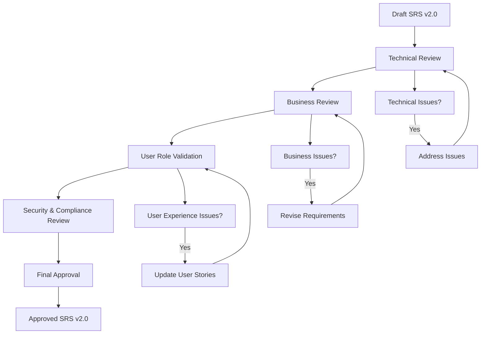
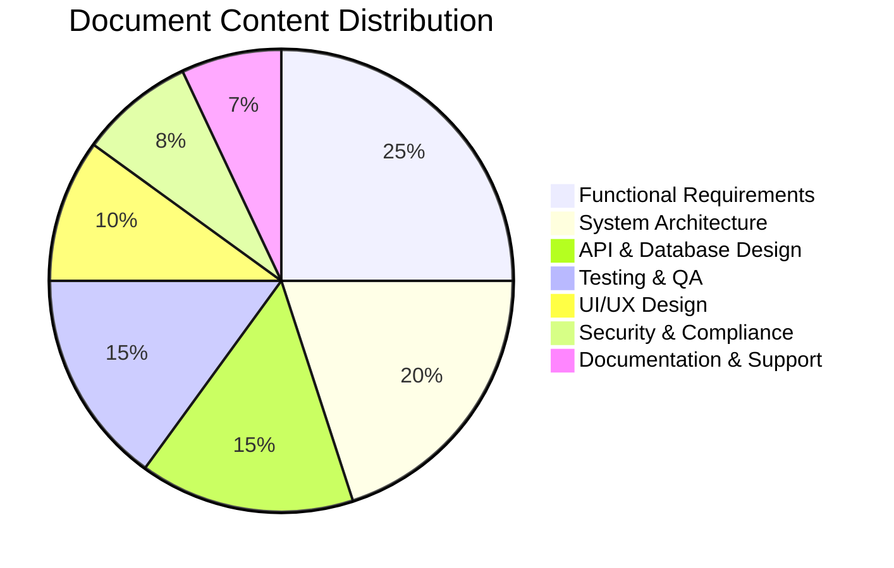

# **Part00 - Document Information - Thông Tin Tài Liệu**

```
Part00_Document_Information/
├── 00.1_Title_Page.md
├── 00.2_Version_History.md  
├── 00.3_Approval_Sign_Off.md
├── 00.4_Document_Metadata.md
└── 00.5_Glossary_Of_Terms.md
```

---

## **Part00 - 00.1_Title_Page - Trang Tiêu Đề**

**References**: BRD.md Section 24 Document Control, Product-Sampling-Vision-and-Strategy Document.md Section 1

**Mục đích:** Cung cấp trang tiêu đề và metadata tổng quan cho tài liệu Software Requirements Specification (SRS) của dự án PSP Platform theo cấu trúc microservices.

**Ý nghĩa:** Đây là điểm khởi đầu của SRS, giúp stakeholders nhanh chóng nắm bắt thông tin cơ bản về dự án, version control và ownership. Hỗ trợ audit trail và collaboration giữa các teams trong suốt vòng đời phát triển 7 microservices.

**Nội dung cần có:**

## **SOFTWARE REQUIREMENTS SPECIFICATION**
### **Product Sampling Platform (PSP)**
**Version 2.0 - Microservices Architecture**

### **Thông Tin Tài Liệu**

| **Thuộc Tính** | **Giá Trị** |
|----------------|-------------|
| **Tên Dự Án** | Product Sampling Platform (PSP) |
| **Loại Tài Liệu** | Software Requirements Specification |
| **Phiên Bản** | v2.0 - Microservices Architecture |
| **Mã Dự Án** | PSP-2025 |
| **Ngày Tạo** | 2025-10-20 |
| **Cập Nhật Cuối** | 2025-10-20 |
| **Trạng Thái** | Draft |
| **Tổng Số Parts** | 16 Parts |
| **Tổng Số Nodes** | ~320+ nodes |

### **Nhóm Dự Án**

| **Vai Trò** | **Tên** | **Email** | **Trách Nhiệm** |
|-------------|---------|-----------|-----------------|
| **Business Owner** | [TBD] | business@psp.vn | Phê duyệt ngân sách và timeline tổng thể |
| **Product Manager** | [TBD] | pm@psp.vn | Quản lý yêu cầu và roadmap sản phẩm |
| **Technical Lead** | [TBD] | techlead@psp.vn | Thiết kế kiến trúc và microservices |
| **QA Lead** | [TBD] | qa@psp.vn | Đảm bảo chất lượng và chiến lược testing |
| **DevOps Lead** | [TBD] | devops@psp.vn | Hạ tầng và triển khai Kubernetes |
| **Security Lead** | [TBD] | security@psp.vn | Bảo mật và tuân thủ quy định |
| **Development Team Lead** | [TBD] | dev@psp.vn | Quản lý team phát triển và chất lượng code |

### **Bối Cảnh Kinh Doanh**

PSP Platform là giải pháp tối ưu hóa việc phân phối sản phẩm mẫu giá thấp (~1 USD hoặc ít hơn) để thu thập dữ liệu khách hàng chất lượng cao, giảm chi phí logistics, chống gian lận và tăng ROI cho các thương hiệu FMCG thông qua hybrid model (retail + digital).

**Tài liệu tham khảo:**
* Đầu vào từ: BRD.md Document Control Section, SRS_STRUCTURE.md overview
* Thể hiện yêu cầu: Tổng quan về 14 features trên 7 microservices
* Kết nối với: Part00.2_Version_History, Part01_Introduction

**Mục đích của node này:** Xác định metadata cơ bản và thông tin tổng quan cho toàn bộ SRS document.

---

## **Part00 - 00.2_Version_History - Lịch Sử Phiên Bản**

**References**: SRS_STRUCTURE.md version updates, BRD.md version control

**Mục đích:** Theo dõi lịch sử thay đổi và evolution của tài liệu SRS từ version 1.0 đến 2.0 với kiến trúc microservices.

**Ý nghĩa:** Đảm bảo traceability và change management, giúp stakeholders hiểu được quá trình phát triển requirements và các quyết định kiến trúc quan trọng.

**Nội dung cần có:**

### **Version Control Matrix**

| **Version** | **Ngày** | **Tác Giả** | **Thay Đổi Chính** | **Ảnh Hưởng** |
|-------------|----------|-------------|---------------------|----------------|
| **v1.0** | 2025-09-15 | Product Team | Initial SRS với monolithic architecture | Baseline requirements |
| **v1.1** | 2025-09-30 | Technical Team | Thêm API specifications và database schema | Development ready |
| **v1.2** | 2025-10-05 | QA Team | Bổ sung test cases và acceptance criteria | Testing framework |
| **v2.0** | 2025-10-20 | Architecture Team | Migration sang microservices architecture | Major architectural change |

### **Major Changes v2.0 - Microservices Architecture**

#### **Architectural Changes:**
- ✅ Chuyển đổi từ monolithic sang 7 microservices độc lập
- ✅ Thêm API Gateway (Kong) và Service Mesh (Istio)
- ✅ Áp dụng polyglot persistence (PostgreSQL + MongoDB + Redis)
- ✅ Event-driven architecture với RabbitMQ
- ✅ Containerization với Docker và Kubernetes deployment

#### **Feature Updates:**
- ✅ Thêm Ads Format Management (FR-006)
- ✅ Nâng cấp Fraud Detection thành service riêng
- ✅ Tách Intelligence Service với A/B Testing và Recommendation Engine
- ✅ Enhanced User Portal với PWA capabilities

#### **Service Ownership:**
- ✅ Định nghĩa rõ service boundaries và ownership
- ✅ Thêm service-to-service communication patterns
- ✅ Database per service strategy

#### **Documentation Structure:**
- ✅ Tăng từ 12 Parts lên 16 Parts (thêm Part06B, Part14-15)
- ✅ Tăng từ ~250 nodes lên ~320+ nodes
- ✅ Thêm service ownership section cho mỗi functional requirement

**Tài liệu tham khảo:**
* Đầu vào từ: SRS_STRUCTURE.md change log, Architecture Decision Records
* Thể hiện yêu cầu: Version control requirements từ BRD
* Kết nối với: Part00.3_Approval_Sign_Off, Part06_System_Architecture

**Mục đích của node này:** Theo dõi evolution của SRS và architectural decisions.

---

## **Part00 - 00.3_Approval_Sign_Off - Phê Duyệt Ký Tên**

**References**: Access_Control_Tree_Grok.md RBAC roles, BRD.md Section 20 Approval

**Mục đích:** Định nghĩa quy trình phê duyệt và sign-off matrix cho tài liệu SRS với các stakeholders và user roles trong hệ thống.

**Ý nghĩa:** Đảm bảo tất cả stakeholders chính và representatives của user roles đã review và approve SRS trước khi bắt đầu implementation, tạo accountability và commitment.

**Nội dung cần có:**

### **Sign-Off Requirements Matrix**

#### **Business Stakeholders:**

| **Vai Trò** | **Tên** | **Trách Nhiệm Sign-Off** | **Chữ Ký** | **Ngày** |
|-------------|---------|--------------------------|-------------|----------|
| **Business Owner** | [TBD] | Final business approval và budget | _______ | _____ |
| **Product Manager** | [TBD] | Requirements completeness và accuracy | _______ | _____ |
| **Technical Lead** | [TBD] | Technical feasibility và architecture | _______ | _____ |
| **QA Lead** | [TBD] | Testability và quality assurance | _______ | _____ |
| **DevOps Lead** | [TBD] | Infrastructure và deployment strategy | _______ | _____ |
| **Security Lead** | [TBD] | Security requirements và compliance | _______ | _____ |

#### **User Role Representatives:**

| **User Role** | **Representative** | **Sign-Off Scope** | **Chữ Ký** | **Ngày** |
|---------------|-------------------|-------------------|-------------|----------|
| **Platform Admin** | [TBD] | System administration requirements | _______ | _____ |
| **Brand Admin** | [TBD] | Campaign management workflows | _______ | _____ |
| **Brand Staff** | [TBD] | Operational user requirements | _______ | _____ |
| **POS Staff** | [TBD] | Redemption process requirements | _______ | _____ |

### **Approval Workflow:**



### **Change Control Process:**

Sau khi SRS được approve, mọi thay đổi major phải qua process:
1. Submit Change Request (CR) với rationale
2. Impact analysis (scope, timeline, cost)
3. Stakeholder review
4. Re-approval nếu cần thiết
5. Update document version

**Tài liệu tham khảo:**
* Đầu vào từ: Access_Control_Tree_Grok.md roles definition, BRD approval matrix
* Thể hiện yêu cầu: Approval workflow requirements
* Kết nối với: Part00.4_Document_Metadata, Part01_Introduction

**Mục đích của node này:** Đảm bảo proper approval và accountability cho SRS.

---

## **Part00 - 00.4_Document_Metadata - Metadata Tài Liệu**

**References**: SRS_STRUCTURE.md document organization, BRD.md document control

**Mục đích:** Cung cấp metadata chi tiết về cấu trúc, organization và classification của tài liệu SRS để hỗ trợ navigation và maintenance.

**Ý nghĩa:** Giúp readers hiểu được cách organize và navigate qua 16 Parts và ~320 nodes, đồng thời hỗ trợ document maintenance và updates trong tương lai.

**Nội dung cần có:**

### **Document Classification:**

| **Thuộc Tính** | **Giá Trị** | **Mô Tả** |
|----------------|-------------|-----------|
| **Document Type** | Technical Specification | Software Requirements Specification |
| **Classification** | Internal Use | Dành cho development team và stakeholders |
| **Sensitivity Level** | Confidential | Chứa business logic và technical details |
| **Retention Period** | 5 years | Theo quy định project lifecycle |
| **Review Cycle** | Monthly | Regular review và updates |

### **Document Structure Metrics:**

| **Category** | **Count** | **Percentage** |
|--------------|-----------|----------------|
| **Total Parts** | 16 | 100% |
| **Core Requirements** | Parts 01-05 | 31.25% |
| **Technical Design** | Parts 06-08 | 18.75% |
| **Implementation** | Parts 09-13 | 31.25% |
| **Operations** | Parts 14-15 | 12.5% |
| **Supporting** | Parts 00, 16 | 6.25% |

### **Content Distribution:**



### **Cross-Reference Matrix:**

| **Part** | **Dependencies** | **Cross-References** |
|----------|------------------|---------------------|
| **Part04** | BRD, System_Feature_Tree | Part06, Part07, Part08 |
| **Part06** | Part04, Architecture patterns | Part07, Part08, Part14 |
| **Part07** | Part04, Part06 | Part08, Part13 |
| **Part08** | Part04, Part06, Part07 | Part09, Part11 |

### **Update Tracking:**

| **Section Type** | **Last Updated** | **Next Review** | **Owner** |
|------------------|------------------|-----------------|-----------|
| **Business Requirements** | 2025-10-20 | 2025-11-20 | Product Manager |
| **Technical Architecture** | 2025-10-20 | 2025-11-15 | Technical Lead |
| **API Specifications** | 2025-10-20 | 2025-11-10 | Development Team |
| **Security Requirements** | 2025-10-20 | 2025-12-20 | Security Lead |

**Tài liệu tham khảo:**
* Đầu vào từ: SRS_STRUCTURE.md, Document management best practices
* Thể hiện yêu cầu: Document organization requirements
* Kết nối với: Part00.5_Glossary_Of_Terms, tất cả Parts khác

**Mục đích của node này:** Cung cấp metadata và navigation guide cho SRS.

---

## **Part00 - 00.5_Glossary_Of_Terms - Bảng Thuật Ngữ**

**References**: System_Feature_Tree.md glossary, BRD.md glossary, Access_Control_Tree_Grok.md roles

**Mục đích:** Định nghĩa tất cả technical terms, business terms và acronyms được sử dụng trong SRS để đảm bảo understanding nhất quán giữa tất cả stakeholders.

**Ý nghĩa:** Giảm thiểu confusion và misinterpretation, đặc biệt quan trọng trong context microservices architecture với nhiều technical concepts phức tạp.

**Nội dung cần có:**

### **Business Terms:**

| **Thuật Ngữ** | **Định Nghĩa** | **Context** |
|---------------|----------------|-------------|
| **Campaign** | Chiến dịch sampling được tạo bởi Brand Admin để phân phối sản phẩm mẫu | Core business concept |
| **Barcode** | Mã unique (QR/Code128/DataMatrix) được issued cho users để claim sản phẩm | Core business concept |
| **Redemption** | Hành động sử dụng barcode tại POS để claim product sample | Core business flow |
| **Fraud Score** | ML-generated score (0-100) chỉ fraud likelihood của user | Advanced feature |
| **A/B Test** | Experiment so sánh campaign variants để optimize performance | Intelligence feature |
| **Ads Format** | Templates cho campaign assets (landing pages, banners, emails) | Content management |

### **Technical Terms - Architecture:**

| **Thuật Ngữ** | **Định Nghĩa** | **Context** |
|---------------|----------------|-------------|
| **Microservice** | Service độc lập với database riêng và deployment riêng | Architecture pattern |
| **Service Mesh** | Infrastructure layer (Istio) cho traffic management giữa services | Infrastructure |
| **Event Bus** | Message broker (RabbitMQ/Kafka) cho async communication | Integration pattern |
| **API Gateway** | Kong gateway quản lý routing và authentication cho tất cả services | Infrastructure |
| **Polyglot Persistence** | Sử dụng nhiều loại database khác nhau cho different services | Data strategy |

### **Technical Terms - Security:**

| **Thuật Ngữ** | **Định Nghĩa** | **Context** |
|---------------|----------------|-------------|
| **JWT** | JSON Web Token cho authentication và authorization | Security |
| **RBAC** | Role-Based Access Control với 6 roles trong hệ thống | Security |
| **OTP** | One-Time Password cho email/phone verification | Security |
| **mTLS** | Mutual TLS cho secure service-to-service communication | Security |

### **User Roles:**

| **Role** | **Định Nghĩa** | **Quyền Chính** |
|----------|----------------|-----------------|
| **Platform Admin** | Quản trị viên hệ thống với full access | Quản lý toàn hệ thống, tất cả brands |
| **Brand Admin** | Quản trị viên thương hiệu | Quản lý campaigns, users, settings của brand riêng |
| **Brand Staff** | Nhân viên thương hiệu | Xem/chỉnh sửa campaigns, không thể xóa hoặc publish |
| **Customer Account** | Khách hàng đã đăng ký | User đã đăng ký với login credentials |
| **Customer** | Khách hàng anonymous | User ẩn danh/guest (passwordless) |
| **POS Staff** | Nhân viên điểm bán | Redeem barcodes tại các điểm bán lẻ |

### **Technical Acronyms:**

| **Acronym** | **Full Form** | **Định Nghĩa Tiếng Việt** |
|-------------|---------------|---------------------------|
| **PSP** | Product Sampling Platform | Nền tảng phân phối mẫu sản phẩm |
| **SRS** | Software Requirements Specification | Đặc tả yêu cầu phần mềm |
| **BRD** | Business Requirements Document | Tài liệu yêu cầu kinh doanh |
| **API** | Application Programming Interface | Giao diện lập trình ứng dụng |
| **REST** | Representational State Transfer | Kiến trúc API REST |
| **GDPR** | General Data Protection Regulation | Quy định bảo vệ dữ liệu chung (EU) |
| **PDPA** | Personal Data Protection Act | Luật bảo vệ dữ liệu cá nhân (VN) |
| **CI/CD** | Continuous Integration/Continuous Deployment | Tích hợp liên tục/Triển khai liên tục |

### **Service Catalog Reference:**

| **Service** | **Abbreviation** | **Primary Database** | **Main Responsibility** |
|-------------|------------------|---------------------|------------------------|
| **Campaign Management Service** | CMS | PostgreSQL | Campaigns, Barcodes, Ads Formats |
| **Identity Service** | IDS | PostgreSQL | Authentication, Users, RBAC |
| **Redemption Service** | RDS | PostgreSQL | Barcode redemption, POS integration |
| **Analytics Service** | ANS | MongoDB | Real-time analytics, cohort analysis |
| **Notification Service** | NTS | Redis | OTP, SMS, Email, Push notifications |
| **Fraud Service** | FRS | MongoDB | Fraud detection, ML scoring |
| **Intelligence Service** | INS | MongoDB | A/B testing, recommendations |

**Tài liệu tham khảo:**
* Đầu vào từ: System_Feature_Tree.md glossary, BRD.md terminology
* Thể hiện yêu cầu: Common vocabulary cho development team
* Kết nối với: Tất cả Parts trong SRS

**Mục đích của node này:** Đảm bảo common understanding của terminology trong SRS.

---

## **Part00 Summary - Assumptions/Constraints/Dependencies:**

**Assumptions/Constraints:**
- Stakeholders đã đọc và approve BRD v2.0
- Technical team có kinh nghiệm với microservices và Kubernetes
- Development environment sử dụng Docker và local servers trong giai đoạn đầu
- Production deployment target là Kubernetes trên AWS/GCP
- Tuân thủ GDPR/PDPA compliance requirements

**Dependencies/Risks:**
- Dependencies: BRD approval, Technical team onboarding, Infrastructure setup
- Risks: Microservices complexity → Mitigation: Service mesh và proper monitoring
- Risks: Document maintenance overhead → Mitigation: Regular review cycles

**Acceptance Criteria/Testable Items:**
- Tất cả stakeholders có thể identify document version và responsible parties
- Document structure rõ ràng với 16 parts và ~320 nodes
- Traceability từ business vision đến technical microservices implementation
- Service ownership được định nghĩa rõ ràng cho từng feature
- Glossary coverage đầy đủ cho tất cả technical và business terms

**Final Approval Sign-Off:**
| Vai Trò | Tên | Chữ Ký | Ngày |
|---------|-----|---------|------|
| **Business Owner** | [TBD] | - | - |
| **Product Manager** | [TBD] | - | - |
| **Technical Lead** | [TBD] | - | - |
| **QA Lead** | [TBD] | - | - |
| **DevOps Lead** | [TBD] | - | - |
| **Security Lead** | [TBD] | - | - |
| **Platform Admin** | [TBD] | - | - |
| **Brand Admin** | [TBD] | - | - |
