# 📋 Part00 - SRS Checklist & Overview
**System Requirement Specification (SRS) - Product Sampling Platform**

**Phiên bản**: 1.0  
**Ngày**: 2025-10-17  
**Tác giả**: System Analyst Team  
**Dự án**: Product Sampling Platform (PSP)  
**Tham chiếu**: `01-BRD.md`, `System_Feature_Tree_Grok.md`, `Access_Control_Tree_Grok.md`

---

## 🎯 Mục đích checklist

Tài liệu này là **roadmap tổng thể** cho việc phát triển SRS hoàn chỉnh, đảm bảo:
- Không bỏ sót yêu cầu nào từ BRD
- Cấu trúc nhất quán và logic
- Traceability từ business requirements → technical specifications
- Readiness cho development và testing phases

---

## 📊 Tiến độ tổng thể

| Tình trạng | Số lượng Parts | Tỷ lệ hoàn thành |
|------------|----------------|------------------|
| ✅ Hoàn thành | 11/16 | 69% |
| ⏳ Đang thực hiện | 0/16 | 0% |
| 🔄 Sắp triển khai | 5/16 | 31% |

**Ước tính thời gian hoàn thành**: 2-3 tuần (với team 2-3 analysts)

---

## 📘 Chi tiết từng Part

### **Part01 - Giới thiệu (Introduction)** ✅
**Mục đích**: Thiết lập context và foundation cho toàn bộ SRS

**Nội dung chính**:
- Mục tiêu của tài liệu SRS và audience (Dev team, QA, PM, Stakeholders)
- Phạm vi dự án (In-scope: Hybrid sampling platform / Out-scope: Logistics, Native apps)
- Định nghĩa thuật ngữ (Campaign, Barcode Pool, Verified User, Redemption, etc.)
- Tài liệu tham chiếu (BRD, Feature Tree, Access Control)
- Quy ước ký hiệu (FR-XXX, NFR-XXX, UC-XXX)

**Deliverable**: Foundation document cho team hiểu rõ dự án
**Trọng số**: 🔴 Critical - Phải hoàn thành trước khi làm các parts khác

---

### **Part02 - Tổng quan hệ thống (Overall Description)** ✅
**Mục đích**: Mô tả high-level view của hệ thống và context sử dụng

**Nội dung chính**:
- System actors (6 roles: Admin, Group Admin, Customer Account, Serving Account, Auditor, User Role)
- Use context và business scenarios
- Assumptions và constraints chính
- Dependencies với external systems (POS, CRM, SMS/Email providers)
- Operating environment (Cloud, multi-tenant)

**Deliverable**: Shared understanding về system boundaries và stakeholders
**Trọng số**: 🔴 Critical - Architecture foundation

---

### **Part03 - Phạm vi & Mục tiêu sản phẩm (Scope and Objectives)** ✅
**Mục đích**: Map business goals từ BRD thành technical objectives

**Nội dung chính**:
- Business goals (Cost per verified user ≤ 0.4 USD, Conversion ≥ 90%, Fraud ≤ 5%)
- Success criteria và KPI mapping
- Feature prioritization (Must-have → Should-have → Nice-to-have)
- MVP scope definition và phasing strategy
- ROI targets và business value metrics

**Deliverable**: Clear scope boundaries và success definition
**Trọng số**: 🟡 High - Guides development priorities

---

### **Part04 - Yêu cầu chức năng (Functional Requirements)** ✅
**Mục đích**: Chi tiết hóa tất cả chức năng hệ thống cần thực hiện

**Nội dung chính**:
- FR-001 đến FR-013 (13 functional requirements chính)
- User stories với acceptance criteria cụ thể
- Business rules và logic flows
- Input/Output specifications
- Error handling requirements
- Integration points với external systems

**Deliverable**: Complete functional specification cho development
**Trọng số**: 🔴 Critical - Core development guide

---

### **Part05 - Yêu cầu phi chức năng (Non-Functional Requirements)** ✅
**Mục đích**: Định nghĩa quality attributes và performance standards

**Nội dung chính**:
- Performance (API response ≤ 3s, 100K requests/min peak load)
- Security (PII encryption, OAuth2, RBAC)
- Reliability (99.9% uptime, disaster recovery)
- Scalability (10M users by 2027, multi-tenant)
- Usability (mobile-first, accessibility)
- Compliance (GDPR/PDPA, audit trails)

**Deliverable**: Quality gates và performance benchmarks
**Trọng số**: 🔴 Critical - System reliability foundation

---

### **Part06 - Kiến trúc hệ thống (System Architecture & Components)** ✅
**Mục đích**: Thiết kế kiến trúc technical để đáp ứng requirements

**Nội dung chính**:
- Logical architecture (microservices, API gateway, databases)
- Physical deployment diagram (cloud infrastructure)
- Technology stack selection (Node.js/Go, React, MongoDB/PostgreSQL)
- Component interactions và data flows
- Scalability patterns và load balancing
- CI/CD pipeline design

**Deliverable**: Technical blueprint cho infrastructure team
**Trọng số**: 🔴 Critical - Implementation foundation

---

### **Part07 - Thiết kế dữ liệu & CSDL (Data Design & Database Schema)** ✅
**Mục đích**: Thiết kế data model và database schema chi tiết

**Nội dung chính**:
- Entity Relationship Diagram (ERD)
- MongoDB collections design (campaigns, users, barcodes, redemptions)
- PostgreSQL tables cho transactional data
- Redis caching strategy
- Data flow diagrams
- Backup và recovery procedures

**Deliverable**: Database implementation guide
**Trọng số**: 🟡 High - Data integrity critical

---

### **Part08 - Thiết kế API & Tích hợp (API Design & Integration)** ✅
**Mục đích**: Định nghĩa API contracts và integration specifications

**Nội dung chính**:
- REST API endpoints (CRUD operations)
- Request/Response schemas
- Authentication & authorization flows
- Error codes và handling
- Webhook specifications cho external integrations
- Rate limiting và throttling policies
- API versioning strategy

**Deliverable**: API documentation cho frontend và integration teams
**Trọng số**: 🔴 Critical - Integration contract

---

### **Part09 - Use Case chi tiết (Detailed Use Cases)** ✅
**Mục đích**: Mô tả chi tiết các scenarios sử dụng hệ thống

**Nội dung chính**:
- 8 use cases chính (từ Campaign creation đến Analytics export)
- Actor interactions và preconditions
- Normal flows và alternative flows
- Exception handling scenarios
- Business rules enforcement
- Cross-references với functional requirements

**Deliverable**: Behavior specification cho testing team
**Trọng số**: 🟡 High - Testing foundation

---

### **Part10 - Giao diện & Wireframes (UI/UX Design)** ✅
**Mục đích**: Thiết kế user experience và interface guidelines

**Nội dung chính**:
- User journey flows (scan → form → verify → redeem)
- Wireframes cho key screens (dashboard, landing page, portal)
- Mobile-first design principles
- Accessibility standards (WCAG 2.1)
- Brand guidelines và color schemes
- UX KPIs (form completion >90%, user engagement >70%)

**Deliverable**: Design specifications cho UI/UX team
**Trọng số**: 🟡 High - User experience critical

---

### **Part11 - Bảo mật & Tuân thủ (System Security & Compliance)** ✅
**Mục đích**: Đảm bảo security và regulatory compliance

**Nội dung chính**:
- OAuth2 authentication flows
- RBAC (Role-Based Access Control) implementation
- Data encryption (AES-256, TLS 1.3)
- GDPR/PDPA compliance procedures
- Audit logging và monitoring
- Disaster Recovery Plan (DRP)
- Security testing requirements

**Deliverable**: Security implementation guide
**Trọng số**: 🔴 Critical - Risk mitigation

---

### **Part12 - Kiểm thử hiệu năng & tải (Performance & Load Testing Plan)** ⏳
**Mục đích**: Đảm bảo hệ thống đáp ứng performance requirements

**Nội dung dự kiến**:
- Load testing scenarios (100K concurrent users)
- Performance benchmarks (API response times, throughput)
- Stress testing để tìm breaking points
- Tools setup (JMeter, K6, Locust)
- Monitoring và alerting thresholds
- Performance optimization strategies

**Deliverable**: Performance testing framework
**Trọng số**: 🟡 High - Scalability validation

---

### **Part13 - Kế hoạch kiểm thử tổng thể (System & UAT Testing Plan)** ⏳
**Mục đích**: Comprehensive testing strategy cho quality assurance

**Nội dung dự kiến**:
- Test types (Unit, Integration, System, UAT)
- Test case design methodology
- Automation testing framework
- UAT acceptance matrix với business stakeholders
- Regression testing procedures
- Bug tracking và resolution workflows

**Deliverable**: Complete testing methodology
**Trọng số**: 🟡 High - Quality gates

---

### **Part14 - Quản lý cấu hình & triển khai (Configuration & Deployment)** ⏳
**Mục đích**: Standardize deployment và configuration management

**Nội dung dự kiến**:
- Environment setup (Dev, Staging, Production)
- Version control strategy (Git workflows)
- CI/CD pipeline configuration
- Configuration management (environment variables, secrets)
- Blue-green deployment procedures
- Rollback strategies

**Deliverable**: DevOps implementation guide
**Trọng số**: 🟠 Medium - Operational efficiency

---

### **Part15 - Kế hoạch bảo trì & vận hành (Maintenance & Monitoring Plan)** ⏳
**Mục đích**: Ensure long-term system health và operational excellence

**Nội dung dự kiến**:
- Application và infrastructure monitoring
- Logging strategy (centralized logs, log retention)
- Incident response procedures
- Maintenance windows và update procedures
- Capacity planning và scaling triggers
- Support escalation matrix

**Deliverable**: Operations playbook
**Trọng số**: 🟠 Medium - Operational readiness

---

### **Part16 - Phụ lục & Tài liệu tham chiếu (Appendices)** ⏳
**Mục đích**: Supporting documentation và reference materials

**Nội dung dự kiến**:
- Glossary của thuật ngữ technical
- Traceability matrix (Business Req → Functional Req → Test Cases)
- Architecture diagrams (detailed)
- Sample data và test datasets
- Change management procedures
- Document approval workflows

**Deliverable**: Reference documentation
**Trọng số**: 🟢 Low - Documentation completeness

---

## 🔄 Dependencies & Prerequisites

### **Critical Path**:
Part01 → Part02 → Part04 → Part06 → Part08 → Development

### **Parallel Workstreams**:
- **Architecture Track**: Part06 → Part07 → Part08
- **Testing Track**: Part09 → Part12 → Part13
- **Operations Track**: Part14 → Part15
- **Documentation Track**: Part10 → Part11 → Part16

### **Key Milestones**:
- **Week 1**: Complete Part01-Part04 (Requirements foundation)
- **Week 2**: Complete Part06-Part08 (Technical design)
- **Week 3**: Complete Part12-Part15 (Testing & Operations)
- **Week 4**: Part16 và final review

---

## 🎯 Success Criteria

### **Documentation Quality**:
- [ ] Tất cả requirements traceable từ BRD
- [ ] Zero contradictions giữa các parts
- [ ] Complete API specifications cho development
- [ ] Acceptance criteria measurable và testable

### **Technical Readiness**:
- [ ] Architecture supports NFRs (scalability, security)
- [ ] Database schema optimized cho performance
- [ ] Integration points clearly defined
- [ ] Testing strategy comprehensive

### **Business Alignment**:
- [ ] MVP scope feasible trong timeline
- [ ] KPIs measurable và achievable
- [ ] Risk mitigation strategies identified
- [ ] Stakeholder sign-off secured

---

## 📞 Next Actions

1. **Immediate (Week 1)**:
   - Complete Part01-Part04
   - Validate requirements với stakeholders
   - Setup documentation repository

2. **Short-term (Week 2-3)**:
   - Architecture review với CTO
   - API design review với frontend team
   - Security review với compliance team

3. **Long-term (Week 4+)**:
   - Final SRS review và approval
   - Handoff to development teams
   - Setup change management process

---

**Document Owner**: System Analyst Team  
**Review Cycle**: Weekly progress reviews  
**Final Approval**: CTO + PM + Business Stakeholders

# 📘 Part01 - Giới thiệu (Introduction)
**System Requirement Specification (SRS) - Product Sampling Platform**

**Phiên bản**: 1.0  
**Ngày**: 2025-10-17  
**Tác giả**: System Analyst Team  
**Trạng thái**: ✅ Hoàn thành  

---

## 1.1 Mục đích tài liệu

### 1.1.1 Đối tượng sử dụng
Tài liệu SRS này được thiết kế cho các stakeholder chính sau:

| Đối tượng | Mục đích sử dụng | Phần quan tâm chính |
|-----------|------------------|-------------------|
| **Development Team** | Hiểu requirements để implement | Part04-Part08 (Functional, API, Database) |
| **QA/Testing Team** | Thiết kế test cases và validation | Part09 (Use Cases), Part12-13 (Testing) |
| **Project Manager** | Quản lý scope, timeline, delivery | Part03 (Scope), Part00 (Checklist) |
| **Technical Lead/Architect** | Thiết kế kiến trúc và technology stack | Part06 (Architecture), Part07 (Database) |
| **Business Stakeholders** | Validation requirements đáp ứng business goals | Part02-03 (Overview, Scope), Part04 (Functional) |
| **DevOps/Infrastructure** | Setup môi trường và deployment | Part14-15 (Deployment, Monitoring) |
| **Security/Compliance Team** | Đảm bảo bảo mật và tuân thủ | Part11 (Security & Compliance) |

### 1.1.2 Mục tiêu chính
- **Traceability**: Đảm bảo mọi requirement đều traceable từ Business Requirements (BRD) đến implementation
- **Consistency**: Tạo shared understanding giữa tất cả team members về system behavior
- **Completeness**: Cover đầy đủ functional và non-functional requirements
- **Testability**: Cung cấp acceptance criteria rõ ràng cho testing và validation

---

## 1.2 Phạm vi dự án

### 1.2.1 In-Scope (Trong phạm vi)
Hệ thống **Product Sampling Platform (PSP)** sẽ bao gồm:

**Core Business Functions:**
- ✅ **Campaign Management**: Tạo và quản lý chiến dịch sampling với barcode pools
- ✅ **Hybrid Distribution**: Hỗ trợ phân phối tại POS (Circle K, GS25) và digital vouchers
- ✅ **Customer Verification**: OTP verification (SMS/Email) để chống spam và fraud
- ✅ **Data Collection**: Thu thập thông tin verified users với consent management
- ✅ **Redemption Tracking**: Theo dõi redemption tại POS với offline sync capability
- ✅ **Analytics & Reporting**: Dashboard realtime với funnel tracking và ROI metrics

**Technical Capabilities:**
- ✅ **Multi-tenant Architecture**: Hỗ trợ multiple brands và retail partners
- ✅ **API Integration**: REST APIs cho CRM, POS, và third-party systems
- ✅ **Mobile-first PWA**: Progressive Web App cho end users
- ✅ **Role-based Access Control**: 6 user roles với phân quyền chi tiết
- ✅ **Compliance**: GDPR/PDPA compliance với audit trails

**Phase Coverage:**
- **Phase 1 (MVP)**: Must-have features cho pilot 5-10 brands, 10K verified users
- **Phase 2**: Should-have features cho scale 1M-3M users, advanced analytics
- **Phase 3**: Nice-to-have features cho vision "Sampling Intelligence Platform"

### 1.2.2 Out-of-Scope (Ngoài phạm vi)
Những chức năng sau **KHÔNG** nằm trong scope hiện tại:

❌ **Physical Logistics**: Brand tự chịu trách nhiệm vận chuyển hàng mẫu đến retail nodes  
❌ **Native Mobile Apps**: Chỉ phát triển PWA, không có iOS/Android native apps  
❌ **Payment Processing**: Không xử lý thanh toán, chỉ voucher/barcode free samples  
❌ **Inventory Management**: Không quản lý kho hàng vật lý, chỉ digital tracking  
❌ **Blockchain/Tokenization**: Tính năng này thuộc Phase 3 (Nice-to-have)  
❌ **AI/ML Advanced Features**: Predictive analytics thuộc Phase 2-3  

---

## 1.3 Định nghĩa thuật ngữ

### 1.3.1 Business Terms

| Thuật ngữ | Định nghĩa | Ví dụ |
|-----------|------------|-------|
| **Campaign** | Chiến dịch sampling của brand với mục tiêu, thời gian, và budget cụ thể | "Unilever Shampoo Trial - Q1 2025" |
| **Barcode Pool** | Tập hợp các barcode/voucher được gán cho một campaign | 10,000 mã barcode cho campaign Coca-Cola |
| **Verified User** | Người dùng đã complete OTP verification và consent | User đã nhập OTP từ SMS và tick opt-in |
| **Redemption** | Hành động đổi barcode/voucher thành sản phẩm tại POS | Scan barcode tại Circle K nhận lon Coca-Cola |
| **Sampling Network** | Mạng lưới các retail nodes hỗ trợ phân phối samples | Circle K, GS25, booth events, pop-up stores |
| **Hybrid Distribution** | Kết hợp phân phối vật lý (tại store) và digital (voucher online) | QR code tại store dẫn đến form digital |
| **Funnel Tracking** | Theo dõi customer journey từ scan QR đến redemption | Scan → Form → Verify → Issue → Redeem |

### 1.3.2 Technical Terms

| Thuật ngữ | Định nghĩa | Technical Notes |
|-----------|------------|-----------------|
| **PWA** | Progressive Web App - ứng dụng web hoạt động như native app | React-based, offline-capable |
| **OTP** | One-Time Password - mã xác thực dùng một lần | 6-digit code, 5 minutes expiry |
| **API Gateway** | Central point quản lý tất cả API calls và routing | Kong hoặc AWS API Gateway |
| **Multi-tenant** | Kiến trúc hỗ trợ nhiều customers trên cùng infrastructure | Tenant isolation by database/schema |
| **RBAC** | Role-Based Access Control - phân quyền dựa trên roles | 6 roles: Admin, Group Admin, Customer Account, Serving Account, Auditor, User Role |
| **Audit Trail** | Log immutable của mọi hành động trong hệ thống | Compliance với GDPR/PDPA requirements |
| **Webhook** | HTTP callback để notify external systems về events | POST request khi có redemption mới |

### 1.3.3 User Roles

| Role | Mô tả ngắn | Primary Use Cases |
|------|------------|-------------------|
| **Admin** | Toàn quyền hệ thống, quản lý global resources | System config, user management, global campaigns |
| **Group Admin** | Quản lý resources trong group/organization | Group campaigns, team member management |
| **Customer Account** | Brand account quản lý campaigns riêng | Campaign creation, analytics, data export |
| **Serving Account** | Staff tại retail nodes để scan/redeem | Barcode scanning, redemption processing |
| **Auditor** | Xem logs và reports cho compliance | Audit logs, compliance reports |
| **User Role** | End user sử dụng User Portal | View sampling history, track redemption status |

---

## 1.4 Tài liệu tham chiếu

### 1.4.1 Input Documents
Các tài liệu đầu vào đã được sử dụng để tạo SRS này:

| Tài liệu | Phiên bản | Ngày | Vai trò |
|----------|-----------|------|---------|
| **Problem.md** | Latest | 2025-10 | Problem definition, MoSCoW prioritization |
| **01-BRD.md** | 3.0 | 2025-10-17 | Business requirements, financial model, KPIs |
| **Product-Sampling-Vision-and-Strategy Document.md** | 1.0 | 2025-10 | Vision, market opportunity, go-to-market strategy |
| **System_Feature_Tree_Grok.md** | 4.0 | 2025-10-16 | Feature breakdown, user stories, technical requirements |
| **Access_Control_Tree_Grok.md** | 2.2 | 2025-10-16 | Role definitions, permission matrix |

### 1.4.2 Standards và References
- **IEEE Std 830-1998**: Software Requirements Specifications standard
- **ISO/IEC 25010**: Software product quality characteristics
- **GDPR (EU 2016/679)**: General Data Protection Regulation
- **PDPA (Personal Data Protection Act)**: Vietnam data protection law
- **WCAG 2.1**: Web Content Accessibility Guidelines
- **REST API Design**: RESTful web services best practices
- **OAuth 2.0**: Authorization framework standard

---

## 1.5 Quy ước ký hiệu

### 1.5.1 Requirement Identifiers
- **FR-XXX**: Functional Requirement (FR-001, FR-002, ...)
- **NFR-XXX**: Non-Functional Requirement (NFR-001, NFR-002, ...)
- **UC-XXX**: Use Case (UC-001, UC-002, ...)
- **API-XXX**: API Endpoint specification (API-001, API-002, ...)
- **DB-XXX**: Database entity/table (DB-001, DB-002, ...)

### 1.5.2 Priority Levels
- 🔴 **Critical**: Must-have cho MVP, blocking nếu không có
- 🟡 **High**: Important cho user experience và business value
- 🟠 **Medium**: Nice-to-have, có thể defer sang phase sau
- 🟢 **Low**: Future enhancement, không ảnh hưởng core functionality

### 1.5.3 Status Indicators
- ✅ **Complete**: Requirement đã defined đầy đủ và approved
- ⏳ **In Progress**: Đang được analysis và documentation
- 🔄 **Under Review**: Cần review và validation từ stakeholders
- ❌ **Blocked**: Bị block do dependencies hoặc decisions pending

### 1.5.4 Diagram Conventions
Tất cả diagrams sử dụng **Mermaid syntax** để đảm bảo consistency:

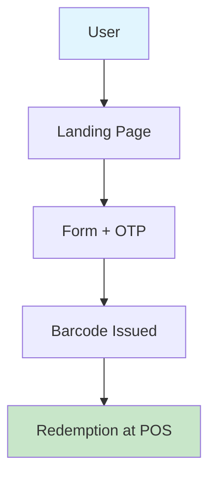

---

## 1.6 Document Structure Overview

### 1.6.1 SRS Organization
Tài liệu được tổ chức theo 16 parts với dependencies rõ ràng:

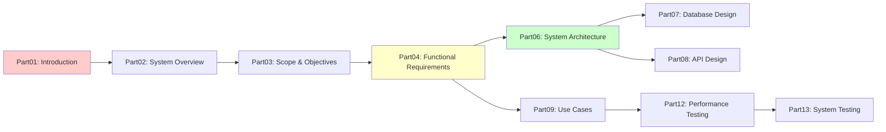

### 1.6.2 Cross-References
Mỗi requirement sẽ có cross-references để đảm bảo traceability:

- **Business → Functional**: BRD requirement maps to FR-XXX
- **Functional → Technical**: FR-XXX implements via API-XXX, DB-XXX
- **Functional → Testing**: FR-XXX tested by UC-XXX, Test Case TC-XXX
- **Non-Functional → Architecture**: NFR-XXX addressed by architectural decisions

---

## 1.7 Quality Assurance

### 1.7.1 Review Process
Mỗi part sẽ qua review process sau:

1. **Technical Review**: Architecture và feasibility validation
2. **Business Review**: Alignment với business goals từ BRD
3. **Security Review**: Compliance và security requirements validation
4. **Final Approval**: Sign-off từ PM, Technical Lead, Business Stakeholders

### 1.7.2 Change Management
- All changes phải update traceability matrix
- Version control với clear change logs
- Impact analysis cho changes affecting multiple parts
- Stakeholder notification cho major changes

---

## 1.8 Success Criteria

Document này được considered **successful** khi:

✅ **Completeness**: Tất cả requirements từ BRD được covered  
✅ **Consistency**: Không có contradictions giữa các parts  
✅ **Testability**: Mọi requirement có measurable acceptance criteria  
✅ **Implementability**: Development team có đủ thông tin để implement  
✅ **Traceability**: Clear mapping từ business goals đến technical requirements  
✅ **Stakeholder Sign-off**: Approval từ tất cả key stakeholders  

---

**Document Status**: ✅ Ready for Part02  
**Next Action**: Proceed với Part02 - System Overview  
**Owner**: System Analyst Team

# 📘 Part02 - Tổng quan hệ thống (System Overview)
**System Requirement Specification (SRS) - Product Sampling Platform**

**Phiên bản**: 1.0  
**Ngày**: 2025-10-17  
**Tác giả**: System Analyst Team  
**Trạng thái**: ✅ Hoàn thành  

---

## 2.1 Tổng quan hệ thống

### 2.1.1 Mô tả chung
**Product Sampling Platform (PSP)** là một nền tảng **microservices-based** được thiết kế để giải quyết bài toán phân phối sản phẩm mẫu giá thấp (~1 USD) một cách hiệu quả, đồng thời thu thập dữ liệu khách hàng chất lượng cao và chống gian lận.

**Giá trị cốt lõi:**
- 🎯 **Hybrid Distribution**: Kết hợp phân phối vật lý (POS) và digital (voucher)
- 🔐 **Verified Data Collection**: Thu thập data với OTP verification và consent management
- 📊 **Real-time Analytics**: Dashboard và báo cáo chi tiết cho brands
- 🛡️ **Fraud Prevention**: Multi-layer security với rate limiting và device fingerprinting
- 🔗 **Seamless Integration**: API-first design cho CRM, POS, và third-party systems

### 2.1.2 Business Context
Hệ thống phục vụ ecosystem sampling tại Đông Nam Á với focus vào thị trường Việt Nam:

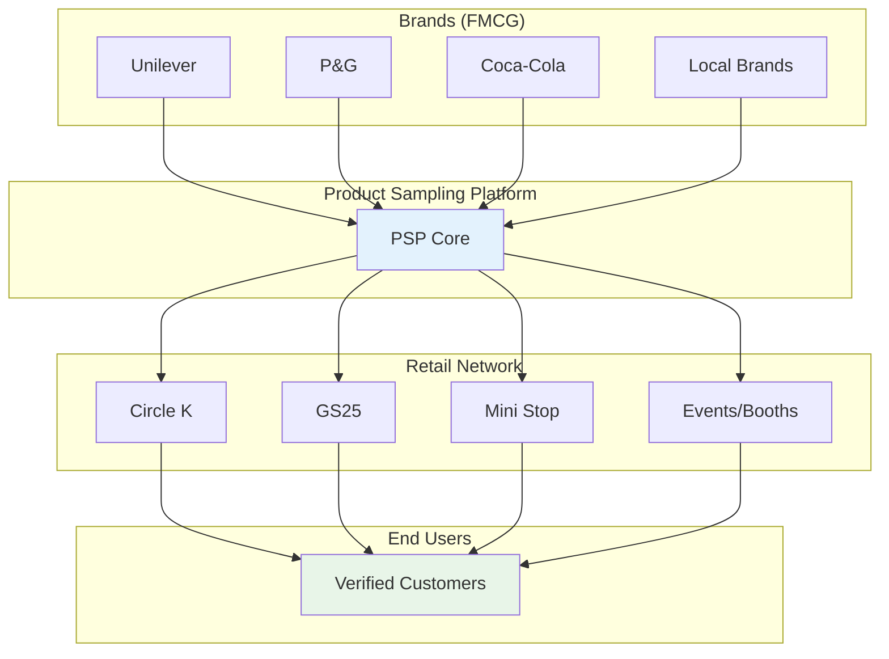

---

## 2.2 System Actors

### 2.2.1 Primary Actors

| Actor | Mô tả | Primary Goals | System Interaction |
|-------|-------|---------------|-------------------|
| **Admin** | System administrator với toàn quyền | Quản lý hệ thống, setup global config, user management | Web dashboard, API management |
| **Group Admin** | Quản lý resources trong organization/group | Quản lý campaigns trong group, team coordination | Web dashboard (scoped) |
| **Customer Account** | Brand account manager | Tạo campaigns, xem analytics, export data | Web dashboard, API integration |
| **Serving Account** | Staff tại retail nodes | Scan barcode, process redemption | Mobile PWA, POS integration |
| **Auditor** | Compliance và audit personnel | Xem logs, compliance reports, audit trails | Read-only dashboard |
| **End User** | Khách hàng cuối nhận samples | Nhận samples, track redemption, manage profile | User Portal PWA |

### 2.2.2 Secondary Actors

| Actor | Role | Integration Method |
|-------|------|-------------------|
| **CRM Systems** | HubSpot, Salesforce, Braze | REST API, Webhooks |
| **SMS/Email Providers** | Twilio, FPT Telecom, Viettel | API integration |
| **POS Systems** | Circle K POS, retail terminals | API, CSV import/export |
| **Analytics Platforms** | Google Analytics, Meta Pixel | JavaScript tracking, API |
| **Payment Gateways** | Future integration cho paid samples | REST API (Phase 2) |

---

## 2.3 Microservices Architecture Overview

### 2.3.1 Service Decomposition Strategy

**Hệ thống được chia thành 8 microservices chính** dựa trên business capabilities:

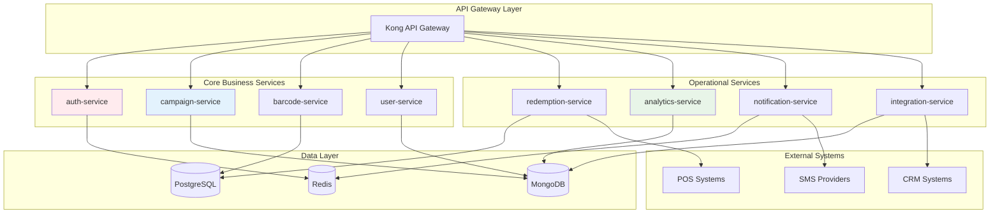

### 2.3.2 Service Definitions

| Service | Technology Stack | Primary Responsibility | Database |
|---------|------------------|----------------------|----------|
| **auth-service** | NestJS + JWT + Redis | Authentication, authorization, RBAC | Redis (sessions) |
| **campaign-service** | NestJS + MongoDB | Campaign CRUD, ads format management | MongoDB |
| **barcode-service** | NestJS + PostgreSQL | Barcode generation, pool management | PostgreSQL |
| **user-service** | NestJS + MongoDB | User profiles, verification, consent | MongoDB |
| **redemption-service** | NestJS + PostgreSQL | POS integration, redemption tracking | PostgreSQL |
| **analytics-service** | NestJS + MongoDB | Reporting, dashboard data, export | MongoDB |
| **notification-service** | NestJS + Redis + Queue | OTP, email, push notifications | Redis (queue) |
| **integration-service** | NestJS + MongoDB | CRM sync, webhooks, external APIs | MongoDB |

### 2.3.3 Inter-Service Communication

**Communication Patterns:**
- 🔄 **Synchronous**: REST API calls cho immediate responses
- 📨 **Asynchronous**: Message queue (Redis Pub/Sub) cho long-running tasks
- 🎯 **Event-driven**: Domain events cho loose coupling

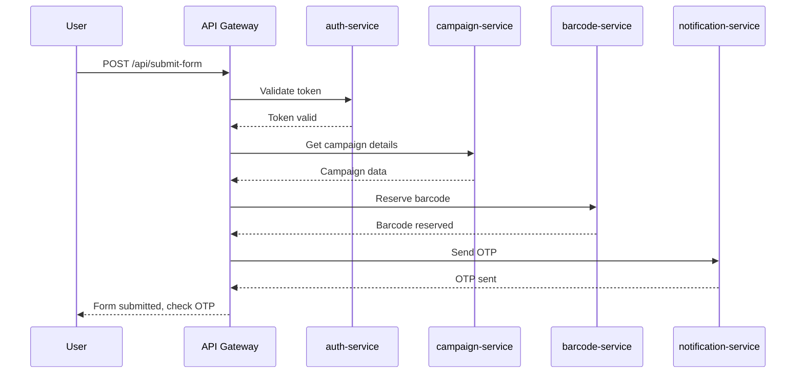

---

## 2.4 Development Environment

### 2.4.1 Docker-based Development Setup

**Local development stack** sử dụng Docker Compose:

```yaml
# docker-compose.dev.yml structure
services:
  # API Gateway
  kong:
    image: kong:latest
    ports: ["8000:8000", "8001:8001"]
  
  # Core Services (NestJS)
  auth-service:
    build: ./services/auth
    ports: ["3001:3000"]
  
  campaign-service:
    build: ./services/campaign
    ports: ["3002:3000"]
  
  # Databases
  mongodb:
    image: mongo:5.0
    ports: ["27017:27017"]
  
  postgresql:
    image: postgres:14
    ports: ["5432:5432"]
  
  redis:
    image: redis:7-alpine
    ports: ["6379:6379"]
```

### 2.4.2 Technology Stack Details

| Layer | Technology | Version | Justification |
|-------|------------|---------|---------------|
| **Runtime** | Node.js | 18+ LTS | Stable, mature ecosystem |
| **Framework** | NestJS | 10+ | TypeScript, decorators, dependency injection |
| **API Gateway** | Kong | Latest | Open source, plugin ecosystem |
| **Primary DB** | MongoDB | 5.0+ | Document store cho flexible schema |
| **Transactional DB** | PostgreSQL | 14+ | ACID compliance cho financial data |
| **Cache/Queue** | Redis | 7+ | In-memory speed, pub/sub capability |
| **Container** | Docker | 20+ | Development/production parity |
| **Orchestration** | Docker Compose | 2+ | Local development simplicity |

---

## 2.5 Operating Environment

### 2.5.1 Deployment Architecture

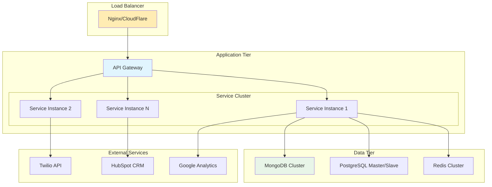

### 2.5.2 Environment Tiers

| Environment | Purpose | Infrastructure | Data |
|-------------|---------|----------------|------|
| **Development** | Local development | Docker Compose | Sample/mock data |
| **Staging** | Testing & integration | Cloud containers | Anonymized production data |
| **Production** | Live system | Auto-scaling clusters | Real customer data |

---

## 2.6 System Constraints

### 2.6.1 Technical Constraints

| Constraint | Description | Impact | Mitigation |
|------------|-------------|--------|------------|
| **Peak Load** | 100,000 requests/minute during campaigns | System performance | Auto-scaling, caching, queue |
| **Data Consistency** | Barcode must be single-use, atomic | Financial accuracy | PostgreSQL transactions, locks |
| **Network Latency** | POS integration có thể intermittent | User experience | Offline-first design, sync |
| **Mobile Performance** | PWA phải hoạt động trên 3G networks | Accessibility | Optimized assets, caching |

### 2.6.2 Business Constraints

| Constraint | Description | Technical Implementation |
|------------|-------------|-------------------------|
| **Cost per Verified User** | ≤ 0.4 USD target | Efficient infrastructure, fraud prevention |
| **Fraud Rate** | ≤ 5% tolerance | Multi-layer verification, ML detection |
| **Compliance** | GDPR/PDPA requirements | Audit trails, consent management, encryption |
| **Multi-tenancy** | Support multiple brands | Tenant isolation, role-based access |

---

## 2.7 Assumptions và Dependencies

### 2.7.1 Key Assumptions

✅ **Network Connectivity**: Retail nodes có smartphone/tablet với internet  
✅ **Staff Training**: Serving Account có thể được train để sử dụng scanning tool  
✅ **Brand Adoption**: Brands sẵn sàng integrate API với existing CRM systems  
✅ **User Behavior**: End users comfortable với OTP verification process  
✅ **Compliance**: Current data protection laws remain stable  

### 2.7.2 External Dependencies

| Dependency | Type | Risk Level | Contingency |
|------------|------|------------|-------------|
| **Twilio SMS** | Critical | Medium | Backup SMS provider (FPT, Viettel) |
| **MongoDB Atlas** | High | Low | Self-hosted MongoDB option |
| **Kong Gateway** | High | Low | Nginx alternative configuration |
| **HubSpot API** | Medium | Medium | Multiple CRM support |
| **Internet Connectivity** | Critical | High | Offline-first architecture |

---

## 2.8 Success Criteria

### 2.8.1 Technical Success Metrics

| Metric | Target | Measurement Method |
|--------|--------|--------------------|
| **API Response Time** | ≤ 3 seconds | Application monitoring |
| **System Uptime** | ≥ 99.9% | Infrastructure monitoring |
| **Data Accuracy** | ≥ 99.5% | Audit reconciliation |
| **Security Compliance** | 100% | Security audit, penetration testing |

### 2.8.2 Business Success Metrics

| Metric | Target | Business Impact |
|--------|--------|-----------------|
| **Cost per Verified Lead** | ≤ 0.4 USD | ROI optimization |
| **Conversion Rate** | ≥ 90% | User experience validation |
| **Fraud Detection Rate** | ≥ 95% | System security effectiveness |
| **Brand Retention** | ≥ 85% | Product-market fit validation |

---

## 2.9 Next Steps

### 2.9.1 Architecture Validation
- [ ] Technical review với development team
- [ ] Infrastructure cost estimation
- [ ] Security assessment với compliance team
- [ ] Performance benchmarking plan

### 2.9.2 Implementation Readiness
- [ ] Service interface contracts definition
- [ ] Database schema design
- [ ] API specification documentation
- [ ] Development environment setup guide

---

**Document Status**: ✅ Ready for Part03  
**Dependencies**: Architecture decisions confirmed  
**Next Action**: Define detailed scope and objectives in Part03  
**Owner**: System Analyst Team

# 📘 Part03 - Phạm vi & Mục tiêu sản phẩm (Scope and Objectives)
**System Requirement Specification (SRS) - Product Sampling Platform**

**Phiên bản**: 1.0  
**Ngày**: 2025-10-17  
**Tác giả**: System Analyst Team  
**Trạng thái**: ✅ Hoàn thành  

---

## 3.1 Business Goals & Strategic Objectives

### 3.1.1 Primary Business Goals (từ BRD)

| Business Goal | Target Metric | Technical Implementation | Success Criteria |
|---------------|---------------|-------------------------|------------------|
| **Cost Optimization** | ≤ 0.4 USD per verified user | Efficient service architecture, fraud prevention | Monthly cost reports ≤ target |
| **Data Quality** | ≥ 95% verified data accuracy | Multi-layer OTP verification, consent management | Audit reports confirm accuracy |
| **User Experience** | ≥ 90% form completion rate | Mobile-first PWA, optimized flows | Analytics dashboard tracking |
| **Fraud Prevention** | ≤ 5% fraud rate | ML-based detection, device fingerprinting | Real-time fraud monitoring |
| **Brand Retention** | ≥ 85% repeat campaigns | Superior analytics, easy integration | Customer satisfaction surveys |
| **Market Leadership** | #1 in SEA by 2027 | Scalable architecture, multi-market support | Market share analysis |

### 3.1.2 Strategic Value Proposition

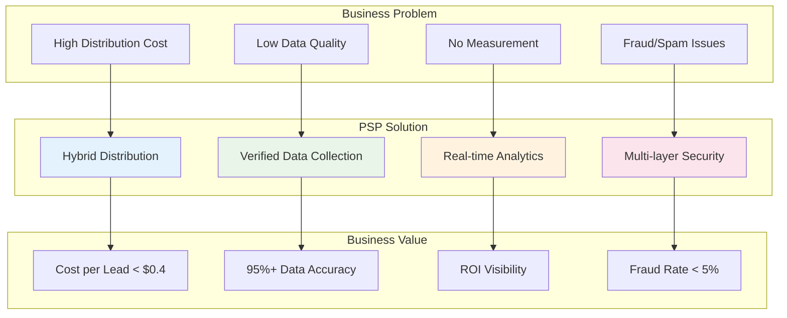

---

## 3.2 Product Vision & Market Positioning

### 3.2.1 Vision Statement
> "Transform product sampling from a cost center into a data-driven growth engine by providing the most intelligent, secure, and scalable sampling platform in Southeast Asia."

### 3.2.2 Market Opportunity (từ Vision Document)

| Market Segment | Size (2025) | CAGR | PSP Target Share |
|----------------|-------------|------|------------------|
| **Global Sampling** | $12-15B USD | 8% | N/A (focus SEA) |
| **SEA Sampling** | $1.2B USD | 10% | 5% by 2027 |
| **Vietnam Market** | $120-150M USD | 12% | 15% by 2026 |

**Competitive Advantage:**
- 🎯 **SEA-first design** với local compliance (PDPA, language support)
- 🔗 **Retail network integration** với Circle K, GS25, local chains
- 💰 **Cost efficiency** targeting <$0.4 per verified lead
- 📊 **Advanced analytics** với AI-powered insights (Phase 2+)

---

## 3.3 MVP Scope Definition

### 3.3.1 MVP Objectives (Phase 1: 0-6 months)

**Target Metrics for MVP Success:**
- 🏢 **5-10 pilot brands** signed và active
- 👥 **10,000 verified users** trong system
- 🏪 **50+ retail locations** integrated
- 💵 **Cost per verified lead** ≤ $0.5 (optimization target: $0.4)
- ⚡ **90%+ system uptime** during pilot phase

### 3.3.2 MVP Feature Scope

#### **Must-Have Features (Critical Priority 🔴)**

| Feature Category | Specific Features | Technical Services | Business Value |
|------------------|-------------------|-------------------|----------------|
| **Campaign Management** | Create/edit campaigns, barcode pool assignment, UTM tracking | campaign-service, barcode-service | Brand onboarding capability |
| **User Verification** | OTP SMS/Email, CAPTCHA, consent management | auth-service, notification-service | Data quality assurance |
| **Barcode Distribution** | QR code generation, single-use enforcement, expiry tracking | barcode-service, campaign-service | Core sampling functionality |
| **POS Integration** | Scan redemption, offline sync, status updates | redemption-service | Retail network enablement |
| **Basic Analytics** | Funnel tracking, campaign performance, export CSV | analytics-service | ROI measurement |
| **Role-based Access** | 6 user roles, permission matrix, audit logs | auth-service | Security & compliance |

#### **Should-Have Features (High Priority 🟡)**

| Feature Category | Phase 2 Target | Technical Implementation |
|------------------|----------------|-------------------------|
| **Advanced Analytics** | ML insights, predictive analytics | Enhanced analytics-service với AI models |
| **Fraud Detection** | Device fingerprinting, anomaly detection | ML-enhanced auth-service |
| **Multi-market Support** | Thailand, Indonesia expansion | Localization trong user-service |
| **API Marketplace** | Public APIs, developer portal | Enhanced integration-service |

### 3.3.3 MVP Success Criteria

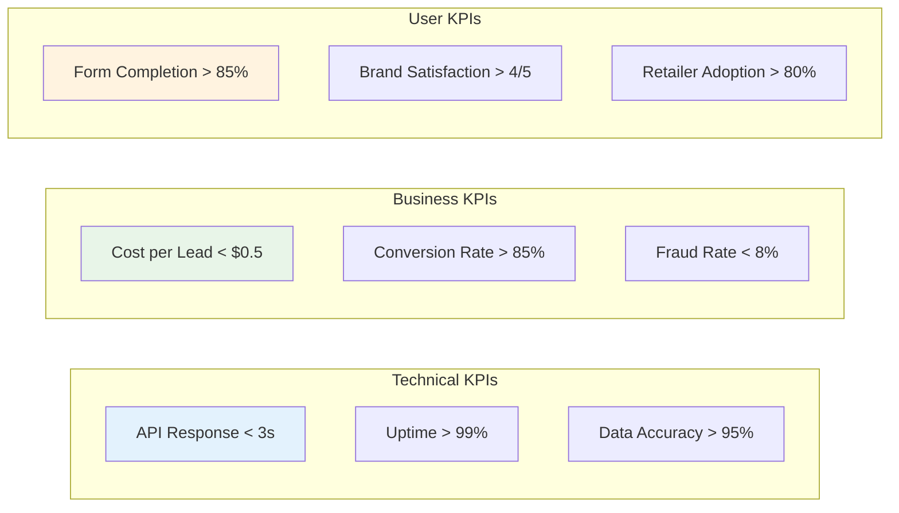

---

## 3.4 Service-Level Objectives (SLOs)

### 3.4.1 Performance Objectives

| Service | Response Time SLO | Availability SLO | Throughput SLO |
|---------|-------------------|------------------|----------------|
| **auth-service** | < 500ms (p95) | 99.9% | 1000 RPS |
| **campaign-service** | < 1s (p95) | 99.5% | 500 RPS |
| **barcode-service** | < 800ms (p95) | 99.9% | 2000 RPS |
| **redemption-service** | < 2s (p95) | 99.5% | 1500 RPS |
| **analytics-service** | < 5s (p95) | 99% | 200 RPS |
| **notification-service** | < 10s (async) | 99% | 1000 messages/min |

### 3.4.2 Data Quality Objectives

| Data Category | Accuracy Target | Validation Method | Recovery SLA |
|---------------|-----------------|-------------------|--------------|
| **User Profiles** | 99.5% | OTP verification + manual audit | 24h |
| **Campaign Data** | 100% | Schema validation + business rules | 4h |
| **Barcode Inventory** | 99.9% | Atomic transactions + reconciliation | 1h |
| **Redemption Records** | 100% | Financial audit + POS verification | 2h |

---

## 3.5 Enterprise Architecture Standards

### 3.5.1 Design Pattern Standards

**Service Design Patterns:**
- 🏗️ **Domain-Driven Design (DDD)**: Mỗi service là một bounded context
- 🔄 **CQRS Pattern**: Command/Query separation cho complex operations
- 📨 **Event Sourcing**: Critical business events (redemption, fraud detection)
- 🛡️ **Circuit Breaker**: Fault tolerance giữa services
- 🎯 **API Gateway Pattern**: Single entry point với authentication/rate limiting

**Code Standards:**
```typescript
// NestJS Service Template Structure
@Injectable()
export class CampaignService {
  constructor(
    private readonly repository: CampaignRepository,
    private readonly eventBus: EventBus,
    private readonly logger: Logger
  ) {}

  async createCampaign(dto: CreateCampaignDto): Promise<Campaign> {
    // Validation, business logic, event emission
  }
}
```

### 3.5.2 Documentation Standards

| Document Type | Template | Ownership | Update Frequency |
|---------------|----------|-----------|------------------|
| **Service README** | Standardized template với setup, API, examples | Service team | Each release |
| **API Documentation** | OpenAPI 3.0 auto-generated | Development team | Each API change |
| **Architecture Decision Records** | ADR template trong repo | Tech lead | Each major decision |
| **Runbooks** | Deployment, troubleshooting guides | DevOps team | Monthly review |

### 3.5.3 Testing Standards

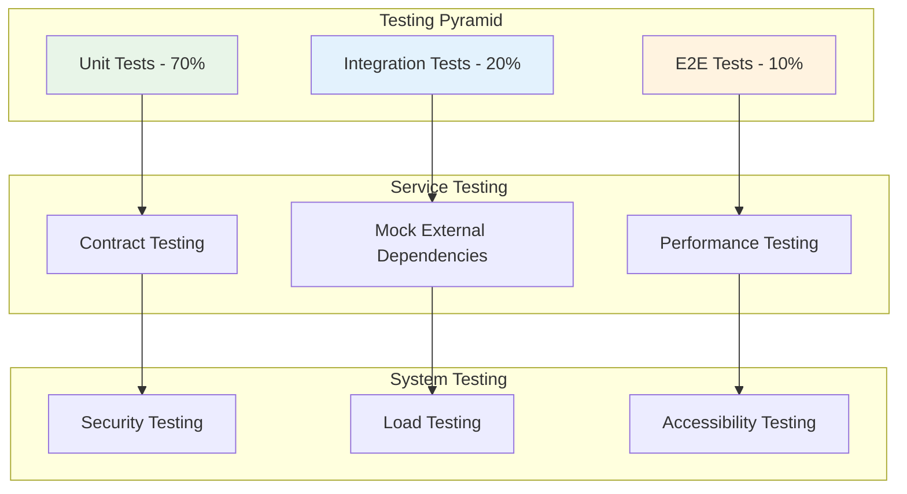

---

## 3.6 Phased Development Strategy

### 3.6.1 Phase 1: MVP Foundation (Months 1-6)

**Objective**: Establish core platform với verified pilot customers

**Service Development Priority:**
1. **Week 1-4**: auth-service + user-service (Foundation)
2. **Week 5-8**: campaign-service + barcode-service (Core Business)
3. **Week 9-12**: redemption-service + notification-service (User Experience)
4. **Week 13-16**: analytics-service + integration-service (Business Value)
5. **Week 17-24**: Testing, optimization, pilot deployment

**Success Gates:**
- [ ] All 8 microservices deployed và functional
- [ ] 5 pilot brands onboarded successfully
- [ ] 10K verified users processed
- [ ] Cost per lead under $0.5 achieved

### 3.6.2 Phase 2: Scale & Intelligence (Months 7-18)

**Objective**: Scale to 100K+ users with advanced features

**Enhancement Focus:**
- 🤖 **AI/ML Integration**: Fraud detection, predictive analytics
- 🌏 **Multi-market Expansion**: Thailand, Indonesia localization
- 📊 **Advanced Analytics**: Custom reports, API marketplace
- 🔐 **Enterprise Security**: SOC2, penetration testing

### 3.6.3 Phase 3: Market Leadership (Months 19-36)

**Objective**: Become dominant platform in SEA region

**Innovation Focus:**
- 🛒 **Marketplace Features**: Multi-brand co-sampling
- 🌱 **Sustainability Tracking**: Carbon footprint, eco-metrics
- 🧠 **AI-driven Optimization**: Automatic campaign optimization
- 🔗 **Ecosystem Integration**: E-commerce, social media platforms

---

## 3.7 Risk Management & Mitigation

### 3.7.1 Technical Risks

| Risk | Probability | Impact | Mitigation Strategy |
|------|-------------|--------|-------------------|
| **Service Complexity** | Medium | High | Standardized templates, comprehensive documentation |
| **Database Performance** | Low | High | Query optimization, caching layers, monitoring |
| **External API Failures** | High | Medium | Circuit breakers, fallback mechanisms, multiple providers |
| **Security Breaches** | Low | Critical | Defense in depth, regular audits, incident response plan |

### 3.7.2 Business Risks

| Risk | Probability | Impact | Mitigation Strategy |
|------|-------------|--------|-------------------|
| **Slow Brand Adoption** | Medium | High | Pilot program, success stories, competitive pricing |
| **Retail Partner Resistance** | Medium | Medium | Revenue sharing model, training programs |
| **Regulatory Changes** | Low | High | Compliance team, legal review, adaptable architecture |
| **Competition** | High | Medium | Innovation focus, customer lock-in, partnership strategy |

---

## 3.8 Success Measurement Framework

### 3.8.1 Key Performance Indicators (KPIs)

**Financial KPIs:**
- Monthly Recurring Revenue (MRR)
- Customer Acquisition Cost (CAC)
- Customer Lifetime Value (LTV)
- Cost per verified lead

**Operational KPIs:**
- System uptime và performance
- API response times
- Error rates và resolution times
- Security incident count

**Product KPIs:**
- User engagement rates
- Feature adoption rates
- Customer satisfaction scores
- Market share growth

### 3.8.2 Monitoring & Alerting

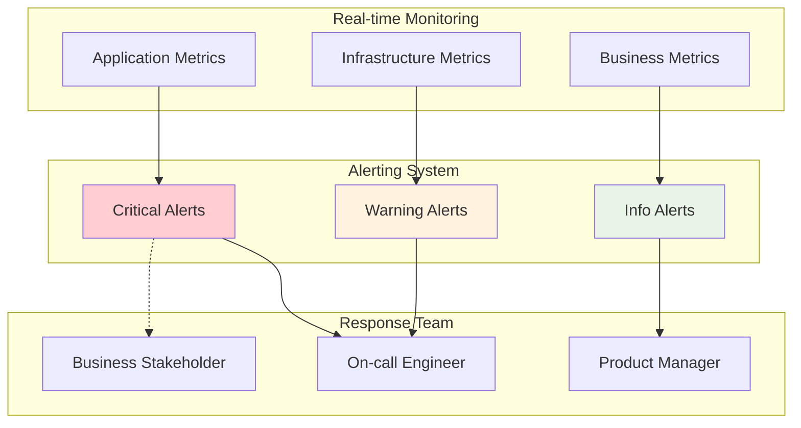

---

## 3.9 Acceptance Criteria

### 3.9.1 MVP Acceptance Criteria

**Technical Acceptance:**
- [ ] All microservices pass security audit
- [ ] Performance benchmarks met under load testing
- [ ] 100% API documentation coverage
- [ ] Disaster recovery procedures tested

**Business Acceptance:**
- [ ] 5+ pilot brands successfully launched campaigns
- [ ] Cost per verified lead ≤ $0.5 achieved
- [ ] 90%+ customer satisfaction score
- [ ] Zero critical security incidents

**Operational Acceptance:**
- [ ] 24/7 monitoring và alerting functional
- [ ] CI/CD pipelines operational for all services
- [ ] Team documentation complete và validated
- [ ] Support processes established

---

## 3.10 Next Steps & Dependencies

### 3.10.1 Immediate Actions
1. **Technical Architecture Review** với development team
2. **Service Interface Design** workshop
3. **Database Schema Planning** session
4. **Development Environment Setup** guide creation

### 3.10.2 Critical Dependencies
- Development team hiring và onboarding
- Cloud infrastructure setup
- External API integrations (Twilio, HubSpot)
- Legal compliance review

---

**Document Status**: ✅ Ready for Part04  
**Next Action**: Define detailed functional requirements  
**Dependencies**: Architecture và scope confirmed  
**Owner**: System Analyst Team
# 📘 Part04 - Yêu cầu chức năng (Functional Requirements)
**Đặc tả yêu cầu hệ thống (SRS) - Product Sampling Platform**

**Phiên bản**: 1.0  
**Ngày**: 2025-10-17  
**Tác giả**: Đội phân tích hệ thống  
**Trạng thái**: ✅ Hoàn thành  

---

## 4.1 Tổng quan yêu cầu chức năng

### 4.1.1 Phân loại yêu cầu
Hệ thống Product Sampling Platform (PSP) có **13 yêu cầu chức năng chính** được chia thành 3 nhóm ưu tiên:

| Mức ưu tiên | Số lượng | Giai đoạn triển khai |
|-------------|----------|-------------------|
| 🔴 **Must-Have (Core)** | 8 yêu cầu | MVP - Phase 1 |
| 🟡 **Should-Have (Advanced)** | 3 yêu cầu | Phase 2 |
| 🟠 **Nice-to-Have (Future)** | 2 yêu cầu | Phase 3 |

### 4.1.2 Traceability Matrix
Mỗi yêu cầu chức năng được liên kết với business requirements từ BRD:

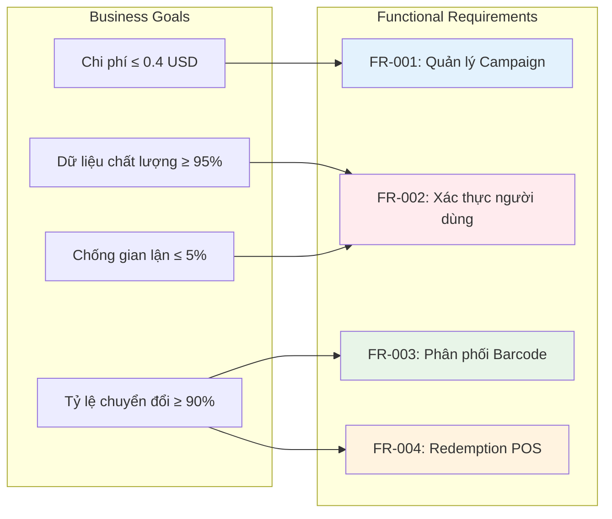

---

## 4.2 Must-Have Requirements (MVP - Phase 1)

### FR-001: Quản lý Campaign 🔴
**Mô tả**: Hệ thống cho phép các brand tạo, quản lý và theo dõi các chiến dịch sampling với khả năng gán barcode pool, ads format và UTM tracking.

**Actors**: Admin, Group Admin, Customer Account  
**Service liên quan**: `campaign-service`, `barcode-service`  
**Tham chiếu BRD**: Section 4.1 - Campaign Management

#### User Stories:
```
Là một Customer Account,
Tôi muốn tạo campaign mới cho sản phẩm của mình
Để có thể phân phối samples đến khách hàng target

Acceptance Criteria:
- Tôi có thể nhập tên campaign, mô tả, thời gian bắt đầu/kết thúc
- Tôi có thể chọn sản phẩm từ danh sách có sẵn
- Tôi có thể gán barcode pool với số lượng cụ thể
- Tôi có thể chọn locations/retail nodes để phân phối
- Tôi có thể preview campaign trước khi publish
- System tự động tạo UTM tracking codes
```

#### Functional Specifications:

| Chức năng | Input | Output | Business Rules |
|-----------|-------|--------|----------------|
| **Tạo Campaign** | Tên, mô tả, ngày bắt đầu/kết thúc, sản phẩm | Campaign ID, URL tracking | Ngày kết thúc > ngày bắt đầu |
| **Gán Barcode Pool** | Campaign ID, số lượng barcode | Pool assignment confirmation | Số lượng <= available barcodes |
| **Chọn Locations** | Campaign ID, danh sách location IDs | Location assignment | Locations phải active và verified |
| **UTM Tracking** | Campaign ID, source, medium | UTM parameters | Auto-generate unique tracking codes |

#### API Endpoints:
- `POST /api/campaigns` - Tạo campaign mới
- `PUT /api/campaigns/{id}` - Cập nhật campaign
- `GET /api/campaigns` - Lấy danh sách campaigns
- `POST /api/campaigns/{id}/barcodes` - Gán barcode pool
- `POST /api/campaigns/{id}/locations` - Gán locations

#### Acceptance Criteria:
- [ ] Campaign có thể được tạo trong < 2 phút
- [ ] UTM tracking codes là unique và traceable
- [ ] Preview functionality hoạt động chính xác
- [ ] Role-based access control được enforce
- [ ] Audit logs được tạo cho mọi thay đổi

---

### FR-002: Xác thực người dùng 🔴
**Mô tả**: Hệ thống thực hiện xác thực người dùng qua OTP (SMS/Email) và các biện pháp chống spam để đảm bảo chất lượng dữ liệu.

**Actors**: End User (khách hàng cuối)  
**Service liên quan**: `auth-service`, `notification-service`, `user-service`  
**Tham chiếu BRD**: Section 4.1 - Customer Verification

#### User Stories:
```
Là một khách hàng,
Tôi muốn xác thực thông tin của mình một cách an toàn
Để nhận được barcode/voucher hợp lệ

Acceptance Criteria:
- Tôi có thể chọn xác thực qua SMS hoặc Email
- Tôi nhận được OTP 6 chữ số trong vòng 30 giây
- Tôi có tối đa 3 lần thử nhập OTP
- OTP có hiệu lực trong 5 phút
- System block tôi nếu có hành vi spam
```

#### Functional Specifications:

| Chức năng | Input | Output | Business Rules |
|-----------|-------|--------|----------------|
| **Gửi OTP** | Số điện thoại/Email | OTP code (6 digits) | Rate limit: 1 OTP/minute/number |
| **Xác thực OTP** | OTP code, session ID | Verification status | Max 3 attempts, 5 min expiry |
| **Chống Spam** | Device info, IP, patterns | Risk score (0-100) | Auto-block nếu score > 80 |
| **Consent Management** | Checkbox selections | Consent flags | GDPR/PDPA compliance |

#### Security Features:
- **Rate Limiting**: 1 OTP request/phút/số điện thoại
- **Device Fingerprinting**: Browser, IP, screen resolution tracking
- **CAPTCHA**: reCAPTCHA v3 integration
- **Blacklist**: Disposable email domains, suspicious patterns

#### API Endpoints:
- `POST /api/auth/send-otp` - Gửi OTP
- `POST /api/auth/verify-otp` - Xác thực OTP
- `GET /api/auth/risk-score` - Kiểm tra risk score
- `POST /api/users/consent` - Cập nhật consent

#### Acceptance Criteria:
- [ ] OTP delivery rate ≥ 95%
- [ ] Verification success rate ≥ 90%
- [ ] Fraud detection accuracy ≥ 85%
- [ ] Response time < 2 seconds cho verification
- [ ] Compliance với PDPA/GDPR requirements

---

### FR-003: Phân phối Barcode/Voucher 🔴
**Mô tả**: Hệ thống tự động cấp phát barcode/voucher duy nhất cho người dùng đã xác thực, đảm bảo single-use và time-limited.

**Actors**: System (automated), End User  
**Service liên quan**: `barcode-service`, `campaign-service`  
**Tham chiếu BRD**: Section 4.1 - Barcode Distribution

#### User Stories:
```
Là một khách hàng đã xác thực,
Tôi muốn nhận barcode/voucher ngay lập tức
Để có thể đổi sản phẩm tại cửa hàng

Acceptance Criteria:
- Tôi nhận được barcode trong vòng 5 giây sau khi verify OTP
- Barcode được hiển thị dưới dạng QR code và số
- Tôi có thể lưu barcode vào Apple Wallet/Google Pay
- Tôi nhận được email/SMS confirmation với barcode
- Barcode có thông tin expiry date rõ ràng
```

#### Functional Specifications:

| Chức năng | Input | Output | Business Rules |
|-----------|-------|--------|----------------|
| **Generate Barcode** | User ID, Campaign ID | Unique barcode | Single-use, time-limited |
| **QR Code Creation** | Barcode data | QR image (PNG) | 300x300 pixels minimum |
| **Wallet Integration** | Barcode, metadata | Wallet pass file | Apple Wallet/Google Pay format |
| **Notification** | User contact, barcode | Email/SMS | Template-based messaging |

#### Barcode Format:
```
Structure: [CAMPAIGN_PREFIX][RANDOM_8_DIGITS][CHECK_DIGIT]
Example: COC2024A12345678C
- COC: Campaign identifier (3 chars)
- 2024A: Year + batch identifier
- 12345678: Random digits
- C: Check digit (validation)
```

#### API Endpoints:
- `POST /api/barcodes/generate` - Tạo barcode mới
- `GET /api/barcodes/{code}/validate` - Validate barcode
- `POST /api/barcodes/{code}/wallet` - Tạo wallet pass
- `GET /api/barcodes/status/{code}` - Kiểm tra trạng thái

#### Acceptance Criteria:
- [ ] Barcode generation time < 1 second
- [ ] 100% unique barcode guarantee
- [ ] QR codes scannable bằng standard readers
- [ ] Wallet integration success rate ≥ 90%
- [ ] Email/SMS delivery rate ≥ 95%

---

### FR-004: Redemption tại POS 🔴
**Mô tả**: Hệ thống hỗ trợ scan và redeem barcode tại các điểm bán lẻ với khả năng offline sync và real-time status update.

**Actors**: Serving Account (nhân viên bán hàng)  
**Service liên quan**: `redemption-service`, `barcode-service`  
**Tham chiếu BRD**: Section 4.1 - POS Integration

#### User Stories:
```
Là một nhân viên tại Circle K,
Tôi muốn scan barcode của khách hàng một cách nhanh chóng
Để xử lý redemption và cập nhật inventory

Acceptance Criteria:
- Tôi có thể scan QR code bằng camera điện thoại/tablet
- System hiển thị thông tin sản phẩm và campaign ngay lập tức
- Tôi có thể confirm redemption với 1 click
- System hoạt động khi mất mạng (offline mode)
- Dữ liệu được sync khi có mạng trở lại
```

#### Functional Specifications:

| Chức năng | Input | Output | Business Rules |
|-----------|-------|--------|----------------|
| **Scan Barcode** | QR/Barcode image | Product info, validity | Real-time validation |
| **Process Redemption** | Barcode, location, staff ID | Redemption record | Single-use enforcement |
| **Offline Storage** | Redemption data | Local queue | IndexedDB storage |
| **Sync Process** | Queued data | Server update | Automatic when online |

#### Offline Capabilities:
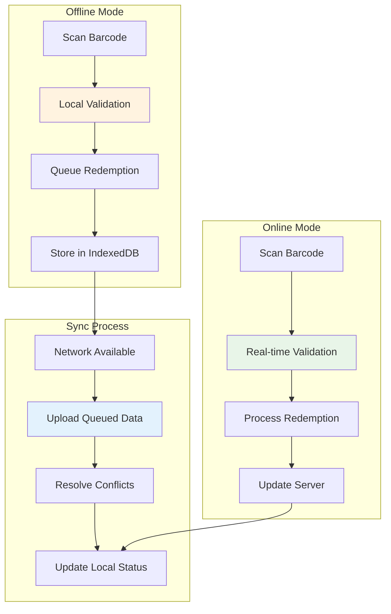

#### API Endpoints:
- `POST /api/redemptions/scan` - Scan và validate barcode
- `POST /api/redemptions/process` - Xử lý redemption
- `POST /api/redemptions/batch-sync` - Sync offline data
- `GET /api/redemptions/status` - Kiểm tra sync status

#### Acceptance Criteria:
- [ ] Scan response time < 2 seconds
- [ ] Offline functionality hoạt động ≥ 8 hours
- [ ] Sync success rate ≥ 99% khi có mạng
- [ ] Conflict resolution automatic
- [ ] Audit trail đầy đủ cho mọi redemption

---

### FR-005: Landing Page và Form 🔴
**Mô tả**: Hệ thống cung cấp mobile-first landing page với form thu thập thông tin khách hàng, quiz preferences và consent management.

**Actors**: End User  
**Service liên quan**: `user-service`, `campaign-service`  
**Tham chiếu BRD**: Section 4.1 - Data Collection

#### User Stories:
```
Là một khách hàng scan QR code,
Tôi muốn điền thông tin một cách nhanh chóng và dễ dàng
Để hoàn thành quá trình nhận sample

Acceptance Criteria:
- Landing page load trong < 3 giây trên 3G
- Form có thể điền hoàn tất trong < 30 giây
- Tôi thấy rõ privacy policy và consent options
- Form validation real-time và user-friendly
- Tôi có thể access User Portal sau khi submit
```

#### Functional Specifications:

| Chức năng | Input | Output | Business Rules |
|-----------|-------|--------|----------------|
| **Form Rendering** | Campaign ID, device type | Responsive form | Mobile-first design |
| **Data Validation** | Form fields | Validation errors | Real-time validation |
| **Quiz Engine** | User responses | Preference profile | Optional completion |
| **Consent Management** | Checkbox selections | Consent record | GDPR/PDPA compliance |

#### Form Fields:
```typescript
interface UserForm {
  // Bắt buộc
  fullName: string;           // Họ và tên
  email: string;              // Email
  phoneNumber: string;        // Số điện thoại
  
  // Tùy chọn
  age?: number;               // Tuổi
  gender?: 'M' | 'F' | 'Other'; // Giới tính
  location?: string;          // Khu vực
  
  // Quiz preferences (campaign-specific)
  preferences?: {
    dietaryRestrictions?: string[];
    brandPreferences?: string[];
    shoppingHabits?: string[];
  };
  
  // Consent
  marketingConsent: boolean;  // Đồng ý marketing
  dataProcessingConsent: boolean; // Đồng ý xử lý dữ liệu
}
```

#### API Endpoints:
- `GET /api/landing/{campaignId}` - Lấy landing page config
- `POST /api/forms/validate` - Validate form data
- `POST /api/forms/submit` - Submit form
- `GET /api/user-portal/link` - Tạo User Portal link

#### Acceptance Criteria:
- [ ] Page load time < 3 seconds trên 3G
- [ ] Form completion rate ≥ 90%
- [ ] Mobile usability score ≥ 95%
- [ ] Accessibility compliance (WCAG 2.1)
- [ ] Cross-browser compatibility

---

### FR-006: Báo cáo và Analytics 🔴
**Mô tả**: Hệ thống cung cấp dashboard real-time với funnel tracking, campaign performance và khả năng export dữ liệu.

**Actors**: Admin, Group Admin, Customer Account  
**Service liên quan**: `analytics-service`  
**Tham chiếu BRD**: Section 4.1 - Analytics & Reporting

#### User Stories:
```
Là một brand manager,
Tôi muốn xem hiệu quả campaign real-time
Để có thể điều chỉnh strategy kịp thời

Acceptance Criteria:
- Dashboard update mỗi 5 phút
- Tôi thấy được funnel từ scan → redeem
- Tôi có thể filter theo location, time range
- Tôi có thể export data CSV/Excel
- Tôi thấy được cost per verified lead
```

#### Dashboard Metrics:

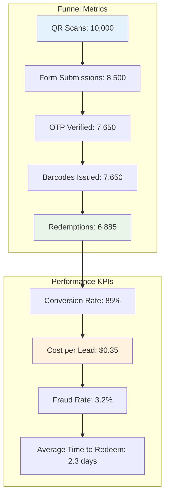

#### Report Types:

| Report | Frequency | Format | Recipients |
|--------|-----------|--------|------------|
| **Campaign Summary** | Daily | Dashboard | Brand managers |
| **Funnel Analysis** | Real-time | Dashboard | Marketing teams |
| **Cost Analysis** | Weekly | PDF/Email | Finance teams |
| **Fraud Report** | Daily | Dashboard | Security teams |
| **Location Performance** | Weekly | CSV Export | Operations teams |

#### API Endpoints:
- `GET /api/analytics/dashboard` - Dashboard data
- `GET /api/analytics/funnel` - Funnel metrics
- `POST /api/analytics/export` - Export data
- `GET /api/analytics/cost-analysis` - Cost breakdown

#### Acceptance Criteria:
- [ ] Dashboard load time < 5 seconds
- [ ] Data accuracy ≥ 99.5%
- [ ] Real-time updates trong 5 minutes
- [ ] Export completion time < 30 seconds
- [ ] Support concurrent 100+ users

---

### FR-007: User Portal 🔴
**Mô tả**: PWA cho end users xem lịch sử sampling, track redemption status, nhận notifications và manage consent.

**Actors**: User Role (End User)  
**Service liên quan**: `user-service`, `notification-service`  
**Tham chiếu BRD**: Section 4.1 - User Experience

#### User Stories:
```
Là một khách hàng đã nhận samples,
Tôi muốn theo dõi lịch sử và trạng thái redemption
Để quản lý các samples của mình

Acceptance Criteria:
- Tôi login bằng phone/email
- Tôi thấy danh sách tất cả samples đã nhận
- Tôi biết trạng thái từng barcode (chưa dùng/đã dùng/hết hạn)
- Tôi nhận push notifications khi sắp hết hạn
- Tôi có thể withdraw consent/opt-out
```

#### Portal Features:

| Feature | Description | Business Value |
|---------|-------------|----------------|
| **Sample History** | Danh sách products đã nhận theo thời gian | User engagement tracking |
| **Redemption Status** | Real-time status của mỗi barcode | Transparency, trust building |
| **Notification Center** | Push/SMS/Email notifications | User retention |
| **Consent Management** | Update preferences, opt-out options | GDPR compliance |
| **Support Tickets** | Report issues, contact support | Customer service |

#### Portal Flow:
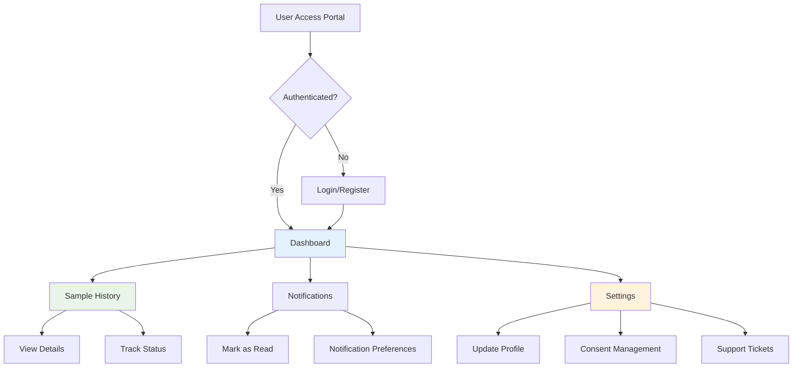

#### API Endpoints:
- `GET /api/user-portal/dashboard` - User dashboard data
- `GET /api/user-portal/samples` - Sample history
- `POST /api/user-portal/notifications/read` - Mark notifications
- `PUT /api/user-portal/consent` - Update consent
- `POST /api/user-portal/support` - Create support ticket

#### Acceptance Criteria:
- [ ] PWA installable on mobile devices
- [ ] Offline viewing cho sample history
- [ ] Push notification delivery rate ≥ 90%
- [ ] Page load time < 3 seconds
- [ ] User engagement rate ≥ 70%

---

### FR-008: Role-based Access Control 🔴
**Mô tả**: Hệ thống phân quyền chi tiết cho 6 user roles với audit logging và security compliance.

**Actors**: Admin, Group Admin, Customer Account, Serving Account, Auditor, User Role  
**Service liên quan**: `auth-service`  
**Tham chiếu**: `Access_Control_Tree_Grok.md`

#### Permission Matrix:

| Module | Admin | Group Admin | Customer Account | Serving Account | Auditor | User Role |
|--------|-------|-------------|------------------|-----------------|---------|-----------|
| Campaign Management | Full | Group scope | Own campaigns | None | View logs | None |
| Barcode Operations | Full | Group scope | Own pools | Scan only | View logs | View own |
| User Management | Full | Group users | None | None | View logs | Own profile |
| Analytics | Global | Group reports | Own data | None | Compliance | Personal stats |
| System Config | Full | None | None | None | None | None |

#### Security Features:
- **JWT Authentication** với refresh tokens
- **Multi-factor Authentication** cho admin roles
- **Session Management** với automatic timeout
- **Audit Logging** cho tất cả sensitive operations
- **IP Whitelisting** cho admin accounts

#### API Endpoints:
- `POST /api/auth/login` - Authentication
- `POST /api/auth/refresh` - Token refresh
- `GET /api/auth/permissions` - User permissions
- `POST /api/auth/mfa/setup` - Setup MFA
- `GET /api/audit/logs` - Audit trail

#### Acceptance Criteria:
- [ ] Zero unauthorized access incidents
- [ ] Permission check time < 100ms
- [ ] Audit log completeness 100%
- [ ] MFA setup rate ≥ 90% for admins
- [ ] Session security compliance

---

## 4.3 Should-Have Requirements (Phase 2)

### FR-009: Fraud Detection nâng cao 🟡
**Mô tả**: Machine learning-based fraud detection với device fingerprinting và anomaly detection.

**Service liên quan**: `auth-service` enhanced với ML models  
**Business Value**: Giảm fraud rate từ 5% xuống <2%

#### ML Features:
- Behavioral pattern analysis
- Device fingerprinting correlation
- Velocity checks và geographic analysis
- Risk scoring với automatic blocking

---

### FR-010: Inventory Reconciliation 🟡
**Mô tả**: Quản lý stock theo batch với expiry tracking và automatic reconciliation.

**Service liên quan**: `inventory-service` (new), `barcode-service`  
**Business Value**: Inventory accuracy >99%, waste reduction

#### Features:
- Batch tracking với expiry dates
- Automatic reconciliation với POS systems
- Waste reporting và optimization
- Supplier integration APIs

---

### FR-011: A/B Testing Framework 🟡
**Mô tả**: Built-in A/B testing cho landing pages, incentives và user flows.

**Service liên quan**: `campaign-service`, `analytics-service`  
**Business Value**: Conversion optimization, data-driven improvements

#### Features:
- Experiment configuration interface
- Traffic splitting và control groups
- Statistical significance testing
- Automatic winner selection

---

## 4.4 Nice-to-Have Requirements (Phase 3)

### FR-012: AI Campaign Optimization 🟠
**Mô tả**: AI-powered campaign optimization với predictive analytics.

**Service liên quan**: `ai-service` (new)  
**Business Value**: Automatic ROI optimization, predictive insights

---

### FR-013: Sustainability Tracking 🟠
**Mô tả**: Carbon footprint tracking và eco-metrics cho campaigns.

**Service liên quan**: `sustainability-service` (new)  
**Business Value**: ESG compliance, Gen Z appeal

---

## 4.5 Tổng kết và Dependencies

### 4.5.1 Implementation Priority
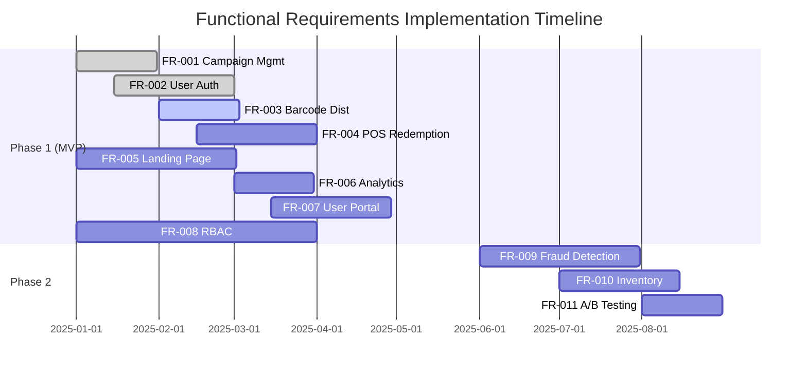

### 4.5.2 Cross-Functional Dependencies
- FR-002 (Auth) → cần trước FR-003, FR-004, FR-006, FR-007
- FR-001 (Campaign) → cần trước FR-003, FR-005, FR-006
- FR-003 (Barcode) → cần trước FR-004, FR-007
- FR-008 (RBAC) → cần cho tất cả modules

---

**Trạng thái tài liệu**: ✅ Sẵn sàng cho Part05  
**Hành động tiếp theo**: Định nghĩa Non-Functional Requirements  
**Dependencies**: Functional specs confirmed  
**Người sở hữu**: Đội phân tích hệ thống

# 📘 Part05 - Yêu cầu phi chức năng (Non-Functional Requirements)
**Đặc tả yêu cầu hệ thống (SRS) - Product Sampling Platform**

**Phiên bản**: 1.0  
**Ngày**: 2025-10-17  
**Tác giả**: Đội phân tích hệ thống  
**Trạng thái**: ✅ Hoàn thành  

---

## 5.1 Tổng quan yêu cầu phi chức năng

### 5.1.1 Phân loại NFR theo ISO 25010
Hệ thống Product Sampling Platform phải đáp ứng các **quality attributes** sau theo chuẩn ISO 25010:

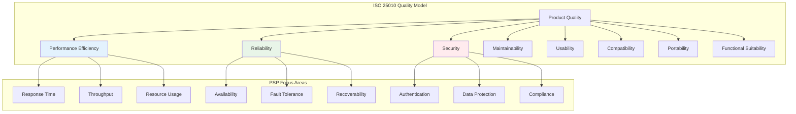

### 5.1.2 Mức độ ưu tiên NFR
| Nhóm NFR | Mức ưu tiên | Lý do business |
|----------|-------------|----------------|
| **Security** | 🔴 Critical | GDPR/PDPA compliance, fraud prevention |
| **Performance** | 🔴 Critical | User experience, cost optimization |
| **Reliability** | 🟡 High | Business continuity, brand trust |
| **Scalability** | 🟡 High | Growth targets (10M users by 2027) |
| **Usability** | 🟡 High | Conversion rate optimization |
| **Maintainability** | 🟠 Medium | Development efficiency |

---

## 5.2 Performance Requirements (NFR-P)

### NFR-P01: Response Time Requirements
**Mô tả**: Hệ thống phải đảm bảo response time tối ưu cho user experience và business KPIs.

#### Performance Targets:

| Operation Type | Target (p95) | Target (p99) | Business Impact |
|----------------|--------------|--------------|-----------------|
| **API Authentication** | ≤ 500ms | ≤ 1s | User experience critical |
| **Form Submission** | ≤ 1s | ≤ 2s | Conversion rate impact |
| **Barcode Generation** | ≤ 800ms | ≤ 1.5s | User waiting time |
| **POS Redemption** | ≤ 2s | ≤ 3s | Store operation efficiency |
| **Dashboard Loading** | ≤ 3s | ≤ 5s | Brand user satisfaction |
| **Analytics Export** | ≤ 10s | ≤ 30s | Acceptable for background task |

#### Measurement Strategy:
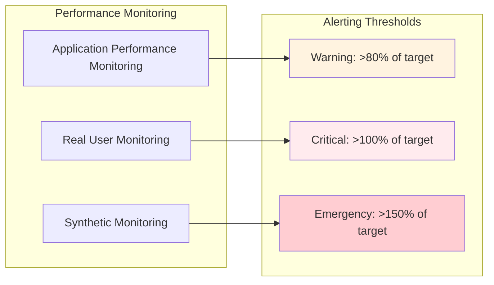

#### Acceptance Criteria:
- [ ] 95% của API calls đáp ứng response time targets
- [ ] Performance degradation <10% trong peak hours
- [ ] Automatic alerting khi vượt thresholds
- [ ] Performance reports hàng tuần cho optimization

---

### NFR-P02: Throughput Requirements
**Mô tả**: Hệ thống phải xử lý peak load trong các campaign lớn.

#### Throughput Targets:

| Service | Normal Load | Peak Load | Burst Capacity |
|---------|-------------|-----------|----------------|
| **auth-service** | 200 RPS | 1,000 RPS | 2,000 RPS (5 min) |
| **campaign-service** | 100 RPS | 500 RPS | 1,000 RPS |
| **barcode-service** | 500 RPS | 2,000 RPS | 5,000 RPS |
| **redemption-service** | 300 RPS | 1,500 RPS | 3,000 RPS |
| **analytics-service** | 50 RPS | 200 RPS | 500 RPS |
| **notification-service** | 1,000 messages/min | 10,000 messages/min | 50,000 messages/min |

#### Load Distribution Strategy:
- **Horizontal Scaling**: Auto-scaling containers based on CPU/memory
- **Load Balancing**: Round-robin với health checks
- **Caching**: Redis caching cho frequent data
- **CDN**: Static assets delivery optimization

#### Acceptance Criteria:
- [ ] Peak load handling không có service degradation
- [ ] Auto-scaling response time < 2 minutes
- [ ] Load balancing efficiency ≥ 95%
- [ ] Cache hit ratio ≥ 80% cho frequent operations

---

### NFR-P03: Resource Usage Optimization
**Mô tả**: Hiệu quả sử dụng tài nguyên để tối ưu infrastructure cost.

#### Resource Targets:

| Resource Type | Normal Usage | Peak Usage | Optimization Target |
|---------------|--------------|------------|-------------------|
| **CPU Usage** | <60% | <80% | Auto-scaling trigger at 70% |
| **Memory Usage** | <70% | <85% | Memory leak prevention |
| **Database Connections** | <200 | <500 | Connection pooling |
| **Storage Growth** | <10GB/month | <50GB/month | Data archival strategy |

#### Cost Optimization:
- **Right-sizing**: Regular review của instance sizes
- **Reserved Instances**: Cost optimization cho predictable workloads
- **Spot Instances**: Non-critical workloads optimization
- **Data Lifecycle**: Automatic archival của old data

---

## 5.3 Reliability Requirements (NFR-R)

### NFR-R01: Availability Requirements
**Mô tả**: Hệ thống phải đảm bảo uptime cao để không ảnh hưởng business operations.

#### Availability Targets:

| Service Tier | Uptime Target | Downtime/Month | Business Impact |
|--------------|---------------|----------------|-----------------|
| **Critical Services** | 99.9% | <45 minutes | Revenue loss, brand damage |
| **Important Services** | 99.5% | <4 hours | User experience impact |
| **Supporting Services** | 99% | <7 hours | Reduced functionality |

#### Service Classification:
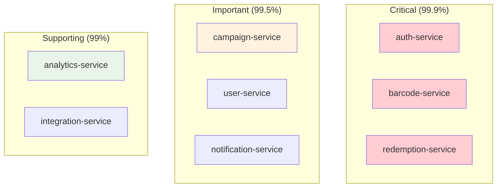

#### High Availability Architecture:
- **Multi-AZ Deployment**: Services deployed across multiple availability zones
- **Load Balancers**: Health check và automatic failover
- **Database Replication**: Master-slave setup với automatic failover
- **Circuit Breakers**: Prevent cascade failures

---

### NFR-R02: Fault Tolerance
**Mô tả**: Hệ thống phải graceful degradation khi có component failures.

#### Fault Tolerance Strategies:

| Failure Type | Detection Time | Recovery Strategy | RTO Target |
|--------------|----------------|-------------------|------------|
| **Service Crash** | <30 seconds | Auto-restart, health check | <2 minutes |
| **Database Failure** | <1 minute | Failover to replica | <5 minutes |
| **Network Partition** | <2 minutes | Retry với exponential backoff | <10 minutes |
| **External API Failure** | <30 seconds | Circuit breaker, fallback | <1 minute |

#### Resilience Patterns:
- **Retry Logic**: Exponential backoff với jitter
- **Circuit Breaker**: Prevent cascading failures
- **Bulkhead**: Isolate critical resources
- **Timeout**: Prevent resource exhaustion

---

### NFR-R03: Disaster Recovery
**Mô tả**: Khả năng phục hồi từ disasters lớn với minimal data loss.

#### DR Objectives:
- **Recovery Time Objective (RTO)**: ≤ 4 hours
- **Recovery Point Objective (RPO)**: ≤ 15 minutes
- **Data Backup Frequency**: Every 6 hours
- **Cross-region Replication**: Real-time cho critical data

#### DR Plan Components:
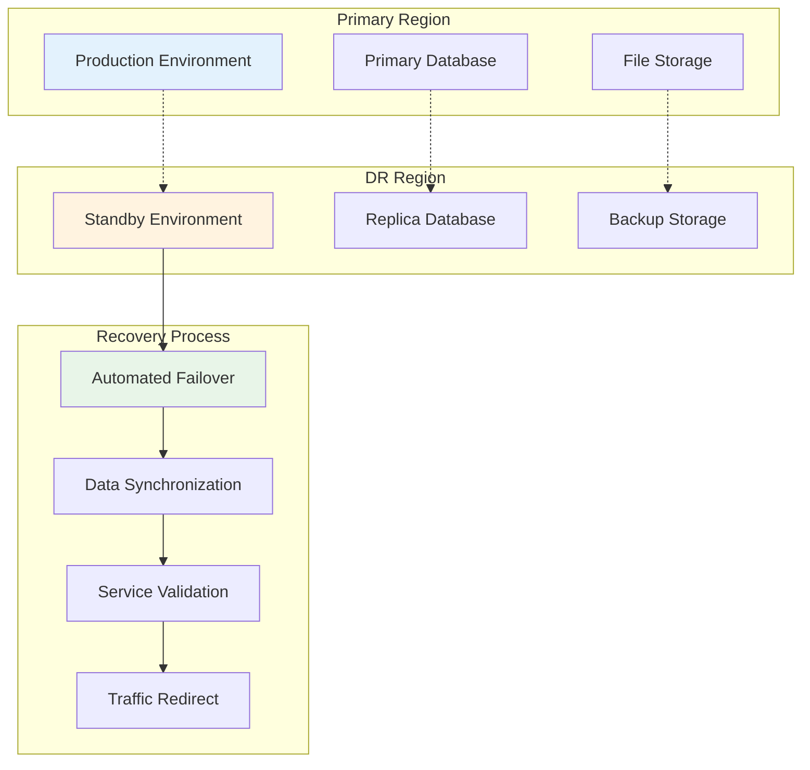

---

## 5.4 Security Requirements (NFR-S)

### NFR-S01: Authentication & Authorization
**Mô tả**: Bảo mật access control với multi-layer authentication.

#### Authentication Requirements:

| User Type | Authentication Method | Session Duration | MFA Requirement |
|-----------|----------------------|------------------|-----------------|
| **Admin** | Username/Password + MFA | 4 hours | Mandatory |
| **Group Admin** | Username/Password + MFA | 8 hours | Mandatory |
| **Customer Account** | Username/Password | 24 hours | Optional |
| **Serving Account** | PIN/Biometric | 12 hours | Device-based |
| **End User** | OTP (SMS/Email) | 30 days | Phone verification |

#### Authorization Framework:
- **Role-Based Access Control (RBAC)**: 6 defined roles với permission matrix
- **Resource-Level Permissions**: Granular control per campaign/data
- **API Rate Limiting**: Prevent abuse và DDoS
- **JWT Tokens**: Stateless authentication với refresh mechanism

#### Security Standards:
- **OWASP Top 10**: Compliance với latest security guidelines
- **OAuth 2.0**: Industry standard authorization framework
- **PKCE**: Proof Key for Code Exchange cho mobile security

---

### NFR-S02: Data Protection
**Mô tả**: Bảo vệ dữ liệu cá nhân (PII) và business data.

#### Encryption Requirements:

| Data State | Encryption Standard | Key Management | Compliance |
|------------|-------------------|----------------|------------|
| **Data at Rest** | AES-256 | AWS KMS/HashiCorp Vault | GDPR/PDPA |
| **Data in Transit** | TLS 1.3 | Certificate rotation | Industry standard |
| **Database Fields** | Field-level encryption | Per-tenant keys | PII protection |
| **Backup Data** | AES-256 | Separate key store | Compliance requirement |

#### Data Classification:
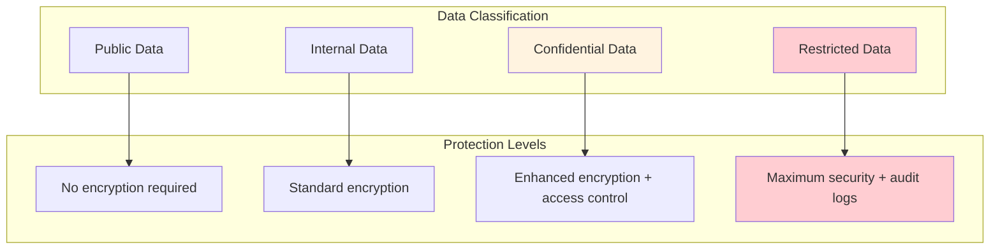

#### PII Handling:
- **Data Minimization**: Chỉ collect data cần thiết
- **Pseudonymization**: Hash PII fields khi possible
- **Right to Erasure**: GDPR deletion capabilities
- **Consent Management**: Granular consent tracking

---

### NFR-S03: Compliance Requirements
**Mô tả**: Tuân thủ các quy định về bảo vệ dữ liệu và security standards.

#### Regulatory Compliance:

| Regulation | Scope | Key Requirements | Implementation |
|------------|-------|------------------|----------------|
| **GDPR** | EU customers | Consent, deletion, portability | Consent engine, data export APIs |
| **PDPA** | Vietnam market | Local data protection | Vietnamese compliance framework |
| **SOC 2** | Enterprise customers | Security controls audit | Annual certification |
| **ISO 27001** | Information security | Security management system | Security policies, procedures |

#### Audit & Monitoring:
- **Audit Logging**: Immutable logs cho tất cả sensitive operations
- **Security Monitoring**: Real-time threat detection
- **Vulnerability Management**: Regular security scans
- **Incident Response**: 24/7 security incident handling

#### Privacy Features:
- **Cookie Consent**: GDPR-compliant cookie management
- **Data Subject Rights**: Portal for data requests
- **Privacy by Design**: Built-in privacy controls
- **Cross-border Data Transfer**: Proper legal mechanisms

---

## 5.5 Scalability Requirements (NFR-SC)

### NFR-SC01: User Scalability
**Mô tả**: Hệ thống phải scale để support growth targets.

#### Growth Projections:

| Metric | Year 1 | Year 2 | Year 3 | Scaling Strategy |
|--------|--------|--------|--------|------------------|
| **Active Users** | 100K | 1M | 10M | Horizontal scaling |
| **Concurrent Users** | 1K | 10K | 100K | Auto-scaling groups |
| **Campaigns/Month** | 100 | 1K | 10K | Database partitioning |
| **Redemptions/Day** | 10K | 100K | 1M | Event-driven architecture |

#### Scaling Architecture:
```mermaid
graph TB
    subgraph "Load Balancer Layer"
        LB[Application Load Balancer]
    end
    
    subgraph "Application Layer"
        AS1[Auto Scaling Group]
        AS2[Container Orchestration]
        AS3[Microservices Mesh]
    end
    
    subgraph "Data Layer"
        DB1[Database Sharding]
        DB2[Read Replicas]
        DB3[Distributed Cache]
    end
    
    subgraph "Storage Layer"
        S1[Object Storage]
        S2[CDN Distribution]
        S3[Data Archival]
    end
    
    LB --> AS1 --> DB1 --> S1
    AS1 --> AS2 --> DB2 --> S2
    AS2 --> AS3 --> DB3 --> S3
    
    style AS1 fill:#e3f2fd
    style DB1 fill:#e8f5e8
    style S1 fill:#fff3e0
```

---

### NFR-SC02: Data Scalability
**Mô tả**: Quản lý data volume growth hiệu quả.

#### Data Growth Projections:

| Data Type | Volume/Month | Growth Rate | Storage Strategy |
|-----------|--------------|-------------|------------------|
| **User Profiles** | 100K records | 50%/year | MongoDB sharding |
| **Campaign Data** | 1K campaigns | 100%/year | PostgreSQL partitioning |
| **Redemption Logs** | 1M records | 200%/year | Time-series database |
| **Analytics Data** | 10GB | 150%/year | Data warehouse |

#### Data Management:
- **Data Lifecycle Management**: Automatic archival policies
- **Data Compression**: Optimize storage costs
- **Data Partitioning**: Performance optimization
- **Data Replication**: Multi-region availability

---

## 5.6 Usability Requirements (NFR-U)

### NFR-U01: User Experience
**Mô tả**: Mobile-first design với excellent user experience.

#### UX Targets:

| Metric | Target | Measurement Method |
|--------|--------|--------------------|
| **Task Completion Rate** | ≥90% | User testing, analytics |
| **Time to Complete Form** | ≤30 seconds | User journey tracking |
| **Mobile Usability Score** | ≥95% | Google Mobile-Friendly Test |
| **User Satisfaction** | ≥4.5/5 | Post-interaction surveys |

#### Design Principles:
- **Mobile-First**: Design cho mobile trước, desktop sau
- **Progressive Disclosure**: Hiển thị information gradually
- **Consistent UI**: Design system cho consistency
- **Accessibility**: WCAG 2.1 AA compliance

---

### NFR-U02: Accessibility
**Mô tả**: Hệ thống accessible cho users với disabilities.

#### Accessibility Standards:
- **WCAG 2.1 Level AA**: Full compliance
- **Screen Reader Support**: ARIA labels và semantic HTML
- **Keyboard Navigation**: Full keyboard accessibility
- **Color Contrast**: 4.5:1 ratio minimum

#### Testing Requirements:
- **Automated Testing**: Accessibility scanners trong CI/CD
- **Manual Testing**: Regular testing với assistive technologies
- **User Testing**: Testing với users có disabilities

---

## 5.7 Compatibility Requirements (NFR-C)

### NFR-C01: Browser Compatibility
**Mô tả**: Support major browsers với backward compatibility.

#### Browser Support Matrix:

| Browser | Minimum Version | Market Share | Priority |
|---------|----------------|--------------|----------|
| **Chrome** | 90+ | 65% | Critical |
| **Safari** | 14+ | 20% | Critical |
| **Firefox** | 88+ | 8% | High |
| **Edge** | 90+ | 5% | Medium |
| **Samsung Internet** | 14+ | 2% | Medium (mobile focus) |

---

### NFR-C02: Device Compatibility
**Mô tả**: Optimal experience across devices.

#### Device Support:
- **iOS**: iPhone 8+ (iOS 14+)
- **Android**: Android 8+ (API level 26+)
- **Tablets**: iPad, Android tablets
- **Desktop**: Windows 10+, macOS 10.14+

---

## 5.8 Maintainability Requirements (NFR-M)

### NFR-M01: Code Quality
**Mô tả**: High-quality, maintainable codebase.

#### Quality Metrics:
- **Code Coverage**: ≥80% test coverage
- **Technical Debt**: <10% của total codebase
- **Code Duplication**: <5%
- **Cyclomatic Complexity**: ≤10 per function

#### Development Standards:
- **Coding Standards**: ESLint, Prettier configuration
- **Code Reviews**: Mandatory peer reviews
- **Documentation**: JSDoc comments, README files
- **Refactoring**: Regular technical debt reduction

---

## 5.9 NFR Testing Strategy

### 5.9.1 Performance Testing
```mermaid
graph TB
    subgraph "Performance Testing Types"
        PT1[Load Testing]
        PT2[Stress Testing]
        PT3[Volume Testing]
        PT4[Endurance Testing]
    end
    
    subgraph "Testing Tools"
        T1[JMeter]
        T2[K6]
        T3[Locust]
        T4[Artillery]
    end
    
    subgraph "Monitoring Tools"
        M1[New Relic]
        M2[Datadog]
        M3[Grafana]
        M4[Prometheus]
    end
    
    PT1 --> T1 --> M1
    PT2 --> T2 --> M2
    PT3 --> T3 --> M3
    PT4 --> T4 --> M4
    
    style PT1 fill:#e3f2fd
    style T1 fill:#e8f5e8
    style M1 fill:#fff3e0
```

### 5.9.2 Security Testing
- **Penetration Testing**: Quarterly security assessments
- **Vulnerability Scanning**: Weekly automated scans
- **OWASP Testing**: OWASP Top 10 compliance testing
- **Compliance Audits**: Annual compliance certifications

---

## 5.10 NFR Monitoring & Alerting

### 5.10.1 Monitoring Framework
| NFR Category | Key Metrics | Alert Thresholds | Response SLA |
|--------------|-------------|------------------|--------------|
| **Performance** | Response time, throughput | >target thresholds | 15 minutes |
| **Reliability** | Uptime, error rates | >99% availability | 5 minutes |
| **Security** | Failed logins, anomalies | Security incidents | Immediate |
| **Scalability** | Resource usage, capacity | >80% utilization | 30 minutes |

### 5.10.2 Alerting Strategy
- **Tiered Alerting**: Warning → Critical → Emergency
- **On-call Rotation**: 24/7 support coverage
- **Escalation Procedures**: Automatic escalation rules
- **Post-incident Reviews**: Learning từ incidents

---

## 5.11 NFR Acceptance Criteria

### 5.11.1 MVP Acceptance Thresholds
| NFR | Minimum Acceptable | Target | Stretch Goal |
|-----|-------------------|---------|--------------|
| **API Response Time** | <5s | <3s | <1s |
| **System Uptime** | >99% | >99.5% | >99.9% |
| **Security Compliance** | PDPA basic | GDPR + PDPA | SOC2 + ISO27001 |
| **Mobile Performance** | Usable | Good | Excellent |

### 5.11.2 Testing Completion Criteria
- [ ] Tất cả performance benchmarks đạt target
- [ ] Security audit passed without critical issues
- [ ] Accessibility testing WCAG 2.1 AA compliant
- [ ] Load testing confirms scalability targets
- [ ] Disaster recovery procedures tested successfully

---

**Trạng thái tài liệu**: ✅ Sẵn sàng cho Part06  
**Hành động tiếp theo**: Thiết kế System Architecture & Components  
**Dependencies**: NFR targets confirmed và approved  
**Người sở hữu**: Đội phân tích hệ thống

# 📘 Part06 - Kiến trúc hệ thống (System Architecture & Components)
**Đặc tả yêu cầu hệ thống (SRS) - Product Sampling Platform**

**Phiên bản**: 1.0  
**Ngày**: 2025-10-17  
**Tác giả**: Đội kiến trúc sư hệ thống  
**Trạng thái**: ✅ Hoàn thành  

---

## 6.1 Tổng quan kiến trúc hệ thống

### 6.1.1 Triết lý thiết kế
Kiến trúc Product Sampling Platform được thiết kế dựa trên các nguyên tắc:

- 🏗️ **Microservices Architecture**: Tách biệt business capabilities thành các services độc lập
- 🔄 **Event-Driven Design**: Loose coupling thông qua message queues và events  
- 📱 **API-First Approach**: Tất cả interactions thông qua well-defined APIs
- 🛡️ **Security by Design**: Multi-layer security được tích hợp từ đầu
- 📈 **Scalability Ready**: Horizontal scaling capabilities cho growth targets
- 🎯 **Domain-Driven Design**: Services organized theo business domains

### 6.1.2 Kiến trúc tổng thể (High-Level Architecture)

```mermaid
graph TB
    subgraph "Người dùng cuối"
        EU[End Users - Mobile/Web]
        BA[Brand Admins - Dashboard]
        SA[Store Staff - POS Tools]
    end
    
    subgraph "Tầng Load Balancer"
        CDN[CloudFlare CDN]
        LB[Application Load Balancer]
    end
    
    subgraph "Tầng API Gateway"
        AG[Kong API Gateway]
        Auth[Authentication Layer]
        RL[Rate Limiting]
    end
    
    subgraph "Tầng Microservices"
        AS[auth-service]
        CS[campaign-service]  
        BS[barcode-service]
        US[user-service]
        RS[redemption-service]
        ANS[analytics-service]
        NS[notification-service]
        IS[integration-service]
    end
    
    subgraph "Tầng Dữ liệu"
        MongoDB[(MongoDB Cluster)]
        PostgreSQL[(PostgreSQL)]
        Redis[(Redis Cluster)]
        S3[(Object Storage)]
    end
    
    subgraph "Hệ thống bên ngoài"
        CRM[CRM Systems]
        SMS[SMS Providers]
        POS[POS Systems]
        Analytics[GA4/Meta Pixel]
    end
    
    EU --> CDN --> LB --> AG
    BA --> CDN --> LB --> AG  
    SA --> CDN --> LB --> AG
    
    AG --> Auth --> RL
    
    RL --> AS
    RL --> CS
    RL --> BS
    RL --> US
    RL --> RS
    RL --> ANS
    RL --> NS
    RL --> IS
    
    AS --> Redis
    CS --> MongoDB
    BS --> PostgreSQL
    US --> MongoDB
    RS --> PostgreSQL
    ANS --> MongoDB
    NS --> Redis
    IS --> MongoDB
    
    CS --> S3
    ANS --> S3
    
    IS --> CRM
    NS --> SMS
    RS --> POS
    ANS --> Analytics
    
    style AG fill:#e3f2fd
    style AS fill:#ffebee
    style MongoDB fill:#e8f5e8
    style Redis fill:#fff3e0
```

### 6.1.3 Các nguyên tắc kiến trúc chính

| Nguyên tắc | Mô tả | Lợi ích |
|------------|-------|---------|
| **Single Responsibility** | Mỗi service chỉ chịu trách nhiệm một business domain | Dễ maintain, test, deploy độc lập |
| **Loose Coupling** | Services communicate qua APIs và events | Flexibility, fault isolation |
| **High Cohesion** | Related functions grouped trong cùng service | Code organization, team ownership |
| **Database per Service** | Mỗi service có database riêng | Data independence, technology flexibility |
| **Stateless Services** | Services không lưu state giữa requests | Horizontal scaling, load balancing |
| **Idempotency** | Operations có thể retry safely | Reliability, error recovery |

---

## 6.2 Kiến trúc Microservices chi tiết

### 6.2.1 Service Decomposition Strategy

**Phân chia services dựa trên business capabilities:**

```mermaid
graph TB
    subgraph "Core Business Domain"
        CBD1[Campaign Management]
        CBD2[Product Sampling]
        CBD3[Customer Management]
    end
    
    subgraph "Supporting Domain"
        SD1[Authentication & Authorization]
        SD2[Notifications]
        SD3[Analytics & Reporting]
        SD4[External Integrations]
    end
    
    subgraph "Infrastructure Domain"
        ID1[API Gateway]
        ID2[Service Discovery]
        ID3[Configuration Management]
        ID4[Monitoring & Logging]
    end
    
    CBD1 --> campaign-service
    CBD2 --> barcode-service
    CBD2 --> redemption-service
    CBD3 --> user-service
    
    SD1 --> auth-service
    SD2 --> notification-service
    SD3 --> analytics-service
    SD4 --> integration-service
    
    ID1 --> Kong
    ID2 --> Consul
    ID3 --> Vault
    ID4 --> ELK-Stack
    
    style CBD1 fill:#e3f2fd
    style SD1 fill:#ffebee
    style ID1 fill:#e8f5e8
```

### 6.2.2 Chi tiết từng Microservice

#### **auth-service** 🔐
**Chức năng chính**: Xử lý authentication, authorization và RBAC

| Thành phần | Công nghệ | Mô tả |
|------------|-----------|--------|
| **Framework** | NestJS + Passport | JWT authentication, OAuth2 support |
| **Database** | Redis | Session storage, token blacklist |
| **Security** | bcrypt, JWT | Password hashing, token management |
| **MFA** | TOTP libraries | Two-factor authentication |

**API Endpoints chính**:
- `POST /auth/login` - Đăng nhập người dùng
- `POST /auth/refresh` - Refresh JWT tokens
- `GET /auth/profile` - Lấy thông tin profile
- `POST /auth/mfa/setup` - Thiết lập MFA

#### **campaign-service** 📊
**Chức năng chính**: Quản lý campaigns, ads formats và business logic

| Thành phần | Công nghệ | Mô tả |
|------------|-----------|--------|
| **Framework** | NestJS + TypeORM | Business logic, data validation |
| **Database** | MongoDB | Campaign data, ads formats |
| **File Storage** | AWS S3/MinIO | Ads format files, images |
| **Search** | Elasticsearch | Campaign search và filtering |

**Domain Models**:
```typescript
interface Campaign {
  id: string;
  name: string;
  description: string;
  startDate: Date;
  endDate: Date;
  barcodePoolId: string;
  adsFormats: AdsFormat[];
  locations: string[];
  utmTracking: UTMParams;
  status: 'draft' | 'active' | 'paused' | 'completed';
}
```

#### **barcode-service** 🎫
**Chức năng chính**: Tạo, quản lý và validate barcodes/vouchers

| Thành phần | Công nghệ | Mô tả |
|------------|-----------|--------|
| **Framework** | NestJS + Prisma | Transactional operations |
| **Database** | PostgreSQL | ACID compliance cho barcodes |
| **Queue** | Redis Bull | Batch barcode generation |
| **QR Generation** | qrcode library | QR code image generation |

**Barcode Lifecycle**:
```mermaid
stateDiagram-v2
    [*] --> Available
    Available --> Reserved : User verified
    Reserved --> Issued : Barcode generated
    Issued --> Redeemed : POS scan
    Issued --> Expired : Time limit exceeded
    Reserved --> Available : Timeout/Cancel
    Redeemed --> [*]
    Expired --> [*]
    
    note right of Reserved : 5 minutes timeout
    note right of Issued : Campaign end date
```

#### **user-service** 👥
**Chức năng chính**: Quản lý user profiles, verification và consent

| Thành phần | Công nghệ | Mô tả |
|------------|-----------|--------|
| **Framework** | NestJS + Mongoose | User data management |
| **Database** | MongoDB | Flexible user schemas |
| **Encryption** | crypto-js | PII field encryption |
| **Validation** | class-validator | Data validation rules |

#### **redemption-service** 🏪
**Chức năng chính**: POS integration, redemption processing và offline sync

| Thành phần | Công nghệ | Mô tả |
|------------|-----------|--------|
| **Framework** | NestJS + Prisma | Transactional redemptions |
| **Database** | PostgreSQL | Financial data integrity |
| **Offline Storage** | IndexedDB | Client-side queue |
| **Sync Engine** | Custom conflict resolution | Data consistency |

**Offline Sync Process**:
```mermaid
sequenceDiagram
    participant Staff as Store Staff
    participant App as POS App
    participant Local as Local Storage
    participant API as redemption-service
    
    Staff->>App: Scan barcode
    App->>Local: Check online status
    
    alt Online Mode
        App->>API: Validate & redeem
        API-->>App: Success response
        App->>Local: Cache result
    else Offline Mode
        App->>Local: Queue redemption
        App-->>Staff: Offline confirmation
        
        Note over App,API: When connection restored
        App->>API: Sync queued data
        API-->>App: Conflict resolution
        App->>Local: Update status
    end
```

#### **analytics-service** 📈
**Chức năng chính**: Data processing, reporting và dashboard APIs

| Thành phần | Công nghệ | Mô tả |
|------------|-----------|--------|
| **Framework** | NestJS + Aggregation | Complex data queries |
| **Database** | MongoDB | Time-series data |
| **Caching** | Redis | Report caching |
| **Export** | ExcelJS, csv-parser | Data export functionality |

#### **notification-service** 📱
**Chức năng chính**: OTP, email, SMS và push notifications

| Thành phần | Công nghệ | Mô tả |
|------------|-----------|--------|
| **Framework** | NestJS + Bull Queue | Async message processing |
| **Queue** | Redis | Message queue |
| **SMS** | Twilio SDK | SMS delivery |
| **Email** | SendGrid/SES | Email delivery |

#### **integration-service** 🔗
**Chức năng chính**: External API integrations và webhook management

| Thành phần | Công nghệ | Mô tả |
|------------|-----------|--------|
| **Framework** | NestJS + Axios | HTTP client integrations |
| **Database** | MongoDB | Integration configs |
| **Queue** | Redis | Webhook delivery |
| **Retry Logic** | Exponential backoff | Fault tolerance |

---

## 6.3 Data Architecture

### 6.3.1 Database Selection Strategy

**Database phù hợp cho từng use case:**

| Database | Use Cases | Services | Lý do lựa chọn |
|----------|-----------|----------|----------------|
| **PostgreSQL** | Transactional data, financial records | barcode-service, redemption-service | ACID compliance, data integrity |
| **MongoDB** | Document storage, flexible schemas | campaign-service, user-service, analytics-service | Schema flexibility, horizontal scaling |
| **Redis** | Caching, sessions, queues | auth-service, notification-service | In-memory performance, pub/sub |

### 6.3.2 Data Flow Architecture

```mermaid
graph LR
    subgraph "Data Sources"
        DS1[User Forms]
        DS2[POS Systems]
        DS3[Campaign Configs]
        DS4[External APIs]
    end
    
    subgraph "Data Processing"
        DP1[Real-time Ingestion]
        DP2[Data Validation]
        DP3[Business Logic]
        DP4[Event Publishing]
    end
    
    subgraph "Data Storage"
        DB1[Operational DBs]
        DB2[Analytics DB]
        DB3[Cache Layer]
        DB4[Object Storage]
    end
    
    subgraph "Data Consumption"
        DC1[Real-time Dashboard]
        DC2[Batch Reports]
        DC3[External Integrations]
        DC4[Mobile Apps]
    end
    
    DS1 --> DP1 --> DB1 --> DC1
    DS2 --> DP2 --> DB2 --> DC2
    DS3 --> DP3 --> DB3 --> DC3
    DS4 --> DP4 --> DB4 --> DC4
    
    style DP1 fill:#e3f2fd
    style DB1 fill:#e8f5e8
    style DC1 fill:#fff3e0
```

### 6.3.3 Data Consistency Strategy

**Event-driven data consistency:**

| Pattern | Sử dụng cho | Implementation |
|---------|-------------|----------------|
| **Saga Pattern** | Multi-service transactions | Orchestration-based saga |
| **Event Sourcing** | Audit trail, critical events | Event store với snapshots |
| **CQRS** | Read/write optimization | Separate query models |
| **Eventually Consistent** | Non-critical updates | Async event processing |

---

## 6.4 Security Architecture

### 6.4.1 Defense in Depth Strategy

```mermaid
graph TB
    subgraph "Network Security"
        NS1[WAF - Web Application Firewall]
        NS2[DDoS Protection]
        NS3[VPN Access]
    end
    
    subgraph "Application Security"
        AS1[API Gateway Security]
        AS2[Service-to-Service Auth]
        AS3[Input Validation]
        AS4[Output Encoding]
    end
    
    subgraph "Data Security"
        DS1[Encryption at Rest]
        DS2[Encryption in Transit]
        DS3[Key Management]
        DS4[Access Controls]
    end
    
    subgraph "Infrastructure Security"
        IS1[Container Security]
        IS2[Network Segmentation]
        IS3[Security Monitoring]
        IS4[Vulnerability Management]
    end
    
    NS1 --> AS1 --> DS1 --> IS1
    NS2 --> AS2 --> DS2 --> IS2
    NS3 --> AS3 --> DS3 --> IS3
    AS4 --> DS4 --> IS4
    
    style AS1 fill:#ffebee
    style DS1 fill:#ffebee
    style IS1 fill:#ffebee
```

### 6.4.2 Authentication & Authorization Flow

```mermaid
sequenceDiagram
    participant Client as Client App
    participant Gateway as API Gateway
    participant Auth as auth-service
    participant Service as Target Service
    participant DB as Database
    
    Client->>Gateway: Request với credentials
    Gateway->>Auth: Validate credentials
    Auth->>DB: Check user & permissions
    DB-->>Auth: User data & roles
    Auth-->>Gateway: JWT token + permissions
    Gateway-->>Client: Access token
    
    Note over Client,Service: Subsequent requests
    
    Client->>Gateway: Request với JWT
    Gateway->>Auth: Validate JWT
    Auth-->>Gateway: Token valid + permissions
    Gateway->>Service: Forward request với user context
    Service->>DB: Execute operation
    DB-->>Service: Response data
    Service-->>Gateway: Response
    Gateway-->>Client: Final response
```

### 6.4.3 Data Protection Implementation

**PII Encryption Strategy:**

| Data Type | Encryption Level | Key Management | Access Control |
|-----------|-----------------|----------------|----------------|
| **Email addresses** | Field-level AES-256 | Per-tenant keys | Role-based access |
| **Phone numbers** | Field-level AES-256 | Per-tenant keys | Role-based access |
| **Names** | Field-level AES-256 | Per-tenant keys | Role-based access |
| **Preferences** | Database-level | Shared encryption | Service-level access |
| **Analytics data** | Pseudonymized | Hash functions | Aggregated access only |

---

## 6.5 Deployment Architecture

### 6.5.1 Container Architecture

**Docker containerization strategy:**

```dockerfile
# Base image cho NestJS services
FROM node:18-alpine AS base
WORKDIR /app
COPY package*.json ./
RUN npm ci --only=production

FROM base AS development
RUN npm ci
COPY . .
CMD ["npm", "run", "start:dev"]

FROM base AS production
COPY dist/ ./dist/
USER node
CMD ["node", "dist/main.js"]
```

### 6.5.2 Multi-Environment Setup

| Environment | Purpose | Infrastructure | Data |
|-------------|---------|----------------|------|
| **Development** | Local development | Docker Compose | Sample data |
| **Staging** | Integration testing | Kubernetes cluster | Anonymized production data |
| **Production** | Live system | Multi-AZ deployment | Real customer data |

### 6.5.3 Kubernetes Deployment

```yaml
# Service deployment example
apiVersion: apps/v1
kind: Deployment
metadata:
  name: auth-service
spec:
  replicas: 3
  selector:
    matchLabels:
      app: auth-service
  template:
    metadata:
      labels:
        app: auth-service
    spec:
      containers:
      - name: auth-service
        image: psp/auth-service:latest
        ports:
        - containerPort: 3000
        env:
        - name: DATABASE_URL
          valueFrom:
            secretKeyRef:
              name: db-secret
              key: url
        resources:
          requests:
            memory: "256Mi"
            cpu: "250m"
          limits:
            memory: "512Mi"
            cpu: "500m"
        livenessProbe:
          httpGet:
            path: /health
            port: 3000
          initialDelaySeconds: 30
          periodSeconds: 10
        readinessProbe:
          httpGet:
            path: /ready
            port: 3000
          initialDelaySeconds: 5
          periodSeconds: 5
```

---

## 6.6 Monitoring & Observability

### 6.6.1 Monitoring Stack

```mermaid
graph TB
    subgraph "Metrics Collection"
        MC1[Prometheus]
        MC2[Application Metrics]
        MC3[Infrastructure Metrics]
    end
    
    subgraph "Logging"
        L1[Fluentd/Filebeat]
        L2[Elasticsearch]
        L3[Kibana]
    end
    
    subgraph "Tracing"
        T1[Jaeger]
        T2[OpenTelemetry]
        T3[Distributed Tracing]
    end
    
    subgraph "Alerting"
        A1[Grafana]
        A2[AlertManager]
        A3[PagerDuty]
    end
    
    subgraph "Business Metrics"
        BM1[Custom Dashboards]
        BM2[KPI Tracking]
        BM3[Real-time Reports]
    end
    
    MC1 --> A1
    MC2 --> A2
    MC3 --> A3
    
    L1 --> L2 --> L3
    T1 --> T2 --> T3
    
    A1 --> BM1
    A2 --> BM2
    A3 --> BM3
    
    style MC1 fill:#e3f2fd
    style L2 fill:#e8f5e8
    style T1 fill:#fff3e0
    style A1 fill:#ffebee
```

### 6.6.2 Health Check Strategy

**Multi-level health checks:**

| Level | Endpoint | Check Type | Response Time |
|-------|----------|------------|---------------|
| **Liveness** | `/health` | Service running | <1s |
| **Readiness** | `/ready` | Dependencies available | <2s |
| **Deep** | `/health/deep` | Database connectivity | <5s |
| **Business** | `/health/business` | Critical workflows | <10s |

### 6.6.3 Alerting Rules

| Alert Type | Condition | Severity | Action |
|------------|-----------|----------|--------|
| **Service Down** | Health check fails > 2 min | Critical | Immediate page |
| **High Response Time** | P95 > threshold for 5 min | Warning | Slack notification |
| **High Error Rate** | Error rate > 5% for 3 min | Critical | Page + escalate |
| **Resource Usage** | CPU/Memory > 80% for 10 min | Warning | Auto-scale trigger |

---

## 6.7 Performance Optimization

### 6.7.1 Caching Strategy

```mermaid
graph TB
    subgraph "Client Side"
        CS1[Browser Cache]
        CS2[Service Worker]
        CS3[Local Storage]
    end
    
    subgraph "CDN Layer"
        CDN1[Static Assets]
        CDN2[API Responses]
        CDN3[Edge Caching]
    end
    
    subgraph "Application Layer"
        AL1[Redis Cache]
        AL2[Query Results]
        AL3[Session Data]
    end
    
    subgraph "Database Layer"
        DL1[Query Cache]
        DL2[Connection Pool]
        DL3[Read Replicas]
    end
    
    CS1 --> CDN1 --> AL1 --> DL1
    CS2 --> CDN2 --> AL2 --> DL2
    CS3 --> CDN3 --> AL3 --> DL3
    
    style AL1 fill:#fff3e0
    style CDN1 fill:#e8f5e8
    style DL1 fill:#e3f2fd
```

### 6.7.2 Database Optimization

**Performance optimization strategies:**

| Strategy | Implementation | Expected Gain |
|----------|----------------|---------------|
| **Indexing** | Strategic index creation | 5-10x query speed |
| **Connection Pooling** | PgBouncer, MongoDB connection limits | 2-3x throughput |
| **Read Replicas** | Separate read/write workloads | 2x read performance |
| **Query Optimization** | Explain plan analysis | 2-5x specific queries |
| **Caching** | Redis query result cache | 10-100x frequent queries |

---

## 6.8 Disaster Recovery Architecture

### 6.8.1 Backup Strategy

```mermaid
graph TB
    subgraph "Production Environment"
        PE1[Primary Database]
        PE2[Application Data]
        PE3[Configuration Data]
    end
    
    subgraph "Backup Types"
        BT1[Continuous WAL Backup]
        BT2[Daily Full Backup]
        BT3[Hourly Incremental]
    end
    
    subgraph "Storage Locations"
        SL1[Local Backup Storage]
        SL2[Cross-Region Storage]
        SL3[Cold Storage Archive]
    end
    
    subgraph "Recovery Testing"
        RT1[Weekly Recovery Test]
        RT2[Monthly DR Drill]
        RT3[Quarterly Full Test]
    end
    
    PE1 --> BT1 --> SL1 --> RT1
    PE2 --> BT2 --> SL2 --> RT2
    PE3 --> BT3 --> SL3 --> RT3
    
    style BT1 fill:#e8f5e8
    style SL2 fill:#fff3e0
    style RT2 fill:#e3f2fd
```

### 6.8.2 Failover Procedures

**Automated failover cho critical services:**

| Component | Detection Time | Failover Time | Recovery Strategy |
|-----------|----------------|---------------|-------------------|
| **Database** | 30 seconds | 2 minutes | Promote read replica |
| **Application Services** | 1 minute | 3 minutes | Start new instances |
| **Load Balancer** | 10 seconds | 30 seconds | Route to healthy targets |
| **External Dependencies** | 30 seconds | 1 minute | Circuit breaker activation |

---

## 6.9 Development & Deployment Pipeline

### 6.9.1 CI/CD Architecture

```mermaid
graph LR
    subgraph "Source Control"
        SC1[Git Repository]
        SC2[Feature Branches]
        SC3[Pull Requests]
    end
    
    subgraph "CI Pipeline"
        CI1[Code Quality Checks]
        CI2[Unit Tests]
        CI3[Integration Tests]
        CI4[Security Scans]
        CI5[Build & Package]
    end
    
    subgraph "CD Pipeline"
        CD1[Deploy to Staging]
        CD2[Automated Testing]
        CD3[Manual Approval]
        CD4[Production Deployment]
        CD5[Health Checks]
    end
    
    SC1 --> CI1 --> CD1
    SC2 --> CI2 --> CD2
    SC3 --> CI3 --> CD3
    CI4 --> CI5 --> CD4 --> CD5
    
    style CI3 fill:#e8f5e8
    style CD3 fill:#fff3e0
    style CD5 fill:#e3f2fd
```

### 6.9.2 Quality Gates

**Mandatory quality checks:**

| Stage | Quality Gate | Criteria | Block Deployment |
|-------|--------------|----------|------------------|
| **Code Quality** | ESLint, SonarQube | No critical issues | Yes |
| **Test Coverage** | Jest coverage | >80% coverage | Yes |
| **Security Scan** | OWASP ZAP, Snyk | No high vulnerabilities | Yes |
| **Performance Test** | Load testing | Meets SLA targets | Yes |
| **Manual Review** | Code review | 2 approvals required | Yes |

---

## 6.10 Technology Stack Summary

### 6.10.1 Complete Technology Matrix

| Layer | Technology | Version | Purpose |
|-------|------------|---------|---------|
| **Runtime** | Node.js | 18+ LTS | JavaScript runtime |
| **Framework** | NestJS | 10+ | Backend framework |
| **API Gateway** | Kong | 3.x | Request routing, security |
| **Primary Database** | MongoDB | 6.x | Document storage |
| **Transactional DB** | PostgreSQL | 15.x | ACID transactions |
| **Cache/Queue** | Redis | 7.x | Caching, messaging |
| **Container** | Docker | 24.x | Containerization |
| **Orchestration** | Kubernetes | 1.28+ | Container orchestration |
| **Monitoring** | Prometheus + Grafana | Latest | Metrics & alerting |
| **Logging** | ELK Stack | 8.x | Centralized logging |
| **CI/CD** | GitLab CI/Jenkins | Latest | Automation pipeline |

### 6.10.2 External Dependencies

| Service Type | Primary Provider | Backup Provider | SLA Requirement |
|--------------|------------------|-----------------|-----------------|
| **SMS** | Twilio | FPT Telecom | 99.9% delivery |
| **Email** | SendGrid | AWS SES | 99.9% delivery |
| **Storage** | AWS S3 | MinIO | 99.99% availability |
| **CDN** | CloudFlare | AWS CloudFront | 99.9% availability |
| **Monitoring** | Datadog | New Relic | 99.9% uptime |

---

## 6.11 Architecture Decision Records (ADRs)

### 6.11.1 Key Architecture Decisions

| Decision | Rationale | Trade-offs | Status |
|----------|-----------|------------|--------|
| **Microservices vs Monolith** | Team scalability, independent deployment | Complexity overhead | ✅ Approved |
| **MongoDB + PostgreSQL** | Right tool for right job | Operational complexity | ✅ Approved |
| **Kong API Gateway** | Feature richness, plugin ecosystem | Learning curve | ✅ Approved |
| **Docker + Kubernetes** | Industry standard, scalability | Infrastructure complexity | ✅ Approved |
| **Event-driven Architecture** | Loose coupling, scalability | Eventual consistency | 🔄 Under review |

### 6.11.2 Future Architecture Considerations

| Area | Current State | Future Enhancement | Timeline |
|------|---------------|-------------------|----------|
| **Service Mesh** | Direct service calls | Istio implementation | Phase 2 |
| **Message Streaming** | Redis pub/sub | Apache Kafka | Phase 3 |
| **Database Sharding** | Single instances | Horizontal sharding | Phase 2 |
| **Multi-region** | Single region | Global deployment | Phase 3 |

---

## 6.12 Architecture Validation

### 6.12.1 Non-Functional Requirements Mapping

| NFR Category | Architecture Component | Validation Method |
|--------------|----------------------|-------------------|
| **Performance** | Caching, load balancing, horizontal scaling | Load testing, performance monitoring |
| **Security** | Multi-layer security, encryption, RBAC | Security audits, penetration testing |
| **Reliability** | Health checks, failover, backup | Chaos engineering, DR testing |
| **Scalability** | Microservices, auto-scaling, database optimization | Capacity planning, stress testing |

### 6.12.2 Architecture Review Checklist

- [ ] **Scalability**: Architecture supports 10M users by 2027
- [ ] **Performance**: Response time targets achievable
- [ ] **Security**: Defense in depth implemented
- [ ] **Reliability**: 99.9% uptime achievable
- [ ] **Maintainability**: Clear service boundaries
- [ ] **Cost Optimization**: Resource efficiency optimized
- [ ] **Team Scalability**: Independent development enabled

---

**Trạng thái tài liệu**: ✅ Sẵn sàng cho Part07  
**Hành động tiếp theo**: Thiết kế Database Schema chi tiết  
**Dependencies**: Architecture design được approved  
**Người sở hữu**: Đội kiến trúc sư hệ thống

# 📘 Part07 - Thiết kế dữ liệu & CSDL (Database Design & Schema)
**Đặc tả yêu cầu hệ thống (SRS) - Product Sampling Platform**

**Phiên bản**: 1.0  
**Ngày**: 2025-10-17  
**Tác giả**: Đội thiết kế dữ liệu  
**Trạng thái**: ✅ Hoàn thành  

---

## 7.1 Tổng quan thiết kế dữ liệu

### 7.1.1 Chiến lược lựa chọn database
Hệ thống Product Sampling Platform sử dụng **polyglot persistence** - mỗi database được chọn phù hợp với use case cụ thể:

| Database | Use Cases | Services | Lý do lựa chọn |
|----------|-----------|----------|----------------|
| **PostgreSQL** | Dữ liệu giao dịch, tài chính | barcode-service, redemption-service | ACID compliance, data integrity |
| **MongoDB** | Dữ liệu linh hoạt, analytics | campaign-service, user-service, analytics-service | Schema flexibility, horizontal scaling |
| **Redis** | Cache, sessions, queues | auth-service, notification-service | Performance cao, pub/sub messaging |

### 7.1.2 Nguyên tắc thiết kế dữ liệu

```mermaid
graph TB
    subgraph "Nguyên tắc chính"
        P1[Database per Service]
        P2[Data Ownership]
        P3[Eventual Consistency]
        P4[Event Sourcing]
    end
    
    subgraph "Data Quality"
        DQ1[Data Validation]
        DQ2[Referential Integrity]
        DQ3[Audit Trails]
        DQ4[Backup Strategy]
    end
    
    subgraph "Performance"
        PF1[Indexing Strategy]
        PF2[Query Optimization]
        PF3[Caching Layers]
        PF4[Read Replicas]
    end
    
    P1 --> DQ1 --> PF1
    P2 --> DQ2 --> PF2
    P3 --> DQ3 --> PF3
    P4 --> DQ4 --> PF4
    
    style P1 fill:#e3f2fd
    style DQ1 fill:#e8f5e8
    style PF1 fill:#fff3e0
```

### 7.1.3 Data governance và compliance

**Phân loại dữ liệu theo mức độ nhạy cảm:**

| Loại dữ liệu | Mức độ | Mã hóa | Backup | Retention |
|--------------|--------|---------|--------|-----------|
| **PII (Personal Data)** | Cao | AES-256 field-level | Encrypted daily | 7 năm (GDPR) |
| **Financial Data** | Cao | Database-level | Encrypted hourly | 10 năm (luật kế toán) |
| **Campaign Data** | Trung bình | TLS in transit | Daily | 5 năm |
| **Analytics Data** | Thấp | Standard | Weekly | 3 năm |
| **System Logs** | Thấp | No encryption | Monthly | 1 năm |

---

## 7.2 PostgreSQL Database Design

### 7.2.1 Tổng quan PostgreSQL schemas
PostgreSQL được sử dụng cho dữ liệu transactional cần ACID compliance:

```mermaid
erDiagram
    BARCODE_POOLS ||--o{ BARCODES : contains
    CAMPAIGNS ||--o{ BARCODE_POOLS : has
    BARCODES ||--o| REDEMPTIONS : redeemed_by
    LOCATIONS ||--o{ REDEMPTIONS : processed_at
    USERS ||--o{ REDEMPTIONS : performed_by
    
    BARCODE_POOLS {
        uuid id PK
        string name
        uuid campaign_id FK
        integer total_quantity
        integer available_quantity
        timestamp created_at
        timestamp updated_at
    }
    
    BARCODES {
        uuid id PK
        string code UK "Unique barcode"
        uuid pool_id FK
        string product_name
        decimal value
        date expiry_date
        string batch_code
        enum status "available|reserved|issued|redeemed|expired"
        uuid assigned_user_id FK
        timestamp reserved_at
        timestamp issued_at
        timestamp created_at
        timestamp updated_at
    }
    
    REDEMPTIONS {
        uuid id PK
        uuid barcode_id FK
        uuid user_id FK
        uuid location_id FK
        uuid staff_id FK
        decimal transaction_amount
        timestamp redeemed_at
        json metadata
        boolean is_offline_sync
        timestamp synced_at
        timestamp created_at
    }
    
    LOCATIONS {
        uuid id PK
        string name
        string type "store|booth|event"
        string address
        decimal latitude
        decimal longitude
        json contact_info
        boolean is_active
        timestamp created_at
        timestamp updated_at
    }
```

### 7.2.2 barcode-service Database Schema

#### **Bảng barcode_pools**
```sql
CREATE TABLE barcode_pools (
    id UUID PRIMARY KEY DEFAULT gen_random_uuid(),
    name VARCHAR(255) NOT NULL,
    campaign_id UUID NOT NULL,
    total_quantity INTEGER NOT NULL CHECK (total_quantity > 0),
    available_quantity INTEGER NOT NULL CHECK (available_quantity >= 0),
    created_at TIMESTAMP WITH TIME ZONE DEFAULT NOW(),
    updated_at TIMESTAMP WITH TIME ZONE DEFAULT NOW(),
    
    CONSTRAINT fk_campaign FOREIGN KEY (campaign_id) 
        REFERENCES campaigns(id) ON DELETE CASCADE
);

-- Indexes
CREATE INDEX idx_barcode_pools_campaign_id ON barcode_pools(campaign_id);
CREATE INDEX idx_barcode_pools_available ON barcode_pools(available_quantity) 
    WHERE available_quantity > 0;
```

#### **Bảng barcodes**
```sql
CREATE TABLE barcodes (
    id UUID PRIMARY KEY DEFAULT gen_random_uuid(),
    code VARCHAR(50) NOT NULL UNIQUE,
    pool_id UUID NOT NULL,
    product_name VARCHAR(255) NOT NULL,
    value DECIMAL(10,2),
    expiry_date DATE NOT NULL,
    batch_code VARCHAR(100),
    status barcode_status DEFAULT 'available',
    assigned_user_id UUID,
    reserved_at TIMESTAMP WITH TIME ZONE,
    issued_at TIMESTAMP WITH TIME ZONE,
    created_at TIMESTAMP WITH TIME ZONE DEFAULT NOW(),
    updated_at TIMESTAMP WITH TIME ZONE DEFAULT NOW(),
    
    CONSTRAINT fk_pool FOREIGN KEY (pool_id) 
        REFERENCES barcode_pools(id) ON DELETE CASCADE,
    CONSTRAINT check_expiry CHECK (expiry_date > CURRENT_DATE),
    CONSTRAINT check_status_flow CHECK (
        (status = 'available' AND assigned_user_id IS NULL) OR
        (status IN ('reserved', 'issued', 'redeemed') AND assigned_user_id IS NOT NULL)
    )
);

-- Custom enum type
CREATE TYPE barcode_status AS ENUM (
    'available', 'reserved', 'issued', 'redeemed', 'expired'
);

-- Indexes
CREATE UNIQUE INDEX idx_barcodes_code ON barcodes(code);
CREATE INDEX idx_barcodes_pool_status ON barcodes(pool_id, status);
CREATE INDEX idx_barcodes_user_status ON barcodes(assigned_user_id, status) 
    WHERE assigned_user_id IS NOT NULL;
CREATE INDEX idx_barcodes_expiry ON barcodes(expiry_date) 
    WHERE status IN ('available', 'reserved', 'issued');
```

#### **Bảng redemptions**
```sql
CREATE TABLE redemptions (
    id UUID PRIMARY KEY DEFAULT gen_random_uuid(),
    barcode_id UUID NOT NULL,
    user_id UUID NOT NULL,
    location_id UUID NOT NULL,
    staff_id UUID,
    transaction_amount DECIMAL(10,2),
    redeemed_at TIMESTAMP WITH TIME ZONE NOT NULL,
    metadata JSONB,
    is_offline_sync BOOLEAN DEFAULT FALSE,
    synced_at TIMESTAMP WITH TIME ZONE,
    created_at TIMESTAMP WITH TIME ZONE DEFAULT NOW(),
    
    CONSTRAINT fk_barcode FOREIGN KEY (barcode_id) 
        REFERENCES barcodes(id) ON DELETE RESTRICT,
    CONSTRAINT fk_location FOREIGN KEY (location_id) 
        REFERENCES locations(id) ON DELETE RESTRICT,
    CONSTRAINT check_sync_logic CHECK (
        (is_offline_sync = FALSE AND synced_at IS NULL) OR
        (is_offline_sync = TRUE AND synced_at IS NOT NULL)
    )
);

-- Indexes
CREATE UNIQUE INDEX idx_redemptions_barcode ON redemptions(barcode_id);
CREATE INDEX idx_redemptions_user_date ON redemptions(user_id, redeemed_at);
CREATE INDEX idx_redemptions_location_date ON redemptions(location_id, redeemed_at);
CREATE INDEX idx_redemptions_offline_sync ON redemptions(is_offline_sync, synced_at) 
    WHERE is_offline_sync = TRUE;
```

### 7.2.3 Business Logic trong Database

#### **Triggers cho data consistency**
```sql
-- Trigger cập nhật available_quantity khi barcode status thay đổi
CREATE OR REPLACE FUNCTION update_pool_quantity()
RETURNS TRIGGER AS $$
BEGIN
    IF OLD.status = 'available' AND NEW.status != 'available' THEN
        -- Giảm available quantity
        UPDATE barcode_pools 
        SET available_quantity = available_quantity - 1,
            updated_at = NOW()
        WHERE id = NEW.pool_id;
    ELSIF OLD.status != 'available' AND NEW.status = 'available' THEN
        -- Tăng available quantity
        UPDATE barcode_pools 
        SET available_quantity = available_quantity + 1,
            updated_at = NOW()
        WHERE id = NEW.pool_id;
    END IF;
    
    RETURN NEW;
END;
$$ LANGUAGE plpgsql;

CREATE TRIGGER trigger_update_pool_quantity
    AFTER UPDATE OF status ON barcodes
    FOR EACH ROW
    EXECUTE FUNCTION update_pool_quantity();
```

#### **Stored procedures cho business operations**
```sql
-- Procedure reserve barcode cho user
CREATE OR REPLACE FUNCTION reserve_barcode(
    p_pool_id UUID,
    p_user_id UUID,
    p_product_preference TEXT DEFAULT NULL
)
RETURNS TABLE(barcode_id UUID, barcode_code TEXT) AS $$
DECLARE
    selected_barcode barcodes%ROWTYPE;
BEGIN
    -- Lock pool để tránh race condition
    PERFORM 1 FROM barcode_pools 
    WHERE id = p_pool_id AND available_quantity > 0
    FOR UPDATE;
    
    -- Chọn barcode available
    SELECT * INTO selected_barcode
    FROM barcodes 
    WHERE pool_id = p_pool_id 
        AND status = 'available'
        AND expiry_date > CURRENT_DATE
        AND (p_product_preference IS NULL OR product_name ILIKE '%' || p_product_preference || '%')
    ORDER BY expiry_date ASC, created_at ASC
    LIMIT 1
    FOR UPDATE;
    
    IF NOT FOUND THEN
        RAISE EXCEPTION 'Không có barcode available trong pool %', p_pool_id;
    END IF;
    
    -- Update barcode status
    UPDATE barcodes 
    SET status = 'reserved',
        assigned_user_id = p_user_id,
        reserved_at = NOW(),
        updated_at = NOW()
    WHERE id = selected_barcode.id;
    
    RETURN QUERY SELECT selected_barcode.id, selected_barcode.code;
END;
$$ LANGUAGE plpgsql;
```

---

## 7.3 MongoDB Database Design

### 7.3.1 Tổng quan MongoDB collections
MongoDB được sử dụng cho dữ liệu có schema linh hoạt và cần horizontal scaling:

```mermaid
graph TB
    subgraph "campaign-service"
        C1[campaigns]
        C2[ads_formats] 
        C3[campaign_templates]
    end
    
    subgraph "user-service"
        U1[users]
        U2[user_consents]
        U3[user_preferences]
    end
    
    subgraph "analytics-service"
        A1[events]
        A2[funnel_metrics]
        A3[campaign_reports]
        A4[export_jobs]
    end
    
    subgraph "integration-service"
        I1[webhook_configs]
        I2[api_integrations]
        I3[sync_logs]
    end
    
    C1 --> A1
    U1 --> A1
    C1 --> A3
    U1 --> U2
    U1 --> U3
    
    style C1 fill:#e3f2fd
    style U1 fill:#e8f5e8
    style A1 fill:#fff3e0
```

### 7.3.2 campaign-service Collections

#### **Collection: campaigns**
```javascript
// campaigns collection schema
{
  _id: ObjectId,
  name: String, // required
  description: String,
  slug: String, // unique, for URL-friendly access
  
  // Thời gian campaign
  startDate: Date, // required
  endDate: Date, // required
  timezone: String, // default: "Asia/Ho_Chi_Minh"
  
  // Thông tin sản phẩm
  products: [{
    name: String,
    description: String,
    imageUrl: String,
    value: Number, // giá trị ước tính
    category: String
  }],
  
  // Configuration
  config: {
    maxRedemptionsPerUser: Number, // default: 1
    requireQuiz: Boolean, // default: false
    requireSurvey: Boolean, // default: false
    autoExpireHours: Number, // default: 24
    allowOfflineRedemption: Boolean // default: true
  },
  
  // Tracking và analytics
  tracking: {
    utmSource: String,
    utmMedium: String,
    utmCampaign: String,
    utmContent: String,
    utmTerm: String,
    gaTrackingId: String,
    facebookPixelId: String
  },
  
  // Targeting
  targeting: {
    ageRange: {
      min: Number,
      max: Number
    },
    genders: [String], // ["M", "F", "Other"]
    locations: [ObjectId], // reference to locations
    interests: [String]
  },
  
  // Status và metadata
  status: String, // enum: draft|active|paused|completed|cancelled
  barcodePoolIds: [String], // references to PostgreSQL barcode_pools
  adsFormatIds: [ObjectId], // references to ads_formats collection
  
  // Audit fields
  createdBy: ObjectId, // user ID
  updatedBy: ObjectId,
  tenantId: String, // for multi-tenancy
  
  // Timestamps
  createdAt: Date,
  updatedAt: Date
}

// Indexes
db.campaigns.createIndex({ "slug": 1 }, { unique: true })
db.campaigns.createIndex({ "status": 1, "startDate": 1, "endDate": 1 })
db.campaigns.createIndex({ "tenantId": 1, "status": 1 })
db.campaigns.createIndex({ "createdBy": 1, "updatedAt": -1 })
db.campaigns.createIndex({ "targeting.locations": 1 })
```

#### **Collection: ads_formats**
```javascript
// ads_formats collection schema  
{
  _id: ObjectId,
  name: String, // required
  type: String, // enum: flyer|poster|banner|digital|social|email
  
  // Kích thước và spec
  dimensions: {
    width: Number, // pixels or mm
    height: Number,
    unit: String, // enum: px|mm|cm|inch
    dpi: Number // required for print formats
  },
  
  // File design
  designFiles: [{
    filename: String,
    url: String, // S3/storage URL
    fileSize: Number, // bytes
    mimeType: String,
    uploadedAt: Date
  }],
  
  // QR code configuration
  qrConfig: {
    position: {
      x: Number, // từ góc trái trên
      y: Number,
      width: Number,
      height: Number
    },
    style: String, // enum: square|round|logo
    errorCorrection: String, // enum: L|M|Q|H
    safeZone: Number // minimum margin around QR
  },
  
  // Print specifications
  printSpecs: {
    quantity: Number,
    paperType: String,
    finishing: String, // glossy|matte|none
    bleed: Number, // mm
    colorSpace: String // CMYK|RGB
  },
  
  // Campaign association
  campaignId: ObjectId, // required
  
  // Usage tracking
  usage: {
    totalScans: Number, // default: 0
    uniqueScans: Number, // default: 0
    conversionRate: Number, // calculated field
    lastScannedAt: Date
  },
  
  // Audit fields
  createdBy: ObjectId,
  tenantId: String,
  
  // Timestamps
  createdAt: Date,
  updatedAt: Date
}

// Indexes
db.ads_formats.createIndex({ "campaignId": 1, "type": 1 })
db.ads_formats.createIndex({ "tenantId": 1, "createdAt": -1 })
db.ads_formats.createIndex({ "usage.totalScans": -1 }) // for top performing formats
```

### 7.3.3 user-service Collections

#### **Collection: users**
```javascript
// users collection schema
{
  _id: ObjectId,
  
  // Thông tin cơ bản (encrypted)
  personalInfo: {
    fullName: String, // encrypted
    email: String, // encrypted, unique
    phoneNumber: String, // encrypted, unique
    dateOfBirth: Date, // encrypted
    gender: String // enum: M|F|Other|Prefer_not_to_say
  },
  
  // Hashed identifiers cho lookup
  emailHash: String, // SHA-256 hash for lookup
  phoneHash: String, // SHA-256 hash for lookup
  
  // Địa chỉ
  address: {
    street: String,
    ward: String,
    district: String,
    city: String,
    country: String, // default: "Vietnam"
    postalCode: String,
    coordinates: {
      type: "Point",
      coordinates: [Number, Number] // [longitude, latitude]
    }
  },
  
  // Verification status
  verification: {
    email: {
      isVerified: Boolean, // default: false
      verifiedAt: Date,
      verificationToken: String
    },
    phone: {
      isVerified: Boolean, // default: false  
      verifiedAt: Date,
      lastOtpSentAt: Date,
      otpAttempts: Number // default: 0
    }
  },
  
  // User preferences và interests
  preferences: {
    language: String, // default: "vi"
    timezone: String, // default: "Asia/Ho_Chi_Minh"
    currency: String, // default: "VND"
    
    // Marketing preferences
    marketing: {
      email: Boolean, // default: false
      sms: Boolean, // default: false
      push: Boolean, // default: true
      phone: Boolean // default: false
    },
    
    // Product interests (từ quiz responses)
    interests: [String],
    dietaryRestrictions: [String],
    brandPreferences: [String],
    shoppingHabits: [String]
  },
  
  // User behavior tracking
  activity: {
    totalCampaigns: Number, // default: 0
    totalRedemptions: Number, // default: 0
    lastLoginAt: Date,
    lastActivityAt: Date,
    registrationSource: String, // campaign ID or "direct"
    deviceInfo: {
      userAgent: String,
      platform: String, // mobile|desktop|tablet
      browser: String
    }
  },
  
  // Risk và fraud detection
  riskProfile: {
    trustScore: Number, // 0-100, default: 50
    riskLevel: String, // enum: low|medium|high
    fraudFlags: [String],
    lastRiskCheck: Date
  },
  
  // GDPR/PDPA compliance
  compliance: {
    consentVersion: String,
    consentGivenAt: Date,
    dataProcessingConsent: Boolean,
    marketingConsent: Boolean,
    rightToBeForgettenRequestedAt: Date,
    dataExportRequestedAt: Date
  },
  
  // Status
  status: String, // enum: active|inactive|suspended|deleted
  
  // Timestamps
  createdAt: Date,
  updatedAt: Date,
  deletedAt: Date // soft delete
}

// Indexes
db.users.createIndex({ "emailHash": 1 }, { unique: true })
db.users.createIndex({ "phoneHash": 1 }, { unique: true })
db.users.createIndex({ "verification.email.isVerified": 1, "verification.phone.isVerified": 1 })
db.users.createIndex({ "address.coordinates": "2dsphere" }) // for geo queries
db.users.createIndex({ "activity.lastActivityAt": -1 })
db.users.createIndex({ "riskProfile.riskLevel": 1, "riskProfile.trustScore": 1 })
db.users.createIndex({ "status": 1, "createdAt": -1 })
db.users.createIndex({ "compliance.rightToBeForgettenRequestedAt": 1 }, { sparse: true })
```

#### **Collection: user_consents**
```javascript
// user_consents collection - for audit trail
{
  _id: ObjectId,
  userId: ObjectId, // required
  
  // Consent details
  consentType: String, // enum: data_processing|marketing|cookies|analytics
  consentGiven: Boolean,
  consentVersion: String, // policy version
  
  // Context information
  source: String, // enum: registration|campaign|preference_update|gdpr_request
  campaignId: ObjectId, // if consent given during campaign
  ipAddress: String,
  userAgent: String,
  
  // Legal basis (GDPR)
  legalBasis: String, // enum: consent|contract|legal_obligation|vital_interests|public_task|legitimate_interests
  
  // Expiry (for time-limited consents)
  expiresAt: Date,
  
  // Timestamps
  createdAt: Date
}

// Indexes
db.user_consents.createIndex({ "userId": 1, "consentType": 1, "createdAt": -1 })
db.user_consents.createIndex({ "campaignId": 1 }, { sparse: true })
db.user_consents.createIndex({ "expiresAt": 1 }, { sparse: true })
```

### 7.3.4 analytics-service Collections

#### **Collection: events**
```javascript
// events collection - for event sourcing và analytics
{
  _id: ObjectId,
  
  // Event identification
  eventType: String, // enum: qr_scan|form_submit|otp_sent|otp_verified|barcode_issued|redemption|survey_complete
  eventId: String, // unique event identifier
  
  // Context
  sessionId: String,
  userId: ObjectId, // if user is known
  campaignId: ObjectId,
  adsFormatId: ObjectId,
  locationId: String, // could be PostgreSQL UUID
  
  // Event data
  data: {
    // Flexible object chứa event-specific data
    // Ví dụ cho qr_scan:
    // {
    //   qrCode: String,
    //   scanLocation: {lat: Number, lng: Number},
    //   deviceInfo: Object,
    //   referrer: String
    // }
  },
  
  // Tracking information
  tracking: {
    utmSource: String,
    utmMedium: String,
    utmCampaign: String,
    utmContent: String,
    utmTerm: String,
    referrer: String,
    ipAddress: String,
    userAgent: String
  },
  
  // Geo information
  location: {
    type: "Point",
    coordinates: [Number, Number] // [longitude, latitude]
  },
  city: String,
  country: String,
  
  // Device information
  device: {
    type: String, // mobile|desktop|tablet
    os: String,
    browser: String,
    screenSize: String
  },
  
  // Timestamps
  timestamp: Date, // event occurrence time
  receivedAt: Date, // when event was received by system
  processedAt: Date // when event was processed
}

// Indexes
db.events.createIndex({ "campaignId": 1, "timestamp": -1 })
db.events.createIndex({ "userId": 1, "timestamp": -1 }, { sparse: true })
db.events.createIndex({ "eventType": 1, "timestamp": -1 })
db.events.createIndex({ "sessionId": 1, "timestamp": 1 })
db.events.createIndex({ "timestamp": -1 }) // for time-based queries
db.events.createIndex({ "location": "2dsphere" }) // for geo queries
```

#### **Collection: campaign_reports**
```javascript
// campaign_reports collection - pre-aggregated reports
{
  _id: ObjectId,
  
  // Report identification
  campaignId: ObjectId, // required
  reportType: String, // enum: daily|weekly|monthly|final
  reportDate: Date, // date this report covers
  
  // Funnel metrics
  funnel: {
    qrScans: Number,
    formSubmissions: Number,
    otpVerifications: Number,
    barcodesIssued: Number,
    redemptions: Number,
    
    // Conversion rates
    scanToSubmission: Number, // percentage
    submissionToVerification: Number,
    verificationToIssue: Number,
    issueToRedemption: Number,
    overallConversion: Number
  },
  
  // Performance metrics
  performance: {
    costPerScan: Number,
    costPerLead: Number,
    costPerRedemption: Number,
    averageTimeToRedeem: Number, // hours
    peakHour: Number, // 0-23
    peakDay: String // Monday-Sunday
  },
  
  // Demographics breakdown
  demographics: {
    ageGroups: {
      "18-24": Number,
      "25-34": Number,
      "35-44": Number,
      "45-54": Number,
      "55+": Number
    },
    genders: {
      "M": Number,
      "F": Number,
      "Other": Number
    },
    locations: [{
      locationId: String,
      scans: Number,
      redemptions: Number,
      conversionRate: Number
    }]
  },
  
  // Top performing elements
  topPerforming: {
    adsFormats: [{
      adsFormatId: ObjectId,
      scans: Number,
      conversions: Number,
      conversionRate: Number
    }],
    locations: [{
      locationId: String,
      performance: Number
    }],
    timeSlots: [{
      hour: Number,
      dayOfWeek: Number,
      activity: Number
    }]
  },
  
  // Fraud và quality metrics
  quality: {
    fraudRate: Number, // percentage
    duplicateAttempts: Number,
    suspiciousActivities: Number,
    dataQualityScore: Number // 0-100
  },
  
  // Generated timestamp
  generatedAt: Date,
  
  // Metadata
  dataRange: {
    startDate: Date,
    endDate: Date
  }
}

// Indexes
db.campaign_reports.createIndex({ "campaignId": 1, "reportType": 1, "reportDate": -1 })
db.campaign_reports.createIndex({ "reportDate": -1 })
```

---

## 7.4 Redis Data Structures

### 7.4.1 auth-service Redis Usage

#### **Session Storage**
```javascript
// Redis key patterns for sessions
"session:{sessionId}" = {
  userId: "user_uuid",
  role: "customer_account",
  permissions: ["campaign:read", "campaign:write"],
  tenantId: "tenant_123",
  createdAt: timestamp,
  lastActivity: timestamp,
  deviceInfo: {...}
}
// TTL: 24 hours (configurable per role)

// Active sessions per user
"user_sessions:{userId}" = Set[sessionId1, sessionId2, ...]
// TTL: 7 days

// JWT blacklist (for logout)
"jwt_blacklist:{jti}" = true
// TTL: token expiry time
```

#### **Rate Limiting**
```javascript
// Rate limiting keys
// Rate limiting keys
"rate_limit:login:{userId}" = counter
// TTL: 15 minutes, max 5 attempts

"rate_limit:otp:{phoneNumber}" = counter
// TTL: 1 hour, max 3 requests

"rate_limit:api:{userId}:{endpoint}" = counter
// TTL: 1 minute, max varies by endpoint
```

#### **OTP Storage**
```javascript
// OTP verification codes
"otp:{phoneNumber|email}" = {
  code: "123456",
  attempts: 0,
  maxAttempts: 3,
  createdAt: timestamp
}
// TTL: 5 minutes

// OTP verification tracking
"otp_verified:{userId}" = timestamp
// TTL: 30 minutes
```

### 7.4.2 notification-service Redis Usage

#### **Message Queues**
```javascript
// SMS queue
Queue: "sms_queue"
Job: {
  id: "job_uuid",
  data: {
    phoneNumber: "+84901234567",
    message: "Your OTP is 123456",
    templateId: "otp_template",
    priority: "high"
  },
  attempts: 0,
  maxAttempts: 3,
  delay: 0
}

// Email queue
Queue: "email_queue"
Job: {
  id: "job_uuid", 
  data: {
    to: "user@example.com",
    subject: "Your Sample is Ready!",
    templateId: "barcode_issued",
    templateData: {
      userName: "John Doe",
      productName: "Coca Cola",
      barcodeUrl: "https://..."
    }
  }
}

// Push notification queue
Queue: "push_queue"
Job: {
  id: "job_uuid",
  data: {
    userId: "user_uuid",
    title: "Sample Expiring Soon",
    body: "Your Coca Cola sample expires in 24 hours",
    data: {
      campaignId: "campaign_uuid",
      barcodeId: "barcode_uuid"
    }
  }
}
```

#### **Notification Status Tracking**
```javascript
// Delivery status
"notification_status:{notificationId}" = {
  status: "delivered", // sent|delivered|failed|bounced
  sentAt: timestamp,
  deliveredAt: timestamp,
  error: "error message if failed"
}
// TTL: 30 days

// User notification preferences cache
"user_prefs:{userId}" = {
  email: true,
  sms: true,
  push: true,
  quietHours: {start: 22, end: 7}
}
// TTL: 1 hour, invalidate on preference update
```

### 7.4.3 Shared Cache Patterns

#### **Application-level Caching**
```javascript
// Campaign data cache
"campaign:{campaignId}" = {
  // Full campaign object from MongoDB
  name: "Summer Campaign 2025",
  status: "active",
  config: {...},
  // ... other fields
}
// TTL: 1 hour

// User profile cache
"user_profile:{userId}" = {
  // Non-sensitive user data
  fullName: "encrypted_value",
  preferences: {...},
  verification: {...}
}
// TTL: 30 minutes

// Location data cache
"location:{locationId}" = {
  name: "Circle K Nguyen Hue",
  address: "123 Nguyen Hue St, District 1",
  coordinates: {lat: 10.776, lng: 106.700},
  isActive: true
}
// TTL: 24 hours
```

---

## 7.5 Data Relationships và Referential Integrity

### 7.5.1 Cross-Database References

```mermaid
graph TB
    subgraph "PostgreSQL"
        PG1[barcodes table]
        PG2[redemptions table]
        PG3[barcode_pools table]
    end
    
    subgraph "MongoDB"
        MG1[campaigns collection]
        MG2[users collection]
        MG3[events collection]
    end
    
    subgraph "Redis"
        RD1[session data]
        RD2[user preferences]
        RD3[notification queue]
    end
    
    MG1 -->|campaign_id| PG3
    MG2 -->|user_id| PG2
    PG1 -->|barcode_id| MG3
    MG2 -->|user_id| RD1
    MG2 -->|preferences| RD2
    PG2 -->|redemption event| RD3
    
    style PG1 fill:#e3f2fd
    style MG1 fill:#e8f5e8
    style RD1 fill:#fff3e0
```

### 7.5.2 Data Consistency Strategies

#### **Eventual Consistency via Events**
```javascript
// Event khi user complete verification
{
  eventType: "user_verified",
  userId: "user_uuid",
  timestamp: "2025-10-17T10:30:00Z",
  data: {
    email: "user@example.com",
    phoneNumber: "+84901234567",
    campaignId: "campaign_uuid"
  }
}

// Services subscribe to this event:
// 1. barcode-service: Reserve barcode for user
// 2. analytics-service: Record conversion event  
// 3. integration-service: Sync to CRM
// 4. notification-service: Send welcome email
```

#### **Saga Pattern cho Complex Transactions**
```javascript
// Redemption Saga Example
const redemptionSaga = {
  steps: [
    {
      service: "barcode-service",
      action: "validateBarcode",
      compensate: "unreserveBarcode"
    },
    {
      service: "user-service", 
      action: "validateUser",
      compensate: "unlockUser"
    },
    {
      service: "redemption-service",
      action: "processRedemption", 
      compensate: "cancelRedemption"
    },
    {
      service: "analytics-service",
      action: "recordEvent",
      compensate: "deleteEvent"
    },
    {
      service: "integration-service",
      action: "notifyCRM",
      compensate: "revertCRMUpdate"
    }
  ]
}
```

---

## 7.6 Performance Optimization

### 7.6.1 Indexing Strategy

#### **PostgreSQL Indexes**
```sql
-- Barcode service indexes
CREATE INDEX CONCURRENTLY idx_barcodes_pool_available 
ON barcodes(pool_id) WHERE status = 'available';

CREATE INDEX CONCURRENTLY idx_barcodes_expiry_active
ON barcodes(expiry_date) WHERE status IN ('available', 'issued');

CREATE INDEX CONCURRENTLY idx_redemptions_analytics
ON redemptions(redeemed_at, location_id, user_id);

-- Composite index cho common queries
CREATE INDEX CONCURRENTLY idx_barcodes_compound
ON barcodes(pool_id, status, expiry_date, created_at);
```

#### **MongoDB Indexes**
```javascript
// Campaign service indexes
db.campaigns.createIndex(
  { "tenantId": 1, "status": 1, "startDate": -1 },
  { name: "campaigns_tenant_status_date" }
);

// Compound index cho analytics queries
db.events.createIndex(
  { "campaignId": 1, "eventType": 1, "timestamp": -1 },
  { name: "events_campaign_type_time" }
);

// Text search index
db.campaigns.createIndex(
  { "name": "text", "description": "text" },
  { name: "campaigns_text_search" }
);

// TTL index cho temporary data
db.events.createIndex(
  { "timestamp": 1 },
  { 
    name: "events_ttl",
    expireAfterSeconds: 31536000 // 1 year
  }
);
```

### 7.6.2 Query Optimization

#### **Efficient Barcode Reservation Query**
```sql
-- Optimized query với CTE và window functions
WITH available_barcodes AS (
  SELECT 
    id,
    code,
    product_name,
    expiry_date,
    ROW_NUMBER() OVER (
      PARTITION BY pool_id 
      ORDER BY 
        CASE WHEN product_name ILIKE $2 THEN 0 ELSE 1 END,
        expiry_date ASC,
        created_at ASC
    ) as rn
  FROM barcodes 
  WHERE pool_id = $1 
    AND status = 'available'
    AND expiry_date > CURRENT_DATE
)
UPDATE barcodes 
SET 
  status = 'reserved',
  assigned_user_id = $3,
  reserved_at = NOW()
WHERE id = (
  SELECT id FROM available_barcodes WHERE rn = 1
)
RETURNING id, code;
```

#### **MongoDB Aggregation Pipeline cho Analytics**
```javascript
// Funnel analysis aggregation
db.events.aggregate([
  {
    $match: {
      campaignId: ObjectId("..."),
      timestamp: {
        $gte: startDate,
        $lte: endDate
      }
    }
  },
  {
    $group: {
      _id: "$eventType",
      count: { $sum: 1 },
      uniqueUsers: { $addToSet: "$userId" }
    }
  },
  {
    $project: {
      eventType: "$_id",
      count: 1,
      uniqueUserCount: { $size: "$uniqueUsers" }
    }
  },
  {
    $sort: {
      eventType: 1
    }
  }
]);
```

### 7.6.3 Caching Strategy

#### **Multi-level Caching**
```mermaid
graph TB
    subgraph "Application Cache"
        AC1[In-Memory Cache]
        AC2[Redis Cache]
        AC3[CDN Cache]
    end
    
    subgraph "Database Cache"
        DC1[Query Cache]
        DC2[Connection Pool]
        DC3[Buffer Pool]
    end
    
    subgraph "Cache Policies"
        CP1[TTL: 5 minutes]
        CP2[TTL: 1 hour]
        CP3[TTL: 24 hours]
    end
    
    AC1 --> CP1
    AC2 --> CP2
    AC3 --> CP3
    
    style AC2 fill:#fff3e0
    style CP2 fill:#e8f5e8
```

#### **Cache Invalidation Strategy**
```javascript
// Event-driven cache invalidation
const cacheInvalidationRules = {
  'campaign_updated': [
    'campaign:{campaignId}',
    'campaign_list:{tenantId}',
    'analytics:{campaignId}:*'
  ],
  'user_preferences_updated': [
    'user_profile:{userId}',
    'user_prefs:{userId}'
  ],
  'barcode_redeemed': [
    'campaign_stats:{campaignId}',
    'location_stats:{locationId}',
    'user_history:{userId}'
  ]
};
```

---

## 7.7 Data Migration & Versioning

### 7.7.1 Schema Evolution Strategy

#### **MongoDB Schema Versioning**
```javascript
// Schema versioning trong documents
{
  _id: ObjectId,
  schemaVersion: "1.2.0", // semantic versioning
  
  // Data fields based on schema version
  name: String,
  
  // Migration tracking
  migrations: [{
    fromVersion: "1.1.0",
    toVersion: "1.2.0", 
    migratedAt: Date,
    migrationId: "add_tracking_fields"
  }]
}

// Migration scripts
const migrations = {
  "1.1.0_to_1.2.0": {
    up: async (db) => {
      await db.campaigns.updateMany(
        { schemaVersion: "1.1.0" },
        {
          $set: {
            schemaVersion: "1.2.0",
            "tracking.utmSource": "",
            "tracking.utmMedium": ""
          },
          $push: {
            migrations: {
              fromVersion: "1.1.0",
              toVersion: "1.2.0",
              migratedAt: new Date(),
              migrationId: "add_tracking_fields"
            }
          }
        }
      );
    },
    down: async (db) => {
      // Rollback logic
    }
  }
};
```

#### **PostgreSQL Schema Migrations**
```sql
-- Migration files với version control
-- V1.0.0__initial_schema.sql
-- V1.1.0__add_barcode_metadata.sql
-- V1.2.0__add_redemption_offline_sync.sql

-- Example migration: V1.2.0__add_redemption_offline_sync.sql
ALTER TABLE redemptions 
ADD COLUMN is_offline_sync BOOLEAN DEFAULT FALSE,
ADD COLUMN synced_at TIMESTAMP WITH TIME ZONE;

CREATE INDEX idx_redemptions_offline_sync 
ON redemptions(is_offline_sync, synced_at) 
WHERE is_offline_sync = TRUE;

-- Update schema version
INSERT INTO schema_migrations (version, applied_at) 
VALUES ('1.2.0', NOW());
```

### 7.7.2 Data Archival Strategy

#### **Time-based Data Archival**
```javascript
// Archival policies
const archivalPolicies = {
  events: {
    hotData: "6 months", // trong primary database
    warmData: "2 years", // trong archive database  
    coldData: "7 years", // trong cold storage
    deleteAfter: "10 years" // compliance requirement
  },
  campaigns: {
    activeCampaigns: "indefinite",
    completedCampaigns: "5 years",
    cancelledCampaigns: "2 years"
  },
  userProfiles: {
    activeUsers: "indefinite",
    inactiveUsers: "3 years",
    deletedUsers: "30 days" // grace period
  }
};

// Archival job example
const archiveOldEvents = async () => {
  const sixMonthsAgo = new Date();
  sixMonthsAgo.setMonth(sixMonthsAgo.getMonth() - 6);
  
  // Move to archive collection
  const oldEvents = await db.events.find({
    timestamp: { $lt: sixMonthsAgo }
  });
  
  if (oldEvents.length > 0) {
    await db.events_archive.insertMany(oldEvents);
    await db.events.deleteMany({
      timestamp: { $lt: sixMonthsAgo }
    });
  }
};
```

---

## 7.8 Data Security & Encryption

### 7.8.1 Field-level Encryption

#### **PII Encryption Implementation**
```javascript
// Encryption service cho PII fields
const crypto = require('crypto');

class PIIEncryption {
  constructor(tenantKey) {
    this.algorithm = 'aes-256-gcm';
    this.key = Buffer.from(tenantKey, 'hex');
  }
  
  encrypt(text) {
    const iv = crypto.randomBytes(16);
    const cipher = crypto.createCipher(this.algorithm, this.key, iv);
    
    let encrypted = cipher.update(text, 'utf8', 'hex');
    encrypted += cipher.final('hex');
    
    const authTag = cipher.getAuthTag();
    
    return {
      encrypted: encrypted,
      iv: iv.toString('hex'),
      authTag: authTag.toString('hex')
    };
  }
  
  decrypt(encryptedData) {
    const decipher = crypto.createDecipher(
      this.algorithm, 
      this.key, 
      Buffer.from(encryptedData.iv, 'hex')
    );
    
    decipher.setAuthTag(Buffer.from(encryptedData.authTag, 'hex'));
    
    let decrypted = decipher.update(encryptedData.encrypted, 'hex', 'utf8');
    decrypted += decipher.final('utf8');
    
    return decrypted;
  }
}

// Usage trong user model
const userSchema = {
  personalInfo: {
    fullName: {
      encrypted: String, // encrypted value
      hash: String // SHA-256 hash for searching
    },
    email: {
      encrypted: String,
      hash: String
    },
    phoneNumber: {
      encrypted: String, 
      hash: String
    }
  }
};
```

### 7.8.2 Database Security Configuration

#### **PostgreSQL Security Settings**
```sql
-- Enable SSL/TLS
ALTER SYSTEM SET ssl = on;
ALTER SYSTEM SET ssl_cert_file = 'server.crt';
ALTER SYSTEM SET ssl_key_file = 'server.key';

-- Enable audit logging
ALTER SYSTEM SET log_statement = 'all';
ALTER SYSTEM SET log_duration = on;
ALTER SYSTEM SET log_line_prefix = '%t [%p]: [%l-1] user=%u,db=%d,app=%a,client=%h ';

-- Configure authentication
-- pg_hba.conf
hostssl    all    all    0.0.0.0/0    md5
local      all    postgres                    peer

-- Row Level Security example
CREATE POLICY tenant_isolation ON campaigns
    FOR ALL TO application_role
    USING (tenant_id = current_setting('app.tenant_id'));

ALTER TABLE campaigns ENABLE ROW LEVEL SECURITY;
```

#### **MongoDB Security Configuration**
```javascript
// MongoDB authentication và authorization
// mongod.conf
security:
  authorization: enabled
  clusterAuthMode: keyFile
  keyFile: /etc/mongodb-keyfile

net:
  ssl:
    mode: requireSSL
    PEMKeyFile: /etc/ssl/mongodb.pem
    CAFile: /etc/ssl/ca.pem

// Application user roles
db.createUser({
  user: "campaign_service",
  pwd: "secure_password",
  roles: [
    {
      role: "readWrite",
      db: "psp_campaigns"
    }
  ]
});

db.createUser({
  user: "analytics_service", 
  pwd: "secure_password",
  roles: [
    {
      role: "read",
      db: "psp_campaigns"
    },
    {
      role: "readWrite", 
      db: "psp_analytics"
    }
  ]
});
```

---

## 7.9 Monitoring & Maintenance

### 7.9.1 Database Health Monitoring

#### **PostgreSQL Monitoring Queries**
```sql
-- Connection monitoring
SELECT 
  datname,
  state,
  COUNT(*) as connection_count
FROM pg_stat_activity 
WHERE state IS NOT NULL
GROUP BY datname, state;

-- Slow query monitoring  
SELECT 
  query,
  mean_time,
  calls,
  total_time
FROM pg_stat_statements 
ORDER BY mean_time DESC 
LIMIT 10;

-- Table bloat monitoring
SELECT 
  schemaname,
  tablename,
  n_tup_ins + n_tup_upd + n_tup_del as total_operations,
  n_dead_tup,
  last_vacuum,
  last_autovacuum
FROM pg_stat_user_tables
WHERE n_dead_tup > 1000;
```

#### **MongoDB Monitoring**
```javascript
// Database stats monitoring
db.runCommand({dbStats: 1});

// Collection stats
db.campaigns.stats();

// Index usage monitoring
db.campaigns.aggregate([
  {$indexStats: {}}
]);

// Slow operations profiling
db.setProfilingLevel(1, {slowms: 1000});
db.system.profile.find().sort({ts: -1}).limit(5);
```

### 7.9.2 Automated Maintenance Tasks

#### **Database Maintenance Schedule**
```yaml
# maintenance-jobs.yaml
schedules:
  postgresql:
    vacuum_analyze:
      schedule: "0 2 * * *" # Daily at 2 AM
      command: "VACUUM ANALYZE;"
      
    reindex:
      schedule: "0 3 * * 0" # Weekly on Sunday at 3 AM
      command: "REINDEX DATABASE psp_main;"
      
    backup:
      schedule: "0 1 * * *" # Daily at 1 AM
      command: "pg_dump psp_main | gzip > /backups/psp_$(date +%Y%m%d).sql.gz"
      
  mongodb:
    compact:
      schedule: "0 4 * * 0" # Weekly on Sunday at 4 AM
      command: "db.runCommand({compact: 'campaigns'})"
      
    index_rebuild:
      schedule: "0 5 * * 0" # Weekly on Sunday at 5 AM
      command: "db.campaigns.reIndex()"
      
  redis:
    memory_cleanup:
      schedule: "*/30 * * * *" # Every 30 minutes
      command: "redis-cli MEMORY PURGE"
```

---

## 7.10 Backup & Recovery Strategy

### 7.10.1 Backup Strategy

```mermaid
graph TB
    subgraph "Backup Types"
        BT1[Full Backup - Daily]
        BT2[Incremental - Hourly] 
        BT3[Transaction Log - Continuous]
        BT4[Snapshot - Weekly]
    end
    
    subgraph "Storage Locations"
        SL1[Local Storage - 7 days]
        SL2[Regional Storage - 30 days]
        SL3[Cross-Region - 1 year]
        SL4[Cold Storage - 7 years]
    end
    
    subgraph "Recovery Objectives"
        RO1[RTO: 4 hours]
        RO2[RPO: 15 minutes]
        RO3[Data Retention: 7 years]
    end
    
    BT1 --> SL1 --> RO1
    BT2 --> SL2 --> RO2  
    BT3 --> SL3 --> RO3
    BT4 --> SL4
    
    style BT1 fill:#e3f2fd
    style SL2 fill:#e8f5e8
    style RO2 fill:#fff3e0
```

### 7.10.2 Recovery Procedures

#### **Point-in-Time Recovery Setup**
```bash
#!/bin/bash
# PostgreSQL PITR setup

# Enable WAL archiving
echo "archive_mode = on" >> postgresql.conf
echo "archive_command = 'cp %p /archive/%f'" >> postgresql.conf  
echo "wal_level = replica" >> postgresql.conf

# Create base backup
pg_basebackup -D /backup/base -Ft -z -P

# Recovery script
restore_to_point_in_time() {
  local target_time=$1
  
  # Stop PostgreSQL
  systemctl stop postgresql
  
  # Restore base backup
  rm -rf /var/lib/postgresql/data/*
  tar -xzf /backup/base/base.tar.gz -C /var/lib/postgresql/data/
  
  # Create recovery.conf
  cat > /var/lib/postgresql/data/recovery.conf << EOF
restore_command = 'cp /archive/%f %p'
recovery_target_time = '$target_time'
recovery_target_action = 'promote'
EOF
  
  # Start recovery
  systemctl start postgresql
}
```

#### **MongoDB Backup & Restore**
```bash
#!/bin/bash
# MongoDB backup script

backup_mongodb() {
  local backup_dir="/backups/mongodb/$(date +%Y%m%d_%H%M%S)"
  mkdir -p $backup_dir
  
  # Create consistent backup
  mongodump \
    --host mongodb-replica-set/mongo1:27017,mongo2:27017,mongo3:27017 \
    --username backup_user \
    --password $MONGO_BACKUP_PASSWORD \
    --authenticationDatabase admin \
    --out $backup_dir \
    --gzip
    
  # Upload to cloud storage
  aws s3 sync $backup_dir s3://psp-backups/mongodb/$(date +%Y%m%d_%H%M%S)/
}

restore_mongodb() {
  local backup_path=$1
  local target_db=$2
  
  # Download from cloud if needed
  if [[ $backup_path == s3://* ]]; then
    local local_path="/tmp/mongodb_restore_$(date +%s)"
    aws s3 sync $backup_path $local_path
    backup_path=$local_path
  fi
  
  # Restore database
  mongorestore \
    --host mongodb-replica-set/mongo1:27017,mongo2:27017,mongo3:27017 \
    --username restore_user \
    --password $MONGO_RESTORE_PASSWORD \
    --authenticationDatabase admin \
    --db $target_db \
    --gzip \
    $backup_path
}
```

---

## 7.11 Data Quality & Validation

### 7.11.1 Data Validation Rules

#### **Application-level Validation**
```typescript
// User data validation schema
import { IsEmail, IsPhoneNumber, IsDateString, Length } from 'class-validator';

export class CreateUserDto {
  @Length(2, 100)
  fullName: string;
  
  @IsEmail()
  email: string;
  
  @IsPhoneNumber('VN')
  phoneNumber: string;
  
  @IsDateString()
  dateOfBirth?: string;
  
  // Custom validation
  @IsValidGender()
  gender?: 'M' | 'F' | 'Other' | 'Prefer_not_to_say';
}

// Custom validator
function IsValidGender() {
  return function (object: Object, propertyName: string) {
    // Gender validation logic
  };
}
```

#### **Database Constraints**
```sql
-- PostgreSQL constraints
ALTER TABLE barcodes 
ADD CONSTRAINT check_code_format 
CHECK (code ~ '^[A-Z]{3}[0-9]{4}[A-Z][0-9]{8}[A-Z]login:{userId}" = counter
// TTL: 15 minutes, max 5 attempts

"rate_limit:);

ALTER TABLE redemptions
ADD CONSTRAINT check_redemption_time
CHECK (redeemed_at >= created_at);

-- MongoDB validation
db.createCollection("users", {
  validator: {
    $jsonSchema: {
      bsonType: "object",
      required: ["personalInfo", "verification", "status"],
      properties: {
        "personalInfo.email.encrypted": {
          bsonType: "string",
          minLength: 1
        },
        "verification.email.isVerified": {
          bsonType: "bool"
        },
        status: {
          enum: ["active", "inactive", "suspended", "deleted"]
        }
      }
    }
  }
});
```

### 7.11.2 Data Quality Monitoring

#### **Automated Data Quality Checks**
```javascript
// Data quality monitoring job
const dataQualityChecks = {
  async checkBarcodeIntegrity() {
    // Check for orphaned barcodes
    const orphanedBarcodes = await db.query(`
      SELECT COUNT(*) 
      FROM barcodes b
      LEFT JOIN barcode_pools bp ON b.pool_id = bp.id
      WHERE bp.id IS NULL
    `);
    
    if (orphanedBarcodes.count > 0) {
      await alertManager.send({
        level: 'warning',
        message: `Found ${orphanedBarcodes.count} orphaned barcodes`
      });
    }
  },
  
  async checkUserDataConsistency() {
    // Check for users with unverified email but verified phone
    const inconsistentUsers = await User.find({
      'verification.email.isVerified': false,
      'verification.phone.isVerified': true,
      createdAt: { $lt: new Date(Date.now() - 24*60*60*1000) } // Older than 24h
    }).countDocuments();
    
    if (inconsistentUsers > 100) {
      await alertManager.send({
        level: 'error',
        message: `Found ${inconsistentUsers} users with inconsistent verification status`
      });
    }
  },
  
  async checkRedemptionAccuracy() {
    // Cross-check redemption counts
    const pgRedemptions = await redemptionService.getCount();
    const mongoEvents = await analyticsService.getRedemptionEventCount();
    
    const discrepancy = Math.abs(pgRedemptions - mongoEvents);
    if (discrepancy > 10) {
      await alertManager.send({
        level: 'critical',
        message: `Redemption count discrepancy: PG=${pgRedemptions}, Mongo=${mongoEvents}`
      });
    }
  }
};

// Schedule checks
cron.schedule('0 */6 * * *', dataQualityChecks.checkBarcodeIntegrity);
cron.schedule('0 2 * * *', dataQualityChecks.checkUserDataConsistency);
cron.schedule('0 */2 * * *', dataQualityChecks.checkRedemptionAccuracy);
```

---

## 7.12 Database Performance Benchmarks

### 7.12.1 Expected Performance Metrics

| Operation | Database | Target Performance | Measurement Method |
|-----------|----------|-------------------|-------------------|
| **Barcode Reservation** | PostgreSQL | <800ms (p95) | Application metrics |
| **User Profile Read** | MongoDB | <200ms (p95) | Application metrics |
| **Campaign Analytics** | MongoDB | <3s (p95) | Dashboard response time |
| **Session Lookup** | Redis | <10ms (p95) | Application metrics |
| **Bulk Barcode Insert** | PostgreSQL | 1000 records/second | ETL job metrics |
| **Event Ingestion** | MongoDB | 10,000 events/second | Analytics pipeline |

### 7.12.2 Performance Testing Scripts

#### **PostgreSQL Load Testing**
```sql
-- Load test script for barcode reservation
DO $
DECLARE
  i INTEGER;
  start_time TIMESTAMP;
  end_time TIMESTAMP;
  pool_uuid UUID := 'your-pool-id';
  user_uuid UUID;
BEGIN
  start_time := clock_timestamp();
  
  FOR i IN 1..1000 LOOP
    user_uuid := gen_random_uuid();
    
    PERFORM reserve_barcode(pool_uuid, user_uuid);
    
    IF i % 100 = 0 THEN
      RAISE NOTICE 'Completed % reservations', i;
    END IF;
  END LOOP;
  
  end_time := clock_timestamp();
  RAISE NOTICE 'Total time: % seconds', EXTRACT(EPOCH FROM (end_time - start_time));
END $;
```

#### **MongoDB Performance Testing**
```javascript
// Load test script for user queries
const loadTestUserQueries = async () => {
  const startTime = Date.now();
  const concurrency = 100;
  const totalQueries = 10000;
  
  const promises = [];
  
  for (let i = 0; i < concurrency; i++) {
    promises.push(
      (async () => {
        for (let j = 0; j < totalQueries / concurrency; j++) {
          const randomUserId = new ObjectId();
          
          await db.users.findOne({
            _id: randomUserId
          });
        }
      })()
    );
  }
  
  await Promise.all(promises);
  
  const endTime = Date.now();
  const duration = (endTime - startTime) / 1000;
  const qps = totalQueries / duration;
  
  console.log(`Completed ${totalQueries} queries in ${duration}s`);
  console.log(`Average QPS: ${qps.toFixed(2)}`);
};
```

---

## 7.13 Disaster Recovery Testing

### 7.13.1 DR Test Scenarios

#### **Database Failover Test**
```bash
#!/bin/bash
# PostgreSQL failover test script

test_postgresql_failover() {
  echo "Starting PostgreSQL failover test..."
  
  # Record current primary
  local primary_host=$(pg_isready -h postgres-primary -p 5432 && echo "postgres-primary" || echo "none")
  echo "Current primary: $primary_host"
  
  # Simulate primary failure
  echo "Simulating primary failure..."
  docker stop postgres-primary
  
  # Wait for failover
  echo "Waiting for failover..."
  local attempts=0
  local max_attempts=30
  
  while [ $attempts -lt $max_attempts ]; do
    if pg_isready -h postgres-replica -p 5432; then
      echo "Failover successful after $((attempts * 10)) seconds"
      break
    fi
    
    sleep 10
    attempts=$((attempts + 1))
  done
  
  if [ $attempts -eq $max_attempts ]; then
    echo "Failover failed - timeout after 300 seconds"
    exit 1
  fi
  
  # Test write operations on new primary
  echo "Testing write operations..."
  psql -h postgres-replica -c "INSERT INTO health_check (timestamp) VALUES (NOW());"
  
  if [ $? -eq 0 ]; then
    echo "Write test successful"
  else
    echo "Write test failed"
    exit 1
  fi
  
  # Restart original primary as replica
  echo "Restarting original primary as replica..."
  docker start postgres-primary
  
  echo "Failover test completed successfully"
}

test_mongodb_replica_failover() {
  echo "Starting MongoDB replica set failover test..."
  
  # Get current primary
  local primary=$(mongo --quiet --eval "rs.isMaster().primary")
  echo "Current primary: $primary"
  
  # Step down primary
  mongo --host $primary --eval "rs.stepDown(60)"
  
  # Wait for new primary election
  sleep 30
  
  # Verify new primary
  local new_primary=$(mongo --quiet --eval "rs.isMaster().primary")
  echo "New primary: $new_primary"
  
  if [ "$primary" != "$new_primary" ]; then
    echo "MongoDB failover successful"
  else
    echo "MongoDB failover failed"
    exit 1
  fi
}
```

### 7.13.2 Data Consistency Verification

#### **Cross-Database Consistency Check**
```javascript
// Data consistency verification after DR
const verifyDataConsistency = async () => {
  console.log('Starting data consistency verification...');
  
  // Check barcode counts
  const pgBarcodeCount = await db.query('SELECT COUNT(*) FROM barcodes WHERE status = $1', ['issued']);
  const mongoBarcodeEvents = await db.events.countDocuments({
    eventType: 'barcode_issued',
    timestamp: { $gte: new Date('2025-01-01') }
  });
  
  console.log(`PostgreSQL issued barcodes: ${pgBarcodeCount.rows[0].count}`);
  console.log(`MongoDB barcode events: ${mongoBarcodeEvents}`);
  
  // Check user verification counts
  const pgUserCount = await db.query('SELECT COUNT(DISTINCT assigned_user_id) FROM barcodes WHERE assigned_user_id IS NOT NULL');
  const mongoVerifiedUsers = await db.users.countDocuments({
    'verification.phone.isVerified': true
  });
  
  console.log(`PostgreSQL assigned users: ${pgUserCount.rows[0].count}`);
  console.log(`MongoDB verified users: ${mongoVerifiedUsers}`);
  
  // Check redemption consistency
  const pgRedemptions = await db.query('SELECT COUNT(*) FROM redemptions');
  const mongoRedemptionEvents = await db.events.countDocuments({
    eventType: 'redemption'
  });
  
  console.log(`PostgreSQL redemptions: ${pgRedemptions.rows[0].count}`);
  console.log(`MongoDB redemption events: ${mongoRedemptionEvents}`);
  
  // Calculate discrepancies
  const barcodeDiscrepancy = Math.abs(pgBarcodeCount.rows[0].count - mongoBarcodeEvents);
  const redemptionDiscrepancy = Math.abs(pgRedemptions.rows[0].count - mongoRedemptionEvents);
  
  if (barcodeDiscrepancy > 10 || redemptionDiscrepancy > 5) {
    throw new Error(`Data consistency check failed: barcode=${barcodeDiscrepancy}, redemption=${redemptionDiscrepancy}`);
  }
  
  console.log('Data consistency verification passed');
};
```

---

## 7.14 Database Optimization Roadmap

### 7.14.1 Phase 1 Optimizations (MVP)

| Optimization | Target | Implementation | Expected Gain |
|--------------|--------|----------------|---------------|
| **Connection Pooling** | Reduce connection overhead | PgBouncer, MongoDB connection limits | 2-3x throughput |
| **Basic Indexing** | Fast queries | Strategic index creation | 5-10x query speed |
| **Query Optimization** | Efficient operations | Query plan analysis | 2-5x specific queries |
| **Redis Caching** | Reduce database load | Frequently accessed data | 10-50x read performance |

### 7.14.2 Phase 2 Optimizations (Scale)

| Optimization | Target | Implementation | Expected Gain |
|--------------|--------|----------------|---------------|
| **Read Replicas** | Scale read operations | PostgreSQL streaming replication | 2-3x read capacity |
| **MongoDB Sharding** | Horizontal scaling | Shard key design, cluster setup | 5-10x write capacity |
| **Partitioning** | Large table performance | Time-based partitioning | 3-5x large table queries |
| **Advanced Caching** | Complex query caching | Redis Cluster, cache strategies | 5-20x complex queries |

### 7.14.3 Phase 3 Optimizations (Enterprise)

| Optimization | Target | Implementation | Expected Gain |
|--------------|--------|----------------|---------------|
| **Multi-Region** | Global performance | Cross-region replication | Reduced latency globally |
| **Analytics DB** | Separate OLAP workload | Data warehouse, ETL pipelines | Isolated analytics performance |
| **Time-Series DB** | Event data optimization | InfluxDB/TimescaleDB | 10x time-series queries |
| **Graph Database** | Relationship queries | Neo4j for user connections | Specialized graph performance |

---

## 7.15 Summary & Next Steps

### 7.15.1 Database Architecture Summary

**Polyglot Persistence Strategy:**
- ✅ **PostgreSQL**: Transactional integrity cho barcodes và redemptions
- ✅ **MongoDB**: Flexible schema cho campaigns, users, analytics  
- ✅ **Redis**: High-performance caching và messaging

**Key Design Decisions:**
- Database per service cho independence
- Event-driven consistency cho cross-service data
- Field-level encryption cho PII protection
- Multi-level caching cho performance
- Comprehensive backup và DR strategy

### 7.15.2 Implementation Priority

```mermaid
gantt
    title Database Implementation Timeline
    dateFormat  YYYY-MM-DD
    section Phase 1 (MVP)
    PostgreSQL Setup    :done, pg1, 2025-01-01, 15d
    MongoDB Setup       :done, mg1, 2025-01-01, 15d
    Redis Setup         :done, rd1, 2025-01-01, 10d
    Basic Schemas       :active, bs1, 2025-01-15, 20d
    Indexes & Optimization :bs2, 2025-02-01, 15d
    
    section Phase 2 (Scale)
    Read Replicas       :rr1, 2025-06-01, 20d
    Advanced Indexing   :ai1, 2025-06-15, 15d
    Sharding Setup      :ss1, 2025-07-01, 30d
    Performance Tuning  :pt1, 2025-07-15, 20d
    
    section Phase 3 (Enterprise)
    Multi-Region Setup  :mr1, 2025-12-01, 45d
    Analytics DB        :ad1, 2025-12-15, 30d
    Advanced Security   :as1, 2026-01-01, 20d
```

### 7.15.3 Success Criteria

**Performance Targets:**
- [ ] Barcode reservation: <800ms (p95)
- [ ] User profile read: <200ms (p95)  
- [ ] Campaign analytics: <3s (p95)
- [ ] Session lookup: <10ms (p95)

**Reliability Targets:**
- [ ] 99.9% database uptime
- [ ] RPO: 15 minutes
- [ ] RTO: 4 hours
- [ ] Zero data loss incidents

**Security Targets:**
- [ ] 100% PII field encryption
- [ ] GDPR/PDPA compliance
- [ ] Zero unauthorized access
- [ ] Complete audit trails

---

**Trạng thái tài liệu**: ✅ Sẵn sàng cho Part08  
**Hành động tiếp theo**: Thiết kế API & Integration specifications  
**Dependencies**: Database schemas confirmed và approved  
**Người sở hữu**: Đội thiết kế dữ liệulogin:{userId}" = counter
// TTL: 15 minutes, max 5 attempts

"rate_limit:
