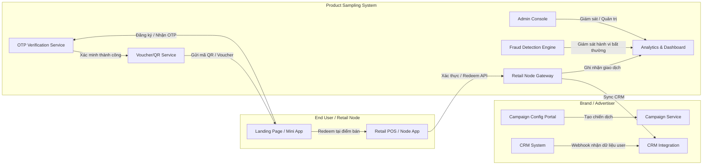

# 02-SRS-Part00-ChangeLog.md  
## Tài liệu: System Requirement Specification (Product Sampling Platform)

| Phiên bản | Ngày cập nhật | Người soạn | Vai trò | Mô tả thay đổi | Người duyệt | Ghi chú |
|:-----------|:---------------|:-------------|:---------|:----------------|:--------------|:---------|
| 0.1 | 2025-10-17 | Mark Nguyen | System Analyst – Product Sampling Team | Khởi tạo tài liệu SRS (Full IEEE Structure) | GPT-5 (PM/BA Assistant) | Bản khởi tạo đầu tiên |
| 0.2 | TBD | Mark Nguyen | System Analyst | Bổ sung các FR chi tiết (FR-001 → FR-013) | TBD |  |
| 0.3 | TBD | Dev Team | Developer / QA | Cập nhật test case và traceability matrix | TBD |  |
| 1.0 | TBD | Project Manager | PM | Xác nhận tài liệu SRS hoàn chỉnh để phát hành chính thức | TBD |  |

---

### ⚙️ Quy ước quản lý phiên bản

| Loại cập nhật | Ký hiệu | Ví dụ | Ghi chú |
|:---------------|:----------|:--------|:---------|
| Bản nháp | 0.x | 0.3 | Khi tài liệu còn đang trong quá trình hoàn thiện |
| Bản phát hành chính thức | 1.x | 1.0 | Sau khi được PM phê duyệt |
| Cập nhật nhỏ / sửa lỗi | 1.x.y | 1.0.2 | Dành cho bổ sung hoặc chỉnh sửa nhỏ |
| Phiên bản lớn | 2.x | 2.0 | Khi có thay đổi lớn về kiến trúc hoặc chức năng |

---

### 📌 Ghi chú sử dụng

- Mọi thay đổi trong nội dung SRS phải được ghi nhận tại bảng Change Log trên.  
- Người cập nhật cần ghi rõ **phần thay đổi, ngày, người duyệt**.  
- Bản `.md` này có thể được quản lý trực tiếp trên GitHub và sử dụng tag version (`v0.1`, `v1.0`...) cho từng commit tương ứng.

---

**Tình trạng hiện tại:**  
> Phiên bản `v0.1` – Hoàn tất khung SRS và Change Log, chuẩn bị gen phần 01 (Giới thiệu & Phạm vi hệ thống).

# 02-SRS-Part01-Introduction.md

## 1. Giới thiệu & Phạm vi

### 1.1 Mục đích tài liệu

Tài liệu này mô tả chi tiết phần "Giới thiệu & Phạm vi" cho SRS (System Requirement Specification) của dự án **Product Sampling System**. Mục tiêu của phần này là:

* Xác định mục đích chung và phạm vi của SRS.
* Làm rõ đối tượng người đọc và các bên liên quan (stakeholders).
* Trình bày các giả định, ràng buộc và các tiêu chuẩn áp dụng cho toàn bộ tài liệu.

Phần này là nguồn tham chiếu để các phần sau (Functional Requirements, Non-Functional Requirements, Architecture, API, Use Cases...) tuân thủ.

### 1.2 Phạm vi hệ thống

Hệ thống **Product Sampling System** (gọi tắt: PSS) là một nền tảng quản lý và triển khai chiến dịch phát sản phẩm mẫu (sampling) có khả năng:

* Tạo, cấu hình và quản lý chiến dịch phát mẫu (Campaign Management).
* Phát mã voucher/QR cho người dùng đã xác thực (OTP verification) để đổi lấy mẫu tại các retail node.
* Hỗ trợ cơ chế redeem online (POS) và offline (device queue & sync).
* Thu thập dữ liệu người dùng đã xác thực, đồng bộ về CRM của brand và cung cấp báo cáo & phân tích ROI.
* Quản lý mạng lưới retail partners (Sampling Network-as-a-Service) để giảm chi phí logistics cho brand.
* Phát hiện và ngăn chặn gian lận (fraud detection) qua rules + scoring.
* Hỗ trợ tích hợp (API/Webhook) với hệ thống bên thứ ba (CRM, POS, SMS provider).
* Hỗ trợ module quảng bá (banner ads / mini widget) trên landing page hoặc app tích hợp.
* Cung cấp dashboard trực quan và realtime analytics cho brand và admin.
* Cho phép xuất dữ liệu người dùng và kết quả chiến dịch (CSV/Excel/API).
* (Tùy chọn) Hỗ trợ gamification hoặc cơ chế điểm thưởng để tăng tương tác người dùng.

**Giới hạn phạm vi:**

* Hệ thống không bao gồm logistics thực tế (vận chuyển hàng mẫu) — brand chịu trách nhiệm vận chuyển đến retail node; hệ thống chỉ quản lý phân phối mã và reconciliation.
* Hệ thống không cung cấp dịch vụ thanh toán; chỉ xử lý voucher/redenption và báo cáo.

### 1.3 Stakeholders (Các bên liên quan)

| Vai trò               | Mô tả                                     | Phụ trách/Quan tâm                 |
| --------------------- | ----------------------------------------- | ---------------------------------- |
| Project Manager (PM)  | Quản lý tiến độ dự án, phê duyệt tài liệu | Tiến độ, phạm vi, quality          |
| System Analyst / BA   | Soạn SRS, mapping BRD -> FR               | Độ chính xác yêu cầu               |
| Brand (Customer)      | Tạo chiến dịch, nhận báo cáo              | Dễ dùng dashboard, data quality    |
| Dev Team              | Triển khai hệ thống                       | API spec, data model, acceptance   |
| QA / Tester           | Kiểm thử chức năng & NFR                  | Test cases, performance            |
| Retail Partner (Node) | Nhận/giao sample, redeem tại điểm bán     | Offline capability, reconciliation |
| Admin / Ops           | Vận hành hệ thống, xử lý dispute          | Logs, monitoring, security         |
| CRM Provider          | Hệ thống bên thứ ba nhận webhook          | Payload mapping, delivery SLA      |
| SMS/Email Provider    | Gửi OTP/Notification                      | Throughput, delivery rate          |

### 1.4 Các giả định (Assumptions)

* Brand chịu trách nhiệm cung cấp hàng mẫu vật lý đến các retail node; PSS chỉ quản lý mã & reconcile.
* Retail Node có thiết bị (smartphone / tablet / POS) có khả năng chạy ứng dụng node hoặc scan QR; nếu offline, có thể lưu queue.
* Có nhà cung cấp SMS/Email để gửi OTP (Twilio/MessageBird/Local providers).
* Mạng Internet tại retail node có thể intermittent; hệ thống cần hỗ trợ offline-first sync.
* Dữ liệu cá nhân (PII) cần tuân thủ luật bảo vệ dữ liệu (PDPA/GDPR nếu áp dụng).

### 1.5 Ràng buộc (Constraints)

* Hệ thống cần xử lý cao điểm lên tới 100.000 requests/phút tại API gateway.
* Phải đảm bảo OTP/Rate-limit để chống spam/bot.
* Voucher phải là single-use, atomic redeem để tránh double-claim.
* Redis sẽ là cache/queue; cần có fallback khi Redis down.

### 1.6 Tiêu chuẩn & Quy ước

* Tài liệu theo chuẩn IEEE 830 / ISO 29148.
* API trả về JSON, dùng HTTP status codes tiêu chuẩn (200, 201, 400, 401, 403, 404, 409, 500).
* Mã lỗi chuẩn: {"code": "ERR_XXX", "message": "...", "details": {...}}
* Các định danh: FR-xxx (Functional Requirement), NFR-xxx (Non-Functional), UC-xxx (Use Case), TC-xxx (Test Case).

---

### 1.7 Kế hoạch kiểm soát thay đổi

Mọi thay đổi yêu cầu phải được ghi vào Change Log (Part00) và được duyệt bởi PM trước khi merge. Các update cần kèm theo: mô tả thay đổi, impact analysis, và regression test plan.

---

*Hết phần 01 - Giới thiệu & Phạm vi*

# 02-SRS-Part02-References.md

## 2. Tài liệu tham khảo (References)

### 2.1 Tài liệu nội bộ dự án

| Mã | Tên tài liệu | Mô tả | Phiên bản | Người soạn |
|:----|:-----------------------------|:----------------------------------------|:------------|:--------------|
| BRD-01 | Business Requirement Document (`01-BRD.md`) | Mô tả yêu cầu nghiệp vụ tổng thể, phạm vi kinh doanh, stakeholders và mục tiêu sản phẩm. | 1.0 | Mark Nguyen |
| FEAT-01 | System Feature Tree & User Stories (`System_Feature_Tree_Grok.md`) | Phân rã chức năng hệ thống, user stories, và mapping MoSCoW. | 1.0 | Mark Nguyen |
| VISION-01 | Vision & Strategy Document (`Product-Sampling-Vision-and-Strategy Document.md`) | Định hướng chiến lược, tầm nhìn dài hạn, phân khúc khách hàng và giá trị hệ thống. | 1.0 | Mark Nguyen |
| PROB-01 | Problem Statement (`Problem.md`) | Mô tả bài toán, khó khăn hiện tại của thị trường sampling và insight người dùng. | 1.0 | Mark Nguyen |
| SRS-00 | Change Log (`02-SRS-Part00-ChangeLog.md`) | Theo dõi các thay đổi của SRS. | 0.1 | Mark Nguyen |

---

### 2.2 Tiêu chuẩn & quy chuẩn áp dụng

| Chuẩn / Tài liệu | Mục đích áp dụng | Nguồn |
|:------------------|:-----------------|:----------------|
| **IEEE 830** | Chuẩn mô tả yêu cầu phần mềm (Software Requirement Specification) | IEEE Standard 830-1998 |
| **ISO/IEC/IEEE 29148:2018** | Chuẩn quốc tế về tài liệu yêu cầu phần mềm | ISO/IEC/IEEE |
| **OWASP ASVS 4.0** | Chuẩn kiểm thử bảo mật ứng dụng web | https://owasp.org/ASVS/ |
| **GDPR / PDPA** | Tuân thủ bảo mật và xử lý dữ liệu cá nhân người dùng | EU Regulation 2016/679 |
| **RESTful API Design Guideline** | Chuẩn thiết kế API HTTP và quy tắc mã lỗi | RFC 9110 – HTTP Semantics |
| **Mermaid Specification** | Dùng để mô tả sơ đồ kiến trúc và use case | https://mermaid-js.github.io/ |

---

### 2.3 Tài liệu bên thứ ba

| Nhóm | Tài liệu / Hệ thống | Mục đích tích hợp | Ghi chú |
|:------|:----------------------|:-----------------|:---------|
| CRM | HubSpot / Salesforce API Docs | Nhận webhook khi người dùng xác thực thành công | Mapping theo JSON payload |
| SMS Provider | Twilio / Local SMS Gateway API | Gửi mã OTP, notification | Throughput ≥ 100 msg/s |
| Analytics | Google Analytics / Mixpanel | Ghi nhận event tương tác người dùng | Dạng optional |
| Cloud / Infra | Docker, Nginx, Redis, PostgreSQL, MongoDB | Cấu trúc hạ tầng triển khai | DevOps reference |

---

### 2.4 Các thuật ngữ viết tắt

| Viết tắt | Nghĩa | Ghi chú |
|:-----------|:---------|:----------|
| **PSS** | Product Sampling System | Hệ thống phát hàng mẫu |
| **FR** | Functional Requirement | Yêu cầu chức năng |
| **NFR** | Non-Functional Requirement | Yêu cầu phi chức năng |
| **UC** | Use Case | Kịch bản sử dụng |
| **TC** | Test Case | Tình huống kiểm thử |
| **PII** | Personally Identifiable Information | Dữ liệu cá nhân định danh |
| **OTP** | One-Time Password | Mã xác thực một lần |
| **POS** | Point of Sale | Điểm bán hàng |
| **ROI** | Return on Investment | Lợi tức đầu tư |
| **API** | Application Programming Interface | Giao diện lập trình ứng dụng |

---

**Tình trạng:**  
> Phần 02 - References hoàn tất. Đủ thông tin để trích dẫn cho toàn bộ các phần FR, NFR và Architecture sau.

# 02-SRS-Part03-OverallDescription.md

## 3. Tổng quan hệ thống (Overall Description)

### 3.1 Mục đích

Phần này mô tả bức tranh tổng thể của **Product Sampling System (PSS)** – hệ thống quản lý, phát và đo lường chiến dịch phát sản phẩm mẫu (sampling campaign). Mục tiêu là giúp người đọc (PM, Dev, QA, Brand, Retail Node) hiểu rõ vai trò, luồng tương tác, giới hạn và cách hệ thống vận hành trong ngữ cảnh toàn cục.

---

### 3.2 Tổng quan chức năng hệ thống

Hệ thống **PSS** là nền tảng "Sampling Network-as-a-Service", gồm các khối chính:

1. **Campaign Management** – Brand tạo, quản lý, cấu hình chiến dịch sampling.
2. **Landing Page / User Onboarding** – Người dùng truy cập, đăng ký nhận sample, nhập OTP.
3. **OTP & Verification Service** – Xác minh số điện thoại / email để tránh spam.
4. **Voucher / QR Code Management** – Sinh mã đổi quà, quản lý trạng thái, chống double-claim.
5. **Retail Node (POS)** – Cửa hàng hoặc điểm phân phối, xử lý redeem offline hoặc online.
6. **CRM Sync & Data Export** – Đồng bộ thông tin người dùng về hệ thống CRM của brand.
7. **Fraud Detection** – Phát hiện hành vi gian lận, duplicate, spoof location.
8. **Dashboard & Analytics** – Hiển thị hiệu quả, ROI, top-performing nodes.
9. **Admin & Operation Console** – Quản trị hệ thống, logs, phân quyền, xử lý dispute.

---

### 3.3 Bối cảnh hệ thống (System Context)

---

### 3.4 Các actor trong hệ thống

| Actor                           | Vai trò                             | Mô tả chi tiết                                                                |
| :------------------------------ | :---------------------------------- | :---------------------------------------------------------------------------- |
| **End User**                    | Người nhận mẫu                      | Truy cập landing page, nhập thông tin, xác thực OTP, redeem quà tại điểm bán. |
| **Retail Node (POS)**           | Điểm phân phối mẫu                  | Quét QR / mã voucher, xác nhận phát quà, xử lý offline queue.                 |
| **Brand / Advertiser**          | Chủ chiến dịch                      | Tạo campaign, cấu hình form đăng ký, nhận dữ liệu người dùng.                 |
| **CRM System (3rd party)**      | Hệ thống lưu trữ dữ liệu người dùng | Nhận webhook chứa thông tin đã xác thực.                                      |
| **Admin / Operator**            | Quản trị hệ thống                   | Giám sát logs, báo cáo, phân quyền, xử lý khiếu nại.                          |
| **Fraud Monitor**               | Engine hoặc nhân viên vận hành      | Theo dõi pattern hành vi gian lận, rule-based + ML-based scoring.             |
| **SMS / Notification Provider** | Dịch vụ bên thứ ba                  | Gửi OTP / thông báo chiến dịch.                                               |
| **Analytics Engine**            | Hệ thống BI / thống kê              | Tính ROI, CTR, conversion, và báo cáo cho brand.                              |

---

### 3.5 Biên giới hệ thống (System Boundaries)

| Thành phần                   | Nội bộ PSS | Ngoại vi / Tích hợp | Mô tả                                          |
| :--------------------------- | :--------- | :------------------ | :--------------------------------------------- |
| Landing Page                 | ✔️         |                     | Host bởi PSS, giao diện cho người dùng đăng ký |
| Campaign Service             | ✔️         |                     | Quản lý chiến dịch sampling                    |
| OTP Service                  | ✔️         | SMS Provider        | Gửi mã OTP qua API                             |
| Voucher Service              | ✔️         |                     | Sinh và quản lý mã QR/Voucher                  |
| Retail Node App              | ✔️         | POS Hardware        | Kết nối qua HTTPS hoặc local app bridge        |
| CRM Integration              |            | ✔️                  | Gửi webhook về hệ thống CRM brand              |
| Analytics Service            | ✔️         |                     | Tính toán và hiển thị báo cáo                  |
| Admin Console                | ✔️         |                     | Quản trị và vận hành hệ thống                  |
| Redis / PostgreSQL / MongoDB | ✔️         |                     | Hạ tầng lưu trữ & cache                        |

---

### 3.6 Giả định nghiệp vụ chính (Key Business Assumptions)

1. Người dùng chỉ được nhận **01 sample / chiến dịch / số điện thoại**.
2. Các node (POS) hoạt động trong môi trường không ổn định, hệ thống phải **tự động đồng bộ khi online trở lại**.
3. Tất cả thông tin user thu thập phải tuân thủ **PDPA / GDPR**.
4. Hệ thống phục vụ **≥10 brands đồng thời**, mỗi brand có hàng trăm nodes.
5. Redis là cache/queue; dữ liệu master nằm trong MongoDB và backup sang PostgreSQL.
6. Khi Redis lỗi, hệ thống chuyển sang “degraded mode” và sync lại khi Redis khôi phục.
7. API hoạt động stateless, hỗ trợ scale ngang.

---

### 3.7 Giới hạn và phụ thuộc

* Không chịu trách nhiệm vận chuyển hàng mẫu (logistics).
* Không bao gồm thanh toán hoặc refund.
* Phụ thuộc chất lượng dịch vụ SMS gateway và CRM webhook.
* Môi trường hoạt động: Cloud-native (Dockerized) – Redis, MongoDB, PostgreSQL, Nginx, Node.js.

---

### 3.8 Tổng kết phần này

Phần này cung cấp góc nhìn tổng thể về cấu trúc, bối cảnh, các actor và biên giới hệ thống.
Các phần tiếp theo (FR, NFR, Architecture) sẽ chi tiết hóa từng module tương ứng trong sơ đồ context.

---

**Tình trạng:**

> Hoàn tất phần 03 – Tổng quan hệ thống. Đã xác định đầy đủ actor, boundary, flow, và assumption nghiệp vụ.

# 02-SRS-Part04-FunctionalRequirements.md

## 4. Yêu cầu chức năng (Functional Requirements)

### 4.1 Tổng quan

Phần này mô tả toàn bộ các **yêu cầu chức năng (Functional Requirements)** của hệ thống **Product Sampling System (PSS)**, được định danh theo chuẩn **FR-XXX**.
Mỗi yêu cầu bao gồm: mục tiêu nghiệp vụ, mô tả, dữ liệu đầu vào/đầu ra, luồng xử lý chính, điều kiện trước/sau và tiêu chí chấp nhận.

---

### FR-001 – Quản lý chiến dịch (Campaign Management)

**Mục tiêu:** Cho phép brand tạo, chỉnh sửa, kích hoạt và theo dõi chiến dịch sampling.

**Mô tả:**

* Brand có thể tạo chiến dịch mới, nhập tên, mô tả, thời gian bắt đầu/kết thúc, số lượng mẫu, và form đăng ký.
* Cho phép upload banner, logo, mô tả ngắn, chọn ngôn ngữ và khu vực áp dụng.
* Hỗ trợ copy campaign cũ sang mới.

**Luồng chính:**

1. Brand truy cập portal → chọn “Tạo chiến dịch”.
2. Nhập thông tin chi tiết → lưu.
3. Hệ thống sinh `campaign_id`, lưu metadata vào MongoDB.
4. Nếu chọn “Kích hoạt”, hệ thống update trạng thái `active=true`.

**Điều kiện:**

* *Trước:* Brand đã xác thực.
* *Sau:* Campaign xuất hiện trên dashboard brand và landing page tương ứng.

**Ngoại lệ:**

* Nếu trùng tên chiến dịch → báo lỗi `ERR_CAMPAIGN_DUPLICATE`.
* Nếu ngày kết thúc < ngày bắt đầu → báo `ERR_DATE_INVALID`.

**Tiêu chí chấp nhận:**

* Brand tạo chiến dịch thành công và hiển thị trong danh sách.
* Campaign có thể chỉnh sửa khi chưa active.

---

### FR-002 – Landing Page & Đăng ký nhận mẫu

**Mục tiêu:** Cho phép người dùng đăng ký nhận mẫu sản phẩm thông qua landing page.

**Mô tả:**

* Mỗi chiến dịch có landing page riêng, có thể tùy chỉnh banner, màu, form đăng ký.
* Người dùng nhập họ tên, số điện thoại, email, đồng ý điều khoản.
* Gửi yêu cầu xác thực OTP.

**Luồng chính:**

1. User truy cập `campaign.landing-page.com`.
2. Nhập thông tin đăng ký.
3. Hệ thống gọi API gửi OTP.
4. Nếu hợp lệ → hiển thị bước xác minh OTP.

**Điều kiện:**

* *Trước:* Campaign đang ở trạng thái `active`.
* *Sau:* OTP được gửi và trạng thái user là `pending_verification`.

**Ngoại lệ:**

* Số điện thoại không hợp lệ → báo lỗi `ERR_INVALID_PHONE`.
* Nếu campaign hết hạn → hiển thị thông báo “Chiến dịch đã kết thúc”.

**Tiêu chí chấp nhận:**

* Landing page hiển thị đúng nội dung của chiến dịch.
* OTP được gửi đến người dùng trong ≤ 5 giây.

---

### FR-003 – OTP Verification Service

**Mục tiêu:** Xác minh người dùng qua mã OTP để chống spam/bot.

**Mô tả:**

* Nhận OTP người dùng nhập, đối chiếu với Redis cache.
* Mỗi OTP chỉ hợp lệ trong 2 phút.
* Nếu hợp lệ → cập nhật trạng thái user là `verified`.

**Luồng chính:**

1. User nhập OTP → gửi API `POST /verify-otp`.
2. Hệ thống so khớp OTP trong Redis.
3. Nếu đúng → xóa OTP, lưu user verified vào MongoDB.
4. Gửi webhook sang CRM.

**Ngoại lệ:**

* OTP hết hạn → `ERR_OTP_EXPIRED`.
* OTP sai quá 3 lần → `ERR_OTP_LIMIT_EXCEEDED`.

**Tiêu chí chấp nhận:**

* OTP xác minh thành công và CRM nhận dữ liệu trong ≤10s.
* Redis sync lại từ PostgreSQL nếu bị mất dữ liệu.

---

### FR-004 – Quản lý Voucher / QR Code

**Mục tiêu:** Phát mã voucher duy nhất cho mỗi người dùng verified.

**Mô tả:**

* Sinh mã QR duy nhất (`UUIDv4`).
* Lưu trạng thái `issued`, `redeemed`, `expired`.
* Gắn voucher với campaign_id và user_id.

**Luồng chính:**

1. Sau khi xác minh OTP thành công, hệ thống tạo mã voucher.
2. Mã được hiển thị cho người dùng và lưu vào DB.
3. Người dùng dùng mã này để redeem tại node.

**Ngoại lệ:**

* Nếu Redis lỗi → queue xử lý tạo voucher vào MongoDB.
* Nếu user đã có voucher → không cấp thêm.

**Tiêu chí chấp nhận:**

* Voucher là duy nhất, không trùng.
* Redeem một lần duy nhất.

---

### FR-005 – Redeem tại điểm bán (POS)

**Mục tiêu:** Cho phép nhân viên tại điểm bán quét QR và xác nhận phát hàng mẫu.

**Mô tả:**

* Ứng dụng POS hoặc Node App có thể hoạt động offline.
* Khi quét mã → kiểm tra trạng thái voucher.
* Nếu hợp lệ → đánh dấu `redeemed=true`.
* Nếu offline → lưu local queue, sync khi online.

**Ngoại lệ:**

* Voucher đã dùng → `ERR_VOUCHER_USED`.
* Voucher không tồn tại → `ERR_NOT_FOUND`.
* Node chưa được cấp quyền → `ERR_NODE_UNAUTHORIZED`.

**Tiêu chí chấp nhận:**

* Giao dịch redeem được ghi nhận, đồng bộ khi online.
* Retail node có thể xử lý ≥100 giao dịch/phút khi online.

---

### FR-006 – CRM Sync & Webhook Integration

**Mục tiêu:** Gửi dữ liệu user verified sang hệ thống CRM của brand.

**Mô tả:**

* Khi user verified, hệ thống gửi webhook JSON payload sang CRM endpoint.
* Payload gồm user info, campaign_id, timestamp, voucher_id.

**Tiêu chí chấp nhận:**

* Gửi thành công trong ≤10s.
* Retry tối đa 3 lần nếu thất bại.
* Có cơ chế queue và DLQ (Dead Letter Queue).

---

### FR-007 – Fraud Detection

**Mục tiêu:** Phát hiện gian lận dựa trên rule và pattern.

**Mô tả:**

* Rule cơ bản: cùng IP / số điện thoại / thiết bị đăng ký > 3 lần trong 1h.
* Gắn cờ `fraud_suspect=true` vào hồ sơ user.
* Báo cáo đến admin dashboard.

**Tiêu chí chấp nhận:**

* Phát hiện ≥95% hành vi duplicate.
* Không ảnh hưởng người dùng thật.

---

### FR-008 – Dashboard & Analytics

**Mục tiêu:** Cung cấp dashboard real-time cho brand và admin.

**Mô tả:**

* Thống kê số lượt đăng ký, verified, redeem, ROI, top node.
* Cập nhật real-time từ Redis stream hoặc event bus.

**Tiêu chí chấp nhận:**

* Dashboard cập nhật dữ liệu trong ≤3s.
* Hỗ trợ export CSV / Excel.

---

### FR-009 – Quản lý Retail Node

**Mục tiêu:** Quản lý các điểm bán (node) tham gia chiến dịch.

**Mô tả:**

* Admin thêm node mới, nhập địa chỉ, khu vực, capacity.
* Gán node cho chiến dịch cụ thể.
* Node đăng nhập bằng token hoặc QR.

**Tiêu chí chấp nhận:**

* Node có thể hoạt động online/offline.
* Sync định kỳ 5 phút một lần.

---

### FR-010 – Xuất dữ liệu & Báo cáo

**Mục tiêu:** Cho phép brand tải dữ liệu người dùng và kết quả chiến dịch.

**Mô tả:**

* Brand chọn khoảng thời gian → hệ thống export CSV/Excel.
* File chứa user info, voucher status, node info, timestamps.

**Tiêu chí chấp nhận:**

* File export ≤10MB / yêu cầu.
* Dữ liệu khớp 100% với dashboard.

---

### FR-011 – Quản trị hệ thống (Admin)

**Mục tiêu:** Quản lý người dùng nội bộ, logs, quyền hạn và dispute.

**Mô tả:**

* Admin có thể phân quyền: brand, node, operator.
* Theo dõi logs, báo cáo, xử lý lỗi.
* Khoá node nếu có gian lận.

**Tiêu chí chấp nhận:**

* Tất cả thao tác được log.
* Phân quyền RBAC hoạt động chính xác.

---

### FR-012 – Quản lý thông báo (Notifications)

**Mục tiêu:** Gửi thông báo đến người dùng qua SMS/email.

**Mô tả:**

* Khi redeem thành công, hệ thống gửi thông báo cảm ơn.
* Có thể bật/tắt theo từng campaign.

**Tiêu chí chấp nhận:**

* Gửi thông báo trong ≤10s.
* Ghi log message_id để tracking.

---

### FR-013 – Tích hợp quảng bá (Banner Ads / Widgets)

**Mục tiêu:** Cho phép hiển thị banner chiến dịch trên landing page hoặc site đối tác.

**Mô tả:**

* Admin upload banner (JPG/PNG, <500KB).
* Có thể gắn UTM hoặc tracking pixel.
* Hiển thị theo vị trí được cấu hình.

**Tiêu chí chấp nhận:**

* Banner hiển thị đúng layout.
* Click tracking chính xác ≥99%.

---

**Tình trạng:**

> Hoàn tất phần 04 – Yêu cầu chức năng. Bao gồm FR-001 → FR-013, có thể dùng để dev mapping API & test cases.
