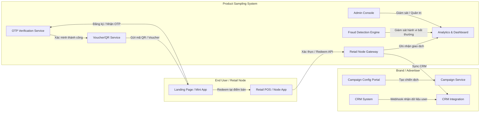
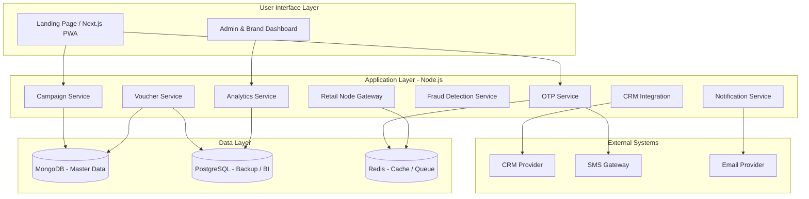
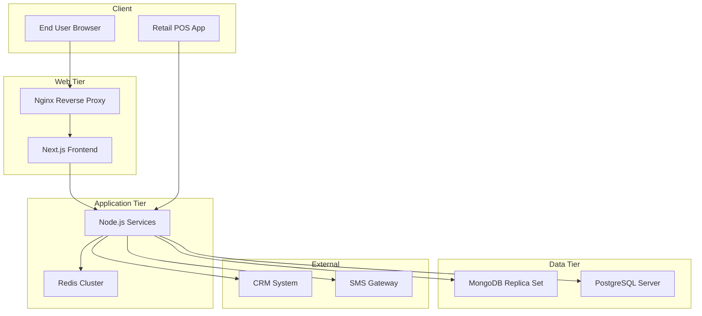
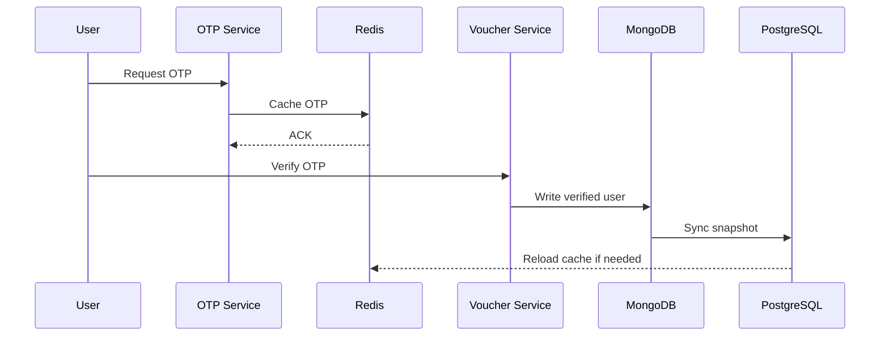
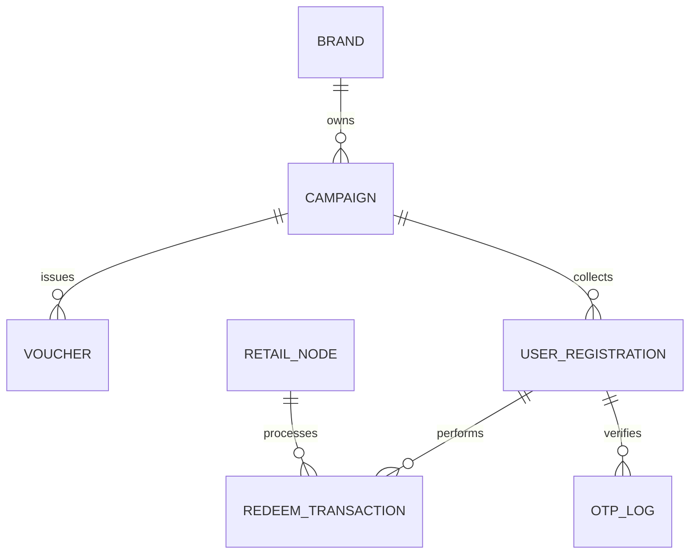
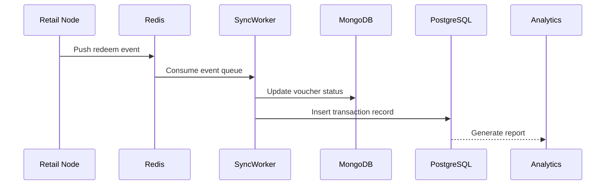
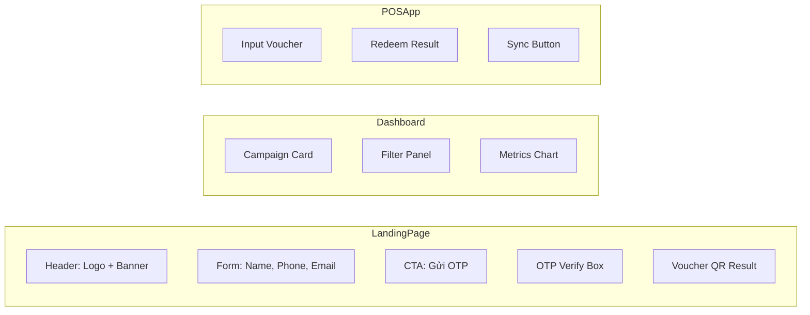

# 02-SRS-Part00-ChangeLog.md  
## Tài liệu: System Requirement Specification (Product Sampling Platform)

| Phiên bản | Ngày cập nhật | Người soạn | Vai trò | Mô tả thay đổi | Người duyệt | Ghi chú |
|:-----------|:---------------|:-------------|:---------|:----------------|:--------------|:---------|
| 0.1 | 2025-10-17 | Mark Nguyen | System Analyst – Product Sampling Team | Khởi tạo tài liệu SRS (Full IEEE Structure) | GPT-5 (PM/BA Assistant) | Bản khởi tạo đầu tiên |
| 0.2 | TBD | Mark Nguyen | System Analyst | Bổ sung các FR chi tiết (FR-001 → FR-013) | TBD |  |
| 0.3 | TBD | Dev Team | Developer / QA | Cập nhật test case và traceability matrix | TBD |  |
| 1.0 | TBD | Project Manager | PM | Xác nhận tài liệu SRS hoàn chỉnh để phát hành chính thức | TBD |  |

---

### ⚙️ Quy ước quản lý phiên bản

| Loại cập nhật | Ký hiệu | Ví dụ | Ghi chú |
|:---------------|:----------|:--------|:---------|
| Bản nháp | 0.x | 0.3 | Khi tài liệu còn đang trong quá trình hoàn thiện |
| Bản phát hành chính thức | 1.x | 1.0 | Sau khi được PM phê duyệt |
| Cập nhật nhỏ / sửa lỗi | 1.x.y | 1.0.2 | Dành cho bổ sung hoặc chỉnh sửa nhỏ |
| Phiên bản lớn | 2.x | 2.0 | Khi có thay đổi lớn về kiến trúc hoặc chức năng |

---

### 📌 Ghi chú sử dụng

- Mọi thay đổi trong nội dung SRS phải được ghi nhận tại bảng Change Log trên.  
- Người cập nhật cần ghi rõ **phần thay đổi, ngày, người duyệt**.  
- Bản `.md` này có thể được quản lý trực tiếp trên GitHub và sử dụng tag version (`v0.1`, `v1.0`...) cho từng commit tương ứng.

---

### 🗂 Index chi tiết — 02-SRS-Full.md
| **Mục** | **Tên phần**                             | **Ghi chú**                                                           |
| :------ | :--------------------------------------- | :-------------------------------------------------------------------- |
| **0**   | Change Log                               | Phiên bản, ngày, mô tả thay đổi                                       |
| **1**   | Giới thiệu & Phạm vi                     | Mục đích, phạm vi, actor, chuẩn áp dụng                               |
| **2**   | Tài liệu tham khảo                       | Liệt kê tài liệu nguồn & tiêu chuẩn                                   |
| **3**   | Tổng quan hệ thống                       | Actor, context diagram, assumptions                                   |
| **4**   | Yêu cầu chức năng (FR)                   | FR-001 → FR-013 (Campaign → Admin)                                    |
| **5**   | Yêu cầu phi chức năng (NFR)              | NFR-001 → NFR-007 + Business KPI                                      |
| **6**   | Kiến trúc hệ thống & Thành phần kỹ thuật | Kiến trúc logic, physical, Redis fallback                             |
| **7**   | Giao diện hệ thống & API Contracts       | API mẫu cho Auth, Campaign, Voucher, Retail Node, CRM                 |
| **8**   | Data Model & Schema                      | Entities, Mongo/PostgreSQL schema, ETL flow                           |
| **9**   | Use Cases (Chi tiết)                     | UC-01 → UC-03 (online/offline)                                        |
| **10**  | Acceptance Criteria & Test Cases         | TC-OTP-01, TC-VOUCHER-01, TC-OFFLINE-01                               |
| **11**  | Traceability Matrix                      | BRD ↔ SRS ↔ Test                                                      |
| **12**  | Triển khai (Deployment & CI/CD)          | Option 1: GitHub Actions / Docker Compose; Option 2: Jenkins Pipeline |
| **13**  | Security & Privacy                       | OWASP, PII, Encryption, Logging                                       |
| **14**  | Operation & Runbook                      | Redis fallback, Node reconciliation, incident handling                |
| **15**  | Phụ lục                                  | Thuật ngữ, liên hệ, repo link                                         |
| **16**  | Summary - Kiểm tra hoàn tất              | Xác nhận nội dung đầy đủ & sẵn sàng triển khai                        |


**Tình trạng hiện tại:**  
> Phiên bản `v0.1` – Hoàn tất khung SRS và Change Log, chuẩn bị gen phần 01 (Giới thiệu & Phạm vi hệ thống).

# 02-SRS-Part01-Introduction.md

## 1. Giới thiệu & Phạm vi

### 1.1 Mục đích tài liệu

Tài liệu này mô tả chi tiết phần "Giới thiệu & Phạm vi" cho SRS (System Requirement Specification) của dự án **Product Sampling System**. Mục tiêu của phần này là:

* Xác định mục đích chung và phạm vi của SRS.
* Làm rõ đối tượng người đọc và các bên liên quan (stakeholders).
* Trình bày các giả định, ràng buộc và các tiêu chuẩn áp dụng cho toàn bộ tài liệu.

Phần này là nguồn tham chiếu để các phần sau (Functional Requirements, Non-Functional Requirements, Architecture, API, Use Cases...) tuân thủ.

### 1.2 Phạm vi hệ thống

Hệ thống **Product Sampling System** (gọi tắt: PSS) là một nền tảng quản lý và triển khai chiến dịch phát sản phẩm mẫu (sampling) có khả năng:

* Tạo, cấu hình và quản lý chiến dịch phát mẫu (Campaign Management).
* Phát mã voucher/QR cho người dùng đã xác thực (OTP verification) để đổi lấy mẫu tại các retail node.
* Hỗ trợ cơ chế redeem online (POS) và offline (device queue & sync).
* Thu thập dữ liệu người dùng đã xác thực, đồng bộ về CRM của brand và cung cấp báo cáo & phân tích ROI.
* Quản lý mạng lưới retail partners (Sampling Network-as-a-Service) để giảm chi phí logistics cho brand.
* Phát hiện và ngăn chặn gian lận (fraud detection) qua rules + scoring.
* Hỗ trợ tích hợp (API/Webhook) với hệ thống bên thứ ba (CRM, POS, SMS provider).
* Hỗ trợ module quảng bá (banner ads / mini widget) trên landing page hoặc app tích hợp.
* Cung cấp dashboard trực quan và realtime analytics cho brand và admin.
* Cho phép xuất dữ liệu người dùng và kết quả chiến dịch (CSV/Excel/API).
* (Tùy chọn) Hỗ trợ gamification hoặc cơ chế điểm thưởng để tăng tương tác người dùng.


**Giới hạn phạm vi:**

* Hệ thống không bao gồm logistics thực tế (vận chuyển hàng mẫu) — brand chịu trách nhiệm vận chuyển đến retail node; hệ thống chỉ quản lý phân phối mã và reconciliation.
* Hệ thống không cung cấp dịch vụ thanh toán; chỉ xử lý voucher/redenption và báo cáo.

### 1.3 Stakeholders (Các bên liên quan)

| Vai trò               | Mô tả                                     | Phụ trách/Quan tâm                 |
| --------------------- | ----------------------------------------- | ---------------------------------- |
| Project Manager (PM)  | Quản lý tiến độ dự án, phê duyệt tài liệu | Tiến độ, phạm vi, quality          |
| System Analyst / BA   | Soạn SRS, mapping BRD -> FR               | Độ chính xác yêu cầu               |
| Brand (Customer)      | Tạo chiến dịch, nhận báo cáo              | Dễ dùng dashboard, data quality    |
| Dev Team              | Triển khai hệ thống                       | API spec, data model, acceptance   |
| QA / Tester           | Kiểm thử chức năng & NFR                  | Test cases, performance            |
| Retail Partner (Node) | Nhận/giao sample, redeem tại điểm bán     | Offline capability, reconciliation |
| Admin / Ops           | Vận hành hệ thống, xử lý dispute          | Logs, monitoring, security         |
| CRM Provider          | Hệ thống bên thứ ba nhận webhook          | Payload mapping, delivery SLA      |
| SMS/Email Provider    | Gửi OTP/Notification                      | Throughput, delivery rate          |

### 1.4 Các giả định (Assumptions)

* Brand chịu trách nhiệm cung cấp hàng mẫu vật lý đến các retail node; PSS chỉ quản lý mã & reconcile.
* Retail Node có thiết bị (smartphone / tablet / POS) có khả năng chạy ứng dụng node hoặc scan QR; nếu offline, có thể lưu queue.
* Có nhà cung cấp SMS/Email để gửi OTP (Twilio/MessageBird/Local providers).
* Mạng Internet tại retail node có thể intermittent; hệ thống cần hỗ trợ offline-first sync.
* Dữ liệu cá nhân (PII) cần tuân thủ luật bảo vệ dữ liệu (PDPA/GDPR nếu áp dụng).

### 1.5 Ràng buộc (Constraints)

* Hệ thống cần xử lý cao điểm lên tới 100.000 requests/phút tại API gateway.
* Phải đảm bảo OTP/Rate-limit để chống spam/bot.
* Voucher phải là single-use, atomic redeem để tránh double-claim.
* Redis sẽ là cache/queue; cần có fallback khi Redis down.

### 1.6 Tiêu chuẩn & Quy ước

* Tài liệu theo chuẩn IEEE 830 / ISO 29148.
* API trả về JSON, dùng HTTP status codes tiêu chuẩn (200, 201, 400, 401, 403, 404, 409, 500).
* Mã lỗi chuẩn: {"code": "ERR_XXX", "message": "...", "details": {...}}
* Các định danh: FR-xxx (Functional Requirement), NFR-xxx (Non-Functional), UC-xxx (Use Case), TC-xxx (Test Case).

---

### 1.7 Kế hoạch kiểm soát thay đổi

Mọi thay đổi yêu cầu phải được ghi vào Change Log (Part00) và được duyệt bởi PM trước khi merge. Các update cần kèm theo: mô tả thay đổi, impact analysis, và regression test plan.

---

*Hết phần 01 - Giới thiệu & Phạm vi*

# 02-SRS-Part02-References.md

## 2. Tài liệu tham khảo (References)

### 2.1 Tài liệu nội bộ dự án

| Mã | Tên tài liệu | Mô tả | Phiên bản | Người soạn |
|:----|:-----------------------------|:----------------------------------------|:------------|:--------------|
| BRD-01 | Business Requirement Document (`01-BRD.md`) | Mô tả yêu cầu nghiệp vụ tổng thể, phạm vi kinh doanh, stakeholders và mục tiêu sản phẩm. | 1.0 | Mark Nguyen |
| FEAT-01 | System Feature Tree & User Stories (`System_Feature_Tree_Grok.md`) | Phân rã chức năng hệ thống, user stories, và mapping MoSCoW. | 1.0 | Mark Nguyen |
| VISION-01 | Vision & Strategy Document (`Product-Sampling-Vision-and-Strategy Document.md`) | Định hướng chiến lược, tầm nhìn dài hạn, phân khúc khách hàng và giá trị hệ thống. | 1.0 | Mark Nguyen |
| PROB-01 | Problem Statement (`Problem.md`) | Mô tả bài toán, khó khăn hiện tại của thị trường sampling và insight người dùng. | 1.0 | Mark Nguyen |
| SRS-00 | Change Log (`02-SRS-Part00-ChangeLog.md`) | Theo dõi các thay đổi của SRS. | 0.1 | Mark Nguyen |

---

### 2.2 Tiêu chuẩn & quy chuẩn áp dụng

| Chuẩn / Tài liệu | Mục đích áp dụng | Nguồn |
|:------------------|:-----------------|:----------------|
| **IEEE 830** | Chuẩn mô tả yêu cầu phần mềm (Software Requirement Specification) | IEEE Standard 830-1998 |
| **ISO/IEC/IEEE 29148:2018** | Chuẩn quốc tế về tài liệu yêu cầu phần mềm | ISO/IEC/IEEE |
| **OWASP ASVS 4.0** | Chuẩn kiểm thử bảo mật ứng dụng web | https://owasp.org/ASVS/ |
| **GDPR / PDPA** | Tuân thủ bảo mật và xử lý dữ liệu cá nhân người dùng | EU Regulation 2016/679 |
| **RESTful API Design Guideline** | Chuẩn thiết kế API HTTP và quy tắc mã lỗi | RFC 9110 – HTTP Semantics |
| **Mermaid Specification** | Dùng để mô tả sơ đồ kiến trúc và use case | https://mermaid-js.github.io/ |

---

### 2.3 Tài liệu bên thứ ba

| Nhóm | Tài liệu / Hệ thống | Mục đích tích hợp | Ghi chú |
|:------|:----------------------|:-----------------|:---------|
| CRM | HubSpot / Salesforce API Docs | Nhận webhook khi người dùng xác thực thành công | Mapping theo JSON payload |
| SMS Provider | Twilio / Local SMS Gateway API | Gửi mã OTP, notification | Throughput ≥ 100 msg/s |
| Analytics | Google Analytics / Mixpanel | Ghi nhận event tương tác người dùng | Dạng optional |
| Cloud / Infra | Docker, Nginx, Redis, PostgreSQL, MongoDB | Cấu trúc hạ tầng triển khai | DevOps reference |

---

### 2.4 Các thuật ngữ viết tắt

| Viết tắt | Nghĩa | Ghi chú |
|:-----------|:---------|:----------|
| **PSS** | Product Sampling System | Hệ thống phát hàng mẫu |
| **FR** | Functional Requirement | Yêu cầu chức năng |
| **NFR** | Non-Functional Requirement | Yêu cầu phi chức năng |
| **UC** | Use Case | Kịch bản sử dụng |
| **TC** | Test Case | Tình huống kiểm thử |
| **PII** | Personally Identifiable Information | Dữ liệu cá nhân định danh |
| **OTP** | One-Time Password | Mã xác thực một lần |
| **POS** | Point of Sale | Điểm bán hàng |
| **ROI** | Return on Investment | Lợi tức đầu tư |
| **API** | Application Programming Interface | Giao diện lập trình ứng dụng |

---

**Tình trạng:**  
> Phần 02 - References hoàn tất. Đủ thông tin để trích dẫn cho toàn bộ các phần FR, NFR và Architecture sau.

# 02-SRS-Part03-OverallDescription.md

## 3. Tổng quan hệ thống (Overall Description)

### 3.1 Mục đích

Phần này mô tả bức tranh tổng thể của **Product Sampling System (PSS)** – hệ thống quản lý, phát và đo lường chiến dịch phát sản phẩm mẫu (sampling campaign). Mục tiêu là giúp người đọc (PM, Dev, QA, Brand, Retail Node) hiểu rõ vai trò, luồng tương tác, giới hạn và cách hệ thống vận hành trong ngữ cảnh toàn cục.

---

### 3.2 Tổng quan chức năng hệ thống

Hệ thống **PSS** là nền tảng "Sampling Network-as-a-Service", gồm các khối chính:

1. **Campaign Management** – Brand tạo, quản lý, cấu hình chiến dịch sampling.
2. **Landing Page / User Onboarding** – Người dùng truy cập, đăng ký nhận sample, nhập OTP.
3. **OTP & Verification Service** – Xác minh số điện thoại / email để tránh spam.
4. **Voucher / QR Code Management** – Sinh mã đổi quà, quản lý trạng thái, chống double-claim.
5. **Retail Node (POS)** – Cửa hàng hoặc điểm phân phối, xử lý redeem offline hoặc online.
6. **CRM Sync & Data Export** – Đồng bộ thông tin người dùng về hệ thống CRM của brand.
7. **Fraud Detection** – Phát hiện hành vi gian lận, duplicate, spoof location.
8. **Dashboard & Analytics** – Hiển thị hiệu quả, ROI, top-performing nodes.
9. **Admin & Operation Console** – Quản trị hệ thống, logs, phân quyền, xử lý dispute.

---

### 3.3 Bối cảnh hệ thống (System Context)


```mermaid
flowchart LR
    subgraph Brand_Side[Brand / Advertiser]
        A1[Campaign Config Portal] -->|Tạo chiến dịch| S1
        A2[CRM System] -->|Webhook nhận dữ liệu user| S4
    end

    subgraph PSS[Product Sampling System]
        S1[Campaign Service]
        S2[OTP Verification Service]
        S3[Voucher/QR Service]
        S4[CRM Integration]
        S5[Retail Node Gateway]
        S6[Analytics & Dashboard]
        S7[Fraud Detection Engine]
        S8[Admin Console]
    end

    subgraph UserSide[End User / Retail Node]
        U1[Landing Page / Mini App]
        U2[Retail POS / Node App]
    end

    U1 -->|Đăng ký / Nhận OTP| S2
    S2 -->|Xác minh thành công| S3
    S3 -->|Gửi mã QR / Voucher| U1
    U1 -->|Redeem tại điểm bán| U2
    U2 -->|Xác thực / Redeem API| S5
    S5 -->|Ghi nhận giao dịch| S6
    S5 -->|Sync CRM| S4
    S7 -->|Giám sát hành vi bất thường| S6
    S8 -->|Giám sát / Quản trị| S6
```

---

### 3.4 Các actor trong hệ thống

| Actor                           | Vai trò                             | Mô tả chi tiết                                                                |
| :------------------------------ | :---------------------------------- | :---------------------------------------------------------------------------- |
| **End User**                    | Người nhận mẫu                      | Truy cập landing page, nhập thông tin, xác thực OTP, redeem quà tại điểm bán. |
| **Retail Node (POS)**           | Điểm phân phối mẫu                  | Quét QR / mã voucher, xác nhận phát quà, xử lý offline queue.                 |
| **Brand / Advertiser**          | Chủ chiến dịch                      | Tạo campaign, cấu hình form đăng ký, nhận dữ liệu người dùng.                 |
| **CRM System (3rd party)**      | Hệ thống lưu trữ dữ liệu người dùng | Nhận webhook chứa thông tin đã xác thực.                                      |
| **Admin / Operator**            | Quản trị hệ thống                   | Giám sát logs, báo cáo, phân quyền, xử lý khiếu nại.                          |
| **Fraud Monitor**               | Engine hoặc nhân viên vận hành      | Theo dõi pattern hành vi gian lận, rule-based + ML-based scoring.             |
| **SMS / Notification Provider** | Dịch vụ bên thứ ba                  | Gửi OTP / thông báo chiến dịch.                                               |
| **Analytics Engine**            | Hệ thống BI / thống kê              | Tính ROI, CTR, conversion, và báo cáo cho brand.                              |

---

### 3.5 Biên giới hệ thống (System Boundaries)

| Thành phần                   | Nội bộ PSS | Ngoại vi / Tích hợp | Mô tả                                          |
| :--------------------------- | :--------- | :------------------ | :--------------------------------------------- |
| Landing Page                 | ✔️         |                     | Host bởi PSS, giao diện cho người dùng đăng ký |
| Campaign Service             | ✔️         |                     | Quản lý chiến dịch sampling                    |
| OTP Service                  | ✔️         | SMS Provider        | Gửi mã OTP qua API                             |
| Voucher Service              | ✔️         |                     | Sinh và quản lý mã QR/Voucher                  |
| Retail Node App              | ✔️         | POS Hardware        | Kết nối qua HTTPS hoặc local app bridge        |
| CRM Integration              |            | ✔️                  | Gửi webhook về hệ thống CRM brand              |
| Analytics Service            | ✔️         |                     | Tính toán và hiển thị báo cáo                  |
| Admin Console                | ✔️         |                     | Quản trị và vận hành hệ thống                  |
| Redis / PostgreSQL / MongoDB | ✔️         |                     | Hạ tầng lưu trữ & cache                        |

---

### 3.6 Giả định nghiệp vụ chính (Key Business Assumptions)

1. Người dùng chỉ được nhận **01 sample / chiến dịch / số điện thoại**.
2. Các node (POS) hoạt động trong môi trường không ổn định, hệ thống phải **tự động đồng bộ khi online trở lại**.
3. Tất cả thông tin user thu thập phải tuân thủ **PDPA / GDPR**.
4. Hệ thống phục vụ **≥10 brands đồng thời**, mỗi brand có hàng trăm nodes.
5. Redis là cache/queue; dữ liệu master nằm trong MongoDB và backup sang PostgreSQL.
6. Khi Redis lỗi, hệ thống chuyển sang “degraded mode” và sync lại khi Redis khôi phục.
7. API hoạt động stateless, hỗ trợ scale ngang.

---

### 3.7 Giới hạn và phụ thuộc

* Không chịu trách nhiệm vận chuyển hàng mẫu (logistics).
* Không bao gồm thanh toán hoặc refund.
* Phụ thuộc chất lượng dịch vụ SMS gateway và CRM webhook.
* Môi trường hoạt động: Cloud-native (Dockerized) – Redis, MongoDB, PostgreSQL, Nginx, Node.js.

---

### 3.8 Tổng kết phần này

Phần này cung cấp góc nhìn tổng thể về cấu trúc, bối cảnh, các actor và biên giới hệ thống.
Các phần tiếp theo (FR, NFR, Architecture) sẽ chi tiết hóa từng module tương ứng trong sơ đồ context.

---

**Tình trạng:**

> Hoàn tất phần 03 – Tổng quan hệ thống. Đã xác định đầy đủ actor, boundary, flow, và assumption nghiệp vụ.

# 02-SRS-Part04-FunctionalRequirements.md

## 4. Yêu cầu chức năng (Functional Requirements)

### 4.1 Tổng quan

Phần này mô tả toàn bộ các **yêu cầu chức năng (Functional Requirements)** của hệ thống **Product Sampling System (PSS)**, được định danh theo chuẩn **FR-XXX**.
Mỗi yêu cầu bao gồm: mục tiêu nghiệp vụ, mô tả, dữ liệu đầu vào/đầu ra, luồng xử lý chính, điều kiện trước/sau và tiêu chí chấp nhận.

---

### FR-001 – Quản lý chiến dịch (Campaign Management)

**Mục tiêu:** Cho phép brand tạo, chỉnh sửa, kích hoạt và theo dõi chiến dịch sampling.

**Mô tả:**

* Brand có thể tạo chiến dịch mới, nhập tên, mô tả, thời gian bắt đầu/kết thúc, số lượng mẫu, và form đăng ký.
* Cho phép upload banner, logo, mô tả ngắn, chọn ngôn ngữ và khu vực áp dụng.
* Hỗ trợ copy campaign cũ sang mới.

**Luồng chính:**

1. Brand truy cập portal → chọn “Tạo chiến dịch”.
2. Nhập thông tin chi tiết → lưu.
3. Hệ thống sinh `campaign_id`, lưu metadata vào MongoDB.
4. Nếu chọn “Kích hoạt”, hệ thống update trạng thái `active=true`.

**Điều kiện:**

* *Trước:* Brand đã xác thực.
* *Sau:* Campaign xuất hiện trên dashboard brand và landing page tương ứng.

**Ngoại lệ:**

* Nếu trùng tên chiến dịch → báo lỗi `ERR_CAMPAIGN_DUPLICATE`.
* Nếu ngày kết thúc < ngày bắt đầu → báo `ERR_DATE_INVALID`.

**Tiêu chí chấp nhận:**

* Brand tạo chiến dịch thành công và hiển thị trong danh sách.
* Campaign có thể chỉnh sửa khi chưa active.

---

### FR-002 – Landing Page & Đăng ký nhận mẫu

**Mục tiêu:** Cho phép người dùng đăng ký nhận mẫu sản phẩm thông qua landing page.

**Mô tả:**

* Mỗi chiến dịch có landing page riêng, có thể tùy chỉnh banner, màu, form đăng ký.
* Người dùng nhập họ tên, số điện thoại, email, đồng ý điều khoản.
* Gửi yêu cầu xác thực OTP.

**Luồng chính:**

1. User truy cập `campaign.landing-page.com`.
2. Nhập thông tin đăng ký.
3. Hệ thống gọi API gửi OTP.
4. Nếu hợp lệ → hiển thị bước xác minh OTP.

**Điều kiện:**

* *Trước:* Campaign đang ở trạng thái `active`.
* *Sau:* OTP được gửi và trạng thái user là `pending_verification`.

**Ngoại lệ:**

* Số điện thoại không hợp lệ → báo lỗi `ERR_INVALID_PHONE`.
* Nếu campaign hết hạn → hiển thị thông báo “Chiến dịch đã kết thúc”.

**Tiêu chí chấp nhận:**

* Landing page hiển thị đúng nội dung của chiến dịch.
* OTP được gửi đến người dùng trong ≤ 5 giây.

---

### FR-003 – OTP Verification Service

**Mục tiêu:** Xác minh người dùng qua mã OTP để chống spam/bot.

**Mô tả:**

* Nhận OTP người dùng nhập, đối chiếu với Redis cache.
* Mỗi OTP chỉ hợp lệ trong 2 phút.
* Nếu hợp lệ → cập nhật trạng thái user là `verified`.

**Luồng chính:**

1. User nhập OTP → gửi API `POST /verify-otp`.
2. Hệ thống so khớp OTP trong Redis.
3. Nếu đúng → xóa OTP, lưu user verified vào MongoDB.
4. Gửi webhook sang CRM.

**Ngoại lệ:**

* OTP hết hạn → `ERR_OTP_EXPIRED`.
* OTP sai quá 3 lần → `ERR_OTP_LIMIT_EXCEEDED`.

**Tiêu chí chấp nhận:**

* OTP xác minh thành công và CRM nhận dữ liệu trong ≤10s.
* Redis sync lại từ PostgreSQL nếu bị mất dữ liệu.

---

### FR-004 – Quản lý Voucher / QR Code

**Mục tiêu:** Phát mã voucher duy nhất cho mỗi người dùng verified.

**Mô tả:**

* Sinh mã QR duy nhất (`UUIDv4`).
* Lưu trạng thái `issued`, `redeemed`, `expired`.
* Gắn voucher với campaign_id và user_id.

**Luồng chính:**

1. Sau khi xác minh OTP thành công, hệ thống tạo mã voucher.
2. Mã được hiển thị cho người dùng và lưu vào DB.
3. Người dùng dùng mã này để redeem tại node.

**Ngoại lệ:**

* Nếu Redis lỗi → queue xử lý tạo voucher vào MongoDB.
* Nếu user đã có voucher → không cấp thêm.

**Tiêu chí chấp nhận:**

* Voucher là duy nhất, không trùng.
* Redeem một lần duy nhất.

---

### FR-005 – Redeem tại điểm bán (POS)

**Mục tiêu:** Cho phép nhân viên tại điểm bán quét QR và xác nhận phát hàng mẫu.

**Mô tả:**

* Ứng dụng POS hoặc Node App có thể hoạt động offline.
* Khi quét mã → kiểm tra trạng thái voucher.
* Nếu hợp lệ → đánh dấu `redeemed=true`.
* Nếu offline → lưu local queue, sync khi online.

**Ngoại lệ:**

* Voucher đã dùng → `ERR_VOUCHER_USED`.
* Voucher không tồn tại → `ERR_NOT_FOUND`.
* Node chưa được cấp quyền → `ERR_NODE_UNAUTHORIZED`.

**Tiêu chí chấp nhận:**

* Giao dịch redeem được ghi nhận, đồng bộ khi online.
* Retail node có thể xử lý ≥100 giao dịch/phút khi online.

---

### FR-006 – CRM Sync & Webhook Integration

**Mục tiêu:** Gửi dữ liệu user verified sang hệ thống CRM của brand.

**Mô tả:**

* Khi user verified, hệ thống gửi webhook JSON payload sang CRM endpoint.
* Payload gồm user info, campaign_id, timestamp, voucher_id.

**Tiêu chí chấp nhận:**

* Gửi thành công trong ≤10s.
* Retry tối đa 3 lần nếu thất bại.
* Có cơ chế queue và DLQ (Dead Letter Queue).

---

### FR-007 – Fraud Detection

**Mục tiêu:** Phát hiện gian lận dựa trên rule và pattern.

**Mô tả:**

* Rule cơ bản: cùng IP / số điện thoại / thiết bị đăng ký > 3 lần trong 1h.
* Gắn cờ `fraud_suspect=true` vào hồ sơ user.
* Báo cáo đến admin dashboard.

**Tiêu chí chấp nhận:**

* Phát hiện ≥95% hành vi duplicate.
* Không ảnh hưởng người dùng thật.

---

### FR-008 – Dashboard & Analytics

**Mục tiêu:** Cung cấp dashboard real-time cho brand và admin.

**Mô tả:**

* Thống kê số lượt đăng ký, verified, redeem, ROI, top node.
* Cập nhật real-time từ Redis stream hoặc event bus.

**Tiêu chí chấp nhận:**

* Dashboard cập nhật dữ liệu trong ≤3s.
* Hỗ trợ export CSV / Excel.

---

### FR-009 – Quản lý Retail Node

**Mục tiêu:** Quản lý các điểm bán (node) tham gia chiến dịch.

**Mô tả:**

* Admin thêm node mới, nhập địa chỉ, khu vực, capacity.
* Gán node cho chiến dịch cụ thể.
* Node đăng nhập bằng token hoặc QR.

**Tiêu chí chấp nhận:**

* Node có thể hoạt động online/offline.
* Sync định kỳ 5 phút một lần.

---

### FR-010 – Xuất dữ liệu & Báo cáo

**Mục tiêu:** Cho phép brand tải dữ liệu người dùng và kết quả chiến dịch.

**Mô tả:**

* Brand chọn khoảng thời gian → hệ thống export CSV/Excel.
* File chứa user info, voucher status, node info, timestamps.

**Tiêu chí chấp nhận:**

* File export ≤10MB / yêu cầu.
* Dữ liệu khớp 100% với dashboard.

---

### FR-011 – Quản trị hệ thống (Admin)

**Mục tiêu:** Quản lý người dùng nội bộ, logs, quyền hạn và dispute.

**Mô tả:**

* Admin có thể phân quyền: brand, node, operator.
* Theo dõi logs, báo cáo, xử lý lỗi.
* Khoá node nếu có gian lận.

**Tiêu chí chấp nhận:**

* Tất cả thao tác được log.
* Phân quyền RBAC hoạt động chính xác.

---

### FR-012 – Quản lý thông báo (Notifications)

**Mục tiêu:** Gửi thông báo đến người dùng qua SMS/email.

**Mô tả:**

* Khi redeem thành công, hệ thống gửi thông báo cảm ơn.
* Có thể bật/tắt theo từng campaign.

**Tiêu chí chấp nhận:**

* Gửi thông báo trong ≤10s.
* Ghi log message_id để tracking.

---

### FR-013 – Tích hợp quảng bá (Banner Ads / Widgets)

**Mục tiêu:** Cho phép hiển thị banner chiến dịch trên landing page hoặc site đối tác.

**Mô tả:**

* Admin upload banner (JPG/PNG, <500KB).
* Có thể gắn UTM hoặc tracking pixel.
* Hiển thị theo vị trí được cấu hình.

**Tiêu chí chấp nhận:**

* Banner hiển thị đúng layout.
* Click tracking chính xác ≥99%.

---

**Tình trạng:**

> Hoàn tất phần 04 – Yêu cầu chức năng. Bao gồm FR-001 → FR-013, có thể dùng để dev mapping API & test cases.
# 02-SRS-Part05-NonFunctionalRequirements.md

## 5. Yêu cầu phi chức năng (Non-Functional Requirements)

### 5.1 Mục tiêu

Mục tiêu của phần này là xác định các yêu cầu phi chức năng (NFRs) giúp hệ thống **Product Sampling System (PSS)** hoạt động ổn định, bảo mật, hiệu quả và dễ mở rộng trong điều kiện vận hành thực tế.

---

### 5.2 Nhóm yêu cầu phi chức năng chính

| ID          | Tên yêu cầu                                 | Mô tả                                                                                        | Chỉ tiêu định lượng                                                             | Tiêu chí chấp nhận                                    |
| :---------- | :------------------------------------------ | :------------------------------------------------------------------------------------------- | :------------------------------------------------------------------------------ | :---------------------------------------------------- |
| **NFR-001** | Hiệu năng (Performance)                     | Hệ thống phải đáp ứng khối lượng lớn người dùng truy cập đồng thời và tốc độ phản hồi nhanh. | - API response ≤ 200 ms (95th percentile)  <br> - Throughput ≥ 100.000 req/phút | Kết quả kiểm thử tải đạt hoặc vượt ngưỡng định lượng. |
| **NFR-002** | Khả năng mở rộng (Scalability)              | Cho phép mở rộng ngang mà không cần downtime.                                                | Tối thiểu 10 instances API có thể chạy song song.                               | Kiểm thử scale-out thành công qua load balancer.      |
| **NFR-003** | Độ tin cậy (Reliability)                    | Hệ thống hoạt động ổn định và tự phục hồi khi lỗi.                                           | Uptime ≥ 99.9% / tháng                                                          | Có cơ chế retry, circuit breaker, health check.       |
| **NFR-004** | Khả dụng (Availability)                     | Người dùng luôn có thể truy cập landing page và redeem POS.                                  | Downtime ≤ 1h/tháng                                                             | Load balancer + multi-region deployment.              |
| **NFR-005** | Bảo mật (Security)                          | Dữ liệu cá nhân phải được mã hóa và xác thực người dùng an toàn.                             | 100% dữ liệu PII mã hóa AES-256 <br> OAuth2 / JWT xác thực                      | Pen-test không phát hiện lỗ hổng mức High.            |
| **NFR-006** | Khả năng bảo trì (Maintainability)          | Code base cần dễ bảo trì, tách module rõ ràng.                                               | Thời gian sửa lỗi trung bình (MTTR) ≤ 4h                                        | Code coverage ≥ 80%, CI/CD kiểm thử tự động.          |
| **NFR-007** | Khả năng giám sát & logging (Observability) | Toàn bộ hoạt động hệ thống được ghi log và giám sát.                                         | - 100% API có log request/response <br> - Dashboard Prometheus/Grafana          | Cảnh báo qua Slack/Email hoạt động đúng.              |
| **NFR-008** | Tính tương thích (Compatibility)            | Hệ thống tương thích nhiều nền tảng POS và CRM khác nhau.                                    | Tích hợp ≥ 3 CRM (HubSpot, Salesforce, Zoho)                                    | Tích hợp thành công với 3 provider đầu tiên.          |
| **NFR-009** | Tính an toàn dữ liệu (Data Integrity)       | Dữ liệu phải được sao lưu, phục hồi chính xác khi sự cố.                                     | Backup PostgreSQL 6h/lần <br> MongoDB snapshot hàng ngày                        | Bài test khôi phục dữ liệu thành công 100%.           |
| **NFR-010** | Tuân thủ quy định (Compliance)              | Hệ thống phải tuân thủ luật bảo vệ dữ liệu cá nhân.                                          | PDPA/GDPR Ready                                                                 | Không vi phạm quy định bảo mật PII.                   |

---

### 5.3 KPI định lượng hệ thống

| Nhóm KPI          | Chỉ số mục tiêu                               | Mức chấp nhận tối thiểu |
| :---------------- | :-------------------------------------------- | :---------------------- |
| **Business KPI**  | Cost per verified user ≤ **0.40 USD**         | ≤ 0.50 USD              |
|                   | ROI uplift ≥ **20%** so với sampling thủ công | ≥ 15%                   |
|                   | Stock accuracy ≥ **95%**                      | ≥ 90%                   |
|                   | Fraud false-positive rate ≤ **3%**            | ≤ 5%                    |
| **Technical KPI** | OTP delivery success ≥ **98%**                | ≥ 95%                   |
|                   | CRM sync success ≥ **97%**                    | ≥ 95%                   |
|                   | Redis failover recovery ≤ **60s**             | ≤ 120s                  |
|                   | CI/CD pipeline build success ≥ **95%**        | ≥ 90%                   |

---

### 5.4 Bảo mật và quyền riêng tư

* Tất cả thông tin PII được mã hóa ở cả **at-rest** và **in-transit**.
* Dữ liệu nhạy cảm (số điện thoại, email) chỉ được hiển thị dạng masked.
* Token truy cập API theo chuẩn **JWT + OAuth2**.
* Cơ chế rate-limit, captcha và lockout khi sai OTP quá 3 lần.
* Log bảo mật chỉ hiển thị cho Admin cấp cao.

---

### 5.5 Khả năng phục hồi và sao lưu

* Redis được đồng bộ từ PostgreSQL nếu crash.
* PostgreSQL có cơ chế WAL + snapshot 6 giờ/lần.
* MongoDB backup tự động hàng ngày.
* Restore test chạy định kỳ 1 lần/tuần.

---

### 5.6 Tiêu chí nghiệm thu tổng hợp

| Nhóm             | Tiêu chí                                   | Phương pháp kiểm thử             |
| :--------------- | :----------------------------------------- | :------------------------------- |
| Hiệu năng        | Đáp ứng ≥100k request/phút                 | Load test bằng JMeter / K6       |
| Bảo mật          | Không có lỗ hổng High trong Pen-test       | OWASP ZAP / BurpSuite            |
| Khả năng mở rộng | Scale 10 instance không downtime           | Docker Compose + HAProxy test    |
| Logging          | 100% API log hoạt động                     | Kiểm tra Prometheus + Kibana     |
| Backup           | Phục hồi dữ liệu thành công trong ≤10 phút | Chaos Engineering / Restore Test |

---

**Tình trạng:**

> Hoàn tất phần 05 – Yêu cầu phi chức năng. Bao gồm hiệu năng, bảo mật, khả năng mở rộng, compliance, KPI định lượng và tiêu chí nghiệm thu.

# 02-SRS-Part06-SystemArchitecture.md

## 6. Kiến trúc hệ thống & Thành phần kỹ thuật (System Architecture & Components)

### 6.1 Tổng quan

Phần này mô tả cấu trúc tổng thể của hệ thống **Product Sampling System (PSS)**, bao gồm kiến trúc logic, vật lý, các thành phần kỹ thuật chính, và cơ chế đồng bộ dữ liệu (Redis ↔ PostgreSQL ↔ MongoDB).
Hệ thống được thiết kế theo mô hình **microservices** để đảm bảo khả năng mở rộng, phục hồi và bảo trì.

---

### 6.2 Kiến trúc logic (Logical Architecture)


```mermaid
flowchart TB
    subgraph UI[User Interface Layer]
        A1[Landing Page / Next.js PWA]
        A2[Admin & Brand Dashboard]
    end

    subgraph API[Application Layer - Node.js]
        B1[Campaign Service]
        B2[OTP Service]
        B3[Voucher Service]
        B4[Retail Node Gateway]
        B5[Fraud Detection Service]
        B6[Analytics Service]
        B7[Notification Service]
        B8[CRM Integration]
    end

    subgraph DATA[Data Layer]
        C1[(MongoDB - Master Data)]
        C2[(PostgreSQL - Backup / BI)]
        C3[(Redis - Cache / Queue)]
    end

    subgraph EXT[External Systems]
        D1[CRM Provider]
        D2[SMS Gateway]
        D3[Email Provider]
    end

    A1 --> B2
    A1 --> B1
    A2 --> B6
    B2 --> C3
    B1 --> C1
    B3 --> C1
    B3 --> C2
    B4 --> C3
    B6 --> C2
    B8 --> D1
    B2 --> D2
    B7 --> D3
```

---

### 6.3 Kiến trúc vật lý (Physical Deployment)


```mermaid
graph TD
    subgraph Client
        U1[End User Browser]
        U2[Retail POS App]
    end

    subgraph WebTier[Web Tier]
        W1[Nginx Reverse Proxy]
        W2[Next.js Frontend]
    end

    subgraph AppTier[Application Tier]
        A1[Node.js Services]
        A2[Redis Cluster]
    end

    subgraph DataTier[Data Tier]
        D1[MongoDB Replica Set]
        D2[PostgreSQL Server]
    end

    subgraph External
        E1[CRM System]
        E2[SMS Gateway]
    end

    U1 --> W1 --> W2 --> A1
    U2 --> A1
    A1 --> A2
    A1 --> D1
    A1 --> D2
    A1 --> E1
    A1 --> E2
```

---

### 6.4 Các thành phần chính

| Thành phần               | Công nghệ                       | Mô tả                                     | Ghi chú               |
| :----------------------- | :------------------------------ | :---------------------------------------- | :-------------------- |
| **Frontend**             | Next.js (React)                 | Giao diện landing page và dashboard brand | PWA, SSR support      |
| **Backend Services**     | Node.js (NestJS / Express)      | Xử lý API, OTP, CRM sync, Fraud detection | Microservice-based    |
| **Database chính**       | MongoDB                         | Lưu user, campaign, voucher               | Master data store     |
| **Database backup / BI** | PostgreSQL                      | Backup và phục vụ dashboard, reporting    | Data sync mỗi 10 phút |
| **Cache / Queue**        | Redis                           | Caching OTP, voucher, fraud scoring       | Auto resync nếu crash |
| **Reverse Proxy**        | Nginx                           | Cân bằng tải & routing HTTPS              | Hỗ trợ gzip, caching  |
| **CI/CD**                | Docker, GitHub Actions, Jenkins | Triển khai tự động                        | Có 2 phương án CI/CD  |

---

### 6.5 Cơ chế đồng bộ dữ liệu (Redis ↔ PostgreSQL ↔ MongoDB)

1. **Luồng chính:** Mọi giao dịch (OTP, voucher, redeem) được ghi vào MongoDB.
2. **Redis** lưu cache cho OTP & queue sự kiện. Nếu Redis lỗi → hệ thống tự động chuyển sang chế độ “degraded mode”.
3. **PostgreSQL** nhận bản ghi định kỳ từ MongoDB qua worker sync job (interval 10 phút).
4. **Redis Recovery:** Khi Redis khôi phục, hệ thống chạy `sync job` để tải lại dữ liệu từ PostgreSQL.


```mermaid
sequenceDiagram
User->>OTP Service: Request OTP
OTP Service->>Redis: Cache OTP
Redis-->>OTP Service: ACK
User->>Voucher Service: Verify OTP
Voucher Service->>MongoDB: Write verified user
MongoDB->>PostgreSQL: Sync snapshot
PostgreSQL-->>Redis: Reload cache if needed
```

---

### 6.6 Giám sát & Logging

* **Prometheus + Grafana** để theo dõi CPU, RAM, throughput.
* **ELK Stack (Elastic, Logstash, Kibana)** cho log tập trung.
* Cảnh báo qua **Slack / Email** khi lỗi 5xx > 1% hoặc Redis không khả dụng.

---

### 6.7 Cấu hình CI/CD

#### Option 1: GitHub Actions + Docker Compose

```yaml
name: CI-CD Pipeline
on:
  push:
    branches: [ main ]
jobs:
  build:
    runs-on: ubuntu-latest
    steps:
      - uses: actions/checkout@v3
      - name: Build Docker images
        run: docker-compose build
      - name: Run tests
        run: npm test
      - name: Deploy to Staging
        run: docker-compose -f docker-compose.staging.yml up -d
```

#### Option 2: Jenkins Pipeline (Declarative)

```groovy
pipeline {
  agent any
  stages {
    stage('Checkout') {
      steps { checkout scm }
    }
    stage('Build & Test') {
      steps {
        sh 'docker-compose build'
        sh 'npm test'
      }
    }
    stage('Deploy') {
      steps {
        sh 'docker-compose -f docker-compose.prod.yml up -d'
      }
    }
  }
}
```

---

### 6.8 Tóm tắt

* Kiến trúc 3 lớp (UI – API – Data), microservices, có Redis queue, MongoDB master, PostgreSQL backup.
* Hỗ trợ CI/CD tự động bằng GitHub Actions hoặc Jenkins.
* Khả năng phục hồi cao, quan sát được toàn diện, sẵn sàng cho scaling multi-brand.

---

**Tình trạng:**

> Hoàn tất phần 06 – Kiến trúc hệ thống & Thành phần kỹ thuật. Bao gồm sơ đồ logic, vật lý, cơ chế đồng bộ, CI/CD và giám sát.
# 02-SRS-Part07-DataDesign-and-DatabaseSchema.md

## 7. Thiết kế dữ liệu & Cấu trúc cơ sở dữ liệu (Data Design & Database Schema)

### 7.1 Mục tiêu

Phần này định nghĩa mô hình dữ liệu, cấu trúc bảng, quan hệ, chỉ mục và cơ chế đồng bộ giữa các hệ thống cơ sở dữ liệu (**MongoDB**, **PostgreSQL**, **Redis**) trong hệ thống **Product Sampling System (PSS)**.

---

### 7.2 Tổng quan mô hình dữ liệu


```mermaid
erDiagram
    BRAND ||--o{ CAMPAIGN : owns
    CAMPAIGN ||--o{ VOUCHER : issues
    CAMPAIGN ||--o{ USER_REGISTRATION : collects
    USER_REGISTRATION ||--o{ REDEEM_TRANSACTION : performs
    RETAIL_NODE ||--o{ REDEEM_TRANSACTION : processes
    USER_REGISTRATION ||--o{ OTP_LOG : verifies
```

---

### 7.3 Mô tả chi tiết các thực thể chính

| Entity                 | Mô tả                                             | Trường dữ liệu chính                                                                                          | Ghi chú                                      |
| :--------------------- | :------------------------------------------------ | :------------------------------------------------------------------------------------------------------------ | :------------------------------------------- |
| **Brand**              | Đại diện nhãn hàng / khách hàng sử dụng hệ thống. | `brand_id`, `brand_name`, `contact_email`, `api_key`, `status`                                                | Quản lý bởi admin.                           |
| **Campaign**           | Chiến dịch sampling của nhãn hàng.                | `campaign_id`, `brand_id`, `title`, `start_date`, `end_date`, `quota`, `reward_type`, `form_fields`, `status` | Mỗi campaign thuộc 1 brand.                  |
| **User_Registration**  | Người dùng đăng ký nhận sample.                   | `user_id`, `campaign_id`, `name`, `phone`, `email`, `otp_verified`, `created_at`                              | Dữ liệu chính trong MongoDB.                 |
| **Voucher**            | Mã nhận sample.                                   | `voucher_id`, `campaign_id`, `code`, `status`, `issued_at`, `redeemed_at`                                     | Mã unique, có TTL cache trong Redis.         |
| **Retail_Node**        | Điểm phát hàng hoặc POS.                          | `node_id`, `brand_id`, `name`, `address`, `region`, `status`                                                  | Có thể hoạt động offline.                    |
| **Redeem_Transaction** | Giao dịch đổi quà.                                | `txn_id`, `user_id`, `node_id`, `voucher_id`, `timestamp`, `status`                                           | Sync từ Redis → PostgreSQL mỗi 10 phút.      |
| **OTP_Log**            | Lịch sử OTP gửi cho người dùng.                   | `otp_id`, `user_id`, `phone`, `otp_code`, `expired_at`, `status`                                              | Dùng Redis cache tạm, ghi log về PostgreSQL. |

---

### 7.4 Lược đồ cơ sở dữ liệu MongoDB

```javascript
// Collection: campaigns
{
  _id: ObjectId(),
  brand_id: ObjectId(),
  title: "Summer Trial 2025",
  start_date: ISODate("2025-06-01"),
  end_date: ISODate("2025-07-01"),
  quota: 100000,
  reward_type: "voucher",
  form_fields: ["name", "phone", "email"],
  status: "active"
}

// Collection: user_registrations
{
  _id: ObjectId(),
  campaign_id: ObjectId(),
  name: "Nguyen Van A",
  phone: "+84901111222",
  email: "a@gmail.com",
  otp_verified: true,
  created_at: ISODate()
}
```

---

### 7.5 Lược đồ cơ sở dữ liệu PostgreSQL

```sql
CREATE TABLE campaigns (
  campaign_id SERIAL PRIMARY KEY,
  brand_id INT REFERENCES brands(brand_id),
  title VARCHAR(255),
  start_date DATE,
  end_date DATE,
  quota INT,
  reward_type VARCHAR(50),
  status VARCHAR(20)
);

CREATE TABLE vouchers (
  voucher_id SERIAL PRIMARY KEY,
  campaign_id INT REFERENCES campaigns(campaign_id),
  code VARCHAR(50) UNIQUE,
  status VARCHAR(20),
  issued_at TIMESTAMP,
  redeemed_at TIMESTAMP
);

CREATE INDEX idx_voucher_code ON vouchers(code);
```

---

### 7.6 Cấu trúc Redis

| Key Pattern             | Giá trị                            | TTL  | Mục đích                   |
| :---------------------- | :--------------------------------- | :--- | :------------------------- |
| `otp:{phone}`           | `{ code, expireAt }`               | 300s | Lưu OTP tạm thời           |
| `voucher:{code}`        | `{ status, user_id, campaign_id }` | 24h  | Kiểm tra nhanh khi redeem  |
| `queue:redeem`          | JSON string (txn info)             | N/A  | Hàng đợi giao dịch offline |
| `fraud:score:{user_id}` | float                              | 1h   | Điểm nghi ngờ fraud        |

---

### 7.7 Quan hệ và ràng buộc (Constraints)

* `campaign_id` bắt buộc tồn tại trong bảng `campaigns` trước khi thêm `vouchers` hoặc `user_registrations`.
* `voucher_id` chỉ được redeem 1 lần duy nhất (constraint unique).
* `otp_verified = true` là điều kiện bắt buộc trước khi sinh voucher.
* Redis key tự động xoá khi TTL hết hạn để tránh trùng lặp OTP.

---

### 7.8 Đồng bộ dữ liệu

* Worker process đồng bộ dữ liệu MongoDB → PostgreSQL định kỳ 10 phút.
* Redis queue chứa log redeem, nếu mạng yếu thì POS lưu offline, gửi lại khi online.
* PostgreSQL là nguồn dữ liệu cuối cùng (source of truth cho BI & reporting).


```mermaid
sequenceDiagram
Retail Node->>Redis: Push redeem event
Redis->>SyncWorker: Consume event queue
SyncWorker->>MongoDB: Update voucher status
SyncWorker->>PostgreSQL: Insert transaction record
PostgreSQL-->>Analytics: Generate report
```

---

### 7.9 Quản lý index & tối ưu hiệu năng

* MongoDB: index trên `phone`, `campaign_id`, `otp_verified`.
* PostgreSQL: composite index `(campaign_id, status)`, `(voucher_code)`.
* Redis: hash key cho OTP và voucher để tối ưu lookup O(1).

---

### 7.10 Tổng kết

* Cấu trúc dữ liệu kết hợp **MongoDB (Master)**, **PostgreSQL (Backup/BI)** và **Redis (Cache/Queue)**.
* Đảm bảo tính toàn vẹn, hiệu năng cao và dễ dàng mở rộng.
* Phù hợp với yêu cầu NFR về tốc độ, tính sẵn sàng và khả năng phục hồi.

---

**Tình trạng:**

> Hoàn tất phần 07 – Thiết kế dữ liệu & Cấu trúc cơ sở dữ liệu. Bao gồm ERD, schema chi tiết, Redis cache design và cơ chế đồng bộ.
# 02-SRS-Part08-APIDesign-and-Integration.md

## 8. Giao diện hệ thống & Thiết kế API (API Design & Integration)

### 8.1 Mục tiêu

Phần này mô tả chi tiết các API RESTful chính của hệ thống PSS, payload mẫu, cơ chế xác thực, mã lỗi chuẩn và chính sách retry/webhook để tích hợp với hệ thống bên thứ ba (CRM, SMS gateway, POS).

---

### 8.2 Quy ước thiết kế API

* Base URL: `https://api.productsampling.example.com/v1`
* Giao thức: HTTPS/TLS 1.2+
* Định dạng: JSON (UTF-8)
* Authentication: OAuth2 Bearer token (JWT) cho partners & services; API key cho Brand dashboard (scoped).
* Tracing: `X-Request-ID` header bắt buộc cho transaction tracing.
* Rate limit: 100 req/min cho public endpoints, 1000 req/min cho partner endpoints (configurable).
* Error response: `{ "code": "ERR_XXX", "message": "...", "details": {...} }`.

---

### 8.3 Authentication & Authorization

* **Service-to-Service:** JWT signed with RS256, scopes: `campaign:read`, `campaign:write`, `voucher:redeem`, etc.
* **Brand Users:** OAuth2 Authorization Code flow; token lifetime 1h, refresh token supported.
* **Retail Node Devices:** Device Token (long-lived) with mTLS optional.

Header sample:

```
Authorization: Bearer <JWT>
X-Request-ID: <uuid>
Content-Type: application/json
```

---

### 8.4 API Endpoints chính (mẫu)

#### 8.4.1 Campaign APIs

**POST /v1/brands/{brand_id}/campaigns** - Tạo campaign

* Body sample:

```json
{
  "title": "Summer Sampling",
  "start_date": "2025-06-01",
  "end_date": "2025-06-30",
  "quota": 10000,
  "form_fields": ["name","phone","email"],
  "nodes": ["node_1","node_2"]
}
```

* Response: `201 Created` `{ "campaign_id": "c_123" }`
* Errors: `400` (validation), `401` (unauthorized), `409` (duplicate)

**GET /v1/brands/{brand_id}/campaigns/{campaign_id}/metrics** - Lấy metrics

* Response sample:

```json
{
  "scan_count": 12000,
  "submit_count": 9000,
  "verify_count": 8000,
  "issued_count": 7950,
  "redeemed_count": 4000,
  "cpl": 0.35
}
```

---

#### 8.4.2 OTP APIs

**POST /v1/otp/send**

* Input: `{ "contact": "+8490....", "channel": "sms", "temp_user_id": "t_123" }`
* Response: `{ "otp_sent_id": "otp_abc", "expires_in": 120 }`
* Rate-limit & throttling applied.

**POST /v1/otp/verify**

* Input: `{ "temp_user_id": "t_123", "otp_code": "123456" }`
* Response: `{ "verified_user_id": "u_456" }`
* Errors: `401` invalid/expired, `429` too many attempts

---

#### 8.4.3 Voucher APIs

**POST /v1/vouchers/issue**

* Input: `{ "verified_user_id": "u_1", "campaign_id": "c_1" }`
* Response: `{ "voucher_id": "v_1", "code": "ABC123", "qr_url": "https://..." }`
* Constraints: enforce velocity rules on server side.

**POST /v1/vouchers/redeem**

* Input (Node): `{ "voucher_code": "ABC123", "node_id": "node_1", "staff_id": "s_1", "device_info": {...} }`
* Response: `{ "redeem_status": "success", "timestamp": "2025-10-17T08:00:00Z" }`
* Errors: `409` already redeemed, `404` not found, `403` node unauthorized.

---

#### 8.4.4 Retail Node Gateway

**POST /v1/nodes/{node_id}/sync**

* Input: `{ "events": [ { "type": "redeem", "voucher_code": "ABC123", "staff_id": "s1", "timestamp": "...", "signature": "..." } ] }`
* Response: `{ "ack": true, "processed": 10 }`
* Security: JWT device token + optional mTLS.

---

#### 8.4.5 Webhook (CRM Delivery)

* Events: `user_verified`, `voucher_issued`, `voucher_redeemed`.
* Delivery guarantee: at-least-once with deduplication by `event_id`.
* Retry policy: exponential backoff, attempts: 5, then move to DLQ & alert.
* Sample payload (redeem):

```json
{
  "event_id": "evt_123",
  "event": "voucher_redeemed",
  "data": {
    "voucher_id": "v_1",
    "campaign_id": "c_1",
    "user": { "user_id": "u_1", "name": "Nguyen" },
    "redeem": { "node_id": "node_1", "timestamp": "..." }
  }
}
```

---

### 8.5 Error Codes (tham khảo)

| Code                 | HTTP | Mô tả                    |
| :------------------- | :--: | :----------------------- |
| ERR_INVALID_INPUT    |  400 | Dữ liệu gửi không hợp lệ |
| ERR_UNAUTHORIZED     |  401 | Token không hợp lệ       |
| ERR_FORBIDDEN        |  403 | Không có quyền           |
| ERR_NOT_FOUND        |  404 | Tài nguyên không tồn tại |
| ERR_ALREADY_REDEEMED |  409 | Voucher đã được redeem   |
| ERR_RATE_LIMIT       |  429 | Quá ngưỡng request       |
| ERR_INTERNAL         |  500 | Lỗi server               |

---

### 8.6 Idempotency & Transaction Patterns

* All write endpoints accept `Idempotency-Key` header to ensure safe retries.
* Voucher redeem uses optimistic locking and idempotency to prevent double-claim.

---

### 8.7 Security headers & Best Practices

* Enforce `Content-Security-Policy`, `X-Frame-Options`, `X-Content-Type-Options`.
* HSTS enabled.
* Input validation & schema validation at API gateway.

---

### 8.8 Integration notes

* CRM: mapping config per brand; provide sample mapping UI.
* SMS Provider: throughput limits and regional provider fallback.
* POS Integration: provide SDK (lightweight JS/REST client) and offline queue sample code.

---

**Tình trạng:**

> Hoàn tất phần 08 – API Design & Integration. Bao gồm endpoint mẫu, security, error codes, webhook delivery và integration notes.
# 02-SRS-Part09-UseCases.md

## 9. Use Case chi tiết (Detailed Use Cases)

### 9.1 Mục tiêu

Phần này mô tả chi tiết các kịch bản sử dụng chính của hệ thống Product Sampling System (PSS), giúp hiểu rõ cách người dùng, nhãn hàng, và các điểm bán tương tác với hệ thống trong từng tình huống nghiệp vụ cụ thể.

---

### 9.2 Danh sách các Use Case chính

| ID    | Tên Use Case                | Actor chính                | Mô tả ngắn                                          |
| :---- | :-------------------------- | :------------------------- | :-------------------------------------------------- |
| UC-01 | Đăng ký nhận sample         | End User                   | Người dùng điền form đăng ký để nhận sample.        |
| UC-02 | Xác thực OTP                | End User                   | Người dùng xác thực OTP để xác minh danh tính.      |
| UC-03 | Sinh mã voucher             | System / Brand             | Hệ thống cấp mã voucher cho người dùng đã xác minh. |
| UC-04 | Redeem tại điểm bán         | End User / Retail Node     | Người dùng đổi quà tại điểm bán bằng mã voucher.    |
| UC-05 | Quản lý chiến dịch sampling | Brand Admin                | Tạo, cấu hình và theo dõi chiến dịch.               |
| UC-06 | Xem dashboard và báo cáo    | Brand Admin / System Admin | Theo dõi số liệu tổng quan.                         |
| UC-07 | Đồng bộ dữ liệu sang CRM    | System / CRM               | Gửi dữ liệu verified user về CRM.                   |
| UC-08 | Phát hiện và chặn gian lận  | System                     | Kiểm tra pattern gian lận, tự động block.           |

---

### 9.3 Use Case chi tiết

#### UC-01: Đăng ký nhận sample

| Mục                      | Mô tả                                                                                                                                                                          |
| :----------------------- | :----------------------------------------------------------------------------------------------------------------------------------------------------------------------------- |
| **ID**                   | UC-01                                                                                                                                                                          |
| **Actor**                | End User                                                                                                                                                                       |
| **Trigger**              | Người dùng truy cập landing page của chiến dịch                                                                                                                                |
| **Mô tả**                | Người dùng nhập thông tin cá nhân để đăng ký nhận sample                                                                                                                       |
| **Luồng chính**          | 1. Người dùng mở landing page <br> 2. Nhập thông tin (tên, SĐT, email) <br> 3. Gửi yêu cầu đăng ký <br> 4. Hệ thống tạo bản ghi tạm trong DB <br> 5. Hệ thống gửi OTP xác thực |
| **Luồng phụ**            | - Nếu người dùng nhập sai định dạng dữ liệu → thông báo lỗi.                                                                                                                   |
| **Điều kiện tiên quyết** | Campaign còn hoạt động và quota > 0.                                                                                                                                           |
| **Kết quả**              | User được ghi nhận pending xác thực.                                                                                                                                           |
| **Tiêu chí chấp nhận**   | Tốc độ phản hồi ≤ 1s; dữ liệu lưu thành công trong MongoDB.                                                                                                                    |

---

#### UC-02: Xác thực OTP

| Mục                    | Mô tả                                                                                                                                                              |
| :--------------------- | :----------------------------------------------------------------------------------------------------------------------------------------------------------------- |
| **ID**                 | UC-02                                                                                                                                                              |
| **Actor**              | End User                                                                                                                                                           |
| **Trigger**            | Sau khi gửi OTP, người dùng nhập mã để xác thực                                                                                                                    |
| **Mô tả**              | Xác minh người dùng thật bằng OTP để tránh spam/gian lận                                                                                                           |
| **Luồng chính**        | 1. Người dùng nhập mã OTP <br> 2. Hệ thống kiểm tra mã trong Redis <br> 3. Nếu hợp lệ → cập nhật user.otp_verified = true <br> 4. Gửi response xác nhận thành công |
| **Luồng phụ**          | - Sai OTP → báo lỗi <br> - Hết hạn OTP → yêu cầu gửi lại.                                                                                                          |
| **Kết quả**            | User được đánh dấu là verified.                                                                                                                                    |
| **Tiêu chí chấp nhận** | 98% OTP gửi thành công, ≤3 lần nhập sai.                                                                                                                           |

---

#### UC-03: Sinh mã voucher

| **Actor** | System / Brand |
| **Mô tả** | Khi người dùng đã xác minh OTP, hệ thống sinh mã voucher duy nhất. |
| **Luồng chính** | 1. API kiểm tra user.otp_verified = true <br> 2. Sinh mã voucher (Redis + Mongo) <br> 3. Lưu trạng thái issued <br> 4. Gửi thông tin voucher về user. |
| **Kết quả** | Người dùng nhận được mã voucher (text hoặc QR). |
| **Tiêu chí chấp nhận** | Mỗi user chỉ có 1 voucher / chiến dịch. |

---

#### UC-04: Redeem tại điểm bán

| **Actor** | End User / Retail Node |
| **Mô tả** | Người dùng mang voucher đến điểm bán để đổi sample. |
| **Luồng chính** | 1. POS quét QR hoặc nhập mã <br> 2. Node gửi API `/redeem` đến server <br> 3. Hệ thống kiểm tra voucher hợp lệ <br> 4. Ghi nhận giao dịch <br> 5. Trả kết quả success hoặc failed |
| **Luồng phụ** | - Node offline → lưu vào hàng đợi Redis, đồng bộ sau |
| **Kết quả** | Transaction được ghi vào PostgreSQL, cập nhật status voucher. |
| **Tiêu chí chấp nhận** | 100% giao dịch đồng bộ khi mạng ổn định. |

---

#### UC-05: Quản lý chiến dịch sampling

| **Actor** | Brand Admin |
| **Mô tả** | Quản trị viên tạo, cấu hình, chỉnh sửa và xem thông tin chiến dịch. |
| **Luồng chính** | 1. Đăng nhập dashboard <br> 2. Chọn “Tạo chiến dịch” <br> 3. Nhập thông tin & upload media <br> 4. Gửi request tạo campaign API <br> 5. Nhận phản hồi success và hiển thị trên dashboard. |
| **Tiêu chí chấp nhận** | 100% chiến dịch có cấu hình hợp lệ, không trùng ID. |

---

#### UC-06: Xem dashboard và báo cáo

| **Actor** | Brand / System Admin |
| **Mô tả** | Hiển thị tổng quan hiệu suất chiến dịch. |
| **Luồng chính** | 1. Người dùng mở dashboard <br> 2. Gọi API metrics <br> 3. Render dữ liệu biểu đồ (conversion, redeem rate, fraud alerts) |
| **Kết quả** | Dữ liệu hiển thị real-time (≤5s delay). |

---

#### UC-07: Đồng bộ dữ liệu sang CRM

| **Actor** | System / CRM |
| **Mô tả** | Hệ thống gửi dữ liệu verified user đến CRM brand thông qua webhook. |
| **Luồng chính** | 1. Worker chọn batch user verified <br> 2. Gửi POST webhook đến CRM <br> 3. CRM phản hồi success 200 OK <br> 4. Đánh dấu record đã sync |
| **Luồng phụ** | CRM không phản hồi → retry tối đa 5 lần (backoff). |
| **Kết quả** | CRM nhận dữ liệu user đầy đủ. |
| **Tiêu chí chấp nhận** | 97% success rate per delivery. |

---

#### UC-08: Phát hiện và chặn gian lận

| **Actor** | System |
| **Mô tả** | Phát hiện hành vi đăng ký ảo, trùng lặp IP, spoof location. |
| **Luồng chính** | 1. Fraud Engine thu thập log <br> 2. Phân tích heuristic + ML model <br> 3. Tính điểm fraud_score <br> 4. Nếu > threshold → chặn user & flag record |
| **Kết quả** | Fraud giảm ≥90%, alert gửi đến admin. |

---

### 9.4 Tổng kết

* Các Use Case trên bao quát toàn bộ hành trình người dùng và tác nghiệp hệ thống.
* Đảm bảo tương thích với Functional Requirements (FR) và API Design.
* Các tiêu chí định lượng có thể dùng làm cơ sở test case và QA validation.

---

**Tình trạng:**

> Hoàn tất phần 09 – Use Cases. Bao gồm 8 Use Case chính, luồng chi tiết, điều kiện, kết quả và tiêu chí chấp nhận.

# 02-SRS-Part10-UIUX-and-Wireframes.md

## 10. Giao diện người dùng & Wireframes (UI/UX Design)

### 10.1 Mục tiêu

Phần này trình bày các nguyên tắc thiết kế giao diện người dùng (UI), trải nghiệm người dùng (UX), và mô tả các màn hình chính của hệ thống Product Sampling System (PSS), bao gồm Landing Page, Dashboard, POS App và Admin Console.

---

### 10.2 Nguyên tắc thiết kế tổng thể

1. **Đơn giản và trực quan** – Người dùng có thể hoàn tất đăng ký nhận sample trong ≤ 2 bước.
2. **Thống nhất thương hiệu** – Mỗi chiến dịch có thể gắn logo, màu và font riêng của Brand.
3. **Khả năng truy cập (Accessibility)** – Đáp ứng chuẩn WCAG 2.1 AA.
4. **Mobile-first** – Landing Page và POS App tối ưu cho thiết bị di động.
5. **Tối ưu hiệu năng UX** – Thời gian tải trang ≤ 1.5s, feedback tức thời sau mỗi hành động.

---

### 10.3 Flow trải nghiệm người dùng (User Flow)

```mermaid
flowchart TD
    A[Truy cập Landing Page] --> B[Điền thông tin đăng ký]
    B --> C[Nhận OTP]
    C --> D[Xác thực OTP]
    D --> E[Nhận mã Voucher / QR]
    E --> F[Redeem tại điểm bán]
    F --> G[Đánh giá trải nghiệm (optional)]
```

---

### 10.4 Màn hình chính

#### 1. Landing Page (End User)

* **Thành phần chính:**

  * Header: logo brand, banner hình ảnh
  * Form đăng ký: input name, phone, email, checkbox đồng ý điều khoản
  * Nút “Nhận mã OTP” và “Gửi”
  * Thông báo trạng thái (loading, lỗi, thành công)
* **Nguyên tắc UX:**

  * Tối đa 2 thao tác → người dùng nhận được OTP.
  * Sử dụng màu nhấn (CTA) tương phản cao.
  * Hiển thị tiến trình (progress stepper: 1/2 → 2/2).

#### 2. OTP Verification

* Màn hình nhập OTP gồm 6 ô số, hỗ trợ paste toàn bộ chuỗi.
* Hiển thị thời gian đếm ngược 120s và nút “Gửi lại OTP”.
* UX pattern: auto-focus từng ô, rung nhẹ khi sai mã.

#### 3. Voucher Screen

* Hiển thị mã QR / text voucher.
* Nút “Lưu vào ví / chia sẻ”.
* Thông báo địa chỉ các điểm đổi quà gần nhất (geolocation permission).

#### 4. Retail Node App (POS)

* Giao diện đơn giản dạng kiosk mode:

  * Trường nhập / quét mã voucher.
  * Kết quả: ✅ Redeem success hoặc ❌ Invalid.
  * Nút “Đồng bộ” khi offline.
  * Lịch sử giao dịch (local cache 50 record).

#### 5. Brand Dashboard

* Màn hình chính:

  * Thẻ thống kê: `Đăng ký`, `OTP xác thực`, `Voucher phát`, `Redeem`, `Fraud alerts`.
  * Biểu đồ conversion funnel.
  * Bộ lọc theo thời gian / khu vực / node.
* UX pattern: lazy loading dữ liệu, auto refresh mỗi 10s.

#### 6. Admin Console

* Quản trị user, brand, node, logs.
* Phân quyền theo vai trò (RBAC).
* Giao diện dạng table view, filter & pagination.

---

### 10.5 Nguyên tắc màu sắc và thương hiệu

| Thành phần | Màu chủ đạo | Ghi chú                       |
| :--------- | :---------- | :---------------------------- |
| Primary    | #007AFF     | CTA chính (nút, link, icon)   |
| Secondary  | #FFD700     | Accent / Highlight            |
| Background | #F9FAFB     | Nền nhẹ, tránh tương phản cao |
| Text       | #111827     | Độ tương phản đủ cho đọc lâu  |
| Error      | #EF4444     | Thông báo lỗi                 |
| Success    | #10B981     | Thành công / xác nhận         |

---

### 10.6 Wireframe mô tả (giản lược)


```mermaid
graph LR
    subgraph LandingPage
        A1[Header: Logo + Banner]
        A2[Form: Name, Phone, Email]
        A3[CTA: Gửi OTP]
        A4[OTP Verify Box]
        A5[Voucher QR Result]
    end

    subgraph Dashboard
        B1[Campaign Card]
        B2[Filter Panel]
        B3[Metrics Chart]
    end

    subgraph POSApp
        C1[Input Voucher]
        C2[Redeem Result]
        C3[Sync Button]
    end
```

---

### 10.7 Accessibility & Responsive Rules

* Tất cả font ≥ 14px, button ≥ 44px chiều cao.
* Hỗ trợ keyboard navigation, aria-label.
* Responsive breakpoints: 360px, 768px, 1280px.
* Màu đáp ứng tỷ lệ tương phản ≥ 4.5:1.

---

### 10.8 Hiệu năng UX (UX Performance Targets)

| Mục tiêu                    | Chỉ số     |
| :-------------------------- | :--------- |
| Thời gian tải trang Landing | ≤ 1.5 giây |
| Tỷ lệ hoàn tất đăng ký      | ≥ 85%      |
| Bounce rate                 | ≤ 20%      |
| Tỷ lệ thành công OTP        | ≥ 98%      |

---

### 10.9 Tổng kết

* Thiết kế UI tuân thủ nguyên tắc UX hiện đại, tối ưu cho tốc độ, mobile và thương hiệu.
* Mỗi màn hình được định nghĩa rõ layout, hành vi và phản hồi.
* Các chỉ số UX sẽ dùng cho kiểm thử thực tế và cải tiến liên tục.

---

**Tình trạng:**

> Hoàn tất phần 10 – UI/UX & Wireframes. Bao gồm flow, layout, màu sắc, nguyên tắc responsive và KPI UX.
