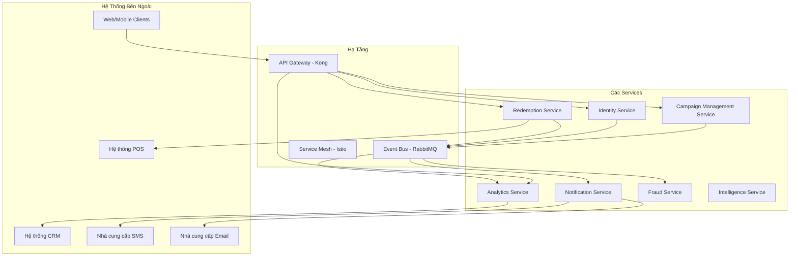
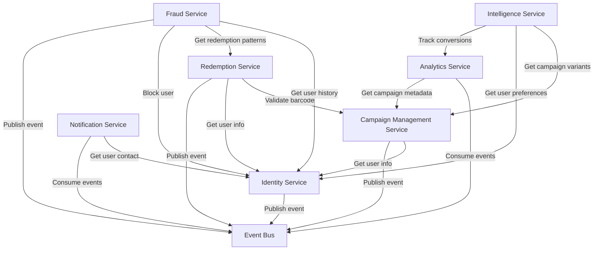

# PSP Product Sampling Platform - Cây Tính Năng

**Phiên bản**: 2.0 - Kiến trúc Microservices 🆕
**Cập nhật lần cuối**: 2025-10-20 🆕
**Chủ quản tài liệu**: Product Management Team

---

## 📋 Lịch Sử Thay Đổi 🆕

| Phiên bản | Ngày | Thay đổi | Tác giả |
|-----------|------|----------|---------|
| 1.0 | 2025-09-15 | Phiên bản đầu với phương án theo giai đoạn | PM Team |
| 2.0 🆕 | 2025-10-20 🆕 | **Chuyển sang kiến trúc microservices, bỏ phân chia giai đoạn, gộp services hợp lý (10→7), thêm Ads Format Management** 🆕 | PM Team 🆕 |

---

## 🎯 Tổng Quan

PSP (Product Sampling Platform) là nền tảng quản lý chiến dịch sampling sản phẩm, hỗ trợ thương hiệu tạo campaigns, phát hành barcodes, theo dõi redemptions và phân tích hiệu quả real-time.

### Phương Pháp Kiến Trúc 🆕

Hệ thống được thiết kế với **kiến trúc microservices** từ ngày đầu 🆕, bao gồm:

- ✅ **7 services độc lập** 🆕 (tối ưu từ 10 services ban đầu)
- ✅ **Database riêng biệt cho mỗi service** (polyglot persistence) 🆕
- ✅ **Giao tiếp event-driven** giữa các services 🆕
- ✅ **Deployment và scaling độc lập** theo từng service 🆕
- ✅ **Service mesh** cho khả năng quan sát và quản lý traffic 🆕

**Nguyên tắc gộp services**: 🆕
- **Campaign + Barcode**: Cùng domain (campaign operations), gọi nhau liên tục, dùng chung database schema 🆕
- **Auth + User**: Tightly coupled, auth cần user data ngay lập tức, tránh network latency 🆕
- **A/B Testing + Recommendation**: Cùng ML/Intelligence domain, share training data 🆕

### Phương Pháp Phát Triển 🆕

**Timeline**: 6-9 tháng (phát triển song song) 🆕

**Cơ Cấu Team**: 🆕
- **Team A (Core Operations)**: Campaign Management, Redemption services 🆕
- **Team B (Identity & Notification)**: Identity, Notification services 🆕
- **Team C (Analytics & Intelligence)**: Analytics, Fraud, Intelligence services 🆕

**Chiến Lược Deployment**: 🆕
- Deployment độc lập cho từng service 🆕
- Orchestration bằng Kubernetes 🆕
- CI/CD riêng cho mỗi repository 🆕

---

## 🏗️ Kiến Trúc Microservices 🆕

### Sơ Đồ Services 🆕

### Danh Mục Services 🆕

| # | Service | Repository 🆕 | Database 🆕 | Trách Nhiệm Chính 🆕 |
|---|---------|--------------|-------------|----------------------|
| 1 | **Campaign Management Service** 🆕 | `psp-campaign-service/` | PostgreSQL (`campaigns_db`) | Quản lý campaigns, barcodes, ads formats |
| 2 | **Identity Service** 🆕 | `psp-identity-service/` | PostgreSQL (`identity_db`) | Authentication, user management, consent |
| 3 | **Redemption Service** | `psp-redemption-service/` | PostgreSQL (`redemptions_db`) | Theo dõi barcode redemptions |
| 4 | **Analytics Service** | `psp-analytics-service/` | MongoDB (`analytics_db`) | Metrics real-time và báo cáo nâng cao |
| 5 | **Notification Service** | `psp-notification-service/` | Redis (queue) | Thông báo đa kênh, OTP, CRM sync |
| 6 | **Fraud Service** 🆕 | `psp-fraud-service/` | PostgreSQL (`fraud_db`) | Phát hiện và ngăn chặn gian lận |
| 7 | **Intelligence Service** 🆕 | `psp-intelligence-service/` | PostgreSQL + MongoDB | A/B testing và recommendations |

---

## 📦 Phân Loại Tính Năng

### Tổ Chức Tính Năng 🆕

Các tính năng được tổ chức theo độ phức tạp và giá trị kinh doanh: 🆕

1. **Tính Năng Cốt Lõi** (6 tính năng 🆕): Nền tảng của platform
2. **Tính Năng Vận Hành** (4 tính năng): Hoạt động hàng ngày
3. **Tính Năng Nâng Cao** (1 tính năng 🆕): Bảo mật và chống gian lận
4. **Tính Năng Thông Minh** (3 tính năng 🆕): Khả năng được hỗ trợ bởi ML

**Tổng cộng**: **14 tính năng** 🆕 trên **7 microservices** 🆕

---

## 1️⃣ Tính Năng Cốt Lõi

### 1.1. Campaign Management (Quản Lý Chiến Dịch)

**Service Owner**: Campaign Management Service 🆕

**Mô tả**:
Brand admins tạo và quản lý các chiến dịch sampling, từ draft → active → completed. Mỗi campaign được cấu hình với target audience, timeline và barcode pool assignment.

**Khả Năng Chính**:

- **CRUD Operations cho Campaign**
  - Tạo campaign với metadata (tên, mô tả, ngày, target audience)
  - Cập nhật chi tiết campaign (chỉ khi status = draft)
  - Soft delete campaigns
  - Hỗ trợ versioning cho campaign 🆕

- **Quản Lý Lifecycle**
  - **Draft**: Campaign đang được setup
  - **Active**: Campaign đang chạy (users có thể claim barcodes)
  - **Paused**: Tạm dừng (không issue barcodes mới)
  - **Completed**: Campaign đã kết thúc (không có hành động nào nữa)
  - **Archived**: Lưu trữ (cho báo cáo lịch sử)

- **Cấu Hình Campaign**
  - Kích thước target audience (số người tham gia dự kiến)
  - Phạm vi địa lý (global/group/custom locations)
  - Lịch trình campaign (ngày bắt đầu, ngày kết thúc, auto-expiry)
  - Tham số tracking UTM (utm_source, utm_medium, utm_campaign)
  - Custom metadata (trường JSON cho khả năng mở rộng)

**Quy Tắc Nghiệp Vụ**:
- Tên campaign phải unique trong cùng brand
- Ngày bắt đầu phải trước ngày kết thúc
- Không thể xóa campaign nếu có barcodes đã được issued
- Không thể publish campaign nếu chưa có barcode pool được assign
- Tự động pause campaign khi barcode pool hết

**User Stories**:
- **US-001.1**: Là Brand Admin, tôi muốn tạo campaign mới để khởi động chương trình sampling
- **US-001.2**: Là Brand Admin, tôi muốn publish campaign để users có thể claim barcodes
- **US-001.3**: Là Brand Admin, tôi muốn pause campaign tạm thời để điều chỉnh chiến lược
- **US-001.4**: Là Brand Admin, tôi muốn xem campaign performance metrics real-time

---

### 1.2. Barcode Management (Quản Lý Barcode)

**Service Owner**: Campaign Management Service 🆕

**Mô tả**:
Quản lý barcode inventory từ generation/import → assignment → redemption tracking. Hỗ trợ nhiều định dạng barcode (QR, Code128, Data Matrix) và batch operations.

**Khả Năng Chính**:

- **Tạo Barcode**
  - QR codes (định dạng chính, độ phổ biến cao trên mobile)
  - Code128 (barcode tuyến tính, hỗ trợ POS cũ)
  - Data Matrix (barcode 2D, mật độ cao)
  - Batch generation (lên đến 100K barcodes mỗi batch)
  - Validation giá trị unique (không trùng lặp)

- **Import Barcode**
  - Import file CSV/Excel
  - Validation (kiểm tra format, phát hiện trùng lặp)
  - Bulk import với xử lý async (cho files lớn)
  - Theo dõi trạng thái import (pending/processing/completed/failed)

- **Quản Lý Barcode Pool**
  - Tạo barcode pools (nhóm logic)
  - Gán pools cho campaigns
  - Theo dõi utilization của pool (số lượng available, số đã issued)
  - Cảnh báo replenishment của pool (khi available < ngưỡng)

- **Lifecycle Barcode**
  - **Unissued**: Barcode trong pool, chưa được assign
  - **Issued**: Barcode đã assigned cho user (qua campaign claim)
  - **Redeemed**: Barcode đã sử dụng tại POS (chỉ dùng một lần)
  - **Expired**: Barcode quá hạn (không thể redeem)
  - **Cancelled**: Barcode bị vô hiệu hóa (hành động thủ công)

**Quy Tắc Nghiệp Vụ**:
- Giá trị barcode phải unique trong toàn hệ thống
- Một barcode chỉ có thể redeemed một lần (single-use)
- Barcodes đã expired không thể redeemed
- Không thể xóa barcode pool nếu có campaigns đang active

**User Stories**:
- **US-002.1**: Là Brand Admin, tôi muốn import barcodes từ CSV để tái sử dụng codes hiện có
- **US-002.2**: Là Brand Admin, tôi muốn generate 10K QR codes để assign cho campaign
- **US-002.3**: Là Brand Admin, tôi muốn xem barcode pool utilization để lập kế hoạch replenishment
- **US-002.4**: Là System, tôi tự động đánh dấu barcodes expired sau ngày kết thúc campaign

---

### 1.3. User Authentication & Authorization (Xác Thực & Phân Quyền)

**Service Owner**: Identity Service 🆕

**Mô tả**:
Centralized authentication service với JWT tokens và RBAC. Hỗ trợ 6 user roles với các mức quyền khác nhau.

**Khả Năng Chính**:

- **Authentication**
  - Authentication dựa trên JWT (access token + refresh token)
  - Quản lý sessions (hỗ trợ multi-device)
  - Cơ chế refresh token (sliding expiration)
  - Logout an toàn (thu hồi token)

- **RBAC (Role-Based Access Control)**
  - **6 Roles**:
    1. **Platform Admin**: Quyền truy cập toàn hệ thống, quản lý tất cả brands
    2. **Brand Admin**: Quản lý campaigns, users, settings của brand riêng
    3. **Brand Staff**: Xem/chỉnh sửa campaigns, không thể xóa hoặc publish
    4. **Customer Account**: User đã đăng ký với login credentials
    5. **Customer**: User ẩn danh/guest (passwordless)
    6. **POS Staff**: Redeem barcodes tại các điểm bán lẻ
  - Truy cập dựa trên quyền (granular permissions cho mỗi role)
  - Gán role động
  - Phân cấp role (Platform Admin > Brand Admin > Brand Staff)

- **Tính Năng Bảo Mật**
  - Password hashing (bcrypt với salt)
  - Khóa tài khoản (sau 5 lần đăng nhập thất bại)
  - Hết hạn session (idle timeout: 30 phút)
  - Audit logging (theo dõi tất cả sự kiện auth)

**Quy Tắc Nghiệp Vụ**:
- JWT access token TTL: 15 phút
- JWT refresh token TTL: 7 ngày
- Số sessions đồng thời tối đa mỗi user: 5 thiết bị
- Độ dài password tối thiểu: 8 ký tự (với quy tắc độ phức tạp)

**User Stories**:
- **US-003.1**: Là Brand Admin, tôi muốn login bằng email/password để truy cập dashboard
- **US-003.2**: Là Platform Admin, tôi muốn gán roles cho users để kiểm soát quyền
- **US-003.3**: Là System, tôi tự động khóa tài khoản sau 5 lần đăng nhập thất bại để ngăn brute force
- **US-003.4**: Là User, tôi muốn refresh token để duy trì đăng nhập mà không cần nhập lại password

---

### 1.4. User Management (Quản Lý User)

**Service Owner**: Identity Service 🆕

**Mô tả**:
Quản lý user profiles, preferences và consent management. Hỗ trợ quy trình đăng ký user và self-service portal. 🆕

**Khả Năng Chính**:

- **Đăng Ký User**
  - Đăng ký bằng email/phone (passwordless cho customers)
  - Form multi-step (thông tin liên hệ → xác minh → hoàn tất)
  - Phát hiện trùng lặp (ngăn nhiều tài khoản cho cùng email/phone)
  - Liên kết brand (link user với brand cho role Customer Account)

- **User Profiles** 🆕
  - Quản lý profile (họ tên, liên hệ, avatar)
  - User preferences (ngôn ngữ, cài đặt thông báo) 🆕
  - Quản lý consent (consent tiếp thị, consent xử lý dữ liệu) 🆕
  - Theo dõi lịch sử consent (cho tuân thủ GDPR) 🆕
  - Export dữ liệu (quyền chuyển dữ liệu theo GDPR) 🆕

- **User Portal** 🆕
  - **My Barcodes**: Xem tất cả barcodes đã issued (active/redeemed/expired) 🆕
  - **Consent Settings**: Quản lý consent tiếp thị/xử lý dữ liệu 🆕
  - **Chỉnh Sửa Profile**: Cập nhật thông tin liên hệ, mật khẩu 🆕
  - **Xóa Tài Khoản**: Tự xóa tài khoản (quyền bị lãng quên theo GDPR) 🆕
  - **Hỗ Trợ PWA**: Truy cập offline, thêm vào home screen 🆕

**Quy Tắc Nghiệp Vụ**:
- Email phải unique cho mỗi brand (không phải globally unique)
- Số điện thoại phải tuân theo định dạng E.164
- Consent có thể thu hồi bất cứ lúc nào (được audit logged)
- Xóa tài khoản là soft delete (giữ lại cho audit/compliance)

**User Stories**:
- **US-004.1**: Là Customer, tôi muốn đăng ký bằng email để nhận barcode
- **US-004.2**: Là Customer, tôi muốn xem my barcodes trong portal để theo dõi trạng thái redemption 🆕
- **US-004.3**: Là Customer, tôi muốn cập nhật consent settings để kiểm soát marketing emails 🆕
- **US-004.4**: Là Customer, tôi muốn export dữ liệu của tôi để tuân thủ GDPR 🆕

---

### 1.5. OTP Verification (Xác Minh OTP)

**Service Owner**: Notification Service 🆕

**Mô tả**:
Tạo và xác minh OTP (One-Time Password) để validate email/phone của user. Hỗ trợ gửi qua SMS và email với rate limiting.

**Khả Năng Chính**:

- **Tạo OTP**
  - Mã số 6 chữ số
  - TTL: 5 phút (tự động hết hạn)
  - Tạo ngẫu nhiên an toàn bằng mật mã

- **Gửi OTP**
  - **SMS** (kênh chính qua Twilio)
  - **Email** (kênh dự phòng qua SendGrid)
  - Theo dõi trạng thái gửi (sent/delivered/failed)

- **Xác Minh OTP**
  - Validation mã (khớp chính xác)
  - Tối đa 3 lần xác minh cho mỗi OTP
  - Tự động vô hiệu hóa sau khi xác minh thành công

- **Rate Limiting**
  - Tối đa 3 yêu cầu OTP mỗi giờ cho mỗi user
  - Exponential backoff (1 phút → 5 phút → 15 phút)
  - Rate limiting dựa trên IP (ngăn lạm dụng)

**Quy Tắc Nghiệp Vụ**:
- Mã OTP phải là 6 chữ số
- OTP chỉ hợp lệ trong 5 phút
- Tối đa 3 yêu cầu gửi OTP mỗi giờ cho mỗi user
- Tối đa 3 lần thử xác minh cho mỗi mã OTP

**User Stories**:
- **US-005.1**: Là Customer, tôi muốn nhận OTP qua SMS để xác minh số điện thoại
- **US-005.2**: Là Customer, tôi muốn gửi lại OTP nếu không nhận được mã
- **US-005.3**: Là System, tôi giới hạn yêu cầu OTP để ngăn spam/lạm dụng

---

### 1.10. Ads Format Management (Quản Lý Định Dạng Quảng Cáo) 🆕

**Service Owner**: Campaign Management Service 🆕

**Mô tả**: 🆕
Quản lý các templates và formats cho campaign assets bao gồm landing pages, banners, emails và social media posts. Hỗ trợ A/B testing cho các variants. 🆕

**Khả Năng Chính**: 🆕

- **Template Library** 🆕
  - **Landing Page Templates**: Responsive templates với form fields customizable 🆕
  - **Email Templates**: HTML email templates với dynamic content 🆕
  - **Banner Templates**: Display ads với multiple sizes (300x250, 728x90, 1200x628) 🆕
  - **Social Media Templates**: Facebook, Instagram, Twitter post formats 🆕

- **Format Management** 🆕
  - **Kích Thước & Dimensions**: Quản lý specs cho mỗi format 🆕
  - **Responsive Design**: Mobile, tablet, desktop variants 🆕
  - **Asset Requirements**: Image dimensions, file sizes, copy limits 🆕

- **Asset Management** 🆕
  - **Image Library**: Upload, crop, resize images 🆕
  - **Video Library**: Video uploads với transcoding 🆕
  - **Copy Management**: Headline, body, CTA text variants 🆕
  - **Brand Guidelines**: Color palettes, fonts, logo variations 🆕

- **Version Control** 🆕
  - **Template Versioning**: Track changes, rollback capability 🆕
  - **Approval Workflow**: Draft → Review → Approved → Published 🆕
  - **Change History**: Audit trail cho template modifications 🆕

- **Preview & Testing** 🆕
  - **Multi-device Preview**: Xem template trên desktop/mobile/tablet 🆕
  - **A/B Variants**: Tạo và test variants cho optimization 🆕
  - **Link Preview**: Generate preview links để share với stakeholders 🆕

**Quy Tắc Nghiệp Vụ**: 🆕
- Template name phải unique trong brand 🆕
- Chỉ approved templates mới có thể publish 🆕
- Không thể xóa template đang được sử dụng bởi active campaigns 🆕
- Image uploads tối đa 10MB, video tối đa 100MB 🆕

**User Stories**: 🆕
- **US-010.1**: Là Brand Admin, tôi muốn tạo landing page template mới để sử dụng cho campaigns 🆕
- **US-010.2**: Là Brand Admin, tôi muốn upload và quản lý campaign assets (images, videos) 🆕
- **US-010.3**: Là Brand Admin, tôi muốn preview template trên multiple devices trước khi publish 🆕
- **US-010.4**: Là Brand Admin, tôi muốn tạo A/B variants của landing page để test conversion 🆕

---

## 2️⃣ Tính Năng Vận Hành

### 2.1. Barcode Redemption (Đổi Barcode)

**Service Owner**: Redemption Service 🆕

**Mô tả**:
Xử lý barcode redemptions tại các điểm POS, hỗ trợ cả quy trình redemption online và offline. Theo dõi lịch sử redemption và tích hợp với hệ thống POS.

**Khả Năng Chính**:

- **Redemption Online**
  - Validation barcode real-time (kiểm tra status, expiry)
  - Kiểm tra redemption trùng lặp (ngăn double-claim)
  - Tích hợp POS (gọi API đến hệ thống POS)
  - Xác nhận ngay lập tức (SMS/email cho customer)

- **Redemption Offline** (cho POS Staff)
  - **Thiết kế offline-first**: App POS hoạt động mà không cần internet
  - Lưu trữ local (IndexedDB) cho redemptions offline
  - Background sync khi online (retry tự động)
  - Giải quyết conflict (deduplication ở server-side)

- **Theo Dõi Redemption**
  - Timestamp redemption (chính xác đến giây)
  - Theo dõi location (ID điểm POS)
  - Nhận diện staff (ID của POS staff)
  - Metadata redemption (SKU sản phẩm, ID giao dịch từ POS)

**Quy Tắc Nghiệp Vụ**:
- Barcode chỉ có thể redeemed một lần (single-use)
- Barcodes đã expired không thể redeemed
- Redemptions offline được sync trong vòng 24 giờ
- Redemption không thể đảo ngược (chỉ audit trail)

**User Stories**:
- **US-006.1**: Là Customer, tôi muốn redeem barcode tại store để nhận product sample
- **US-006.2**: Là POS Staff, tôi muốn redeem barcode offline để xử lý khi mất internet
- **US-006.3**: Là POS Staff, tôi muốn xem lịch sử redemption để theo dõi giao dịch hàng ngày
- **US-006.4**: Là System, tôi sync redemptions offline tự động khi POS app back online

---

### 2.2. Real-time Analytics (Phân Tích Real-time)

**Service Owner**: Analytics Service 🆕

**Mô tả**:
Thu thập và phân tích dữ liệu từ tất cả services (qua event bus) để cung cấp metrics real-time, dashboards và advanced analytics. 🆕

**Khả Năng Chính**:

- **Dashboard Metrics**
  - Campaign performance (impressions, claims, redemptions)
  - Tỷ lệ conversion funnel (page view → form submit → OTP verify → barcode issued → redeemed)
  - Thống kê real-time (campaigns đang active, claims hôm nay, xu hướng theo giờ)
  - Phân bố địa lý (heatmap redemptions theo location)

- **Advanced Analytics** 🆕
  - **Cohort Analysis**: Nhóm users theo ngày đăng ký, phân tích retention 🆕
  - **User Journey Tracking**: Theo dõi đường đi của users từ landing → redemption 🆕
  - **Retention Metrics**: Tỷ lệ retention D1/D7/D30 🆕
  - **Predictive Analytics**: Mô hình ML dự đoán thành công campaign 🆕
  - **Attribution Analysis**: Theo dõi hiệu quả campaign theo UTM source 🆕

- **Export Dữ Liệu**
  - Export CSV/Excel (filter theo date range, campaign)
  - Export theo lịch trình (báo cáo daily/weekly)
  - Date ranges tùy chỉnh

**Quy Tắc Nghiệp Vụ**:
- Dữ liệu analytics được refresh mỗi 5 phút (near real-time)
- Dữ liệu lịch sử giữ lại 2 năm
- Aggregations được tính trước cho performance (hourly/daily rollups)

**User Stories**:
- **US-007.1**: Là Brand Admin, tôi muốn xem campaign funnel metrics để tối ưu conversion
- **US-007.2**: Là Brand Admin, tôi muốn export analytics data để chia sẻ với stakeholders
- **US-007.3**: Là Brand Admin, tôi muốn analyze cohorts để hiểu user retention 🆕
- **US-007.4**: Là Brand Admin, tôi muốn track user journey để xác định các drop-off points 🆕

---

### 2.3. CRM Integration (Tích Hợp CRM)

**Service Owner**: Notification Service 🆕

**Mô tả**:
Sync dữ liệu PSP với các hệ thống CRM bên ngoài (HubSpot, Salesforce) để duy trì unified customer view. Hỗ trợ bi-directional sync.

**Khả Năng Chính**:

- **CRMs Được Hỗ Trợ**
  - HubSpot (primary)
  - Salesforce (enterprise)

- **Các Thao Tác Sync**
  - **Contact Sync**: PSP users → CRM contacts (one-way)
  - **Campaign Sync**: PSP campaigns → CRM campaigns (one-way)
  - **Event Sync**: Redemptions → CRM activities (one-way)
  - **Bi-directional Sync**: Cập nhật user profile (two-way) 🆕

- **Lịch Trình Sync**
  - **Real-time Sync**: Event-driven (user registered → instant CRM sync)
  - **Batch Sync**: Theo lịch trình (mỗi 6 giờ cho bulk updates)
  - **Manual Trigger**: On-demand sync (cho troubleshooting)

**Quy Tắc Nghiệp Vụ**:
- Sync retries lên đến 3 lần khi thất bại (exponential backoff)
- Giải quyết conflict: Dữ liệu PSP thắng (PSP là source of truth cho campaigns)
- Trạng thái sync được theo dõi cho mỗi record (pending/success/failed)

**User Stories**:
- **US-008.1**: Là Brand Admin, tôi muốn sync users to HubSpot để quản lý contacts tập trung
- **US-008.2**: Là Brand Admin, tôi muốn sync redemptions to CRM để theo dõi customer activities
- **US-008.3**: Là System, tôi retry failed syncs tự động để đảm bảo tính nhất quán dữ liệu

---

### 2.4. Notification System (Hệ Thống Thông Báo)

**Service Owner**: Notification Service 🆕

**Mô tả**:
Hệ thống thông báo đa kênh hỗ trợ SMS, Email và Push notifications. 🆕 Xử lý OTP delivery, campaign alerts và transactional notifications.

**Khả Năng Chính**:

- **Các Kênh Thông Báo**
  - **SMS** (Twilio): OTP codes, xác nhận redemption
  - **Email** (SendGrid): Welcome emails, campaign alerts, reports
  - **Push Notifications** (Firebase): Campaign reminders, in-app alerts 🆕

- **Các Loại Thông Báo**
  - **Transactional**: OTP codes, xác nhận redemption (priority cao)
  - **Marketing**: Thông báo launch campaign (yêu cầu consent)
  - **System Alerts**: Thông báo lỗi, bảo trì hệ thống (cho admins)

- **Notification Queue**
  - Xử lý async (Redis queue)
  - Retry logic (exponential backoff: 1 phút → 5 phút → 30 phút)
  - Theo dõi delivery status (sent/delivered/failed/bounced)
  - Dead letter queue (cho notifications thất bại sau max retries)

**Quy Tắc Nghiệp Vụ**:
- Transactional notifications gửi ngay lập tức (không batching)
- Marketing notifications yêu cầu user consent (kiểm tra consent_marketing flag)
- Tối đa 3 retry attempts cho mỗi notification
- Delivery status được cập nhật real-time

**User Stories**:
- **US-009.1**: Là Customer, tôi muốn receive OTP qua SMS để xác minh phone
- **US-009.2**: Là Customer, tôi muốn receive xác nhận redemption qua email
- **US-009.3**: Là Brand Admin, tôi muốn receive push notification khi campaign đạt target 🆕
- **US-009.4**: Là System, tôi retry failed notifications tự động với exponential backoff

---

## 3️⃣ Tính Năng Nâng Cao

### 3.1. Fraud Detection (Phát Hiện Gian Lận) 🆕

**Service Owner**: Fraud Service 🆕

**Mô tả**: 🆕
Phát hiện và ngăn chặn các hành vi gian lận (multiple claims, bot attacks, fake accounts) để bảo vệ tính toàn vẹn của campaign và giảm fraud losses. 🆕

**Khả Năng Chính**: 🆕

- **Fraud Rules Engine** 🆕
  - **Multiple Claims**: Cùng device claims >3 barcodes trong 1 giờ 🆕
  - **Bot Detection**: Các mẫu hành vi bất thường (tốc độ, click patterns) 🆕
  - **Disposable Emails**: Chặn các dịch vụ email tạm (mailinator, guerrillamail) 🆕
  - **Velocity Checks**: Quá nhiều signups/claims từ cùng IP 🆕
  - **Location Anomalies**: Di chuyển không thể (claim ở Hà Nội, redeem ở HCMC sau 1 giờ) 🆕

- **ML-based Fraud Scoring** 🆕
  - **Real-time Scoring**: Tính toán fraud score (0-100) trên mọi hành động 🆕
  - **Feature Extraction**: Device fingerprint, IP, behavior, historical patterns 🆕
  - **Model Training**: Retrain hàng tuần trên các fraud patterns mới 🆕
  - **Score Thresholds**: 🆕
    - 0-50: Rủi ro thấp (cho phép) 🆕
    - 50-80: Rủi ro trung bình (manual review queue) 🆕
    - 80-100: Rủi ro cao (tự động chặn) 🆕

- **Device Fingerprinting** 🆕
  - Browser fingerprint (canvas, WebGL, fonts) 🆕
  - IP address tracking 🆕
  - Device ID (mobile app UUID) 🆕
  - Cross-reference với historical fraud devices 🆕

- **Fraud Actions** 🆕
  - **Auto-block**: Users với fraud score >80 🆕
  - **Manual Review**: Queue cho Brand Admin review (score 50-80) 🆕
  - **Alert Notifications**: Thông báo Brand Admin về suspicious activities 🆕
  - **Audit Trail**: Log tất cả fraud decisions cho compliance 🆕

**Quy Tắc Nghiệp Vụ**: 🆕
- Fraud score được cập nhật real-time trên mọi user action 🆕
- Auto-block users không thể claim barcodes (soft block, có thể appeal) 🆕
- Manual review queue max 24 giờ response time 🆕
- Fraud logs được giữ lại 1 năm (compliance) 🆕

**User Stories**: 🆕
- **US-010.1**: Là Brand Admin, tôi muốn xem fraud alerts để điều tra suspicious activities 🆕
- **US-010.2**: Là System, tôi tự động chặn users với fraud score >80 để ngăn lạm dụng 🆕
- **US-010.3**: Là Brand Admin, tôi muốn review flagged users thủ công để quyết định block/allow 🆕
- **US-010.4**: Là System, tôi theo dõi device fingerprints để phát hiện multi-accounting 🆕

---

## 4️⃣ Tính Năng Thông Minh

### 4.1. A/B Testing (Kiểm Thử A/B) 🆕

**Service Owner**: Intelligence Service 🆕

**Mô tả**: 🆕
Experiment framework cho campaigns để test các variants khác nhau (landing page, messaging, targeting) và xác định winner dựa trên statistical significance. 🆕

**Khả Năng Chính**: 🆕

- **Quản Lý Experiment** 🆕
  - Tạo experiments (control vs variants A/B/C) 🆕
  - Phân bổ traffic (50/50, 70/30, custom splits) 🆕
  - Lịch trình experiment (ngày bắt đầu/kết thúc) 🆕
  - Early stopping rules (nếu winner rõ ràng trước ngày kết thúc) 🆕

- **Variant Assignment** 🆕
  - **User-based Assignment**: Cùng user luôn nhận cùng variant 🆕
  - **Sticky Assignment**: Duy trì qua các sessions 🆕
  - **Randomization**: Hash-based assignment (deterministic) 🆕
  - **Targeting Rules**: Assign dựa trên user attributes (location, device) 🆕

- **Conversion Tracking** 🆕
  - Theo dõi goal completions cho mỗi variant (clicks, claims, redemptions) 🆕
  - Tính toán conversion rates 🆕
  - Theo dõi secondary metrics (time on page, bounce rate) 🆕

- **Statistical Analysis** 🆕
  - **Hypothesis Testing**: Two-sample t-test cho conversion rates 🆕
  - **P-value Calculation**: Statistical significance (p < 0.05) 🆕
  - **Confidence Intervals**: 95% CI cho conversion rate difference 🆕
  - **Sample Size Calculator**: Min sample size cho statistical power 🆕
  - **Winner Declaration**: Tự động declare khi p-value < 0.05 🆕

- **Experiment Dashboard** 🆕
  - Conversion rates real-time cho mỗi variant 🆕
  - Statistical significance indicator 🆕
  - Visualizations (funnel comparison, time series) 🆕

**Quy Tắc Nghiệp Vụ**: 🆕
- Tối thiểu 1000 users cho mỗi variant để statistical validity 🆕
- Experiment chạy tối thiểu 7 ngày (tránh day-of-week bias) 🆕
- Không thể thay đổi traffic allocation giữa experiment 🆕
- Winner chỉ declared nếu p-value < 0.05 🆕

**User Stories**: 🆕
- **US-011.1**: Là Brand Admin, tôi muốn tạo A/B test cho landing pages để tối ưu conversion 🆕
- **US-011.2**: Là Brand Admin, tôi muốn xem experiment results real-time để theo dõi progress 🆕
- **US-011.3**: Là System, tôi tính statistical significance tự động để declare winner 🆕
- **US-011.4**: Là Brand Admin, tôi muốn stop experiment sớm nếu variant clearly underperforming 🆕

---

### 4.2. Recommendation Engine (Công Cụ Gợi Ý) 🆕

**Service Owner**: Intelligence Service 🆕

**Mô tả**: 🆕
Hệ thống recommendation được hỗ trợ bởi ML gợi ý campaigns có liên quan cho users dựa trên preferences, lịch sử và behavior patterns. 🆕

**Khả Năng Chính**: 🆕

- **Campaign Recommendations** 🆕
  - **Personalized Suggestions**: Top 5 campaigns cho mỗi user 🆕
  - **Collaborative Filtering**: Users claim campaign A cũng claimed B 🆕
  - **Content-based Filtering**: Khớp user interests với campaign categories 🆕
  - **Hybrid Approach**: Kết hợp collaborative + content-based 🆕

- **User Segmentation** 🆕
  - **Behavior Segments**: Active claimers, occasional users, dormant users 🆕
  - **Interest Segments**: Beauty, food, tech enthusiasts 🆕
  - **Demographic Segments**: Tuổi, giới tính, location 🆕

- **ML Models** 🆕
  - **Matrix Factorization**: SVD cho collaborative filtering 🆕
  - **Neural Collaborative Filtering**: Deep learning approach 🆕
  - **LightFM**: Hybrid recommender 🆕
  - **Model Training**: Daily retraining trên new interaction data 🆕

- **Recommendation Tracking** 🆕
  - **Click-through Rate**: % users click recommended campaigns 🆕
  - **Conversion Rate**: % users claim sau recommendation 🆕
  - **Model Performance**: Precision@K, Recall@K, NDCG 🆕
  - **A/B Testing**: Test các recommendation algorithms khác nhau 🆕

**Quy Tắc Nghiệp Vụ**: 🆕
- Recommendations được refresh hàng ngày (batch job) 🆕
- Tối thiểu 10 user interactions cần cho personalized recommendations 🆕
- New users xem popular campaigns (cold start problem) 🆕
- Không recommend campaigns user đã claimed 🆕

**User Stories**: 🆕
- **US-012.1**: Là Customer, tôi muốn xem recommended campaigns relevant đến interests của tôi 🆕
- **US-012.2**: Là Brand Admin, tôi muốn theo dõi recommendation CTR để đo hiệu quả 🆕
- **US-012.3**: Là System, tôi retrain models hàng ngày để cải thiện recommendation quality 🆕
- **US-012.4**: Là Customer, tôi muốn xem "similar campaigns" khi viewing campaign details 🆕

---

### 4.3. Advanced Reporting (Báo Cáo Nâng Cao) 🆕

**Service Owner**: Analytics Service (extended) 🆕

**Mô tả**: 🆕
Custom report builder với drag-and-drop interface, scheduled reports và multiple export formats. 🆕

**Khả Năng Chính**: 🆕

- **Custom Report Builder** 🆕
  - **Drag-and-drop Designer**: Visual report builder (không cần SQL) 🆕
  - **Custom Metrics**: Chọn dimensions (campaign, date, location) và metrics (claims, redemptions, conversion rate) 🆕
  - **Data Source Selection**: Chọn từ campaigns, users, redemptions, analytics events 🆕
  - **Filters**: Date range, campaign IDs, user segments 🆕
  - **Aggregations**: Group by, sum, avg, count, percentiles 🆕

- **Scheduled Reports** 🆕
  - **Daily Reports**: Tự động tạo và email mỗi sáng (8 AM) 🆕
  - **Weekly Reports**: Mỗi thứ Hai với week-over-week comparison 🆕
  - **Monthly Reports**: Ngày đầu tháng với monthly trends 🆕
  - **Custom Schedules**: Lịch trình dựa trên cron (ví dụ: mỗi 2 giờ) 🆕
  - **Email Delivery**: Gửi đến multiple recipients 🆕

- **Export Formats** 🆕
  - **PDF**: Formatted reports với charts và tables 🆕
  - **Excel**: Raw data với multiple sheets 🆕
  - **CSV**: Simple data export 🆕
  - **Dashboard Embeds**: iframe embeds cho external sites 🆕

- **Report Templates** 🆕
  - **Pre-built Templates**: Campaign performance, redemption summary, user growth 🆕
  - **Custom Templates**: Lưu custom reports làm templates 🆕
  - **Template Sharing**: Chia sẻ templates trong team 🆕

**Quy Tắc Nghiệp Vụ**: 🆕
- Tối đa 50 custom reports cho mỗi brand 🆕
- Scheduled reports chạy tối đa mỗi giờ một lần 🆕
- Report data giới hạn 2 năm gần nhất 🆕
- PDF exports tối đa 100 trang 🆕

**User Stories**: 🆕
- **US-013.1**: Là Brand Admin, tôi muốn tạo custom report với specific metrics để analyze campaign ROI 🆕
- **US-013.2**: Là Brand Admin, tôi muốn schedule weekly reports để receive automatic updates 🆕
- **US-013.3**: Là Brand Admin, tôi muốn export report as PDF để chia sẻ với executives 🆕
- **US-013.4**: Là Brand Admin, tôi muốn lưu report làm template để tái sử dụng hàng tháng 🆕

---

## 🔗 Service Dependencies (Phụ Thuộc Services) 🆕

### Sơ Đồ Inter-Service Dependencies 🆕

### Ma Trận Phụ Thuộc 🆕

| Service | Phụ Thuộc Vào | Lý Do |
|---------|---------------|-------|
| **Campaign Management** | Identity, Event Bus | Validate user, publish events |
| **Identity** | Event Bus | Publish user events |
| **Redemption** | Campaign Management, Identity, Event Bus | Validate barcode/user, publish events |
| **Analytics** | Event Bus, Campaign Management | Consume events, get metadata |
| **Notification** | Identity, Event Bus | Get contact info, consume events |
| **Fraud** 🆕 | Identity, Redemption, Event Bus 🆕 | User history, patterns, block actions 🆕 |
| **Intelligence** 🆕 | Campaign Management, Identity, Analytics 🆕 | Variants, preferences, conversions 🆕 |

---

## 📊 Tổng Kết Tính Năng

### Số Lượng Tính Năng Theo Category 🆕

| Category | Số Lượng | Services |
|----------|----------|----------|
| **Tính Năng Cốt Lõi** | 6 🆕 | Campaign Management, Identity, Notification |
| **Tính Năng Vận Hành** | 4 | Redemption, Analytics, Notification |
| **Tính Năng Nâng Cao** 🆕 | 1 🆕 | Fraud 🆕 |
| **Tính Năng Thông Minh** 🆕 | 3 🆕 | Intelligence, Analytics 🆕 |
| **TỔNG CỘNG** | **14** 🆕 | **7 independent services** 🆕 |

### Ma Trận Service Ownership 🆕

| Service | Primary Features | Supporting Features 🆕 |
|---------|-----------------|------------------------|
| **Campaign Management Service** 🆕 | Campaign Management, Barcode Management, Ads Format Management 🆕 | A/B Testing (variants) 🆕 |
| **Identity Service** 🆕 | User Authentication, User Management 🆕 | Fraud detection (data) 🆕, Recommendations 🆕 |
| **Redemption Service** | Barcode Redemption | Fraud detection (patterns) 🆕 |
| **Analytics Service** | Real-time Analytics, Advanced Reporting 🆕 | A/B Testing (tracking) 🆕, Recommendations (training) 🆕 |
| **Notification Service** | OTP Verification, Notifications, CRM Integration | Fraud alerts 🆕 |
| **Fraud Service** 🆕 | Fraud Detection 🆕 | - |
| **Intelligence Service** 🆕 | A/B Testing, Recommendation Engine 🆕 | - |

---

## 🚀 Timeline Phát Triển 🆕

### Phát Triển Song Song Theo Team 🆕

**Tháng 1-2: Infrastructure & Foundation** 🆕
- Setup Kubernetes cluster 🆕
- Cấu hình Service mesh (Istio) 🆕
- CI/CD pipelines cho mỗi service 🆕
- Shared libraries (common, interfaces) 🆕
- Cấu hình API Gateway 🆕

**Tháng 2-6: Service Development (Song Song)** 🆕

**Team A (Core Operations)**: 🆕
- Campaign Management Service (Tháng 2-3) 🆕
  - Campaign CRUD, Barcode management, Ads formats 🆕
- Redemption Service (Tháng 4-5) 🆕
  - Online/offline redemption, POS integration 🆕
- Integration testing (Tháng 5-6) 🆕

**Team B (Identity & Notification)**: 🆕
- Identity Service (Tháng 2-4) 🆕
  - Auth, User management, Consent, Portal 🆕
- Notification Service (Tháng 3-5) 🆕
  - SMS/Email/Push, OTP, CRM sync 🆕
- Integration testing (Tháng 5-6) 🆕

**Team C (Analytics & Intelligence)**: 🆕
- Analytics Service (Tháng 2-4) 🆕
  - Real-time metrics, Advanced reporting 🆕
- Fraud Service (Tháng 3-5) 🆕
  - Rules engine, ML scoring 🆕
- Intelligence Service (Tháng 4-6) 🆕
  - A/B Testing, Recommendations 🆕

**Tháng 6-9: Integration, Testing, Rollout** 🆕
- Cross-service integration testing 🆕
- Load testing & performance tuning 🆕
- Security audits & penetration testing 🆕
- Staged production rollout (từng service một) 🆕
- User acceptance testing (UAT) 🆕

**Tổng Timeline**: **6-9 tháng** 🆕

---

## 📈 Success Metrics (Chỉ Số Thành Công) 🆕

### System-Level Metrics 🆕

- ✅ Tất cả 7 services deployed to production 🆕
- ✅ 99.9% uptime cho mỗi service (SLA) 🆕
- ✅ < 200ms API response time (95th percentile) 🆕
- ✅ Zero downtime deployments (blue-green) 🆕
- ✅ < 50ms service-to-service latency 🆕

### Business Metrics

- ✅ Hỗ trợ 100K-500K users/ngày 🆕
- ✅ 10K campaigns đồng thời active 🆕
- ✅ 95%+ barcode tracking accuracy
- ✅ < 2s dashboard load time
- ✅ 90%+ user satisfaction (NPS > 50)

### Advanced Feature Metrics 🆕

- ✅ **Fraud Detection**: <5% false positive rate 🆕
- ✅ **A/B Testing**: 95%+ statistical confidence 🆕
- ✅ **Recommendations**: >10% CTR, >5% conversion rate 🆕
- ✅ **Advanced Reports**: 80%+ adoption bởi Brand Admins 🆕

---

## 📚 Tài Liệu Liên Quan

- **01-BRD.md**: Business requirements document
- **02-SRS-V2.md**: Software requirements specification
- **Access_Control_Tree_Grok.md**: RBAC roles & permissions
- **Problem.md**: Problem statement & solution overview
- **SRS_STRUCTURE.md**: Full SRS document structure

---

## 📝 Glossary (Từ Điển Thuật Ngữ)

| Thuật Ngữ | Định Nghĩa |
|-----------|------------|
| **Service** 🆕 | Microservice độc lập với database riêng và deployment riêng 🆕 |
| **Event Bus** 🆕 | Message broker (RabbitMQ/Kafka) cho async communication 🆕 |
| **Service Mesh** 🆕 | Infrastructure layer (Istio) cho traffic management 🆕 |
| **Campaign** | Chương trình sampling được tạo bởi Brand Admin |
| **Barcode** | Mã unique (QR/Code128/DataMatrix) issued cho users |
| **Redemption** | Hành động sử dụng barcode tại POS để claim product sample |
| **OTP** | One-time password cho email/phone verification |
| **RBAC** | Role-based access control (6 roles) |
| **Fraud Score** 🆕 | ML-generated score (0-100) chỉ fraud likelihood 🆕 |
| **A/B Test** 🆕 | Experiment so sánh campaign variants 🆕 |
| **Recommendation** 🆕 | ML-generated campaign suggestions cho users 🆕 |
| **Ads Format** 🆕 | Templates cho campaign assets (landing pages, banners, emails) 🆕 |

---

## 📞 Liên Hệ & Phản Hồi

**Chủ Quản Tài Liệu**: Product Management Team
**Review Lần Cuối**: 2025-10-20 🆕
**Review Tiếp Theo**: 2025-11-20 🆕

Để có câu hỏi hoặc phản hồi về feature requirements, liên hệ:
- **Product Manager**: [pm@psp.vn]
- **Tech Lead**: [techlead@psp.vn]
- **Architecture Team**: [architecture@psp.vn] 🆕

---

**KẾT THÚC TÀI LIỆU**

**Phiên bản**: 2.0 - Kiến trúc Microservices 🆕
**Tổng Số Trang**: [Auto-generated]
**Tổng Số Tính Năng**: 14 features trên 7 services 🆕
