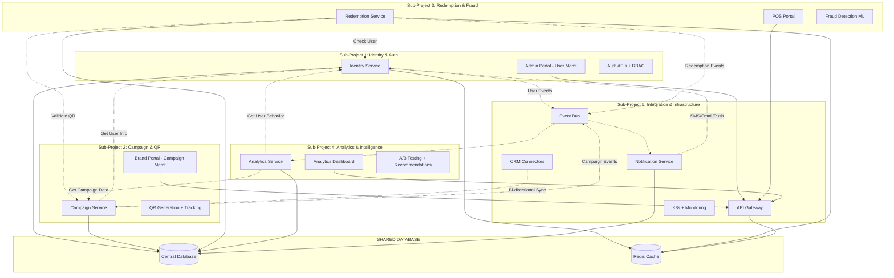

# 🎯 1. Sơ đồ Quan Hệ Giữa 5 Sub-Projects



---

# 🎯 2. Mapping Chi Tiết Với SRS Document

## **Sub-Project 1: Identity & Authentication Service**

### **SRS Mapping:**
```bash
├── Part04 - Functional Requirements
│   ├── FR-003: User Authentication ✅
│   ├── FR-004: User Management ✅
│   └── FR-005: OTP Verification ✅
├── Part06 - Architecture Design
│   ├── 06.2.2: Identity Service ✅
│   └── 06B.2.1.1: IAuthService ✅
├── Part07 - Database Design
│   ├── 07.2.1: User Table ✅
│   ├── 07.2.2: Role Table ✅
│   └── 07.2.3: Session Table ✅
├── Part08 - API Design
│   ├── 08.1.1: Authentication APIs ✅
│   └── 08.1.2: User Management APIs ✅
├── Part10 - User Interface
│   └── 10.3.1: Admin Portal - User Management ✅
```

### **Features Covered:**
- **6 RBAC Roles**: Platform Admin, Brand Admin, Brand Staff, Customer Account, Customer Guest, POS Staff
- **JWT + OTP**: Complete authentication flow
- **GDPR Compliance**: Data export/delete
- **Admin Portal**: User management interface

---

## **Sub-Project 2: Campaign & QR Management Service**

### **SRS Mapping:**
```bash
├── Part04 - Functional Requirements
│   ├── FR-001: Campaign Management ✅
│   ├── FR-002: Barcode Management ✅
│   └── FR-006: Ads Format Management ✅
├── Part06 - Architecture Design
│   ├── 06.2.2: Campaign Service ✅
│   └── 06B.2.1.2: ICampaignService ✅
├── Part07 - Database Design
│   ├── 07.3.1: Campaign Table ✅
│   ├── 07.3.2: Barcode Table ✅
│   └── 07.3.3: Ads_Format Table ✅
├── Part08 - API Design
│   ├── 08.2.1: Campaign APIs ✅
│   └── 08.2.2: Barcode APIs ✅
├── Part10 - User Interface
│   └── 10.4.1: Brand Portal - Campaign Management ✅
```

### **Features Covered:**
- **Campaign CRUD**: Complete lifecycle management
- **QR Generation**: với UTM tracking integration
- **Ads Format Templates**: Landing pages, banners, emails
- **Brand Portal**: Campaign management interface

---

## **Sub-Project 3: Redemption & Fraud Detection Service**

### **SRS Mapping:**
```bash
├── Part04 - Functional Requirements
│   ├── FR-007: Barcode Redemption ✅
│   └── FR-011: Fraud Detection ✅
├── Part06 - Architecture Design
│   ├── 06.2.2: Redemption Service ✅
│   ├── 06.2.2: Fraud Service ✅
│   └── 06B.2.1.3: IRedemptionService ✅
├── Part07 - Database Design
│   ├── 07.4.1: Redemption Table ✅
│   ├── 07.4.2: Fraud_Score Table ✅
│   └── 07.4.3: Device_Fingerprint Table ✅
├── Part08 - API Design
│   ├── 08.3.1: Redemption APIs ✅
│   └── 08.3.2: Fraud Detection APIs ✅
├── Part09 - Integration
│   └── 09.2.1: Scandit SDK Integration ✅
├── Part10 - User Interface
│   └── 10.5.1: POS Portal ✅
```

### **Features Covered:**
- **Online/Offline Redemption**: Complete flow
- **Scandit SDK**: QR scanning capability
- **ML Fraud Detection**: Rules engine + scoring (0-100)
- **Device Fingerprinting**: Abuse prevention
- **POS Portal**: Staff interface

---

## **Sub-Project 4: Analytics & Intelligence Service**

### **SRS Mapping:**
```bash
├── Part04 - Functional Requirements
│   ├── FR-008: Real Time Analytics ✅
│   ├── FR-012: A/B Testing ✅
│   ├── FR-013: Recommendation Engine ✅
│   └── FR-014: Advanced Reporting ✅
├── Part06 - Architecture Design
│   ├── 06.2.2: Analytics Service ✅
│   ├── 06.2.2: Intelligence Service ✅
│   └── 06B.2.1.4: IAnalyticsService ✅
├── Part07 - Database Design
│   ├── 07.5.1: Analytics_Event Table ✅
│   ├── 07.5.2: AB_Test Table ✅
│   └── 07.5.3: Recommendation Table ✅
├── Part08 - API Design
│   ├── 08.4.1: Analytics APIs ✅
│   ├── 08.4.2: A/B Testing APIs ✅
│   └── 08.4.3: Recommendation APIs ✅
├── Part10 - User Interface
│   └── 10.6.1: Analytics Dashboard ✅
```

### **Features Covered:**
- **Real-time Dashboards**: Live metrics
- **A/B Testing Framework**: Statistical analysis
- **ML Recommendations**: Collaborative filtering
- **Custom Reporting**: Drag-and-drop builder
- **Analytics Portal**: Dashboard interface

---

## **Sub-Project 5: Integration & Infrastructure Service**

### **SRS Mapping:**
```bash
├── Part04 - Functional Requirements
│   ├── FR-009: CRM Integration ✅
│   └── FR-010: Notification System ✅
├── Part06 - Architecture Design
│   ├── 06.1.1: API Gateway ✅
│   ├── 06.1.2: Event Bus ✅
│   ├── 06.2.2: Notification Service ✅
│   └── 06B.2.1.5: INotificationService ✅
├── Part08 - API Design
│   ├── 08.5.1: Notification APIs ✅
│   └── 08.5.2: CRM Integration APIs ✅
├── Part09 - Integration
│   ├── 09.1.1: Twilio Integration ✅
│   ├── 09.1.2: HubSpot Integration ✅
│   └── 09.1.3: Salesforce Integration ✅
├── Part14 - Deployment Architecture
│   ├── 14.1: Kubernetes Setup ✅
│   ├── 14.2: Service Mesh (Istio) ✅
│   └── 14.3: Monitoring Stack ✅
├── Part15 - Infrastructure
│   ├── 15.1: Container Orchestration ✅
│   └── 15.2: CI/CD Pipelines ✅
```

### **Features Covered:**
- **API Gateway**: Kong/Express routing
- **Event Bus**: RabbitMQ/Kafka
- **Multi-channel Notifications**: SMS/Email/Push
- **CRM Bi-directional Sync**: HubSpot/Salesforce
- **Full Infrastructure**: K8s + Istio + Monitoring

---

# 🎯 3. SRS Coverage Summary

## **100% Feature Coverage:**
| SRS Part | Coverage | Sub-Projects |
|----------|----------|-------------|
| **Part04 - Functional Requirements** | ✅ 14/14 Features | All 5 projects |
| **Part06 - Architecture Design** | ✅ 7/7 Services | All 5 projects |
| **Part07 - Database Design** | ✅ All tables | Shared DB strategy |
| **Part08 - API Design** | ✅ All endpoints | All 5 projects |
| **Part09 - Integration** | ✅ All external APIs | Project 5 |
| **Part10 - User Interface** | ✅ All portals | Projects 1,2,3,4 |
| **Part14 - Deployment** | ✅ Full K8s setup | Project 5 |

## **Independent Testing Strategy:**
- **Project 1**: Mock external services, test auth flows
- **Project 2**: Mock auth service, test campaign workflows  
- **Project 3**: Mock campaign + auth, test redemption + fraud
- **Project 4**: Mock all services, test analytics + ML
- **Project 5**: Integration testing all services

**Perfect mapping! Mỗi sub-project đều có complete coverage từ SRS và có thể develop độc lập. Database centralized nhưng schemas được chia theo domain! 🚀**
