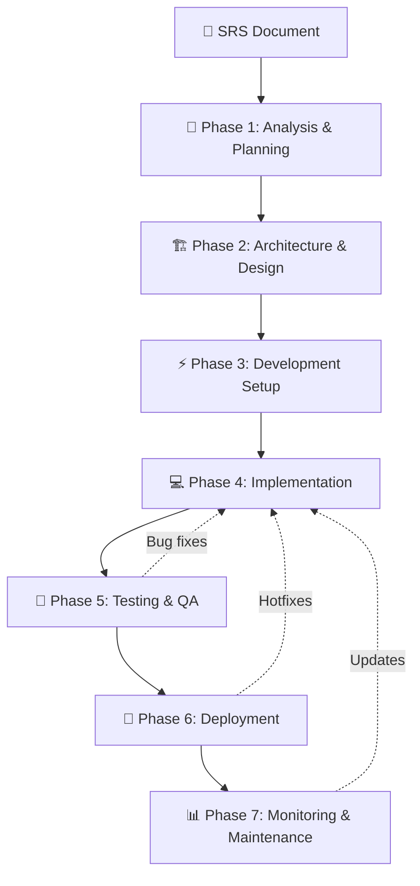

# 🚀 Quy Trình Hoàn Chỉnh Xây Dựng Phần Mềm Sau Khi Có SRS

## 📋 Tổng Quan Quy Trình



---

## 🎯 Phase 1: Analysis & Planning (1-2 tuần)

### **1.1 SRS Deep Dive Analysis**
```bash
📊 Deliverables:
├── requirements-breakdown/
│   ├── functional-requirements-matrix.xlsx    # Map FR to complexity
│   ├── non-functional-requirements-audit.md   # NFR feasibility
│   ├── dependencies-analysis.md               # Inter-feature dependencies
│   └── risk-assessment.md                     # Technical & business risks
```

### **1.2 Project Estimation & Planning**
```bash
📋 Planning Documents:
├── project-estimation/
│   ├── story-points-breakdown.xlsx            # Feature complexity scoring
│   ├── timeline-gantt-chart.pdf               # Project timeline
│   ├── resource-allocation.md                 # Team assignment
│   └── milestone-definition.md                # Key deliverables
```

### **1.3 Technology Stack Validation**
```bash
🔧 Tech Decisions:
├── tech-stack-analysis/
│   ├── architecture-decisions-record.md       # ADR for major decisions
│   ├── technology-comparison-matrix.xlsx      # Tools evaluation
│   ├── proof-of-concept-results.md           # PoC findings
│   └── tech-stack-final-selection.md         # Final tech choices
```

---

## 🏗️ Phase 2: Architecture & Design (2-3 tuần)

### **2.1 System Architecture Design**
```bash
🏛️ Architecture Documents:
├── system-architecture/
│   ├── high-level-architecture.md             # System overview
│   ├── microservices-boundaries.md            # Service decomposition
│   ├── data-flow-diagrams.md                  # Information flow
│   ├── integration-patterns.md                # Service communication
│   └── scalability-strategy.md                # Performance planning
```

### **2.2 Database Design**
```bash
🗄️ Database Design:
├── database-design/
│   ├── logical-data-model.sql                 # ERD + relationships
│   ├── physical-database-schema.sql           # Tables, indexes, constraints
│   ├── data-migration-strategy.md             # Migration planning
│   └── database-optimization.md               # Performance tuning
```

### **2.3 API Design**
```bash
🔌 API Specifications:
├── api-design/
│   ├── openapi-specifications/                # Swagger/OpenAPI specs
│   ├── api-versioning-strategy.md             # Version management
│   ├── authentication-authorization.md        # Security design
│   └── rate-limiting-policies.md              # API governance
```

### **2.4 UI/UX Design**
```bash
🎨 Design Assets:
├── ui-ux-design/
│   ├── user-journey-maps.pdf                  # User experience flows
│   ├── wireframes/                            # Low-fidelity mockups
│   ├── high-fidelity-designs/                 # Final UI designs
│   ├── design-system-guide.md                 # Component library
│   └── accessibility-guidelines.md            # WCAG compliance
```

---

## ⚡ Phase 3: Development Setup (1-2 tuần)

### **3.1 Development Environment Setup**
```bash
🛠️ Dev Environment:
├── development-setup/
│   ├── local-development-guide.md             # Setup instructions
│   ├── docker-compose.yml                     # Local stack
│   ├── development-scripts/                   # Automation scripts
│   └── troubleshooting-guide.md               # Common issues
```

### **3.2 CI/CD Pipeline Setup**
```bash
🔄 DevOps Infrastructure:
├── ci-cd-setup/
│   ├── github-actions-workflows/              # CI/CD pipelines
│   ├── testing-automation.yml                 # Automated testing
│   ├── deployment-scripts/                    # Deployment automation
│   └── monitoring-setup.md                    # Observability stack
```

### **3.3 Code Standards & Guidelines**
```bash
📏 Development Standards:
├── coding-standards/
│   ├── code-style-guide.md                    # Coding conventions
│   ├── git-workflow.md                        # Branching strategy
│   ├── code-review-checklist.md               # Review guidelines
│   └── testing-standards.md                   # Testing best practices
```

---

## 💻 Phase 4: Implementation (4-8 tuần - song song)

### **4.1 Sprint Planning & Execution**
```bash
🏃‍♂️ Agile Development:
├── sprint-management/
│   ├── sprint-planning-templates/             # Sprint planning docs
│   ├── daily-standup-format.md                # Standup structure
│   ├── sprint-review-retrospective.md         # Agile ceremonies
│   └── backlog-management.md                  # Product backlog
```

### **4.2 Feature Development Process**
```bash
⚙️ Development Workflow:
├── feature-development/
│   ├── feature-branch-workflow.md             # Git flow
│   ├── code-implementation-checklist.md       # Dev checklist
│   ├── unit-testing-requirements.md           # Testing standards
│   └── documentation-as-code.md               # Code documentation
```

### **4.3 Integration Development**
```bash
🔗 Integration Work:
├── integration-development/
│   ├── api-integration-testing.md             # API testing
│   ├── third-party-integration.md             # External APIs
│   ├── database-integration.md                # Data layer testing
│   └── end-to-end-testing.md                  # E2E test scenarios
```

---

## 🧪 Phase 5: Testing & QA (2-3 tuần)

### **5.1 Testing Strategy Implementation**
```bash
🔍 Testing Framework:
├── testing-strategy/
│   ├── test-plan-document.md                  # Comprehensive test plan
│   ├── test-case-specifications/              # Detailed test cases
│   ├── automated-testing-suite/               # Test automation
│   └── performance-testing-plan.md            # Load testing strategy
```

### **5.2 Quality Assurance Process**
```bash
✅ QA Process:
├── qa-process/
│   ├── bug-tracking-workflow.md               # Issue management
│   ├── test-execution-reports/                # Testing results
│   ├── regression-testing-plan.md             # Regression strategy
│   └── user-acceptance-testing.md             # UAT procedures
```

### **5.3 Security & Compliance Testing**
```bash
🔒 Security Testing:
├── security-testing/
│   ├── penetration-testing-report.pdf         # Security audit
│   ├── vulnerability-assessment.md            # Security scan results
│   ├── compliance-checklist.md                # GDPR/PDPA compliance
│   └── security-fix-implementation.md         # Security remediation
```

---

## 🚀 Phase 6: Deployment (1-2 tuần)

### **6.1 Deployment Strategy**
```bash
🎯 Deployment Planning:
├── deployment-strategy/
│   ├── environment-setup-guide.md             # Staging/Production setup
│   ├── blue-green-deployment.md               # Zero-downtime deployment
│   ├── rollback-procedures.md                 # Disaster recovery
│   └── go-live-checklist.md                   # Production readiness
```

### **6.2 Production Deployment**
```bash
🌐 Production Setup:
├── production-deployment/
│   ├── infrastructure-provisioning/           # Cloud infrastructure
│   ├── application-deployment-scripts/        # Deployment automation
│   ├── database-migration-scripts/            # DB updates
│   └── monitoring-alerting-setup/             # Observability
```

### **6.3 Go-Live Support**
```bash
🆘 Launch Support:
├── go-live-support/
│   ├── launch-day-runbook.md                  # Launch procedures
│   ├── incident-response-plan.md              # Emergency procedures
│   ├── user-training-materials/               # End-user documentation
│   └── support-escalation-matrix.md           # Support structure
```

---

## 📊 Phase 7: Monitoring & Maintenance (Ongoing)

### **7.1 Monitoring & Observability**
```bash
📈 Monitoring Setup:
├── monitoring-maintenance/
│   ├── application-monitoring.md              # APM setup
│   ├── infrastructure-monitoring.md           # Infrastructure metrics
│   ├── business-metrics-dashboard.md          # Business KPIs
│   └── alerting-notification-setup.md         # Alert management
```

### **7.2 Maintenance & Support**
```bash
🔧 Ongoing Maintenance:
├── maintenance-support/
│   ├── maintenance-schedule.md                # Regular maintenance
│   ├── backup-recovery-procedures.md          # Data protection
│   ├── performance-optimization.md            # Performance tuning
│   └── user-feedback-collection.md            # Continuous improvement
```

### **7.3 Continuous Improvement**
```bash
🔄 Improvement Process:
├── continuous-improvement/
│   ├── feature-enhancement-backlog.md         # Future features
│   ├── technical-debt-management.md           # Code quality
│   ├── performance-optimization-plan.md       # System optimization
│   └── user-feedback-analysis.md              # User experience improvement
```

---

## 🎯 Success Metrics & KPIs

### **Development Metrics:**
- ✅ **Code Quality**: >90% test coverage, <5% bug rate
- ✅ **Performance**: All NFRs met (response time, throughput)
- ✅ **Security**: Zero critical vulnerabilities
- ✅ **Documentation**: 100% API documentation coverage

### **Project Metrics:**
- ✅ **Timeline**: On-time delivery per milestone
- ✅ **Budget**: Within budget constraints
- ✅ **Quality**: User acceptance >95%
- ✅ **Team Performance**: Sprint velocity consistency

### **Business Metrics:**
- ✅ **User Adoption**: Target user engagement
- ✅ **System Reliability**: 99.9% uptime
- ✅ **Scalability**: Handle projected load
- ✅ **ROI**: Business value delivery

---

## 🛠️ Tools & Technologies By Phase

### **Planning & Analysis Tools:**
- **Project Management**: Jira, Azure DevOps, Monday.com
- **Documentation**: Confluence, Notion, GitBook
- **Estimation**: Planning Poker, Fibonacci estimation

### **Design & Architecture Tools:**
- **Architecture**: Draw.io, Lucidchart, PlantUML
- **Database**: ERDPlus, MySQL Workbench, pgAdmin
- **API Design**: Postman, Insomnia, Swagger Editor

### **Development Tools:**
- **IDEs**: VS Code, IntelliJ, Visual Studio
- **Version Control**: Git, GitHub, GitLab
- **Containerization**: Docker, Kubernetes

### **Testing Tools:**
- **Unit Testing**: Jest, JUnit, pytest
- **Integration Testing**: Cypress, Selenium, Postman
- **Performance Testing**: K6, JMeter, Artillery

### **Deployment & Monitoring:**
- **CI/CD**: GitHub Actions, Jenkins, Azure Pipelines
- **Infrastructure**: Terraform, Ansible, CloudFormation
- **Monitoring**: Prometheus, Grafana, DataDog

---

**Đây là quy trình hoàn chỉnh từ SRS đến production! Mỗi phase có deliverables cụ thể và success criteria rõ ràng. Bạn muốn tôi detail hóa phase nào? 🚀**
