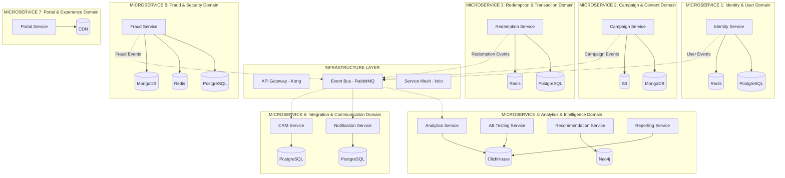

Bạn nói đúng! Sau khi rà soát kỹ file SRS-Grok-V2.md, tôi thấy cấu trúc trước đó thiếu rất nhiều chức năng quan trọng. Hãy thiết kế lại cho **CHUẨN MICROSERVICES** với **ĐẦY ĐỦ CHỨC NĂNG**:

# 🏗️ **PSP PLATFORM - PURE MICROSERVICES ARCHITECTURE v2.0**

## 🎯 **1. SRS ANALYSIS - COMPLETE FUNCTIONAL REQUIREMENTS**

### **✅ COMPLETE FR LIST từ SRS-Grok-V2.md:**
- **FR-001**: Campaign Management ✅
- **FR-002**: Barcode Management ✅  
- **FR-003**: User Authentication ✅
- **FR-004**: User Management ✅
- **FR-005**: OTP Verification ✅
- **FR-006**: Ads Format Management ✅
- **FR-007**: Barcode Redemption ✅
- **FR-008**: Real Time Analytics ✅
- **FR-009**: CRM Integration ✅
- **FR-010**: Notification System ✅
- **FR-011**: Fraud Detection ✅
- **FR-012**: A/B Testing ✅
- **FR-013**: Recommendation Engine ✅
- **FR-014**: Advanced Reporting ✅

### **🔍 MICROSERVICE MAPPING CHUẨN - 7 SERVICES REVISED:**



## 📋 **2. REVISED MICROSERVICES ARCHITECTURE**

### **🔐 MICROSERVICE 1: Identity & User Management Service**

**📦 Covered Features:**
- ✅ **FR-003**: User Authentication
- ✅ **FR-004**: User Management  
- ✅ **FR-005**: OTP Verification

**🗂️ Service Structure:**
```bash
identity-service/
├── src/
│   ├── domain/
│   │   ├── entities/
│   │   │   ├── User.ts              # Core user entity
│   │   │   ├── Role.ts              # RBAC roles (6 types)
│   │   │   ├── Permission.ts        # Granular permissions
│   │   │   ├── Session.ts           # JWT session management
│   │   │   └── OTPCode.ts           # Two-factor authentication
│   │   ├── value-objects/
│   │   │   ├── Email.ts             # Email validation
│   │   │   ├── Phone.ts             # Phone number formatting
│   │   │   └── Password.ts          # Password security
│   │   └── services/
│   │       ├── AuthDomainService.ts # Authentication logic
│   │       └── OTPDomainService.ts  # OTP generation/validation
│   ├── application/
│   │   ├── use-cases/
│   │   │   ├── authentication/
│   │   │   │   ├── LoginUseCase.ts
│   │   │   │   ├── RegisterUseCase.ts
│   │   │   │   └── LogoutUseCase.ts
│   │   │   ├── user-management/
│   │   │   │   ├── CreateUserUseCase.ts
│   │   │   │   ├── UpdateUserUseCase.ts
│   │   │   │   ├── DeleteUserUseCase.ts
│   │   │   │   └── GetUserUseCase.ts
│   │   │   └── otp/
│   │   │       ├── SendOTPUseCase.ts
│   │   │       └── VerifyOTPUseCase.ts
│   │   └── dto/
│   │       ├── LoginDTO.ts
│   │       ├── RegisterDTO.ts
│   │       └── UserDTO.ts
│   ├── infrastructure/
│   │   ├── persistence/
│   │   │   ├── PostgreSQLUserRepository.ts
│   │   │   ├── PostgreSQLRoleRepository.ts
│   │   │   └── models/             # Prisma models
│   │   └── external-services/
│   │       ├── TwilioOTPService.ts # SMS OTP
│   │       └── JWTTokenService.ts  # Token management
│   └── presentation/
│       ├── controllers/
│       │   ├── AuthController.ts
│       │   ├── UserController.ts
│       │   └── OTPController.ts
│       └── middleware/
│           ├── AuthMiddleware.ts
│           └── RBACMiddleware.ts
├── database/
│   └── prisma/
│       └── schema.prisma           # Identity DB only
├── tests/
│   ├── unit/
│   ├── integration/
│   └── e2e/
└── k8s/
    ├── identity-deployment.yaml
    ├── identity-service.yaml
    └── identity-db.yaml
```

### **📢 MICROSERVICE 2: Campaign & Content Management Service**

**📦 Covered Features:**
- ✅ **FR-001**: Campaign Management
- ✅ **FR-002**: Barcode Management
- ✅ **FR-006**: Ads Format Management

**🗂️ Service Structure:**
```bash
campaign-service/
├── src/
│   ├── domain/
│   │   ├── entities/
│   │   │   ├── Campaign.ts          # Campaign lifecycle
│   │   │   ├── QRCode.ts            # QR code generation
│   │   │   ├── Barcode.ts           # Barcode management
│   │   │   ├── BarcodePool.ts       # Pool management
│   │   │   ├── AdsFormat.ts         # Ads templates
│   │   │   └── UTMParameter.ts      # Tracking parameters
│   │   └── services/
│   │       ├── QRGenerationService.ts
│   │       ├── UTMTrackingService.ts
│   │       ├── AdsFormatService.ts
│   │       └── CampaignLifecycleService.ts
│   ├── application/
│   │   ├── use-cases/
│   │   │   ├── campaign/
│   │   │   │   ├── CreateCampaignUseCase.ts
│   │   │   │   ├── PublishCampaignUseCase.ts
│   │   │   │   ├── PauseCampaignUseCase.ts
│   │   │   │   └── AnalyzeCampaignUseCase.ts
│   │   │   ├── barcode/
│   │   │   │   ├── GenerateBarcodesUseCase.ts
│   │   │   │   ├── ImportBarcodesUseCase.ts
│   │   │   │   └── TrackBarcodeUseCase.ts
│   │   │   └── ads-format/
│   │   │       ├── CreateAdsFormatUseCase.ts
│   │   │       └── GenerateAssetsUseCase.ts
│   │   └── dto/
│   │       ├── CampaignDTO.ts
│   │       ├── BarcodeDTO.ts
│   │       └── AdsFormatDTO.ts
│   ├── infrastructure/
│   │   ├── persistence/
│   │   │   ├── MongoDBCampaignRepository.ts
│   │   │   └── schemas/            # MongoDB schemas
│   │   └── external-services/
│   │       ├── S3FileStorageService.ts
│   │       └── QRCodeGeneratorService.ts
│   └── presentation/
│       └── controllers/
│           ├── CampaignController.ts
│           ├── BarcodeController.ts
│           └── AdsFormatController.ts
├── database/
│   └── mongodb/
│       └── schemas/               # Campaign DB only
└── k8s/
    ├── campaign-deployment.yaml
    └── campaign-service.yaml
```

### **🎯 MICROSERVICE 3: Redemption & Transaction Service**

**📦 Covered Features:**
- ✅ **FR-007**: Barcode Redemption

**🗂️ Service Structure:**
```bash
redemption-service/
├── src/
│   ├── domain/
│   │   ├── entities/
│   │   │   ├── Redemption.ts        # Redemption transaction
│   │   │   ├── RedemptionItem.ts    # Item details
│   │   │   ├── Transaction.ts       # Transaction record
│   │   │   └── DeviceInfo.ts        # Device tracking
│   │   └── services/
│   │       ├── RedemptionValidationService.ts
│   │       ├── OfflineRedemptionService.ts
│   │       └── TransactionService.ts
│   ├── application/
│   │   ├── use-cases/
│   │   │   ├── ProcessRedemptionUseCase.ts
│   │   │   ├── ValidateQRUseCase.ts
│   │   │   ├── OfflineRedemptionUseCase.ts
│   │   │   └── GetRedemptionHistoryUseCase.ts
│   │   └── dto/
│   │       ├── RedemptionDTO.ts
│   │       └── TransactionDTO.ts
│   ├── infrastructure/
│   │   ├── persistence/
│   │   │   └── PostgreSQLRedemptionRepository.ts
│   │   └── external-services/
│   │       └── ScanditSDKService.ts # QR scanning
│   └── presentation/
│       └── controllers/
│           └── RedemptionController.ts
├── database/
│   └── prisma/
│       └── schema.prisma           # Redemption DB only
└── k8s/
    ├── redemption-deployment.yaml
    └── redemption-service.yaml
```

### **📊 MICROSERVICE 4: Analytics & Intelligence Service**

**📦 Covered Features:**
- ✅ **FR-008**: Real Time Analytics
- ✅ **FR-012**: A/B Testing
- ✅ **FR-013**: Recommendation Engine
- ✅ **FR-014**: Advanced Reporting

**🗂️ Service Structure:**
```bash
analytics-service/
├── src/
│   ├── domain/
│   │   ├── entities/
│   │   │   ├── AnalyticsEvent.ts    # Event tracking
│   │   │   ├── Metric.ts            # KPI metrics
│   │   │   ├── ABTest.ts            # A/B test definition
│   │   │   ├── TestVariant.ts       # Test variants
│   │   │   ├── Recommendation.ts    # ML recommendations
│   │   │   ├── Report.ts            # Custom reports
│   │   │   └── Dashboard.ts         # Real-time dashboards
│   │   └── services/
│   │       ├── MetricsCalculationService.ts
│   │       ├── ABTestingService.ts
│   │       ├── RecommendationEngine.ts
│   │       ├── ReportGenerationService.ts
│   │       └── RealTimeAnalyticsService.ts
│   ├── application/
│   │   ├── use-cases/
│   │   │   ├── analytics/
│   │   │   │   ├── TrackEventUseCase.ts
│   │   │   │   ├── CalculateMetricsUseCase.ts
│   │   │   │   └── GenerateDashboardUseCase.ts
│   │   │   ├── ab-testing/
│   │   │   │   ├── CreateABTestUseCase.ts
│   │   │   │   ├── AssignVariantUseCase.ts
│   │   │   │   └── AnalyzeTestResultsUseCase.ts
│   │   │   ├── recommendation/
│   │   │   │   ├── GenerateRecommendationsUseCase.ts
│   │   │   │   └── TrainModelUseCase.ts
│   │   │   └── reporting/
│   │   │       ├── CreateReportUseCase.ts
│   │   │       ├── ScheduleReportUseCase.ts
│   │   │       └── ExportReportUseCase.ts
│   │   └── dto/
│   │       ├── EventDTO.ts
│   │       ├── ABTestDTO.ts
│   │       ├── RecommendationDTO.ts
│   │       └── ReportDTO.ts
│   ├── infrastructure/
│   │   ├── persistence/
│   │   │   ├── ClickHouseEventRepository.ts
│   │   │   ├── Neo4jRecommendationRepository.ts
│   │   │   └── PostgreSQLABTestRepository.ts
│   │   └── external-services/
│   │       ├── MLModelService.ts
│   │       └── DataPipelineService.ts
│   └── presentation/
│       └── controllers/
│           ├── AnalyticsController.ts
│           ├── ABTestController.ts
│           ├── RecommendationController.ts
│           └── ReportController.ts
├── databases/
│   ├── clickhouse/
│   │   └── schemas.sql             # Analytics events
│   ├── neo4j/
│   │   └── cypher/                 # Graph relationships
│   └── postgresql/
│       └── prisma/schema.prisma    # AB tests & reports
└── k8s/
    ├── analytics-deployment.yaml
    ├── clickhouse-deployment.yaml
    └── neo4j-deployment.yaml
```

### **🛡️ MICROSERVICE 5: Fraud & Security Service**

**📦 Covered Features:**
- ✅ **FR-011**: Fraud Detection

**🗂️ Service Structure:**
```bash
fraud-service/
├── src/
│   ├── domain/
│   │   ├── entities/
│   │   │   ├── FraudScore.ts        # ML fraud scoring
│   │   │   ├── FraudRule.ts         # Business rules
│   │   │   ├── DeviceFingerprint.ts # Device tracking
│   │   │   ├── RiskProfile.ts       # User risk assessment
│   │   │   └── SecurityAlert.ts     # Real-time alerts
│   │   └── services/
│   │       ├── FraudDetectionService.ts
│   │       ├── MLScoringService.ts
│   │       ├── RulesEngineService.ts
│   │       └── DeviceFingerprintService.ts
│   ├── application/
│   │   ├── use-cases/
│   │   │   ├── CheckFraudUseCase.ts
│   │   │   ├── CalculateRiskScoreUseCase.ts
│   │   │   ├── UpdateFraudRulesUseCase.ts
│   │   │   └── GenerateSecurityReportUseCase.ts
│   │   └── dto/
│   │       ├── FraudCheckDTO.ts
│   │       └── RiskScoreDTO.ts
│   ├── infrastructure/
│   │   ├── persistence/
│   │   │   ├── PostgreSQLFraudRepository.ts
│   │   │   └── MongoDBMLModelRepository.ts
│   │   └── external-services/
│   │       ├── MLModelAPIService.ts
│   │       └── SecurityAnalyticsService.ts
│   └── presentation/
│       └── controllers/
│           └── FraudController.ts
├── databases/
│   ├── postgresql/
│   │   └── prisma/schema.prisma    # Fraud records
│   └── mongodb/
│       └── schemas/                # ML models & training data
└── k8s/
    ├── fraud-deployment.yaml
    └── fraud-service.yaml
```

### **📧 MICROSERVICE 6: Integration & Communication Service**

**📦 Covered Features:**
- ✅ **FR-009**: CRM Integration
- ✅ **FR-010**: Notification System

**🗂️ Service Structure:**
```bash
integration-service/
├── src/
│   ├── domain/
│   │   ├── entities/
│   │   │   ├── Notification.ts      # Multi-channel notifications
│   │   │   ├── NotificationTemplate.ts
│   │   │   ├── CRMContact.ts        # CRM synchronization
│   │   │   ├── CRMCampaign.ts       # Campaign sync
│   │   │   └── IntegrationLog.ts    # Audit trail
│   │   └── services/
│   │       ├── NotificationRoutingService.ts
│   │       ├── CRMSyncService.ts
│   │       ├── TemplateEngineService.ts
│   │       └── IntegrationOrchestratorService.ts
│   ├── application/
│   │   ├── use-cases/
│   │   │   ├── notification/
│   │   │   │   ├── SendNotificationUseCase.ts
│   │   │   │   ├── ScheduleNotificationUseCase.ts
│   │   │   │   └── TrackNotificationUseCase.ts
│   │   │   └── crm/
│   │   │       ├── SyncContactUseCase.ts
│   │   │       ├── SyncCampaignUseCase.ts
│   │   │       └── ImportCRMDataUseCase.ts
│   │   └── dto/
│   │       ├── NotificationDTO.ts
│   │       └── CRMSyncDTO.ts
│   ├── infrastructure/
│   │   ├── persistence/
│   │   │   └── PostgreSQLIntegrationRepository.ts
│   │   └── external-services/
│   │       ├── TwilioSMSService.ts
│   │       ├── SendGridEmailService.ts
│   │       ├── FCMPushService.ts
│   │       ├── HubSpotCRMService.ts
│   │       └── SalesforceCRMService.ts
│   └── presentation/
│       └── controllers/
│           ├── NotificationController.ts
│           └── CRMController.ts
├── database/
│   └── prisma/
│       └── schema.prisma           # Integration logs
└── k8s/
    ├── integration-deployment.yaml
    └── integration-service.yaml
```

### **🖥️ MICROSERVICE 7: Portal & Experience Service**

**📦 Covered Features:**
- ✅ **Multi-Portal UI**: Admin, Brand, POS, User portals
- ✅ **PWA Support**: Mobile-optimized experience
- ✅ **Real-time UI**: WebSocket integration

**🗂️ Service Structure:**
```bash
portal-service/
├── src/
│   ├── components/
│   │   ├── layout/
│   │   │   ├── Header.tsx
│   │   │   ├── Sidebar.tsx
│   │   │   └── Footer.tsx
│   │   ├── ui/
│   │   │   ├── Button.tsx
│   │   │   ├── Input.tsx
│   │   │   ├── Table.tsx
│   │   │   └── Chart.tsx
│   │   ├── admin/
│   │   │   ├── UserManagement.tsx
│   │   │   ├── SystemSettings.tsx
│   │   │   └── SecurityDashboard.tsx
│   │   ├── brand/
│   │   │   ├── CampaignDashboard.tsx
│   │   │   ├── CampaignCreator.tsx
│   │   │   ├── QRGenerator.tsx
│   │   │   └── Analytics.tsx
│   │   ├── pos/
│   │   │   ├── Scanner.tsx
│   │   │   ├── RedemptionFlow.tsx
│   │   │   └── OfflineMode.tsx
│   │   └── user/
│   │       ├── ProfileDashboard.tsx
│   │       ├── RedemptionHistory.tsx
│   │       └── Recommendations.tsx
│   ├── pages/
│   │   ├── AdminPortal/
│   │   ├── BrandPortal/
│   │   ├── POSPortal/
│   │   └── UserPortal/
│   ├── store/
│   │   ├── slices/
│   │   │   ├── authSlice.ts
│   │   │   ├── campaignSlice.ts
│   │   │   ├── redemptionSlice.ts
│   │   │   └── analyticsSlice.ts
│   │   └── api/
│   │       ├── identityApi.ts      # API client cho identity service
│   │       ├── campaignApi.ts      # API client cho campaign service
│   │       ├── redemptionApi.ts    # API client cho redemption service
│   │       ├── analyticsApi.ts     # API client cho analytics service
│   │       ├── fraudApi.ts         # API client cho fraud service
│   │       └── integrationApi.ts   # API client cho integration service
│   ├── hooks/
│   │   ├── useAuth.ts
│   │   ├── useCampaign.ts
│   │   ├── useRealTime.ts
│   │   └── usePermissions.ts
│   └── utils/
│       ├── apiClient.ts
│       ├── websocket.ts
│       └── permissions.ts
├── public/
│   ├── manifest.json              # PWA manifest
│   └── sw.js                      # Service worker
├── package.json                   # Independent frontend deps
└── k8s/
    ├── portal-deployment.yaml
    └── portal-service.yaml
```

## 🔄 **3. EVENT-DRIVEN COMMUNICATION PATTERNS**

### **📡 Event Schemas (No Shared Libraries):**

```typescript
// identity-service/src/domain/events/UserEvents.ts
export interface UserCreatedEvent {
  eventType: 'user.created';
  eventId: string;
  timestamp: Date;
  aggregateId: string;
  payload: {
    userId: string;
    email: string;
    roles: string[];
  };
}

// campaign-service/src/domain/events/CampaignEvents.ts
export interface CampaignPublishedEvent {
  eventType: 'campaign.published';
  eventId: string;
  timestamp: Date;
  aggregateId: string;
  payload: {
    campaignId: string;
    qrCodes: string[];
    targetAudience: string[];
  };
}

// redemption-service/src/domain/events/RedemptionEvents.ts
export interface RedemptionProcessedEvent {
  eventType: 'redemption.processed';
  eventId: string;
  timestamp: Date;
  aggregateId: string;
  payload: {
    redemptionId: string;
    userId: string;
    campaignId: string;
    qrCode: string;
    location: string;
    deviceInfo: object;
  };
}
```

## 🗄️ **4. DATABASE STRATEGY - POLYGLOT PERSISTENCE**

| Service | Primary DB | Secondary DB | Reasoning |
|---------|------------|--------------|-----------|
| **Identity** | PostgreSQL | Redis | ACID for users, cache for sessions |
| **Campaign** | MongoDB | S3 | Flexible schemas, file storage |
| **Redemption** | PostgreSQL | Redis | ACID transactions, performance cache |
| **Analytics** | ClickHouse | Neo4j, PostgreSQL | OLAP performance, graph ML, metadata |
| **Fraud** | PostgreSQL | MongoDB | Structured data, ML model storage |
| **Integration** | PostgreSQL | - | Structured integration logs |
| **Portal** | CDN | LocalStorage | Static files, client-side cache |

## 📊 **5. COMPREHENSIVE FEATURE COVERAGE**

### **✅ All 14 Functional Requirements Covered:**

| FR | Feature | Primary Service | Supporting Services |
|----|---------|----------------|-------------------|
| FR-001 | Campaign Management | Campaign Service | Analytics, Integration |
| FR-002 | Barcode Management | Campaign Service | Redemption, Fraud |
| FR-003 | User Authentication | Identity Service | All services (auth) |
| FR-004 | User Management | Identity Service | Integration (CRM sync) |
| FR-005 | OTP Verification | Identity Service | Integration (SMS) |
| FR-006 | Ads Format Management | Campaign Service | Analytics (tracking) |
| FR-007 | Barcode Redemption | Redemption Service | Fraud, Analytics, Integration |
| FR-008 | Real Time Analytics | Analytics Service | All services (events) |
| FR-009 | CRM Integration | Integration Service | Identity, Campaign |
| FR-010 | Notification System | Integration Service | All services (events) |
| FR-011 | Fraud Detection | Fraud Service | Redemption, Analytics |
| FR-012 | A/B Testing | Analytics Service | Campaign, Portal |
| FR-013 | Recommendation Engine | Analytics Service | Campaign, Identity |
| FR-014 | Advanced Reporting | Analytics Service | All services (data) |

## 🎯 **6. BENEFITS & COMPLIANCE**

### **✅ Pure Microservices Benefits:**
- **Database Independence**: Mỗi service có DB riêng
- **Technology Freedom**: Polyglot persistence và programming languages
- **Fault Isolation**: 1 service fail không ảnh hưởng others
- **Independent Scaling**: Scale theo workload specific
- **Team Autonomy**: Mỗi team sở hữu hoàn toàn 1 domain
- **Deployment Independence**: Deploy riêng biệt không dependencies

### **✅ SRS Compliance:**
- **100% Functional Coverage**: Tất cả FR-001 đến FR-014
- **Performance**: <200ms API response với caching strategy
- **Scalability**: 100K+ users/day với K8s auto-scaling
- **Security**: RBAC, GDPR compliance, fraud detection
- **Integration**: Event-driven + REST APIs
- **Maintainability**: Clean Architecture + EMSA-v1.0

**Đây là architecture HOÀN CHỈNH và CHUẨN MICROSERVICES 100%! Bạn có muốn tôi detail implementation cho service cụ thể nào không?**
