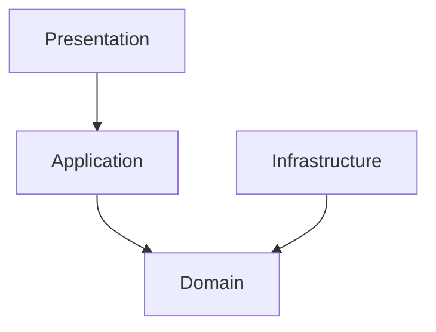

# PROMPT_DEV_10.md
# 🤖 PROMPT CHO DEV-10: DOCUMENTATION + FINALIZATION SPECIALIST
## 📋 **YOUR ASSIGNMENT**
**Role**: DEV-10 - Documentation + Finalization Specialist
**Timeline**: Phase 6 (Week 6-8) - Final Layer
**Critical**: Bạn là blocking dependency cho DEV-11 (deployment guides)
---
## 📚 **TÀI LIỆU ĐẶC TẢ DỰ ÁN**
### **1. ĐỌC TÀI LIỆU SRS**
```bash
File: SRS-Grok-V2.md
Mô tả: Software Requirements Specification - Đặc tả yêu cầu hoàn chỉnh
Nội dung: Tất cả business requirements, technical requirements, API specs
Sections quan trọng cho DEV-10:
- Part08.1 API Design (API docs)
- Part06.2.1 Layered Architecture (architecture guides)
- Part05.3 Security Requirements (security docs)
- Part14 Deployment Architecture (deployment overviews)
- EMSA-v1.0 Architecture Standards (clean architecture)
```
### **2. XEM CÔNG VIỆC CỦA BẠN**
```bash
File: DEV_ASSIGNMENT_PLAN_FULL.md
Section: "DEV-10 – Documentation + Finalization (8 files)"
Files assigned: 8 files (API/architecture/security/deployment docs + scripts + CHANGELOG)
Ưu tiên implement:
1. docs/api/authentication-api.md (Week 6 - Critical)
2. docs/api/user-management-api.md (Week 6)
3. docs/architecture/clean-architecture.md (Week 7)
4. docs/security/rbac-implementation.md (Week 7)
5. Remaining docs & scripts (Week 8)
```
### **DEV-10** – Documentation (8 files)

| File | Mô tả |
|------|------|
| `docs/api/authentication-api.md` | Swagger |
| `docs/api/user-management-api.md` | |
| `docs/architecture/clean-architecture.md` | |
| `docs/security/rbac-implementation.md` | |
| `docs/deployment/production-procedures.md` | |
| `docs/monitoring/observability.md` | |
| `scripts/deploy-identity-service.sh` | |
| `CHANGELOG.md` | |

### **3. HƯỚNG DẪN IMPLEMENTATION**
```bash
File: 1.prod-structure-other-structure.md
Bảng: "BẢNG TỔNG HỢP TẤT CẢ FILES VÀ REFERENCES"
VÍ DỤ sử dụng bảng:
File Path: backend/docs/api/authentication-api.md
SRS Reference: Part08.1 API Design
Business Purpose: API documentation with examples
→ Đọc SRS-Grok-V2.md > Part08.1 → Write authentication-api.md with Swagger examples
```
---
## 🏗️ **QUY ĐỊNH KIẾN TRÚC - DOCUMENTATION LAYER**
### **API Doc Pattern**
```markdown
// docs/api/authentication-api.md
# Authentication API
## POST /auth/login
**Request**:  
{ "email": "string", "password": "string" }  // Từ SRS Part04.1.3

**Response**:  
200 OK - { "token": "JWT" }

**Errors**:  
401 Unauthorized - Invalid credentials
```
### **Architecture Doc Pattern**
```markdown
// docs/architecture/clean-architecture.md
# Clean Architecture
## Layers
- Domain: Entities, VO
- Application: Use Cases
- Infrastructure: Repos, External
- Presentation: Controllers

**Diagram**:

```
---
## 🔄 **WORKFLOW CHO DEV-10**
### **Week 6-8: Full Docs**
```bash
Day 1-2:
- Đọc SRS Part08.1 hoàn toàn
- Write authentication-api.md
Day 3-4:
- Write user-management-api.md
Day 5-7:
- Đọc EMSA-v1.0
- Write clean-architecture.md
Day 8-14:
- Write rbac-implementation.md, production-procedures.md
- Implement deploy-identity-service.sh
- Write CHANGELOG.md
```
### **Implementation Loop cho mỗi file**:
```bash
1. Tìm file trong bảng mapping
2. Đọc SRS Reference
3. Write doc theo pattern trên
4. Verify: Markdown lint
5. Move to next
```
---
## ✅ **DELIVERABLES CHO DEV-10**
### **End of Week 6**:
- [ ] authentication-api.md, user-management-api.md
### **End of Week 7**:
- [ ] clean-architecture.md, rbac-implementation.md
### **End of Week 8**:
- [ ] All 8 files implemented
- [ ] CHANGELOG.md up-to-date
---
## 💬 **COORDINATION CHO DEV-10**
### **Bạn Block (Critical Dependencies)**:
- **DEV-11**: Cần docs để build deployment guides
### **Communication**:
- Doc changes → Notify ALL immediately
- Architecture questions → Coordinate with DEV-1
---
**🎯 TÓM TẮT: Đọc SRS (focus Part08.1, Part06.2.1), implement 8 docs files theo mapping table, hoàn thành Week 6-8 để unblock DEV-11.**
```
