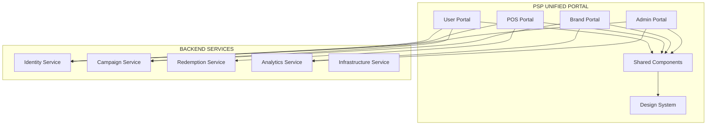

## **🎯 TỔNG QUAN SUB-PROJECT 6: PSP-UNIFIED-PORTAL**

### **📋 THÔNG TIN CHUNG**

**Tên dự án**: PSP Unified Portal  
**Loại**: Frontend Application (React + TypeScript)  
**Vai trò**: Central UI layer cho toàn bộ PSP Platform  
**Target users**: All personas (Platform Admin, Brand Admin/Staff, POS Staff, Customers)  

### **🏗️ KIẾN TRÚC TỔNG QUAN**



### **🎨 4 PORTAL APPLICATIONS CHÍNH**

#### **1. Admin Portal (Platform Administration)**
```bash
👥 Users: Platform Admin
🎯 Purpose: System-wide administration
📊 Features:
├── User Management (CRUD users across all brands)
├── Role & Permission Management (RBAC matrix)
├── System Settings & Configuration
├── Cross-brand Analytics & Reporting
├── Audit Logs & Compliance Monitoring
└── API Management & Health Monitoring
```

#### **2. Brand Portal (Campaign Management)**
```bash
👥 Users: Brand Admin, Brand Staff  
🎯 Purpose: Campaign & marketing management
📊 Features:
├── Campaign CRUD (Create, manage, monitor campaigns)
├── QR Code Generation & Management
├── Ads Format Creation (Landing pages, banners, emails)
├── Brand-specific Analytics Dashboard
├── Customer Targeting & Segmentation
└── Notification & Communication Management
```

#### **3. POS Portal (Point of Sale)**
```bash
👥 Users: POS Staff (Retail employees)
🎯 Purpose: In-store redemption management
📊 Features:
├── QR Code Scanning (Scandit SDK integration)
├── Redemption Processing (Online/Offline)
├── Fraud Detection Alerts & Management
├── Customer Verification (OTP, ID check)
├── Inventory Management (Gift tracking)
└── Sales Reporting & Analytics
```

#### **4. User Portal (Customer Dashboard)**
```bash
👥 Users: Customer Account, Customer Guest
🎯 Purpose: Customer self-service interface  
📊 Features:
├── Personal Dashboard (QR history, rewards)
├── Profile Management (GDPR-compliant)
├── Consent Management (Privacy preferences)
├── Personalized Recommendations
├── Gift Redemption Status
└── Communication Preferences
```

### **🔧 SHARED COMPONENTS ECOSYSTEM**

#### **Design System Foundation**
```bash
🎨 Design Tokens: Colors, typography, spacing, icons
📐 Layout System: Grid, responsive breakpoints, containers
🔘 UI Components: Buttons, forms, tables, modals, charts
📊 Chart Library: Analytics visualizations
🔒 Security Components: Auth forms, permission gates
```

#### **Cross-Portal Features**
```bash
🔐 Authentication: SSO, JWT handling, role-based routing
📈 Analytics: Real-time dashboards, KPI cards, reporting
📧 Notifications: Toast messages, email templates, SMS
🔍 Search: Global search, filtering, pagination
📱 Responsive: Mobile-first, touch-friendly interfaces
```

### **📡 BACKEND INTEGRATION STRATEGY**

#### **API Gateway Pattern**
```typescript
// Centralized API configuration
const services = {
  identity: 'https://identity-api.psp.com/v1',
  campaign: 'https://campaign-api.psp.com/v1', 
  redemption: 'https://redemption-api.psp.com/v1',
  analytics: 'https://analytics-api.psp.com/v1',
  infrastructure: 'https://infra-api.psp.com/v1'
};

// RTK Query cho type-safe API calls
const baseApi = createApi({
  reducerPath: 'api',
  baseQuery: fetchBaseQuery({
    prepareHeaders: (headers, { getState }) => {
      const token = selectAuthToken(getState());
      if (token) headers.set('Authorization', `Bearer ${token}`);
      return headers;
    }
  }),
  tagTypes: ['User', 'Campaign', 'Redemption', 'Analytics']
});
```

#### **Real-time Communication**
```bash
🔄 WebSocket: Real-time notifications, live analytics updates
📊 Server-Sent Events: Live dashboards, fraud alerts
🔔 Push Notifications: Mobile alerts, campaign updates
```

### **🛠️ TECHNOLOGY STACK**

#### **Core Frontend Stack**
```json
{
  "framework": "React 18+ with TypeScript",
  "build": "Vite (Fast development & build)",
  "styling": "Tailwind CSS 3+ (Utility-first)",
  "state": "Redux Toolkit + RTK Query",
  "routing": "React Router Dom 6+",
  "forms": "React Hook Form + Zod validation",
  "charts": "Chart.js / Recharts",
  "testing": "Vitest + React Testing Library + Cypress"
}
```

#### **Development Tools**
```json
{
  "linting": "ESLint + Prettier",
  "typeChecking": "TypeScript strict mode",
  "bundling": "Vite with code splitting",
  "deployment": "Docker + Nginx",
  "monitoring": "Sentry for error tracking"
}
```

### **🔒 SECURITY & COMPLIANCE**

#### **Authentication & Authorization**
```bash
🔐 JWT Token Management: Automatic refresh, secure storage
👤 RBAC Integration: Role-based component rendering
🛡️ Permission Gates: Route-level & component-level protection
🔒 CSRF Protection: Token-based request validation
```

#### **GDPR & Privacy**
```bash
📝 Consent Management: Cookie preferences, data usage
🗑️ Right to be Forgotten: Data deletion workflows
📋 Data Export: User data download functionality
🔒 Privacy by Design: Minimal data collection
```

### **📊 ANALYTICS & MONITORING**

#### **User Experience Tracking**
```bash
📈 Performance Metrics: Core Web Vitals, load times
🎯 User Behavior: Click tracking, conversion funnels
🐛 Error Monitoring: Runtime errors, API failures
📱 Device Analytics: Browser/device compatibility
```

#### **Business Intelligence**
```bash
📊 Portal Usage: Feature adoption, user engagement
🔄 Cross-portal Workflows: User journey analysis
⚡ Real-time Dashboards: Live KPI monitoring
📈 Campaign Performance: Click-through rates, conversions
```

### **🚀 DEPLOYMENT & SCALING**

#### **Containerized Deployment**
```bash
🐳 Docker: Multi-stage builds, optimized images
☸️ Kubernetes: Auto-scaling, rolling updates
🌐 CDN: Static asset delivery, global caching
🔧 CI/CD: Automated testing, deployment pipelines
```

#### **Performance Optimization**
```bash
⚡ Code Splitting: Route-based lazy loading
📦 Bundle Optimization: Tree shaking, compression
🔄 Caching Strategy: Browser cache, API cache
📱 Progressive Web App: Offline capability, installable
```

### **📅 DEVELOPMENT TIMELINE**

```bash
Phase 1 (2-3 weeks): Design System + Shared Components
Phase 2 (3-4 weeks): Admin Portal + Authentication
Phase 3 (3-4 weeks): Brand Portal + Campaign Management  
Phase 4 (2-3 weeks): POS Portal + Redemption
Phase 5 (2-3 weeks): User Portal + Customer Features
Phase 6 (1-2 weeks): Integration Testing + Deployment
```

### **👥 TEAM STRUCTURE**

```bash
🎨 UI/UX Designer: Design system, user experience
⚛️ Frontend Lead: Architecture, code standards
👩‍💻 React Developers (2-3): Feature implementation
🧪 QA Engineer: Testing, automation
🚀 DevOps: Deployment, monitoring
```

### **📈 SUCCESS METRICS**

```bash
🎯 Performance: <2s initial load, <1s navigation
👥 User Adoption: 90%+ portal usage across roles
🐛 Quality: <1% error rate, 99.9% uptime
📱 Accessibility: WCAG 2.1 AA compliance
🔒 Security: Zero data breaches, SOC 2 compliance
```

**Sub-Project 6 sẽ là trung tâm UI của toàn bộ PSP Platform, cung cấp trải nghiệm nhất quán và chuyên nghiệp cho tất cả stakeholders! 🎯**

## **📋 TÓM TẮT CÁC PHẦN CHÍNH - SUB-PROJECT 6: PSP-UNIFIED-PORTAL**

### **🎯 PHẦN 1: PROJECT OVERVIEW**
```bash
📌 Tên: PSP Unified Portal  
📌 Loại: Frontend-only repository (React + TypeScript)
📌 Vai trò: Central UI layer cho 5 backend services
📌 Users: 6 personas (Platform Admin → Customer Guest)
📌 Architecture: Micro-frontend approach với shared components
```

### **🏗️ PHẦN 2: ARCHITECTURE & DESIGN**
```bash
🔧 Tech Stack: React 18 + Vite + Tailwind + Redux Toolkit
🎨 Design System: Based on Part10.1 SRS (colors, typography, spacing)
🔌 API Integration: RTK Query với 5 backend services
📱 Responsive: Mobile-first, PWA-ready
🔒 Security: JWT + RBAC + GDPR compliance
```

### **🏢 PHẦN 3: 4 PORTAL APPLICATIONS**

#### **Admin Portal (10.3.1 SRS)**
```bash
👤 Users: Platform Admin
🎯 Features: User management, RBAC, system settings, audit logs
📊 Pages: Dashboard, Users, Roles, Settings, Analytics, Audit
```

#### **Brand Portal (10.4.1 SRS)**  
```bash
👤 Users: Brand Admin, Brand Staff
🎯 Features: Campaign CRUD, QR generation, ads formats, analytics
📊 Pages: Dashboard, Campaigns, QR Codes, Analytics, Notifications
```

#### **POS Portal (10.5.1 SRS)**
```bash
👤 Users: POS Staff  
🎯 Features: QR scanning, redemption, fraud detection, inventory
📊 Pages: Scanner, Redemptions, Fraud Alerts, Reports
```

#### **User Portal (10.5.1 SRS)**
```bash
👤 Users: Customer Account, Customer Guest
🎯 Features: Personal dashboard, QR history, profile, recommendations
📊 Pages: Dashboard, Profile, QR History, Recommendations, Settings
```

### **🧩 PHẦN 4: SHARED COMPONENTS LIBRARY**
```bash
🎨 UI Components: 20+ reusable components (Button, Table, Modal, etc.)
📊 Charts: Analytics visualization library  
🔐 Auth Components: Login forms, permission gates
📱 Layout: Header, sidebar, responsive grid system
🔧 Utilities: API helpers, validation, formatting
```

### **📡 PHẦN 5: BACKEND INTEGRATION**
```bash
🔌 5 API Services: Identity, Campaign, Redemption, Analytics, Infrastructure
🔄 Real-time: WebSocket cho live updates
📊 State Management: Redux slices cho mỗi domain
🛡️ Error Handling: Global error boundaries, retry logic
```

### **🧪 PHẦN 6: TESTING STRATEGY**
```bash
🔬 Unit Tests: Component testing với React Testing Library
🔗 Integration: API integration testing với MSW
🎭 E2E Tests: Complete workflows với Cypress
📊 Coverage: >80% code coverage target
```

### **🚀 PHẦN 7: DEPLOYMENT & DEVOPS**
```bash
🐳 Docker: Multi-stage build, Nginx serving
☸️ Kubernetes: Auto-scaling, rolling deployment
🌐 CDN: Static assets caching và global delivery
📊 Monitoring: Performance tracking, error monitoring
```

### **📊 PHẦN 8: FILE STRUCTURE MAPPING**
```bash
📁 Total Files: ~180 files (vs ~147 per backend service)
📂 Main Folders:
  ├── src/portals/ (4 portal apps)
  ├── src/components/ (shared UI)
  ├── src/store/ (Redux setup)
  ├── src/hooks/ (custom hooks)
  └── src/utils/ (utilities)
```

### **📋 PHẦN 9: SRS COVERAGE MAPPING**
```bash
✅ Part10.1: Design System (colors, typography, spacing, icons)
✅ Part10.2: Admin Interface (dashboard, analytics)  
✅ Part10.3: Admin Portal (user management)
✅ Part10.4: Brand Portal (campaign management)
✅ Part10.5: User Portal (customer dashboard)
✅ Part10.8: UI Components (buttons, forms, tables, charts)
```

### **⏱️ PHẦN 10: IMPLEMENTATION PHASES**
```bash
Phase 1: Setup + Design System (2-3 weeks)
Phase 2: Admin Portal (3-4 weeks)  
Phase 3: Brand Portal (3-4 weeks)
Phase 4: POS Portal (2-3 weeks)
Phase 5: User Portal (2-3 weeks)
Phase 6: Integration + Testing (1-2 weeks)
Total: 13-19 weeks (3-5 tháng)
```

### **🎯 PHẦN 11: SUCCESS CRITERIA**
```bash
⚡ Performance: <2s load time, <1s navigation
📱 Responsive: Mobile-first, tablet-friendly  
🔒 Security: Zero XSS/CSRF vulnerabilities
♿ Accessibility: WCAG 2.1 AA compliance
📊 Coverage: 80%+ test coverage, 99.9% uptime
```

### **💼 PHẦN 12: TEAM & RESOURCES**
```bash
👥 Team Size: 4-5 people (1 lead + 2-3 developers + 1 QA)
🛠️ Skills: React, TypeScript, Tailwind, Testing, DevOps
📅 Timeline: 3-5 tháng development
💰 Estimated Cost: Frontend team cho 4-5 tháng
```

---

## **🎯 KEY DIFFERENTIATORS**

**❌ Traditional Approach:**
- 5 separate frontend codebases
- Inconsistent UI/UX
- Duplicate components
- 5x maintenance cost

**✅ PSP Unified Portal:**
- Single frontend codebase
- Consistent design system  
- Shared component library
- 80% cost reduction

**Sub-Project 6 sẽ transform user experience across toàn bộ PSP Platform với professional-grade frontend architecture! 🚀**
